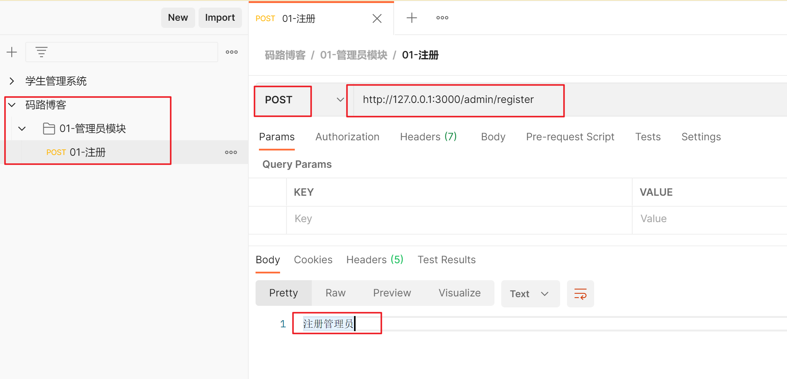

## 一，koa框架

### 1，koa框架介绍

官方文档：https://koa.bootcss.com/


Koa 是一个新的 web 框架，由 Express 幕后的原班人马打造， 致力于成为 web 应用和 API 开发领域中的一个更小、更富有表现力、更健壮的基石。 通过利用 async 函数，Koa 帮你丢弃回调函数，并有力地增强错误处理。 Koa 并没有捆绑任何中间件， 而是提供了一套优雅的方法，帮助您快速而愉快地编写服务端应用程序。


使用步骤：

- 创建文件夹 studyKoa
- 进入文件夹，生成项目配置文件 npm init -y
- 安装koa: npm i koa@2.13.4 -S
- 在studyKoa文件夹下，创建 01-搭建koa服务器.js


操作如下：


创建一台服务器：

```js
const Koa = require('koa');
const app = new Koa();

// app.use表示使用中间件
app.use(async ctx => {
  ctx.body = 'Hello World';
});

app.listen(3000);
```


测试之：


### 2，中间件


写代码演示两个中间件，如下：

```js
const Koa = require('koa');
const app = new Koa();

app.use(async (ctx,next) => {
    console.log(1)
    // 上一个中间件不调用next,不会走下一个中间件
    next();
});

app.use(async (ctx,next) => {
  ctx.body = 'Hello World';
});

app.listen(3000);
```


看如下代码，为什么结果是 1 2 3，如下：


在koa中，中间的执行流程是遵循洋葱模型，如下：


看一下，官方代码：

```js
const Koa = require('koa');
const app = new Koa();

// logger  日志中间件
app.use(async (ctx, next) => {
  console.log(1)
  await next();
  console.log(5)
  const rt = ctx.response.get('X-Response-Time');
  console.log(`${ctx.method} ${ctx.url} - ${rt}`);
});

// x-response-time  计算当前请求所消耗的时间
app.use(async (ctx, next) => {
  const start = Date.now();
  console.log(2)
  await next();
  console.log(4)
  const ms = Date.now() - start;
  ctx.set('X-Response-Time', `${ms}ms`);
});

// response
app.use(async ctx => {
  console.log(3)
  ctx.body = 'Hello World';
});

app.listen(3000);
```


### 3，错误监听


 每次修改了服务器代码，都需要重新启动服务器，为了方便，可以全局安装nodemon。安装之：

```shell
npm i nodemon -g
```


后面再启动服务器，通过nodemon这个工具来启动，如下：


添加error全局事件侦听器，如下：

```js
const Koa = require('koa');
const app = new Koa();

app.use(async ctx => {
    throw new Error("未知错误~~~~")
});

// 全局错误处理  目前的处理仅仅是后台打印
app.on("error",err=>{
    console.log('全局错误处理', err.message)
})

app.listen(3000);
```


### 4，手写错误处理中间件（给客户端提示）


现在没有提示：


写一个中间件，给出提示：

```js
const Koa = require('koa');
const app = new Koa();

// 错误处理中间件
app.use(async (ctx,next) => {
    try{
        await next();
    }catch(error){
        // console.log(error.statusCode)
        // console.log(error.status)
        // 给⽤户显示状态码
        ctx.status = error.statusCode || error.status || 500;
        // 如果是ajax请求,返回的是json错误数据
        ctx.type = "json"
        ctx.body = {
            ok:0,
            message:error.message
        }
    }
})

app.use(async ctx => {
    throw new Error("未知错误~~~~")
});

// 全局错误处理 后台打印
app.on("error",err=>{
    console.log('全局错误处理', err.message)
})

app.listen(3000);
```


### 5，日志中间件之koa-logger

**安装：** npm i koa-logger@3.2.1


上代码演示：

```js
const Koa = require('koa');
const logger = require('koa-logger')

const app = new Koa();

// 使用中间件
app.use(logger())

app.use(async ctx => {
    ctx.body = "hello koa~"
});

// 全局错误处理 后台打印
app.on("error",err=>{
    console.log('全局错误处理', err.message)
})

app.listen(3000);
```


### 6，第三方错误处理中间件

**安装：** npm i koa-onerror@4.2.0


使用之：

```js
const Koa = require('koa');
const logger = require('koa-logger')
const onerror = require('koa-onerror')

const app = new Koa();

// 使用中间件
app.use(logger())
onerror(app)

app.use(async ctx => {
    // const err = new Error("未授权");
    // err.status = 401;
    // throw err;
    ctx.throw(401,"未授权")
});

// 全局错误处理 后台打印
app.on("error",err=>{
    console.log('全局错误处理', err.message)
})

app.listen(3000);
```


### 7，路由中间件


安装： npm i @koa/router@10.1.1


创建router文件夹，在router文件夹下，创建user.js，再创建cart.js，如下：


用户模块路由，如下：

```js
// 路由就是一种特殊的中间件

const Router = require("@koa/router")
const router = new Router();
router.prefix("/user")

router.get("/",(ctx,next)=>{
    ctx.body = "用户管理"
})

module.exports = router;
```


购物车模块路由，如下：

```js
const Router = require("@koa/router")
const router = new Router();
router.prefix("/cart")

router.get("/",(ctx,next)=>{
    ctx.body = "购物车管理"
})

module.exports = router;
```


在入口中，导入上面的两个路由，如下：

```js
const Koa = require('koa');
const user = require("./router/user")
const cart = require("./router/cart")

const app = new Koa();

// 注册路由
app.use(user.routes())
user.allowedMethods();
app.use(cart.routes())
cart.allowedMethods();

app.listen(3000);
```


测试之：


### 8，接收get请求参数


get请求有两种形式把数据传递给后端： 

- 访问http://localhost:3000/user/3/1
- 访问http://localhost:3000/user?name=wc&age=18


代码演示：

```js
const Router = require("@koa/router")
const router = new Router();
router.prefix("/user")

// http://localhost:3000/user?name=wc&age=18
router.get("/",(ctx,next)=>{
    // 得到查询字符串参数
    console.log(ctx.query.name, ctx.query.age)
    ctx.body = "用户管理"
})

// 访问http://localhost:3000/user/3/1
router.get("/:id/:pid",(ctx,next)=>{
    // 得到路径参数
    console.log(ctx.params.id, ctx.params.pid);
    ctx.body = "用户管理"
})

module.exports = router;
```


效果如下：


### 9，接收post请求参数

安装：npm i koa-bodyparser@4.3.0


使用之，如下：

```js
const Koa = require('koa');
const user = require("./router/user")
const cart = require("./router/cart")
const bodyparser = require("koa-bodyparser")

const app = new Koa();

app.use(bodyparser())

// 注册路由
app.use(user.routes())
user.allowedMethods();
app.use(cart.routes())
cart.allowedMethods();

app.listen(3000);
```


接收前端post请求传递的数据，如下：

```js
const Router = require("@koa/router")
const router = new Router();
router.prefix("/cart")

router.post("/",(ctx,next)=>{
    // 接收前端post传递过来的数据
    console.log(ctx.request.body)
    ctx.body = {
        "ok":1
    }
})

module.exports = router;
```


测试之：


前端给后端传递一个json，如下：


### 10，重定向

定义登录注册路由，如下：

```js
const Router = require("@koa/router")
const router = new Router();

router.get("/login",(ctx,next)=>{
    // xxxxx

    // 当访问/login  重定向到/reg
    ctx.redirect("/reg")
    ctx.status = 301; // 301 表示重定向
})

router.get("/reg",(ctx,next)=>{
    ctx.body = "注册页面~"
})

module.exports = router;
```


注册路由：

```js
const Koa = require('koa');
const user = require("./router/user")
const cart = require("./router/cart")
const loginReg = require("./router/loginReg")
const bodyparser = require("koa-bodyparser")

const app = new Koa();

app.use(bodyparser())

// 注册路由
app.use(user.routes())
user.allowedMethods();
app.use(cart.routes())
cart.allowedMethods();
app.use(loginReg.routes())
loginReg.allowedMethods();

app.listen(3000);
```


测试之：


### 11，托管静态资源

安装：npm i koa-static@5.0.0


准备静态资源：


配置托管静态资源：

```js
const Koa = require('koa');
const static = require('koa-static');
const app = new Koa();

//配置静态web服务的中间件
//app.use(static('./public'));
app.use(static(__dirname+'/public')); // __dirname是当前文件夹

app.listen(3000);
```


测试：


### 12，解决跨域

**安装：** npm i koa2-cors


使用之：

```js
const koa = require('koa');
const cors = require('koa2-cors');
const app = new koa();
app.use(cors());
```


### 13，文件上传

**安装：** npm i koa-multer@1.0.2


创建服务器，如下：


测试之，如下：


实现文件上传，如下：

```js
const Router = require("@koa/router")
const multer=require("koa-multer")

let storage=multer.diskStorage({
    // 文件保存的路径
    destination:function(req,file,cb){
        cb(null,"static/upload")
    },
    // 修改文件名称   z3  78f8dsfgasd8fg8asdgasdf.png  l4  fsadf7gas0dg7asdgasd.png
    filename:function(req,file,cb){  // logo.png  ['logo','png']    68568756767.png
        var fileFormat = (file.originalname).split(".");
        cb(null,Date.now() + "." + fileFormat[fileFormat.length - 1]);
    }
})
let upload=multer({storage})

const router = new Router();

router.post("/upload",upload.single("avatar"),(ctx,next)=>{
    console.log(ctx.req.file.filename)
    ctx.body = {
        ok:1
    }
})

module.exports = router;
```


测试：


### 14，表单验证

**安装：** npm i koa-bouncer@6.0.0


创建一个新的路由，如下：


后端接收数据，如下：


开始进行校验，如下：


校验代码如下：

```js
const Router = require("@koa/router")
const bouncer = require('koa-bouncer')
const router = new Router();
router.prefix("/user")

// 表单验证
router.post("/",async (ctx,next)=>{
    console.log(ctx.request.body)  // 获取前端传递过来的数据

    try{
        // ctx.validateBody('username').required('用户名是必须传的~').isString().isLength(3, 15, 'Username must be 3-15 chars');

        ctx
            .validateBody('uname')
            .required('用户名是必须的')
            .isString()
            .trim()
            .isLength(4, 8, '用户名必须是4~8位')
        ctx
            .validateBody('email')
            .optional()
            .isString()
            .trim()
            .isEmail('非法的邮箱格式')
        ctx
            .validateBody('pwd1')
            .required('密码是必填项')
            .isString()
            .trim()
            .isLength(6, 16, '密码必须是6~16位')
        ctx
            .validateBody('pwd2')
            .required('密码是必填项')
            .isString()
            .trim()
            .eq(ctx.vals.pwd1, '两次密码不一致')

        console.log(ctx.vals)


        ctx.body = {
            code:1
        }
    }catch (error) {
        if(error instanceof bouncer.ValidationError){
            ctx.status = 400
            ctx.body = {
                code: 400,
                message: '校验失败:' + error.message,
            }
            return
        }
    }
})

module.exports = router;
```


### 15，图形验证码


**安装：** npm i trek-captcha@0.4.0


创建路由，如下：


生成验证码：

```js
const Router = require("@koa/router")
const captcha = require("trek-captcha")
const router = new Router();
router.prefix("/login")

router.get("/captcha",async (ctx,next)=>{
    const {
        token,
        buffer
    } = await captcha({size:4})
    ctx.body = buffer;
})

module.exports = router;
```


测试：


写一个Img标签测试之，如下：


## 二，鉴权

常见的鉴权方式：

- Session/Cookie
- Token+jwt
- OAuth


### 1，Cookie


什么是会话：

- https://yujingbo1023.github.io/javablog/public/blogs/javaweb/09.html


Http协议是⼀个⽆状态的协议，服务器不会知道到底是哪⼀台浏览器访问了它，因此需要⼀个标识⽤来让服务器区分不同的浏览器。cookie就是这个管理服务器与客户端之间状态的标识。Cookie原理：浏览器第一次向服务器发送请求，服务器给给浏览器种植一个cookie，通过响应头来种植（Set-Cookie），浏览器就可以收到Cookie，并存储到浏览器中。后面浏览器再发出请求时，会自动带上这个Cookie，通过请求头的形式带上Cookie，服务器可以接收到的Cookie，就可以判断一个这个请求是来自于哪个浏览器。


cookie的基本使用，代码演示：

```js
const Koa = require('koa');
const app = new Koa();

app.use(async ctx => {

    // 第一种访问服务器时，服务器就可以给你种植一个cookie（靠响应头）
    // 后面浏览器再请求此服务器，会自动带个cookie（靠请求头）

    // 默认情况下，服务器给浏览器种植的cookie，是存储在浏览器的内存中的
    // 当会话结束了，cookie就消失了
    ctx.cookies.set("username","malu");

    ctx.body = 'Hello World';
});

app.listen(3000);
```


浏览器测试之：


当会话结束了，浏览器中的cookie就没有了，如下：


可以设置cookie的生命周期，如下：

```js
const Koa = require('koa');
const app = new Koa();

app.use(async ctx => {

    // 第一种访问服务器时，服务器就可以给你种植一个cookie（靠响应头）
    // 后面浏览器再请求此服务器，会自动带个cookie（靠请求头）

    // 默认情况下，服务器给浏览器种植的cookie，是存储在浏览器的内存中的
    // 当会话结束了，cookie就消失了
    // ctx.cookies.set("username","malu");

    // 活7天  设置cookie的生存时间
    ctx.cookies.set("username","malu",{
        maxAge:60000 * 60 * 24 * 7
    });

    ctx.body = 'Hello World';
});

app.listen(3000);
```


浏览器测试之，如下：


后面浏览器再向此服务器发请求时，会自动带个cookie，如下：


服务器端，就可以获取cookie，如下：

```js
const Koa = require('koa');
const app = new Koa();

app.use(async ctx => {

    // 第一种访问服务器时，服务器就可以给你种植一个cookie（靠响应头）
    // 后面浏览器再请求此服务器，会自动带个cookie（靠请求头）

    // 默认情况下，服务器给浏览器种植的cookie，是存储在浏览器的内存中的
    // 当会话结束了，cookie就消失了
    // ctx.cookies.set("username","malu");

    // 活7天  设置cookie的生存时间
    // ctx.cookies.set("username","malu",{
    //     maxAge:60000 * 60 * 24 * 7
    // });

    // 获取浏览器带过来的cookie
    console.log("获取cookie:", ctx.cookies.get("usrename"));

    ctx.body = 'Hello World';
});

app.listen(3000);
```


浏览器测试之，如下：


### 2，记录上一次的访问时间

直接上代码，如下：

```js
const Koa = require('koa');
const app = new Koa();

app.use(async ctx => {

    // 获取cookie  第1次获取不到，值是und
    let last = ctx.cookies.get("last")

    // 第1次访问服务器  需要种植一个cookie
    ctx.cookies.set("last",new Date().toLocaleString(),{
        maxAge:60000 * 60 * 24 * 356 * 10
    });

    if(last){
        ctx.body = `你上一次访问的时间是:${last}`
    }else{
        // 第1次访问
        ctx.body = `这是你第1次访问本网站`
    }
});

app.listen(3000);
```


浏览器测试：


### 3，Session


session是服务器内部的一片空间，cookie是把数据存储到浏览器端，session是把数据存储在服务器的。原理：

1. 服务器在接受客户端⾸次访问时在服务器端创建seesion，然后保存seesion(我们可以将seesion保存在内存中，也可以保存在redis中，推荐使⽤后者)，然后给这个session⽣成⼀个唯⼀的标识字符串,然后在响应头中种下这个唯⼀标识字符串。
2. 签名。这⼀步通过秘钥对sid进⾏签名处理，避免客户端修改sid。(⾮必需步骤)
3. 浏览器中收到请求响应的时候会解析响应头，然后将sid保存在本地cookie中，浏览器在下次http请求的 请求头中会带上该域名下的cookie信息。
4. 服务器在接受客户端请求时会去解析请求头cookie中的sid，然后根据这个sid去找服务器端保存的该客户端的session，然后判断该请求是否合法


安装：npm i koa-session@6.2.0


基于session实现网站访问次数统计，代码如下：

```js
const Koa = require('koa');
const session = require("koa-session");

const app = new Koa();

// keys作用：用来对cookie进行签名
app.keys = ['session secret', 'anthor secret']

const SESSON_CONFIG = {
    key: 'sid', //设置cookie的key名字
    maxAge: 86400000, //有效期，默认是一天
    httpOnly: true, //仅服务端修改
    signed: true, //签名cookie
}

app.use(session(SESSON_CONFIG, app));

app.use(async ctx => {
    let n = ctx.session.count || 0
    ctx.session.count = ++n;
    ctx.body = '第' + n + '次访问';
});

app.listen(3000);
```


浏览器测试之，如下：


### 4，基于session的用户鉴权


实现三个接口，如下：

```js
const Router = require("@koa/router")
const router = new Router();
router.prefix("/user")

// 登录接口
router.post("/login",(ctx,next)=>{
    ctx.body = {
        ok: 1,
        message: '登录成功'
    }
})
// 登出接口
router.post("/logout",(ctx,next)=>{
    ctx.body = {
        ok: 1,
        message: '退出系统'
    }
})
// 获取用户信息
router.get("/getUserInfo",(ctx,next)=>{
    ctx.body = {
        ok: 1,
        message: '获取数据成功'
    }
})

module.exports = router;
```


创建服务器，如下：

```js
const Koa = require('koa');
const session = require("koa-session");
const bodyparser = require("koa-bodyparser")
const users = require("./17-user")

const app = new Koa();

// 配置bodyparser
app.use(bodyparser())

// 配置session
app.keys = ['session secret', 'anthor secret']
const SESSON_CONFIG = {
    key: 'sid', //设置cookie的key名字
    maxAge: 86400000, //有效期，默认是一天
    httpOnly: true, //仅服务端修改
    signed: true, //签名cookie
}
app.use(session(SESSON_CONFIG, app));

// 注册路由
app.use(users.routes())
users.allowedMethods()

app.listen(3000,()=>{
    console.log("3000端口被监听了~")
});
```


登录时，需要把用户名和密码传递给服务器，服务器就可以得到用户名和密码，服务器就可以把用户名和密码保存到session中，实现代码如下：

```js
// 登录接口
router.post("/login",(ctx,next)=>{
    // 得到前端传递过来的用户名和密码
    const {body} = ctx.request;
    console.log(body)
    // 把用户名存储到session中
    ctx.session.userInfo = body.user;
    ctx.body = {
        ok: 1,
        message: '登录成功'
    }
})
```


测试：


当退出登录时，需要把session中的数据删除了，如下：

```js
// 登出接口
router.post("/logout",(ctx,next)=>{
    console.log(ctx.session.userInfo)
    if(ctx.session.userInfo){
        delete ctx.session.userInfo
    }
    ctx.body = {
        ok: 1,
        message: '退出系统'
    }
})
```


测试如下：


获取用户信息，需要从session中获取用户信息，如下：

```js
// 获取用户信息
router.get("/getUserInfo",(ctx,next)=>{
    ctx.body = {
        ok: 1,
        message: '获取数据成功',
        userInfo: ctx.session.userInfo
    }
})
```


测试如下：


创建一个auth.js，些文件是专门用于鉴权的，如下：

```js
module.exports = async (ctx, next) => {
    if(ctx.session.userInfo){
        await next();
    }else{
        ctx.body = {
            code: 401,
            message: '未授权',
        }
    }
}
```


哪些接口需要鉴权，就使用上面的中间件，如下：

```js
// 获取用户信息
// 后面哪里接口，需要身份认证，就添加require("./17-auth")
router.get("/getUserInfo", require("./17-auth") ,(ctx,next)=>{
    ctx.body = {
        ok: 1,
        message: '获取数据成功',
        userInfo: ctx.session.userInfo
    }
})
```


测试如下：


### 5，Token+JWT认证


需要安装两个包：

- npm i koa-jwt@4.0.3    说明：jwt中间件
- npm i jsonwebtoken@8.5.1    说明：⽤于⽣成token下发给浏览器, 在koa2以后的版本不再提供jsonwebtoken的⽅法, 所以需要另外安装


创建服务器如下：

```js
const Koa = require('koa')
const users = require('./18-user')
const bodyParser = require('koa-bodyparser')
const app = new Koa()

app.use(bodyParser());

// 注册路由
app.use(users.routes())
users.allowedMethods()

app.listen(3000, () => {
    console.log('3000端口被监听了~~')
})
```


创建接口，如下：

```js
const Router = require("@koa/router")
const jwt = require('jsonwebtoken');
const router = new Router();
router.prefix("/user")

const secret = 'this is a scret';

router.post("/login",(ctx,next)=>{
    const {body} = ctx.request;
    // 获取前端传递的用户名
    const userInfo = body.userInfo; 
    ctx.body = {
        ok: 1,
        message: '登录成功',
        userInfo:userInfo,
        // 登录成功，响应token, 使用jwt模块生成一个令牌，把令牌返回给浏览器
        token: jwt.sign({
            data: userInfo,  // 说白了，就是把用户名加密到令牌中 令牌中就包含了用户名
            exp: '10h' //过期时间一分钟
        },secret)
    }
})
router.get("/getUserInfo" ,(ctx,next)=>{
    ctx.body = {
        ok: 1,
        message: '获取数据成功'
    }
})

module.exports = router;
```


测试登录接口，如下：


还有一个接口是获取用户信息，用户信息是存储在令牌中的，当调用获取用户令牌接口时，对令牌进行校验如下：

```js
router.get("/getUserInfo", jwtAuth({secret}), (ctx,next)=>{
    ctx.body = {
        ok: 1,
        message: '获取数据成功',
        userInfo: ctx.state.user.data
    }
})
```


测试如下：


## 三，MongoDB

### 1，MongoBD的安装

​	MongoDB和MySQL一样都是数据库, 都是存储数据的仓库, 不同的是MySQL是关系型数据库, 而MongoDB是非关系型数据库，MongoDB中的存储的数据是类JSON。


​	在MongoDB中，数据都是存储在集合中的，一个数据库，可以有很多的集合，在一个集合中，可以存储很多的文档，每一个文档，都是一条数据。

```

                         |--文档1
               |--集合1--|--文档2
        数据库--|         |--文档3
               |--集合2
               |--... ...

```


​	本质是一个软件，是服务端的软件，服务器上安装的软件，是对外提供服务器，如果服务器上安装了mongodb，那么这个服务器就可以对外提供数据库服务器。安装mongodb。安装过程，和安装其它普通软件是一样的。安装好之后，电脑上就有这个服务了：


还需要安装一个软件，这个软件可以连接mongodb，如下：


然后，就可以创建数据库，如下：


在一个数据库下，可以创建很多的集合，如下：


在一个集合下，可以创建很多的文档：


### 2，代码操作mongodb

创建一个文件夹：


安装依赖：

```json
"dependencies": {
    "mongodb": "^4.4.0",
    "mongoose": "^6.2.4",
    "sequelize": "^6.17.0"
}
```


#### a） 插入一条数据

```js
const MongoClient = require('mongodb').MongoClient;

(async function() {
    const client = new MongoClient('mongodb://127.0.0.1:27017')
    // 链接服务端
    await client.connect()
    console.log('链接成功')

    // 获取数据库 
    const db = client.db('school')
    console.log("db:", db);
    // 获取集合
    const grade1 = db.collection('grade1')

    // 把文档插入到集合中
    await grade1.insertOne({
        name: "张三3",
        age: 20,
        hobby: ['吃饭', '睡觉', '打豆豆'],
        score: 90
    })

    // 关闭客户端的链接
    client.close()
})()
```


测试之，如下：


看一下数据库，是否有数据，如下：


#### b） 插入多条数据

```js
const MongoClient = require('mongodb').MongoClient

;
(async function() {
    const client = new MongoClient('mongodb://127.0.0.1:27017')
    // 链接服务端
    await client.connect()
    console.log('链接成功')

    // 获取数据库 
    const db = client.db('school')
    // 获取集合
    const grade1 = db.collection('grade1')

    let r = await grade1.insertMany([{
            name: '张三',
            age: 20,
            hobby: ['吃饭', '睡觉', '打豆豆'],
            score: 90
        },
        {
            name: '李四',
            age: 40,
            hobby: ['妹子', '篮球'],
            score: 93
        },
        {
            name: '王五',
            age: 20,
            hobby: ['妹子', '睡觉'],
            score: 70
        },
        {
            name: '赵六',
            age: 16,
            hobby: ['妹子'],
            score: 50
        },
        {
            name: '张丽',
            age: 38,
            hobby: ['妹子'],
            score: 56
        },
        {
            name: '小红',
            age: 40,
            hobby: ['妹子'],
            score: 87
        },
        {
            name: '小马',
            age: 20,
            hobby: ['妹子'],
            score: 79
        },
        {
            name: '小王',
            age: 59,
            hobby: ['妹子'],
            score: 102
        },
        {
            name: '小黑',
            age: 16,
            hobby: ['妹子'],
            score: 60
        },
        {
            name: '小哥',
            age: 18,
            hobby: ['篮球'],
            score: 49
        },
    ])

    // 关闭客户端的链接
    client.close()
})()
```


测试如下：


#### c）查询数据

```js
const MongoClient = require('mongodb').MongoClient;
(async function() {
    const client = new MongoClient('mongodb://127.0.0.1:27017')
    // 链接服务端
    await client.connect()
    console.log('链接成功')

    // 获取数据库 
    const db = client.db('school')
    // 获取集合
    const grade1 = db.collection('grade1')

    // findOne 查询某一条数据
    r = await grade1.findOne({
        name: '张三'
    })
    console.log("r:", r);

    // 关闭客户端的链接
    client.close()
})()
```


测试结果：


#### d）查询多条数据

```js
const MongoClient = require('mongodb').MongoClient;
(async function() {
    const client = new MongoClient('mongodb://127.0.0.1:27017')
    // 链接服务端
    await client.connect()
    console.log('链接成功')

    // 获取数据库 
    const db = client.db('school')
    // 获取集合
    const grade1 = db.collection('grade1')

    // find查找所有的数据
    // r = await grade1.find().toArray()
    // console.log("r:", r);

    r = await grade1.find({
        name: '张三3'
    }).toArray()
    console.log("r:", r);

    // 关闭客户端的链接
    client.close()
})()
```


测试结果如下：


#### e）比较运算符

```js
const MongoClient = require('mongodb').MongoClient;
(async function() {
    const client = new MongoClient('mongodb://127.0.0.1:27017')
    // 链接服务端
    await client.connect()
    console.log('链接成功')

    // 获取数据库 
    const db = client.db('school')
    // 获取集合
    const grade1 = db.collection('grade1')

    // 比较运算符
    r = await grade1.find({
        age: {
            // gt大于 lt小于  gte 大于等于  lte小于等于
            $gte: 20,
        },
    }).toArray()
    console.log("r:", r);

    // 关闭客户端的链接
    client.close()
})()
```


#### f）逻辑运算符

```js
const MongoClient = require('mongodb').MongoClient;

(async function() {
    const client = new MongoClient('mongodb://127.0.0.1:27017')
    // 链接服务端
    await client.connect()
    console.log('链接成功')

    // 获取数据库 
    const db = client.db('school')
    // 获取集合
    const grade1 = db.collection('grade1')

    // 逻辑运算符  $and  $or $ne  $nor 不等于
    // 查询姓名叫王五并且年龄为20岁的人
    // r = await grade1.find({
    //     name: '王五',
    //     age: 20,
    // }).toArray()
    // console.log("r:", r);

    // -----------------------------

    // 查询姓名叫张三或者年龄为20岁的人
    // r = await grade1.find({
    //     $or: [
    //         {
    //             name: '张三',
    //         },
    //         {
    //             age: 20,
    //         },
    //     ],
    // }).toArray()
    // console.log("r:", r);

    // -----------------------------

    // // 查询年龄不大于20岁并且age不小于16的人员
    r = await grade1.find({
        $nor: [{
                age: {
                    $gt: 20,
                },
            },
            {
                age: {
                    $lt: 16,
                },
            },
        ],
    }).toArray()

    console.log("r:", r);

    // 关闭客户端的链接
    client.close()
})()
```


#### g）指定正则

```js
const MongoClient = require('mongodb').MongoClient;

(async function() {
    const client = new MongoClient('mongodb://127.0.0.1:27017')
    // 链接服务端
    await client.connect()
    console.log('链接成功')

    // 获取数据库 
    const db = client.db('school')
    // 获取集合
    const grade1 = db.collection('grade1')

    // 正则表达式
    r = await grade1.find({
        name: {
            $regex: /^张/,
        },
    }).toArray()

    console.log("r:", r);

    // 关闭客户端的链接
    client.close()
})()
```


#### h）$all $in $size

```js
const MongoClient = require('mongodb').MongoClient;

(async function() {
    const client = new MongoClient('mongodb://127.0.0.1:27017')
    // 链接服务端
    await client.connect()
    console.log('链接成功')

    // 获取数据库 
    const db = client.db('school')
    // 获取集合
    const grade1 = db.collection('grade1')

    // $all $in $size

    // 查找指定字段包含所有指定内容的数据
    // r = await grade1.find({
    //     hobby: {
    //         $all: ['妹子'],
    //     },
    // }).toArray()
    // console.log("r:", r);

    // ----------------------------------

    // 查找指定字段只有指定内容其一的数据
    // r = await grade1.find({
    //     hobby: {
    //         $in: ['妹子', '睡觉'],
    //     },
    // }).toArray()

    // console.log("r:", r);

    // ----------------------------------

    // 查找指定字段的数据有三条的
    r = await grade1.find({
        hobby: {
            $size: 3,
        },
    }).toArray()
    console.log("r:", r);

    // 关闭客户端的链接
    client.close()
})()
```


#### i）分页

```js
const MongoClient = require('mongodb').MongoClient;

(async function() {
    const client = new MongoClient('mongodb://127.0.0.1:27017')
    // 链接服务端
    await client.connect()
    console.log('链接成功')

    // 获取数据库 
    const db = client.db('school')
    // 获取集合
    const grade1 = db.collection('grade1')
    
    // 分页查询  limit()
    // 查询前两条数据
    // r = await grade1.find().limit(2).toArray()
    // console.log("r:", r);

    // --------------------------------

    // 跳过前2条数据,获取后4条数据
    // r = await grade1.find().skip(2).limit(2).toArray()
    // console.log("r:", r);

    // --------------------------------

    // 根据age字段进行排序 1表示正序  -1 表示倒序
    // r = await grade1.find().sort({
    //     age: 1,
    // }).toArray()
    // console.log("r:", r);

    // --------------------------------

    // 分页
    const pageIndex = 3 //当前的索引
    const pageSize = 3 //当前一页显示的数据
    r = await grade1
        .find()
        .skip((pageIndex-1)*pageSize)
        .limit(pageSize)
        .toArray()

    console.log("r:", r);

    // 关闭客户端的链接
    client.close()
})()
```


#### j）聚合函数

```js
const MongoClient = require('mongodb').MongoClient;
(async function() {
    const client = new MongoClient('mongodb://127.0.0.1:27017')
    // 链接服务端
    await client.connect()
    console.log('链接成功')

    // 获取数据库 
    const db = client.db('school')
    // 获取集合
    const grade1 = db.collection('grade1')

    // 聚合函数 $sum $min $max $avg

    // 相同年龄的人数
    // r = await grade1.aggregate([
    //     {
    //         $group: {
    //             _id: '$age',
    //             count: {
    //                 $sum: 1,
    //             },
    //         },
    //     },
    // ]).toArray()
    // console.log("r:", r);

    // --------------------------------

    // r = await grade1.aggregate([
    //     {
    //         $group: {
    //             _id: '$age',
    //             avgScore: {
    //                 $avg: '$score',
    //             },
    //         },
    //     },
    // ]).toArray()
    // console.log("r:", r);

    // --------------------------------

    r = await grade1.aggregate([{
        $group: {
            _id: '$age',
            maxScore: {
                $max: '$score',
            },
        },
    }, ]).toArray()

    console.log("r:", r);

    // 关闭客户端的链接
    client.close()
})()
```


### k）更新文档

```js
const MongoClient = require('mongodb').MongoClient;

(async function() {
    const client = new MongoClient('mongodb://127.0.0.1:27017')
    // 链接服务端
    await client.connect()
    console.log('链接成功')

    // 获取数据库 
    const db = client.db('school')
    // 获取集合
    const grade1 = db.collection('grade1')

    r = await grade1.updateOne({
        name: "张三",
    }, {
        $set: {
            name: "小张三"
        }
    })
    console.log('更新成功', r)

    // 关闭客户端的链接
    client.close()
})()
```


#### L）删除文档

```js
const MongoClient = require('mongodb').MongoClient;

(async function() {
    const client = new MongoClient('mongodb://127.0.0.1:27017')
    // 链接服务端
    await client.connect()
    console.log('链接成功')

    // 获取数据库 
    const db = client.db('school')
    // 获取集合
    const grade1 = db.collection('grade1')

    // 当你做删除的时候 一定要问一下自己 是否要删除
    r = await grade1.deleteOne({
        name: '小张三'
    })
    console.log(r.result);

    // 关闭客户端的链接
    client.close()
})()
```


### 3，学生管理系统

#### a）准备工作

创建项目的文件夹，安装依赖，如下：


依赖如下：

```json
"dependencies": {
    "@koa/router": "^10.1.1",
    "express": "^4.17.3",
    "koa": "^2.13.4",
    "koa-bodyparser": "^4.3.0",
    "koa-static": "^5.0.0",
    "mongodb": "^4.4.0",
    "mongoose": "^6.2.4",
    "sequelize": "^6.17.0"
}
```


创建数据库，如下：


创建db文件夹，放一些数据库相关的操作:


config.js的代码如下：

```js
module.exports = {
    url: 'mongodb://127.0.0.1:27017',
    dbName: 'classes',
}
```


index.js的代码如下：

```js
const dbConfig = require('./config')
const MongoClient = require('mongodb').MongoClient
const EventEmitter = require('events')
class Mongo {
    constructor(dbConfig) {
        this.dbConfig = dbConfig
        this.emitter = new EventEmitter()
        // 创建客户端
        this.client = new MongoClient(this.dbConfig.url)
        // 建立连接
        this.client.connect((err) => {
            if (err) throw err
            console.log('连接数据库成功')
            this.emitter.emit('connect')
        })
    }
    once(eventName, cb) {
        //   只会连接一次
        this.emitter.once(eventName, cb)
    }
    //   获取集合的方法
    col(colName, dbName = this.dbConfig.dbName) {
        return this.client.db(dbName).collection(colName)
    }
}
module.exports = new Mongo(dbConfig)
```


insertData.js的代码如下：

```js
const mongodb = require('./index.js');

mongodb.once('connect', async () => {
    const students = mongodb.col('students');
    try {
        // 插入测试数据
        await students.deleteMany();
        await students.insertMany([{
                "name": '张三',
                "age": 20,
                "score": 90,
                "class": 1
            },
            {
                "name": '李四',
                "age": 24,
                "score": 90,
                "class": 4
            },
            {
                "name": '王五',
                "age": 28,
                "score": 95,
                "class": 2
            },
            {
                "name": '张三',
                "age": 20,
                "score": 93,
                "class": 1
            },
            {
                "name": '张三2',
                "age": 40,
                "score": 40,
                "class": 1
            },
            {
                "name": '张三3',
                "age": 20,
                "score": 90,
                "class": 1
            },
            {
                "name": '张三4',
                "age": 20,
                "score": 90,
                "class": 1
            },
            {
                "name": '张三6',
                "age": 20,
                "score": 90,
                "class": 1
            },
            {
                "name": '张三7',
                "age": 20,
                "score": 90,
                "class": 1
            },
            {
                "name": '张三',
                "age": 20,
                "score": 90,
                "class": 1
            }
        ])
        console.log('测试数据插入成功');

    } catch (error) {
        console.log(error.stack);

    }
})
```


执行insertData，数据库中就有数据了，如下：


#### b）创建服务器

创建一个server.js文件，开始写接口，如下：


```js
const Koa = require("koa");
const bodyParser = require("koa-bodyparser");
const Router = require("@koa/router");
const static = require("koa-static");
const mongod = require("./db/index.js");

const app = new Koa();
const router = new Router();


router.get("/", (ctx) => {
    ctx.body = "首页面";
});
 
// 注册路由
app.use(router.routes());
router.allowedMethods();

app.listen(3000, () => {
console.log("app is runnig at 127.0.0.1:3000");
});
```


#### c）获取所有的学生

```js
// 获取所有的学生  
// 前端传递参数(查询字符串)：pageSize  pageIndex
router.get("/api/studentList", async (ctx) => {
    let { pageSize, pageIndex } = ctx.query;
    pageSize = Number(pageSize);
    pageIndex = Number(pageIndex);
    console.log("pageSize:", pageSize);
    console.log("pageIndex:", pageIndex);

    // 得到students集合
    let students = mongod.col("students");

    // 得到所有的学生
    let classList = await students
    .find()
    .skip((pageIndex - 1) * pageSize)
    .limit(pageSize)
    .toArray();

    let total = await students.countDocuments();
    ctx.body = {
        ok: 1,
        data: classList,
        total,
    };
});
```


使用postman测试：


#### d）添加学生的接口

直接上代码：

```js
const Koa = require("koa");
const bodyParser = require("koa-bodyparser");
const Router = require("@koa/router");
const static = require("koa-static");
const mongod = require("./db/index.js");

const app = new Koa();
const router = new Router();

app.use(bodyParser());

// 测试的
router.get("/", (ctx) => {
    ctx.body = "首页面";
});

// 获取所有的学生  
// 前端传递参数(查询字符串)：pageSize  pageIndex
// ..... 代码省略

// 添加学生
router.post("/api/addstu", async (ctx) => {
    let info = ctx.request.body;  // 获取前端传递过的数据
    let students = mongod.col("students");
    let res = await students.insertOne({
        name: info.name,
        age: info.age,
        score: info.score,
        class: info.class,
    });
    if (res.insertedId) {
        ctx.body = {
          ok: 1,
          msg: "添加学生成功",
        };
      }
})

 
// 注册路由
app.use(router.routes());
router.allowedMethods();

app.listen(3000, () => {
	console.log("app is runnig at 127.0.0.1:3000");
});
```


测试之，如下：


#### e）删除学生的接口

代码如下:

```js
const Koa = require("koa");
const bodyParser = require("koa-bodyparser");
const Router = require("@koa/router");
const static = require("koa-static");
const mongod = require("./db/index.js");
const ObjectId = require("mongodb").ObjectId;

const app = new Koa();
const router = new Router();

app.use(bodyParser());

// 测试的
router.get("/", (ctx) => {
    ctx.body = "首页面";
});

// 获取所有的学生  
// .... 代码省略

// 添加学生
// .... 代码省略

// 删除学生
router.post("/api/delstu", async (ctx) => {
    // 前端传递过来_id，表示某个学生的id
    let _id = ctx.request.body._id;
    let students = mongod.col("students");
    let res = await students.deleteOne({
       _id:ObjectId(_id)
    });
    if (res.deletedCount === 1) {
        ctx.body = {
            ok: 1,
            msg: "删除学生成功",
        };
    }
})

 
// 注册路由
app.use(router.routes());
router.allowedMethods();

app.listen(3000, () => {
console.log("app is runnig at 127.0.0.1:3000");
});
```


测试如下：


#### f）查询一个学生

直接上代码：

```js
const Koa = require("koa");
const bodyParser = require("koa-bodyparser");
const Router = require("@koa/router");
const static = require("koa-static");
const mongod = require("./db/index.js");
const ObjectId = require("mongodb").ObjectId;

const app = new Koa();
const router = new Router();

app.use(bodyParser());

// 测试的
router.get("/", (ctx) => {
    ctx.body = "首页面";
});

// 获取所有的学生  
// .... 代码省略

// 添加学生
// .... 代码省略

// 删除学生
// .... 代码省略

// 根据id查询某个学生信息
router.get("/api/stu", async (ctx) => {
    let _id = ctx.query.id;
    let students = mongod.col("students");
    let res = await students.findOne({
        _id: ObjectId(_id),
    });
    ctx.body = {
        ok: 1,
        data: res,
    };
})

 
// 注册路由
app.use(router.routes());
router.allowedMethods();

app.listen(3000, () => {
console.log("app is runnig at 127.0.0.1:3000");
});
```


测试如下：


#### g）编辑学生

```js
const Koa = require("koa");
const bodyParser = require("koa-bodyparser");
const Router = require("@koa/router");
const static = require("koa-static");
const mongod = require("./db/index.js");
const ObjectId = require("mongodb").ObjectId;

const app = new Koa();
const router = new Router();

app.use(bodyParser());

// 测试的
router.get("/", (ctx) => {
    ctx.body = "首页面";
});

// 获取所有的学生  
// 前端传递参数(查询字符串)：pageSize  pageIndex
// .... 代码省略

// 添加学生
// .... 代码省略

// 删除学生
// .... 代码省略

// 根据id查询某个学生信息
// .... 代码省略

// 编辑学生(相比添加，编辑学生需要多传一个id)
router.post("/api/modify", async (ctx) => {
    let _id = ctx.request.body.id;
    let name = ctx.request.body.name;
    let age = ctx.request.body.age;
    let score = ctx.request.body.score;
    let kclass = ctx.request.body.class;
    let students = mongod.col("students");
    let after = await students.updateOne(
        {
          _id: ObjectId(_id),
        },
        {
          $set: {
            name: name,
            age: age,
            score: score,
            class: kclass,
          },
    });
    ctx.body = {
        ok: 1,
        message: "修改成功",
    };
})

 
// 注册路由
app.use(router.routes());
router.allowedMethods();

app.listen(3000, () => {
console.log("app is runnig at 127.0.0.1:3000");
});
```


测试如下：


#### h）登录接口 

再去安装两个依赖，如下：

```js
 "dependencies": {
    "jsonwebtoken": "^8.5.1",
    "koa-jwt": "^4.0.3",
  }
```


实现登录接口，如下：

```js
const Koa = require("koa");
const bodyParser = require("koa-bodyparser");
const Router = require("@koa/router");
const static = require("koa-static");
const mongod = require("./db/index.js");
const ObjectId = require("mongodb").ObjectId;
const jwt = require("jsonwebtoken");
const jwtAuth = require("koa-jwt");

const secret = 'this is a scret';

const app = new Koa();
const router = new Router();

app.use(bodyParser());

// 登录接口
router.post("/login",(ctx,next)=>{
    const {body} = ctx.request;
    // 获取前端传递的用户名
    const username = body.username; 
    ctx.body = {
        ok: 1,
        message: '登录成功',
        token: jwt.sign({
            data: username,  
            exp: Math.floor(Date.now() / 1000) + 60 * 60 * 24 * 7,
        },secret)
    }
})

// 测试的
router.get("/", (ctx) => {
    ctx.body = "首页面";
});

// 获取所有的学生  
// .... 代码省略

// 添加学生
// .... 代码省略

// 删除学生
// .... 代码省略

// 根据id查询某个学生信息
// .... 代码省略

// 编辑学生(相比添加，编辑学生需要多传一个id)
// .... 代码省略

 
// 注册路由
app.use(router.routes());
router.allowedMethods();

app.listen(3000, () => {
console.log("app is runnig at 127.0.0.1:3000");
});
```


### i）vue前端实现


把前端页面当成静态资源托管，如下：


```js
// 托管静态资源（静态网页）
app.use(static(__dirname + "/public"));
```


浏览器测试之，如下：


在页面中使用vue对接后端接口，代码不是那么完善，如下：

```html
<!DOCTYPE html>
<html lang="en">

<head>
  <meta charset="UTF-8">
  <meta name="viewport" content="width=device-width, initial-scale=1.0">
  <meta http-equiv="X-UA-Compatible" content="ie=edge">
  <link rel="stylesheet" href="https://unpkg.com/element-ui/lib/theme-chalk/index.css">
  <title>班级管理</title>
</head>

<body>
  <div id='app'>
    <h3>班级管理系统</h3>
    <el-button @click="dialogloginForm = true" type="success" size="small">登录</el-button>
    <!-- 登录表单 -->
    <el-dialog title="收货地址" :visible.sync="dialogloginForm">
      <el-form :model="loginform">
        <el-form-item label="用户名" :label-width="formLabelWidth">
          <el-input v-model="loginform.username" autocomplete="off"></el-input>
        </el-form-item>
        <el-form-item label="密码" :label-width="formLabelWidth">
          <el-input v-model="loginform.password" autocomplete="off"></el-input>
        </el-form-item>
      </el-form>
      <div slot="footer" class="dialog-footer">
        <el-button @click="dialogloginForm = false">取 消</el-button>
        <el-button type="primary" @click="login">登 录</el-button>
      </div>
    </el-dialog>
    <!-- table表单 -->
    <el-table :data="tableData" border style="width: 100%">
      <el-table-column prop="name" label="姓名" width="180">
      </el-table-column>
      <el-table-column prop="age" label="年龄" width="180">
      </el-table-column>
      <el-table-column prop="score" label="分数" width='180'>
      </el-table-column>
      <el-table-column prop="class" label="班级" width='180'>
      </el-table-column>
      <el-table-column label="操作">
        <template slot-scope="scope">
          <el-button @click="open(scope.row)" type="primary" size="small">编辑</el-button>
          <el-button type="danger" size="small" @click.native.prevent="deleteRow(scope.row)">删除
          </el-button>
          <el-button type="info" size="small" @click="dialogFormVisible = true">修改</el-button>
        </template>
      </el-table-column>
    </el-table>
    <!-- 表格展示  班级管理数据展示 -->

    <el-pagination @current-change="handleCurrentChange" :current-page="pageIndex" :page-size="pageSize"
      layout="total, prev, pager, next, jumper" :total="total">
    </el-pagination>
    <el-form :label-position="labelPosition" label-width="80px" :model="formLabelAlign">
      <el-form-item label="姓名">
        <el-input v-model="formLabelAlign.name"></el-input>
      </el-form-item>
      <el-form-item label="年龄">
        <el-input v-model="formLabelAlign.age"></el-input>
      </el-form-item>
      <el-form-item label="分数">
        <el-input v-model="formLabelAlign.score"></el-input>
      </el-form-item>
      <el-form-item label="班级">
        <el-input v-model="formLabelAlign.class"></el-input>
      </el-form-item>
    </el-form>
    <el-button @click="addstudent" type="primary" size="small">添加</el-button>

    <!-- 弹出的表单 -->
    <el-dialog title="修改学生" :visible.sync="dialogFormVisible">
      <el-form :model="form">
        <el-form-item label="姓名" :label-width="formLabelWidth">
          <el-input v-model="form.name" autocomplete="off"></el-input>
        </el-form-item>
        <el-form-item label="年龄" :label-width="formLabelWidth">
          <el-input v-model="form.age" autocomplete="off"></el-input>
        </el-form-item>
        <el-form-item label="分数" :label-width="formLabelWidth">
          <el-input v-model="form.score" autocomplete="off"></el-input>
        </el-form-item>
        <el-form-item label="班级" :label-width="formLabelWidth">
          <el-input v-model="form.class" autocomplete="off"></el-input>
        </el-form-item>
      </el-form>
      <div slot="footer" class="dialog-footer">
        <el-button @click="dialogFormVisible = false">取 消</el-button>
        <el-button type="primary" @click="handleClick">确 定</el-button>
      </div>
    </el-dialog>
  </div>

  <script src="https://cdn.jsdelivr.net/npm/vue@2.6.10/dist/vue.js"></script>
  <!-- 引入组件库 -->
  <script src="https://unpkg.com/element-ui/lib/index.js"></script>
  <script src="https://unpkg.com/axios/dist/axios.min.js"></script>
  <script>
    axios.defaults.headers.post['Content-Type'] = 'application/x-www-form-urlencoded';

    new Vue({
      el: "#app",
      data() {
        return {
          tableData: [],
          pageIndex: 1,
          pageSize: 4,
          total: 0,
          labelPosition: 'right',
          formLabelAlign: {
            name: '',
            age: '',
            score: '',
            class: '',
          },
          dialogFormVisible: false,
          dialogloginForm: false,
          form: {
            id: '',
            name: 'zzk',
            age: '',
            score: '',
            class: '',
            delivery: false,
            type: [],
            resource: '',
            desc: ''
          },
          formLabelWidth: '120px',
          loginform: {
            username: '',
            password: '',
          }
        }
      },
      created() {
        this.getClassList();
      },
      methods: {
        async login() {
          let data = {
            username: this.loginform.username,
            password: this.loginform.password,
          }
          let res = await axios.post('/login', data)
          console.log(res);
          localStorage.setItem('token', res.data.token)
          
          this.dialogloginForm = false
        },
        deleteRow(row) {
          // 做删除操作
          console.log(row._id);
          this.$confirm('您确定要删除此条数据吗?', '提示', {
            confirmButtonText: '确定',
            cancelButtonText: '取消',
            type: 'warning'
          }).then(async () => {

            // 发起ajax请求做删除操作
            const data = new URLSearchParams();
            data.append('_id', row._id);
            // _id=xxxxx&name=ioiiiiii
            // data.append('name',row.name);
            const res = await axios.post('/api/delstu', data)
            console.log(res);
            if (res.data.ok === 1) {
              this.getClassList();
              this.$message({
                type: 'success',
                message: res.data.msg
              });
            }
          }).catch(() => {
            this.$message({
              type: 'info',
              message: '已取消删除'
            });
          });

        },
        async addstudent() {
          let data = {
            name: this.formLabelAlign.name,
            age: this.formLabelAlign.age,
            score: this.formLabelAlign.score,
            class: this.formLabelAlign.class,
          }
          console.log(data);
          let res = await axios.post('/api/addstu', data)
        },
        async open(row) {
          this.dialogFormVisible = true
          console.log(row);
          let id = row._id
          let res = await axios.get('/api/stu', { params: { id: id } })
          this.form.id = res.data.data._id
          this.form.name = res.data.data.name
          this.form.age = res.data.data.age
          this.form.score = res.data.data.score
          this.form.class = res.data.data.class
        },
        async handleClick() {
          let data = {
            id: this.form.id,
            name: this.form.name,
            age: this.form.age,
            score: this.form.score,
            class: this.form.class
          }
          console.log(data);
          let res = await axios.post('/api/modify', data)
          this.dialogFormVisible = false
          this.form.id = ''
          this.form.name = ''
          this.form.age = ''
          this.form.score = ''
          this.form.class = ''
        },
        handleCurrentChange(currentPageIndex) {
          console.log(`当前页: ${currentPageIndex}`);
          this.pageIndex = currentPageIndex;
          this.getClassList();
        },
        async getClassList() {
          // 发起ajax请求
          const res = await axios.get('/api/studentList', {
            params: {
              pageIndex: this.pageIndex,
              pageSize: this.pageSize
            }
          })
          if (res.data.ok === 1) {
            this.tableData = res.data.data;
            this.total = res.data.total
          }
        },
      }
    })
  </script>
</body>

</html>
```


效果如下：


### 4，mongoose

对于原生node操作mongodb的使用，直接百度，用的时候，直接查，不需要记：但是一般情况下，我们写项目时，会直接使用mongoose。像操作JS对象一样，去操作集合。

Mongoose和MongoDB映射文件：

- 在Mongoose中JS中的一个模型就对应数据库中的一个集合
- 在Mongoose中JS中的一个对象就对应集合中的一个文档
- 在Mongoose中JS中的一个对象的属性就对应文档的一个字段


对应的核心代码：

```js
// 1. 定义集合规则
cosnt userSchema = new Schema({
    name: String,
    age: Number
});

// 2. 利用规则创建一个模型（集合）
let User = mongoose.model('User', userSchema);

// 3. 创建一个对象（文档）
let u = new User({
    name: 'zs',
    age: 18
});

// 4. 操作集合和文档
// 只要是通过Mongoose定义的模型, 那么Mongoose就会自动给这个模型添加很多操作集合和文档的方法以后我们就可以直接通过模型操作集合, 通过模型创建出来的对象操作数据
```


创建一个文件夹，如下：


```json
  "dependencies": {
    "mongodb": "^4.4.0",
    "mongoose": "^6.2.4",
    "sequelize": "^6.17.0"
  },
```


写代码玩一下mongoose，如下：

```js
// 1.导入mongoose
const mongoose = require('mongoose');

// 2.利用mongoose链接MongoDB服务器
// 没有demo数据库，会自动创建
mongoose.connect('mongodb://127.0.0.1:27017/demo');

// 3.监听链接成功还是失败
let db = mongoose.connection;
db.on('error', (err) => {
    console.log(err, '连接失败');
});
db.once('open', function() {
    console.log('连接成功');
});
db.once('close', function() {
    console.log('断开连接');
});

// 4.定义集合中存储数据规则
let userSchema = new mongoose.Schema({
    name: String,
    age: Number
});

// 5.利用规则创建集合
// 注意点: 只要创建好了模型, 那么以后就可以使用模型来操作这个集合
// 注意点: mongoose会自动将我们指定的集合名称变成复数
let User = mongoose.model('User', userSchema);

// 6.利用集合创建文档
// 注意点: 只要创建好了对象, 那么以后就可以使用对象来操作文档
let u = new User({
    name: 'zs',
    age: 18
});

// 7.操作文档
u.save((err, product) => {
    if (!err) {
        console.log('文档保存成功');
        console.log(product);
    }
});
```


然后，利用mongoose，实现CRUD操作，如下：

```js
// 1.导入mongoose
const mongoose = require('mongoose');

// 2.利用mongoose链接MongoDB服务器
mongoose.connect('mongodb://127.0.0.1:27017/blog');

// 3.监听链接成功还是失败
let db = mongoose.connection;
db.on('error', (err) => {
    console.log(err, '连接失败');
});
db.once('open', function() {
    console.log('连接成功');
});
db.once('close', function() {
    console.log('断开连接');
});

// 1.定义集合中存储数据规则
let userSchema = new mongoose.Schema({
    name: String,
    age: Number
});

// 2.利用规则创建模型（集合）
let User = mongoose.model('User', userSchema);

// 增加
// User.create({name:'zs', age:666}, (err, result)=>{
//     if(!err){
//         console.log('插入成功');
//         console.log(result);
//     }
// });


// 添加多个文档
User.create([
        {name:'ls', age:18},
        {name:'ls', age:22},
        {name:'ww', age:21},
        {name:'zl', age:23},
        {name:'xq', age:33},
    ],
    (err, result)=>{
    if(!err){
        console.log('插入成功');
        console.log(result);
    }
});

/*
(async ()=>{
    let result = await User.create([
            {name:'ls', age:18},
            {name:'ls', age:22},
            {name:'ww', age:21},
            {name:'zl', age:23},
            {name:'xq', age:33},
        ]);
    console.log(result);
})();
 */

// 查询
/*
User.find({},{},(err, docs)=>{
    if(!err){
        console.log(docs);
    }
});
 */
/*
User.find({},{_id:0, name:1, age:1},(err, docs)=>{
    if(!err){
        console.log(docs);
    }
});
 */
/*
User.find({name:'ls'},{_id:0, name:1, age:1},(err, docs)=>{
    if(!err){
        console.log(docs);
    }
});
 */
/*
User.find({},{_id:0, name:1, age:1},{ skip: 5, limit: 5},(err, docs)=>{
    if(!err){
        console.log(docs);
    }
});
 */
/*
(async ()=>{
    let result = await User.find({},{_id:0, name:1, age:1},{ skip: 5, limit: 5});
    console.log(result);
})();
*/

// 修改
/*
User.update({name:'ls'},{$set:{age:888}},(err, docs)=>{
    if(!err){
        console.log('更新成功');
        console.log(docs);
    }
});
 */
/*
User.update({name:'ls'},{$set:{age:888}}, {multi: true},(err, docs)=>{
    if(!err){
        console.log('更新成功');
        console.log(docs);
    }
});
 */
/*
(async ()=>{
   let result = await User.update({name:'ls'},{$set:{age:123}}, {multi: true});
   console.log(result);
})();
 */

// 删除
/*
User.remove({name:'ww'}, {}, (err, docs)=>{
    if(!err){
        console.log('删除成功');
        console.log(docs);
    }
});
 */
/*
User.deleteOne({name:'xq'}, (err, docs)=>{
    if(!err){
        console.log('删除成功');
        console.log(docs);
    }
});
 */
/*
(async () => {
    let result = await User.deleteOne({
        name: 'xq'
    });
    console.log(result);
})();
 */
```


## 四，实战项目


### 1，项目介绍


基于Vue+Node.js + koa2+mongoose实战开发的⼀套完整的博客项目网站，使用koa2二次开发⼀套适合多端的Restful API, 同时配合完整的后台管理系统。


**功能列表**

- 管理员与权限控制接口
- 分类接口
- ⽂章管理接口
- 评论/回复功能接口
- ⼴告接口


**技术栈**

- Node.js
- koa2
- mongodb
- mongoose


**注意**

- 大家直接基于我发的项目骨架进行开发
- 骨架中，已经定好了所有依赖的版本
- 真实开发中，也是有项目组长搭建好骨架，我们直接开发业务


**依赖说明**

- bcrypt 对数据进⾏加盐
  - 下载 bcrypt 包时，请先全局下载 node-gyp 包，npm i node-gyp -g，下载此包过程有点缓慢，⼤家请耐⼼等待
- jsonwebtoken JSON WEB令牌实现
- koa-jwt Koa JWT身份验证中间件
- koa-bouncer Koa路由的参数验证库
- basic-auth Nodejs基本身份验证解析器
- mongoose MongoDB ORM框架
- redis ⾼性能Redis客户端。
- moment 解析，验证，操作和显示⽇期时间库
- 看到其它模块如果不认识，可以自行查阅，不可能存在一个模块，网上没有任何信息


**根据在上面的介绍，我们本项目中的接口需要有如下：**

- 管理员与权限控制接口
- 分类接口
- ⽂章管理接口
- 评论/回复功能接口
- ⼴告接口


**根据接⼝，我们可以反映射模型**

- 管理员模型
- 分类模型
- ⽂章模型
- 评论模型
- 回复模型
- ⼴告模型


**注意**

- 数据库模型已经设计好了，大家直接使用


**项目的目录结构：**


### 2，管理员模块

#### a）注册接口


router⽂件夹下新建admin.js，代码如下：

```js
const Router = require("@koa/router");
const router = new Router();

router.prefix("/admin")

router.post("/register", (ctx, next) => {
    ctx.body = "注册管理员"
})

module.exports = router;
```


在app.js中注册路由，如下：

```js
// app.js  
// 注意：代码的书写位置

// ...
const admin = require("./router/admin.js")

// ...

// 注册管理员模块路由
app.use(admin.routes())
admin.allowedMethods();

// ...
```


postman测试之，如下：



说明此时路由跑通了。**路由模块接收到请求后，交由controller模块处理，这一层，叫业务逻辑层**，在controller文件夹下，创建AdminController.js，代码如下：


在路由模块中，使用上面定义好的controller，如下：


测试之：


然后，就可以把注册逻辑写到controler中，如下：

```js
const { registerValidator } = require("../validators/admin");
const AdminModel = require("../models/AdminModel");

class AdminController{
    // 注册
    static async register(ctx, next){
        // 1. 对参数进行校验
        registerValidator(ctx)

        // 2. 处理业务
        const { nickname, password2 } = ctx.request.body;
        const currentUser = await AdminModel.findOne({nickname})
        if(currentUser){
            throw new global.errs.Existing('用户名已存在！', 900)
        }
        const user = await AdminModel.create({
            nickname,
            password: password2,
        });

        ctx.body = {
            code: 200,
            msg: "success",
            data: user,
            errorCode: 0,
        }
    }
}

module.exports = AdminController;
```


注册接口，就实现完毕了，测试如下：


到此，用户注册，就实现了。但是上面响应数据，响应的代码如下：

```js
ctx.body = {
    code: 200,
    msg: "success",
    data: user,
    errorCode: 0,
}
```

那就意味着，后面我们每次响应数据，都要按如上的方式响应，可能比较麻烦，我们可以封装一个返回结果的模块，这个模块已经封装好了，就是core下面的helper.js模块，大家直接使用就OK。修改代码如下：

```js

const { registerValidator } = require("../validators/admin");
const AdminModel = require("../models/AdminModel");
const res = require("../core/helper");

class AdminController{
    // 注册
    static async register(ctx, next){
        // 1. 对参数进行校验
        registerValidator(ctx)

        // 2. 处理业务
        const { nickname, password2 } = ctx.request.body;
        const currentUser = await AdminModel.findOne({nickname})
        if(currentUser){
            throw new global.errs.Existing('用户名已存在！', 900)
        }
        const user = await AdminModel.create({
            nickname,
            password: password2,
        });

        // ctx.body = {
        //     code: 200,
        //     msg: "success",
        //     data: user,
        //     errorCode: 0,
        // }
        ctx.body = res.json(user)
    }
}

module.exports = AdminController;
```


看数据库：


#### b）登录接口


在router下面的admin.js配置对应的路由，如下：

```js
const Router = require("@koa/router");
const AdminController = require("../controller/AdminController");
const router = new Router();

router.prefix("/admin")

// router.post("/register", (ctx, next) => {
//     ctx.body = "注册管理员"
// })

// 注册管理员  请求过来了，交给Constroller进行处理
router.post("/register", AdminController.register)

// 登录
router.post("/login", AdminController.login)

module.exports = router;
```


在AdminController模块中，准备开发对应的业务逻辑，如下：

```js
const { registerValidator, loginValidator } = require("../validators/admin");
const AdminModel = require("../models/AdminModel");
const res = require("../core/helper");
const bcypt = require("bcrypt");
const { generateToken } = require('../core/util')

class AdminController{
    // 注册
    // .... 略

    // 登录
    static async login(ctx, next){
        // 1. 数据校验
        loginValidator(ctx)

        // 2. 实现登录
        const { nickname, password } = ctx.request.body;
        const user = await AdminModel.findOne({nickname});
        if(!user){
            throw new global.errs.AuthFailed("用户名不存在或密码不正确~")
        }
        const correct = bcypt.compareSync(password,user.password);
        if(!correct){
            throw new global.errs.AuthFailed("用户名不存在或密码不正确~")
        }
        // 用户名存在 并且 密码正确
        const token = generateToken(user._id)  // 颁发令牌
        let data = {nickname:user.nickname, token}
        ctx.body = res.json(data,"登录成功~")
    }
}

module.exports = AdminController;
```


测试之：


#### c）获取用户信息


准备路由：

```js
const Router = require("@koa/router");
const jwtAuth = require("koa-jwt")
const AdminController = require("../controller/AdminController");
const config = require("../config/index.js")

const router = new Router();

router.prefix("/admin")

// router.post("/register", (ctx, next) => {
//     ctx.body = "注册管理员"
// })

// 注册管理员  请求过来了，交给Constroller进行处理
router.post("/register", AdminController.register)

// 登录
router.post("/login", AdminController.login)

// 获取用户信息  后面所有的接口，都需要验证令牌是否合法
// 生成token时，根据secret。校验token是否合法时，也需要secret
router.get("/user/info",jwtAuth({secret:config.security.secretKey}), AdminController.getUserInfo)

module.exports = router;
```


在AdminController中，创建getUserInfo方法，如下：

```js

const { registerValidator, loginValidator } = require("../validators/admin");
const AdminModel = require("../models/AdminModel");
const res = require("../core/helper");
const bcypt = require("bcrypt");
const { generateToken } = require('../core/util')

class AdminController{
    // 注册
    // ....略

    // 登录
    // ....略

    // 获取用户令牌
    static async getUserInfo(ctx, next){
        // 前端带着token来请求了,先经过jwtAuth({secret:config.security.secretKey})中间件
        // 上面的中间件，会对token进行校验，看token是否合法。并且会解析token，会把_id解析出来
        const _id = ctx.state.user.data;
        // 查询用户信息
        const userInfo = await AdminModel.findById({ _id });
        if (!userInfo) throw new global.errs.AuthFailed("认证失败,请检查请求头");
        ctx.body = res.json({_id,nickname:userInfo.nickname})
    }
}

module.exports = AdminController;
```


测试：


### 3，分类模块

分类模块就是实现分类的CRUD。


#### a）添加分类


#### b）获取所有分类


#### c）更新分类


#### d）删除分类


### 4，文章模块


### 5，评论模块


### 6，回复模块


### 7，广告模块


### 8，其它补充


### 9，前端对接


