## 一，Ajax串讲


### 1，Ajax介绍

​	Ajax（Asynchronous JavaScript and XML，异步的 JavaScriopt 和 XML）是一种用于创建动态 Web 应用程序的技术，它使用 JavaScript 和 XML（或 JSON）等技术来实现异步数据传输和动态更新页面内容。

​	通过 Ajax 技术，可以在不刷新整个页面的情况下，向服务器发送请求，获取数据并进行处理，从而实现更加流畅、响应更快的 Web 应用程序。Ajax 技术最初是由 Google 推广的，现在已经成为了 Web 开发中不可或缺的一部分。

​	Ajax 的核心是 XMLHttpRequest 对象，它提供了在客户端浏览器和服务器之间发送 HTTP 请求和接收响应的功能。使用 XMLHttpRequest 对象，可以在不刷新整个页面的情况下更新部分页面内容，从而实现异步数据传输。除此之外，还可以使用 jQuery 等 JavaScript 库中提供的 Ajax 方法、Fetch API 等技术来实现 Ajax 功能。


搭建一下后端，创建一个文件夹，如下：

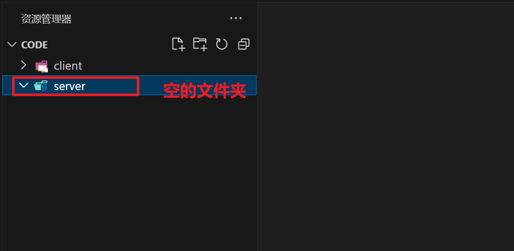


生成项目的配置文件：

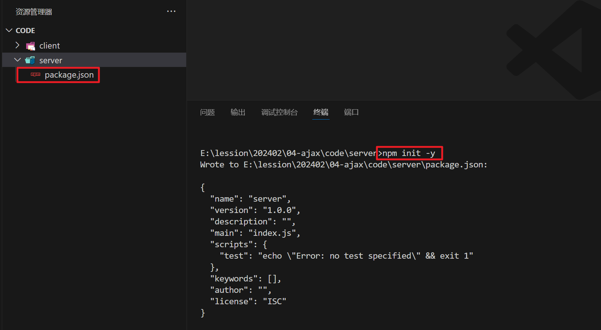


后端用到的依赖：

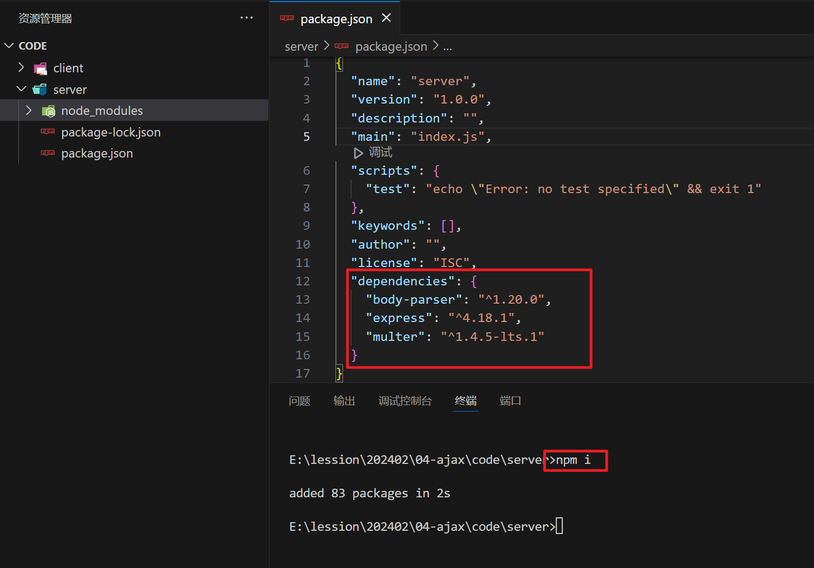

```json
"dependencies": {
    "body-parser": "^1.20.0",
    "express": "^4.18.1",
    "multer": "^1.4.5-lts.1"
}
```


创建一台服务器，如下：

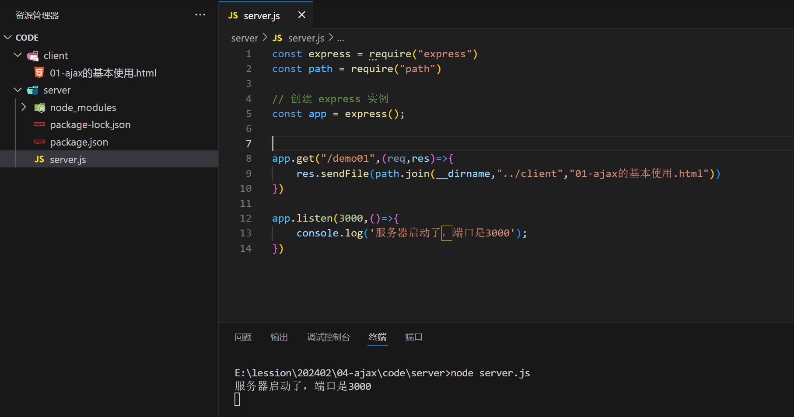

```js
const express = require("express")
const path = require("path")

// 创建 express 实例
const app = express();


app.get("/demo01",(req,res)=>{
    res.sendFile(path.join(__dirname,"../client","01-ajax的基本使用.html"))
})

app.listen(3000,()=>{
    console.log('服务器启动了，端口是3000');
})
```


对应的html文件如下：

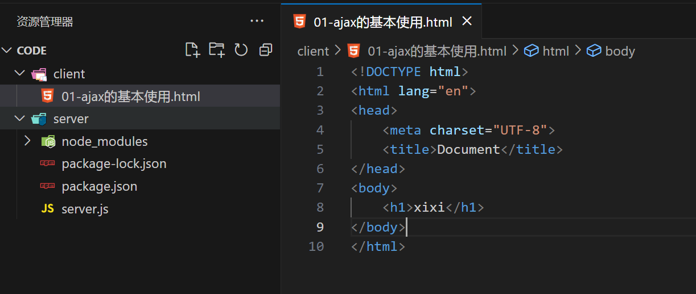


访问服务器：

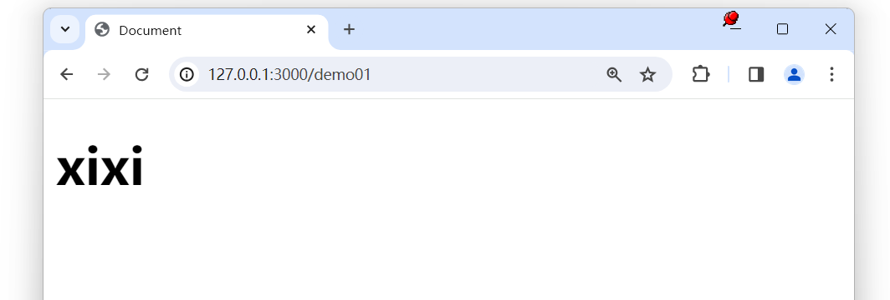


接下来，说一下ajax的基本使用，再去写一点服务器代码：

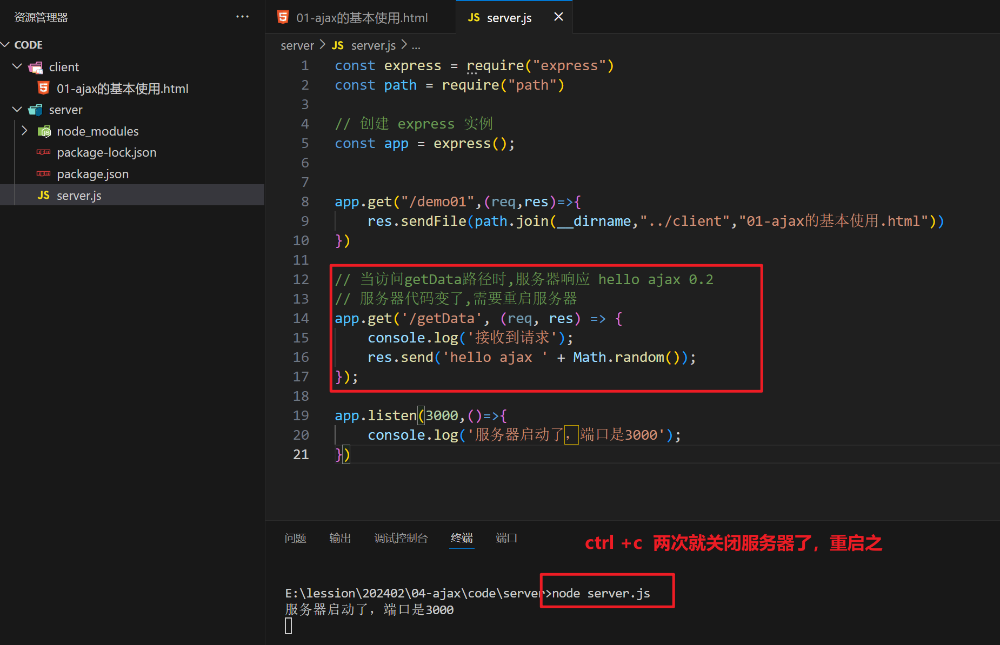

```js
const express = require("express")
const path = require("path")

// 创建 express 实例
const app = express();


app.get("/demo01",(req,res)=>{
    res.sendFile(path.join(__dirname,"../client","01-ajax的基本使用.html"))
})

// 当访问getData路径时,服务器响应 hello ajax 0.2
// 服务器代码变了,需要重启服务器
app.get('/getData', (req, res) => {
    console.log('接收到请求');
    res.send('hello ajax ' + Math.random());
});

app.listen(3000,()=>{
    console.log('服务器启动了，端口是3000');
})
```


然后，使用ajax请求 /getData，如下：

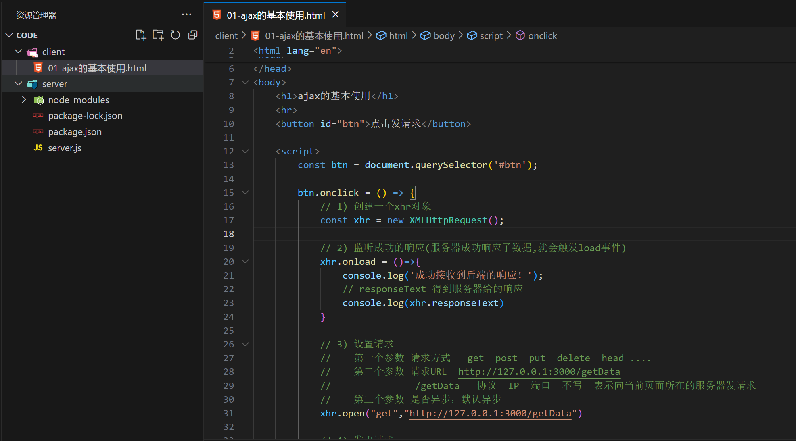

```js
<!DOCTYPE html>
<html lang="en">
<head>
    <meta charset="UTF-8">
    <title>Document</title>
</head>
<body>
    <h1>ajax的基本使用</h1>
    <hr>
    <button id="btn">点击发请求</button>

    <script>
        const btn = document.querySelector('#btn');

        btn.onclick = () => {
            // 1) 创建一个xhr对象
            const xhr = new XMLHttpRequest();

            // 2) 监听成功的响应(服务器成功响应了数据,就会触发load事件)
            xhr.onload = ()=>{
                console.log('成功接收到后端的响应！');
                // responseText 得到服务器给的响应
                console.log(xhr.responseText)
            }

            // 3) 设置请求
            //    第一个参数 请求方式   get  post  put  delete  head ....
            //    第二个参数 请求URL  http://127.0.0.1:3000/getData
            //               /getData   协议  IP  端口  不写  表示向当前页面所在的服务器发请求
            //    第三个参数 是否异步，默认异步
            xhr.open("get","http://127.0.0.1:3000/getData")

            // 4) 发出请求
            //      发请求时,可以给服务器传递参数  send(请求体)
            xhr.send();
        }
    </script>
</body>
</html>
```


浏览器中测试：

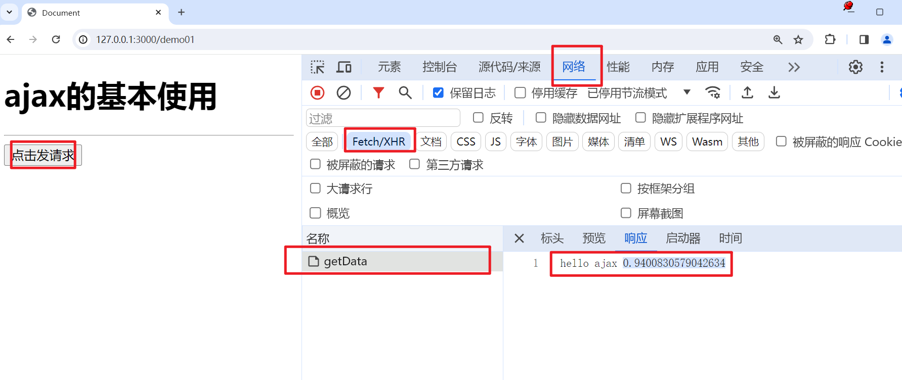

学习ajax，网络面板非常重要，带着大家分析一下：

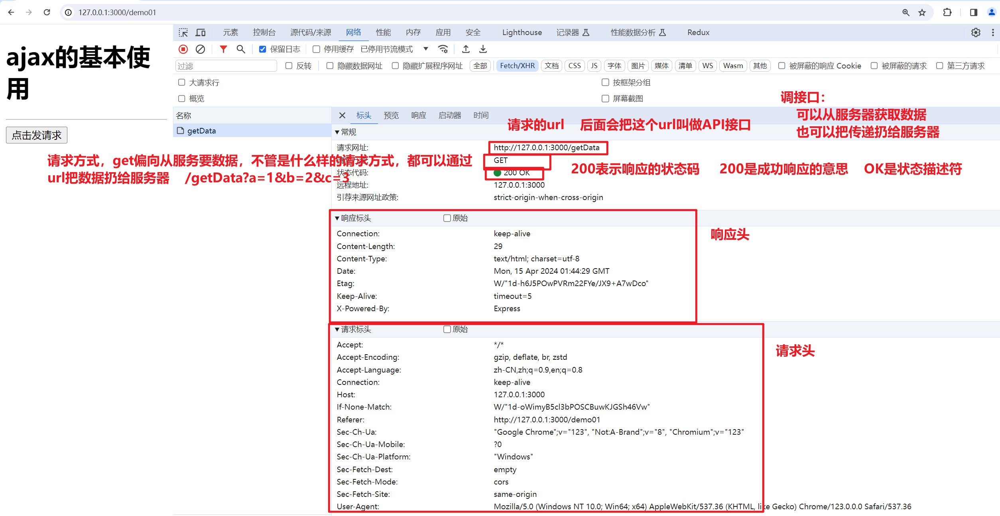

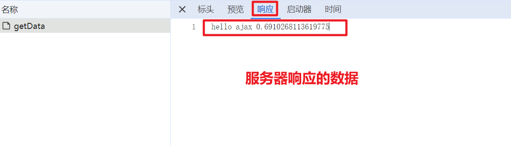


可以把数据在页面上显示出来，如下：

```html
<!DOCTYPE html>
<html lang="en">
<head>
    <meta charset="UTF-8">
    <title>Document</title>
    <style>
        #box {
            margin-top: 20px;
            width: 600px;
            padding: 20px;
            min-height: 200px;
            border: 1px solid red;
        }
    </style>
</head>
<body>
    <h1>ajax的基本使用</h1>
    <hr>
    <button id="btn">点击发请求</button>
    <div id="box"></div>

    <script>
        const btn = document.querySelector('#btn');
        const box = document.querySelector('#box');

        btn.onclick = () => {
            // 1) 创建一个xhr对象
            const xhr = new XMLHttpRequest();

            // 2) 监听成功的响应(服务器成功响应了数据,就会触发load事件)
            xhr.onload = ()=>{
                console.log('成功接收到后端的响应！');
                // responseText 得到服务器给的响应
                console.log(xhr.responseText)
                box.innerHTML += xhr.responseText + "<br/>";
            }

            // 3) 设置请求
            //    第一个参数 请求方式   get  post  put  delete  head ....
            //    第二个参数 请求URL  http://127.0.0.1:3000/getData
            //               /getData   协议  IP  端口  不写  表示向当前页面所在的服务器发请求
            //    第三个参数 是否异步，默认异步
            xhr.open("get","http://127.0.0.1:3000/getData")

            // 4) 发出请求
            //      发请求时,可以给服务器传递参数  send(请求体)
            xhr.send();
        }
    </script>
</body>
</html>
```


测试如下：

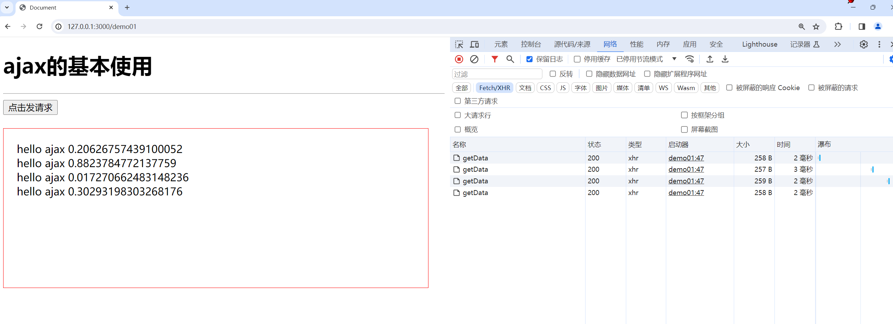


### 2，通过url把数据扔给服务器

**任何的请求方式都可以通过url传参**

动了服务器代码，一定要重启服务器，才会生效。服务器代码：

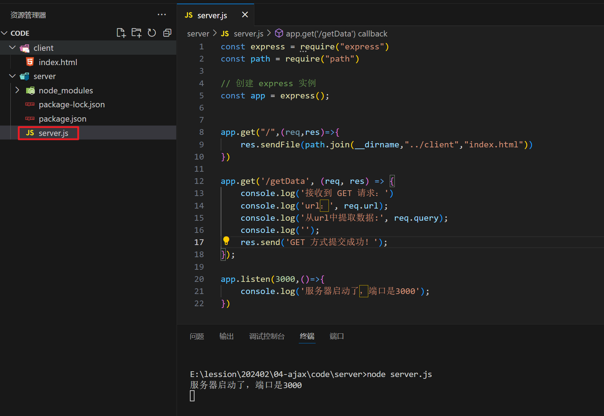


```js
const express = require("express")
const path = require("path")

// 创建 express 实例
const app = express();


app.get("/",(req,res)=>{
    res.sendFile(path.join(__dirname,"../client","index.html"))
})

app.get('/getData', (req, res) => {
    console.log('接收到 GET 请求：')
    console.log('url：', req.url);
    console.log('从url中提取数据:', req.query);
    console.log('');
    res.send('GET 方式提交成功！');
});

app.listen(3000,()=>{
    console.log('服务器启动了，端口是3000');
})
```


开始写ajax代码：

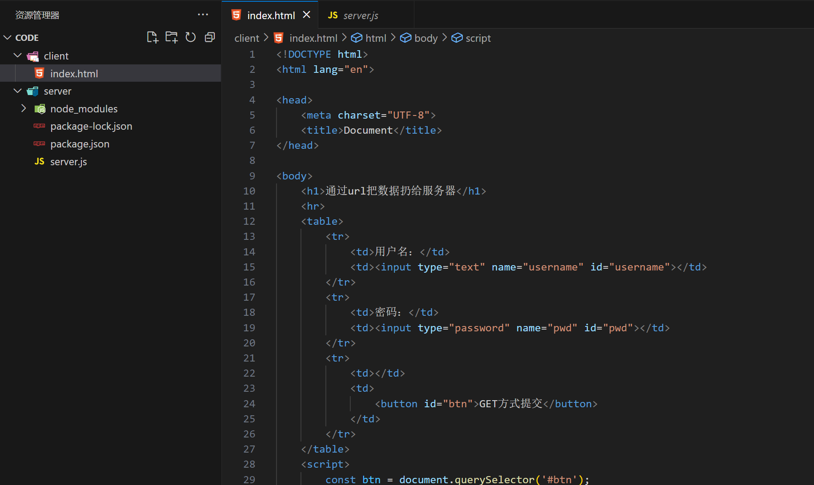

```html
<!DOCTYPE html>
<html lang="en">

<head>
    <meta charset="UTF-8">
    <title>Document</title>
</head>

<body>
    <h1>通过url把数据扔给服务器</h1>
    <hr>
    <table>
        <tr>
            <td>用户名：</td>
            <td><input type="text" name="username" id="username"></td>
        </tr>
        <tr>
            <td>密码：</td>
            <td><input type="password" name="pwd" id="pwd"></td>
        </tr>
        <tr>
            <td></td>
            <td>
                <button id="btn">GET方式提交</button>
            </td>
        </tr>
    </table>
    <script>
        const btn = document.querySelector('#btn');
        const username = document.querySelector('#username');
        const pwd = document.querySelector('#pwd');

        const xhr = new XMLHttpRequest();
        xhr.onload = () => {
            alert(xhr.responseText);
        };

        btn.onclick = () => {
            // 拼接查询字符串
            const qs = `uername=${username.value}&pwd=${pwd.value}`
            xhr.open("get","/getData?"+qs)
            xhr.send();
        }
    </script>
</body>

</html>
```


在浏览器中测试：

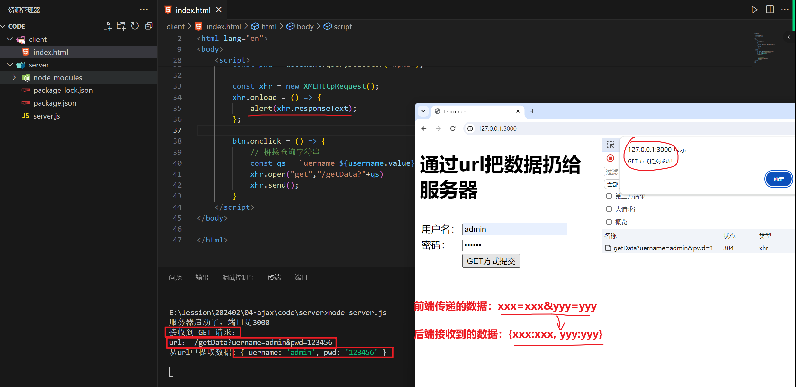

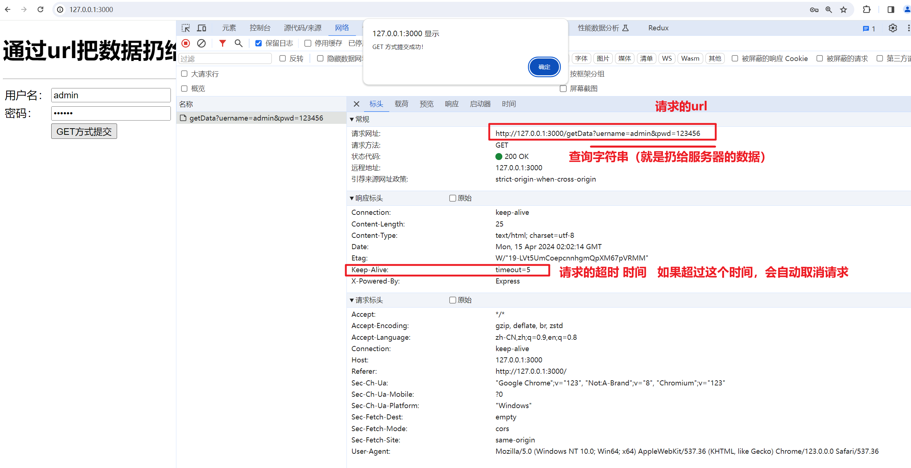

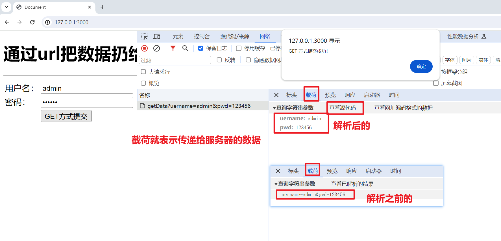

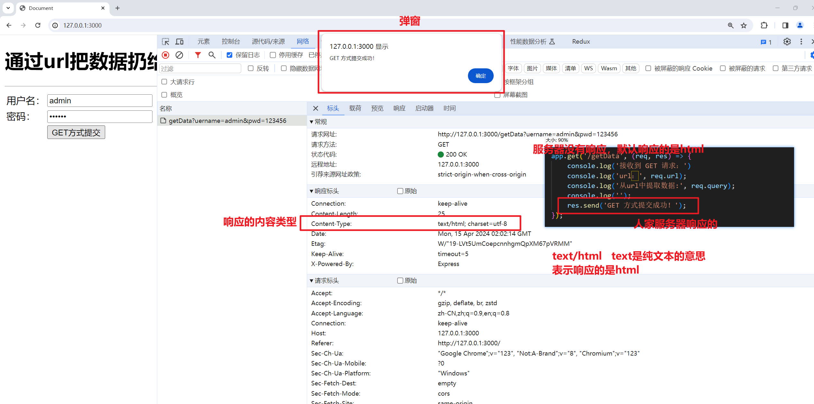


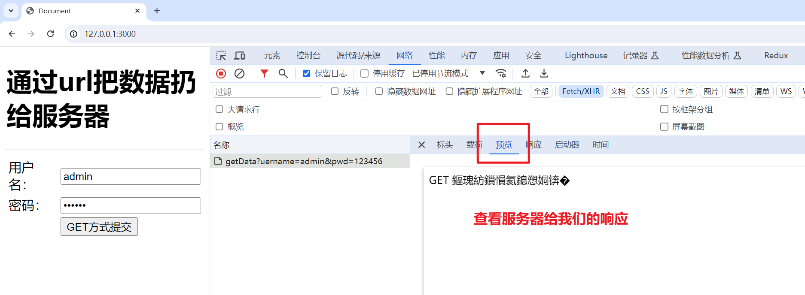


### 3，通过请求体把数据扔给服务器


get请求只能通过url把数据扔给服务器，post，put请求可以不仅可以通过url把数据扔给服务器，也可以通过请求体把数据扔给服务器。把数据通过请求体扔给服务器，也是有多个格式的：

- text/plain
  - 默认的请求体类型，如果不设置请求头字段 Content-type，默认就是该种类型
  - 求体只要是字符串就可以，后端不会做任何处理
- application/x-www-form-urlencoded
  - 需要设置请求头 xhr.setRequestHeader('Content-type', 'application/x-www-form-urlencoded');
  - 要求请求体是查询字符串，如 a=100&b=200
  - 点击提交按钮提交表单（非Ajax），如果 Method 是 Post，默认请求体内容就是 x-www-form-urlencoded
- application/json

  - 设置设置请求头 xhr.setRequestHeader('Content-type', 'application/json');

  - 要求请求体是 json 格式的字符串
- multipart/form-data


演示 text/plain，后端代码：

```js
// 导入模块
const path = require('path');
const express = require('express');
const bodyParser = require('body-parser');  // body-parser 专门用于接收请求体数据
const multer = require('multer');


// 创建 express 实例
const app = express();


// 挂载中间件处理请求体
app.use(bodyParser.text());
app.use(bodyParser.json());
app.use(bodyParser.urlencoded({extended: false}));


app.get("/",(req,res)=>{
    res.sendFile(path.join(__dirname,"../client","index.html"))
})

// req.body 就可以获取请求体中的数据   
// typeof req.body 查看接收到的数据是什么类型
// res.send('POST 方式提交成功！');  响应数据
// req.query 得到url传递的参数的
// req.headers['content-type']  得到请求头
app.post('/getData', (req, res) => {
    console.log('接收到 POST 请求：')
    console.log('URL中获取的信息：', req.query);
    console.log('请求体内容类型：', req.headers['content-type']);
    console.log('请求体中获取的信息：', req.body, typeof req.body);
    console.log('');
    res.send('POST 方式提交成功！');
});


app.listen(3000,()=>{
    console.log('服务器启动了，端口是3000');
})
```


前端代码：

```html
<!DOCTYPE html>
<html lang="en">

<head>
    <meta charset="UTF-8">
    <title>Document</title>
</head>

<body>
    <h1>通过url把数据扔给服务器</h1>
    <hr>
    <table>
        <tr>
            <td>用户名：</td>
            <td><input type="text" name="username" id="username"></td>
        </tr>
        <tr>
            <td>密码：</td>
            <td><input type="password" name="pwd" id="pwd"></td>
        </tr>
        <tr>
            <td></td>
            <td>
                <button id="btn">POST方式提交</button>
            </td>
        </tr>
    </table>
    <script>
        const btn = document.querySelector('#btn');
        const username = document.querySelector('#username');
        const pwd = document.querySelector('#pwd');

        const xhr = new XMLHttpRequest();
        xhr.onload = () => {
            alert(xhr.responseText);
        };

        btn.onclick = () => {
            // ?a=1&b=2 url 传参
            xhr.open("post","/getData?a=1&b=2")

            const qs = `uername=${username.value}&pwd=${pwd.value}`
            // send中写请求体  send(qs); 叫请求体传参
            xhr.send(qs);
        }
    </script>
</body>

</html>
```


浏览器效果：

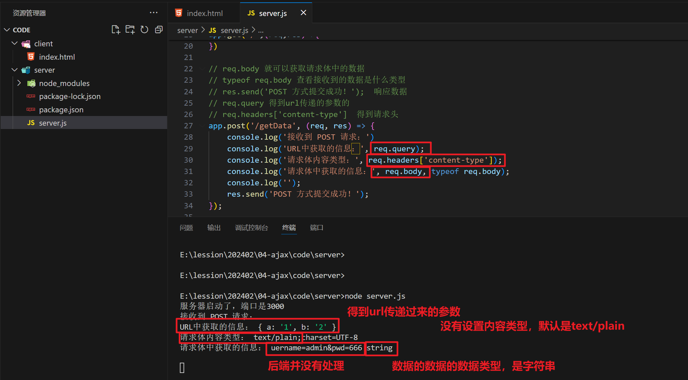

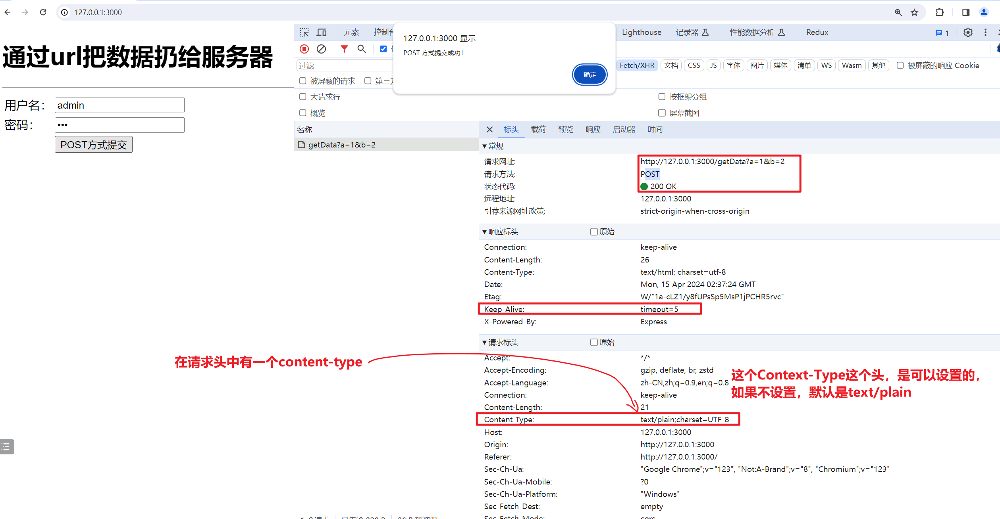

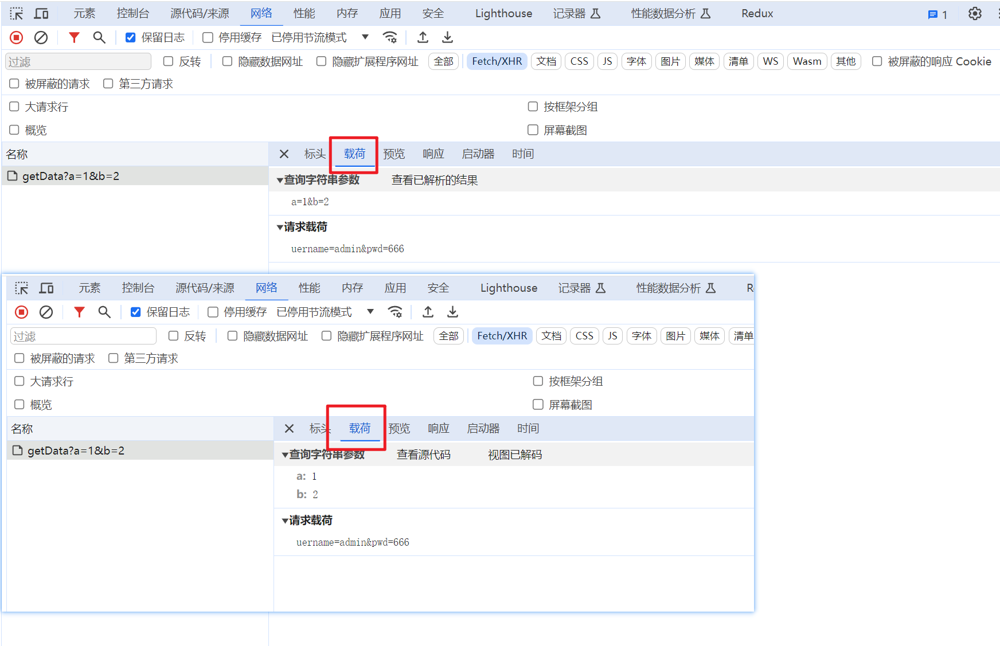

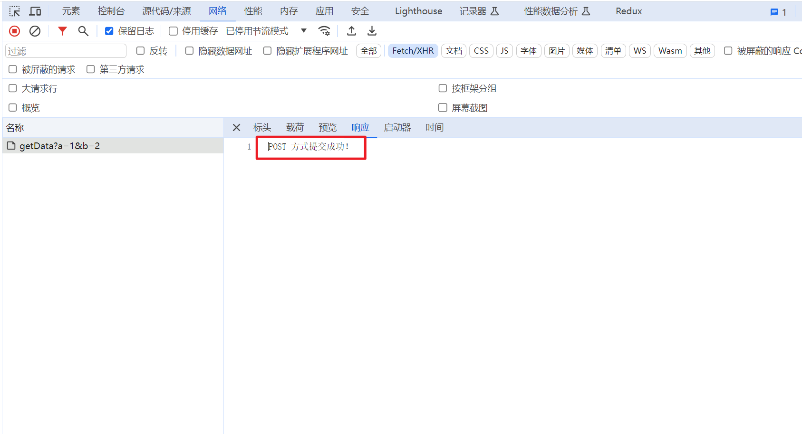


演示 application/x-www-form-urlencoded，后端同上。


前端代码：

```html
<!DOCTYPE html>
<html lang="en">

<head>
    <meta charset="UTF-8">
    <title>Document</title>
</head>

<body>
    <h1>通过url把数据扔给服务器</h1>
    <hr>
    <table>
        <tr>
            <td>用户名：</td>
            <td><input type="text" name="username" id="username"></td>
        </tr>
        <tr>
            <td>密码：</td>
            <td><input type="password" name="pwd" id="pwd"></td>
        </tr>
        <tr>
            <td></td>
            <td>
                <button id="btn">POST方式提交</button>
            </td>
        </tr>
    </table>
    <script>
        const btn = document.querySelector('#btn');
        const username = document.querySelector('#username');
        const pwd = document.querySelector('#pwd');

        const xhr = new XMLHttpRequest();
        xhr.onload = () => {
            alert(xhr.responseText);
        };

        btn.onclick = () => {
            // ?a=1&b=2 url 传参
            xhr.open("post","/getData?a=1&b=2")

            const qs = `uername=${username.value}&pwd=${pwd.value}`

            // 在发请求之前,设置请求头,设置的头,叫Content-Type
            // 请求头一定要在 open() 之后，send() 之前设置
            xhr.setRequestHeader('Content-type', 'application/x-www-form-urlencoded');

            // send中写请求体  send(qs); 叫请求体传参
            xhr.send(qs);
        }
    </script>
</body>

</html>
```


浏览器效果：

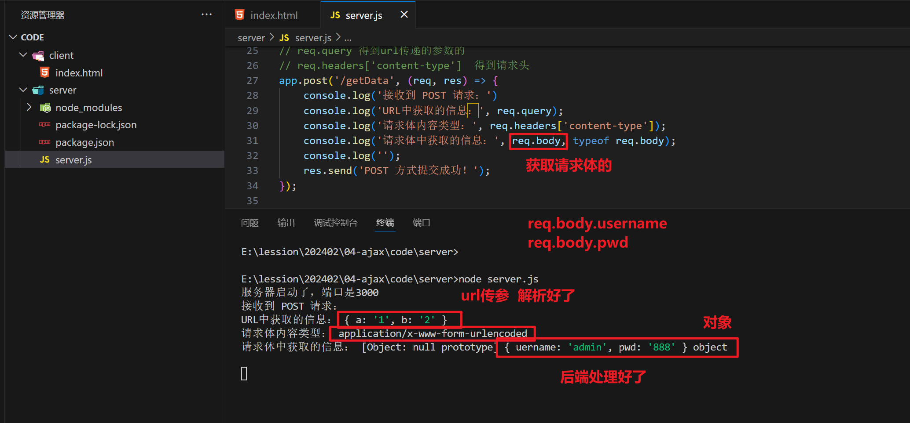

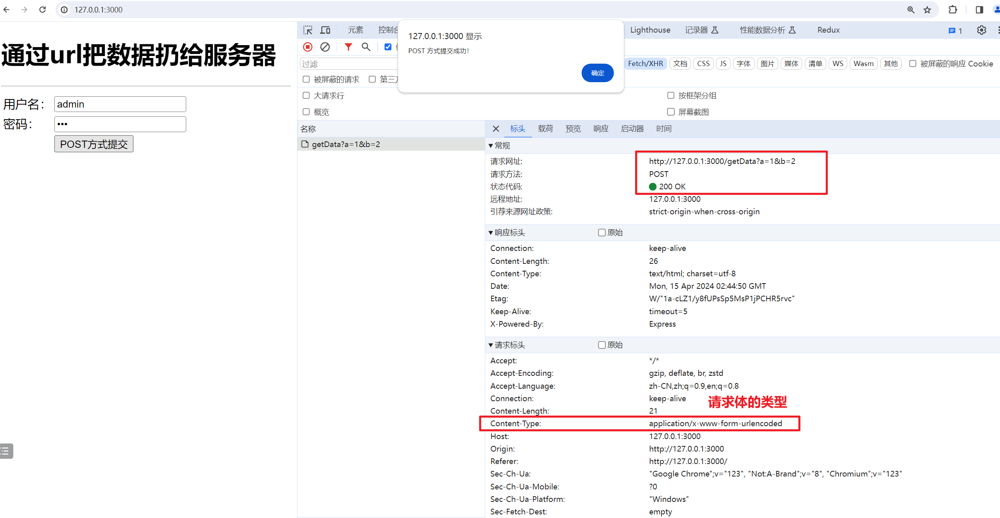

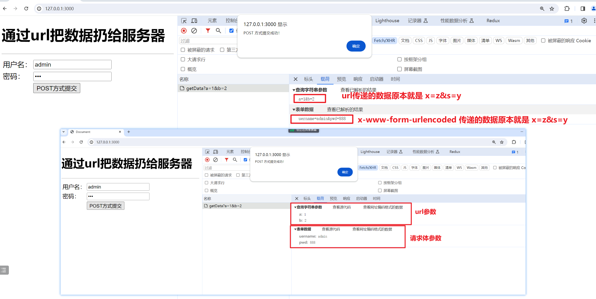


演示 application/json，后端同上。


前端代码：

```html
<!DOCTYPE html>
<html lang="en">

<head>
    <meta charset="UTF-8">
    <title>Document</title>
</head>

<body>
    <h1>通过url把数据扔给服务器</h1>
    <hr>
    <table>
        <tr>
            <td>用户名：</td>
            <td><input type="text" name="username" id="username"></td>
        </tr>
        <tr>
            <td>密码：</td>
            <td><input type="password" name="pwd" id="pwd"></td>
        </tr>
        <tr>
            <td></td>
            <td>
                <button id="btn">POST方式提交</button>
            </td>
        </tr>
    </table>
    <script>
        const btn = document.querySelector('#btn');
        const username = document.querySelector('#username');
        const pwd = document.querySelector('#pwd');

        const xhr = new XMLHttpRequest();
        xhr.onload = () => {
            alert(xhr.responseText);
        };

        btn.onclick = () => {
            // ?a=1&b=2 url 传参
            xhr.open("post","/getData?a=1&b=2")

            // 如果传递的格式是application/json 那么就不再是x=y&z=s
            const data = { username:username.value, pwd:pwd.value }

            // 请求头一定要在 open() 之后，send() 之前设置
            xhr.setRequestHeader('Content-type', 'application/json');

            // send中写请求体  send(qs); 叫请求体传参
            // 传递时,需要把JSON对象,手动转化成JSON字符串
            xhr.send(JSON.stringify(data));
        }
    </script>
</body>

</html>
```


浏览器效果：

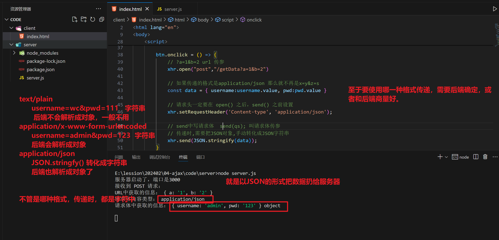

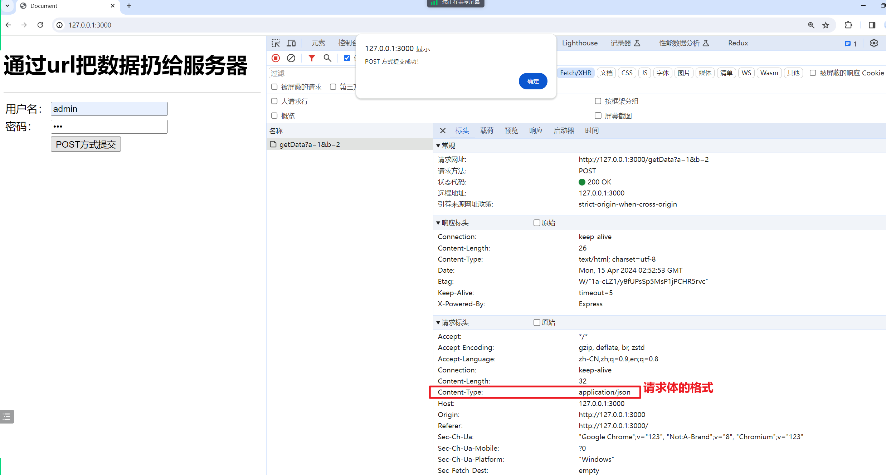
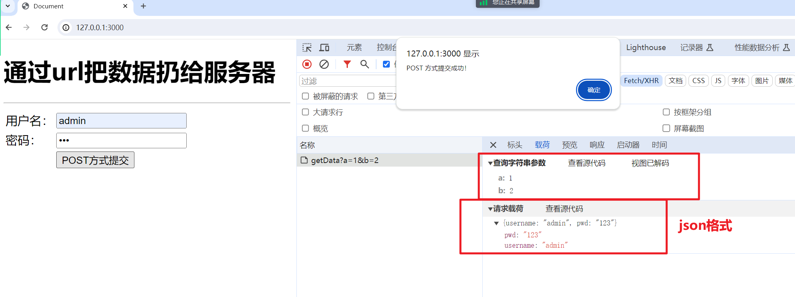


ajax可以发请求，表单默认也是可以发请求的，如下：


```html
<!DOCTYPE html>
<html lang="en">

<head>
    <meta charset="UTF-8">
    <title>Document</title>
</head>

<body>
    <h1>通过url把数据扔给服务器</h1>
    <hr>
    <form action="/getData?a=1&b=2" method="post">
        <table>
            <tr>
                <td>用户名：</td>
                <td><input type="text" name="username" id="username"></td>
            </tr>
            <tr>
                <td>密码：</td>
                <td><input type="password" name="pwd" id="pwd"></td>
            </tr>
            <tr>
                <td></td>
                <td>
                    <input type="submit" value="非ajax请求"></input>
                </td>
            </tr>
        </table>
    </form>
</body>

</html>
```


测试：

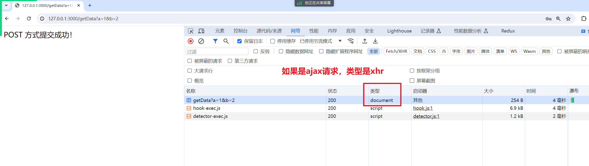

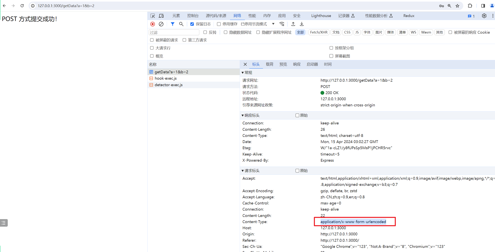

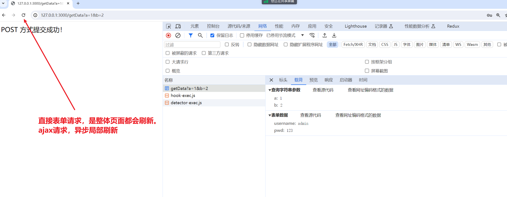


### 4，通过FormData传递数据


请求体（send()的方法的参数）除了是字符串，也可以是 formData 对象。如果请求体是 FormData 对象，浏览器会自动设置请求头字段 Content-type 为 multipart/form-data。


FormData不仅可以传递普通数据，还可以上传文件。


后端代码：

```js
// 导入模块
const path = require('path');
const express = require('express');
const bodyParser = require('body-parser');  // body-parser 专门用于接收请求体数据
const multer = require('multer');


// 创建 express 实例
const app = express();


// 挂载中间件处理请求体
app.use(bodyParser.text());
app.use(bodyParser.json());
app.use(bodyParser.urlencoded({extended: false}));


app.get("/",(req,res)=>{
    res.sendFile(path.join(__dirname,"../client","index.html"))
})

// req.body 接收前端传递过来的普通数据
// req.file  接收前端上传过来的文件
const upload = multer({ dest: 'uploads/' })
app.post('/upload',upload.single('avator'),(req, res) => {
    console.log('文件上传成功：');
    console.log('文件信息：', req.file);
    console.log('表单数据：', req.body);
    console.log('');
    res.send('文件上传成功！');
});


app.listen(3000,()=>{
    console.log('服务器启动了，端口是3000');
})
```


前端代码：

```html
<!DOCTYPE html>
<html lang="en">

<head>
    <meta charset="UTF-8">
    <title>Document</title>
</head>

<body>
    <h1>通过formdata把数据扔给服务器</h1>
    <hr>
    <table>
        <tr>
            <td>用户名：</td>
            <td><input type="text" name="username" id="username"></td>
        </tr>
        <tr>
            <td>密码：</td>
            <td><input type="password" name="pwd" id="pwd"></td>
        </tr>
        <tr>
            <td></td>
            <td>
                <button id="btn1">提交1</button>
            </td>
        </tr>
    </table>

    <script>
        const username = document.querySelector("#username")
        const pwd = document.querySelector("#pwd")
        const btn1 = document.querySelector("#btn1")

        const xhr = new XMLHttpRequest();

        xhr.onload = () => {
            alert(xhr.responseText);
        };


        btn1.onclick = () => {
            // 创建FormData  fd是一个对象  容器
            const fd = new FormData();
            fd.append("username",username.value)
            fd.append("pwd",pwd.value)
            fd.append("aaaa",1111)
            fd.append("bbbb",2222)


            xhr.open('POST', '/upload');
            // send中不只可以放字符串,还可以放formdata对象
            xhr.send(fd);
        }
    </script>
</body>

</html>
```


测试：

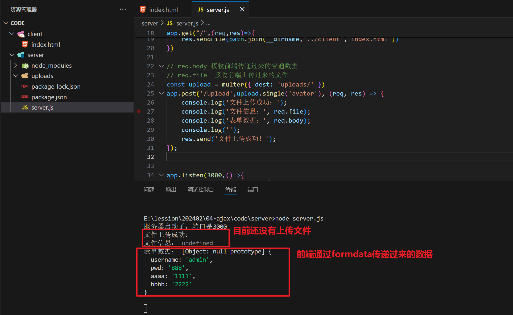

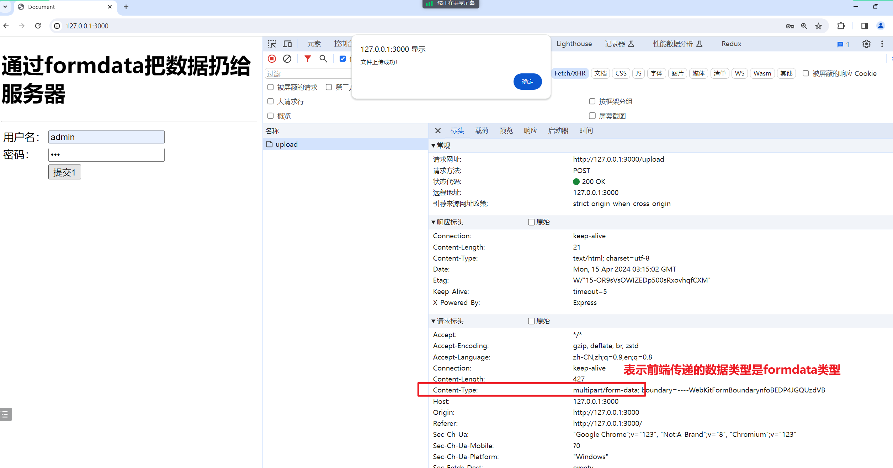

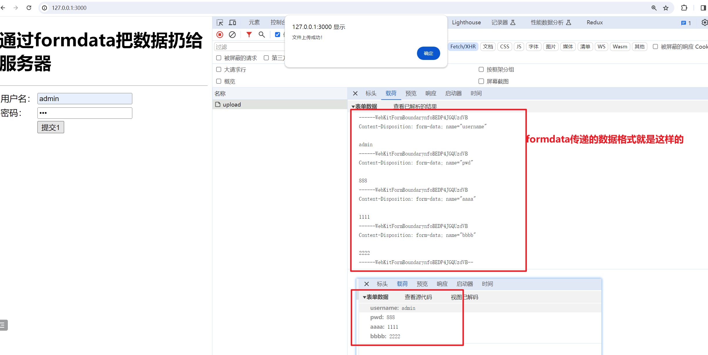


此时这个请求头是人家自己添加的请求头，我们并没有设置。还有一种写法，如下：

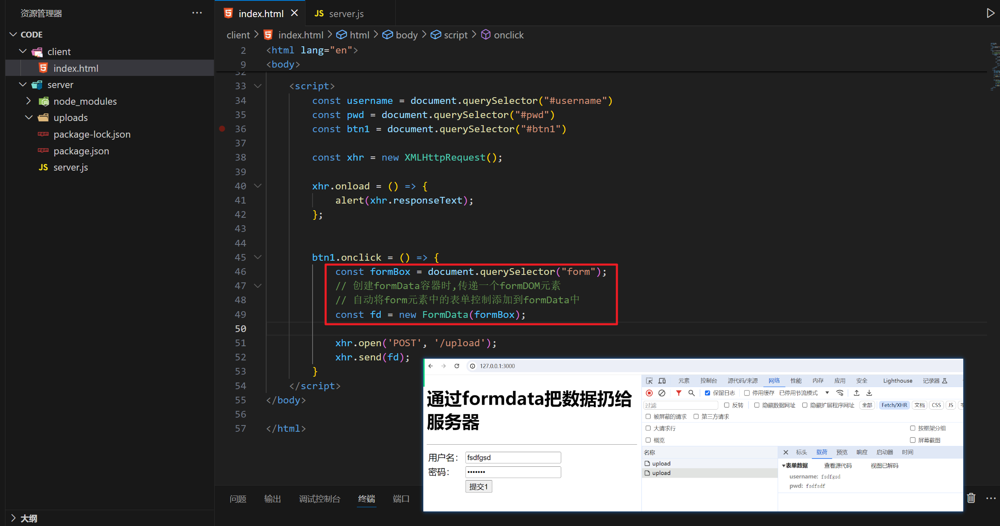

```html
<!DOCTYPE html>
<html lang="en">

<head>
    <meta charset="UTF-8">
    <title>Document</title>
</head>

<body>
    <h1>通过formdata把数据扔给服务器</h1>
    <hr>
    <!-- form表单有默认的提交事件 -->
    <!-- onsubmit="return false" 阻止默认事件的 -->
    <form onsubmit="return false">
        <table>
            <tr>
                <td>用户名：</td>
                <td><input type="text" name="username" id="username"></td>
            </tr>
            <tr>
                <td>密码：</td>
                <td><input type="password" name="pwd" id="pwd"></td>
            </tr>
            <tr>
                <td></td>
                <td>
                    <button id="btn1">提交1</button>
                </td>
            </tr>
        </table>
    </form>

    <script>
        const username = document.querySelector("#username")
        const pwd = document.querySelector("#pwd")
        const btn1 = document.querySelector("#btn1")

        const xhr = new XMLHttpRequest();

        xhr.onload = () => {
            alert(xhr.responseText);
        };


        btn1.onclick = () => {
            const formBox = document.querySelector("form");
            // 创建formData容器时,传递一个formDOM元素
            // 自动将form元素中的表单控制添加到formData中
            const fd = new FormData(formBox);

            xhr.open('POST', '/upload');
            xhr.send(fd);
        }
    </script>
</body>

</html>
```


### 5，通过FormData实现文件上传


测试文件上传：


```html
<!DOCTYPE html>
<html lang="en">

<head>
    <meta charset="UTF-8">
    <title>Document</title>
</head>

<body>
    <h1>通过formdata把数据扔给服务器</h1>
    <hr>
    <!-- form表单有默认的提交事件 -->
    <!-- onsubmit="return false" 阻止默认事件的 -->
    <form onsubmit="return false">
        <table>
            <tr>
                <td>用户名：</td>
                <td><input type="text" name="username" id="username"></td>
            </tr>
            <tr>
                <td>密码：</td>
                <td><input type="password" name="pwd" id="pwd"></td>
            </tr>
            <tr>
                <td>头像: </td>
                <td><input type="file" name="avator" id="avator"></td>
            </tr>
            <tr>
                <td></td>
                <td>
                    <button id="btn1">提交1</button>
                </td>
            </tr>
        </table>
    </form>

    <script>
        const username = document.querySelector("#username")
        const pwd = document.querySelector("#pwd")
        const avator = document.querySelector("#avator")
        const btn1 = document.querySelector("#btn1")

        const xhr = new XMLHttpRequest();

        xhr.onload = () => {
            alert(xhr.responseText);
        };


        btn1.onclick = () => {
            // const formBox = document.querySelector("form");
            // 创建formData容器时,传递一个formDOM元素
            // 自动将form元素中的表单控制添加到formData中
            // const fd = new FormData(formBox);

            const fd = new FormData();
            fd.append("uname",username.value);
            fd.append("upwd",pwd.value);
            fd.append("avator",avator.files[0]);

            xhr.open('POST', '/upload');
            xhr.send(fd);
        }
    </script>
</body>

</html>
```


测试：

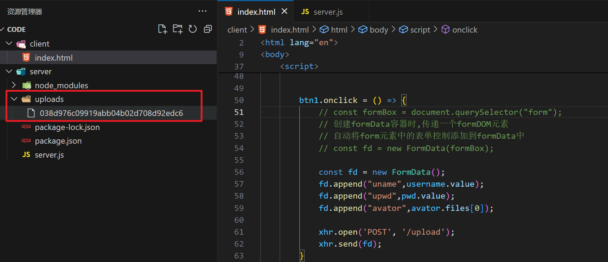


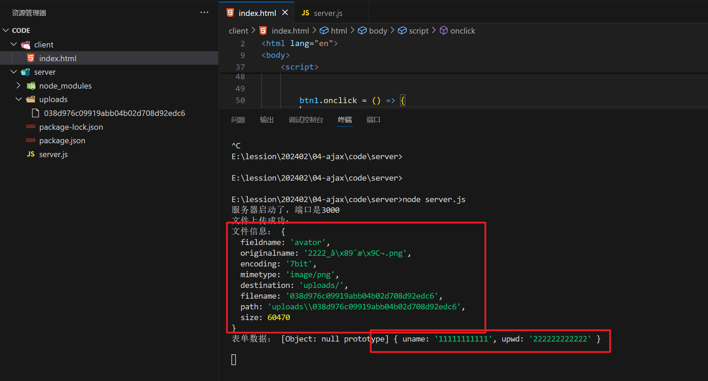


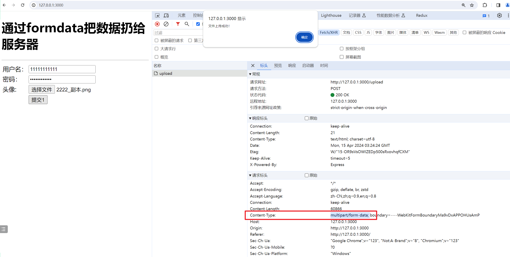

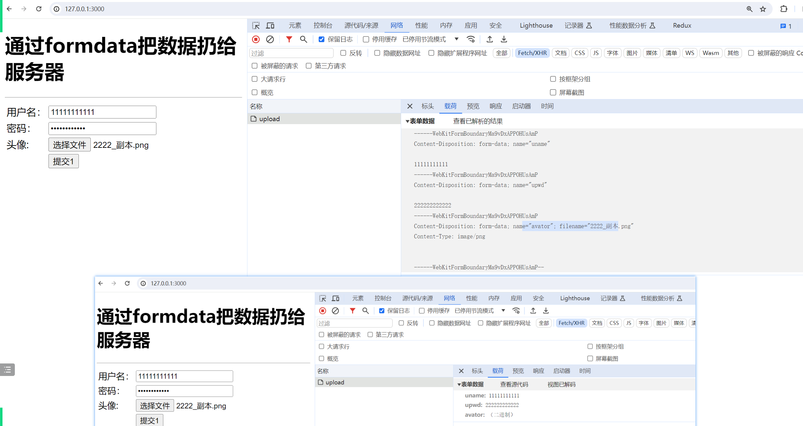


