## 一，Ajax串讲

客户端和服务器

- 客户端是向服务器发请求的。
  - 浏览器
  - postman
  - a标签     img标签   link标签   script标签   form标签....
  - ajax（异步局部刷新）
  - App
  - 小程序
  - ....
- 服务器主要接收客户端的请求，给出响应。通过node的框架叫express，提供服务器功能。


url

- 互联网上的资源都有一个url，通过url就可以定位到互联网上的某个资源。
- 协议名称 + 主机名称 + 端口号 + 路径 + 文件 + 查询所需的字符串 + HASH
- http://     baidu.com       8        /css/reset.css     ?a=1&b=2&c=3       #abc


http：

- HyperText Transfer Protocol 超文本传输协议。本质就是客户端和服务器之间沟通交流的规则。
- http请求（Request）：由客户端（浏览器）向服务器发出请求
- http响应（Response）：由服务器给出响应


http请求（请求报文）：

- 请求行
  - 请求方法  get  post  put .... 
  - url  不管是什么样的请求方式，都可以通过url传递参数
  - http协议版本
- 请求头
  -  Content-Type: text/plain, application/x-www-form-urlencoded, application/json, mutipul/form-data
- 请求体（请求正文），就是传给服务器的数据，post请求和put请求才有请求体，get请求没有请求体

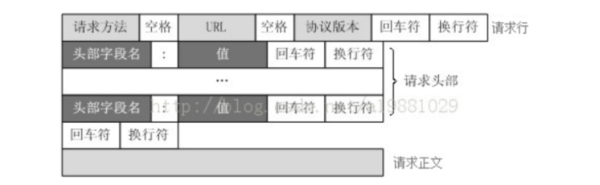

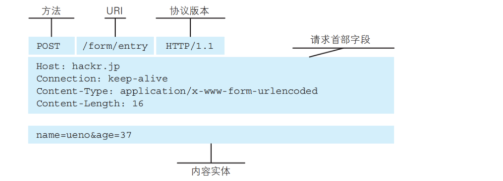

http响应（响应报文）：

- 响应行
- 响应头
- 响应体（响应正文）


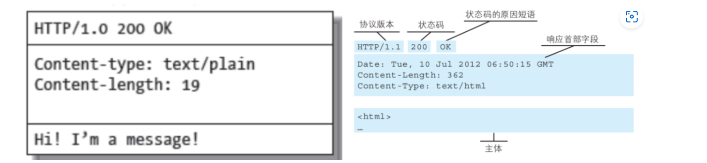


### 1，Ajax介绍

​	Ajax（Asynchronous JavaScript and XML，异步的 JavaScriopt 和 XML）是一种用于创建动态 Web 应用程序的技术，它使用 JavaScript 和 XML（或 JSON）等技术来实现异步数据传输和动态更新页面内容。

​	通过 Ajax 技术，可以在不刷新整个页面的情况下，向服务器发送请求，获取数据并进行处理，从而实现更加流畅、响应更快的 Web 应用程序。Ajax 技术最初是由 Google 推广的，现在已经成为了 Web 开发中不可或缺的一部分。

​	Ajax 的核心是 XMLHttpRequest 对象，它提供了在客户端浏览器和服务器之间发送 HTTP 请求和接收响应的功能。使用 XMLHttpRequest 对象，可以在不刷新整个页面的情况下更新部分页面内容，从而实现异步数据传输。除此之外，还可以使用 jQuery 等 JavaScript 库中提供的 Ajax 方法、Fetch API 等技术来实现 Ajax 功能。


搭建一下后端，创建一个文件夹，如下：


生成项目的配置文件：


后端用到的依赖：


```json
"dependencies": {
    "body-parser": "^1.20.0",
    "express": "^4.18.1",
    "multer": "^1.4.5-lts.1"
}
```


创建一台服务器，如下：


```js
const express = require("express")
const path = require("path")

// 创建 express 实例
const app = express();


app.get("/demo01",(req,res)=>{
    res.sendFile(path.join(__dirname,"../client","01-ajax的基本使用.html"))
})

app.listen(3000,()=>{
    console.log('服务器启动了，端口是3000');
})
```


对应的html文件如下：


访问服务器：


接下来，说一下ajax的基本使用，再去写一点服务器代码：


```js
const express = require("express")
const path = require("path")

// 创建 express 实例
const app = express();


app.get("/demo01",(req,res)=>{
    res.sendFile(path.join(__dirname,"../client","01-ajax的基本使用.html"))
})

// 当访问getData路径时,服务器响应 hello ajax 0.2
// 服务器代码变了,需要重启服务器
app.get('/getData', (req, res) => {
    console.log('接收到请求');
    res.send('hello ajax ' + Math.random());
});

app.listen(3000,()=>{
    console.log('服务器启动了，端口是3000');
})
```


然后，使用ajax请求 /getData，如下：


```js
<!DOCTYPE html>
<html lang="en">
<head>
    <meta charset="UTF-8">
    <title>Document</title>
</head>
<body>
    <h1>ajax的基本使用</h1>
    <hr>
    <button id="btn">点击发请求</button>

    <script>
        const btn = document.querySelector('#btn');

        btn.onclick = () => {
            // 1) 创建一个xhr对象
            const xhr = new XMLHttpRequest();

            // 2) 监听成功的响应(服务器成功响应了数据,就会触发load事件)
            xhr.onload = ()=>{
                console.log('成功接收到后端的响应！');
                // responseText 得到服务器给的响应
                console.log(xhr.responseText)
            }

            // 3) 设置请求
            //    第一个参数 请求方式   get  post  put  delete  head ....
            //    第二个参数 请求URL  http://127.0.0.1:3000/getData
            //               /getData   协议  IP  端口  不写  表示向当前页面所在的服务器发请求
            //    第三个参数 是否异步，默认异步
            xhr.open("get","http://127.0.0.1:3000/getData")

            // 4) 发出请求
            //      发请求时,可以给服务器传递参数  send(请求体)
            xhr.send();
        }
    </script>
</body>
</html>
```


浏览器中测试：


学习ajax，网络面板非常重要，带着大家分析一下：


可以把数据在页面上显示出来，如下：

```html
<!DOCTYPE html>
<html lang="en">
<head>
    <meta charset="UTF-8">
    <title>Document</title>
    <style>
        #box {
            margin-top: 20px;
            width: 600px;
            padding: 20px;
            min-height: 200px;
            border: 1px solid red;
        }
    </style>
</head>
<body>
    <h1>ajax的基本使用</h1>
    <hr>
    <button id="btn">点击发请求</button>
    <div id="box"></div>

    <script>
        const btn = document.querySelector('#btn');
        const box = document.querySelector('#box');

        btn.onclick = () => {
            // 1) 创建一个xhr对象
            const xhr = new XMLHttpRequest();

            // 2) 监听成功的响应(服务器成功响应了数据,就会触发load事件)
            xhr.onload = ()=>{
                console.log('成功接收到后端的响应！');
                // responseText 得到服务器给的响应
                console.log(xhr.responseText)
                box.innerHTML += xhr.responseText + "<br/>";
            }

            // 3) 设置请求
            //    第一个参数 请求方式   get  post  put  delete  head ....
            //    第二个参数 请求URL  http://127.0.0.1:3000/getData
            //               /getData   协议  IP  端口  不写  表示向当前页面所在的服务器发请求
            //    第三个参数 是否异步，默认异步
            xhr.open("get","http://127.0.0.1:3000/getData")

            // 4) 发出请求
            //      发请求时,可以给服务器传递参数  send(请求体)
            xhr.send();
        }
    </script>
</body>
</html>
```


测试如下：


### 2，通过url把数据扔给服务器

**任何的请求方式都可以通过url传参**

动了服务器代码，一定要重启服务器，才会生效。服务器代码：


```js
const express = require("express")
const path = require("path")

// 创建 express 实例
const app = express();


app.get("/",(req,res)=>{
    res.sendFile(path.join(__dirname,"../client","index.html"))
})

app.get('/getData', (req, res) => {
    console.log('接收到 GET 请求：')
    console.log('url：', req.url);
    console.log('从url中提取数据:', req.query);
    console.log('');
    res.send('GET 方式提交成功！');
});

app.listen(3000,()=>{
    console.log('服务器启动了，端口是3000');
})
```


开始写ajax代码：


```html
<!DOCTYPE html>
<html lang="en">

<head>
    <meta charset="UTF-8">
    <title>Document</title>
</head>

<body>
    <h1>通过url把数据扔给服务器</h1>
    <hr>
    <table>
        <tr>
            <td>用户名：</td>
            <td><input type="text" name="username" id="username"></td>
        </tr>
        <tr>
            <td>密码：</td>
            <td><input type="password" name="pwd" id="pwd"></td>
        </tr>
        <tr>
            <td></td>
            <td>
                <button id="btn">GET方式提交</button>
            </td>
        </tr>
    </table>
    <script>
        const btn = document.querySelector('#btn');
        const username = document.querySelector('#username');
        const pwd = document.querySelector('#pwd');

        const xhr = new XMLHttpRequest();
        xhr.onload = () => {
            alert(xhr.responseText);
        };

        btn.onclick = () => {
            // 拼接查询字符串
            const qs = `uername=${username.value}&pwd=${pwd.value}`
            xhr.open("get","/getData?"+qs)
            xhr.send();
        }
    </script>
</body>

</html>
```


在浏览器中测试：


### 3，通过请求体把数据扔给服务器


get请求只能通过url把数据扔给服务器，post，put请求可以不仅可以通过url把数据扔给服务器，也可以通过请求体把数据扔给服务器。把数据通过请求体扔给服务器，也是有多个格式的：

- text/plain
  - 默认的请求体类型，如果不设置请求头字段 Content-type，默认就是该种类型
  - 求体只要是字符串就可以，后端不会做任何处理
- application/x-www-form-urlencoded
  - 需要设置请求头 xhr.setRequestHeader('Content-type', 'application/x-www-form-urlencoded');
  - 要求请求体是查询字符串，如 a=100&b=200
  - 点击提交按钮提交表单（非Ajax），如果 Method 是 Post，默认请求体内容就是 x-www-form-urlencoded
- application/json

  - 设置设置请求头 xhr.setRequestHeader('Content-type', 'application/json');

  - 要求请求体是 json 格式的字符串
- multipart/form-data


演示 text/plain，后端代码：

```js
// 导入模块
const path = require('path');
const express = require('express');
const bodyParser = require('body-parser');  // body-parser 专门用于接收请求体数据
const multer = require('multer');


// 创建 express 实例
const app = express();


// 挂载中间件处理请求体
app.use(bodyParser.text());
app.use(bodyParser.json());
app.use(bodyParser.urlencoded({extended: false}));


app.get("/",(req,res)=>{
    res.sendFile(path.join(__dirname,"../client","index.html"))
})

// req.body 就可以获取请求体中的数据   
// typeof req.body 查看接收到的数据是什么类型
// res.send('POST 方式提交成功！');  响应数据
// req.query 得到url传递的参数的
// req.headers['content-type']  得到请求头
app.post('/getData', (req, res) => {
    console.log('接收到 POST 请求：')
    console.log('URL中获取的信息：', req.query);
    console.log('请求体内容类型：', req.headers['content-type']);
    console.log('请求体中获取的信息：', req.body, typeof req.body);
    console.log('');
    res.send('POST 方式提交成功！');
});


app.listen(3000,()=>{
    console.log('服务器启动了，端口是3000');
})
```


前端代码：

```html
<!DOCTYPE html>
<html lang="en">

<head>
    <meta charset="UTF-8">
    <title>Document</title>
</head>

<body>
    <h1>通过url把数据扔给服务器</h1>
    <hr>
    <table>
        <tr>
            <td>用户名：</td>
            <td><input type="text" name="username" id="username"></td>
        </tr>
        <tr>
            <td>密码：</td>
            <td><input type="password" name="pwd" id="pwd"></td>
        </tr>
        <tr>
            <td></td>
            <td>
                <button id="btn">POST方式提交</button>
            </td>
        </tr>
    </table>
    <script>
        const btn = document.querySelector('#btn');
        const username = document.querySelector('#username');
        const pwd = document.querySelector('#pwd');

        const xhr = new XMLHttpRequest();
        xhr.onload = () => {
            alert(xhr.responseText);
        };

        btn.onclick = () => {
            // ?a=1&b=2 url 传参
            xhr.open("post","/getData?a=1&b=2")

            const qs = `uername=${username.value}&pwd=${pwd.value}`
            // send中写请求体  send(qs); 叫请求体传参
            xhr.send(qs);
        }
    </script>
</body>

</html>
```


浏览器效果：


演示 application/x-www-form-urlencoded，后端同上。


前端代码：

```html
<!DOCTYPE html>
<html lang="en">

<head>
    <meta charset="UTF-8">
    <title>Document</title>
</head>

<body>
    <h1>通过url把数据扔给服务器</h1>
    <hr>
    <table>
        <tr>
            <td>用户名：</td>
            <td><input type="text" name="username" id="username"></td>
        </tr>
        <tr>
            <td>密码：</td>
            <td><input type="password" name="pwd" id="pwd"></td>
        </tr>
        <tr>
            <td></td>
            <td>
                <button id="btn">POST方式提交</button>
            </td>
        </tr>
    </table>
    <script>
        const btn = document.querySelector('#btn');
        const username = document.querySelector('#username');
        const pwd = document.querySelector('#pwd');

        const xhr = new XMLHttpRequest();
        xhr.onload = () => {
            alert(xhr.responseText);
        };

        btn.onclick = () => {
            // ?a=1&b=2 url 传参
            xhr.open("post","/getData?a=1&b=2")

            const qs = `uername=${username.value}&pwd=${pwd.value}`

            // 在发请求之前,设置请求头,设置的头,叫Content-Type
            // 请求头一定要在 open() 之后，send() 之前设置
            xhr.setRequestHeader('Content-type', 'application/x-www-form-urlencoded');

            // send中写请求体  send(qs); 叫请求体传参
            xhr.send(qs);
        }
    </script>
</body>

</html>
```


浏览器效果：


演示 application/json，后端同上。


前端代码：

```html
<!DOCTYPE html>
<html lang="en">

<head>
    <meta charset="UTF-8">
    <title>Document</title>
</head>

<body>
    <h1>通过url把数据扔给服务器</h1>
    <hr>
    <table>
        <tr>
            <td>用户名：</td>
            <td><input type="text" name="username" id="username"></td>
        </tr>
        <tr>
            <td>密码：</td>
            <td><input type="password" name="pwd" id="pwd"></td>
        </tr>
        <tr>
            <td></td>
            <td>
                <button id="btn">POST方式提交</button>
            </td>
        </tr>
    </table>
    <script>
        const btn = document.querySelector('#btn');
        const username = document.querySelector('#username');
        const pwd = document.querySelector('#pwd');

        const xhr = new XMLHttpRequest();
        xhr.onload = () => {
            alert(xhr.responseText);
        };

        btn.onclick = () => {
            // ?a=1&b=2 url 传参
            xhr.open("post","/getData?a=1&b=2")

            // 如果传递的格式是application/json 那么就不再是x=y&z=s
            const data = { username:username.value, pwd:pwd.value }

            // 请求头一定要在 open() 之后，send() 之前设置
            xhr.setRequestHeader('Content-type', 'application/json');

            // send中写请求体  send(qs); 叫请求体传参
            // 传递时,需要把JSON对象,手动转化成JSON字符串
            xhr.send(JSON.stringify(data));
        }
    </script>
</body>

</html>
```


浏览器效果：


ajax可以发请求，表单默认也是可以发请求的，如下：


```html
<!DOCTYPE html>
<html lang="en">

<head>
    <meta charset="UTF-8">
    <title>Document</title>
</head>

<body>
    <h1>通过url把数据扔给服务器</h1>
    <hr>
    <form action="/getData?a=1&b=2" method="post">
        <table>
            <tr>
                <td>用户名：</td>
                <td><input type="text" name="username" id="username"></td>
            </tr>
            <tr>
                <td>密码：</td>
                <td><input type="password" name="pwd" id="pwd"></td>
            </tr>
            <tr>
                <td></td>
                <td>
                    <input type="submit" value="非ajax请求"></input>
                </td>
            </tr>
        </table>
    </form>
</body>

</html>
```


测试：


### 4，通过FormData传递数据


请求体（send()的方法的参数）除了是字符串，也可以是 formData 对象。如果请求体是 FormData 对象，浏览器会自动设置请求头字段 Content-type 为 multipart/form-data。


FormData不仅可以传递普通数据，还可以上传文件。


后端代码：

```js
// 导入模块
const path = require('path');
const express = require('express');
const bodyParser = require('body-parser');  // body-parser 专门用于接收请求体数据
const multer = require('multer');


// 创建 express 实例
const app = express();


// 挂载中间件处理请求体
app.use(bodyParser.text());
app.use(bodyParser.json());
app.use(bodyParser.urlencoded({extended: false}));


app.get("/",(req,res)=>{
    res.sendFile(path.join(__dirname,"../client","index.html"))
})

// req.body 接收前端传递过来的普通数据
// req.file  接收前端上传过来的文件
const upload = multer({ dest: 'uploads/' })
app.post('/upload',upload.single('avator'),(req, res) => {
    console.log('文件上传成功：');
    console.log('文件信息：', req.file);
    console.log('表单数据：', req.body);
    console.log('');
    res.send('文件上传成功！');
});


app.listen(3000,()=>{
    console.log('服务器启动了，端口是3000');
})
```


前端代码：

```html
<!DOCTYPE html>
<html lang="en">

<head>
    <meta charset="UTF-8">
    <title>Document</title>
</head>

<body>
    <h1>通过formdata把数据扔给服务器</h1>
    <hr>
    <table>
        <tr>
            <td>用户名：</td>
            <td><input type="text" name="username" id="username"></td>
        </tr>
        <tr>
            <td>密码：</td>
            <td><input type="password" name="pwd" id="pwd"></td>
        </tr>
        <tr>
            <td></td>
            <td>
                <button id="btn1">提交1</button>
            </td>
        </tr>
    </table>

    <script>
        const username = document.querySelector("#username")
        const pwd = document.querySelector("#pwd")
        const btn1 = document.querySelector("#btn1")

        const xhr = new XMLHttpRequest();

        xhr.onload = () => {
            alert(xhr.responseText);
        };


        btn1.onclick = () => {
            // 创建FormData  fd是一个对象  容器
            const fd = new FormData();
            fd.append("username",username.value)
            fd.append("pwd",pwd.value)
            fd.append("aaaa",1111)
            fd.append("bbbb",2222)


            xhr.open('POST', '/upload');
            // send中不只可以放字符串,还可以放formdata对象
            xhr.send(fd);
        }
    </script>
</body>

</html>
```


测试：


此时这个请求头是人家自己添加的请求头，我们并没有设置。还有一种写法，如下：


```html
<!DOCTYPE html>
<html lang="en">

<head>
    <meta charset="UTF-8">
    <title>Document</title>
</head>

<body>
    <h1>通过formdata把数据扔给服务器</h1>
    <hr>
    <!-- form表单有默认的提交事件 -->
    <!-- onsubmit="return false" 阻止默认事件的 -->
    <form onsubmit="return false">
        <table>
            <tr>
                <td>用户名：</td>
                <td><input type="text" name="username" id="username"></td>
            </tr>
            <tr>
                <td>密码：</td>
                <td><input type="password" name="pwd" id="pwd"></td>
            </tr>
            <tr>
                <td></td>
                <td>
                    <button id="btn1">提交1</button>
                </td>
            </tr>
        </table>
    </form>

    <script>
        const username = document.querySelector("#username")
        const pwd = document.querySelector("#pwd")
        const btn1 = document.querySelector("#btn1")

        const xhr = new XMLHttpRequest();

        xhr.onload = () => {
            alert(xhr.responseText);
        };


        btn1.onclick = () => {
            const formBox = document.querySelector("form");
            // 创建formData容器时,传递一个formDOM元素
            // 自动将form元素中的表单控制添加到formData中
            const fd = new FormData(formBox);

            xhr.open('POST', '/upload');
            xhr.send(fd);
        }
    </script>
</body>

</html>
```


### 5，通过FormData实现文件上传

后端代码如下：

```js
// 导入模块
const path = require('path');
const express = require('express');
const bodyParser = require('body-parser');  // body-parser 专门用于接收请求体数据
const multer = require('multer');

// 创建 express 实例
const app = express();

// 挂载中间件处理请求体
app.use(bodyParser.text());
app.use(bodyParser.json());
app.use(bodyParser.urlencoded({extended: false}));


app.get("/",(req,res)=>{
    res.sendFile(path.join(__dirname,"../client","index.html"))
})

// req.body 接收前端传递过来的普通数据
// req.file  接收前端上传过来的文件
const upload = multer({ dest: 'uploads/' })
app.post('/upload',upload.single('avator'), (req, res) => {
    console.log('文件上传成功：');
    console.log('文件信息：', req.file);
    console.log('表单数据：', req.body);
    console.log('');
    res.send('文件上传成功！');
});


app.listen(3000,()=>{
    console.log('服务器启动了，端口是3000');
})
```


测试文件上传：

```html
<!DOCTYPE html>
<html lang="en">

<head>
    <meta charset="UTF-8">
    <title>Document</title>
</head>

<body>
    <h1>通过formdata把数据扔给服务器</h1>
    <hr>
    <!-- form表单有默认的提交事件 -->
    <!-- onsubmit="return false" 阻止默认事件的 -->
    <form onsubmit="return false">
        <table>
            <tr>
                <td>用户名：</td>
                <td><input type="text" name="username" id="username"></td>
            </tr>
            <tr>
                <td>密码：</td>
                <td><input type="password" name="pwd" id="pwd"></td>
            </tr>
            <tr>
                <td>头像: </td>
                <td><input type="file" name="avator" id="avator"></td>
            </tr>
            <tr>
                <td></td>
                <td>
                    <button id="btn1">提交1</button>
                </td>
            </tr>
        </table>
    </form>

    <script>
        const username = document.querySelector("#username")
        const pwd = document.querySelector("#pwd")
        const avator = document.querySelector("#avator")
        const btn1 = document.querySelector("#btn1")

        const xhr = new XMLHttpRequest();

        xhr.onload = () => {
            alert(xhr.responseText);
        };


        btn1.onclick = () => {
            // const formBox = document.querySelector("form");
            // 创建formData容器时,传递一个formDOM元素
            // 自动将form元素中的表单控制添加到formData中
            // const fd = new FormData(formBox);

            const fd = new FormData();
            fd.append("uname",username.value);
            fd.append("upwd",pwd.value);
            fd.append("avator",avator.files[0]);

            xhr.open('POST', '/upload');
            xhr.send(fd);
        }
    </script>
</body>

</html>
```


测试：


### 6，响应报文

准备后端：

```js
// 导入模块
const path = require('path');
const express = require('express');

// 创建 express 实例
const app = express();

app.get("/",(req,res)=>{
    res.sendFile(path.join(__dirname,"../client","index.html"))
})

app.get('/getData', (req, res) => {
    console.log('接收到请求');
    res.send('hello ajax ' + Math.random());
});

app.listen(3000,()=>{
    console.log('服务器启动了，端口是3000');
})
```


书写前端代码：

```html
<!DOCTYPE html>
<html lang="en">
<head>
    <meta charset="UTF-8">
    <title>Document</title>
    <button id="btn">点我发请求</button>
</head>
<body>
    <script>
        const xhr = new XMLHttpRequest();  

        xhr.onload = function(){
            // 响应分三部分：
            //   响应行
            console.log("响应行:")
            console.log('响应状态码：', xhr.status);
            console.log('响应状态描述：', xhr.statusText);
            console.log('');
            //   响应头
            console.log('响应头：');
            console.log('Content-type:', xhr.getResponseHeader('Content-type'));
            console.log('Date:', xhr.getResponseHeader('Date'));
            console.log(xhr.getAllResponseHeaders());
            console.log('');
            //   响应体
            console.log('响应体：')
            console.log(xhr.response);
            console.log(xhr.responseText);
        }

        const btn = document.querySelector("#btn");
        btn.onclick = ()=>{
            xhr.open("get","/getData")
            // get请求没有请求体，null是空的意思
            xhr.send(null);
        }

    </script>
</body>
</html>
```


测试测试：

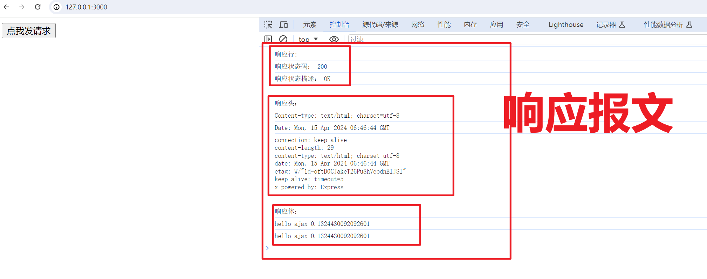


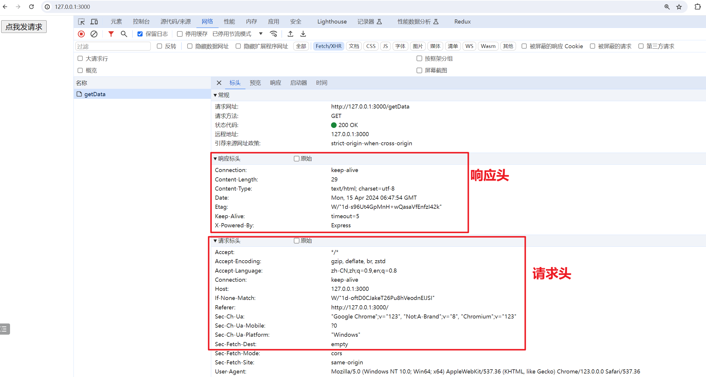


### 7，响应JSON

如果想让后端响应一个JSON，也需要设置一个响应头，告诉客户端，响应的数据类型。书写后端：

```js
// 导入模块
const path = require('path');
const express = require('express');

// 创建 express 实例
const app = express();

app.get("/",(req,res)=>{
    res.sendFile(path.join(__dirname,"../client","index.html"))
})

app.get('/getData', (req, res) => {
    console.log('接收到请求');
    const stus = [
        {id:"01",name:"malu",age:18,score:88},
        {id:"02",name:"wc",age:13,score:23},
        {id:"03",name:"xq",age:16,score:44},
        {id:"04",name:"xx",age:10,score:55},
    ]
    const stusStr = JSON.stringify(stus)
    // 告诉客户端，响应的是JSON数据
    res.setHeader("Content-Type", "application/json;charset=utf-8");
    res.send(stusStr);
});

app.listen(3000,()=>{
    console.log('服务器启动了，端口是3000');
})
```


前端：

```html
<!DOCTYPE html>
<html lang="en">

<head>
    <meta charset="UTF-8">
    <title>Document</title>
    <button id="btn">点我发请求</button>
</head>

<body>
    <script>
        const xhr = new XMLHttpRequest();

        // 设置期望的响应数据的数据类型，期望服务器响应json
        // xhr.responseText  这个API就不能使用了
        xhr.responseType = "json";

        xhr.onload = function () {
            // console.log(JSON.parse(xhr.responseText));

            // xhr.response得到服务器响应的JSON数据  不需要通过JSON.parse
            console.log(xhr.response);
        }

        const btn = document.querySelector("#btn");
        btn.onclick = () => {
            // 请求同一个url，第一次不走缓存，
            // 从第二次开始，就可能走缓存，304表示走的缓存
            // 不想走缓冲，需要让每次请求的url不一样
            // xhr.open("get", "/getData?random="+Math.random())
            xhr.open("get", "/getData?xx="+Date.now())
            xhr.send(null);
        }

    </script>
</body>

</html>
```


浏览器测试：

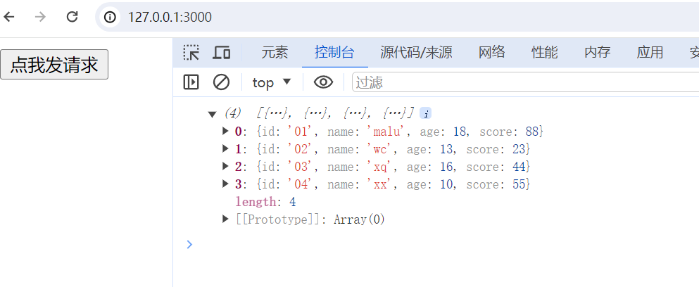

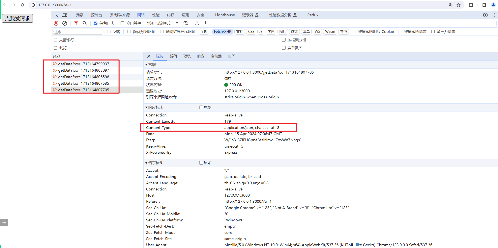


### 8，超时处理


后端：

```js
// 导入模块
const path = require('path');
const express = require('express');

// 创建 express 实例
const app = express();

app.get("/",(req,res)=>{
    res.sendFile(path.join(__dirname,"../client","index.html"))
})

app.get('/getData', (req, res) => {
    console.log('接收到请求');
    const timeout = Math.floor(Math.random()*10) * 1000

    const stus = [
        {id:"01",name:"malu",age:18,score:88},
        {id:"02",name:"wc",age:13,score:23},
        {id:"03",name:"xq",age:16,score:44},
        {id:"04",name:"xx",age:10,score:55},
    ]
    const stusStr = JSON.stringify(stus)
    // 告诉客户端，响应的是JSON数据
    res.setHeader("Content-Type", "application/json;charset=utf-8");
    setTimeout(()=>{
        res.send(stusStr);
    },timeout)
});

app.listen(3000,()=>{
    console.log('服务器启动了，端口是3000');
})
```


前端：

```html
<!DOCTYPE html>
<html lang="en">

<head>
    <meta charset="UTF-8">
    <title>Document</title>
    <button id="btn">点我发请求</button>
    <button id="btn2">手动取消请求</button>
</head>

<body>
    <script>
        const xhr = new XMLHttpRequest();

        xhr.responseType = "json";

        xhr.onload = function () {
            console.log(xhr.response);
        }

        // 设置超时时间  5s
        // 如果时间到了，数据还没有回来，会自动取消请求
        xhr.timeout = 5000; 

        const btn = document.querySelector("#btn");
        btn.onclick = () => {
            xhr.open("get", "/getData?xx="+Date.now())
            xhr.send(null);
        }

        const btn2 = document.querySelector("#btn2");
        btn2.onclick = () => {
          xhr.abort(); // 取消请求~
        }

    </script>
</body>

</html>
```


测试：

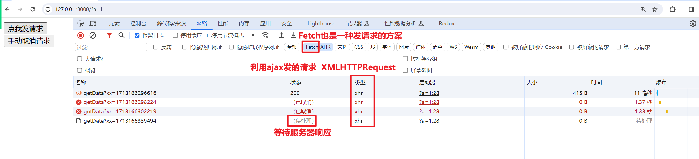


### 9，Ajax中的事件

后端代码：

```js
// 导入模块
const path = require('path');
const express = require('express');

// 创建 express 实例
const app = express();

app.get("/",(req,res)=>{
    res.sendFile(path.join(__dirname,"../client","index.html"))
})

app.get('/getData', (req, res) => {
    console.log('接收到请求');
    const timeout = Math.floor(Math.random()*10) * 1000

    const stus = [
        {id:"01",name:"malu",age:18,score:88},
        {id:"02",name:"wc",age:13,score:23},
        {id:"03",name:"xq",age:16,score:44},
        {id:"04",name:"xx",age:10,score:55},
    ]
    const stusStr = JSON.stringify(stus)
    // 告诉客户端，响应的是JSON数据
    res.setHeader("Content-Type", "application/json;charset=utf-8");
    // setTimeout(()=>{
        // res.send(stusStr);
        res.send('hello malu'.repeat(10000000))
    // },timeout)
    // },10000)
});

app.listen(3000,()=>{
    console.log('服务器启动了，端口是3000');
})
```


在ajax中，除了load事件之外，还有一些其它的事件：
- readystatechange    当ajax状态发生变化，就会触发，触发至少 4 次
- load                响应结束的时候触发，此时 readyState 的值是 4
- loadstart            开始请求的时候触发，此时 readyState 的值是 1
- loadend                响应结束之后触发，不论请求是否成功都会触发
- error                请求失败触发，应用层面的错误也算是请求成功（如 404错误），只有网络错误才算请求失败，指请求无法发出的错误
- progress            当开始接收响应内容，被触发多次，该事件的回调函数可以获取一个 progressEvent 对象


readystatechange，用来监测ajax状态变化的

- 0   UNSET -- XHR对象已创建或已被 abort() 方法重置。 
- 1   OPENDED -- open() 方法已经被调用。
- 2   HEADERS_RECEIVED -- send() 方法已经被调用，并且响应头和响应状态已经可获得。 
- 3   LOADING -- 下载中， responseText 属性已经包含部分数据。 
- 4   DONE -- 所有响应数据接收完毕。


直接上代码，后端代码同步。前端代码如下：

```html
<!DOCTYPE html>
<html lang="en">

<head>
    <meta charset="UTF-8">
    <title>Document</title>
    <style>
        #box {
            margin-top: 20px;
            width: 600px;
            padding: 20px;
            min-height: 200px;
            border: 1px solid #999;
        }
    </style>
</head>

<body>
    <button id="btn">点我发请求</button>
    <button id="btn2">手动取消请求</button>
    <div id="box"></div>
    <script>
        const xhr = new XMLHttpRequest();
        const divBox = document.querySelector("#box")

        // xhr.responseType = "json";

        // xhr有好多状态,只要状态发生变化,就会触发readystatechange事件
        xhr.onreadystatechange = ()=>{
            console.log("xhr readystate:", xhr.readyState)
            // 0  刚new出来时,它的状态是0
            // 1  当设置完请求后,它的状态是1  调用完xhr.open之后
            // 2  发出请求,它的状态是2  调用完xhr.send之后
            // 3  开始接收响应数据时,状态就变成3
            // 4  数据接收完毕,说白了,就是响应完毕了
            if(xhr.readyState === 4){
                // 响应数据接收完毕
                // ......  等价于load事件
            }
        }

        // 开始发请求  xhr.readyState是1
        xhr.onloadstart = ()=>{
            console.log('loadstart');
        }
        // 不管成功还是失败,loadend都要走
        xhr.onloadend = ()=>{
            console.log('onloadend');
        }

        // 数据接收完毕后,会触发load事件
        xhr.onload = function () {
            console.log(xhr.response);
        }

        // 请求失败就会触发, 404是请求成功了, 所谓的失败,就是请求发不出去
        // 只有网络错误,才会请求失败
        xhr.onerror = ()=>{
            console.log('error，请求失败！');
        }

        // 在接收响应数据时,接收一点,就会触发progress事件,直到接入完毕
        xhr.onprogress = (e)=>{
            console.log('e:',e.loaded, e.total);
            // divBox.innerHTML += xhr.responseText
            divBox.innerHTML = "已下载:"+(e.loaded/e.total * 100).toFixed(2)+"%"
            if(e.loaded == e.total){
                divBox.innerHTML = "下载成功~"
            }
        }

        // 设置超时时间  5s
        // 如果时间到了，数据还没有回来，会自动取消请求
        xhr.timeout = 5000; 

        const btn = document.querySelector("#btn");
        btn.onclick = () => {
            // 404 (Not Found)   404表示请求资源服务上没有
            // xhr.open("get", "/getData123?xx="+Date.now())
            xhr.open("get", "/getData?xx="+Date.now())
            xhr.send(null);
        }


        const btn2 = document.querySelector("#btn2");
        btn2.onclick = () => {
          xhr.abort(); // 取消请求~
        }
    </script>
</body>

</html>
```


测试：

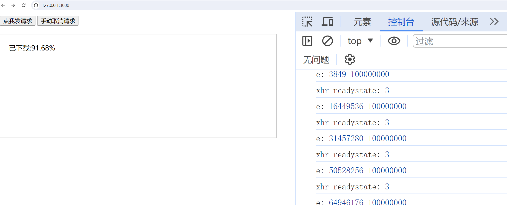


### 10，总结

创建xhr对象，使用构造函数 XMLHttpRequest 就可以创建一个 XHR 对象。

```js
let xhr = new XMLHttpRequest()；
```


ajax对象中的属性如下：

| 属性名       | 含义                                                         |
| ------------ | ------------------------------------------------------------ |
| readyState   | 返回一个数字，表示请求的状态： 0 -- UNSET -- XHR对象已创建或已被 abort() 方法重置。 1 -- OPENDED -- `open()` 方法已经被调用。 2 -- HEADERS_RECEIVED -- `send()` 方法已经被调用，并且响应头和响应状态已经可获得。 3 -- LOADING -- 下载中， `responseText` 属性已经包含部分数据。 4 -- DONE -- 所有响应数据接收完毕。 |
| status       | 响应状态码，如 404、200 等。                                 |
| statusText   | 响应状态码的文本描述，如 200 对应的是 “OK”。                 |
| responseXML  | 接收格式为 XML 的响应数据，返回一个 document 对象。          |
| responseText | 获取响应文本，返回一个字符串。                               |
| responseType | 用于设置响应内容的类型 *xhr2*                                |
| response     | 返回的类型取决于 responseType 的设置。 *xhr2*                |
| timeout      | 设置超时时间。*xhr2*                                         |


ajax对象中的方法如下：

| 方法名                  | 含义                                                         |
| ----------------------- | ------------------------------------------------------------ |
| open()                  | 初始化 HTTP 请求，用来指定请求方式和 URL。 `xhr.open(method, url, [async], [user], [password])` |
| send()                  | 发送 HTTP 请求，参数可以设置请求体，没有请求体无需设置参数。 |
| setRequestHeader()      | 设置 HTTP 请求头的值。必须在 `open()` 之后、`send()` 之前调用。 |
| abort()                 | 如果请求已被发出，则立刻中止请求。                           |
| getAllResponseHeaders() | 以字符串形式返回所有的响应头。                               |
| getResponseHeader()     | 返回指定的响应头。                                           |


ajax对象中的事件如下：

| 事件名           | 含义                                                         |
| ---------------- | ------------------------------------------------------------ |
| readystatechange | readyState 属性值发生变化触发该事件。                        |
| abort            | 请求终止时触发。                                             |
| error            | 请求遇到错误时触发。                                         |
| loadstart        | 接收到响应数据时触发。                                       |
| load             | 请求成功完成时触发。                                         |
| loaded           | 当请求结束时触发, 无论请求成功 ( `load`) 还是失败 (`abor` 或 `error`)。 |
| progress         | 当请求接收到更多数据时，周期性地触发。                       |
| timeout          | 在预设时间内没有接收到响应时触发。                           |


异步请求：

- 在发请求之后，其它的同步任务都已经执行完毕了。

同步请求：

- 在发请求之后，需要等到响应完全结束后才会执行剩下同步任务。


默认情况下，ajax发的请求，都是异步的，通过open方法中的第3个参数可以设置同步

- true 表示异步请求 ， 不写也是true
- false 表示同步请求，基本上不用


### 11，跨域 cors

同源策略是浏览器的一种安全策略，要求ajax代码所在的页面url中的协议，域名，端口与ajax请求中url中的协议，域名，端口要完全一样。举例：有一个这样的域名：http://www.wangcai.com

- http://zhidao.wangcai.com         不同源
- http://www.wangcai.com:8080      不同源
- https://www.wangcai.com        不同源
- http://www.wangcai.com/phone/index.html      同源
- http://www.wangcai.com/phone/huawei/index.html           同源


总结：

- 源：协议 + 域名 + 端口
- 同源：相同的协议 && 相同域名 && 相同的端口
- 不同源：不同的协议 || 不同的域名 || 不同的端口


写代码，演示一下同源策略，先看后端代码：


```js
// 导入模块
const path = require('path');
const express = require('express');

// 创建 express 实例
const app = express();

app.get("/", (req, res) => {
    res.sendFile(path.join(__dirname, "../client", "index.html"))
})

app.get('/getData', (req, res) => {
    console.log("来到服务器了~~")
    res.send('hello malu')
});

app.listen(3000, () => {
    console.log('服务器启动了，端口是3000');
})
```


前端代码：

```html
<!DOCTYPE html>
<html lang="en">
<!-- 
    休息10分钟
 -->
<head>
    <meta charset="UTF-8">
    <title>Document</title>
    <style>
        #box {
            margin-top: 20px;
            width: 600px;
            padding: 20px;
            min-height: 200px;
            border: 1px solid #999;
        }
    </style>
</head>

<body>
    <button id="btn">点我发请求</button>
    <div id="box"></div>
    <script>
        const xhr = new XMLHttpRequest();
        const divBox = document.querySelector("#box")
        const btn = document.querySelector("#btn")

        xhr.onload = ()=>{
            divBox.innerHTML += xhr.response + '<br>';
        }
        xhr.onerror = () => {
            console.log('请求失败！');
        }

        btn.onclick = () => {
            xhr.open("get","http://127.0.0.1:3000/getData")
            xhr.send();
        }
    </script>
</body>

</html>
```


上面ajax代码所在的页面url中的协议，域名，端口与ajax请求中url中的协议，域名，端口要完全一样，测试如下：

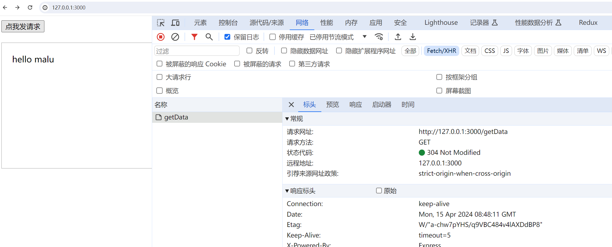


127.0.0.1对应的域名是localhost，通过localhost访问页面，如下：

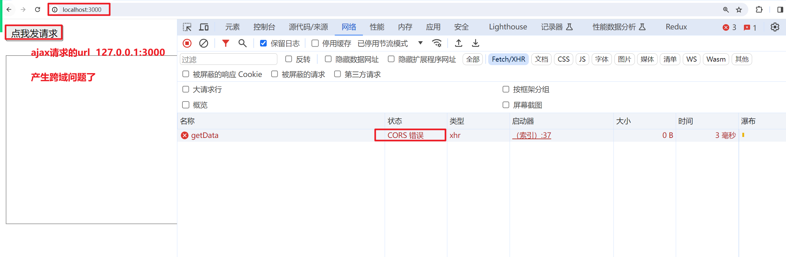

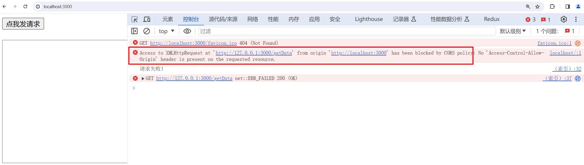


虽然上面的报错了，但是我们看一下，有没有走到服务器，测试如下：

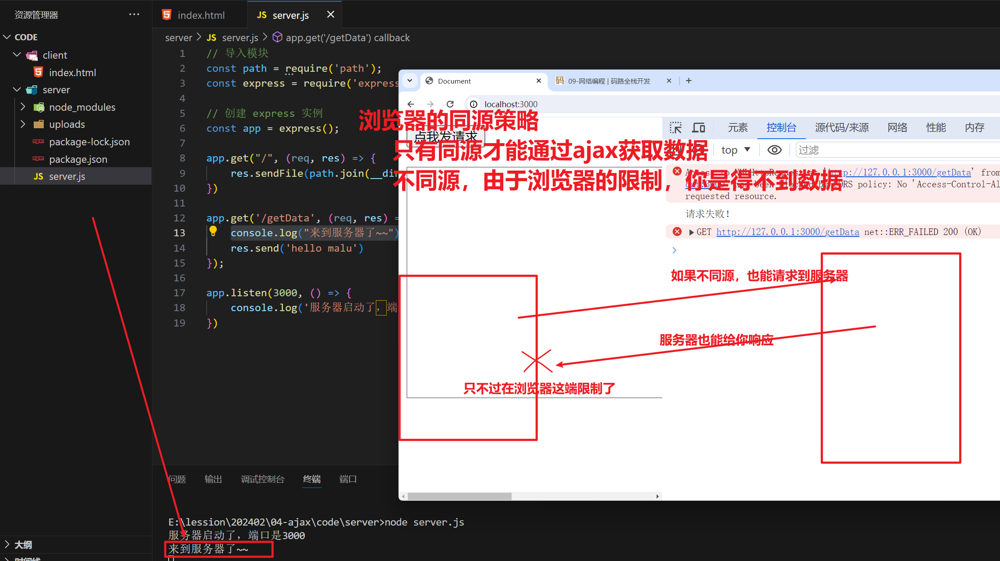


要抵抗同源策略，叫跨域，常见解决跨域的方案：

- cors
- jsonp
- 前端配置代理


先演示一个cors解决跨域域，就是后端去配置解决，如下：

```js
// 导入模块
const path = require('path');
const express = require('express');

// 创建 express 实例
const app = express();

app.get("/", (req, res) => {
    res.sendFile(path.join(__dirname, "../client", "index.html"))
})

app.get('/getData', (req, res) => {
    console.log("来到服务器了~~")
    // 通过请求头，抵抗同源策略
    // res.set('Access-Control-Allow-Origin', 'http://localhost:3000');
    // res.set('Access-Control-Allow-Origin', 'http://192.168.217.1:3000');

    // 请允许多个域名来请求
    // const allowOrigins = ['http://localhost:3000','http://192.168.217.1:3000']
    // if (allowOrigins.includes(req.get('Origin'))) {
    //     res.set('Access-Control-Allow-Origin', req.get('Origin'));
    // }

    // 允许所有的域名
    res.set('Access-Control-Allow-Origin', '*');

    res.send('hello malu')
});

app.listen(3000, () => {
    console.log('服务器启动了，端口是3000');
})
```


配置好之后，即使不同源，也可以获取数据，如下：

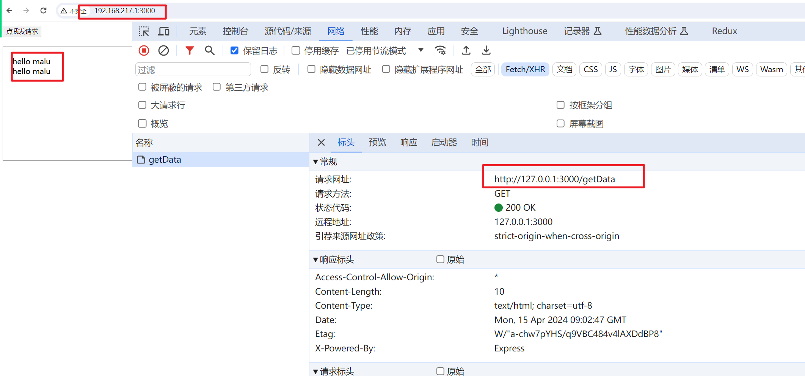


还有一个模块，叫cors模块，使用如下：https://www.npmjs.com/package/cors


### 12，JSONP

回顾昨天的内容：

```html

<script>
    // 1) 创建一个xhr
    let xhr = new XMLHttpRequest()
    // xhr的状态：readyState
    //    0  xhr刚创建
    //    1  open
    //    2  send
    //    3  正在接收数据
    //    4  数据接收完毕，响应完成


    // 2）监听响应成功的事件
    xhr.onload = function(){}

    // 开始请求时触发
    xhr.onloadstart = ()=>{}
    // 响应结束时触发
    xhr.onloadend = ()=>{}
    // 接收数据过程中触发
    xhr.onprogress = ()=>{}
    // 请求发不出去触发（网络错误）
    xhr.onerror = ()=>{}
    // 请求超时触发
    xhr.ontimeout = ()=>{}
    // xhr的状态发生变化时就触发
    xhr.onreadystatechange = ()=>{}

    // 设置超时时间
    xhr.timeout = 5000
    console.log(xhr.readyState);
    console.log(xhr.response);
    console.log(xhr.responseText);
    console.log(xhr.responseXML);
    console.log(xhr.status);
    console.log(xhr.statusText);
    // 设置响应体内容的格式 
    xhr.responseType = "json"
    
    // 把数据扔给服务器都有哪些方式
    //   1）url传参  问号传参  http://127.0.0.1:3000?a=1&b=2&c=3
    //   2）请求体  post put 
    //         text/plain   不设置默认就是text/plain  传的是字符串   a=1&b=2&c=3
    //         application/x-www-form-urlencoded   需要设置请求头（Content-Type）  传的是字符串   a=1&b=2&c=3
    //         application/json   需要设置请求头（Content-Type）  传的是字符串   JSON.stringfy({a:1,b:2,c:3})
    //         multipart/form-data   不需要设置请求头（Content-Type）  send(fd对象)  传的是FormData容器   fd.append("a",1)  fd.append("b",2)
    //             multipart/form-data  还可以上传文件

    // 不使用ajax，使用form表单，也可以传递数据，如果form表单method是post，它的Content-Type，application/x-www-form-urlencoded
    // 不使用ajax，使用form表单，也可以上传文件，form表单的属性：action="/upload" method="post" enctype="multipart/form-data"


    // 3）设置请求
    xhr.open("get","/xxxx")

    // 3）发送请求
    xhr.send()
</script>
```


**不受同源策略的限制**

- 资源的引入 如：img标签的src   link标签的href     script标签的src
- 页面中的超连接 a标签中的href
- 表单的提交
- 重定向页面


如果请求的url，得到的是一个json数据，通常这个url叫API接口， 开源接口：

```
https://docs.tenapi.cn/
https://www.free-api.com/
https://api.aa1.cn/
```


发送http请求的方式：

- 浏览器的地址栏，只能发送get请求
- postman软件，可以各种请求，类似postman这样的软件有很多
- html中有些标签也会发请求，如img, link, script, a, form....
- ajax可以发各位请求，最大的特点：局部刷新，提升用户体验
- .....


JSONP不是ajax，JSONP发请求本质是利用script标签的src发的请求，先准备后端代码：

```js
const path = require('path');
const express = require('express');

const app = express();

// http://127.0.0.1:3000/?callBack=fn
app.get("/", (req, res) => {
    let cb = req.query.callBack;

    // "fn(JSON.stringify({a:1,b:2}))"  
    res.send(`${cb}(JSON.stringify({a:1,b:2}))`)
})


app.listen(3000, () => {
    console.log('服务器启动了，端口是3000');
})
```


前端代码：

```html
<!DOCTYPE html>
<html lang="en">
<!-- 
    休息10分钟
 -->

<head>
    <meta charset="UTF-8">
    <title>Document</title>
</head>

<body>
    <button id="btn">点我发请求</button>
    <div id="box"></div>
    <script>
        let btn = document.querySelector("#btn");

        // jsonp的原理
        function jsonp(options) {
            let callName = "fn";

            // data就是服务器响应的数据
            window[callName] = function (data) {
                console.log("fn函数执行了....");
                if (data != null) {
                    options.success(data)
                } else {
                    options.fail();
                }
            }

            // 利用script标签的src发请求,没有跨域问题
            // "fn(JSON.stringify({a:1,b:2}))"  
            let url = options.url + "?callBack=" + callName
            let scriptEle = document.createElement("script");
            scriptEle.src = url;
            document.body.append(scriptEle)
        }

        btn.onclick = function () {
            jsonp({
                url: "http://127.0.0.1:3000/",
                success: function (data) {
                    console.log("data:", data);
                },
                fail: function (err) {
                    console.log("数据请求失败了");
                }
            })
        }
    </script>
</body>

</html>
```


测试：

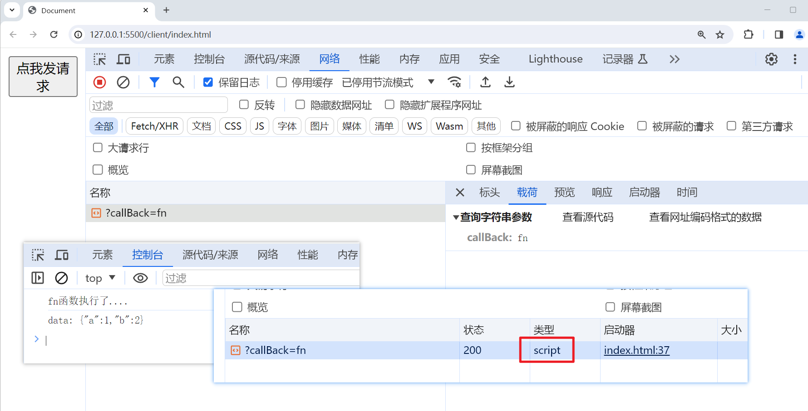


做一个百度联想搜索的案例：

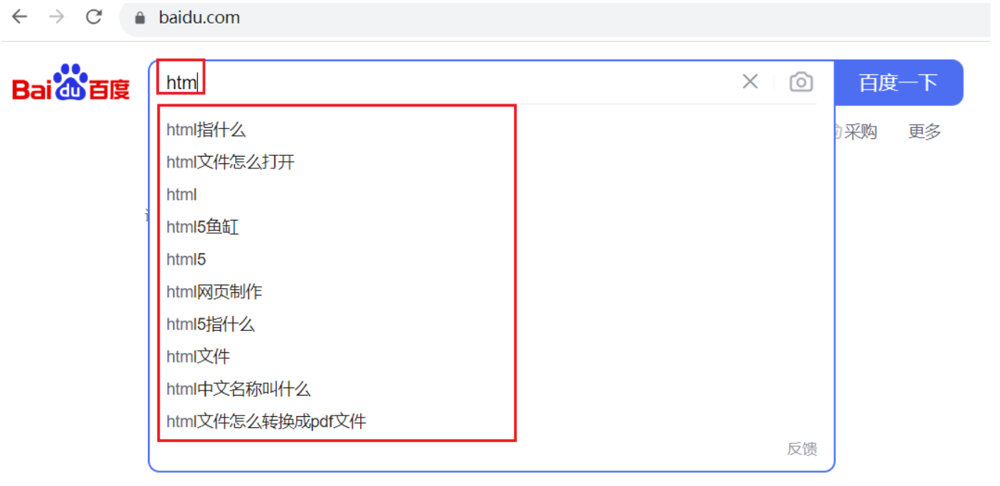


创建项目的目录结构：

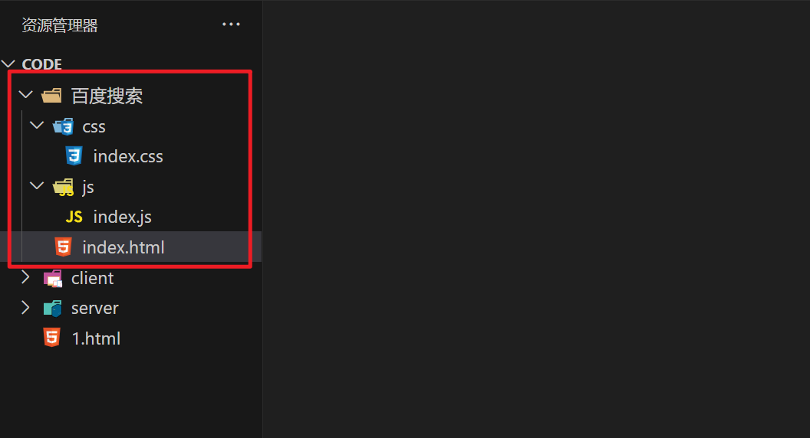


html结构：

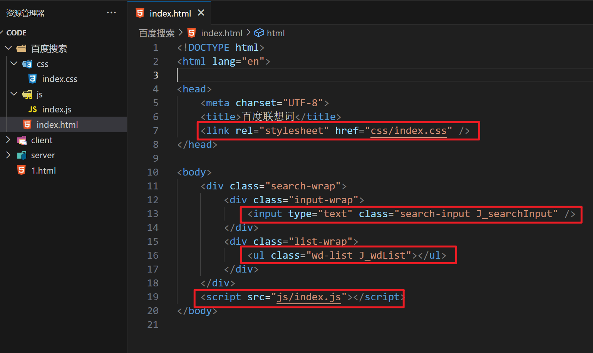

```html
<!DOCTYPE html>
<html lang="en">

<head>
    <meta charset="UTF-8">
    <title>百度联想词</title>
    <link rel="stylesheet" href="css/index.css" />
</head>

<body>
    <div class="search-wrap">
        <div class="input-wrap">
            <input type="text" class="search-input J_searchInput" />
        </div>
        <div class="list-wrap">
            <ul class="wd-list J_wdList"></ul>
        </div>
    </div>
    <script src="js/index.js"></script>
</body>

```


css样式：

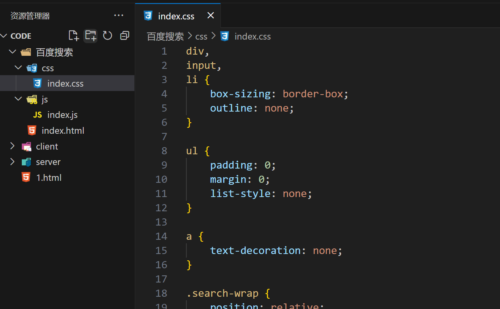


```css
div,
input,
li {
    box-sizing: border-box;
    outline: none;
}

ul {
    padding: 0;
    margin: 0;
    list-style: none;
}

a {
    text-decoration: none;
}

.search-wrap {
    position: relative;
    width: 536px;
    height: 40px;
    margin: 200px auto;
}

.search-wrap .search-input {
    width: 100%;
    height: 40px;
    border: 1px solid #b8b8b8;
    border-bottom: 1px solid #ccc;
    text-indent: 10px;
    font-size: 18px;
}

.search-wrap .search-input:hover {
    border: 1px solid #999;
}

.search-wrap .search-input:focus {
    border: 1px solid #38f;
}

.search-wrap .list-wrap {
    display: none;
    position: absolute;
    top: 40px;
    left: 0;
    width: 100%;
    border: 1px solid #ccc;
    background-color: #fff;
}

.search-wrap .list-wrap .wd-item {
    height: 25px;
    padding-left: 10px;
    line-height: 25px;
}

.search-wrap .list-wrap .wd-item:hover {
    background-color: #efefef;
}

.search-wrap .list-wrap .wd-lk {
    font-weight: bold;
    color: #000;
    font-size: 14px;
}

.search-wrap .list-wrap .wd-lk .font-normal {
    font-weight: normal;
}
```


看效果：

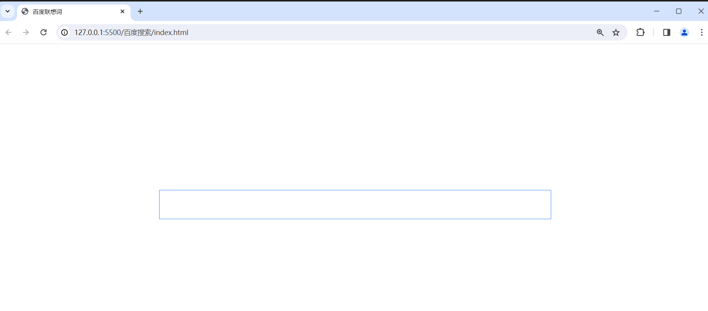


开始写JS代码：


```js
;(function() {
    // 接口地址：https://sp0.baidu.com/5a1Fazu8AA54nxGko9WTAnF6hhy/su?wd=
    // "https://sp0.baidu.com/5a1Fazu8AA54nxGko9WTAnF6hhy/su?wd=" + value + "&cb=" + callbackName


    // <li class="wd-item">
    //     <a href="https://www.baidu.com/s?wd={{wdLink}}" target="_blank" class="wd-lk">{{wd}}</a>
    // </li> 

    let searchInput = document.getElementsByClassName("J_searchInput")[0];
    let wdList = document.getElementsByClassName("J_wdList")[0];
    let listWrap = wdList.parentNode;

    searchInput.addEventListener("input", function() {
        let val = this.value.trim();
        if(val.length>0){
           getData(val, 'fn')
        }else{
            wdList.innerHTML = "";
            listWrap.style.display = 'none';
        }
    })

    window.fn = function(data) {
        console.log("data:", data.s);
        renderList(data.s)
    }

    function getData(val, callbackName){
        let oScript = document.createElement("script");
        oScript.src = "https://sp0.baidu.com/5a1Fazu8AA54nxGko9WTAnF6hhy/su?wd=" + val + "&cb=" + callbackName
        document.body.append(oScript)
    }

    function renderList(data){
        let str = "";
        if(data.length){
            data.forEach(item => {
                str += `
                    <li class="wd-item">
                        <a href="https://www.baidu.com/s?wd=${item}" target="_blank" class="wd-lk">${item}</a>
                    </li> 
                `;
            })
            wdList.innerHTML = str;
            listWrap.style.display = 'block';
        }else{
            wdList.innerHTML = "";
            listWrap.style.display = 'none';
        }
    }
})();
```


测试：

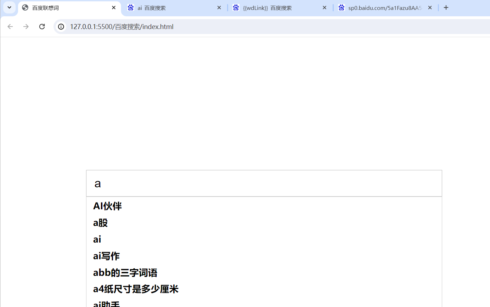


### 13，Fetch

Fetch API 被设计用来取代 XMLHttpRequest，它提供了许多与 XMLHttpRequest 相同的功能，但被设计成更具可扩展性和高效性。

Fetch API 的主要特点包括：

1. Promise 风格的 API：Fetch API 提供了 Promise 风格的 API，可以更加方便地处理异步请求和响应。
2. 更加灵活的请求和响应：Fetch API 可以发送任何类型的请求，包括 GET、POST、PUT、DELETE 等，也可以接收任何类型的响应，包括文本、JSON、二进制数据等。
3. 更加强大的响应处理：Fetch API 提供了一系列的响应处理方法，包括 json()、text()、blob()、arrayBuffer() 等，可以更加方便地处理响应数据。


演示fetch的基本使用：

```html
<!DOCTYPE html>
<html lang="en">
<head>
    <meta charset="UTF-8">
    <title>Document</title>
</head>

<body>
    <!-- CRUD   增删改查 -->
    <button id="btn1">get请求</button>
    <button id="btn2">post请求</button>
    <button id="btn3">put请求</button>
    <button id="btn4">delete请求</button>
    <script>
      let btn1 = document.querySelector("#btn1");
      let btn2 = document.querySelector("#btn2");
      let btn3 = document.querySelector("#btn3");
      let btn4 = document.querySelector("#btn4");

      // get请求
      btn1.onclick = function(){
        // fetch方法返回 pormise对象
        // let p = fetch("http://httpbin.org/get?a=1");
        // console.log(p)  // Promise padding

        fetch("http://httpbin.org/get?a=1").then(res=>{
            console.log("--res:",res)
        })
      }
      btn2.onclick = function(){}
      btn3.onclick = function(){}
      btn4.onclick = function(){}
    </script>
</body>

</html>
```


浏览器测试：

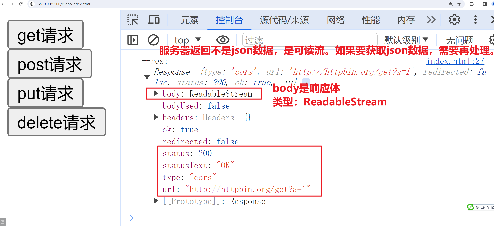


发送get请求：

```html
<!DOCTYPE html>
<html lang="en">

<head>
    <meta charset="UTF-8">
    <title>Document</title>
</head>

<body>
    <!-- CRUD   增删改查 -->
    <button id="btn1">get请求</button>
    <button id="btn2">post请求</button>
    <button id="btn3">put请求</button>
    <button id="btn4">delete请求</button>
    <script>
        let btn1 = document.querySelector("#btn1");
        let btn2 = document.querySelector("#btn2");
        let btn3 = document.querySelector("#btn3");
        let btn4 = document.querySelector("#btn4");

        // get请求
        btn1.onclick = async function () {
            // fetch方法返回 pormise对象
            // let p = fetch("http://httpbin.org/get?a=1");
            // console.log(p)  // Promise padding

            // fetch("http://httpbin.org/get?a=1").then(res=>{
            //     return res.json(); // 把可读流处理成json数据
            // }).then(data=>{
            //     console.log("data:",data)
            // }).catch(reason=>{
            //     console.log('请求失败！', reason);
            // })

            // fetch("http://httpbin.org/get?a=1").then(res=>res.json()).then(data=>{
            //     console.log("data:",data)
            // }).catch(reason=>{
            //     console.log('请求失败！', reason);
            // })

            try {
                const res = await fetch("http://httpbin.org/get?a=1")
                const data = await res.json();
                console.log(data);
            } catch (reason) {
                console.log('请求失败！', reason);
            }
        }
        btn2.onclick = function () { }
        btn3.onclick = function () { }
        btn4.onclick = function () { }
    </script>
</body>

</html>
```


还可以发其它请求：

```html
<!DOCTYPE html>
<html lang="en">

<head>
    <meta charset="UTF-8">
    <title>Document</title>
</head>

<body>
    <!-- CRUD   增删改查 -->
    <button id="btn1">get请求</button>
    <button id="btn2">post请求</button>
    <button id="btn3">put请求</button>
    <button id="btn4">delete请求</button>
    <script>
        let btn1 = document.querySelector("#btn1");
        let btn2 = document.querySelector("#btn2");
        let btn3 = document.querySelector("#btn3");
        let btn4 = document.querySelector("#btn4");

        // get请求
        btn1.onclick = async function () {
            const res = await fetch("http://httpbin.org/get?a=1")
            const data = await res.json();
            console.log(data);
        }
        // post请求
        btn2.onclick = async function () {
            let user = {name:"malu",age:10,sex:"man",score:{chinese:110,maths:90,english:88}}
            const res = await fetch("http://httpbin.org/post",{
                method:"post",
                headers:{
                    'Content-type': 'application/json',
                },
                body:JSON.stringify(user)
            })
            const data = await res.json()
            console.log("data:",data)
         }
        // put请求
        btn3.onclick = async function () { 
            let user = {id:1, name:"malu",age:10,sex:"woman",score:{chinese:66,maths:44,english:99}}
            const res = await fetch("http://httpbin.org/put",{
                method:"put",  // 修改数据
                headers:{
                    'Content-type': 'application/json',
                },
                body:JSON.stringify(user)
            })
            const data = await res.json()
            console.log("data:",data)
        }
        // delete请求
        btn4.onclick = async function () { 
            const res = await fetch("http://httpbin.org/delete/1",{
                method:"delete", 
                headers:{
                    'Content-type': 'application/json',
                }
            })
            const data = await res.json()
            console.log("data:",data)
        }
    </script>
</body>

</html>
```


### 14，Axios介绍

Axios 是前端最流行的 ajax 请求库 ，没有之一，react、vue官方都推荐使用 的 Ajax 请求库。
- 官方网站：https://axios-http.com
- 仓库地址：https://github.com/axios/axios
- 中文文档：https://axios-http.com/zh/docs/intro


axios特点
- 基于 XMLHttpRequest + Promise 的异步的 Ajax 请求库
- 浏览器端、Node端都可以使用
- 支持请求和响应拦截器
- 支持请求取消 
- 批量发送多个请求
- 支持请求与响应的数据转换（二次封装）
  

下载后在页面引入或者直接使用 CDN
```html
<script src="axios脚本文件地址"></script>
```
```html
<script src="https://cdn.jsdelivr.net/npm/axios/dist/axios.min.js"></script>
```


代码演示：

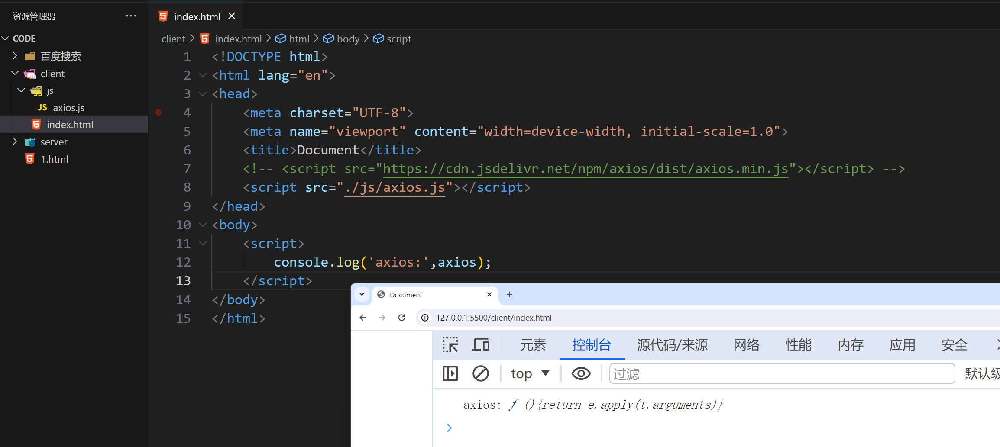


### 15，Axios的基本使用

- axios(config): 通用/最本质的发送意类型请求的方式。
- axios(url[, config]): 第一个参数是地址，第二个参数是配置项。
- axios.request(config): 等同于axios(config) （了解）
- axios.get(url[, config]): 发get请求
- axios.delete(url[, config]): 发delete请求
- axios.post(url[, data, config]): 发post请求
- axios.put(url[, data, config]): 发put请求
- axios.patch(url[, data[, config]]) 发送patch请求


代码演示：

```html
<!DOCTYPE html>
<html lang="en">
<head>
    <meta charset="UTF-8">
    <meta name="viewport" content="width=device-width, initial-scale=1.0">
    <title>Document</title>
    <!-- <script src="https://cdn.jsdelivr.net/npm/axios/dist/axios.min.js"></script> -->
    <script src="./js/axios.js"></script>
</head>
<body>
    <button id="btn">使用axios发请求</button>
    <script>
        const btn = document.querySelector("#btn");

        btn.onclick = async function(){
            // 使用方式一  axios函数使用一个对象作为参数
            // axios({
            //     method:"GET",
            //     url:'https://tenapi.cn/v2/toutiaohot'
            // }).then(res => {
            //     console.log(res);
            // }).catch(reason => {
            //     console.log('请求失败！', reason);
            // });

            // 使用方式二  第一个参数是url，第二个参数是请求配置对象
            // axios("/toutiaohot",{
            //     method:"GET",
            //     baseURL:"https://tenapi.cn/v2",
            //     timemout:5000
            // }).then(res => {
            //     console.log(res);
            // }).catch(reason => {
            //     console.log('请求失败！', reason);
            // });

            // 使用方式三  axios.request() 方法同 axios 本身
            // axios.request("/toutiaohot",{
            //     method:"GET",
            //     baseURL:"https://tenapi.cn/v2",
            //     timemout:5000
            // }).then(res => {
            //     console.log(res);
            // }).catch(reason => {
            //     console.log('请求失败！', reason);
            // });

            // 使用方式四  axios.get()  axios.post()
            // axios.get("/toutiaohot",{
            //     baseURL:"https://tenapi.cn/v2",
            //     timemout:5000
            // }).then(res => {
            //     console.log(res);
            // }).catch(reason => {
            //     console.log('请求失败！', reason);
            // });

            // 使用方式五   async await 方式
            // const res = await axios.get("/toutiaohot",{
            //     baseURL:"https://tenapi.cn/v2",
            //     timemout:5000
            // })
            const res = await axios.get("https://tenapi.cn/v2/toutiaohot")
            console.log(res);
        }
    </script>
</body>
</html>
```


### 16，Axios请求配置项

使用json-server参考文章：https://blog.csdn.net/liyou123456789/article/details/132012512


安装json-server，如下：

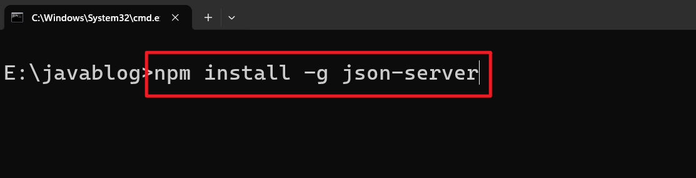


测试是否安装成功：

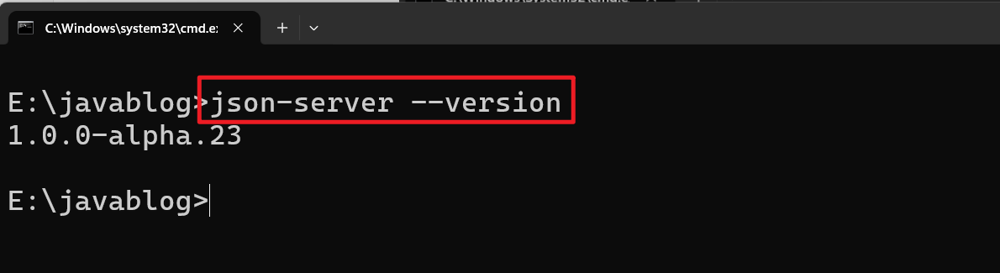


创建json文件：


```json
{
    "users": [
        {
            "id": 1,
            "name": "malu"
        },
        {
            "id": 2,
            "name": "wc"
        }
    ]
}
```


启动json-server，如下：

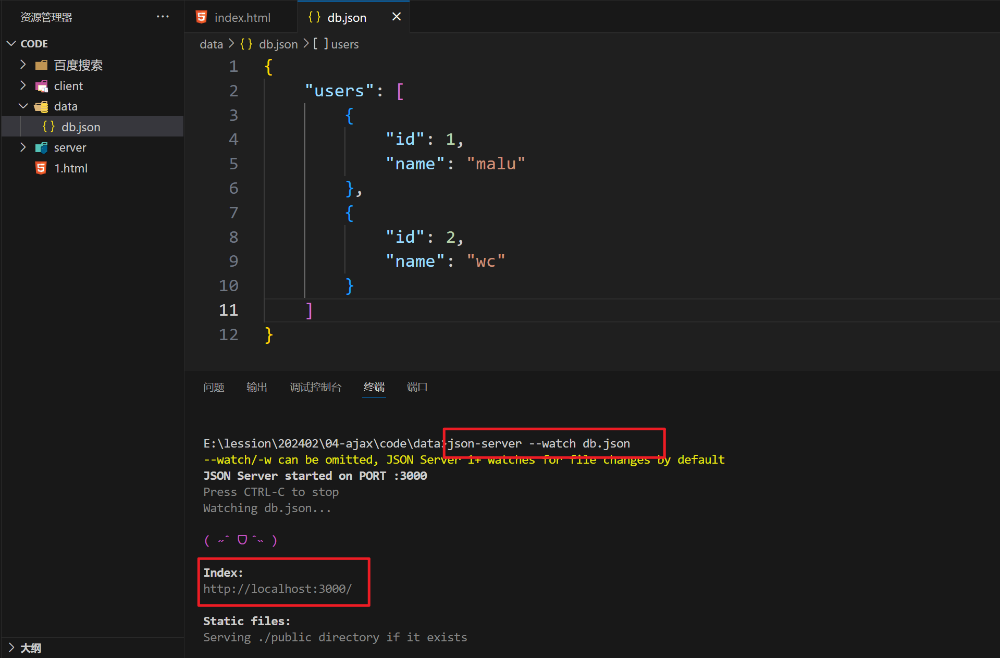


访问之：

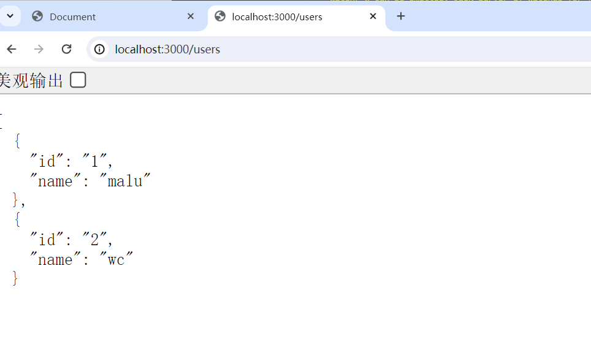

托管静态页面，如下：

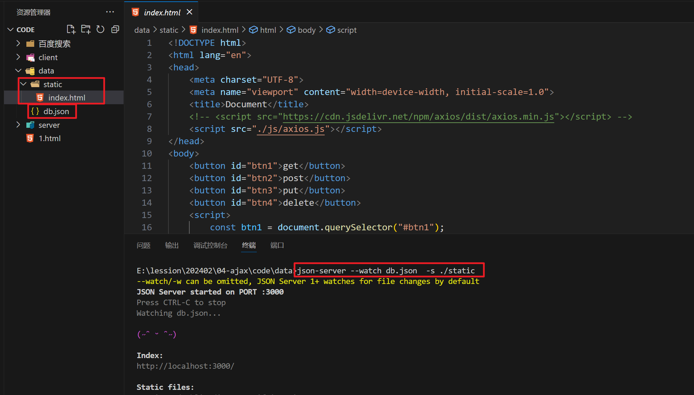


浏览器访问：

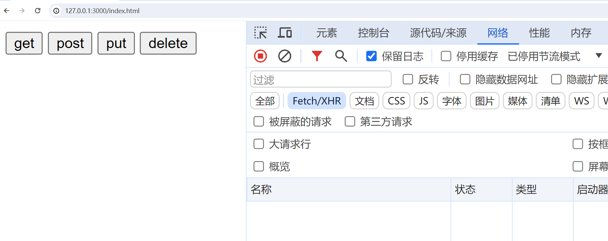


常用的请求配置项：

```js
{
     // `url` 是用于请求的服务器 URL
      url: '/user',

      // `method` 是创建请求时使用的方法
      method: 'get', // default

      // `baseURL` 将自动加在 `url` 前面，除非 `url` 是一个绝对 URL。
      // 它可以通过设置一个 `baseURL` 便于为 axios 实例的方法传递相对 URL
      baseURL: 'https://some-domain.com/api/',

    // `headers` 是即将被发送的请求头
      headers: {
        'Content-type': 'appliation/json'
    },
    // `data` 是作为请求主体被发送的数据
    // 只适用于这些请求方法 'PUT', 'POST', 和 'PATCH'
    // 在没有设置 `transformRequest` 时，必须是以下类型之一：
    // - string, plain object, ArrayBuffer, ArrayBufferView, URLSearchParams
    // - 浏览器专属：FormData, File, Blob
    // - Node 专属： Stream
    data: {
       firstName: 'Fred'
    },

     // `timeout` 指定请求超时的毫秒数(0 表示无超时时间)
     // 如果请求话费了超过 `timeout` 的时间，请求将被中断
     timeout: 1000,

     // `responseType` 表示服务器响应的数据类型，可以是 'arraybuffer', 'blob', 'document', 'json', 'text', 'stream'
       responseType: 'json', // default
}
```


发送get请求，代码如下：

```html
<!DOCTYPE html>
<html lang="en">
<head>
    <meta charset="UTF-8">
    <meta name="viewport" content="width=device-width, initial-scale=1.0">
    <title>Document</title>
    <script src="https://cdn.jsdelivr.net/npm/axios/dist/axios.min.js"></script>
</head>
<body>
    <button id="btn1">get</button>
    <button id="btn2">post</button>
    <button id="btn3">put</button>
    <button id="btn4">delete</button>
    <script>
        const btn1 = document.querySelector("#btn1");
        const btn2 = document.querySelector("#btn2");
        const btn3 = document.querySelector("#btn3");
        const btn4 = document.querySelector("#btn4");

        // 做全局配置
        axios.defaults.baseURL = "http://localhost:3000"
        axios.defaults.timeout = 5000;
        axios.defaults.headers.token = "xxxx";  // 不用管

        // get
        btn1.onclick = async function(){
            // axios.get("/users?a=1&b=2").then(res => {
            axios.get("/users",{
                params:{name:"malu"}  // 也是配置问号传参
            }).then(res => {
                console.log(res.data);
            }).catch(reason => {
                console.log('请求失败：', reason);
            })
        }
        // post
        btn2.onclick = async function(){ }
        // put
        btn3.onclick = async function(){ }
        // delete
        btn4.onclick = async function(){ }
    </script>
</body>
</html>
```


浏览器测试：

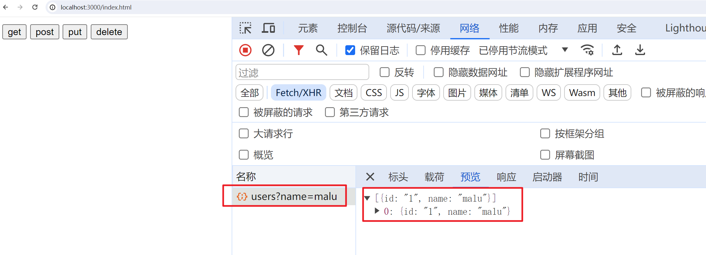

发送post, put, delete请求：

```html
<!DOCTYPE html>
<html lang="en">

<head>
    <meta charset="UTF-8">
    <meta name="viewport" content="width=device-width, initial-scale=1.0">
    <title>Document</title>
    <script src="https://cdn.jsdelivr.net/npm/axios/dist/axios.min.js"></script>
</head>

<body>
    <button id="btn1">get</button>
    <button id="btn2">post</button>
    <button id="btn3">put</button>
    <button id="btn4">delete</button>
    <script>
        const btn1 = document.querySelector("#btn1");
        const btn2 = document.querySelector("#btn2");
        const btn3 = document.querySelector("#btn3");
        const btn4 = document.querySelector("#btn4");

        // 做全局配置
        axios.defaults.baseURL = "http://localhost:3000"
        axios.defaults.timeout = 5000;
        axios.defaults.headers.token = "xxxx";  // 不用管

        // get
        btn1.onclick = async function () {
            // axios.get("/users?a=1&b=2").then(res => {
            axios.get("/users", {
                params: { name: "malu" }  // 也是配置问号传参
            }).then(res => {
                console.log(res.data);
            }).catch(reason => {
                console.log('请求失败：', reason);
            })
        }
        // post
        btn2.onclick = async function () {
            // Content-Type: application/json
            let user = {
                id: 3,
                name: "xq"
            };
            // axios.post中第二个参数是请求体, 第三个参数是配置对象
            // 传递的参数的类型是:Content-Type: application/json
            // 不需要通过JSON.stringify包了
            axios.post("/users", user, {}).then(res => {
                console.log(res.data);
            }).catch(reason => {
                console.log('请求失败：', reason);
            })
        }
        // put
        btn3.onclick = async function () {
            let user = {
                name: "malu666"
            };
            axios.put("/users/1", user, {}).then(res => {
                console.log(res.data);
            }).catch(reason => {
                console.log('请求失败：', reason);
            })
        }
        // delete
        btn4.onclick = async function () {
            axios.delete("/users/3").then(res => {
                console.log(res.data);
            }).catch(reason => {
                console.log('请求失败：', reason);
            })
        }
    </script>
</body>

</html>
```


每次发送请求时设置配置项

```js
axios({
    配置项
    ...
});

axios(url, {
    配置项
       ...
});

axios.get(url, {
    配置项
    ...
});

axios.post(url, data, {
    配置项
    ...
})
```


设置全局配置项，将被应用到每一个要求。

```js
axios.defaults.baseURL = "http://api.example.com";
axios.defaults.timeout = 2000;
axios.defaults.headers = {
    token:"abc",
    a:1,
    b:2
}
```


