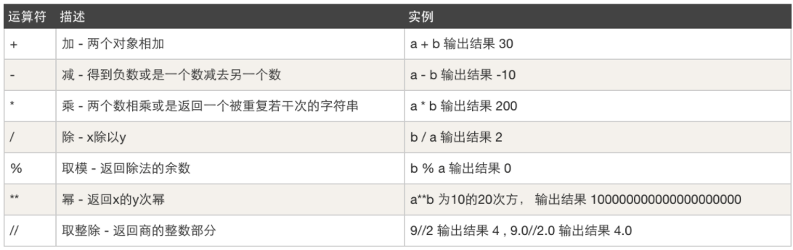
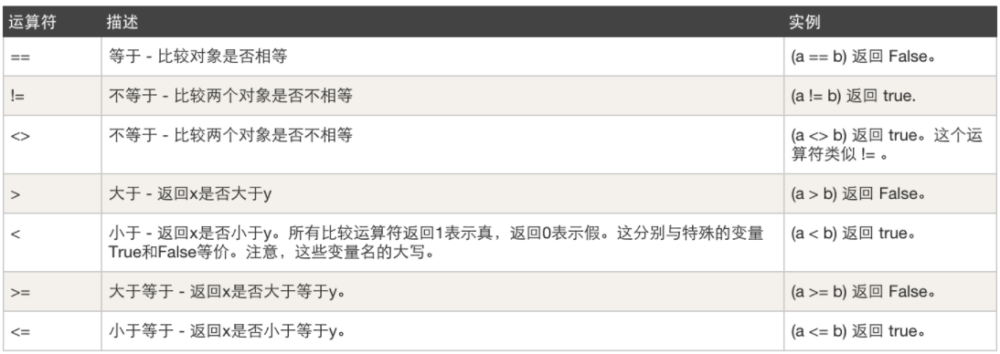
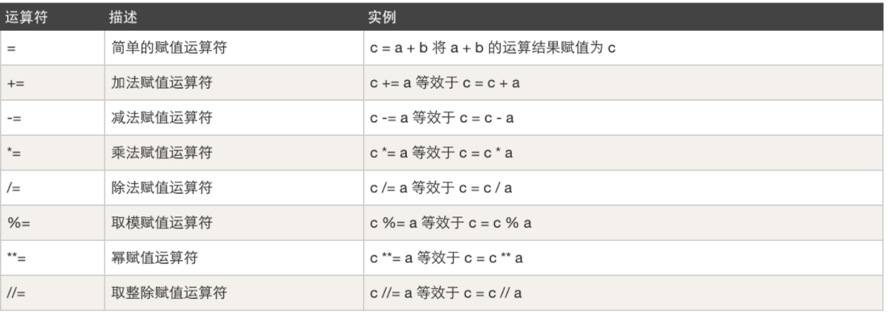
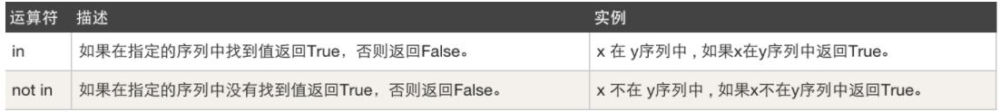

## 1. 编码（密码本）

**计算机中所有的数据本质上都是以0和1的组合来存储**。


在计算机中会将中文内存转换成 01010101010... ，最终存储到硬盘上。

在计算机中有这么一个编码的概念（密码本）。

```
撩     ->      11111111 00000000 010101010
码     ->      01001111 10010000 001110100  
```

在计算机中有很多种编码。

```
每种编码都有自己的一套密码本，都维护这自己的一套规则，如：
    utf-8编码：
        撩     ->      11111111 00000000 010101010
        码     ->      01001111 10010000 001110100  
    gbk编码：
        撩     ->      11111111 00000010
        码     ->      00110011 10101010
所以，使用的不同的编码保存文件时，硬盘的文件中存储的0/1也是不同的。
```

注意事项：以某个编码的形式进行保存文件，以后就要以这种编码去打开这个文件。否则就会出现乱码。

```
UTF-8编码去保存撩码：11111111 00000000 010101010 01001111 10010000 001110100
GBK编码形式去打开：乱码
```

## 2. 编程初体验

python程序的构成：

1. Python程序由模块组成。一个模块对应python源文件，一般后缀名是：.py
2. 模块由语句组成。运行Python程序时，按照模块中语句的顺序依次执行
3. 语句是Python程序的构造单元，用于创建对象、变量赋值、调用函数、控制语句等


代码的组织和缩进：

- 很多编程语言通过字符(例如：花括号{})、关键字(例如：begain/end)来划分代码块。同时，在配合代码的缩进增加可读性。“龟叔”设计Python语言时，直接通过缩进来组织代码块。“缩进”成为了Python语法强制的规定。
- 缩进时，几个空格都是允许的，但是数目必须统一。**通常采用“四个空格”表示一个缩进**。
- 同时，也要避免将“tab制表符”或者tab与空格混合的缩进风格。目前，**常用的编辑器一般设置成：tab制表符就是4个空格**


使用\行连接符：

- 一行程序长度是没有限制的，但是为了可读性更强，通常将一行比较长的程序分为多行。这是，我们可以使用\行连接符，把它放在行结束的地方。Python解释器仍然将它们解释为同一行。

  ```python
  a = [10,20,30,40,\
    50,60,70,\
    80,90,100]
  b = 'abcdefg\
      hijklmn\
      opqrst\
      uvwxyz'
  print(a)
  print(b)
  ```

  

开始编码：

* 编码必须要保持：保存和打开一直，否则会乱码。

* 默认Python解释器是以UTF-8编码的形式打开文件。如果想要修改Python的默认解释器编码，可以这样干：

  

```python
  # -*- coding:gbk -*-
  
  print("hello python")
```

* 建议：所有Python代码文件的都要以UTF-8编码保存和读取。

## 3. 输出

将结果或内容想要呈现给用户。

```python
print("看着风景美如画")
```

```python
print("                                                            * *  ")
print("                                                         * * * *  ")
print("                                                      * * * * * *  ")
print("                                                   * * * * * * * *  ")
print("                                                * * * * * * * * * *  ")
print("                                             * * * * * * * * * * * *  ")
print("                                              * * * * * * * * * * * *  ")
print("                                               * * * * * * * * * * * *  ")
print("                                      * *       * * * * * * * * * * * *  ")
print("                                   * * * *       * * * * * * * * * * * *  ")
print("                                * * * * * *       * * * * * * * * * * * *  ")
print("                             * * * * * * * *       * * * * * * * * * * * *  ")
print("                          * * * * * * * * * *       * * * * * * * * * * * *  ")
print("                       * * * * * * * * * * * *       * * * * * * * * * * * *  ")
print("                        * * * * * * * * * * * *       * * * * * * * * * * * *  ")
print("                         * * * * * * * * * * * *       * * * * * * * * * * * *  ")
print("                * *       * * * * * * * * * * * *       * * * * * * * * * * * *  ")
print("             * * * *       * * * * * * * * * * * *       * * * * * * * * * * * *  ")
print("          * * * * * *       * * * * * * * * * * * *       * * * * * * * * * * * *  ")
print("       * * * * * * * *       * * * * * * * * * * * *       * * * * * * * * * * * *  ")
print("    * * * * * * * * * *       * * * * * * * * * * * *       * * * * * * * * * * * *  ")
print(" * * * * * * * * * * * *       * * * * * * * * * * * *       * * * * * * * * * * * *  ")
print("  * * * * * * * * * * * *       * * * * * * * * * * * *       * * * * * * * * * * * *  ")
print("   * * * * * * * * * * * *       * * * * * * * * * * * *       * * * * * * * * * * * *  ")
```

关于输出：

* 默认print在尾部会加换行符

  

```python
print("看着风景美如画")
print("本想吟诗增天下")

输出：
看着风景美如画
本想吟诗增天下
```

* 想要不换行，则可以这样干

  

```python
print("看着风景美如画",end="")
print("本想吟诗增天下",end="")

输出：
看着风景美如画本想吟诗增天下
```

  

```python
print("看着风景美如画",end=",")
print("本想吟诗增天下",end=".")

输出：
看着风景美如画,本想吟诗增天下.
```

  

### 练习题

1. 使用print输出自己的姓名

```python
print("撩码")
```

02. 使用print输出
      春眠不觉晓，
      出处闻啼鸟，
      夜来风雨声，
      花落知多少。

```python
print("春眠不觉晓，")
print("出处闻啼鸟，")
print("夜来风雨声，")
print("花落知多少。")
```

03. 是用print输出
      春眠不觉晓，出处闻啼鸟，夜来风雨声，花落知多少。

```python
print("春眠不觉晓，", end="")
print("出处闻啼鸟，", end="")
print("夜来风雨声，", end="")
print("花落知多少。", end="")
```

   

## 4. 初识数据类型

刚上学时，老师教我们 数字 、拼音、汉字、真假判断 等，然后我们根据学到的内容写作文，老师来检查并打分。现在学编程，我教大家 int、str、bool 等，然后大家根据这些内容来写代码，写完代码交给Python解释器去运行。

python中变量没有类型，但是对象都有类型，python中最基本的内置数据类型：

1. 整型 `int`

   整数，`2345`,`10`,`50`

2. 浮点型 `float`

   小数，`3.14`或者科学计数法`314e-2`

3. 布尔型 `bool`

   表示真假，仅包含：`True`、`False`

4. 字符串型 `str`

   由字符组成的序列。 `"abc"`,`'malu'`


### 4.1 整形（int）

整形，整数。

整型，其实就是以前数学课上讲的整数（不包含小数），在写代码时用于表示整数相关的东西，例如：年龄、存款、尺寸、手机号等。
一般我们提到的：5、18、22、99、… 等整数 在Python中都称为是整型，且支持 加/减/乘/除/取余/指数 等操作。

```python
print(666)
print(2 + 10)
print(2 * 10)
print(10 / 2)
print(10 % 3)
print(2 ** 4)
```

### 4.2 字符串（str）

字符串，其实就是我们生活中的文本信息。例如：姓名、地址、自我介绍等。
字符串有一个特点，他必须由引号引起来，如：

单行字符串

```python
print("我是撩码")
print('我是撩码')
print("中国北京昌平区")
```

多行字符串

```python
print("""中国北京昌平区""")
print('''中国北京昌平区''')
print("""中国北京昌平区
1111
2222
3333
4444
""")
```

对于字符串：

* 加，两个字符串可以通过加号拼接起来。


```python
  print( "hello" + "python" )
```

* 乘，让整形和字符串进行相乘，以实现让字符串重复出现N次并拼接起来。


```python
  print(3 * "python")
```

### 4.3 布尔类型（bool）

Python2中没有布尔值，直接用数字`0`表示`False`, 用数字`1`表示`True`。Python3中，把`True`和`False`定义成了关键字，但他们的本质还是`1`和`0`，甚至可以和数字相加。


注意：在Python语言底层，会将布尔值True看作1，将布尔值False看作0，尽管从表面上看，True和1、False和0是完全不同的两个值，但实际上，它们是相同的。


在Python语言中有一些特殊的布尔类型值为False，例如False、0、0.0、空值None、空序列对象（空列表、空元祖、空集合、空字典、空字符串）、空range对象、空迭代对象。其他情况，均为True。


布尔类型中共有两个值：True / False

```python
print(1 > 2)
print(False)

print(1 == 1)
print(True)

a = True
b = 3
c = a+b     #c的值是：4
print(c)
print('空字符串的布尔类型的值:',bool(""))      #False
print('空列表布尔类型的值:',bool([]))        #False
print('None布尔类型的值:',bool(None))     #False
print('0布尔类型的值:',bool(0))           #False
print('字符串True和False转成布尔都是True：',bool("False")) #True
```

```python
name = input("请输入你的用户名:")

if name == "admin":
    print("用户登录成功")
else:
    print("用户登录失败")
```

补充：

```python
1 > 2 
1 == 3
"amdin" == "root"
1 == "amdin"

1 > "amdin"  是无法进行比较大小
```

### 4.4 类型转换

上文数据类型int/str/bool有了初步了解，他们都有自己不同的定义方式。

* int，整型定义时，必须是数字且无引号，例如：5、8、9
* str，字符串定义时，必须用双引号括起来，例如：”中国”、”北京”、”666”
* bool，布尔值定义时，只能写True和False

不同的数据类型都有不同的功能，例如：整型可以加减乘除 而 字符串只能加(拼接)和乘法。
如果想要做转换可遵循一个基本规则：想转换什么类型就让他包裹一些。

例如：str(666) = "666"是将整型转换为字符串、int(“888”)是将字符串转 888。

转换为整形：

```python
# 字符串符合整数格式（浮点数格式不行）则直接转成对应整数，否则报错
int("666")
int("999") 
"6" + "9" 的结果应该是： "69"
int("6") + int("9") 的结果是：15

int("admin") 报错
  
# 布尔类型转换为整形
int(True)  转换完等于 1
int(False) 转换完等于 0
```

转换为字符串：

```python
# 整形转字符串
str(345)
str(666) + str(9) 结果为："6669"

# 布尔类型转换为字符串
str(True)  "True"
str(False) "False"
```

转换为布尔类型：

```python
# 整形转布尔
bool(1) True
bool(2) True
bool(0) False
bool(-10) True

# 字符串转布尔
bool("admin") True
bool("砂玻帮你") True
bool("") False
bool(" ") True
```

三句话搞定类型转换：

* 其他所有类型转换为布尔类型时，除了 空字符串、0以为其他都是True。

* 字符串转整形时，只有那种 "988" 格式的字符串才可以转换为整形，其他都报错。

* 想要转换为那种类型，就用这类型的英文包裹一下就行。 


```python
str(...)
int(...)
bool(...)
```

  

自动转型：

- 整数和浮点数混合运算时，表达式结果自动转型成浮点数。比如：`2+8.0`的结果是`10.0`
- `round(value)`可以返回四舍五入的值。但不会改变原有值，而是产生新的值


整数可以任意大：

- Python2中，`int`是32位，可以存储从`-2147483648`到`2147483647`的整数（约±21亿）。Long类型是64位，可以存储：-2^63--2^63-1之间的数值。Python3中，`int`可以存储任意大小的整数，`long`被取消。我们甚至可以存储下面的值：

  ```python
  googol = 10**100
  >>>googol10000000000000000000000000000000000000000000000000000000000000000000000000000000000000000000000000000
  ```

- Python3中可以做超大数的计算，而不会造成“整数溢出”，这也是Python特别适合科学运算的特点


类型转化总结（有些后面会讲到）：

| **类型转换**         |                                                     |
| -------------------- | --------------------------------------------------- |
| int(x [,base])       | 将x转换为一个整数                                   |
| long(x [,base] )     | 将x转换为一个长整数                                 |
| float(x)             | 将x转换到一个浮点数                                 |
| complex(real[,imag]) | 创建一个复数                                        |
| str(x)               | 将对象 x 转换为字符串                               |
| repr(x)              | 将对象 x 转换为表达式字符串                         |
| eval(str)            | 用来计算在字符串中的有效Python表达式,并返回一个对象 |
| Complex(A)           | 将参数转换为复数型                                  |
| tuple(s)             | 将序列 s 转换为一个元组                             |
| list(s)              | 将序列 s 转换为一个列表                             |
| set(s)               | 转换为可变集合                                      |
| dict(d)              | 创建一个字典。d 必须是一个序列 (key,value)元组      |
| frozenset(s)         | 转换为不可变集合                                    |
| chr(x)               | 将一个整数转换为一个字符                            |
| unichr(x)            | 将一个整数转换为Unicode字符                         |
| ord(x)               | 将一个字符转换为它的整数值                          |
| hex(x)               | 将一个整数转换为一个十六进制字符串                  |
| oct(x)               | 将一个整数转换为一个八进制字符串                    |


### 练习题

01. 计算整型50乘以10再除以5的商并使用print输出。

02. 判断整型8是否大于10的结果并使用print输出。

03. 计算整型30除以2得到的余数并使用print输出。

04. 使用字符串乘法实现 把字符串”我爱我的祖国”创建三遍并拼接起来最终使用print输出。

05. 判断 字符串”admin”和”root”是否相等的结果并使用print输出。

06. 判断 整型666和整型666是否相等的结果并使用print输出。

07. 判断 字符串”666”和整型666是否相等的结果并使用print输出。

08. 看代码写结果（禁止运行代码）：

```python
print( int("100")*3 )
print( int("123") + int("88") )
print( str(111) + str(222) )
print( str(111)*3 )
print( int("8") > 7 )
print( str(111) == 111 )
print( bool(-1) )
print( bool(0) )
print( bool("") )
print( bool("你好") )
print( True == True)
print( True == False)
print( bool("") == bool(0) )
```

注意：类型转换不是改变原来值，实际在底层是新创建了一个值。例如有整数 6 ，然后使用 str(6) 转化了一下得到 “6”, 实际上这个字符串”6”是依据整数6新创建的。

参考答案：

```python
print(50 * 10 / 5)
print(8 > 10)
print(30 % 2)
print(3 * "我爱我的祖国")
print("admin" == "root")
print(666 == 666)
print("666" == 666)

print(int("100") * 3)  # 300
print(int("123") + int("88"))  # 201
print(str(111) + str(222))  # "111222"
print(str(111) * 3)  # "111111111"
print(int("8") > 7)  # True
print(str(111) == 111)  # False
print(bool(-1))  # True
print(bool(0))  # False
print(bool(""))  # False
print(bool("你好"))  # True
print(True == True)  # True
print(True == False)  # False
print(bool("") == bool(0))  # True
```

## 5. 变量

变量，其实就是我们生活中起别名和外号，让变量名指向某个值，格式为： 【变量名 = 值】，以后可以通过变量名来操作其对应的值。

```python
name = "admin"
print(name) # admin
```

```python
age = 18
name = "admin"
flag = 1 > 18
address = "北京昌平" + "沙河"
addr = "北京昌平" + "沙河" + name   # "北京昌平沙河admin"

print(addr)
print(flag)
```

```python
age = 18
number = 1 == 2
```

注意：

* 给变量赋值 `age = 18`
* 让age代指值 `age = 18`
* 变量不需要显式声明类型。根据变量引用的对象，Python解释器自动确定数据类型


### 5.1 变量名的规范

```python
age = 18
name = "admin"
flag = 1 > 18
address = "北京昌平" + "沙河"
```

三个规范（只要有一条就会报错）：

* 变量名只能由 字母、数字、下划线 组成。
* 区分大小写
* 以**双**下划线开头和结尾的名称通常有特殊含义，尽量避免这种写法。比如：`__init__`是类的构造函数
* 不能以数字开头

```
na9me9 = "admin"
```

* 不能用Python内置的关键字

```
  def = "admin"
  break = 123
```

  *[‘and’, ‘as’, ‘assert’, ‘break’, ‘class’, ‘continue’, ‘def’, ‘del’, ‘elif’, ‘else’, ‘except’, ‘exec’, ‘finally’, ‘for’, ‘from’, ‘global’, ‘if’, ‘import’, ‘in’, ‘is’, ‘lambda’, ‘not’, ‘or’, ‘pass’, ‘print’, ‘raise’, ‘return’, ‘try’, ‘while’, ‘with’, ‘yield’]*

两个建议：

* 下划线连接命名（小写）

```
  father_name = "admin"
  brother_age = 19
```

* 见名知意

```
  age = 18
  color = "red"
  current_user_name = "admin"
```


开发中，我们通常约定俗称遵守如下规则：

| 类型       | 规则                                                         | 例子                    |
| ---------- | ------------------------------------------------------------ | ----------------------- |
| 模块和包名 | 全小写字母，尽量简单。若多个单词之间用下划线                 | math, os, sys           |
| 函数名     | 全小写字母，多个单词之间用下划线隔开                         | phone, my_name          |
| 类名       | 首字母大写，采用驼峰原则。多个单词时，每个单词第一个字母大写，其余部分小写 | MyPhone、MyClass、Phone |
| 常量名     | 全大写字母，多个单词使用下划线隔开                           | SPEED、MAX_SPEED        |


### 5.2 变量内存指向关系

通过学习上述变量知识让我们对变量了有了初步认识，接下来我们就要从稍稍高级一些的角度来学习变量，即：内存指向（在电脑的内存中是怎么存储的）。

**情景一**

```python
name = "admin" # 运行过程中，解释器先运行右边的表达式，生成一个代表表达式运算结果的对象；然后，将这个对象地址赋值给左边的变量。
```

在计算机的内存中创建一块区域保存字符串”admin”，name变量名则指向这块区域。


**情景二**

```python
name = "admin"
name = "root"
```

在计算机的内存中创建一块区域保存字符串”admin”，name变量名则指向这块区域。然后又再内存中创建了一块域保存字符串”root”，name变量名则指向”root”所在的区域，不再指向”admin”所在区域（无人指向的数据会被标记为垃圾，由解释器自动化回收）


**情景三**

```python
name = "admin"
new_name = name
```

在计算机的内存中创建一块区域保存字符串”admin”，name变量名则指向这块区域。new_name变量名指向name变量，因为被指向的是变量名，所以自动会转指向到name变量代表的内存区域。


**情景四**

```python
name = "admin"
new_name = name
name = "root"
```

在计算机的内存中创建一块区域保存字符串”admin”，name变量名则指向这块区域(灰色线)， 然后new_name指向name所指向的内存区域，最后又创建了一块区域存放”root”，让name变量指向”root”所在区域.


**情景五**

```python
num = 18
age = str(num)
```

在计算机的内存中创建一块区域保存整型18，name变量名则指向这块区域。通过类型转换依据整型18再在内存中创建一个字符串”18”, age变量指向保存这个字符串的内存区域。


至此，关于变量的内存相关的说明已讲完，由于大家都是初学者，关于变量的内存管理目前只需了解以上知识点即可，更多关于内存管理、垃圾回收、驻留机制等问题在后面的课程中会讲解。


删除变量：

- 可以通过del语句删除不再使用的变量。

- 如果对象没有变量引用，就会被垃圾回收器回收，清空内存空间。

  ```python
  a=123
  del a
  print(a)
  ```


链式赋值：

- 链式赋值用于同一个对象赋值给多个变量。

- 系列数据赋值给对应相同个数的变量（个数必须保持一致）

  ```python
  # a,b,c=4,5,6 相当于：a=4;b=5;c=6
  a,b=1,2
  a,b=b,a #变量值互换
  print(a,b)
  ```

  


### 5.3 常量

Python不支持常量，即没有语法规则限制改变一个常量的值。我们只能约定常量的命名规则，以及在程序的逻辑上不对常量的值作出修改。

```python
MAX_SPEED = 120
print(MAX_SPEED) #输出120
MAX_SPEED = 140 # 实际是可以改的。只能逻辑上不做修改。
print(MAX_SPEED) #输出140
```


#### 练习题

1. 看代码结果

```python
root_length = 3
admin_length = 18
total = root_length + admin_length
print(total)
```

02. 按要求写代码


```python
# 假设age为小明的年龄
age = 18
# 问：已知小李比小明大3岁，计算小李年龄赋值给ming_age变量并输出。
ming_age = age + 3
print(ming_age)
# 问：已知大刘比小明和小李年龄的和还要大5岁，计算大刘的年龄赋值给liu_age变量并输入。
liu_age = age + ming_age + 5
print(liu_age)
```

03. 看代码写结果


```python
nickname = "xq"
username = nickname

username = "wc"
print(nickname)
print(username)
```

04. 看代码写结果


```python
nickname = "xq"
username = nickname
nickname = "wc"

print(nickname)
print(username)
```

05. 看代码写结果


```python
nickname = "xq"
username = "wc"
text = username + nickname
print(text)
```

06. 看代码写结果


```python
nickname = "xq"
username = nickname
nickname = "wc"
text = username + nickname
print(text)
```

07. 看代码写结果


```python
string_number = "20"
num = int(string_number)

data = string_number * 3
print(data) # "202020"

value = num * 3
print(value) # 60
```

## 6. 注释

写代码时候，如果想要对某写内容进行注释处理，即：解释器忽略不会按照代码去运行。

* 单行注释：每行注释前加`#`号。当解释器看到`#`，则忽略这一行`#`后面的内容


```python
# 声明一个name变量
name = "admin"

age = 19 # 这表示当前用户的年龄

注意：快捷点 command + ?  、   control + ?
```

* 多行注释：使用三个连续单引号`'''`或三个双引号`"""`。当解释看到`'''`，则会扫描到下一个`'''`，然后忽略他们之间的内容。


```python
# 声明一个name变量
# 声明一个name变量
# 声明一个name变量
name = "admin"

"""
  多行注释内容
  多行注释内容
  多行注释内容
"""
age = 19
```

  

注意：三个连续引号，其实就是定义了一个字符串。只不过，没有变量指向，会被当做垃圾回收（关于本句话的含义，后面讲完面向对象再看）


## 7. 输入

输入，可以实现程序和用户之间的交互。

```python
# 1. 右边 input("请输入用户名：") 是让用户输入内容。
# 2. 将用户输入的内容赋值给name变量。
name = input("请输入用户名：")

if name == "admin":
  print("登录成功")
else:
  print("登录失败")
```

```python
data = input(">>>")
print(data)
```

**特别注意**：用户输入的任何内容本质上都是字符串。

01. 提示输入姓名，然后给姓名后面拼接一个“烧饼”，提示输入姓名，然后给姓名后面拼接一个“烧饼”，最终打印结果。

```python
name = input("请输入用户名：")
text = name + "烧饼"
print(text)
```

02. 提示输入 姓名/位置/行为，然后做拼接并打印：xx 在 xx 做 xx 。

```python
name = input("请输入用户名：")
address = input("请输入位置：")
action = input("请输入行为：")

text = name + "在" + address + action
print(text)
```

03. 提示输入两个数字，计算两个数的和。

```python
number1 = input("请输入一个数字：") # "1"
number2 = input("请输入一个数字：") # "2"

value = int(number1) + int(number2)
print(value)
```

   

## 8. 条件语句

```python
if 条件 :
    条件成立之后的代码...
    条件成立之后的代码...
    条件成立之后的代码...
else:
    条件不成立之后执行的代码...
    条件不成立之后执行的代码...
    条件不成立之后执行的代码...
```

```python
name = input("请输入用户名:")
if name == "admin":
  print("admin")
else:
  print("root")
```

提醒：统一缩进问题（都是使用四个空格 = tab）。

```python
name = input("请输入用户名:")
if name == "admin":
   print("admin")
   print("admin")
else:
    print("root")
```

### 8.1 基本条件语句

* 示例1


```python
  print("开始")
  if True:
    print("123")
  else:
    print("456")
  print("结束")
  
  # 输出结果
  开始
  123
  结束
```

* 示例2


```python
  print("开始")
  if 5==5:
    print("123")
  else:
    print("456")
  print("结束")
```

* 示例3


```python
  num = 19
  if num > 10:
  	print("num变量对应值大于10")
  else:
  	print("num变量对应值不大于10")
```

* 示例4


```python
  username = "admin"
  password = "666"
  if username == "admin" and password == "666":
  	print("恭喜你，登录成功")
  else:
  	print("登录失败")
```

* 示例5


```python
  username = "admin"
  
  if username == "admin" or username == "root":
  	print("管理员")
  else:
  	print("普通用户")
```

* 示例6


```python
  number = 19
  if number%2 == 1:
  	print("number是奇数")
  else:
  	print("number是偶数")
```

  

```python
  number = 19
  data = number%2 == 1
  if data:
  	print("number是奇数")
  else:
  	print("number是偶数")
```

* 示例7


```python
  if 条件:
    成立
```

  

```python
  print("开始")
  if 5 == 5:
    print("5等于5")
  print("结束")
```

  

#### 练习题

01. 提示用户输入用户名和密码，用户名等于"admin"且密码等于"123"就输出登录成功；否则输出登录失败。
02. 猜数字，提示用户输入一个数字，判断数字如果大于10，就输出猜错了；否则输出猜对了。
03. 提示用户输入一个数字，判断是否为偶数，是偶数则输出 偶偶偶数，否则输出 奇奇奇数。

参考：

```python
# 1. 提示用户输入用户名和密码，用户名等于"admin"且密码等于"123"就输出登录成功；否则输出登录失败。
"""
user = input("请输入用户名:")
pwd = input("请输入密码:")
if user == "admin" and pwd == "123":
    print("登陆成功")
else:
    print("登陆失败")
"""
# 2. 猜数字，提示用户输入一个数字，判断数字如果大于10，就输出猜错了；否则输出猜对了。
"""
num = input("请输入数字：") # "123"
if int(num) > 10:
    print("猜错了")
else:
    print("正确")
"""
# 3. 提示用户输入一个数字，判断是否为偶数，是偶数则输出 偶偶偶数，否则输出 奇奇奇数。
"""
num = input("请输入数字：")
new_num = int(num)
if new_num % 2 == 1:
    print("奇奇奇数")
else:
    print("偶偶偶数")
"""
```

### 8.2 多条件判断

```python
if 条件A:
  A成立，执行此缩进中的所有代码
  ...
elif 条件B:
  B成立，执行此缩进中的所有代码
  ...
elif 条件C:
  C成立，执行此缩进中的所有代码
  ...
else:
  上述ABC都不成立。
```

```python
num = input("请输入数字")
data = int(num)
if data>6:
  print("太大了")
elif data == 6:
  print("刚刚好")
else:
  print("太小了")
```

```python
score = input("请输入分数")
data = int(score)

if data > 90:
  print("优")
elif data > 80:
  print("良")
elif data > 70:
  print("中")
elif data > 60:
  print("差")
else:
  print("不及格")
```

### 8.3 条件嵌套

```python
if 条件A:
  ...
elif 条件B:
  ...
```

```python
if 条件A:
    if 条件A1:
        ...
    else：
   	    ...
elif 条件B:
    ...
```

模拟10086客服

```python
print("欢迎致电10086，我们提供了如下服务： 1.话费相关；2.业务办理；3.人工服务")

choice = input("请选择服务序号")

if choice == "1":
    print("话费相关业务")
    cost = input("查询话费请按1;交话费请按2")
    if cost == "1":
        print("查询话费余额为100")
    elif cost == "2":
        print("交互费")
    else:
        print("输入错误")
elif choice == "2":
    print("业务办理")
elif choice == "3":
    print("人工服务")
else:
    print("序号输入错误")
```

## 9. 循环语句

* while循环

* for循环（后期）

```python
while 条件:
    ...
    ...
    ...
```

```python
print("123")
while 条件:
  ...
  ...
  ...
print(456)
```

### 9.1 循环语句基本使用

示例1：

```python
print("开始")
while True:
    print("hello python")
print("结束")

# 输出：
开始
hello python
hello python
hello python
hello python
...
```

示例2：

```python
print("开始")
while 1 >2:
  print("如果祖国遭受到侵犯，热血男儿当自强。")
print("结束")
# 输出：
开始
结束
```

示例3：

```python
data = True
print("开始")
while data:
  print("如果祖国遭受到侵犯，热血男儿当自强。")
print("结束")

# 输出：
开始
如果祖国遭受到侵犯，热血男儿当自强。
如果祖国遭受到侵犯，热血男儿当自强。
如果祖国遭受到侵犯，热血男儿当自强。
...
```

示例4：

```python
print("开始")
flag = True
while flag:
  print("滚滚黄河，滔滔长江。")
  flag = False
print("结束")

# 输出：
开始
滚滚黄河，滔滔长江。
结束
```

示例5：

```python
print("开始")
num = 1
while num < 3:
  print("滚滚黄河，滔滔长江。")
  num = 5
print("结束")

# 输出：
开始
滚滚黄河，滔滔长江。
结束
```

示例6：

```python
print("开始")
num = 1
while num< 5:
  print("给我生命，给我力量。")
  num = num + 1
print("结束")

# 输出：

开始
给我生命，给我力量。
给我生命，给我力量。
给我生命，给我力量。
给我生命，给我力量。
结束

```

```python

练习题：重复3次输出我爱我的祖国。

num = 1
while num < 4:
  print("我爱我的祖国")
  num = num + 1

  

我爱我的祖国
我爱我的祖国
我爱我的祖国
```

### 9.2 综合小案例

请实现一个用户登录系统，如果密码错误则反复提示让用户重新输入，直到输入正确才停止。

```python
# 请实现一个用户登录系统，如果密码错误则反复提示让用户重新输入，直到输入正确才停止。

print("开始运行路飞系统")
flag = True
while flag:
    user = input("请输入用户名：")
    pwd = input("请输入密码：")
    if user == "admin" and pwd == "123":
        print("登录成功")
        flag = False
    else:
        print("用户名或密码错误")
print("系统结束")
```

#### 9.2.1练习题

01. 补充代码实现

   猜数字，设定一个理想数字比如：66，一直提示让用户输入数字，如果比66大，则显示猜测的结果大了；如果比66小，则显示猜测的结果小了; 只有输入等于66，显示猜测结果正确，然后退出循环。

```python
   number = 66
   flag = True
   while flag:
```

	02. 使用循环输出1~100所有整数。
 	3. 使用循环输出 1 2 3 4 5 6   8 9 10，即：10以内除7以外的整数。
 	4. 输出 1~100 内的所有奇数。
 	5. 输出 1~100 内的所有偶数。
 	6. 求 1~100 的所有整数的和。
 	7. 输出10 ~ 1 所有整数。


参考代码：

```python
# 1. 猜数字，设定一个理想数字比如：66，一直提示让用户输入数字，如果比66大，则显示猜测的结果大了；如果比66小，则显示猜测的结果小了;只有输入等于66，显示猜测结果正确，然后退出循环。
"""
data = True
while data:
    num = input("请输入数字：")
    num = int(num)
    if num > 66:
        print("大了")
    elif num < 66:
        print("小了")
    else:
        print("正确")
        data = False
"""

# 2. 使用循环输出1~100所有整数。
"""
num = 1
while num < 101:
    print(num)
    num = num + 1
"""
# 3. 使用循环输出 1 2 3 4 5 6   8 9 10，即：10以内除7以外的整数。
"""
num = 1
while num < 11:
    if num == 7:
        pass
    else:
        print(num)
    num = num + 1
"""
"""
num = 1
while num < 11:
    if num != 7:
        print(num)
    num = num + 1
"""
# 4. 输出 1~100 内的所有奇数。
"""
num = 1
while num < 101:
    if num % 2 == 1:
        print(num)
    num = num + 1
"""

# 5. 输出 1~100 内的所有偶数。
"""
num = 1
while num < 101:
    if num % 2 == 0:
        print(num)
    num = num + 1
"""
# 6. 求 1~100 的所有整数的和。
"""
total = 0 # 0 + 1 /  0 + 1 + 2 / 0 + 1 + 2 + 3 ...
num = 1
while num < 101:
    total = total + num
    num = num + 1
print(total)
"""
# 7. 输出 10 ~ 1 所有整数。
"""
num = 10
while num > 0:
    print(num)
    num = num - 1
"""

## 思考题：求 1~100 的所有整数这样的结果： 1 - 2 + 3 - 4 + 5 - 6 = ?
```


### 9.3 break

break，用于在while循环中帮你终止循环。

```python
print("开始")
while True:
	print("1")
  break
	print("2")
print("结束")

# 输出
开始
1
结束
```

通过示例来更深入理解break的应用。

示例1：

```python
print("开始")
while True:
	print("红旗飘飘，军号响。")
	break
	print("剑已出鞘，雷鸣电闪。")
	print("从来都是狭路相逢勇者胜。")
print("结束")
```

示例2：

```python
print("开始")
i = 1
while True:
	print(i)
	i = i + 1
	if i == 101:
		break
print("结束")

# 输出
开始
1
2
...
100
结束
```

示例3：

```python
print("开始运行系统")
while True:
	user = input("请输入用户名：")
	pwd =  input("请输入密码：")
	if user == 'admin' and pwd = "123":
		print("登录成功")
		break
	else:
		print("用户名或密码错误，请重新登录")
print("系统结束")

# 输出
开始运行系统
>>> 用户名
>>> 密码
正确，登录成功
	系统结束
不正确，一直循环输出
```

所以，以后写代码时候，想要结束循环可以通过两种方式实现了，即：条件判断 和 break关键字，两种在使用时无好坏之分，只要能实现功能就行。

### 9.4 continue

continue，在循环中用于 结束本次循环，开始下一次循环。

```python
print("开始")
while True:
  print(1)
  continue
  print(2)
  print(3)
print("结束")
```

示例1：

```python
print("开始")
while True:
	print("红旗飘飘，军号响。")
	continue
	print("剑已出鞘，雷鸣电闪。")
	print("从来都是狭路相逢勇者胜。")
print("结束")

# 输出
开始
红旗飘飘，军号响。
红旗飘飘，军号响。
红旗飘飘，军号响。
红旗飘飘，军号响。
...
```

示例2：

```python
print("开始")
i = 1
while i < 101:
	if i == 7:
		i = i + 1
		continue
	print(i)
	i = i + 1
print("结束")

# 输出
开始
1
2
3
4
5
6
8
9
10
...
100
结束
```

示例3：

```python
print("开始")
i = 1
while True:
	if i == 7:
		i = i + 1
		continue
	print(i)
	i = i + 1
	if i == 101:
		break
print("结束")

# 输出
开始
1
2
3
4
5
6
8
9
10
...
100
结束
```

写在最后，对于break和continue都是放在循环语句中用于控制循环过程的，一旦遇到break就停止所有循环，一旦遇到continue就停止本次循环，开始下次循环。

当然，通过如果没有了break和continue，我们用while条件的判断以及其他协助也能完成很多功能，有了break和continue可以在一定程度上简化我们的代码逻辑。

### 9.5 while else

当while后的条件不成立时，else中的代码就会执行。

```python
while 条件:
  代码
else:
  代码
```

```python
while False:
  pass
else:
  print(123)
```

```python
num = 1
while num < 5:
  print(num)
  num = num + 1
else:
  print(666)

# 输出 
1
2
3
4
666
```

```python
while True:
  print(123)
	break
else:
  print(666)

# 输出
123
```

## 10. 字符串格式化

字符串格式化，使用跟便捷的形式实现字符串的拼接。

### 10.1 %

#### 10.1.1 基本格式化操作

```python
# name = "malu"
# age = 18
# # text = "我叫"+name+"，今年"+age+"岁了" # 不行的
# text = "我叫"+name+"，今年"+str(age)+"岁了" # 可以的
# print(text)

name = "malu"
age = 18
# text = "我叫%s，今年18岁了" %name  # ok的
text = "我叫%s，今年%s岁了" %(name, age)   # ok的
print(text)

```

```python
name = "admin"
age = 18

# text = "我叫%s，今年%s岁" %("admin",18)
# text = "我叫%s，今年%s岁" %(name,age)
text = "我叫%s，今年%d岁" %(name,age)
```

```python
# message = "%s你什么时候过来呀？%s今天不在呀。" % ("死鬼", "旺财")
message = "%(name)s你什么时候过来呀？%(user)s今天不在呀。" % {"name":"死鬼","user":"旺财"}
print(message)
```

#### 10.1.2 百分比

```python
text = "兄弟，这个片我已经下载了90%了，居然特么的断网了"
print(text)
```

```python
# text = "兄弟，这个片我已经下载了90%了，居然特么的断网了"
# text = "%s，这个片我已经下载了了，居然特么的断网了" %"兄弟"
# %有特殊的含义 它会把90%当成一个占位符
text = "%s，这个片我已经下载了90%%了，居然特么的断网了" %"兄弟"
print(text)

# 输出：
兄弟，这个片我已经下载了90%了，居然特么的断网了
```

一旦字符串格式化中存现百分比的显示，请一定要呀加 %% 以实现输出 %。

### 10.2 format（推荐）

```python
# text = "我叫{0}，今年18岁了".format("malu")
# text = "我叫{0}，今年{1}岁了".format("malu",18)
text = "我叫{0}，今年{1}岁了,我的真实姓名是{0}".format("malu",18)
print(text)
```

```python
# text = "我叫{}，今年18岁了".format("malu")
# text = "我叫{}，今年{}岁了".format("malu",18)
text = "我叫{}，今年{}岁了,我的真实姓名是{}".format("malu",18,"malu")
print(text)
```

```python
text = "我叫{n1}，今年18岁了".format(n1="admin")
text = "我叫{n1}，今年{age}岁了".format(n1="admin",age=18)
text = "我叫{n1}，今年{age}岁了,我的真实姓名是{n1}".format(n1="admin",age=18)
print(text)
```

```python
text = "我叫{0}，今年{1}岁"
data1 = text.format("admin",666)
data2 = text.format("root",73)
```

```python
text = "我叫%s，今年%d岁"
data1 = text %("admin",20)
data2 = text %("root",84)
```

### 10.3 f（更加简单）

到Python3.6版本，更便捷。

```python
text = f"嫂子喜欢{110}，跑完之后满身大汗"
text = f"嫂子喜欢{'malu ok'}，跑完之后满身大汗"
print(text)
```

```python
action = "跑步"
text = f"嫂子喜欢{action}，跑完之后满身大汗"
print(text)
```

```python
name = "喵喵"
age = 19
text = f"嫂子的名字叫{name}，今年{age}岁"
print(text)
```

```python
text = f"嫂子的名字叫喵喵，今年{19 + 2}岁"
print(text)
```

```python
# 在Python3.8引入
text = f"嫂子的名字叫喵喵，今年{19 + 2}岁"
print(text) # 嫂子的名字叫喵喵，今年21岁
text = f"嫂子的名字叫喵喵，今年{19 + 2=}岁"
print(text) # 嫂子的名字叫喵喵，今年19 + 2=21岁
```

```python
# 进制转换
v1 = f"嫂子今年{22}岁"
print(v1) # 嫂子今年22岁

v2 = f"嫂子今年{22:#b}岁"  # 2进制 
print(v2) # 嫂子今年0b10110岁   

v3 = f"嫂子今年{22:#o}岁"   # 8进制 
print(v3) # 嫂子今年0o26岁

v4 = f"嫂子今年{22:#x}岁"   # 16进制 
print(v4) # 嫂子今年0x16岁
```

```python
# 理解
text = f"我是{'root'}，我爱大铁锤"

name = "root"
text = f"我是{name}，我爱大铁锤"

name = "root"
text = f"我是{ name.upper() }，我爱大铁锤"
print(text)

# 输出：我是ROOT，我爱大铁锤
```

## 11. 运算符

提到运算符，我想大家首先想到的就是加、减、乘、除之类， 本节要系统的跟大家来聊一聊，我们写代码时常见的运算符可以分为5种：
* 算数运算符，例如：加减乘除
  

  

```python
print(9/2)  # 4.5
print(7/2) #3.5
print(7//2) #3  # 只取整数部分
print(7%2) #1
print(7%4) #3
print(2**3) #8
# ZeroDivisionError: division by zero
# print(3/0) # 除数不能为0 java中也一样

print("ok")
# divmod()是一个函数，我们以后会详细介绍。他返回的是一个元组(后续将会学习)。
print(divmod(13,3)) # (4, 1)  ()是元组，是Python中的一种数据类型， java中没有
```


* 比较运算符，例如：大于、小于
  

  注意：python3中不支持 `<>`


```python
  if 1 >2:  # 1>2 得到 False  关系运算符得到的都是bool
    pass  #  pass是占位的意思  
  while 1>2:
    pass
  
  data = 1 == 2  # 1==2 得到False  = 叫赋值运算符，算的时候，先算右边  data是Flase
```


* 赋值运算，例如：变量赋值
  

```python
  num = 1
  while num < 100:
    print(num)
    # num = num + 1
    num += 1
    # num++ 不行的，python没有++和--
```

* 成员运算，例如：是否包含
  

```python
v1 = "ok" in "badok123"  # True
v1 = "ok" in "baodk123"  # False
v1 = "malu" in "admin"  # False
print(v1)

text = input("请输入内容：")
if "苍老师" in text:
	print("少儿不宜")
else:
	print(text)
```

* 逻辑运算，例如：且或非
  

```python
username = input("请输入用户名：")
pwd = input("请输入密码：")
if username == "malu" and pwd =="123":
	print("登录成功")

data = 1>2  #  data是False
if not data:  # not是取反的意思  之前是True取反后就变成了False  之前是False取反后就变成了True
	print("ok")
```

  ```python
# 逻辑运算符
a, b, c = 10, 20, 30;
print((a<b) and (b<c)) #  and并且  输出结果是True
print((a>b) or (b>c)) #  or或者  输出结果是False
print((a>b) or (b<c)) #  or或者  输出结果是True
print(not(a>b)) #  or或者  输出结果是True
  ```

- 位运算符，按位运算符是把数字看作二进制来进行计算的。Python中的按位运算法则如表所示。

  | **运算符** | **描述**                                                     |
  | ---------- | ------------------------------------------------------------ |
  | &          | 按位与运算符:参与运算的两个值,如果两个相应位都为1,则该位的结果为1,否则0 |
  | \|         | 按位或运算符:只要对应的二个二进位有一个为1时,结果为就为1.    |
  | ^          | 按位异或运算符:当两对应的二进制位相异时,结果为1              |
  | ~          | 按位取反运算符:对数据的每个二进制取反,既把1变为0,把0变为1,~x类似于-x-1 |
  | <<         | 左移动运算符:运算数的每个二进位全部左移若干位,由”<<”右边的数据指定移动的位数,高位丢弃,低位补0 |
  | >>         | 右移动运算符:把”>>”左边运算数的每个二进制位全部右移若干位,”>>”右边的数指定移动的位数 |

```python
a = 0b11001
b = 0b01000

print(bin(a|b))  #bin()可以将数字转成二进制表示  '0b11001'
print(bin(a&b))  #与
print(bin(a^b))  #异或

print(3<<2)  #左移1位相当于乘以2.左移两位相当于：3*4
print(20>>1)  #右移移位相当于除以2
```


- 同一运算符：同一运算符用于比较两个对象的存储单元，实际比较的是对象的地址。

  | 运算符 | 描述                                      |
  | ------ | ----------------------------------------- |
  | is     | is是判断两个标识符是不是引用同一个对象    |
  | is not | is not 是判断两个标识符是不是引用不同对象 |

`is` 与 `==` 区别：

- `is` 用于判断两个变量引用对象是否为同一个，既比较对象的地址。

- `==` 用于判断引用变量引用对象的值是否相等，默认调用对象的 `__eq__()`方法。


```python
# 在python中一切都是对象  String a = "malu"   String b = "malu"
a = 20
b = 20
c = 30
print("a和b是同一个对象",a is b) # True
print("a和c是同一个对象",a is c) # False
print("a和c不是同一个对象",a is not c) # True
```


关于整数缓存问题：

- 命令行模式下，Python仅仅对比较小的整数对象进行缓存（范围为[-5, 256]）缓存起来`C语言底层用数组实现，连续分配空间，便于查找`，而并非是所有整数对象。
- 文件模式下，所有数字都会被缓存，范围是：[-无穷大,+无穷大])。缓存实现：[-5,256]仍然`底层用数组实现`；不在[-5,256]出现的数，缓存到`链表中，不连续分配空间`。

```python
a = 1000
b = 1000
a == b  #True
a is b  #命令行下是False。 文件下执行是True
c = 10
d = 10
c is d  #True    
```


总结：

- `is` 比较两个对象的 `id` 值是否相等，是否指向同一个内存地址
- `==` 比较的是两个对象的内容是否相等，值是否相等
- `is` 运算符比 `==` 效率高，在变量和`None`进行比较时，应该使用 `is`


- 成员运算符：成员运算符测试实例中包含了一系列的成员，包括字符串，列表或元组。

  | 运算符 | 描述                                              |
  | ------ | ------------------------------------------------- |
  | in     | 如果在指定的序列中找到值返回 True，否则返回 False |
  | not in | 不在，则返回True                                  |

```python
a = "python"
b = "py"
print(b in a)    #True
c = [10,20,30]
print(10 not in c)  #False
```

加法操作补充：

1. 数字相加 `3+2` 结果是 `5`

2. 字符串拼接 `“3”+“2”`结果是 `“32”`

3. 列表、元组等合并 `[10,20,30]+[5,10,100]`结果是`[10,20,30,5,10,100]`

   

乘法操作补充：

1. 数字相乘 `3*2` 结果是 `6`
2. 字符串复制 `“ok”*3` 结果是 `”okokok”`
3. 列表、元组等复制 `[10,20,30]*3` 结果是 `[10,20,30,10,20,30,10,20,30]`


增强赋值运算符补充：复合赋值可以让程序更加精炼，提高效率。

| 运算符 | 描述               | 示例               | 等价于                     |
| ------ | ------------------ | ------------------ | -------------------------- |
| +=     | 加法赋值字符串拼接 | sum += na += “sxt” | sum = sum + na = a + “sxt” |
| -=     | 减法赋值           | num1 -= n          | num = num - n              |
| *=     | 乘法赋值           | a *= b             | a = a * b                  |
| /=     | 浮点除赋值         | a/=b               | a = a / b                  |
| //=    | 整数除赋值         | a//=b              | a = a//b                   |
| %=     | 取余赋值           | a%=b               | a = a % b                  |
| **=    | 幂运算赋值         | a**=2              | a = a**2                   |
| <<=    | 左移赋值           | a<<=2              | a = a<<2                   |
| >>=    | 右移赋值           | a>>=2              | a = a>>2                   |
| &=     | 按位与赋值         | a&=b               | a = a&b                    |
| \|=    | 按位或赋值         | a\|=b              | a=a\|b                     |
| ^=     | 按位异或赋值       | a^=b               | a = a^b                    |


注意：与`C`和`JAVA`不一样，`Python`不支持自增(++)和自减(--)


### 11.1 运算符优先级

如下优先级，从高到低：

| 运算符                   | 描述                 |
| ------------------------ | -------------------- |
| **                       | 指数 (最高优先级)    |
| ~                        | 按位翻转             |
| * / % //                 | 乘，除，取模和取整除 |
| + -                      | 加法减法             |
| >> <<                    | 右移，左移运算符     |
| &                        | 位 'AND'             |
| ^ \|                     | 位运算符             |
| <= < > >=                | 比较运算符           |
| <> == !=                 | 等于运算符           |
| = %= /= //= -= += *= **= | 赋值运算符           |
| is is not                | 身份运算符           |
| in not in                | 成员运算符           |
| not or and               | 逻辑运算符           |


运算符的优先级有很多，常见的没几个，推荐你记住3个即可：

* 算数优先级优先级 大于 比较运算符


```python
  if 2 + 10 > 11:
  	print("真")
  else:
  	print("假")
```

* 比较运算符优先级 大于 逻辑运算符


```python
  if 1>2 and 2<10:
  	print("成立")
  else:
  	print("不成立")
```

* 逻辑运算符内部三个优先级 not > and > or


```python
  if not 1 and 1>2 or 3 == 8:
  	print("真")
  else:
  	print("假")
```

上述这3个优先级从高到低总结： `加减乘除 > 比较 > not and or ` 。绝招：加括号。


基本运算符总结：

| 运算符          | 说明                             |
| --------------- | -------------------------------- |
| and , or , not  | 布尔与、布尔或、布尔非           |
| is , is not     | 同一性判断，判断是否为同一个对象 |
| in , not in     | 判断是否在指定序列中             |
| <,<=,>,>=,!=,== | 比较值是否相当，可以连用         |
| \| ^ &          | 按位或，按位异或、按位与         |
| <<, >>          | 移位                             |
| ~               | 按位翻转                         |
| +,-,*,/,//,%    | 加，减，乘，浮点除、整数除、取余 |
| **              | 幂运算                           |


### 11.2 面试题

逻辑运算中：and  or

```python
v1 = name == "root" and pwd == "123"
# v1 = True and False

if name == "root" and pwd == "123":
  pass
```

```python
v2 = "admin" and "root"

# 第一步：将and前后的只转换为布尔值 True and True
# 第二步：判断本次操作取悦于谁？由于前面的是True，所以本次逻辑判断取决于后面的值。
# 所以，后面的只等于多少最终结果就是多少。 v2 = "root"

v3 = "" and "root"
# 第一步：将and前后的只转换为布尔值 False and True
# 第二步：判断本次操作取悦于谁？由于前面的是False，所以本次逻辑判断取决于前面的值。
# 所以，前面的只等于多少最终结果就是多少。 v2 = ""

v4 = 1 or 8 
# 第一步：将and前后的只转换为布尔值 True or True
# 第二步：判断本次操作取悦于谁？由于前面的是True，所以本次逻辑判断取决于前面的值。
# v4 = 1

v5 = 0 or 8 
# 第一步：将and前后的只转换为布尔值 False or True
# 第二步：判断本次操作取悦于谁？由于前面的是False，所以本次逻辑判断取决于后面的值。
# v5 = 8
```

### 11.3 练习题

```python
v1 = 1 or 2
v2 = -1 or 3
v3 = 0 or -1
v4 = 0 or 100
v5 = "" or 10
v6 = "admin" or ""
v7 = 0 or ""

print(v1,v2,v3,v4,v5,v6,v7)

# or，看第一个值，如果第一个值为真，结果就应该是第一个值，否则就结果就是第二个值。
```

```python
v1 = 4 and 8
v2 = 0 and 6
v3 = -1 and 88
v4 = "" and 7
v5 = "admin" and ""
v6 = "" and 0
v7 = 0 and "中国"

print(v1,v2,v3,v4,v5,v6,v7)

# and，看第一个值，如果第一个值真，结果就应该是第二个值，否则结果就是第一个值。
```

### 11.4 面试题

如果多个and 和or的情况，先计算and再计算or.

```python
v1 = 0 or 4 and 3 or 7 or 9 and 6
     0 or 3 or 7 or 9 and 6
     0 or 3 or 7 or 6
     3 or 7 or 6
     3 or 6
     3
v2 = 8 or 3 and 4 or 2 and 0 or 9 and 7
		 8
  
  
v3 = 0 or 2 and 3 and 4 or 6 and 0 or 3
		 4
```

先计算not，在计算and，最后计算or

```python
v4 = not 8 or 3 and 4 or 2
		 4
```


## 12. 时间表示

### 12.1 时间表示

计算机中时间的表示是从“1970年1月1日 00:00:00”开始，以毫秒（1/1000秒）进行计算。我们也把1970年这个时刻称为“unix时间点”。


这样，我们就把时间全部用数字来表示了。


python中可以通过time.time() 获得当前时刻，返回的值是以秒为单位，带微秒（1/1000毫秒）精度的浮点值。例如：1635063628.5632517

```python
import time

print(time.time()) # 1719887781.8504212
print(time.time()) # 1719887781.8504212
print(int(time.time())) # 1719887804

b = int(time.time())
print(b/60) # 28664797.383333333
print(b//60) # 28664797
print(b//60//60) # 477746
print(b//60//60//24) # 19906
print(b//60//60//24//365) # 54 忽略闰年情况
```


注：刚开始，我们简单认识一下时间，是为了让大家更深刻认识“一切都是数字”。关于时间格式化问题、日期问题。后面单独讲解。


## 总结

01. 什么是编码？打开文件时为什么会出现乱码？
02. pycharm如何设置文件编码？
03. python解释器去打开代码文件时，默认使用编码是什么？如何修改？
04. print输入
05. 各数据类型格式 以及 相关之间如何实现转换？
06. 变量的命名规范
07. 用户通过input输的内容均为字符串类型。
08. 条件语句。
09. while循环语句
10. break和continue关键字的作用
11. 三种字符串格式化的方式
12. 基本运算符（逻辑运算符涉及的相关面试题）

## 作业

01. 谈谈你了解的编码以及为什么会出现乱码的现象？

02. Python解释器默认编码是什么？如何修改？

03. 用print打印出下面内容：

```
   ⽂能提笔安天下,
   武能上⻢定乾坤.
   ⼼存谋略何⼈胜,
   古今英雄唯是君。
```

04. 变量名的命名规范和建议？

05. 如下那个变量名是正确的？

```pythonn
   name = 'admin'
   _ = 'root'
   _9 = "xiaoqiang"
   9name = "wangcai"
   beijing(edu = 666
```

06. 设定一个理想数字比如：66，让用户输入数字，如果比66大，则显示猜测的结果大了；如果比66小，则显示猜测的结果小了;只有等于66，显示猜测结果正确。

07. 提示⽤户输入 "爸爸" ，判断⽤户输入的对不对。如果对, 提示真聪明, 如果不对, 提示你是傻逼么。

08. 写程序，成绩有ABCDE5个等级，与分数的对应关系如下.

```python
   A    90-100
   B    80-89
   C    60-79
   D    40-59
   E    0-39
```

   要求用户输入0-100的数字后，你能正确打印他的对应成绩等级.

09. 判断下列逻辑语句的True,False

```python
1 > 1 or 3 < 4 or 4 > 5 and 2 > 1 and 9 > 8 or 7 < 6
not 2 > 1 and 3 < 4 or 4 > 5 and 2 > 1 and 9 > 8 or 7 < 6
```

10. 求出下列逻辑语句的值。

```python
 8 or 3 and 4 or 2 and 0 or 9 and 7
 0 or 2 and 3 and 4 or 6 and 0 or 3
```

11. 下列结果是什么？

```python
6 or 2 > 1
3 or 2 > 1
0 or 5 < 4
5 < 4 or 3
2 > 1 or 6
3 and 2 > 1
0 and 3 > 1
2 > 1 and 3
3 > 1 and 0
3 > 1 and 2 or 2 < 3 and 3 and 4 or 3 > 2
```

12. 实现用户登录系统，并且要支持连续三次输错之后直接退出，并且在每次输错误时显示剩余错误次数（提示：使⽤字符串格式化）。
13. 猜年龄游戏 要求：允许用户最多尝试3次，3次都没猜对的话，就直接退出，如果猜对了，打印恭喜信息并退出。
14.  猜年龄游戏升级版 要求：允许用户最多尝试3次，每尝试3次后，如果还没猜对，就问用户是否还想继续玩，如果回答Y，就继续让其猜3次，以此往复，如果回答N，就退出程序，如何猜对了，就直接退出。

## 作业答案

01. 谈谈你了解的编码以及为什么会出现乱码的现象？

```python
编码相当于是一个`密码本`，其中存储着文字和01010的对应关系。
乱码的出现时因为文件的存储方式和打开方式不一致导致。另外，如何数据丢失也可能会造成乱码。
假如：中，对应存储的是：100100001000000111。如果文件中的内容丢失只剩下100100001000000，则读取时候就可能出现乱码。
```

02. Python解释器默认编码是什么？如何修改？

```
Python解释器默认编码：utf-8
在文件的顶部通过设置： # -*- coding:编码 -*- 实现修改。
```

03. 用print打印出下面内容：

```
⽂能提笔安天下,
武能上⻢定乾坤.
⼼存谋略何⼈胜,
古今英雄唯是君。
```

```python
print("⽂能提笔安天下,")
print("武能上⻢定乾坤.")
print("⼼存谋略何⼈胜,")
print("古今英雄唯是君。")
```

```python
text = """
   ⽂能提笔安天下,
   武能上⻢定乾坤.
   ⼼存谋略何⼈胜,
   古今英雄唯是君。
   """
print(text)
```

04. 变量名的命名规范和建议？

```
三条规范（必须遵循，否则定义变量会报错）
    - 变量名只能由 字母、数字、下划线 组成。
    - 变量名不能以数字开头。
    - 变量名不能是Python内置关键字
二条建议（遵循可以显得更加专业，不遵循也可以正常运行不报错）
    - 下划线命名法，多个单词表示的变量名用下划线连接（均小写）
    - 见名知意，通过阅读变量名就能知道此变量的含义。
```

05. 如下那个变量名是正确的？

```python
name = 'admin'
_ = 'root'
_9 = "xiaoqiang"
9name = "wangcai"  # 错误
beijing(edu = 666   # 错误
```

06. 设定一个理想数字比如：66，让用户输入数字，如果比66大，则显示猜测的结果大了；如果比66小，则显示猜测的结果小了;只有等于66，显示猜测结果正确。

```python
   num = input("请输入数字")
   data = int(num)
   if data > 66:
       print("大了")
   elif data < 66:
       print("小了")
   else:
       print("正确")
```

07. 提示⽤户输入 "爸爸" ，判断⽤户输入的对不对。如果对, 提示真聪明, 如果不对, 提示你是傻逼么。

```python
   text = input("请输入内容")
   if text == "爸爸":
       print("真聪明")
   else:
       print("你是傻逼么")
```

08. 写程序，成绩有ABCDE5个等级，与分数的对应关系如下.

```python
A    90-100
B    80-89
C    60-79
D    40-59
E    0-39
```

   要求用户输入0-100的数字后，你能正确打印他的对应成绩等级.

```python
   score = input("请输入分数")
   data = int(score)
   
   if data >= 90 and data <= 100:
     print("A")
   elif data >= 80 and data <90:
     print("B")
   elif data >= 60 and data <80:
     print("C")
   elif data >= 40 and data <60:
     print("D")
   elif data >= 0 and data <40:
     print("E")
   else:
     print("输入错误")
```

```python
   score = input("请输入分数")
   data = int(score)
   
   if 90 <= data <= 100:
       print("A")
   elif 80 <= data < 90:
       print("B")
   elif 60 <= data < 80:
       print("C")
   elif 40 <= data < 60:
       print("D")
   elif 0 <= data < 40:
       print("E")
   else:
       print("输入错误")
```

09. 判断下列逻辑语句的True,False

```python
1 > 1 or 3 < 4 or 4 > 5 and 2 > 1 and 9 > 8 or 7 < 6 的结果为：True
not 2 > 1 and 3 < 4 or 4 > 5 and 2 > 1 and 9 > 8 or 7 < 6 的结果为：False
```

10. 求出下列逻辑语句的值。

```python
8 or 3 and 4 or 2 and 0 or 9 and 7  的结果为：8
0 or 2 and 3 and 4 or 6 and 0 or 3  的结果为：4
```

11. 下列结果是什么？

```python
 6 or 2 > 1 的结果为：6
 3 or 2 > 1 的结果为：3
 0 or 5 < 4 的结果为：False
 5 < 4 or 3 的结果为：3
 2 > 1 or 6 的结果为：True
 3 and 2 > 1 的结果为：True
 0 and 3 > 1 的结果为：0
 2 > 1 and 3 的结果为：3
 3 > 1 and 0 的结果为：0
 3 > 1 and 2 or 2 < 3 and 3 and 4 or 3 > 2 的结果为：2
```

12. 实现用户登录系统，并且要支持连续三次输错之后直接退出，并且在每次输错误时显示剩余错误次数（提示：使⽤字符串格式化）。

```python
"""
   count = 0
   while count < 3:
       count += 1
       user = input("请输入用户名：")
       pwd = input("请输入密码：")
       if user == "admin" and pwd == "123":
           print("成功")
           break
       else:
           message = "用户名或者密码错误，剩余错误次数为{}次".format(3 - count)
           print(message)
"""
   
"""
   count = 3
   while count > 0:
       count -= 1
       user = input("请输入用户名：")
       pwd = input("请输入密码：")
       if user == "admin" and pwd == "123":
           print("成功")
           break
       else:
           message = "用户名或者密码错误，剩余错误次数为{}次".format(count)
           print(message)
"""
```

13. 猜年龄游戏 要求：允许用户最多尝试3次，3次都没猜对的话，就直接退出，如果猜对了，打印恭喜信息并退出。

```python
   count = 0
   while count < 3:
       count += 1
       age = input("请输入年龄：")
       age = int(age)
       if age == 73:
           print("恭喜你猜对了")
           break
       else:
           print("猜错了")
   
   print("程序结束")
```

14.  猜年龄游戏升级版 要求：允许用户最多尝试3次，每尝试3次后，如果还没猜对，就问用户是否还想继续玩，如果回答Y，就继续让其猜3次，以此往复，如果回答N，就退出程序，如何猜对了，就直接退出。

```python
   count = 0
   while count < 3:
       count += 1
       age = input("请输入年龄：")
       age = int(age)
       if age == 73:
           print("恭喜你猜对了")
           break
       else:
           print("猜错了")
   
       if count == 3:
           choice = input("是否想继续玩(Y/N)？")
           if choice == "N":
               break
           elif choice == "Y":
               count = 0
               continue
           else:
               print("内容输入错误")
               break
   
   print("程序结束")
```
