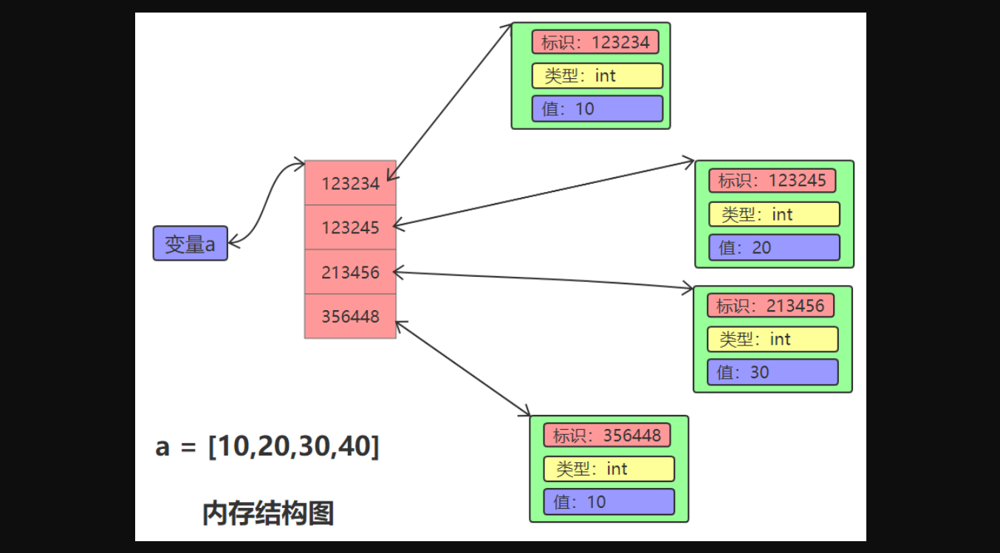

## 1.列表（list）

序列是一种数据存储方式，用来存储一系列的数据。在内存中，序列就是一块用来存放多个值的连续的内存空间。比如一个整数序列[10,20,30,40]，示意表示：


由于Python3中一切皆对象，在内存中实际是按照如下方式存储的：



从图示中，我们可以看出序列中存储的是整数对象的地址，而不是整数对象的值。字符串就是一种序列。


列表（list），是一个**有序**且**可变**的容器，在里面可以存放**多个不同类型**的元素。它的特点：

- 用于存储任意数目、任意类型的数据集合。
- 列表是内置可变序列，是包含多个元素的有序连续的内存空间。列表的标准语法格式：`a = [10,20,30,40]`其中，10,20,30,40这些称为：列表a的**元素**。
- 列表中的元素可以各不相同，可以是任意类型。比如：`a = [10,20,'abc',True]`
- Python的列表大小可变，根据需要随时增加或缩小。
- 字符串和列表都是序列类型，一个字符串是一个字符序列，一个列表是任何元素的序列。我们前面学习的很多字符串的方法，在列表中也有类似的用法，几乎一模一样。


### 1.1 定义

```python
user_list = ["wc","malu","z3"]
number_list = [2, 1, 2, 4, 9, -1]
data_list = [2, 1,"ok","malu","dawang"]
```

```python
# 可变类型：list列表
# 不可变类型：字符串，整型，布尔（已最小，内部数据无法进行修改）
user_list = []
user_list.append("wc")
user_list.append(123)
user_list.append(True)
print(user_list) # ["wc",123,True]
```

不可变类型：字符串、布尔、整型（已最小，内部数据无法进行修改）

可变类型：列表（内部数据元素可以修改）


### 1.2 独有功能

Python中为所有的列表类型的数据提供了一批独有的功能。

在开始学习列表的独有功能之前，先来做一个字符串和列表的对比：

- 字符串，不可变，即：创建好之后内部就无法修改。【独有功能都是新创建一份数据】

  ```python
  name = "root"
  data = name.upper()
  print(name)
  print(data)
  ```

- 列表，可变，即：创建好之后内部元素可以修改。【独有功能基本上都是直接操作列表内部，不会创建新的一份数据】

  ```python
  user_list = ["车子","妹子"]
  user_list.append("嫂子")
  
  print(user_list) # ["车子","妹子","嫂子"]
  ```

列表中的常见独有功能如下：

| 方法                 | 要点         | 描述                                                        |
| -------------------- | ------------ | ----------------------------------------------------------- |
| list.append(x)       | 增加元素     | 将元素x增加到列表list尾部                                   |
| list.extend(aList)   | 增加元素     | 将列表alist所有元素加到列表list尾部                         |
| list.insert(index,x) | 增加元素     | 在列表list指定位置index处插入元素x                          |
| list.remove(x)       | 删除元素     | 在列表list中删除首次出现的指定元素x                         |
| list.pop([index])    | 删除元素     | 删除并返回列表list指定为止index处的元素，默认是最后一个元素 |
| list.clear()         | 删除所有元素 | 删除列表所有元素，并不是删除列表对象                        |
| list.index(x)        | 访问元素     | 返回第一个x的索引位置，若不存在x元素抛出异常                |
| list.count(x)        | 计数         | 返回指定元素x在列表list中出现的次数                         |
| len(list)            | 列表长度     | 返回列表中包含元素的个数                                    |
| list.reverse()       | 翻转列表     | 所有元素原地翻转                                            |
| list.sort()          | 排序         | 所有元素原地排序                                            |
| list.copy()          | 浅拷贝       | 返回列表对象的浅拷贝                                        |

1. 追加，在原列表中尾部追加值。

   ```python
   user_list = []
   
   v1 = input("请输入用户名：")
   user_list.append(v1)
   
   v2 = input("请输入用户名：")
   user_list.append(v2)
   
   print(user_list) # ['malu', 'wc']
   ```

   ```python
   user_list = []
   
   while True:
   	username = input("请输入用户名：")
   	if(username.upper() == "Q"):
   		break
   	user_list.append(username)
   
   print(user_list) # ['malu', 'wc']
   ```

   ```python
   welcome = "欢迎使用NB游戏".center(30, '*')
   print(welcome)
   
   user_count = 0
   while True:
   	count = input("请输入游戏人数：")
   	if(count.isdecimal()):
   		user_count = int(count)
   		break
   	else:
   		print("输入格式错误，人数必须是数字。")
   
   message = "{}人参加游戏NB游戏。".format(user_count)
   print(message)
   
   user_name_list = []
   for i in range(1,user_count+1):
   	tips = "请输入玩家的姓名({}/{})".format(i,user_count)
   	name = input(tips)
   	user_name_list.append(name)
   
   print(user_name_list)
   
   # -----------------------
   for i in range(5):
   	print(i)
   for item in ["a","b","c"]:
   	print(item)
   ```

2. 批量追加，将一个列表中的元素逐一添加另外一个列表。

   ```python
   tools = ["搬砖","菜刀","榔头"]
   
   # 批量追加
   tools.extend(["aa",11,"bb",22])
   
   print(tools) # ['搬砖', '菜刀', '榔头', 'aa', 11, 'bb', 22]
   ```

   ```python
   tools = ["搬砖","菜刀","榔头"]
   weapon = ["AK47","M6"]
   #tools.extend(weapon) # weapon中的值逐一追加到tools中
   #print(tools) # ["搬砖","菜刀","榔头","AK47","M6"]
   
   weapon.extend(tools)
   print(tools) # ["搬砖","菜刀","榔头"]
   print(weapon) # ["AK47","M6","搬砖","菜刀","榔头"]
   ```

   ```python
   # 等价于(扩展)
   weapon = ["AK47","M6"]
   # for item in weapon:
   #     print(item)
   
   # 输出：
   #  AK47
   #  M6
   
   tools = ["搬砖","菜刀","榔头"]
   for item in weapon:
       tools.append(item)
   
   print(tools) # ['搬砖', '菜刀', '榔头', 'AK47', 'M6']
   ```

3. 插入，在原列表的指定索引位置插入值

   ```python
   user_list = ["苍老师","有坂深雪","大桥未久"]
   
   user_list.insert(0,"码路")
   user_list.insert(2,"旺财")
   
   print(user_list) # ['码路', '苍老师', '旺财', '有坂深雪', '大桥未久']
   ```

   ```python
   # 案例
   user_list = []
   
   while 1:
   	name = input("请输入购买火车票用户姓名（Q/q退出）：")
   	if name.upper() == "Q":
   		break
   	if name.startswith("张"):
   		user_list.insert(0,name)
   	else:
   		user_list.append(name)
   
   print(user_list)
   ```

4. 在原列表中根据值删除（从左到右找到第一个删除）【慎用，里面没有会报错】

   ```python
   user_list = ["wc","xq","ml","z3","w5","ml"]
   # 从左到右删除第1个
   user_list.remove("ml")
   print(user_list)
   
   # -----------------------------------------
   
   user_list = ["wc","xq","ml","z3","w5","ml"]
   if "ml" in user_list:
   	# 从左到右删除第1个
   	user_list.remove("ml")
   print(user_list) # ['wc', 'xq', 'z3', 'w5', 'ml']
   
   # -----------------------------------------
   
   user_list = ["wc","xq","ml","z3","w5","ml"]
   while 1:
   	if "ml" in user_list:
   		# 从左到右删除第1个
   		user_list.remove("ml")
   	else:
   		break
   print(user_list) # ['wc', 'xq', 'z3', 'w5']
   
   # -----------------------------------------
   
   user_list = ["wc","xq","ml","z3","w5","ml"]
   user_list.remove("gy")
   # 使用remove时，里面没有就会报错
   print(user_list) # ValueError: list.remove(x): x not in list
   ```

   ```python
   # 案例：自动抽奖程序
   import random
   
   # 生成的随机数是0到1，不包含1的
   # print(random.random())
   # print(random.random())
   # print(random.random())
   # print(random.random())
   # print(random.random())
   # print(random.choice(["a","b","c"]))
   # print(random.choice(["a","b","c"]))
   # print(random.choice(["a","b","c"]))
   
   data_list = ["手机","耳机","笔记本","平板"]
   
   # [] => False
   while data_list:
   	name = input("自动抽奖程序，请输入自己的姓名：")
   	value = random.choice(data_list) # 随机从data_list抽取一个值出来
   	print("恭喜{}，抽中{}.".format(name, value))
   	data_list.remove(value)
   ```

5. 在原列表中根据索引踢出某个元素（根据索引位置删除）

   ```python
   data_list = ["手机","耳机","笔记本","平板"]
   
   # pop是删除最后个元素
   # print(data_list.pop()) # 平板
   # list列表是可变对象
   # print(data_list) # ['手机', '耳机', '笔记本']
   
   # 根据索引位置进行删除
   print(data_list.pop(1)) # 耳机
   print(data_list) # ['手机', '笔记本', '平板']
   ```

   ```python
   # 案例：排队买火车票
   
   user_queue=[]
   
   while True:
       name = input("北京~上海火车票，购买请输入姓名排队(Q退出)：")
       if name.upper() == "Q":
           break
       user_queue.append(name)
   
   print(user_queue) # ['wc', 'xq', 'ml', 'z3', 'w5']
   
   ticket_count = 3
   
   # pop(0)
   for i in range(ticket_count):
       user_name = user_queue.pop(0)
       message = "恭喜{},购买火车票成功。".format(user_name)
       print(message)
   
   faild_user = ", ".join(user_queue)
   faild_message = "非常抱歉，票已售完，以下几位用户请选择其他出行方式，名单：{}。".format(faild_user)
   print(faild_message)
   ```

6. 清空原列表

   ```python
   user_list = ['wc', 'xq', 'ml', 'z3', 'w5']
   user_list.clear()
   print(user_list) # []
   ```

7. 根据值获取索引

   ```python
   user_list = ['wc', 'xq', 'ml', 'z3', 'w5', 'ml']
   
   if 'ml' in user_list:
   	index = user_list.index('ml')
   	print(index) # 2
   else:
   	print("不存在~")
   ```

8. 列表元素排序

   ```python
   # 数字排序
   num_list = [11, 22, 4, 5, 11, 99, 88]
   
   print(num_list)
   # num_list.sort() # 让num_list从小到大排序
   num_list.sort(reverse=True) # 让num_list从大到小排序
   print(num_list)
   
   # ----------------------------------------
   
   num_list = ['wc', 'xq', 'ml', 'z3', 'w5', 'ml']
   
   print(num_list)
   num_list.sort() # 让num_list从小到大排序
   # num_list.sort(reverse=True) # 让num_list从大到小排序
   print(num_list)
   
   # ----------------------------------------
   
   # 中文就是按unicode编码进行排序的
   num_list = ["admin","码路","旺财","张三","李四","root"]
   
   print(num_list)
   num_list.sort() # 让num_list从小到大排序
   # num_list.sort(reverse=True) # 让num_list从大到小排序
   print(num_list)
   ```

   注意：排序时内部元素无法进行比较时，程序会报错（尽量数据类型统一）。

9. 反转原列表

   ```python
   num_list = ["admin","码路","旺财","张三","李四","root"]
   
   print(num_list)
   num_list.reverse()
   print(num_list)
   ```

### 1.3 公共功能

1. 相加，两个列表相加获取生成一个新的列表。

   ```python
   data = ["赵四","刘能"] + ["宋晓峰","范德彪"]
   print(data) # ["赵四","刘能","宋晓峰","范德彪"]
   
   v1 = ["赵四","刘能"]
   v2 = ["宋晓峰","范德彪"]
   v3 = v1 + v2
   print(v3) # ["赵四","刘能","宋晓峰","范德彪"]
   ```

2. 相乘，列表*整型 将列表中的元素再创建N份并生成一个新的列表。

   ```python
   data = ["赵四","刘能"] * 2
   print(data) # ["赵四","刘能","赵四","刘能"]
   
   v1 = ["赵四","刘能"]
   v2 = v1 * 2
   print(v1) # ["赵四","刘能"]
   print(v2) # ["赵四","刘能","赵四","刘能"]
   ```

3. 运算符in包含
   由于列表内部是由多个元素组成，可以通过in来判断元素是否在列表中。

   ```python
   user_list = ["狗子","二蛋","沙雕","root"] 
   result = "root" in user_list
   # result = "root" not in user_list
   print(result) #  True
   
   if "root" in user_list:
       print("在，把他删除")
       user_list.remove("root")
   else:
       print("不在")
   ```

   ```python
   user_list = ["狗子","二蛋","沙雕","root"] 
   if "root" in user_list:
       print("在，把他删除")
       user_list.remove("root")
   else:
       print("不在")
   
   text = "打倒小日本"
   data = "日" in text
   ```

   ```python
   # 案例
   user_list = ["王宝强","陈羽凡","root","贾乃亮","root"]
   if "root" in user_list:
   	index = user_list.index("root")
   	user_list.pop(index)
   ```

   ```python
   # 案例：敏感词替换
   text = input("请输入文本内容：") # 按时打发第三方科技爱普生豆腐啊；了深刻的房价破阿偶打飞机
   forbidden_list = ["草","欧美","日韩"]
   for item in forbidden_list:
       text = text.replace(item,"**")
   print(text)
   ```

   注意：**列表检查元素是否存在时，是采用逐一比较的方式，效率会比较低。**

4. 获取长度

   ```python
   user_list = ["范德彪","刘华强",'尼古拉斯赵四']
   print( len(user_list) )
   ```

5. 索引，一个元素的操作

   ```python
   # 读
   user_list = ["范德彪","刘华强",'尼古拉斯赵四']
   print( user_list[0] )
   print( user_list[2] )
   print( user_list[3] ) # 报错
   ```

   ```python
   # 改
   user_list = ["范德彪","刘华强",'尼古拉斯赵四']
   user_list[0] = "旺财"
   print(user_list) # ["旺财","刘华强",'尼古拉斯赵四']
   ```

   ```python
   # 删
   user_list = ["范德彪","刘华强",'尼古拉斯赵四']
   del user_list[1]
   
   user_list.remove("刘华强")
   ele = user_list.pop(1)
   ```

   注意：超出索引范围会报错。
   提示：由于字符串是不可变类型，所以他只有索引读的功能，而列表可以进行 读、改、删

6. 切片，多个元素的操作（很少用）

   ```python
   # 读
   user_list = ["范德彪","刘华强",'尼古拉斯赵四']
   
   print( user_list[0:2] ) # ["范德彪","刘华强"]
   print( user_list[1:] ) # ["刘华强",'尼古拉斯赵四']
   print( user_list[:-1] ) # ["范德彪","刘华强"]
   ```

   ```python
   # 改
   user_list = ["范德彪", "刘华强", '尼古拉斯赵四']
   user_list[0:2] = [11, 22, 33, 44]
   print(user_list) # 输出 [11, 22, 33, 44, '尼古拉斯赵四']
   
   user_list = ["范德彪", "刘华强", '尼古拉斯赵四']
   user_list[2:] = [11, 22, 33, 44]
   print(user_list) # 输出 ['范德彪', '刘华强', 11, 22, 33, 44]
   
   user_list = ["范德彪", "刘华强", '尼古拉斯赵四']
   user_list[3:] = [11, 22, 33, 44]
   print(user_list) # 输出 ['范德彪', '刘华强', '尼古拉斯赵四', 11, 22, 33, 44]
   
   
   user_list = ["范德彪", "刘华强", '尼古拉斯赵四']
   user_list[10000:] = [11, 22, 33, 44]
   print(user_list) # 输出 ['范德彪', '刘华强', '尼古拉斯赵四', 11, 22, 33, 44]
   
   
   user_list = ["范德彪", "刘华强", '尼古拉斯赵四']
   user_list[-10000:1] = [11, 22, 33, 44]
   print(user_list) # 输出 [11, 22, 33, 44, '刘华强', '尼古拉斯赵四']
   ```

   ```python
   # 删
   user_list = ["范德彪", "刘华强", '尼古拉斯赵四']
   del user_list[1:]
   print(user_list) # 输出 ['范德彪']
   ```

7. 步长

   ```python
   user_list = ["范德彪","刘华强",'尼古拉斯赵四',"宋小宝","刘能"]
   #              0        1        2          3       4
   print( user_list[1:4:2] )
   print( user_list[0::2] )
   print( user_list[1::2] )
   print( user_list[4:1:-1] )
   ```

   ```python
   # 案例：实现列表的翻转
   user_list = ["范德彪","刘华强",'尼古拉斯赵四',"宋小宝","刘能"]
   new_data = user_list[::-1]
   print(new_data)
   
   
   data_list = ["范德彪","刘华强",'尼古拉斯赵四',"宋小宝","刘能"]
   data_list.reverse()
   print(data_list)
   
   # 给你一个字符串请实现字符串的翻转？
   name = "旺财"
   name[::-1]
   ```

8. for循环

   ```python
   user_list = ["范德彪","刘华强",'尼古拉斯赵四',"宋小宝","刘能"]
   for item in user_list:
   	print(item)
   ```

   ```python
   user_list = ["范德彪","刘华强",'尼古拉斯赵四',"宋小宝","刘能"]
   
   for index in range( len(user_list) ):
       item = user_index[index]
       print(item)
   ```

   切记，循环的过程中对数据进行删除会踩坑【面试题】。

   ```python
   # 错误方式， 有坑，结果不是你想要的。
   user_list = ["刘的话", "范德彪", "刘华强", '刘尼古拉斯赵四', "宋小宝", "刘能"]
   for item in user_list:
       if item.startswith("刘"):
           user_list.remove(item)
           
   print(user_list)
   ```

   ```python
   # 正确方式，倒着删除。
   user_list = ["刘的话", "范德彪", "刘华强", '刘尼古拉斯赵四', "宋小宝", "刘能"]
   
   
   for index in range(len(user_list)-1, -1, -1):
   	item = user_list[index] 
   	if item.startswith("刘"):
   		user_list.remove(item)
   print(user_list) # ['范德彪', '宋小宝']
   
   # print(user_list) # ['范德彪', '刘尼古拉斯赵四', '宋小宝']
   
   # for i in range(5):
   # 	print(i)  #  0 1 2 3 4
   
   # for i in range(1,5):
   # 	print(i)  #  1 2 3 4
   
   # for i in range(5,1):
   # 	print(i)  #  没有输出
   
   # for i in range(5,1,-1):
   # 	print(i)  #  5 4 3 2
   
   # for i in range(5,-1,-1):
   # 	print(i)  #  5 4 3 2 1 0
   
   # for i in range(5,-3,-1):
   # 	print(i)  #  5 4 3 2 1 0 -1 -2
   ```

### 1.4 转换

- int、bool无法转换成列表

- str

  ```python
  name = "旺财"
  
  data = list(name)  # ["旺","财"]
  print(data)
  ```

- 超前

  ```python
  v1 = (11,22,33,44) # 元组
  vv1 = list(v1)     # 列表 [11,22,33,44]
  
  v2 = {"root","eric","dsb"} # 集合
  vv2 = list(v2) # 列表 ["root","eric","dsb"]
  
  # 使用list()可以将任何可迭代的数据转化成列表。
  a = list()  #创建一个空的列表对象
  b = list(range(10))  #结果：[0, 1, 2, 3, 4, 5, 6, 7, 8, 9]
  c = list("wc,xq") #结果：['w', 'c', 'x', 'q']
  
  # range()可以帮助我们非常方便的创建整数列表，这在开发中及其有用。语法格式为：
  #    range([start,] end [,step])
  #       start参数：可选，表示起始数字。默认是0
  #       end参数：必选，表示结尾数字。
  #       step参数：可选，表示步长，默认为1
  # python3中range()返回的是一个range对象，而不是列表。我们需要通过list()方法将其转换成列表对象。
  a = list(range(3,15,2)) #结果：[3, 5, 7, 9, 11, 13]
  b = list(range(15,9,-1)) #结果：[15, 14, 13, 12, 11, 10]
  c = list(range(3,-4,-1)) #结果：[3, 2, 1, 0, -1, -2, -3]
  print(a,b,c)
  
  # 使用列表推导式可以非常方便的创建列表，在开发中经常使用。
  #循环创建多个元素 [0, 2, 4, 6, 8]
  a = [x*2  for  x  in range(5)]
  
  #通过if过滤元素[0, 18, 36, 54, 72, 90, 108, 126, 144, 162, 180, 198]
  b = [x*2 for x in range(100) if x%9==0]
  
  print(a,b)
  ```

  

### 1.5. 其他

#### 1.5.1 嵌套

列表属于容器，内部可以存放各种数据，所以他也支持列表的嵌套，如：

```python
data = [ "谢广坤",["海燕","赵本山"],True,[11,22,[999,123],33,44],"宋小宝" ]
```

对于嵌套的值，可以根据之前学习的索引知识点来进行学习，例如：

```python
data = [ "谢广坤",["海燕","赵本山"],True,[11,22,33,44],"宋小宝" ]

print( data[0] ) # "谢广坤"
print( data[1] ) # ["海燕","赵本山"]
print( data[0][2] ) # "坤"
print( data[1][-1] ) # "赵本山"

data.append(666)
print(data) # [ "谢广坤",["海燕","赵本山"],True,[11,22,33,44],"宋小宝",666]

data[1].append("谢大脚")
print(data) # [ "谢广坤",["海燕","赵本山","谢大脚"],True,[11,22,33,44],"宋小宝",666 ]


del data[-2]
print(data) # [ "谢广坤",["海燕","赵本山","谢大脚"],True,[11,22,33,44],666 ]


data[-2][1] = "root"
print(data) # [ "谢广坤",["海燕","赵本山","谢大脚"],True,[11,"root",33,44],666 ]


data[1][0:2] = [999,666]
print(data) # [ "谢广坤",[999,666,"谢大脚"],True,[11,"root",33,44],666 ]
```

```python
# 创建用户列表
#    用户列表应该长： [ ["root","123"],["eric","666"] ]

# user_list = [["root","123"],["eric","666"],]
# user_list.append(["root","123"])
# user_list.append(["eric","666"])


user_list = []
while True:
    user = input("请输入用户名：")
    pwd = input("请输入密码：")

    data = []
    data.append(user)
    data.append(pwd)
    
    user_list.append(data)
```

```python
user_list = []
while True:
    user = input("请输入用户名(Q退出)：")
    if user == "Q":
        break
    pwd = input("请输入密码：")
    data = [user,pwd]
    user_list.append(data)

print(user_list)
```


### 1.6 列表阶段作业

1. 写代码，有如下列表，按照要求实现每一个功能。

   ```python
   li = ["root", "xq", "ritian", "barry", "旺财"]
   ```

   - 计算列表的长度并输出
   - 列表中追加元素"seven",并输出添加后的列表
   - 请在列表的第1个索引位置插入元素"Tony",并输出添加后的列表
   - 请修改列表第2个索引位置的元素为"Kelly",并输出修改后的列表
   - 请将列表的第3个位置的值改成 "妖怪"，并输出修改后的列表
   - 请将列表 `data=[1,"a",3,4,"heart"]` 的每一个元素追加到列表 `li` 中，并输出添加后的列表
   - 请将字符串 `s = "qwert"`的每一个元素到列表 `li` 中。
   - 请删除列表中的元素"barry",并输出添加后的列表
   - 请删除列表中的第2个元素，并输出删除元素后的列表
   - 请删除列表中的第2至第4个元素，并输出删除元素后的列表

2. 写代码，有如下列表，利用切片实现每一个功能

   ```python
   li = [1, 3, 2, "a", 4, "b", 5,"c"]
   ```

   - 通过对li列表的切片形成新的列表 [1,3,2]
   - 通过对li列表的切片形成新的列表 ["a",4,"b"] 
   - 通过对li列表的切片形成新的列表  [1,2,4,5]
   - 通过对li列表的切片形成新的列表 [3,"a","b"]
   - 通过对li列表的切片形成新的列表 [3,"a","b","c"]
   - 通过对li列表的切片形成新的列表  ["c"]
   - 通过对li列表的切片形成新的列表 ["b","a",3]

3. 写代码，有如下列表，按照要求实现每一个功能。

   ```python
   lis = [2, 3, "k", ["qwe", 20, ["k1", ["tt", 3, "1"]], 89], "ab", "adv"]
   ```

   - 将列表lis中的第2个索引位置的值变成大写，并打印列表。
   - 将列表中的数字3变成字符串"100"
   - 将列表中的字符串"tt"变成数字 101
   - 在 "qwe"前面插入字符串："火车头"

4. 请用代码实现循环输出元素和值：users = ["aa","bb","cc"] ，如：

   ```python
   0 aa
   1 bb
   2 cc
   ```

5. 请用代码实现循环输出元素和值：users = ["aa","bb","cc"]  ，如：

   ```python
   1 aa
   2 bb
   3 cc
   ```

6. 写代码实现以下功能

   - 如有变量 goods = ['汽车','飞机','火箭'] 提示用户可供选择的商品：

     ```python
     0,汽车
     1,飞机
     2,火箭
     ```

   - 用户输入索引后，将指定商品的内容拼接打印，如：用户输入0，则打印 您选择的商品是汽车。

7. 利用for循环和range 找出 0 ~ 50 以内能被3整除的数，并追加到一个列表。

8. 利用for循环和range 找出 0 ~ 50 以内能被3整除的数，并插入到列表的第0个索引位置，最终结果如下：

   ```python
   [48,45,42...]
   ```

9. 查找列表li中的元素，移除每个元素的空格，并找出以"a"开头，并添加到一个新列表中,最后循环打印这个新列表。

   ```python
   li = ["rootC", "AbC ", "egon", " riTiAn", "wc", "  aqc"]
   ```

10. 将以下车牌中所有 `京 `的车牌搞到一个列表中，并输出京牌车辆的数量。

    ```python
    data = ["京1231", "冀8899", "京166631", "晋989"]
    ```


参考代码：

```python
# ####################### 第1题 #######################
"""
li = ["alex", "WuSir", "ritian", "barry", "旺财"]

# print(len(li))

# li.append("seven")
# print(li)

# li.insert(1,"Tony")
# print(li)

# li.insert(2,"Kelly")
# print(li)

# li[3] = "妖怪"
# print(li)

# data = [1, "a", 3, 4, "heart"]
# li.extend(data)
# print(li)

# s = "qwert"
# for item in s:
#     li.append(item)
# print(li)
# li.extend("qwert")
# print(li)

# li.remove("barry")

# del li[1]
# ele = li.pop(1)
# print(li)

# del li[2:4]

"""

# ####################### 第2题 #######################
"""
li = [1, 3, 2, "a", 4, "b", 5,"c"]

# print(li[0:3])

# print(li[3:6])

# print(li[:-1:2])
# print(li[::2])

# print(li[1:-1:2])

# print(li[1::2])

# print(li[7:])

# print(li[5:0:-2])
"""
# ####################### 第3题 #######################
"""
lis = [2, 3, "k", ["qwe", 20, ["k1", ["tt", 3, "1"]], 89], "ab", "adv"]

# data = lis[2].upper()
# lis[2] = data
# lis[2] = lis[2].upper()

# lis[1] = "100"
# lis[3][2][1][1] = "100"
# print(lis)

# lis[3][2][1][0] = 101

# lis[3].insert(0,"火车头")
# print(lis)

"""
# ####################### 第4题 #######################
"""
users = ["aa", "bb", "cc"]
count = 0
for item in users:
    print(count, item)
    count += 1
"""
"""
users = ["aa", "bb", "cc"]
for index in range(len(users)):
    print(index, users[index])
"""

# ####################### 第5题 #######################
"""
users = ["aa", "bb", "cc"]
for index in range(len(users)):
    print(index + 1, users[index])
"""

# ####################### 第6题 #######################
"""
goods = ['汽车', '飞机', '火箭']
for index in range(len(goods)):
    print(index, goods[index])
index = input("请输入序号：")  # "1"
index = int(index)
text = goods[index]
message = "您选择的商品是{}".format(text)
print(message)
"""

# ####################### 第7题 #######################
"""
data_list = []
for num in range(0,51):
    if num == 0:
        continue
    # 是否能被3整除呢？
    data = num % 3
    if data == 0:
        data_list.append(num)
print(data_list)
"""

# ####################### 第8题 #######################
"""
data_list = []
for num in range(0,51):
    if num == 0:
        continue
    # 是否能被3整除呢？
    data = num % 3
    if data == 0:
        data_list.insert(0,num)
print(data_list)
"""

# ####################### 第9题 #######################
"""
data_list = []
li = ["aa", "AbC ", "egon", " riTiAn", "wc", "  aqc"]
for item in li:
    data = item.strip()
    if data.startswith("a"):
        data_list.append(data)
print(data_list)
"""

"""
data_list = []
li = ["aa", "AbC ", "egon", " riTiAn", "wc", "  aqc"]
for item in li:
    data = item.strip()
    if not data.startswith("a"):
        continue
    data_list.append(data)
print(data_list)
"""

# ####################### 第10题 #######################
"""
# 将以下车牌中所有 `京 `的车牌搞到一个列表中，并输出京牌车辆的数量。
result = []
data = ["京1231", "冀8899", "京166631", "晋989"]
for item in data:
    if not item.startswith("京"):
        continue
    result.append(item)

count = len(result)
print( "京牌的数据为：{}".format(count) )
"""
```


## 2.元组

列表（list），是一个**有序**且**可变**的容器，在里面可以存放**多个不同类型**的元素。

元组（tuple），是一个**有序**且**不可变**的容器，在里面可以存放**多个不同类型**的元素。


### 2.1 定义

```python
# 还有一种容器，叫元组 （）
# 列表  ["wc","malu","xq"]   有序的    可变的   可以存放多个不同类型的元素
# 元组 (11,22,33,True,"hello",["wc","xq"])   有序的    不可变的   可以存放多个不同类型的元素

# 建议：议在元组的最后多加一个逗号
v1 = (11, 22, 33,)
v2 = ("malu", "wc",)
v3 = (True, 123, "root", [11,22,33,44],)
v4 = (1) # 不是元组
print(type(v4)) # <class 'int'>
v5 = (1,) # 是元组
print(type(v5)) # <class 'tuple'>
```

```python
d1 = (1)  #   1   <class 'int'>
d2 = (1,) # (1,)    <class 'tuple'>

d3 = (1,2)
d4 = (1,2)
```

注意：建议在元组的最后多加一个逗号，用于标识他是一个元组。

```python
# 面试题
1. 比较值 v1 = (1) 和 v2 = 1 和 v3 = (1,) 有什么区别？
2. 比较值 v1 = ( (1),(2),(3) ) 和 v2 = ( (1,) , (2,) , (3,),) 有什么区别？
              (1,2,3)
```

### 2.2 独有功能

无

### 2.3 公共功能

1. 相加，两个列表相加获取生成一个新的列表。

   ```python
   data = ("赵四","刘能") + ("宋晓峰","范德彪")
   print(data) # ("赵四","刘能","宋晓峰","范德彪")
   
   v1 = ("赵四","刘能")
   v2 = ("宋晓峰","范德彪")
   v3 = v1 + v2
   print(v3) # ("赵四","刘能","宋晓峰","范德彪")
   ```

2. 相乘，列表*整型 将列表中的元素再创建N份并生成一个新的列表。

   ```python
   data = ("赵四","刘能") * 2
   print(data) # ("赵四","刘能","赵四","刘能")
   
   v1 = ("赵四","刘能")
   v2 = v1 * 2
   print(v1) # ("赵四","刘能")
   print(v2) # ("赵四","刘能","赵四","刘能")
   ```

3. 获取长度

   ```python
   user_list = ("范德彪","刘华强",'尼古拉斯赵四',)
   print( len(user_list) )
   ```

4. 索引

   ```python
   user_list = ("范德彪","刘华强",'尼古拉斯赵四',)
   print( user_list[0] )
   print( user_list[2] )
   # IndexError: tuple index out of range 索引越界
   print( user_list[3] )
   ```

5. 切片

   ```python
   user_list = ("范德彪","刘华强",'尼古拉斯赵四',)
   print( user_list[0:2] )
   print( user_list[1:] )
   print( user_list[:-1] )
   ```

6. 步长

   ```python
   user_list = ("范德彪","刘华强",'尼古拉斯赵四',"宋小宝","刘能")
   print( user_list[1:4:2] )
   print( user_list[0::2] )
   print( user_list[1::2] )
   print( user_list[4:1:-1] )
   ```

   ```python
   # 字符串 & 元组。
   user_list = ("范德彪","刘华强",'尼古拉斯赵四',"宋小宝","刘能")
   data = user_list[::-1]
   print(data) # ('刘能', '宋小宝', '尼古拉斯赵四', '刘华强', '范德彪')
   
   # 列表
   user_list = ["范德彪","刘华强",'尼古拉斯赵四',"宋小宝","刘能"]
   data = user_list[::-1]
   print(data) # ['刘能', '宋小宝', '尼古拉斯赵四', '刘华强', '范德彪']
   
   user_list.reverse()
   print(user_list)
   ```

7. for循环

   ```python
   user_list = ("范德彪","刘华强",'尼古拉斯赵四',"宋小宝","刘能")
   for item in user_list:
   	print(item)
   ```

   ```python
   user_list = ("范德彪","刘华强",'尼古拉斯赵四',"宋小宝","刘能")
   for item in user_list:
   	if item == '刘华强':
   		continue
   	print(item)
   ```

   目前：只有 str、list、tuple 可以被for循环。 "xxx"  [11,22,33]  (111,22,33)

   ```python
   # len + range + for + 索引
   user_list = ("范德彪","刘华强",'尼古拉斯赵四',"宋小宝","刘能")
   for index in range(len(user_list)):
       item = user_list[index]
       print(item)
   ```

   


### 2.4 转换

其他类型转换为元组，使用`tuple(其他类型)`，目前只有字符串和列表可以转换为元组。

```python
data = tuple(其他)

# str / list 
```

```python
name = "旺财"
data = tuple(name)
print(data) # 输出 ("旺","财")
```

```python
name = ["旺财",18,"python"]
data = tuple(name)
print(data) # 输出 ("旺财",18,"python")
```


### 2.5 其他

#### 2.5.1 嵌套

由于元组和列表都可以充当`容器`，他们内部可以放很多元素，并且也支持元素内的各种嵌套。

```python
tu = ( '今天姐姐不在家', '姐夫和小姨子在客厅聊天', ('姐夫问小姨子税后多少钱','小姨子低声说道说和姐夫还提钱') )
tu1 = tu[0]
tu2 = tu[1]
tu3 = tu[2][0]
tu4 = tu[2][1]
tu5 = tu[2][1][3]

print(tu1) # 今天姐姐不在家
print(tu2) # 姐夫和小姨子在客厅聊天
print(tu3) # 姐夫问小姨子税后多少钱
print(tu4) # 小姨子低声说道说和姐夫还提钱
print(tu5) # 低
```

练习题1：判断是否可以实现，如果可以请写代码实现。

```python
# 列表是可变容器
li = ["admin", [11,22,(88,99,100,),33],  "wc",  ("malu", "xq",),  "z3"]

# 1.请将 "wc" 修改成 "旺财"
# li[2] = "旺财"  # 已经索引的情况下
# print(li)

# index根据内容找索引，不知道索引的情况下
# index = li.index("wc")
# li[index] = "旺财"
# print(li)

# 2.请将 ("malu", "xq",) 修改为 ['管理员','小强']
# li[3] = ['管理员','小强']
# print(li)


# 3.请将 88 修改为 87
# 不能改  因为元组不可变容器
# li[1][2][0] = 87 # (报错，)


# 4.请将 "z3" 删除，然后再在列表第0个索引位置插入 "张三"
# li.remove("z3")
# print(li)
# del li[-1]
li.insert(0,"张三")
print(li)
```

练习题2：

```python
data = ("123",666,[11,22,33], ("malu","wc",[999,666,(5,6,7)]) )

# 1.将 “123” 替换成 9   报错
# data[0] = 0
# print(data)

# 2.将 [11,22,33] 换成 "wc"    报错
# data[2] = "wc"
# print(data)

# 3.将 11 换成 99
# data[2][0] = 99
# print(data)  # ('123', 666, [99, 22, 33], ('malu', 'wc', [999, 666, (5, 6, 7)]))

# 4.在列表 [11,22,33] 追加一个44
data[2].append(44)
print(data) # ('123', 666, [11, 22, 33, 44], ('malu', 'wc', [999, 666, (5, 6, 7)]))
```

练习题3：动态的创建用户并添加到用户列表中。

```python
# 创建用户 5个
# 存放用户信息 [("malu",123),("wc",456)]
user_list = []

while True:
    user = input("请输入用户名：")
    if user.upper() == "Q":
        break
    pwd = input("请输入密码：")
    item = (user.strip(),pwd.strip(),)
    user_list.append(item)

print(user_list)

print("欢迎访问XXXX系统")
username = input("请输入用户名：")
password = input("请输入密码：")

is_sucess = False

# for item in user_list:
#     # item = ('malu', '123')
#     # item = ('wc', '456')
#     if username == item[0] and password == item[1]:
#         print("登录成功")
#         break
#     else:
#         print("登录失败")

for item in user_list:
    # item = ('malu', '123')
    # item = ('wc', '456')
    if username.strip() == item[0] and password.strip() == item[1]:
        is_sucess = True
        break

if is_sucess:
    print("登录成功~")
else:
    print("登录失败~")
```


## 总结

1. 概述
   - 列表，以后写程序会用的非常多，要多些多练。
   - 元组，以后写程序用的不是很多，主要以了解其特殊和用法为主。
2. 列表和元组的区别。
3. 可变类型和不可变类型。
4. 列表独有功能 & 公共功能（不用特地去记，多做题目去用，以后每天都会有相关的练习题）。
5. 列表和元组等数据的嵌套
6. 元组中 (1) 和 (1,) 的区别。
7. 元组的元素不能被替换，但元组的元素如果是可变类型，可变类型内部是可以修改的。


## 作业

1. 以下哪些数据类型转换为布尔值为False

   ```python
   1
   ""
   -19
   []
   [11,22]
   (1)
   (1,2,3)
   ()
   ```

2. 运算符操作

   ```python
   v1 = [] or "root"
   v2 = [11,22] and (1,2,)
   ```

3. 比较：` a = [1,2,3] `和 `b = [(1),(2),(3) ]` 以及 `c = [(1,),(2,),(3,) ]` 的区别？

4. 将字符串`text = "admin|root|eric"`根据 `|` 分割为列表，然后列表转换为元组类型。

5. 根据如下规则创建一副扑克牌（排除大小王）。

   ```python
   # 花色列表
   color_list = ["红桃","黑桃","方片","梅花"]
   
   # 牌值
   num_list = []
   for num in range(1,14):
       num_list.append(num)
       
   result = []
   # 请根据以上的花色和牌值创建一副扑克牌（排除大小王）
   # 最终result的结果格式为： [ ("红桃",1), ("红桃",2) ... ]
   ```


参考代码：

```python
# 1.以下哪些数据类型转换为布尔值为False
"""
0          False
1
""         False
-19
[]         False
[11,22]
(1)
(1,2,3)
()         False
"""

# 2.运算符操作
"""
v1 = [] or "root"  # root
v2 = [11, 22] and (1, 2,)  # (1, 2,)
"""

# 3.比较：` a = [1,2,3] `和 `b = [(1),(2),(3) ]` 以及 `c = [(1,),(2,),(3,) ]` 的区别？
"""
a = [1, 2, 3]
b = [(1), (2), (3)]
c = [(1,), (2,), (3,)]
"""

# 4.将字符串`text = "admin|root|eric"`根据 `|` 分割为列表，然后列表转换为元组类型。
"""
text = "admin|root|eric"
data_list = text.split("|")
result = tuple(data_list)
print(result)  # ('admin', 'root', 'eric')
"""

# 5.补充代码，根据如下规则创建一副扑克牌（排除大小王）。
"""
# 花色列表
color_list = ["红桃", "黑桃", "方片", "梅花"]

# 牌值
num_list = []
for num in range(1, 14):
	num_list.append(num)
# print(num_list) # [1, 2, 3, 4, 5, 6, 7, 8, 9, 10, 11, 12, 13]

result = []
# 请根据以上的花色和牌值创建一副扑克牌（排除大小王）
# 最终result的结果格式为： [ ("红桃",1), ("红桃",2) ... ]

for color in color_list:
	# print(color)
	for num in num_list:
		item = (color,num,)
		result.append(item)

# [('红桃', 1), ('红桃', 2), ('红桃', 3), ('红桃', 4), ('红桃', 5), ('红桃', 6), ('红桃', 7), ('红桃', 8), ('红桃', 9), ('红桃', 10), ('红桃', 11), ('红桃', 12), ('红桃', 13), ('黑桃', 1), ('黑桃', 2), ('黑桃', 3), ('黑桃', 4), ('黑桃', 5), ('黑桃', 6), ('黑桃', 7), ('黑桃', 8), ('黑桃', 9), ('黑桃', 10), ('黑桃', 11), ('黑桃', 12), ('黑桃', 13), ('方片', 1), ('方片', 2), ('方片', 3), ('方片', 4), ('方片', 5), ('方片', 6), ('方片', 7), ('方片', 8), ('方片', 9), ('方片', 10), ('方片', 11), ('方片', 12), ('方片', 13), ('梅花', 1), ('梅花', 2), ('梅花', 3), ('梅花', 4), ('梅花', 5), ('梅花', 6), ('梅花', 7), ('梅花', 8), ('梅花', 9), ('梅花', 10), ('梅花', 11), ('梅花', 12), ('梅花', 13)]
print(result)
"""
```

