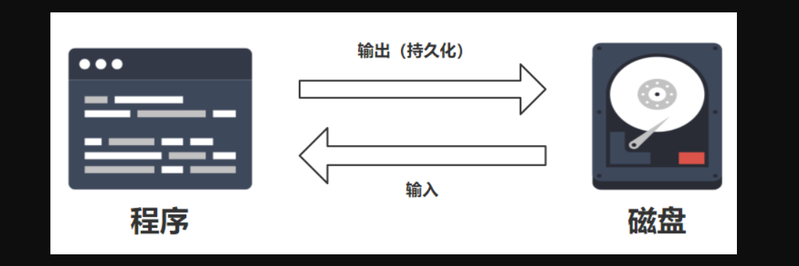
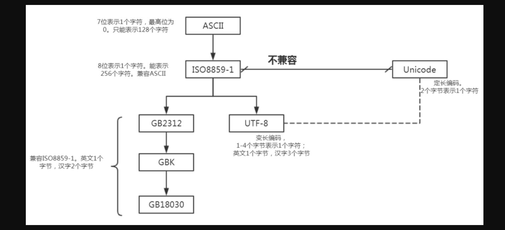
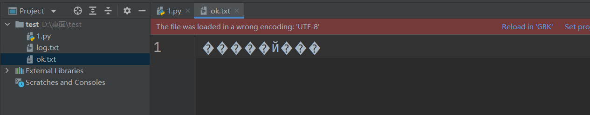
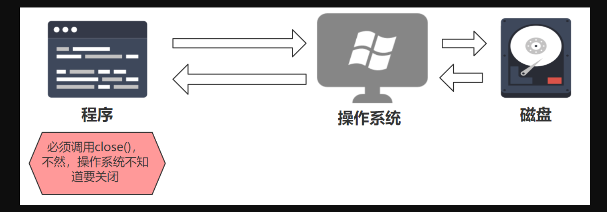

### 1，写入文件



一个完整的程序一般都包括数据的存储和读取；我们在前面写的程序数据都没有进行实际的存储，因此python解释器执行完数据就消失了。实际开发中，我们经常需要从外部存储介质（硬盘、光盘、U盘等）读取数据，或者将程序产生的数据存储到文件中，实现“持久化”保存。


**文本文件和二进制文件：**

1. 文本文件：文本文件存储的是普通“字符”文本，python默认为`unicode`字符集（两个字节表示一个字符，最多可以表示：65536个），可以使用记事本程序打开。
2. 二进制文件：二进制文件把数据内容用“字节”进行存储，无法用记事本打开。必须使用专用的软件解码。常见的有：MP4视频文件、MP3音频文件、JPG图片、doc文档等等。


Python标准库中，如下是文件操作相关的模块，我们会陆续给大家介绍。

| 名称                              | 说明                                           |
| --------------------------------- | ---------------------------------------------- |
| io模块                            | 文件流的输入和输出操作 input output            |
| os模块                            | 基本操作系统功能，包括文件操作                 |
| glob模块                          | 查找符合特定规则的文件路径名                   |
| fnmatch模块                       | 使用模式来匹配文件路径名                       |
| fileinput模块                     | 处理多个输入文件                               |
| filecmp模块                       | 用于文件的比较                                 |
| csv模块                           | 用于csv文件处理                                |
| pickle和cPickle                   | 用于序列化和反序列化                           |
| xml包                             | 用于XML数据处理                                |
| bz2、gzip、zipfile、zlib、tarfile | 用于处理压缩和解压缩文件（分别对应不同的算法） |


**创建文件对象open()：**`open()`函数用于创建文件对象，基本语法格式如下：

```python
open(文件名[,打开方式])
```

如果只是文件名，代表在当前目录下的文件。文件名可以录入全路径，比如：`D:\a\b.txt`。为了减少`\`的输入，可以使用原始字符串：`r“d:\b.txt”`示例如下：

```python
f = open(r"d:\b.txt","w")
```


打开方式有如下几种：

| 模式 | 描述                                                         |
| ---- | ------------------------------------------------------------ |
| r    | 读 read模式                                                  |
| w    | 写 write模式。如果文件不存在则创建；如果文件存在，则重写新内容； |
| a    | 追加append模式。如果文件不存在则创建；如果文件存在，则在文件末尾追加内容 |
| b    | 二进制binary模式（可与其他模式组合使用）                     |
| +    | 读、写模式（可与其他模式组合使用）                           |


文本文件对象和二进制文件对象的创建：

1. 如果没有增加模式`b`，则默认创建的是文本文件对象，处理的基本单元是“字符”。
2. 如果是二进制模式`b`，则创建的是二进制文件对象，处理的基本单元是“字节”。


文本文件的写入一般就是三个步骤：

1. 创建文件对象
2. 写入数据
3. 关闭文件对象


代码：

```python
#  要么写\\  要么写/
# f = open("d:/1.txt","w")
# f = open("d:\\1.txt","w")
# r"d:/a/b/c/1.txt"
# r"d:\a\b\c\1.txt"
# f = open(r"d:\1.txt","w")
f = open(r"d:/1.txt","w")
s = "hello malu333"
f.write(s)
f.close()
```


或者使用with上下文管理：

```python
with open(r"a.txt","a") as f:
  s = "malu\nityls\n"
  f.write(s)
```


### 2，中文乱码解决

在操作文本文件时，经常会操作中文，这时候就经常会碰到乱码问题。为了让大家有能力解决中文乱码问题，这里简单介绍一下各种编码之间的关系。

常用编码之间的关系如下：




**ASCII**

全称为`American Standard Code for Information Interchange`，美国信息交换标准代码，这是世界上最早最通用的单字节编码系统，主要用来显示现代英语及其他西欧语言。

`ASCII`码用7位表示，只能表示128个字符。只定义了27=128个字符，用7bit即可完全编码，而一字节8bit的容量是256，所以一字节`ASCII`的编码最高位总是0。

0～31表示控制字符如回车、退格、删除等；32～126表示打印字符即可以通过键盘输入并且能显示出来的字符； 其中48～57为0到9十个阿拉伯数字，65～90为26个大写英文字母，97～122号为26个小写英文字母，其余为一些标点符号、运算符号等，具体可以参考`ASCII`标准表（大家自行百度，不在此赘述）。


**ISO8859-1**

`ISO-8859-1`又称`Latin-1`，是一个8位单字节字符集，它把`ASCII`的最高位也利用起来，并兼容了`ASCII`，新增的空间是128，但它并没有完全用完。

在`ASCII`编码之上又增加了西欧语言、希腊语、泰语、阿拉伯语、希伯来语对应的文字符号，它是向下兼容`ASCII`编码


**GB2312**

`GB2312`全称为信息交换用汉字编码字符集，是中国于1980年发布，主要用于计算机系统中的汉字处理。`GB2312`主要收录了6763个汉字、682个符号。

`GB2312`覆盖了汉字的大部分使用率，但不能处理像古汉语等特殊的罕用字，所以后来出现了像`GBK`、`GB18030`这种编码。GB2312`完全兼容`ISO8859-1


**GBK**

全称为`Chinese Internal Code Specification`，即汉字内码扩展规范，于1995年制定。它主要是扩展了`GB2312`，在它的基础上又加了更多的汉字，它一共收录了21003个汉字


**GB18030**

现在最新的内码字集于2000年发布，并于2001年强制执行，包含了中国大部分少数民族的语言字符，收录汉字数超过70000余个。

它主要采用单字节、双字节、四字节对字符编码，它是向下兼容`GB2312`和`GBK`的，虽然是我国的强制使用标准，但在实际生产中很少用到，用得最多的反而是`GBK`和`GB2312`


**Unicode**

`Unicode`编码设计成了固定两个字节，所有的字符都用16位(2^16=65536)表示，包括之前只占8位的英文字符等，所以会造成空间的浪费，`UNICODE`在很长的一段时间内都没有得到推广应用。

`Unicode`完全重新设计，不兼容`iso8859-1`，也不兼容任何其他编码。


**UTF-8**

对于英文字母，`unicode`也需要两个字节来表示。所以`unicode`不便于传输和存储。因此而产生了`UTF编码`，`UTF-8`全称是（`8-bit Unicode Transformation Format`）。

`UTF`编码兼容`iso8859-1`编码，同时也可以用来表示所有语言的字符，不过，`UTF`编码是不定长编码，每一个字符的长度从1-4个字节不等。其中，英文字母都是用一个字节表示，而汉字使用三个字节。


**中文乱码问题：**

```
windows`操作系统默认的编码是`GBK`，`Linux`操作系统默认的编码是`UTF-8`。当我们用`open()`时，调用的是操作系统打开的文件，默认的编码是`GBK
```


测试中文乱码：

```python
#测试写入中文
f = open(r"b.txt","w")
f.write("码路\n于老师\n")
f.close()
```


运行结果（`Linux`环境中不存在这个问题）:




通过指定文件编码解决中文乱码问题

```python
#测试写入中文
f = open(r"b.txt","w",encoding="utf-8")
f.write("码路\n于老师\n")
f.close()
```


**write()/writelines()写入数据:**

- `write(a)`：把字符串`a`写入到文件中

- `writelines(b)`：把字符串列表写入文件中，不添加换行符

代码：

```python
f = open(r"d:\bb.txt","w",encoding="utf-8")
s = ["张三\n","李四\n","王五\n"]
f.writelines(s)
f.close()
```


### 3，关闭文件流



由于文件底层是由操作系统控制，所以我们打开的文件对象必须显式调用`close()`方法关闭文件对象。当调用`close()`方法时，首先会把缓冲区数据写入文件(也可以直接调用`flush()`方法)，再关闭文件，释放文件对象。

为了确保打开的文件对象正常关闭，一般结合异常机制的`finally`或者`with`关键字实现无论何种情况都能关闭打开的文件对象。

结合异常机制的`finally`，确保关闭文件对象：

```python
# 错误  异常

# print("start...")
# # 异常下面的代码是不会执行的
# 1/0
# print("end...")

# 处理异常
# print("start...")
# try:
# 	1/0
# except BaseException as e:
# 	print(e) # division by zero
# print("end...")

# 异常捕获
try:
	f = open(r"./xxx.txt","a")
	s = "malu123"
	f.write(s)
except BaseException as e:
	print(e)
finally:
	# 不管出不出异常 finally都会执行
	f.close()
print("end....")
```


`with关键字`（上下文管理器）可以自动管理上下文资源，不论什么原因跳出`with块`，都能确保文件正确的关闭，并且可以在代码块执行完毕后自动还原进入该代码块时的现场。

```python
s = ["wc\n","xq\n","z3\n"]
with open(r"./xxx.txt","w") as f:
	# f.write("ok.123")
	f.writelines(s)
```


### 4，文本文件读取


文件的读取一般使用如下三个方法：

1. `read([size])`  从文件中读取`size`个字符，并作为结果返回。如果没有`size`参数，则读取整个文件。 读取到文件末尾，会返回空字符串。
2. `readline()` 读取一行内容作为结果返回。读取到文件末尾，会返回空字符串
3. `readlines()` 文本文件中，每一行作为一个字符串存入列表中，返回该列表


读取一个文件前4个字符：

```python
with open(r"./xxx.txt","r",encoding="utf-8") as f:
	print(f.read(4))
```


文件较小，一次将文件内容读入到程序中:

```python
with open(r"./xxx.txt","r",encoding="utf-8") as f:
	print(f.read())
```


按行读取一个文件:

```python
with open(r"./xxx.txt","r",encoding="utf-8") as f:
	while True:
		fragment = f.readline()
		if not fragment:
			break
		else:
			print(fragment,end="")
```


使用迭代器（每次返回一行）读取文本文件:

```python
with open(r"./xxx.txt","r",encoding="utf-8") as f:
	for a in f:
		print(a, end="")
```


为文本文件每一行的末尾增加行号:

```python
with open(r"./xxx.txt","r",encoding="utf-8") as f:
	lines = f.readlines()
	# print(lines)
	# print(list(zip(range(1,len(lines)+1),lines))) # [(1, 'wc\n'), (2, 'xq\n'), (3, 'z3\n')]
	line2 = [line.rstrip()+"  #"+str(index)+"\n" for index,line in zip(range(1,len(lines)+1),lines)]
	print(line2)

with open(r"./xxx.txt","w",encoding="utf-8") as f:
	f.writelines(line2)
```


### 5，二进制文件的读写


二进制文件的处理流程和文本文件流程一致。首先还是要创建文件对象，不过，我们需要指定二进制模式，从而创建出二进制文件对象。例如：

```python
f = open(r"d:\a.txt", 'wb') #可写的、重写模式的二进制文件对象
f = open(r"d:\a.txt", 'ab') #可写的、追加模式的二进制文件对象
f = open(r"d:\a.txt", 'rb') #可读的二进制文件对象
```


创建好二进制文件对象后，仍然可以使用`write()`、`read()`实现文件的读写操作。

```python
with open(r"./1.jpg","rb") as srcFile, open(r"./2.jpg","wb") as destFile:
	for line in srcFile:
		# print(line)
		destFile.write(line)
```


### 5，文件对象常用方法和属性

文件对象封装了文件相关的操作。在前面我们学习了通过文件对象对文件进行读写操作。本节我们详细列出文件对象的常用属性和方法，并进行说明。

文件对象的属性：

| 属性   | 说明                     |
| ------ | ------------------------ |
| name   | 返回文件的名字           |
| mode   | 返回文件的打开模式       |
| closed | 若文件被关闭, 则返回True |


文件对象的打开模式：

| 模式 | 说明                           |
| ---- | ------------------------------ |
| r    | 读模式                         |
| w    | 写模式                         |
| a    | 追加模式                       |
| b    | 二进制模式（可与其他模式组合） |
| +    | 读写模式（可以其他模式组合）   |


文件对象的常用方法：

| 方法名                 | 说明                                                         |
| ---------------------- | ------------------------------------------------------------ |
| read([size])           | 从文件中读取size个字节或字符的内容返回。若省略[size]，则读取到文件末尾，即一次读取文件所有内容 |
| readline()             | 从文本文件中读取一行内容                                     |
| readlines()            | 把文本文件中每一行都作为独立的字符串对象，并将这些对象放入列表返回 |
| write(str)             | 将字符串str内容写入文件                                      |
| writelines(s)          | 将字符串列表s写入文件文件，不添加换行符                      |
| seek(offset [,whence]) | 把文件指针移动到新的位置，offset表示相对于whence的多少个字节的偏移量；offset：off为正往结束方向移动，为负往开始方向移动whence不同的值代表不同含义：0: 从文件头开始计算（默认值）1：从当前位置开始计算2：从文件尾开始计算 |
| tell()                 | 返回文件指针的当前位置                                       |
| truncate([size])       | 不论指针在什么位置，只留下指针前size个字节的内容，其余全部删除；如果没有传入size，则当指针当前位置到文件末尾内容全部删除 |
| flush()                | 把缓冲区的内容写入文件，但不关闭文件                         |
| close()                | 把缓冲区内容写入文件，同时关闭文件，释放文件对象相关资源     |


`seek()`移动文件指针示例：

```python
#e.txt的内容是：abcefghljklmn
with open("e.txt","r",encoding="utf-8") as f:
  print("文件名是：{0}".format(f.name)) #文件名是：e.txt
  print(f.tell())           #0
  print("读取的内容：{0}".format(str(f.readline()))) #读取的内容：abcdefghijklmn
  print(f.tell())           #14
  f.seek(3,0)
  print("读取的内容：{0}".format(str(f.readline()))) #读取的内容：defghijklmn
```


### 6，序列化与反序列化

序列化指的是：将对象转化成“串行化”数据形式，存储到硬盘或通过网络传输到其他地方。反序列化是指相反的过程，将读取到的“串行化数据”转化成对象。

我们可以使用pickle模块中的函数，实现序列化和反序列操作。Python中，一切皆对象，对象本质上就是一个“存储数据的内存块”。有时候，我们需要将“内存块的数据”保存到硬盘上，或者通过网络传输到其他的计算机上。这时候，就需要“对象的序列化和反序列化”。 对象的序列化机制广泛的应用在分布式、并行系统上。


序列化我们使用：

- `pickle.dump(obj, file)` `obj`就是要被序列化的对象，`file`指的是存储的文件

- `pickle.load(file)` 从`file`读取数据，反序列化成对象


将对象序列化到文件中：

```python
import pickle
with open("data.dat","wb") as f:
  name = "wc"
  age = 34
  score = [90,80,70]
  resume = {'name':name,'age':age,'score':score}

  pickle.dump(resume,f)
```


将获得的数据反序列化成对象：

```python
import pickle
with open("data.dat","rb") as f:
  resume = pickle.load(f)
  print(resume)
```


### 7，CSV文件的读取和写入

csv是逗号分隔符文本格式，常用于数据交换、Excel文件和数据库数据的导入和导出。与Excel文件不同，CSV文件中：

- 值没有类型，所有值都是字符串
- 不能指定字体颜色等样式
- 不能指定单元格的宽高，不能合并单元格
- 没有多个工作表
- 不能嵌入图像图表


Python标准库的模块csv提供了读取和写入csv格式文件的对象。

我们在excel中建立一个简单的表格，另存为`csv(逗号分隔)`，我们打开查看这个csv文件内容：

```csv
姓名,年龄,工作,薪水
张三,18,程序员,50000
高老三,19,测试工程师,20000
高老五,20,人工智能开发,50000
```


`csv.reader`对象于从csv文件读取数据：

```python
import csv
with open(r"d:\a.csv") as a:
  a_csv = csv.reader(a)    #创建csv对象,它是一个包含所有数据的列表，每一行为一个元素
  headers = next(a_csv)    #获得列表对象，包含标题行的信息
  print(headers)
  for row in a_csv:      #循环打印各行内容
    print(row)
```


`csv.writer`对象写一个csv文件:

```python
import csv

headers = ["工号","姓名","年龄","地址","月薪"]
rows = [("1001","旺财",18,"西三旗1号院","50000"),("1002","小强",19,"西三旗1号院","30000")]

with open(r"d:\b.csv","w") as b:
  b_csv = csv.writer(b)    #创建csv对象
  b_csv.writerow(headers)   #写入一行（标题）
  b_csv.writerows(rows)    #写入多行（数据）
```


### 8，OS模块

`os模块`可以帮助我们直接对操作系统进行操作。我们可以直接调用操作系统的可执行文件、命令，直接操作文件、目录等等。


os模块-调用操作系统命令，`os.system`可以帮助我们直接调用系统的命令

`os.system`调用windows系统的记事本程序

```python
import os
os.system("notepad.exe")
```

`os.system`调用windows系统中ping命令

```python
import os
os.system("ping www.baidu.com")
```

Linux是命令行操作更容易，我们可以通过os.system可以更加容易的调用相关的命令；


运行安装好的微信:

```python
import os
os.startfile(r"C:\Program Files (x86)\Tencent\WeChat\WeChat.exe")
```


我们可以通过前面讲的文件对象实现对于文件内容的读写操作。如果，还需要对文件和目录做其他操作，可以使用`os`和`os.path`模块。`os`模块下常用操作文件的方法:

| 方法名           | 描述                           |
| ---------------- | ------------------------------ |
| remove(path)     | 删除指定的文件                 |
| rename(src,dest) | 重命名文件或目录               |
| stat(path)       | 返回文件的所有属性             |
| listdir(path)    | 返回path目录下的文件和目录列表 |


`os`模块下关于目录操作的相关方法，汇总如下：

| 方法名                          | 描述                               |
| ------------------------------- | ---------------------------------- |
| mkdir(path)                     | 创建目录                           |
| makedirs(path1/path2/path3/...) | 创建多级目录                       |
| rmdir(path)                     | 删除目录                           |
| removedirs(path1/path2...)      | 删除多级目录                       |
| getcwd()                        | 返回当前工作目录：current work dir |
| chdir(path)                     | 把path设为当前工作目录             |
| walk()                          | 遍历目录树                         |
| sep                             | 当前操作系统所使用的路径分隔符     |


`os`模块：创建、删除目录、获取文件信息:

```python
#测试os模块中，关于文件和目录的操作
import os

#打印基本的信息
print(os.name) #windows-->nt  linux-->posix
print(os.sep)  #windows-->\  linux-->/
print(repr(os.linesep))  #windows-->\r\n  linux-->\n
a = '3'
print(a)
print(repr(a))   #repr可以显示数据信息
#获取文件和文件夹的相关信息
print(os.stat("my01.py"))
#关于工作目录的操作
print(os.getcwd())  #获得当前工作目录
os.chdir("d:")   #当前的工作目录就变成了d：的根目录
######创建目录、删除目录
#os.mkdir("书籍")
#os.rmdir("书籍")
######创建多级目录
# os.makedirs("电影/港台/周星驰")
# os.rename("电影","movie")
dirs = os.listdir("movie")
print(dirs)
```


`os.path`模块提供了目录相关（路径判断、路径切分、路径连接、文件夹遍历）的操作

| 方法               | 描述                           |
| ------------------ | ------------------------------ |
| isabs(path)        | 判断path是否绝对路径           |
| isdir(path)        | 判断path是否为目录             |
| isfile(path)       | 判断path是否为文件             |
| exists(path)       | 判断指定路径的文件是否存在     |
| getsize(filename)  | 返回文件的大小                 |
| abspath(path)      | 返回绝对路径                   |
| dirname(p)         | 返回目录的路径                 |
| getatime(filename) | 返回文件的最后访问时间         |
| getmtime(filename) | 返回文件的最后修改时间         |
| walk(top,func,arg) | 递归方式遍历目录               |
| join(path,*paths)  | 连接多个path                   |
| split(path)        | 对路径进行分割，以列表形式返回 |
| splitext(path)     | 从路径中分割文件的扩展名       |


测试`os.path`中常用方法

```python
#测试os.path常用方法
import os
import os.path

#################获得目录、文件基本信息######################
print(os.path.isabs("d:/a.txt"))  #是否绝对路径
print(os.path.isdir("d:/a.txt"))  #是否目录
print(os.path.isfile("d:/a.txt"))  #是否文件
print(os.path.exists("a.txt"))   #文件是否存在
print(os.path.getsize("a.txt"))   #文件大小
print(os.path.abspath("a.txt"))   #输出绝对路径
print(os.path.dirname("d:/a.txt")) #输出所在目录

########获得创建时间、访问时间、最后修改时间##########
print(os.path.getctime("a.txt"))  #返回创建时间
print(os.path.getatime("a.txt"))  #返回最后访问时间
print(os.path.getmtime("a.txt"))  #返回最后修改时间

################对路径进行分割、连接操作####################
path = os.path.abspath("a.txt")   #返回绝对路径
print(os.path.split(path))     #返回元组：目录、文件 ('C:\\Users\\Administrator\\PycharmProjects\\mypro_io\\test_os', 'a.txt')
print(os.path.splitext(path))    #返回元组：路径、扩展名 ('C:\\Users\\Administrator\\PycharmProjects\\mypro_io\\test_os\\a', '.txt')
print(os.path.join("aa","bb","cc")) #返回路径：aa/bb/cc
```


列出指定目录下所有的`.py`文件，并输出文件名:

```python
#列出指定目录下所有的.py文件，并输出文件名
import os
import os.path

path = os.getcwd()
file_list = os.listdir(path) #列出子目录和子文件
for filename in file_list:
    pos = filename.rfind(".")
    if filename[pos+1:]=="py":
      print(filename,end="\t")

print("##################")
file_list2 = [filename for filename in os.listdir(path) if filename.endswith(".py") ]
for filename in file_list2:
  print(filename,end="\t")
```


### 9，walk

`os.walk()` 方法是一个简单易用的文件、目录遍历器，可以帮助我们高效的处理文件、目录方面的事情。格式如下：

```python
os.walk(top[, topdown=True[, onerror=None[, followlinks=False]]])
```

其中，`top`:是要遍历的目录。`topdown`：可选，`True`，先遍历`top`目录再遍历子目录。返回三元组（`root`、`dirs`、`files`）：

- `root`：当前正在遍历的文件夹本身

- `dirs`：一个列表，该文件夹中所有的目录的名字

- `files`：一个列表，该文件夹中所有的文件的名字


使用`walk()`递归遍历所有文件和目录:

```python
import os

path = os.getcwd()
list_files = os.walk(path,topdown=False)

for root,dirs,files in list_files:
  for name in files:
    print(os.path.join(root,name))
  for name in dirs:
    print(os.path.join(root,name))
```


### 10，shutil模块

`shutil`模块是python标准库中提供的，主要用来做文件和文件夹的拷贝、移动、删除等；还可以做文件和文件夹的压缩、解压缩操作。


`os`模块提供了对目录或文件的一般操作。`shutil`模块作为补充，提供了移动、复制、压缩、解压等操作，这些`os`模块都没有提供。


实现文件的拷贝：

```python
import shutil

#copy文件内容
shutil.copyfile("a.txt","a_copy.txt")
```


实现递归的拷贝文件夹内容(使用`shutil`模块)

```python
import shutil
#"音乐"文件夹不存在才能用。
shutil.copytree("电影/学习","音乐",ignore=shutil.ignore_patterns("*.html","*.htm"))
```


将文件夹“电影/学习”下面的内容拷贝到文件夹“音乐”下。拷贝时忽略所有的`html`和`htm`文件。运行结果如下：


实现将文件夹所有内容压缩(使用`shutil`模块):

```python
import shutil
import zipfile
#将"电影/学习"文件夹下所有内容压缩到"音乐2"文件夹下生成movie.zip
#shutil.make_archive("音乐2/movie","zip","电影/学习")

#压缩:将指定的多个文件压缩到一个zip文件
#z = zipfile.ZipFile("a.zip","w")
#z.write("1.txt")
#z.write("2.txt")
#z.close()
```


实现将压缩包解压缩到指定文件夹(使用`shutil`模块)

```python
import shutil
import zipfile
#解压缩：
z2 = zipfile.ZipFile("a.zip","r")
z2.extractall("d:/") #设置解压的地址
z2.close()
```


使用递归算法遍历目录下所有文件:

```python
import os
allfile=[]

def getFiles(path,level):
  childFiles = os.listdir(path)
  for file in childFiles:
    filepath = os.path.join(path,file)
    if os.path.isdir(filepath):
      getFiles(filepath,level+1)
    allfile.append("\t"*level+filepath)


getFiles(os.getcwd(),0)

for f in reversed(allfile):
  print(f)
```


```python
import os
import os.path

#递归遍历目录树
def my_print_file(path,level):
  child_files = os.listdir(path)
  for file in child_files:
    file_path = os.path.join(path,file)
    print("\t"*level+file_path[file_path.rfind(os.sep)+1:])
    if os.path.isdir(file_path):
      my_print_file(file_path,level+1)

my_print_file("电影",0)
```


