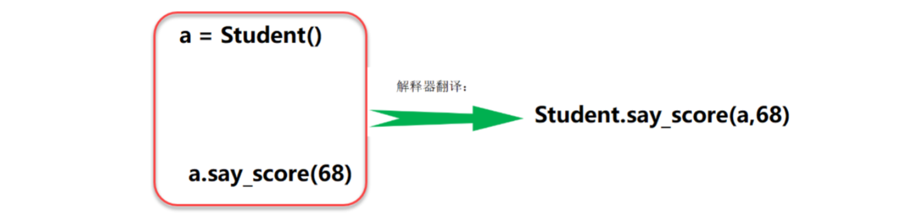
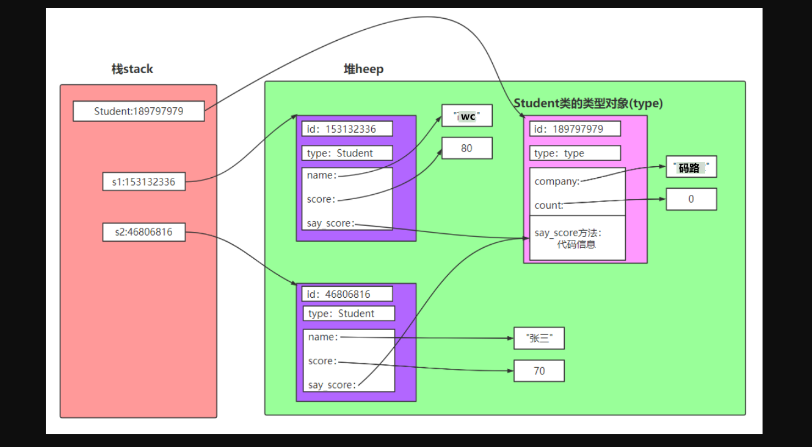
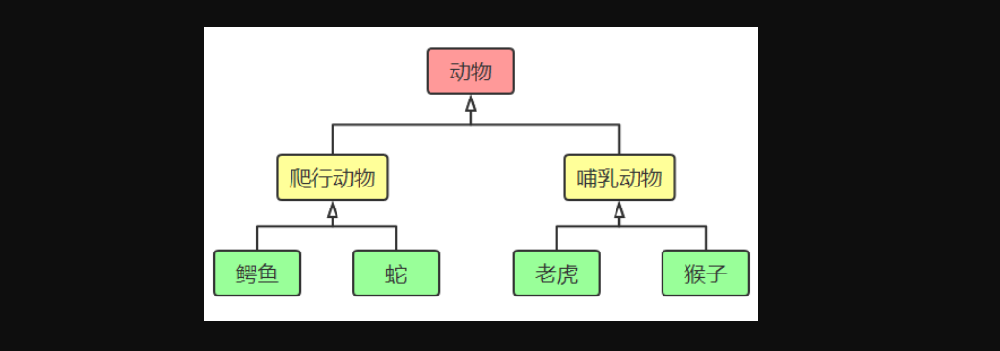
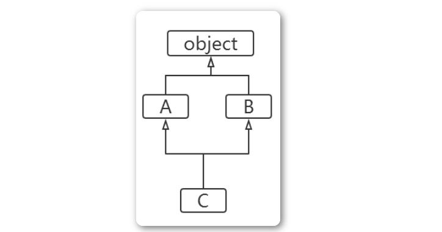
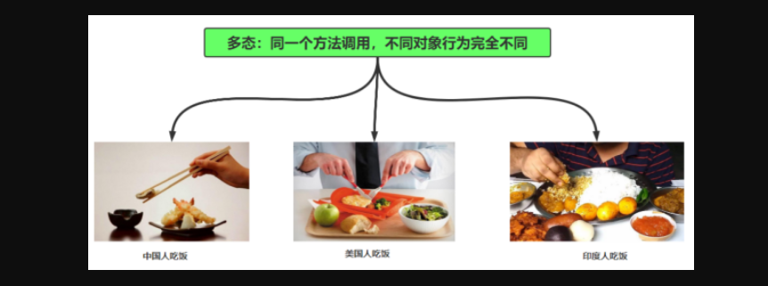
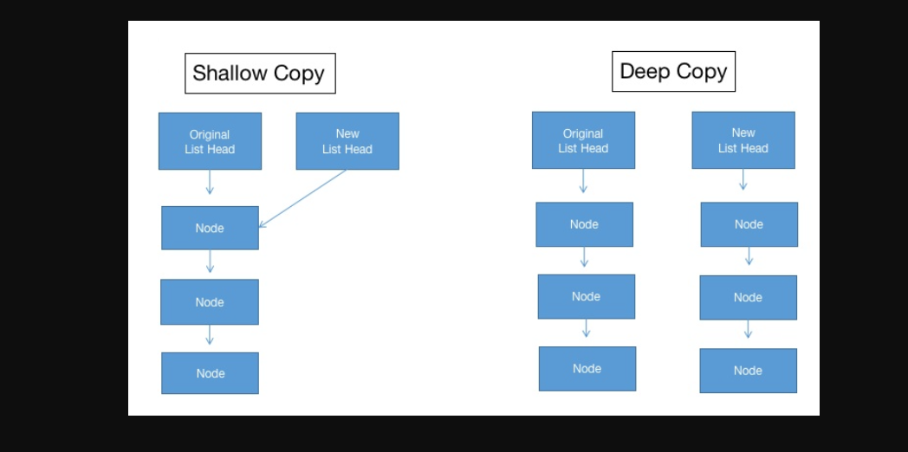

### 1，类的定义

定义类的语法格式如下：

```python
class 类名：
    类体
```

要点如下：

1. 类名必须符合“标识符”的规则；一般规定，首字母大写，多个单词使用“驼峰原则”。
2. 类体中我们可以定义属性和方法
3. 属性用来描述数据，方法(即函数)用来描述这些数据相关的操作

```python
class Student:
  def __init__(self,name,score): #构造方法第一个参数必须为self
    self.name = name     #实例属性
    self.score = score

  def say_score(self):      #实例方法
    print("{0}的分数是{1}".format(self.name,self.score))

s1 = Student('张三',80) #s1是实例对象，自动调用__init__()方法
s1.say_score()
```


**对象完整内存结构:**类是抽象的，也称之为“对象的模板”。我们需要通过类这个模板，创建类的实例对象，然后才能使用类定义的功能。我们前面说过一个Python对象包含三个部分：`id`（identity识别码）、`type`（对象类型）、`value`（对象的值）。现在，我们可以更进一步的说，一个Python对象包含如下部分：


### 2，构造函数和new方法

初始化对象，我们需要定义构造函数`__init__()`方法。构造方法用于执行“实例对象的初始化工作”，即对象创建后，初始化当前对象的相关属性，无返回值。


构造方法是负责初始化（装修），不是建对象(房子)，`__init__()`的要点如下：

1. 名称固定，必须为：`__init__()`

2. 第一个参数固定，必须为：`self`。 `self`指的就是刚刚创建好的实例对象

3. 构造函数通常用来初始化实例对象的实例属性，如下代码就是初始化实例属性：`name`和`score`

   ```python
     def __init__(self,name,score):
       self.name = name     #实例属性
       self.score = score
   ```

4. 通过“类名(参数列表)”来调用构造函数。调用后，将创建好的对象返回给相应的变量。 比如：`s1 = Student('张三', 80)`

5. `__init__()`方法：初始化创建好的对象，初始化指的是：“给实例属性赋值”

6. `__new__()`方法: 用于创建对象，但我们一般无需重定义该方法

7. 如果我们不定义`__init__`方法，系统会提供一个默认的`__init__`方法。如果我们定义了带参的`__init__`方法，系统不创建默认的`__init__`方法

注意：

- Python中的`self`相当于C++中的`self指针`，JAVA和C#中的`this`关键字。Python中，`self`必须为构造函数的第一个参数，名字可以任意修改。但一般惯例，都叫做`self`


### 3，实例属性

实例属性是从属于实例对象的属性，也称为“实例变量”。他的使用有如下几个要点：

1. 实例属性一般在`__init__()`方法中通过如下代码定义：`self.实例属性名 = 初始值`

2. 在本类的其他实例方法中，也是通过`self`进行访问： `self.实例属性名`

3. 创建实例对象后，通过实例对象访问：

   `obj01 = 类名()` #创建和初始化对象，调用`__init__()`初始化属性

   `obj01.实例属性名 = 值` #可以给已有属性赋值，也可以新加属性

```python
class Student:
  def __init__(self,name,score):
    self.name = name    #增加name属性
    self.score = score  #增加score属性

  def say_score(self):
    self.age = 18   #增加age属性
    print("{0}的分数是{1}".format(self.name,self.score))

s1 = Student("张三",80)
s1.say_score()
print(s1.age)
s1.salary = 3000    #s1对象增加salary属性

s2 = Student("李四",90)
s2.say_score()
print(s2.age)
```


### 4，实例方法

实例方法是从属于实例对象的方法。实例方法的定义格式如下：

```python
def 方法名(self [, 形参列表])：
    函数体
```


方法的调用格式如下： `对象.方法名([实参列表])`，要点：

1. 定义实例方法时，第一个参数必须为`self`。和前面一样，`self`指当前的实例对象。
2. 调用实例方法时，不需要也不能给`self`传参。`self`由解释器自动传参




函数和方法的区别：

1. 都是用来完成一个功能的语句块，本质一样。
2. 方法调用时，通过对象来调用。方法从属于特定实例对象，普通函数没有这个特点
3. 直观上看，方法定义时需要传递self，函数不需要


其它操作：

1. `dir(obj)`可以获得对象的所有属性、方法
2. `obj.__dict__` 对象的属性字典
3. `pass` 空语句
4. `isinstance（对象,类型）` 判断“对象”是不是“指定类型”


### 5，类对象和类属性

我们在前面讲的类定义格式中，`class 类名：`。实际上，当解释器执行`class`语句时，就会创建一个类对象

```python
class Student:
  pass  #空语句

print(type(Student)) # type类下面的一个对象
print(id(Student))

Stu2 = Student
s1 = Stu2()
print(s1)

```


执行结果：

```python
<class 'type'>
51686328
<__main__.Student object at 0x0000000002B5FDD8>
```


我们可以看到实际上生成了一个变量名就是类名`Student`的对象。我们通过赋值给新变量`Stu2`，也能实现相关的调用。说明，确实创建了“类对象”。


类属性是从属于“类对象”的属性，也称为“类变量”。由于，类属性从属于类对象，可以被所有实例对象共享。类属性的定义方式：

```python
class 类名：
    类变量名= 初始值
```

在类中或者类的外面，我们可以通过：`类名.类变量名`来读写


我们以下面代码为例，分析整个创建过程，让大家对面向对象概念掌握更加深刻：


```python
class Student:
  company = "码路漫漫" # 类属性
  count = 0 # 类属性

  def __init__(self, name, score):
    self.name = name # 实例属性
    self.score = score
    Student.count = Student.count + 1

  def say_score(self): # 实例方法
    print("我的公司是：", Student.company)
    print(self.name, '的分数是：', self.score)

s1 = Student('wc', 80) # s1是实例对象，自动调用__init__()方法
s2 = Student('张三', 70)
s1.say_score()
print('一共创建{0}个Student对象'.format(Student.count))
```


分析：




### 6，类方法与静态方法

类方法是从属于“类对象”的方法。类方法通过装饰器`@classmethod`来定义，格式如下：


```python
@classmethod
def 类方法名(cls  [，形参列表]) ：
    方法体
```

要点如下：

1. `@classmethod`必须位于方法上面一行
2. 第一个`cls`必须有；`cls`指的就是“类对象”本身
3. 调用类方法格式：`类名.类方法名(参数列表)`。 参数列表中，不需要也不能给`cls`传值
4. 类方法中访问实例属性和实例方法会导致错误
5. 子类继承父类方法时，传入`cls`是子类对象，而非父类对象(⚠️讲完继承再说)


代码：

```python
class Student:
  company = "MaLu"   #类属性
  
  @classmethod
  def printCompany(cls):
    print(cls.company)
  
Student.printCompany()
```


Python中允许定义与“类对象”无关的方法，称为“静态方法”。“静态方法”和在模块中定义普通函数没有区别，只不过“静态方法”放到了“类的名字空间里面”，需要通过“类调用”。静态方法通过装饰器@staticmethod来定义，格式如下：


```python
@staticmethod
def 静态方法名([形参列表]) ：
    方法体
```

要点如下：

1. `@staticmethod`必须位于方法上面一行
2. 调用静态方法格式：`类名.静态方法名(参数列表)`
3. 静态方法中访问实例属性和实例方法会导致错误


代码：

```python
class Student:
  company = "MaLu" # 类属性

  @staticmethod
  def add(a, b): # 静态方法
    print("{0}+{1}={2}".format(a,b,(a+b)))
    return a+b

Student.add(20,30)
```


### 7，析构函数和垃圾回收机制

`__del__()`称为“析构方法”，用于实现对象被销毁时所需的操作。比如：释放对象占用的资源，例如：打开的文件资源、网络连接等。Python实现自动的垃圾回收，当对象没有被引用时（引用计数为0），由垃圾回收器调用`__del__()`。我们也可以通过`del语句`删除对象，从而保证调用`__del__()`。系统会自动提供`__del__方法`，一般不需要自定义析构方法。

代码：

```python
#析构函数
class Person:
  def __del__(self):
    print("销毁对象：{0}".format(self))

p1 = Person()
p2 = Person()
del p2
print("程序结束")
```

运算结果：


```python
销毁对象：<__main__.Person object at 0x02175610>
程序结束
销毁对象：<__main__.Person object at 0x021755D0>
```


### 8，call方法和可调用对象


_ _ call _ _方法和可调用对象：

1. Python 中，凡是可以将 () 直接应用到自身并执行，都称为可调用对象。
2. 可调用对象包括自定义的函数、Python 内置函数、以及本节所讲的实例对象。
3. 定义了`__call__()`的对象，称为“可调用对象”，即该对象可以像函数一样被调用。
4. 该方法使得实例对象可以像调用普通函数那样，以“对象名()”的形式使用。


```python
def f1():
  print("f1")

f1()  #本质也是调用了__call__()方法
print(dir(f1))

class Car:
  def __call__(self, age,money):
    print("__call__方法")
    print("车龄：{0},金额：{1}".format(age,money))

f2 = Car()
f2(3,200000)  #像调用函数那样调用，本质也是调用了__call__()
```


### 9，Python中方法没有重载

如果我们在类体中定义了多个重名的方法，只有最后一个方法有效。建议：不要使用重名的方法！Python中方法没有重载。

- 在其他一些语言(比如：Java)中，可以定义多个重名的方法，只要保证方法签名唯一即可。方法签名包含3个部分：方法名、参数数量、参数类型。
- Python中，方法的的参数没有声明类型（调用时确定参数的类型），参数的数量也可以由可变参数控制。因此，Python中是没有方法的重载的。

代码：

```python
 #Python中没有方法的重载。定义多个同名方法，只有最后一个有效
 class Person:
 
   def say_hi(self):
     print("hello")
 
   def say_hi(self,name):
     print("{0},hello".format(name))
 
 p1 = Person()
 
 #p1.say_hi()    #不带参，报错：TypeError: say_hi() missing 1 required positional argument: 'name'
 
 p1.say_hi("malu")

```


Python是动态语言，我们可以动态的为类添加新的方法，或者动态的修改类的已有的方法

```python
#测试方法的动态性
class Person:
  def work(self):
    print("努力上班！")

def play_game(self):
  print("玩游戏")

def work2(s):
  print("好好工作，努力上班！")


Person.play = play_game
Person.work = work2

p = Person()
p.play()
p.work()

```

我们可以看到，`Person`动态的新增了`play_game`方法，以及用`work2`替换了`work`方法


### 10，私有属性和私有方法

Python对于类的成员没有严格的访问控制限制，这与其他面向对象语言有区别。关于私有属性和私有方法，有如下要点：

1. 通常我们约定，两个下划线开头的属性是私有的(private)。其他为公共的(public)。
2. 类内部可以访问私有属性(方法)
3. 类外部不能直接访问私有属性(方法)
4. 类外部可以通过`_类名__私有属性(方法)名`”访问私有属性(方法)


注意：方法本质上也是属性！只不过是可以通过()执行而已。所以，此处讲的私有属性和公有属性，也同时讲解了私有方法和公有方法的用法。如下测试中，同时也包含了私有方法和公有方法的例子。


```python
#测试私有属性、私有方法
class Employee:
  __company = "malu" #私有.通过dir查到_Employee__company

  def __init__(self,name,age):
    self.name = name
    self.__age = age     #私有实例属性

  def say_company(self):
    print("我的公司是：",Employee.__company)     #类内部可以直接访问私有属性
    print(self.name,"的年龄是：",self.__age)
    self.__work()

  def __work(self): #私有实例方法，通过dir可查到_Employee__work
    print("工作！好好工作，好好赚钱，娶个媳妇！")

p1 = Employee("ityls",32)
print(p1.name)
print(dir(p1))       #
p1.say_company()
print(p1._Employee__age)   #通过这种方式可以直接访问到私有属性  。通过dir可以查到属性：_Employee__age
#print(p1.__age)      #直接访问私有属性，报错
#p1.__sleep()       #直接访问私有方法，报错
```

从打印的`Person`对象所有属性我们可以看出。私有属性`__age`在实际存储时是按照`_Person__age`这个属性来存储的。这也就是为什么我们不能直接使用`__age`而可以使用`_Person__age`的根本原因。


### 11，@property装饰器


`@property`可以将一个方法的调用方式变成“属性调用”。`@property`主要用于帮助我们处理属性的读操作、写操作。对于某一个属性，我们可以直接通过：

```
emp1.salary = 30000000
```

如上的操作读操作、写操作。但是，这种做法不安全。比如，我需要限制薪水必须为`1-10000`的数字。这时候，我们就需要通过使用装饰器`@property`来处理。

```python
#测试@property
class Employee:

  def __init__(self,name,salary):
    self.name = name
    self.__salary = salary

  @property        #相当于salary属性的getter方法
  def salary(self):
    print("月薪为{0},年薪为{1}".format(self.__salary,(12*self.__salary)))
    return self.__salary;

  @salary.setter
  def salary(self,salary):  #相当于salary属性的setter方法
    if(0<salary<1000000):
      self.__salary = salary
    else:
      print("薪水录入错误！只能在0-1000000之间")

emp1 = Employee("ityls",100)
print(emp1.salary)

emp1.salary = -200
```

运行结果：

```python
月薪为100,年薪为1200
100
月薪为100,年薪为1200
100
薪水录入错误！只能在0-1000000之间
```


### 12，命名规则

属性和方法命名总结：

1. `_xxx`：保护成员，不能用`from module import *`导入，只有类对象和子类对象能访问这些成员。（⚠️讲完模块再看）
2. `__xxx__`：系统定义的特殊成员
3. `__xxx`： 类中的私有成员，只有类对象自己能访问，子类对象也不能访问。（但，在类外部可以通过`对象名. _类名__xxx`这种特殊方式访问。Python不存在严格意义的私有成员）


类编码风格：

1. 类名首字母大写，多个单词之间采用驼峰原则。
2. 实例名、模块名采用小写，多个单词之间采用下划线隔开
3. 每个类，应紧跟“文档字符串”，说明这个类的作用
4. 可以用空行组织代码，但不能滥用。在类中，使用一个空行隔开方法；模块中，使用两个空行隔开多个类


### 13，None对象

None是什么？

1. 与C和JAVA不同，python中是没有`NULL`的，取而代之的是`None`。
2. `None`是一个特殊的常量，表示变量没有指向任何对象。
3. 在Python中，`None`本身实际上也是对象，有自己的类型`NoneType`。
4. 你可以将`None`赋值给任何变量，但我们不能创建`NoneType`类型的对象


```python
obj = None
obj2 = None
print(type(None))
print(id(None))
print(id(obj))
print(id(obj2))
```

执行结果：


```python
<class 'NoneType'>
140717958924280
140717958924280
140717958924280
```


注意：None不是False，None不是0，None不是空字符串。None和任何其他的数据类型比较永远返回False。


None和其他任何类型比较都会返回False

```python
a = None
if a is None and a==None:
  print("a是None")       #会执行
if a==False or a==0:
  print("None不等于False")    #不会被打印
```


空列表、空字符串、0之间的比较，if语句判断时,空列表[]、空字典{}、空元组()、0等一系列代表空和无的对象会被转换成False

```python
a=[];b=();c={};d="";e=0;f=None
if (not a) and (not b) and (not c) and (not d) and (not e) and (not f):
  print("if判断时，空列表[]、空字符串、0、None等代表空和无的对象会被转换成False")
```

`==`和`is`判断时，空列表、空字符串不会自动转成`False`


```python
a=[];b=();c={};d="";e=0;
if (a==False or d==False):
  print("==时，空列表、空字符串不是False！")  #不会执行
if(e==False):
  print("==时，0会转成False")
```


### 14，OOP的三大特征

Python是面向对象的语言，支持面向对象编程的三大特性：继承、封装（隐藏）、多态。


封装：

- 隐藏对象的属性和实现细节，只对外提供必要的方法。相当于将“细节封装起来”，只对外暴露“相关调用方法”。
- 通过前面学习的“私有属性、私有方法”的方式，实现“封装”。Python追求简洁的语法，没有严格的语法级别的“访问控制符”，更多的是依靠程序员自觉实现。


继承：

- 继承可以让子类具有父类的特性，提高了代码的重用性。
- 从设计上是一种增量进化，原有父类设计不变的情况下，可以增加新的功能，或者改进已有的算法。


多态：

- 多态是指同一个方法调用由于对象不同会产生不同的行为。生活中这样的例子比比皆是：同样是休息方法，人不同休息方法不同。张三休息是睡觉，李四休息是玩游戏，程序员休息是“敲几行代码”。


### 15，继承

继承是面向对象编程的三大特征之一。继承让我们更加容易实现类的扩展。实现代码的重用，不用再重新发明轮子(don’t reinvent wheels)。


如果一个新类继承自一个设计好的类，就直接具备了已有类的特征，就大大降低了工作难度。已有的类，我们称为“父类或者基类”，新的类，我们称为“子类或者派生类”。




Python支持多重继承，一个子类可以继承多个父类。继承的语法格式如下：

```python
class 子类类名(父类1[，父类2，...])：
    类体
```

如果在类定义中没有指定父类，则默认父类是`object类`。也就是说，`object`是所有类的父类，里面定义了一些所有类共有的默认实现，比如：`__new__()`


关于构造函数：

1. 子类不重写 **__init__**，实例化子类时，会自动调用父类定义的 **__init__**。
2. 子类重写了**__init__** 时，实例化子类，就不会调用父类已经定义的 **__init__**
3. 如果重写了**__init__** 时，要使用父类的构造方法，可以使用 **super** 关键字，也可以使用如下格式调用：

```python
class Person:
  def __init__(self,name,age):
    print("Person的构造方法")
    self.name = name
    self.age = age

  def say_age(self):
    print(self.name,"的年龄是：",self.age)


class Student(Person):
  def __init__(self,name,age,score):
    # 子类并不会自动调用父类的__init__()，我们必须显式的调用它。
    # Person.__init__(self, name, age)
    # super(Student,self).__init__(name,age)

    print("Student的构造方法")
    # self.name = name
    # self.age = age
    self.score = score

s1 = Student("张三",15,85)
#s1.say_age()
print(dir(s1))
```

运行结果：


```python
张三 的年龄是： 15
['_Person__age', '__class__', '__delattr__', '__dict__', '__dir__', '__doc__', '__eq__', '__format__', '__ge__', '__getattribute__', '__gt__', '__hash__', '__init__', '__init_subclass__', '__le__', '__lt__', '__module__', '__ne__', '__new__', '__reduce__', '__reduce_ex__', '__repr__', '__setattr__', '__sizeof__', '__str__', '__subclasshook__', '__weakref__', 'name', 'say_age', 'score']
```


### 16，成员继承和方法重写

成员继承：子类继承了父类除构造方法之外的所有成员。私有属性、私有方法也被继承


方法重写：子类可以重新定义父类中的方法，这样就会覆盖父类的方法，也称为“重写”


```python
class Person:
  def __init__(self,name,age):
    self.name = name
    self.age = age
  def say_age(self):
    print(self.name,"的年龄是：",self.age)
  def say_name(self):
    print("我是",self.name)


class Student(Person):
  def __init__(self,name,age,score):
    Person.__init__(self,name,age) 
    self.score = score
  def say_score(self):
    print(self.name,"的分数是：",self.score)
  def say_name(self):   #重写父类的方法
    print("报告老师，我是",self.name)

s1 = Student("张三",15,85)
s1.say_score()
s1.say_name()
s1.say_age()
```

执行结果：


```python
张三 的分数是： 85
报告老师，我是 张三
张三 的年龄是： 15
```

通过类的方法`mro()`或者类的属性`__mro__`可以输出这个类的继承层次结构。

```python
class A:pass
class B(A):pass
class C(B):pass

print(C.mro())
```

执行结果：


```python
[<class '__main__.C'>, <class '__main__.B'>, <class '__main__.A'>, <class 'object'>] 
```


### 17，Object类

`object`类是所有类的父类，因此所有的类都有`object`类的属性和方法。我们显然有必要深入研究一下`object`类的结构。对于我们继续深入学习Python很有好处。


为了深入学习对象，先学习内置函数`dir()`，他可以让我们方便的看到指定对象所有的属性

```python
class Person:
  def __init__(self,name,age):
    self.name = name
    self.age = age

  def say_age(self):
    print(self.name,"的年龄是：",self.age)

obj = object()
print(dir(obj))

s2 = Person("malu",18)
print(dir(s2))
```

运行结果：

```python
['__class__', '__delattr__', '__dir__', '__doc__', '__eq__', '__format__', '__ge__', '__getattribute__', '__gt__', '__hash__', '__init__', '__init_subclass__', '__le__', '__lt__', '__ne__', '__new__', '__reduce__', '__reduce_ex__', '__repr__', '__setattr__', '__sizeof__', '__str__', '__subclasshook__']

['__class__', '__delattr__', '__dict__', '__dir__', '__doc__', '__eq__', '__format__', '__ge__', '__getattribute__', '__gt__', '__hash__', '__init__', '__init_subclass__', '__le__', '__lt__', '__module__', '__ne__', '__new__', '__reduce__', '__reduce_ex__', '__repr__', '__setattr__', '__sizeof__', '__str__', '__subclasshook__', '__weakref__', 'age', 'name', 'say_age']
```

从上面我们可以发现这样几个要点：

1. `Person`对象增加了六个属性：`__dict__` `__module__` `__weakref__` `age` `name` `say_age`
2. `object`的所有属性，`Person`类作为`object`的子类，显然包含了所有的属性
3. 我们打印`age`、`name`、`say_age`，发现`say_age`虽然是方法，实际上也是属性。只不过，这个属性的类型是`method`而已。


```python
age <class 'int'>
name <class 'str'>
say_age <class 'method'> 
```


注意：关于object这些属性的详细学习，会后面学习中逐个涉及。在此，没必要展开。


### 18，重写str方法

重写`__str__()`方法

1. `object`有一个`__str__()`方法，用于返回一个对于“对象的描述”。内置函数`str(对象)`,调用的就是`__str__()`
2. `__str__()`经常用于`print()`方法，帮助我们查看对象的信息。`__str__()`可以重写

代码：


```python
class Person:
  def __init__(self,name,age):
    self.name = name
    self.__age = age
  def __str__(self):
    '''将对象转化成一个字符串，一般用于print方法'''
    print("重写__str__方法")
    return "名字是：{0},年龄是{1}".format(self.name,self.__age)

p = Person("高淇",18)
print(p)
s = str(p)
```


### 19，多重继承

Python支持多重继承，一个子类可以有多个“直接父类”。这样，就具备了“多个父类”的特点。但是由于，这样会被“类的整体层次”搞的异常复杂，尽量避免使用。


```python
class A:
  def aa(self):
    print("aa")

class B:
  def bb(self):
    print("bb")

class C(B,A):
  def cc(self):
    print("cc")

c = C()
c.cc()
c.bb()
c.aa()
```

类结构为：




Python支持多继承，如果父类中有相同名字的方法，在子类没有指定父类名时，解释器将“从左向右”按顺序搜索。

MRO（Method Resolution Order）：方法解析顺序。 我们可以通过`mro()`方法获得“类的层次结构”，方法解析顺序也是按照这个“类的层次结构”寻找的。

```python
class A:
  def aa(self):
    print("aa")
  def say(self):
    print("say AAA!")
    
class B:
  def bb(self):
    print("bb")
  def say(self):
    print("say BBB!")
    
class C(B,A):
  def cc(self):
    print("cc")

c = C()
print(C.mro())     #打印类的层次结构
c.say()         #解释器寻找方法是“从左到右”的方式寻找，此时会执行B类中的say()

```

执行结果：


```python
[main.C'>, main.B'>, main.A'>, ] say BBB!
```


### 20，super获得父类的定义

在子类中，如果想要获得父类的方法时，我们可以通过`super()`来做。`super()`代表父类的定义，不是父类对象。想调用父类的构造方法：super(子类名称,self)._ _ init _ _(参数列表)

代码：

```python
class A:
  def __init__(self):
    print("A的构造方法")
  def say(self):
    print("A: ",self)
    print("say AAA")

class B(A):
  def __init__(self):
    super(B,self).__init__() #调用父类的构造方法
    print("B的构造方法")
  def say(self):
    #A.say(self)   调用父类的say方法
    super().say()  #通过super()调用父类的方法
    print("say BBB")

b = B()
b.say()
```

运行结果：


```python
A: <__main__.B object at 0x007A5690>
say AAA
say BBB
```


### 21，多态

多态（polymorphism）是指同一个方法调用由于对象不同可能会产生不同的行为。比如：现实生活中，同一个方法，具体实现会完全不同。 比如：同样是调用人“吃饭”的方法，中国人用筷子吃饭，英国人用刀叉吃饭，印度人用手吃饭。




关于多态要注意以下2点：

1. 多态是方法的多态，属性没有多态。
2. 多态的存在有2个必要条件：继承、方法重写


代码：


```python
#多态
class Animal:
  def shout(self):
    print("动物叫了一声")

class Dog(Animal):
  def shout(self):
    print("小狗，汪汪汪")

class Cat(Animal):
  def shout(self):
    print("小猫，喵喵喵")

def animalShout(a):
  a.shout()  #传入的对象不同，shout方法对应的实际行为也不同。

animalShout(Dog())
animalShout(Cat())
```


### 22，特殊方法和运算符重载

Python的运算符实际上是通过调用对象的特殊方法实现的。

```python
a = 20
b = 30
c = a+b
d = a.__add__(b)
print("c=",c)
print("d=",d)
```

运算结果：


```python
c= 50
d= 50
```

常见的特殊方法统计如下：

| 方法                 | 说明       | 例子                             |
| -------------------- | ---------- | -------------------------------- |
| `__init__`           | 构造方法   | 对象创建和初始化：`p = Person()` |
| `__del__`            | 析构方法   | 对象回收                         |
| `__repr__`,`__str__` | 打印，转换 | `print(a)`                       |
| `__call__`           | 函数调用   | `a()`                            |
| `__getattr__`        | 点号运算   | `a.xxx`                          |
| `__setattr__`        | 属性赋值   | `a.xxx = value`                  |
| `__getitem__`        | 索引运算   | `a[key]`                         |
| `__setitem__`        | 索引赋值   | `a[key]=value`                   |
| `__len__`            | 长度       | `len(a)`                         |


每个运算符实际上都对应了相应的方法，统计如下：

| 运算符           | 特殊方法                                         | 说明                               |
| ---------------- | ------------------------------------------------ | ---------------------------------- |
| `+`              | `__add__`                                        | 加法                               |
| `-`              | `__sub__`                                        | 减法                               |
| `<` `<=` `==`    | `__lt__` `__le__` `__eq__`                       | 比较运算符                         |
| `>` `>=` `!=`    | `__gt__` `__ge__` `__ne__`                       | 比较运算符                         |
| `|` `^` `&`      | `__or__` `__xor__` `__and__`                     | 或、异或、与                       |
| `<<` `>>`        | `__lshift__` `__rshift__`                        | 左移、右移                         |
| `*` `/` `%` `//` | `__mul__` `__truediv__` `__mod__` `__floordiv__` | 乘、浮点除、模运算（取余）、整数除 |
| `**`             | `__pow__`                                        | 指数运算                           |


我们可以重写上面的特殊方法，即实现了“运算符的重载”。


```python
#测试运算符的重载
class Person:
  def __init__(self,name):
    self.name = name

  def __add__(self, other):
    if isinstance(other,Person):
      return "{0}--{1}".format(self.name,other.name)
    else:
      return "不是同类对象，不能相加"

  def __mul__(self, other):
    if isinstance(other,int):
      return self.name*other
    else:
      return "不是同类对象，不能相乘"

p1 = Person("wc")
p2 = Person("xq")

x = p1 + p2
print(x)
print(p1*3)
```

运算结果：


```python
wc--xq
wcwcwc
```


### 23，特殊属性

Python对象中包含了很多双下划线开始和结束的属性，这些是特殊属性，有特殊用法。这里我们列出常见的特殊属性：

| 特殊属性                 | 含义                                           |
| ------------------------ | ---------------------------------------------- |
| `obj.__dict__`           | 对象的属性字典                                 |
| `obj.__class__`          | 对象所属的类                                   |
| `class.__bases__`        | 表示类的父类(多继承时，多个父类放到一个元组中) |
| `class.__base`__         | 类的父类                                       |
| `class.__mro`__          | 类层次结构                                     |
| `class.__subclasses__()` | 子类列表                                       |

代码：

```python
#测试特殊属性
class A:
  pass

class B:
  pass

class C(B,A):
  def __init__(self,nn):
    self.nn = nn
  def cc(self):
    print("cc")

c = C(3)

print(c.__dict__)
print(c.__class__)
print(C.__bases__)
print(C.mro())
print(A.__subclasses__())

```

运行结果：

```python
['__class__', '__delattr__', '__dict__', '__dir__', '__doc__', '__eq__', '__format__', '__ge__', '__getattribute__', '__gt__', '__hash__', '__init__', '__init_subclass__', '__le__', '__lt__', '__module__', '__ne__', '__new__', '__reduce__', '__reduce_ex__', '__repr__', '__setattr__', '__sizeof__', '__str__', '__subclasshook__', '__weakref__', 'cc', 'nn']
{'nn': 3}
<class '__main__.C'>
(<class '__main__.B'>, <class '__main__.A'>)
[<class '__main__.C'>, <class '__main__.B'>, <class '__main__.A'>, <class 'object'>]
[<class '__main__.C'>]
```


### 24，对象的浅copy和深copy




浅拷贝:

- Python拷贝一般都是浅拷贝。
- 浅拷贝：拷贝时，拷贝源对象，但对象包含的子对象内容不拷贝。


深拷贝:

- 使用`copy`模块的`deepcopy`函数，递归拷贝对象中包含的子对象。
- 深拷贝：拷贝时，拷贝源对象，也递归拷贝对象中包含的子对象


代码：


```python
#测试对象的引用赋值、浅拷贝、深拷贝
import copy

class MobilePhone:
  def __init__(self,cpu):
    self.cpu = cpu

class CPU:
  pass

c = CPU()
m = MobilePhone(c)

print("----浅拷贝-------")
m2 = copy.copy(m)  #m2是新拷贝的另一个手机对象
print("m：",id(m))
print("m2：",id(m2))
print("m的cpu：",id(m.cpu))
print("m2的cpu：",id(m2.cpu))  #m2和m拥有了一样的cpu对象

print("----深拷贝--------")
m3 = copy.deepcopy(m)
print("m：",id(m))
print("m3：",id(m3))
print("m的cpu：",id(m.cpu))
print("m3的cpu：",id(m3.cpu))  #m3和m拥有不一样的cpu对象
```


### 25，继承和组合

结婚就是组合。两人组合后，可以复用对方的属性和方法！除了继承，“组合”也能实现代码的复用！“组合”核心是“将父类对象作为子类的属性”。

1. `is-a`关系，我们可以使用“继承”。从而实现子类拥有的父类的方法和属性。`is-a`关系指的是类似这样的关系：狗是动物，dog is animal。狗类就应该继承动物类。
2. `has-a`关系，我们可以使用“组合”，也能实现一个类拥有另一个类的方法和属性。`has-a`关系指的是这样的关系：手机拥有CPU。 MobilePhone has a CPU

代码：

```python
#组合测试
class MobilePhone:
  def __init__(self,cpu,screen):
    self.cpu = cpu
    self.screen = screen

class CPU:
  def calculate(self):
    print("计算，算个12345")

class Screen:
  def show(self):
    print("显示一个好看的画面，亮瞎你的钛合金大眼")

c = CPU()
s = Screen()
m = MobilePhone(c,s)
m.cpu.calculate()    #通过组合，我们也能调用cpu对象的方法。相当于手机对象间接拥有了“cpu的方法”
m.screen.show()

```

运算结果：

```python
计算，算个12345
显示一个好看的画面，亮瞎你的钛合金大眼
```


### 26，工厂模式

设计模式是面向对象语言特有的内容，是我们在面临某一类问题时候固定的做法，设计模式有很多种，比较流行的是：GOF（Goup Of Four）23种设计模式。当然，我们没有必要全部学习，学习几个常用的即可。


对于初学者，我们学习两个最常用的模式：工厂模式和单例模式。


工厂模式实现了创建者和调用者的分离，使用专门的工厂类将选择实现类、创建对象进行统一的管理和控制。


```python
#工厂模式
class CarFactory:
  def createCar(self,brand):
    if brand == "奔驰":
      return Benz()
    elif brand == "宝马":
      return BMW()
    elif brand == '比亚迪':
      return BYD()
    else:
      return "未知品牌，无法创建"

class Benz:
  pass

class BMW:
  pass

class BYD:
  pass

factory = CarFactory()
c1 = factory.createCar("奔驰")
c2 = factory.createCar("宝马")
print(c1)
print(c2)
```


运行结果：


```python
<__main__.Benz object at 0x021C5770>
<__main__.BMW object at 0x021C5790>
```


### 27，单例模式

单例模式（Singleton Pattern）的核心作用是确保一个类只有一个实例，并且提供一个访问该实例的全局访问点。


单例模式只生成一个实例对象，减少了对系统资源的开销。当一个对象的产生需要比较多的资源，如读取配置文件、产生其他依赖对象时，可以产生一个“单例对象”，然后永久驻留内存中，从而极大的降低开销。


单例模式有多种实现的方式，我们这里推荐重写`__new__()`的方法。

```python
#单例模式
class MySingleton:
  __obj = None
  __init_flag = True
  def __new__(cls, *args, **kwargs):
    if cls.__obj == None:
      cls.__obj = object.__new__(cls)
    return cls.__obj

  def __init__(self,name):
    if MySingleton.__init_flag:
      print("init....")
      self.name = name
      MySingleton.__init_flag = False

a = MySingleton("aa")
print(a)
b = MySingleton("bb")
print(b)
```


### 28，工厂模式和单例模式结合

设计模式称之为“模式”，就是一些固定的套路。我们很容易用到其他场景上，比如前面讲的工厂模式，我们需要将工厂类定义成“单例”，只需要简单的套用即可实现：

```python
#测试工厂模式和单例模式的整合使用
class CarFactory:
  __obj = None      #类属性
  __init_flag = True
  def create_car(self,brand):
    if brand =="奔驰":
      return Benz()
    elif brand =="宝马":
      return BMW()
    elif brand == "比亚迪":
      return BYD()
    else:
      return "未知品牌，无法创建"

  def __new__(cls, *args, **kwargs):
    if cls.__obj ==None:
      cls.__obj = object.__new__(cls)
    return cls.__obj

  def __init__(self):
    if CarFactory.__init_flag:
      print("init CarFactory....")
      CarFactory.__init_flag = False

class Benz:
  pass

class BMW:
  pass

class BYD:
  pass

factory = CarFactory()
c1 = factory.create_car("奔驰")
c2 = factory.create_car("比亚迪")
print(c1)
print(c2)

factory2 = CarFactory()
print(factory)
print(factory2)
```


运算结果：

```python
init CarFactory....
<__main__.Benz object at 0x01E36E90>
<__main__.BYD object at 0x01E36C30>
<__main__.CarFactory object at 0x01E36730>
<__main__.CarFactory object at 0x01E36730>
```


练习：

1. 定义发动机类Motor、底盘类Chassis、座椅类Seat，车辆外壳类Shell，并使用组合关系定义汽车类。其他要求如下：

   > 定义汽车的run()方法，里面需要调用Motor类的work()方法，也需要调用座椅类Seat的work()方法，也需要调用底盘类Chassis的work()方法

2. 使用工厂模式、单例模式实现如下需求：

   (1) 电脑工厂类ComputerFactory用于生产电脑Computer。工厂类使用单例模式，也就是说只能有一个工厂对象。

   (2) 工厂类中可以生产各种品牌的电脑：联想、华硕、神舟

   (3) 各种品牌的电脑使用继承实现：

   (4) 父类是Computer类，定义了calculate方法

   (5) 各品牌电脑类需要重写父类的calculate方法

3. 定义一个Employee雇员类，要求如下：

   (1) 属性有：id、name、salary

   (2) 运算符重载+：实现两个对象相加时，默认返回他们的薪水和

   (3) 构造方法要求：输入name、salary，不输入id。id采用自增的方式，从1000开始自增，第一个新增对象是1001，第二个新增对象是1002。

   (4) 根据salary属性，使用@property设置属性的get和set方法。set方法要求输入：1000-50000范围的数字。


