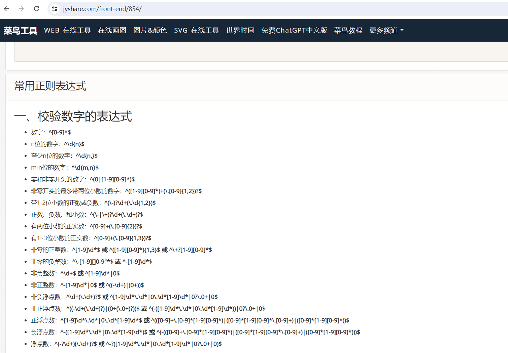

### 1，正则表达式


在实际开发过程中经常会有**查找符合某些复杂规则**的**字符串**的需要，比如:邮箱、图片地址、手机号码等;这时候想匹配或者查找符合某些规则的字符串就可以使用正则表达式了。熟练的掌握正则表达式，能够帮助程序员以最快的速度写出最优雅的代码


正则表达式：

- 正则表达式就是：是一种文本模式

- 正则表达式使用**单个字符串**来描述、匹配一系列、匹配某个句法规则的字符串


举例：

- Email地址: `^\w+([-+.]\w+)\*@\w+([-.]\w+)\*\.\w+([-.]\w+)\*$`
- 域名: `[a-zA-Z0-9][-a-zA-Z0-9]{0,62}(\.[a-zA-Z0-9][-a-zA-Z0-9]{0,62})+\.?`
- InternetURL: `[a-zA-z]+://[^\s]\* 或 ^http://([\w-]+\.)+[\w-]+(/[\w-./?%&=]\*)?$`
- 手机号码: `^(13[0-9]|14[01456879]|15[0-35-9]|16[2567]|17[0-8]|18[0-9]|19[0-35-9])\d{8}$`
- 身份证号: `(^\d{15}$)|(^\d{18}$)|(^\d{17}(\d|X|x)$)`


网上有很多现成可以使用的正则表达式：https://c.runoob.com/front-end/854/




特点：

- 正则表达式的语法**可读性差**
- 正则表达式通用行很强，能够适用于很多编程语言
  - python
  - java
  - javascript
  - 等


### 2，re模块

Python通过re模块实现对正则表达式的支持。re模块提供了常见的正则匹配操作,如:匹配、搜索、替换等功能


匹配操作 - re.match() re.match() 从字符串的开始（从头开始匹配）进行匹配,如果开始部分匹配成功就返回匹配对象,否则返回None

```python
import re

m = re.match('foo', 'food') # 返回匹配对象
print(m) # <re.Match object; span=(0, 3), match='foo'>


m = re.match('foo', 'fbar') # 不匹配,返回None
print(m) # None
```

搜索操作 - re.search() re.search() 扫描字符串,如果找到匹配就返回匹配对象,否则返回None（从任意位置开始匹配）

```python
import re

m = re.search('foo', 'hellofood')  
print(m) # <re.Match object; span=(6, 9), match='foo'>

m = re.search('foo', 'hello')  
print(m) # None
```

提取操作 - re.findall() 查找所有匹配,返回所有匹配结果的列表，如果没有匹配到数据，返回一个空列表

```python
lst = re.findall('ab', 'abcdabcdabcd') 
print(lst) # ['ab', 'ab', 'ab']
```

提取操作 - re.finditer() 查找所有匹配,返回所有匹配结果的一个iterator

```python
lst = re.finditer('ab', 'abcdabcdabcd') 
print(lst) # <callable_iterator object at 0x0000019CF4D5FD60>
for i in lst:
  print(i.group())    # ab
```

替换操作 - re.sub() re.sub() 用于替换匹配的字符串。将匹配到的字符串替换为另一个字符串。

```python
text = 'yeah, but no, but yeah, but no'
print(re.sub('but', 'AND', text))
# yeah, AND no, AND yeah, AND no
```


### 3，匹配单个字符

大多数字、字母和符号都会简单地匹配自身。例如，正则表达式 `test` 将会精确地匹配到 `test`。但该规则有例外，有些字符是特殊的，并不匹配自身。因为这些字符，有表达式中，有特殊含义！

```
. ^ $ * + ? { } [ ] \ | ( )
```

如果想匹配这些内容，只需要在符号前上1个`\`就可以了，例如：匹配`$`, 就可以写成`\$`。匹配字符：

| 代码 | 功能                                     |
| ---- | ---------------------------------------- |
| .    | 匹配任意1个字符（除了\n）                |
| [ ]  | 匹配[ ]中列举的字符                      |
| \d   | 匹配数字，即0-9                          |
| \D   | 匹配非数字，即不是数字                   |
| \s   | 匹配空白，即 空格，tab键                 |
| \S   | 匹配非空白                               |
| \w   | 匹配非特殊字符，即a-z、A-Z、0-9、_、汉字 |
| \W   | 匹配特殊字符，即非字母、非数字、非汉字   |

代码：

```python
import re

ret = re.match(".","M")
print(ret.group())

ret = re.match("t.o","too")
print(ret.group())

ret = re.match("t.o","two")
print(ret.group())
```

运行结果：


```python
M
too
two
```

代码：


```python
import re

# 如果hello的首字符小写，那么正则表达式需要小写的h
ret = re.match("h","hello Python") 
print(ret.group())

# 如果hello的首字符大写，那么正则表达式需要大写的H
ret = re.match("H","Hello Python") 
print(ret.group())

# 大小写h都可以的情况
ret = re.match("[hH]","hello Python")
print(ret.group())
ret = re.match("[hH]","Hello Python")
print(ret.group())
ret = re.match("[hH]ello Python","Hello Python")
print(ret.group())

# 匹配0到9第一种写法
ret = re.match("[0123456789]Hello Python","6Hello Python")
print(ret.group())

# 匹配0到9第二种写法
ret = re.match("[0-9]Hello Python","6Hello Python")
print(ret.group())

ret = re.match("[0-35-9]Hello Python","6Hello Python")
print(ret.group())

# 下面这个正则不能够匹配到数字4，因此ret为None
ret = re.match("[0-35-9]Hello Python","4Hello Python")
# print(ret.group())
```

运行结果：

```python
h
H
h
H
Hello Python
6Hello Python
6Hello Python
6Hello Python
```

代码：


```python
import re

# 普通的匹配方式
ret = re.match("python2","python2停止维护了") 
print(ret.group())

ret = re.match("python3","python3发布了") 
print(ret.group())

# 使用\d进行匹配
ret = re.match("python\d","python2停止维护了") 
print(ret.group())

ret = re.match("python\d","python3发布了") 
print(ret.group())
```

运行结果：

```python
python2
python3
python2
python3
```

代码：

```python
import re

match_obj = re.match("\D", "f")
if match_obj:
  # 获取匹配结果
  print(match_obj.group())
else:
  print("匹配失败")
```

运行结果:


```python
f
```

代码：


```python
import re

# 空格属于空白字符
match_obj = re.match("hello\sworld", "hello world")
if match_obj:
  result = match_obj.group()
  print(result)
else:
  print("匹配失败")

# \t 属于空白字符
match_obj = re.match("hello\sworld", "hello\tworld")
if match_obj:
  result = match_obj.group()
  print(result)
else:
  print("匹配失败")
```


运行结果:

```python
hello world
hello world
```


代码：

```python
import re

match_obj = re.match("hello\Sworld", "hello&world")
if match_obj:
    result = match_obj.group()
    print(result)
else:
    print("匹配失败")

match_obj = re.match("hello\Sworld", "hello$world")
if match_obj:
  result = match_obj.group()
  print(result)
else:
    print("匹配失败")
```

运行结果:


```python
hello&world 
hello$world
```

代码：

```python
import re

# 匹配非特殊字符中的一位
match_obj = re.match("\w", "A")
if match_obj:
  # 获取匹配结果
  print(match_obj.group())
else:
  print("匹配失败")
```

执行结果:

```python
A
```

代码：


```python
# 匹配特殊字符中的一位
match_obj = re.match("\W", "&")
if match_obj:
  # 获取匹配结果
  print(match_obj.group())
else:
  print("匹配失败")
```

执行结果:


```python
&
```


### 4，匹配多个字符

能够匹配各种各样的字符集合是正则表达式可以做到的第一件事。但功能不算强大！强大之处在于**可以指定正则的某部分必须重复一定的次数**

| 代码  | 功能                                                |
| ----- | --------------------------------------------------- |
| *     | 匹配前一个字符出现0次或者无限次，即可有可无         |
| +     | 匹配前一个字符出现1次或者无限次，即至少有1次        |
| ?     | 匹配前一个字符出现1次或者0次，即要么有1次，要么没有 |
| {m}   | 匹配前一个字符出现m次                               |
| {m,n} | 匹配前一个字符出现从m到n次                          |

匹配出一个字符串第一个字母为大小字符，后面都是小写字母并且这些小写字母可 有可无

```python
import re

ret = re.match("[A-Z][a-z]*","M")
print(ret.group())

ret = re.match("[A-Z][a-z]*","MnnM")
print(ret.group())


ret = re.match("[A-Z][a-z]*","Aabcdef")
print(ret.group())

```


运行结果：

```python
M
Mnn
Aabcdef
```

匹配一个字符串，第一个字符是t,最后一个字符串是o,中间至少有一个字符


```python
import re

match_obj = re.match("py.+n", "python")
if match_obj:
  print(match_obj.group())
else:
  print("匹配失败")
```

运行结果：

```python
python
```

匹配出这样的数据，但是https 这个s可能有，也可能是http 这个s没有

```python
import re

match_obj = re.match("https?", "http")
if match_obj:
  print(match_obj.group())
else:
  print("匹配失败")
```

运行结果：


```python
http
```

匹配出，8到20位的密码，可以是大小写英文字母、数字、下划线


```python
import re

ret = re.match("[a-zA-Z0-9_]{6}","12a3g45678")
print(ret.group())

ret = re.match("[a-zA-Z0-9_]{8,20}","1a2b3c4d5e6f7g8h9ijklmn")
print(ret.group())

```

运行结果：


```python
12a3g4
1a2b3c4d5e6f7g8h9ijk
```


### 5，贪婪模式与非贪婪模式

在正则表达式中,贪婪模式和非贪婪模式描述的是量词的匹配方式。量词是正则表达式中指定匹配次数的元字符,主要有:

- *:0次或多次
- ?:0次或1次
- +:1次或多次


那么贪婪模式和非贪婪模式的区别就是：

- 贪婪模式:量词会尽可能多的匹配字符
- 非贪婪模式:量词会尽可能少的匹配字符


例子：

```
字符串:`<div>1111</div><div>2222</div>`  正则表达式:`<div>.+</div>`

贪婪模式:.+ 匹配结果是:<div>1111</div><div>2222</div>
非贪婪模式:.+?匹配结果是:<div>1111</div>
```


在正则表达式中,贪婪模式是默认的。可以通过在量词后面加`?`将其转换为非贪婪模式。何时使用贪婪模式,何时使用非贪婪模式呢?

- 如果需要匹配尽可能长的字符,则使用贪婪模式。 
- 如果需要匹配尽可能少的字符,则使用非贪婪模式。 
- 在某些情况下,非贪婪模式可以避免正则表达式匹配超出我们预期的字符,产生错误。


代码：

```python
import re

info = '<div>python</div><div>mysql</div>'

# 贪婪模式
print('-'*20,'贪婪模式','-'*20)
m1 = re.match('<div>.*</div>', info)
if m1:
    print(m1.group())
else:
    print('m1:匹配失败')

# 非贪婪模式
print('-'*20,'非贪婪模式','-'*20)
m2 = re.match('<div>.*?</div>', info)
if m2:
    print(m2.group())
else:
    print('m2:匹配失败')
```


### 6，匹配开头，结尾，取反

| 代码 | 功能           |
| ---- | -------------- |
| ^    | 匹配字符串开头 |
| $    | 匹配字符串结尾 |


匹配以数字开头的数据

```python
import re


# 匹配以数字开头的数据
match_obj = re.match("^\d.*", "6hello")
if match_obj:
  # 获取匹配结果
  print(match_obj.group())
else:
  print("匹配失败")
```

运行结果:

```python
6hello
```


匹配以数字结尾的数据


```python
import re
# 匹配以数字结尾的数据
match_obj = re.match(".*\d$", "hello5")
if match_obj:
  # 获取匹配结果
  print(match_obj.group())
else:
  print("匹配失败")
```

运行结果：


```python
hello5
```

匹配以数字开头中间内容不管以数字结尾


```python
match_obj = re.match("^\d.*\d$", "6hello6")
if match_obj:
  # 获取匹配结果
  print(match_obj.group())
else:
  print("匹配失败")
```


运行结果:

```python
6hello6
```

[^指定字符] 表示除了指定字符都匹配。第一个字符除了aeiou的字符都匹配


```python
import re

match_obj = re.match("[^aeiou]", "h")
if match_obj:
  # 获取匹配结果
  print(match_obj.group())
else:
  print("匹配失败")

```


执行结果：

```python
h
```


### 7，或者与分组的使用

| 代码         | 功能                             |
| ------------ | -------------------------------- |
| \|           | 匹配左右任意一个表达式           |
| (ab)         | 将括号中字符作为一个分组         |
| `\num`       | 引用分组num匹配到的字符串        |
| `(?P<name>)` | 分组起别名                       |
| (?P=name)    | 引用别名为name分组匹配到的字符串 |

在列表中["python", "mysql", "html", "flask"]，匹配python和flask


```python
import re

# 水果列表
skill_list = ["python", "mysql", "html", "flask"]

# 遍历数据
for value in skill_list:
  # |   匹配左右任意一个表达式
  match_obj = re.match("python|flask", value)
  if match_obj:
    print(f"{match_obj.group()}:需要掌握")
  else:
    print(f"{value}:暂时还不用掌握")
```


执行结果:


```python
python:需要掌握
mysql:暂时还不用掌握
html:暂时还不用掌握
flask:需要掌握
```


匹配出163、126、qq等邮箱

```python
import re

match_obj = re.match("\w{4,20}@(163|126|qq)\.com", "hello@qq.com")
if match_obj:
  print(match_obj.group())
  # 获取分组数据
  print(match_obj.group(1))
else:
  print("匹配失败")
```

执行结果:


```python
hello@qq.com
qq
```


匹配`电话:10086`这样的数据，提取出来**电话文字**和**电话号码**

```python
import re

match_obj = re.match("(电话):([1-9]\d{4,10})", "电话:10086")

if match_obj:
  print(match_obj.group())
  # 分组:默认是1一个分组，多个分组从左到右依次加1
  print(match_obj.group(1))
  # 提取第二个分组数据
  print(match_obj.group(2))
else:
  print("匹配失败")
```

执行结果:

```python
电话
10086
```

匹配出`<html>hh</html>`


```python
match_obj = re.match("<[a-zA-Z1-6]+>.*</[a-zA-Z1-6]+>", "<html>hh</div>")

if match_obj:
  print(match_obj.group())
else:
  print("匹配失败")

match_obj = re.match("<([a-zA-Z1-6]+)>.*</\\1>", "<html>hh</html>")

if match_obj:
  print(match_obj.group())
else:
  print("匹配失败")
```

运行结果：


```python
<html>hh</div>
<html>hh</html>
```

匹配出`<html><h1>www.malu.cn</h1></html>`

```python
match_obj = re.match("<(?P<name1>[a-zA-Z1-6]+)><(?P<name2>[a-zA-Z1-6]+)>.*</(?P=name2)></(?P=name1)>", "<html><h1>www.malu.cn</h1></html>")

if match_obj:
  print(match_obj.group())
else:
  print("匹配失败")
```

运行结果：

```python
<html><h1>www.malu.cn</h1></html>
```


### 8，标志的使用

正则表达式标志用于修改正则表达式的匹配方式,以及匹配结果。Python的re模块支持以下5种标志:

| 代码               | 功能                                    |
| ------------------ | --------------------------------------- |
| `re.I(IGNORECASE)` | 忽略大小写,使匹配对大小写不敏感         |
| `re.M(MULTILINE)`  | 多行匹配,修改'^'和'$'的行为             |
| `re.S(DOTALL)`     | .可以匹配所有字符,包含换行符            |
| `re.U(UNICODE)`    | 使用Unicode匹配                         |
| `re.X(VERBOSE)`    | 忽略空格和注释,使正则表达式更具有可读性 |


代码：


```python
import re

# 忽略大小写的使用 re.I
print('-'*20,'re.I的使用','-'*20)
m1 = re.match('[a-z]+', 'Hello',re.I)
# m1 = re.match('[a-z]+', 'Hello',re.IGNORECASE)
if m1:
    print(m1.group())
else:
    print('m1:匹配失败')

# .匹配所有数据的使用 re.S
print('-'*20,'re.S的使用','-'*20)
m2 = re.match('.+', 'Hello\nPython',re.S)
if m2:
    print(m2.group())
else:
    print('m2:匹配失败')

# 忽略空格和注释 re.X
print('-'*20,'re.X的使用','-'*20)
m3 = re.match('''
    ^  # 行的开头
    (   # 分组1开始
        [a-z]+[A-Z]+    # 字母开头,以小写字母开头，以大写字母结尾
        |               # 或者
        [A-Z]+[a-z]+    # 字母开头,以大写字母开头，以小写字母结尾
    )   # 分组1结束
    \s  # 空格
    (Python)    # 分组2
    ''','Hello Python',re.X)
if m3:
    print(m3.group())
else:
    print('m3:匹配失败')
```


