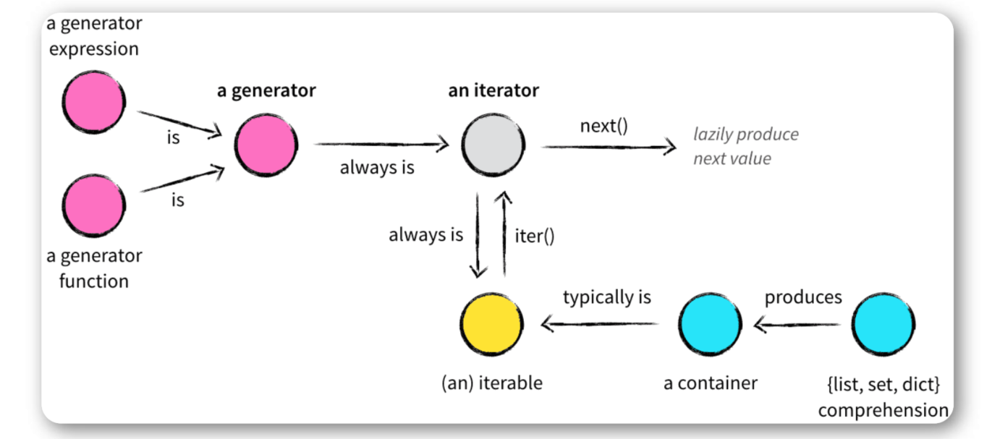

## 一，生成器


### 1，生成器介绍

在Python中，一边循环一边计算的机制，称为生成器：generator。特点：

1. 边计算边生成数据，时间换空间！想要得到庞大的数据，又想让它占用空间少，那就用生成器
2. 延时计算，需要的时候，再计算出数据


**为什么要有生成器**

- 列表所有数据都在内存中，如果有海量数据的话将会非常耗内存。如：仅仅需要访问前面几个元素，那后面绝大多数元素占用的空间都白白浪费了。
- 如果列表元素按照某种算法推算出来，那我们就可以在循环的过程中不断推算出后续的元素，这样就不必创建完整的list，从而节省大量的空间。 


### 2，创建生成器的方式

创建生成器的方式一：生成器表达式。

- 生成器表达式很简单，只要把一个列表推导式的 [] 改成 () ，就创建了一个生成器(generator)

```python
# 创建 L 和 g 的区别仅在于最外层的 [] 和 () ， L 是一个list，而 g 是一个generator。
L = [x * x for x in range(10)]
print(L)
g = (x * x for x in range(10))
print(g)
#<generator object <genexpr> at 0x1022ef630>
print(g.__next__())
print(g.__next__())
print(g.__next__())
print(g.__next__())
print(g.__next__())
```


创建生成器的方式二：生成器函数。

- 如果一个函数中包含 yield 关键字，那么这个函数就不再是一个普通函数，调用函数就是创建了一个生成器（generator）对象。 
- 其实就是利用关键字 yield 一次性返回一个结果，阻塞，重新开始

```python
# 函数有了yield之后，调用它，就会生成一个生成器
def test():
    print("start")
    i = 0
    while i<3:
        # yield i
        temp = yield i # yield作用：程序挂起，返回相应的值。下次从下一个语句(不是下一行)开始执行。
        print(f"temp:{temp}")
        print(f"i:{i}")
        i+=1
    print("end")
    return "done" # return在生成器中代表生成器种植，直接报错：StopIeratation

if __name__ == '__main__':
    a = test()
    print(a)
    a.__next__()  # next方法作用：唤醒并继续执行
    a.__next__()
    a.__next__()
    a.__next__()
```


send语法：

- send() 和 next() 一样，都能让生成器继续往下走一步（下次遇到 yield 停），但 send() 能传一个值，这个值作为 yield 表达式整体的结果 

演示send语法：

```python
# send的作用是唤醒并继续执行，发送一个信息到生成器内部
def foo():
    print("start")
    i = 0
    while i<3:
        temp = yield i
        print(f"temp:{temp}")
        i=i+1
    print("end")

g = foo()
print(next(g))  # g.__next__()
print("------------------")
print(g.send(100))
print(next(g))
```


假设要让你生成 300w个随机的4位数，并打印出来。有两种选择：

- 在内存中一次性创建300w个
- 动态创建，用一个创建一个


在内存中一次性创建300w个

```python
import random

data_list = []
for i in range(300000000):
    val = random.randint(1000, 9999)
	data_list.append(val)
    
# 再使用时，去 data_list 中获取即可。
# ...
```


动态创建，用一个创建一个

```python
import random

def gen_random_num(max_count):
    counter = 0
    while counter < max_count:
        yield random.randint(1000, 9999)
        counter += 1

data_list = gen_random_num(3000000)
# 再使用时，去 data_list 中获取即可。
```


### 3，生成器函数的工作原理


原理：

- 生成器函数返回一个迭代器，for循环对这个迭代器不断调用 __next__() 函数，不断运行到下一个yield 语句，一次一次取得每一个返回值，直到没有 yield 语句为止，最终引发 StopIteration 异常。
- yield 相当于 return 返回一个值，并且记住这个返回的位置，下次迭代时，代码从 yield 的下一条语句(不是下一行)开始执行。 
- send() 和 next() 一样，都能让生成器继续往下走一步（下次遇到 yield 停），但 send() 能传一个值，这个值作为 yield 表达式整体的结果 
- 生成器推导式底层原理也是这样的。


```python
# send的作用是唤醒并继续执行，发送一个信息到生成器内部
def foo():
    print("start")
    i = 0
    while i<3:
        temp = yield i
        print(f"temp:{temp}")
        i=i+1
    print("end")

g = foo()
print(next(g))  # g.__next__()
print("------------------")
print(g.send(100))
print(next(g))
print("------------------")
for a in g:
    print("in ",a)
```


小结：

- 生成器仅仅保存了一套生成数值的算法，并且没有让这个算法现在就开始执行，而是我什么时候调它，它什么时候开始计算一个新的值，并给你返回。 
- 生成器函数生成一系列结果。通过 yield 关键字返回一个值后，还能从其退出的地方继续运行，因此可以随时间产生一系列的值。
- 生成器是一种特殊的迭代器，都有一个 _ _ next _ _() 成员方法，这个方法要么返回迭代的下一项，要么引起异常结束迭代。 
- 生成器是一个特殊的程序，可以被用作控制循环的迭代行为，python中生成器是迭代器的一种，使用yield返回值函数，每次调用yield会暂停，而可以使用 next() 函数和send() 函数恢复生成器。
- 生成器看起来像是一个函数，但是表现得却像是迭代器


## 二，迭代器

### 1，什么是迭代器

迭代是Python最强大的功能之一，是访问集合元素的一种方式。迭代器是一个可以记住遍历的位置的对象。特点：

- 迭代器对象从集合的第一个元素开始访问，直到所有的元素被访问完结束
- 迭代器只能往前不会后退
- 迭代器有两个基本的方法： iter() 和 next()


### 2，可迭代对象和迭代器的区别


一个实现了 iter 方法的对象，称为"可迭代对象Ieratable"。一个实现 next 方法并且是可迭代的对象，称为"迭代器Iterator"，即：实现了 iter 方法和 next 方法的对象就是迭代器。


生成器都是 Iterator 对象，但 list 、 dict 、 str 虽然是 Iterable（可迭代对象） ，却不是 Iterator（迭代器） 。 



```python
from collections.abc import Iterator
from collections.abc import Iterable

a = isinstance([], Iterable)
a = isinstance([], Iterator)
print(a)
```


list 、 dict 、 str 等 Iterable 变成 Iterator , 可以使用 iter() 函数：

```python
from collections.abc import Iterator

print(isinstance(iter([]), Iterator))
print(isinstance(iter('malu'), Iterator))
```


为什么 list 、 dict 、 str 等数据类型不是 Iterator ？

> Python的 Iterator 对象表示的是一个**数据流**。可以把这个数据流看做是一个有序序列，但我们却不能提前知道序列的长度，只能不断通过 next() 函数实现按需计算下一个数据，所以 Iterator 的计算是惰性的，只有在需要返回下一个数据时它才会计算。所以，生成器一定是迭代器。Iterator 甚至可以表示一个无限大的数据流，例如全体自然数。而使用list是永远不可能存储全体自然数的。


### 3，for循环本质

Python3的 for 循环本质上就是通过不断调用 next() 函数实现的。

```python
for x in [1, 2, 3, 4, 5]:
    print(x)

print("--------")

# 首先获得Iterator对象:
it = iter([1, 2, 3, 4, 5])
# 循环:
while True:
    try:
        # 获得下一个值:
        x = next(it)
        print(x)
    except StopIteration:
        # 遇到StopIteration就退出循环
        break
```


### 4，创建一个迭代器

一个类作为一个迭代器使用需要在类中实现两个方法 _ _ iter _ _() 与 _ _ next _ _()

- _ _ iter _ _()方法返回一个特殊的迭代器对象， 这个迭代器对象实现了_ _ _ next _ _()方法并通过StopIteration 异常标识迭代的完成。 
- _ _ next _ _() 方法会返回下一个迭代器对象。 


创建一个依次返回10,20,30,...这样数字的迭代器

```python
class MyNumbers:
    def __iter__(self):
        self.num = 10
        return self
    def __next__(self):
        if self.num<40:
            x = self.num
            self.num += 10
            return x
        else:
            raise StopIteration
myclass = MyNumbers()
myiter = iter(myclass)
print(next(myiter))
print(next(myiter))
print(next(myiter))
print(next(myiter))
print(next(myiter))
```


