## 一，并发编程


### 1，串行、并行与并发的区别

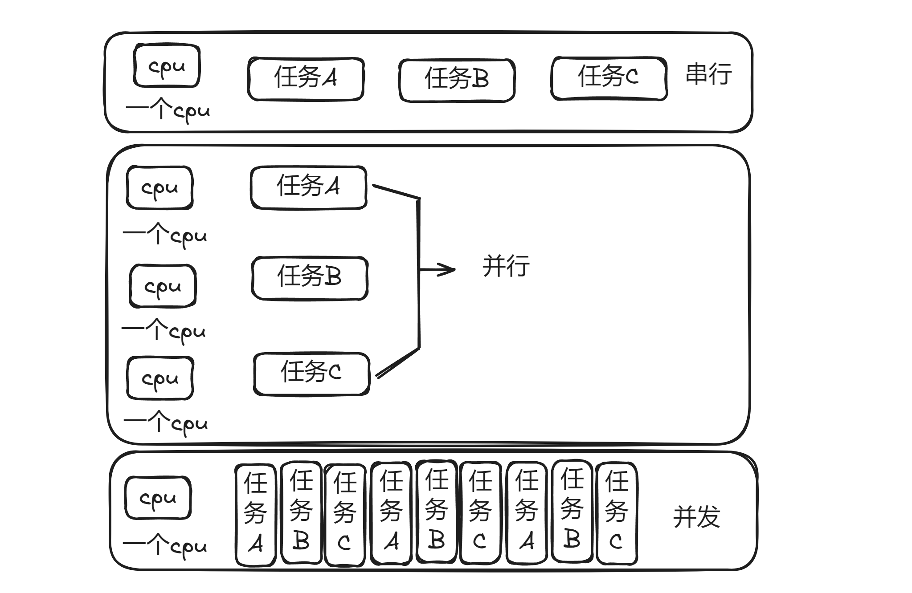


三者区别：

- 串行(serial)：一个CPU上，按顺序完成多个任务，一个任务执行完毕后，再执行另一个任务。
- 并行(parallelism)：指的是任务数小于等于cpu核数，即任务真的是一起执行的。每个CPU执行一个任务。
- 并发(concurrency)：一个CPU采用时间片管理方式，交替的处理多个任务。一般是是任务数多余cpu核数，通过操作系统的各种任务调度算法，实现用多个任务“一起”执行（实际上总有一些任务不在执行，因为切换任务的速度相当快，看上去一起执行而已）。说白了，就是一个CPU交替执行多个任务或多个CPU执行多个任务。


### 2，进程，线程，协程的区别


雷军开工厂生产手机，费劲力气，制作一条生产线，这个生产线上有很多的器件以及材料。**一条生产线就是一个进程。**只有生产线是不够的，所以找五个工人来进行生产，这个工人能够利用这些材料最终一步步的将手机做出来，**这五个工人就是五个线程。**

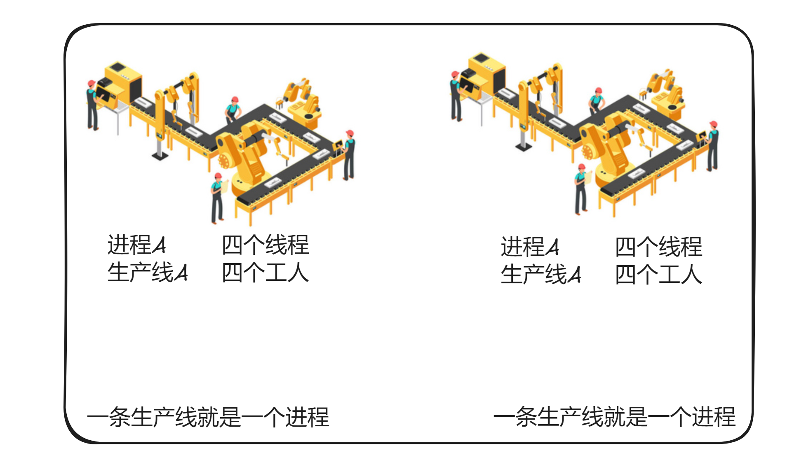

为了提高生产率，有3种办法：

- 一条生产线上多招些工人，一起来做手机，这样效率是成倍増长，即单进程多线程方式
- 多条生产线，每个生产线上多个工人，即多进程多线程
- 雷军深入一线发现工人不是那么忙，有很多等待时间。于是规定：如果某个员工在等待生产线某个零件生产时 ，不要闲着，干点其他工作。也就是说：如果一个线程等待某些条件，可以充分利用这个时间去做其它事情，**这就是：协程方式。** 


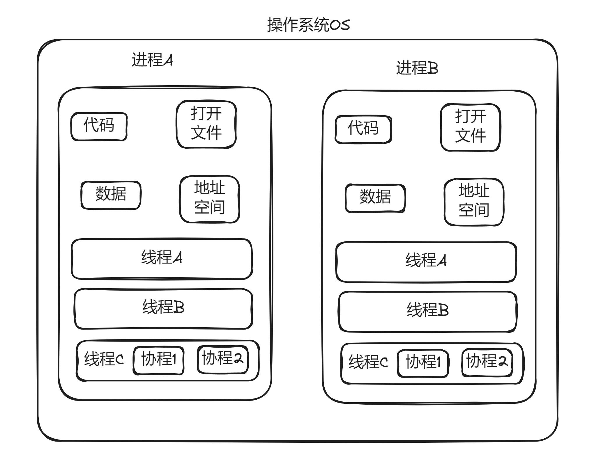


进程概念：

- 进程是一个具有一定独立功能的程序关于某个数据集合的一次运行活动 
- 现代操作系统比如Mac OS X，Linux，Windows等，都是支持 “多任务”的操作系统，叫“多任务”呢？简单地说，就是操作系统可以同时运行多个任务。
- 对于操作系统来说，一个任务就是一个进程（Process）

- 进程拥有自己独立的堆和栈，既不共享堆，也不共享栈，进程由操作系统调度；进程切换需要的资源很最大，效率低


线程概念：

- 线程是操作系统能够进行运算调度的最小单位。它被包含在进程之中，是进程中的实际运作单位。 

- 拥有自己独立的栈和共享的堆，共享堆，不共享栈，标准线程由操作系统调度；线程切换需要的资源一般，效率一般（当然了在不考虑GIL的情况下）
- 有些进程还不止同时干一件事，比如微信，它可以同时进行打字聊天，视频聊天，朋友圈等事情。在一个进程内部，要同时干多件事，就需要同时运行多个“子任务”，我们把进程内的这些“子任务”称为线程（Thread）。


协程概念：

- 协程，Coroutines，也叫作纤程(Fiber)，是一种在线程中，比线程更加轻量级的存在，由程序员自己写程序来管理。
- 当出现IO阻塞时，CPU一直等待IO返回，处于空转状态。这时候用协程，可以执行其他任务。当IO返回结果后，再回来处理数据。充分利用了IO等待的时间，提高了效率。 

- 拥有自己独立的栈和共享的堆，共享堆，不共享栈，协程由程序员在协程的代码里显示调度；协程切换任务资源很小，效率高 


进程，线程，与协程区别：

- 线程是程序执行的最小单位，而进程是操作系统分配资源的最小单位；
- 一个进程由一个或多个线程组成，线程是一个进程中代码的不同执行路线；
- 进程之间相互独立，但同一进程下的各个线程之间共享程序的内存空间(包括代码段、数据集、堆等)及一些进程级的资源(如打开文件和信号)，某进程内的线程在其它进程不可见； 
- 调度和切换：线程上下文切换比进程上下文切换要快得多。


### 3，并发编程解决方案

多任务的实现有3种方式：

- 多进程模式：启动多个进程，每个进程虽然只有一个线程，但多个进程可以一块执行多个任务
- 多线程模式：启动一个进程，在一个进程内启动多个线程，这样，多个线程也可以一块执行多个任务
- 多进程+多线程模式：启动多个进程，每个进程再启动多个线程，这样同时执行的任务就更多了，当然这种模型更复杂，实际很少采用


### 4，同步和异步介绍

同步和异步强调的是消息通信机制 (synchronous communication/asynchronous communication)

- 同步(synchronous)：A调用B，等待B返回结果后，A继续执行
- 异步(asynchronous )：A调用B，A继续执行，不等待B返回结果；B有结果了，通知A，A再做处理。


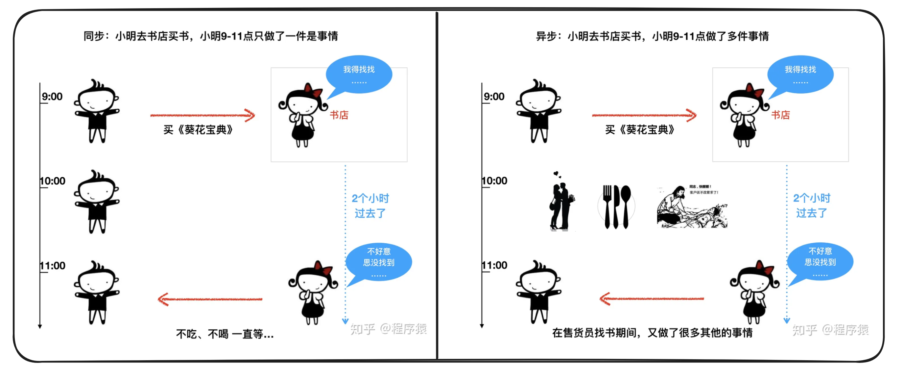


## 二，线程Thread


### 1，什么是线程

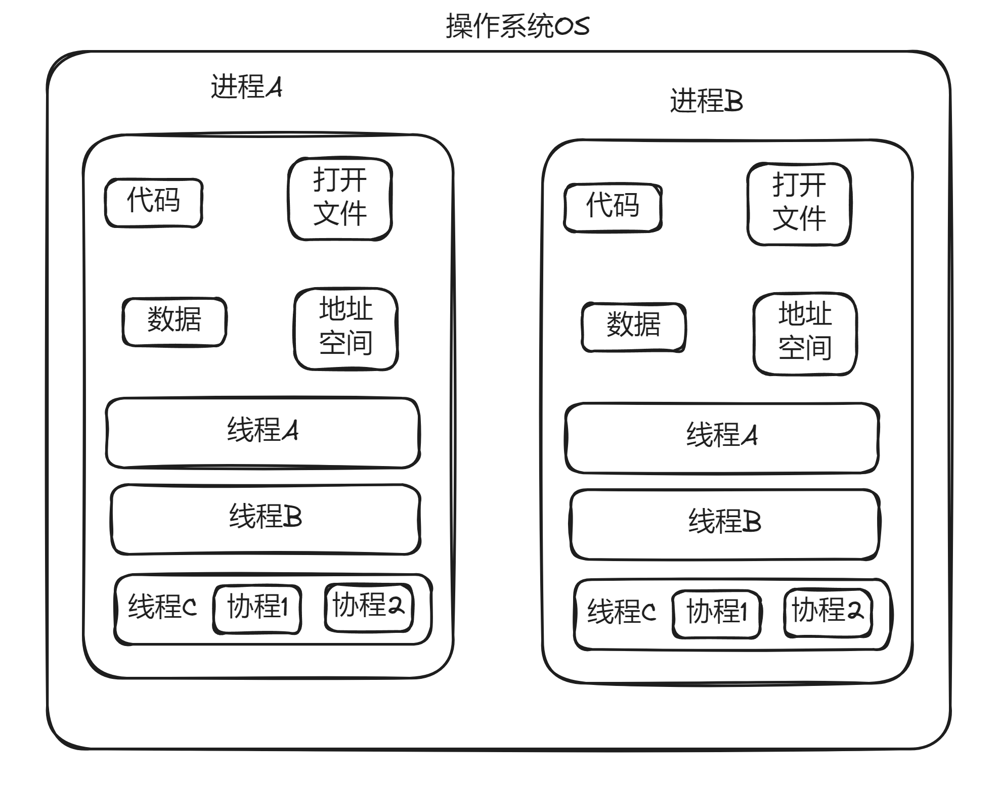


线程的特点：

- 线程（Thread）是操作系统能够进行运算调度的最小单位。它被包含在进程之中，是进程中的实际运作单位
- 线程是程序执行的最小单位，而进程是操作系统分配资源的最小单位；
- 一个进程由一个或多个线程组成，线程是一个进程中代码的不同执行路线；
- 拥有自己独立的栈和共享的堆，共享堆，不共享栈，标准线程由操作系统调度；
- 调度和切换：线程上下文切换比进程上下文切换要快得多


### 2，线程的创建方式一


Python的标准库提供了两个模块： _thread 和 threading ， _thread 是低级模块， threading 是高级模块，对 _thread 进行了封装。绝大多数情况下，我们只需要使用 threading 这个高级模块。


线程的创建可以通过分为两种方式：

- 方法包装
- 类包装


线程的执行统一通过 start() 方法。


线程的创建方式之一，通过方法包装，代码演示：

```python
from threading import Thread
from time import sleep

def func1(name):
    print(f"线程{name},start")  #format
    for i in range(3):
        print(f"线程{name},{i}")
        sleep(3)
    print(f"线程{name},end")

# 运行结果可能会出现换行问题，是因为多个线程抢夺控制台输出的IO流。
if __name__ == '__main__':
    print("主线程，start")
    # 创建线程
    t1 = Thread(target=func1,args=("t1",))
    t2 = Thread(target=func1,args=("t2",))
    # 启动线程
    t1.start()
    t2.start()
    print("主线程,end")
```


### 3，线程的创建方式二


类包装的形式也可以创建线程，代码演示：

```python
from threading import Thread
from time import sleep

class MyThread(Thread):
    def __init__(self,name):
        Thread.__init__(self)
        self.name = name

    def run(self):
        print(f"线程{self.name},start")  # format
        for i in range(3):
            print(f"线程{self.name},{i}")
            sleep(3)
        print(f"线程{self.name},end")

if __name__ == '__main__':
    print("主线程，start")
    #创建线程
    t1 = MyThread("t1")
    t2 = MyThread("t2")
    #启动线程
    t1.start()
    t2.start()
    print("主线程,end")
```


### 4，JOIN

之前的代码，主线程不会等待子线程结束。如果需要等待子线程结束后，再结束主线程，可使用join()方法。代码演示：

```python
from threading import Thread
from time import sleep
def func1(name):
    for i in range(3):
        print(f"thread:{name} :{i}")
        sleep(1)

if __name__ == '__main__':
    print("主线程，start")
    #创建线程
    t1 = Thread(target=func1,args=("t1",))
    t2 = Thread(target=func1,args=("t2",))
    #启动线程
    t1.start()
    t2.start()
    #主线程会等待t1,t2结束后，再往下执行
    t1.join()
    t2.join()
    print("主线程，end")
```


### 5，守护线程

在行为上还有一种叫守护线程，主要的特征是它的生命周期。主线程死亡，它也就随之死亡。在python中，线程通过 setDaemon(True|False)来设置是否为守护线程。 


守护线程的作用：

- 守护线程作用是为其他线程提供便利服务，守护线程最典型的应用就是 GC (垃圾收集器)。


代码演示：

```python
from threading import Thread
from time import sleep

class MyThread(Thread):
    def __init__(self,name):
        Thread.__init__(self)
        self.name =name
    def run(self):
        for i in range(3):
            print(f"thread:{self.name} :{i}")
            sleep(1)

if __name__ == '__main__':
    print("主线程，start")
    #创建线程(类的方式)
    t1 = MyThread('t1')
    #t1设置为守护线程
    # t1.daemon = True
    # t1.setDaemon(True) # #3.10后被废弃
    #启动线程
    t1.start()
    print("主线程，end")
```


### 6，全局锁GIL问题

在python中，无论你有多少核，在Cpython解释器中永远都是假象。无论你是4核，8核，还是16核.......不好意思，同一时间执行的线程只有一个线程，它就是这个样子的。这个是python的一个开发时候，设计的一个缺陷，所以说python中的线程是“含有水分的线程”。 


全局解释器锁（Global Interpreter Lock，GIL）规定全局范围内任意时候一个进程里只能同时执行一个线程。每一个线程在执行时，都会锁住GIL，以阻止别的线程执行；执行一段时间后，会释放GIL，以允许别的线程开始利用资源，如果遇到阻塞情况，也会提前释放锁。

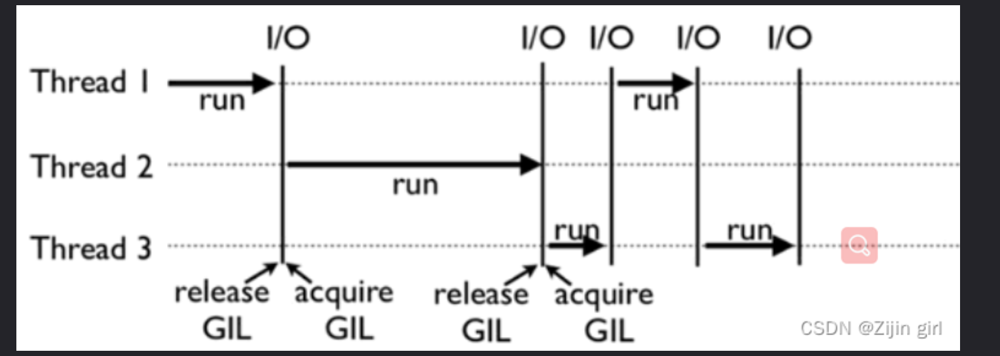


如果你的程序是单线程，该GIL锁并不会对程序造成什么影响。但如果在计算密集型的多线程代码中，GIL就是一个性能瓶颈，使Python多线程成为伪并行多线程。


“全局”的理解：

- 如果你的服务器拥有八核，GIL锁也就是规定8核CPU同时仅能执行一个线程，如果线程1在CPU1中运行着，线程2想在CPU2上运行，只能继续等待线程1结束，获得GIL锁，才可以在CPU2上运行。在稍微极端一点的情况下，比如线程1使用了while True在CPU 1 上执行，那就真是“一核有难，八核围观”了，如下图

  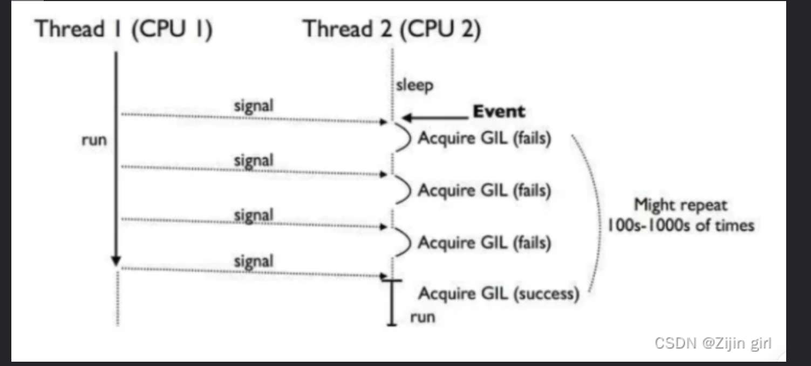


GIL并不是Python的特性，它是在实现Python解析器(CPython)时所引入的一个概念,同样一段代码可以通过 CPython，PyPy，Psyco等不同的Python执行环境来执行,就没 有GIL的问题。然而因为CPython是大部分环境下默认的Python 执行环境。所以在很多人的概念里CPython就是Python，也就 想当然的把GIL归结为Python语言的缺陷


### 7，线程同步和互斥锁

现实生活中，我们会遇到“同一个资源，多个人都想使用”的问题。 比如：教室里，只有一台电脑，多个人都想使用。天然的解决办法就是，在电脑旁边，大家排队。前一人使用完后，后一人再使用。再比如，上厕所排队。

 


线程同步的概念

- 处理多线程问题时，多个线程访问同一个对象，并且某些线程还想修改这个对象。 这时候，我们就需要用到“线程同步”。 线程同步其实就是一种等待机制，多个需要同时访问此对象的线程进入这个对象的等待池形成队列，等待前面的线程使用完毕后，下一个线程再使用。 


多线程操作同一个对象(未使用线程同步)，代码演示：

```python
#未使用线程同步和互斥锁的情况
from threading import Thread
from time import sleep

class Account:
    def __init__(self,money,name):
        self.money = money
        self.name = name

# 模拟提款的操作
class Drawing(Thread):
    def __init__(self,drawingNum,account):
        Thread.__init__(self)
        self.drawingNum = drawingNum
        self.account = account
        self.expenseTotal = 0
    def run(self):
        if self.account.money<self.drawingNum:
            return
        sleep(1) # 判断完可以取钱，则阻塞。就是为了测试发生冲突问题
        self.account.money -=self.drawingNum
        self.expenseTotal += self.drawingNum
        print(f"账户：{self.account.name},余额是：{self.account.money}")
        print(f"账户：{self.account.name},总共取了：{self.expenseTotal}")


if __name__ == '__main__':
    a1 = Account(100,"malu")
    draw1 = Drawing(80,a1)  #定义一个取钱的线程
    draw2 = Drawing(80,a1)  #定义一个取钱的线程
    draw1.start()   # 你取钱
    draw2.start()   # 你老婆取钱
```


没有线程同步机制，两个线程同时操作同一个账户对象，竟然从只有100元的账户，轻松取出80*2=160元，账户余额竟然成为了-60。这么大的问题，显然银行不会答应的。


我们可以通过“锁机制”来实现线程同步问题，锁机制有如下几个要点：

- 必须使用同一个锁对象
- 互斥锁的作用就是保证同一时刻只能有一个线程去操作共享数据，保证共享数据不会出现错误问题
- 使用互斥锁的好处确保某段关键代码只能由一个线程从头到尾完整地去执行
- 使用互斥锁会影响代码的执行效率
- 同时持有多把锁，容易出现死锁的情况


互斥锁是什么？

- 互斥锁是对共享数据进行锁定，保证同一时刻只能有一个线程去操作。
- 互斥锁是**多个线程一起去抢**，抢到锁的线程先执行，没有抢到锁的线程需要等待，等互斥锁使用完释放后，其它等待的线程再去抢这个锁。 
- threading 模块中定义了 Lock 变量，这个变量本质上是一个函数，通过调用这个函数可以获取一把互斥锁。 


多线程操作同一个对象(增加互斥锁，使用线程同步)，代码演示：

```python
#使用互斥锁的案例
from threading import Thread, Lock
from time import sleep

class Account:
    def __init__(self,money,name):
        self.money = money
        self.name = name

#模拟提款的操作
class Drawing(Thread):
    def __init__(self,drawingNum,account):
        Thread.__init__(self)
        self.drawingNum = drawingNum
        self.account = account
        self.expenseTotal = 0
    def run(self):
        lock1.acquire()
        if self.account.money<self.drawingNum:
            print("账户余额不足！")
            return
        sleep(1) #判断完可以取钱，则阻塞。就是为了测试发生冲突问题
        self.account.money -=self.drawingNum
        self.expenseTotal += self.drawingNum
        lock1.release()
        print(f"账户：{self.account.name},余额是：{self.account.money}")
        print(f"账户：{self.account.name},总共取了：{self.expenseTotal}")


if __name__ == '__main__':
    a1 = Account(100,"malu")
    lock1 = Lock()
    draw1 = Drawing(80,a1)  #定义一个取钱的线程
    draw2 = Drawing(80,a1)  #定义一个取钱的线程
    draw1.start()
    draw2.start()
```


说明：

- acquire 和 release 方法之间的代码同一时刻只能有一个线程去操作
- 如果在调用 acquire 方法的时候其他线程已经使用了这个互斥锁，那么此时 acquire 方法会堵塞，直到这个互斥锁释放后才能再次上锁。 


### 8，死锁


在多线程程序中，死锁问题很大一部分是由于一个线程同时获取多个锁造成的。举例：有两个人都要做饭，都需要“锅”和“菜刀”才能炒菜。

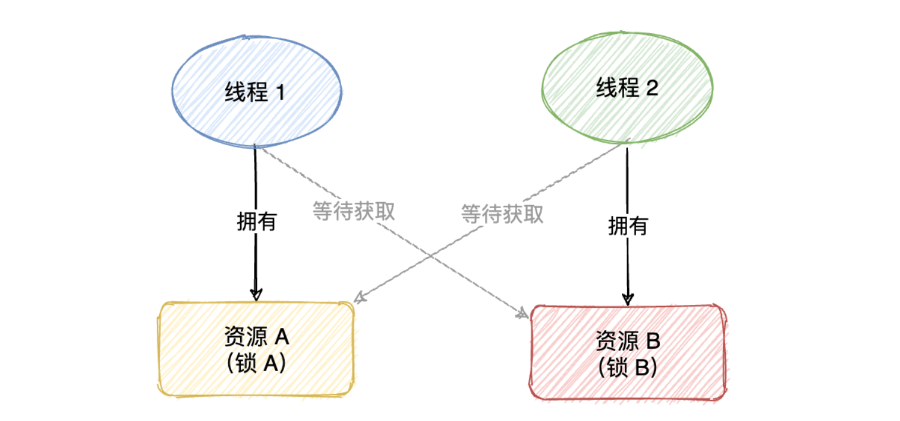


死锁代码演示：

```python
from threading import Thread, Lock
from time import sleep

def fun1():
    lock1.acquire()
    print('fun1拿到菜刀')
    sleep(2)
    lock2.acquire()
    print('fun1拿到锅')

    lock2.release()
    print('fun1释放锅')
    lock1.release()
    print('fun1释放菜刀')


def fun2():
    lock2.acquire()
    print('fun2拿到锅')
    lock1.acquire()
    print('fun2拿到菜刀')
    lock1.release()
    print('fun2释放菜刀')
    lock2.release()
    print('fun2释放锅')


if __name__ == '__main__':
    lock1 = Lock()
    lock2 = Lock()

    t1 = Thread(target=fun1)
    t2 = Thread(target=fun2)
    t1.start()
    t2.start()
```


死锁的解决方法

- 死锁是由于“同步块需要同时持有多个锁造成”的，要解决这个问题，思路很简单，就是：同一个代码块，不要同时持有两个对象锁。


### 9，信号量


互斥锁使用后，一个资源同时只有一个线程访问。如果某个资源，我们同时想让N个(指定数值)线程访问？这时候，可以使用信号量。信号量控制同时访问资源的数量。信号量和锁相似，锁同一时间只允许一个对象(进程)通过，信号量同一时间允许多个对象(进程)通过。 


应用场景:

- 在读写文件的时候，一般只能只有一个线程在写，而读可以有多个线程同时进行，如果需要限制同时读文件的线程个数，这时候就可以用到信号量了（如果用互斥锁，就是限制同一时刻只能有一个线程读取文件）。 
- 在做爬虫抓取数据时。


信号量底层就是一个内置的计数器。每当资源获取时(调用acquire) 计数器-1,资源释放时(调用release)计数器+1。代码演示：

```python
# 一个房子，依次只允许两个人进来
# 若不使用信号量，会造成所有人都进入这个房子
# 若只允许一人通过可以用锁-Lock()
from threading import Semaphore,Thread
from time import sleep

def home(name,se):
    se.acquire()
    print(f"{name}进入房间")
    sleep(3)
    print(f"****{name}走出房间")
    se.release()

if __name__ == '__main__':
    se = Semaphore(5)   #信号量对象
    for i in range(7):
        t = Thread(target=home,args=(f"tom{i}",se))
        t.start()
```


### 10，事件


事件Event主要用于唤醒正在阻塞等待状态的线程;Event 对象包含一个可由线程设置的信号标志，它允许线程等待某些事件的发生。在初始情况下，event 对象中的信号标志被设置假。如果有线程等待一个 event 对象，而这个 event 对象的标志为假，那么这个线程将会被一直阻塞直至该标志为真。一个线程如果将一个 event 对象的信号标志设置为真，它将唤醒 所有等待个 event 对象的线程。如果一个线程等待一个已经被 设置为真的 event 对象，那么它将忽略这个事件，继续执行。


Event() 可以创建一个事件管理标志，该标志（event）默认为False，event对象主要有四种方法可以调用：

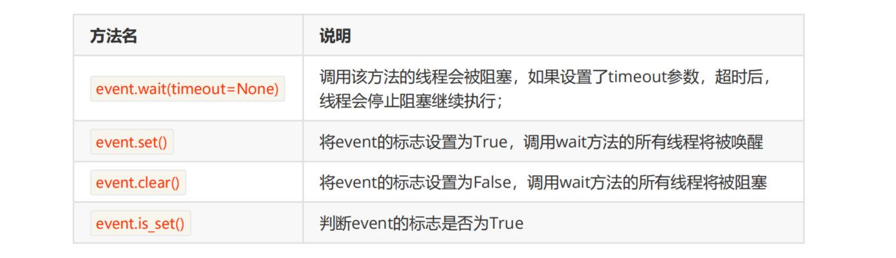


Event事件对象经典用法，小伙伴们，围着吃火锅，当菜上齐了，请客的主人说：开吃！ 代码演示：

```python
import threading
import time

def chihuoguo(name):
    #等待事件，进入等待阻塞状态
    print(f'{name}已经启动')
    print(f'小伙伴{name}已经进入就餐状态！')
    time.sleep(1)
    event.wait()
    # 收到事件后进入运行状态
    print(f'{name}收到通知了.' )
    print(f'小伙伴{name}开始吃咯！')

if __name__ == '__main__':
    event = threading.Event()
    # 创建新线程
    thread1 = threading.Thread(target=chihuoguo, args=("malu", ))
    thread2 = threading.Thread(target=chihuoguo, args=("ly", ))
    # 开启线程
    thread1.start()
    thread2.start()

    time.sleep(10)
    # 发送事件通知
    print('---->>>主线程通知小伙伴开吃咯！')
    event.set()
```


### 11，生产者和消费者模式

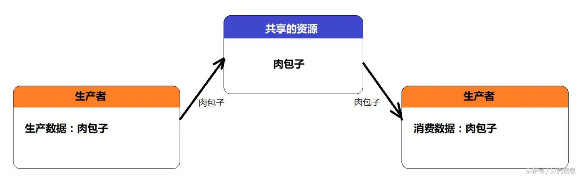


多线程环境下，我们经常需要多个线程的并发和协作。这个时候，就需要了解一个重要的多线程并发协作模型“生产者/消费者模式”。 


什么是生产者

- 生产者指的是负责生产数据的模块（这里模块可能是：方法、对象、线程、进程）。 


什么是消费者

- 消费者指的是负责处理数据的模块（这里模块可能是：方法、对象、线程、进程）


什么是缓冲区

- 消费者不能直接使用生产者的数据，它们之间有个“缓冲区”。生产者将生产好的数据放入“缓冲区”，消费者从“缓冲区”拿要处理的数据。


缓冲区是实现并发的核心，缓冲区的设置有3个好处：

- 实现线程的并发协作
  - 有了缓冲区以后，生产者线程只需要往缓冲区里面放置数据，而不需要管消费者消费的情况；同样，消费者只需要从缓冲区拿数据处理即可，也不需要管生产者生产的情况。 这样，就从逻辑上实现了“生产者线程”和“消费者线程”的分离。 
- 解耦了生产者和消费者
  - 生产者不需要和消费者直接打交道
- 解决忙闲不均，提高效率
  - 生产者生产数据慢时，缓冲区仍有数据，不影响消费者消费；消费者处理数据慢时，生产者仍然可以继续往缓冲区里面放置数据


缓冲区和queue对象

- 从一个线程向另一个线程发送数据最安全的方式可能就是使用 queue 库中的队列了。创建一个被多个线程共享的 Queue 对象，这些线程通过使用 put() 和 get() 操作来向队列中添加或者删除元素。Queue 对象已经包含了必要的锁，所以你可以通过它在多个线程间多安全地共享数据。


生产者消费者模式典型代码演示：

```python
from queue import Queue
from threading import Thread
from time import sleep

def producer():
    num = 1
    while True:
        if queue.qsize()<5:
            print(f"生产{num}号，大馒头")
            queue.put(f"大馒头：{num}号")
            num +=1
        else:
            print("馒头框满了，等待来人消费啊！")
        sleep(1)

def consumer():
    while True:
        print(f"获取馒头：{queue.get()}")
        sleep(1)

if __name__ == '__main__':
    queue = Queue()
    t1 = Thread(target=producer)
    t2 = Thread(target=consumer)
    t1.start()
    t2.start()
```


## 三，进程Process


### 1，什么是进程

对于操作系统来说，一个任务就是一个进程（Process），比如打开一个浏览器就是启动一个浏览器进程，就启动了一个记事本进程，打开两个记事本就启动了两个记事本进程，打开一个Word就启动了一个Word进程。

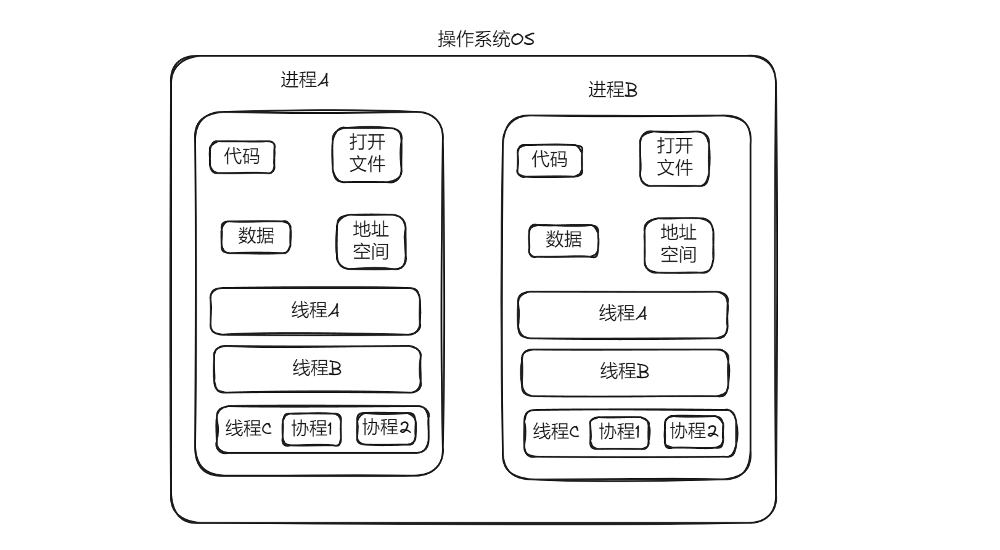

进程(Process)：拥有自己独立的堆和栈，既不共享堆，也不共享栈，进程由操作系统调度；进程切换需要的资源很最大，效率低。 


进程的优点： 

- 可以使用计算机多核，进行任务的并行执行，提高执行效率 

- 运行不受其他进程影响，创建方便 

- 空间独立，数据安全 


进程的缺点： 

- 进程的创建和删除消耗的系统资源较多 


### 3，进程的创建方式一

进程的创建可以通过分为两种方式： 

- 方法包装 

- 类包装 

创建进程后，使用start()启动进程。方法模式创建进程，代码演示：

```python
import os
from multiprocessing import Process
from time import sleep

def fun1(name):
    print(f"当前进程ID:{os.getpid()}")
    print(f"父进程ID：{os.getppid()}")
    print(f"Process:{name},start")
    sleep(3)
    print(f"Process:{name},end")

# windows上多进程实现的bug。如果不加main的限制，就会无限制的创建子进程，从而报错。
if __name__ == '__main__':
    print("当前进程ID:",os.getpid())
    #创建进程
    p1 = Process(target=fun1,args=("p1",))
    p2 = Process(target=fun1, args=("p2",))
    #启动进程
    p1.start()
    p2.start()
```


### 4，进程的创建方式二

和使用Thread 类创建子线程的方式非常类似，使用 Process 类创建实例化对象，其本质是调用该类的构造方法创建新进程。Process类的构造方法格式如下： 

- def _ _ init _ _(self,group=None,target=None,name=None,args=(),kwargs={})
  - group ：该参数未进行实现，不需要传参
  - target ：为新建进程指定执行任务，也就是指定一个函数
  - name ：为新建进程设置名称
  - args ：为 target 参数指定的参数传递非关键字参数
  - kwargs ：为 target 参数指定的参数传递关键字参数


类的方式创建进程，代码演示：

```python
from multiprocessing import Process
from time import sleep

class MyProcess(Process):
    def __init__(self,name):
        Process.__init__(self)
        self.name = name

    def run(self):
        print(f"Process:{self.name},start")
        sleep(3)
        print(f"Process:{self.name},end")

if __name__ == '__main__':
    #创建进程
    p1 = MyProcess("p1")
    p2 = MyProcess("p2")
    p1.start()
    p2.start()
```


### 5，Queue实现进程通信

前面讲解了使用 Queue 模块中的 Queue 类实现线程间通信，但要实现进程间通信，需要使用 multiprocessing 模块中的 Queue 类。 

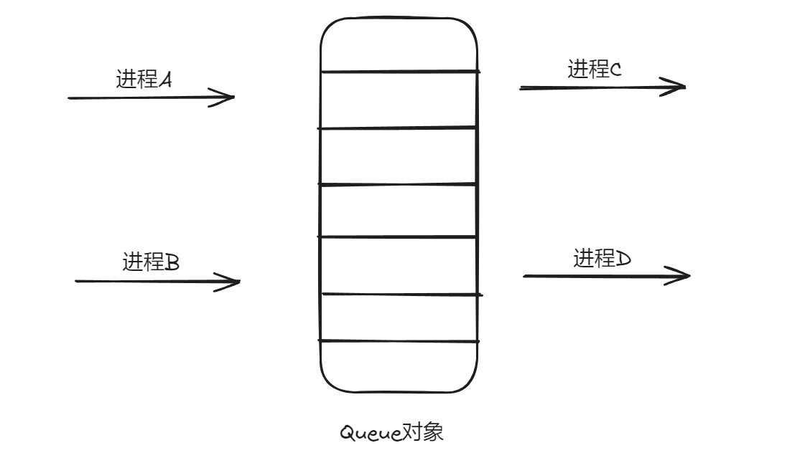


简单的理解 Queue 实现进程间通信的方式，就是使用了操作系统给开辟的一个队列空间，各个进程可以把数据放到该队列中，当然也可以从队列中把自己需要的信息取走。 


使用Queue实现进程间通信的经典代码，代码演示：

```python
from multiprocessing import Process, Queue
from time import sleep

class MyProcess(Process):
    def __init__(self,name,mq):
        Process.__init__(self)
        self.name = name
        self.mq = mq
    def run(self):
        print(f"Process:{self.name},start")
        print(f"get Data:{self.mq.get()}")
        sleep(2)
        self.mq.put(f"new_data:{self.name}")
        print(f"Process:{self.name},end")

if __name__ == '__main__':
    mq = Queue()
    mq.put("1")
    mq.put("2")
    mq.put("3")

    #进程列表
    p_list = []

    # 循环创建进程
    for i in range(3):
        p = MyProcess(f"p{i}",mq)
        p.start()
        p_list.append(p)

    # 等待进程结束
    for p in p_list:
        p.join()

    print(mq.get())
    print(mq.get())
    print(mq.get())
```


### 6，Pipe实现进程通信

Pipe 直译过来的意思是“管”或“管道”，和实际生活中的管（管道）是非常类似的。 

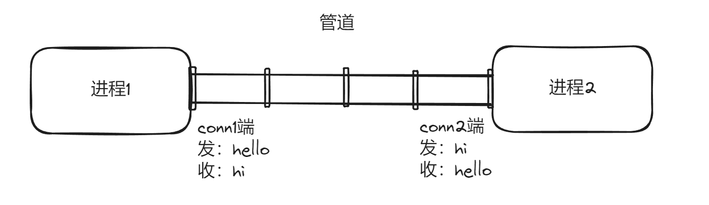

Pipe方法返回（conn1， conn2）代表一个管道的两个端。Pipe方法有duplex参数，如果duplex参数为True（默认值），那么这个参数是全双工模式，也就是说conn1和conn2均可收发。若duplex为False，conn1只负责接收消息，conn2只负责发送消息。send和recv方法分别是发送和接受消息的方法。例如，在全双工模式下，可以调用conn1.send发送消息，conn1.recv接收消息。如果没有消息可接收，recv方法会一直阻塞。如果管道已经被关闭，那么recv方法会抛出EOFError。 代码演示：

```python
import multiprocessing
from time import sleep

def func1(conn1):
   sub_info = "Hello!"
   print(f"进程1--{multiprocessing.current_process().pid}发送数据：{sub_info}")
   sleep(1)
   conn1.send(sub_info)
   print(f"来自进程2:{conn1.recv()}")
   sleep(1)
def func2(conn2):
   sub_info = "你好!"
   print(f"进程2--{multiprocessing.current_process().pid}发送数据：{sub_info}")
   sleep(1)
   conn2.send(sub_info)
   print(f"来自进程1:{conn2.recv()}")
   sleep(1)

if __name__ == '__main__':
   # 创建管道
   conn1,conn2 = multiprocessing.Pipe()
   # 创建子进程
   process1 = multiprocessing.Process(target=func1,args=(conn1,))
   process2 = multiprocessing.Process(target=func2,args=(conn2,))
   # 启动子进程
   process1.start()
   process2.start()
```


### 7，Manager管理器

管理器提供了一种创建共享数据的方法，从而可以在不同进程中共享。 


管理器Manager实现进程通信，代码演示：

```python
from multiprocessing import Process
from multiprocessing import Manager

def func(name,m_list,m_dict):
    m_dict['name'] = 'malu'
    m_list.append('你好')

if __name__ == "__main__":
    with Manager() as mgr:
        m_list = mgr.list()
        m_dict = mgr.dict()
        m_list.append('Hello!!')
        #两个进程不能直接互相使用对象，需要互相传递
        p1 = Process(target=func,args=('p1',m_list,m_dict))
        p1.start()
        p1.join()   #等p1进程结束，主进程继续执行
        print(f"主进程:{m_list}")
        print(f"主进程:{m_dict}")
```


### 8，进程池

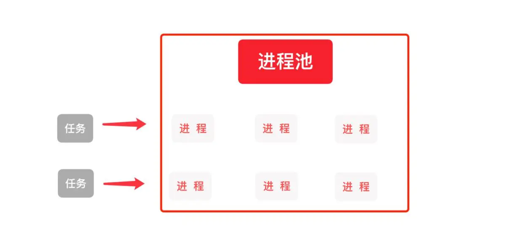


Python提供了更好的管理多个进程的方式，就是使用进程池。进程池可以提供指定数量的进程给用户使用，即当有新的请求提交到进程池中时，如果池未满，则会创建一个新的进程用来执行该请求；反之，如果池中的进程数已经达到规定最大值，那么该请求就会等待，只要池中有进程空闲下来，该请求就能得到执行。


使用进程池的优点：

- 提高效率，节省开辟进程和开辟内存空间的时间及销毁进程的时间
- 节省内存空间


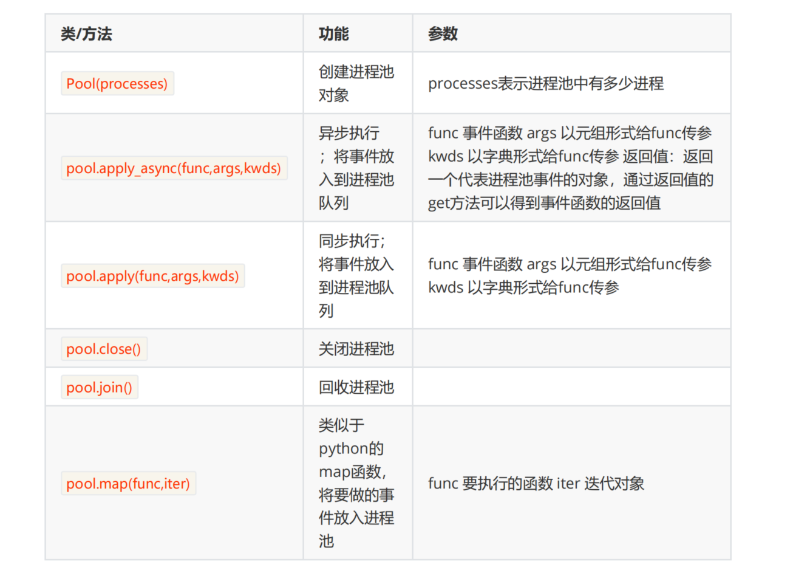


进程池使用案例，代码演示：

```python
from multiprocessing import Pool
import os
from time import sleep

def func1(name):
    print(f"当前进程的ID:{os.getpid()},{name}")
    sleep(2)
    return name

def func2(args):
    print(args)

if __name__ == "__main__":
    pool = Pool(5)

    pool.apply_async(func = func1,args=('malu1',),callback=func2)
    pool.apply_async(func = func1,args=('malu2',),callback=func2)
    pool.apply_async(func = func1,args=('malu3',),callback=func2)
    pool.apply_async(func = func1,args=('malu4',))
    pool.apply_async(func = func1,args=('malu5',))
    pool.apply_async(func = func1,args=('malu6',))
    pool.apply_async(func = func1,args=('malu7',))
    pool.apply_async(func = func1,args=('malu8',))

    pool.close()
    pool.join()
```


使用with管理进程池，代码演示：

```python
from multiprocessing import Pool
import os
from time import sleep

def func1(name):
    print(f"当前进程的ID:{os.getpid()},{name}")
    sleep(2)
    return name

if __name__ == "__main__":
   with Pool(5) as pool:
        args = pool.map(func1,('malu1,','malu2,','malu3,','malu4,','malu5,','malu6,','malu7,','malu8,'))
        for a in args:
            print(a)
```


## 四，协程Coroutines


### 1，协程是什么

雷军开工厂生产手机，费劲力气，制作一条生产线，这个生产线上有很多的器件以及材料。**一条生产线就是一个进程。**只有生产线是不够的，所以找五个工人来进行生产，这个工人能够利用这些材料最终一步步的将手机做出来，**这五个工人就是五个线程。**


为了提高生产率，有3种办法：

- 一条生产线上多招些工人，一起来做手机，这样效率是成倍増长，即单进程多线程方式
- 多条生产线，每个生产线上多个工人，即多进程多线程
- 雷军深入一线发现工人不是那么忙，有很多等待时间。于是规定：如果某个员工在等待生产线某个零件生产时 ，不要闲着，干点其他工作。也就是说：如果一个线程等待某些条件，可以充分利用这个时间去做其它事情，**这就是：协程方式。** 


进程概念：

- 进程是一个具有一定独立功能的程序关于某个数据集合的一次运行活动 
- 现代操作系统比如Mac OS X，Linux，Windows等，都是支持 “多任务”的操作系统，叫“多任务”呢？简单地说，就是操作系统可以同时运行多个任务。
- 对于操作系统来说，一个任务就是一个进程（Process）

- 进程拥有自己独立的堆和栈，既不共享堆，也不共享栈，进程由操作系统调度；进程切换需要的资源很最大，效率低


线程概念：

- 线程是操作系统能够进行运算调度的最小单位。它被包含在进程之中，是进程中的实际运作单位。 

- 拥有自己独立的栈和共享的堆，共享堆，不共享栈，标准线程由操作系统调度；线程切换需要的资源一般，效率一般（当然了在不考虑GIL的情况下）
- 有些进程还不止同时干一件事，比如微信，它可以同时进行打字聊天，视频聊天，朋友圈等事情。在一个进程内部，要同时干多件事，就需要同时运行多个“子任务”，我们把进程内的这些“子任务”称为线程（Thread）。


协程概念：

- 协程，Coroutines，也叫作纤程(Fiber)，是一种在线程中，比线程更加轻量级的存在，由程序员自己写程序来管理。
- 当出现IO阻塞时，CPU一直等待IO返回，处于空转状态。这时候用协程，可以执行其他任务。当IO返回结果后，再回来处理数据。充分利用了IO等待的时间，提高了效率。 
- 拥有自己独立的栈和共享的堆，共享堆，不共享栈，协程由程序员在协程的代码里显示调度；协程切换任务资源很小，效率高 


协程，Coroutines，也叫作纤程(Fiber)，全称是“协同程序”，用来实现任务协作。是一种在线程中，比线程更加轻量级的存在，由程序员自己写程序来管理。 当出现IO阻塞时，CPU一直等待IO返回，处于空转状态。这时候用协程，可以执行其他任务。当IO返回结果后，再回来处理数据。充分利用了IO等待的时间，提高了效率。 


### 2，协程的核心


核心：

- 每个协程有自己的执行栈，可以保存自己的执行现场
- 可以由用户程序按需创建协程（比如：遇到io操作）
- 协程“主动让出（yield）”执行权时候,会保存执行现场(保存中断时的寄存器上下文和栈)，然后切换到其他协程
-  协程恢复执行（resume）时，根据之前保存的执行现场恢复到中断前的状态，继续执行，这样就通过协程实现了轻量的由用户态调度的多任务模型 


### 3，协程和多线程比较

比如，有3个任务需要完成，每个任务都在等待I/O操作时阻塞自身。阻塞在I/O操作上所花费的时间已经用灰色框标示出来了。 

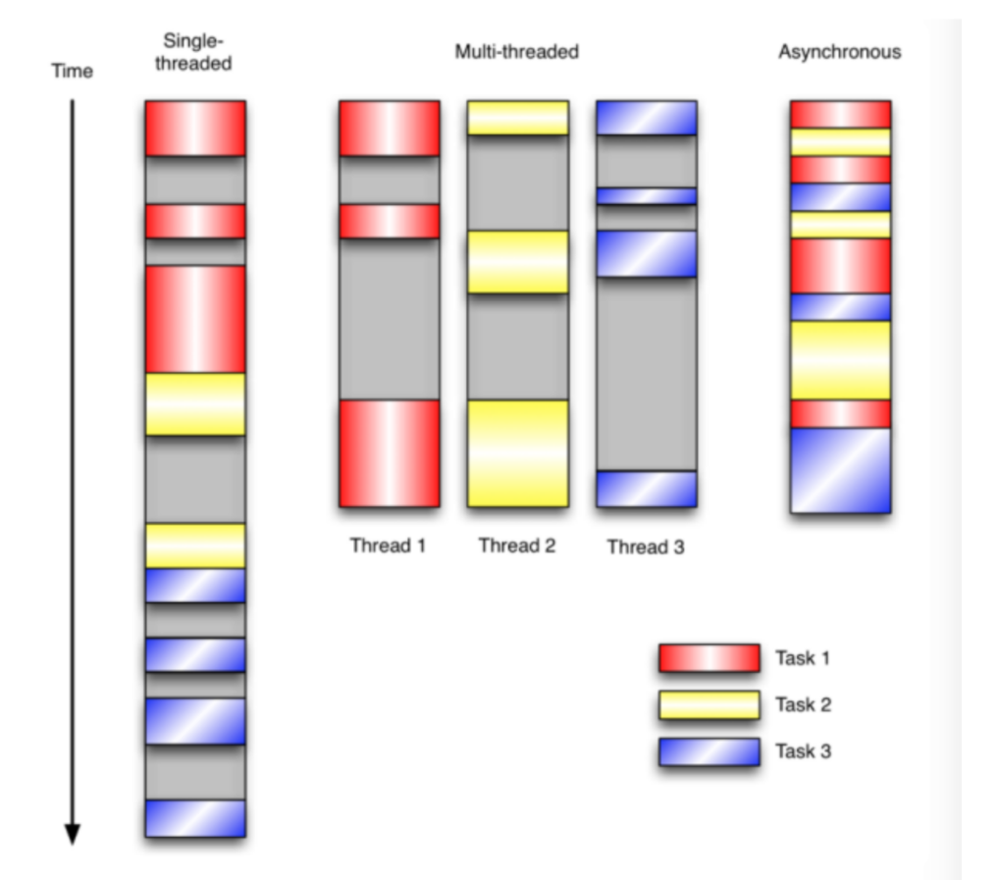


- 在单线程同步模型中，任务按照顺序执行。如果某个任务因为I/O而阻塞，其他所有的任务都必须等待，直到它完成之后它们才能依次执行。 
- 多线程版本中，这3个任务分别在独立的线程中执行。这些线程由操作系统来管理，在多处理器系统上可以并行处理，或者在单处理器系统上交错执行。这使得当某个线程阻塞在某个资源的同时其他线程得以继续执行。
- 协程版本的程序中，3个任务交错执行，但仍然在一个单独的线程控制中。当处理I/O或者其他昂贵的操作时，注册一个回调到事件循环中，然后当I/O操作完成时继续执行。回调描述了该如何处理某个事件。事件循环轮询所有的事件，当事件到来时将它们分配给等待处理事件的回调函数。 


### 4，协程的优缺点

协程的优点

- 由于自身带有上下文和栈，无需线程上下文切换的开销,属于程序级别的切换，操作系统完全感知不到，因而更加轻量级； 
- 无需原子操作的锁定及同步的开销；
- 方便切换控制流，简化编程模型
- 单线程内就可以实现并发的效果，最大限度地利用cpu，且可扩展性高，成本低（注：一个CPU支持上万的协程都不是问题。所以很适合用于高并发处理）
- asyncio协程是写爬虫比较好的方式。比多线程和多进程都好。开辟新的线程和进程是非常耗时的。


协程的缺点

- 无法利用多核资源：协程的本质是个单线程,它不能同时将 单个CPU 的多个核用上,协程需要和进程配合才能运行在多CPU上。
- 当然我们日常所编写的绝大部分应用都没有这个必要，除非是cpu密集型应用。


### 5，使用yield实现协程


不使用协程执行多个任务，代码演示：

```python
import time

def func1():
    for i in range(3):
        print(f'北京：第{i}次打印啦')
        time.sleep(1)
    return "func1执行完毕"
def func2():
    for k in range(3):
        print(f'上海：第{k}次打印了' )
        time.sleep(1)
    return "func2执行完毕"

def main():
   func1()
   func2()
if __name__ == '__main__':
   start_time = time.time()
   main()
   end_time = time.time()
   print(f"耗时{end_time-start_time}")   #不使用协程，耗时6秒
```


使用yield协程，实现任务切换，代码演示：

```python
import time
def func1():
    for i in range(3):
        print(f'北京：第{i}次打印啦')
        yield  # 只要方法包含了yield，就变成一个生成器
        time.sleep(1)
def func2():
    g = func1()    #func1是一个生成器，func1()就不会直接调用，需要通过next()
    print(type(g))
    for k in range(3):
        print(f'上海：第{k}次打印了' )
        next(g)   #继续执行func1的代码
        time.sleep(1)

if __name__ == '__main__':
    #有了yield，我们实现了两个任务的切换+保存状态
    start_time = time.time()
    func2()
    end_time = time.time()
    print(f"耗时{end_time-start_time}")   #耗时5.0秒，效率差别不大
```


基于yield并发执行，多任务之间来回切换，这就是个简单的协程的体现，但是他能够节省I/O时间吗？不能。 

### 6，asyncio实现协程(重点)

要点：

- 正常的函数执行时是不会中断的，所以你要写一个能够中断的函数，就需要加 async
- async 用来声明一个函数为异步函数，异步函数的特点是能在函数执行过程中挂起，去执行其他异步函数，等到挂起条件（假设挂起条件是 sleep(5) ）消失后，也就是5秒到了再回来执行
- await 用来用来声明程序挂起，比如异步程序执行到某一步时需要等待的时间很长，就将此挂起，去执行其他的异步程序。 
- asyncio 是python3.5之后的协程模块，是python实现并发重要的包，这个包使用事件循环驱动实现并发


不使用asncio的任务切换，代码演示：

```python
import time

def func1():
    for i in range(3):
        print(f'北京：第{i}次打印啦')
        time.sleep(1)
    return "func1执行完毕"
def func2():
    for k in range(3):
        print(f'上海：第{k}次打印了' )
        time.sleep(1)
    return "func2执行完毕"

def main():
   func1()
   func2()
if __name__ == '__main__':
   start_time = time.time()
   main()
   end_time = time.time()
   print(f"耗时{end_time-start_time}")   #不使用协程，耗时6秒
```


使用asyncio，整体执行完，耗时3秒，效率极大提高。asyncio异步IO的典型使用方式，代码演示：

```python
import asyncio
import time

async def func1():     #async表示方法是异步的
    for i in range(3):
        print(f'北京：第{i}次打印啦')
        await asyncio.sleep(1)
    return "func1执行完毕"
async def func2():
    for k in range(3):
        print(f'上海：第{k}次打印了' )
        await asyncio.sleep(1)
    return "func2执行完毕"
async def main():
   res = await asyncio.gather(func1(), func2())
   #await异步执行func1方法
   #返回值为函数的返回值列表
   print(res)

if __name__ == '__main__':
   start_time = time.time()
   asyncio.run(main())
   end_time = time.time()
   print(f"耗时{end_time-start_time}")   #耗时3秒,效率极大提高
```


