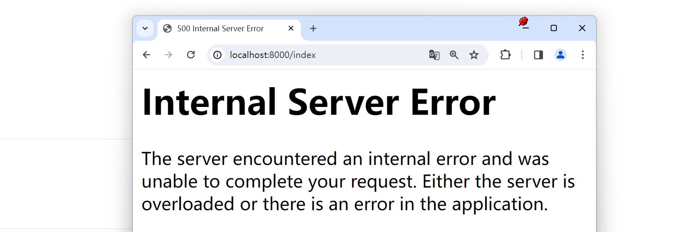

## 一，Flask入门

### 1，Flask介绍


Flask 是一款发布于**2010**年非常流行的 **Python Web** 框架。特点:

- 微框架、简洁，给开发者提供了很大的扩展性。

- Flask和相应的插件写得很好，用起来很爽。 

- 开发效率非常高，比如使用 SQLAlchemy 的 ORM 操作数据库可以节省开发者大量书写 sql 的时 

  间。


Flask 的灵活度非常之高，他不会帮你做太多的决策，很多都可以按照自己的意愿进行更改。**比如：** 使用 Flask 开发数据库的时候，具体是使用 SQLAlchemy 还是MongoEngine，选择权完全掌握在你自己的手中。


Flask 本身相当于一个内核，其他几乎所有的功能都要用到扩展（邮件扩展 Flask-Mail ，用户认证 Flask-Login ，数据库 Flask-SQLAlchemy ），都需要用第三方的扩展来实现。Flask 没有默认使用的数据库，你可以选择 MySQL ，也可以用NoSQL 。


其 WSGI 工具箱采用 Werkzeug （路由模块），模板引擎则使用Jinja2 。这两个也是 Flask 框架的**核心**。 扩展列表：http://flask.pocoo.org/extensions/

- Flask-SQLalchemy：操作数据库； 
- Flask-script：插入脚本； 
- Flask-migrate：管理迁移数据库； 
- Flask-Session：Session存储方式指定； 
- Flask-WTF：表单； 
- Flask-Mail：邮件； 
- Flask-Bable：提供国际化和本地化支持，翻译； 
- Flask-Login：认证用户状态；
- Flask-OpenID：认证； 
- Flask-RESTful：开发REST API的工具； 
- Flask-Bootstrap：集成前端Twitter Bootstrap框架； 
- Flask-Moment：本地化日期和时间； 
- Flask-Admin：简单而可扩展的管理接口的框架 


**文档地址** 

- 中文文档（http://docs.jinkan.org/docs/flask/） 
- 英文文档（http://flask.pocoo.org/docs/1.0/）


### 2，第1个Flask程序

安装：

```
conda install flask==2.0.2
```


第1个flask程序：

```python
# 因为需要创建一个web应用，而Flask中创建应用的对象是Flask,因此引入此对象
from flask import Flask

# 创建对象
app = Flask(__name__)

# 路由的地址
@app.route('/index')
def index():
    # return 代表将数据返回给浏览器
    return 'hello malu'


if __name__ =="__main__":
    # 启动web应用服务,默认端口号是5000
    # app.run()
    app.run(port=8000)
```


启动程序：

```
python 1.py
```


测试：


### 3，启动方式

运行程序时，可以指定运行的主机IP地址，端口，如下：

```python
# host为主机IP地址,可以不传。默认localhost
# port为端口号，可以不传。默认5000
app.run(host='0.0.0.0',port=8000)
```


第1种通过 app.run运行

- python filename
- 右键 - run python file in terminal 


第2种通过 flask命令运行

- 可以不写app.run()
- 文件名不要用中文


通过第2种方式运行，程序中不用再写app.run了，如下：

```python
from flask import Flask

app = Flask(__name__)

@app.route('/index')
def index():
    return 'hello malu'
```


通过第2种方式运行，需要先配置环境变量，如下：


指定IP和端口：

```
flask run -h 0.0.0.0 -p 8000
```


测试如下：


## 二，Debug模式和配置参数加载


### 1，运行时传递参数

在代码中制作一个错误：

```python
from flask import Flask

app = Flask(__name__)

@app.route('/index')
def index():
    a = 1
    b = 0
    c = a/b
    return 'hello malu'

if __name__ =="__main__":
    app.run(port=8000)
```


访问：




控制台倒是给出了错误提示信息，但是**我们希望在浏览器也能有相应的提示信息** ，此时，我们可以开启Debug模式，运行时传递参数：

```python
from flask import Flask

app = Flask(__name__)

@app.route('/index')
def index():
    a = 1
    b = 0
    c = a/b
    return 'hello malu'

if __name__ =="__main__":
    app.run(port=8000,debug=True)
```


测试：


### 2，通过app.deubg参数设置

通过app.deubg参数设置，如下：

```python
from flask import Flask

app = Flask(__name__)
app.debug = True

@app.route('/index')
def index():
    a = 1
    b = 0
    c = a/b
    return 'hello malu'

if __name__ =="__main__":
    app.run(port=8000)
```


测试：


### 3，通过修改配置参数

```python
from flask import Flask

app = Flask(__name__)
app.config.update(DEBUG=True)
# app.config['DEBUG'] = True

@app.route('/index')
def index():
    a = 1
    b = 0
    c = a/b
    return 'hello malu'

if __name__ =="__main__":
    app.run(port=8000)
```


测试：


### 4，通过mapping加载

```python
from flask import Flask

app = Flask(__name__)
app.config.from_mapping({'DEBUG':True})

@app.route('/index')
def index():
    a = 1
    b = 0
    c = a/b
    return 'hello malu'

if __name__ =="__main__":
    app.run(port=8000)
```


测试：


### 5，通过配置对象设置config

```python
from flask import Flask

app = Flask(__name__)

@app.route('/index')
def index():
    a = 1
    b = 0
    c = a/b
    return 'hello malu'

class Config:
    DEBUG = True

if __name__ =="__main__":
    app.config.from_object(Config)
    app.run(port=8000)
```


测试：略


### 6，通过配置文件设置config

config.py

```python
DEBUG = True
```


或 config.json

```json
{"DEBUG":"True"}
```


服务器代码：

```python
from flask import Flask

app = Flask(__name__)

@app.route('/index')
def index():
    a = 1
    b = 0
    c = a/b
    return 'hello malu'

class Config:
    DEBUG = True

if __name__ =="__main__":
    # import json
    # app.config.from_file('config.json', json.load)

    app.config.from_json("config.json") 
    app.run(port=8000)
```


测试：略


### 7，通过python文件设置

settings.py

```python
DEBUG = True
```


服务器代码：

```python
from flask import Flask

app = Flask(__name__)

@app.route('/index')
def index():
    a = 1
    b = 0
    c = a/b
    return 'hello malu'

class Config:
    DEBUG = True

if __name__ =="__main__":
    app.config.from_pyfile('settings.py')
    app.run(port=8000)
```


测试：略


### 8，通过环境变量设置


设置环境变量：


重启下VScode，代码：

```python
from flask import Flask

app = Flask(__name__)

@app.route('/index')
def index():
    a = 1
    b = 0
    c = a/b
    return 'hello malu'

class Config:
    DEBUG = True

if __name__ =="__main__":
    app.config.from_envvar('flask_setting')
    app.run(port=8000)
```


测试：略


总结最常用的几种方式：

- 通过python文件设置
- 通过配置对象设置config


## 三，动态路由


### 1，动态路由

所谓的动态路由就是URL与函数的映射。比如，有一个请求访问的接口地址为 /users/11001 ，其中 11001 实际上为具体的请求参数，表明请求 11001 号用户的信息。 此时如何从url中提取出 11001 的数据。代码演示：

```python
from flask import Flask

app = Flask(__name__)

@app.route('/users/<user_id>')
def index(user_id):
    print(type(user_id))
    return f'返回了，{user_id}的用户信息'

if __name__ == '__main__':
    app.run()
```


测试：


其中 < user_id > ，尖括号是固定写法。默认的数据类型是字符串。如果需要指定类型，则要写成 converter:variable ，其中converter 就是类型名称，可以有以下几种：

- **string**:如果没有指定具体的数据类型，那么默认就是使用 string 数据类型。
- **int:**数据类型只能传递 int 类型。
- **float:**数据类型只能传递 float 类型。
- **path:**数据类型和 string 有点类似，都是可以接收任意的字符串，但是 path 可以接收路径，也就是说可以包含斜杠。
- **uuid:**数据类型只能接收符合 uuid 的字符串。 uuid 是一个全宇宙都唯一的字符串，一般可以用来作为表的主键。
- **any:**数据类型可以在一个 url 中指定多个路径。例如：


代码：

```python
from flask import Flask

app = Flask(__name__)

@app.route('/article/<id>')
def index(id):
    print(f'接收到的文章ID是：{id}')
    print(type(id))   # <class 'str'>
    return f'返回了，{id}的文章'


@app.route('/int/<int:id>')
def index_int(id):
    print(f'接收到的文章ID是：{id}')
    print(type(id))  # <class 'int'>
    return f'返回了，{id}的文章'


@app.route('/float/<float:id>')
def index_float(id):
    print(f'接收到的文章ID是：{id}')
    print(type(id))  # <class 'float'>
    return f'返回了，{id}的文章'


@app.route('/str/<string:id>')
def index_str(id):
    print(f'接收到的文章ID是：{id}')
    print(type(id))   # <class 'str'>
    return f'返回了，{id}的文章'


@app.route('/path/<path:id>')
def index_path(id):
    print(f'接收到的文章ID是：{id}')  # a/b/c
    print(type(id))    # <class 'str'>
    return f'返回了，{id}的文章'  # 返回了，a/b/c的文章

# uuid: 16763be4-6022-406e-a950-fcd5018633ca
@app.route('/uuid/<uuid:id>')
def index_uuid(id):
    print(f'接收到的文章ID是：{id}')
    print(type(id))  # <class 'uuid.UUID'>
    return f'返回了，{id}的文章'

@app.route('/<any(user,item):tmp>/<int:id>')
def index_any(tmp,id):
    if tmp == 'user':
        return f'返回了一个编号为 {id} 的 用户 信息'
    elif tmp =='item':
        return f'返回了一个编号为 {id} 的 元素 信息'

# user/[1,2,3]
# item/[1,2,3]
# vip/[1,2,3]
if __name__ == '__main__':
    app.run(debug=True)
```


### 2，自定义转换器

​	为什么路径参数可以直接识别数据类型？从 werkzeug.routing 导入 BaseConverter 类 了解底层。int 路径参数底层调用 IntegerConverter 类来作格式判断。float 路径参数底层调用 FloatConverter 类来作格式判断。string 路径参数底层调用 StringConverter 类来作格式判断。如果遇到需要匹配提取 /sms_codes/1688888888 中的手机号数据，Flask内置的转换器就无法满足需求，此时需要自定义转换器。 


自定义转换器主要做3步，第1步，创建转换器类，保存匹配时的正则表达式：

```python
from werkzeug.routing import BaseConverter

class PhoneConverter(BaseConverter):
    regex = '1[3-9]\d{9}'  # regex 名字是固定的

```

第2步，将自定义的转换器告知Flask应用

```python
from flask import Flask
from werkzeug.routing import BaseConverter

app = Flask(__name__)

class PhoneConverter(BaseConverter):
    regex = '1[3-9]\d{9}'  # regex 名字是固定的

#  将自定义转换器添加到转换器字典中，并指定转换器使用时名字为: phone
app.url_map.converters['phone'] = PhoneConverter
```


第3步，在使用转换器的地方定义使用

```python
from flask import Flask
from werkzeug.routing import BaseConverter

app = Flask(__name__)

class PhoneConverter(BaseConverter):
    regex = '1[3-9]\d{9}'  # regex 名字是固定的

app.url_map.converters['phone'] = PhoneConverter

@app.route('/')
def index():
    return "Hello"

@app.route('/<phone:param>')
def phone(param):
    print(param)
    return f"您传递的手机号是：{param}"

if __name__ == '__main__':
    app.run(debug=True)
```


测试：


### 3，to_python

在转换器类中，实现 to_python(self,value) 方法，这个方法的返回值，将会传递到 view函数中作为参数

```python
from flask import Flask
from werkzeug.routing import BaseConverter

app = Flask(__name__)

# 需求：路径参数传递多信息并以一个参数接收。
# 比如：获取姓名：zs 年龄 18的信息
# /user/zs+18

class LiConverter(BaseConverter):
    def to_python(self, value):
        return value.split('+')

app.url_map.converters['li'] = LiConverter

@app.route('/')
def index():
    return "Hello"


@app.route('/user/<info>')
def user(info):
    args = info.split('+')
    # sql  : select * from t_user where uname = args[0] and age = args[1];
    return f'获取了某某信息！！{args}'


@app.route('/user_info/<li:info>')
def user_info(info):
    # sql  : select * from t_user where uname = args[0] and age = args[1];
    return f'获取了某某信息！！{info}'

if __name__ == '__main__':
    app.run(debug=True)
```


测试：


## 四，查询字符串的获取

### 1，查询字符串的获取


请求的url

```
http://127.0.0.1:5000/test/?wd=python&uname=malu&pwd=123
```


代码演示：

```python
from flask import Flask,request

app = Flask(__name__)

@app.route('/test')
def index():
    # 方式1：
    # uname = request.args.get('uname')
    # pwd = request.args.get('pwd')

    # 方式2：
    uname = request.values.get('uname')
    pwd = request.values.get('pwd')

    return f'Hello! === {uname}==={pwd}'

if __name__ =='__main__':
    app.run(debug=True)
```


测试：


## 五，请求体参数

### 1，获取请求体参数

```python
from flask import Flask,request

app = Flask(__name__)

@app.route('/login',methods=['POST','GET'])
def login():
    # 方式1：
    # uname = request.form.get('uname')
    # pwd = request.form.get('pwd')

    # 方法2：
    uname = request.values.get('uname')
    pwd = request.values.get('pwd')
    
    return f'Hello! == {uname} == {pwd} '

if __name__ =='__main__':
    app.run(debug=True)
```


测试：


上面的方式，获取json数据是不行的，如下：


## 六，文件上传和其它参数获取


### 1，文件上传

客户端上传图片到服务器，并保存到服务器中，代码：

```python
from flask import Flask,request

app = Flask(__name__)

@app.route('/upload',methods=['POST'])
def upload():
    f = request.files.get('pic')
    fname = f.filename
    with open(f'./imgs/{fname}','wb') as tf:
        tf.write(f.read())
    return f'上传成功！！'

if __name__ =='__main__':
    app.run(debug=True)
```


测试：


需要注意，上传文件，需要一个请求头：


### 2，其它参数获取


如果想要获取其他地方传递的参数，可以通过Flask提供的**request**对象来读取。不同位置的参数都存放在request的不同属性中。


参考代码：

```python
from flask import Flask,request

app = Flask(__name__)

@app.route('/args',methods=['GET','POST'])
def args():
    url = request.url
    method = request.method
    headers = request.headers.get('Content-Type')
    user_agent = request.headers.get('User-Agent')
    uid = request.cookies.get('uid')
    return f'Hello=={url} == {method} =={headers} =={user_agent}=={uid}'

if __name__ =='__main__':
    app.run(debug=True)
```


测试：


## 七，url_for函数


### 1，url_for函数的使用

一般我们通过一个 URL就可以执行到某一个函数。如果反过来,我们知道一个函数,怎么去获得这个 URL呢？url_for 函数就可以帮我们实现这个功能。


url_for 函数可以接收1个及以上的参数，他接收函数名作为第一个参数。如果还出现其他的参数，则会添加到 URL 的后面作为查询参数。代码演示：

```python
from flask import Flask,url_for

app = Flask(__name__)

@app.route('/index/')
def index():
    return f'Hello !!'

@app.route('/home/<int:uid>/')
def home(uid):
    return f'Hello !!{uid}'

@app.route('/show_url')
def show_url():
    # url = url_for('home') # 第1个参数是函数的名字
    # url = url_for('home',uid=1001) # 第2个参数默认开始匹配路径参数了
    url = url_for('home',uid=1001,addr='beijing') # 第2个参数默认开始匹配路径参数了,匹配不上就会以查询参数进行传递

    return f'反向查找到的URL地址：{url}'

if __name__ =='__main__':
    app.run(debug=True)
```


测试：


### 2，url_for函数使用的原因

为什么选择 url_for 而不选择直接在代码中拼 URL 的原因有两点：

- 将来如果修改了 URL ，但没有修改该 URL 对应的函数名，就不用到处去替换URL 了
- url_for() 函数会转义一些特殊字符和 unicode 字符串，这些事情 url_for 会自动的帮我们


```python
from flask import Flask,url_for

app = Flask(__name__)

@app.route('/index/')
def index():
    return f'Hello !!'


@app.route('/show_url')
def show_url():
    # 会自动的将/编码，不需要手动去处理。
    url = url_for('index',next='/')
    return f'反向找到的url地址是：{url}'

if __name__ =='__main__':
    app.run(debug=True)
```


测试：


在定义url的时候，一定要记得在最后加一个斜杠。

- 如果不加斜杠，那么在浏览器中访问这个url的时候，如果最后加了斜杠，那么就访问不到。这样用户体验不太好。
- 搜索引擎会将不加斜杠的和加斜杠的视为两个不同的url。而其实加和不加斜杠的都是同一个url，那么就会给搜索引擎造成一个误解。加了斜杠，就不会出现没有斜杠的情况。


## 八，重定向


### 1，重定向分类

永久性重定向：

- http 的状态码是 301,多用于旧网址被废弃了要转到一个新的网址确保用户的访问。比如：你输入 www.jingdong.com 的时候，会被重定向到 www.jd.com 。因为 jingdong.com 这个网址已经被废弃了，被改成 jd.com 

  所以这种情况下应该用永久重定向


暂时性重定向：

- http 的状态码是 302,表示页面的暂时性跳转。比如：访问一个需要权限的网址，如果当前用户没有登录，应 

  该重定向到登录页面，这种情况下，应该用暂时性重定向。


### 2，flask中重定向


重定向是通过 redirect(location,code=302) 这个函数来实现的, location表示需要重定向到的 URL, 应该配合之前讲的 url_for() 函数来使用，code 表示采用哪个重定向，默认是 302 也即 暂时性重定向, 可以修改成 301 来实现永久性重定向 。

代码演示：

```python
from flask import Flask,redirect,url_for

app = Flask(__name__)

@app.route('/user_login/')
def login():
    return f'登录页面 !!'

@app.route('/info/')
def info():
    print('=====================这个是个人信息=======================')
    # return redirect('/login/')
    # return redirect('/login/',code=301)
    return redirect(url_for('login'))  # 重定向和url_for结合使用


if __name__ =='__main__':
    app.run(debug=True)
```


测试：


## 九，响应内容


### 1，响应字符串

```python
from flask import Flask

app = Flask(__name__)

@app.route('/str')
def index():
    return '你好,少年'

if __name__ =='__main__':
    app.run(debug=True)
```


测试：


### 2，响应JSON

```python
from flask import Flask

app = Flask(__name__)

app.config['JSON_AS_ASCII'] = False

@app.route('/json1')
def r_json():
    return {'key':'python语言'}

from flask import jsonify

@app.route('/json2')
def r_json2():
    return jsonify({'key':'python语言'})


if __name__ =='__main__':
    app.run(debug=True)
```


测试：


### 3，元组方式

可以返回一个元组，元组中必须至少包含一个项目，且项目应当由(response, status) 、 (response, headers) 或者 (response, status, headers) 组成。 status的值会重载状态代码， headers 是一个由额外头部值组成的列表 或字典。  status 值会覆盖状态代码， headers 可以是一个列表或字典，作为额外的消息标头值。 

```python
from flask import Flask

app = Flask(__name__)

@app.route('/tuple')
def r_tuple():
    
    # return 'tuple',202
    # return 'tuple',{'malu':'python'}
    # return 'tuple',300,{'malu':'python'}
    return 'tuple',300,[('malu','python_sql')]

if __name__ =='__main__':
    app.run(debug=True)
```


测试：


### 4，自定义响应内容

```python
from flask import Flask,Response,make_response

app = Flask(__name__)

@app.route('/')
def index():
    # return Response('你好，少年！！',status=500,headers={'malu':'python!!!'})
    # return Response('')
    return Response('无法找到页面',status=404)

@app.route('/home')
def home():
    resp = make_response('这个是创建的Response对象')
    resp.headers['malu']='SQL+Python+Flask'
    resp.status = '404 not found'
    return resp

if __name__ =='__main__':
    app.run(debug=True)
```


测试：


