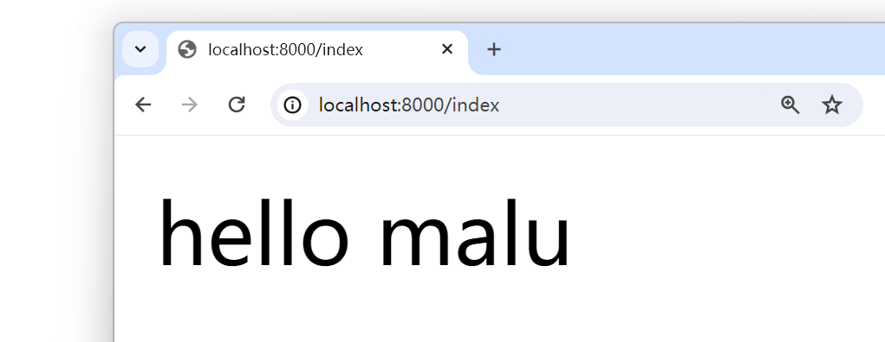
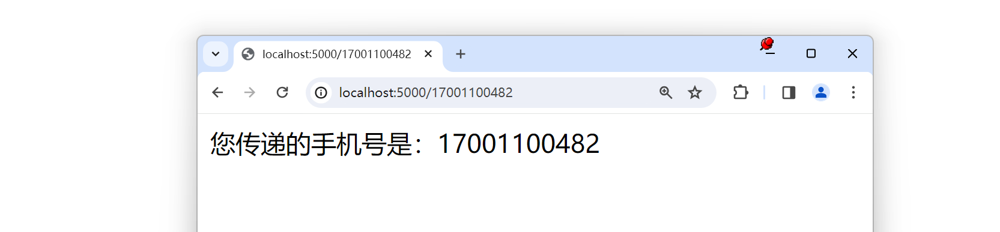
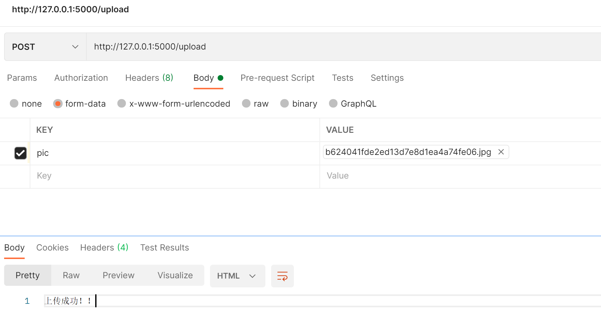
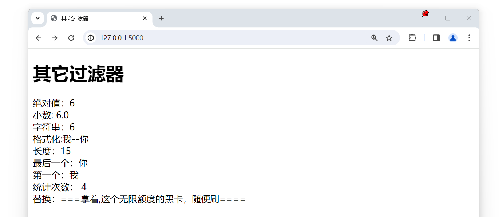
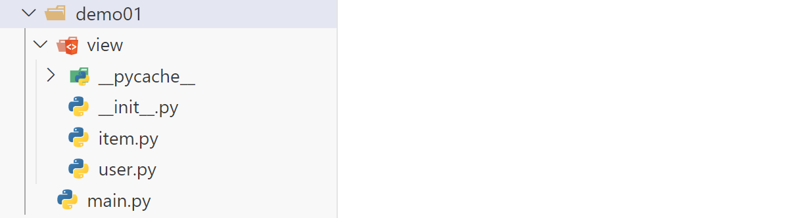

## 一，Flask入门

### 1，Flask介绍


Flask 是一款发布于**2010**年非常流行的 **Python Web** 框架。特点:

- 微框架、简洁，给开发者提供了很大的扩展性。

- Flask和相应的插件写得很好，用起来很爽。 

- 开发效率非常高，比如使用 SQLAlchemy 的 ORM 操作数据库可以节省开发者大量书写 sql 的时 

  间。


Flask 的灵活度非常之高，他不会帮你做太多的决策，很多都可以按照自己的意愿进行更改。**比如：** 使用 Flask 开发数据库的时候，具体是使用 SQLAlchemy 还是MongoEngine，选择权完全掌握在你自己的手中。


Flask 本身相当于一个内核，其他几乎所有的功能都要用到扩展（邮件扩展 Flask-Mail ，用户认证 Flask-Login ，数据库 Flask-SQLAlchemy ），都需要用第三方的扩展来实现。Flask 没有默认使用的数据库，你可以选择 MySQL ，也可以用NoSQL 。


其 WSGI 工具箱采用 Werkzeug （路由模块），模板引擎则使用Jinja2 。这两个也是 Flask 框架的**核心**。 扩展列表：http://flask.pocoo.org/extensions/

- Flask-SQLalchemy：操作数据库； 
- Flask-script：插入脚本； 
- Flask-migrate：管理迁移数据库； 
- Flask-Session：Session存储方式指定； 
- Flask-WTF：表单； 
- Flask-Mail：邮件； 
- Flask-Bable：提供国际化和本地化支持，翻译； 
- Flask-Login：认证用户状态；
- Flask-OpenID：认证； 
- Flask-RESTful：开发REST API的工具； 
- Flask-Bootstrap：集成前端Twitter Bootstrap框架； 
- Flask-Moment：本地化日期和时间； 
- Flask-Admin：简单而可扩展的管理接口的框架 


**文档地址** 

- 中文文档（http://docs.jinkan.org/docs/flask/） 
- 英文文档（http://flask.pocoo.org/docs/1.0/）


### 2，第1个Flask程序

安装：

```
conda install flask==2.0.2
```


第1个flask程序：

```python
# 因为需要创建一个web应用，而Flask中创建应用的对象是Flask,因此引入此对象
from flask import Flask

# 创建对象
app = Flask(__name__)

# 路由的地址
@app.route('/index')
def index():
    # return 代表将数据返回给浏览器
    return 'hello malu'


if __name__ =="__main__":
    # 启动web应用服务,默认端口号是5000
    # app.run()
    app.run(port=8000)
```


启动程序：

```
python 1.py
```


测试：




### 3，启动方式

运行程序时，可以指定运行的主机IP地址，端口，如下：

```python
# host为主机IP地址,可以不传。默认localhost
# port为端口号，可以不传。默认5000
app.run(host='0.0.0.0',port=8000)
```


第1种通过 app.run运行

- python filename
- 右键 - run python file in terminal 


第2种通过 flask命令运行

- 可以不写app.run()
- 文件名不要用中文


通过第2种方式运行，程序中不用再写app.run了，如下：

```python
from flask import Flask

app = Flask(__name__)

@app.route('/index')
def index():
    return 'hello malu'
```


通过第2种方式运行，需要先配置环境变量，如下：


指定IP和端口：

```
flask run -h 0.0.0.0 -p 8000
```


测试如下：


## 二，Debug模式和配置参数加载


### 1，运行时传递参数

在代码中制作一个错误：

```python
from flask import Flask

app = Flask(__name__)

@app.route('/index')
def index():
    a = 1
    b = 0
    c = a/b
    return 'hello malu'

if __name__ =="__main__":
    app.run(port=8000)
```


访问：


控制台倒是给出了错误提示信息，但是**我们希望在浏览器也能有相应的提示信息** ，此时，我们可以开启Debug模式，运行时传递参数：

```python
from flask import Flask

app = Flask(__name__)

@app.route('/index')
def index():
    a = 1
    b = 0
    c = a/b
    return 'hello malu'

if __name__ =="__main__":
    app.run(port=8000,debug=True)
```


测试：


### 2，通过app.deubg参数设置

通过app.deubg参数设置，如下：

```python
from flask import Flask

app = Flask(__name__)
app.debug = True

@app.route('/index')
def index():
    a = 1
    b = 0
    c = a/b
    return 'hello malu'

if __name__ =="__main__":
    app.run(port=8000)
```


测试：


### 3，通过修改配置参数

```python
from flask import Flask

app = Flask(__name__)
app.config.update(DEBUG=True)
# app.config['DEBUG'] = True

@app.route('/index')
def index():
    a = 1
    b = 0
    c = a/b
    return 'hello malu'

if __name__ =="__main__":
    app.run(port=8000)
```


测试：


### 4，通过mapping加载

```python
from flask import Flask

app = Flask(__name__)
app.config.from_mapping({'DEBUG':True})

@app.route('/index')
def index():
    a = 1
    b = 0
    c = a/b
    return 'hello malu'

if __name__ =="__main__":
    app.run(port=8000)
```


测试：


### 5，通过配置对象设置config

```python
from flask import Flask

app = Flask(__name__)

@app.route('/index')
def index():
    a = 1
    b = 0
    c = a/b
    return 'hello malu'

class Config:
    DEBUG = True

if __name__ =="__main__":
    app.config.from_object(Config)
    app.run(port=8000)
```


测试：略


### 6，通过配置文件设置config

config.py

```python
DEBUG = True
```


或 config.json

```json
{"DEBUG":"True"}
```


服务器代码：

```python
from flask import Flask

app = Flask(__name__)

@app.route('/index')
def index():
    a = 1
    b = 0
    c = a/b
    return 'hello malu'

class Config:
    DEBUG = True

if __name__ =="__main__":
    # import json
    # app.config.from_file('config.json', json.load)

    app.config.from_json("config.json") 
    app.run(port=8000)
```


测试：略


### 7，通过python文件设置

settings.py

```python
DEBUG = True
```


服务器代码：

```python
from flask import Flask

app = Flask(__name__)

@app.route('/index')
def index():
    a = 1
    b = 0
    c = a/b
    return 'hello malu'

class Config:
    DEBUG = True

if __name__ =="__main__":
    app.config.from_pyfile('settings.py')
    app.run(port=8000)
```


测试：略


### 8，通过环境变量设置


设置环境变量：


重启下VScode，代码：

```python
from flask import Flask

app = Flask(__name__)

@app.route('/index')
def index():
    a = 1
    b = 0
    c = a/b
    return 'hello malu'

class Config:
    DEBUG = True

if __name__ =="__main__":
    app.config.from_envvar('flask_setting')
    app.run(port=8000)
```


测试：略


总结最常用的几种方式：

- 通过python文件设置
- 通过配置对象设置config


## 三，动态路由


### 1，动态路由

所谓的动态路由就是URL与函数的映射。比如，有一个请求访问的接口地址为 /users/11001 ，其中 11001 实际上为具体的请求参数，表明请求 11001 号用户的信息。 此时如何从url中提取出 11001 的数据。代码演示：

```python
from flask import Flask

app = Flask(__name__)

@app.route('/users/<user_id>')
def index(user_id):
    print(type(user_id))
    return f'返回了，{user_id}的用户信息'

if __name__ == '__main__':
    app.run()
```


测试：


其中 < user_id > ，尖括号是固定写法。默认的数据类型是字符串。如果需要指定类型，则要写成 converter:variable ，其中converter 就是类型名称，可以有以下几种：

- **string**:如果没有指定具体的数据类型，那么默认就是使用 string 数据类型。
- **int:**数据类型只能传递 int 类型。
- **float:**数据类型只能传递 float 类型。
- **path:**数据类型和 string 有点类似，都是可以接收任意的字符串，但是 path 可以接收路径，也就是说可以包含斜杠。
- **uuid:**数据类型只能接收符合 uuid 的字符串。 uuid 是一个全宇宙都唯一的字符串，一般可以用来作为表的主键。
- **any:**数据类型可以在一个 url 中指定多个路径。例如：


代码：

```python
from flask import Flask

app = Flask(__name__)

@app.route('/article/<id>')
def index(id):
    print(f'接收到的文章ID是：{id}')
    print(type(id))   # <class 'str'>
    return f'返回了，{id}的文章'


@app.route('/int/<int:id>')
def index_int(id):
    print(f'接收到的文章ID是：{id}')
    print(type(id))  # <class 'int'>
    return f'返回了，{id}的文章'


@app.route('/float/<float:id>')
def index_float(id):
    print(f'接收到的文章ID是：{id}')
    print(type(id))  # <class 'float'>
    return f'返回了，{id}的文章'


@app.route('/str/<string:id>')
def index_str(id):
    print(f'接收到的文章ID是：{id}')
    print(type(id))   # <class 'str'>
    return f'返回了，{id}的文章'


@app.route('/path/<path:id>')
def index_path(id):
    print(f'接收到的文章ID是：{id}')  # a/b/c
    print(type(id))    # <class 'str'>
    return f'返回了，{id}的文章'  # 返回了，a/b/c的文章

# uuid: 16763be4-6022-406e-a950-fcd5018633ca
@app.route('/uuid/<uuid:id>')
def index_uuid(id):
    print(f'接收到的文章ID是：{id}')
    print(type(id))  # <class 'uuid.UUID'>
    return f'返回了，{id}的文章'

@app.route('/<any(user,item):tmp>/<int:id>')
def index_any(tmp,id):
    if tmp == 'user':
        return f'返回了一个编号为 {id} 的 用户 信息'
    elif tmp =='item':
        return f'返回了一个编号为 {id} 的 元素 信息'

# user/[1,2,3]
# item/[1,2,3]
# vip/[1,2,3]
if __name__ == '__main__':
    app.run(debug=True)
```


### 2，自定义转换器

​	为什么路径参数可以直接识别数据类型？从 werkzeug.routing 导入 BaseConverter 类 了解底层。int 路径参数底层调用 IntegerConverter 类来作格式判断。float 路径参数底层调用 FloatConverter 类来作格式判断。string 路径参数底层调用 StringConverter 类来作格式判断。如果遇到需要匹配提取 /sms_codes/1688888888 中的手机号数据，Flask内置的转换器就无法满足需求，此时需要自定义转换器。 


自定义转换器主要做3步，第1步，创建转换器类，保存匹配时的正则表达式：

```python
from werkzeug.routing import BaseConverter

class PhoneConverter(BaseConverter):
    regex = '1[3-9]\d{9}'  # regex 名字是固定的

```

第2步，将自定义的转换器告知Flask应用

```python
from flask import Flask
from werkzeug.routing import BaseConverter

app = Flask(__name__)

class PhoneConverter(BaseConverter):
    regex = '1[3-9]\d{9}'  # regex 名字是固定的

#  将自定义转换器添加到转换器字典中，并指定转换器使用时名字为: phone
app.url_map.converters['phone'] = PhoneConverter
```


第3步，在使用转换器的地方定义使用

```python
from flask import Flask
from werkzeug.routing import BaseConverter

app = Flask(__name__)

class PhoneConverter(BaseConverter):
    regex = '1[3-9]\d{9}'  # regex 名字是固定的

app.url_map.converters['phone'] = PhoneConverter

@app.route('/')
def index():
    return "Hello"

@app.route('/<phone:param>')
def phone(param):
    print(param)
    return f"您传递的手机号是：{param}"

if __name__ == '__main__':
    app.run(debug=True)
```


测试：




### 3，to_python

在转换器类中，实现 to_python(self,value) 方法，这个方法的返回值，将会传递到 view函数中作为参数

```python
from flask import Flask
from werkzeug.routing import BaseConverter

app = Flask(__name__)

# 需求：路径参数传递多信息并以一个参数接收。
# 比如：获取姓名：zs 年龄 18的信息
# /user/zs+18

class LiConverter(BaseConverter):
    def to_python(self, value):
        return value.split('+')

app.url_map.converters['li'] = LiConverter

@app.route('/')
def index():
    return "Hello"


@app.route('/user/<info>')
def user(info):
    args = info.split('+')
    # sql  : select * from t_user where uname = args[0] and age = args[1];
    return f'获取了某某信息！！{args}'


@app.route('/user_info/<li:info>')
def user_info(info):
    # sql  : select * from t_user where uname = args[0] and age = args[1];
    return f'获取了某某信息！！{info}'

if __name__ == '__main__':
    app.run(debug=True)
```


测试：


## 四，查询字符串的获取

### 1，查询字符串的获取


请求的url

```
http://127.0.0.1:5000/test/?wd=python&uname=malu&pwd=123
```


代码演示：

```python
from flask import Flask,request

app = Flask(__name__)

@app.route('/test')
def index():
    # 方式1：
    # uname = request.args.get('uname')
    # pwd = request.args.get('pwd')

    # 方式2：
    uname = request.values.get('uname')
    pwd = request.values.get('pwd')

    return f'Hello! === {uname}==={pwd}'

if __name__ =='__main__':
    app.run(debug=True)
```


测试：


## 五，请求体参数

### 1，获取请求体参数

```python
from flask import Flask,request

app = Flask(__name__)

@app.route('/login',methods=['POST','GET'])
def login():
    # 方式1：
    # uname = request.form.get('uname')
    # pwd = request.form.get('pwd')

    # 方法2：
    uname = request.values.get('uname')
    pwd = request.values.get('pwd')
    
    return f'Hello! == {uname} == {pwd} '

if __name__ =='__main__':
    app.run(debug=True)
```


测试：


上面的方式，获取json数据是不行的，如下：


## 六，文件上传和其它参数获取


### 1，文件上传

客户端上传图片到服务器，并保存到服务器中，代码：

```python
from flask import Flask,request

app = Flask(__name__)

@app.route('/upload',methods=['POST'])
def upload():
    f = request.files.get('pic')
    fname = f.filename
    with open(f'./imgs/{fname}','wb') as tf:
        tf.write(f.read())
    return f'上传成功！！'

if __name__ =='__main__':
    app.run(debug=True)
```


测试：




需要注意，上传文件，需要一个请求头：


### 2，其它参数获取


如果想要获取其他地方传递的参数，可以通过Flask提供的**request**对象来读取。不同位置的参数都存放在request的不同属性中。


参考代码：

```python
from flask import Flask,request

app = Flask(__name__)

@app.route('/args',methods=['GET','POST'])
def args():
    url = request.url
    method = request.method
    headers = request.headers.get('Content-Type')
    user_agent = request.headers.get('User-Agent')
    uid = request.cookies.get('uid')
    return f'Hello=={url} == {method} =={headers} =={user_agent}=={uid}'

if __name__ =='__main__':
    app.run(debug=True)
```


测试：


## 七，url_for函数


### 1，url_for函数的使用

一般我们通过一个 URL就可以执行到某一个函数。如果反过来,我们知道一个函数,怎么去获得这个 URL呢？url_for 函数就可以帮我们实现这个功能。


url_for 函数可以接收1个及以上的参数，他接收函数名作为第一个参数。如果还出现其他的参数，则会添加到 URL 的后面作为查询参数。代码演示：

```python
from flask import Flask,url_for

app = Flask(__name__)

@app.route('/index/')
def index():
    return f'Hello !!'

@app.route('/home/<int:uid>/')
def home(uid):
    return f'Hello !!{uid}'

@app.route('/show_url')
def show_url():
    # url = url_for('home') # 第1个参数是函数的名字
    # url = url_for('home',uid=1001) # 第2个参数默认开始匹配路径参数了
    url = url_for('home',uid=1001,addr='beijing') # 第2个参数默认开始匹配路径参数了,匹配不上就会以查询参数进行传递

    return f'反向查找到的URL地址：{url}'

if __name__ =='__main__':
    app.run(debug=True)
```


测试：


### 2，url_for函数使用的原因

为什么选择 url_for 而不选择直接在代码中拼 URL 的原因有两点：

- 将来如果修改了 URL ，但没有修改该 URL 对应的函数名，就不用到处去替换URL 了
- url_for() 函数会转义一些特殊字符和 unicode 字符串，这些事情 url_for 会自动的帮我们


```python
from flask import Flask,url_for

app = Flask(__name__)

@app.route('/index/')
def index():
    return f'Hello !!'


@app.route('/show_url')
def show_url():
    # 会自动的将/编码，不需要手动去处理。
    url = url_for('index',next='/')
    return f'反向找到的url地址是：{url}'

if __name__ =='__main__':
    app.run(debug=True)
```


测试：


在定义url的时候，一定要记得在最后加一个斜杠。

- 如果不加斜杠，那么在浏览器中访问这个url的时候，如果最后加了斜杠，那么就访问不到。这样用户体验不太好。
- 搜索引擎会将不加斜杠的和加斜杠的视为两个不同的url。而其实加和不加斜杠的都是同一个url，那么就会给搜索引擎造成一个误解。加了斜杠，就不会出现没有斜杠的情况。


## 八，重定向


### 1，重定向分类

永久性重定向：

- http 的状态码是 301,多用于旧网址被废弃了要转到一个新的网址确保用户的访问。比如：你输入 www.jingdong.com 的时候，会被重定向到 www.jd.com 。因为 jingdong.com 这个网址已经被废弃了，被改成 jd.com 

  所以这种情况下应该用永久重定向


暂时性重定向：

- http 的状态码是 302,表示页面的暂时性跳转。比如：访问一个需要权限的网址，如果当前用户没有登录，应 

  该重定向到登录页面，这种情况下，应该用暂时性重定向。


### 2，flask中重定向


重定向是通过 redirect(location,code=302) 这个函数来实现的, location表示需要重定向到的 URL, 应该配合之前讲的 url_for() 函数来使用，code 表示采用哪个重定向，默认是 302 也即 暂时性重定向, 可以修改成 301 来实现永久性重定向 。

代码演示：

```python
from flask import Flask,redirect,url_for

app = Flask(__name__)

@app.route('/user_login/')
def login():
    return f'登录页面 !!'

@app.route('/info/')
def info():
    print('=====================这个是个人信息=======================')
    # return redirect('/login/')
    # return redirect('/login/',code=301)
    return redirect(url_for('login'))  # 重定向和url_for结合使用


if __name__ =='__main__':
    app.run(debug=True)
```


测试：


## 九，响应内容


### 1，响应字符串

```python
from flask import Flask

app = Flask(__name__)

@app.route('/str')
def index():
    return '你好,少年'

if __name__ =='__main__':
    app.run(debug=True)
```


测试：


### 2，响应JSON

```python
from flask import Flask

app = Flask(__name__)

app.config['JSON_AS_ASCII'] = False

@app.route('/json1')
def r_json():
    return {'key':'python语言'}

from flask import jsonify

@app.route('/json2')
def r_json2():
    return jsonify({'key':'python语言'})


if __name__ =='__main__':
    app.run(debug=True)
```


测试：


### 3，元组方式

可以返回一个元组，元组中必须至少包含一个项目，且项目应当由(response, status) 、 (response, headers) 或者 (response, status, headers) 组成。 status的值会重载状态代码， headers 是一个由额外头部值组成的列表 或字典。  status 值会覆盖状态代码， headers 可以是一个列表或字典，作为额外的消息标头值。 

```python
from flask import Flask

app = Flask(__name__)

@app.route('/tuple')
def r_tuple():
    
    # return 'tuple',202
    # return 'tuple',{'malu':'python'}
    # return 'tuple',300,{'malu':'python'}
    return 'tuple',300,[('malu','python_sql')]

if __name__ =='__main__':
    app.run(debug=True)
```


测试：


### 4，自定义响应内容

```python
from flask import Flask,Response,make_response

app = Flask(__name__)

@app.route('/')
def index():
    # return Response('你好，少年！！',status=500,headers={'malu':'python!!!'})
    # return Response('')
    return Response('无法找到页面',status=404)

@app.route('/home')
def home():
    resp = make_response('这个是创建的Response对象')
    resp.headers['malu']='SQL+Python+Flask'
    resp.status = '404 not found'
    return resp

if __name__ =='__main__':
    app.run(debug=True)
```


测试：


## 十，模板


### 1，模板基本使用

MVT 设计模式：

- **M**全拼为Model，与MVC中的M功能相同，负责和数据库交互，进行数据处理。
- **V**全拼为View，与MVC中的C功能相同，接收请求，进行业务处理，返回应答。
- **T**全拼为Template，与MVC中的V功能相同，负责封装构造要返回的html。


在 Flask中，配套的模板是 Jinja2，Jinja2的作者也是Flask的作者。这个模板非常的强大，并且执行效率高。 **使用步骤：**

- 创建模板
  - 在 应用 同级目录下创建模板文件夹 templates . 文件夹名称固定写法
  - 在 templates 文件夹下, 创建 应用 同名文件夹. 例, Book
  - 在 应用 同名文件夹下创建 网页模板 文件. 例 : index.html
- 设置模板查找路径
- 模板处理数据


代码演示：

```python
from flask import Flask,render_template

app = Flask(__name__,template_folder='templates')

# 模板默认查找的目录是templates,
# 如果想要修改模板的目录，可以设置template_folder参数

@app.route('/')
def index():
    return render_template('index.html')


if __name__ =='__main__':
    app.run(debug=True)
```


templates目录下面的index.html

```html
<!DOCTYPE html>
<html lang="en">
<head>
    <meta charset="UTF-8">
    <meta http-equiv="X-UA-Compatible" content="IE=edge">
    <meta name="viewport" content="width=device-width, initial-scale=1.0">
    <title>模板的使用</title>
</head>
<body>
    <h1>Hello,模板的使用</h1>
    <p>这个是模板的使用案例！！</p>
</body>
</html>
```


测试：


### 2，模板传参

​	在使用 render_template 渲染模版的时候，可以传递关键字参数（命名参数）。 如果你的参数项过多，那么可以将所有的参数放到一个字典中， 然后在传这个字典参数的时候，使用两个星号，将字典打散成关键字参数（也叫命名参数）


代码演示：

```python
from flask import Flask,render_template

app = Flask(__name__)

@app.route('/')
def index():
    return render_template('index.html',info='Flask模板传参')

@app.route('/index')
def index2():
    return render_template('index.html',arg='Python中的Flask',info='Flask模板传参')

@app.route('/home')
def home():
    context = {
        'uname':'malu',
        'age':18,
        'height':180,
        'data':{'key1':'value1','key2':'value2'}
    }
    return render_template('index.html',**context)

if __name__ =='__main__':
    app.run(debug=True)
```


模板：

```html
<!DOCTYPE html>
<html lang="en">
<head>
    <meta charset="UTF-8">
    <meta http-equiv="X-UA-Compatible" content="IE=edge">
    <meta name="viewport" content="width=device-width, initial-scale=1.0">
    <title>模板传递</title>
</head>
<body>
    <h1>模板传递</h1>
    <p>这个是关于 {{ info }} 的内容</p>
    <hr>
    <p>这个是关于 {{ arg }} 的内容</p>
    <hr>
    <p>{{ uname }}=={{age}} =={{height}}==</p>
    <p>{{ data }}</p>
    <p>{{ data['key1'] }}</p>
    <p>{{ data.get('key1') }}</p>
    <p>{{ data.key1 }}</p>
</body>
</html>
```


测试：


### 3，模板中使用url_for函数

模版中也可使用 url_for ,和后台视图函数中的 url_for 使用起来基本是一模一样的。 


在模板中使用函数，需要在函数 左右两边加上2个 {} 。代码演示：

```python
from flask import Flask,render_template

app = Flask(__name__)

@app.route('/')
def index():
    return render_template('index.html')

@app.route('/home2/')
def home():
    return 'Home!!'

@app.route('/home1/<int:id>')
def home1(id):
    return 'Home!!'

if __name__ =='__main__':
    app.run(debug=True)
```


模板：

```html
<!DOCTYPE html>
<html lang="en">
<head>
    <meta charset="UTF-8">
    <meta http-equiv="X-UA-Compatible" content="IE=edge">
    <meta name="viewport" content="width=device-width, initial-scale=1.0">
    <title>url_for函数的使用</title>
</head>
<body>
    <h1>url_for 函数</h1>
    <hr>
    {{ url_for('index') }}
    <br>
    {{ url_for('home') }}
    <br>
    {{ url_for('home1',id=1101) }}
    <br>
    {{ url_for('home',id=1101) }}
    <br>
    {{ url_for('home1',id=1101,addr='bj') }}
    <br>
    <a href="/home/">访问home的内容</a>
    <br>
    <a href="{{ url_for('home')}}">访问home的内容</a>
</body>
</html>
```


测试：


### 4，过滤器的使用

​	有时候我们想要在模版中对一些变量进行处理，那么就必须需要类似于Python中的函数一样，可以将这个值传到函数中，然后做一些操作。在模版中，过滤器相当于是一个函数，把当前的变量传入到过滤器中，然后过滤器根据自己的功能，再返回相应的值，之后再将结果渲染到页面中

```python
from flask import Flask,render_template

app = Flask(__name__)

@app.route('/')
def index():
    return render_template('index.html',param =10.5)

if __name__ =='__main__':
    app.run(debug=True)
```


模板：

```html
<!DOCTYPE html>
<html lang="en">
<head>
    <meta charset="UTF-8">
    <meta http-equiv="X-UA-Compatible" content="IE=edge">
    <meta name="viewport" content="width=device-width, initial-scale=1.0">
    <title>过滤器的使用</title>
</head>
<body>
    <h1>过滤器的使用</h1>
    过滤前的数据是：{{ param }}
    <br>
    过滤后的数据是：{{ param | int }}
</body>
</html>
```


测试：


### 5，Jinja模板自带过滤器


过滤器是通过管道符号 | 使用的，例如： { name|length }} 将返回name的长度。 过滤器相当于是一个函数，把当前的变量传入到过滤器中，然后过滤器根据自己的功能，再返回相应的值，之后再将结果渲染到页面中。 


Jinja2中内置了许多过滤器：https://jinja.palletsprojects.com/en/3.0.x/templates/#builtin-filters


#### a）default过滤器的使用

default(value,default_value,boolean=false)。说明：如果当前变量没有 值，则会使用参数中的值来代替。如果想使用python的形式判断是否为false，则可以传递boolean=true。也可以使用or来替换。

服务器：

```python
from flask import Flask,render_template

app = Flask(__name__)

@app.route('/')
def index():
    # return render_template('index.html',nick_name='吕布')
    # return render_template('index.html')
    # return render_template('index.html',nick_name='')
    # return render_template('index.html',nick_name=[])
    # return render_template('index.html',nick_name={})
    return render_template('index.html',nick_name=None)


if __name__ =='__main__':
    app.run(debug=True)
```


模板：

```html
<!DOCTYPE html>
<html lang="en">
<head>
    <meta charset="UTF-8">
    <meta http-equiv="X-UA-Compatible" content="IE=edge">
    <meta name="viewport" content="width=device-width, initial-scale=1.0">
    <title>default过滤器</title>
</head>
<body>
    <h1>default过滤器</h1>
    过滤前的昵称数据是：{{nick_name}}<br>
    过滤后的昵称数据是：{{nick_name | default('用户1',boolean=true)}}<br>
    过滤后的昵称数据是：{{nick_name or '用户2'}}<br>
</body>
</html>
```


测试：


#### b）转义字符过滤器的使用

safe(value)。 如果开启了全局转义，那么safe过滤器会将变量关掉转义。


服务器：

```python
from flask import Flask,render_template

app = Flask(__name__)

@app.route('/')
def index():
    info = '<script>alert("Hello!!")</script>'
    return render_template('index.html',info=info)

if __name__ =='__main__':
    app.run(debug=True)
```


模板：

```html
<!DOCTYPE html>
<html lang="en">
<head>
    <meta charset="UTF-8">
    <meta http-equiv="X-UA-Compatible" content="IE=edge">
    <meta name="viewport" content="width=device-width, initial-scale=1.0">
    <title>转义字符过滤器</title>
</head>
<body>
    <h1>转义字符过滤器</h1>
    <!-- 模板中默认 做了转义字符的效果 -->
    转义前的数据是：{{ info | safe }}  <!-- 不转义：不将特殊字符转换成 &lt;类似的数据 -->

     <!-- false代表不再转义特殊字符 / true 转义特殊字符  &lt;-->
    {{info }}  <!-- 转义：将特殊字符转换成 &lt;类似的数据 -->
    

</body>
</html>
```


测试：


小结：

- jinja2模板 默认全局开启了自动转义功能
- safe 过滤器：可以关闭一个字符串的自动转义
- escape 过滤器：对某一个字符串进行转义
- autoescape 标签，可以对他包含的代码块关闭或开启自动转义 


#### c）其它过滤器的使用


服务器：

```python
from flask import Flask,render_template

app = Flask(__name__)

@app.route('/')
def index():
    return render_template('index.html')

if __name__ =='__main__':
    app.run(debug=True)
```


模板：

```html
<!DOCTYPE html>
<html lang="en">
<head>
    <meta charset="UTF-8">
    <meta http-equiv="X-UA-Compatible" content="IE=edge">
    <meta name="viewport" content="width=device-width, initial-scale=1.0">
    <title>其它过滤器</title>
</head>
<body>
    <h1>其它过滤器</h1>
    绝对值：{{ -6 | abs }}<br>
    小数: {{ 6 | float }}<br>
    字符串：{{ 6 | string }}<br>

    格式化:{{'%s--%s' | format('我','你')}}<br> 
    长度：{{'我是九，你是三，除了你，还是你' |length}}<br>
    最后一个：{{'我是九，你是三，除了你，还是你' |last}}<br>
    第一个：{{'我是九，你是三，除了你，还是你' |first}}<br>
    统计次数： {{'我是九，你是三，除了你，还是你' | wordcount }}<br>
    替换：{{'===我是九，你是三，除了你，还是你====' |replace('我是九，你是三，除了你，还是你','拿着,这个无限额度的黑卡，随便刷')}}

</body>
</html>
```


测试：




### 6，自定义内容过滤器

​	只有当系统提供的过滤器不符合需求后，才须自定义过滤器过滤器本质上就是一个函数。 如果在模版中调用这个过滤器，那么就会将这个变量的值作为第一 个参数传给过滤器这个函数，然后函数的返回值会作为这个过滤器的返回值。 


将新闻中出现的 所有“ 我是九你是三，除了你还是你” 换成 "你不用多好，我喜欢就好。代码如下：

```python
from flask import Flask,render_template

app = Flask(__name__)


@app.template_filter('cut')
def cut(value):
    value = value.replace('我是九，你是三，除了你，还是我','你不用好，我喜欢就好')
    return value

@app.route('/')
def index():
    info = '============= 我是九，你是三，除了你，还是我=============='
    return render_template('index.html',info = info)

if __name__ =='__main__':
    app.run(debug=True)
```


模板：

```html
<!DOCTYPE html>
<html lang="en">
<head>
    <meta charset="UTF-8">
    <meta http-equiv="X-UA-Compatible" content="IE=edge">
    <meta name="viewport" content="width=device-width, initial-scale=1.0">
    <title>自定义过滤器</title>
</head>
<body>
    <h1>自定义过滤器</h1>
    过滤前的数据是：{{info}}<br>
    过滤后的数据是：{{info|cut}}
</body>
</html>
```


测试：


### 7，自定义时间过滤器

例如：操作发布新闻 与现在的时间间隔。代码如下：

```python
from flask import Flask,render_template
from datetime import datetime

app = Flask(__name__)

# 年 月 日  时 分 秒
# 数据库中存放的数据是 2030/01/01 00:00:00
# 现在时间是          2030/01/01 01:30:00

@app.template_filter('handler_time')
def handler_time(time):
    '''
        time距离现在的时间间隔
       1. 如果时间间隔小于1分钟以内，那么就显示“刚刚”
       2. 如果是大于1分钟小于1小时，那么就显示“xx分钟前”
       3. 如果是大于1小时小于24小时，那么就显示“xx小时前”
       4. 如果是大于24小时小于30天以内，那么就显示“xx天前”
       5. 否则就是显示具体的时间 2030/10/20 16:15
    '''
    # 获取当前时间
    now = datetime.now()
    # 将相差的时间转为秒
    temp_stamp = (now-time).total_seconds()
    if temp_stamp <60:
        return '1分钟之前'
    elif temp_stamp >=60 and temp_stamp <60*60:
        return '1小时之前'
    elif temp_stamp >= 60*60 and temp_stamp < 60*60*24:
        hours = int(temp_stamp/(60*60))
        return f'{hours}小时之前'
    elif temp_stamp >= 60*60*24 and temp_stamp< 60*60*24*30:
        day = int(temp_stamp/(60*60*24))
        return f'{day}天之前'
    else:
        return '很久以前'

@app.route('/')
def index():
    tmp_time = datetime(2024, 2, 2,10,10,10)
    return render_template('index.html',tmp_time = tmp_time)

if __name__ =='__main__':
    app.run(debug=True)
```


模板：

```html
<!DOCTYPE html>
<html lang="en">
<head>
    <meta charset="UTF-8">
    <meta http-equiv="X-UA-Compatible" content="IE=edge">
    <meta name="viewport" content="width=device-width, initial-scale=1.0">
    <title>自定义时间过滤器</title>
</head>
<body>
    <h1>自定义时间过滤器</h1>
    数据过滤后的：{{tmp_time|handler_time}}
</body>
</html>
```


测试：


### 8，if语句

​	所有的控制语句都是放在 `` 中，并且有一个语句 `` 来进 行结束！ **if****：**if语句和python中的类似，可以使用 `>，<，<=，>=，==，!=` 来进行判 断，也可以通过 `and，or，not，()` 来进行逻辑合并操作 。


服务器：

```python
from flask import Flask,render_template

app = Flask(__name__)

@app.route('/')
def index():
    uname = 'malu'
    return render_template('index.html',uname = uname)

if __name__ =='__main__':
    app.run(debug=True)
```


模板：

```html
<!DOCTYPE html>
<html lang="en">
<head>
    <meta charset="UTF-8">
    <meta http-equiv="X-UA-Compatible" content="IE=edge">
    <meta name="viewport" content="width=device-width, initial-scale=1.0">
    <title>流程控制-选择结构</title>
</head>
<body>
    <h1>流程控制-选择结构</h1>

    <h3>单分支</h3>
    
        <p>码路</p>
    

    <hr>
    
    <h3>双分支</h3>
    
        <p>码路</p>
    
        <p>漫漫</p>
    
    
    <hr>

    <h3>多分支</h3>
    
        <p>码路</p>
    
        <p>漫漫</p>
    
        <p>码路漫漫</p>
    
</body>
</html>
```


测试：


if语句练习之服务器代码：

```python
from flask import Flask,render_template,request

app = Flask(__name__)

@app.route('/')
def index():
    return render_template('index.html')

@app.route('/login')
def login():
    user = request.args.get('user')
    return render_template('index.html',user = user)

if __name__ =='__main__':
    app.run(debug=True)
```


模板：

```html
<!DOCTYPE html>
<html lang="en">
<head>
    <meta charset="UTF-8">
    <meta http-equiv="X-UA-Compatible" content="IE=edge">
    <meta name="viewport" content="width=device-width, initial-scale=1.0">
    <title>首页</title>
</head>
<body>
    <span>中国大陆</span>&nbsp;&nbsp;&nbsp;
    
        <a href="{{url_for('login',user='吕布')}}">亲，请登录</a>&nbsp;&nbsp;&nbsp;
        <span>免费注册</span>&nbsp;&nbsp;&nbsp;
    
        <span> {{user}} </span>
    
    <span>手机逛淘</span>
</body>
</html>
```


测试：


### 9，for语句

for...in... for循环可以遍历任何一个序列包括列表、字典、元组。并且可以进行反向遍历，以下将用几个例子进行解释。并且Jinja中的for循环还包含以下变量，可以用来获取当前的遍历状态：


服务器代码：

```python
from flask import Flask,render_template

app = Flask(__name__)

@app.route('/')
def index():
    items =['Python','HTML','CSS','JavaScript','SQL','Lua']
    person = {'uname':'张三','age':18,'height':180,'nick':'法外狂徒'}
    return render_template('index.html',items= items,person = person)

if __name__ =='__main__':
    app.run(debug=True)
```


模板：

```html
<!DOCTYPE html>
<html lang="en">
<head>
    <meta charset="UTF-8">
    <meta http-equiv="X-UA-Compatible" content="IE=edge">
    <meta name="viewport" content="width=device-width, initial-scale=1.0">
    <title>流程控制-循环结构</title>
</head>
<body>
    <h1>流程控制-循环结构</h1>

    
        {{item}}<br>
    
    <hr>

    {{ person }} <br>
    {{ person.uname }}<br>
    
        {{ p }}
    <br>

    
        {{ p }}
    <br>

    
        {{ p }}
    <br>

    <hr>

    
        {{item}} == {{ loop.index }} =={{ loop.index0 }} == {{loop.first}}=={{ loop.last }} == {{loop.length}}<br>
    

    <hr>

    
        {{item}}<br>
    
</body>
</html>
```


测试：


总结：在 jinja2 中的 for 循环，跟 python 中的 for 循环基本上是一模一样的也是 for...in... 的形式。并且也可以遍历所有的序列以及迭代器唯一不同的是， jinja2 中的 for 循环没有 break 和 continue 语句 


再看一个for循环的练习题，打印九九乘法表，服务器代码：

```python
from flask import Flask,render_template

app = Flask(__name__)

@app.route('/')
def index():
    return render_template('index.html')

if __name__ =='__main__':
    app.run(debug=True)
```


模板：

```html
<!DOCTYPE html>
<html lang="en">
<head>
    <meta charset="UTF-8">
    <meta http-equiv="X-UA-Compatible" content="IE=edge">
    <meta name="viewport" content="width=device-width, initial-scale=1.0">
    <title>循环练习</title>
</head>
<body>
    <h1>循环练习-99乘法表</h1>
    <table border="1">
        
        <tr>
            
            <td>{{y}} * {{x}} = {{x*y}}</td>
            
        </tr>
        
    </table>
</body>
</html>
```


效果：


### 10，宏的使用

模板中的宏跟python中的函数类似，可以传递参数，但是不能有返回值。可以将一些经常用到的代码片段放到宏中，然后把一些不固定的值抽取出来当成一个变量。


定义宏，如下：

```html
<!DOCTYPE html>
<html lang="en">
<head>
    <meta charset="UTF-8">
    <meta http-equiv="X-UA-Compatible" content="IE=edge">
    <meta name="viewport" content="width=device-width, initial-scale=1.0">
    <title>宏的使用</title>
</head>


    <input type="{{type}}" name="{{name}}" value="{{value}}">

<body>
    <h1>宏的使用</h1>

    <table>
        <tr>
            <td>用户名：</td><td><input type="text" name="" value=""></td>
        </tr>
        <tr>
            <td>密码：</td><td><input type="password" name="" value=""></td>
        </tr>
        <tr>
            <td><input type="submit" value="登录"></td>
        </tr>
    </table>

    <hr>

    <table>
        <tr>
            <td>用户名：</td><td>{{inp('text')}}</td>
        </tr>
        <tr>
            <td>密码：</td><td>{{inp('password')}}</td>
        </tr>
        <tr>
            <td>{{inp('submit',value='登录')}}</td>
        </tr>
    </table>

</body>
</html>
```


服务器：

```python
from flask import Flask,render_template

app = Flask(__name__)

@app.route('/')
def index():
    return render_template('index.html')

if __name__ =='__main__':
    app.run(debug=True)
```


测试：


实际开发中，不会把宏在一个页面内定义 并直接使用一般把宏定义放到一个专门的文件夹中，方便进行统一管理之后，哪一个页面需要使用某个宏，需要导入宏才能使用，如下：


**导入宏方式**

-  from '宏文件的路径' import 宏的名字 [as xxx]。
- import "宏文件的路径" as xxx [with context]


服务器：

```python
from flask import Flask,render_template

app = Flask(__name__)

@app.route('/')
def index():
    nick ='吕布'
    return render_template('index.html',nick = nick)

if __name__ =='__main__':
    app.run(debug=True)
```


模板：

```html
<!DOCTYPE html>
<html lang="en">
<head>
    <meta charset="UTF-8">
    <meta http-equiv="X-UA-Compatible" content="IE=edge">
    <meta name="viewport" content="width=device-width, initial-scale=1.0">
    <title>宏的引入</title>
</head>
<!-- 
    from file import func_name
    import file  
-->



<!--  -->
<body>
    <h1>宏的引入</h1>
    <table>
        <tr>
            <td>用户名：</td><td><input type="text" name="" value="{{nick}}"></td>
        </tr>
        <tr>
            <td>密码：</td><td><input type="password" name="" value=""></td>
        </tr>
        <tr>
            <td><input type="submit" value="登录"></td>
        </tr>
    </table>

    <hr>
    <table>
        <tr>
            <td>用户名2：</td><td>{{ mc.inp(name='uname')}}</td>
        </tr>
        <tr>
            <td>密码2：</td><td>{{mc.inp('password','pwd')}}</td>
        </tr>
        <tr>
            <td>{{ mc.inp('submit',value='登录')}}</td>
        </tr>
    </table>


    <hr>
    <table>
        <tr>
            <td>用户名：</td><td>{{ inp(name='uname')}}</td>
        </tr>
        <tr>
            <td>密码：</td><td>{{inp('password','pwd')}}</td>
        </tr>
        <tr>
            <td>{{ inp('submit',value='登录')}}</td>
        </tr>
    </table>
</body>
</html>
```


测试：


注意点：

- 宏文件路径，不要以相对路径去寻找，都要以 templates 作为绝对路径去找
- 如果想要在导入宏的时候，就把当前模版的一些参数传给宏所在的模版，那么就应该在导入的时候使用 with context


## 十一，类视图


### 1，add_url_rule与app.route


**add_url_rule**的格式为：

- add_url_rule(rule,endpoint=None,view_func=None)


这个方法用来添加url与视图函数的映射。如果没有填写 endpoint ，那么默认会使用 view_func 的名字作为 endpoint 。以后在使用 url_for 的时候，就要看在映射的时候有没有传递 endpoint 参数，如果传递了，那么就应该使用 endpoint 指定的字符串，如果没有传递，那么就应该使用 view_func 的名字。代码演示：

```python
from flask import Flask,url_for

app = Flask(__name__)

@app.route('/',endpoint='index')
def index():
    print(url_for('show'))
    print(url_for('index'))
    return "Hello"


def show_me():
    return "这个介绍信息！！"

# endpoint 没有设置，url_for中就写函数的名字，如果设置了，就写endpoint的值
app.add_url_rule('/show_me',view_func=show_me,endpoint='show')  
# @app.route 底层就是使用的 add_url_rule


if __name__ =='__main__':
    app.run(debug=True)


from flask import Response
```


测试：


app.route这个装饰器底层，其实也是使用 add_url_rule 来实现url与视图函数映射的。


### 2，类视图

之前我们接触的视图都是函数，所以一般简称函数视图。 其实视图也可以基于类来实现，类视图的好处是支持继承， 但是类视图不能跟函数视图一样，写完类视图还需要通过app.add_url_rule(url_rule,view_func) 来进行注册


**标准类视图使用步骤**

1. 标准类视图，必须继承自 flask.views.View
2. 必须实现 dispatch_request 方法，以后请求过来后，都会执行这个方法。这个方法的返回值就相当于是之前的视图函数一样。也必须返回Response 或者子类的对象，或者是字符串，或者是元组。 
3.  必须通过 app.add_url_rule(rule,endpoint,view_func) 来做url与视图的映射。view_func 这个参数，需要使用类视图下的 as_view 类方法类转换：ListView.as_view('list') 。
4. 如果指定了 endpoint ，那么在使用 url_for 反转的时候就必须使用endpoint 指定的那个值。如果没有指定 endpoint ，那么就可以使用as_view(视图名字) 中指定的视图名字来作为反转。

服务器：

```python
from flask import Flask,url_for
from flask.views import View
app= Flask(__name__)

@app.route('/')
def index():
    # print(url_for('mylist'))
    print(url_for('my'))
    return 'Hello'

class ListView(View):
    def dispatch_request(self):
        return '返回了一个List的内容！！'

# app.add_url_rule('/list',view_func=ListView.as_view('mylist'))
app.add_url_rule('/list',endpoint='my',view_func=ListView.as_view('mylist'))

# 用于测试
with app.test_request_context():
    print(url_for('my'))

if __name__ =='__main__':
    app.run(debug=True)
```


测试：


### 3，类视图的好处

类视图的好处：

- 可以继承，把一些共性的东西抽取出来放到父视图中，子视图直接拿来用就可以了。
- 但是也不是说所有的视图都要使用类视图，这个要根据情况而定。视图函数用得最多。 


服务器：

```python
from flask import Flask,jsonify
from flask.views import View
app = Flask(__name__)


# 需求：返回的结果都必须是json数据

class BaseView(View):
    def get_data(self):
        raise NotImplementedError
        
    def dispatch_request(self):
        return jsonify(self.get_data())


class JsonView(BaseView):
    def get_data(self):
        return {'uname':'malu','age':20}

class Json2View(BaseView):
    def get_data(self):
        return [
            {'name':'manman','hobby':'Python'},
            {'name':'ly','hobby':'Python'},
        ]

app.add_url_rule('/base',view_func=BaseView.as_view('base'))
app.add_url_rule('/json',view_func=JsonView.as_view('json'))
app.add_url_rule('/json2',view_func=Json2View.as_view('json2'))


if __name__ =='__main__':
    app.run(debug=True)
```


测试：


### 4，基于调度方法的类视图

基于方法的类视图，是根据请求的 method 来执行不同的方法的。 如果用户是发送的 get 请求，那么将会执行这个类的 get 方法。如果用户发送的是 post 请求，那么将会执行这个类的 post 方法。其他的method类似，比如 delete 、 put。这种方式，可以让代码更加简洁。所有和 get 请求相关的代码都放在 get 方法中，所有和 post 请求相关的代码都放在 post 方法中。就不需要跟之前的函数一样，通过 request.method == 'GET' 。


服务器：

```python
from flask import Flask,request,render_template
from flask.views import MethodView

app = Flask(__name__)

# @app.route('/login/',methods=['GET','POST'])
# def login():
#     if request.method =='GET':
#         return render_template('login.html')
#     elif request.method =='POST':
#         uname = request.form.get('uname')
#         pwd = request.form.get('pwd')
#         print(uname)
#         print(pwd)
#         if uname == 'zs' and pwd =='123':
#             return '登录成功！'
#         else:
#             return render_template('login.html')

class LoginView(MethodView):
    def get(self):
        return render_template('login.html')
    def post(self):
        uname = request.form.get('uname')
        pwd = request.form.get('pwd')
        print(uname)
        print(pwd)
        if uname == 'zs' and pwd =='123':
            return '登录成功！'
        else:
            return render_template('login.html',msg ='用户名或密码错误')

app.add_url_rule('/login/',view_func=LoginView.as_view('login'))

if __name__ =='__main__':
    app.run(debug=True)
```


模板：

```html
<!DOCTYPE html>
<html lang="en">
<head>
    <meta charset="UTF-8">
    <meta http-equiv="X-UA-Compatible" content="IE=edge">
    <meta name="viewport" content="width=device-width, initial-scale=1.0">
    <title>登录页面</title>
</head>
<body>
    <h2>Login</h2>
    <form action="/login/" method="POST">
        <table>
            <tr>
                <td>用户名：</td>
                <td><input type="text" name='uname'></td>
            </tr>
            <tr>
                <td>密码：</td>
                <td><input type="password" name='pwd'></td>
            </tr>
            <tr>
                <td><input type="submit" value="登录"></td>
            </tr>
        </table>
    </form>
    <span style="color: red;">{{ msg }}</span>
</body>
</html>
```


测试：


基于调度方法开发优化，服务器：

```python
from flask import Flask,request,render_template
from flask.views import MethodView

app = Flask(__name__)

'''
class LoginView(MethodView):
    def get(self,msg = None):
        # 从数据库获取数据
        # sql 
        # 执行
        # 从游标获取数据
        # 重新封装数据

        return render_template('login.html',msg = msg)
    def post(self):
        uname = request.form.get('uname')
        pwd = request.form.get('pwd')
        print(uname)
        print(pwd)
        if uname == 'zs' and pwd =='123':
            return '登录成功！'
        else:
            return self.get(msg='登录的用户名或密码错误')

'''  
class LoginView(MethodView):
    def _jump(self,msg = None):
        # 从数据库获取数据
        # sql 
        # 执行
        # 从游标获取数据
        # 重新封装数据
        return render_template('login.html',msg = msg)
        
    def get(self,msg = None):
        return self._jump()

    def post(self):
        uname = request.form.get('uname')
        pwd = request.form.get('pwd')
        print(uname)
        print(pwd)
        if uname == 'zs' and pwd =='123':
            return '登录成功！'
        else:
            return self._jump(msg='登录的用户名或密码错误')


app.add_url_rule('/login/',view_func=LoginView.as_view('login'))

if __name__ =='__main__':
    app.run(debug=True)
```


模板：

```html
<!DOCTYPE html>
<html lang="en">
<head>
    <meta charset="UTF-8">
    <meta http-equiv="X-UA-Compatible" content="IE=edge">
    <meta name="viewport" content="width=device-width, initial-scale=1.0">
    <title>登录页面</title>
</head>
<body>
    <h2>Login</h2>
    <form action="/login/" method="POST">
        <table>
            <tr>
                <td>用户名：</td>
                <td><input type="text" name='uname'></td>
            </tr>
            <tr>
                <td>密码：</td>
                <td><input type="password" name='pwd'></td>
            </tr>
            <tr>
                <td><input type="submit" value="登录"></td>
            </tr>
        </table>
    </form>
    <span style="color: red;">
        
            {{ msg }}
        
    </span>
</body>
</html>
```


测试：


### 5，装饰器


简言之，python装饰器就是用于拓展**原来函数功能**的一种函数，这个**函数的特殊之处在于它的返回值也是一个函数**，使用python装饰器的**好处**就是在不用更改原函数的代码前提下给函数增加新的功能。 


在视图函数中使用自定义装饰器，那么自己定义的装饰器必须放在 app.route 下面。否则这个装饰器就起不到任何作用。 


**需求**：查看设置个人信息时，只有检测到用户已经登录了才能查看，若没有登录，则无法查看并给出提示信息

```python
from flask import Flask,render_template,request
from flask.views import MethodView

from functools import wraps
import logging

# 设置日志模块
logging.basicConfig(level=logging.INFO)


app = Flask(__name__)

def login_required(func):
    @wraps(func)
    def wrapper(*args,**kwargs):
        uname = request.args.get('uname')
        pwd = request.args.get('pwd')
        if uname == 'zs' and pwd =='123':
            logging.info(f'{uname}：登录成功！！')
            return func(*args,**kwargs)
        else:
            logging.info(f'{uname}：尝试登录失败！！')
            return '用户名或密码错误！！'
    return wrapper
            
def logger(func):
    @wraps(func)
    def wrapper(*args,**kwargs):
        logging.info('这个测试日志信息！！！')
        return func(*args,**kwargs)
    
    return wrapper

@app.route('/')
@login_required
def index():
    return 'Hello'


class LoginView(MethodView):
    decorators=[login_required,logger]
    def get(self):
        return 'Hello'

app.add_url_rule('/login/',view_func=LoginView.as_view('login'))

if __name__ == '__main__':
    app.run(debug=True)
```


测试：


小结：在类视图中使用装饰器,需要重写类视图的一个类属性 decorators ，这个类属性是一个列表或者元组都可以，里面装的就是所有的装饰器。


## 十二，蓝图


### 1，蓝图介绍

在Flask中，使用蓝图Blueprint来分模块组织管理。蓝图实际可以理解为是存储一组视图方法的容器对象，其具有如下特点：

- 一个应用可以具有多个Blueprint
- 可以将一个Blueprint注册到任何一个未使用的URL下比如 “/user” 、 “/goods”
- Blueprint可以单独具有自己的模板、静态文件或者其它的通用操作方法，它并不是必须要实现应用的视图和函数的 
- 在一个应用初始化时，就应该要注册需要使用的Blueprint


注意：Blueprint并不是一个完整的应用，它不能独立于应用运行，而必须要注册到某一个应用中


**使用方式**

1. 创建一个蓝图对象
2. 在这个蓝图对象上，绑定路由
3. 在应用对象上注册这个蓝图对象


代码演示：

```python
from flask import Flask,Blueprint

app = Flask(__name__)

@app.route('/')
def index():
    return 'Hello'

# 创建蓝图
user_bp = Blueprint('user', __name__)

# 管理的子功能
@user_bp.route('/login/')
def login():
    return '登录模块'

@user_bp.route('/register/')
def register():
    return '注册模块'


# 创建蓝图
item_bp = Blueprint('item', __name__)

# 管理的子功能
@item_bp.route('/item/')
def item():
    return '产品模块'

# 注册蓝图
app.register_blueprint(user_bp,url_prefix='/user')
app.register_blueprint(item_bp)

# 500 
# 用户模块
    # 登录模块
    # 注册模块
    # 退出模块
# 产品模块 100 - 300
    # 获取全部产品
    # 获取单件产品
    # 更新产品
    # 删除产品
    # 批量添加产品
# 收藏模块
# 购物车模块

if __name__ == '__main__':
    app.run(debug=True)
```


测试：


### 2，根据功能模块划分目录结构

为了让项目代码更加清晰，可以通过将代码分在不同的文件里进行管理。根据功能模块，对于一个打算包含多个文件的蓝图，通常将创建蓝图对象放到Python包的 __init__.py 文件中。目录结构如下：

```
 --------- project # 工程目录
  |------ main.py # 启动文件
  |------ user  #用户蓝图
  |  |--- __init__.py  # 此处创建蓝图对象
  |  |--- view.py  
  |  |--- ...
  |------ goods # 商品蓝图
  |  |--- __init__.py
  |  |--- ...
  |...
```


目录结构如下：


item目录下面的view.py，如下：

```python
from flask import Blueprint
# 创建蓝图
item_bp = Blueprint('item', __name__)

# 管理的子功能
@item_bp.route('/item/')
def item():
    return '产品模块'
```


user目录下面的view.py，如下：

```python
from flask import Blueprint

# 创建蓝图
user_bp = Blueprint('user', __name__)

# 管理的子功能
@user_bp.route('/login/')
def login():
    return '登录模块'

@user_bp.route('/register/')
def register():
    return '注册模块'
```


服务器代码：

```python
from flask import Flask

app = Flask(__name__)

# 根据功能模块分配

# 注册蓝图
from user.view import user_bp
app.register_blueprint(user_bp,url_prefix='/user')

from item.view import item_bp
app.register_blueprint(item_bp)

if __name__ == '__main__':
    app.run(debug=True)
```


测试：


### 3，包的_ _ init _ _ 文件的使用

_ _ init_ _. py 文件: 当导入包的时候,默认调用 _ _  init _ _. py文件。作用如下：

-  当导入包的时候,把一些初始化的函数,变量,类定义在__init__.py文件中
- 此文件中函数,变量等的访问,只需要通过包名.函数.....
- 结合 _ _ all _ _=[通过*可以访问的模块]


在包中书写_ _ init_ _. py文件，如下：


item模块中的_ _ init_ _. py，如下：

```python
from flask import Blueprint
# 创建蓝图
item_bp = Blueprint('item', __name__)

from item import view
```


item模块中的view. py，如下：

```python
from item import item_bp

# 管理的子功能
@item_bp.route('/item/')
def item():
    return '产品模块'
```


user模块中的_ _ init_ _. py，如下：

```python
from flask import Blueprint

# 创建蓝图
user_bp = Blueprint('user', __name__)

from user import view
```


user模块中的view. py，如下：

```python
from user import user_bp

# 管理的子功能
@user_bp.route('/login/')
def login():
    return '登录模块'

@user_bp.route('/register/')
def register():
    return '注册模块'
```


服务器代码：

```python
from flask import Flask

app = Flask(__name__)

# 根据功能模块分配

# 注册蓝图
from user.view import user_bp
app.register_blueprint(user_bp,url_prefix='/user')

from item.view import item_bp
app.register_blueprint(item_bp)

if __name__ == '__main__':
    app.run(debug=True)
```


测试：


### 3，根据技术模块划分目录结构


```
--------- project # 工程目录
  |------ main.py # 启动文件
  |------ view  #用户蓝图
  |  |--- user.py  # 此处创建蓝图对象
  |  |--- item.py  
  |  |--- view.py
  |  |--- ...
  |...
```


目录结构如下：




view目录下的item.py

```python
from view import item_bp

# 管理的子功能
@item_bp.route('/item/')
def item():
    return '产品模块'
```

view目录下的user.py

```python
from view import user_bp

# 管理的子功能
@user_bp.route('/login/')
def login():
    return '登录模块'

@user_bp.route('/register/')
def register():
    return '注册模块'
```

view目录下的_ _ init _ _.py

```python
from flask import Blueprint

# 创建蓝图
user_bp = Blueprint('user', __name__)
from view import user

# 创建蓝图
item_bp = Blueprint('item', __name__)
from view import item
```


服务器代码：

```python
from flask import Flask,Blueprint

app = Flask(__name__)

# 根据技术模块分目录
from view import user_bp,item_bp

# 注册蓝图
app.register_blueprint(user_bp,url_prefix='/user')
app.register_blueprint(item_bp)


if __name__ == '__main__':
    app.run(debug=True)
```


测试：


## 十三，Flask高级


### 1，Cookie介绍


​	例如，用户A在超市购买的任何商品都应该放在A的购物车内，不论是用户A什么时间购买的，这都是属于同一个会话的，不能放入用户B或用户C的购物车内，这不属于同一个会话。

​	而Web应用程序是使用HTTP协议传输数据的。HTTP协议是无状态的协议。一旦数据交换完毕，客户端与服务器端的连接就会关闭。再次交换数据需要建立新的连接，这就意味着服务器无法从连接上跟踪会话。

​	即用户A购买了一件商品放入购物车内，当再次购买商品时服务器已 经无法判断该购买行为是属于用户A的会话还是用户B的会话了。因此，必须引入一种机制，让服务器记住用户。 

​	Cookie就是这样的一种机制。它可以弥补HTTP协议无状态的不足。在Session出现之前，基本上所有的网站都采用Cookie来跟踪会话。

​	由于HTTP是一种无状态的协议，服务器单从网络连接上无从知道客户身份。怎么办呢？就**给客户端们颁发一个通行证吧，每人一个，无论谁访问都必须携带自己通行证。这样服务器就能从通行证上确认客户身份了。这就是Cookie的工作原理**


​	Cookie实际上是一小段的文本信息。客户端请求服务器，如果服务器需要记录该用户状态，就使用response向客户端浏览器颁发一个Cookie。客户端浏览器会把Cookie保存起来。 、

​	当浏览器再请求该网站时，浏览器把请求的网址连同该Cookie一同提交给服务器。服务器检查该Cookie，以此来辨认用户状态。服务器还可以根据需要修改Cookie的内容。


注意：

- 浏览器对cookie数量和大小有限制的！如果超过了这个限制，你的信息将丢失。
- 不同的浏览器存储的Cookie的数量不同！尽量保证cookie的数量以及相应的大小。cookie个数最好 < 20~30个；cookie大小最好 < 4K


### 2，flask设置Cookie


设置cookie是在Response的对象上设置。flask.Response 对象有一个 set_cookie 方法，可以通过这个方法来设置 cookie 信息。

```python
from flask import Flask,make_response,request

app = Flask(__name__)

@app.route('/')
def index():
    return 'Hello'

@app.route('/set_cookie/')
def set_cookie():
    resp = make_response("设置了一个Cookie信息")
    resp.set_cookie('uname','malu')
    return resp

@app.route('/get_cookie/')
def get_cookie():
    uname = request.cookies.get('uname')
    return f'Cookie里面的内容是:{uname}'

@app.route('/del_cookie/')
def del_cookie():
    resp = make_response("删除了一个Cookie信息")
    resp.delete_cookie('uname')
    return resp

if __name__ == '__main__':
    app.run(debug=True)
```


测试：


### 3，Cookie的有效期


**默认的过期时间**：如果没有显示的指定过期时间，那么这个cookie将会在浏览器关闭后过期。<br/>

**max_age**：以秒为单位，距离现在多少秒后cookie会过期。<br/>

**expires**：为datetime类型。这个时间需要设置为**格林尼治时间，** **相对北京时间来说 会自动**+8小时 <br/>

**如果**max_age和expires都设置了，那么这时候以max_age为标准。<br/>


注意：

- **max_age**在IE8以下的浏览器是不支持的。
- **expires**虽然在新版的HTTP协议中是被废弃了，但是到目前为止，所有的浏览器都还是能够支持，所以如果想要兼容IE8以下的浏览器，那么应该使用expires。


代码演示：

```python
from flask import Flask,Response

app = Flask(__name__)

@app.route('/')
def index():
   return 'Hello！！'

@app.route('/create_cookie/defualt/')
def create_cookie1():
   resp = Response('通过默认值，设置cookie有效期')
   # 如果没有设置有效期，默认会在浏览器关闭的时候，让cookie过期
   resp.set_cookie('uname','malu')
   return resp

@app.route('/create_cookie/max_age/')
def create_cookie2():
   resp = Response('通过max_age，设置cookie有效期')
   # max_age以秒为单位设置cookie的有效期
   age = 60*60*2
   resp.set_cookie('uname','malu',max_age=age)
   return resp

from datetime import datetime

@app.route('/create_cookie/expires/')
def create_cookie3():
   resp = Response('通过expires，设置cookie有效期')
   # expires 以指定时间为cookie的有效期
   # 16+8 == 24
   tmp_time = datetime(2021, 11, 11,hour=18,minute=0,second=0)
   resp.set_cookie('uname','python',expires=tmp_time)
   return resp

from datetime import timedelta

@app.route('/create_cookie/expires2/')
def create_cookie4():
   resp = Response('通过expires，设置cookie有效期')
   # expires 以指定时间为cookie的有效期
   tmp_time = datetime.now() + timedelta(days=2)
   resp.set_cookie('uname','python_sql',expires=tmp_time)
   return resp


@app.route('/create_cookie/exp_max/')
def create_cookie5():
   resp = Response('通过expires与max_age，设置cookie有效期')
   # expires 与max_age同时设置了，会以max_age为准
   tmp_time = datetime.now() + timedelta(days=2)
   resp.set_cookie('uname','python_sql',expires=tmp_time,max_age = 60*60*2)
   return resp

if __name__ == '__main__':
    app.run(debug=True)
```


测试：略


### 4，Session介绍


​	Session和Cookie的作用有点类似，都是为了存储用户相关的信息，都是为了解决http协议无状态的这个特点。 不同的是Cookie保存在客户端浏览器中，而Session保存在服务器上。 

​	客户端浏览器访问服务器的时候，服务器把客户端信息以某种形式记录在服务器上。 客户端浏览器再次访问时只需要从该Session中查找该客户的状态就可以了。 

​	Session的出现，是为了解决cookie存储数据不安全的问题的。如果说Cookie机制是通过检查客户身上的“通行证”来确定客户身份的话，那么Session机制就是通过检查服务器上的“客户明细表”来确认客户身份。 Session相当于程序在服务器上建立的一份客户档案，客户来访的时候只需要查询客户档案表就可以了。

​	Flask框架中，session的跟踪机制跟Cookie有关，这也就意味着脱离了Cookie，session就不好使了。 因为session跟踪机制跟cookie有关，所以，要分服务器端和客户端分别起到什么功能来理解。 


存储在服务器的数据会更加的安全，不容易被窃取。但存储在服务器也有一定的弊端，就是会占用服务器的资源，但现在服务器已经发展至今，一些session信息还是绰绰有余的。


面试题：若客户端禁用了浏览器的Cookie功能，session功能想继续保留，该咋整？给出你的实现思路(能代码实现最好)

- 解决方案：URL地址携带SessionID


### 5，flask中使用Session

代码演示：

```python
from flask import Flask,session
from os import urandom

app = Flask(__name__)

# 设置session的盐
# app.secret_key ='sdfdfsdfs'
app.secret_key = urandom(24)

'''
# 类
class DefaultConfig:
    SECRET_KEY = 'sdfsdf'
app.config.from_object(DefaultConfig)
'''
@app.route('/set_session/')
def set_session():
    # session['key'] = value
    session['uname'] = 'malu'
    session['pwd'] = '123456'
    return '设置一个Session'

@app.route('/get_session/')
def get_session():
    uname = session.get('uname')
    pwd =session.get('pwd')
    # 根据uname值，从数据库中获取用户信息
    return f'从Session读取出来的数据是：{uname}==={pwd}'

@app.route('/del_session/')
def del_session():
    # pop 删除一个key
    # session.pop('uname')
    # clear 清空所有的数据
    session.clear()
    return '删除session中uname信息'

@app.route('/')
def index():
    return 'Hello'

if __name__ == '__main__':
    app.run(debug = True)
```


测试：略


### 6，flask设置Session有效期

如果没有设置session的有效期。那么默认就是浏览器关闭后过期。如果设置session.permanent=True，那么就会默认在31天后过期。如果不想在31天后过期，按如下步骤操作 

- session.permanent=True
- 可以设置 app.config['PERMANENT_SESSION_LIFETIME'] = timedelta(hour=2) 在两个小时后过期。


代码演示：

```python
from flask import Flask,session
from datetime import timedelta

app = Flask(__name__)

app.secret_key = 'sdfdfdsfsss'
app.config['PERMANENT_SESSION_LIFETIME'] = timedelta(days=2)

@app.route('/')
def index():
   return 'Hello！！'

@app.route('/set_session/')
def set_session():
    # 设置session的持久化,默认是增加了31天
    session.permanent = True
    session['uname'] = '10001'
    return '设置一个Session的信息'


@app.route('/get_session/')
def get_session():
    # 如果服务器关闭掉了，session的有效期，依然是之前系统保存日期
    # 如果secret_key设置是一个固定的值，那么服务器重启不会影响session的有效器
    # 如果secret_key设置不是一个固定的值，那么服务器之前设置的session将全部过期
    return session.get('uname')

if __name__ == '__main__':
    app.run(debug=True)
```


测试：略


### 7，Session案例


main.py中的代码：

```python
from flask import Flask,views,render_template,request,session,redirect,url_for

app = Flask(__name__)
app.secret_key ='asdfsfsfssvsdb'

@app.route('/')
def home():
   return 'Hello！！'

class LoginView(views.MethodView):
    def __jump(self,msg = None):
        return render_template('login.html',msg = msg)
    def get(self):
        msg = request.args.get('msg')
        return self.__jump(msg = msg)
    def post(self):
        uname = request.form.get('uname')
        pwd = request.form.get('pwd')
        if 'malu' == uname and '123' == pwd:
            # 记录用户信息
            session['uname'] = uname
            return render_template('index.html')
        return self.__jump(msg='用户名或密码不正确')

app.add_url_rule('/login/',view_func=LoginView.as_view('login'))

@app.route('/index/')
def index():
    uname = session.get('uname')
    if  uname:
        return render_template('index.html')
    else:
        return redirect(url_for('login',msg='请先登录！！'))

if __name__ == '__main__':
    app.run(debug=True)

```


templates目录下面的index.html

```html
<!DOCTYPE html>
<html lang="en">
<head>
    <meta charset="UTF-8">
    <meta http-equiv="X-UA-Compatible" content="IE=edge">
    <meta name="viewport" content="width=device-width, initial-scale=1.0">
    <title>Document</title>
</head>
<body>
    <h1>这个是个人主页</h1>
    欢迎使用某某系统
</body>
</html>
```


templates目录下面的login.html

```html
<!DOCTYPE html>
<html lang="en">
<head>
    <meta charset="UTF-8">
    <meta http-equiv="X-UA-Compatible" content="IE=edge">
    <meta name="viewport" content="width=device-width, initial-scale=1.0">
    <title>Document</title>
</head>
<body>
    <form action="/login/" method="post">
        <table>
            <tr>
                <td>账号：</td>
                <td><input type="text" name="uname" id=""></td>
            </tr>
            <tr>
                <td>密码：</td>
                <td><input type="password" name="pwd" id=""></td>
            </tr>
            <tr>
                <td><input type="submit" value="登录"></td>
            </tr>
    
          
        </table>
        
            <span>{{msg}}</span>
        
    </form> 
</body>
</html>
```


测试：


### 8，Local对象


### 9，上下文


