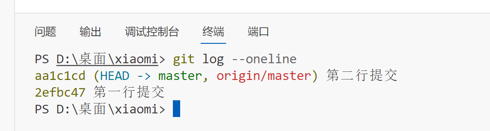
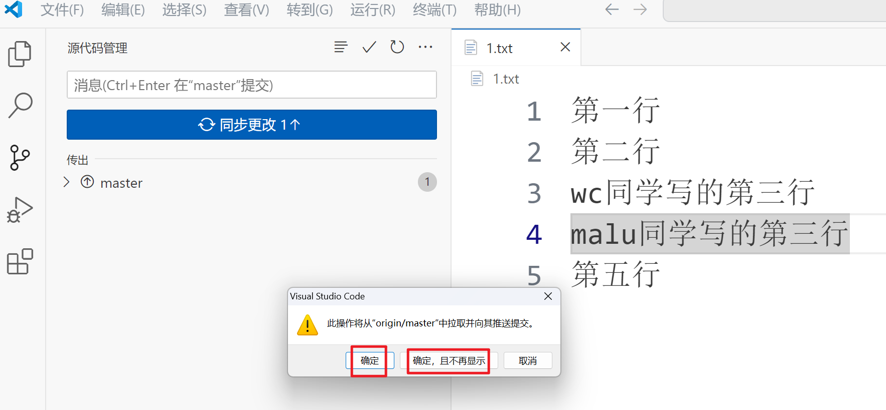
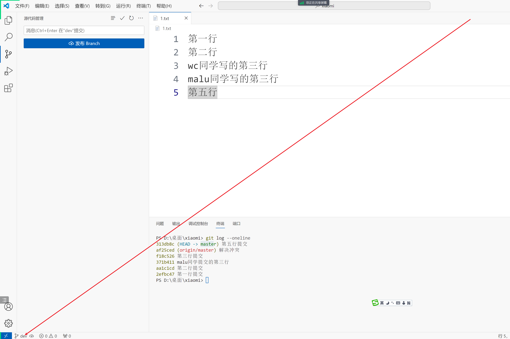
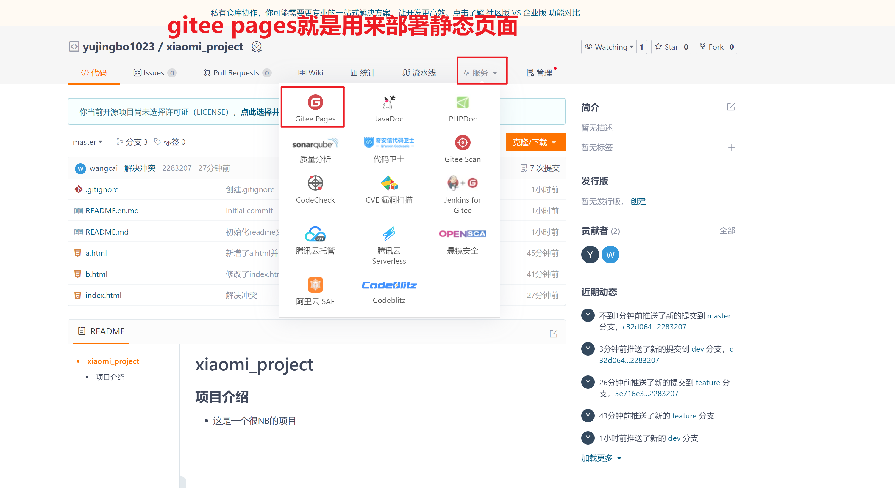
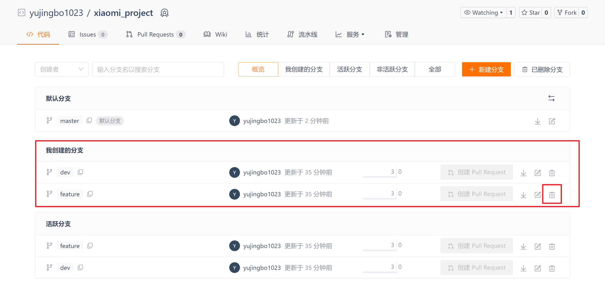

## 一，vscode使用git

### 1，初始化本地仓库

创建一个文件夹，充当项目：

使用vscode打开文件夹：

初始化本地仓库：

### 2，提交版本

在工作区添加文件，在文件中写代码：

点击git按钮，如下：

点击 + 号将新增的文件放入暂存区，实现跟踪

提交暂存区的更改：

同时也可以使用命令：

### 3，添加远程仓库

创建一个远程仓库：

在vsode中添加远程仓库，说白了，就是让本地仓库和远程仓库进行关联：

现在本地仓库的版本：

推送到远程仓库：

查看远程仓库：

### 4，撤销本地修改

假设编辑了2.txt文件，但是修改不想要了

此时，就可以撤销本地修改：

如果在1.txt中写了一此内容，不想要了：

此时去撤销修改：

### 5，取消暂存

写一些代码：

点击取消暂存：

### 6，撤销提交（版本回退）

先生成一个版本：

撤销上次提交，说白了，就是回到上一个版本：

先点击取消暂存：

再点击放弃本地修改，恢复工作区：

### 7，拉取代码（合并冲突）

现在的本地仓库：

推送到远程仓库：

查看远程仓库：

他人也修改了这个文件并且推送到了远程仓库。模拟如下：

本地仓库也提交第三个版本：

现在的问题是，本地仓库的代码是否推送成功到远程仓库呢？答：不能。测试：

推送失败，在我们推送到远程仓库之前，首先拉取

拉取时，冲突了：

暂存合并后的更改：

重新推送：

看远程仓库：

### 8，同步

再提交一个版本：

现在又形成一个版本，如下：

现在看vscode会多一个同步按钮，同步就是拉取跟推送的综合操作。

看远程仓库：

因为同步是先拉取再推送，也就意味着，在点击同步时，可能会有冲突，如果有冲突，需要解决冲突，再次提交，最后再同步就OK了。

### 9，新建分支

当前处于的分支：

创建一个新分支：

创建完后，它会自动切换到此分支：

接下来的开发，都相当于在dev分支上开发，新建一个index.html，并提交：

### 10，合并分支

先切换到master分支：

选择合并分支：

### 11，将分支推送到远程仓库

要把哪个分支推送到远程仓库，需要先切换到这个分支，推送如下：

看远程仓库：

### 12，删除分支

注意：

- 删除分支时，需要先切换到其它分支

## 二，git工作流程

### 1，创建远程仓库

### 2，初始化项目

假定项目的组长初始化项目的基本结构，如下：

### 3，创建分支dev(和master分支平行)

### 4，分配任务给程序员

分配开发任务给两个开发者，一个是wc，一个是xq。

上面两个开发者，需要克隆项目到本地：

也可以使用vscode去克隆：

### 5，创建分支

创建本地分支dev，通过远程分支origin/dev创建本地分支dev，如下：

基于dev分支，创建功能分支feature：

### 6，开始开发

进行开发工作，添加、编辑、删除文件，提交到本地仓库。wc修改index.html

wc新增a.html

xq修改index.html

xq新增b.html

wc提交到本地仓库，推送到远程仓库：

看一下远程仓库：

xq提交到本地仓库，推送到远程仓库：

分析：

因为xq的feature分支是本地分支，没有推送到远程仓库，也不是从远程仓库签出的，所以本地分支没有跟踪远程分支，所以有如下提示：

所以不能点击拉取，要点击拉取自，如下：

有冲突了，如下：

手动合并代码：

暂存合并后的更新，并提交

重新发布：

看远程仓库：

此时，wc要获取最新的代码：

### 7，合并分支

前面的开发都是在feature分支上开发的，wc负责合并分支，把feature分支合并到dev分支上。在合并之前，需要保证代码是最新版本，需要先拉取：

wc先切到dev分支：

合并分支：

合并完成后，同步到远程仓库：

看远程仓库的dev分支：

最终将dev分支合并到master分支上，用来项目上线，流程：

- 切换到master分支
- 合并dev分支到master分支
- 同步master分支

### 8，项目上线

部署需要等待几分钟：

访问之：

设置编码：

重新部署，再次访问：

### 9，删除分支

