## 一，Linux操作系统介绍


### 1，计算机介绍

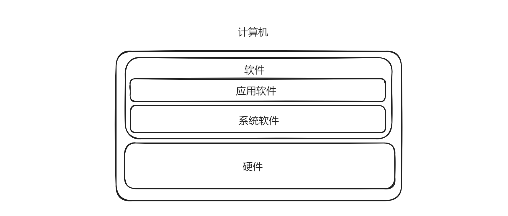


硬件：

- 计算机硬件是指计算机系统中所有物理部件的总称。包括计算机主机、显示器、键盘、鼠标、内存、硬盘、处理器、主板等等。这些硬件部件是计算机系统运行的基础
- 计算机硬件就像人体的骨骼和肌肉，是支撑和运行计算机系统的基础。


软件(应用软件)：

- 计算机软件则是指计算机系统中的各种程序和数据。包括操作系统、应用程序、编程语言、数据库、游戏等等
  软件是由程序员编写的指令和代码组成的，它们可以被计算机硬件读取和执行
- 用户通过软件与计算机进行交流！
- 计算机软件就像人的大脑和思维，控制和指挥计算机硬件进行各种运算和操作


操作系统（系统软件）：

 

- 操作系统是计算机软件的一种，它主要负责：作为用户和计算机硬件之间的桥梁，调度和管理计算机硬件进行工作
- 作用1：控制硬盘保存数据
- 作用2：控制显卡输出图形数据到显示器
- 作用3：控制音响播放音乐
- 作用4：控制网卡传输数据
- ....


### 2，Linux系统介绍


​	Linux由一个名为林纳斯 托瓦兹(Linus Torvalds)的年轻芬兰大学生带头开发的作业系统。1991 年的十月，当初网际网路还不像现在这么普遍，上网的人大部分都隶属于一些研究机构，或者是大学里面的学生、教授，1991年10月5日, 上午11时53分，有一个名为 Linus Torvalds 的年轻芬兰大学生在comp.os.minix 这个新闻群组上发表了这样一个帖子，它标志着Linux诞生了。这个 Linus 的兴趣就是 Linux 核心程式 0.02 版的原始码，当初还是个大学生的 Linus 大概完全没想到当初被他视为个人兴趣的程式，在几年以後会有超过千万个使用者，由他自己带头开发的作业系统现在已经在世界各地受到普遍的欢迎，还被视为是软体业巨人微软公司大力促销的 NT 系统最大的竞争对手。


**Linux系统的组成：**

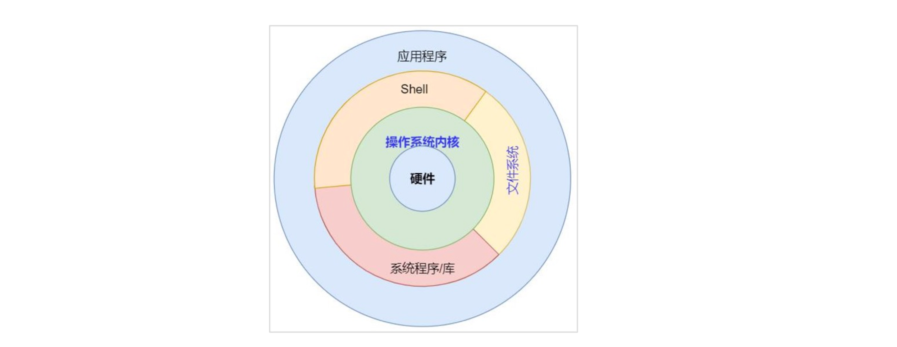

- Linux内核
  - Linux内核是 Linux 操作系统主要组件，也是计算机硬件与其软件之间的交互入口。它负责两者之间的通信，还要尽可能高效地管理资源。内核是Linux操作系统最核心的所在，系统级应用程序只是锦上添花
- Linux Shell
  - shell是系统的用户界面，提供了用户与内核进行交互操作的一种接口
- Linux文件系统
  - 文件系统是文件存放在磁盘等存储设备上的组织方法
- Linux应用程序
  - 标准的Linux系统一般都有一套都有称为应用程序的程序集，它包括文本编辑器、编程语言、办公套件等


### 3，Linux系统发行版

**Linux的发行版：**

​	Linux内核是免费开源的，任何人都可以下载内核源码并查看且修改。并且自行集成系统级程序提供了内核+系统级程序的完整封装，称之为Linux发行版。内核下载网址：https://www.kernel.org

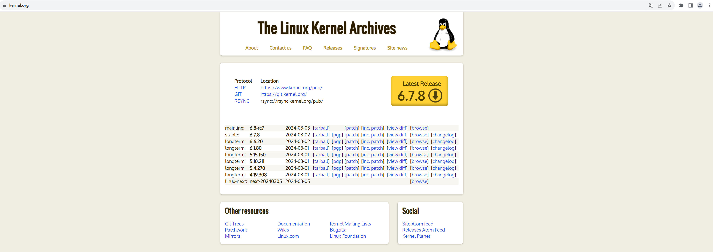


发行版：

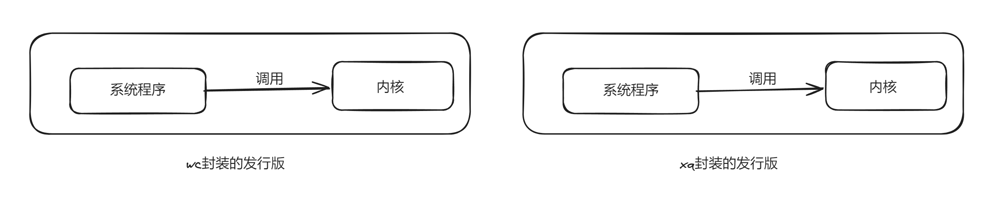


因为任何人都可以封装Linux，所以目前市面上由非常多的Linux发行版，常用的、知名的如下：


- Redhat

- CentOS

- Ubuntu

- debian

- dedora
- deepin
- 中标麒麟
- ...


注意：

- 不同的发行版：基础命令90%是相同的，部分操作不同（如软件安装）
- 不用纠结选择什么发行版，不论用什么发行版，都是Linux，学到的东西都是通用的


### 4，购买云服务器

有很多的云平台：

- 阿里云
- 百度云
- 腾讯云
- 华为云
- JD云
- .....


操作流程：


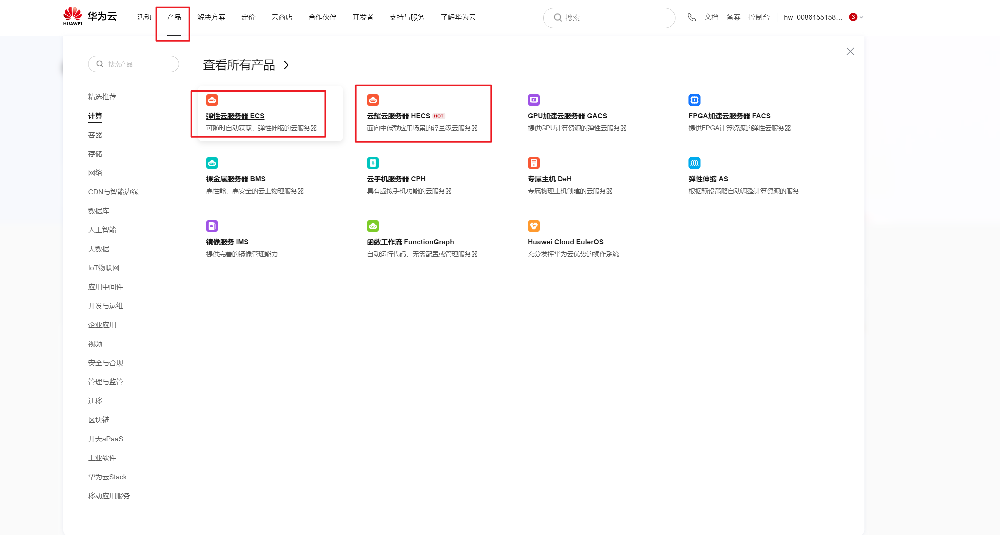


大家只需要买一个月的就行。买完后，如下：


接下来，就以京东云为例，来演示。打开京东云：


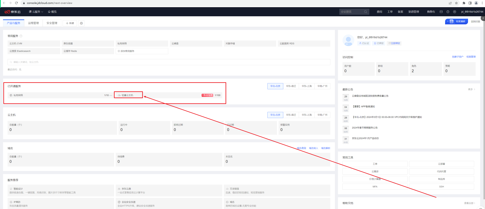


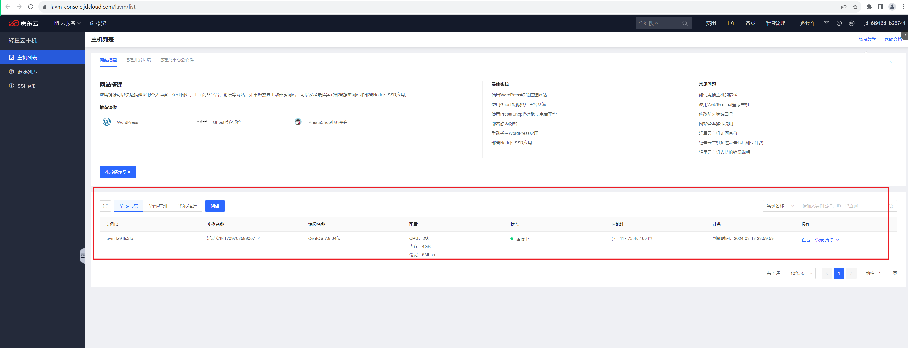


连接服务器：

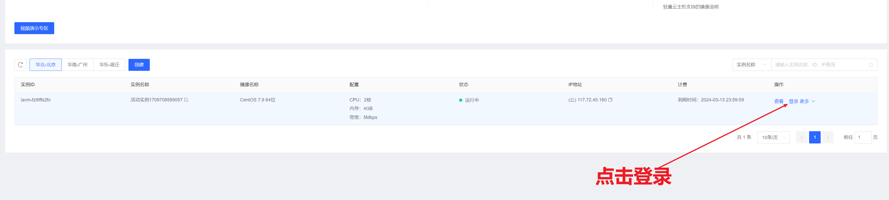

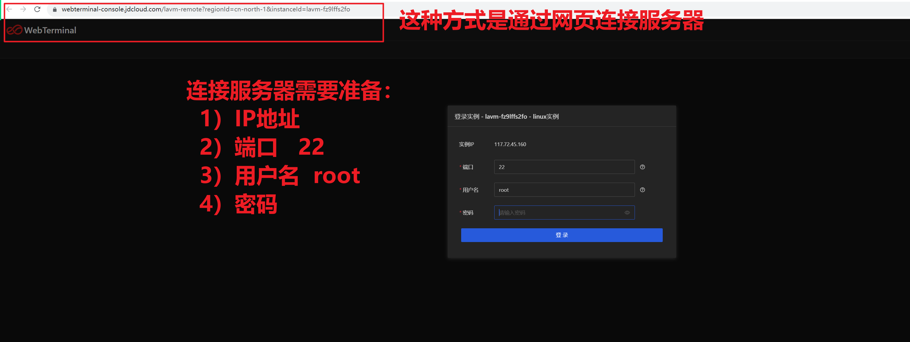

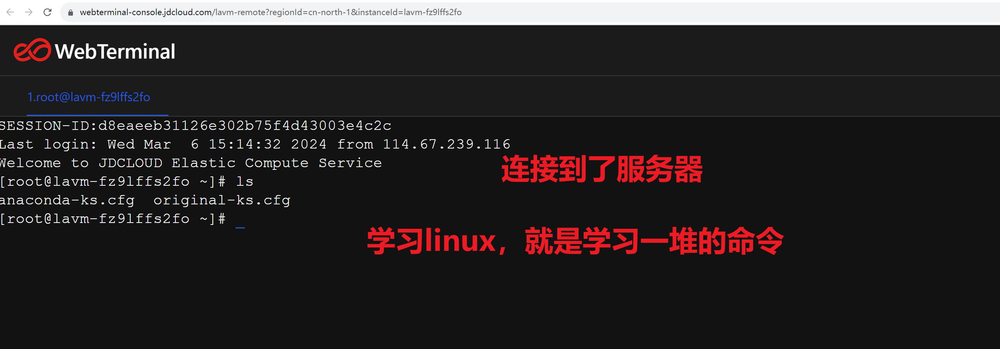


### 5，Shell链接工具

对于操作系统的使用，无论是Windows、MacOS或者Linux都有2种使用方式：

- 图形化页面
- 命令的形式


​	图形化一般是大多数人使用计算机的第一选择，但是在Linux操作系统上。无论是企业开发亦或是个人开发，使用Linux操作系统，多数都是使用的：命令行！！！

- 在图形化页面的优化上，并不是很出色(有时出现在bug，甚至会卡死)
- 图形化也是消耗资源，做为服务器，又不是经常操作
- 命令有时比图形化界面更加快捷


​	在网上有很多Shell工具，甚至我们可以使用，比如说，MobaXterm、XShell、FinalShell等在这，我们推荐MobaXterm，功能全，安装容易。


解压此软件：

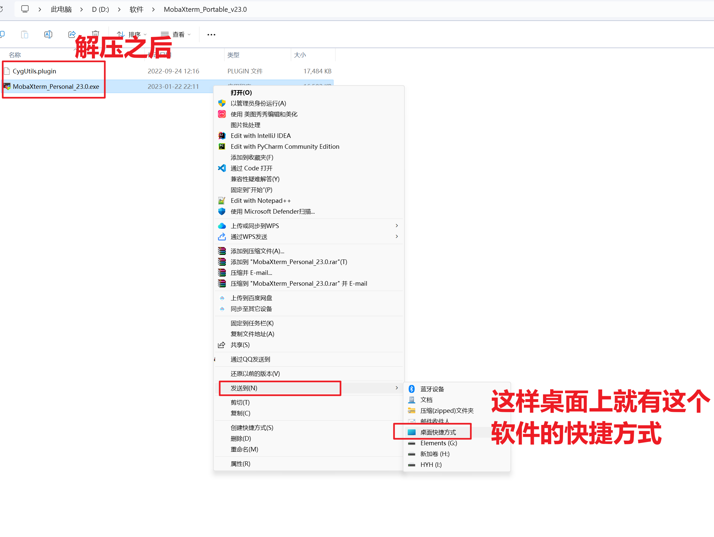


打开软件：


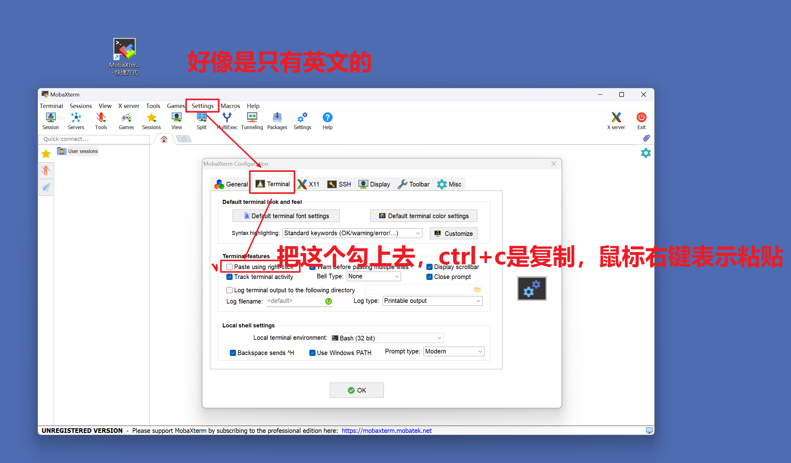


使用上面的软件连接服务器：

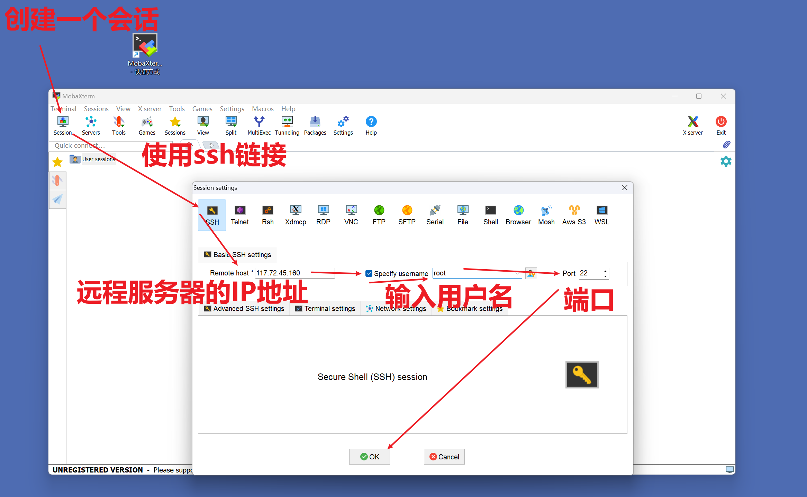

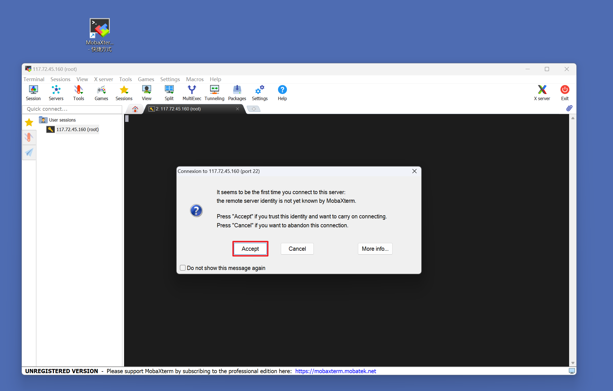

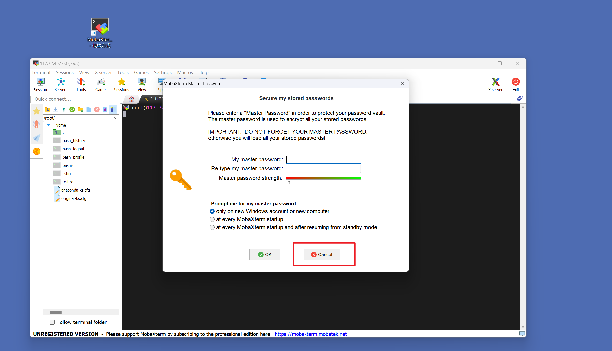


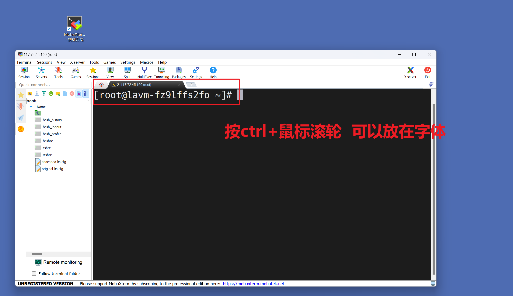


## 二，Linux基础命令


### 1，Linux目录结构

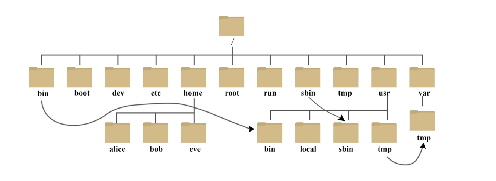


查看之：

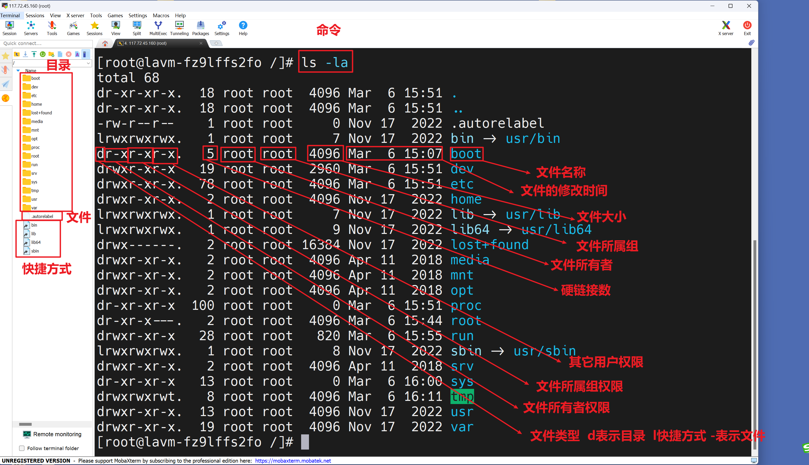


**系统启动相关：**

- /boot：存放的启动Linux 时使用的内核文件，包括连接文件以及镜像文件。
- /etc：存放所有的系统需要的配置文件和子目录列表，更改目录下的文件可能会导致系统不能启动。
- /lib：存放基本代码库（比如c++库），其作用类似于Windows里的DLL文件。几乎所有的应用程序都需要用到这些共享库。
- /sys： 这是linux2.6内核的一个很大的变化。该目录下安装了2.6内核中新出现的一个文件系统sysfs 。sysfs文件系统集成了下面3种文件系统的信息：针对进程信息的proc文件系统、针对设备的devfs文件系统以及针对伪终端的devpts文件系统。该文件系统是内核设备树的一个直观反映。当一个内核对象被创建的时候，对应的文件和目录也在内核对象子系统中


**指令集合相关：**

- /bin：存放着最常用的程序和指令
- /sbin：只有系统管理员能使用的程序和指令。


**外部文件管理相关：**

- /dev ：Device(设备)的缩写, 存放的是Linux的外部设备。注意：在Linux中访问设备和访问文件的方式是相同的。
- /media：类windows的其他设备，例如U盘、光驱等等，识别后linux会把设备放到这个目录下。
- /mnt：临时挂载别的文件系统的，我们可以将光驱挂载在/mnt/上，然后进入该目录就可以查看光驱里的内容了。


**临时文件相关：**

- /run：是一个临时文件系统，存储系统启动以来的信息。当系统重启时，这个目录下的文件应该被删掉或清除。如果你的系统上有 /var/run 目录，应该让它指向 run。
- /lost+found：一般情况下为空的，系统非法关机后，这里就存放一些文件。
- /tmp：这个目录是用来存放一些临时文件的。


**账户相关：**

- /root：系统管理员的用户主目录。
- /home：用户的主目录，以用户的账号命名的。
- /usr：用户的很多应用程序和文件都放在这个目录下，类似于windows下的program files目录。
- /usr/bin：系统用户使用的应用程序与指令
- /usr/sbin：超级用户使用的比较高级的管理程序和系统守护程序。
- /usr/src：内核源代码默认的放置目录。


**运行过程中要用：**

- /var：存放经常修改的数据，比如程序运行的日志文件（/var/log 目录下）。
- /proc：管理内存空间！虚拟的目录，是系统内存的映射，我们可以直接访问这个目录来，获取系统信息。这个目录的内容不在硬盘上而是在内存里，我们也可以直接修改里面的某些文件来做修改。


**扩展用的：**

- /opt：默认是空的，我们安装额外软件可以放在这个里面。
- /srv：存放服务启动后需要提取的数据（不用服务器就是空）


**特殊的：**

- . ：代表当前的目录，也可以使用 ./ 来表示；
- .. ：代表上一层目录，也可以 ../ 来代表;
- ~ : 代表登录用户的家目录
  - root: /root
  - user: /home/user
- / : 代表系统的根目录


为了保证我们可以正确的找到自己想要的文件夹或文件，我们需要了解2个概念：绝对路径与相对路径

- 绝对路径：路径的写法，由根目录 / 写起，例如： /etc/ssh 这个目录
- 相对路径：路径的写法，不是由 / 写起，例如由 /etc/ssh 要到 /etc/ssl 底下时，可以写成： cd ../ssl 这就是相对路径的写法


### 2，Linux命令格式与ls命令

在Linux中，无论是什么命令，有什么用途，命令都有通用的格式：

```
command [-options] [parameter]
```

- command： 命令本身
- options：[可选，非必填] 命令的一些选项，可以通过选项控制命令的行为细节
- parameter：[可选，非必填] 命令的参数值

细节：三者之间要有空格，区分大小写


ls命令：ls命令用于显示指定工作目录下内容，语法细节如下

```
ls [-alrtAFR] [name...]
```


参数：

- -a 显示所有文件及目录 (. 开头的隐藏文件也会列出)
- -d 只列出目录（不递归列出目录内的文件）
- -l 以长格式显示文件和目录信息，包括权限、所有者、大小、创建时间等。
- -r 倒序显示文件和目录。
- -t 将按照修改时间排序，最新的文件在最前面。
- -A 同 -a ，但不列出 "." (目前目录) 及 ".." (父目录)
- -F 在列出的文件名称后加一符号；例如可执行档则加 "*", 目录则加 "/"
- -R 递归显示目录中的所有文件和子目录。


演示：

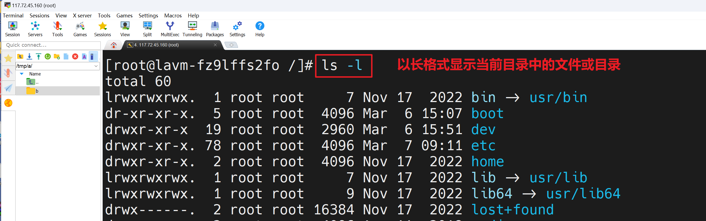

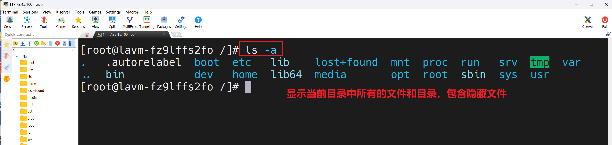

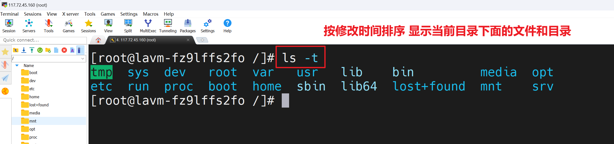

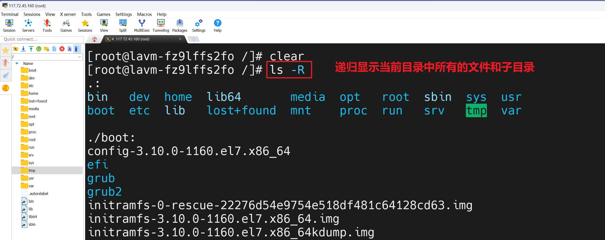

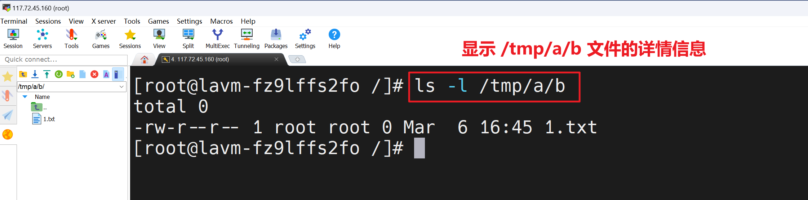

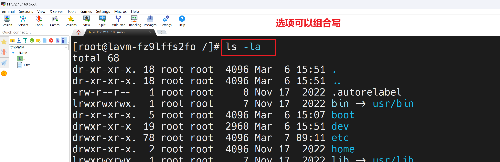

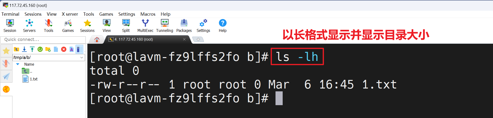


获取命令的帮助的方式：

- 搜索引擎
- 查手册
- --help参数
- man命令


--help参数的使用：

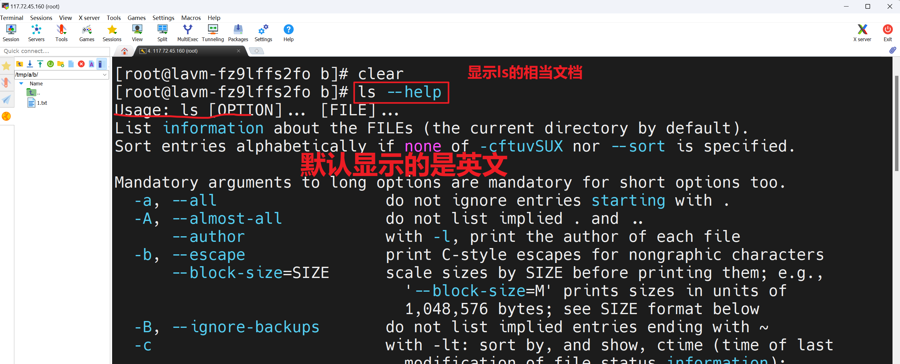


设置成中文件，参考：https://blog.csdn.net/liu_chen_yang/article/details/131515195


### 3，man，cd与pwd

#### a）man

man命令，要查看命令的详细手册,man(manual手册),语法如下：

```
man command
```

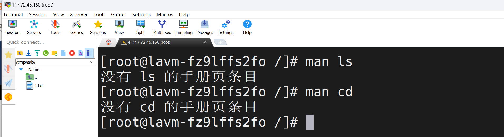


解决：

```
yum install -y man man-pages man-pages-overrides
```

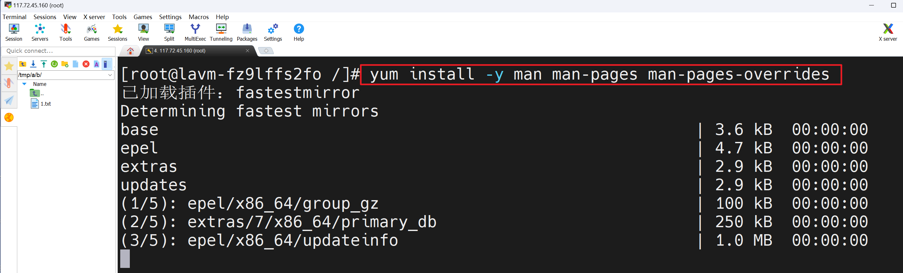


再次测试：

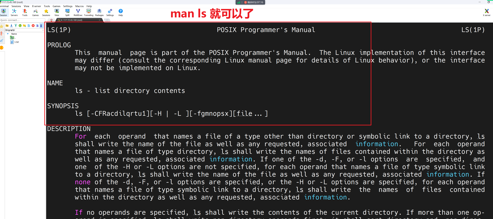


默认显示的是英文。如果想要改成中文，需要系统是中文的，具体命令是如下：

```
echo $LANG
```


修改成中文：

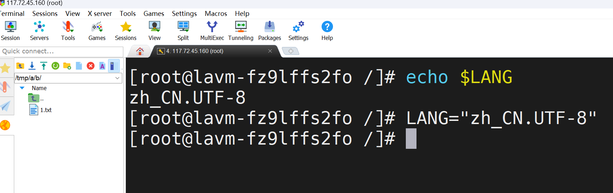


上面修改方式是临时的，重启后，会还原原来的样子。要想永久有效，需要修改 /etc/locale.conf 文件，设置内容为 LANG=zh_CN.UTF-8


如果没有中文件包，安装中文件包：

```
yum install man-pages-zh-CN -y
```

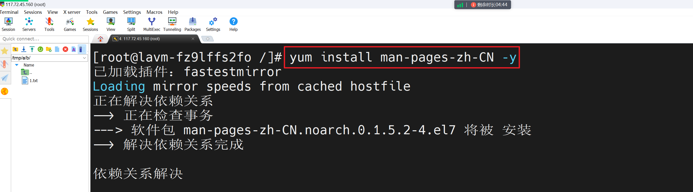


测试之：

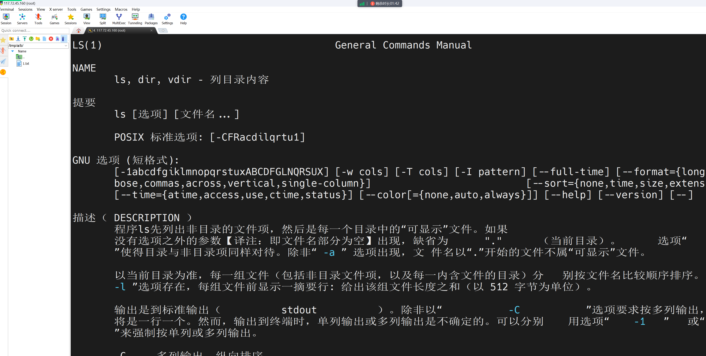


命令的使用：

- j/enter 向下一行
- k 向上一行
- f/空格/PG Down 按页向下翻
- b/Page UP 向上翻页
- p 直接翻到首页
- 查找按/要查找的内容
- n 查找下一个
- N 上一个
- q 退出


man命令后可以有一个数字，它可以帮助我们了解或者是直接查询相关的资料

```
man [数字][参数]
```


数字：

- 1 用户命令（/bin，/usr/bin，/usr/local/bin）
- 2 系统调用
- 3 库函数
- 4 特殊文件（设备文件）
- 5 文件格式（配置文件的语法）
- 6 游戏
- 7 杂项（Miscellaneous）
- 8 管理命令（/sbin，/usr/sbin，/usr/local/sbin）


#### b）cd

当Linux终端（命令行）打开的时候，会默认以用户的HOME目录作为当前的工作目录。我们可以通过cd命令，更改当前所在的工作目录。cd (change directory): 切换目录, 用来变换工作目录的命令

```
cd [路径]
```


演示：

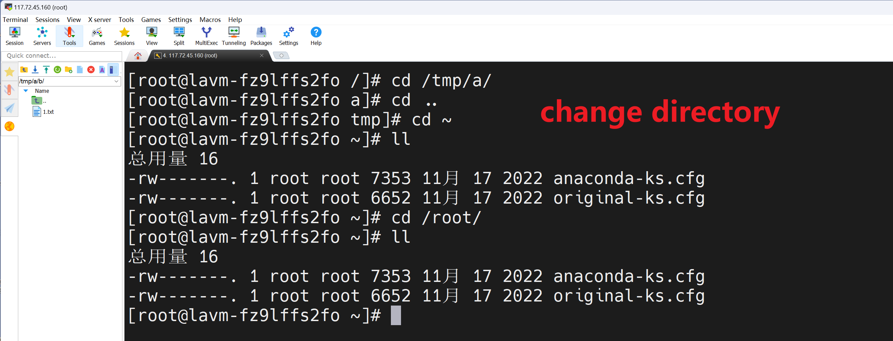


#### c）pwd

pwd (print work directory):显示目前所在目录的命令

```
pwd [-P]
```

- -p 会不以链接档的数据显示，而是显示正确的完整路径

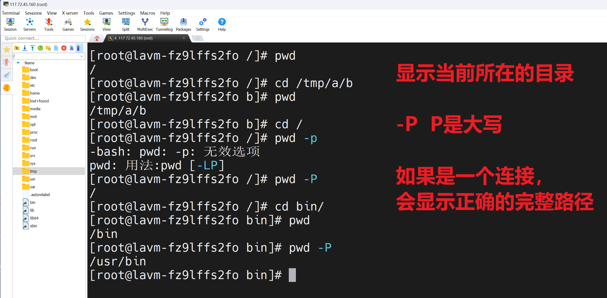


### 4，mkdir和rmdir

#### a）mkdir

mkdir(make directory)：创建一个新的目录

```
mkdir [-p] 目录名称
```

- -p ：直接将所需要的目录(包含上一级目录)递归创建起来


演示：

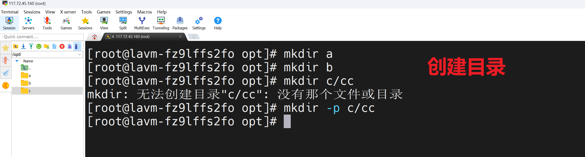


#### b）rmdir

rmdir(remove directory)：删除一个空的目录

```
rmdir [-p] 目录名称
```

-p ：从该目录起，一次删除多级空目录,把路径写全


演示：

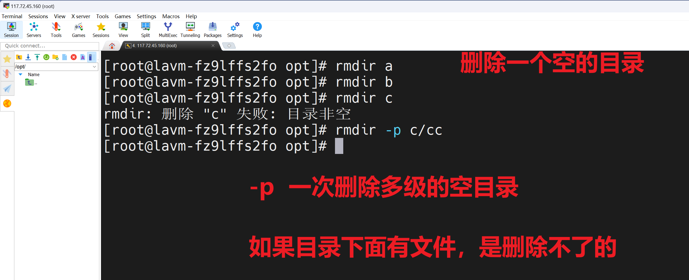


### 5，cat，tac，more，less，head，tail


#### a）cat

cat由第一行开始显示文件内容，格式：

```
cat [-AbEnTv]
```

选项：

- -A ：相当于 -vET 的整合选项，可列出一些特殊字符而不是空白而已；
- -b ：列出行号，仅针对非空白行做行号显示，空白行不标行号！
- -E ：将结尾的断行字节 $ 显示出来；
- -n ：列出行号，连同空白行也会有行号，与 -b 的选项不同；
- -T ：将 [tab] 按键以 ^I 显示出来；
- -v ：列出一些看不出来的特殊字符


演示：

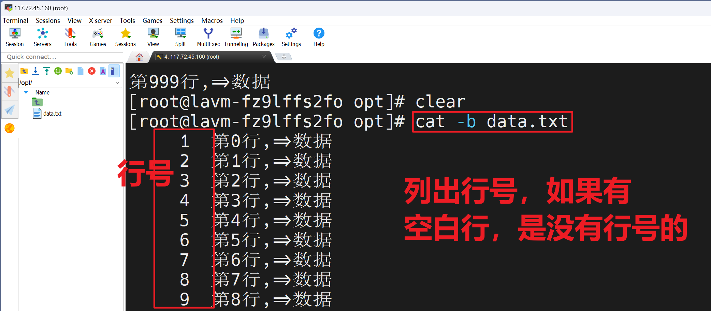

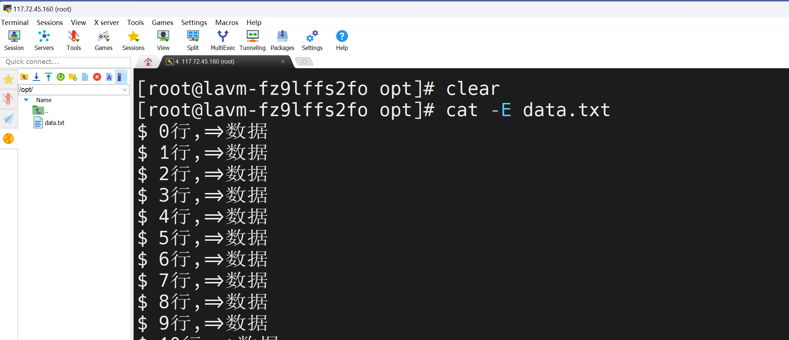

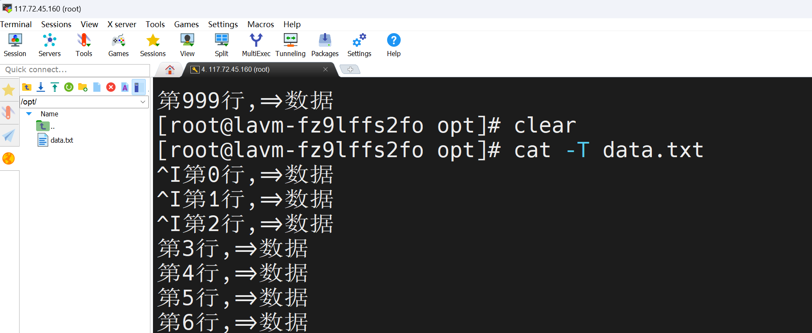


#### b）tac

tac与cat命令刚好相反，文件内容从最后一行开始显示。演示：

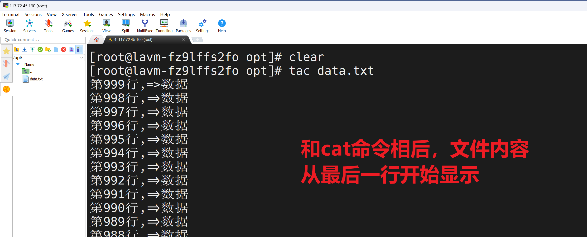


#### c）more

一页一页翻动，看完就结束了，自动退出

```
more data.txt
```


按键可以按的：

- 空白键 (space) ：代表向下翻一页
- Enter ：代表向下翻『一行』
- /字串 ：代表在这个显示的内容当中，向下搜寻『字串』这个关键字
- q ：代表立刻离开 more ，不再显示该文件内容
- b ：代表往回翻页


演示：


#### d）less

一页一页翻动，看完还可以回翻。


按键可以按的：

- 空白键 ：向下翻动一页；
- pagedown ：向下翻动一页；
- pageup ：向上翻动一页；
- /字串 ：向下搜寻『字串』的功能；
- ?字串 ：向上搜寻『字串』的功能；
- n ：重复前一个搜寻 (与 / 或 ? 有关！)
- N ：反向的重复前一个搜寻 (与 / 或 ? 有关！)
- q ：离开 less 这个程序；


演示：

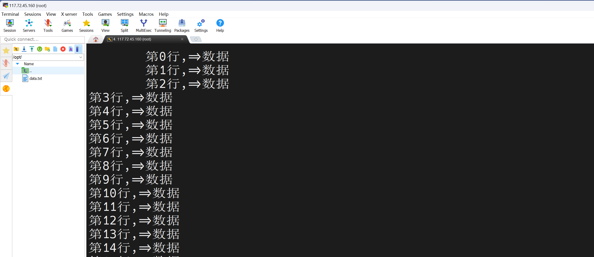


#### e）head

取出文件前面几行，默认是显示前10行。

```
head [-n number] data.txt
```

- -n ：后面接数字，代表显示几行的意思


演示：

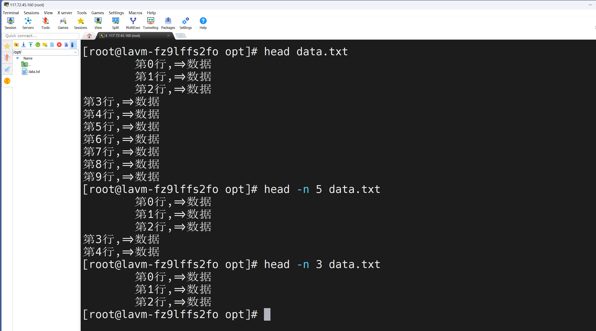


#### f）tail

取出文件的后几行

```
tail [-n number] data.txt
```

- -n ：后面接数字，代表显示几行的意思
- -f ：表示持续侦测后面所接的档名，要等到按下ctrl + c 才会结束tail的侦测


演示：

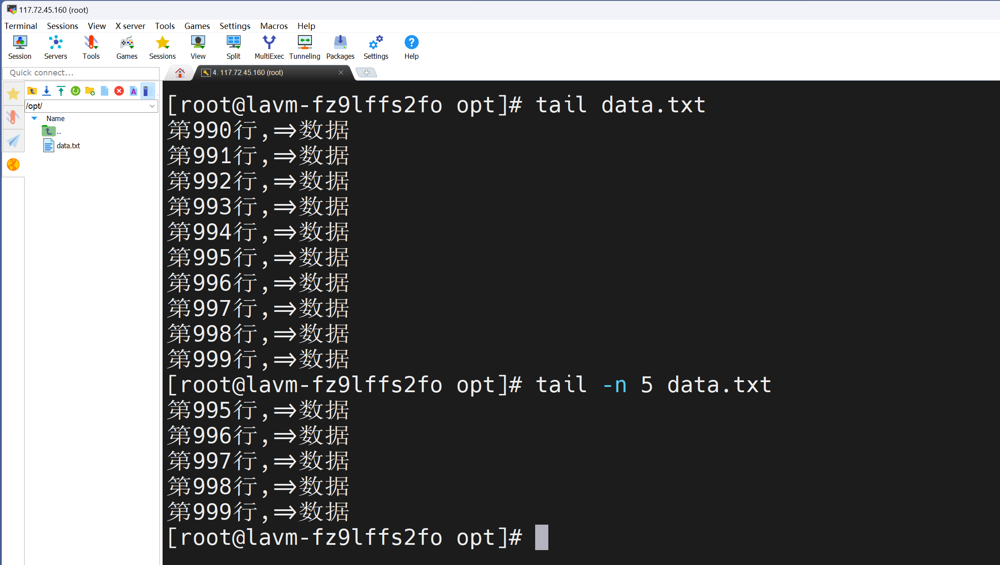


持续侦测后面所接的档名，如下：

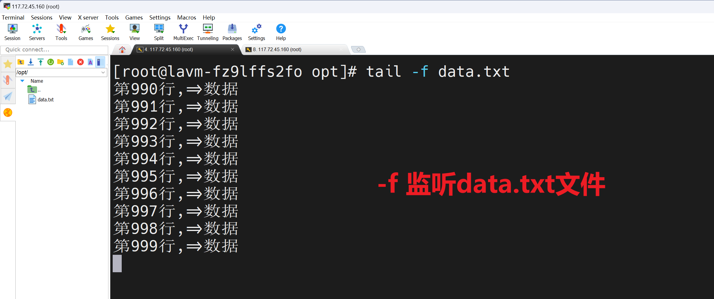

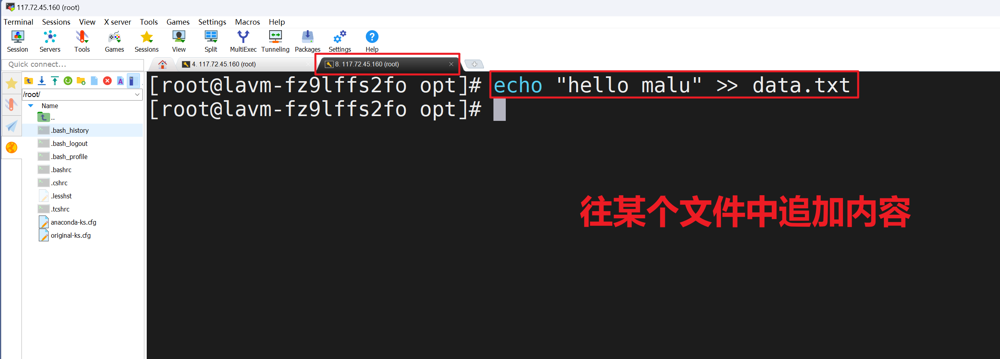


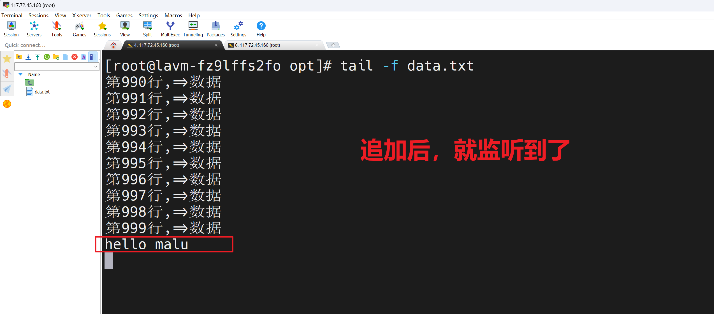


### 6，cp，mv，rm


#### a）cp

cp(copy) 即拷贝文件和目录

```
cp [-adfilprsu] source destination
```


选项：

- -a：相当于 -pdr 的意思，至于 pdr 请参考下列说明；(常用)
- -d：若来源档为链接档的属性(link file)，则复制链接档属性而非文件本身；
- -f：为强制(force)的意思，若目标文件已经存在且无法开启，则移除后再尝试一次；
- -i：若目标档(destination)已经存在时，在覆盖时会先询问动作的进行(常用)
- -l：进行硬式链接(hard link)的链接档创建，而非复制文件本身；
- -p：连同文件的属性一起复制过去，而非使用默认属性(备份常用)；
- -r：递归持续复制，用于目录的复制行为；(常用)
- -s：复制成为符号链接档 (symbolic link)，亦即『捷径』文件
- -n:  代表完全取消覆盖。使用此选项时目标文件不会被覆盖。


cp的基本演示：

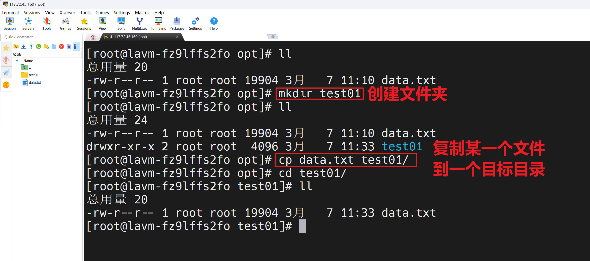


在复制文件时同时重命名，这有点类似于文本编辑器中的“另存为”选项：

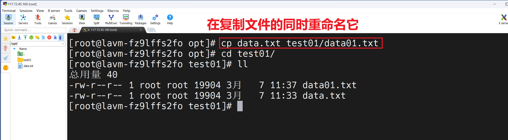


复制多个文件：

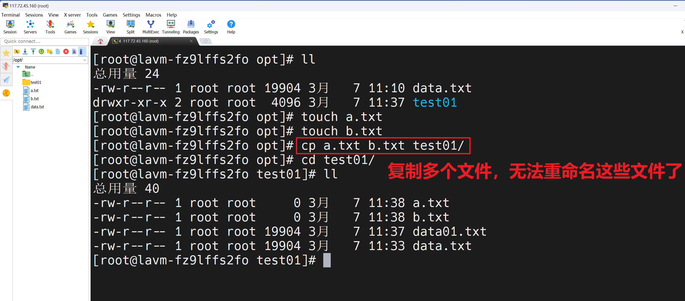


还可以使用通配符扩展，将特定后缀的文件复制到另一个位置：

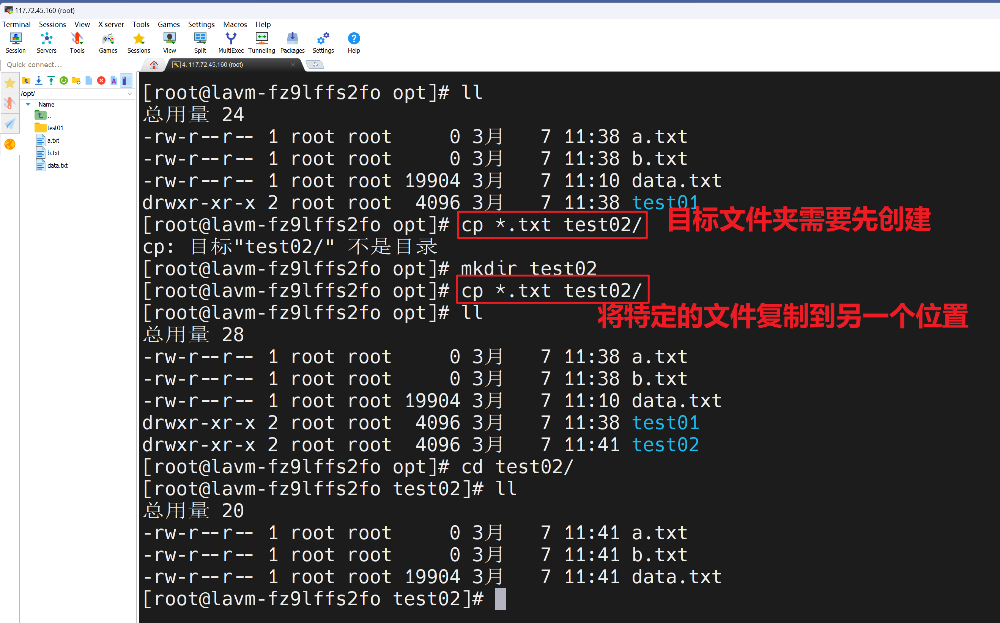


在复制文件时，避免覆盖现有的文件：


复制目录：


也可以复制多个目录：


在复制时保留属性，当你将文件复制到另一个位置时，它的 时间戳、文件权限甚至所有权都会发生变化。这是正常的行为。但在某些情况下，你可能希望在复制文件时保留其原始属性。使用-p。


#### b）mv

mv(move) 移动文件与目录，或修改名称

```
mv [-fiu] 源文件/夹 目录文件/夹
```


选项：

- -f ：force 强制的意思，如果目标文件已经存在，不会询问而直接覆盖；
- -i ：若目标文件 (destination) 已经存在时，就会询问是否覆盖！
- -u ：若目标文件已经存在，且 source 比较新，才会升级 (update)


重命名文件，即将文件重命名为一个新的文件名


把某个目录下面的文件重命名：


也可以写绝对路径：


移动一个文件：


移动时，也可以使用绝对路径：


移动目录：


#### c）rm

rm (remove) 移除文件或目录 

```
rm [-fir] 文件或目录
```


选项：

- -f ：就是 force 的意思，忽略不存在的文件，不会出现警告信息；
- -i ：互动模式，在删除前会询问使用者是否动作
- -r ：递归删除，最常用在目录的删除了！这是非常危险的选项！！！
- -v ：显示步骤


注意：

- 千万不要用root管理员用户执行：rm -rf / ，效果等同于在Windows上执行C盘格式化


删除某个文件：


强制删除：


删除所有后缀是.mp4的文件，配合通配符


删除所以a开头的文件：


显示步骤：


同步删除多个文件：


删除隐藏文件：


删除目录：


强制删除目录：


只删除空目录，非空目录就跳过，不会删除：


#### d）通配符

符号* 表示通配符，即匹配任意内容（包含空）

```
temp*，表示匹配任何以temp开头的内容
*temp，表示匹配任何以temp结尾的内容
*temp*，表示匹配任何包含temp的内容
```


### 7，which和find

#### a）which

什么是可执行程序：


通过命令，就可以把可执行程序运行起来：


Linux命令，其实它们的本体就是一个个的二进制可执行程序，which命令用于查找命令文件,在哪个目录

```
which 命令
```

演示：


#### b）find

在Linux系统中，我们可以通过find命令去搜索指定的文件

```
find 搜索的路径 -name "被查找的文件名"
```


演示：


### 8，grep，wc和管道符


#### a）grep

grep (global regular expression print)是一种常用的文本搜索工具。用于在文本或文件中查找特定的字符串

```
grep [-abcEFGhHilLnqrsvVwxy] pattern files
```

pattern表示要查找的字符串或正则表达式，files - 表示要查找的文件名，可以同时查找多个文件。


选项：

- -i：忽略大小写进行匹配。
- -v：反向查找，只打印不匹配的行。
- -n：显示匹配行的行号。
- -r：递归查找子目录中的文件。
- -l：只打印匹配的文件名。
- -c：只打印匹配的行数。


准备一个文件：

```
I aaam teacher
I aaaaaam student
I like Linux
I like JAVA
Hello World
世界，你好!
 
12312434
324828
fdjsoifjidosa
joijofids.
joijiodsf.
 
#jidfjisoaf
#fjidsfoijsdaifo
```


从data.txt文件中搜索包含”L”字符的行，则可以使用如下命令


输出以 I 开头的行(不区分大小写)


"-B”选项，显示符合条件的行之前的行，"B"有before之意，示例如下


与"-B"选项对应的选项是"-A"选项，"-B"有Before之意，"-A"有After之意，"-A"代表显示符合条件的行的同时，还要显示之后的行，"-A3"表示同时显示符合条件的行之后的3行。


说了"-A"，说了"-B"，现在说说"-C"，"-C"选项可以理解为"-A"与"-B"的结合，"-C"选项表示在显示符合条件的行的同时，也会显示其前后的行，如"-C1"，"-C1"表示打印符合条件的行的同时，也打印出之前的一行与之后的一行


#### b）wc

wc命令可以计算文件的Byte数、字数、或是列数

```
wc [-clw][--help][--version][文件...]
```


选项：

- -c/--bytes或-m/--chars 只显示Bytes数。
- -l或--lines 显示行数。
- -w或--words 只显示字数。
- --help 在线帮助。
- --version 显示版本信息。


#### c）管道符 |

管道符号 | 通过将前一个命令的输出直接传递给后一个命令作为输入，从而构建起用于多个命令的连接方式


在当前目录下查找所有以 .txt 结尾的文件名并输出到终端的功能


列出目录 /etc 中以 pass 开头的文件或目录名


查看当前目录下文件 data1.txt ，将结果传递来 grep 过滤出包含66 ，将结果传递来 grep 过滤出包含 1 的数据


应用场景：

- 数据处理：Linux管道符可以方便地用于对文件或文本进行处理
- 系统管理：Linux系统管理员经常使用管道符来执行多个命令以达到管理系统的目的
- 网络通信：在网络编程领域，管道符也被广泛应用

### 9，touch，echo的使用


#### a）touch

touch 命令在 Linux 操作系统中用于创建文件或修改文件的时间戳如果指定的文件不存在，则会创建一个新的空白文件

```
touch 文件路径
```


创建新文件，创建名为 file.txt 的新文件


更改文件时间戳，更新名为 file.txt 文件的修改时间戳


创建多个文件，创建三个名为 file1.txt 、 file2.txt 和 file3.txt 的文件


#### b）echo

echo 用于在终端上输出一些文本信息

```
echo [option] string
```

输出字符串（最基本的用法），在终端上输出 Hello, Linux! 字符串


显示 Shell变量，命令将在终端上输出 Hello, Linux! 。


输出到文件，可以使用重定向符号 > 将 echo 命令的输出保存到一个文件中,将Hello,Linux! 并将其保存到一个名为 myfile.txt 的文件中


### 10，重定向符

在 Linux 中，重定向符用于将命令的输入或输出重定向到指定的文件、设备或管道中。重定向符包括 `> , < , >> , << `等符号。


将命令的标准输出重定向到一个文件中，例如：


这个命令将列出当前目录下的文件，并将结果输出到一个名为 xx.txt的文件中。如果该文件不存在，则会创建它；如果存在，则会覆盖原有内容。


将命令的标准输出追加到一个文件中，例如：


这个命令将在 xx.txt 文件的末尾添加一行文本。如果该文件不存在，则会创建它


使用一个文件的内容作为命令的标准输入，例如：


这个命令将读取 data.txt 文件中的内容，并将其传递给 sort 命令，该命令对输入进行排序


将一个字符串作为命令的标准输入，例如：


这个命令将使用 grep 命令来查找包含 hello 字符串的行。字符串 EOF用于指定输入的结束，之间的文本将作为标准输入


重定向符号还可以结合管道符一起使用，例如：

```
ls -l | grep ".txt" > filelist.txt
```


这个命令将列出当前目录下的所有文件，并将其中包含 .txt 字符串的文件名保存到一个名为 filelist.txt 的文件中


### 11，vi，vim编辑器（了解）

​	VI是 "Visual interface" 的简称, 是Linux中最经典的文本编辑器。VI不是一个排版程序，它不象Word或WPS那样可以对字体、格式、段落等其他属性进行编排，它只是一个文本编辑程序。VI没有菜单，只有命令，且命令繁多。

​	VIM 是 VI 的改良版，增加了更多功能和特性，使它成为现代文本编辑器的代表之一VIM 支持多种颜色方案，语法高亮、自动缩进等功能，可以大大提高编程效率。VIM可以兼容多种操作系统。


编辑器的三种模式：


模式（Command mode）

- 命令模式下，所敲的按键编辑器都理解为命令，以命令驱动执行不同的功能此模型下，不能自由进行文本编辑
- 输入模式（Insert mode）也就是所谓的编辑模式、插入模式此模式下，可以对文件内容进行自由编辑
- 末行模式（Last line mode）通常用于文件的保存、退出，此模型下，不能自由进行文本编辑


#### a）打开文件

因为VIM是VI的增强版，因为我们以VIM命令为例，学习VI命令。VIM命令若是没有，可以使用 yum install vim -y 安装。

命令：

- vim filename: 打开文件，并定位第1行
- vim filename +# :打开文件，并定位于第#行
- vim filename +：打开文件，定位至最后一行
- vim filename +/PATTERN : 打开文件，定位至第一次被PATTERN匹配到的行的行首


注意：

- 如果文件路径表示的文件不存在，那么此命令会用于编辑新文件
- 如果文件路径表示的文件存在，那么此命令用于编辑已有文件


打开文件后，默认是命令模式


#### b）输入模式

在命令模式下，可以通过以下按键命令进入编辑模式


#### c）关闭文件

在编辑模式与末行模式通过Esc返回到命令模式


末行模式：


永久增加vim中的行号，可以通过修改 ~/.vimrc 文件，增加代码

```
set number
```


#### d）命令模式


### 12，cut


### 13，sort


### 14，sed


### 15，awk


