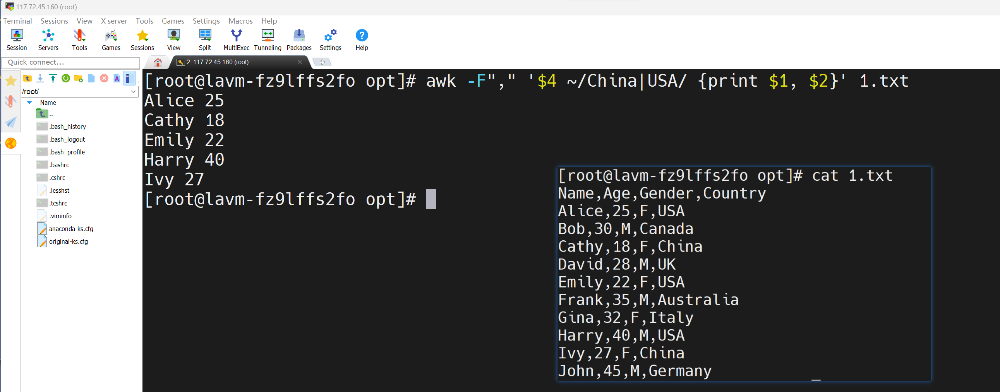
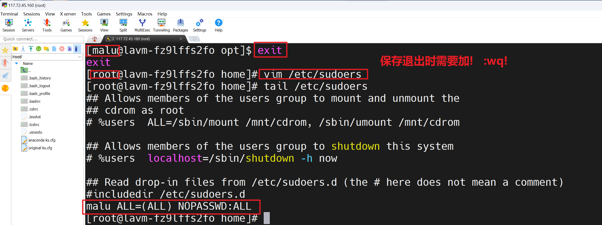
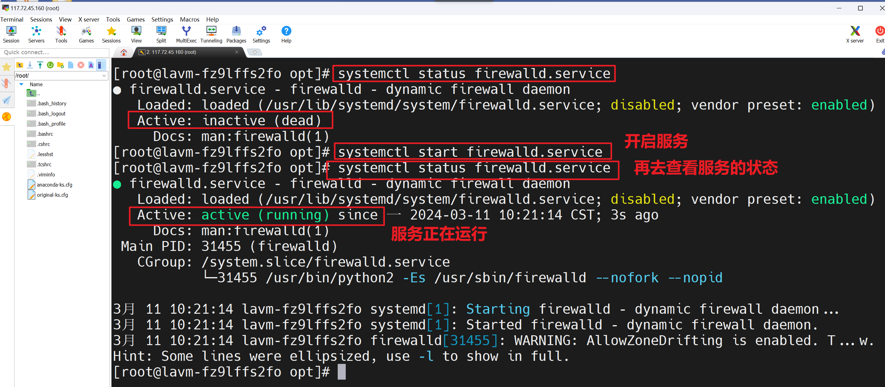

## 一，Linux操作系统介绍


### 1，计算机介绍


硬件：

- 计算机硬件是指计算机系统中所有物理部件的总称。包括计算机主机、显示器、键盘、鼠标、内存、硬盘、处理器、主板等等。这些硬件部件是计算机系统运行的基础
- 计算机硬件就像人体的骨骼和肌肉，是支撑和运行计算机系统的基础。


软件(应用软件)：

- 计算机软件则是指计算机系统中的各种程序和数据。包括操作系统、应用程序、编程语言、数据库、游戏等等
  软件是由程序员编写的指令和代码组成的，它们可以被计算机硬件读取和执行
- 用户通过软件与计算机进行交流！
- 计算机软件就像人的大脑和思维，控制和指挥计算机硬件进行各种运算和操作


操作系统（系统软件）：

 

- 操作系统是计算机软件的一种，它主要负责：作为用户和计算机硬件之间的桥梁，调度和管理计算机硬件进行工作
- 作用1：控制硬盘保存数据
- 作用2：控制显卡输出图形数据到显示器
- 作用3：控制音响播放音乐
- 作用4：控制网卡传输数据
- ....


Linux和windows的区别：目前国内 Linux 更多的是应用于服务器上，而桌面操作系统更多使用的是 Windows。


### 2，Linux系统介绍


​	Linux由一个名为林纳斯 托瓦兹(Linus Torvalds)的年轻芬兰大学生带头开发的作业系统。1991 年的十月，当初网际网路还不像现在这么普遍，上网的人大部分都隶属于一些研究机构，或者是大学里面的学生、教授，1991年10月5日, 上午11时53分，有一个名为 Linus Torvalds 的年轻芬兰大学生在comp.os.minix 这个新闻群组上发表了这样一个帖子，它标志着Linux诞生了。这个 Linus 的兴趣就是 Linux 核心程式 0.02 版的原始码，当初还是个大学生的 Linus 大概完全没想到当初被他视为个人兴趣的程式，在几年以後会有超过千万个使用者，由他自己带头开发的作业系统现在已经在世界各地受到普遍的欢迎，还被视为是软体业巨人微软公司大力促销的 NT 系统最大的竞争对手。


**Linux系统的组成：**


- Linux内核
  - Linux内核是 Linux 操作系统主要组件，也是计算机硬件与其软件之间的交互入口。它负责两者之间的通信，还要尽可能高效地管理资源。内核是Linux操作系统最核心的所在，系统级应用程序只是锦上添花
- Linux Shell
  - shell是系统的用户界面，提供了用户与内核进行交互操作的一种接口
- Linux文件系统
  - 文件系统是文件存放在磁盘等存储设备上的组织方法
- Linux应用程序
  - 标准的Linux系统一般都有一套都有称为应用程序的程序集，它包括文本编辑器、编程语言、办公套件等


### 3，Linux系统发行版


**Linux的发行版：**

​	Linux内核是免费开源的，任何人都可以下载内核源码并查看且修改。并且自行集成系统级程序提供了内核+系统级程序的完整封装，称之为Linux发行版。内核下载网址：https://www.kernel.org


发行版：


因为任何人都可以封装Linux，所以目前市面上由非常多的Linux发行版，常用的、知名的如下：


- Redhat

- CentOS

- Ubuntu

- debian

- dedora
- deepin
- 中标麒麟
- ...


注意：

- 不同的发行版：基础命令90%是相同的，部分操作不同（如软件安装）
- 不用纠结选择什么发行版，不论用什么发行版，都是Linux，学到的东西都是通用的


### 4，购买云服务器

有很多的云平台：

- 阿里云
- 百度云
- 腾讯云
- 华为云
- JD云
- .....


操作流程：


大家只需要买一个月的就行。买完后，如下：


接下来，就以京东云为例，来演示。打开京东云：


连接服务器：


### 5，Shell链接工具

对于操作系统的使用，无论是Windows、MacOS或者Linux都有2种使用方式：

- 图形化页面
- 命令的形式


​	图形化一般是大多数人使用计算机的第一选择，但是在Linux操作系统上。无论是企业开发亦或是个人开发，使用Linux操作系统，多数都是使用的：命令行！！！

- 在图形化页面的优化上，并不是很出色(有时出现在bug，甚至会卡死)
- 图形化也是消耗资源，做为服务器，又不是经常操作
- 命令有时比图形化界面更加快捷


​	在网上有很多Shell工具，甚至我们可以使用，比如说，MobaXterm、XShell、FinalShell等在这，我们推荐MobaXterm，功能全，安装容易。


解压此软件：


打开软件：


使用上面的软件连接服务器：


## 二，Linux基础命令


### 1，Linux目录结构


查看之：


**系统启动相关：**

- /boot：存放的启动Linux 时使用的内核文件，包括连接文件以及镜像文件。
- /etc：存放所有的系统需要的配置文件和子目录列表，更改目录下的文件可能会导致系统不能启动。
- /lib：存放基本代码库（比如c++库），其作用类似于Windows里的DLL文件。几乎所有的应用程序都需要用到这些共享库。
- /sys： 这是linux2.6内核的一个很大的变化。该目录下安装了2.6内核中新出现的一个文件系统sysfs 。sysfs文件系统集成了下面3种文件系统的信息：针对进程信息的proc文件系统、针对设备的devfs文件系统以及针对伪终端的devpts文件系统。该文件系统是内核设备树的一个直观反映。当一个内核对象被创建的时候，对应的文件和目录也在内核对象子系统中


**指令集合相关：**

- /bin：存放着最常用的程序和指令
- /sbin：只有系统管理员能使用的程序和指令, sbin就是per user的意思


**外部文件管理相关：**

- /dev ：Device(设备)的缩写, 存放的是Linux的外部设备。注意：在Linux中访问设备和访问文件的方式是相同的。类似于 windows的设备管理器,把所有的硬件用文件的形式存储。
- /media：类windows的其他设备，例如U盘、光驱等等，识别后linux会把设备放到这个目录下。
- /mnt：临时挂载别的文件系统的，我们可以将光驱挂载在/mnt/上，然后进入该目录就可以查看光驱里的内容了。


**临时文件相关：**

- /run：是一个临时文件系统，存储系统启动以来的信息。当系统重启时，这个目录下的文件应该被删掉或清除。如果你的系统上有 /var/run 目录，应该让它指向 run。
- /lost+found：一般情况下为空的，系统非法关机后，这里就存放一些文件。
- /tmp：这个目录是用来存放一些临时文件的。


**账户相关：**

- /root：系统管理员的用户主目录。
- /home：用户的主目录，以用户的账号命名的。存放普通用户的主目录，在Linux中的每个用户都有一个自己的目录，一般该目录一用户的账号名命名
- /usr：用户的很多应用程序和文件都放在这个目录下，类似于windows下的program files目录。
- /usr/bin：系统用户使用的应用程序与指令
- /usr/sbin：超级用户使用的比较高级的管理程序和系统守护程序。
- /usr/src：内核源代码默认的放置目录。


**运行过程中要用：**

- /var：这个目录中存放着在不断扩充着的东西,习惯将经常被修改的目录放在这个目录下。包括各种日志文件。 存放经常修改的数据，比如程序运行的日志文件（/var/log 目录下）。
- /proc：管理内存空间！虚拟的目录，是系统内存的映射，我们可以直接访问这个目录来，获取系统信息。这个目录的内容不在硬盘上而是在内存里，我们也可以直接修改里面的某些文件来做修改。


**扩展用的：**

- /opt：默认是空的，我们安装额外软件可以放在这个里面。如安装 ORACLE数据 库就可放到该目录下。
- /usr/local：这是另个给主机额外安装软件所安装的目录。一般是通过编译源码方式安装的程序。 
- /srv：存放服务启动后需要提取的数据（不用服务器就是空）, service 的缩写


**特殊的：**

- . ：代表当前的目录，也可以使用 ./ 来表示；
- .. ：代表上一层目录，也可以 ../ 来代表;
- ~ : 代表登录用户的家目录
  - root: /root
  - user: /home/user
- / : 代表系统的根目录


在 Linux 系统中，有几个目录是比较重要的，平时需要注意不要误删除或者随意更改内部文件。

- **/etc**： 上边也提到了，这个是系统中的配置文件，如果你更改了该目录下的某个文件可能会导致系统不能启动。
- **/bin, /sbin, /usr/bin, /usr/sbin**: 这是系统预设的执行文件的放置目录，比如 ls 就是在 /bin/ls 目录下的。 值得提出的是，/bin, /usr/bin 是给系统用户使用的指令（除root外的通用户），而/sbin, /usr/sbin 则是给 root 使用的指令
- **/var**： 这是一个非常重要的目录，系统上跑了很多程序，那么每个程序都会有相应的日志产生，而这些日志就被记录到这个目录下，具体在 /var/log 目录下，另外 mail 的预设放置也是在这里。 


为了保证我们可以正确的找到自己想要的文件夹或文件，我们需要了解2个概念：绝对路径与相对路径

- 绝对路径：路径的写法，由根目录 / 写起，例如： /etc/ssh 这个目录
- 相对路径：路径的写法，不是由 / 写起，例如由 /etc/ssh 要到 /etc/ssl 底下时，可以写成： cd ../ssl 这就是相对路径的写法


总结：


### 2，Linux命令格式与ls命令

在Linux中，无论是什么命令，有什么用途，命令都有通用的格式：

```
command [-options] [parameter]
```

- command： 命令本身
- options：[可选，非必填] 命令的一些选项，可以通过选项控制命令的行为细节
- parameter：[可选，非必填] 命令的参数值

细节：三者之间要有空格，区分大小写


ls命令：ls命令用于显示指定工作目录下内容，语法细节如下

```
ls [-alrtAFR] [name...]
```


参数：

- -a 显示所有文件及目录 (. 开头的隐藏文件也会列出)
- -d 只列出目录（不递归列出目录内的文件）
- -l 以长格式显示文件和目录信息，包括权限、所有者、大小、创建时间等。
- -r 倒序显示文件和目录。
- -t 将按照修改时间排序，最新的文件在最前面。
- -A 同 -a ，但不列出 "." (目前目录) 及 ".." (父目录)
- -F 在列出的文件名称后加一符号；例如可执行档则加 "*", 目录则加 "/"
- -R 递归显示目录中的所有文件和子目录。


演示：


获取命令的帮助的方式：

- 搜索引擎
- 查手册
- --help参数
- man命令


--help参数的使用：


设置成中文件，参考：https://blog.csdn.net/liu_chen_yang/article/details/131515195


### 3，man，cd与pwd

#### a）man

man命令，要查看命令的详细手册,man(manual手册),语法如下：

```
man command
```


解决：

```
yum install -y man man-pages man-pages-overrides
```


再次测试：


默认显示的是英文。如果想要改成中文，需要系统是中文的，具体命令是如下：

```
echo $LANG
```


修改成中文：


上面修改方式是临时的，重启后，会还原原来的样子。要想永久有效，需要修改 /etc/locale.conf 文件，设置内容为 LANG=zh_CN.UTF-8


如果没有中文件包，安装中文件包：

```
yum install man-pages-zh-CN -y
```


测试之：


命令的使用：

- j/enter 向下一行
- k 向上一行
- f/空格/PG Down 按页向下翻
- b/Page UP 向上翻页
- p 直接翻到首页
- 查找按/要查找的内容
- n 查找下一个
- N 上一个
- q 退出


man命令后可以有一个数字，它可以帮助我们了解或者是直接查询相关的资料

```
man [数字][参数]
```


数字：

- 1 用户命令（/bin，/usr/bin，/usr/local/bin）
- 2 系统调用
- 3 库函数
- 4 特殊文件（设备文件）
- 5 文件格式（配置文件的语法）
- 6 游戏
- 7 杂项（Miscellaneous）
- 8 管理命令（/sbin，/usr/sbin，/usr/local/sbin）


#### b）cd

当Linux终端（命令行）打开的时候，会默认以用户的HOME目录作为当前的工作目录。我们可以通过cd命令，更改当前所在的工作目录。cd (change directory): 切换目录, 用来变换工作目录的命令

```
cd [路径]
```


演示：


#### c）pwd

pwd (print work directory):显示目前所在目录的命令

```
pwd [-P]
```

- -p 会不以链接档的数据显示，而是显示正确的完整路径


### 4，mkdir和rmdir

#### a）mkdir

mkdir(make directory)：创建一个新的目录

```
mkdir [-p] 目录名称
```

- -p ：直接将所需要的目录(包含上一级目录)递归创建起来


演示：


#### b）rmdir

rmdir(remove directory)：删除一个空的目录

```
rmdir [-p] 目录名称
```

-p ：从该目录起，一次删除多级空目录,把路径写全


演示：


### 5，cat，tac，more，less，head，tail


#### a）cat

cat由第一行开始显示文件内容，格式：

```
cat [-AbEnTv]
```

选项：

- -A ：相当于 -vET 的整合选项，可列出一些特殊字符而不是空白而已；
- -b ：列出行号，仅针对非空白行做行号显示，空白行不标行号！
- -E ：将结尾的断行字节 $ 显示出来；
- -n ：列出行号，连同空白行也会有行号，与 -b 的选项不同；
- -T ：将 [tab] 按键以 ^I 显示出来；
- -v ：列出一些看不出来的特殊字符


演示：


#### b）tac

tac与cat命令刚好相反，文件内容从最后一行开始显示。演示：


#### c）more

一页一页翻动，看完就结束了，自动退出

```
more data.txt
```


按键可以按的：

- 空白键 (space) ：代表向下翻一页
- Enter ：代表向下翻『一行』
- /字串 ：代表在这个显示的内容当中，向下搜寻『字串』这个关键字
- q ：代表立刻离开 more ，不再显示该文件内容
- b ：代表往回翻页


演示：


#### d）less

一页一页翻动，看完还可以回翻。


按键可以按的：

- 空白键 ：向下翻动一页；
- pagedown ：向下翻动一页；
- pageup ：向上翻动一页；
- /字串 ：向下搜寻『字串』的功能；
- ?字串 ：向上搜寻『字串』的功能；
- n ：重复前一个搜寻 (与 / 或 ? 有关！)
- N ：反向的重复前一个搜寻 (与 / 或 ? 有关！)
- q ：离开 less 这个程序；


演示：


#### e）head

取出文件前面几行，默认是显示前10行。

```
head [-n number] data.txt
```

- -n ：后面接数字，代表显示几行的意思


演示：


#### f）tail

取出文件的后几行

```
tail [-n number] data.txt
```

- -n ：后面接数字，代表显示几行的意思
- -f ：表示持续侦测后面所接的档名，要等到按下ctrl + c 才会结束tail的侦测


演示：


持续侦测后面所接的档名，如下：


### 6，cp，mv，rm


#### a）cp

cp(copy) 即拷贝文件和目录

```
cp [-adfilprsu] source destination
```


选项：

- -a：相当于 -pdr 的意思，至于 pdr 请参考下列说明；(常用)
- -d：若来源档为链接档的属性(link file)，则复制链接档属性而非文件本身；
- -f：为强制(force)的意思，若目标文件已经存在且无法开启，则移除后再尝试一次；
- -i：若目标档(destination)已经存在时，在覆盖时会先询问动作的进行(常用)
- -l：进行硬式链接(hard link)的链接档创建，而非复制文件本身；
- -p：连同文件的属性一起复制过去，而非使用默认属性(备份常用)；
- -r：递归持续复制，用于目录的复制行为；(常用)
- -s：复制成为符号链接档 (symbolic link)，亦即『捷径』文件
- -n:  代表完全取消覆盖。使用此选项时目标文件不会被覆盖。


cp的基本演示：


在复制文件时同时重命名，这有点类似于文本编辑器中的“另存为”选项：


复制多个文件：


还可以使用通配符扩展，将特定后缀的文件复制到另一个位置：


在复制文件时，避免覆盖现有的文件：


复制目录：


也可以复制多个目录：


在复制时保留属性，当你将文件复制到另一个位置时，它的 时间戳、文件权限甚至所有权都会发生变化。这是正常的行为。但在某些情况下，你可能希望在复制文件时保留其原始属性。使用-p。


#### b）mv

mv(move) 移动文件与目录，或修改名称

```
mv [-fiu] 源文件/夹 目录文件/夹
```


选项：

- -f ：force 强制的意思，如果目标文件已经存在，不会询问而直接覆盖；
- -i ：若目标文件 (destination) 已经存在时，就会询问是否覆盖！
- -u ：若目标文件已经存在，且 source 比较新，才会升级 (update)


重命名文件，即将文件重命名为一个新的文件名


把某个目录下面的文件重命名：


也可以写绝对路径：


移动一个文件：


移动时，也可以使用绝对路径：


移动目录：


#### c）rm

rm (remove) 移除文件或目录 

```
rm [-fir] 文件或目录
```


选项：

- -f ：就是 force 的意思，忽略不存在的文件，不会出现警告信息；
- -i ：互动模式，在删除前会询问使用者是否动作
- -r ：递归删除，最常用在目录的删除了！这是非常危险的选项！！！
- -v ：显示步骤


注意：

- 千万不要用root管理员用户执行：rm -rf / ，效果等同于在Windows上执行C盘格式化


删除某个文件：


强制删除：


删除所有后缀是.mp4的文件，配合通配符


删除所以a开头的文件：


显示步骤：


同步删除多个文件：


删除隐藏文件：


删除目录：


强制删除目录：


只删除空目录，非空目录就跳过，不会删除：


#### d）通配符

符号* 表示通配符，即匹配任意内容（包含空）

```
temp*，表示匹配任何以temp开头的内容
*temp，表示匹配任何以temp结尾的内容
*temp*，表示匹配任何包含temp的内容
```


### 7，which和find

#### a）which

什么是可执行程序：


通过命令，就可以把可执行程序运行起来：


Linux命令，其实它们的本体就是一个个的二进制可执行程序，which命令用于查找命令文件,在哪个目录

```
which 命令
```

演示：


#### b）find

在Linux系统中，我们可以通过find命令去搜索指定的文件

```
find 搜索的路径 -name "被查找的文件名"
```


演示：


### 8，grep，wc和管道符


#### a）grep

grep (global regular expression print)是一种常用的文本搜索工具。用于在文本或文件中查找特定的字符串

```
grep [-abcEFGhHilLnqrsvVwxy] pattern files
```

pattern表示要查找的字符串或正则表达式，files - 表示要查找的文件名，可以同时查找多个文件。


选项：

- -i：忽略大小写进行匹配。
- -v：反向查找，只打印不匹配的行。
- -n：显示匹配行的行号。
- -r：递归查找子目录中的文件。
- -l：只打印匹配的文件名。
- -c：只打印匹配的行数。


准备一个文件：

```
I aaam teacher
I aaaaaam student
I like Linux
I like JAVA
Hello World
世界，你好!
 
12312434
324828
fdjsoifjidosa
joijofids.
joijiodsf.
 
#jidfjisoaf
#fjidsfoijsdaifo
```


从data.txt文件中搜索包含”L”字符的行，则可以使用如下命令


输出以 I 开头的行(不区分大小写)


"-B”选项，显示符合条件的行之前的行，"B"有before之意，示例如下


与"-B"选项对应的选项是"-A"选项，"-B"有Before之意，"-A"有After之意，"-A"代表显示符合条件的行的同时，还要显示之后的行，"-A3"表示同时显示符合条件的行之后的3行。


说了"-A"，说了"-B"，现在说说"-C"，"-C"选项可以理解为"-A"与"-B"的结合，"-C"选项表示在显示符合条件的行的同时，也会显示其前后的行，如"-C1"，"-C1"表示打印符合条件的行的同时，也打印出之前的一行与之后的一行


#### b）wc

wc命令可以计算文件的Byte数、字数、或是列数

```
wc [-clw][--help][--version][文件...]
```


选项：

- -c/--bytes或-m/--chars 只显示Bytes数。
- -l或--lines 显示行数。
- -w或--words 只显示字数。
- --help 在线帮助。
- --version 显示版本信息。


#### c）管道符 |

管道符号 | 通过将前一个命令的输出直接传递给后一个命令作为输入，从而构建起用于多个命令的连接方式


在当前目录下查找所有以 .txt 结尾的文件名并输出到终端的功能


列出目录 /etc 中以 pass 开头的文件或目录名


查看当前目录下文件 data1.txt ，将结果传递来 grep 过滤出包含66 ，将结果传递来 grep 过滤出包含 1 的数据


应用场景：

- 数据处理：Linux管道符可以方便地用于对文件或文本进行处理
- 系统管理：Linux系统管理员经常使用管道符来执行多个命令以达到管理系统的目的
- 网络通信：在网络编程领域，管道符也被广泛应用

### 9，touch，echo的使用


#### a）touch

touch 命令在 Linux 操作系统中用于创建文件或修改文件的时间戳如果指定的文件不存在，则会创建一个新的空白文件

```
touch 文件路径
```


创建新文件，创建名为 file.txt 的新文件


更改文件时间戳，更新名为 file.txt 文件的修改时间戳


创建多个文件，创建三个名为 file1.txt 、 file2.txt 和 file3.txt 的文件


#### b）echo

echo 用于在终端上输出一些文本信息

```
echo [option] string
```

输出字符串（最基本的用法），在终端上输出 Hello, Linux! 字符串


显示 Shell变量，命令将在终端上输出 Hello, Linux! 。


输出到文件，可以使用重定向符号 > 将 echo 命令的输出保存到一个文件中,将Hello,Linux! 并将其保存到一个名为 myfile.txt 的文件中


### 10，重定向符

在 Linux 中，重定向符用于将命令的输入或输出重定向到指定的文件、设备或管道中。重定向符包括 `> , < , >> , << `等符号。


将命令的标准输出重定向到一个文件中，例如：


这个命令将列出当前目录下的文件，并将结果输出到一个名为 xx.txt的文件中。如果该文件不存在，则会创建它；如果存在，则会覆盖原有内容。


将命令的标准输出追加到一个文件中，例如：


这个命令将在 xx.txt 文件的末尾添加一行文本。如果该文件不存在，则会创建它


使用一个文件的内容作为命令的标准输入，例如：  


这个命令将读取 data.txt 文件中的内容，并将其传递给 sort 命令，该命令对输入进行排序


将一个字符串作为命令的标准输入，例如：


这个命令将使用 grep 命令来查找包含 hello 字符串的行。字符串 EOF用于指定输入的结束，之间的文本将作为标准输入


重定向符号还可以结合管道符一起使用，例如：

```
ls -l | grep ".txt" > filelist.txt
```


这个命令将列出当前目录下的所有文件，并将其中包含 .txt 字符串的文件名保存到一个名为 filelist.txt 的文件中


### 11，vi，vim编辑器（了解）

​	VI是 "Visual interface" 的简称, 是Linux中最经典的文本编辑器。VI不是一个排版程序，它不象Word或WPS那样可以对字体、格式、段落等其他属性进行编排，它只是一个文本编辑程序。VI没有菜单，只有命令，且命令繁多。

​	VIM 是 VI 的改良版，增加了更多功能和特性，使它成为现代文本编辑器的代表之一VIM 支持多种颜色方案，语法高亮、自动缩进等功能，可以大大提高编程效率。VIM可以兼容多种操作系统。


编辑器的三种模式：


模式（Command mode）

- 命令模式下，所敲的按键编辑器都理解为命令，以命令驱动执行不同的功能此模型下，不能自由进行文本编辑
- 输入模式（Insert mode）也就是所谓的编辑模式、插入模式此模式下，可以对文件内容进行自由编辑
- 末行模式（Last line mode）通常用于文件的保存、退出，此模型下，不能自由进行文本编辑


#### a）打开文件

因为VIM是VI的增强版，因为我们以VIM命令为例，学习VI命令。VIM命令若是没有，可以使用 yum install vim -y 安装。

命令：

- vim filename: 打开文件，并定位第1行
- vim filename +# :打开文件，并定位于第#行
- vim filename +：打开文件，定位至最后一行
- vim filename +/PATTERN : 打开文件，定位至第一次被PATTERN匹配到的行的行首


注意：

- 如果文件路径表示的文件不存在，那么此命令会用于编辑新文件
- 如果文件路径表示的文件存在，那么此命令用于编辑已有文件


打开文件后，默认是命令模式


#### b）输入模式

在命令模式下，可以通过以下按键命令进入编辑模式


#### c）关闭文件

在编辑模式与末行模式通过Esc返回到命令模式


末行模式：


永久增加vim中的行号，可以通过修改 ~/.vimrc 文件，增加代码

```
set number
```


#### d）命令模式


### 12，cut

在 Linux 中，cut 命令是一种非常实用的文本处理工具。它可以用来从一行文本中提取特定列、字段和字符等信息

```
cut [option] [args] filename
```


选项：

- s：不显示没有分隔符的行
- d：指定分隔符对源文件的行进行分割
- f：选定显示哪些列
  - m-n: m列到n列
  - -n: 第一列到n列
  - m-: 第m列到最后一列
  - n: 第n列
  - x,y,z: 获取第x,y,z列


在linux中有一个特殊的文件：


把上面的文件copy一份，放到opt中：


提取指定列：


指定字段范围：


显示1，3，5列：


给上面的文件最后插入一条数据：


如果有的行中没有分隔符，输出时会包含脏数据：


不显示没有分割符的行：


可以将多个文件合并在一起，并从这些文件中提取数据：


### 13，sort

在 Linux 系统中，sort 命令是一种非常实用的文本处理工具，它可以用来对文本文件进行排序。

```
sort [options] [file]
```


选项：

- -n : 按数值排序
- -r : 倒序 reverse
- -t : 自定义分隔符
- -k : 选择排序列
- -f : 忽略大小写


准备文件：

```
a b 1
dfdsa fdsa 15
fds fds 6
fdsa fdsa 8
fda s 9
aa dd 10
h h 11
```


使用sort命令排序：


指定字段的分割符，按照第2个字段的排序：


指定字段的分割符，按照第3个字段的排序：


指定字段的分割符，按照第3个字段的数值大小排序：


指定字段的分割符，按照第3个字段的数值大小倒序：


排序后，输出到指定文件：


### 14，sed  

sed 是一种在 Linux 系统中非常有用的文本处理工具，它可以用于对文本进行替换、删除、插入等操作

```
sed [选项] [脚本命令] 文件名
```


选项：

- i : 此选项会直接修改源文件，要慎用


脚本命令：

- d：删除符合条件的行
- a\string：在指定的行后追加新行，内容为string
- i\string：在指定行前添加新行，内容是string
- s/string1/string2/：查找并替换，默认只替换每行第一次模式匹配到的字符串
  - g：行内全局替换
  - i: 忽略大小写
- /regex/: 匹配某个数据
  - p：打印结果
  - w filename:输出到指定的文件


准备文件：

```
Authentication improvements when using an TTP proxy server.
Support for POSIX-style 8 filesystem extended ttributes. filesystem
YARN's REST APIs now support write/modify perations.
```


在第一行下插入一行：


直接修改原文件：


删除第2行：


删除文档中的每一行：


删除完后，重新给它添加内容：


将filesystem换成FS


正则的使用：


输出的内容写入指定的文件：


### 15，awk

awk 命令是一款功能强大的文本处理工具，常用于对文本文件进行分析、过滤和格式化。在 Linux 系统中，awk 命令可以通过终端界面或者脚本方式进行调用

```
awk [-F ":"] 'pattern {action}' filename
```

- pattern：指定需要匹配的模式或条件，可以使用正则表达式或特定的内置变量
- action：指定匹配成功后需要执行的操作，通常为输出或编辑指定的文本
- filename：指定需要处理的文本文件名，如果不指定则默认从标准输入读取


例如，下面的命令会将 file.txt 文件中包含字符串 "Linux" 的行进行输出：

```
awk '/Linux/{print}' file.txt
```


内置变量，awk 命令提供了许多内置变量，可以用于获取特定行或列的信息。以下是常用的一些内置变量：

- NF：表示当前行的有多少列。
- NR：表示当前处理的是文件中的第几行。
- $0：代表整个当前行。
- $1：代表当前行的第一个字段，依次类推。


例如，下面的命令会输出 file.txt 文件中每一行的第一个字段：

```
awk '{print $1}' file.txt
```


Awk 操作符，awk 命令支持一些操作符，可以对文本进行过滤和格式化。以下是常用的一些操作符：

- `~`：匹配正则表达式。
- `!~`：不匹配正则表达式。
- `==`：等于。
- `!=`：不等于。
- `<`：小于。
- `>`：大于。
- `<=`：小于等于。
- `>=`：大于等于。


例如，下面的命令会输出 file.txt 文件中包含字符串 "Linux" 且第二个字段大于 20 的行：

```
awk '/Linux/ && $2 > 20 {print}' file.txt
```

在示例中， && 表示逻辑与操作符，该命令只有当两个条件都被满足时，才会进行输出行的操作。


Awk 内置函数，awk 命令还提供了许多内置函数，可以用于对文本进行处理。以下是一些常用的内置函数：

- length(string)：返回指定字符串的长度。
- substr(string, start, length)：返回指定字符串的子串。
- index(string, search)：查找指定字符串中第一个匹配搜索字符串的位置。
- toupper(string)：将指定字符串转换成大写字母。
- tolower(string)：将指定字符串转换成小写字母。


例如，下面的命令会将 file.txt 文件中每一行的第一个字段转换成大写字母：

```
awk '{print toupper($1)}' file.txt
```

在示例中，toupper() 函数将第一个字段中的所有字符转换为大写字母，并通过 print 命令进行输出。


准备文件：

```
Name,Age,Gender,Country
Alice,25,F,USA
Bob,30,M,Canada
Cathy,18,F,China
David,28,M,UK
Emily,22,F,USA
Frank,35,M,Australia
Gina,32,F,Italy
Harry,40,M,USA
Ivy,27,F,China
John,45,M,Germany
```


输出第1列，就是姓名：


输出每个人的名字和国家，以逗号分隔：


输出年龄小于20的人的名字和国家：


 输出中国和美国出生的人的姓名和年龄




将所有人的年龄增加 5 岁后进行输出：


将所有人的年龄增加 5 岁后，输出到某个文件：


## 三，用户，用户组和权限


### 1，什么是用户和用户组

​	在Linux中，每个文件和目录都有一个所有者和属组，用于控制对它们的访问权限。无论是Windows、MacOS、Linux均采用多用户的管理模式进行权限管理。换句话说，Linux 系统支持多个用户在同一时间内登陆，不同用户可以执行不同的任务，并且互不影响。不同用户具有不同的权限，毎个用户在权限允许的范围内完成不同的任务。


注意：

- 在Linux系统中，拥有最大权限的账户名为：root（超级管理员）

  

- 而普通用户在许多地方的权限是受限的

- 每个用户在自己家目录下，拥有最高权限


​	用户组是一组用户的集合，由管理员定义。目的就是更方便地管理和授予权限。同一用户组内的所有成员都具有相同的访问权，这些访问权取决于组的权限设置。


​	在Linux中，每个用户都至少属于一个用户组，但也可以同时属于多个用户组，这些用户组定义了用户的访问权限，决定着用户可以执行哪些操作、访问哪些目录和文件等。


画图分析：


用户和用户组的对应关系有以下 4 种：

- 一对一：一个用户可以存在一个组中，是组中的唯一成员；
- 一对多：一个用户可以存在多个用户组中，此用户具有这多个组的共同权限；
- 多对一：多个用户可以存在一个组中，这些用户具有和组相同的权限；
- 多对多：多个用户可以存在多个组中，也就是以上 3 种关系的扩展。


### 2，用户管理

要在Linux中管理用户，需要以root用户身份登录系统。添加用户：

```
useradd [选项] 用户名（新账号的登录名）
```


选项：

- -c comment 指定一段注释性描述。
- -d 目录 指定用户主目录，如果此目录不存在，则同时使用-m选项，可以创建主目录。
- -g 用户组 指定用户所属的用户组。


演示创建用户：


home目录下面就有malu对应的家目录：


删除用户：

```
userdel [-r] 用户名
```

选项：

- -r，删除用户的HOME目录，不使用-r，删除用户时，HOME目录保留


演示删除用户：


查看用户信息：

```
cat /etc/passwd
```

这个命令将显示系统中所有现有的用户账户：


### 3，超级用户与普通用户

在Linux系统中，拥有最大权限的账户名为：root（超级管理员）。普通用户的权限，一般在其HOME目录内是不受限的，一旦出了HOME目录，大多数地方，普通用户仅有只读和执行权限，无修改权限。


su命令就是用于账户切换的系统命令，其来源英文单词：Switch User

```
 su [-l] 用户名
```

选项：

- -l : 符号是可选的，表示是否在切换用户后加载环境变量


演示切换用户：


切换用户后，可以通过 exit 命令退回上一个用户，也可以使用快捷键：ctrl + d


如果当前是malu用户，能不能通过su切到root用户呢？答：可以的


注意：

- 使用普通用户，切换到其它用户需要输入密码，如切换到root用户
- 使用root用户切换到其它用户，无需密码，可以直接切换


### 4，sudo命令

在我们得知root密码的时候，可以通过su命令切换到root得到最大权限。但是不建议长期使用root用户，避免带来系统损坏。我们也可以使用sudo命令，为普通的命令授权，临时以root身份执行

```
sudo 命令
```

在其它命令之前，带上sudo，即可为这一条命令临时赋予root授权。但是并不是所有的用户，都有权利使用sudo，我们需要为普通用户配置sudo认证。


演示：


在命令前面添加sudo:


再次切到malu用户，创建1.txt，测试之：


为普通用户配置sudo认证。切换到root用户，执行visudo命令，会自动通过vi编辑器打开： /etc/sudoers。在文件的最后添加

```
用户名 ALL=(ALL) NOPASSWD:ALL
```

其中最后的NOPASSWD:ALL 表示使用sudo命令，无需输入密码。演示：




再次测试之：


### 5，id命令，whoami

语法：

```
id  用户名
```

终端会输出当前用户的身份信息，其中包括 uid 和 gid 字段，分别表示用户ID和组ID。如果 uid 为0，则说明该用户是管理员。一般id命令，都是管理员在用。


演示：


whoami 命令可以查看当前用户的用户名，但是不能直接判断该用户是否为管理员。演示：


命令行提示符中的 $ 和 # 符号通常用来表示不同的用户或权限等级

- `$` ：该符号一般出现在非特权用户的命令提示符中，表示当前用户没有超级用户（root）的权限
- `#` :  该符号一般出现在超级用户（root）的命令提示符中，表示当前用户拥有最高权限


### 6，用户组管理

​	用户组就是一组用户的集合，是管理员定义这个集合的。目的就是更方便地管理和授予权限。同一用户组内的所有成员都具有相同的访问权，这些访问权取决于组的权限设置。在Linux中，要管理用户组，需要使用root用户去登录系统去管理。


查看用户组：

```
cat /ect/gruop
```


创建用户组：

```
groupadd 用户组名
```


删除用户组：

```
groupdel 用户组名
```


用户修改组：


再去创建一个组：


### 7，文件权限的查看


在linux中，一切都是文件：


文件的类型：

- `-`表示文件
- `d`表示文件夹
- `l`表示链接


权限说明：

- r 读
  - 文件：查看文件内容
  - 文件夹：查看文件夹内容，如ls命令
- w 写
  - 文件：修改此文件
  - 在文件夹内：创建、删除、改名等操
- x 执行
  - 文件：可以将文件作为程序执行
  - 文件夹：可以更改工作目录到此文件夹，即cd进入
- `-` 无权限


### 8，修改权限

在Linux中，chmod命令是用来修改文件或目录权限的命令。通常，只有文件、文件夹的所属用户，或者有root权限的用户才能使用。通过chmod命令来对以下三种权限进行设置和变更

- 文件所有者（Owner）拥有读、写、执行权限（rwx）
- 同组用户（Group）拥有读、写、执行权限（rwx）
- 其他用户（Others）拥有读、写、执行权限（rwx）


chmod命令的使用方法：

```
chmod [选项] 模式 文件名/文件夹
```

- 选项：-R，表示递归修改
- 模式：修改的权限
- 文件名/文件夹： 指定的目标文件或文件夹


符号：


演示：


通过符号修改权限：


通过数字修改权限：权限可以用3位数字来代表，第1位数字表示文件所有者，第2位表示同组用户，第3位表示其他用户。数字的细节如下：

- r记为4
- w记为2
- x记为1 


数字表示为：

- 0：无任何权限 即 `---`
- 1：仅有x权限 即 `--x = 1`
- 2：仅有w权限 即 `-w- = 2`
- 3：有w和x权限 即` -wx = 2+1`
- 4：仅有r权限 即` r-- = 4`
- 5：有r和x权限 即 `r-x = 4+1`
- 6：有r和w权限 即 `rw- = 4+2`
- 7：有全部权限 即 `rwx = 4+2+1`


### 9，修改所属用户和用户组

在Linux中，chown是一个用于更改文件或目录所有者的命令。它可以将文件或目录的所有权转移到另一用户或组。通常，只有文件、文件夹的所属用户，或者有root权限的用户才能使用。chown命令基本语法：

```
chown [选项] 用户名:组名 文件名
```

- 用户名和组名: 可以是任何有效的Linux用户或组名称
- 文件名： 是要修改其所有权的文件或目录名称


选项：

- -R：递归地更改文件夹及其子文件夹中的所有文件所有者


看一下，当前系统中都有哪些用户：


查看当前系统中都有哪些用户组：


查看用户信息：


将1.txt所属用户修改成malu


将1.txt所属用户组修改成laoban


将1.txt所属用户修改成root，用户组修改成root


-R参数的使用：


## 四，Linux中的其它命令

### 1，创建链接  

创建一个文件，并在文件中写入内容：


然后我们对它创建一个硬链接，并查看一下当前目录：


在 `ls` 结果的最左边一列，是文件的 `inode` 值，你可以简单把它想成 C 语言中的指针。它指向了物理硬盘的一个区块，事实上文件系统会维护一个引用计数，只要有文件指向这个区块，它就不会从硬盘上消失。


你也看到了，这两个文件就如同一个文件一样，`inode` 值相同，都指向同一个区块。然后我们修改一下刚才创建的 *hard* 链接文件：


然后再去创建出一个软链接，也叫符号链接，如下：


你会发现，这个软链接的 `inode` 竟然不一样啊，并且它的文件属性上也有一个 `l` 的 flag，这就说明它与之前我们创建的两个文件根本不是一个类型。


下面我们试着删除 *myfile* 文件，然后分别输出软硬链接的文件内容：


之前的硬链接没有丝毫地影响，因为它 `inode` 所指向的区块由于有一个硬链接在指向它，所以这个区块仍然有效，并且可以访问到。然而软链接的 `inode` 所指向的内容实际上是保存了一个绝对路径，当用户访问这个文件时，系统会自动将其替换成其所指的文件路径，然而这个文件已经被删除了，所以自然就会显示无法找到该文件了。


#### a）软链接

软连接（也叫符号链接）是一种特殊类型的文件，它指向另一个文件或目录。语法：

```
ln -s 原文件路径 符号链接
```


有这样一个文件：


在opt目录下面创建一个软链接，指定上面的1.txt


#### b）硬链接

​	硬链接（Hard Link）则是指向文件的另一个文件入口，它们共享相同的i-node节点。硬链接创建了一个指向原始文件的新的文件入口，这两个文件入口在文件系统中没有任何区别。当我们删除其中一个硬链接时，实际上只是减少了一个文件入口，而不会对原始文件产生任何影响。


有这样一个文件：


在opt下面创建一个硬连接：


### 2，服务管理

什么是服务：


查看window上内置的服务：


Linux系统很多软件（内置或第三方）均支持使用systemctl命令控制：启动、停止、开机自启。能够被systemctl管理的软件，一般也称之为：服务。

```
systemctl [操作] 服务名
```


操作：

- start 开启服务
- stop 停止服务
- status 查看当前服务状
- enable 开启开机自启动
- disable 关闭开机自启动


内置：

- NetworkManager，主网络服务
- network，副网络服务
- firewalld，防火墙服务
- sshd，ssh服务


查看可以使用的服务：


查看服务的状态：


开启服务：




关闭服务：


开启开机自启动：


查看ssh服务：


### 3，日期与时区

在家需要了解一些关于时间日期的历史看一下。Linux中使用date命令，查看日期和时间：


如果时间不对，后面也可以安装一些第三方服务，这些服务器会同步你的时间。


通过date命令可以在命令行中查看系统的时间，语法：

```
date [选项] [+格式化字符串]
```


选项：

- -d 按照给定的字符串显示日期，一般用于日期计算


格式化字符串（通过特定的字符串标记，来控制显示的日期格式）：

- %Y 年
- %y 年份后两位数字 (00..99)
- %m 月份 (01..12)
- %d 日 (01..31)
- %H 小时 (00..23)
- %M 分钟 (00..59)
- %S 秒 (00..60)
- %s 自 1970-01-01 00:00:00 UTC 到现在的秒数


演示：


### 4，IP地址和主机名


每一台联网的电脑都会有一个地址，用于和其它计算机进行通讯。IP地址主要有2个版本，V4版本和V6版本（V6很少用）。IPv4版本的地址格式是：a.b.c.d，其中abcd表示0~255的数字，如192.168.66.101就是一个标准的IP地址。如下：


可以通过命令：ip addr 查看本机的ip地址


查到的地址是内网的IP地址：


每一台电脑除了对外联络地址（IP地址）以外，也可以有一个名字，称之为主机名。


主机名是可以修改的：

```
hostnamectl set-hostname 新的主机名
```


重新打开一个选项卡，主机名才会变：


也可以通过配置文件，修改主机名：

```
vim /etc/hostname
```


如果设置了，没有起效果，原因：

- 设置好没有重启，或没有重新连接
- Linux在初始化系统时，会先判断主机名，如果主机名是localhost或localhost.localdomain，则会获取主机IP地址并执行DNS逆向解析，将解析到的结果赋值给HOSTNAME


解决：

- 修改 /etc/hosts 文件，追加内容

  ```
  # ip 主机名
  192.168.66.101 myname
  ```

- 修改 /etc/sysconfig/network 文件中HOSTNAME的值

  ```
  NETWORKING=yes
  HOSTNAME=myname
  ```

- 重启服务器


### 5，进程查看-ps命令

串行、并行与并发的区别：


三者区别：

- 串行(serial)：一个CPU上，按顺序完成多个任务，一个任务执行完毕后，再执行另一个任务。
- 并行(parallelism)：指的是任务数小于等于cpu核数，即任务真的是一起执行的。每个CPU执行一个任务。
- 并发(concurrency)：一个CPU采用时间片管理方式，交替的处理多个任务。一般是是任务数多余cpu核数，通过操作系统的各种任务调度算法，实现用多个任务“一起”执行（实际上总有一些任务不在执行，因为切换任务的速度相当快，看上去一起执行而已）。说白了，就是一个CPU交替执行多个任务或多个CPU执行多个任务。


雷军开工厂生产手机，费劲力气，制作一条生产线，这个生产线上有很多的器件以及材料。**一条生产线就是一个进程。**只有生产线是不够的，所以找五个工人来进行生产，这个工人能够利用这些材料最终一步步的将手机做出来，**这五个工人就是五个线程。**


为了提高生产率，有3种办法：

- 一条生产线上多招些工人，一起来做手机，这样效率是成倍増长，即单进程多线程方式
- 多条生产线，每个生产线上多个工人，即多进程多线程
- 雷军深入一线发现工人不是那么忙，有很多等待时间。于是规定：如果某个员工在等待生产线某个零件生产时 ，不要闲着，干点其他工作。也就是说：如果一个线程等待某些条件，可以充分利用这个时间去做其它事情，**这就是：协程方式。**


查看window上的进程：


查看Linux上都有哪些进程：

```
ps [options] [--help]
```

ps 的参数非常多, 在此仅列出几个常用的参数并大略介绍含义

- -A 列出所有的进程
- -w 显示加宽可以显示较多的资讯
- -au 显示较详细的资讯
- -aux 显示所有包含其他使用者的进程


演示查看：


在Linux中，可以通过kill命令关闭进程

```
kill -9 进程ID
```

- -9，表示强制关闭进程


演示：


### 6，查看端口-netstat命令


在计算机网络中，端口是一个用来区分不同应用程序或进程的数字标识符。在Linux系统中，端口号是一个的整数，取值范围是0~65535。

- 公认端口：1~1023，通常用于一些系统内置或知名程序的预留使用
  - 如SSH服务的22端口
  - HTTPS服务的443端口
  - HTTP服务的80端口
  - .....
- 1024~65535。我们写的服务器，使用端口时。


如果要使用某个服务，需要先打开相应的端口，以下是在Linux系统中操作端口的几种方法

```
netstat [选项]
```

选项：

- -a或--all 显示所有连线中的Socket。
- -A<网络类型>或--<网络类型> 列出该网络类型连线中的相关地址。
- -c或--continuous 持续列出网络状态。
- -C或--cache 显示路由器配置的快取信息。
- -e或--extend 显示网络其他相关信息。
- -F或--fib 显示路由缓存。
- -g或--groups 显示多重广播功能群组组员名单。
- -h或--help 在线帮助。
- -i或--interfaces 显示网络界面信息表单。
- -l或--listening 显示监控中的服务器的Socket。
- -M或--masquerade 显示伪装的网络连线。
- -n或--numeric 直接使用IP地址，而不通过域名服务器。
- -N或--netlink或--symbolic 显示网络硬件外围设备的符号连接名称。
- -o或--timers 显示计时器。
- -p或--programs 显示正在使用Socket的程序识别码和程序名称。
- -r或--route 显示Routing Table。
- -s或--statistics 显示网络工作信息统计表。
- -t或--tcp 显示TCP传输协议的连线状况。
- -u或--udp 显示UDP传输协议的连线状况。
- -v或--verbose 显示指令执行过程。
- -V或--version 显示版本信息。
- -w或--raw 显示RAW传输协议的连线状况。
- -x或--unix 此参数的效果和指定"-A unix"参数相同。
- --ip或--inet 此参数的效果和指定"-A inet"参数相同。


演示：


### 7，环境变量(重要)

在电脑上安装了QQ：


打开QQ的真实安装路径：


双击可以打开上面的可执行程序：


除了双击之外，还有其它的方式：


找一个地方，执行QQ.exe，如下：


我们想法是，在任何路径下，输入QQ.exe，就需要打开QQ软件。此时就需要配置环境变量了。配置如下：


重新打开CMD窗口，才会加载你上面的配置的环境变量：


​	环境变量是一种在操作系统（Windows、Mac、Linux）中存储的特殊字符串值，它们可以用于配置操作系统和应用程序的行为。Linux系统中有许多环境变量，包括PATH、HOME、LANG等。环境变量是一种KeyValue型结构。在Linux中，可以通过 env 命令查看当前系统中记录的环境变量。


​	在Linux系统中，环境变量PATH是一个非常重要的变量。它是由一组用冒号(:)隔开的路径组成的字符串，这些路径告诉操作系统去哪里查找可执行文件。当我们在终端输入一个命令时，Linux会按照PATH变量中指定的路径顺序依次查找，直到找到对应的可执行文件为止。如果最终没有找到对应的可执行文件，就会提示“command not found”的错误信息。


在Linux中，设置环境变量的方式有多种，下面列举了2种常见的设置环境变量的方式：

```python
# 直接使用export命令设置环境变量
export MY_VAR=my_value
```


此方法设置的环境变量只会在当前终端窗口中生效，关闭后失效。


在 ~/.bashrc 或 ~/.bash_profile 文件中添加环境变量。例如，在~/.bashrc文件末尾添加以下内容：

```
MY_VAR=my_value
```


此方法设置的环境变量会在每次启动bash时自动加载，并对所有子进程可见。.bashrc 与. bash_profile 都是Bash shell的配置文件，它们位于用户主目录下，区别在于：

- .bashrc 当用户打开一个新的终端窗口时，Bash shell就会读取并执行这些命令。通常，在 .bashrc 文件中设置一些环境变量、别名、函数等
- .bash_profile 只会在用户首次登录系统时被读取和执行一次。通常， .bash_profile 文件用来设置一些与用户账户相关的环境变量和别名等信息


说明：

- 配置环境变量，通过 source 配置文件 ，进行立刻生效,或者重新开启shell窗口。

  

  


### 8，网络请求-ping命令

ping命令用于测试主机之间的网络连接，可以用于检测网络连接是否正常,路由是否被正确配置,主机是否正在运行等。

```
ping <选项> <主机名或IP地址>
```

- -c <次数>:设置ping的次数,默认是无限制的
- -i <间隔秒数>:设置ping的间隔时间,默认是1秒
- -t:一直ping,直到Ctrl+C停止
- -w <超时秒数>:设置ping的超时时间,默认是无限制的
- -q:静音模式,只输出最终的统计信息
- -v:详细输出模式,会输出来回的ICMP包信息
- -n:使用IP地址而不是主机名
- -4或-6:强制使用IPv4或IPv6


演示：


注意：

- 有部分服务器，已经停止了ping服务。
- 所以ping不通，不一定服务器不通，可以使用其它命令再测试


### 9，网络请求-wget与curl下载数据


​	wget是一个强大的命令行下载工具,可以非交互式地从web服务器上下载文件。它支持HTTP、HTTPS和FTP协议,可以使用代理,支持断点续传等功能。wget命令用于在Linux中通过网络下载文件

```
wget [选项]... [URL]...  
```

- -b:后台下载模式
- -c:继续之前的下载任务
- -q:安静模式,不打印进度条等信息
- -O <文件>:将下载的数据写入指定的文件中
- -t <次数>:设置重试次数,默认是20
- -w <秒数>:设置两次尝试之间等待的秒数,默认是0秒
- -nv:不详细显示下载进度
- -np:不检查/$HOME/.netrc认证
- -r:递归下载整个网站
- -l <级数>:指定递归下载的级数,默认是5层
- -A <后缀>:只下载指定后缀的文件
- -R <后缀>:排除下载指定后缀的文件
- -nd:不创建父目录
- -x:不创建父目录例子


演示：


下载一个压缩包：https://linux.org/ftp/linux/kernel/v1.0/linux-1.0.tar.gz


注意：

- 无论下载是否完成，都会生成要下载的文件，如果下载未完成，请及时清理未完成的不可用文件。


如果wget不能使用，需要安装wget

```
yum -y install wget
```


除了wget之外，还有一个curl命令，curl是一个功能强大的命令行工具,可以下载/上传数据, 支持多种协议(HTTP、FTP、POP3等)。它常被用来测试网站接口、下载文件等。语法：

```
curl [选项] [URL]
```

选项：

- -d/--data :POST方式传送数据
- -o/--output :将输出写到文件中


演示：


### 10，压缩与解压-tar命令

市面上有非常多的压缩格式

- zip格式：Linux、Windows、MacOS常用
- rar：Windows系统常用
- 7zip：Windows系统常用
- tar：Linux、MacOS常用
- gzip：Linux、MacOS常用


Linux和Mac系统常用有2种压缩格式，后缀名分别是：

- .tar，称之为tarball，归档文件，仅将文件封装成一个.tar文件，未压缩文件体积
- .gz，也常见为.tar.gz，使用gzip算法进行压缩，从而大幅减小压缩后的文件体积


针对这两种格式，使用tar命令均可以进行压缩和解压缩的操作

```
tar [选项] [压缩文件] [被压缩的文件1,被压缩的文件2,被压缩的文件3...]
```

- -c，创建压缩文件，用于压缩模式
- -v，显示压缩、解压过程，用于查看进度
- -x，解压模式
- -f，要创建的文件，或要解压的文件
- -z，gzip模式，不使用-z就是普通的tarball格式
- -C，选择解压的目的地，用于解压模式


注意：

- -f，必须在选项组合体的最后一位
- -z，建议在开头位置
- -C,选项单独使用，和解压所需的其它参数分开


tar命令压缩演示：


tar命令解压缩演示：


### 11，压缩与解压-zip与unzip命令

在Linux中，可以使用zip命令，压缩文件为zip压缩包。语法：

```
zip [选项] [压缩的文件名] [被压缩的文件1,被压缩的文件2,被压缩的文件3...]
```

- -r，递归压缩


压缩演示：


在Linux中，可以使用unzip命令，压缩文件为zip压缩包，语法：

```
unzip [选项] [压缩的文件名]
```

- -d，指定要解压到哪个位置


解压缩演示：


### 12，软件安装

操作系统安装软件有许多种方式，一般分为:

- 下载安装包
  - window:  exe, msi, 解压使用
  - mac: dmg,pkg文件
  - Linux: rpm,deb，源码编译安装（比较麻烦）
- 应用商店
  - Microsoft Store 商店
  - Mac: AppStore商店
  - Linux: 有的发行版本中也有应用商店
    - yum命令 （ContOS,RedHat...）
    - apt-get命令（Ubuntu，Debian...）


### 13，yum软件包管理器


​	Yum（全称为 Yellowdog Updater, Modified）是一个在Fedora和Red Hat Enterprise Linux等Linux发行版中，以自动化的方式管理软件包的一款工具。它可以下载、安装、升级和删除RPM软件包，并自动处理依赖关系。语法：

```
yum [选项] [操作] [软件名]
```

- 自动确认，无需手动确认安装或卸载过程


操作：

- search 搜索安装列表中，有没有需要的安装包
- install 安装rpm软件包
- remove 卸载
- update 更新
- check-update 检查是否有可用的更新rpm软件包
- list 列出系统中已经安装的和可以安装的包


演示：


注意：

- yum命令需要root权限哦，可以su切换到root，或使用sudo提权
- yum命令需要联网
- apt 或者 apt-get 在 Ubuntu系统用于安装软件。使用方式与yum命令只差一个单词的区别，别的都一样


### 14，yum切换数据源


​	Yum数据源是指yum软件包管理器用于查找可安装软件包的服务器仓库。在Linux系统中，默认情况下已经配置了一些官方的Yum数据源，可以直接使用。但是，由于网络状况、服务器负载等原因，有时候我们需要切换到其他的Yum数据源进行软件包的下载和安装。


可选数据源：

- 清华大学开源软件镜像站  https://mirror.tuna.tsinghua.edu.cn/help/centos/
- CentOS镜像使用帮助 (163.com)  https://mirrors.163.com/.help/centos.html
- 阿里云镜像 https://developer.aliyun.com/mirror/centos?spm=a2c6h.13651102.0.0.3e221b11JLb1zR


如何切换？

- 根据官网教程安排


以163为例，去换源：


演示：


安装一个软件：


### 15，安装软件-编译方式介绍

在Linux中编译安装软件通常需要执行以下几个步骤：

- 第一步：下载源代码包（可以从软件的官网、github等网下载）

- 第二步：解压源代码包

- 第三步：进入软件包源代码目录

  - 在解压后得到的目录中，通常会有一个README文件、INSTALL、SETUP文件，其中描述了如何编译和安装软件

- 第四步：执行configure脚本

    - 大多数软件包都包含了一个configure脚本，用于检测系统环境，并生成Makefile文件，Makefile文件包含了编译和安装软件所需的所有信息，执行./configure命令即可

- 第五步：执行make命令

    - make命令将根据Makefile文件中的指示开始编译软件，这些指示告诉系统如何将源代码转换为可运行的软件

- 第六步：执行make install命令
    - 这个命令将按照Makefile文件中指定的位置将已编译好的二进制文件、库文件、文档等安装到系统中


注意：一些软件可能会要求，安装一些依赖库或开发工具，以便能够成功编译软件包往往需要安装的软件，gcc、zlib。


### 16，安装python软件

#### a）安装OpenSSL

先需要安装OpenSSL：https://www.openssl.org/source/


下载地址：https://www.openssl.org/source/openssl-1.1.1t.tar.gz


解压：

```
tar -xzvf openssl-1.1.1t.tar.gz
```


进入源代码目录，执行脚本：


编译和安装：


配置软链接：

```linux
ln -s /usr/local/lib64/libssl.so.1.1 /usr/lib64/libssl.so.1.1
ln -s /usr/local/lib64/libcrypto.so.1.1 /usr/lib64/libcrypto.so.1.1
```


如果电脑上没有gcc。因为要编译软件，并且是C语言编写的，因此需要gcc模块

```
yum -y install gcc
```


检查SSL是否安装成功：


#### b）安装python

系统默认是带有python环境：


现在我们要安装python3，第一步就是下载如下：

```
https://www.python.org/ftp/python/3.9.4/Python-3.9.4.tgz
```


解压：

```
tar -xvf Python-3.10.10.tgz
```


进入源码目录：

```
cd 
```


安装依赖库和开发工具：

```
yum -y install zlib* libffi-devel bzip2-devel xz-devel
```


执行脚本：

```
./configure prefix=/usr/local/python3 --enable-optimizations 
```


执行make install:

```
make install
```


检查Python是否安装成功

```
python3 -V
```


python的路径：

```
/usr/local/python3
```


### 17，安装mysql软件


大家自行在百度中搜索安装，安装后，后在的课件中会讲到mysql。


参考：https://cloud.tencent.com/developer/article/2096856


