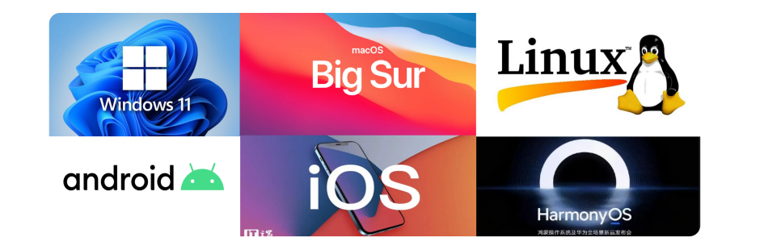
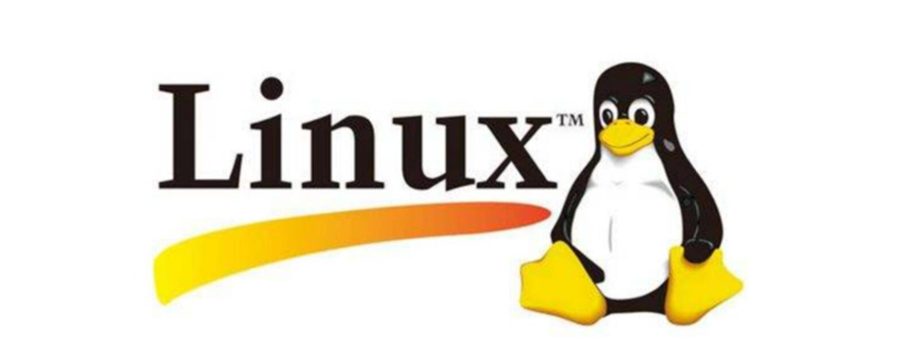
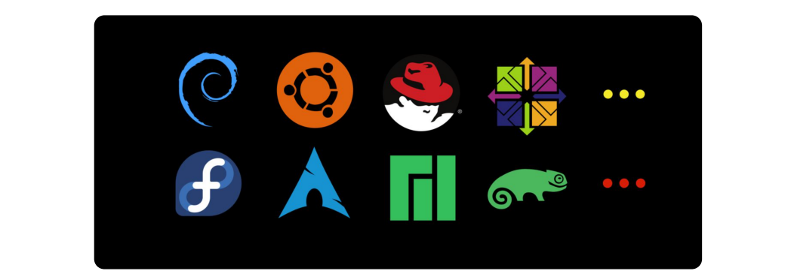
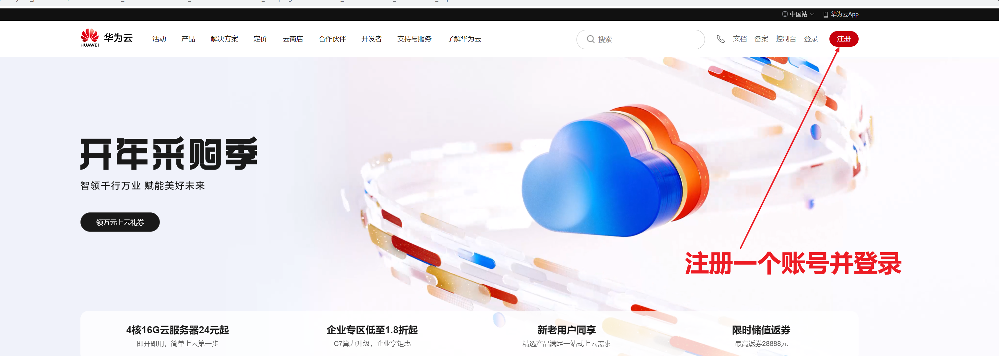
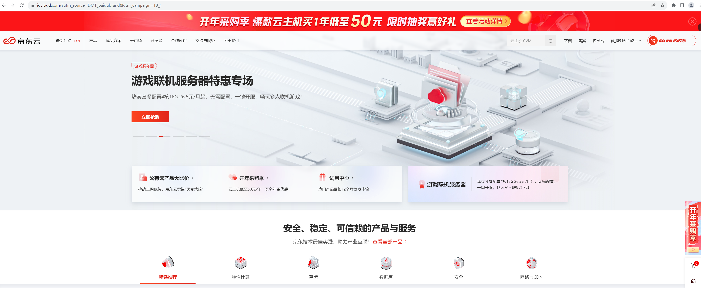

## 一，Linux操作系统介绍

### 1，计算机介绍

硬件：

- 计算机硬件是指计算机系统中所有物理部件的总称。包括计算机主机、显示器、键盘、鼠标、内存、硬盘、处理器、主板等等。这些硬件部件是计算机系统运行的基础
- 计算机硬件就像人体的骨骼和肌肉，是支撑和运行计算机系统的基础。

软件(应用软件)：

- 计算机软件则是指计算机系统中的各种程序和数据。包括操作系统、应用程序、编程语言、数据库、游戏等等
  软件是由程序员编写的指令和代码组成的，它们可以被计算机硬件读取和执行
- 用户通过软件与计算机进行交流！
- 计算机软件就像人的大脑和思维，控制和指挥计算机硬件进行各种运算和操作

操作系统（系统软件）：

 

- 操作系统是计算机软件的一种，它主要负责：作为用户和计算机硬件之间的桥梁，调度和管理计算机硬件进行工作
- 作用1：控制硬盘保存数据
- 作用2：控制显卡输出图形数据到显示器
- 作用3：控制音响播放音乐
- 作用4：控制网卡传输数据
- ....

### 2，Linux系统介绍

​	Linux由一个名为林纳斯 托瓦兹(Linus Torvalds)的年轻芬兰大学生带头开发的作业系统。1991 年的十月，当初网际网路还不像现在这么普遍，上网的人大部分都隶属于一些研究机构，或者是大学里面的学生、教授，1991年10月5日, 上午11时53分，有一个名为 Linus Torvalds 的年轻芬兰大学生在comp.os.minix 这个新闻群组上发表了这样一个帖子，它标志着Linux诞生了。这个 Linus 的兴趣就是 Linux 核心程式 0.02 版的原始码，当初还是个大学生的 Linus 大概完全没想到当初被他视为个人兴趣的程式，在几年以後会有超过千万个使用者，由他自己带头开发的作业系统现在已经在世界各地受到普遍的欢迎，还被视为是软体业巨人微软公司大力促销的 NT 系统最大的竞争对手。

**Linux系统的组成：**

- Linux内核
  - Linux内核是 Linux 操作系统主要组件，也是计算机硬件与其软件之间的交互入口。它负责两者之间的通信，还要尽可能高效地管理资源。内核是Linux操作系统最核心的所在，系统级应用程序只是锦上添花
- Linux Shell
  - shell是系统的用户界面，提供了用户与内核进行交互操作的一种接口
- Linux文件系统
  - 文件系统是文件存放在磁盘等存储设备上的组织方法
- Linux应用程序
  - 标准的Linux系统一般都有一套都有称为应用程序的程序集，它包括文本编辑器、编程语言、办公套件等

### 3，Linux系统发行版

**Linux的发行版：**

​	Linux内核是免费开源的，任何人都可以下载内核源码并查看且修改。并且自行集成系统级程序提供了内核+系统级程序的完整封装，称之为Linux发行版。内核下载网址：https://www.kernel.org

发行版：

因为任何人都可以封装Linux，所以目前市面上由非常多的Linux发行版，常用的、知名的如下：

- Redhat

- CentOS

- Ubuntu

- debian

- dedora
- deepin
- 中标麒麟
- ...

注意：

- 不同的发行版：基础命令90%是相同的，部分操作不同（如软件安装）
- 不用纠结选择什么发行版，不论用什么发行版，都是Linux，学到的东西都是通用的

### 4，购买云服务器

有很多的云平台：

- 阿里云
- 百度云
- 腾讯云
- 华为云
- JD云
- .....

操作流程：

大家只需要买一个月的就行。买完后，如下：

接下来，就以京东云为例，来演示。打开京东云：

连接服务器：

### 5，Shell链接工具

对于操作系统的使用，无论是Windows、MacOS或者Linux都有2种使用方式：

- 图形化页面
- 命令的形式

​	图形化一般是大多数人使用计算机的第一选择，但是在Linux操作系统上。无论是企业开发亦或是个人开发，使用Linux操作系统，多数都是使用的：命令行！！！

- 在图形化页面的优化上，并不是很出色(有时出现在bug，甚至会卡死)
- 图形化也是消耗资源，做为服务器，又不是经常操作
- 命令有时比图形化界面更加快捷

​	在网上有很多Shell工具，甚至我们可以使用，比如说，MobaXterm、XShell、FinalShell等在这，我们推荐MobaXterm，功能全，安装容易。

解压此软件：

打开软件：

使用上面的软件连接服务器：

## 二，Linux基础命令

### 1，Linux目录结构

查看之：

**系统启动相关：**

- /boot：存放的启动Linux 时使用的内核文件，包括连接文件以及镜像文件。
- /etc：存放所有的系统需要的配置文件和子目录列表，更改目录下的文件可能会导致系统不能启动。
- /lib：存放基本代码库（比如c++库），其作用类似于Windows里的DLL文件。几乎所有的应用程序都需要用到这些共享库。
- /sys： 这是linux2.6内核的一个很大的变化。该目录下安装了2.6内核中新出现的一个文件系统sysfs 。sysfs文件系统集成了下面3种文件系统的信息：针对进程信息的proc文件系统、针对设备的devfs文件系统以及针对伪终端的devpts文件系统。该文件系统是内核设备树的一个直观反映。当一个内核对象被创建的时候，对应的文件和目录也在内核对象子系统中

**指令集合相关：**

- /bin：存放着最常用的程序和指令
- /sbin：只有系统管理员能使用的程序和指令。

**外部文件管理相关：**

- /dev ：Device(设备)的缩写, 存放的是Linux的外部设备。注意：在Linux中访问设备和访问文件的方式是相同的。
- /media：类windows的其他设备，例如U盘、光驱等等，识别后linux会把设备放到这个目录下。
- /mnt：临时挂载别的文件系统的，我们可以将光驱挂载在/mnt/上，然后进入该目录就可以查看光驱里的内容了。

**临时文件相关：**

- /run：是一个临时文件系统，存储系统启动以来的信息。当系统重启时，这个目录下的文件应该被删掉或清除。如果你的系统上有 /var/run 目录，应该让它指向 run。
- /lost+found：一般情况下为空的，系统非法关机后，这里就存放一些文件。
- /tmp：这个目录是用来存放一些临时文件的。

**账户相关：**

- /root：系统管理员的用户主目录。
- /home：用户的主目录，以用户的账号命名的。
- /usr：用户的很多应用程序和文件都放在这个目录下，类似于windows下的program files目录。
- /usr/bin：系统用户使用的应用程序与指令
- /usr/sbin：超级用户使用的比较高级的管理程序和系统守护程序。
- /usr/src：内核源代码默认的放置目录。

**运行过程中要用：**

- /var：存放经常修改的数据，比如程序运行的日志文件（/var/log 目录下）。
- /proc：管理内存空间！虚拟的目录，是系统内存的映射，我们可以直接访问这个目录来，获取系统信息。这个目录的内容不在硬盘上而是在内存里，我们也可以直接修改里面的某些文件来做修改。

**扩展用的：**

- /opt：默认是空的，我们安装额外软件可以放在这个里面。
- /srv：存放服务启动后需要提取的数据（不用服务器就是空）

**特殊的：**

- . ：代表当前的目录，也可以使用 ./ 来表示；
- .. ：代表上一层目录，也可以 ../ 来代表;
- ~ : 代表登录用户的家目录
  - root: /root
  - user: /home/user
- / : 代表系统的根目录

为了保证我们可以正确的找到自己想要的文件夹或文件，我们需要了解2个概念：绝对路径与相对路径

- 绝对路径：路径的写法，由根目录 / 写起，例如： /etc/ssh 这个目录
- 相对路径：路径的写法，不是由 / 写起，例如由 /etc/ssh 要到 /etc/ssl 底下时，可以写成： cd ../ssl 这就是相对路径的写法

### 2，Linux命令格式

### 3，cd与pwd

### 4，mkdir和rmdir

### 5，cat，tac，more，less，head，tail

### 6，cp，mv，rm

### 7，which和find

### 8，grep，wc和管道符

### 9，touch，echo的使用

### 10，重定向符

### 11，vi，vim编辑器

### 12，cut

### 13，sort

### 14，sed

### 15，awk

