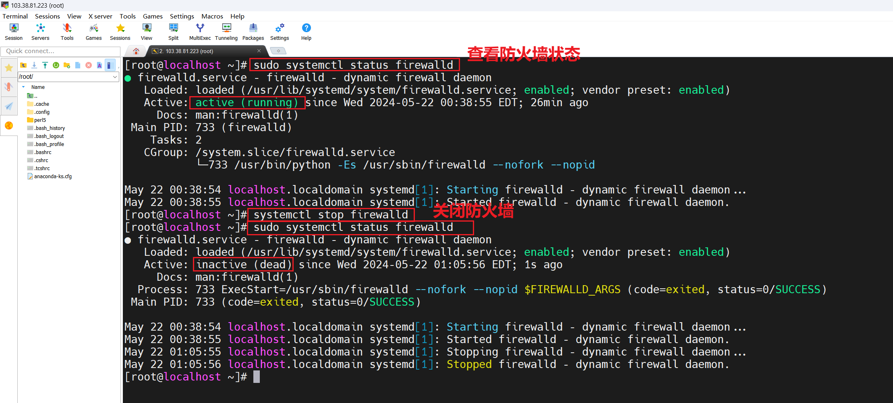
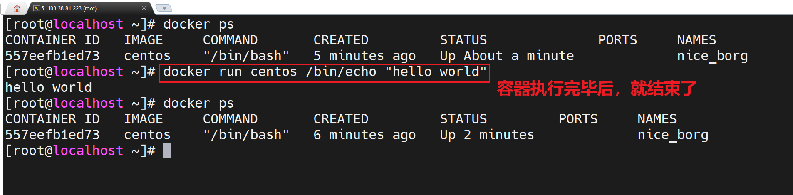
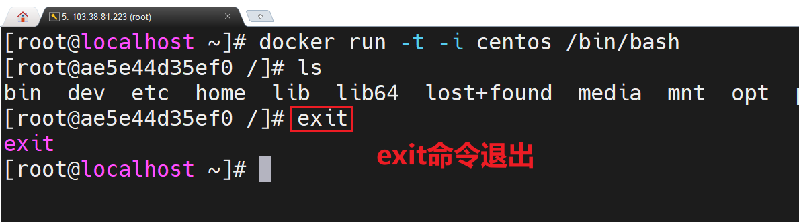
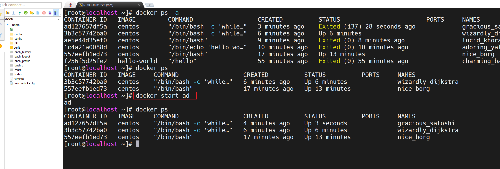
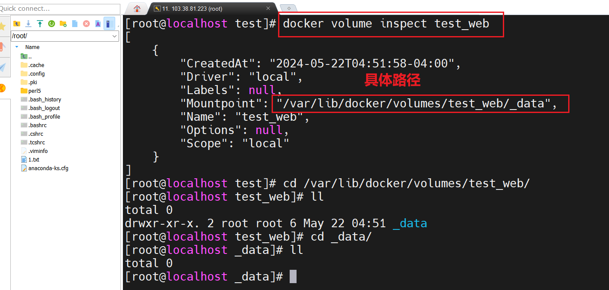
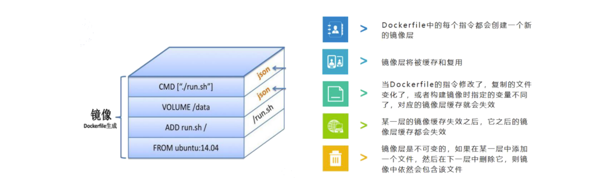
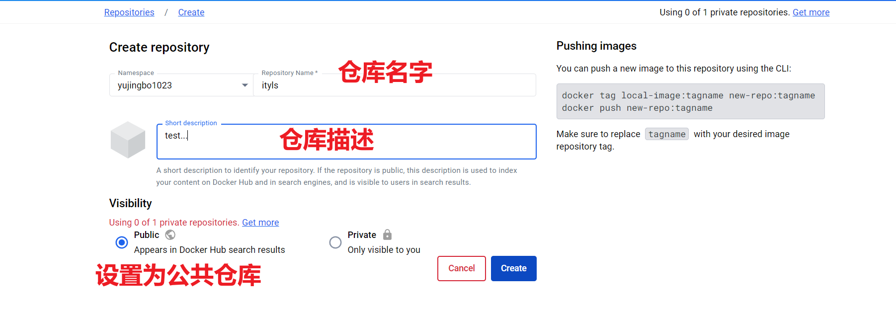
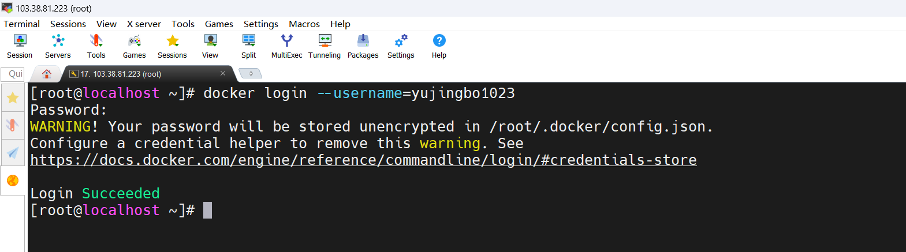

## 一，Docker介绍


### 1，什么是Docker

Docker 是一个开源的应用容器引擎，基于 Go 语言 并遵从Apache2.0 协议开源。 


标志是一头鲸鱼携带着一堆容器。它正在向您发送这些信息的途中。Docker直译过来是码头工人，然而Docker给人的第一感觉是容器，容器技术英译为Linux Container， Container的直译有集装箱，容器两个意思。


**集装箱技术**

我们都知道码头里的集装箱是运载货物用的，它是一种按规格标准化的钢制箱子。集装箱的特色，在于其格式划一，并可以层层重叠， 集装箱与集装箱之间互不影响于是乎，IT领域借鉴了这一理念，大家就在想，有没有可能大家 只需要关注程序本身? 


Docker是一个开源的应用容器引擎，开发者可以打包他们的应用及依赖到一个可移植的容器中，发布到流行的Linux机器上，也可实现虚拟化。


总结：Docker其实就是可以打包程序和运行环境，把环境和程序一起发布的容器。


### 2，为什么要使用Docker

开发者需要能方便高效构建应用，并且任何时间任何地点都可以获取。传统项目部署：


对开发和运维( DevOps)人员来说，可能最梦寐以求的就是一次性地创建或配置，可以在任意环境、任意时间让应用正常地运行。而Docker恰恰是可以实现这一终极目标的瑞士军刀。它的优势：

- 更快速的交付和部署
- 更高效的资源利用
- 更轻松的迁移和扩展
- 更简单的更新管理


作为一种轻量级的虚拟化方式，Docker在运行应用上跟传统的虚拟机方式相比具有显著优势。 


### 3，虚拟化与Docker

虚拟化分类：

- 完全虚拟化

- 硬件辅助虚拟化

- 部分虚拟化

- 超虚拟机化

- 操作系统虚拟化

  


虚拟化技术是一个通用的概念,在不同领域有不同的理解。在计算领域，一般指的是计算虚拟化或通常说的服务器虚拟化。简单的说，「虚拟化」，顾名思义，就是「虚拟」的，是「假」的，是观念上、逻辑上的划分。 举个例子：假设你现在手头上有一套房子，并且你要把它给租出去，租金的市场价是2000元/月。那么有没有办法把它租得更贵，获得6000元的租金呢？你想到了两个办法：

- 找一个不差钱的傻X租户，让他每月交6000元。
- 把房子租给4个单身狗，租金为1500元/人/月


什么是物理机：


什么是虚拟机：


什么是Docker：


### 4，Docker的核心概念


Docker技术的三大核心概念，分别是：

- 镜像（Image）
- 容器 (Container)
- 仓库 (Repository)


**镜像：**

Docker 镜像 (Image) 类似于虚拟机镜像，可以将它理解为个面向Docker引擎的模板，包含了文件系统。


镜像从何而来：

- 从Docker Hub下载    maven-> 中央仓库
- 通过Docker file自己创建出来


**容器：**

Docker容器(Container)类似于一个轻量级的沙箱,Docker利用容器来运行和隔离应用。容器是从镜像创建的应用运行实例，可以将其启动、开始、停止、删除，而这些容器都是相互隔离、互不可见的。


容器和镜像一样，也是若干层的叠加，唯一区别是所有只读层的最上面一层，是一层可读可写层，可以记住这个简单的公式：容器 = 容器镜像 + 可读可写层。


**仓库：**

Docker仓库(Repository)类似于代码仓库，是Docker集中存放镜像文件的场所。目前，最大的公开仓库是Docker Hub，存放了数量庞 大的镜像供用户下载。国内的公开仓库包括Docker Pool等，可以提供稳定的国内访问。


Docker利用仓库管理镜像的设计理念与Maven非常相似。


咱们再来理解docker的两句口号就更好理解了：

- Build, Ship and Run (搭建，发送，运行)
- Build once，Run anywhere (搭建一次，运行到任何地方)


### 5，Docker安装

**系统环境**


关闭防火墙：




关闭selinux：


安装docker引擎：


启动docker：


设置docker自启动：


测试docker是否安装成功：


## 二，Docker命令


### 1，镜像命令

Docker运行容器前需要本地存在对应的镜像，如果镜像不存在本地，Docker会尝试先从默认镜像仓库下载（默认使用Docker Hub 公共注册服务器中的仓库)，用户也可以通过配置，使用自定义的镜像仓库。总之：镜像是Docker运行容器的前提。


镜像下载：

```
docker pull 镜像名字:[tag]
```

注意：如果不指定tag，则下载Docker Hub公共注册服务器中仓库的最新版本。 


操作：


查看镜像：列出本地主机上已有的镜像。

```
docker images
```


操作：


参数：

- 参数1：来自哪个仓库
- 参数2：镜像的标签信息
- 参数3：镜像的ID（唯一），镜像的ID信息十分重要，它唯一标识了镜像。
- 参数4：创建时间
- 参数5：镜像大小


镜像搜索：搜索远端仓库中共享的镜像,默认搜索Docker Hub官方仓库中的镜像。

```
docker search [镜像名字]
```


操作：


参数：

- 可以看到返回了很多包含关键字的镜像，其中包括镜像名字、描述、星级（表示该镜像的受欢迎程度），是否官方创建、是否自动创建等


删除镜像：使用镜像的标签删除镜像

```
docker rmi 源名字
docker rmi image id
```


操作：


### 2，容器命令

当我们有了镜像，才可以创建容器, 创建一个centos容器来学习。Docker的容器十分轻量级，用户可以随时创建或者删除容器。语法：

```
docker create -it 镜像名字
```

注意：使用docker create命令新建的容器处于停止状态，可以使用docker start命令来启动它。 


操作：


启动容器：


列出容器：

```
docker ps
```

参数：

- -a: 显示未启动容器
- -q：返回容器id号


操作：


新建并启动容器：启动容器有两种方式，一种是基于镜像新建一个容器并启动，另外一个是将在终止状态（ stopped)的容器重新启动。所需要的命令主要为docker run，等价于先执行docker create命令,再执行docker  start命令。语法格式：

```
docker run 镜像名字 /bin/echo 'hello world'
```


操作：






参数：

- -t选项让Docker 分配一个伪终端（pseudo-tty)并绑定到容器的标准输入上
- -i则让容器的标准输入保持打开。
- exit命令退出。


Docker在后台运行的标准操作包括：

- 检查本地是否存在指定的镜像，不存在就从公有仓库下载。
- 利用镜像创建并启动一个容器。
- 分配一个文件系统,并在只读的镜像层外面挂载一层可读写层。
- 从宿主主机配置的网桥接口中桥接一个虚拟接口到容器中去。
- 从地址池配置一个IP地址给容器。
- 执行用户指定的应用程序。
- 执行完毕后容器被终止。


守护态运行：更多的时候，需要让Docker容器在后台以守护态（Daemonized)形式运行。用户可以通过添加-d参数来实现。不以守护态运行：


守护态运行：


容器启动后会返回一个唯一的ID，也可以通过docker ps命令来查看容器信息: 


获取容器输出信息

```
docker logs 容器id
```


操作：


终止容器：

```
docker stop 容器id
```


处于终止状态的容器，可以通过docker start命令来重新启动:

```
docker start 容器id
```




此外，docker restart命令会将一个运行态的容器终止，然后再重新启动 

```
docker restart 容器id
```


进入容器：

在使用-d参数时，容器启动后会进入后台，用户无法看到容器中的信息。某些时候如果需要进入容器进行操作，有多种方法，包括使用docker attach命令、docker exec命令,以及nsenter工具等。


使用attach命令有时候并不方便。当多个窗口同时attach到同一个容器的时候，所有窗口都会同步显示。当某个窗口因命令阻塞时,其他窗口也无法执行操作了。 


Docke自1.3版本起，提供了一个更加方便的工具exec，可以直接在容器内运行命令。例如进入到刚创建的容器中,并启动一个bash: 


删除容器：

```
docker rm 容器id
```


参数：

- -f, --force=false强行终止并删除一个运行中的容器。
- -l, --link=false删除容器的连接,但保留容器。
- -V,--volumes=false删除容器挂载的数据卷。


退出：如果docker容器在启动的时候没有加 -d 参数

- exit # 会直接停止同期并退出
- Ctrt + p + q # 容器不停止 并退出


### 3，其它命令

查看日志

```
docker logs 容器id
```

参数：

- -f, --follow 跟踪实时日志 
- --since string 显示自某个timestamp之后的日志，或相对时间，如42m（即42分钟） 
- --tail string 从日志末尾显示多少行日志， 默认是all 
- -t, --timestamps 显示时间戳 
- --until string 显示自某个timestamp之前的日志，或相对时间，如42m（即42分钟）


查看容器里面的进程

```
 docker top 容器id
```


从容器拷贝文件到主机上：

```
docker cp 容器id：容器内路径   目录路径
```


## 三，Docker实践

### 1，安装JDK


查看JDK镜像：

```
docker search openjdk:11
```


下载JDK镜像：

```
docker pull openjdk:11
```


运行JDK镜像：

```
docker run openjdk:11 java -version
```


### 2，安装Tomcat 

查看tomcat镜像

```
docker search docker.io/tomee
```


下载tomcat镜像

```
docker pull docker.io/tomee
```


启动tomcat容器

```
docker run -d --name mytomcat -p 9090:8080 docker.io/tomee
```


参数：

- -p 映射端口 宿主机端口号:容器内应用端口
- -P 随机端口


端口绑定：


访问：


### 3，安装Mysql


查看镜像：

```
docker search mysql:5.7
```


下载镜像：

```
docker pull mysql:5.7
```


启动镜像：

```
docker run --name mysql -d -p 3307:3306 -e MYSQL_ROOT_PASSWORD=root mysql:5.7
```

参数：

- -p 我们以后使用3307 端口来访问mysql 为了防止黑客攻击
- -e 配置环境变量
- MYSQL_ROOT_PASSWORD 设置容器内mysql root 密码


测试：


## 四，Docker数据管理


### 1，为什么使用数据卷

什么是容器数据卷：Docker中的数据可以存储在类似于宿主机磁盘的介质中，在Docker中称为数据卷（Data Volume）。


思考：

- Docker容器删除后，在容器中产生的数据还在吗？

  

- Docker容器和外部机器可以直接交换文件吗？

  

- 容器之间能进行数据交互？

  


数据卷的概念：

- 数据卷是宿主机中的一个目录或文件。
- 当容器目录和数据卷目录绑定后，对方修改会立即同步。
- 一个数据卷可以同时被多个容器同时挂载。
- 一个容器也可以被挂载多个数据卷。


数据卷的作用：

- 容器数据持久化。
- 外部机器和容器间接通信。
- 容器之间数据交换。


总结：数据卷技术就是为了实现数据的持久化和同步操作，容器间也是数据共享。


### 2，配置数据卷

命令：

```
docker run -v 宿主机目录(文件):容器内目录(文件) webapps
```

注意：

- 目录必须是绝对路径
- 如果目录不存在则会自动创建
- 可以挂载多个数据卷


查看容器，停止容器：


查看没有启动的镜像：


启动tomcat:


停止容器：


操作：给Tomcat服务器挂载/opt/webapps路径。

```
docker run -d --name mytomcat -p 8080:8080 -v /opt/webapps:/usr/local/tomee/webapps tomcat
```


重启，访问：


### 3，数据卷容器

Volume的基本使用：

- create # 创建数据卷
- inspect #查看数据卷元数据
- ls #查看数据卷列表
- prune #删除所有未使用的卷
- rm #删除数据卷


查看所有的容器卷：

```
docker volume ls
```


创建一个自定义容器：

```
docker volume create test_web
```


查看指定容器卷详情信息：

```
docker volume inspect test_web
```




使用指定卷容器，有了自定义容器卷，我们可以创建一个使用这个数据卷的容器，这里我们以tomcat为例：

```
docker run -d -it --name=ylstomcat -p 8080:8080 -v test_web:/usr/local/tomee/webapps tomee
```


注意：

- -v代表挂载数据卷，这里使用自定数据卷test_web，并且将数据卷挂载到/usr/local/tomcat/webapps 。如果没有通过-v指定，那么Docker会默认帮我们创建匿名数据卷进行映射和挂载。

### 4，Mysql数据卷挂载


搜索镜像：

```
docker search mysql:5.7
```


下载镜像：

```
docker pull mysql:5.7
```


前面已经下载过镜像了：


运行镜像：

```
docker run -d -p 3306:3306 \
-v /opt/mysql/conf:/etc/mysql/conf.d \
-v /opt/mysql/data:/var/lib/mysql \
-e MYSQL_ROOT_PASSWORD=root --name my-mysql mysql:5.7
```


进入mysql容器，如下：


创建一个数据库，在一个数据为中创建表，然后在表中插入一条数据，如下：


此时，我们把数据库这个容器停掉，然后删除掉，如下：


然后重新创建容器：

```
docker run -d -p 3306:3306 \
-v /opt/mysql/conf:/etc/mysql/conf.d \
-v /opt/mysql/data:/var/lib/mysql \
-e MYSQL_ROOT_PASSWORD=root --name my-mysql mysql:5.7
```


## 五，Dockerfile


### 1，什么是Dockerfile

Dockerfile是一个文本格式的配置文件，用户可以使用Dockerfile快速创建自定义的镜像。 


Dockerfile由一行行命令语句组成，并且支持以#开头的注释行。一般而言，Dockerfile分为四部分:基础镜像信息、维护者信息、镜像操作指令和容器启动时执行指令。 如：

```
## Dockerfile文件格式  
# 1、第一行必须指定 基础镜像信息
FROM openjdk:11
# 2、维护者信息
MAINTAINER ityls ityls@163.com
# 3、镜像操作指令
RUN echo "wget https://dlcdn.apache.org/tomcat/tomcat-9/v9.0.55/bin/apache-tomcat-9.0.55.tar.gz"
run tar -zxvf apache-tomcat-9.0.55.tar.gz -C /usr/local
# 4、容器启动执行指令
CMD /usr/local/tomcat/bin/catalina.sh
```


说明：

- 一开始必须要指明所基于的镜像名称, 关键字是FROM, 这是必须的.
- 接下来是维护者信息关键字是MAINTAINER, 非必须, 但良好的习惯有利于后期的职责明确
- 后面是镜像操作指令, 如RUN等, 每执行一条RUN命令,镜像添加新的一层
- 最后是CMD指令,来指明运行容器时的操作命令


### 2，构建镜像




在一个空白的文本文件, 命名为Dockerfile

```
vim Dockerfile
```

Dockerfile文件内容:

```
#基础镜像
FROM centos
#维护者
MAINTAINER baizhan<baizhan@163.com>
#启动容器运行命令
CMD echo "hello Dockerfile"
```


构建镜像

```
docker build -t 镜像名字:版本 .
```

注意：. 代表Dockerfile文件在当前路径


大家可以再操作如下的Dockerfile：

```
FROM java:8
MAINTAINER WCC
CMD java -version
```


### 3，常见的13种指令


#### 1）FROM

FROM：指定基础镜像，必须为第一个命令。

```
FROM <image>　　
FROM <image>:<tag>
```

注意：tag或digest是可选的，如果不使用这两个值时，会使用latest版本的基础镜像

#### 2）MAINTAINER

MAINTAINER：维护者信息

```
MAINTAINER <name>
```

#### 3）WORKDIR

WORKDIR：工作目录，类似于cd命令

```
WORKDIR /usr/workdir
WORKDIR /a (这时工作目录为/a)
WORKDIR b (这时工作目录为/a/b)
WORKDIR c (这时工作目录为/a/b/c)
```


再比如：

```
WORKDIR /OPT
RUN mkdir docker
WORKDIR /usr/local
RUN echo "test" > a.info
```

注意：通过WORKDIR设置工作目录后，Dockerfile中其后的命令RUN、CMD、ENTRYPOINT、ADD、COPY等命令都会在该目录下执行。在使用docker run运行容器时，可以通过-w参数覆盖构建时所设置的工作目录。

#### 4）RUN

RUN：构建镜像时执行的命令

```
# 1. shell执行
格式 RUN <command>
# 2. exec执行
格式 RUN ["executable", "param1", "param2"]
```

示例：

```
WORKDIR /OPT
RUN mkdir docker
WORKDIR /usr/local
RUN echo "test" > a.info
```

注意：RUN指令创建的中间镜像会被缓存，并会在下次构建中使用。如果不想使用这些缓存镜像，可以在构建时指定--no-cache参数，如：docker build --no-cache

#### 5）ADD

ADD:将本地文件添加到容器中，tar类型文件会自动解压(网络压缩资源不会被解压)，可以访问网络资源，类似wget。 

```
ADD <src>... <dest>
ADD ["<src>",... "<dest>"] 用于支持包含空格的路径示例：    
```

示例：

```
ADD hom* /mydir/  # 添加所有以"hom"开头的文件
ADD hom?.txt /mydir/  # ? 替代一个单字符,例如："home.txt"
ADD test relativeDir # 添加 "test" 到 WORKDIR/relativeDir/
ADD test /absoluteDir/ # 添加 "test" 到 /absoluteDir/
```

#### 6）COPY

COPY：功能类似ADD，但是是不会自动解压文件，也不能访问网络资源。

```
COPY <源路径> <目标路径>
```


示例：

```
COPY ./start.sh /start.sh
```

#### 7）CMD

CMD：构建容器后调用，也就是在容器启动时才进行调用。指定这个容器启动的时候要运行的命令只有最后一个会生效可被替换。 

```
CMD指令与RUN指令相似，也具有两种格式：
1. shell格式：CMD <命令>
2. exec格式： CMD ["可执行文件", "参数1", "参数2", …]
```

示例：

```
CMD echo "This is a test." | wc -
CMD ["/usr/bin/wc","--help"]
```

注意：CMD不同于RUN，CMD用于指定在容器启动时所要执行的命令，而RUN用于指定镜像构建时所要执行的命令。 


实操操作：

```
#基础镜像
FROM openjdk:11
#维护者
MAINTAINER ityls<123@qq.com>
#工作目录 切换目录
WORKDIR /opt
#构建镜像时执行的命令
RUN mkdir abc
#将本地文件添加到容器内
ADD ./webapps /opt
#构建成功之后执行的命令
CMD echo "This is a test." | wc -
```


#### 8）ENTRYPOINT

ENTRYPOINT：配置容器，使其可执行化。配合CMD可省去"application"，只使用参数。指定容器启动的要运行的命令，可以追加命令

```
ENTRYPOINT ["executable", "param1", "param2"]
ENTRYPOINT command param1 param2 (shell内部命令)
```

示例：

```
ENTRYPOINT ["top", "-b"]
```

注意：ENTRYPOINT与CMD非常类似，不同的是通过docker run执行的命令不会覆盖ENTRYPOINT，而docker run命令中指定的任何参数，都会被当做参数再次传递给ENTRYPOINT。Dockerfile中只允许有一个ENTRYPOINT命令，多指定时会覆盖前面的设 置，而只执行最后的ENTRYPOINT指令。 

#### 9）ENV

ENV: 这个指令非常简单，就是用于设置环境变量而已，无论是接下来的指令，还是在容器中运行的程序，都可以使用这里定义的环境变量。 

```
ENV <key>=<value>
```

示例：

```
ENV JAVA_HOME=/usr/local/jdk1.7.0_79
ENV PATH=$JAVA_HOME/bin:$PATH
```

#### 10）EXPOSE

EXPOSE: 指定于外界交互的端口

```
EXPOSE 80
```

注意：EXPOSE并不会让容器的端口访问到主机。要使其可访问，需要在docker run运行容器时通过-p来发布这些端口，或通过-P参 数来发布EXPOSE导出的所有端口。 

#### 11）VOLUME

VOLUME：用于指定持久化目录

```
VOLUME ["/path/to/dir"]
```

示例：

```
VOLUME ["/data"]
VOLUME ["/var/www", "/var/log/apache2"]
```

注意：一个卷可以存在于一个或多个容器的指定目录，该目录可以绕过联合文件系统，并具有以下功能：

- 卷可以容器间共享和重用
- 容器并不一定要和其它容器共享卷
- 修改卷后会立即生效
- 对卷的修改不会对镜像产生影响
- 卷会一直存在，直到没有任何容器在使用它

#### 12）USER

USER：指令用于将会用以什么样的用户去运行

```
USER user
USER user:group
```

注意：使用USER指定用户后，Dockerfile中其后的命令RUN、CMD、 ENTRYPOINT都将使用该用户。镜像构建完成后，通过 docker run运行容器时，可以通过-u参数来覆盖所指定的用户。

#### 13）ONBUILD

ONBUILD：帮助别人定制而准备的

```
ONBUILD [INSTRUCTION]
```


示例：

```
FROM centos
WORKDIR /data
ONBUILD RUN mkdir test
```


### 4，CMD和ENTRYPOINT的区别

区别：

- CMD #指定这个容器启动的时候要运行的命令，可被替换
- ENTRYPOINT #指定这个容器启动的时候要运行的命令，可以追加命令


定义Dockerfile，如下：

```
#基础镜像
from centos
#启动容器运行命令
CMD ["ls" ,"-a"]
```


构建镜像：

```
docker build -t test:v3 .
```


启动镜像：

```
docker run -it test:v3 ls -l
```


把CMD换成ENTRYPOINT，如下：


生成镜像：


### 5，构建Tomcat镜像

首先，尝试在DockerHub上搜索Tomcat相关镜像的个数

```
docker search tomcat |wc -l
```

有26个,如果是个人开发或者测试，随意使用一个，若是生产环境使用，就不合适了。 

- 项目需要的Tomcat版本可能不同。
- 项目需要的Tomcat变量不一致。
- 项目需要的JDK可能不一致。


Dockerfile文件

```
#基础镜像
FROM openjdk:11
#维护者
MAINTAINER ityls<ityls@163.com>
#拷贝tomcat包
ADD ./apache-tomcat-9.0.50.tar.gz /usr/local
#设置工作目录
WORKDIR /usr/local
#设置tomcat环境变量
ENV TOMCAT_HOME=/usr/local/apache-tomcat-9.0.50
ENV PATH=$PATH:$TOMCAT_HOME/bin
#保留端口
EXPOSE 8080
#启动容器运行命令
CMD startup.sh && tail -F /usr/local/apache-tomcat-9.0.50/bin/catalina.out
```


构建镜像

```
docker build -t tomcat:1.0 .
```


启动容器：

```
docker run --name tomcat -d -p 8080:8080 tomcat:1.0
```


访问：


## 六，Docker网络管理


### 1，Docker网络详解

每启动一个docker容器， docker就会给容器分配一个ip，只要安装docker就会有一个docker0 网卡。


清空所有容器来测试：

```
docker stop $(docker ps -aq)
docker rm $(docker ps -aq)
```


看一下主机的地址：


evth-pair 就是一对的虚拟设备接口，它们都是成对出现，一段彼此连接。 正是因为这个特性，evth-parit桥梁。 连接各种各样网络设备。 


注意：

docker 使用linux的桥接， 宿主机中时一个docker容器的网桥。 docker0 docker中所有网络接口都是虚拟的。 虚拟转发效率高只要容器删除 对应的网桥就没有了。 


创建三个容器：

```
docker run --name mytomcat -d -p 8080:8080 tomcat:1.0
docker run --name mytomcat2 -d -p 8090:8080 tomcat:1.0
docker run --name mysql -d -p 3306:3306 -e MYSQL_ROOT_PASSWORD=root mysql:5.7
```


进入两台tomcat容器，并查IP，如下：


两个容器是可以ping通的：


### 2，Docker容器互联


思考一个场景,我们编写了一个WEB服务，database url=ip:，项目不重启,数据库ip换掉了, 我们希望可以处理这个问题，可以名字来进行访问容器? 


语法格式：

```
--link <name or id>:alias
```

参数：

- name和id是源容器的name和id，alias是源容器在link下的别名。


查看当前容器：


ping mysql：


## 七，Docker公有云


### 1，Docker为什么推送镜像到远程仓库

如果我们想将这个镜像提供给别人使用时，我们可以将镜像推送到远程仓库，然后别人从远程仓库中下载即可。


Docker Hub是Docker社区分享Docker镜像的网站/存储库。地址：https://hub.docker.com/


阿里云容器镜像服务（简称 ACR）是面向容器镜像、HelmChart 等符合 OCI 标准的云原生制品安全托管及高效分发平台。 ACR 支持全球同步加速、大规模/大镜像分发加速、多代码源构建加速等全链路提效，与容器服务 ACK 无缝集成，帮助企业降低交付复杂度，打造云原生应用一站式解决方案。 


### 2，发布镜像到Docker Hub

第一步：


第二步：




第三步：

```
docker login --username=kalista  # 密码：xu1023yuabc
```





第四步：把容器提交到docker hub上

```
docker commit -m "镜像描述" -a "作者" 容器id/容器名字 远程库的名字:上传到docker hub上的名字
```


第五步：将镜像，容器，远程库进行标识

```
docker tag 镜像id 远程库的名字:上传到docker hub上的名字
```

第六步：将于远程库有标识关系的库提交

```
docker push 远程库的名字:上传到docker hub上的名字
```


查看：


### 3，发布镜像到阿里云

操作同上，大家可以自习实操一下。


## 八，Docker核心技术


### 1，基本架构


Docker采用了标准的C/S架构,包括客户端和服务端两大部分。客户端和服务端既可以运行在一个机器上，也可通过socket或者RESTful API来进行容器通信。 


Docker daemon一般在宿主主机后台运行，作为服务端接受来自客户的请求,并处Docker基本架构理这些请求(创建、运行、分发容器)。在设计上，Docker daemon是一个非常松耦合的架构,通过专门的 Engine模块来分发管理各个来自客户端的任务。


Docker客户端则为用户提供一系列可执行命令，用户用这些命令实现与Docker daemon的交互。 


### 2，联合文件


联合文件系统(UnionFS）是一种轻量级的高性能分层文件系统，它支持将文件系统中的修改信息作为一次提交，并层层叠加，同时可以将不同目录挂载到同一个虚拟文件系统下。 


**Dockerfile**

Dockerfile用于描述镜像的生成规则。Dockerfile中的每一条命令，都在Docker镜像中以一个独立镜像层的形式存在。 


**Image**

Image由Dockerfile生成，呈现层级结构，每层镜像包含：镜像文件以及镜像json元数据信息。


**Container**

Container是Image的动态运行结果，概括而言，就是在Docker镜像之上，运行进程。


**镜像分层的好处**

- 基本上每个软件都是基于某个镜像去运行的，因此一旦某个底层环境出了问题，就不需要去修改全部基于该镜像的软件的镜像，只需要修改底层环境的镜像。 
- 这个好处也是最大好处，就是可以共享资源，其他相同环境的软件镜像都共同去享用同一个环境镜像，而不需要每个软件镜像要去创建一个底层环境。 
- 可以复用,节省磁盘空间，相同的内容只需加载一份到内存。 修改dockerfile之后，再次构建速度快。


**优化前**

```
FROM centos:6.9
RUN rm -rf /etc/yum.repos.d/*  
RUN curl -o /etc/yum.repos.d/CentOS-Base.repo
RUN curl -o http://mirrors.aliyun.com/repo/Centos-6.repo
RUN curl -o /etc/yum.repos.d/epel.repo
RUN yum install nginx -y
WORKDIR /usr/share/nginx/html
ADD xiaoniao.tar.gz .
ADD init.sh /init.sh
EXPOSE 80
VOLUME /usr/share/nginx/html
CMD ["/bin/bash","/init.sh"]
```


**优化后**

```
FROM centos:6.9
RUN rm -rf /etc/yum.repos.d/* && \
 	curl -o /etc/yum.repos.d/CentOS-Base.repo http://mirrors.aliyun.com/repo/Centos-6.repo && \
 	curl -o /etc/yum.repos.d/epel.repo http://mirrors.aliyun.com/repo/epel-6.repo && \
 	yum install nginx -y
WORKDIR /usr/share/nginx/html
ADD xiaoniao.tar.gz .
ADD init.sh /init.sh
EXPOSE 80
VOLUME /usr/share/nginx/html
CMD ["/bin/bash","/init.sh"]
```


