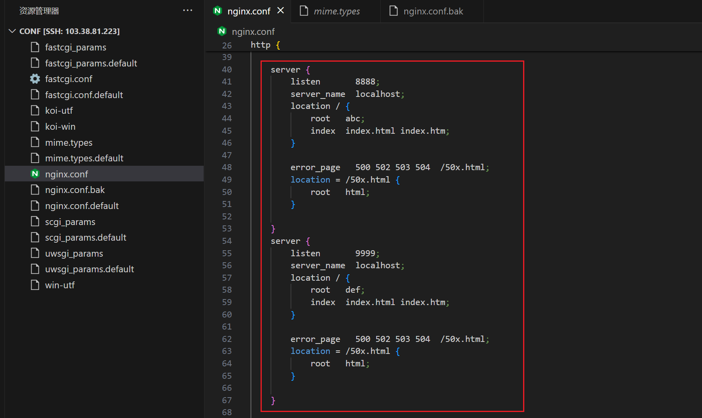
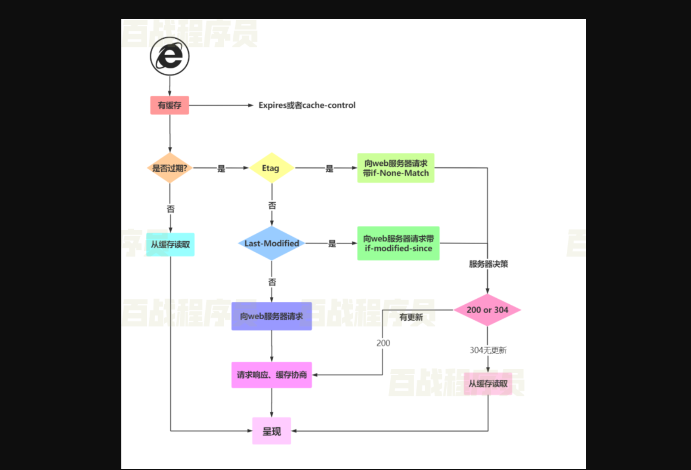

## 一，Nginx初识


### 1，Nginx概述

Nginx是一款轻量级的Web服务器、反向代理服务器，由于它的内存占用少，启动极快，高并发能力强，在互联网项目中广泛 应用。Nginx 专为性能优化而开发，使用异步非阻塞事件驱动模型。


没有nginx的情况下：


有了nginx的情况下：


### 2，Nginx四大应用场景 

**充当HTTP服务器：**

Nginx本身也是一个静态资源的服务器，当只有静态资源的时候，就可以使用Nginx来做服务器，如果一个网站只是静态页面的话， 那么就可以通过这种方式来实现部署。


**反向代理：**

反向代理应该是Nginx使用最多的功能了，反向代理(Reverse Proxy)方式是指以代理服务器来接受internet上的连接请求，然后将请求转发给内部网络上的服务器，并将从服务器上得到的结果返回给internet上请求连接的客户端，此时代理服务器对外就表现为一个反向代理服务器。 


**负载均衡：**

负载均衡也是Nginx常用的一个功能，负载均衡其意思就是分摊到多个操作单元上进行执行，例如Web服务器、FTP服务器、企业关键应用服务器和其它关键任务服务器等，从而共同完成工作任务。


**动静分离**

动静分离是让动态网站里的动态网页根据一定规则把不变的资源和经常变的资源区分开来，动静资源做好了拆分以后，我们就可以根据静态资源的特点将其做缓存操作，这就是网站静态化处理的核心思路。


### 3，为什么用Nginx

互联网飞速发展的今天,大用户量高并发已经成为互联网的主体.怎样能让一个网站能够承载几万个或几十万个用户的持续访问呢？ 


**单机架构：**


Tomcat 默认配置的最大请求数是150，也就是说同时支持150个并发。具体能承载多少并发，须要看硬件的配置，线程CPU 越多性能越高，分配给JVM的内存越多性能也就越高，但也会加剧GC的负担。 


**引入反向代理实现负载均衡：**


负载均衡就是一个web服务器解决不了的问题可以通过多个web服务器来平均分担压力来解决，并发过来的请求被平均分配到多个后台web服务器来处理，这样压力就被分解开来。 


### 4，环境准备

操作系统：Centos7.5 X64


确认可以上网：


确定yum源是否可用：


永久关闭防火墙：


关闭selinux防护：


安装（nginx所依赖的库）：

```
yum -y install gcc make automake pcre-devel zlib zlib-devel openssl openssl-devel
```


说明：

- gcc：编译依赖gcc环境
- pcre：PCRE(Perl Compatible Regular Expressions)是一个Perl库，包括 Perl 兼容的正则表达式库。 
- zlib：zlib库提供了很多种压缩和解压缩的方式，Nginx使用zlib对http包的内容进行gzip，所以需要在linux上安装zlib库。 
- Openssl：OpenSSL 是一个强大的安全套接字层密码库，囊括主要的密码算法、常用的密钥和证书封装管理功能及SSL协议，并提供丰富的应用程序供测试或其它目的使用。 


### 5，Nginx下载与安装


官网下载Nginx软件：http://Nginx.org


**Nginx** **官方提供了三个类型的版本：**

- Mainline Version：主线版，是最新版，但未经过过多的生产测试。
- Stable Version：稳定版，生产环境使用版本。
- Legacy Version：老版本。


注意：

我们需要下载的是 Stable Version。其中又分为两种版本： Linux 版与 Windows 版。开发时这两个版本我们都下载。 Linux 版用于生产环境，而 Windows 版用于开发测试,选择需要的版本进行下载。 


Nginx源码编译步骤：

1. 创建存放源文件的文件夹，首先在目录/opt下创建apps目录，用于存放源文件以及解压后的文件，上传Nginx到步骤1创建的目录下


2. 解压nigix

   ```
   tar -zxvf nginx-1.20.1.tar.gz
   ```

   

   

   

3. 生成makefile，在 Nginx 解压目录下运行 make 命令，用于完成编译。但此时会给出提示：没有指定目标，并且没有发现编译文件 makefile。

   

   编译命令 make 需要根据编译文件 makefile 进行编译，所以在编译之前需要先生成编译文件 makefile。使用 configure 命令可以生成该文件(目的是把环境检查一遍)。

   ```
   [root@node1 Nginx-1.20.1]# mkdir -p /var/temp/nginx/client
   [root@node1 Nginx-1.20.1]# pwd
   /opt/apps/nginx-1.20.1
   [root@node1 Nginx-1.20.1]# ./configure \
   --prefix=/usr/local/nginx \
   --pid-path=/usr/local/nginx/logs/nginx.pid \
   --error-log-path=/usr/local/nginx/logs/error.log \
   --http-log-path=/usr/local/nginx/logs/access.log \
   --with-http_ssl_module \
   --with-http_gzip_static_module \
   --http-client-body-temp-path=/var/temp/nginx/client \
   --http-proxy-temp-path=/var/temp/nginx/proxy \
   --http-fastcgi-temp-path=/var/temp/nginx/fastcgi \
   --http-uwsgi-temp-path=/var/temp/nginx/uwsgi
   ```

   

   

   

4. 安装：

   ```
   make && make install
   ```

   注意：这是两个命令，make 为编译命令，make install 为安装命令，可以分别执行。这里使用&&将两个命令连接执行，会在前面命令执行成功的前提下才会执行第二个命令。 


安装成功后：


### 6，Nginx目录详解

安装成功后：


**conf目录**

Nginx所有配置文件的目录，极其重要。在该目录中包含一个Nginx.conf配置文件。


**html目录**

Nginx的默认站点目录。


**logs目录**

存放Nginx的日志文件。 access.log error.log


**sbin目录**

Nginx命令的目录，如Nginx的启动命令。


### 7，Docker安装Nginx

拉取官方的Nginx镜像

```
 docker pull nginx
```


以下命令使用 Nginx 默认的配置来启动一个 Nginx 容器实例：

```
[root@localhost ~]# docker run --rm --name mynginx -p 8080:80 -d nginx
```

参数：

- --rm：容器终止运行后，自动删除容器文件
- --name nginx-test：容器的名字叫做Nginx-test,名字自己定义
- -p: 端口进行映射，将本地 8080 端口映射到容器内部的 80 端口
- -d：容器启动后，在后台运行


Nginx服务部署,映射本地目录到Nginx容器，创建本地目录，用于存放Nginx的相关文件信息

```
mkdir -p /opt/nginx/www /opt/nginx/conf
```

参数：

- www: 目录将映射为 nginx 容器配置的虚拟目录
- conf: 目录里的配置文件将映射为 nginx 容器的配置文件。


拷贝容器内Nginx默认配置文件到本地当前目录下的conf目录,容器ID可以查看docker ps命令输入中的第一列

```
docker cp 817475fdc4a2:/etc/nginx/nginx.conf /opt/nginx/conf/
```


**部署命令**

```
docker run --rm -d -p 8081:80 --name mynginx \
  -v /opt/nginx/www:/usr/share/nginx/html \
  -v /opt/nginx/conf/nginx.conf:/etc/nginx/nginx.conf \
  nginx
```


参数：

- --rm：容器终止运行后，自动删除容器文件。
- -p 8081:80： 将容器的 80 端口映射到主机的 8082 端口
- --name mynginx：将容器命名为 mynginx
- -v /home/Nginx/www:/usr/share/Nginx/html：将我们自己创建的 www 目录挂载到容器的 /usr/share/Nginx/html。 
- -v /home/nginx/conf/nginx.conf:/etc/nginx/nginx.conf：将我们自己创建的 nginx.conf 挂载到容器的 /etc/nginx/nginx.conf。


### 8，Nginx服务的启停控制

在Linux 平台下,启动Nginx服务器直接运行安装目录下sbin目录中的二进制文件即可。 


测试：


启动nginx所带的参数：

- -v ： 打印版本号
- -V ： 打印版本号和配置
- -t：测试配置正确性并退出
- -q：测试配置时只显示错误
- -s：向主进程发送信号
- -p：指定Nginx服务器路径前缀
- -c： 指定Nginx配置文件路径
- -g： 指定Nginx附加配置文件路径


**Nginx服务的停止的两种方式：**

- 快速停止，快速停止是指立即停止当前Nginx服务正在处理的所有网络请求，马上丢弃连接，停止工作。

  ```
  nginx -s stop   # 快速关闭
  ```

  

- 平缓停止(建议使用平缓停止)，平缓停止是指允许Nginx服务将当前正在处理的网络请求处理完成，但不再接收新的请求，之后关闭连接，停止工作。

  ```
  nginx -s quit   # 等待工作进程处理完成后关闭
  ```


测试：


**Nginx服务的重启**

更改Nginx服务器的配置和加入新模块后，如果希望当前的Nginx服务应用新的配置或使新模块生效，就需要重启Nginx服务。当然我们可以先关闭Nginx服务，然后使用新的Nginx配置文件重启服务。

```
nginx -s reload # 向主进程发送信号，重新加载配置文件，热重启
nginx -s reopen # 重启 Nginx
```


测试：


## 二，Nginx配置指令详解


### 1，全局块

 **配置运行Nginx服务器用户(组)：** 用于配置运行Nginx服务器用户（组）的指令是user。

```
user user [group]
```

注意：只有被设置的用户或者用户组成员才有权限启动你那个Nginx进程，如果是其他用户尝试启动Nginx进程，将报错。


如果希望所有用户都可以启动Nginx进程，有两种办法：一是将次指令注释： 

```
# user [user] [group]
```


或者把用户（和用户组）设置为nobody；

```
user nobody nobody;
```

注意：在Nginx配置文件中，每一条指令配置必须以分号结束，请不要忘记。 


 **配置允许生成worker process数：**worker process是Nginx服务器实现并发处理的关键所在。理论来说worker_process的值越大，可以支持的并发处理也越多。

```
worker_process number | auto
```

- number 指定Nginx进程最多可以产生的worker_process数。
- auto ，设置此值，Nginx进程将自动检测。


在默认的配置文件中，Number=1.启动Nginx服务器后，使用以下命令可以看出Nginx服务器除了主进程master process ../sbin/Nginx之外，还生成了一个worker_process. 

```
ps aux|grep Nginx
```


**配置Nginx进程PID存放路径：**Nginx进程作为系统的守护进程运行，我们需要在某文件中保存当前运行程序的主进程号。 

```
pid file;
```

注意：次指令只能在全局快中设置。 在指令path的时候，一定要包括文件名，如果只设置了路径，没有设置文件名，会报错。 


**配置错误日志的存放路径：**在全局块、http块和 server 块中都可以对Nginx服务器的日志进行相关配置。这里首先介绍全局块下日志的存放配置，后两种情况的配置基本相同，只是作用域不同。 

```
error_log_file | stderr[ debug|info | notice|warn |error|crit|alert]
```

注意：指定的文件对于运行Nginx进程的用户具有写权限，否则在启动Nginx进程的时候会出现报错。


**配置文件的引入：**在一些情况下，我们可能需要将其他的Nginx配置或者第三方模块的配置引用到当前的主配置文件中。Nginx 提供了include指令来完成配置文件的引入

```
include file;
```

注意：其中，file是要引入的配置文件，它支持相对路径。


操作：


### 2，events块

  


**事件驱动模型** 

Nginx服务器提供了多种事件驱动模型来处理网络消息。配置文件中为我们提供了相关的指令来强制Nginx服务器选择哪种事件驱动模型进行消息处理。 语法结构：

```
use method;
```

其中，method可选择的内容有: select、poll、kqueue、epoll、 rtsig、/dev/poll l以及 eventport。


**标准事件模型**

- Select、poll属于标准事件模型，如果当前系统不存在更有效的方法，Nginx会选择select或poll


**高效事件模型**

- Kqueue：使用于FreeBSD 4.1+, OpenBSD 2.9+, NetBSD 2.0 和 MacOS X.使用双处理器的MacOSX系统使用kqueue可能会造成内核崩溃。 
- Epoll：使用于Linux内核2.6版本及以后的系统。
- /dev/poll：使用于Solaris 7 11/99+，HP/UX 11.22+ (eventport)，IRIX 6.5.15+ 和 Tru64 UNIX 5.1A+。
- Eventport：使用于Solaris 10。 为了防止出现内核崩溃的问题， 有必要安装安全补丁。


**配置最大连接数：**指令worker_connections主要用来设置允许每一个worker process同时开启的最大连接数。其语法结构为: 

```
worker_connections number; # 此指令的默认设置为512。
```

注意：每个工作进程的最大连接数量。根据硬件调整，和前面工作进程配合起来用，尽量大，但是别把cpu跑到100%就行。每个进 程允许的最多连接数，理论上每台Nginx服务器的最大连接数为。worker_processes * worker_connections


配置：


### 3，http块


**定义MIME-Type**

在常用的浏览器中，可以显示的内容有HTML、XML、GIF及Flash等 种类繁多的文本、媒体等资源，浏览器为区分这些资源，需要使用MIME Type。换言之，MIME Type是网络资源的媒体类型。Nginx服务器作为Web服务器，必须能够识别前端请求的资源类型。 

```
include       mime.types;
default_type application/octet-stream;
```


**自定义服务日志** 

记录Nginx服务器提供服务过程应答前端请求的日志，我们将其称为服务日志以示区分。 Nginx服务器支持对服务日志的格式、大小、输出等进行配置，需要使用两个指令，分别是access _log 和 log_format指令。access_log指令的语法结构为:

```
access_log path[format[buffer=size]]
```

参数：

- path，配置服务日志的文件存放的路径和名称。
- format,可选项,自定义服务日志的格式字符串,也可以通过“格式串的名称”使log_format指令定义好的格式。“格式串的名称”在 log_format 指令中定义。 
- size，配置临时存放日志的内存缓存区大小。


和access_log联合使用的另一个指令是log_format，它专门用于定义服务日志的格式，并且可以为格式字符串定义一个名字，以便access_log 指令可以直接调用。其语法格式为:

```
log_format name string ..;
```

参数：

- name，格式字符串的名字，默认的名字为combined。
- string，服务日志的格式字符串。在定义过程中，可以使用Nginx 配置预设的一些变量获取相关内容，变量的名称使用双引号括起来，string整体使用单引号括起来。在string 中可以使用的变量后面会说明。


```
日志格式设置 :
$remote_addr与$http_x_forwarded_for用以记录客户端的ip地址；
$remote_user：用来记录客户端用户名称；
$time_local： 用来记录访问时间与时区；
$request： 用来记录请求的url与http协议；
$status： 用来记录请求状态；成功是200，
$body_bytes_sent ：记录发送给客户端文件主体内容大小；
$http_referer：用来记录从那个页面链接访问过来的；
$http_user_agent：记录客户浏览器的相关信息；

通常web服务器放在反向代理的后面，这样就不能获取到客户
的IP地址了，通过$remote_add拿到的IP地址是反向代理服务
器的iP地址。反向代理服务器在转发请求的http头信息中，可以
增加x_forwarded_for信息，用以记录原有客户端的IP地址和原
来客户端的请求的服务器地址。
```


**配置连接超时时间** (此指令还可以出现在server块和 location块中。)

与用户建立会话连接后，Nginx服务器可以保持这些连接打开一段时间，指令 keepalive_timeout就是用来设置此时间的。 语法结构：

```
keepalive_timeout timeout [header timeout];
```

参数：

- timeout，服务器端对连接的保持时间。默认值为75s。
- header_timeout，可选项，在应答报文头部的Keep-Alive域设置超时时间"Keep-Alive:timeout= header_timeout”。报文中的这个指令可以被Mozilla或者Konqueror识别。 

```
keepalive_timeout 120s 100s;
```

其含义是，在服务器端保持连接的时间设置为120 s，发给用户端的应答报文头部中Keep-Alive域的超时时间设置为100 s。 


**配置虚拟主机：**server{} 包含在http{}内部，每一个server{}都是一个虚拟主机（站点），语法结构

```
server{
}
```


**配置网络监听** 

配置监听使用指令listen，其配置方法主要有二种。 第一种配置监听的IP地址，语法结构为:

```
listen address[:port]
```

第二种配置监听端口，语法结构为：

```
listen port
```

参数：

- address，IP地址，如果是IPv6的地址，需要使用中括号“[”括起来，比如[fe80::1]等
- port，端口号，如果只定义了IP地址没有定义端口号，就使用80端口


示例：

```
listen 192.168.1.10:8000; #监听具体的IP和具体的端口上的连接
listen 192.168.1.10;     #监听具体IP的所有端口上的连接（没用）
listen 8000;             #监听具体端口上的所有IP连接
```


操作：


**基于名称虚拟主机配置**

这里的“主机”，就是指此server块对外提供的虚拟主机。设置了主机的名称并配置好 DNS，用户就可以使用这个名称向此虚拟主机发送请求了。 语法：

```
server_name name1 name2 name3 ...;
```


示例：

```
server_name www.baidu.com       //精确匹配
server_name   *.baidu.com;           //通配
server_name www.baidu.com *baidu.com;
server_name   ~^www\.baidu\.*$;
```


优先级：


操作：


### 4，location指令

**配置location块**，语法：

```
URL // http://ip:port/

location [ = | ~ | ~* | ^~] uri {
    ...
}
```


举例：没有修饰符 表示：必须以指定模式开始，如：

```
server {
 　　server_name *.*;
 　　location /abc {
 　　　　……
 　　}
 }
```

注意如下是对的：

- http://baidu.com/abc 
- http://baidu.com/abc?p1=12312&name=w24 
- http://baidu.com/abc/ 
- http://baidu.com/abcde


举例：= 表示：必须与指定的模式精确匹配

```
server {
 　　server_name *.*;
 　　location = /abc {
 　　　　……
 　　}
 }
```

注意如下是对的：
- http://baidu.com/abc 
- http://baidu.com/abc?p1 

如下是错的：
- http://baidu.com/abc/
- http://baidu.com/abcde


举例：~ 表示：指定的正则表达式要区分大小写

```
server {
 　　server_name *.*;
 　　location ~ ^/abc$ {
 　　　　……
 　　}
 }
```

注意如下是对的：
- http://baidu.com/abc
- http://baidu.com/abc?name=wcc&password=123

如下是错的：
- http://baidu.com/ABC
- http://baidu.com/abc/
- http://baidu.com/abcde


举例：~* 表示：指定的正则表达式不区分大小写

```
server {
 　　server_name *.*;
 　　location  ~* ^/abc$ {
 　　　　……
 　　}
 }
```

注意如下是对的：
- http://baidu.com/abc 
- http://baidu.com/ABC
- http://baidu.com/abc?p1=11&p2=22

如下是错的：
- http://baidu.com/abc/
- http://baidu.com/abcde


举例：没有修饰符 表示：必须以指定模式开始，如：

```
server {
 　　server_name *.*;
 　　location /abc {
 　　　　……
 　　}
 }
```

注意如下是对的：
- http://baidu.com/abc 
- http://baidu.com/abc?p1 

如何是错的：
- http://baidu.com/abc/
- http://baidu.com/abcde


**优先级：**

```
location  = / {
  # 只匹配请求 "/"
  [ configuration A ] 
}
location  / {
  # 匹配任何请求，因为所有请求都是以"/"开始
  # 但是更长字符匹配或者正则表达式匹配会优先匹配
  [ configuration B ] 
}
location /documents/ {
  # 匹配所有 /documents/ 开头的请求，在没有正则表达
  # 式匹配时选择该locaiton
  [ configuration C ]
}
location ^~ /images/ {
  # 匹配任何以 /images/ 开始的请求，并停止匹配其它location
  [ configuration D ] 
}
location ~* .(gif|jpg|jpeg)$ {
  # 匹配以 gif, jpg, or jpeg结尾的请求. 
  # 但是所有 /images/ 目录的请求将由 [Configuration D]处理.  
  [ configuration E ] 
}
```


**结论：**

1. / -> 匹配A
2. /index.html -> 匹配B
3. /documents/a.html -> 匹配C
4. /images/1.gif -> 匹配D
5. /documents/1.jpg -> 匹配E


**配置请求的根目录**

Web服务器接收到网络请求之后，首先要在服务器端指定目录中寻找请求资源。在Nginx服务器中，指令root就是用来配置这个根目录的。 语法结构

```
root path;
```

注意：path为Nginx服务器接收到请求以后查找资源的根目录路径。


示例：

```
location /data/ {
    root /localtion1;
}
```

解释：当location块接收到“data/index.htm”的请求时，将在locationtest1/data/目录下找到index.htm响应请求。


## 三，虚拟主机的分类


### 1，三种类型的虚拟主机配置

虚拟主机是一种特殊的软硬件技术，它可以将网络上的每一台计算机分成多个虚拟主机，每个虚拟主机可以独立对外提供www服务，这样就可以实现一台主机对外提供多个web服务，每个虚拟主机之间是独立的，互不影响的。


**基于IP的虚拟主机**


**基于端口的虚拟主机**


**基于域名的虚拟主机**


### 2，单网卡多IP配置


通过不同的IP区分不同的虚拟主机，此类虚拟主机对应的企业应用非常少见，一般不同业务需要使用多IP的常见都会在负载均衡器上进行IP绑定，而不是在Web上通过绑定IP区分不同的虚拟机。 

### 3，基于域名的配置


两个域名指向同一个nginx服务器，用户访问不同的域名时显示不同的内容。域名规划：

- www.abc.com ==> 前台
- www.def.com ==> 后台


修改windows的hosts文件配置域名与ip的映射，文件路径：

```
C:\Windows\System32\drivers\etc\hosts
```


修改nginx.conf配置文件:

```
    server {
        listen       80;
        #为虚拟机指定IP或者是域名
        server_name  www.abc.com;
        #主要配置路由访问信息
        location / {
            #用于指定访问根目录时，访问虚拟主机的web目录
            root   abc;
            #在不指定访问具体资源时，默认的展示资源的列表
            index  index.html index.htm;
        }

        error_page   500 502 503 504  /50x.html;
        location = /50x.html {
            root   html;
        }

    }
    server {
        listen       80;
        server_name  www.def.com;
        location / {
            root   def;
            index  index.html index.htm;
        }

        error_page   500 502 503 504  /50x.html;
        location = /50x.html {
            root   html;
        }

    }
```


创建页面：


重启nginx服务：

```
 ./nginx -s reload
```


测试：


### 4，基于多端口配置


通过不同的端口来区分不同的虚拟主机。此类虚拟主机对应的企业应用主要为公司内部的网站。 


Nginx对提供8888与9999两个端口的监听服务

- 请求8888端口则访问abc目录下的index.html
- 请求9999端口则访问def目录下的index.html


配置：

```
    server {
        listen       8888;
        server_name  localhost;
        location / {
            root   abc;
            index  index.html index.htm;
        }

        error_page   500 502 503 504  /50x.html;
        location = /50x.html {
            root   html;
        }

    }
    server {
        listen       9999;
        server_name  localhost;
        location / {
            root   def;
            index  index.html index.htm;
        }

        error_page   500 502 503 504  /50x.html;
        location = /50x.html {
            root   html;
        }

    }
```




重启nginx：


测试：


## 四，核心指令

### 1，root和alias指令

区别：

- 共同点 : root和alias两者都都是用来指定URI和磁盘文件的映射关系;
- 区别: root会将定义路径与URI叠加;而alias只取定义路径;


root示例：

客户端请求www.abc.com/images/1.jpg则对应磁盘映射路径/usr/local/nginx/html/images/images/1.jpg 

```
location /images {
   root /opt/nginx/html/images;
   index index.html index.htm;
}
```

注意：也就是说使用root 请求的真实路径是 rootpath + /uri ,也就是文件目录 + URI / 后面的内容。


alias示例：

客户端请求www.abc.com/images/1.jpg则对应磁盘映射路 径/usr/local/nginx/html/images/1.jpg

```
location /images {
   alias /opt/nginx/html/images/; //最后面一定要加 "/"
   index index.html index.htm;
}
```

注意：使用alias uri和文件路径进行了叠加,其实就是alias + 请求的文件。

 

### 2，return指令

return指令用于完成对请求的处理，直接向客户端返回。


return功能
- 停止处理请求,直接返回响应码或重定向到其他URL; 
- 执行return指令后,location中后序指令将不会被执行;


return语法结构
- return code [text]; # 如果返回2XX的,text才有意义,text会在body中; 
- return code URL; #主要用于重定向; 
- return URL; #须以http或者https开头的; 


常用的状态码：

- 200 请求成功
- 301 永久转移到其他URL
- 404 请求资源不存在
- 500 内部服务器错误


code+text示例：

```
location / {
   return 200 'your success';
}
```


测试：


code+URL示例：

```
#302 表示临时性重定向。访问一个Url时，被重定向到另一个url上。常#用于页面跳转。
location / {
   return 302 /bbs;
}
location /bbs {
   alias html;
   index index.html;
}
```


测试：


测试URL，直接重定向到百度

```
location / {
   return http://baidu.com;
}
```


测试：


### 3，rewrite指令

地址重写和地址转发：

- 地址重写是实际上是为了实现址标准化，就像访问www.baidu.cn可以出现www.baidu.com的首页，服务器会把www.baidu.cn重写成www.baidu.com，浏览器的地址栏也会显示www.baidu.com。 
- 地址转发一般发生在同一站点项目内，而地址重写则没有限制。


区别：

- 地址转发后客户端浏览器地址栏中的地址显示是不改变的;而地址重写后客户端浏览器地址栏中的地址改变为服务器选择确定的地址。 

- 在一次地址转发整个过程中，只产生一次网络请求;而一次地址重写一般会产生两次请求。地址转发一般发生在同一站点项目内;而地址重写没有该限制。 

- 地址转发的速度较地址重定向快。

- 地址转发过程中，可以将客户端请求的request范围内的属性传递给新的页面，但地址重写不 

  可以。


rewrite常用全局变量：https://blog.csdn.net/qq_34939308/article/details/120635970

| **变量**              | **说明**                                                     |
| --------------------- | ------------------------------------------------------------ |
| $args                 | 请求中的参数，如[www.123.com/1.php?a=1&b=2](http://www.123.com/1.php?a=1&b=2)的$args就是a=1&b=2 |
| $body_bytes_sent      | 服务器发送给客户端的响应body字节数                           |
| $content_length       | HTTP请求信息里的"Content-Length"                             |
| $conten_type          | HTTP请求信息里的"Content-Type"                               |
| $document_root        | nginx虚拟主机配置文件中的root参数对应的值                    |
| $document_uri         | 当前请求中不包含指令的URI，如[www.123.com/1.php?a=1&b=2](http://www.123.com/1.php?a=1&b=2)的$document_uri就是1.php,不包含后面的参数 |
| $http_referer         | 记录此次请求是从哪个连接访问过来的，可以根据该参数进行防盗链设置 |
| $host                 | 主机头，也就是域名                                           |
| $http_user_agent      | 客户端的详细信息，也就是浏览器的标识，用curl -A可以指定      |
| $http_cookie          | 客户端的cookie信息                                           |
| $http_x_forwarded_for | 当前端有代理服务器时，设置web节点记录客户端地址的配置，此参数生效的前提是代理服务器也要进行相关的x_forwarded_for设置 |
| $limit_rate           | 如果nginx服务器使用limit_rate配置了显示网络速率，则会显示，如果没有设置， 则显示0 |
| $remote_addr          | 客户端的公网ip                                               |
| $remote_port          | 客户端的port                                                 |
| $remote_user          | 如果nginx有配置认证，该变量代表客户端认证的用户名            |
| $request              | 请求的URI和HTTP协议，如“GET /article-10000.html HTTP/1.1”    |
| $request_body_file    | 做反向代理时发给后端服务器的本地资源的名称                   |
| $request_method       | 请求资源的方式，GET/PUT/DELETE等                             |
| $request_filename     | 当前请求的资源文件的路径名称，相当于是$document_root/$document_uri的组合 |
| $request_uri          | 请求的链接，包括$document_uri和$args                         |
| $scheme               | 请求的协议，如ftp,http,https                                 |
| $server_protocol      | 客户端请求资源使用的协议的版本，如HTTP/1.0，HTTP/1.1，HTTP/2.0等 |
| $server_addr          | 服务器IP地址                                                 |
| $server_name          | 服务器的主机名                                               |
| $server_port          | 服务器的端口号                                               |
| $status               | http状态码，记录请求返回的状态码，例如：200、301、404等      |
| $uri                  | 和$document_uri相同                                          |
| $http_referer         | 客户端请求时的referer，通俗讲就是该请求是通过哪个链接跳过来的，用curl -e可以指定 |
| $time_local           | 记录访问时间与时区，如18/Jul/2014:17:00:01 +0800             |


rewrite指令：该指令通过正则表达式的使用来改变URI。可以同时存在一个或者多个指令，按照顺序依次对URL进行匹配和处理。 该指令可以在server快或者location块中配置，其语法结构为：

```
rewrite regex replacement [flag];
关键字   正则   替代内容     flag标记
```

注意：

- regex，用于匹配URI的正则表达式。使用括号 "（）" 标记要截取的内容。

  

rewrite参数的标签段位置：

```\
server,location,if
```


常用正则表达式

| 字符      | 描述                                                         |
| --------- | ------------------------------------------------------------ |
| \         | 将后面接着的字符标记为一个特殊字符或者一个原义字符或一个向后引用 |
| ^         | 匹配输入字符串的起始位置                                     |
| $         | 匹配输入字符串的结束位置                                     |
| *         | 匹配前面的字符零次或者多次                                   |
| +         | 匹配前面字符串一次或者多次                                   |
| ?         | 匹配前面字符串的零次或者一次                                 |
| .         | 匹配除“\n”之外的所有单个字符                                 |
| (pattern) | 匹配括号内的pattern                                          |


rewrite最后一项flag参数：

| 标记符号  | 说明                                               |
| --------- | -------------------------------------------------- |
| last      | 本条规则匹配完成后继续向下匹配新的location URI规则 |
| break     | 本条规则匹配完成后终止，不在匹配任何规则           |
| redirect  | 返回302临时重定向                                  |
| permanent | 返回301永久重定向                                  |


示例：无论/search 后面跟什么内容,最后都会被永久重定向到百度页面

```
location /search {
   rewrite   ^/(.*)   http://baidu.com permanent;
}
```


示例：创建三个文件夹,每个文件夹下有个1.html文件;


```
location /images {
   rewrite /images/(.*) /pics/$1;      //将URL  /images/1.html 重写为  /pics/1.html
}

location /pics {
   rewrite /pics/(.*)  /photos/$1;    //将URL  /pics/1.html 重写为  /photos/1.html
}

location /photos {

}
```


示例：将URL /images/1.html 重写为 /pics/1.html, 并且不再匹配其他location段

```
location /images {
   rewrite /images/(.*) /pics/$1  break; 
}
```


示例：将URL /images/1.html 重写为 /pics/1.html, 重新进入server段后匹配了/pics location段,然后又被重写。

```
location /images {
   rewrite /images/(.*) /pics/$1  last;
}
```


**Nginx的rewrite功能在企业里应用非常广泛：**

- 可以调整用户浏览的URL，看起来更规范，合乎开发及产品人员的需求。
- 网址换新域名后，让旧的访问跳转到新的域名上。
- 根据特殊变量、目录、客户端的信息进行URL调整等。


**域名跳转:** 旧域名[www.test.com](http://www.test.com/)直接跳转到新域名[www.ityls.com](http://www.ityls.com/)

```
server {
   listen   80;
   server_name  test.com;
   rewrite ^/(.*) http://www.ityls.com/$1 permanent;
}
server {
     listen    80;
     server_name  www.ityls.com;
     location / {
       root  html;
       index  index.html index.htm;
     }
     access_log logs/brian.log main gzip buffer=128k flush=5s; 
     error_page  500 502 503 504  /50x.html;
     location = /50x.html {
       root  html;
     }
 }
```


操作：


### 4，if指令

该指令用来支持条件判断,并根据条件判断结果选择不同的Nginx配置,可以在server块或locatio块中配置该指令。

**语法结构:**

```
if (condition)  { ... }
```


其中，花括号代表一个作用域，形成一个if配置块，是条件为真时的Nginx配置。condition为判断条件（ true/false )，它可以支持以下几种设置方法:

- 变量名-如果变量的值为空字符串或者“0”开头的任意字符串，if指令认为条件为false，其他情况为true，比如：

  ```
  if ($slow) {
    .....   #Nginx配置 
  }
  ```

- 使用 "="(等于) 和 "!=" (不等于) 比较变量和字符串是否相等，相等时if指令为条件为true，反之为false。

  ```
  if ($request_method = POST) {
    return 405;
  }
  ```

注意：这里的字符串不需要加引号。


**变量与正则表达式：**

- ~ 表示匹配过程对大小写敏感
- ~* 表示匹配过程对大小写不敏感
- !~ 表示匹配失败是if指令认为条件为true否则为false

```
if ($http_user_agent  ~  MSIE) {
  # $http_user_agent 的值中是否包含MSIE字符串，如果包含，为true
}
```


示例：判断ip地址是否为192.168.66.10如果是返回“test if ok in Url /serach”

```js
location /search {
  if ($remote_addr = "192.168.66.10"){
   return 200 "test if ok in url search"
  }
}
```


示例：不允许谷歌浏览器访问，如果时候谷歌浏览器放回500

```js
if ($http_user_agent ~ Chrome){
 return 500;
}
```


### 5，set和break指令


set指令，该指令用于设置一个新的变量。语法结构：

```
set variable value
```

注意：

- variable，为变量的名称。注意要用符号“$”作为变量的第一个字符，且变量不能与Nginx服务器预设的全局变量同名。
- value，为变量的值，可以是字符串、其他变量或变量的组合等。


break指令，该指令用于中断当前相同作用域中的其他Nginx配置。语法结构：

```
break;
```


示例：

```
location / {
  if ($slow){
   set $id $1 ; # 处于break指令之前，配置生效
   break;    
   limit_rate 10k; #处于break指令之后，配置无效
  }
}
```


### 6，gzip压缩指令


Nginx开启Gzip压缩功能， 可以使网站的css、js 、xml、html 文件在传输时进行压缩，提高访问速度, 进而优化Nginx性能!


**Gzip压缩作用**

将响应报⽂发送⾄客户端之前可以启⽤压缩功能，这能够有效地节约带宽，并提⾼响应⾄客户端的速度。Gzip压缩可以配置http,server和location模块下。Nginx开启Gzip压缩参数说明：

| 指令                                                         | 含义                                                         |
| ------------------------------------------------------------ | ------------------------------------------------------------ |
| gzip on                                                      | 决定是否开启gzip模块，on表示开启，off表示关闭；              |
| gzip_min_length 1k                                           | 设置允许压缩的页面最小字节(从header头的Content-Length中获取) ，当返回内容大于此值时才会使用gzip进行压缩,以K为单位,当值为0时，所有页面都进行压缩。建议大于1k |
| gzip_buffers 4 16k;                                          | 设置gzip申请内存的大小,其作用是按块大小的倍数申请内存空间,param2:int(k) 后面单位是k。这里设置以16k为单位,按照原始数据大小以16k为单位的4倍申请内存 |
| gzip_http_version 1.1;                                       | 识别http协议的版本,早起浏览器可能不支持gzip自解压,用户会看到乱码 |
| gzip_comp_level 2;                                           | 设置gzip压缩等级，等级越底压缩速度越快文件压缩比越小，反之速度越慢文件压缩比越大；等级1-9，最小的压缩最快 但是消耗cpu |
| gzip_types text`/plain` `application`/x-javascript``text`/css` `application`/xml``; | 设置需要压缩的MIME类型,非设置值不进行压缩，即匹配压缩类型    |
| gzip_vary on;                                                | 启用应答头"Vary: Accept-Encoding"                            |
| gzip_proxied off;                                            | nginx做为反向代理时启用,off(关闭所有代理结果的数据的压缩),expired(启用压缩,如果header头中包括`"Expires"`头信息),no-cache(启用压缩,header头中包含`"Cache-Control:no-cache"`), no-store(启用压缩,header头中包含`"Cache-Control:no-store"`),private(启用压缩,header头中包含`"Cache-Control:private"`),no_last_modefied(启用压缩,header头中不包含 `"Last-Modified"`),no_etag(启用压缩,如果header头中不包含`"Etag"`头信息),auth(启用压缩,如果header头中包含`"Authorization"`头信息) |
| gzip_disable msie6;                                          | (IE5.5和IE6 SP1使用msie6参数来禁止`gzip`压缩 )指定哪些不需要`gzip`压缩的浏览器(将和User-Agents进行匹配),依赖于PCRE库 |


如下是线上常使用的Gzip压缩配置:

```
http {
   gzip  on;
   gzip_min_length  1k;
   gzip_buffers   4 16k;
   gzip_http_version 1.1;
   gzip_comp_level 9;
   gzip_types    text/plain application/x-javascript text/css application/xml text/javascript application/x-httpd-php application/javascript application/json;
   gzip_disable "MSIE [1-6]\.";
   gzip_vary on;
}
```


**Nginx的Gzip压缩功能虽然好用，但是下面两类文件资源不太建议启用此压缩功能。**

-  图片类型资源 (还有视频文件)，原因：图片如jpg、png文件本身就会有压缩，所以就算开启gzip后，压缩前和压缩后大小没有多大区别，所以开启了反而会白白的浪费资源。

- 大文件资源， 原因：会消耗大量的cpu资源，且不一定有明显的效果。


操作：


## 五，Nginx场景实践


### 1，浏览器缓存


**浏览器缓存：**

浏览器缓存是为了加速浏览，浏览器在用户磁盘上，对最近请求过的文档进行存储。当访问者再次请求这个页面时，浏览器就可以从本地磁盘显示文档，这样，就可以加速页面的阅览，缓存的方式节约了网络的资源，提高了网络的效率。


实现浏览器缓存步骤


浏览器缓存可以通过expires指令输出Header头来实现。

```
语法：expires[time| epoch | max |off]
默认值：expires off
作用域：http、server、location
```


一个HTML页面，会引用一些JavaScript文件、图片文件、而这些格式的文件很少会被修改，则可以通过expires设置浏览器缓存。

**示例：**比如，对常见格式的图片、Flash文件在浏览器本地缓存30天，对JS、CSS文件在浏览器本地缓存1小时，代码如下

```
location ~ .*\.(gif|jpg|png)$
{
   expires 30d;
}
location ~.*\.(js|css)?$
{
   expires 1h;
}
```


操作：


**Cache-Control:**

设置相对过期时间, max-age指明以秒为单位的缓存时间. 若对静态资源只缓存一次, 可以设置max-age的值为315360000000 (一万年). 比如对于提交的订单，为了防止浏览器回退重新提交，可以使用Cache-Control之no-store绝对禁止缓存，即便浏览器回退依然请求的是服务器，进而判断订单的状态给出相应的提示信息！


**Http协议的cache-control的常见取值及其组合释义:**

- no-cache: 数据内容不能被缓存, 每次请求都重新访问服务器, 若有max-age, 则缓存期间不访问服务器
- no-store: 不仅不能缓存, 连暂存也不可以(即: 临时文件夹中不能暂存该资源)
- private(默认): 只能在浏览器中缓存, 只有在第一次请求的时候才访问服务器, 若有- - max-age, 则缓存期间不访问服务器
- public: 可以被任何缓存区缓存, 如: 浏览器、服务器、代理服务器等
- max-age: 相对过期时间, 即以秒为单位的缓存时间


语法结构：

```
# expires 1d;
add_header Cache-Control no-cache;
add_header Cache-Control private;
```


缓存流程：




**企业实战示例：**下面是开发部门同事发过来的配置需求:

1. 禁用html文件缓存，即cache control设置为no-cache;
2. 对于js，图片，css，字体等，设置max-age=2592000. 也就是30天;

注意：缓存控制字段cache-control的配置(add_header)要放在http, server, location区域, 或是放在location的if判断里, 例如"add_header Cache-Control no-cache;"


配置：

```
server{
  listen 80;
  server_name 192.168.66.100;
  location ~ \. (css|js|gif|jpg|jpeg|png|bmp|swf|ttf|woff|otf|ttc|pfa)$ {
    root /data/web/kevin;
    expires 30d;
  } 
  location ~ \.(html|htm)$ {
    root /data/web/kevin;
    add_header Cache-Control no-cache;
  }
}
```


### 2，防盗链

内容不在自己的服务器上，通过技术手段将其他网站的内容（比如一些音乐、图片、软件的下载地址）放置在自己的网站中，通过这种方法盗取其他网站的空间和流量。


**防盗链技术背景:**

防止第三方引用链接访问我们的图片，消耗服务器资源和网络流量，我们可以在服务器上做防盗链限制。


**防盗链设置思路:**首要方式：区别那些请求是非正常的用户请求。


**基于http_refer防盗链配置模块:**HTTP Referer是header的一部分，当浏览器向web服务器发送请求的时候，一般会带上Referer，告诉服务器我是从哪个页面链接过来的，服务器籍此可以获得一些信息用于处理。比如从我主页上链接到一个朋友那里，他的服务器就能够从HTTP Referer中统计出每天有多少用户点击我主页上的链接访问他的网站。


语法结构：

```
valid_referers none blocked 192.168.66.100;
if ($invalid_referer) {
   return 403;
}
```

**参数：**

- none : 允许没有http_refer的请求访问资源；
- blocked : 允许不是http://开头的，不带协议的请求访问资源；
- 192.168.66.100: 只允许指定ip来的请求访问资源；


操作：


### 3，代理服务


**正向代理：**

正向代理，是在用户端的。比如需要访问某些国外网站，我们可能需要购买vpn。

正向代理最大的特点：

1. 客户端非常明确要访问的服务器地址；
2. 服务器只清楚请求来自哪个代理服务器，而不清楚来自哪个具体的客户端；
3. 正向代理模式屏蔽或者隐藏了真实客户端信息。


**反向代理：**

客户端给服务器发送的请求，nginx服务器接收到之后，按照一定的规则分发给了后端的业务处理服务器进行处理了。此时请求的来源也就是客户端是明确的，但是请求具体由哪台服务器处理的并不明确了，nginx扮演的就是一个反向代理角色。

反向代理，主要用于服务器集群分布式部署的情况下，反向代理隐藏了服务器的信息。


### 4，反向代理


单体框架：


**单体架构问题：**

- 复杂性高：模块多，模块边界模糊，代码质量参差不齐，每次修改代码都心惊胆战
- 技术债务：随着时间的推移，需求变更和人员迭代，会逐渐形成应用程序的技术债务，并且越积越多
- 部署频率低：随着代码增多，构建和部署的时间也会增多，每次部署都要重新部署整个项目
- 可靠性差：某个应用有bug，可能会导致整个应用崩溃
- 扩展能力受限：单体应用只能作为一个整体应用进行扩展，无法根据业务模块的需要进行伸缩


**反向代理设置指令：**

学习Nginx服务器的反向代理服务，要涉及与后端代理服务器相关的配置指令比较重要，是为客户端提供正常Web服务的基础，大家应该熟练掌握尤其是proxy_pass指令，在实际应用过程中需要注意一些配置细节，需要小心使用。


**proxy_pass指令：**

该指令用来设置被代理服务器的地址，可以是主机名称、IP地址加端口号等形式。

**语法结构:**

```
proxy_pass URL;
```

参数：URL为要设置的被代理服务器的地址，包含传输协议、主机名称或P地址加端口号、URI等要素。传输协议通常是"http"或者"https://"。


示例：

```
server{
  ....
  listen 80;
  server_name *.*;
  location / {
    proxy_pass http://192.168.66.101:8080;
  }
}
```


操作：


### 5，负载均衡


**什么是负载均衡：**

负载均衡是高可用网络基础架构的关键组件，通常用于将工作负载分布到多个服务器来提高网站、应用、数据库或其他服务的性能和可靠性。


**没有负载均衡的 web 架构：**


**有负载均衡web架构:**


**upstream指令：**

upstream块不属于虚拟主机，只能在http块里配置，它定义了在反向代理时Nginx需要访问的后端服务器集群和负载均衡策略。


**语法结构：**

```
upstream  back_end {       # upstream 需要一个名字
  server 192.168.66.100 max_conns=2 fail_timeout=1s;
  server 192.168.66.101 weight = 1;
  server 192.168.66.102 weight = 1;
}
server{
  lisetn 80;
  server_name *.*;
  location / {
   proxy_set_header Host $host;  #转发原始请求的host头部
   proxy_pass http://back_end;  #转发到upstream块定义的服务器集群。 
  }
}
```

**upstream参数：**

- max_conns 节点的最大连接数
- slow_start 缓慢启动时间
- down 节点下线
- backup 备用节点
- max_fails 允许的最大失败数
- fail_timeout 超过最大失败数后的等待时间


操作：


### 6，负载均衡算法


### 7，fair模块


### 8，nginx配置故障

### 转移


### 9，跨域问题


### 10，跨域问题解决


### 11，动静分离


### 12，动静分离实战


### 13，缓存机制


### 14，限流和限流算法


### 15，限流实践


### 16，nginx高可用


### 17，LVS负载均衡


### 18，keepalived健康监测


### 19，企业双机热备方案


