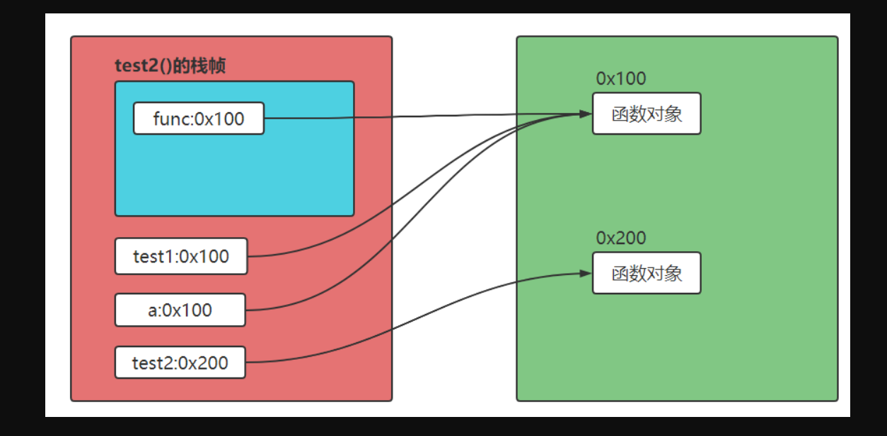
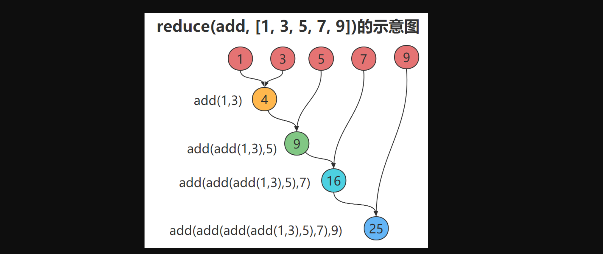

### 1，什么是函数式编程

函数式编程(functional programming)其实是个很古老的概念，诞生距今快60年啦！最古老的函数式编程语言Lisp。新出现的函数式编程语言：比如Erlang、Scala、clojure等。热门语言：Python、java、JavaScript、C++等都增加了函数式编程的一些特性。函数式编程在某些时刻，非常方便！但不需大家二选一。我们通过一些常见的函数式编程的内容，先学习，后体会“函数式编程”。


**函数是一等公民：**

- 函数式编程最鲜明的特点就是：函数是一等公民（first class），指的是函数与其他数据类型一样，处于平等地位，可以赋值给其他变量，也可以作为参数，传入另一个函数，或者作为别的函数的返回值。
- 一个函数可以接收另一个函数作为参数，这种函数就称之为高阶函数。
- Python内建的高阶函数有`map`、`reduce`、`filter`、`sorted`


高阶函数案例：

```python
#coding=utf-8
def test1():
  print("I'm test!")

def test2(func):  # test2就是一个高阶函数
  func()
  print("test2 running...")

if __name__ == '__main__':
  print(test1) # 
  print(type(test1)) # 
  a = test1  # a和test1都指向了同一个函数对象
  a()   # I'm test!
  test2(a)  #a作为参数传递给test2()
```


上面代码，内存示意图如下：




### 2，Lambda表达式和匿名函数


`lambda`表达式可以用来声明匿名函数。`lambda`函数是一种简单的、在同一行中定义函数的方法。`lambda`函数实际生成了一个函数对象。`lambda`表达式只允许包含一个表达式，不能包含复杂语句，该表达式的计算结果就是函数的返回值。`lambda`表达式的基本语法如下：

```python
lambda arg1,arg2,arg3...  : <表达式>
```

`arg1` `arg2` `arg3`为函数的参数。<表达式>相当于函数体。运算结果是：表达式的运算结果。


lambda表达式使用:

```python
f = lambda a,b,c:a+b+c
print(f)
print(f(2,3,4))

g = [lambda a:a*2,lambda b:b*3,lambda c:c*4]
print(g[0](6),g[1](7),g[2](8))
```


执行结果：

```python
<function <lambda> at 0x0000000002BB8620>
9
12 21 32
```


### 3，偏函数

Python的`functools`模块提供了很多有用的功能，其中一个就是偏函数（Partial function）。要注意，这里的偏函数和数学意义上的偏函数不一样。


偏函数： 作用就是把一个函数某些参数固定住（也就是设置默认值），返回一个新的函数，调用这个新的函数会更简单。


举例如下：`int()`函数可以把字符串转换为整数，当仅传入字符串时，`int()`函数默认按十进制转换，代码如下：

```python
print(int('12345'))
```


但int()函数还提供额外的base参数，默认值为10。如果传入base参数，就可以做N进制的转换：

```python
#base参数
print('转换为八进制',int('12345', base=8))
print('转换为十六进制',int('12345', 16))
```


假设要转换大量的二进制字符串，每次都传入`int(x, base=2)`非常麻烦，于是，我们想到，可以定义一个`int2()`的函数，默认把`base=2`传进去，现在定义一个`int2`函数，代码如下：

```python
def int2(x, base=2):
  return int(x, base)

print(int2('1000000')) #64
print(int2('1010101')) #85
```


`functools.partial`就是帮助我们创建一个偏函数的，不需要我们自己定义`int2()`，可以直接使用下面的代码创建一个新的函数`int2`：

```python
#coding=utf-8
import functools
int2 = functools.partial(int, base=2)
print(int2('1000000')) #64
print(int2('1010101')) #85
print(int2('1000000', base=10)) #也可以修改base的值
```


### 4，闭包

根据字面意思，可以形象地把闭包理解为一个封闭的包裹，这个包裹就是一个函数。当然，还有函数内部对应的逻辑，包裹里面的东西就是自由变量(外部函数的局部变量)，自由变量可以随着包裹到处游荡。

- 局部变量：如果名称绑定再一个代码块中，则为该代码块的局部变量，除非声明为nonlocal或global
- 全局变量：如果模块绑定在模块层级，则为全局变量
- 自由变量：如果变量在一个代码块中被使用但不是在其中定义，则为自由变量


**闭包概念和第一个闭包程序：**

我们知道，函数作用域是独立的、封闭的，外部的执行环境是访问不了的，但是闭包具有这个能力和权限。闭包是一个函数，只不过这个函数有[超能力]，可以访问到另一个函数的作用域。「函数」和「自由变量」的总和，就是一个闭包。


**闭包的特点：**

- 第一，闭包是一个函数，而且存在于另一个函数当中
- 第二，闭包可以访问到父级函数的变量，且该变量不会销毁


一个简单的闭包：

```python
#coding=utf-8
"""
闭包的特点：
1. 存在内外层函数嵌套的情况
2. 内层函数引用了外层函数的变量或者参数（自由变量）
3. 外层函数把内层的这个函数本身当作返回值进行返回，而不是返回内层函数产生的某个值
"""
def outer():
  a = 1
  def inner():
    nonlocal a
    #闭包是由于函数内部使用了函数外部的变量。这个函数对象不销毁，则外部函数的局部变量也不会被销毁！
    print("a:",a)
    a += 1
  return inner

inn = outer()
inn()
inn()

"""
a: 1
a: 2
a: 3
a: 4
"""
```


**闭包的作用:**

- 作用1：隐藏变量，避免全局污染

- 作用2：可以读取函数内部的变量


**同时闭包使用不当，优点就变成了缺点：**

- 缺点1：导致变量不会被垃圾回收机制回收，造成内存消耗

- 缺点2：不恰当的使用闭包可能会造成内存泄漏的问题


使用全局变量实现变量自增，但污染了其他程序

```python
#coding=utf-8
#需求：实现变量a 自增
#通过全局变量，可以实现，但会污染其他程序
a = 10
def add():
  global a
  a+=1
  print("a:",a)

def print_ten():
  if a==10:
    print("ten!")
  else:
    print("全局变量a，不等于10")

add()
add()
add()
print_ten()
"""
运行效果：
a: 11
a: 12
a: 13
全局变量a，不等于10
"""
```


定义局部变量，不污染，但无法递增

```python
#coding=utf-8
#需求：实现变量a 自增
#通过局部变量，不能实现递增
a = 10
def add():
  a = 10
  a += 1
  print("a:",a)

def print_ten():
  if a==10:
    print("ten!")
  else:
    print("全局变量a，不等于10")

add()
add()
add()
print_ten()
"""
运行结果：
a: 11
a: 11
a: 11
ten!
"""
```


通过闭包，可以是函数内部局部变量递增，也不会影响全部变量，完美!!

```python
#coding=utf-8
#需求：实现变量a 自增
#通过闭包，也没有污染全局变量a。也实现了自增
a = 10
def add():
  a = 10
  def increment():
    nonlocal a
    a +=1
    print("a:",a)
  return increment

def print_ten():
  if a==10:
    print("ten!")
  else:
    print("全局变量a，不等于10")

increment = add()
increment()
increment()
increment()
print_ten()
print("global a:",a)
"""
运算结果：
a: 11
a: 12
a: 13
ten!
global a:10
"""
```


说明：

1. 闭包在爬虫以及web应用中都有很广泛的应用
2. 闭包也是装饰器的基础
3. 我们后续可以通过实际场景使用闭包，本节课掌握基本语法即可


案例：用闭包实现不修改源码添加功能

```python
# coding=utf-8
# 本次内容，是装饰器的基础
def outfunc(func):
  def infunc(*args,**kwargs):
    print("日志纪录 start...")
    func(*args,**kwargs)
    print("日志纪录 end...")
  return infunc

def fun1():
  print("使用功能1")

def fun2(a,b,c):
  print("使用功能2",a,b,c)

print(id(fun1))
fun1 = outfunc(fun1)
print(id(fun1))
fun1()
fun2 = outfunc(fun2)
fun2(100,200,300)
```


### 5，map函数的使用

`map()`函数接收两种参数，一是函数，一种是序列(可以传入多个序列)，map将传入的函数依次作用到序列的每个元素，并把结果作为新的list返回。比如我们有一个函数f(x)=x2，要把这个函数作用在一个list [1, 2, 3, 4, 5, 6, 7, 8, 9]上，就可以用map()实现如下：

```python
def f(x):
  return x * x

L=map(f,[1, 2, 3, 4, 5, 6, 7, 8, 9])
print(list(L))
```


当然，不需要map()函数，也可以计算出结果，写一个循环，实现代码如下：

```python
def f(x):
  return x * x
L = []
for n in [1, 2, 3, 4, 5, 6, 7, 8, 9]:
  L.append(f(n))
print(L)
```


map高阶函数的使用案例(用匿名函数)

```python
L=map(lambda n:n*n,[1, 2, 3, 4, 5, 6, 7, 8, 9])
print(list(L))
```


map函数传入两个列表

```python
def f2(x,y):
  return x+y
L=map(f2,[1,2,3,4],[10,20,30])
print(list(L))
```


map函数传入两个列表（用匿名函数）

```python
L=map(lambda x,y:x+y,[1,2,3,4],[10,20,30])
print(list(L))
```


### 6，reduce函数的使用




reduce位于`functools`模块。reduce把一个函数作用在一个序列[x1, x2, x3...]上，这个函数必须接收两个参数，reduce把结果继续和序列的下一个元素做累积计算，其效果就是：

```python
reduce(f, [x1, x2, x3, x4]) = f(f(f(x1, x2), x3), x4)
```


reduce实现对一个序列求和

```python
from functools import reduce
def add(x, y):
  return x + y
sum=reduce(add, [1, 3, 5, 7, 9])
print(sum)
```


### 7，filter函数的使用

内置函数`filter()`用于过滤序列。filter()把传入的函数依次作用于每个元素，然后根据返回值是True还是False, 决定保留还是丢弃该元素。


filter过滤列表，删掉偶数，只保留奇数

```python
# 在一个list中，删掉偶数，只保留奇数
def is_odd(n):
  return n % 2 == 1
L=filter(is_odd, [1, 2, 4, 5])
print(list(L))
```


或者用匿名函数实现：

```python
L=filter(lambda n:n%2==1, [1, 2, 4, 5])
print(list(L))
```


filter序列中的空字符串删掉

```python
def not_empty(s):
  return s and s.strip()

L=filter(not_empty, ['A', '', 'B', None, 'C', '  '])
print(list(L))
```


或者用匿名函数实现：

```python
L=filter(lambda s:(s and s.strip()), ['A', '', 'B', None, 'C', '  '])
```


### 8，sorted排序和自定义对象的排序

排序算法，排序也是在程序中经常用到的算法。无论使用冒泡排序还是快速排序，排序的核心是比较两个元素的大小。

1. 如果是数字，我们可以直接比较
2. 如果是自定义对象呢？直接比较数学上的大小是没有意义的，因此，比较的过程必须通过函数抽象出来。通常规定，对于两个元素x和y，如果认为x < y，则返回-1，如果认为x == y，则返回0，如果认为x > y，则返回1，这样，排序算法就不用关心具体的比较过程，而是根据比较结果直接排序。


sorted对list进行排序

```python
sorter1 = sorted([1,3,6,-20,34])
print("升序排列:",sorter1)
```


`sorted()`函数也是一个高阶函数，它还可以接收一个`key`函数来实现自定义的排序。sorted函数接收一个key自定义排序

```python
sorter1 = sorted([1,3,6,-20,34])
print("升序排列:",sorter1)

# sorted()函数也是高阶函数，它还可以接收一个key函数来实现自定义的排序
sorter2 = sorted([1,3,6,-20,-70],key=abs)
print("自定义排序:",sorter2)

sorter2 = sorted([1,3,6,-20,-70],key=abs,reverse=True)
print("自定义反向排序:",sorter2)

# 4.2 字符串排序依照ASCII
sorter3 = sorted(["ABC","abc","D","d"])
print("字符串排序:",sorter3)

# 4.3 忽略大小写排序
sorter4 = sorted(["ABC","abc","D","d"],key=str.lower)
print("忽略字符串大小写排序:",sorter4)

# 4.4 要进行反向排序，不必改动key函数，可以传入第三个参数reverse=True：
sorter5 = sorted(["ABC","abc","D","d"],key=str.lower,reverse=True)
print("忽略字符串大小写反向排序:",sorter5)
```


sorted对自定义对象的排序

```python
from functools import cmp_to_key

class Student:
  def __init__(self, age, name):
    self.name = name
    self.age = age

def custom_sorted(stu1,stu2):
  if stu1.age < stu2.age:
    return -1
  if stu1.age > stu2.age:
    return 1
  return 0

stu1 = Student(41, 'aaa')
stu2 = Student(21, 'ccc')
stu3 = Student(31, 'bbb')
# student_list = sorted([stu1, stu2, stu3], key=lambda x: x.age)
student_list = sorted([stu1, stu2, stu3], key=cmp_to_key(custom_sorted))
for stu in student_list:
  print('name:', stu.name, 'age:', stu.age)
```


