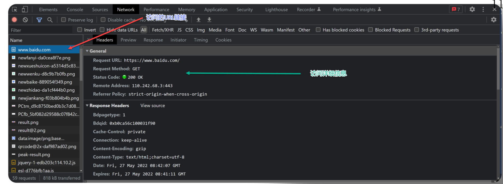

## 一，爬虫介绍


### 1，什么是爬虫


**网络爬虫**也叫**网络蜘蛛**，如果把互联网比喻成一个蜘蛛网，那么蜘蛛就是在网上爬来爬去 的蜘蛛，爬虫程序通过请求url地址，根据响应的内容进行解析采集数据。


简单的说：就是用代码模拟人的行为，去各各网站溜达、点点按钮、查查数据。或者把看到的数据拿下来。 


### 2，爬虫的作用

通过有效的爬虫手段批量采集数据，可以降低人工成本，提高有效数据量，给予运营/销售的数据支撑，加快产品发展。 


**爬虫应用领域** 

- 批量采集某个领域的招聘数据，对某个行业的招聘情况进行分析
- 批量采集某个行业的电商数据，以分析出具体热销商品，进行商业决策 • 采集目标客户数据，以进 行后续营销 
- 批量爬取腾讯动漫的漫画，以实现脱网本地集中浏览 
- 开发一款火车票抢票程序，以实现自动抢票 
- 爬取评论,舆情监控 
- ...


目前互联网产品竞争激烈，业界大部分都会使用爬虫技术对竞品产品的数据进行挖掘、采集、大数据分析，这是必备手段，并且部分公司都设立了爬虫工程师的岗位 


### 3，爬虫的合法性


爬虫是否是合法的呢？

- 有时合法，有时不合法，因情况而定


爬虫是利用程序进行批量爬取网上的公开信息，也就是前端显示的数据信息。因为信息是完全公开的，所以是常规合法的！！！


**合法的爬虫**：

- 公开的数据，没有标识不可爬取
- 不影响别人服务器
- 不影响的业务


**不合法的爬虫：**

- 用户数据 
- 部分网站、APP数据超过指定数量
- 明文规定不让爬取 
  - 在域名后加上 /robots.txt 查看 
  - 页面上标明 

- 影响业务 
- 影响服务器（类似DDOS攻击的问题 ）


> 部分爬虫虽然违法，但公司、或企业不会直接报警。会采用反爬的手段，严重后才会报警


### 4，反爬与反反爬


反爬：有时企业不想自己的数据被别人拿到。这时就会设置反爬的手段，来不让爬虫获取数据。

反爬虫常用一些手段：

- 合法检测：请求校验(useragent，referer，接口加签 ，等)
- 验证码：识别文字、做题、滑动等
- 小黑屋：IP/用户限制请求频率，或者直接拦截
- 投毒：反爬虫高境界可以不用拦截，拦截是一时的，投毒返回虚假数据，可以误导竞品决策
- ...


反反爬：破解掉反爬手段，再获取其数据。理论上说所有的手段都能破解，但是还要看程序员的技术。


为什么选择Python? 只要能发网络请求，其实都是可以写爬虫的。之所以使用Python，原因是：

- 简单
- 高效
- 三方模块库多


### 5，爬虫的基本流程


#### 1）基本流程

- 目标数据：想要什么数据
- 来源地址
- 结构分析
  - 具体数据在哪(网站、还是APP)
  - 如何展示的数据
- 实现构思
- 开始编码


#### 2）基本手段

破解请求限制

- 请求头设置，如：useragant为有效客户端
- 控制请求频率(根据实际情景)
- IP代理
- 签名/加密参数从html/cookie/js分析

破解登录授权

- 请求带上用户cookie信息

破解验证码

- 简单的验证码可以使用识图读验证码第三方库


#### 3）解析数据

HTML Dom解析

- 正则匹配，通过的正则表达式来匹配想要爬取的数据，如：有些数据不是在html 标签里，而是在html的script 标签的js变量中
- 使用第三方库解析html dom，比较喜欢类jquery的库

数据字符串

- 转 JSON/XML 对象进行解析
- 正则匹配(根据情景使用)


### 6，浏览器的开发者工具

对于爬虫来说，最核心的就是发送请求，让网络服务器返回相应的数据。而最为核心之一就是找到URL，这时就需要一个可以帮助我们分析URL的工具，浏览器开发者工具





## 二，urllib模块


### 1，第一个爬虫


urllib模块库是python自带的。在Python2叫urllib2。使用urllib模块中的urlopen就可以发请求，代码演示：

```python
from urllib.request import urlopen

response = urlopen("http://www.baidu.com")
print(response.read().decode())
```


### 2，urllib的基本使用


requset.urlopen(url,data,timeout)

- 第一个参数url即为URL，是必须要传送的。第二个参数data是访问URL时要传送的数据，第三个timeout是设置超时时间。 
- 第二三个参数是可以不传送的，data默认为空None，timeout默认为socket._GLOBAL_DEFAULT_TIMEOUT


response.read()

- read()方法就是读取文件里的全部内容，返回bytes类型


response.getcode()

- 返回 HTTP的响应码，成功返回200，4服务器页面出错，5服务器问题


response.geturl()

- 返回 返回实际数据的实际URL，防止重定向问题


response.info()

- 返回 服务器响应的HTTP报头


代码演示：

```python
from urllib.request import urlopen

# 定义发送的位置
url = 'http://www.baidu.com/'
# 发送请求，并将结果返回给resp
resp = urlopen(url)
# 打印响应数据
print(resp.read()[:100])
# 获取响应码(为了判断是否要处理请求的结果)
print(resp.getcode())
# 获取访问的url(为了记录访问记录，避免2次访问，导致出现重复数据)
print(resp.geturl())
# 获取响应头信息(响应头的信息，取到里面有用的数据)
print(resp.info())
```


### 3，Request对象使用


使用urllib.request.urlopen发送请求时，可以将参数封装到一个Request对象中。 参数包含：

- url 发送的请求链接
- headers 请求头信息 
- data 请求数据 


代码演示：

```python
from urllib.request import Request,urlopen

# url = 'http://www.baidu.com/'
url = 'http://httpbin.org/get'

# 定义headers信息
headers = {'User-Agent':'Mozilla/5.0 Python666666666'}
# 创建Request
req = Request(url,headers=headers)
# 发送请求
resp = urlopen(req)
# 打印结果
print(resp.read().decode())
```

运行结果和直接传递URL完全一样的，只不过中间多了一个request对象，推荐大家这么写，因为在构建请求时还需要加入好多内容，通过构建一个request，服务器响应请求得到应答，这样显得逻辑上清晰明确


发送请求/响应header头的含义：


### 4，urllib发送get请求

Get请求的参数都是在Url中体现的,如果有中文,需要转码,这时我们可使用

- urllib.parse.urlencode() 转换键值对
- urllib.parse. quote() 转换一个值


urllib.parse. quote的使用，代码演示：

```python
from urllib.request import urlopen,Request
from urllib.parse import quote
# UnicodeEncodeError: 'ascii' codec can't encode characters in position 16-17: ordinal not in range(128)
# url里的参数，不能有中文

args = 'python爬虫'
url = f'https://www.baidu.com/s?wd={quote(args)}'
headers = {'User-Agent':'xxx','Cookie':"yyyy"}

req = Request(url,headers=headers)
resp = urlopen(req)
print(resp.read().decode())
```


urllib.parse.urlencode的使用，代码演示：

```python
from urllib.request import urlopen,Request
from urllib.parse import urlencode

args ={'wd':'python爬虫'}

url = f'https://www.baidu.com/s?{urlencode(args)}'
headers = {'User-Agent':'xxx','Cookie':"yyyy"}
req = Request(url,headers=headers)
resp = urlopen(req)
print(resp.read().decode()[:1500])
```


### 5，喜马拉雅网站

目标：https://www.ximalaya.com/yinyue/


代码演示：

```python
from time import sleep
from urllib.request import urlopen,Request

def spider_music(_type,page):
    # 构造url
    for num in range(1,page+1):
        if num == 1:
            url = f'https://www.ximalaya.com/yinyue/{_type}'
        else:
            url = f'https://www.ximalaya.com/yinyue/{_type}/p{num}'

        headers = {'User-Agent':'Mozilla/5.0 (Windows NT 10.0; Win64; x64) AppleWebKit/537.36 (KHTML, like Gecko) Chrome/102.0.5005.63 Safari/537.36'}
        # 构造请求对象
        req = Request(url,headers=headers)
        # 发出请求
        resp = urlopen(req)
        # 获取响应
        print(resp.getcode())
        print(resp.geturl())
        print(resp.read().decode()[:100])
        sleep(1)

if __name__ == '__main__':
    spider_music('minyao',3)
```


### 6，urllist发送post请求


测试网站：https://www.kuaidaili.com/

- 用户名：15515818827
- 密码：xu1023yu


我们测试登录接口，分析登录接口如下：


携带的参数如下：


代码演示，如下：

```python
from urllib.parse import urlencode
from urllib.request import urlopen,Request

# 地址
url = 'https://www.kuaidaili.com/login/'

# 数据
data = {
    'username': '15515818827',
    'password': 'xu1023yu111',
    'login_type': '1',
    'remember': '1'
}
tru_data = urlencode(data).encode()

# 头
headers = {
    'User-Agent':'Mozilla/5.0 (Windows NT 10.0; Win64; x64) AppleWebKit/537.36 (KHTML, like Gecko) Chrome/121.0.0.0 Safari/537.36'
}
# 请求对象
req = Request(url, data=tru_data, headers=headers)
# 发出请求
resp = urlopen(req)
# 结果
print(resp.read().decode())
```


### 7，获取动态页面数据


目标网站：https://www.hupu.com/


分析：


网络的页面分为2大类：

- 静态页面
  - 特征：访问有UI页面URL,可以直接获取数据
- 动态页面(AJAX)
  - 特征：访问有UI页面URL,不能获取数据。需要抓取新的请求获取数据


有些网页内容使用AJAX加载，而AJAX一般返回的是JSON,直接对AJAX地址进行post或get，就返回JSON数据了。代码演示：

```python
from urllib.request import urlopen,Request

# 地址
url = 'https://www.hupu.com/home/v1/news?pageNo=2&pageSize=50'

# 头
headers = {
    'User-Agent':'Mozilla/5.0 (Windows NT 10.0; Win64; x64) AppleWebKit/537.36 (KHTML, like Gecko) Chrome/121.0.0.0 Safari/537.36'
}
# 请求对象
req = Request(url, headers=headers)
# 发出请求
resp = urlopen(req)
# 结果
print(resp.read().decode())
```


### 8，请求SSL证书验证


现在随处可见 https 开头的网站，urllib可以为 HTTPS 请求验证SSL证书，就像web浏览器一样，如果网站的SSL证书是经过CA认证的，则能够正常访问，如：https://www.baidu.com/ 。如果SSL证书验证不通过，或者操作系统不信任服务器的安全证书，比如浏览器在访问12306网站如：https://www.12306.cn/mormhweb/的时候，会警告用户证书不受信任。（据说 12306 网站证书是自己做的，没有通过CA认证） 


忽略SSL安全认证，代码演示：

```python
import ssl
# 忽略SSL安全认证
context = ssl._create_unverified_context()
# 添加到context参数里
response = urlopen(request, context = context)
```


### 9，伪装自己的请求头

上面演示的程序中User-Agent每次都是我们自己copy，每次都一样的。有些网站不会同意程序直接用上面的方式进行访问，如果识别有问题，那么站点根本不会响应，所以为了完全模拟浏览器的工作，我们需要伪装自己的请求头。安装模块：

```
pip install fake-useragent
```


代码演示：

```python
from fake_useragent import UserAgent

ua = UserAgent()

# print(ua.chrome)
# print(ua.chrome)
# print(ua.chrome)
# print(ua.firefox)
# print(ua.firefox)

from urllib.request import urlopen,Request

url = 'http://httpbin.org/get'
header ={'User-Agent':ua.chrome}
req = Request(url,headers=header)
resp = urlopen(req)
print(resp.read().decode())
```


### 10，urllib的底层原理


当你获取一个URL你使用一个opener(一个urllib.OpenerDirector的实例)。在前面，我们都是使用的默认的opener，也就是urlopen。它是一个特殊的opener，可以理解成opener的一个特殊实例，传入的参数仅仅是url，data，timeout。如果我们需要用到Cookie，只用这个opener是不能达到目的的，所以我们需要创建更一般的opener来实现对Cookie的设置。


代码演示：

```python
from urllib.request import urlopen,build_opener
from urllib.request import Request,HTTPHandler
from fake_useragent import UserAgent

url = 'http://httpbin.org/get'
headers = {'User-Agent':UserAgent().chrome}
# 封装request
req = Request(url,headers= headers)
# 创建一个Handler对象, 支持处理HTTP请求, 同时开启Debug Log，debuglevel 值默认 0
handler = HTTPHandler(debuglevel=1)
# 构建opener
opener = build_opener(handler)
# 通过opener发送请求
resp = opener.open(req)
# 打印结果
print(resp.read().decode())
```


### 11，设置代理

爬虫设置代理就是让别的服务器或电脑代替自己的服务器去获取数据。没有代理的情况下：


设置代理的情况下：


**代理分类** 

- 透明代理：目标网站知道你使用了代理并且知道你的源IP地址，这种代理显然不符合我们这里使用代理的初衷 
- 匿名代理：匿名程度比较低，也就是网站知道你使用了代理，但是并不知道你的源IP地址 
- 高匿代理：这是最保险的方式，目标网站既不知道你使用的代理更不知道你的源IP


**代理网站**（代理网站目前可用，但不一定稳定。毕竟这个产业目前情况就是这样）

- 小象代理  https://www.xiaoxiangdaili.com/

- 快代理  https://www.kuaidaili.com

- 云代理   http://www.ip3366.net

- 66ip代理  http://www.66ip.cn

- 站大爷  https://www.zdaye.com/

- 开心代理  http://ip.kxdaili.com/

- 讯代理  http://www.xdaili.cn/

  

代理IP无论是免费，还是付费，都不能保证一定可用

- 可能此IP已被其他人使用爬取同样的目标网站而被封禁
- 代理服务器突然发生故障或网络繁忙


代理IP的使用，代码演示：

```python
from urllib.request import Request,build_opener,ProxyHandler

# 设置访问地址
url = 'http://httpbin.org/get'
# url = 'https://www.baidu.com'
# 设置请求对象
req = Request(url)
# 构建可以使用代理的控制器
# ProxyHandler({'type':'ip:port'})
handler = ProxyHandler({'http':'125.87.88.1:17129'})
# 构建opener,可以使用代理
opener = build_opener(handler)
# 发送请求
resp = opener.open(req)
# 打印结果
print(resp.read().decode())
```


### 12，Cookie的使用


目标网站：https://www.kuaidaili.com/usercenter/overview


网络部分信息或APP的信息，若是想获取数据时，需要提前做一些操作，往往是需要登录，或者提前访问过某些页面才可以获取到！！ 其实**底层**就是在网页里面增加了Cookie信息 


代码演示：

```python
from urllib.request import urlopen,Request
from fake_useragent import UserAgent

url = 'https://www.kuaidaili.com/usercenter/overview'
header = {
    'User-Agent':UserAgent().chrome,
    'Cookie':'channelid=bdtg_a13_a13a1; sid=1708422905549567; _gid=GA1.2.963495661.1708422906; __51vcke__K3h4gFH3WOf3aJqX=e7b287ef-965a-5729-90ec-116e10f3afbc; __51vuft__K3h4gFH3WOf3aJqX=1708422906241; _gcl_au=1.1.1062928391.1708422907; sessionid=7707aeefd5f03be27c1f8d13f8958428; __51uvsct__K3h4gFH3WOf3aJqX=2; _ga_DC1XM0P4JL=GS1.1.1708430054.2.1.1708430470.59.0.0; _ga=GA1.2.432656953.1708422906; __vtins__K3h4gFH3WOf3aJqX=%7B%22sid%22%3A%20%225d4b070e-96fe-584a-a74c-2abd4591f233%22%2C%20%22vd%22%3A%206%2C%20%22stt%22%3A%20415360%2C%20%22dr%22%3A%20182488%2C%20%22expires%22%3A%201708432270129%2C%20%22ct%22%3A%201708430470129%7D'
}
req = Request(url,headers=header)
# 发送请求
resp = urlopen(req)
# 获取请求数据
with open('tmp.html','wb') as f:
    f.write(resp.read())
```


### 13，urllib的异常处理

**错误类型 **

- 服务器错误 

- 资源错误 

- 请求超时 


代码演示：

```python
from urllib.request import Request,urlopen
from fake_useragent import UserAgent
from urllib.error import URLError

url = 'https://www.boxuegu11111.com/live/detail-1004911111.html?utm_source=bxg'
headers = {'User-Agent':UserAgent().chrome}
req = Request(url,headers=headers)
try:
    resp = urlopen(req)
    print(resp.read().decode()[:1000])
except URLError as e:
    if e.args:
        print(e.args[0].errno)
    else:
        print(e.code)
print('爬虫完成')
```


## 三，requests模块


