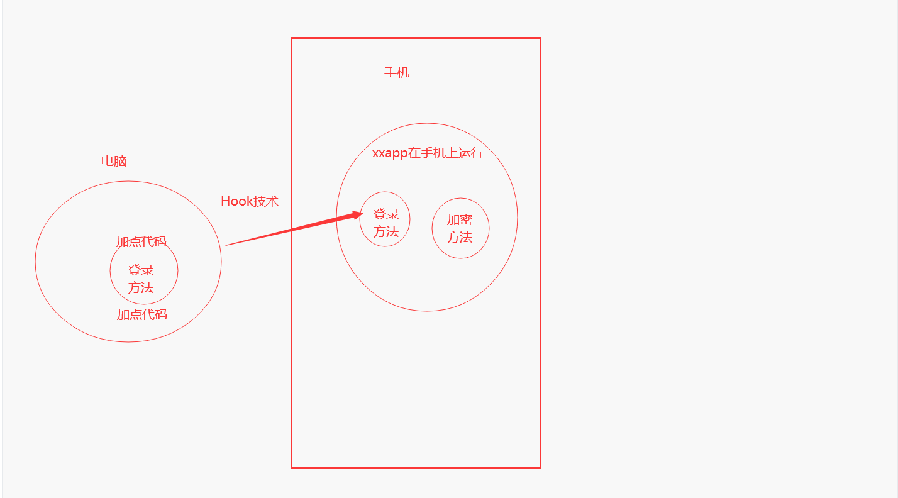
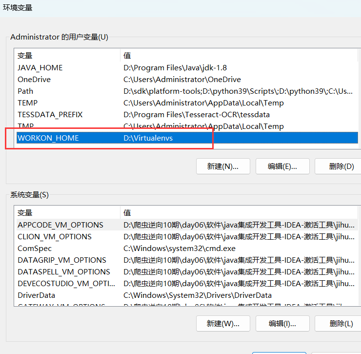
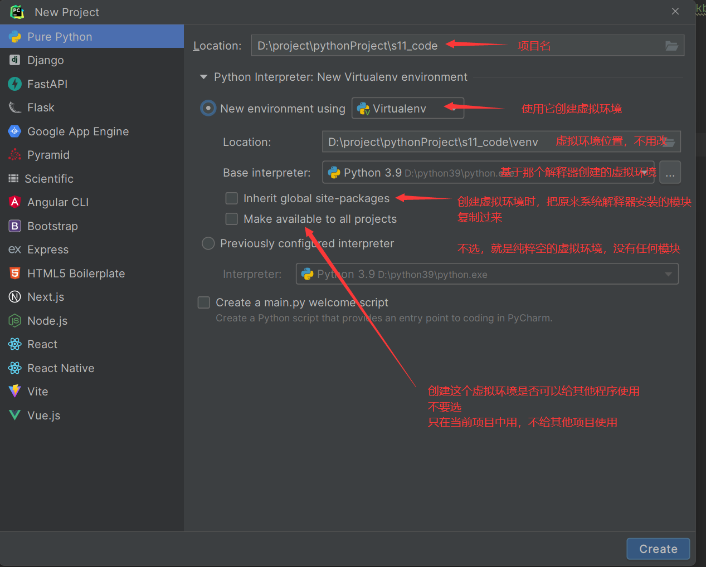
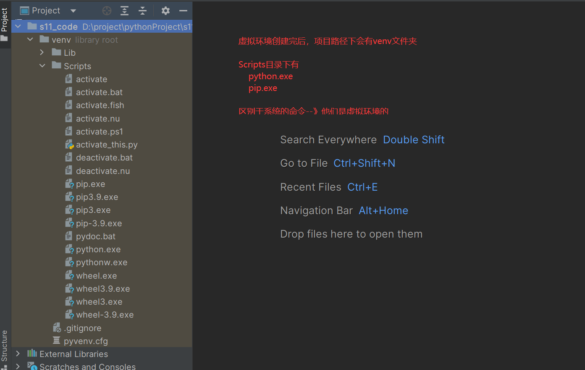
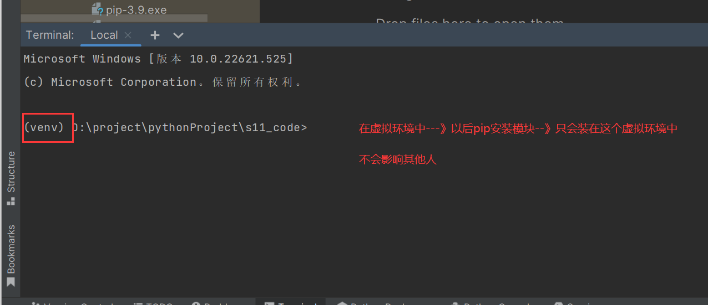
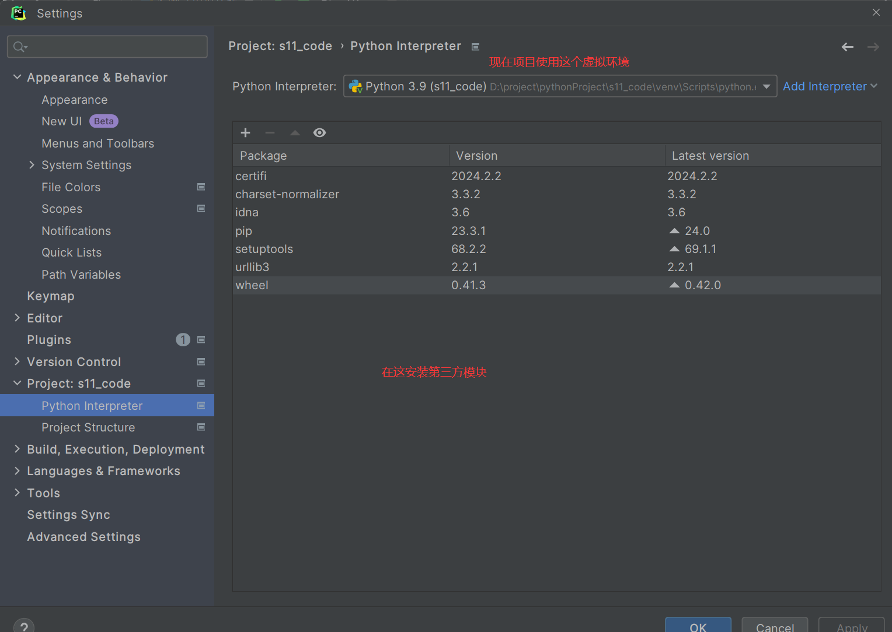

# 一， 逆向必备

## 1.1 app逆向原理

```python
# app逆向==>安卓app逆向==>不涉及ios平台
安卓正向开发流程：
	安卓工程师==>使用java语法(kotiln)+安卓框架(SDK)==>java+c【JNI】==>AndroidStadio==>编译成 xx.apk==>资源文件(图片，声音)/xx.dex/xx.so
    
安卓逆向:
	安卓逆向工程师==>拿到破解的app的xx.apk==>反编译(java代码反编译出来)==>搜索关键字读java代码逻辑==>Hook工具==>Python 模拟发送请求，破解加密==>获取到我们想要的数据
    
    -反编译
    -Hook


# 为什么现在apk越来越大
	-使用第三方组件
    -视频，声音，图片文件（占大头）
    -java代码编译后
    -so代码编译后
    
    
 # apk下载位置
	app官网下载
    豌豆荚平台下载
    不建议去小米或华为应用商店
```

##  1.2 什么是反编译

```python
# 反编译是指将已编译的安卓应用程序（APK文件）转换回其源代码的过程。
通常，安卓应用程序在开发过程中会经过编译，将源代码转换为可执行的二进制代码，这使得源代码不可见和难以理解。反编译的过程旨在还原应用程序的源代码，以便进行分析、理解和修改。

# 通过安卓反编译，你可以获取应用程序的源代码，了解其实现逻辑、算法、资源文件和其他关键信息。这对于安卓应用程序的安全评估、漏洞分析、逆向工程、定制化和学习都有重要意义。

# 常见的反编译工具有哪些？
apktool：apktool是一款常用的开源工具，用于反编译和重新打包APK文件。它可以将APK文件解压为资源文件和Smali代码，并提供了对Smali代码进行分析和编辑的功能。

JADX：JADX是一款功能强大的开源工具，用于将APK文件转换为可读的Java源代码。它能够还原大部分Java代码，并提供源代码分析和导航功能。（咱们学习用）

JD-GUI：JD-GUI是一款免费的Java反编译工具，可以将已编译的Java类文件转换为可读的Java源代码。尽管它主要用于Java反编译，但对于某些Smali代码的反编译也有一定的支持


# 下载安装jax---》需要先安装jdk
1 下载jdk https://www.oracle.com/java/technologies/downloads/#java8 安装
2 解压提供的压缩包：jadx-1.2.0.zip
3 运行/bin/jadx-gui
4 随便把一个apk拖入进去即可
```


## 1.3 什么是hook

```python
# HOOK指的是通过修改或替换目标应用程序的函数或方法来改变其行为的技术。
-比如app有个登录功能(函数)---》通过hook--》动态修改，替换登录的代码--》实现我们自己的操作
-打印出传入的参数，打印出加密后的字符串。。。

这种技术允许开发者或黑客在不修改应用程序源代码的情况下，对其进行定制、调试、修改或篡改。


# 在安卓中，常见的HOOK技术有以下几种：

动态链接库（DLL）注入：通过加载一个自定义的动态链接库来替换目标应用程序的某些函数或方法。这种方式通常需要在ROOT权限下进行，并且需要一些额外的工具和技术，如Xposed Framework或Frida。

Xposed框架：Xposed是一款强大的安卓框架，它提供了一种简单的方式来HOOK安卓应用程序。通过Xposed框架，开发者可以编写模块，用于修改或替换目标应用程序的函数或方法。

Frida框架：Frida是一款功能强大的动态分析工具，它提供了在运行时修改和HOOK应用程序的能力。通过Frida，开发者可以使用JavaScript编写脚本，动态修改目标应用程序的行为
```



## 1.4 电脑设备选择

```python
# mac  win 系统均可
	-讲课以win为例
    
# 开的软件非常吃内存

# 建议大家 i5,16g内存以上

# 配置越高越好
```

## 1.5 安卓设备选择

```python
# 1 模拟器---》装在电脑上---》后续有些app是不支持模拟器--》会做模拟器检测（不建议用）
	win：网易mumu，逍遥、夜神、雷电（推荐3版本，不要用4版，以后抓包会有问题）
    mac：网易mumu（暂时不支持m1芯片）
    
    
# 2 安卓真机  Pixel 2 XL
	推荐：谷歌手机(国内不卖)--》安卓系统更贴合---》aosp--》刷到谷歌手机
    注意：买的时候，问一下，是否解了oem锁，必须要买解oem锁的手机
    	问商家--》有没有解oem锁--》如果没解，就别买了
        因为刷机要root，必须解oem锁
    	欧版，美版
# 3 小米手机--》也可以用-》如果要root，必须先解开bl锁--》去小米官方提交申请--》7天审批通过
	最终要root手机---》现在支持root
    自己root
    淘宝找人root

# 4 华为手机--》不支持root了


# 5 有一款root过后的安卓手机, 安卓版本8及以上即可
```

## 1.6 补充谷歌手机各个型号

```python
# 以下是Nexus和Pixel手机的一些常见型号、版本和发布时间的简要列表：
## Nexus手机系列：
Nexus One - Android 2.1 Eclair - 2010年1月发布
Nexus S - Android 2.3 Gingerbread - 2010年12月发布
Galaxy Nexus - Android 4.0 Ice Cream Sandwich - 2011年11月发布
Nexus 4 - Android 4.2 Jelly Bean - 2012年11月发布
Nexus 5 - Android 4.4 KitKat - 2013年10月发布
Nexus 6 - Android 5.0 Lollipop - 2014年10月发布
Nexus 5X - Android 6.0 Marshmallow - 2015年9月发布
Nexus 6P - Android 6.0 Marshmallow - 2015年9月发布
Nexus 9 - Android 5.0 Lollipop - 2014年11月发布
Nexus Player - Android 5.0 Lollipop - 2014年11月发布
## Pixel手机系列：
Pixel - Android 7.1 Nougat - 2016年10月发布
Pixel XL - Android 7.1 Nougat - 2016年10月发布
Pixel 2 - Android 8.0 Oreo - 2017年10月发布
Pixel 2 XL - Android 8.0 Oreo - 2017年10月发布  # 建议买 老师用的  380左右 拼多多 淘宝，闲鱼
Pixel 3 - Android 9 Pie - 2018年10月发布
Pixel 3 XL - Android 9 Pie - 2018年10月发布
Pixel 3a - Android 9 Pie - 2019年5月发布
Pixel 3a XL - Android 9 Pie - 2019年5月发布
Pixel 4 - Android 10 - 2019年10月发布
Pixel 4 XL - Android 10 - 2019年10月发布   # 建议买 600左右
Pixel 4a - Android 10 - 2020年8月发布
Pixel 4a (5G) - Android 11 - 2020年9月发布
Pixel 5 - Android 11 - 2020年9月发布
Pixel 6和Pixel 6 Pro  -2021年9月发布
Pixel 7a、Pixel 7     -2023年5月发布
```

## 1.7 什么是bl锁，什么是oem锁

```python
"Pixel开启OEM锁"，通常指的是在Google Pixel设备上启用了OEM锁（也称为Bootloader锁）。
OEM锁是一个安全机制，目的是保护设备免受未经授权的修改和潜在的安全威胁

# 如何开启oem锁：https://www.cnblogs.com/liuqingzheng/p/17462146.html
```


# 6 Root设备

## 6.1 root 是什么

```python
ROOT是指获取安卓设备（手机或平板电脑）的超级用户权限，也被称为管理员或根用户权限。通过Root手机，用户可以获得对操作系统的完全控制权限，可以访问和修改系统文件、安装自定义固件、运行需要Root权限的应用程序等。


# Root权限的好处包括：
定制化：Root后，用户可以更深入地定制和个性化他们的设备，如更改主题、修改系统设置、安装自定义ROM等。
删除预装应用程序：有些设备预装了一些无法卸载的应用程序，通过Root可以删除这些预装应用程序，释放存储空间和系统资源。
安装和运行需要Root权限的应用程序：有些应用程序需要Root权限才能正常工作，例如一些备份工具、系统优化工具等。
提高性能和扩展功能：通过Root权限，用户可以进行一些系统优化和调整，以提高设备的性能和功能。

# root坏处
需要注意的是，Root手机可能存在一些风险和潜在的问题，包括安全性问题、失去设备保修、无法正常升级系统等。
Root手机也可能违反设备制造商的保修条款，因此在进行Root操作之前，请先查看设备的保修政策

# 最好使用备用机来root，不要使用你现在正在用的手机
```

## 6.1 谷歌pixel手机root方式

```python
# 看10期的视频---》day02
https://www.cnblogs.com/liuqingzheng/p/17462146.html
https://www.cnblogs.com/liuqingzheng/p/17462127.html

```

## 6.2 小米手机root

```python
正常拿到一部手机后需要做：

- 第1步：申请解BL锁
  注册小米账号、手机和账号绑定、申请解锁，申请后一般需等7天才能成功解锁。
  注：淘宝上有人可以秒解，曾有同学新手机被搞的无法开机，又去返厂（请谨慎）。


- 第2步：root，手机root就是获得最高权限，app逆向必备，一般现在的手机root有2种方式：

  - FastBoot刷Magisk，一般分区无法挂载（system目录）【推荐】
    https://www.bilibili.com/video/BV1er4y1C7wU/
    https://magiskcn.com/

  - 淘宝找人代刷（30-50左右）

**注意**：其他机型，请自行解决root问题。
```


# 7 Python虚拟环境

## 7.1 什么是虚拟环境

```python
# 咱么安装了python解释器后，会释放出两个命令
	python：解释器命令
    pip：安装模块命令
    
# 以后安装模块
	pip install  写模块名
    
# 模块安装到了python系统解释器之上

# 出现问题：
	假设咱们有两个项目 假设都用了requests模块
    	第一个项目使用了 requests 1.1版本
        第二个项目使用了 requests 2.1版本
        
# 系统上只能有一个requests模块，并且只能有一个版本

# 运行两个项目：
	运行第一个项目需要卸载requests2.1，安装1.1
    如果运行第二个项目需要卸载requests1.1，安装2.1
    
    
    
 # 使用虚拟环境来解决问题
	-以后你的机上就会有 
    	1 系统环境--》装了一些模块
        2 创建的虚拟环境1--》装了一些模块
        3 创建的虚拟环境2---》装了一些模块
        。。。。。。。
    -他们之间模块是相互不影响的
# 以后，一个项目，使用一个虚拟环境---》每个项目之间--》模块版本就不会相互影响


# 多种解决方案：
  	Virtualenv  # 以它为例
    pipenv
```

## 7.2 win平台安装虚拟环境

```python
# 1 安装两个模块
pip3 install virtualenv
pip3 install virtualenvwrapper-win

# 2 修改环境变量

# 配置环境变量：
# 控制面板 => 系统和安全 => 系统 => 高级系统设置 => 环境变量 => 系统变量 => 点击新建 => 填入变量名与值
变量名：WORKON_HOME  变量值：自定义存放虚拟环境的绝对路径
eg: WORKON_HOME: D:\Virtualenvs

#3  同步配置信息：
# 去向Python3的安装目录 => Scripts文件夹 => virtualenvwrapper.bat => 双击
```




## 7.3 mac，linux平台安装虚拟环境

```python
# 1 安装模块
pip3 install virtualenv
pip3 install virtualenvwrapper

# 2 移动文件（有点麻烦）

# 先找到virtualenvwrapper的工作文件 virtualenvwrapper.sh，该文件可以刷新自定义配置，但需要找到它
# MacOS可能存在的位置 /Library/Frameworks/Python.framework/Versions/版本号文件夹/bin
# Linux可能所在的位置 /usr/local/bin  |  ~/.local/bin  |  /usr/bin
# 建议不管virtualenvwrapper.sh在哪个目录，保证在 /usr/local/bin 目录下有一份
# 如果不在 /usr/local/bin 目录，如在 ~/.local/bin 目录，则复制一份到 /usr/local/bin 目录
	-- sudo cp -rf ~/.local/bin/virtualenvwrapper.sh /usr/local/bin
    
    
 # 3 配置环境变量
# 在 ~/.bash_profile 完成配置，virtualenvwrapper的默认默认存放虚拟环境路径是 ~/.virtualenvs
# WORKON_HOME=自定义存放虚拟环境的绝对路径，需要自定义就解注
VIRTUALENVWRAPPER_PYTHON=/usr/local/bin/python3
source /usr/local/bin/virtualenvwrapper.sh

# 在终端让配置生效：
	source ~/.bash_profile
```


## 7.4 虚拟环境命令的使用（如果使用7.5 方案，就不能用以下命令）

```python
# 创建虚拟环境
 mkvirtualenv -p python3 虚拟环境名称  # 在D:\Virtualenvs 创建出一个文件夹--》就是虚拟环境
    
# 查看自己创建的虚拟环境
workon 

# 今日到虚拟环境
workon 虚拟环境名字
#(luffy) C:\Users\Administrator>  表示进成功了


# 退出虚拟环境
deactivate

# 删除虚拟环境
# 直接到文件夹去删除
rmvirtualenv 虚拟环境名称
```


## 7.5 简单方案（使用pycharm直接创建）

```python
如图
```









## 7.6 导出项目依赖

```python
# Python程序约定俗称的
	在项目根路径下要有个 requirements.txt 文件--》文件中放了当前项目所有的依赖
# 在虚拟环境下执行
pip freeze > requirements.txt

# 就会生成，以后把requirements放在项目中发给别人，别人运行项目时，知道要安装那些模块
```

