### 1, 什么是Spring Cloud Bus


**Config配置中心遇到的问题：**

当我们在更新码云上面的配置以后，如果想要获取到最新的配置，需要手动刷新机制每次提交代码发送请求来刷新客户端，客户端越来越多的时候，需要每个客户端都执行一遍，这种方案就不太适合了。Spring Cloud作为微服务架构的一个综合解决方案，也提供了对应的解决方案Spring Cloud Bus，即消息总线。


**什么是Spring Cloud Bus：**

Spring Cloud Bus通过建立多个应用之间的通信频道，管理和传播应用间的消息，从技术角度来说，应用了AMQP消息代理作为通道，通过MQ的广播机制实现消息的发送和接收。Bus支持两种消息代理：RabbitMQ和Kafka 。

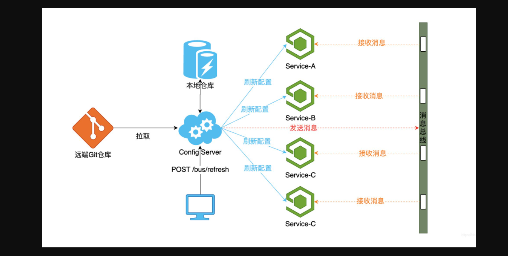

**Spring Cloud Bus做配置更新的步骤:**

1. 修改配置文件，提交代码触发post给客户端A发送bus/refresh
2. 客户端A接收到请求从Server端更新配置并且发送给Spring Cloud Bus
3. Spring Cloud bus接到消息并通知给其它客户端
4. 其它客户端接收到通知，请求Server端获取最新配置
5. 全部客户端均获取到最新的配置


### 2, Docker安装RabbitMQ


下载镜像：

```
docker pull docker.io/macintoshplus/rabbitmq-management
```


启动容器：

```
docker run -d  --name rabbitmq -e RABBITMQ_DEFAULT_USER=guest -e RABBITMQ_DEFAULT_PASS=guest -p 15672:15672 -p 5672:5672 docker.io/macintoshplus/rabbitmq-management
```


**参数：**

- -d： 守护进行运行
- --name：容器名字
- -e：配置用户名和密码
- -p：设置端口号


测试：http://192.168.66.100:15672/

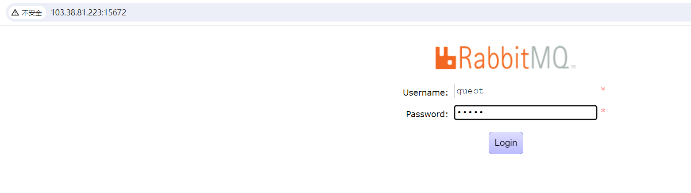

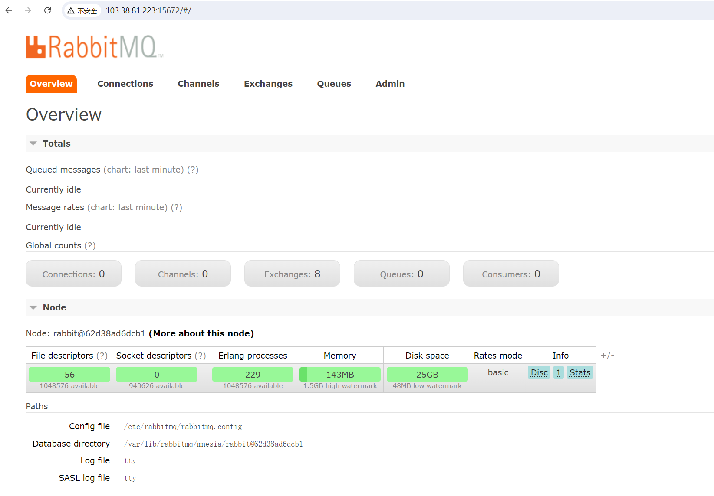


### 3, Bus动态刷新全局广播

新增cloud-config-client3366工程

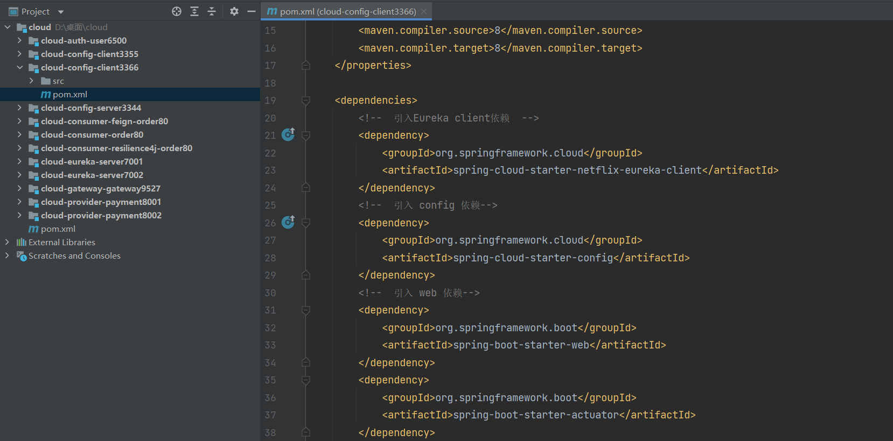


依赖：

```xml
 <dependencies>
    <!--  引入Eureka client依赖  -->
    <dependency>
      <groupId>org.springframework.cloud</groupId>
      <artifactId>spring-cloud-starter-netflix-eureka-client</artifactId>
    </dependency>
    <!--  引入 config 依赖-->
    <dependency>
      <groupId>org.springframework.cloud</groupId>
      <artifactId>spring-cloud-starter-config</artifactId>
    </dependency>
    <!--  引入 web 依赖-->
    <dependency>
      <groupId>org.springframework.boot</groupId>
      <artifactId>spring-boot-starter-web</artifactId>
    </dependency>
    <dependency>
      <groupId>org.springframework.boot</groupId>
      <artifactId>spring-boot-starter-actuator</artifactId>
    </dependency>
    <dependency>
      <groupId>org.springframework.cloud</groupId>
      <artifactId>spring-cloud-starter-bootstrap</artifactId>
    </dependency>
    <dependency>
      <groupId>org.projectlombok</groupId>
      <artifactId>lombok</artifactId>
      <version>1.18.22</version>
    </dependency>
  </dependencies>
```


新增yml配置文件bootstrap.yml

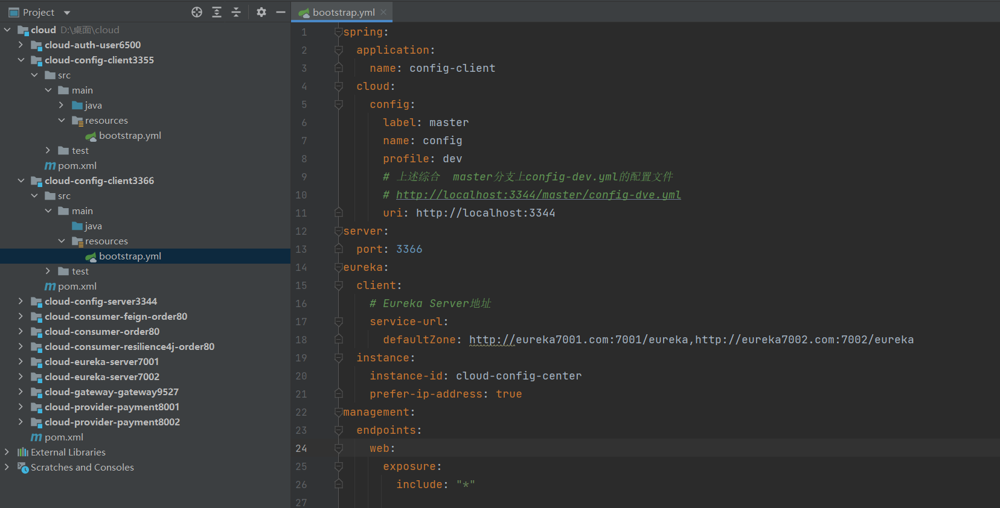

```yml
spring:
  application:
    name: config-client
  cloud:
    config:
      label: master
      name: config
      profile: dev
      # 上述综合  master分支上config-dev.yml的配置文件
      # http://localhost:3344/master/config-dve.yml
      uri: http://localhost:3344
server:
  port: 3366
eureka:
  client:
    # Eureka Server地址
    service-url:
      defaultZone: http://eureka7001.com:7001/eureka,http://eureka7002.com:7002/eureka
  instance:
    instance-id: cloud-config-center
    prefer-ip-address: true
management:
  endpoints:
    web:
      exposure:
        include: "*"
```


主启动类:

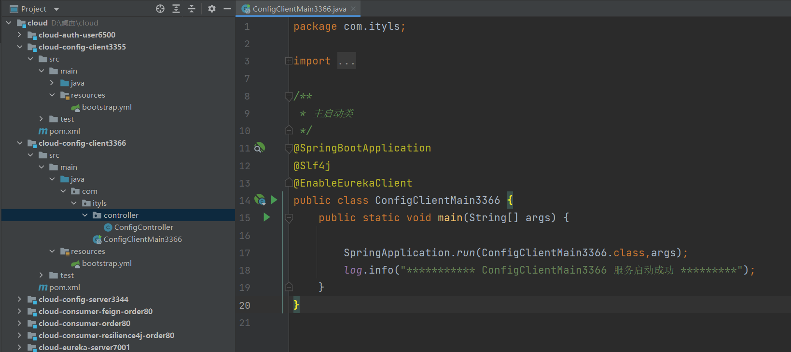

```java
/**
 * 主启动类
 */
@SpringBootApplication
@Slf4j
@EnableEurekaClient
public class ConfigClientMain3366 {
    public static void main(String[] args) {

        SpringApplication.run(ConfigClientMain3366.class,args);
        log.info("*********** ConfigClientMain3366 服务启动成功 *********");
    }
}
```


controller:

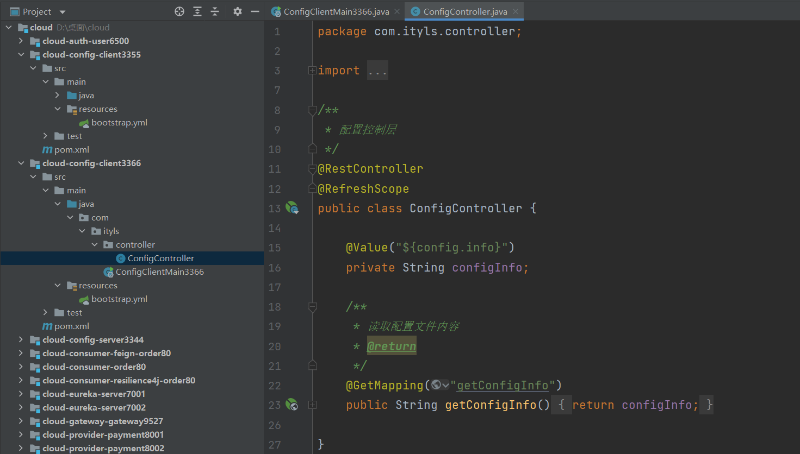

```java
/**
 * 配置控制层
 */
@RestController
@RefreshScope
public class ConfigController {
    @Value("${config.info}")
    private String configInfo;

    /**
     * 读取配置文件内容
     * @return
     */
    @GetMapping("getConfigInfo")
    public String getConfigInfo(){
        return configInfo;
    }
}
```

利用消息总线触发一个服务端ConfigServer的/bus/refresh端点,而刷新所有客户端的配置。


给3344,3355,3366工程添加消息总线支持

```xml
<dependency>
  <groupId>org.springframework.cloud</groupId>
  <artifactId>spring-cloud-starter-bus-amqp</artifactId>
</dependency>
```


YML文件添加配置

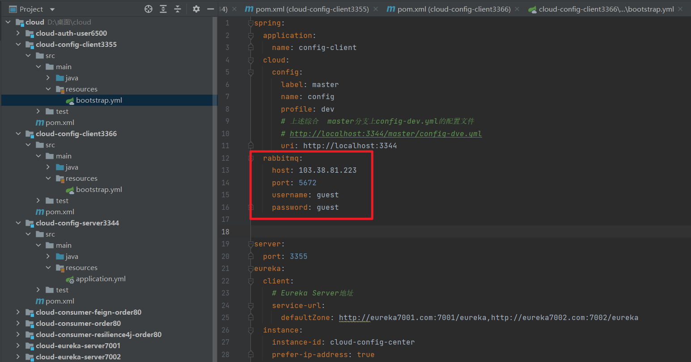

```yml
rabbitmq:
   host: 192.168.66.101
   port: 5672
   username: guest
   password: guest
```


测试：

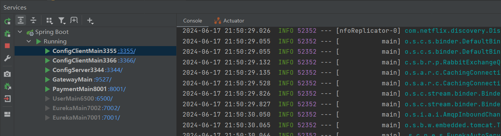

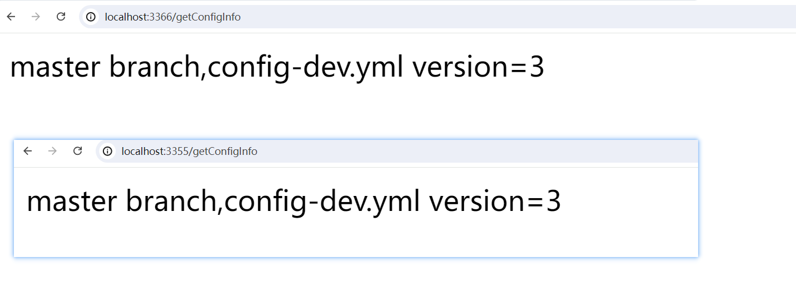

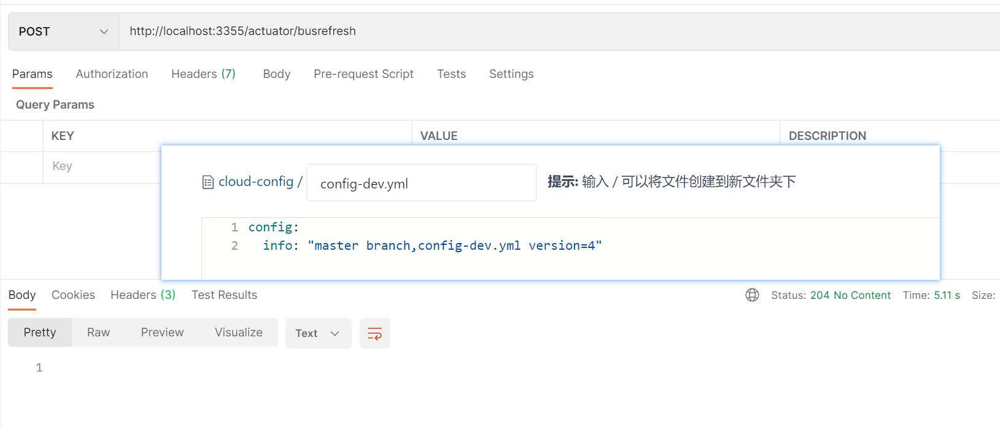

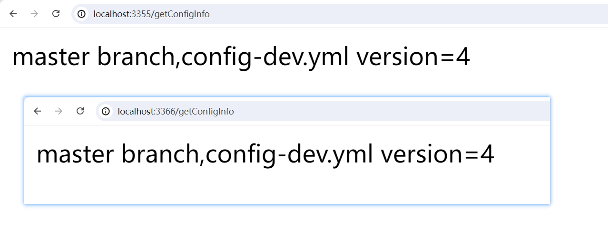


Bus动态刷新定点通知

```
http://localhost:3355/actuator/busrefresh/cloud-config-client:3355
```

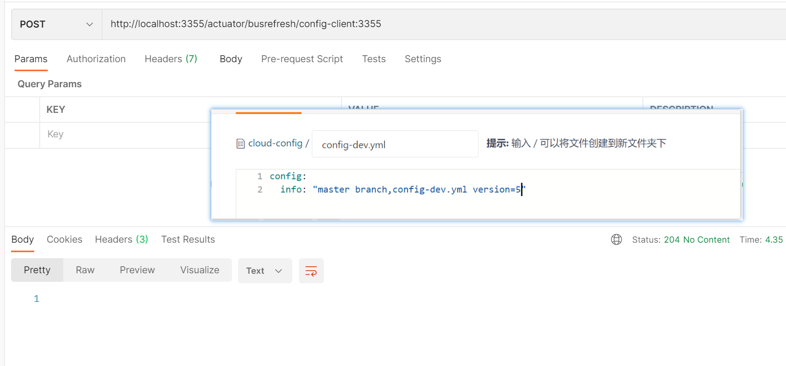
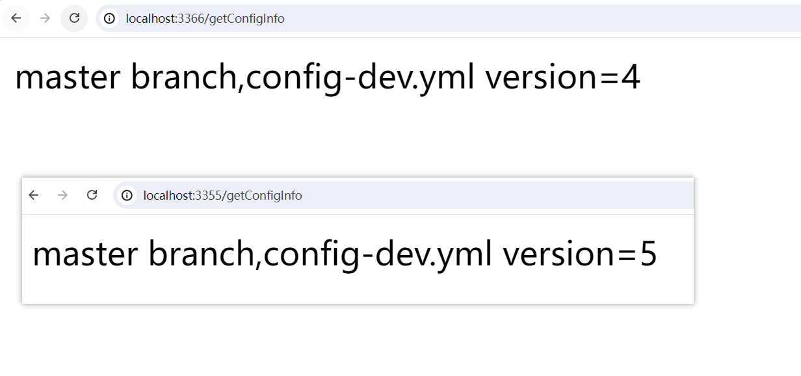


