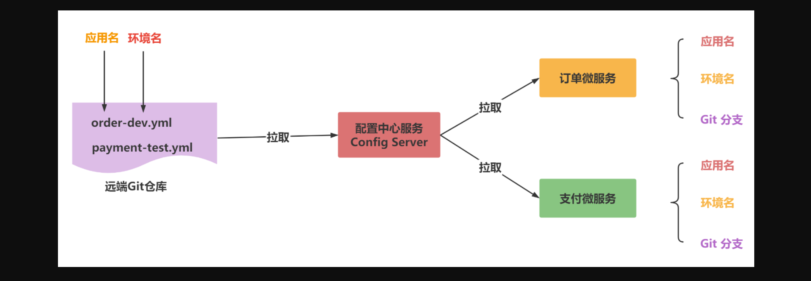
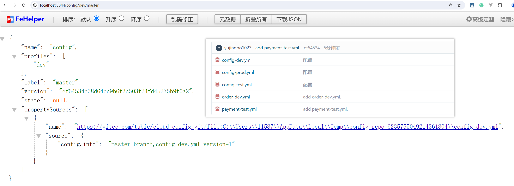

### 1, Spring Cloud Config


**分布式系统面临问题：**

在分布式系统中，由于服务数量巨多，为了方便服务配置文件统一管理，实时更新，所以需要分布式配置中心组件。


**什么是Spring Cloud Config：**

Spring Cloud Config项目是一个解决分布式系统的配置管理方案。


整个结构包括三个部分，客户端（各个微服务应用），服务端（中介者），配置仓库（可以是本地文件系统或者远端仓库，包括git,svn等）。

- 配置仓库中放置各个配置文件（.yml 或者.properties）
- 服务端指定配置文件存放的位置
- 客户端指定配置文件的名称


**Config能干什么：**

- 提供服务端和客户端支持
- 集中管理各环境的配置文件
- 配置文件修改之后，可以快速的生效
- 可以进行版本管理
- 支持大的并发查询
- 支持各种语言


**对比主流配置中心：**

开源的配置中心有很多，比如，360的QConf、淘宝的 nacos、携程的Apollo等。在Spring Cloud中，有分布式配置中心组件spring cloud config，它功能全面、强大，可以无缝地和Spring体系相结合，使用方便简单。


### 2, Config配置总控中心搭建

服务端开发最主要的任务是配置从哪里读取对应的配置文件，我们将配置从Git仓库读取配置文件。


在码云新建一个名为springcloud-config的新的仓库


config-dev.yml

```yml
config:
  info: "master branch,config-dev.yml version=1" 
```

config-test.yml

```yml
config:
  info: "master branch,config-test.yml version=1" 
```

config-prod.yml

```yml
config:
  info: "master branch,config-prod.yml version=1" 
```


新建模块cloud-config-server3344


```xml
<dependencies>
    <!--  引入Eureka client依赖  -->
    <dependency>
 <groupId>org.springframework.cloud</groupId>
      <artifactId>spring-cloud-starter-netflix-eureka-client</artifactId>
    </dependency>
    <!--  引入 config 依赖-->
    <dependency>
 <groupId>org.springframework.cloud</groupId>
      <artifactId>spring-cloud-config-server</artifactId>
    </dependency>
    <!--  引入 web 依赖-->
    <dependency>
      <groupId>org.springframework.boot</groupId>
      <artifactId>spring-boot-starter-web</artifactId>
    </dependency>
    <dependency>
      <groupId>org.projectlombok</groupId>
      <artifactId>lombok</artifactId>
      <version>1.18.22</version>
    </dependency>
  </dependencies>
```


配置：


```yml
server:
  port: 3344
spring:
  application:
    name: cloud-config-center
  cloud:
    config:
      server:
        git:
          uri: https://gitee.com/tubie/cloud-config.git
          search-paths:
            - cloud-config
      label: master
eureka:
  client:
    # 表示是否将自己注册到Eureka Server
    register-with-eureka: true
    # 示是否从Eureka Server获取注册的服务信息
    fetch-registry: true
    # Eureka Server地址
    service-url:
      defaultZone: http://eureka7001.com:7001/eureka,http://eureka7002.com:7002/eureka
  instance:
    instance-id: cloud-config-center
    prefer-ip-address: true
```


启动类：


```java
@SpringBootApplication
@Slf4j
//开启配置中心功能
@EnableConfigServer
//开启注册功能
@EnableEurekaClient
public class ConfigServer3344 {
    public static void main(String[] args) {
        SpringApplication.run(ConfigServer3344.class,args);
        log.info("************  ConfigServer3344 启动成功 *****");
    }
}
```


测试通过config微服务是否可以从码云上获取配置 http://locahost:3344/config-dev.yml


### 3, Config配置读取规则


创建order-dev.yml文件和payment-test.yml，如下：





**Config支持的请求的参数规则：**

- /{application}/{profile}[/{label}]
- /{application}-{profile}.yml
- /{label}/{application}-{profile}.yml
- /{application}-{profile}.properties
- /{label}/{application}-{profile}.properties


注意：

- {application} 就是应用名称，对应到配置文件上来，就是配置文件的名称部分，例如我上面创建的配置文件。
- {profile} 就是配置文件的版本，我们的项目有开发版本、测试环境版本、生产环境版本，对应到配置文件上来就是以 application-{profile}.yml 加以区分，例如application-dev.yml、application-test.yml、application-prod.yml。
- {label} 表示 git 分支，默认是 master 分支，如果项目是以分支做区分也是可以的，那就可以通过不同的 label 来控制访问不同的配置文件了。


**最推荐使用方式:**

/ { 分支名 } / { 应用名 } - { 环境名 }.yml


测试：




### 4, Config客户端配置与测试

新建cloud-config-client3355


依赖：

```xml
    <dependencies>
        <!--  引入Eureka client依赖  -->
        <dependency>
            <groupId>org.springframework.cloud</groupId>
            <artifactId>spring-cloud-starter-netflix-eureka-client</artifactId>
        </dependency>
        <!--  引入 config 依赖-->
        <dependency>
            <groupId>org.springframework.cloud</groupId>
            <artifactId>spring-cloud-starter-config</artifactId>
        </dependency>
        <!--  引入 web 依赖-->
        <dependency>
            <groupId>org.springframework.boot</groupId>
            <artifactId>spring-boot-starter-web</artifactId>
        </dependency>
        <dependency>
            <groupId>org.projectlombok</groupId>
            <artifactId>lombok</artifactId>
            <version>1.18.22</version>
        </dependency>
        <dependency>
            <groupId>org.springframework.cloud</groupId>
            <artifactId>spring-cloud-starter-bootstrap</artifactId>
        </dependency>
    </dependencies>
```


新增bootstap.yml配置


```yml
spring:
  application:
    name: config-client
  cloud:
    config:
      label: master
      name: config
      profile: dev
      # 上述综合  master分支上config-dev.yml的配置文件
      # http://localhost:3344/master/config-dve.yml
      uri: http://localhost:3344
server:
  port: 3355
eureka:
  client:
    # Eureka Server地址
    service-url:
      defaultZone: http://eureka7001.com:7001/eureka,http://eureka7002.com:7002/eureka
  instance:
    instance-id: cloud-config-center
    prefer-ip-address: true
```

**注意：**

- **applicaiton. yml**：是用户级的资源配置项
- **bootstrap.yml**：是系统级的，优先级更加高


要将Client模块下的application.yml文件改为bootstrap.yml,这是很关键的， 因为bootstrap.yml是比application.yml先加载的。bootstrap.yml优先级高于application.yml


错误提示：springcloud2020 版本 把Bootstrap被默认禁用，同时spring.config.import加入了对解密的支持。

```
Application failed to start due to an exception
org.springframework.cloud.config.client.ConfigServerConfigDataMissingEnvironmentPostProcessor$ImportException: No spring.config.import set
```


解决办法：

```xml
<dependency>
  <groupId>org.springframework.cloud</groupId>
  <artifactId>spring-cloud-starter-bootstrap</artifactId>
</dependency>
```


启动类：


```java
/**
 * 主启动类
 */
@SpringBootApplication
@Slf4j
@EnableEurekaClient
public class ConfigClientMain3355 {
    public static void main(String[] args) {

        SpringApplication.run(ConfigClientMain3355.class,args);
        log.info("*********** ConfigClientMain3355 服务启动成功 *********");
    }
}
```


控制器：


```java
/**
 * 配置控制层
 */
@RestController
@RefreshScope
public class ConfigController {

    @Value("${config.info}")
    private String configInfo;

    /**
     * 读取配置文件内容
     * @return
     */
    @GetMapping("getConfigInfo")
    public String getConfigInfo(){
        return configInfo;
    }
}
```


测试：http://localhost:3355/getConfigInfo


### 5, 动态刷新

修改码云上的配置文件内容做调整。


刷新3344，发现ConfigServer配置中心立刻响应


刷新3355，发现ConfigServer客户端没有任何响应


**问题：**

- 刷新3344，发现ConfigServer配置中心立刻响应
- 刷新3355，发现ConfigServer客户端没有任何响应
- 3355没有变化除非自己重启或者重新加载
- 难道每次运维修改配置文件，客户端都需要重启


cloud-config-client3355工程引入actuator监控


```xml
<dependency>
      <groupId>org.springframework.boot</groupId>
      <artifactId>spring-boot-starter-actuator</artifactId>
</dependency>
```


修改bootstrap.yml暴露监控端口


```yml
management:
  endpoints:
   web:
    exposure:
     include: "*"
```


业务类Controller修改 加入注解@RefreshScope


```java
@RefreshScope
@RestController
public class ConfigClientController {


  @Value("${config.info}")
  private String configInfo;


  /**
   * 获取配置
   * @return
   */
  @GetMapping("/configinfo")
  public String getConfigInfo(){
    return configInfo;
   }
}
```


手动刷新配置: http://localhost:3355/actuator/refresh


