### 1, 微服务架构论


**单体应用阶段 (夫妻摊位)：**

在互联网发展的初期，用户数量少，一般网站的流量也很少，但硬件成本较高。因此，一般的企业会将所有的功能都集成在一起开发一个单体应用，然后将该单体应用部署到一台服务器上即可满足业务需求。


**生活中的单体应用：**

小夫妻俩刚结婚，手里资金有限，就想着开一个路边烧烤摊。丈夫负责烤串做菜、妻子负责服务收银及上菜。这是一个典型的路边烧烤摊的经营模式。


**单体应用的特点：**

- 能够接纳的请求数量时有限的，因为服务器的内存、CPU配置是有限的。
- 展现层、控制层、持久层全都在一个应用里面，调用方便、快速。单个请求的响应结果超快。
- 开发简单、上手快、三五个人团队好管好用。


**垂直应用阶段 （门面饭店）：**

随着小夫妻俩经营有方、待客有道，开始有人愿意为了吃他们做的烧烤排队了。夫妻俩一想，我们这俩人也干不过来啊，怎么办？招人吧、扩大规模吧。

- 招什么人？当然是厨师啊、端菜收银的妻子自己还能干得过来，主要是丈夫的活挺不住了。那就招厨师。
- 不能让人站着吃吧？租一个附近的门市、添置更多的桌椅板凳。

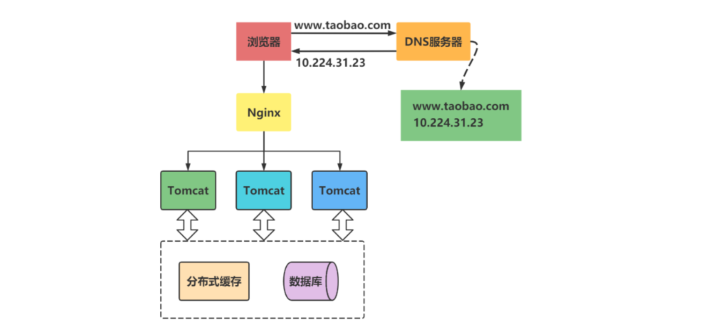

在处理并发请求的能力和容量上增强了，但是在单个请求的处理速度上下降了。


**分布式系统阶段 (酒店):**

为了解决上一阶段遇到的问题：单个请求的处理速度下降。也就是饭店针对单个订单做菜响应速度下降了，但是由于饭店的菜确实好吃、菜品精良，客流量又持续的增高。该店又再次面临扩容的问题。

- 为了解决客流量持续增高，夫妻又招聘了4位厨师
- 为了解决单个订单处理速度下降的问题，将厨师分为两组，一组专门做烧烤，一组专门做饭菜。专业的人做专业的事情，注意力越集中，办事越熟练、效率越高。

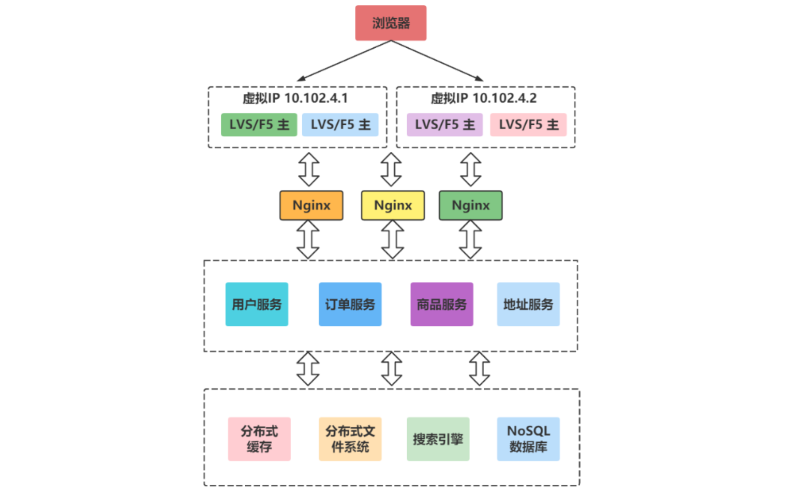


**服务治理阶段 （大酒店）:**

新的问题又出现了，有的顾客既点烧烤又点饭菜。导致后端两组厨师之间沟通不畅，怎么组合套餐推送给前台？厨师之间怎么调用、怎么沟通啊？谁是头？谁是大脑？谁记得A厨师的烧烤和B厨师的饭菜是一桌的？


随着服务数量的不断增加，服务中的资源浪费和调度问题日益突出。此时需要增加一个调度中心来治理服务。调度中心可基于访问压力来实时管理集群的容量，从而提高集群的利用率。

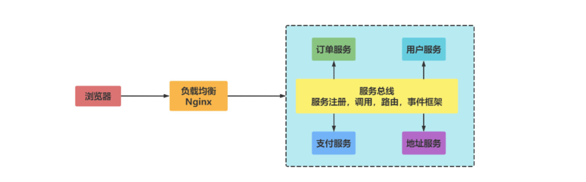

在服务治理(SOA）架构中，需要一个企业服务总线(ESB）将基于不同协议的服务节点连接起来，它的工作是转换、解释消息和路由。说白了就是丈夫做菜品的配置管理、做订单的服务注册。丈夫负责主动观察问询各工种的工作状态并记录，妻子主动向丈夫问询后端厨师的状态，并根据丈夫的反馈分配订单。


**微服务阶段 （五星大酒店）:**

饭店的规模越来越大了、岗位分工也越来越细了。真的成了超级大饭店了，怎么管？


**什么是微服务：**

将系统的业务功能划分为极小的独立微服务，每个微服务只关注于完成某个小的任务。系统中的单个微服务可以被独立部署和扩展，且各个微服务之间是高内聚、松耦合的。微服务之间采用轻量化通信机制暴露接来实现通信。

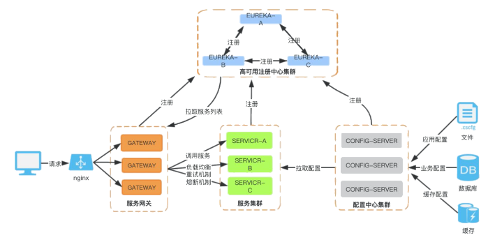

**解释：**

- 服务网关：前台。所有的顾客进来，由前台统一接待。比如：Spring Cloud Gateway。
- 熔断机制：菜品限量，法式菜品、意大利菜品、日本料理。什么时间可以吃得到、可提供多少人份？这些服务都是有限制的。
- 工作效率监督：工作流程中每个岗位做了什么工作、用了多长时间。哪个环节出现问题、哪个岗位需要调整。比如： Sleuth、日志监控ELK等。
- 配置中心：菜单，川菜，东北菜，杭帮菜，烩菜。
- 服务集群：厨师微服务集群包含，川菜厨师微服务，杭帮菜厨师微服务等。
- 高可用注册中心：大堂经理，负责那些人上班了,他在哪里干的什么工作。


### 2, 微服务的拆分规范和原则


**压力模型拆分:**

压力模型简单来说就是用户访问量，我们要识别出某些超高并发量的业务，尽可能把这部分业务独立拆分出来。


**压力模型拆解为三个维度：**

- 高频高并发场景，比如商品详情页，它既是一个高频场景（时时刻刻都会发生），同时也是高并发的场景（QPS - Query per seconds极高）

  


- 低频突发流量场景， 秒杀场景它并不是高频场景（偶尔发生），但是它会产生突发流量。再跟大家举一个例子，那就是“商品发布”，对新零售业务来说，当开设一个线下大型卖场以后，需要将所有库存商品一键上架，这里的商品总数是个非常庞大的数字（几十万+），瞬间就可以打出很高的QPS

  

- 低频流量场景，后台运营团队的服务接口，比如商品图文编辑，添加新的优惠计算规则，上架新商品。它发生的频率比较低，而且也不会造成很高的并发量。

  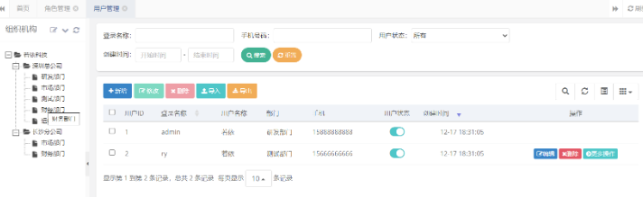


**业务模型拆分：**业务模型拆分的维度有很多，我们在实际项目中应该综合各个不同维度做考量。我这里主要从主链路、领域模型和用户群体三个维度。

- 主链路拆分，在电商领域"主链路"是一个很重要的业务链条，它是指用户完成下单场景所必须经过的场景。按照我们平时买买买的剁手经验，可以识别出很多核心主链路，比如商品搜索->商品详情页->购物车模块->订单结算->支付业务，这是就是一条最简单的主链路。如果这是一场战斗的话，那么主链路就是这场战斗的正面战场，我们必须力保主链路不失守。
- 领域模型拆分，领域驱动设计DDD（Domain-Driven Design 领域驱动设计）不是一个新概念，但老外们有个毛病，做什么事情特别喜欢提炼方法论，本来一个非常简单的概念，愣是被吹到神乎其神高深莫测。
- 用户群体拆分，根据用户群体做拆分，我们首先要了解自己的系统业务里有哪些用户，比如说电商领域，我们有2C的小卖家，也有2B的大客户，在集团内部有运营、采购、还有客服小二等等。对每个不同的用户群体来说，即便是相同的业务领域，也有该群体其独有的业务场景。用户群体相当于一个二级域，我们建议先根据主链路和领域模型做一级域的拆分，再结合具体的业务分析，看是否需要在用户领域方向上做更细粒度的拆分。


**核心主链路拆分，有以下几个目的：**

1. 异常容错：为主链路建立层次化的降级策略（多级降级），以及合理的熔断策略。
2. 调配资源：主链路通常来讲都是高频场景，自然需要更多的计算资源，最主要的体现就是集群里分配的虚机数量多。
3. 服务隔离：主链路是主打输出的C位，把主链路与其他打辅助的业务服务隔离开来，避免边缘服务的异常情况影响到主链路。


### 3, 为什么要使用SpringCloud

**Spring Cloud与Netflix：**

Netflix是一家做视频网站的公司，之所以要说一下这个公司是因为Spring Cloud在发展之初，Netflix做了很大的贡献。包括服务注册中心Eureka、服务调用Ribbon、Feign，服务容错限流Hystrix、服务网关Zuul等众多组件都是Netflix贡献给Spring Cloud社区的。


**什么是SpringCloud：**

Spring Cloud是一个基于Spring Boot实现的微服务架构开发工具。它为微服务架构中涉及的配置管理、服务治理、断路器、智能路由、控制总线、分布式会话和集群状态管理等操作提供了一种简单的开发方式。

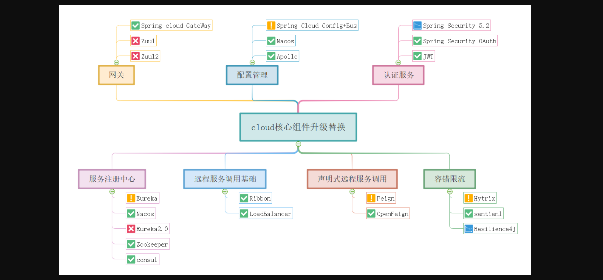


**核心事件追踪：**

- 2018年6月底，Eureka 2.0 开源工作宣告停止，继续使用风险自负。
- 2018年11月底，Hystrix 宣布不再在开源版本上提供新功能。
- 2018年12月，Spring官方宣布Netflix的相关项目进入维护模式。

- 从此，Spring Cloud逐渐告别Netflix时代。

- 2018年10月31日，Spring Cloud Alibaba正式入驻了Spring Cloud官方孵化器，并在maven中央库发布了第一个版本。


**服务注册中心选型：**

- **Eureka：**Spring Cloud与Netflix的大儿子，出生的时候家里条件一般，长大后素质有限。
- **Nacos：**后起之秀，曾经Spring Cloud眼中“别人家的孩子”，已经纳入收养范围（Spring Cloud Alibaba孵化项目）。
- **Apache Zookeeper：**关系户，与hadoop关系比较好
- **etcd：**关系户，与kubernetes关系比较好
- **Consul：**关系户，曾经与docker关系比较好


如果你的应用已经使用到了Hadoop、Kubernetes、Docker，在Spring Cloud实施过程中可以考虑使用其关系户组件，避免搭建两套注册中心，节省资源。


**分布式配置管理：**

目前可选的分布式配置管理中心，有阿里的Nacos、携程的Apollo、和Spring Cloud Config。


**服务网关：**

服务网关这块就不多说了，没有任何悬念，Spring Cloud Gateway在各方面都碾压Zuul，Zuul2也基本上是胎死腹中。


**Hystrix：**

2018年12月，Spring官方宣布Netflix的相关项目进入维护模式。不再开发新的功能，但是Hystrix整体上还是比较稳定的，对于老用户不必更换，影响也不大。


**resilience4j：**

Hystrix停更之后，Netflix官方推荐使用resilience4j，它是一个轻量、易用、可组装的高可用框架，支持熔断、高频控制、隔离、限流、限时、重试等多种高可用机制。


**Sentinel（重点）：**

Sentinel是阿里中间件团队开源的，面向分布式服务架构的轻量级高可用流量控制组件，主要以流量为切入点，从流量控制、熔断降级、系统负载保护等多个维度来帮助用户保护服务的稳定性。


### 4, 如何选择SpringCloud版本


**SpringCloud版本号由来：**

SpringCloud的版本号是根据英国伦敦地铁站的名字进行命名的，由地铁站名称字母A-Z依次类推表示发布迭代版本。

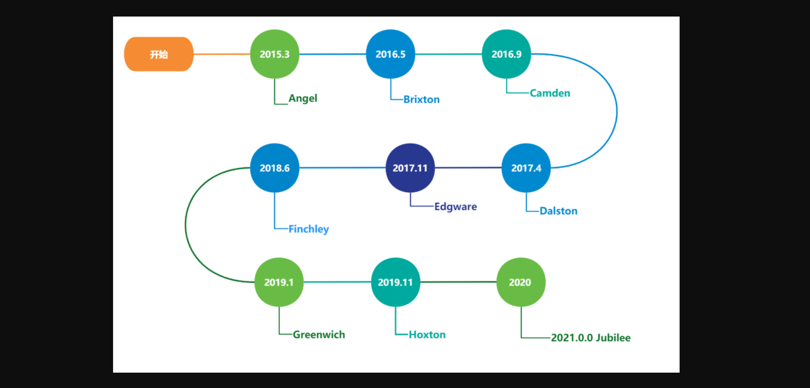


**SpringCloud和SpringBoot版本对应关系：**

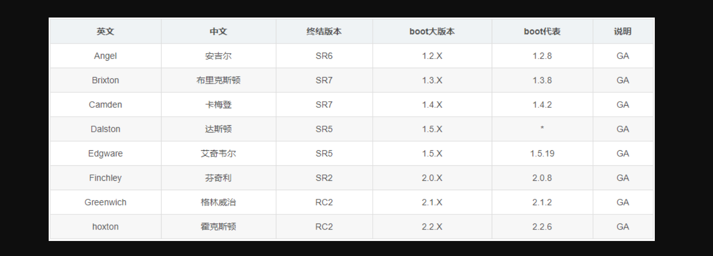

其实SpringBoot与SpringCloud需要版本对应，否则可能会造成很多意料之外的错误，比如eureka注册了结果找不到服务类啊，比如某些jar导入不进来啊，等等这些错误。


**版本说明：**

| 名字     | 描述                                                         |
| -------- | ------------------------------------------------------------ |
| SNAPSHOT | 快照版，可以稳定使用，且仍在继续改进版本。                   |
| PRE      | 预览版,内部测试版. 主要是给开发人员和测试人员测试和找BUG用的，不建议使用； |
| RC       | 发行候选版本，基本不再加入新的功能，主要修复bug。            |
| SR       | 修正版或更新版                                               |
| GA       | 正式发布的版本                                               |

从 Spring Cloud 2020.0.0-M1 开始，Spring Cloud 废除了这种英国伦敦地铁站的命名方式，而使用了全新的 "日历化" 版本命名方式。


### 5, 如何学习微服务SpringCloud

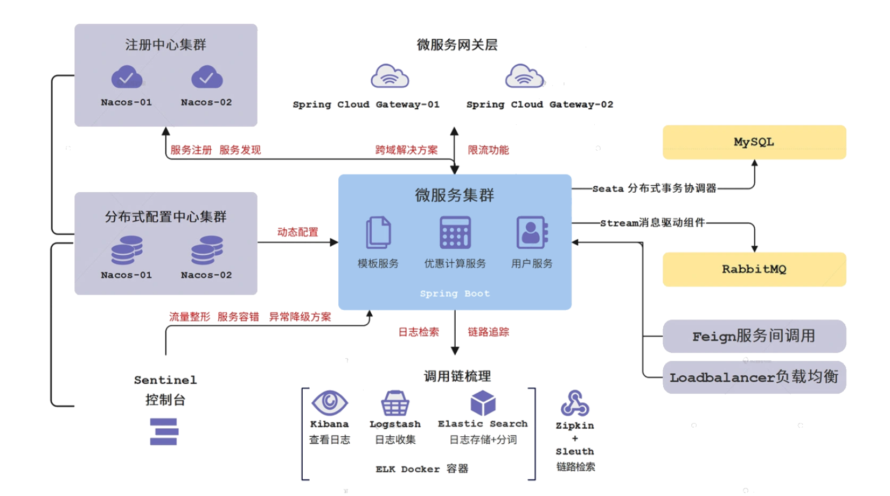

简单来说，就是“三大功能，两大特性”。

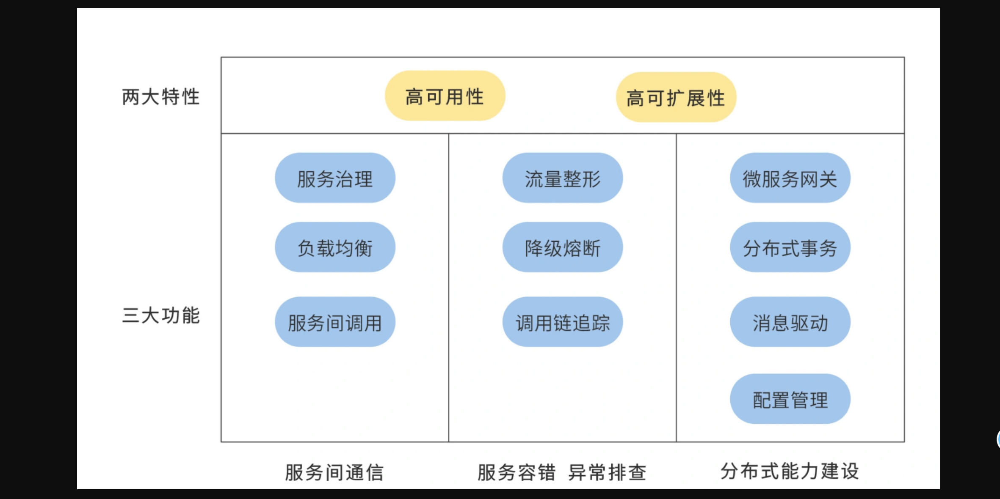

三大功能是指微服务核心组件的功能维度，由浅入深层次递进；而两大特性是构建在每个服务组件之上的高可用性和高可扩展性。别看微服务框架组件多，其实你完全可以按照这三大功能模块，给它们有简入难对号入座。


**注意：**

- **服务间通信**：包括服务治理、负载均衡、服务间调用；
- **服务容错和异常排查**：包括流量整形、降级熔断、调用链追踪；
- **分布式能力建设**：包括微服务网关、分布式事务、消息驱动、分布式配置中心。


**从哪里入手：**

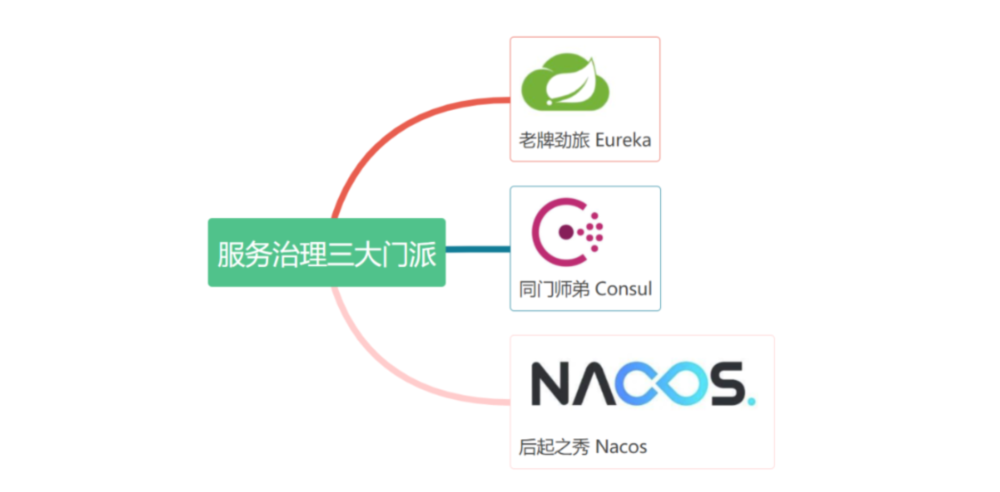

从微服务组件的功能维度来讲，服务间通信是最基础的功能特性，这个功能模块是最适合作为初学者学习微服务技术的切入点。


### 6, 什么是服务治理


**为什么需要服务治理：**

在没有进行服务治理前,服务之间的通信是通过服务间直接相互调用来实现的。

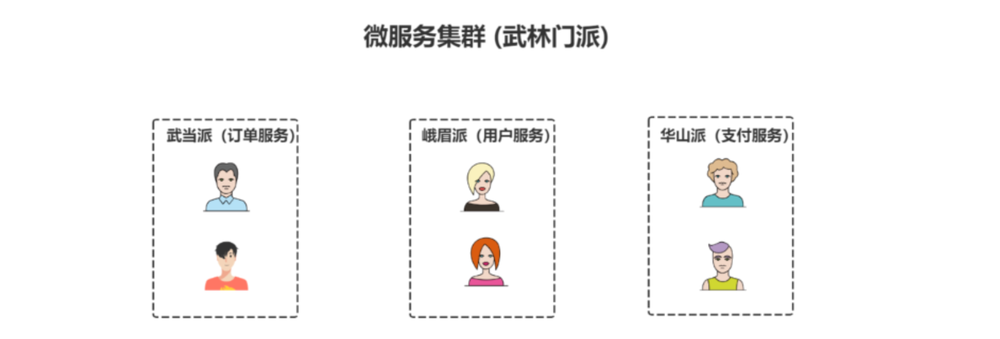

武当派直接调用峨眉派和华山派，同样，华山派直接调用武当派和峨眉派如果系统不复杂，这样调用没什么问题。但在复杂的微服务系统中，采用这样的调用方法就会产生问题。


微服务系统中服务众多，这样会导致服务间的相互调用非常不便，因为要记住提供服务的IP地址、名称、端口号等。这时就需要中间代理，通过中间代理来完成调用。


**服务治理的解决方案：**


**服务治理责任：**

- 你是谁：服务注册 - 服务提供方自报家门
- 你来自哪里：服务发现 - 服务消费者拉取注册数据
- 你好吗：心跳检测，服务续约和服务剔除 一套由服务提供方和注册中心配合完成的去伪存真的过程
- 当你死的时候：服务下线 - 服务提供方发起主动下线


**服务治理技术选型：**

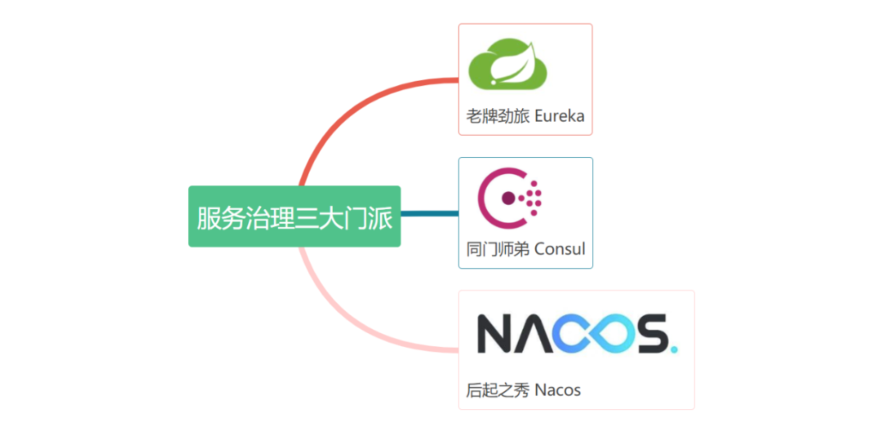

在架构选型的时候，我们需要注意一下切记不能为了新而新，忽略了对于当前业务的支持，虽然Eureka2.0不开源了，但是谁知道以后会不会变化，而且1.0也是可以正常使用的，也有一些贡献者在维护这个项目，所以我们不必要过多的担心这个问题，要针对于业务看下该技术框架是否支持在做考虑。


### 7, 服务注册发现_Eurka概念

Spring Cloud Eureka 是Netflix 开发的注册发现组件，本身是一个基于 REST 的服务。提供注册与发现，同时还提供了负载均衡、故障转移等能力。


**Eureka3个角色**

- 服务中心
- 服务提供者
- 服务消费者


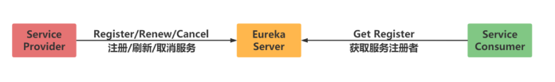

**注意：**

- **Eureka Server**：服务器端。它提供服务的注册和发现功能，即实现服务的治理。
- **Service Provider**：服务提供者。它将自身服务注册到Eureka Server中，以便“服务消费者”能够通过服务器端提供的服务清单（注册服务列表）来调用它。
- **Service Consumer**：服务消费者。它从 Eureka 获取“已注册的服务列表”，从而消费服务。


**比Zookeeper好在哪里呢：**

当向注册中心查询服务列表时，我们可以容忍注册中心返回的是几分钟以前的注册信息，但不能接受服务直接down掉不可用。也就是说，服务注册功能对可用性的要求要高于一致性。

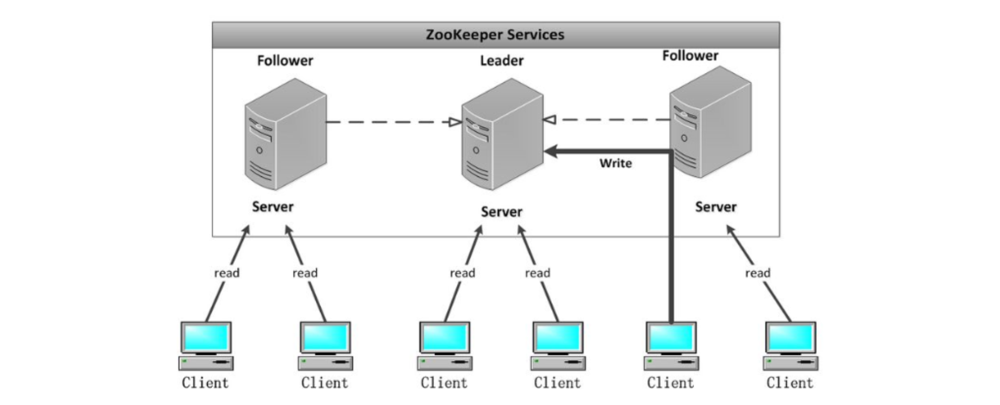

Zookeeper会出现这样一种情况，当Master节点因为网络故障与其他节点失去联系时，剩余节点会重新进行leader选举。问题在于，选举leader的时间太长，30～120s，且选举期间整个zk集群都是不可用的，这就导致在选举期间注册服务瘫痪。


**总结：**Eureka看明白了这一点，因此在设计时就优先保证可用性。


### 8, 服务注册发现_微服务聚合父工程构建

步骤：

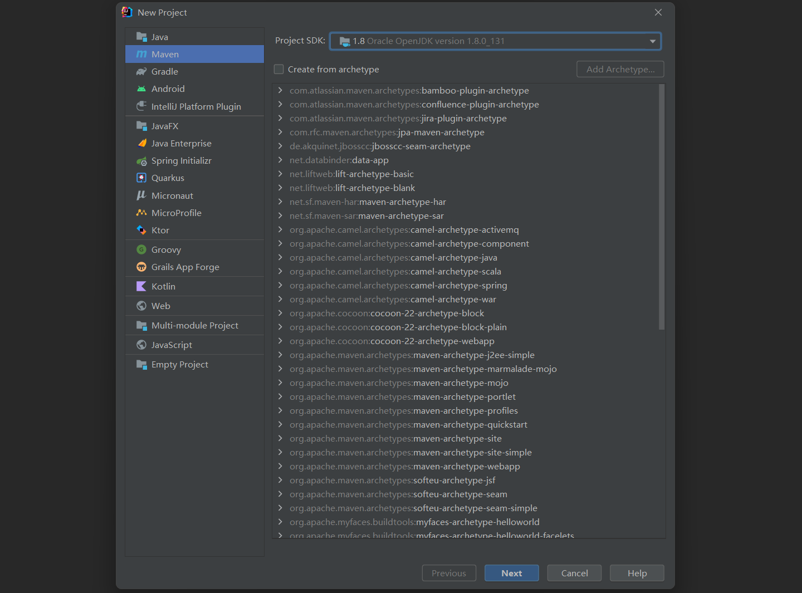

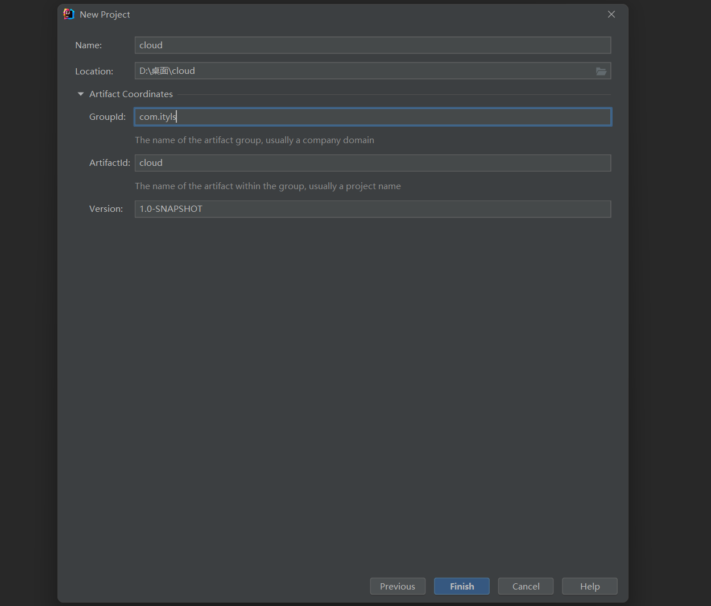

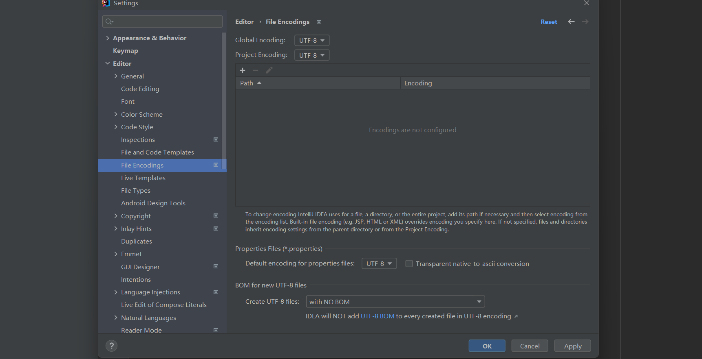

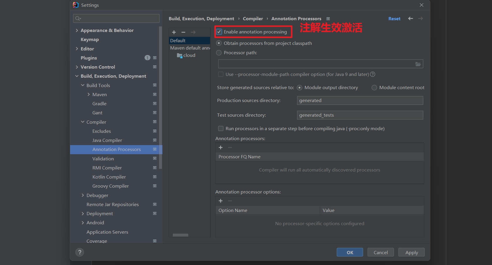

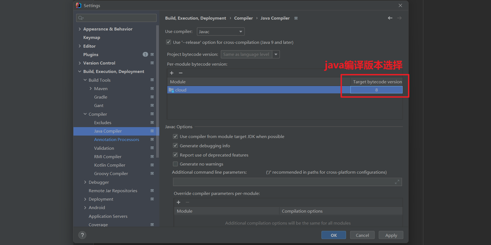

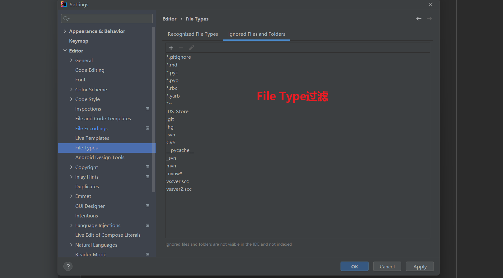


父工程pom:

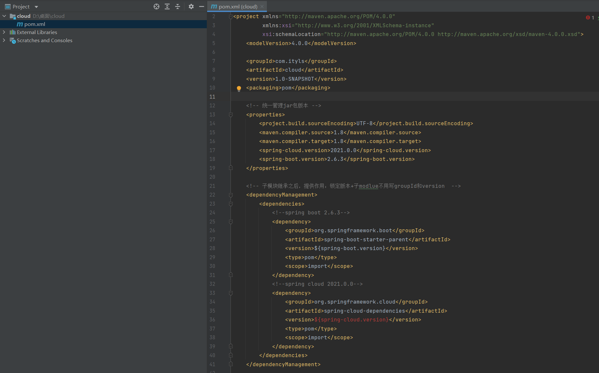

```xml
<?xml version="1.0" encoding="UTF-8"?>
<project xmlns="http://maven.apache.org/POM/4.0.0"
         xmlns:xsi="http://www.w3.org/2001/XMLSchema-instance"
         xsi:schemaLocation="http://maven.apache.org/POM/4.0.0 http://maven.apache.org/xsd/maven-4.0.0.xsd">
    <modelVersion>4.0.0</modelVersion>

    <groupId>com.ityls</groupId>
    <artifactId>cloud</artifactId>
    <version>1.0-SNAPSHOT</version>
    <packaging>pom</packaging>

    <!-- 统一管理jar包版本 -->
    <properties>
        <project.build.sourceEncoding>UTF-8</project.build.sourceEncoding>
        <maven.compiler.source>1.8</maven.compiler.source>
        <maven.compiler.target>1.8</maven.compiler.target>
        <spring-cloud.version>2021.0.0</spring-cloud.version>
        <spring-boot.version>2.6.3</spring-boot.version>
    </properties>

    <!-- 子模块继承之后，提供作用：锁定版本+子modlue不用写groupId和version  -->
    <dependencyManagement>
        <dependencies>
            <!--spring boot 2.6.3-->
            <dependency>
                <groupId>org.springframework.boot</groupId>
                <artifactId>spring-boot-starter-parent</artifactId>
                <version>${spring-boot.version}</version>
                <type>pom</type>
                <scope>import</scope>
            </dependency>
            <!--spring cloud 2021.0.0-->
            <dependency>
                <groupId>org.springframework.cloud</groupId>
                <artifactId>spring-cloud-dependencies</artifactId>
                <version>${spring-cloud.version}</version>
                <type>pom</type>
                <scope>import</scope>
            </dependency>
        </dependencies>
    </dependencyManagement>
</project>
```


**Run Dashboard面板:**在.idea/workspace.xml 文件中找到

```xml
 <component name="RunDashboard">
 <option name="ruleStates">
  <list>
   <RuleState>
    <option name="name" value="ConfigurationTypeDashboardGroupingRule" />
   </RuleState>
   <RuleState>
    <option name="name" value="StatusDashboardGroupingRule" />
   </RuleState>
  </list>
 </option>
 <option name="configurationTypes">
 <set>
  <option value="SpringBootApplicationConfigurationType" />
 </set>
</option>
</component>
```


### 9, 服务注册发现_单机Eureka注册中心搭建

创建cloud-eureka-server7001模块

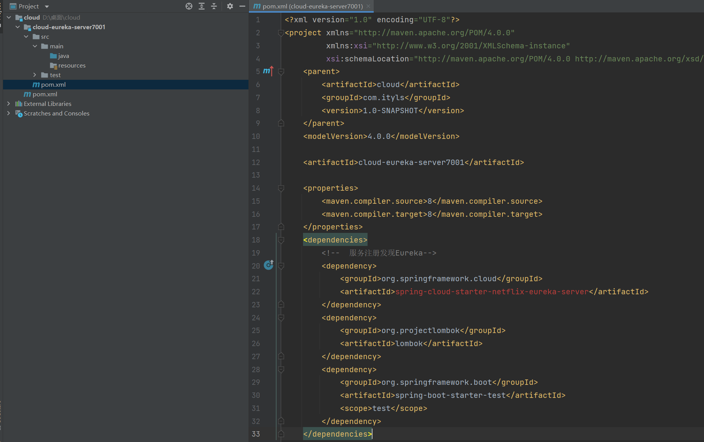


```xml
    <dependencies>
        <!--  服务注册发现Eureka-->
        <dependency>
            <groupId>org.springframework.cloud</groupId>
            <artifactId>spring-cloud-starter-netflix-eureka-server</artifactId>
        </dependency>
        <dependency>
            <groupId>org.projectlombok</groupId>
            <artifactId>lombok</artifactId>
        </dependency>
        <dependency>
            <groupId>org.springframework.boot</groupId>
            <artifactId>spring-boot-starter-test</artifactId>
            <scope>test</scope>
        </dependency>
    </dependencies>
```


配置文件：

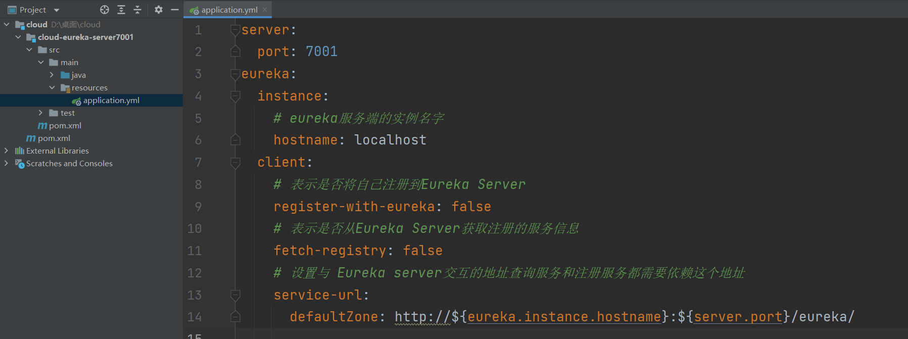

```yml
server:
  port: 7001
eureka:
  instance:
    # eureka服务端的实例名字
    hostname: localhost
  client:
    # 表示是否将自己注册到Eureka Server
    register-with-eureka: false
    # 表示是否从Eureka Server获取注册的服务信息
    fetch-registry: false
    # 设置与 Eureka server交互的地址查询服务和注册服务都需要依赖这个地址
    service-url:
      defaultZone: http://${eureka.instance.hostname}:${server.port}/eureka/
```


启动类：

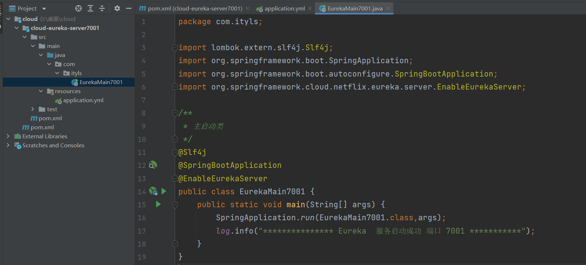

```java
/**
 * 主启动类
 */
@Slf4j
@SpringBootApplication
@EnableEurekaServer
public class EurekaMain7001 {
    public static void main(String[] args) {
        SpringApplication.run(EurekaMain7001.class,args);
        log.info("*************** Eureka  服务启动成功 端口 7001 ***********");
    }
}
```


访问浏览器localhost:7001

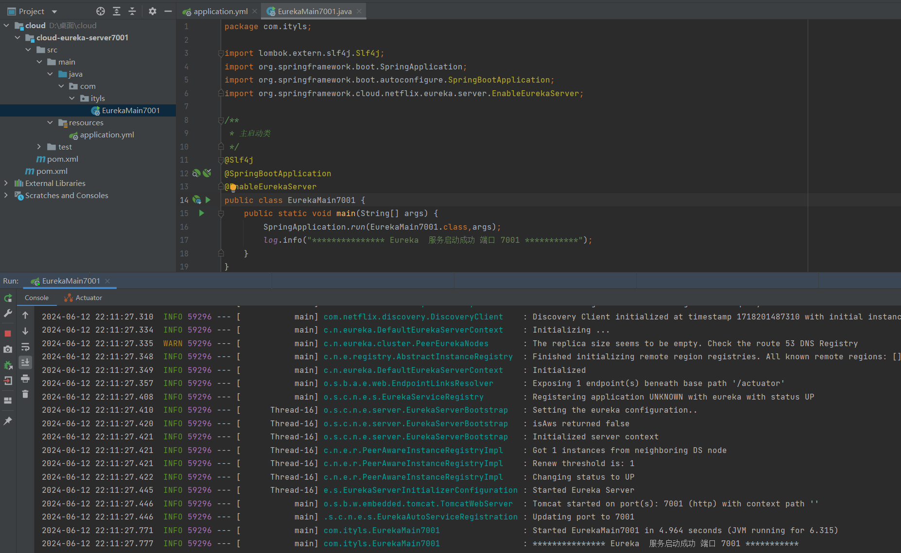

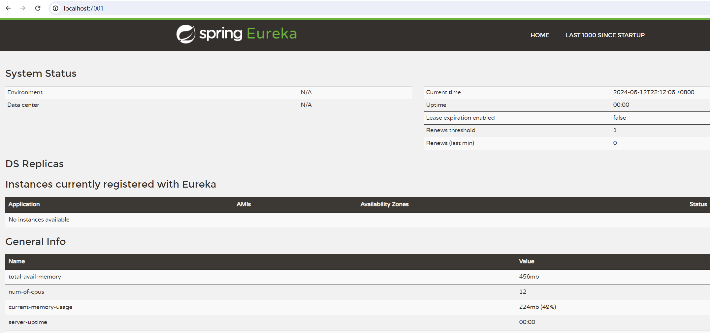


服务注册发现_解读Eureka注册中心UI界面

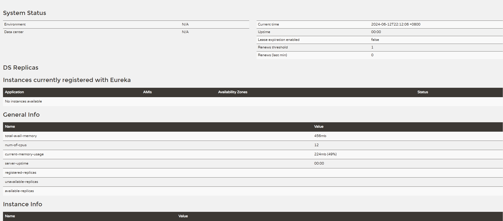

**参数：**

- Environment: 环境，默认为test，该参数在实际使用过程中，可以不用更改
- Data center： 数据中心，使用的是默认的是 “MyOwn”
- Current time：当前的系统时间
- Uptime：已经运行了多少时间
- Lease expiration enabled：是否启用租约过期 ，自我保护机制关闭时，该值默认是true， 自我保护机制开启之后为false。
- Renews threshold： 每分钟最少续约数，Eureka Server 期望每分钟收到客户端实例续约的总数。
- Renews (last min)： 最后一分钟的续约数量（不含当前，1分钟更新一次），Eureka Server 最后 1 分钟收到客户端实例续约的总数。


这个下面的信息是这个Eureka Server相邻节点，互为一个集群。注册到这个服务上的实例信息


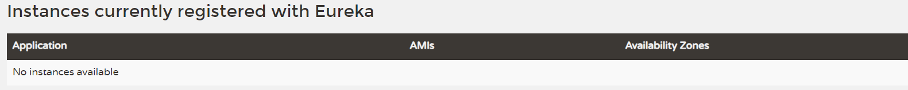

**参数：**

- Application：服务名称。配置的spring.application.name属性
- AMIs：n/a (1)，字符串n/a+实例的数量，我不了解
- Availability Zones：实例的数量
- Status：实例的状态 + eureka.instance.instance‐id的值。

- 实例的状态分为UP、DOWN、STARTING、OUT_OF_SERVICE、UNKNOWN.

- UP： 服务正常运行，特殊情况当进入自我保护模式，所有的服务依然是UP状态，所以需要做好熔断重试等容错机制应对灾难性网络出错情况
- OUT_OF_SERVICE : 不再提供服务，其他的Eureka Client将调用不到该服务，一般有人为的调用接口设置的，如：强制下线。
- UNKNOWN： 未知状态
- STARTING ： 表示服务正在启动中
- DOWN： 表示服务已经宕机，无法继续提供服务


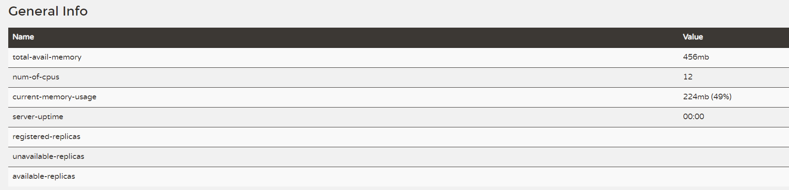

**参数：**

- total-avail-memory : 总共可用的内存
- environment : 环境名称，默认test
- num-of-cpus : CPU的个数
- current-memory-usage : 当前已经使用内存的百分比
- server-uptime : 服务启动时间
- registered-replicas : 相邻集群复制节点
- unavailable-replicas ：不可用的集群复制节点，如何确定不可用？ 主要是server1 向 server2和server3发送接口查询自身的注册信息。
- available-replicas ：可用的相邻集群复制节点


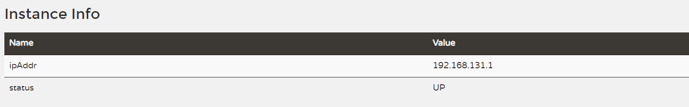

**参数：**

- ipAddr：eureka服务端IP
- status：eureka服务端状态


### 10, 服务注册发现_创建服务提供者

创建cloud-provider-payment8001模块

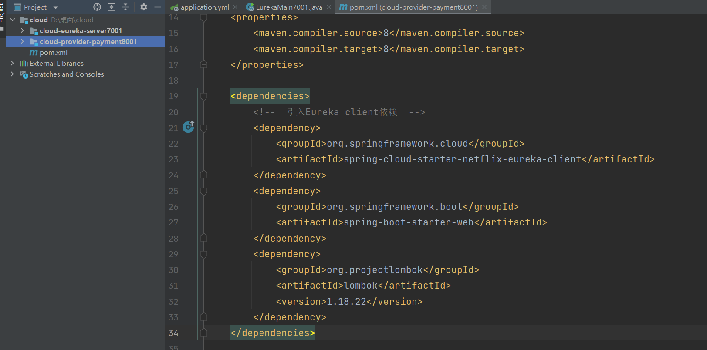

```xml
  <dependencies>
    <!--  引入Eureka client依赖  -->
    <dependency>
      <groupId>org.springframework.cloud</groupId>
      <artifactId>spring-cloud-starter-netflix-eureka-client</artifactId>
    </dependency>
    <dependency>
      <groupId>org.springframework.boot</groupId>
      <artifactId>spring-boot-starter-web</artifactId>
    </dependency>
    <dependency>
      <groupId>org.projectlombok</groupId>
      <artifactId>lombok</artifactId>
      <version>1.18.22</version>
    </dependency>
  </dependencies>
```


配置：

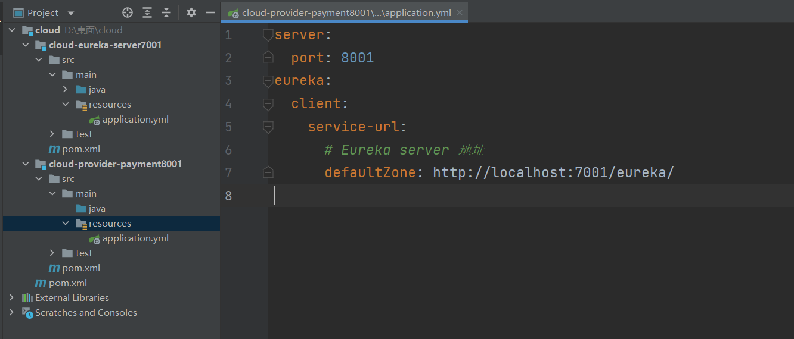

```yml
server:
  port: 8001
eureka:
  client:
    service-url:
      # Eureka server 地址
      defaultZone: http://localhost:7001/eureka/
```


启动类：

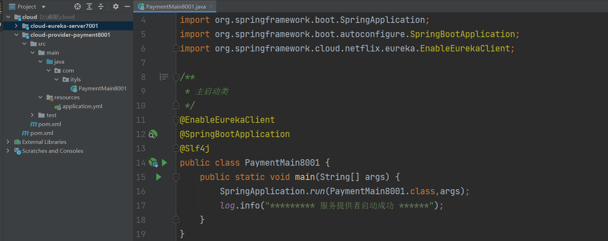

```java
/**
 * 主启动类
 */
@EnableEurekaClient
@SpringBootApplication
@Slf4j
public class PaymentMain8001 {
    public static void main(String[] args) {
        SpringApplication.run(PaymentMain8001.class,args);
        log.info("********* 服务提供者启动成功 ******");
    }
}
```


先启动EurekaServer服务，访问[http://localhost:7001](http://localhost:7001/)

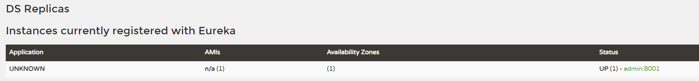

**注意：**application名字未定义。


修改yml文件

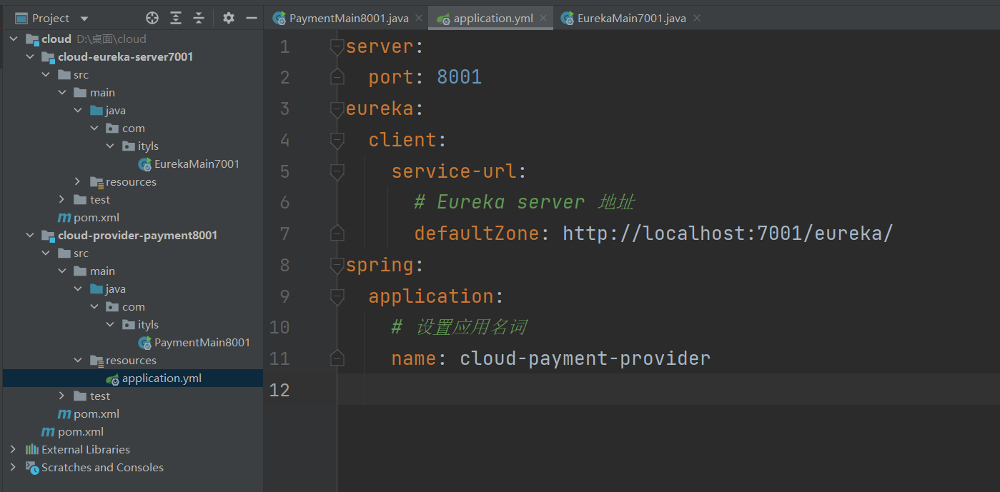

```yml
spring:
  application:
  # 设置应用名词
   name: cloud-payment-provider
```


再次查看：

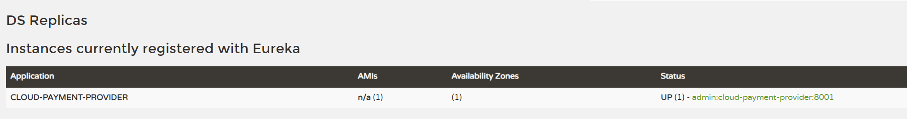


### 11, 服务注册发现_解读Eureka注册中心UI界面

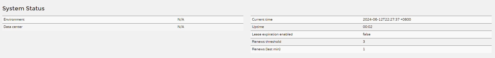

**参数：**

- Environment: 环境，默认为test，该参数在实际使用过程中，可以不用更改
- Data center： 数据中心，使用的是默认的是 “MyOwn”
- Current time：当前的系统时间
- Uptime：已经运行了多少时间
- Lease expiration enabled：是否启用租约过期 ，自我保护机制关闭时，该值默认是true， 自我保护机制开启之后为false。
- Renews threshold： 每分钟最少续约数，Eureka Server 期望每分钟收到客户端实例续约的总数。
- Renews (last min)： 最后一分钟的续约数量（不含当前，1分钟更新一次），Eureka Server 最后 1 分钟收到客户端实例续约的总数。


**参数：** 这个下面的信息是这个Eureka Server相邻节点，互为一个集群。注册到这个服务上的实例信息


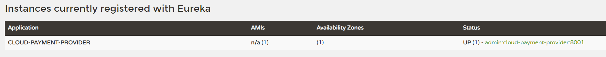

**参数：**

- Application：服务名称。配置的spring.application.name属性
- AMIs：n/a (1)，字符串n/a+实例的数量，我不了解
- Availability Zones：实例的数量
- Status：实例的状态 + eureka.instance.instance‐id的值。

- 实例的状态分为UP、DOWN、STARTING、OUT_OF_SERVICE、UNKNOWN.

- UP： 服务正常运行，特殊情况当进入自我保护模式，所有的服务依然是UP状态，所以需要做好熔断重试等容错机制应对灾难性网络出错情况
- OUT_OF_SERVICE : 不再提供服务，其他的Eureka Client将调用不到该服务，一般有人为的调用接口设置的，如：强制下线。
- UNKNOWN： 未知状态
- STARTING ： 表示服务正在启动中
- DOWN： 表示服务已经宕机，无法继续提供服务


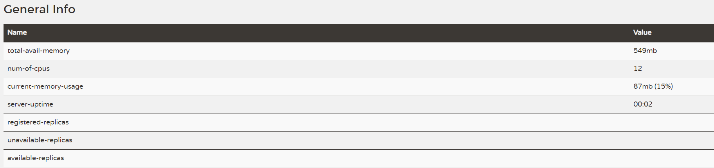

**参数：**

- total-avail-memory : 总共可用的内存
- environment : 环境名称，默认test
- num-of-cpus : CPU的个数
- current-memory-usage : 当前已经使用内存的百分比
- server-uptime : 服务启动时间
- registered-replicas : 相邻集群复制节点
- unavailable-replicas ：不可用的集群复制节点，如何确定不可用？ 主要是server1 向 server2和server3发送接口查询自身的注册信息。
- available-replicas ：可用的相邻集群复制节点


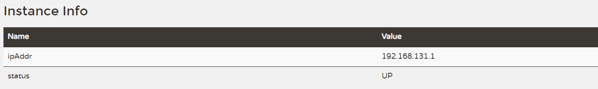

**参数：**

- ipAddr：eureka服务端IP
- status：eureka服务端状态


### 12, 服务注册发现_创建服务消费者

创建cloud-consumer-order80模块

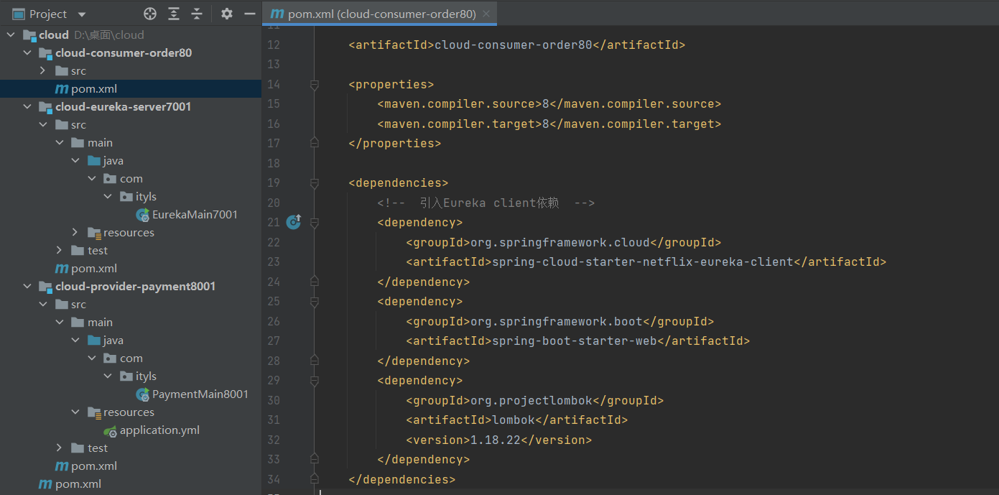

```xml
<dependencies>
    <!--  引入Eureka client依赖  -->
    <dependency>
      <groupId>org.springframework.cloud</groupId>
      <artifactId>spring-cloud-starter-netflix-eureka-client</artifactId>
    </dependency>
    <dependency>
      <groupId>org.springframework.boot</groupId>
      <artifactId>spring-boot-starter-web</artifactId>
    </dependency>
    <dependency>
      <groupId>org.projectlombok</groupId>
      <artifactId>lombok</artifactId>
      <version>1.18.22</version>
    </dependency>
  </dependencies>
```


配置文件：

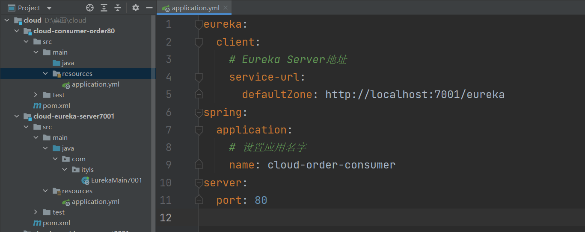

```yml
eureka:
  client:
    # Eureka Server地址
    service-url:
      defaultZone: http://localhost:7001/eureka
spring:
  application:
    # 设置应用名字
    name: cloud-order-consumer
server:
  port: 80
```


启动类：

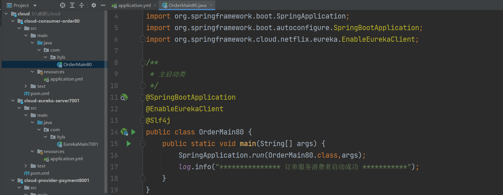

```java
/**
 * 主启动类
 */
@SpringBootApplication
@EnableEurekaClient
@Slf4j
public class OrderMain80 {
    public static void main(String[] args) {
        SpringApplication.run(OrderMain80.class,args);
        log.info("*************** 订单服务消费者启动成功 ***********");
    }
}
```


先启动EurekaServer服务，访问[http://locahost:7001](http://locahost:7001/)

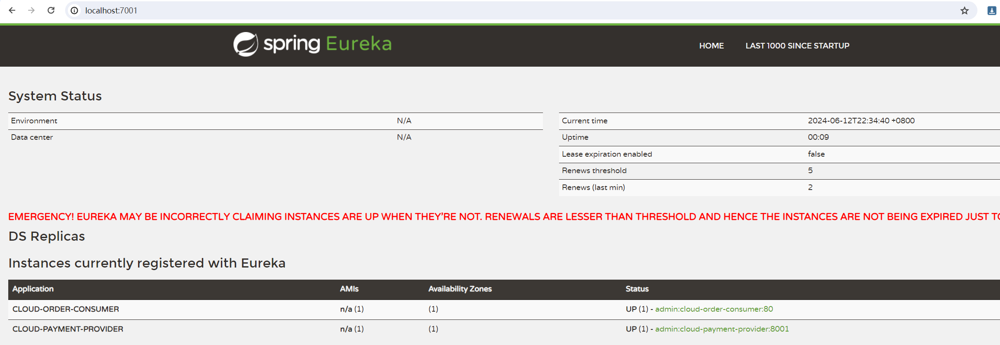


### 13, 服务注册发现_服务自保和剔除

**服务自保和服务剔除机制:**

服务剔除，服务自保，这两套功法一邪一正，俨然就是失传多年的上乘心法的上卷和下卷。但是往往你施展了服务剔除便无法施展服务自保，而施展了服务自保，便无法施展服务剔除。也就是说，注册中心在同一时刻，只能施展一种心法，不可两种同时施展。


**服务剔除:**


**注意：**

服务剔除把服务节点果断剔除，即使你的续约请求晚了一步也毫不留情，招式凌厉，重在当断则断，忍痛割爱。心法总决简明扼要：欲练此功，必先自宫


**服务自保:**


**注意：**

服务自保把当前所有节点保留，一个都不能少，绝不放弃任何队友。心法的指导思想是，即便主动删除，也许并不能解决问题，且放之任之，以不变应万变。心法总决引人深思：宫了以后，未必成功，如果不宫，或可成功。


**心法总纲：**

在实际应用里，并不是所有无心跳的服务都不可用，也许因为短暂的网络抖动等原因，导致服务节点与注册中心之间续约不上，但服务节点之间的调用还是属于可用状态，这时如果强行剔除服务节点，可能会造成大范围的业务停滞。


**Euraka服务自保的触发机关：**

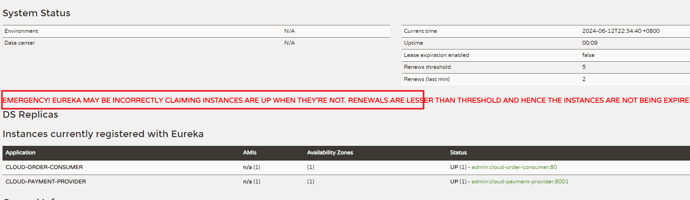

服务自保模式往往是为了应对短暂的网络环境问题，在理想情况下服务节点的续约成功率应该接近100%，如果突然发生网络问题，比如一部分机房无法连接到注册中心，这时候续约成功率有可能大幅降低。但考虑到Eureka采用客户端的服务发现模式，客户端手里有所有节点的地址，如果服务节点只是因为网络原因无法续约但其自身服务是可用的，那么客户端仍然可以成功发起调用请求。这样就避免了被服务剔除给错杀。


**手动开关：**

这是服务自保的总闸，以下配置将强制关闭服务自保，即便上面的自动开关被触发，也不能开启自保功能。

```properties
# 参数来关闭保护机制，以确保注册中心可以将不可用的实例正确剔除，默认为true。
eureka.server.enable-self-preservation=false；
```

### 14, 服务注册发现_actuator微服务信息完善

SpringCloud体系里的，服务实体向eureka注册时，注册名默认是IP名:应用名:应用端口名。

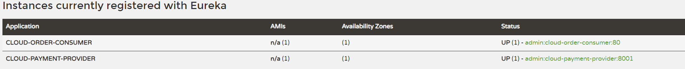


**在服务提供者pom中配置Actuator依赖:**

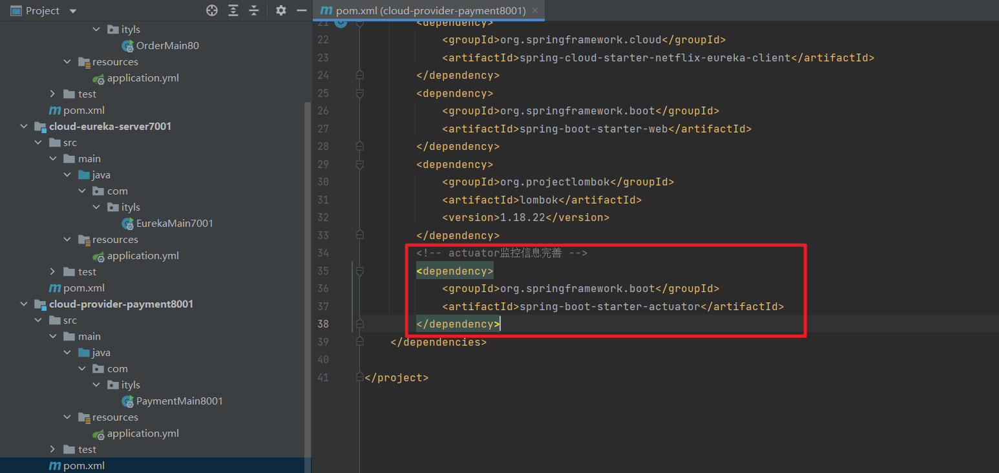

```xml
<!-- actuator监控信息完善 -->
<dependency>
   <groupId>org.springframework.boot</groupId>
   <artifactId>spring-boot-starter-actuator</artifactId>
</dependency>
```


**在服务提供者生产者application.yml中加入:**

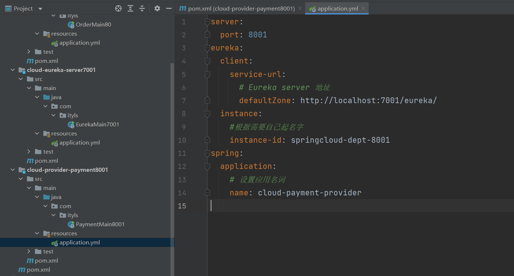

```yml
eureka:            
  instance:
  #根据需要自己起名字
   instance-id: springcloud-dept-8001   
```


测试：

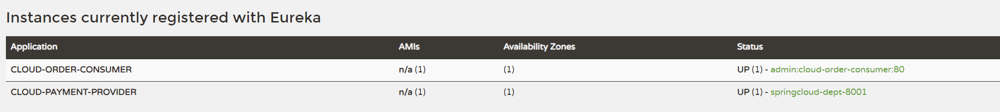


### 15, 服务注册发现_服务发现Discovery

修改payment8001的Controller

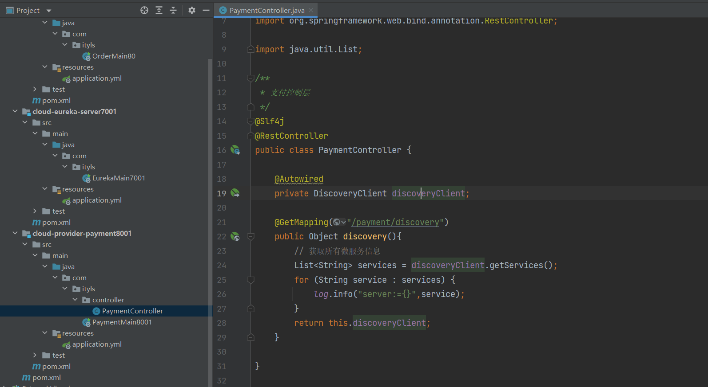

```java
/**
 * 支付控制层
 */
@Slf4j
@RestController
public class PaymentController {
    @Autowired
    private DiscoveryClient discoveryClient;

    @GetMapping("/payment/discovery")
    public Object discovery(){
        // 获取所有微服务信息
        List<String> services = discoveryClient.getServices();
        for (String service : services) {
            log.info("server:={}",service);
        }
        return this.discoveryClient;
    }
}
```


测试：

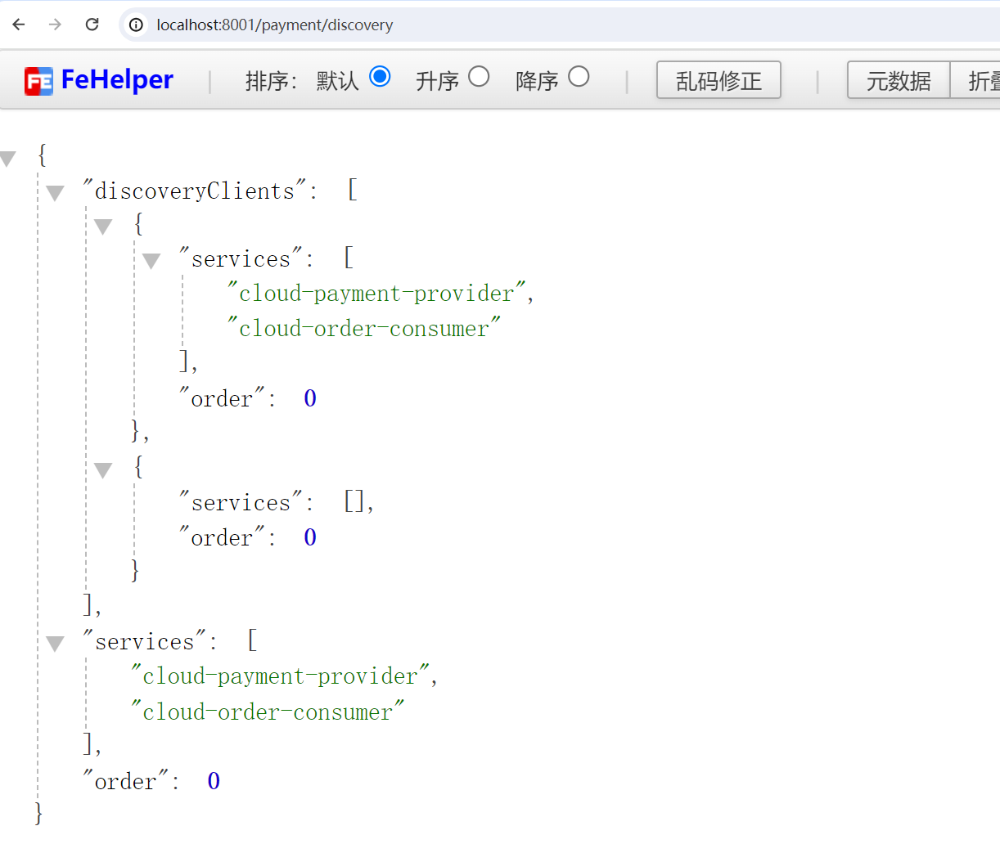


**RestTemplate介绍：**

RestTemplate 是从 Spring3.0 开始支持的一个 HTTP 请求工具，它提供了常见的REST请求方案的模版，例如 GET 请求、POST 请求、PUT 请求、DELETE 请求以及一些通用的请求执行方法 exchange 以及 execute。

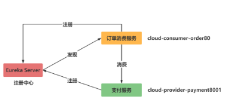


在配置类中的restTemplate添加@LoadBalanced注解，这个注解会 给这个组件 有负载均衡的功能

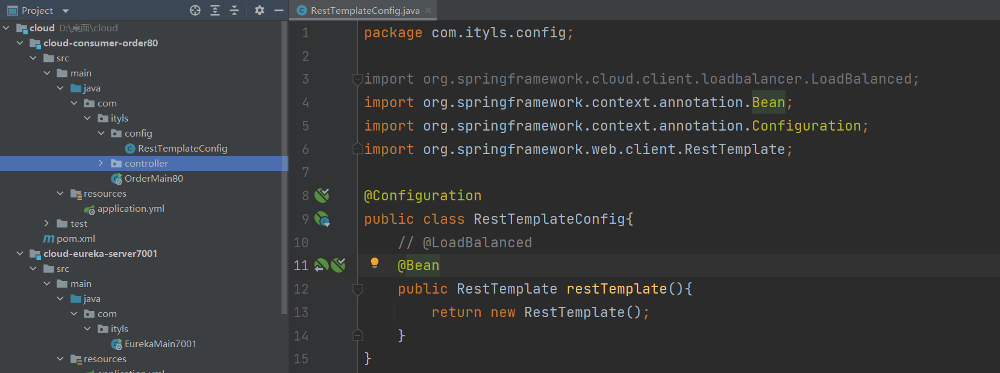

```java
@Configuration
public class RestTemplateConfig{
    //@LoadBalanced
    @Bean
    public RestTemplate restTemplate(){
        return new RestTemplate();
    }
}
```


修改payment8001工程controller

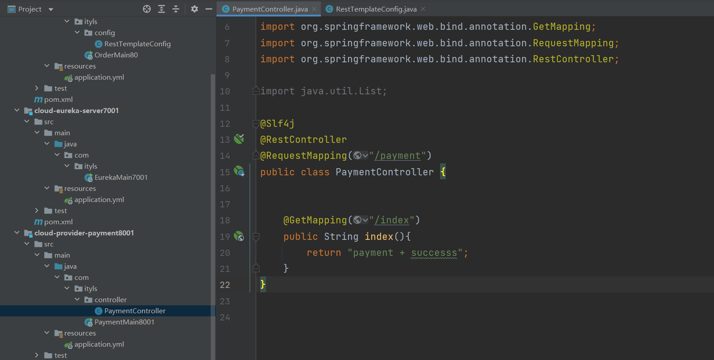

```java
@Slf4j
@RestController
@RequestMapping("/payment")
public class PaymentController {
    @GetMapping("/index")
    public String index(){
        return "payment + successs";
    }
}
```


编写order80工程Controller


```java
@RestController
@RequestMapping("order")
public class OrderController {

    // 服务发现
    @Autowired
    private DiscoveryClient discoveryClient;


    //  HTTP 请求工具
    @Autowired
    private RestTemplate restTemplate;


    /**
     * 测试服务发现接口
     * @return
     */
    @GetMapping("index")
    public String index(){
        // 服务生产者名字
        String hostName = "CLOUD-PAYMENT-PROVIDER";
        // 远程调用方法具体URL
        String url = "/payment/index";
        // 1. 服务发现中获取服务生产者实例
        List<ServiceInstance> instances = discoveryClient.getInstances(hostName);
        System.out.println(instances);
        // 2. 获取到具体实例  服务生产者实例
        ServiceInstance serviceInstance = instances.get(0);
        System.out.println(serviceInstance.getUri());
        System.out.println(serviceInstance.getPort());
        System.out.println(serviceInstance.getHost());
        System.out.println(serviceInstance.getServiceId());
        System.out.println("==============================");
        // 3. 发起了远程调用
        String rest = restTemplate.getForObject(serviceInstance.getUri() + url, String.class);
        return rest;
    }
}
```


测试：

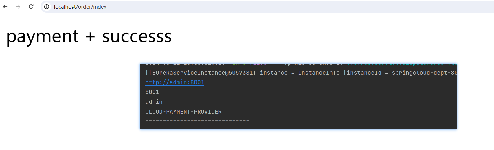


### 16, 服务注册发现_高可用Eureka注册中心

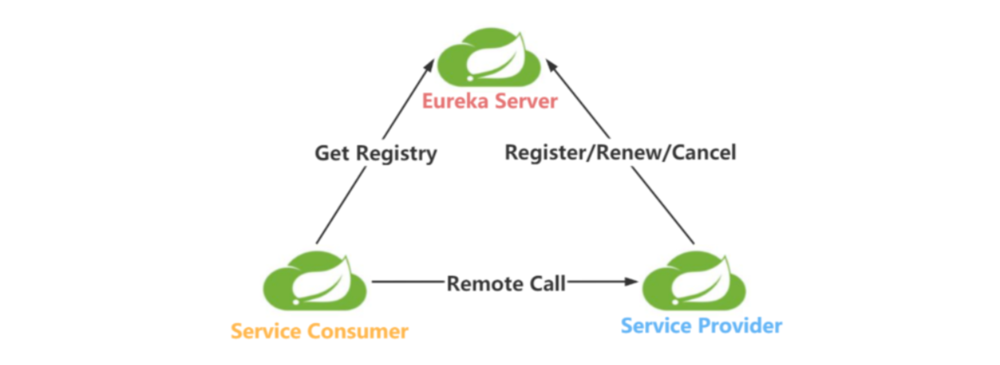


在微服务架构这样的分布式环境中，我们需要充分考虑发生故障的情况，所以在生产环境中必须对各个组件进行高可用部署，对于微服务如此，对于服务注册中心也一样。

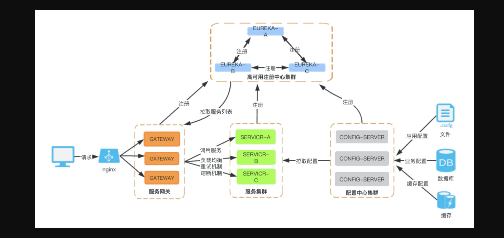


Spring-Cloud为基础的微服务架构，所有的微服务都需要注册到注册中心，如果这个注册中心阻塞或者崩了，那么整个系统都无法继续正常提供服务，所以，这里就需要对注册中心搭建，高可用（HA）集群。


Eureka Server的设计一开始就考虑了高可用问题，在Eureka的服务治理设计中，所有节点即是服务提供方，也是服务消费方，服务注册中心也不例外。是否还记得在单节点的配置中，我们设置过下面这两个参数，让服务注册中心不注册自己:

```properties
eureka.client.register-with-eureka-false
eureka.client.fetch-registry-false
```


### 17, 服务注册发现_高可用Eureka注册中心搭建

构建cloud-eureka-server7002工程

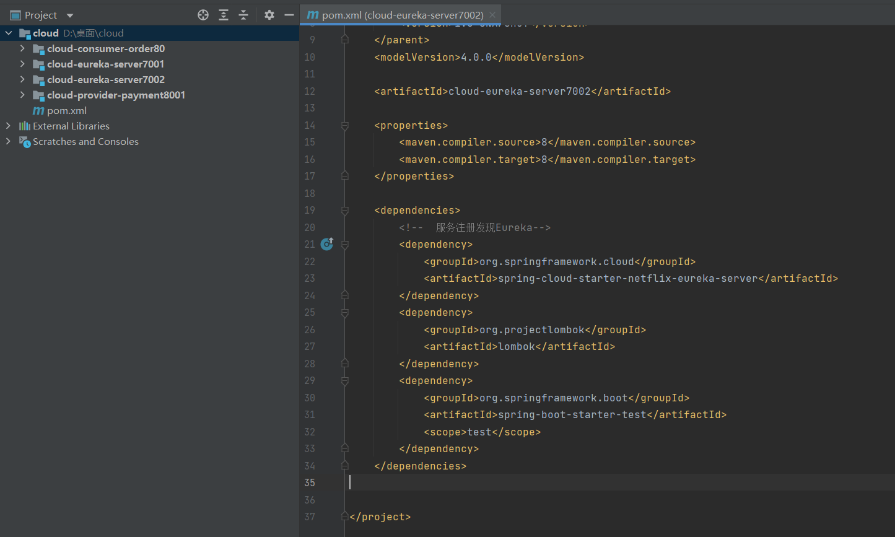

```xml
<dependencies>
    <!--  服务注册发现Eureka-->
    <dependency>
      <groupId>org.springframework.cloud</groupId>
      <artifactId>spring-cloud-starter-netflix-eureka-server</artifactId>
    </dependency>
    <dependency>
      <groupId>org.projectlombok</groupId>
      <artifactId>lombok</artifactId>
    </dependency>
    <dependency>
      <groupId>org.springframework.boot</groupId>
      <artifactId>spring-boot-starter-test</artifactId>
      <scope>test</scope>
    </dependency>
  </dependencies>
```


找到C:\Windows\System32\drivers\etc\hosts

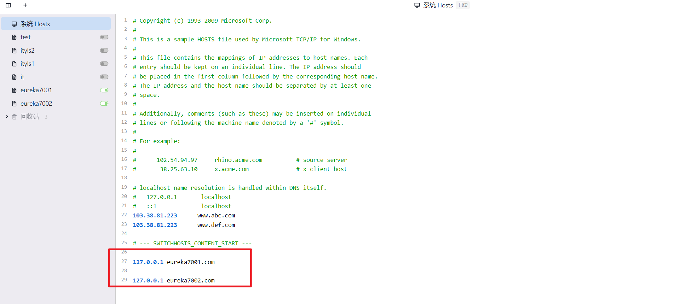

```
#添加如下配置
127.0.0.1 eureka7001.com
127.0.0.1 eureka7002.com
```


修改7001YML文件

```yml
server:
  port: 7001
eureka:
  instance:
    # eureka服务端的实例名字
    hostname: eureka7001.com
  client:
    # 表示是否将自己注册到Eureka Server
    register-with-eureka: false
    # 表示是否从Eureka Server获取注册的服务信息
    fetch-registry: false
    # 设置与 Eureka server交互的地址查询服务和注册服务都需要依赖这个地址
    service-url:
      defaultZone: http://eureka7002.com:7002/eureka/
```


修改7002YML文件

```yml
server:
  port: 7002
eureka:
  instance:
    # eureka服务端的实例名字
    hostname: eureka7002.com
  client:
    # 表示是否将自己注册到Eureka Server
    register-with-eureka: false
    # 表示是否从Eureka Server获取注册的服务信息
    fetch-registry: false
    # 设置与 Eureka server交互的地址查询服务和注册服务都需要依赖这个地址
    service-url:
      defaultZone: http://eureka7001.com:7001/eureka/
```


启动类：

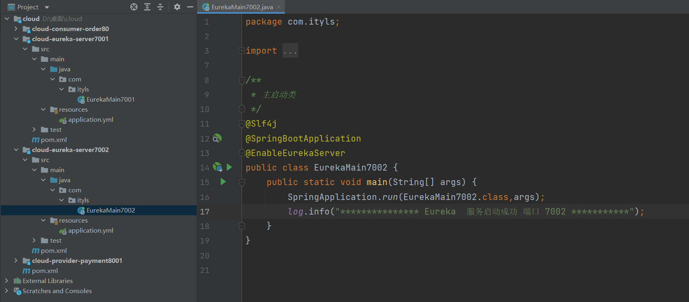

```java
@Slf4j
@SpringBootApplication
@EnableEurekaServer
public class EurekaMain7002 {
    public static void main(String[] args) {
        SpringApplication.run(EurekaMain7002.class,args);
        log.info("*************** Eureka  服务启动成功 端口 7002 ***********");
    }
}
```


将支付微服务8001发布到Eureka集群上

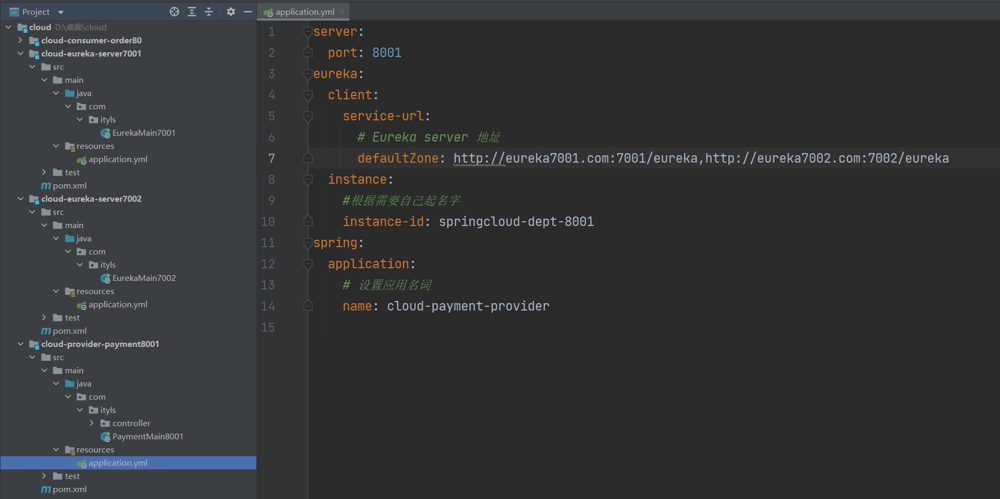

```yml
server:
  port: 8001
eureka:
  client:
    service-url:
      # Eureka server 地址
      defaultZone: http://eureka7001.com:7001/eureka,http://eureka7002.com:7002/eureka
  instance:
    #根据需要自己起名字
    instance-id: springcloud-dept-8001
spring:
  application:
    # 设置应用名词
    name: cloud-payment-provider
```


将订单微服务80发布到Eureka集群上

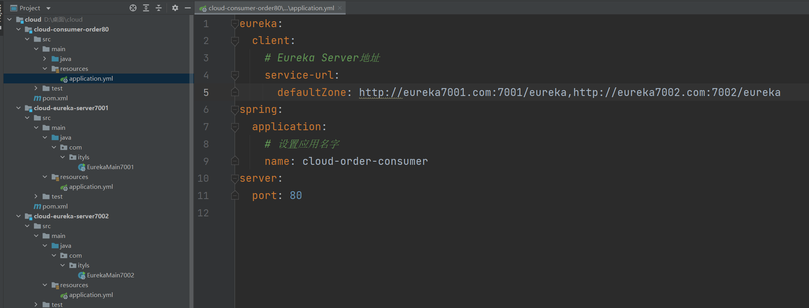

```yml
eureka:
  client:
    # Eureka Server地址
    service-url:
      defaultZone: http://eureka7001.com:7001/eureka,http://eureka7002.com:7002/eureka
spring:
  application:
    # 设置应用名字
    name: cloud-order-consumer
server:
  port: 80
```


**测试:**

1. 先启动EurekaServer集群
2. 在启动服务提供者provider服务
3. 在启动消费者服务

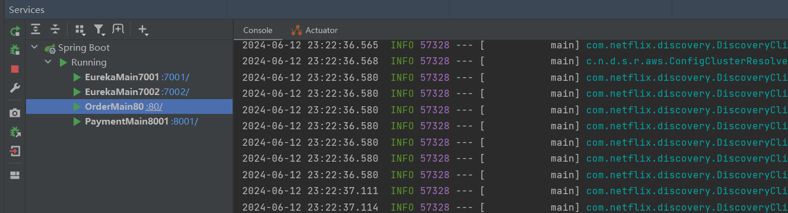

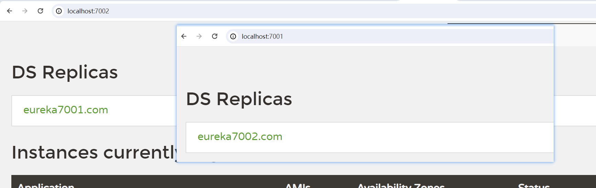

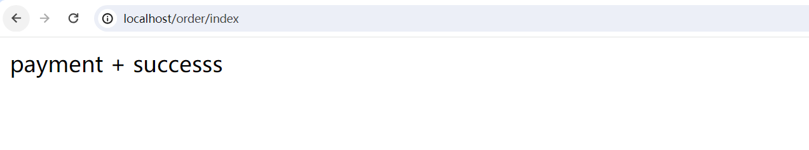

### 18, 客户端负载均衡_什么是负载均衡

**为什么需要负载均衡:**

俗话说在生产队薅羊毛不能逮着一只羊薅，在微服务领域也是这个道理。面对一个庞大的微服务集群，如果你每次发起服务调用都只盯着那一两台服务器，在大用户访问量的情况下，这几台被薅羊毛的服务器一定会不堪重负。


**负载均衡要干什么事情:**

负载均衡有两大门派，**服务端负载均衡**和**客户端负载均衡**。我们先来聊聊这两个不同门派的使用场景，再来看看本节课的主角Spring Cloud Loadbalancer 属于哪门哪派。


**服务端负载均衡:**

在服务集群内设置一个中心化负载均衡器，比如Nginx。发起服务间调用的时候，服务请求并不直接发向目标服务器，而是发给这个全局负载均衡器，它再根据配置的负载均衡策略将请求转发到目标服务。

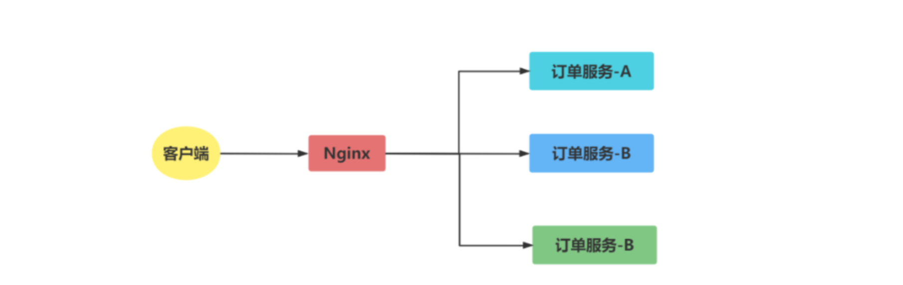

**优点：**

- 服务端负载均衡应用范围非常广，它不依赖于服务发现技术，客户端并不需要拉取完整的服务列表；同时，发起服务调用的客户端也不用操心该使用什么负载均衡策略。

**劣势：**

- 网络消耗
- 复杂度和故障率提升


**客户端负载均衡:**

Spring Cloud Loadbalancer 采用了客户端负载均衡技术，每个发起服务调用的客户端都存有完整的目标服务地址列表，根据配置的负载均衡策略，由客户端自己决定向哪台服务器发起调用。

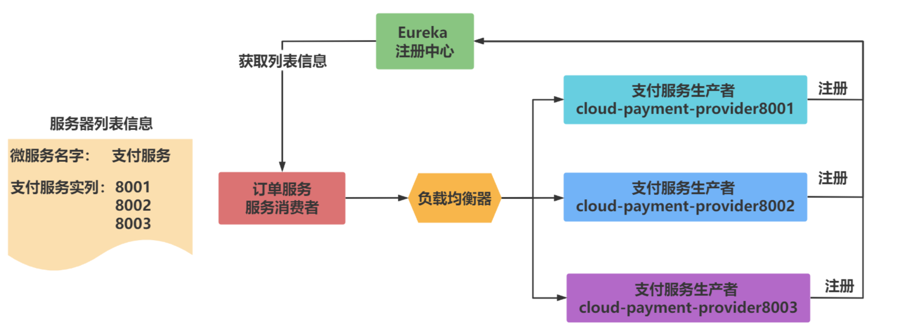

**优势：**

- 网络开销小
- 配置灵活

**劣势：**

需要满足⼀个前置条件，发起服务调用的客户 端需要获取所有目标服务的地址，这样它才能使用负载均衡规则选取要调用的服务。也就是说，客户端负载均衡技术往往需要依赖服务发现技术来获取服务列表。


**负载均衡需要解决两个最基本的问题:**

- **第一个是从哪里选服务实例**

  在Spring Cloud的Eureka微服务系统中，维护微服务实例清单的是Eureka服务治理中心，而具体微服务实例会执行服务获取，获得微服务实例清单，缓存到本地，同时，还会按照一个时间间隔更新这份实例清单（因为实例清单也是在不断维护和变化的)。

- **第二个是如何选择服务实例**

  通过过负载均衡的策略从服务实例清单列表中选择具体实例。


**注意：**

- Eurka和Loadbalancer 自然而然地到了一起，一个通过服务发现获取服务列表，

- 另一个使用负载均衡规则选出目标服务器，然后过着没羞没躁的生活。


**什么是Spring Cloud Ribbon:**

Spring Cloud Ribbon是NetFlix发布的负载均衡器，它有助于Http和Tcp的客户端行为。可以根据负载均衡算法（轮询、随机或自定义）自动帮助消费者请求，默认就是轮询。

**问题：**

- **状态** - `停更进维`
- **替代方案** - `Spring Cloud Loadbalancer`


**什么是Spring Cloud LoadBalancer:**

但是由于Ribbon已经进入维护模式，并且Ribbon 2并不与Ribbon 1相互兼容，所以Spring Cloud全家桶在Spring Cloud Commons项目中，添加了Spring cloud Loadbalancer作为新的负载均衡器，并且做了向前兼容，就算你的项目中继续用 Spring Cloud Netflix 套装（包括Ribbon，Eureka，Zuul，Hystrix等等）让你的项目中有这些依赖，你也可以通过简单的配置，把Ribbon替换成Spring Cloud LoadBalancer。


### 19, 客户端负载均衡_负载均衡策略


以前的Ribbon有多种负载均衡策略，RandomRule - 随性而为（随机）

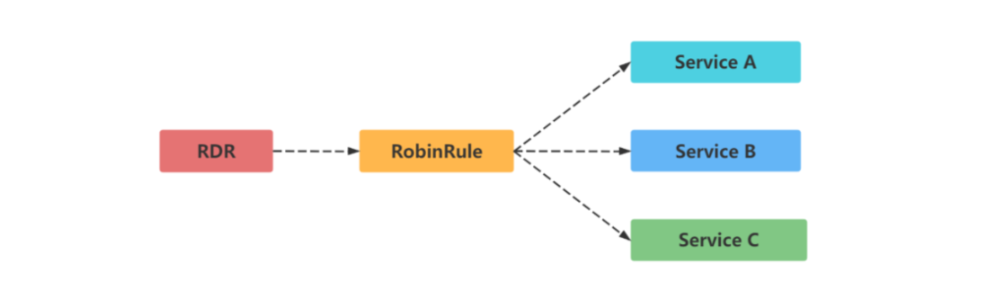

RoundRobinRule - 按部就班（轮询）

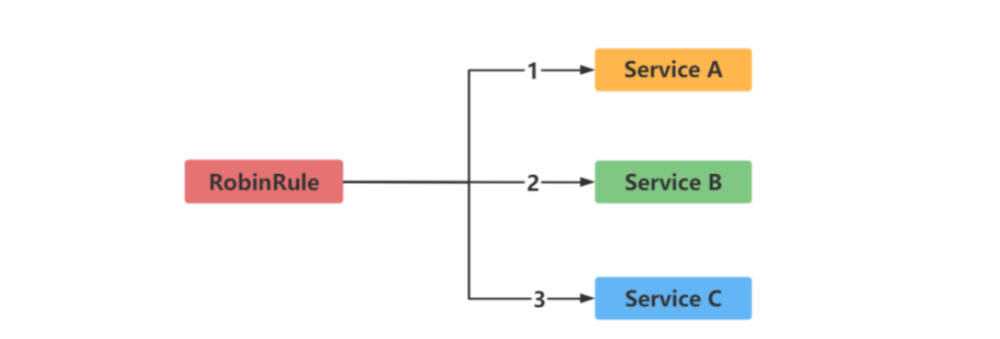

RetryRule - 卷土重来（先按照RoundRobinRule的策略获取服务，如果获取服务失败则在指定时间内会进行重试。）

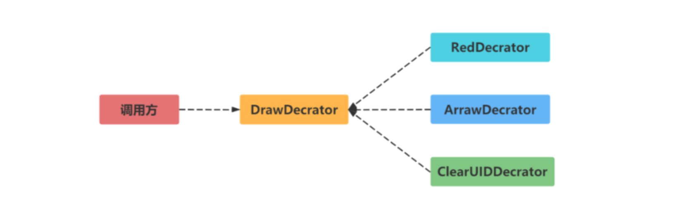

WeightedResponseTimeRule - 能者多劳，这个Rule继承自RoundRibbonRule，他会根据服务节点的响应时间计算权重，响应时间越长权重就越低，响应越快则权重越高，权重的高低决定了机器被选中概率的高低。也就是说，响应时间越小的机器，被选中的概率越大。对RoundRobinRule的扩展，响应速度越快的实例选择权重越大，越容易被选择

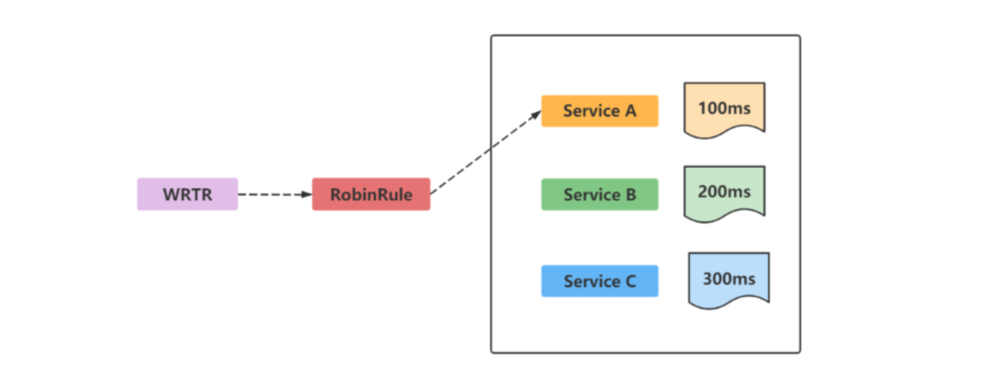

BestAvailableRule - 让最闲的人来，应该说这个Rule有点智能的味道了，在过滤掉故障服务以后，它会基于过去30分钟的统计结果选取当前并发量最小的服务节点，也就是最“闲”的节点作为目标地址。如果统计结果尚未生成，则采用轮询的方式选定节点。

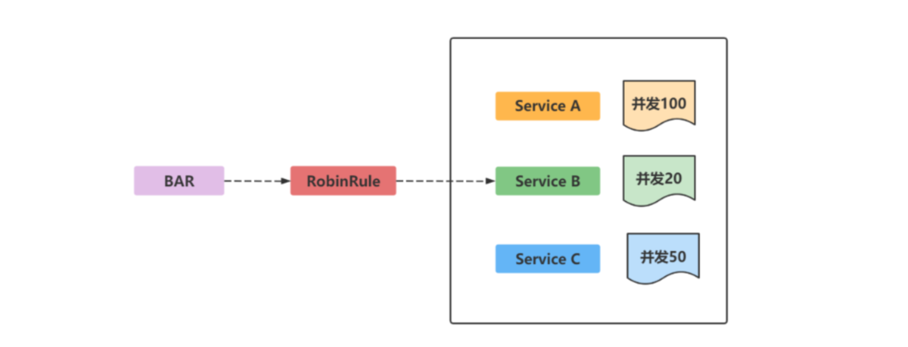


AvailabilityFilteringRule - 我是有底线的，这个规则底层依赖RandomRobinRule来选取节点，但并非来者不拒，它也是有一些底线的，必须要满足它的最低要求的节点才会被选中。如果节点满足了要求，无论其响应时间或者当前并发量是什么，都会被选中。每次AvailabilityFilteringRule（简称AFR）都会请求RobinRule挑选一个节点，然后对这个节点做以下两步检查：是否处于不可用，节点当前的active请求连接数超过阈值，超过了则表示节点目前太忙，不适合接客如果被选中的server不幸挂掉了检查，那么AFR会自动重试（次数最多10次），让RobinRule重新选择一个服务节点。

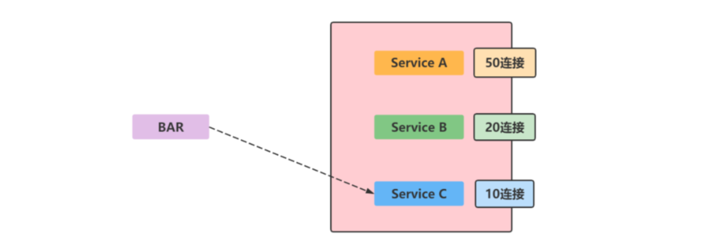


ZoneAvoidanceRule - 我的地盘我做主，默认规则，复合判断server所在区域的性能和server的可用性选择服务器

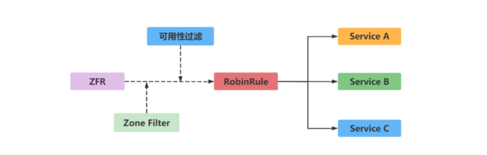


**但LoadBalancer只提供了两种负载均衡器：**

- RandomLoadBalancer 随机
- RoundRobinLoadBalancer 轮询（不指定的时候默认用的是轮询）


