### 1, 服务调用_OpenFeign概述


**OpenFeign是什么：**

Spring Cloud OpenFeign用于Spring Boot应用程序的声明式REST客户端。

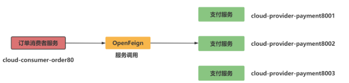


**OpenFeign能干嘛：**

Feign旨在使编写Java Http客户端变得更容易。前面在使用RestTemplate时，利用RestTemplate对http请求的封装处理，形成了一套模版化的调用方法。

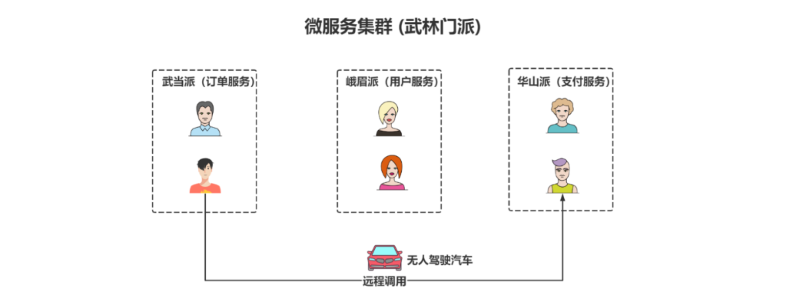


**OpenFeign和Feign两者区别：**

Feign是一个声明式WebService客户端。使用Feign能让编写Web Service客户端更加简单。它的使用方法是定义一个服务接口然后在上面添加注解。Feign也支持可拔插式的编码器和解码器。Spring Cloud对Feign进行了封装，使其支持了Spring MVC标准注解和HttpMessageConverters。

| Feign                                                        | OpenFeign                                                    |
| ------------------------------------------------------------ | ------------------------------------------------------------ |
| Feign是Spring Cloud组件中的一个轻量级RESTful的HTTP服务客户端Feign内置了Ribbon，用来做客户端负载均衡，去调用服务注册中心的服务。 | OpenFeign是Spring Cloud在Feign的基础上支持了SpringMVC的注解，如@RequesMapping等等。OpenFeign的@Feignclient可以解析SpringMVc的@RequestMapping注解下的接口，并通过动态代理的方式产生实现类，实现类中做负载均衡并调用其他服务。 |
| Spring-cloud-starter-feign                                   | spring-cloud-starter-openfeign                               |


使用openFeign时，一句话：接口+注解


### 2, 服务调用_OpenFeign入门案例


构建cloud-consumer-feign-order80工程：

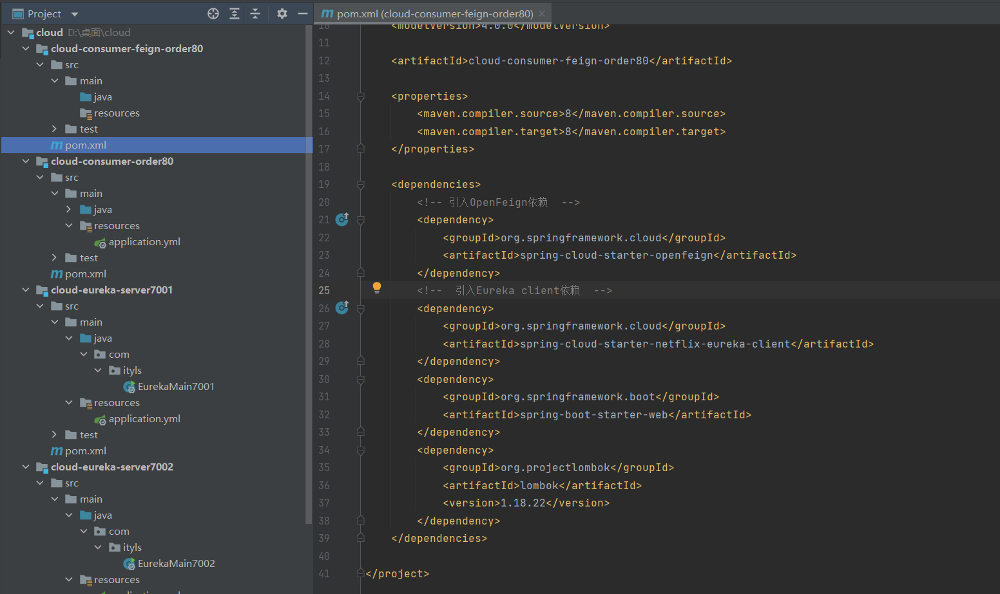


pom:

```xml
    <dependencies>
        <!-- 引入OpenFeign依赖  -->
        <dependency>
            <groupId>org.springframework.cloud</groupId>
            <artifactId>spring-cloud-starter-openfeign</artifactId>
        </dependency>
        <!--  引入Eureka client依赖  -->
        <dependency>
            <groupId>org.springframework.cloud</groupId>
            <artifactId>spring-cloud-starter-netflix-eureka-client</artifactId>
        </dependency>
        <dependency>
            <groupId>org.springframework.boot</groupId>
            <artifactId>spring-boot-starter-web</artifactId>
        </dependency>
        <dependency>
            <groupId>org.projectlombok</groupId>
            <artifactId>lombok</artifactId>
            <version>1.18.22</version>
        </dependency>
    </dependencies>
```


配置：

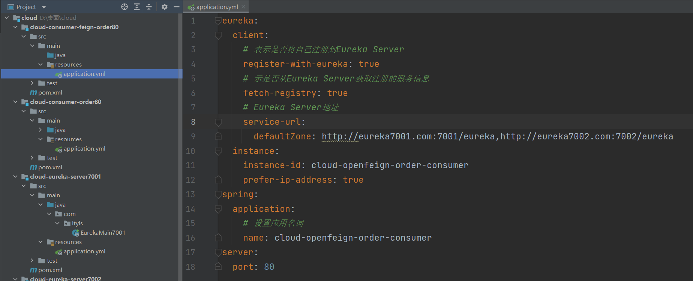

```yml
eureka:
  client:
  # 表示是否将自己注册到Eureka Server
   register-with-eureka: true
  # 示是否从Eureka Server获取注册的服务信息
   fetch-registry: true
  # Eureka Server地址
   service-url:
    defaultZone: http://eureka7001.com:7001/eureka,http://eureka7002.com:7002/eureka
  instance:
   instance-id: cloud-openfeign-order-consumer
   prefer-ip-address: true
spring:
  application:
  # 设置应用名词
   name: cloud-openfeign-order-consumer
server:
  port: 80
```


编写主启动类：

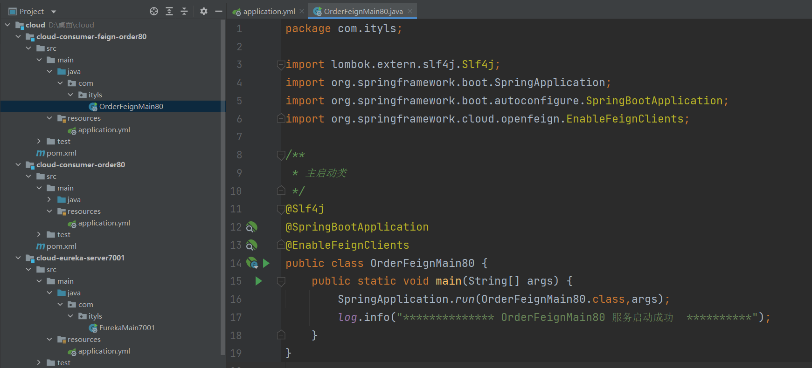

```java
/**
 * 主启动类
 */
@Slf4j
@SpringBootApplication
@EnableFeignClients
public class OrderFeignMain80 {
  public static void main(String[] args) {
    SpringApplication.run(OrderFeignMain80.class,args);
    log.info("************** OrderFeignMain80 服务启动成功  **********");
   }
}
```


编写业务逻辑接口PaymentFeignService

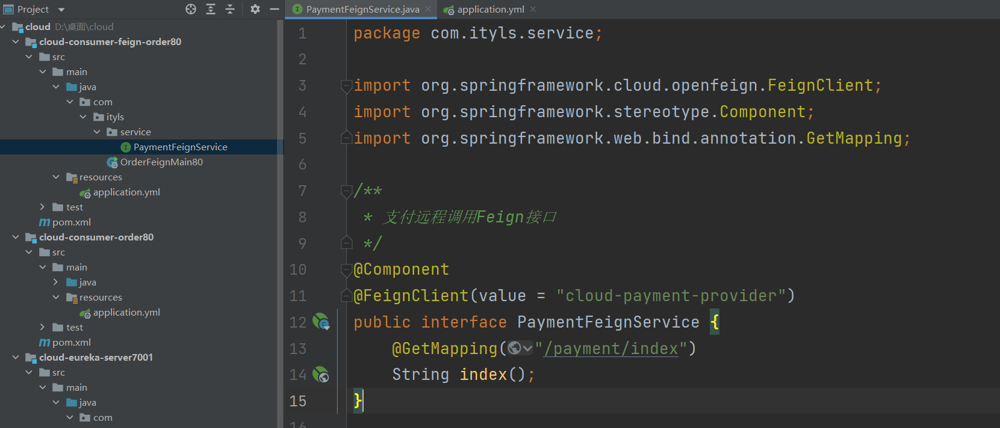

```java
/**
 * 支付远程调用Feign接口
 */
@Component
@FeignClient(value = "cloud-payment-provider")
public interface PaymentFeignService {
   @GetMapping("/payment/index")
   String index();
}
```


订单控制层:

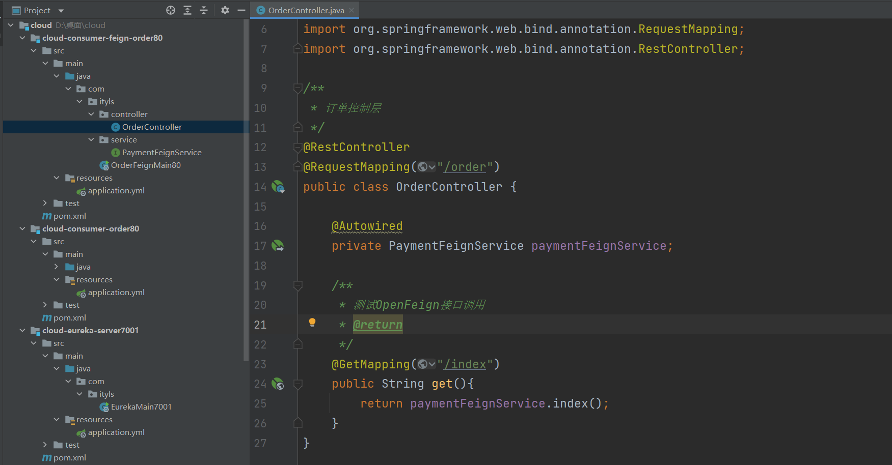

```java
/**
 * 订单控制层
 */
@RestController
@RequestMapping("/order")
public class OrderController {

  @Autowired
  private PaymentFeignService paymentFeignService;

  /**
   * 测试OpenFeign接口调用
   * @return
   */
  @GetMapping("/index")
  public String get(){
    return paymentFeignService.index();
   }
}
```


**测试:**

1. 先启动2个Eureka集群7001/7002
2. 在启动服务提供者payment8001
3. 在启动服务消费者cloud-consumer-feign-order
4. 浏览器访问<http://localhost/order/index>

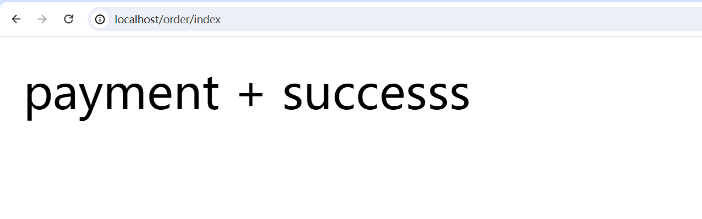


### 3, 服务调用_OpenFeign日志增强


OpenFeign虽然提供了日志增强功能，但是默认是不显示任何日志的，不过开发者在调试阶段可以自己配置日志的级别。

OpenFeign的日志级别如下：

- **NONE**：默认的，不显示任何日志;
- **BASIC**：仅记录请求方法、URL、响应状态码及执行时间;
- **HEADERS**：除了BASIC中定义的信息之外，还有请求和响应的头信息;
- **FULL**：除了HEADERS中定义的信息之外，还有请求和响应的正文及元数据。


**配置类中配置日志级别:**

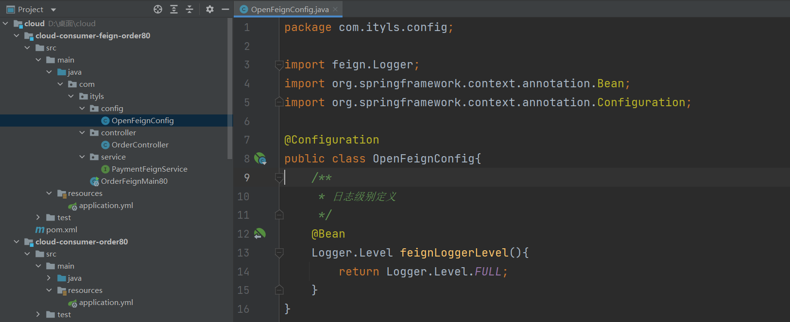

```java
@Configuration
public class OpenFeignConfig{
  
  /**
  * 日志级别定义
  */
  @Bean
  Logger.Level feignLoggerLevel(){
    return Logger.Level.FULL;  //这里的logger是feign包里的。
   }
}
```


**yaml文件中设置接口日志级别:**(这里的`com.ityls.service`是openFeign接口所在的包名，当然你也可以配置一个特定的openFeign接口)

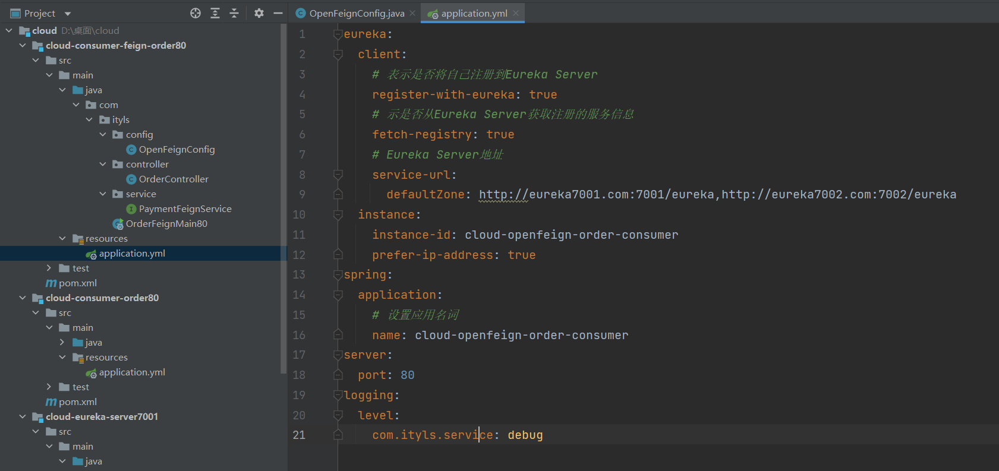

```yml
logging:
  level:
    com.ityls.service: debug
```


请求http://localhost/order/index

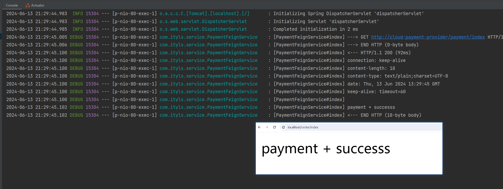


### 4, 服务调用_OpenFeign超时机制

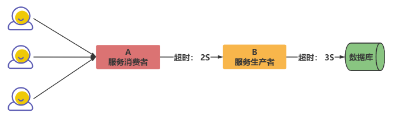

**问题：**

- 服务消费者在调用服务提供者的时候发生了阻塞、等待的情形，这个时候，服务消费者会一直等待下去。
- 在某个峰值时刻，大呈的请求都在同时请求服务消费者，会造成线程的大呈堆积，势必会造成雪崩。
- 利用超时机制来解决这个问题，设置一个超时时间，在这个时间段内，无法完成服务访问，则自动断开连接。


**配置超时时间:**

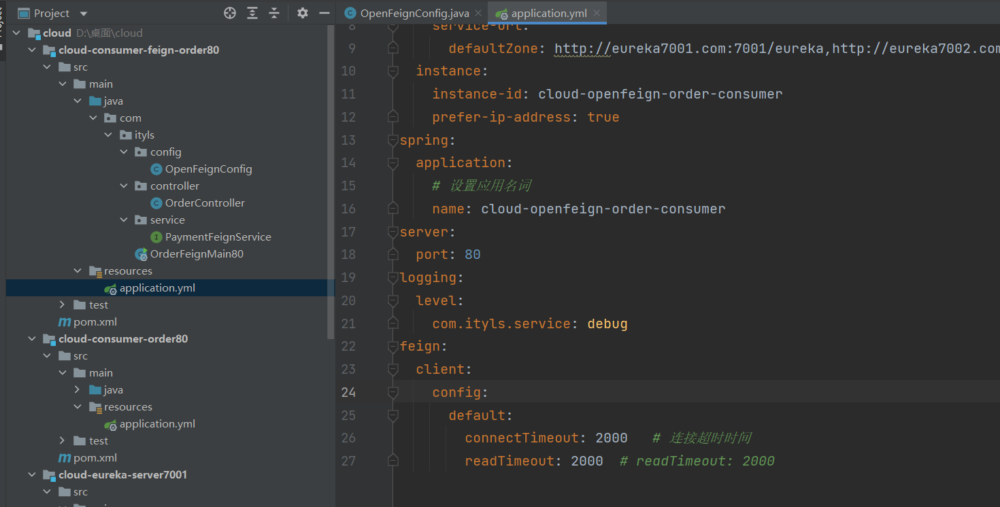

```yml
feign:
  client:
    config:
      default:
        connectTimeout: 2000   # 连接超时时间
        readTimeout: 2000  # readTimeout: 2000
```


**服务提供方8001故意写超时程序:**

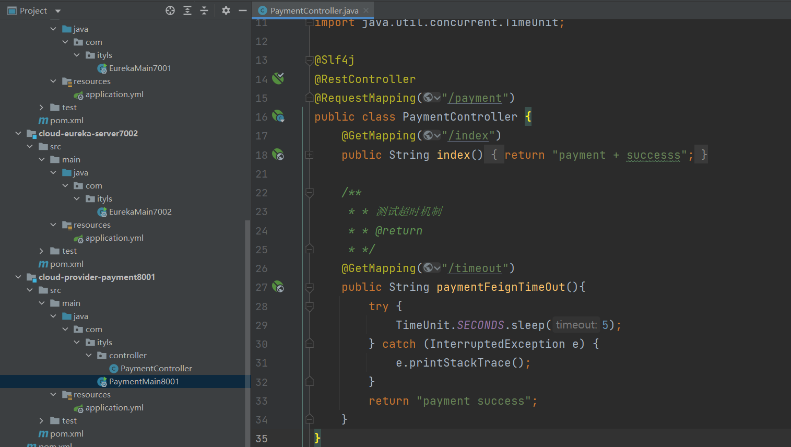

```java
    /**
     * * 测试超时机制
     * * @return
     * */
    @GetMapping("/timeout")
    public String paymentFeignTimeOut(){
        try {
            TimeUnit.SECONDS.sleep(5);
        } catch (InterruptedException e) {
            e.printStackTrace();
        }
        return "payment success";
    }
```


**服务消费方80添加超时方法PaymentFeignService:**

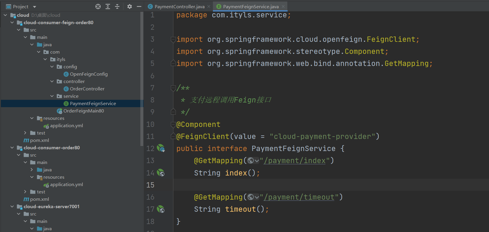

```java
@Component
@FeignClient(value = "cloud-payment-provider")
public interface PaymentFeignService {
    @GetMapping("/payment/index")
    String index();

    @GetMapping("/payment/timeout")
    String timeout();
}
```


**服务消费方80添加超时方法OrderController:**

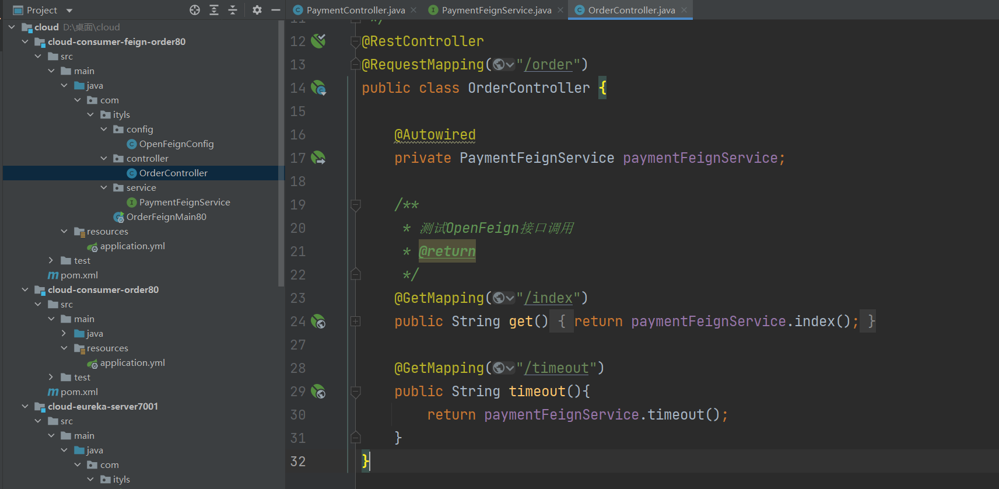

```java
    @GetMapping("/timeout")
    public String timeout(){
        return paymentFeignService.timeout();
    }
```


测试：

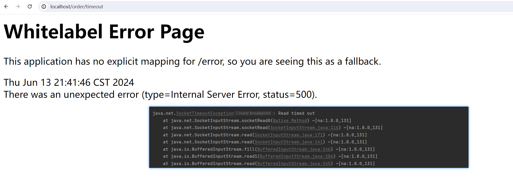


