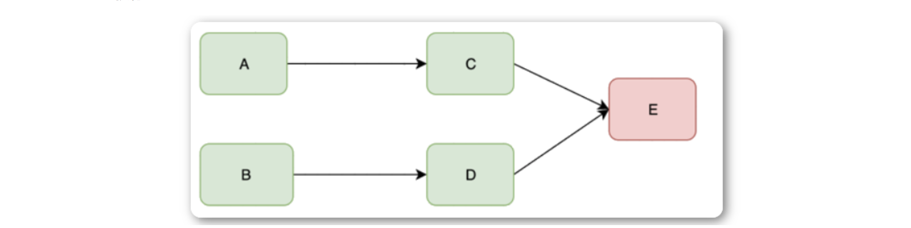
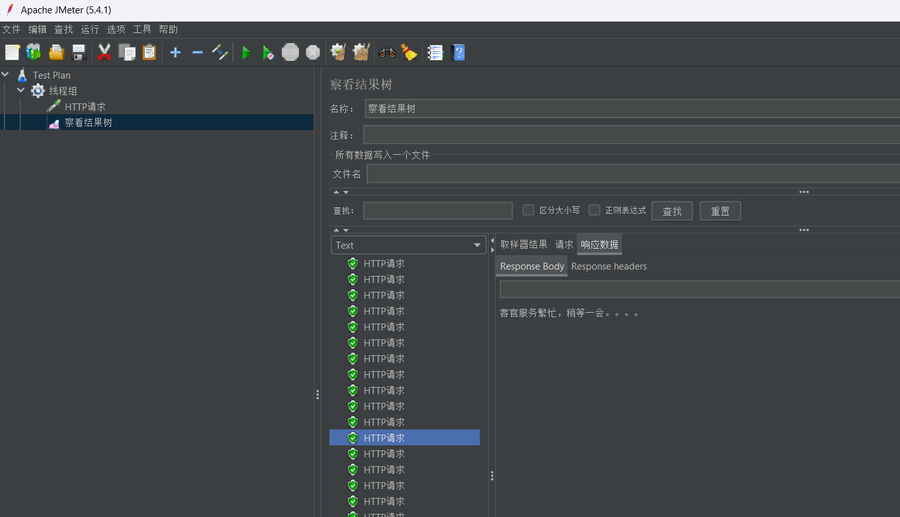
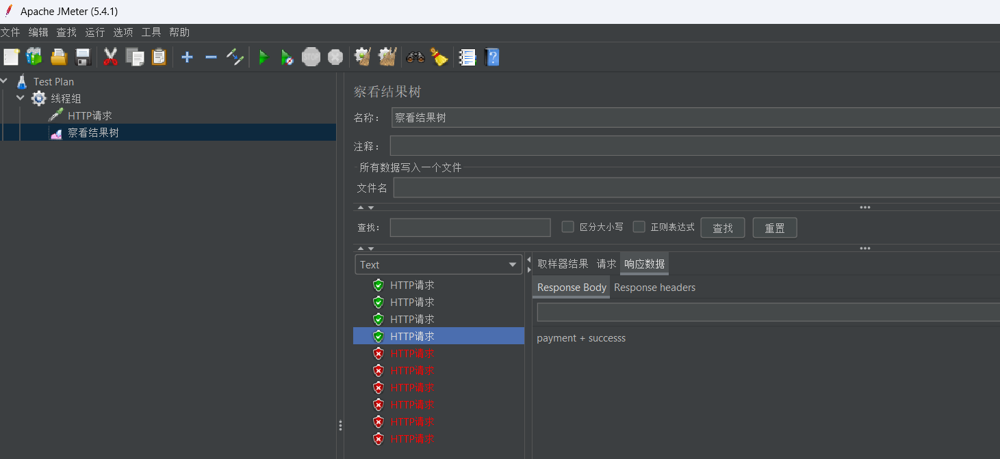

### 1, 什么是灾难性雪崩效应

**什么是灾难性雪崩效应：**

假设我们有两个访问量比较大的服务A和B，这两个服务分别依赖C和D,C和D服务都依赖E服务。


A和B不断的调用C,D处理客户请求和返回需要的数据。当E服务不能供服务的时候，C和D的`超时`和`重试`机制会被执行



由于新的调用不断的产生，会导致C和D对E服务的调用大量的积压，产生大量的调用等待和重试调用，慢慢会耗尽C和D的资源比如内存或CPU，然后也down掉。


A和B服务会重复C和D的操作，资源耗尽，然后down掉，最终整个服务都不可访问。


**结论：**

服务与服务之间的依赖性，故障会传播，造成连锁反应，会对整个微服务系统造成灾难性的严重后果，这就是服务故障的“雪崩”效应。


**造成雪崩原因是什么：**

1. 服务提供者不可用（硬件故障、程序bug、缓存击穿、用户大量请求）
2. 重试加大流量（用户重试，代码逻辑重试）
3. 服务调用者不可用（同步等待造成的资源耗尽）


在高并发访问下，系统所依赖的服务的稳定性对系统的影响非常大，依赖有很多不可控的因素，比如网络连接变慢，资源突然繁忙，暂时不可用，服务脱机等。我们要构建稳定、可靠的分布式系统，就必须要有一套容错方法。


### 2, 雪崩效应解决方案之服务熔断

保险丝：电路中正确安置保险丝，保险丝就会在电流异常升高到一定的高度和热度的时候，自身熔断切断电流，保护了电路安全运行。


**什么是熔断：**

熔断就跟保险丝一样，当一个服务请求并发特别大，服务器已经招架不住了，调用错误率飙升，当错误率达到一定阈值后，就将这个服务熔断了。熔断之后，后续的请求就不会再请求服务器了，以减缓服务器的压力。


当失败率（如因网络故障/超时造成的失败率高）达到阀值自动触发降级，熔断器触发的快速失败会进行快速恢复。


### 3, 雪崩效应解决方案之服务降级


**什么是服务降级：**


**两种场景:**

- 当下游的服务因为某种原因**响应过慢**，下游服务主动停掉一些不太重要的业务，释放出服务器资源，增加响应速度！
- 当下游的服务因为某种原因**不可用**，上游主动调用本地的一些降级逻辑，避免卡顿，迅速返回给用户！


**服务降级 fallback：**

- 概念：服务器繁忙，请稍后重试，不让客户端等待并立即返回一个友好的提示。


**出现服务降级的情况：**

- 程序运行异常
- 超时
- 服务熔断触发服务降级
- 线程池/信号量打满也会导致服务降级


### 4, 雪崩效应解决方案之服务隔离

做服务隔离的目的就是避免服务之间相互影响。毕竟谁也不能说自己的微服务百分百可用，如果不做隔离，一旦一个服务出现了问题，整个系统的稳定性都会受到影响！ 因此，做服务隔离是很有必要的。


**什么是线程池隔离：**

将用户请求线程和服务执行线程分割开来，同时约定了每个服务最多可用线程数。


使用线程池隔离后：


**解释：**

动物园有了新规矩-线程隔离，就是说每个服务单独设置一个小房间（独立线程池），把大厅区域和服务区域隔离开来，每个服务房间也有接待数量限制，比如我设置了熊猫馆最多接纳10人，犀牛管最多5人，大象馆20人。这样，即便来了20个人想你熊猫，我们也只能接待10人，剩下的10个人就会收到Thread Pool Rejects。如此一来，也不会耽搁动物园为用户提供其他服务。


**什么是信号量隔离：**

小时候我们就知道“红灯停，绿灯行”，跟着交通信号的指示过马路。信号量也是这么一种放行、禁行的开关作用。它和线程池技术一样，控制了服务可以被同时访问的并发数量。


**线程池隔离和信号量隔离区别：**

| **隔离方式** | **是否支持超时**                                             | **是否支持熔断**                                             | **隔离原理**         | **是否是异步调用**                     | **资源消耗**                                 |
| ------------ | ------------------------------------------------------------ | ------------------------------------------------------------ | -------------------- | -------------------------------------- | -------------------------------------------- |
| 线程池隔离   | 支持，可直接返回                                             | 支持，当线程池到达maxSize后，再请求会触发fallback接口进行熔断 | 每个服务单独用线程池 | 可以是异步，也可以是同步。看调用的方法 | 大，大量线程的上下文切换，容易造成机器负载高 |
| 信号量隔离   | 不支持，如果阻塞，只能通过调用协议（如：socket超时才能返回） | 支持，当信号量达到maxConcurrentRequests后。再请求会触发fallback | 通过信号量的计数器   | 同步调用，不支持异步                   | 小，只是个计数器                             |


### 5, 服务雪崩解决方案之服务限流

服务熔断和服务隔离都属于出错后的容错处理机制，而限流模式则可以称为预防模式。


限流模式主要是提前对各个类型的请求设置最高的QPS阈值，若高于设置的阈值则对该请求直接返回，不再调用后续资源。


**注意：**

限流的目的是通过对并发访问/请求进行限速，或者对一个时间窗口内的请求进行限速来保护系统，一旦达到限制速率则可以拒绝服务、排队或等待、降级等处理。


**流量控制：**

- 网关限流：防止大量请求进入系统，Mq实现流量消峰
- 用户交流限流：提交按钮限制点击频率限制等


### 6, 介绍Resilience4j

**什么是Hystrix：**

我们耳熟能详的就是Netflix Hystrix,这个断路器是SpringCloud中最早支持的一种容错方案，现在这个断路器已经处于维护状态，已经不再更新了，你仍然可以使用这个断路器，但是呢，我不建议你去使用，因为这个已经不再更新，所以Spring官方已经出现了Netflix Hystrix的替换方案。


**什么是Resilience4j：**

Resilience4j是一个轻量级的容错组件，其灵感来自于Hystrix，但主要为Java 8和函数式编程所设计,也就是我们的lambda表达式。轻量级体现在其只用 [Vavr](https://www.oschina.net/p/vavr) 库（前身是 Javaslang），没有任何外部依赖。而Hystrix依赖了Archaius ，Archaius本身又依赖很多第三方包，例如 Guava、Apache Commons Configuration 等。


**Resilience4j官网：**https://resilience4j.readme.io/


**Resilience4J 提供了一系列增强微服务的可用性功能：**

- resilience4j-circuitbreaker：熔断
- resilience4j-ratelimiter：限流
- resilience4j-bulkhead：隔离
- resilience4j-retry：自动重试
- resilience4j-cache：结果缓存
- resilience4j-timelimiter：超时处理


在使用Resilience4j的过程中，不需要引入所有的依赖，只引入需要的依赖即可。


### 7, Resilience4j的断路器

断路器（CircuitBreaker）相对于前面几个熔断机制更复杂，CircuitBreaker通常存在三种状态（CLOSE、OPEN、HALF_OPEN），并通过一个时间或数量窗口来记录当前的请求成功率或慢速率，从而根据这些指标来作出正确的容错响应。


**6种状态：**

- CLOSED: 关闭状态，代表正常情况下的状态，允许所有请求通过,能通过状态转换为OPEN
- HALF_OPEN: 半开状态，即允许一部分请求通过,能通过状态转换为CLOSED和OPEN
- OPEN: 熔断状态，即不允许请求通过，能通过状态转为为HALF_OPEN
- DISABLED: 禁用状态，即允许所有请求通过，出现失败率达到给定的阈值也不会熔断，不会发生状态转换。
- METRICS_ONLY: 和DISABLED状态一样，也允许所有请求通过不会发生熔断，但是会记录失败率等信息，不会发生状态转换。
- FORCED_OPEN: 与DISABLED状态正好相反，启用CircuitBreaker，但是不允许任何请求通过，不会发生状态转换。


**主要介绍3种状态：**

- closed -> open : 关闭状态到熔断状态， 当失败的调用率（比如超时、异常等）默认50%，达到一定的阈值服务转为open状态，在open状态下，所有的请求都被拦截。
- open-> half_open: 当经过一定的时间后，CircubitBreaker中默认为60s服务调用者允许一定的请求到达服务提供者。
- half_open -> open: 当half_open状态的调用失败率超过给定的阈值，转为open状态
- half_open -> closed: 失败率低于给定的阈值则默认转换为closed状态


### 8, Resilience4j的超时降级

创建模块cloud-consumer-resilience4j-order80


依赖：

```xml
<dependencies>
    <!--  引入Eureka 客户端依赖   -->
    <dependency>
      <groupId>org.springframework.cloud</groupId>
      <artifactId>spring-cloud-starter-netflix-eureka-client</artifactId>
    </dependency>
    <!--   引入服务调用依赖 OpenFigen   -->
    <dependency>
      <groupId>org.springframework.cloud</groupId>
      <artifactId>spring-cloud-starter-openfeign</artifactId>
    </dependency>
    <dependency>
      <groupId>org.springframework.boot</groupId>
      <artifactId>spring-boot-starter-web</artifactId>
    </dependency>
    <dependency>
      <groupId>org.projectlombok</groupId>
      <artifactId>lombok</artifactId>
      <version>1.18.22</version>
    </dependency>
    <!-- actuator监控信息完善 -->
    <dependency>
      <groupId>org.springframework.boot</groupId>
      <artifactId>spring-boot-starter-actuator</artifactId>
    </dependency>
  <dependency>
  <groupId>io.github.resilience4j</groupId>
      <artifactId>resilience4j-spring-cloud2</artifactId>
</dependency>
 <dependency>
    <groupId>org.springframework.cloud</groupId>
    <artifactId>spring-cloud-starter-circuitbreaker-resilience4j</artifactId>
</dependency>
  </dependencies>
```


启动类：


```java
@Slf4j
@SpringBootApplication
@EnableFeignClients
public class OrderResilience4jMain80 {
    public static void main(String[] args) {
        SpringApplication.run(OrderResilience4jMain80.class,args);
        log.info("************** OrderResilience4jMain80 服务启动成功  **********");
    }
}
```


配置文件：


```yml
eureka:
  client:
    service-url:
      defaultZone: http://eureka7001.com:7001/eureka,http://eureka7002.com:7002/eureka
  instance:
    instance-id: cloud-resileence4j-order-consumer80
spring:
  application:
    # 设置应用名词
    name: cloud-order-consumer
server:
  port: 80
  # 超时机制
resilience4j:
  timelimiter:
    instances:
      delay:
        # 设置超时时间 5秒
        timeoutDuration: 2
```


远程接口调用：


```java
/**
 * 支付远程调用Feign接口
 */
@Component
@FeignClient(value = "cloud-payment-provider")
public interface PaymentFeignService {
    @GetMapping("/payment/index")
    String index();

    @GetMapping("/payment/timeout")
    String timeout();
}
```


controller:


```java
@Slf4j
@RestController
@RequestMapping("/order")
public class OrderController {

    @Autowired
    private PaymentFeignService paymentFeignService;

    @GetMapping("/timeout")
    @TimeLimiter(name = "delay")
    public CompletableFuture<String> timeout(){
        log.info("======== 进入方法 ========");

        //异步操作
        CompletableFuture<String> completableFuture = CompletableFuture
                .supplyAsync((Supplier<String>) () -> (paymentFeignService.timeout()));
        log.info("======== 离开方法 ========");

        return completableFuture;
    }
}
```


测试：


编写服务降级方法


```java
  /**
   * 超时服务降级方法
   * @param e
   * @return
   */
  public CompletableFuture<ResponseEntity> timeoutfallback(Exception e){
    e.printStackTrace();
    return CompletableFuture.completedFuture(ResponseEntity.ok("超时啦"));
   }
```


再次测试：


### 9, Resilience4j的重试机制


重试机制比较简单，当服务端处理客户端请求异常时，服务端将会开启重试机制，重试期间内，服务端将每隔一段时间重试业务逻辑处理。 如果最大重试次数内成功处理业务，则停止重试，视为处理成功。如果在最大重试次数内处理业务逻辑依然异常，则此时系统将拒绝该请求。


**修改YML文件：**


```yml
eureka:
  client:
    service-url:
      defaultZone: http://eureka7001.com:7001/eureka,http://eureka7002.com:7002/eureka
  instance:
    instance-id: cloud-resileence4j-order-consumer80
spring:
  application:
    # 设置应用名词
    name: cloud-order-consumer
server:
  port: 80
  # 超时机制
resilience4j:
  retry:
    instances:
      backendA:
        # 最大重试次数
        maxRetryAttempts: 3
        # 固定的重试间隔
        waitDuration: 10s
        enableExponentialBackoff: true
        exponentialBackoffMultiplier: 2
  timelimiter:
    instances:
      delay:
        # 设置超时时间 5秒
        timeoutDuration: 2
```


接口：


实现方法：


```java
    @GetMapping("/retry")
    @Retry(name = "backendA")
    public CompletableFuture<String> retry() {
        log.info("********* 进入方法 ******");
        //异步操作
        CompletableFuture<String> completableFuture = CompletableFuture
                .supplyAsync((Supplier<String>) () -> (paymentFeignService.index()));
        log.info("********* 离开方法 ******");
        return completableFuture;
    }
```


测试：


### 10, Resilience4j的异常熔断降级

修改yml文件:


```yml
resilience4j.circuitbreaker:
  configs:
   default:
   # 熔断器打开的失败阈值
    failureRateThreshold: 30
   # 默认滑动窗口大小，circuitbreaker使用基于计数和时间范围欢动窗口聚合统计失败率
    slidingWindowSize: 10
   # 计算比率的最小值，和滑动窗口大小去最小值，即当请求发生5次才会计算失败率
    minimumNumberOfCalls: 5
   # 滑动窗口类型，默认为基于计数的滑动窗口
    slidingWindowType: TIME_BASED
   # 半开状态允许的请求数
    permittedNumberOfCallsInHalfOpenState: 3
   # 是否自动从打开到半开
    automaticTransitionFromOpenToHalfOpenEnabled: true
   # 熔断器从打开到半开需要的时间
    waitDurationInOpenState: 2s
    recordExceptions:
     - java.lang.Exception
  instances:
   backendA:
    baseConfig: default
```


**编写OrderController:**


```java
/**
* 异常比例熔断降级
* @return
*/
@GetMapping("/citcuitBackend")
@CircuitBreaker(name = "backendA")
public String citcuitBackend(){

    log.info("************ 进入方法 ***********");
    String index = paymentFeignService.index();
    log.info("************ 离开方法 ***********");

    return index;
}
```


测试：


**编写降级方法：**


```java
    /**
     * 异常比例熔断降级
     * @return
     */
    @GetMapping("/citcuitBackend")
    @CircuitBreaker(name = "backendA",fallbackMethod = "fallback")
    public String citcuitBackend(){

        log.info("************ 进入方法 ***********");
        String index = paymentFeignService.index();
        log.info("************ 离开方法 ***********");

        return index;
    }

    /**
     * 服务降级方法
     * @param e
     * @return
     */
    public String fallback(Throwable e){
        e.printStackTrace();
        return "客官服务繁忙，稍等一会。。。。";
    }
```


测试：




### 11, Resilience4j的慢调用熔断降级


配置慢调用：


```yml
eureka:
  client:
    service-url:
      defaultZone: http://eureka7001.com:7001/eureka,http://eureka7002.com:7002/eureka
  instance:
    instance-id: cloud-resileence4j-order-consumer80
spring:
  application:
    # 设置应用名词
    name: cloud-order-consumer
server:
  port: 80
  # 超时机制
resilience4j:
  retry:
    instances:
      backendA:
        # 最大重试次数
        maxRetryAttempts: 3
        # 固定的重试间隔
        waitDuration: 10s
        enableExponentialBackoff: true
        exponentialBackoffMultiplier: 2
  timelimiter:
    instances:
      delay:
        # 设置超时时间 5秒
        timeoutDuration: 2

resilience4j.circuitbreaker:
  configs:
    default:
      # 熔断器打开的失败阈值
      failureRateThreshold: 30
      # 默认滑动窗口大小，circuitbreaker使用基于计数和时间范围欢动窗口聚合统计失败率
      slidingWindowSize: 10
      # 计算比率的最小值，和滑动窗口大小去最小值，即当请求发生5次才会计算失败率
      minimumNumberOfCalls: 5
      # 滑动窗口类型，默认为基于计数的滑动窗口
      slidingWindowType: TIME_BASED
      # 半开状态允许的请求数
      permittedNumberOfCallsInHalfOpenState: 3
      # 是否自动从打开到半开
      automaticTransitionFromOpenToHalfOpenEnabled: true
      # 熔断器从打开到半开需要的时间
      waitDurationInOpenState: 2s
      recordExceptions:
        - java.lang.Exception
  instances:
    backendA:
      baseConfig: default
    backendB:
      # 熔断器打开的失败阈值
      failureRateThreshold: 50
      # 慢调用时间阈值 高于这个阈值的
      slowCallDurationThreshold: 2s
      # 慢调用百分比阈值，断路器吧调用事件大于slow
      slowCallRateThreshold: 30
      slidingWindowSize: 10
      slidingWindowType: TIME_BASED
      minimumNumberOfCalls: 2
      permittedNumberOfCallsInHalfOpenState: 2
      waitDurationInOpenState: 2s
      eventConsumerBufferSize: 10

logging:
  level:
    com.ityls.service: debug
```


controller:


```java
    /**
     * 慢调用比例熔断降级
     * @return
     */
    @GetMapping("/slowcircuitbackend")
    @CircuitBreaker(name = "backendB",fallbackMethod = "slowfallback")
    public String slowcircuitbackend(){
        log.info("************ 进入方法 ***********");
        try {
            TimeUnit.SECONDS.sleep(10);
        } catch (InterruptedException e) {
            e.printStackTrace();
        }
        String index = paymentFeignService.index();
        log.info("************ 离开方法 ***********");
        return index;
    }

    public String slowfallback(Exception e){
        e.printStackTrace();
        return "太慢了";
    }
```


测试：


### 12, Resilience4j的信号量隔离


依赖：


```xml
 <dependency>
   <groupId>io.github.resilience4j</groupId>
   <artifactId>resilience4j-bulkhead</artifactId>
   <version>1.7.0</version>
</dependency>
```


配置：


```yml
resilience4j:
 #信号量隔离
  bulkhead:
   instances:
    backendA:
    # 隔离允许并发线程执行的最大数量
     maxConcurrentCalls: 5
    # 当达到并发调用数量时，新的线程的阻塞时间
     maxWaitDuration: 20ms
```


controller:


```java
    /**
     * 测试信号量隔离
     * @return
     */
    @Bulkhead(name = "backendA",type = Bulkhead.Type.SEMAPHORE)
    @GetMapping("bulkhead")
    public String bulkhead() throws InterruptedException {
        log.info("************** 进入方法 *******");
        TimeUnit.SECONDS.sleep(10);
        String index = paymentFeignService.index();
        log.info("************** 离开方法 *******");
        return index;
    }
```


测试：


### 13, Resilience4j的线程池服务隔离


**线程池隔离配置修改YML文件：**


```yml
eureka:
  client:
    service-url:
      defaultZone: http://eureka7001.com:7001/eureka,http://eureka7002.com:7002/eureka
  instance:
    instance-id: cloud-resileence4j-order-consumer80
spring:
  application:
    # 设置应用名词
    name: cloud-order-consumer
server:
  port: 80
  # 超时机制
resilience4j:
  thread-pool-bulkhead:
    instances:
      backendA:
        # 最大线程池大小
        maxThreadPoolSize: 4
        # 核心线程池大小
        coreThreadPoolSize: 2
        #  队列容量
        queueCapacity: 2
  #信号量隔离
  bulkhead:
    instances:
      backendA:
        # 隔离允许并发线程执行的最大数量
        maxConcurrentCalls: 5
        # 当达到并发调用数量时，新的线程的阻塞时间
        maxWaitDuration: 20ms
  retry:
    instances:
      backendA:
        # 最大重试次数
        maxRetryAttempts: 3
        # 固定的重试间隔
        waitDuration: 10s
        enableExponentialBackoff: true
        exponentialBackoffMultiplier: 2
  timelimiter:
    instances:
      delay:
        # 设置超时时间 5秒
        timeoutDuration: 2

resilience4j.circuitbreaker:
  configs:
    default:
      # 熔断器打开的失败阈值
      failureRateThreshold: 30
      # 默认滑动窗口大小，circuitbreaker使用基于计数和时间范围欢动窗口聚合统计失败率
      slidingWindowSize: 10
      # 计算比率的最小值，和滑动窗口大小去最小值，即当请求发生5次才会计算失败率
      minimumNumberOfCalls: 5
      # 滑动窗口类型，默认为基于计数的滑动窗口
      slidingWindowType: TIME_BASED
      # 半开状态允许的请求数
      permittedNumberOfCallsInHalfOpenState: 3
      # 是否自动从打开到半开
      automaticTransitionFromOpenToHalfOpenEnabled: true
      # 熔断器从打开到半开需要的时间
      waitDurationInOpenState: 2s
      recordExceptions:
        - java.lang.Exception
  instances:
    backendA:
      baseConfig: default
    backendB:
      # 熔断器打开的失败阈值
      failureRateThreshold: 50
      # 慢调用时间阈值 高于这个阈值的
      slowCallDurationThreshold: 2s
      # 慢调用百分比阈值，断路器吧调用事件大于slow
      slowCallRateThreshold: 30
      slidingWindowSize: 10
      slidingWindowType: TIME_BASED
      minimumNumberOfCalls: 2
      permittedNumberOfCallsInHalfOpenState: 2
      waitDurationInOpenState: 2s
      eventConsumerBufferSize: 10

logging:
  level:
    com.ityls.service: debug
```


controller:


```java
    /**
     * 测试线程池服务隔离
     * @return
     */
    @Bulkhead(name = "backendA",type = Bulkhead.Type.THREADPOOL)
    @GetMapping("/futrue")
    public CompletableFuture future(){
        log.info("********** 进入方法 *******");
        try {
            TimeUnit.SECONDS.sleep(5);
        } catch (InterruptedException e) {
            e.printStackTrace();
        }
        log.info("********** 离开方法 *******");
        return CompletableFuture.supplyAsync(() -> "线程池隔离信息......");
    }
```


测试：


### 14, Resilience4j的限流

配置：


```yml
  ratelimiter:
   instances:
    backendA:
    # 限流周期时长。    默认：500纳秒
     limitRefreshPeriod: 5s
    # 周期内允许通过的请求数量。    默认：50
     limitForPeriod: 2
```


controller:


```java
    /**
     * 限流
     * @return
     */
    @GetMapping("/limiter")
    @RateLimiter(name = "backendA")
    public CompletableFuture<String> RateLimiter() {
        log.info("********* 进入方法 ******");
        //异步操作
        CompletableFuture<String> completableFuture = CompletableFuture
                .supplyAsync((Supplier<String>) () -> (paymentFeignService.index()));
        log.info("********* 离开方法 ******");
        return completableFuture;
    }
```


测试：




