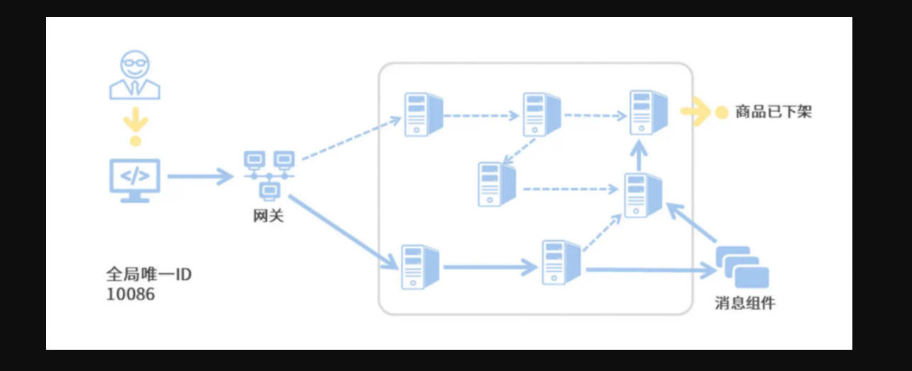

### 1, 为什么需要链路追踪

在这个微服务系统中，用户通过浏览器的 H5页面访问系统，这个用户请求会先抵达微服务网关组件，然后网关再把请求分发给各个微服务。所以你会发现，用户请求从发起到结束要经历 很多个微服务的处理，这里面还涉及到消息组件的集成。

**存在的问题**：

- 服务之间的依赖与被依赖的关系如何能够清晰的看到？
- 出现异常时如何能够快速定位到异常服务？
- 出现性能瓶颈时如何能够迅速定位哪个服务影响的？

**解决：**

为了能够在分布式架构中快速定位问题，分布式链路追踪应运而生。将一次分布式请求还原成调用链路，进行日志记录，性能监控并将一次分布式请求的调用情况集中展示。比如各个服务节点上的耗时、请求具体到达哪台机器上、每个服务节点的请求状态等等。

**常见链路追踪技术有那些：**市面上有很多链路追踪的项目，其中也不乏一些优秀的，如下：

- **Sleuth**：SpringCloud 提供的分布式系统中链路追踪解决方案。很可惜的是阿里系并没有链路追踪相关的开源项目，我们可以采用Spring Cloud Sleuth+Zipkin来做链路追踪的解决方案。
- **zipkin**：由Twitter公司开源，开放源代码分布式的跟踪系统，用于收集服务的定时数据，以解决微服务架构中的延迟问题，包括：数据的收集、存储、查找和展现。该产品结合`spring-cloud-sleuth`使用较为简单， 集成很方便， 但是功能较简单。
- **pinpoint**：韩国人开源的基于字节码注入的调用链分析，以及应用监控分析工具。特点是支持多种插件，UI功能强大，接入端无代码侵入
- **skywalking**：SkyWalking是本土开源的基于字节码注入的调用链分析，以及应用监控分析工具。特点是支持多种插件，UI功能较强，接入端无代码侵入。目前已加入Apache孵化器。

### 2, Spring Cloud Sleuth是什么

Spring Cloud Sleuth实现了一种分布式的服务链路跟踪解决方案，通过使用Sleuth可以让我们快速定位某个服务的问题。简单来说，Sleuth相当于调用链监控工具的客户端，集成在各个微服务上，负责产生调用链监控数据。

**注意：**

Spring Cloud Sleuth只负责产生监控数据，通过日志的方式展示出来，并没有提供可视化的UI界面。

**Sleuth核心概念：**

- **Span**：基本的工作单元，相当于链表中的一个节点，通过一个唯一ID标记它的开始、具体过程和结束。我们可以通过其中存储的开始和结束的时间戳来统计服务调用的耗时。除此之外还可以获取事件的名称、请求信息等。
- **Trace**：一系列的Span串联形成的一个树状结构，当请求到达系统的入口时就会创建一个唯一ID（traceId），唯一标识一条链路。这个traceId始终在服务之间传递，直到请求的返回，那么就可以使用这个traceId将整个请求串联起来，形成一条完整的链路。

通过这些Sleuth 的特殊标记，我们就可以根据时间顺序，将一次服务请求经过的调用节点都梳理出来，这样你就能迅速发现报错信息发生在哪个阶段。这是使用Zipkin 生成的链路追踪的可视化信息。你可以看出，每个服务调用都以时间先后顺序规整好了，红色的部分就是发生线上Exception的服务。

除了Trace和Span之外，Sleuth还有一个特殊的数据结构，叫做Annotation，被用来记录一个具体的“事件”。我把 Sleuth所支持的四种事件做成了一个表格，你可以参考一下。

在这里我举个例子，来帮你理解怎么使用这四种事件。

如果你用服务B的ss减去 sr，你就可以得到请求在服务B阶段的处理时间。如果用服务B的sr减去服务A的cs，就可以得到服务A到服务B之间的网络调用延迟时间。如果用服务A的 cr减去 cs，就可以得到当次请求从发起到结束所花费的总时间。

### 3, 微服务集成Sleuth实现链路打标

### 4, 什么是ZipKin

### 5, Docker搭建Zipkin服务

### 6, Zipkin客户端搭建

### 7, 什么是SkyWalking

### 8, SkyWalking核心概念

### 9, 什么是探针Java Agent

### 10, Java探针日志监控实现之环境搭建

### 11, Java探针日志监控实现之探针实现

### 12, SkyWalking服务环境搭建

### 13, 微服务接入SkyWalking探针

### 14, Docker搭建Elasticsearch环境

### 15, SkyWalking使用Elasticsearch持久化

### 16, SkyWalking自定义链路追踪

### 17, SkyWalking日志

### 18, SkyWalking告警

### 19, Skywalking自定义告警规则

### 20, SkyWalking网络钩子Webhooks

### 21, SkyWalking钉钉告警

### 22, SkyWalking邮件告警

