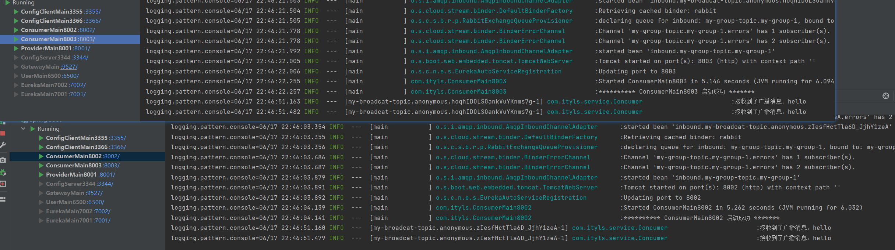

### 1, 什么是Spring Cloud Stream

**为什么使用Spring Cloud Stream：**

流行的消息中间件过多，有可能一个工程中使用MQ，比方说我们用到了RabbitMQ和Kafka，由于这两个消息中间件的架构上的不同，像RabbitMQ有exchange，kafka有Topic，partitions分区，这些中间件的差异性导致我们实际项目开发给我们造成了一定的困扰，我们如果用了两个消息队列的其中一种，后面的业务需求，我想往另外一种消息队列进行迁移，这时候无疑就是一个灾难性的，一大堆东西都要重新推倒重新做，因为它跟我们的系统耦合了，这时候springcloud Stream给我们提供了一种解耦合的方式。


我们之前使用的数据库链接工具


Stream解决了开发人员无感知的使用消息中间件的问题，因为Stream对消息中间件的进一步封装，可以做到代码层面对中间件的无感知，甚至于动态的切换中间件，使得微服务开发的高度解耦，服务可以关注更多自己的业务流程。


**什么是Spring Cloud Stream：**

官方定义Spring Cloud Stream 是一个构建消息驱动微服务的框架。实现了一套轻量级的消息驱动的微服务框架。通过使用Spring Cloud Stream,可以有效简化开发人员对消息中间件的使用复杂度，让系统开发人员可以有更多的精力关注于核心业务逻辑的处理。


### 2, 入门案例之消息生产者

新建Module工程cloud-stream-rabbitmq-provider8001


依赖：

```xml
    <dependencies>
        <dependency>
            <groupId>org.springframework.cloud</groupId>
            <artifactId>spring-cloud-starter-stream-rabbit</artifactId>
        </dependency>
        <!--  引入Eureka client依赖  -->
        <dependency>
            <groupId>org.springframework.cloud</groupId>
            <artifactId>spring-cloud-starter-netflix-eureka-client</artifactId>
        </dependency>
        <dependency>
            <groupId>org.springframework.boot</groupId>
            <artifactId>spring-boot-starter-web</artifactId>
        </dependency>
        <dependency>
            <groupId>org.projectlombok</groupId>
            <artifactId>lombok</artifactId>
            <version>1.18.22</version>
        </dependency>
    </dependencies>
```


要使用RabbitMQ绑定器，可以通过使用以下Maven坐标将其添加到 Spring Cloud Stream应用程序中

```xml
 <dependency>
   <groupId>org.springframework.cloud</groupId>
   <artifactId>spring-cloud-stream-binder-rabbit</artifactId>
</dependency>
```

或

```java
<dependency>
   <groupId>org.springframework.cloud</groupId>
   <artifactId>spring-cloud-starter-stream-rabbit</artifactId>
</dependency>
```


配置文件：


```yml
server:
  port: 8001
eureka:
  instance:
    # 实例名字
    instance-id: cloud-provider8001
  client:
    service-url:
      # 指定单机eureka server地址
      #defaultZone: http://localhost:7001/eureka/
      defaultZone: http://localhost:7001/eureka/,http://localhost:7002/eureka/
spring:
  application:
    name: cloud-provider

  rabbitmq:
   host: 103.38.81.223
   port: 5672
   username: guest
   password: guest
  cloud:
    stream:
      bindings:
       # 广播消息  生产者绑定名字   out生产者   0固定写法
         myBroadcat-out-0:
            #对应的真是RabbitMQ exchange
            destination: my-broadcat-topic
        # 分组消费
         myGroup-out-0:
           destination: my-group-topic
```


实体类：


```java
/**
 * 消息实体类
 */
@Data
@AllArgsConstructor
@NoArgsConstructor
@Builder
public class MyMessage implements Serializable {
    // 消息体
    private String payload;
}
```


接口：


```java
/**
 * 发送消息的接口
 */
public interface IMessageProvider {

    /**
     * 发送消息
     * @param message 消息内容
     * @return
     */
    String  send(String message);


    /**
     * 分组消费
     * @param message 消息内容
     * @return
     */
    String  groupSend(String message);
}
```


实现类：


```java
/**
 * 定义消息的推送的管道
 */
@Service
public class MessageProviderImpl  implements IMessageProvider {


    //直接装配桥  用来连接rabbitmq 或者kafka
    @Autowired
    StreamBridge streamBridge;

    @Override
    public String send(String message) {

        MyMessage myMessage = new MyMessage();
        myMessage.setPayload(message);

        /**
         * 第一个参数： 绑定的名称 格式为  自定义的绑定名称-out-0
         * 第二个参数： 发送消息实体
         */
        streamBridge.send("myBroadcat-out-0",myMessage);

        return "success";
    }

    @Override
    public String groupSend(String message) {

        MyMessage myMessage = new MyMessage();
        myMessage.setPayload(message);

        /**
         * 第一个参数： 绑定的名称 格式为  自定义的绑定名称-out-0
         * 第二个参数： 发送消息实体
         */
        streamBridge.send("myGroup-out-0",myMessage);

        return "success";
    }

}
```


controller:


```java
@RestController
public class ProviderController {

    @Autowired
    private IMessageProvider iMessageProvider;

    /**
     * 发送消息
     * @param message 消息内容
     * @return
     */
    @GetMapping("send")
    public String send(String message){
       return  iMessageProvider.send(message);
    }


    /**
     * 发送分组消息
     * @param message 消息内容
     * @return
     */
    @GetMapping("groupsend")
    public String groupsend(String message){
        return  iMessageProvider.groupSend(message);
    }
}
```


启动类：


```java
/**
 * 主启动类
 */
@SpringBootApplication
@Slf4j
@EnableEurekaClient
public class ProviderMain8001 {
    public static void main(String[] args) {
        SpringApplication.run(ProviderMain8001.class,args);
        log.info("************ ProviderMain8001 启动成功 *********");
    }
}
```


启动项目：


### 3, 入门案例之消息消费者

新建Module工程cloud-stream-rabbitmq-consumer8002,8003


```xml
 <dependencies>
    <dependency>
      <groupId>org.springframework.cloud</groupId>
      <artifactId>spring-cloud-starter-stream-rabbit</artifactId>
    </dependency>
    <!--  引入Eureka client依赖  -->
    <dependency>
      <groupId>org.springframework.cloud</groupId>
      <artifactId>spring-cloud-starter-netflix-eureka-client</artifactId>
    </dependency>
    <dependency>
      <groupId>org.springframework.boot</groupId>
      <artifactId>spring-boot-starter-web</artifactId>
    </dependency>
    <dependency>
      <groupId>org.projectlombok</groupId>
      <artifactId>lombok</artifactId>
      <version>1.18.22</version>
    </dependency>
  </dependencies>
```


配置：


```yml
server:
  port: 8002
eureka:
  instance:
    # 实例名字
    instance-id: cloud-consumer8002
  client:
    service-url:
      # 指定单机eureka server地址
      #defaultZone: http://localhost:7001/eureka/
      defaultZone: http://localhost:7001/eureka/,http://localhost:7002/eureka/
spring:
  application:
    name: cloud-consumer

  rabbitmq:
    host: 103.38.81.223
    port: 5672
    username: guest
    password: guest
  cloud:
    function:
      # 定义出消费者
      definition: myBroadcat;myGroup
    stream:
      bindings:
        # 广播消息  生产者绑定名字   out生产者  in消费者  0固定写法
        myBroadcat-in-0:
          #对应的真是RabbitMQ exchange
          destination: my-broadcat-topic

        # 分组消费
        myGroup-in-0:
          destination: my-group-topic
          # 同一个分组内消费服务。 只能有一个消费者消费到消息
          group: my-group-1

logging:

  pattern:
    console: logging.pattern.console=%d{MM/dd HH:mm:ss.SSS} %clr(%-5level) ---  [%-15thread] %cyan(%-50logger{50}):%msg%n

```


```yml
server:
  port: 8003
eureka:
  instance:
    # 实例名字
    instance-id: cloud-consumer8003
  client:
    service-url:
      # 指定单机eureka server地址
      #defaultZone: http://localhost:7001/eureka/
      defaultZone: http://localhost:7001/eureka/,http://localhost:7002/eureka/
spring:
  application:
    name: cloud-consumer

  rabbitmq:
    host: 103.38.81.223
    port: 5672
    username: guest
    password: guest
  cloud:
    function:
      # 定义出消费者
      definition: myBroadcat;myGroup
    stream:
      bindings:
        # 广播消息  生产者绑定名字   out生产者  in消费者  0固定写法
        myBroadcat-in-0:
          #对应的真是RabbitMQ exchange
          destination: my-broadcat-topic

        # 分组消费
        myGroup-in-0:
          destination: my-group-topic
          # 同一个分组内消费服务。 只能有一个消费者消费到消息
          group: my-group-1

logging:
  pattern:
    console: logging.pattern.console=%d{MM/dd HH:mm:ss.SSS} %clr(%-5level) ---  [%-15thread] %cyan(%-50logger{50}):%msg%n
```


启动类：


```java
@SpringBootApplication
@Slf4j
@EnableEurekaClient
public class ConsumerMain8003 {
    public static void main(String[] args) {
        SpringApplication.run(ConsumerMain8003.class,args);
        log.info("********** ConsumerMain8003 启动成功 *******");
    }
}
```


消息实体类：

```java
/**
 * 消息实体类
 */
@Data
@AllArgsConstructor
@NoArgsConstructor
@Builder
public class MyMessage implements Serializable {
    // 消息体
    private String payload;
}
```


service:

```java
/**
 * 消息消费者
 */
@Component
@Slf4j
public class Concumer {


    /*
     * 消费广播消息
     */
    @Bean
    public Consumer<MyMessage> myBroadcat(){
        return message ->{
            log.info("接收到了广播消息：{}",message.getPayload());
        };
    }

    /*
     * 消费分组消息
     */
    @Bean
    public Consumer<MyMessage> myGroup(){

        return message ->{
            log.info("接收到了分组消息：{}",message.getPayload());
        };

    }
}
```


8002同上。


发消息：


接收消息：




### 4, 分组消费


**什么是消息分组：**

比如在电商场景中，订单系统我们做集群部署，都会从RabbitMQ中获取订单信息，那如果一个订单同时被两个服务获取到，那么就会造成数据错误，我们得避免这种情况。


**注意：**

我们可以使用Stream中的消息分组来解决。在Stream中处于同一个group中的多个消费者是竞争关系，就能够保证消息只会被其中一个应用消费一次。


8001：


接口：


实现类：


```java
    @Override
    public String groupSend(String message) {

        MyMessage myMessage = new MyMessage();
        myMessage.setPayload(message);

        /**
         * 第一个参数： 绑定的名称 格式为  自定义的绑定名称-out-0
         * 第二个参数： 发送消息实体
         */
        streamBridge.send("myGroup-out-0",myMessage);

        return "success";
    }
```


消息消费者：


消费分组消息：


测试：


