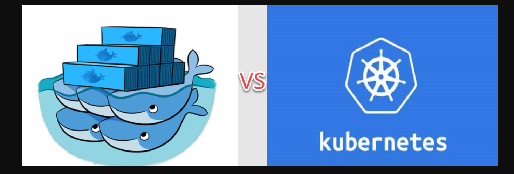
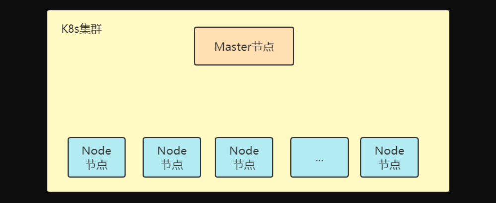
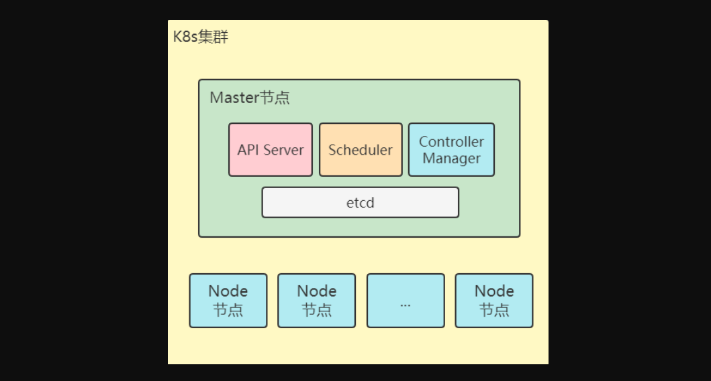
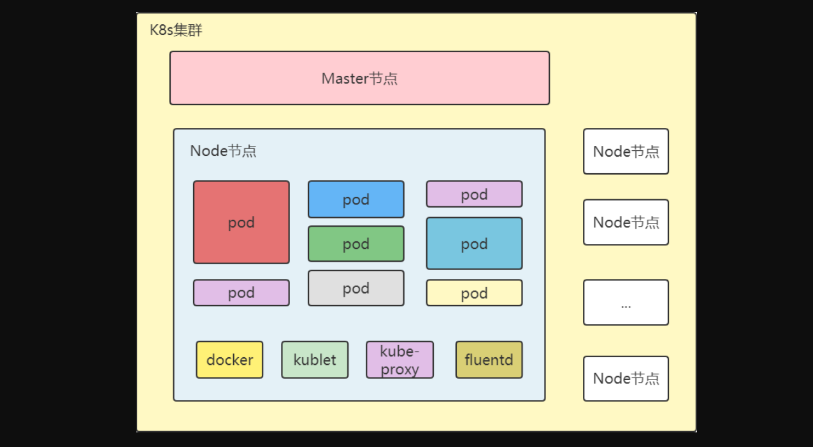
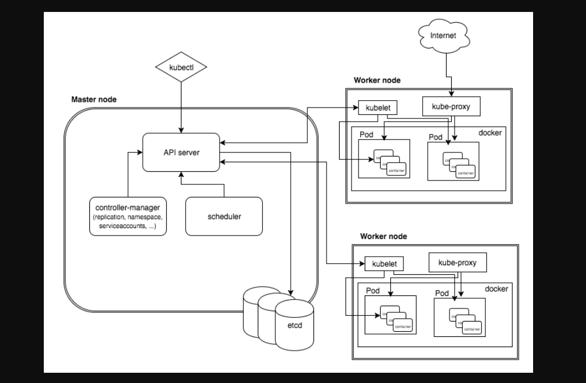
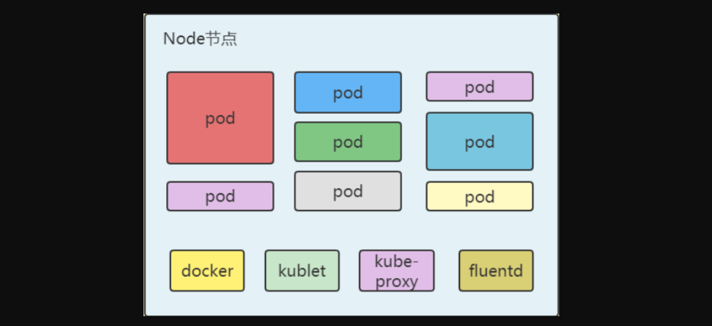

### 1，什么是K8S

**K8s是什么：**

Kubernetes，简称K8s，是用8代替名字中间的8个字符“ubernete”而成的缩写。是一个开源的，用于管理云平台中多个主机上的容器化的应用，K8s的目标是让部署容器化的应用简单并且高效，K8s提供了应用部署，规划，更新，维护的一种机制。

K8s是Google开源的一个容器编排引擎，使用Google自家的Go语言开发。它支持自动化部署、大规模可伸缩、应用容器化管理。在生产环境中部署一个应用程序时，通常要部署该应用的多个实例以便对应用请求进行负载均衡。

在K8s中，我们可以创建多个容器，每个容器里面运行一个应用实例，然后通过内置的负载均衡策略，实现对这一组应用实例的管理、发现、访问，而这些细节都不需要运维人员去进行复杂的手工配置和处理。

特点：

- 可移植：支持公有云，私有云，混合云，多重云（multi-cloud）
- 可扩展： 模块化，插件化，可挂载，可组合
- 自动化：自动部署，自动重启，自动复制，自动伸缩/扩展

### 2，K8s与Docker是什么关系

Docker是应用最广泛的容器技术，它通过打包镜像、启动容器来创建服务。然而，随着应用的日益复杂，容器的数量也不断增加，由此衍生出管理运维容器这一重要问题。

随着云计算的发展，容器的漂移成为云端最大的挑战。K8s正是在这种业务的驱动下，提出了一套全新的基于容器技术的分布式架构领先方案，这是容器技术领域中一个重大突破和创新。

- Docker针对paas，是以应用为中心；
- K8s是一个管理各个工作节点中容器应用，通过api server进行控制，通过kubelet进行管理的容器管理引擎；
- K8s解决了密钥配置管理、自动二进制打包、自动部署和回滚、存储编排、服务发现和负载均衡等问题。

### 3，Master节点组件和Node节点组件

K8s的架构

一个 K8s 系统，通常称为一个 K8s 集群，集群主要包括两个部分：

- 一个 Master 节点（主节点）
- 一群 Node 节点（计算节点）

Master节点主要负责管理和控制，节点内部结构图如下：

Master 节点包括 API Server、Scheduler、Controller manager、etcd。

- API Server 是整个系统的对外接口，供客户端和其它组件调用，相当于“服务窗口”
- Scheduler 负责对集群内部的资源进行调度，相当于“调度室”
- Controller manager 负责管理控制器，相当于“管理员”
- etcd是保存K8s所有集群数据的后台数据库

Node节点是工作负载节点，里面是具体的容器，节点内部结构图如下：

Node节点包括Docker、kubelet、kube-proxy，还有就是pod。每个Node都会被Master分配一些工作负载，当某个Node宕机时，该节点上的工作负载就会被Master自动转移到其它节点上。在Node上主要运行着：

- Docker，创建容器的；
- Kubelet，负责监视指派到它所在Node上的 Pod，包括创建、修改、监控、删除等；
- Kube-proxy，主要负责为Pod对象提供代理；
- Fluentd，主要负责日志收集、存储与查询。

### 4，集群架构

**控制平面组件（Control Plane Components）**

我们把K8s安装在一个叫做控制平面的机器上，控制平面的组件对集群做出全局决策。

**api server**

主节点上负责提供K8s API 服务的组件，它是K8s控制面的前端。

1. apiserver是K8s最重要的核心组件之一，提供集群管理的REST API接口，包括认证授权，数据校验以及集群状态变更等；
2. 提供其他模块之间的数据交互和通信的枢纽（其他模块通过API Server查询或修改数据，只有API Server才直接操作etcd）
3. 生产环境可以为api server做LA `Load Average` 或LB`Load Balance`，在设计上考虑了水平扩缩的需要。 换言之，通过部署多个实例可以实现扩缩。

**controller manager**

在主节点上运行控制器的组件。

1. controller manager是K8s的大脑，它通过api server监控整个集群的状态，确保集群处于预期的工作状态；
2. controller manager由一系列的控制器组成，例如，Replication Controller控制副 本，Node Controller节点控制，Deployment Controller管理deployment等。

**scheduler**

主节点上的组件，该组件监视那些新创建的未指定运行节点的Pod，并选择节点让Pod 在上面运行。scheduler负责分配调度Pod到集群内的节点上，它监听apiserver，查询还未分 配Node的Pod，然后根据调度策略为这些Pod分配节点。

**etcd**

1. K8s需要存储很多东西，像它本身的节点信息，组件信息，还有通过K8s运行的pod，deployment，service等等，都需要持久化，etcd就是它的数据中心。生产环境中为了保证数据中心的高可用和数据的一致性，一般会部署最少三个节点；
2. etcd也可以部署在K8s每一个节点，组成etcd集群；
3. 如果已经有外部etcd服务，K8s可以直接使用外部etcd服务。

Node组件：

节点组件在每个节点上运行，维护运行的Pod并提供K8s运行环境。

**kublet：**一旦Pod被调度到对应的宿主机之后，后续要做的事情就是创建这个Pod，并管理这个Pod的生命周期，这里面包括：Pod的增删改查等操作，在K8S里面这部分功能是通过kubelet 这个核心组件来完成的。kublet的功能分为两类：

- kubelet操作当前宿主机的资源信息，并启动Pod
- 与k8s进行交互，获取pod相关的数据，监控当前的Pod变化的事件

**kube-proxy：**在k8s集群的每个节点上都运行着kube-proxy进程，负责实现k8s中service组件的虚拟IP服务。kube-proxy是让集群服务在外部可以被访问到的重要方式。目前kube-proxy有三种工作模式：

- User space模式
- Iptables模式(默认)
- IPVS模式

**容器运行环境：**k8s支持多个容器运行环境，如Docker、 containerd、cri-o、 rktlet 以及任何实现 Kubernetes CRI (容器运行环境接口)的容器。

**插件：**插件使用 k8s资源 (DaemonSet、Deployment等) 实现集群功能。

**kube-dns：**kube-dns为k8s集群提供命名服务，主要用来解析集群服务名和Pod的hostname。目的是让pod可以通过名字访问到集群内服务。

### 2，

### 2，

### 2，

### 2，

### 2，

### 2，

