### 1，什么是服务调用

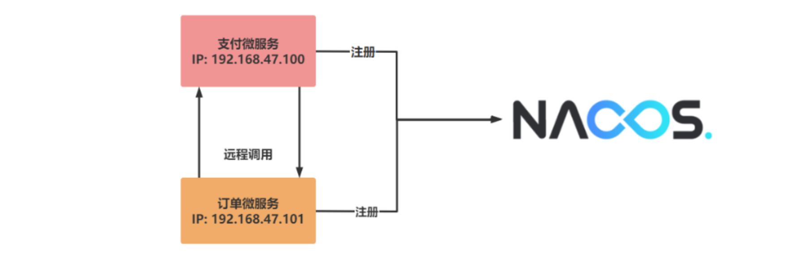


**两大主流远程调用技术：**

- RESTFul
- RPC协议


**RESTful：**

Http其实是一种网络传输协议，基于TCP，规定了数据传输的格式。 现在客户端浏览器与服务端通信基本都是采用Http协议，也可以用来进行远程服务调用。缺点是消息封装臃肿，优势是对服务的提供和调用方没有任何技术限定，自由灵活，更符合微服务理念。现在热门的Rest风格，就可以通过Http协议来实现。实现方案： Java开发中，使用Http连接，访问第三方网络接口，通常使用的连接工具为RestTemplate、HttpClient和OKHttp。


**RPC协议：**

Remote Produce Call远程过程调用，类似的还有RMI（remote method invoke）。自定义数据格式，基于原生TCP通信，速度快，效率高。

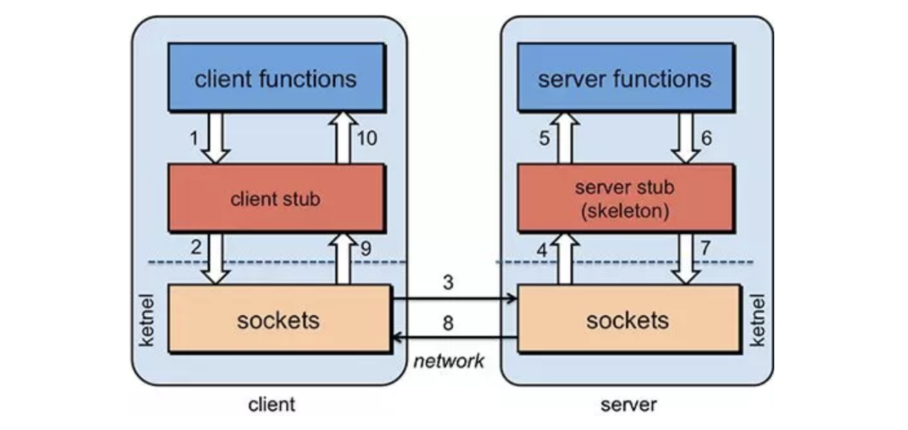


**基于RPC协议的相关框架：**

- Dubbo：国内最早开源的 RPC 框架，由阿里巴巴公司开发并于 2011 年末对外开源，仅支持 Java 语言。
- SpringCloud：国外 Pivotal 公司 2014 年对外开源的 RPC 框架，提供了丰富的生态组件。
- gRPC：Google 于 2015 年对外开源的跨语言 RPC 框架，支持多种语言。


**通信性能方面：**

- 从通信的性能上来分析基于Http传输协议，底层实现是Rest。从OSI 7层模型上来看Rest属于应用层。在高并发场景下性能不够理想，成为性能瓶颈。
- Dubbo框架的通信协议采用RPC协议，属于传输层协议，性能上自然比Rest高。提升了交互的性能，保持了长连接，高性能。
- Dubbo性能更好，比如支持异步调用、Netty性能更好。


### 2，什么是RPC

RPC(Remote Procedure Call)远程过程调用，它是一种通过网络从远程计算机程序上请求服务。**大白话理解就是：RPC让你用别人家的东西就像自己家的一样。**


**RPC两个作用：**

- 屏蔽远程调用跟本地调用的区别，让我们感觉就是调用项目内的方法
- 隐藏底层网络通信的复杂性，让我们更加专注业务逻辑。


**常用的RPC框架：RPC是一种技术思想而非一种规范或协议。**

- 阿里的 Dubbo/Dubbox、Google gRPC、Spring Cloud。


### 3，什么是Dobbo

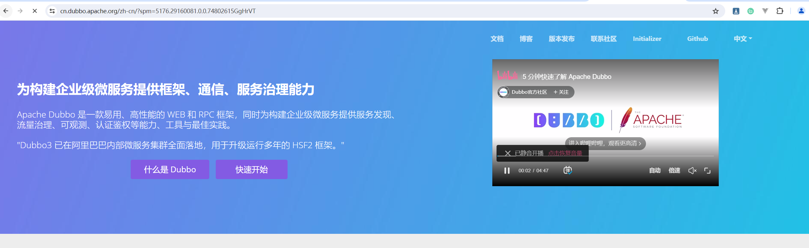


**Dubbo是什么：**

Apache Dubbo 是一款 RPC 服务开发框架，用于解决微服务架构下的服务治理与通信问题，官方提供了 Java、Golang、Rust 等多语言 SDK 实现。


**Dubbo开源故事：**

最早在 2008 年，阿里巴巴就将 Dubbo 捐献到开源社区，它很快成为了国内开源服务框架选型的事实标准框架，得到了业界更广泛的应用。在 2017 年，Dubbo 被正式捐献 Apache 软件基金会并成为 Apache 顶级项目，开始了一段新的征程。


**为什么需要Dubbo，它能做什么？**

按照微服务架构的定义，采用它的组织能够很好的提高业务迭代效率与系统稳定性，但前提是要先能保证微服务按照期望的方式运行，要做到这一点需要解决服务拆分与定义、数据通信、地址发现、流量管理、数据一致性、系统容错能力等一系列问题。

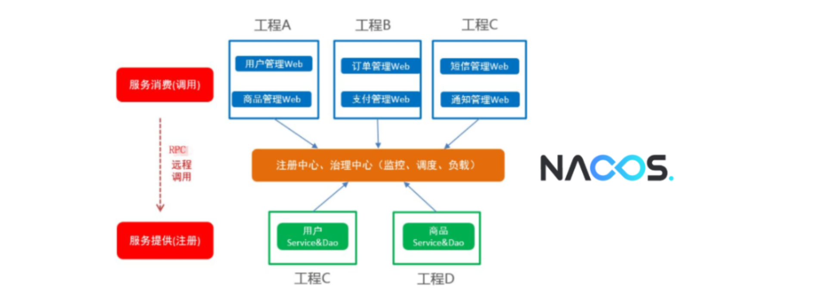


**Dubbo 可以帮助解决如下微服务实践问题：**

- **微服务编程范式和工具**

Dubbo 支持基于 IDL 或语言特定方式的服务定义，提供多种形式的服务调用形式（如同步、异步、流式等）

- **高性能的 RPC 通信**

Dubbo 帮助解决微服务组件之间的通信问题，提供了基于 HTTP、HTTP/2、TCP 等的多种高性能通信协议实现，并支持序列化协议扩展，在实现上解决网络连接管理、数据传输等基础问题。

- **微服务监控与治理**

Dubbo 官方提供的服务发现、动态配置、负载均衡、流量路由等基础组件可以很好的帮助解决微服务基础实践的问题。除此之外，您还可以用 Admin 控制台监控微服务状态，通过周边生态完成限流降级、数据一致性、链路追踪等能力。

- **部署在多种环境**

Dubbo 服务可以直接部署在容器、Kubernetes、Service Mesh等多种架构下。

- **活跃的社区**

Dubbo 项目托管在 Apache 社区，有来自国际、国内的活跃贡献者维护着超 10 个生态项目，贡献者包括来自海外、阿里巴巴、工商银行、携程、蚂蚁、腾讯等知名企业技术专家，确保 Dubbo 及时解决项目缺陷、需求及安全漏洞，跟进业界最新技术发展趋势。

- **庞大的用户群体**

Dubbo3 已在阿里巴巴成功取代 HSF 框架实现全面落地，成为阿里集团面向云原生时代的统一服务框架，庞大的用户群体是 Dubbo 保持稳定性、需求来源、先进性的基础。


**Dubbo 不是什么？**

- **不是应用开发框架的替代者**

Dubbo 设计为让开发者以主流的应用开发框架的开发模式工作，它不是各个语言应用开发框架的替代者，如它不是 Spring/Spring Boot 的竞争者，当你使用 Spring 时，Dubbo 可以无缝的与 Spring & Spring Boot 集成在一起。

- **不仅仅只是一款 RPC 框架**

Dubbo 提供了内置 RPC 通信协议实现，但它不仅仅是一款 RPC 框架。首先，它不绑定某一个具体的 RPC 协议，开发者可以在基于 Dubbo 开发的微服务体系中使用多种通信协议；其次，除了 RPC 通信之外，Dubbo 提供了丰富的服务治理能力与生态。

- **不是 gRPC 协议的替代品**

Dubbo 支持基于 gRPC 作为底层通信协议，在 Dubbo 模式下使用 gRPC 可以带来更好的开发体验，享有统一的编程模型和更低的服务治理接入成本

- **不只有 Java 语言实现**

自 Dubbo3 开始，Dubbo 提供了 Java、Golang、Rust、Node.js 等多语言实现，未来会有更多的语言实现。


**任意通信协议：**

Dubbo 微服务间远程通信实现细节，支持 HTTP、HTTP/2、gRPC、TCP 等所有主流通信协议。与普通 RPC 框架不同，Dubbo 不是某个单一 RPC 协议的实现，它通过上层的 RPC 抽象可以将任意 RPC 协议接入 Dubbo 的开发、治理体系。


**多语言 SDK：**

Dubbo 提供几乎所有主流语言的 SDK 实现，定义了一套统一的微服务开发范式。Dubbo 与每种语言体系的主流应用开发框架做了适配，总体编程方式、配置符合大多数开发者已有编程习惯。


**谁在用Dubbo：**

网联清算、银联商务、中国人寿、中国平安、中国银行、人民银行、工商银行、招商证券、平安保险、中国人寿、阿里巴巴、滴滴出行、携程网、小米、斗鱼直播、瓜子二手车、金蝶、亚信科技、中国电信、文思海辉、中科软、科大讯飞、恒生电子、红星凯美龙、海尔、新东方、软通动力、中远海运、昆明航空、中通快递、顺丰科技、普华永道等。


### 4，将支付微服务集成Dubbo


**创建公共接口子模块：**

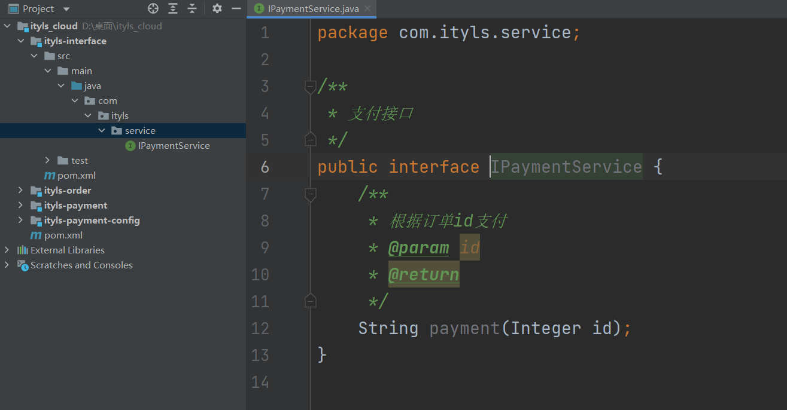

```java
package com.ityls.service;

/**
 * 支付接口
 */
public interface IPaymentService {
    /**
     * 根据订单id支付
     * @param id
     * @return
     */
    String payment(Integer id);
}
```


创建子模块ityls-payment-dubbo：

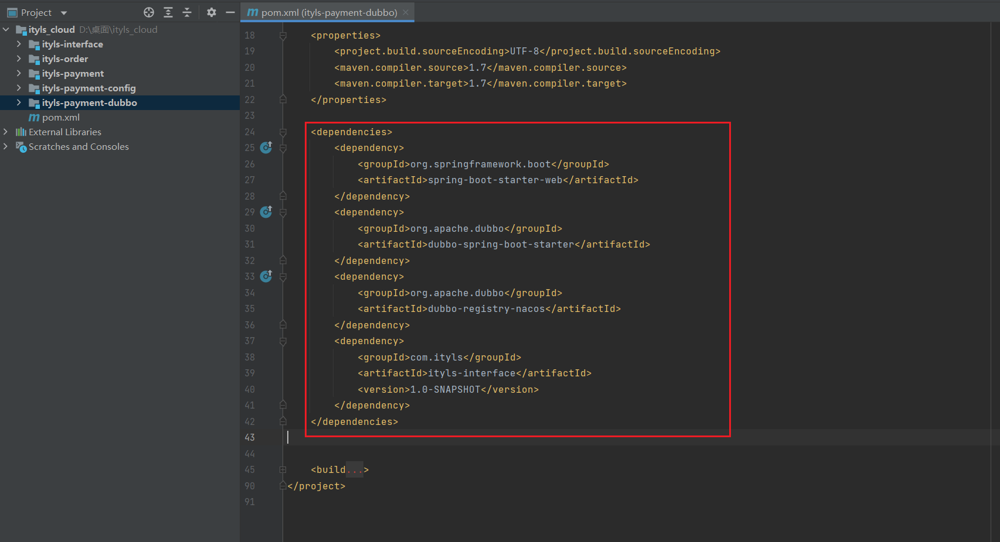


依赖：

```xml
    <dependencies>
        <dependency>
            <groupId>org.springframework.boot</groupId>
            <artifactId>spring-boot-starter-web</artifactId>
        </dependency>
        <dependency>
            <groupId>org.apache.dubbo</groupId>
            <artifactId>dubbo-spring-boot-starter</artifactId>
        </dependency>
        <dependency>
            <groupId>org.apache.dubbo</groupId>
            <artifactId>dubbo-registry-nacos</artifactId>
        </dependency>
        <dependency>
            <groupId>com.ityls</groupId>
            <artifactId>ityls-interface</artifactId>
            <version>1.0-SNAPSHOT</version>
        </dependency>
    </dependencies>
```

在main文件夹下面创建resources文件夹，在resources里面新建application.yml文件。

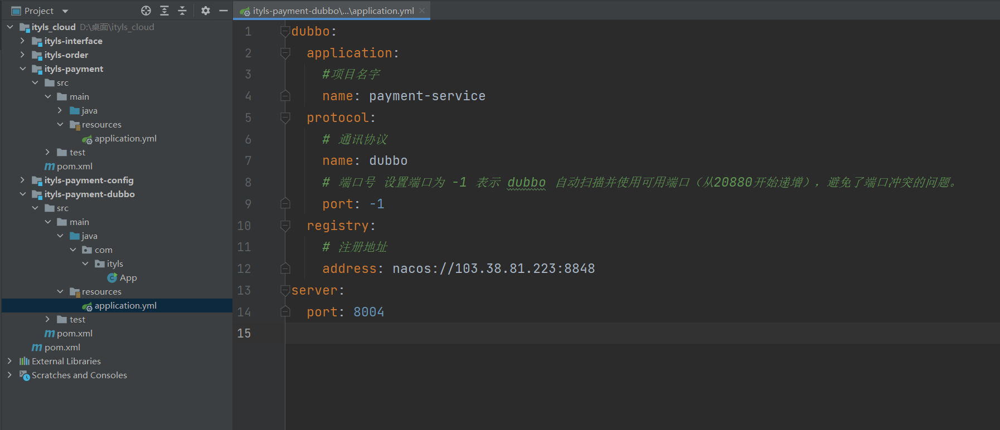

```yml
dubbo:
  application:
    #项目名字
    name: payment-service
  protocol:
    # 通讯协议
    name: dubbo
    # 端口号 设置端口为 -1 表示 dubbo 自动扫描并使用可用端口（从20880开始递增），避免了端口冲突的问题。
    port: -1
  registry:
    # 注册地址
    address: nacos://103.38.81.223:8848
server:
  port: 8004
```


启动类：

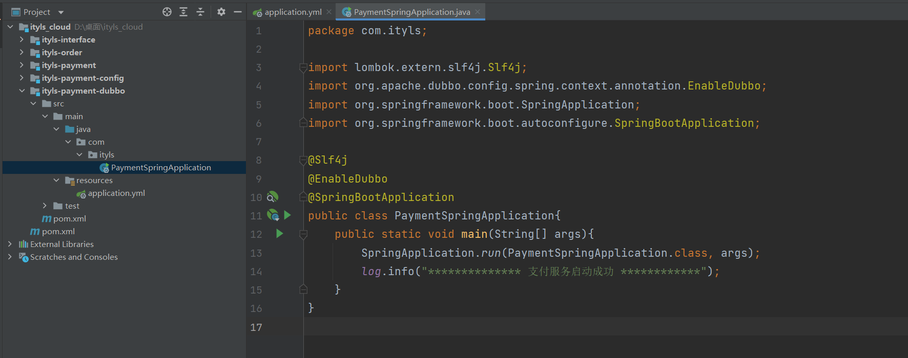

```java
package com.ityls;

import lombok.extern.slf4j.Slf4j;
import org.apache.dubbo.config.spring.context.annotation.EnableDubbo;
import org.springframework.boot.SpringApplication;
import org.springframework.boot.autoconfigure.SpringBootApplication;

@Slf4j
@EnableDubbo
@SpringBootApplication
public class PaymentSpringApplication{
    public static void main(String[] args){
        SpringApplication.run(PaymentSpringApplication.class, args);
        log.info("************** 支付服务启动成功 ************");
    }
}
```


**编写支付接口实现类:**

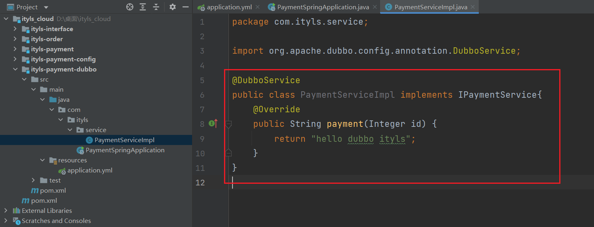

```java
@DubboService
public class PaymentServiceImpl implements IPaymentService{
    @Override
    public String payment(Integer id) {
        return "hello dubbo ityls";
    }
}
```


@DubboService注解用来标记一个类或接口作为dubbo服务提供者，并将其发布为Dubbo服务：

- 标记服务提供者，类上或接口上
- 自动暴露服务：在应用启动时，dubbo自动处理服务发布过程。协议选择，端口绑定，注册中心注册等
- 透明远程调用：无需关心底层的远程调用通信细节
- 操作配置选项：超时时间，最大并发数，负载均衡配置等


**控制台查看支付微服务:**

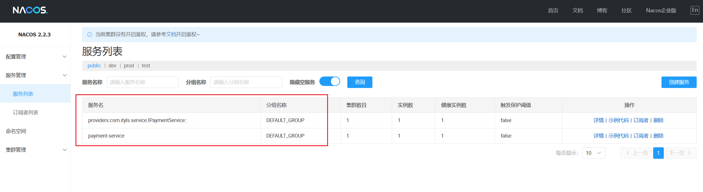


### 5，将订单微服务集成Dubbo

创建子模块ityls-order-dubbo

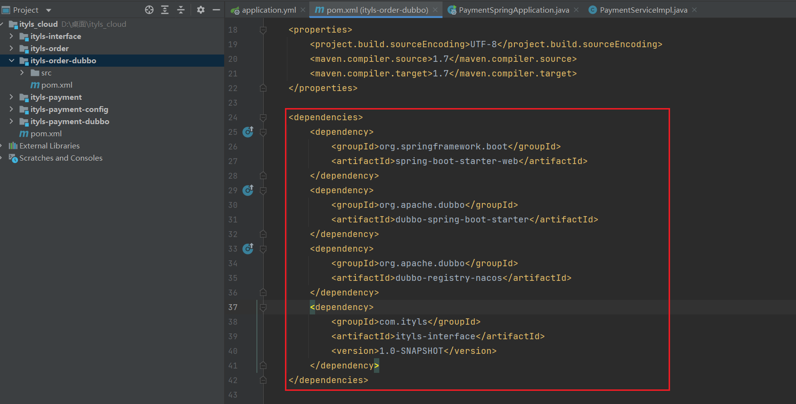

```xml
    <dependencies>
        <dependency>
            <groupId>org.springframework.boot</groupId>
            <artifactId>spring-boot-starter-web</artifactId>
        </dependency>
        <dependency>
            <groupId>org.apache.dubbo</groupId>
            <artifactId>dubbo-spring-boot-starter</artifactId>
        </dependency>
        <dependency>
            <groupId>org.apache.dubbo</groupId>
            <artifactId>dubbo-registry-nacos</artifactId>
        </dependency>
        <dependency>
            <groupId>com.ityls</groupId>
            <artifactId>ityls-interface</artifactId>
            <version>1.0-SNAPSHOT</version>
        </dependency>
    </dependencies>
```


在main文件夹下面创建resources文件夹，在resources里面新建application.yml文件。

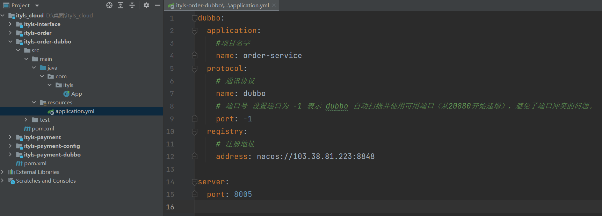

```yml
dubbo:
  application:
    #项目名字
    name: order-service
  protocol:
    # 通讯协议
    name: dubbo
    # 端口号 设置端口为 -1 表示 dubbo 自动扫描并使用可用端口（从20880开始递增），避免了端口冲突的问题。
    port: -1
  registry:
    # 注册地址
    address: nacos://103.38.81.223:8848

server:
  port: 8005
```


启动类：

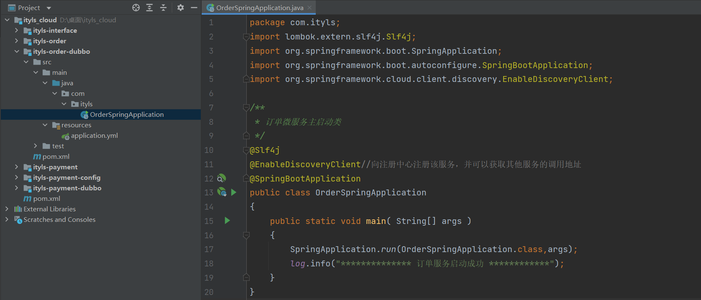

```java
package com.ityls;
import lombok.extern.slf4j.Slf4j;
import org.springframework.boot.SpringApplication;
import org.springframework.boot.autoconfigure.SpringBootApplication;
import org.springframework.cloud.client.discovery.EnableDiscoveryClient;

/**
 * 订单微服务主启动类
 */
@Slf4j
@EnableDiscoveryClient//向注册中心注册该服务，并可以获取其他服务的调用地址
@SpringBootApplication
public class OrderSpringApplication
{
    public static void main( String[] args )
    {
        SpringApplication.run(OrderSpringApplication.class,args);
        log.info("************** 订单服务启动成功 ************");
    }
}
```


创建controller文件夹，在文件夹中创建OrderController类。

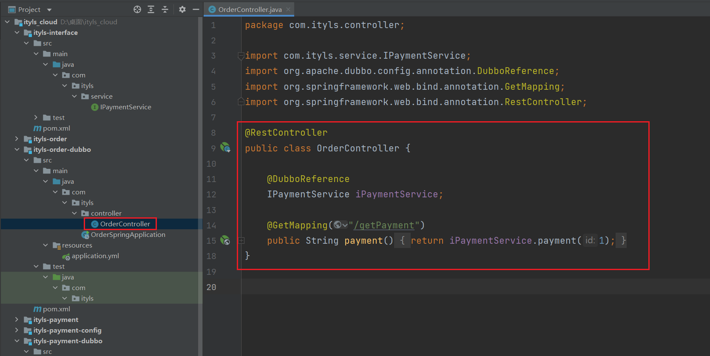

```java
package com.ityls.controller;

import com.ityls.service.IPaymentService;
import org.apache.dubbo.config.annotation.DubboReference;
import org.springframework.web.bind.annotation.GetMapping;
import org.springframework.web.bind.annotation.RestController;

@RestController
public class OrderController {

    @DubboReference
    IPaymentService iPaymentService;

    @GetMapping("/getPayment")
    public String payment(){
        return iPaymentService.payment(1);
    }
}
```


@DubboReference注解说明

- 标记服务引用：通过在服务消费者的字段或方法上添加@DubboReference，标记了对某个服务提供者的引用dubbo框架就知道需要将服务注入到当前这个类中
- 自动引用服务：dubbo框架自动处理远程服务的引用过程，负载均衡，服务发现连接等
- 透明远程调用：dubbo框架自动处理远程调用的过程，将请求发送给服务提供者，把结果返回给服务消费者
- 提供配置选项：超时时间，重试次数，负载均衡等


测试：http://localhost:8005/getPayment


### 6，Dubbo启动时检查

Dubbo在启动时检查依赖得服务是否可用，Dubbo 缺省会在启动时检查依赖的服务是否可用，不可用时会抛出异常，阻止 Spring 初始化完成，以便上线时，能及早发现问题，默认 `check="true"`。

```
@DubboReference(check = false)
private IPaymentService iPaymentService;
```

注意：如果你的 Spring 容器是懒加载的，或者通过 API 编程延迟引用服务，请关闭 check，否则服务临时不可用时，会抛出异常，拿到 null 引用，如果 `check="false"`，总是会返回引用，当服务恢复时，能自动连上。


### 7，Dubbo地址缓存

问题：注册中心挂了，服务是否可以正常访问？

> 因为Dubbo服务消费者在`第一次调用时`，`会将服务提供方地址缓存到本地`，**以后在调用则不会访问注册中心**。服务提供者地址发生变化时，注册中心会通服务消费者。


关闭注册中心：

```
./shutdown.sh 
```

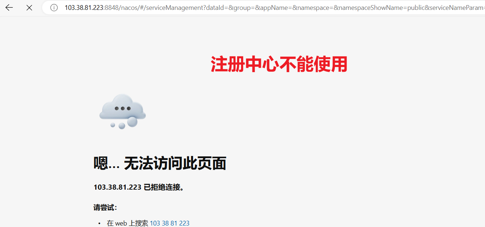


远程调用服务，测试：


### 8，Dubbo超时时间与配置覆盖关系

超时机制：

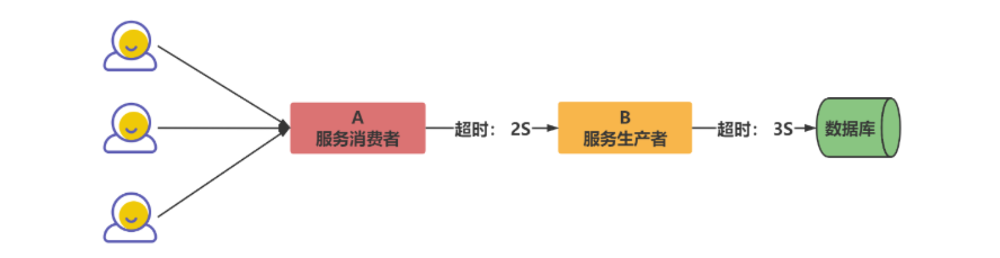

**问题：**

- 服务消费者在调用服务提供者的时候发生了阻塞、等待的情形，这个时候，服务消费者会一直等待下去。
- 在某个峰值时刻，大呈的请求都在同时请求服务消费者，会造成线程的大呈堆积，势必会造成雪崩。


**Dubbo解决机制：**

Dubbo利用超时机制来解决这个问题，设置一个超时时间，在这个时间段内，无法完成服务访问，则自动断开连接。


**配置超时时间，服务生产者端：**

使用timeout属性配置超时时间，默认值1000，单位毫秒。

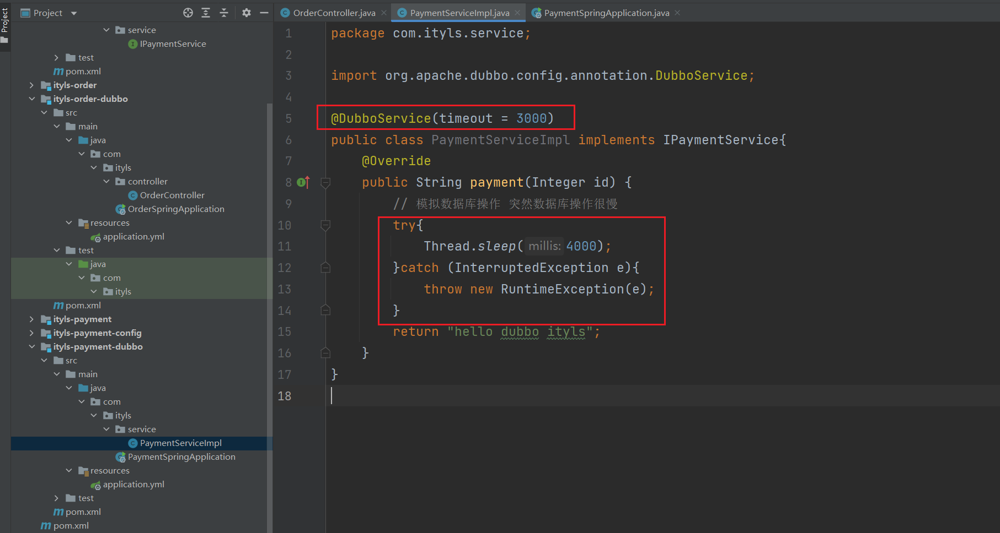

```java
package com.ityls.service;

import org.apache.dubbo.config.annotation.DubboService;

@DubboService(timeout = 3000)
public class PaymentServiceImpl implements IPaymentService{
    @Override
    public String payment(Integer id) {
        // 模拟数据库操作 突然数据库操作很慢
        try{
            Thread.sleep(4000);
        }catch (InterruptedException e){
            throw new RuntimeException(e);
        }
        return "hello dubbo ityls";
    }
}
```


消费端：

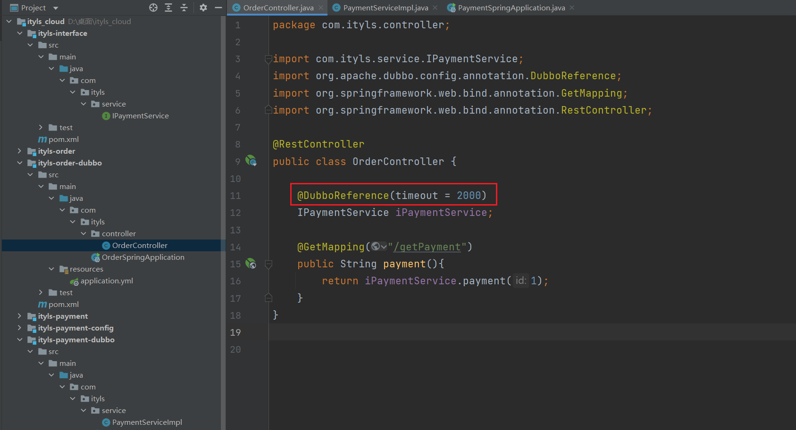

```java
package com.ityls.controller;

import com.ityls.service.IPaymentService;
import org.apache.dubbo.config.annotation.DubboReference;
import org.springframework.web.bind.annotation.GetMapping;
import org.springframework.web.bind.annotation.RestController;

@RestController
public class OrderController {

    @DubboReference(timeout = 2000)
    IPaymentService iPaymentService;

    @GetMapping("/getPayment")
    public String payment(){
        return iPaymentService.payment(1);
    }
}
```


测试：

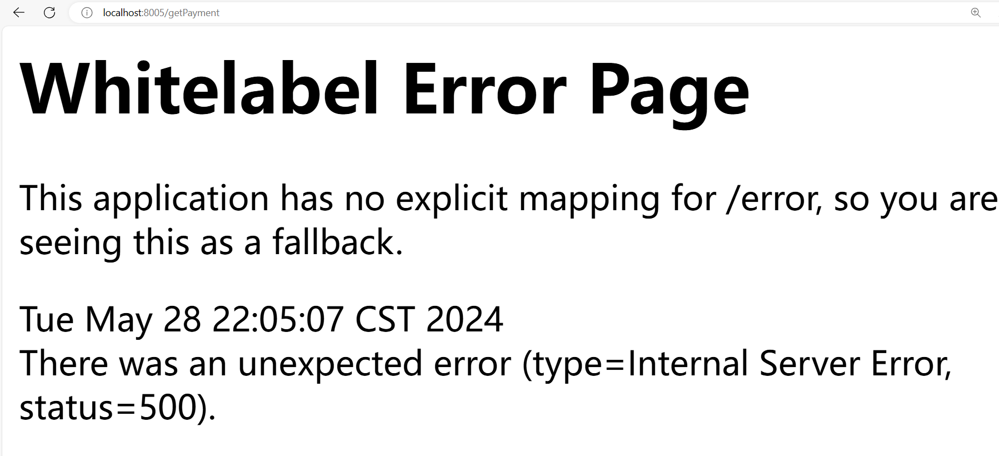

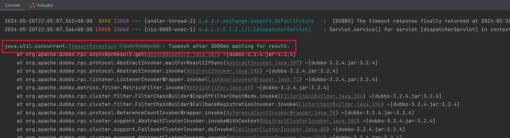


**超时设置的优先级：**

上面有提到Dubbo支持多种场景下设置超时时间，也说过超时是针对消费端的。那么既然超时是针对消费端，为什么服务端也可以设置超时呢？

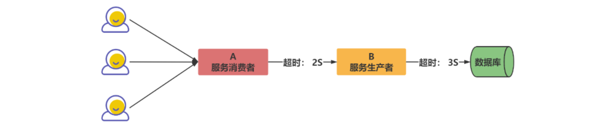

总结：这其实是一种策略，其实服务端的超时配置是消费端的缺省配置，即如果服务端设置了超时，任务消费端可以不设置超时时间，简化了配置。另外针对控制的粒度，Dubbo支持了接口级别也支持方法级别，可以根据不同的实际情况精确控制每个方法的超时时间。


### 9，Dubbo重试机制


**重试机制：**

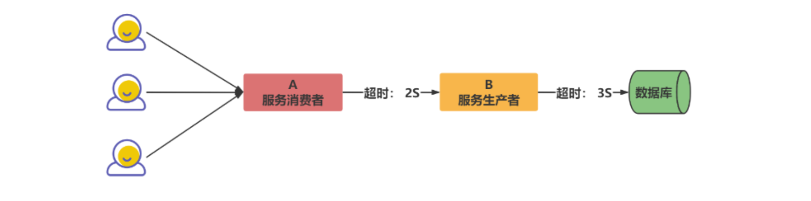

**超时问题：**

如果出现网络抖动，则会出现请求失败。


**如何解决：**

Dubbo提供重试机制来避免类似问题的发生。


**重试机制配置：**

```
@DubboReference(timeout = 3000,retries = 2)
```

Dubbo在调用服务不成功时，默认会重试2次。


测试：

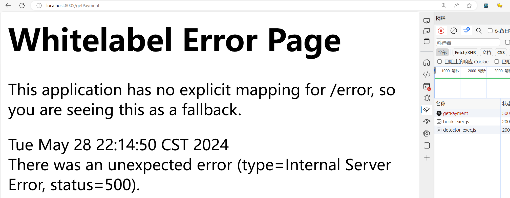

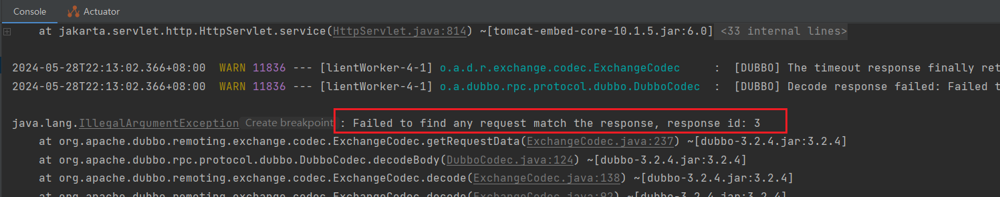


### 10，Dubbo多版本

Dubbo提供多版本的配置，方便我们做服务的灰度发布，或者是解决不兼容的问题。

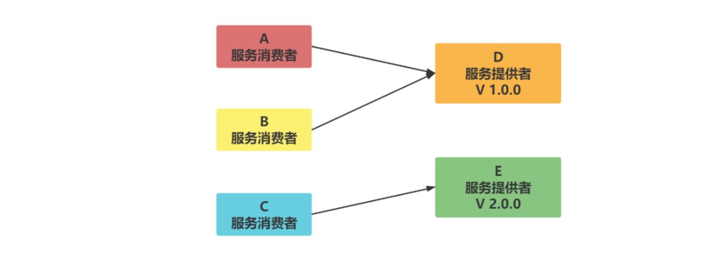

**灰度发布(金丝雀发布)：**

当出现新功能时，会让一部分用户先使用新功能，用户反馈没问题时，再将所有用户迁移到新功能。


**版本迁移步骤：**

1. 在低压力时间段，先升级一半提供者为新版本
2. 再将所有消费者升级为新版本
3. 然后将剩下的一半提供者升级为新版本


**多版本配置，老版本服务提供者配置：**

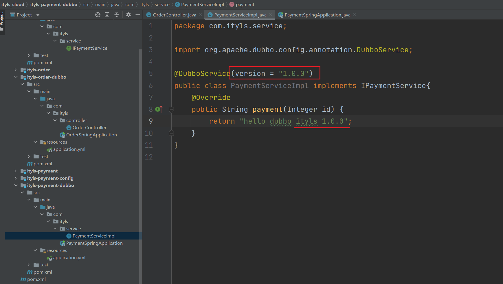

```java
package com.ityls.service;

import org.apache.dubbo.config.annotation.DubboService;

@DubboService(version = "1.0.0")
public class PaymentServiceImpl implements IPaymentService{
    @Override
    public String payment(Integer id) {
        return "hello dubbo ityls 1.0.0";
    }
}
```


**新版本服务提供者配置:**

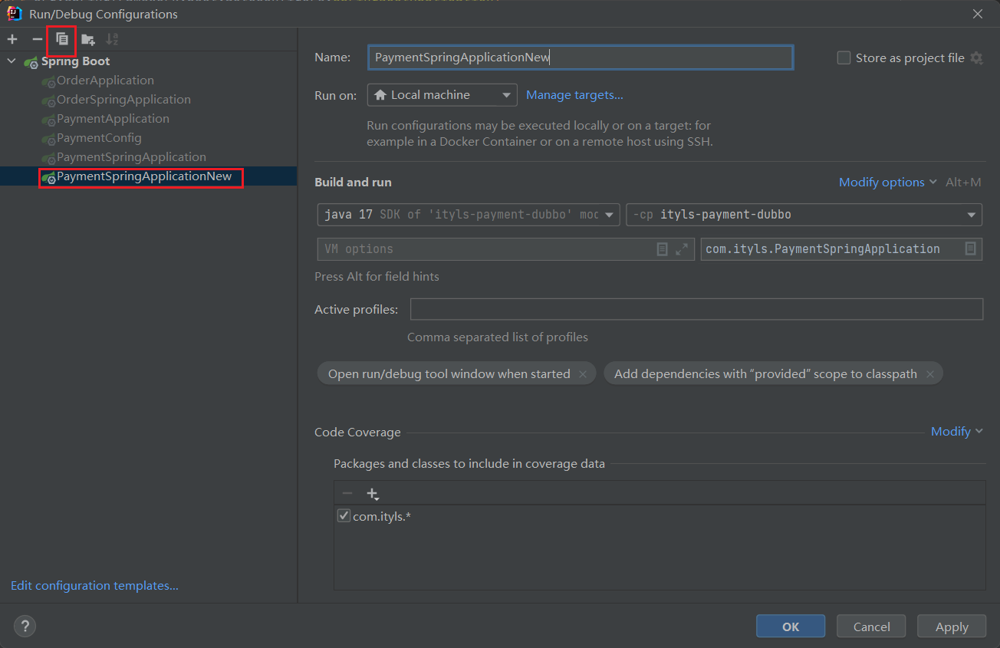

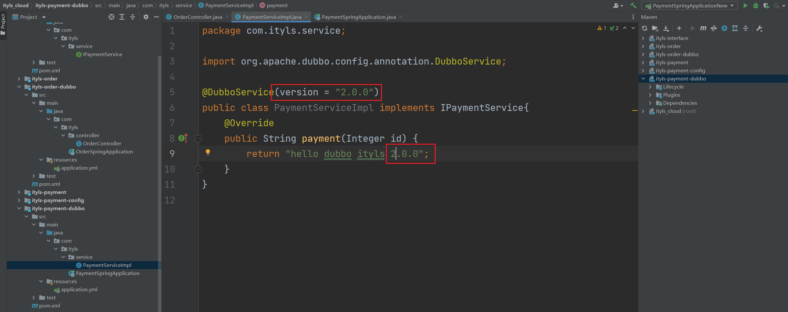

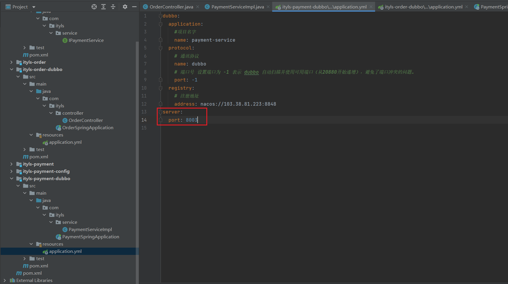

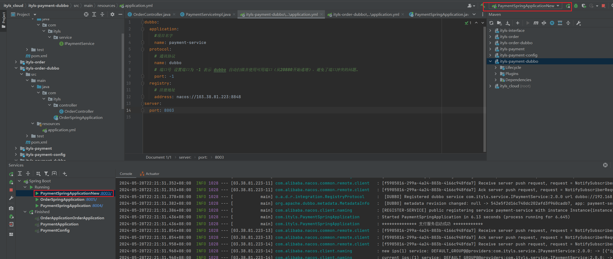


查看注册中心：

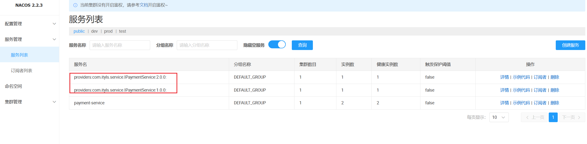


**新版本服务消费者配置:**

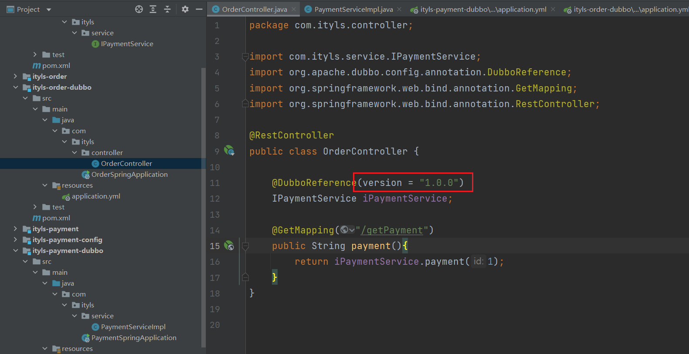


测试：


**如果不需要区分版本，可以按照以下的方式配置 ：**

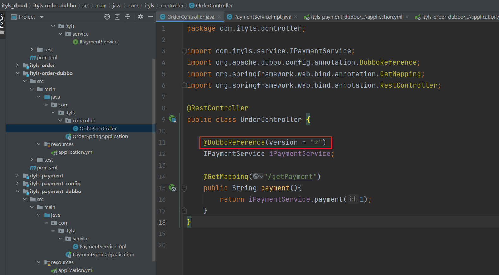


测试：


### 11，Dubbo负载均衡

Dubbo是一个分布式服务框架，能避免单点故障和支持服务的横向扩容。一个服务通常会部署多个实例。

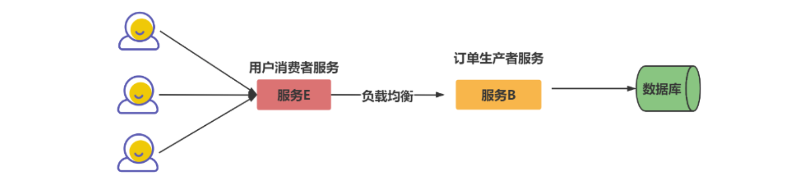

订单服务生产者会出现单点故障。

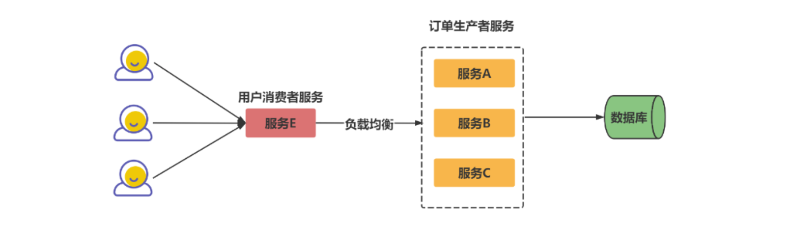

如何从多个服务 Provider 组成的集群中挑选出一个进行调用，就涉及到一个负载均衡的策略。


**Dubbo内置负载均衡策略：**

1. RandomLoadBalance：随机负载均衡，随机的选择一个，默认负载均衡。
2. RoundRobinLoadBalance：轮询负载均衡。
3. LeastActiveLoadBalance：最少活跃调用数，相同活跃数的随机。
4. ConsistentHashLoadBalance：一致性哈希负载均衡，相同参数的请求总是落在同一台机器上。


**负载均衡策略配置：**

如果不指定负载均衡，默认使用随机负载均衡。我们也可以根据自己的需要，显式指定一个负载均衡。


启动两台实例：

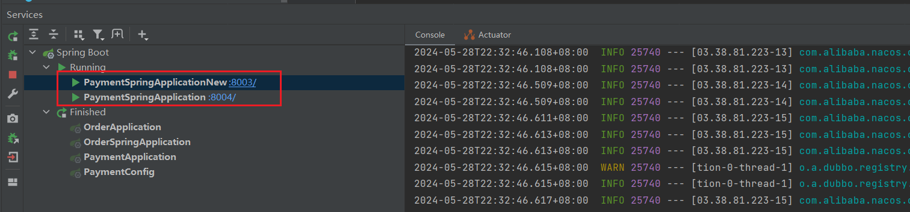

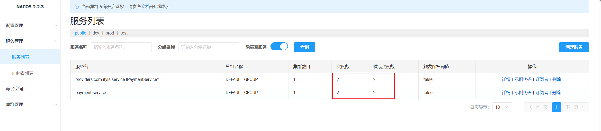

启动消费者：

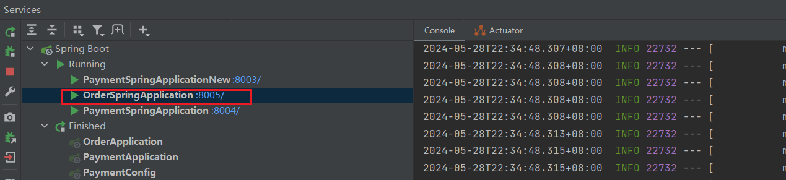


测试：

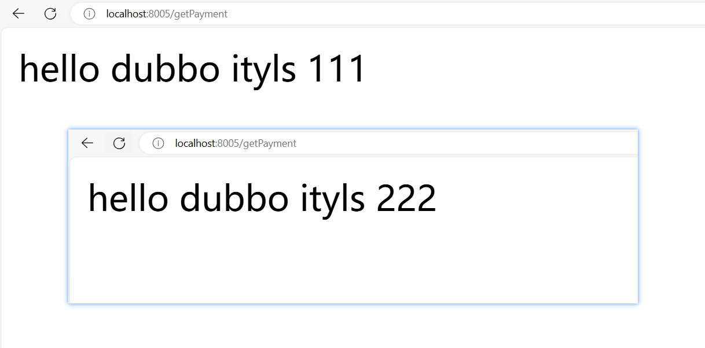


**生产者服务：**

```
@DubboService(loadbalance = "roundrobin")
```


**消费者服务:**

```
@DubboReference(loadbalance = "roundrobin")
```

**参数：**

- random：随机负载均衡
- leastactive：最少活跃调用数，相同活跃数的随机
- roundrobin：轮询负载均衡
- consistenthash：一致性哈希负载均衡


查看负载均衡配置：编辑器中快速按2下Shift

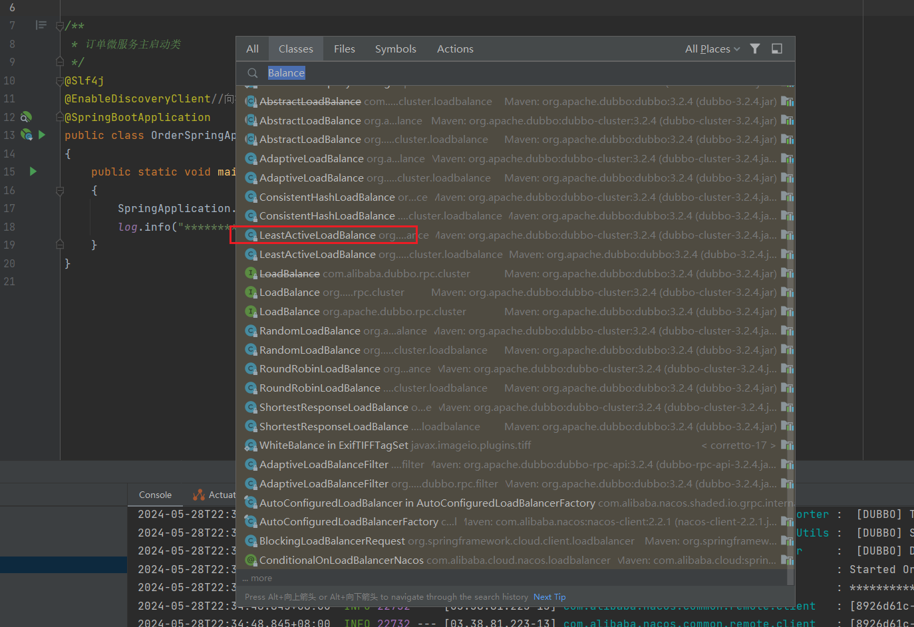


复制名字:

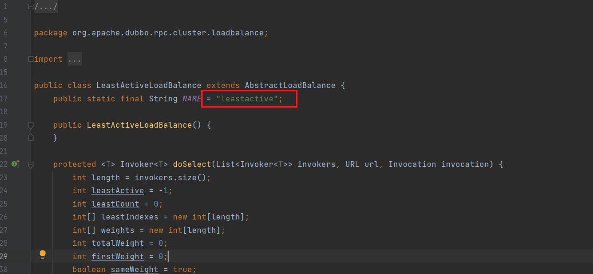


### 12，Dubbo集群容错

**集群容错模式:**

Dubbo框架为服务集群容错提供了一系列好的解决方案，在此称为Dubbo服务集群容错模式。

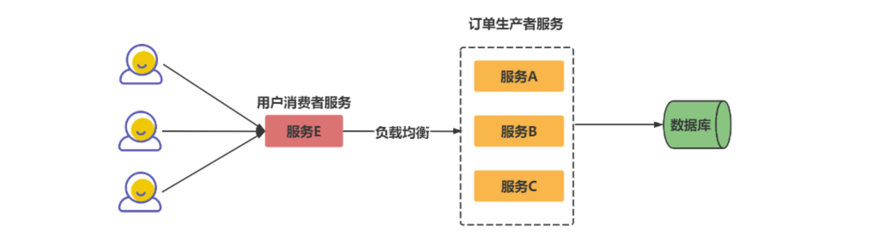

**容错模式:**

- **Failover Cluster**：失败重试。默认值。当出现失败，重试其它服务器，默认重试2次，使用retries配置。一般用于读操作
- **Failfast Cluster** : 快速失败，只发起一次调用，失败立即报错。通常用于写操作。
- **Failsafe Cluster** : 失败安全，出现异常时，直接忽略，返回一个空结果。日志不重要操作。
- **Failback Cluster** : 失败自动恢复，后台记录失败请求，定时重发。非常重要的操作。
- **Forking Cluster**：并行调用多个服务器，只要有一个成功即返回。
- **Broadcast Cluster**：广播调用所有提供者，逐个调用，任意一台报错则报错。 同步要求高的可以使用这个模式。


**集群容错配置，在消费者服务配置：**

```
@DubboReference(cluster = "failover")
private IPaymentService iPaymentService;
```


**查找容错配置：**

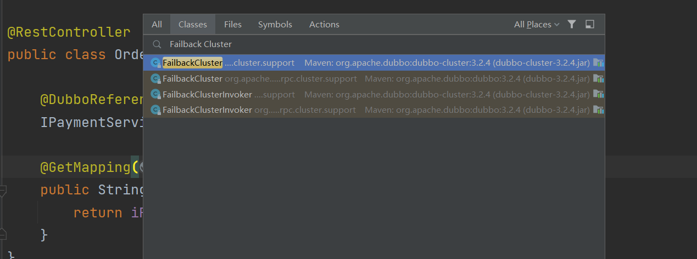

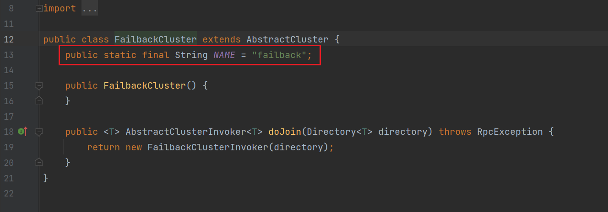


### 13，Dubbo中序列化协议安全

**为什么需要序列化：**

网络传输的数据必须是二进制数据，但调用方请求的出入参数都是对象。


序列化就是将对象转换成二进制数据的过程，而反序列就是反过来将二进制转换为对象的过程。


**序列化反序列过程：**

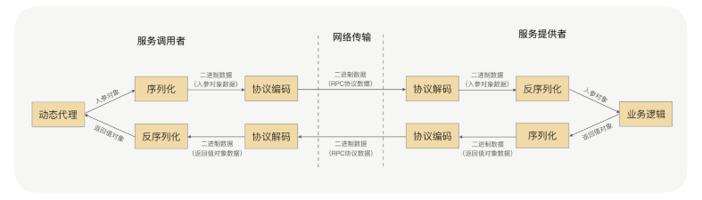

比如发快递，我们要发一个需要自行组装的物件。发件人发之前，会把物件拆开装箱，这就好比序列化;这时候快递员来了，不能磕碰呀，那就要打包，这就好比将序列化后的数据进行编码，封装成一个固定格式的协议;过了两天，收件人收到包裹了，就会拆箱将物件拼接好，这就好比是协议解码和反序列化。


操作：

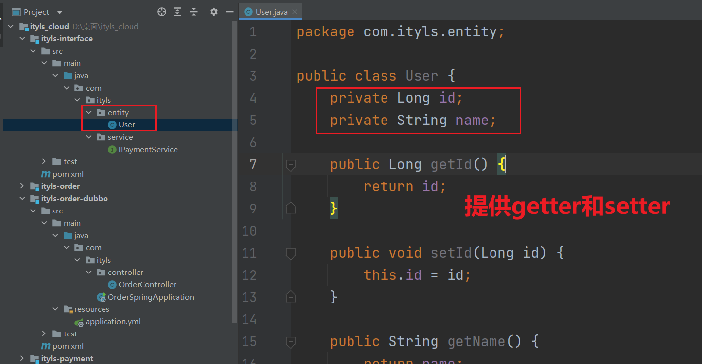


```java
package com.ityls.entity;

public class User {
    private Long id;
    private String name;

    public Long getId() {
        return id;
    }

    public void setId(Long id) {
        this.id = id;
    }

    public String getName() {
        return name;
    }

    public void setName(String name) {
        this.name = name;
    }
}
```


定义一个接口：

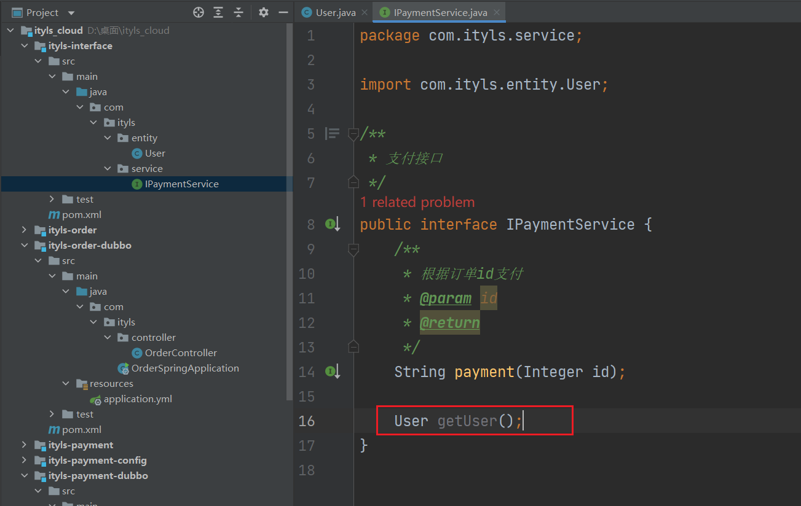

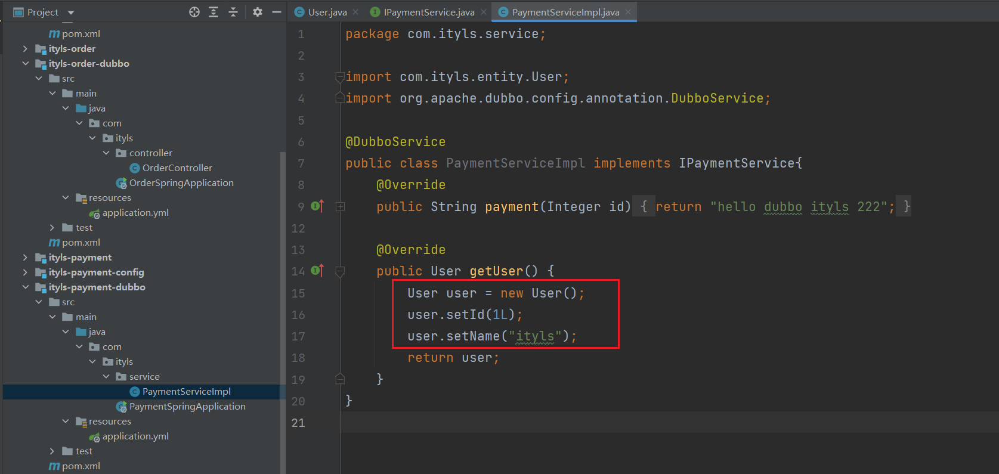


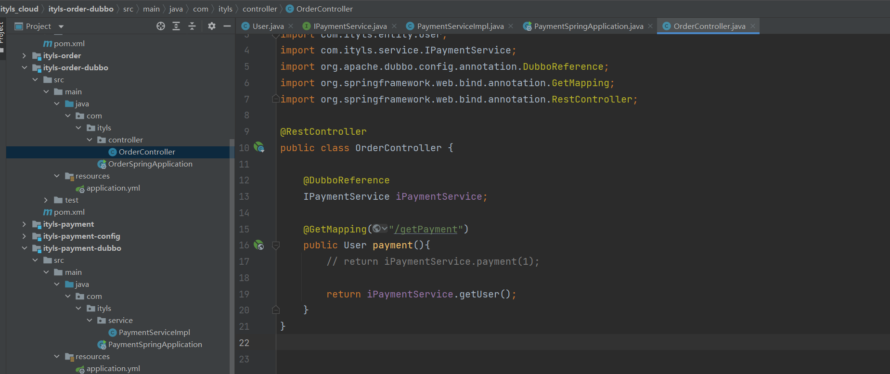


测试：

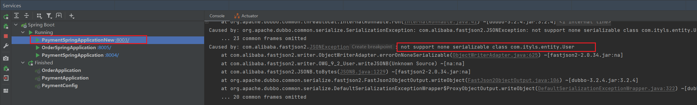


修改：

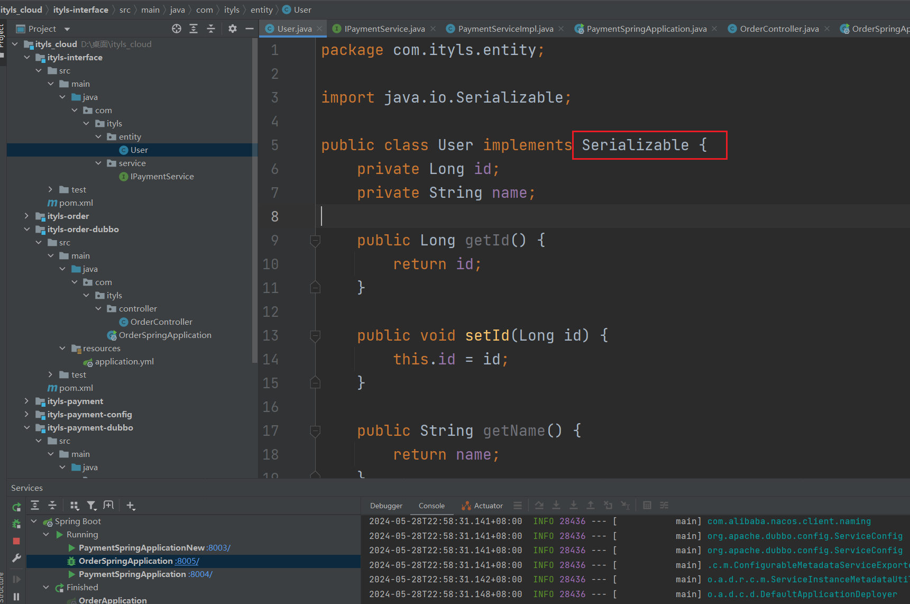


再测试：


### 14，Dubbo案例准备


完成用户表的CRUD操作。技术栈：

- Thymeleaf  视图解析
- Nacos, Dubbo, Spring MVC  分布式技术栈
- Mybatis-plus, MySQL 持久化技术栈


创建数据库：

```
create database test;
```


创建表：

```
CREATE TABLE user
(
   id BIGINT(20) NOT NULL COMMENT '主键ID',
   name VARCHAR(30) NULL DEFAULT NULL COMMENT '姓名',
   age INT(11) NULL DEFAULT NULL COMMENT '年龄',
  PRIMARY KEY (id)
);
```


操作：

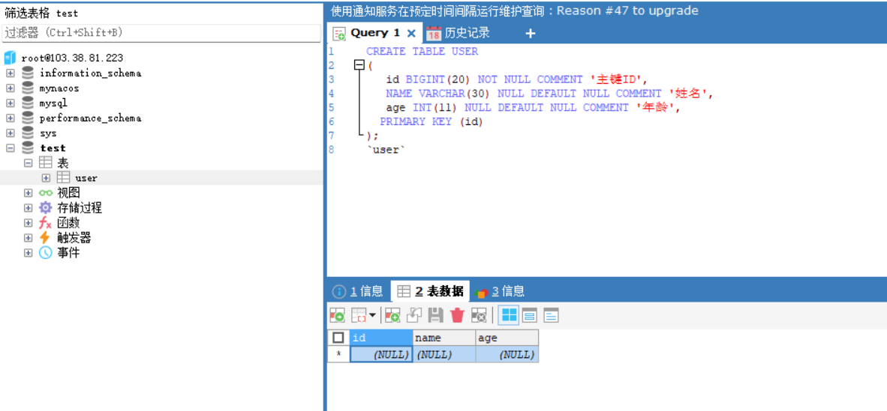


创建用户实体类：

```
@Data
public class User implements Serializable {
  // 用户id
  private Long id;
  // 用户名字
  private String name;
  // 用户年纪
  private Integer age;
}
```


操作：

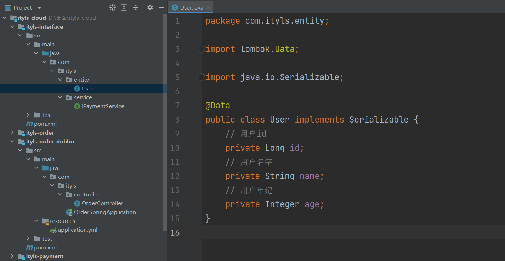


引入依赖：

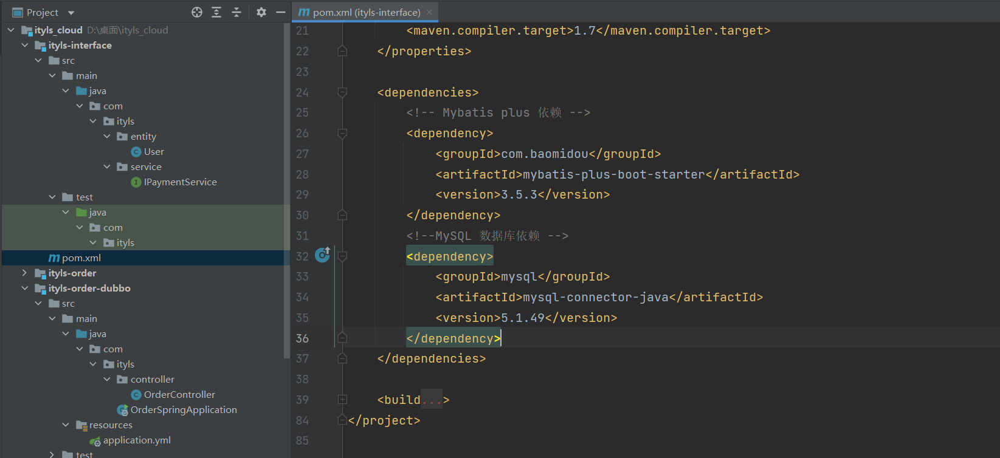

```xml
    <dependencies>
        <!-- Mybatis plus 依赖 -->
        <dependency>
            <groupId>com.baomidou</groupId>
            <artifactId>mybatis-plus-boot-starter</artifactId>
            <version>3.5.3</version>
        </dependency>
        <!--MySQL 数据库依赖 -->
        <dependency>
            <groupId>mysql</groupId>
            <artifactId>mysql-connector-java</artifactId>
            <version>5.1.49</version>
        </dependency>
    </dependencies>
```


**实体类添加注解:**

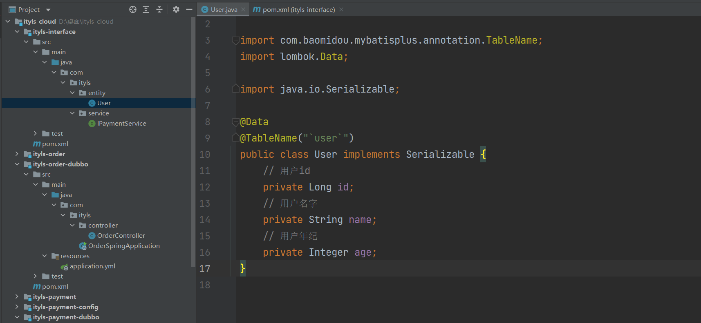


**配置数据源:**

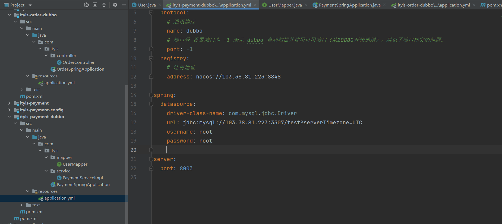

```yaml
spring:
  datasource:
    driver-class-name: com.mysql.jdbc.Driver
    url: jdbc:mysql://103.38.81.223:3307/test?serverTimezone=UTC
    username: root
    password: root
    
server:
  port: 8003
```


编写UserMapper接口：


```java
package com.ityls.mapper;

import com.baomidou.mybatisplus.core.mapper.BaseMapper;
import com.ityls.entity.User;

public interface UserMapper extends BaseMapper<User> {
}
```


扫描Mapper文件夹：在 SpringBoot 启动类中添加 `@MapperScan` 注解，扫描 Mapper 文件夹：

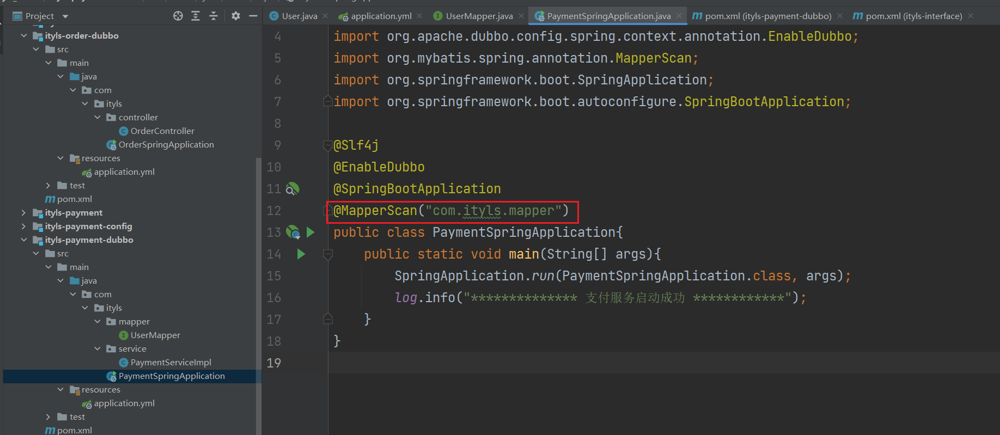


启动：

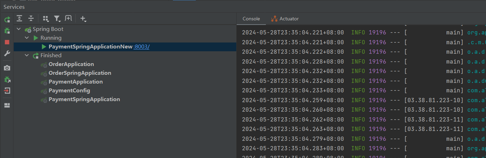

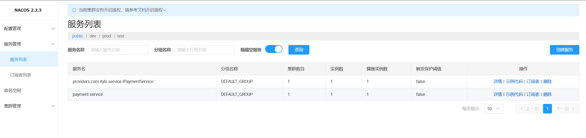


**编写统一结果返回集：**

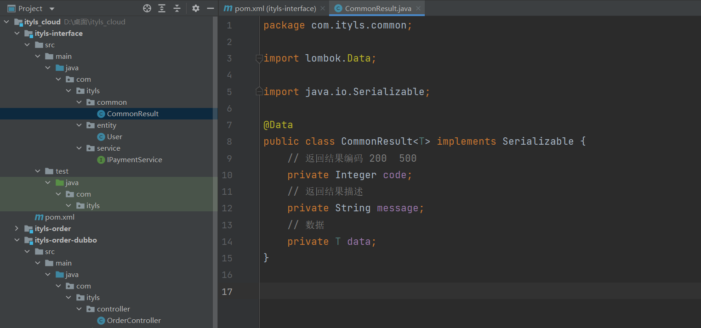

```java
package com.ityls.common;

import lombok.Data;

import java.io.Serializable;

@Data
public class CommonResult<T> implements Serializable {
    // 返回结果编码 200  500
    private Integer code;
    // 返回结果描述
    private String message;
    // 数据
    private T data;
}
```


**在itbaizhan-interface项目中创建添加用户接口:**

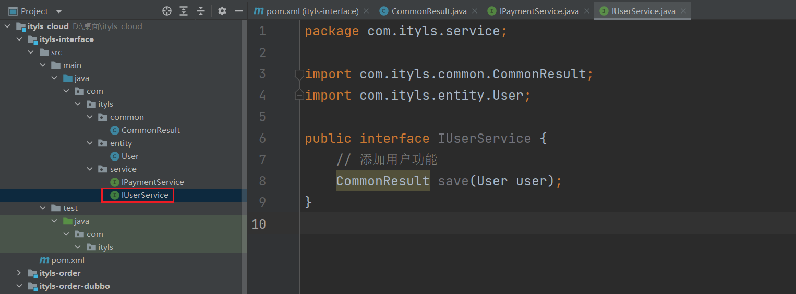

```java
package com.ityls.service;

import com.ityls.common.CommonResult;
import com.ityls.entity.User;

public interface IUserService {
    // 添加用户功能
    CommonResult save(User user);
}
```


**在provider中实现添加用户业务接口:**

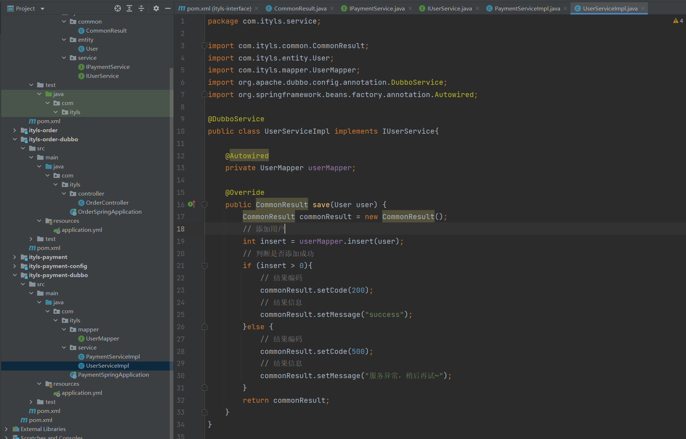

```java
package com.ityls.service;

import com.ityls.common.CommonResult;
import com.ityls.entity.User;
import com.ityls.mapper.UserMapper;
import org.apache.dubbo.config.annotation.DubboService;
import org.springframework.beans.factory.annotation.Autowired;

@DubboService
public class UserServiceImpl implements IUserService{

    @Autowired
    private UserMapper userMapper;

    @Override
    public CommonResult save(User user) {
        CommonResult commonResult = new CommonResult();
        // 添加用户
        int insert = userMapper.insert(user);
        // 判断是否添加成功
        if (insert > 0){
            // 结果编码
            commonResult.setCode(200);
            // 结果信息
            commonResult.setMessage("success");
        }else {
            // 结果编码
            commonResult.setCode(500);
            // 结果信息
            commonResult.setMessage("服务异常，稍后再试~");
        }
        return commonResult;
    }
}
```


测试：

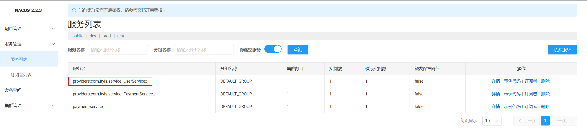


**查询用户业务接口：**

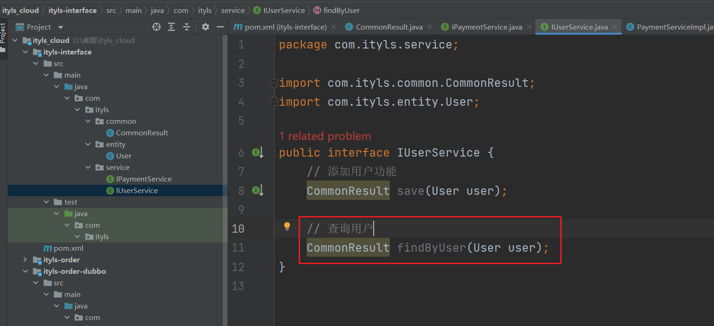

```java
// 查询用户
CommonResult findByUser(User user);
```


实现：

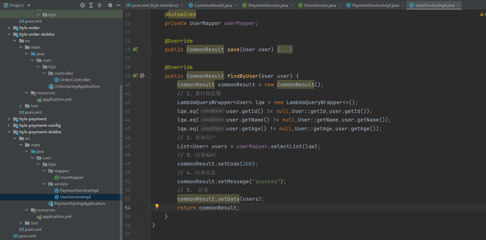

```java
    @Override
    public CommonResult findByUser(User user) {
        CommonResult commonResult = new CommonResult();
        // 1、条件构造器
        LambdaQueryWrapper<User> lqw = new LambdaQueryWrapper<>();
        lqw.eq(user.getId() != null,User::getId,user.getId());
        lqw.eq(user.getName() != null,User::getName,user.getName());
        lqw.eq(user.getAge() != null,User::getAge,user.getAge());
        // 2、查询用户
        List<User> users = userMapper.selectList(lqw);
        // 3、结果编码
        commonResult.setCode(200);
        // 4、结果信息
        commonResult.setMessage("success");
        // 5、 结果
        commonResult.setData(users);
        return commonResult;
    }
```


