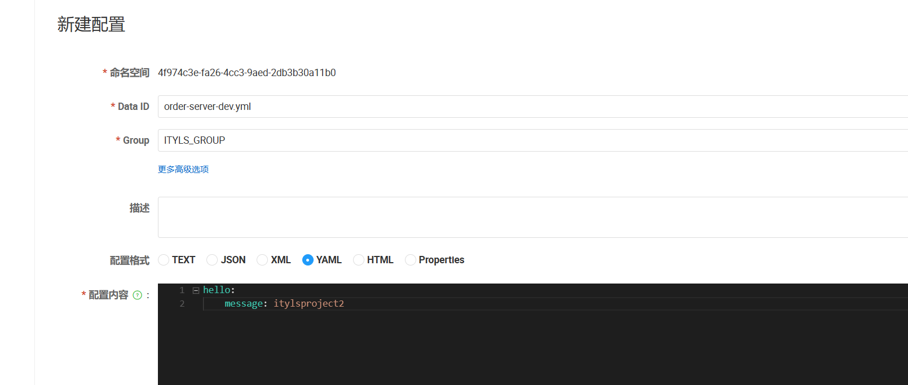

### 1，架构演变

**单体应用阶段 (夫妻摊位):**

在互联网发展的初期，用户数量少，一般网站的流量也很少，但硬件成本较高。因此，一般的企业会将所有的功能都集成在一起开发一个单体应用，然后将该单体应用部署到一台服务器上即可满足业务需求。


**生活中的单体应用:**

小夫妻俩刚结婚，手里资金有限，就想着开一个路边烧烤摊。丈夫负责烤串做菜、妻子负责服务收银及上菜。这是一个典型的路边烧烤摊的经营模式。


**单体应用的特点：**

- 能够接纳的请求数量时有限的，因为服务器的内存、CPU配置是有限的。
- 展现层、控制层、持久层全都在一个应用里面，调用方便、快速。单个请求的响应结果超快。
- 开发简单、上手快、三五个人团队好管好用。


**垂直应用阶段 （门面饭店）:**

随着小夫妻俩经营有方、待客有道，开始有人愿意为了吃他们做的烧烤排队了。夫妻俩一想，我们这俩人也干不过来啊，怎么办？招人吧、扩大规模吧。

- 招什么人？当然是厨师啊、端菜收银的妻子自己还能干得过来，主要是丈夫的活挺不住了。那就招厨师。
- 不能让人站着吃吧？租一个附近的门市、添置更多的桌椅板凳。


问题：在处理并发请求的能力和容量上增强了，但是在单个请求的处理速度上下降了。


**分布式系统阶段 (酒店)：**

为了解决上一阶段遇到的问题：单个请求的处理速度下降。也就是饭店针对单个订单做菜响应速度下降了，但是由于饭店的菜确实好吃、菜品精良，客流量又持续的增高。该店又再次面临扩容的问题。

- 为了解决客流量持续增高，夫妻又招聘了4位厨师
- 为了解决单个订单处理速度下降的问题，将厨师分为两组，一组专门做烧烤，一组专门做饭菜。专业的人做专业的事情，注意力越集中，办事越熟练、效率越高。


**微服务阶段 （五星大酒店）：**

饭店的规模越来越大了、岗位分工也越来越细了。真的成了超级大饭店了，怎么管？


**什么是微服务：**

将系统的业务功能划分为极小的独立微服务，每个微服务只关注于完成某个小的任务。系统中的单个微服务可以被独立部署和扩展，且各个微服务之间是高内聚、松耦合的。微服务之间采用轻量化通信机制暴露接来实现通信。


**解释：**

- 服务网关：前台。所有的顾客进来，由前台统一接待。比如：Spring Cloud Gateway。
- 熔断机制：菜品限量，法式菜品、意大利菜品、日本料理。什么时间可以吃得到、可提供多少人份？这些服务都是有限制的。
- 工作效率监督：工作流程中每个岗位做了什么工作、用了多长时间。哪个环节出现问题、哪个岗位需要调整。比如： Sleuth、日志监控ELK等。
- 配置中心：菜单，川菜，东北菜，杭帮菜，烩菜。
- 服务集群：厨师微服务集群包含，川菜厨师微服务，杭帮菜厨师微服务等。
- 高可用注册中心：大堂经理，负责那些人上班了,他在哪里干的什么工作。


### 2，认识SpringCloud Alibaba

Spring Cloud Alibaba致力于提供微服务开发的**一站式解决方案**。此项目包含开发**分布式**应用微服务的必需组件，方便开发者通过 Spring Cloud 编程模型轻松使用这些组件来开发分布式应用服务。官网<https://sca.aliyun.com/zh-cn/>


**Spring Cloud Alibaba定位：**


**谁在使用Spring Cloud Alibaba:**


### 3，SpringCloud Alibaba版本选择


**SpringCloud Alibaba和SpringCloud和SpringBoot版本对应关系:**

| Spring Cloud Alibaba Version | Spring Cloud Version  | Spring Boot Version |
| :--------------------------: | :-------------------: | :-----------------: |
|         2022.0.0.0*          | Spring Cloud 2022.0.0 |        3.0.2        |
|        2022.0.0.0-RC2        | Spring Cloud 2022.0.0 |        3.0.2        |
|        2022.0.0.0-RC1        | Spring Cloud 2022.0.0 |        3.0.0        |

**版本依赖关系**

由于 Spring Boot 3.0，Spring Boot 2.7~2.4 和 2.4 以下版本之间变化较大，目前企业级客户老项目相关 Spring Boot 版本仍停留在 Spring Boot 2.4 以下，为了同时满足存量用户和新用户不同需求，社区以 Spring Boot 3.0 和 2.4 分别为分界线，同时维护 2022.x、2021.x、2.2.x 三个分支迭代。


**注意：**

其实SpringBoot与SpringCloud需要版本对应，否则可能会造成很多意料之外的错误，比如eureka注册了结果找不到服务类啊，比如某些jar导入不进来啊，等等这些错误。


**版本说明：**

| 字       | 描述                                                         |
| -------- | ------------------------------------------------------------ |
| SNAPSHOT | 快照版，可以稳定使用，且仍在继续改进版本。                   |
| PRE      | 预览版,内部测试版. 主要是给开发人员和测试人员测试和找BUG用的，不建议使用； |
| RC       | 发行候选版本，基本不再加入新的功能，主要修复bug。            |
| SR       | 修正版或更新版                                               |
| GA       | 正式发布的版本                                               |


### 4，搭建微服务项目环境


**新建微服务项目**


依赖：

```xml
 <properties>
  <dubbo.version>3.2.4</dubbo.version>
  <project.build.sourceEncoding>UTF-8</project.build.sourceEncoding>
  <project.reporting.outputEncoding>UTF-8</project.reporting.outputEncoding>
  <java.version>17</java.version>
  <spring-boot.version>3.0.2</spring-boot.version>
  <spring-cloud.version>2022.0.0</spring-cloud.version>
  <spring-cloud-alibaba.version>2022.0.0.0</spring-cloud-alibaba.version>
 </properties>


 <!-- 依赖声明 -->
 <dependencyManagement>
  <dependencies>
   <!-- SpringCloud 微服务 -->
   <dependency>
    <groupId>org.springframework.cloud</groupId>
    <artifactId>spring-cloud-dependencies</artifactId>
    <version>${spring-cloud.version}</version>
    <type>pom</type>
    <scope>import</scope>
   </dependency>

   <!-- SpringCloud Alibaba 微服务 -->
   <dependency>
    <groupId>com.alibaba.cloud</groupId>
    <artifactId>spring-cloud-alibaba-dependencies</artifactId>
    <version>${spring-cloud-alibaba.version}</version>
    <type>pom</type>
    <scope>import</scope>
   </dependency>

   <!-- SpringBoot 依赖配置 -->
   <dependency>
    <groupId>org.springframework.boot</groupId>
    <artifactId>spring-boot-dependencies</artifactId>
    <version>${spring-boot.version}</version>
    <type>pom</type>
    <scope>import</scope>
   </dependency>

   <dependency>
    <groupId>org.projectlombok</groupId>
    <artifactId>lombok</artifactId>
    <version>1.18.28</version>
   </dependency>

   <!-- Dubbo -->
   <dependency>
    <groupId>org.apache.dubbo</groupId>
    <artifactId>dubbo-bom</artifactId>
    <version>${dubbo.version}</version>
    <type>pom</type>
    <scope>import</scope>
   </dependency>
  </dependencies>
 </dependencyManagement>

 <dependencies>
  <!-- bootstrap 启动器 -->
  <dependency>
   <groupId>org.springframework.cloud</groupId>
   <artifactId>spring-cloud-starter-bootstrap</artifactId>
  </dependency>
  <dependency>
   <groupId>org.projectlombok</groupId>
   <artifactId>lombok</artifactId>
   <version>1.18.28</version>
  </dependency>
 </dependencies>

 <build>
  <plugins>
   <plugin>
    <groupId>org.apache.maven.plugins</groupId>
    <artifactId>maven-compiler-plugin</artifactId>
    <configuration>
     <source>${java.version}</source>
     <target>${java.version}</target>
     <encoding>${project.build.sourceEncoding}</encoding>
    </configuration>
   </plugin>
  </plugins>
 </build>

 <repositories>
  <repository>
   <id>public</id>
   <name>aliyun nexus</name>
   <url>https://maven.aliyun.com/repository/public</url>
   <releases>
    <enabled>true</enabled>
   </releases>
  </repository>
 </repositories>


 <pluginRepositories>
  <pluginRepository>
   <id>public</id>
   <name>aliyun nexus</name>
   <url>https://maven.aliyun.com/repository/public</url>
   <releases>
    <enabled>true</enabled>
   </releases>
   <snapshots>
    <enabled>false</enabled>
   </snapshots>
  </pluginRepository>
 </pluginRepositories>
```


**修改字符编码:**

File->Settings->Editor->File Encodings


**项目工程开启DashBoard**

在项目文件目录找到.idea目录并在workspace.[xml](https://so.csdn.net/so/search?q=xml&spm=1001.2101.3001.7020)中找到RunDashboard，配置如下；然后需要重新关闭项目重启项目配置生效。

```xml
<component name="RunDashboard">
 <option name="ruleStates">
  <list>
   <RuleState>
    <option name="name" value="ConfigurationTypeDashboardGroupingRule" />
   </RuleState>
   <RuleState>
    <option name="name" value="StatusDashboardGroupingRule" />
   </RuleState>
  </list>
 </option>
 <!-- 新增的配置 -->
 <option name="configurationTypes">
  <set>
   <option value="SpringBootApplicationConfigurationType" />
  </set>
 </option>
 </component>
```


新建子工程ityls-order:


创建支付模块：


### 5，为什么需要服务治理

服务治理是通向微服务架构的第一关。在没有进行服务治理前,服务之间的通信是通过服务间直接相互调用来实现的。


例子：


武当派直接调用峨眉派和华山派，同样，华山派直接调用武当派和峨眉派如果系统不复杂，这样调用没什么问题。但在复杂的微服务系统中，采用这样的调用方法就会产生问题。


微服务系统中服务众多，这样会导致服务间的相互调用非常不便，因为要记住提供服务的IP地址、名称、端口号等。这时就需要中间代理，通过中间代理来完成调用。


服务治理的解决方案


**服务治理责任：**

- 你是谁：服务注册 - 服务提供方自报家门
- 你来自哪里：服务发现 - 服务消费者拉取注册数据
- 你好吗：心跳检测，服务续约和服务剔除 一套由服务提供方和注册中心配合完成的去伪存真的过程
- 当你死的时候：服务下线 - 服务提供方发起主动下线


**服务治理技术选型：**

- 老牌劲旅 Eureka
- 同门师弟 Consul
- 后起之秀 Nacos


**注意：**

在架构选型的时候，我们需要注意一下切记不能为了新而新，忽略了对于当前业务的支持，虽然Eureka2.0不开源了，但是谁知道以后会不会变化，而且1.0也是可以正常使用的，也有一些贡献者在维护这个项目，所以我们不必要过多的担心这个问题，要针对于业务看下该技术框架是否支持在做考虑。


### 6，介绍Nacos


Nacos是阿里巴巴开源的服务注册中心以及配置中心，致力于给开发者提供一款便捷、简单上手的开源框架。


从上图不难看出阿里巴巴的野心，一个Nacos干掉了Spring Cloud的三大组件，分别是`注册中心Eureka`、`服务配置Config`，`服务总线Bus`。


Nacos官方文档的介绍中有这么一句话，如下：

> Nacos 帮助您更敏捷和容易地构建、交付和管理微服务平台。Nacos 是构建以“服务”为中心的现代应用架构 (例如微服务范式、云原生范式) 的服务基础设施。


`Eureka`、`Config`这两个组件相信大家都用过，有什么感受？

感受就是繁琐：

- 无论是Eureka还是Config都必须自己搭建个服务
- 英文界面不是那么友好

用过Nacos的开发者都说很爽，不用自己搭建服务，阿里给你准备好了服务，只需要启动即可；界面中英文都有，很适合初学者。当然最重要的原因就是以上组件很可能面临`停更`、比如Eureka已经停更了，谁知道后面其他的组件会不会如此呢？


**Nacos主要提供以下四大功能：**

- **服务发现和服务健康监测**

Nacos 使服务更容易注册，并通过DNS或HTTP接口发现其他服务，Nacos还提供服务的实时健康检查，以防止向不健康的主机或服务实例发送请求。

- **动态配置服务**

动态配置服务允许您在所有环境中以集中和动态的方式管理所有服务的配置。Nacos消除了在更新配置时重新部署应用程序，这使配置的更改更加高效和灵活。

- **动态 DNS 服务**

Nacos提供基于DNS协议的服务发现能力，旨在支持异构语言的服务发现，支持将注册在Nacos上的服务以域名的方式暴露端点，让三方应用方便查阅及发现。

- **服务及其元数据管理**

Nacos能让您从微服务平台建设的视觉管理数据中心的所有服务及元数据，包括管理服务的描述、生命周期、服务的静态依赖分析、服务的健康状态、服务的流量管理、路由及安全策略。


**Nacos名字由来：**


- **Naming**：名字
- **Configurations**：配置
- **Service**：服务


### 7，搭建部署Nacos

Nacos 依赖 Java环境来运行。如果您是从代码开始构建并运行Nacos，还需要为此配置 Maven环境，请确保是在以下版本环境中安装使用。

```
## 1、下载安装JDK
wget https://download.oracle.com/java/17/latest/jdk-17_linux-x64_bin.tar.gz
## 2、解压缩
tar -zxvf jdk-17_linux-x64_bin.tar.gz -C /usr/local
## 3、修改/etc/profile配置文件
sudo vim /etc/profile
## 4、写入配置
export JAVA_HOME=/usr/local/jdk-17.0.11
export PATH=$PATH:${JAVA_PATH}/bin
# 5、刷新一下
source /etc/profile
```

注意：

1. 64 bit OS，支持 Linux/Unix/Mac/Windows，推荐选用 Linux/Unix/Mac。
2. 64 bit JDK 1.8+；
3. Maven 3.2.x+；


测试电脑上是没有jdk，如下：


解压：


设置环境变量：


让环境变量生效：


测试：


**下载源码或者安装包：**

通过源码和发行包两种方式来获取 Nacos。<https://github.com/alibaba/nacos/releases>


找到Nacos的官网：https://nacos.io/?spm=5176.29160081.0.0.74802615CwNsDe


**下载后解压：**

```
tar -zxvf nacos-server-2.2.3.tar.gz -C /usr/local
```


**启动服务器:**

```
# 1、Linux/Unix/Mac
#启动命令(standalone代表着单机模式运行，非集群模式):
sh startup.sh -m standalone


# 2、如果您使用的是ubuntu系统
bash startup.sh -m standalone


# 3、Windows
#启动命令(standalone代表着单机模式运行，非集群模式):
startup.cmd -m standalone
```


测试：请求http://103.38.81.223:8848/nacos


### 8，将支付微服务接入Nacos注册中心


引入依赖：

```xml
<dependencies>
    <dependency>
      <groupId>org.springframework.boot</groupId>
      <artifactId>spring-boot-starter-web</artifactId>
    </dependency>

    <dependency>
     <groupId>com.alibaba.cloud</groupId>
     <artifactId>spring-cloud-starter-alibaba-nacos-discovery</artifactId>
    </dependency>
</dependencies>
```


创建application.yml配置文件。

```yml
spring:
  application:
    name: payment-service
  cloud:
    nacos:
      discovery:
        # 配置 Nacos注册中心地址
        server-addr: 103.38.81.223:8848
server:
  port: 8005
```


启动类：

```java
package com.ityls;

import lombok.extern.slf4j.Slf4j;
import org.springframework.boot.SpringApplication;
import org.springframework.boot.autoconfigure.SpringBootApplication;
import org.springframework.cloud.client.discovery.EnableDiscoveryClient;

@Slf4j
@EnableDiscoveryClient//向注册中心注册该服务，并可以获取其他服务的调用地址
@SpringBootApplication
public class PaymentApplication
{
    public static void main( String[] args )
    {
        SpringApplication.run(PaymentApplication.class,args);
        log.info("************** 支付服务启动成功 ************");
    }
}
```


查看：


### 9，将订单微服务接入Nacos注册中心


引入依赖：


```xml
<dependencies>
    <dependency>
      <groupId>org.springframework.boot</groupId>
      <artifactId>spring-boot-starter-web</artifactId>
    </dependency>

    <dependency>
     <groupId>com.alibaba.cloud</groupId>
     <artifactId>spring-cloud-starter-alibaba-nacos-discovery</artifactId>
    </dependency>
</dependencies>
```


编写配置文件：在resources文件下创建application.yml配置文件。


```yml
spring:
  application:
    name: order-service
  cloud:
    nacos:
      discovery:
        # 配置 Nacos注册中心地址
        server-addr: 103.38.81.223:8848
server:
  port: 8006
```


编写启动类：

```java
package com.ityls;

import lombok.extern.slf4j.Slf4j;
import org.springframework.boot.SpringApplication;
import org.springframework.boot.autoconfigure.SpringBootApplication;
import org.springframework.cloud.client.discovery.EnableDiscoveryClient;

@Slf4j
@EnableDiscoveryClient
@SpringBootApplication
public class OrderApplication
{
    public static void main( String[] args )
    {
        SpringApplication.run(OrderApplication.class,args);
        log.info("************** 订单服务启动成功 ************");
    }
}
```


测试：


### 10，用CP模式和AP模式来保持注册中心的数据一致性


**CAP理论：**

著名的CAP理论指出，一个分布式系统不可能同时满足C(一致性)、A(可用性)和P(分区容错性)。由于分区容错性P在是分布式系统中必须要保证的，因此我们只能在A和C之间进行权衡。


**服务注册中心对比：**

|                 | Nacos                      | Eureka      | Consul            | CoreDNS | Zookeeper   |
| --------------- | -------------------------- | ----------- | ----------------- | ------- | ----------- |
| 一致性协议      | CP+AP                      | AP          | CP                | /       | CP          |
| 健康检查        | TCP/HTTP/MySQL/Client Beat | Client Beat | TCP/HTTP/gRPC/Cmd | /       | Client Beat |
| 负载均衡        | 权重/DSL/metadata/CMDB     | Ribbon      | Fabio             | RR      | /           |
| 雪崩保护        | 支持                       | 支持        | 不支持            | 不支持  | 不支持      |
| 自动注销实例    | 支持                       | 支持        | 不支持            | 不支持  | 支持        |
| 访问协议        | HTTP/DNS/UDP               | HTTP        | HTTP/DNS          | DNS     | TCP         |
| 监听支持        | 支持                       | 支持        | 支持              | 不支持  | 支持        |
| 多数据中心      | 支持                       | 支持        | 支持              | 不支持  | 不支持      |
| 跨注册中心      | 支持                       | 不支持      | 支持              | 不支持  | 不支持      |
| SpringCloud集成 | 支持                       | 支持        | 支持              | 不支持  | 不支持      |
| Dubbo集成       | 支持                       | 不支持      | 不支持            | 不支持  | 支持        |
| K8s集成         | 支持                       | 不支持      | 支持              | 支持    | 不支持      |


**Nacos的AP模式和CP模式切换：**

Nacos是可以在AP模式和CP模式之间进行切换的，默认为AP。 （1）切换为CP模式。

```
curl -X PUT "http://localhost:8848/nacos/v1/ns/operator/switches?entry=serverMode&value=CP"
```

（2）切换为AP模式。

```
curl -X PUT "http://localhost:8848/nacos/v1/ns/operator/switches?entry=serverMode&value=AP"
```


**选用何种模式：**

一般来说，如果不需要存储服务级别的信息且服务实例是通过nacos-client注册，并能够保持心跳上报，那么就可以选择AP模式。当前主流的服务如Spring cloud和 Dubbo服务，都适用于AP模式。AP模式为了服务的可能性而减弱了一致性，因此AP模式下只支持注册临时实例。


**实际开发选择：**

- 追求CP: 用户请求支付,等待支付订单生成以及库存系统数据更新,再给用户返回结果 追求强一致性 缺点:用户体验差。

- 追求AP: 用户请求支付,立即给用户响应结果,异步处理库存系统 放弃强一致性,采用最终一致性。


### 11，为什么需要分布式配置中心

我们现在有一个项目，使用SpringBoot进行开发的，配置文件的话我们知道是一个叫做application.yml的文件。


配置：

```yml
#业务参数相关配置
spring:
 # 数据源配置
  datasource:
   type: com.alibaba.druid.pool.DruidDataSource
   driverClassName: com.mysql.cj.jdbc.Driver
   druid:
   # 主库数据源
    master:
     url: jdbc:mysql://192.168.47.100:3306/test
     username: root
     password: root
```


**需求一：**

由于业务的变动，用户在以前进行注册的时候默认的数据库在`192.168.47.100`，但是该节点数据库出现问题，需要把IP这个改成`192.168.47.101`。因为，业务的流量还是比较大的，所以，没有办法在白天流量高峰期修改配置文件，进行重启！

> 就辛苦开发的小哥，他们需要等到半夜里凌晨三四点的时候，没有流量的时候，小心翼翼的去修改application.properties配置文件，必将系统进行重启。开发小哥是在忍受不了这种变更了，修改一个配置就需要如此周折的去完成这件事情！忍无可忍。


**需求二：**

我们在进行业务开发的时候，一般会有多个环境，至少应该有三个：开发、测试、线上。那这三个环境之间的配置文件肯定是有不同的，比如说他们之间的数据库是肯定不同的！


分别需要设置的命令如下：

```
java -jar -Dspring.profiles.active=dev nssas.jar
和
java -jar -Dspring.profiles.active=test nssas.jar
和
java -jar -Dspring.profiles.active=prod nssas.jar
```

运维小哥的工作量直接翻了一倍多，想想还有十几个项目需要这样进行修改，运维小哥悄悄的拿起了抽屉里准备了很久的xxx走向了开发小哥。


**主要缺点：**

- **不支持配置文件的动态更新**：在实际的业务开发过程中，需要动态地更新配置文件，比如切换业务功能开关、变更图片服务器地址、变更数据库连接信息等。在传统配置模式下,需要修改本地配置文件并重新打包，然后重启应用并发布，这样才能保证配置文件能够生效。但这样会导致该服务在重启阶段不可用，从而影响服务整体的可用率。
- **不支持配置集中式管理**：在微服务架构中，为了保证某些核心服务的高性能会部署几百个节点。如果在每个节点上都维护一个本地配置文件，则不管是对运维人员或者开发人员而言,成本都是巨大的。
- **不支持多环境部署**：如果通过底层框架来维护不同环境的信息，则成本也是非常高的。


分布式配置管理就是弥补上述不足的方法，把各个服务的某些配置信息统一交给第三方中间件来维护，分布式配置管理上的数据变变更，需要实时地推送到相对应的应用服务节点上。


nacos中就有配置管理：


### 12，了解主流的配置中心

主流的分布式配置中心有以下三种，其中，Nacos是Alibaba开源的分布式配置中心。


nacos是Sping Cloud alibaba技术栈中的一个组件，前面我们已经使用它做过服务注册中心。其实它也集成了服务配置的功能，我们可以直接使用它作为服务配置中心。


**应用和配置中心间的数据同步通常如下三种模式:**

- **Pull模式**：让应用开后长轮询，即定时地从配置中心拉取最新的配置信息，并更新到应用的内存中。
- **Push模式**：在配置中心配置数据变更之后，主动推送配置数据到指定的应用，应用更新到本地内存中。
- **混合模式**：应用和配置中心通过“事件机制＋监听器”模式保持长连接。如果应用监听的配置信息发生了变化，则配置中心发布对应类型的事件。应用只有在监听到该事件之后,才会处理对应的配置信息，并更新到应用本地。


**分布式配置中心对比：**


### 13，Namespace命名空间

现如今，在微服务体系中，一个系统往往被拆分为多个服务，每个服务都有自己的配置文件，然后每个系统往往还会准备开发环境、测试环境、正式环境。


问题：我们来说算一算，假设某系统有10个微服务，那么至少有10个配置文件吧，三个环境（dev/test/prod），那就有30个配置文件需要进行管理。

- 解决：namespace可以帮助我们进行多环境下的管理和隔离


用于进行租户粒度的配置隔离。不同的命名空间下，可以存在相同的 Group 或 Data ID 的配置。Namespace 的常用场景之一是不同环境的配置的区分隔离，例如开发测试环境和生产环境的资源（如配置、服务）隔离等。默认namespace=public的保留空间,不支持删除;默认情况下。


Nacos给的最佳实践表明，最外层的namespace是可以用于区分部署环境的，比如test，dev，prod等。


注意：命名空间可用于进行不同环境的配置隔离。一般一个环境划分到一个命名空间。


**新建dev/test的Namespace:**


**查看命名空间：**


### 14，DataID配置

Data ID 通常用于组织划分系统的配置集。一个系统或者应用可以包含多个配置集，每个配置集都可以被一个有意义的名称标识。


注意：在系统中，一个配置文件通常就是一个配置集。一般微服务的配置就是一个配置集。


**dataId的拼接格式：**


**解释：**

- **prefix**：默认为 spring.application.name 的值。
- **spring.profiles.active**：即为当前环境对应的 profile。
- **file-extension**：文件后缀


当activeprofile为空时：


**新建dev配置DataID：**


同样，创建支付模块的Data Id，如下：


### 15，Group分组方案

当您在 Nacos上创建一个配置时，如果未填写配置分组的名称，则配置分组的名称默认采用DEFAULT_GROUP 。


**通过Group实现环境区分:**


再创建一个，如下：




### 16，Namespace实施方案


**Nacos给出了两种Namespace的实践方案：**

- 面向一个租户
- 面向多个租户


**面向一个租户：**

- 从一个租户(用户)的角度来看，如果有多套不同的环境，那么这个时候可以根据指定的环境来创建不同的 namespce，以此来实现多环境的隔离。
- 例如，你可能有dev，test和prod三个不同的环境，那么使用一套 nacos 集群可以分别建以下三个不同的 namespace。


这里的单租户同样也适于小型项目，或者是项目不太多时的实施方案，通过定义不同的环境，不同环境的项目在不同的Namespace下进行管理，不同环境之间通过Namespace进行隔离。


**面向多个租户：**

当多个项目同时使用该Nacos集群时，还可以通过Group进行Namespace内的细化分组。这里以`Namespace：dev`为例，在Namespace中通过不同Group进行同一环境中不同项目的`再分类`。


通过上面的理论分析，可以看出方案二有很好的扩展性


### 17，将应用对接Nacos配置中心


**创建工程ityls-payment-config：**


依赖：

```xml
  <dependencies>
    <dependency>
      <groupId>org.springframework.boot</groupId>
      <artifactId>spring-boot-starter-web</artifactId>
    </dependency>
    <!-- 注册中心 --> 
    <dependency>
      <groupId>com.alibaba.cloud</groupId>
      <artifactId>spring-cloud-starter-alibaba-nacos-config</artifactId>
    </dependency>
    <!-- 服务发现和注册 --> 
    <dependency>
      <groupId>com.alibaba.cloud</groupId>
      <artifactId>spring-cloud-starter-alibaba-nacos-discovery</artifactId>
    </dependency>
  </dependencies>
```


启动类：

```java
@Slf4j
@EnableDiscoveryClient
@SpringBootApplication
public class PaymentConfig
{
    public static void main(String[] args)
    {
        SpringApplication.run(PaymentConfig.class,args);
        log.info("******************** 支付服务启动成功 ***************");
    }
}
```


新建命名空间dev，在配置管理->配置列表里面切换dev环境，创建payment-dev.yaml文件。


创建配置文件名为`bootstrap.yml`,注意是bootstrap.yml，而不是`application`。


注意：

- `spring.application.name`：可以看到必须可少的配置项
- `spring.cloud.nacos.discovery.server-addr`：指定注册中心的地址，如果你不需要注册该服务，也可以去掉该项，并删除discovery依赖
- `spring.cloud.nacos.config.server-addr`：指定配置中心的地址
- `file-extension`：指定配置中心中配置文件的格式

```yaml
spring:
  cloud:
    nacos:
      config:
        server-addr: 103.38.81.223:8848
        namespace: 4f974c3e-fa26-4cc3-9aed-2db3b30a11b0
        file-extension: yaml
        prefix: ${spring.application.name}
        group: DEFAULT_GROUP
  application:
    name: payment
  profiles:
    active: dev
```

Nacos同SpringCloud-Config一样，在项目初始化时，要保证先从配置中心进行配置拉取，拉取配置之后，才能保证项目的正常启动。SpringBoot中配置文件的加载是存在优先级顺序的，bootstrap优先级高于application。

- bootstrap.yml（bootstrap.properties）用来在程序引导时执行，应用于更加早期配置信息读取，如可以使用来配置application.yml中使用到参数等
- application.yml（application.properties) 应用程序特有配置信息，可以用来配置后续各个模块中需使用的公共参数等。
- bootstrap.yml 先于 application.yml 加载


上面的配置是为了保证服务的正常注册和配置获取，以及配置`DataID`的正确性


```java
@RestController
public class HelloController {
  @Value("${hello.message}")
  private String hello;

  @GetMapping("/hello")
  public String hello(){
    return hello;
   }
}
```


测试：


如何出错了，肯定配置写错了，检查5步曲

1. 检查命名空间
2. 检查文件名字是否对应
3. 检查环境
4. 检查文件后缀是否一致
5. 检查Group是否一致


### 18，Nacos配置动态刷新


**配置动态刷新：**

配置的动态刷新，仅需要使用@RefreshScope注解即可。

```java
@RestController
/* 只需要在需要动态读取配置的类上添加此注解就可以 */
@RefreshScope 
public class HelloController {
  @Value("${hello.message}")
  private String hello;

  @GetMapping("/hello")
  public String hello(){
    return hello;
   }
}
```


测试：


### 19，Nacos集群架构介绍


**为什么需要搭建Nacos集群：**

在实际开发过程中，如果使用Nacos 的话，为了确保高可用，我们一般都会对其进行集群的部署。 Nacos 规定集群中 Nacos 节点的数量需要大于等于 3 个 ；同时，单机模式下 Nacos 的数据默认保存在其内嵌数据库中 deby ，不方便观察数据存储的基本情况。而且如果集群中启动多个默认配置下的Nacos 节点，数据存储是存在一致性问题的。为了解决这个问题， Nacos采用了集中式存储的方式来支持集群化部署，目前只支持 MySQL 的存储。


**Nacos支持三种部署模式：**

- 单机模式 - 用于测试和单机试用。
- 集群模式 - 用于生产环境，确保高可用。
- 多集群模式 - 用于多数据中心场景。


**集群模式：**


### 20，Nacos的数据持久化


**初始化数据库：**

Nacos的数据库脚本文件在我们下载Nacos-server时的压缩包中就有进入`\nacos\conf`目录，初始化文件：`mysql-schema.sql`此处我创建一个名为 `mynacos` 的数据库，然后执行初始化脚本，成功后会生成 `11` 张表;


数据库：


创建数据库，导入表：


**修改配置文件：**

这里是需要修改Nacos-server的配置文件Nacos-server其实就是一个Java工程或者说是一个Springboot项目，他的配置文件在nacos\conf目录下，名为 application.properties，在文件底部添加数据源配置：


```
spring.datasource.platform=mysql

db.num=1
db.url.0=jdbc:mysql://127.0.0.1:3307/mynacos?characterEncoding=utf8&connectTimeout=1000&socketTimeout=3000&autoReconnect=true
db.user=root
db.password=root
```


**启动Nacos-server和Nacos-config:**

先启动Nacos-server，启动成功后进入Nacos控制台，此时的Nacos控制台中焕然一新，之前的数据都不见了。因为加入了新的数据源，Nacos从mysql中读取所有的配置文件，而我们刚刚初始化的数据库是干干净净的，自然不会有什么数据和信息显示。


看后台：


在公共空间(public)中新建一个配置文件DataID: `nacos-config.yml`, 配置内容如下：


```yml
server: 
    port: 9989
nacos:
    config: 配置文件已持久化到数据库中...
```


**验证是否持久化到数据库中:**


### 21，Nacos集群配置


**准备工作:**

将Nacos复制三份前提一定是要关闭Nacos。


**集群启动：**

在本地通过3个端口模拟3台机器，端口分别是：8848，8858，8868。


```
#copy3份解压后的nacos，修改各自的application.properties中的端口号，分别为：8848，8858，8868
server.port=8848
server.port=8858
server.port=8868
```


**各自的conf目录下放cluster.conf文件，文件内容为：**


```
103.38.81.223:8848
103.38.81.223:8858
103.38.81.223:8868
```


**启动Nacos服务:**

```
./startup.sh 
```


启动不起来，可能不是内存不够了：


修改内存大小：


由于我的机器内存太小，我就启动两台nacos：


**使用Nginx作负载均衡访问集群的Nacos，环境安装：**

```
yum -y install gcc make automake pcre-devel zlib zlib-devel openssl openssl-devel
```


**安装Nginx:**

```
./configure make && make install
```


**配置nginx.conf文件:**

```
#定义upstream名字，下面会引用
upstream nacos {  
    #指定后端服务器地址
    server 192.168.47.100:8848;    
    server 192.168.47.100:8858; 
    server 192.168.47.100:8868;   
}
 
server {
 listen 80;
 server_name localhost;
 location / {
   proxy_pass http://nacos;    #引用upstream
  }
}
```


**重启Nginx:**

```
./nginx -s relaod
```


**通过访问Nginx就可以实现Nacos访问的负载均衡:**


