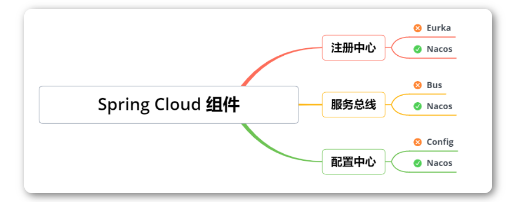

### 1，架构演变

**单体应用阶段 (夫妻摊位):**

在互联网发展的初期，用户数量少，一般网站的流量也很少，但硬件成本较高。因此，一般的企业会将所有的功能都集成在一起开发一个单体应用，然后将该单体应用部署到一台服务器上即可满足业务需求。


**生活中的单体应用:**

小夫妻俩刚结婚，手里资金有限，就想着开一个路边烧烤摊。丈夫负责烤串做菜、妻子负责服务收银及上菜。这是一个典型的路边烧烤摊的经营模式。


**单体应用的特点：**

- 能够接纳的请求数量时有限的，因为服务器的内存、CPU配置是有限的。
- 展现层、控制层、持久层全都在一个应用里面，调用方便、快速。单个请求的响应结果超快。
- 开发简单、上手快、三五个人团队好管好用。


**垂直应用阶段 （门面饭店）:**

随着小夫妻俩经营有方、待客有道，开始有人愿意为了吃他们做的烧烤排队了。夫妻俩一想，我们这俩人也干不过来啊，怎么办？招人吧、扩大规模吧。

- 招什么人？当然是厨师啊、端菜收银的妻子自己还能干得过来，主要是丈夫的活挺不住了。那就招厨师。
- 不能让人站着吃吧？租一个附近的门市、添置更多的桌椅板凳。


问题：在处理并发请求的能力和容量上增强了，但是在单个请求的处理速度上下降了。


**分布式系统阶段 (酒店)：**

为了解决上一阶段遇到的问题：单个请求的处理速度下降。也就是饭店针对单个订单做菜响应速度下降了，但是由于饭店的菜确实好吃、菜品精良，客流量又持续的增高。该店又再次面临扩容的问题。

- 为了解决客流量持续增高，夫妻又招聘了4位厨师
- 为了解决单个订单处理速度下降的问题，将厨师分为两组，一组专门做烧烤，一组专门做饭菜。专业的人做专业的事情，注意力越集中，办事越熟练、效率越高。


**微服务阶段 （五星大酒店）：**

饭店的规模越来越大了、岗位分工也越来越细了。真的成了超级大饭店了，怎么管？


**什么是微服务：**

将系统的业务功能划分为极小的独立微服务，每个微服务只关注于完成某个小的任务。系统中的单个微服务可以被独立部署和扩展，且各个微服务之间是高内聚、松耦合的。微服务之间采用轻量化通信机制暴露接来实现通信。


**解释：**

- 服务网关：前台。所有的顾客进来，由前台统一接待。比如：Spring Cloud Gateway。
- 熔断机制：菜品限量，法式菜品、意大利菜品、日本料理。什么时间可以吃得到、可提供多少人份？这些服务都是有限制的。
- 工作效率监督：工作流程中每个岗位做了什么工作、用了多长时间。哪个环节出现问题、哪个岗位需要调整。比如： Sleuth、日志监控ELK等。
- 配置中心：菜单，川菜，东北菜，杭帮菜，烩菜。
- 服务集群：厨师微服务集群包含，川菜厨师微服务，杭帮菜厨师微服务等。
- 高可用注册中心：大堂经理，负责那些人上班了,他在哪里干的什么工作。


### 2，认识SpringCloud Alibaba

Spring Cloud Alibaba致力于提供微服务开发的**一站式解决方案**。此项目包含开发**分布式**应用微服务的必需组件，方便开发者通过 Spring Cloud 编程模型轻松使用这些组件来开发分布式应用服务。官网<https://sca.aliyun.com/zh-cn/>


**Spring Cloud Alibaba定位：**


**谁在使用Spring Cloud Alibaba:**


### 3，SpringCloud Alibaba版本选择


**SpringCloud Alibaba和SpringCloud和SpringBoot版本对应关系:**

| Spring Cloud Alibaba Version | Spring Cloud Version  | Spring Boot Version |
| :--------------------------: | :-------------------: | :-----------------: |
|         2022.0.0.0*          | Spring Cloud 2022.0.0 |        3.0.2        |
|        2022.0.0.0-RC2        | Spring Cloud 2022.0.0 |        3.0.2        |
|        2022.0.0.0-RC1        | Spring Cloud 2022.0.0 |        3.0.0        |

**版本依赖关系**

由于 Spring Boot 3.0，Spring Boot 2.7~2.4 和 2.4 以下版本之间变化较大，目前企业级客户老项目相关 Spring Boot 版本仍停留在 Spring Boot 2.4 以下，为了同时满足存量用户和新用户不同需求，社区以 Spring Boot 3.0 和 2.4 分别为分界线，同时维护 2022.x、2021.x、2.2.x 三个分支迭代。


**注意：**

其实SpringBoot与SpringCloud需要版本对应，否则可能会造成很多意料之外的错误，比如eureka注册了结果找不到服务类啊，比如某些jar导入不进来啊，等等这些错误。


**版本说明：**

| 字       | 描述                                                         |
| -------- | ------------------------------------------------------------ |
| SNAPSHOT | 快照版，可以稳定使用，且仍在继续改进版本。                   |
| PRE      | 预览版,内部测试版. 主要是给开发人员和测试人员测试和找BUG用的，不建议使用； |
| RC       | 发行候选版本，基本不再加入新的功能，主要修复bug。            |
| SR       | 修正版或更新版                                               |
| GA       | 正式发布的版本                                               |


### 4，搭建微服务项目环境


**新建微服务项目**


依赖：

```xml
 <properties>
  <dubbo.version>3.2.4</dubbo.version>
  <project.build.sourceEncoding>UTF-8</project.build.sourceEncoding>
  <project.reporting.outputEncoding>UTF-8</project.reporting.outputEncoding>
  <java.version>17</java.version>
  <spring-boot.version>3.0.2</spring-boot.version>
  <spring-cloud.version>2022.0.0</spring-cloud.version>
  <spring-cloud-alibaba.version>2022.0.0.0</spring-cloud-alibaba.version>
 </properties>


 <!-- 依赖声明 -->
 <dependencyManagement>
  <dependencies>
   <!-- SpringCloud 微服务 -->
   <dependency>
    <groupId>org.springframework.cloud</groupId>
    <artifactId>spring-cloud-dependencies</artifactId>
    <version>${spring-cloud.version}</version>
    <type>pom</type>
    <scope>import</scope>
   </dependency>

   <!-- SpringCloud Alibaba 微服务 -->
   <dependency>
    <groupId>com.alibaba.cloud</groupId>
    <artifactId>spring-cloud-alibaba-dependencies</artifactId>
    <version>${spring-cloud-alibaba.version}</version>
    <type>pom</type>
    <scope>import</scope>
   </dependency>

   <!-- SpringBoot 依赖配置 -->
   <dependency>
    <groupId>org.springframework.boot</groupId>
    <artifactId>spring-boot-dependencies</artifactId>
    <version>${spring-boot.version}</version>
    <type>pom</type>
    <scope>import</scope>
   </dependency>

   <dependency>
    <groupId>org.projectlombok</groupId>
    <artifactId>lombok</artifactId>
    <version>1.18.28</version>
   </dependency>

   <!-- Dubbo -->
   <dependency>
    <groupId>org.apache.dubbo</groupId>
    <artifactId>dubbo-bom</artifactId>
    <version>${dubbo.version}</version>
    <type>pom</type>
    <scope>import</scope>
   </dependency>
  </dependencies>
 </dependencyManagement>

 <dependencies>
  <!-- bootstrap 启动器 -->
  <dependency>
   <groupId>org.springframework.cloud</groupId>
   <artifactId>spring-cloud-starter-bootstrap</artifactId>
  </dependency>
  <dependency>
   <groupId>org.projectlombok</groupId>
   <artifactId>lombok</artifactId>
   <version>1.18.28</version>
  </dependency>
 </dependencies>

 <build>
  <plugins>
   <plugin>
    <groupId>org.apache.maven.plugins</groupId>
    <artifactId>maven-compiler-plugin</artifactId>
    <configuration>
     <source>${java.version}</source>
     <target>${java.version}</target>
     <encoding>${project.build.sourceEncoding}</encoding>
    </configuration>
   </plugin>
  </plugins>
 </build>

 <repositories>
  <repository>
   <id>public</id>
   <name>aliyun nexus</name>
   <url>https://maven.aliyun.com/repository/public</url>
   <releases>
    <enabled>true</enabled>
   </releases>
  </repository>
 </repositories>


 <pluginRepositories>
  <pluginRepository>
   <id>public</id>
   <name>aliyun nexus</name>
   <url>https://maven.aliyun.com/repository/public</url>
   <releases>
    <enabled>true</enabled>
   </releases>
   <snapshots>
    <enabled>false</enabled>
   </snapshots>
  </pluginRepository>
 </pluginRepositories>
```


**修改字符编码:**

File->Settings->Editor->File Encodings


**项目工程开启DashBoard**

在项目文件目录找到.idea目录并在workspace.[xml](https://so.csdn.net/so/search?q=xml&spm=1001.2101.3001.7020)中找到RunDashboard，配置如下；然后需要重新关闭项目重启项目配置生效。

```xml
<component name="RunDashboard">
 <option name="ruleStates">
  <list>
   <RuleState>
    <option name="name" value="ConfigurationTypeDashboardGroupingRule" />
   </RuleState>
   <RuleState>
    <option name="name" value="StatusDashboardGroupingRule" />
   </RuleState>
  </list>
 </option>
 <!-- 新增的配置 -->
 <option name="configurationTypes">
  <set>
   <option value="SpringBootApplicationConfigurationType" />
  </set>
 </option>
 </component>
```


新建子工程ityls-order:


创建支付模块：


### 5，为什么需要服务治理

服务治理是通向微服务架构的第一关。在没有进行服务治理前,服务之间的通信是通过服务间直接相互调用来实现的。


例子：


武当派直接调用峨眉派和华山派，同样，华山派直接调用武当派和峨眉派如果系统不复杂，这样调用没什么问题。但在复杂的微服务系统中，采用这样的调用方法就会产生问题。


微服务系统中服务众多，这样会导致服务间的相互调用非常不便，因为要记住提供服务的IP地址、名称、端口号等。这时就需要中间代理，通过中间代理来完成调用。


服务治理的解决方案


**服务治理责任：**

- 你是谁：服务注册 - 服务提供方自报家门
- 你来自哪里：服务发现 - 服务消费者拉取注册数据
- 你好吗：心跳检测，服务续约和服务剔除 一套由服务提供方和注册中心配合完成的去伪存真的过程
- 当你死的时候：服务下线 - 服务提供方发起主动下线


**服务治理技术选型：**

- 老牌劲旅 Eureka
- 同门师弟 Consul
- 后起之秀 Nacos


**注意：**

在架构选型的时候，我们需要注意一下切记不能为了新而新，忽略了对于当前业务的支持，虽然Eureka2.0不开源了，但是谁知道以后会不会变化，而且1.0也是可以正常使用的，也有一些贡献者在维护这个项目，所以我们不必要过多的担心这个问题，要针对于业务看下该技术框架是否支持在做考虑。


### 6，介绍Nacos


Nacos是阿里巴巴开源的服务注册中心以及配置中心，致力于给开发者提供一款便捷、简单上手的开源框架。



从上图不难看出阿里巴巴的野心，一个Nacos干掉了Spring Cloud的三大组件，分别是`注册中心Eureka`、`服务配置Config`，`服务总线Bus`。


Nacos官方文档的介绍中有这么一句话，如下：

> Nacos 帮助您更敏捷和容易地构建、交付和管理微服务平台。Nacos 是构建以“服务”为中心的现代应用架构 (例如微服务范式、云原生范式) 的服务基础设施。


`Eureka`、`Config`这两个组件相信大家都用过，有什么感受？

感受就是繁琐：

- 无论是Eureka还是Config都必须自己搭建个服务
- 英文界面不是那么友好

用过Nacos的开发者都说很爽，不用自己搭建服务，阿里给你准备好了服务，只需要启动即可；界面中英文都有，很适合初学者。当然最重要的原因就是以上组件很可能面临`停更`、比如Eureka已经停更了，谁知道后面其他的组件会不会如此呢？


**Nacos主要提供以下四大功能：**

- **服务发现和服务健康监测**

Nacos 使服务更容易注册，并通过DNS或HTTP接口发现其他服务，Nacos还提供服务的实时健康检查，以防止向不健康的主机或服务实例发送请求。

- **动态配置服务**

动态配置服务允许您在所有环境中以集中和动态的方式管理所有服务的配置。Nacos消除了在更新配置时重新部署应用程序，这使配置的更改更加高效和灵活。

- **动态 DNS 服务**

Nacos提供基于DNS协议的服务发现能力，旨在支持异构语言的服务发现，支持将注册在Nacos上的服务以域名的方式暴露端点，让三方应用方便查阅及发现。

- **服务及其元数据管理**

Nacos能让您从微服务平台建设的视觉管理数据中心的所有服务及元数据，包括管理服务的描述、生命周期、服务的静态依赖分析、服务的健康状态、服务的流量管理、路由及安全策略。


**Nacos名字由来：**


- **Naming**：名字
- **Configurations**：配置
- **Service**：服务


### 7，搭建部署Nacos

Nacos 依赖 Java环境来运行。如果您是从代码开始构建并运行Nacos，还需要为此配置 Maven环境，请确保是在以下版本环境中安装使用。

```
## 1、下载安装JDK
wget https://download.oracle.com/java/17/latest/jdk-17_linux-x64_bin.tar.gz
## 2、解压缩
tar -zxvf jdk-17_linux-x64_bin.tar.gz -C /usr/local
## 3、修改/etc/profile配置文件
sudo vim /etc/profile
## 4、写入配置
export JAVA_HOME=/usr/local/jdk-17.0.11
export PATH=$PATH:${JAVA_PATH}/bin
# 5、刷新一下
source /etc/profile
```

注意：

1. 64 bit OS，支持 Linux/Unix/Mac/Windows，推荐选用 Linux/Unix/Mac。
2. 64 bit JDK 1.8+；
3. Maven 3.2.x+；


测试电脑上是没有jdk，如下：


解压：


设置环境变量：


让环境变量生效：


测试：


**下载源码或者安装包：**

通过源码和发行包两种方式来获取 Nacos。<https://github.com/alibaba/nacos/releases>


找到Nacos的官网：https://nacos.io/?spm=5176.29160081.0.0.74802615CwNsDe


**下载后解压：**

```
tar -zxvf nacos-server-2.2.3.tar.gz -C /usr/local
```


**启动服务器:**

```
# 1、Linux/Unix/Mac
#启动命令(standalone代表着单机模式运行，非集群模式):
sh startup.sh -m standalone


# 2、如果您使用的是ubuntu系统
bash startup.sh -m standalone


# 3、Windows
#启动命令(standalone代表着单机模式运行，非集群模式):
startup.cmd -m standalone
```


测试：请求http://103.38.81.223:8848/nacos


### 8，将支付微服务接入Nacos注册中心


引入依赖：

```xml
<dependencies>
    <dependency>
      <groupId>org.springframework.boot</groupId>
      <artifactId>spring-boot-starter-web</artifactId>
    </dependency>

    <dependency>
     <groupId>com.alibaba.cloud</groupId>
     <artifactId>spring-cloud-starter-alibaba-nacos-discovery</artifactId>
    </dependency>
</dependencies>
```


创建application.yml配置文件。

```yml
spring:
  application:
    name: payment-service
  cloud:
    nacos:
      discovery:
        # 配置 Nacos注册中心地址
        server-addr: 103.38.81.223:8848
server:
  port: 8005
```


启动类：

```java
package com.ityls;

import lombok.extern.slf4j.Slf4j;
import org.springframework.boot.SpringApplication;
import org.springframework.boot.autoconfigure.SpringBootApplication;
import org.springframework.cloud.client.discovery.EnableDiscoveryClient;

@Slf4j
@EnableDiscoveryClient//向注册中心注册该服务，并可以获取其他服务的调用地址
@SpringBootApplication
public class PaymentApplication
{
    public static void main( String[] args )
    {
        SpringApplication.run(PaymentApplication.class,args);
        log.info("************** 支付服务启动成功 ************");
    }
}
```


查看：


### 9，将订单微服务接入Nacos注册中心


### 10，用CP模式和AP模式来保持注册中心的数据一致性


### 11，为什么需要分布式配置中心


### 12，了解主流的配置中心


### 13，Namespace命名空间


### 14，DataID配置


### 15，Group分组方案


### 16，Namespace实施方案


### 17，将应用对接Nacos配置中心


### 18，Nacos配置动态刷新


### 19，Nacos集群架构介绍


### 20，Nacos的数据持久化


### 21，Nacos集群配置


