### 1, 什么是消息队列


**什么是队列：**

队列可以说是一个数据结构，可以存储数据，如下图，我们从右侧（队尾）插入元素（入队），从队头获取元素（出队）。

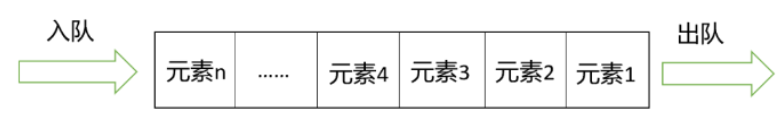


**什么是消息队列：**

消息队列（Message Queue），从广义上讲是一种消息队列服务中间件，提供一套完整的信息生产、传递、消费的软件系统。


### 2, 为什么需要消息队列


**应用解耦：**

系统的耦合性越高，容错性就越低。以电商应用为例，用户创建订单后，如果耦合调用库存系统、物流系统、支付系统，任何一个子系统出了故障或者因为升级等原因暂时不可用，都会造成下单操作异常，影响用户使用体验。

串行方式注册流程：


异步解耦方式：

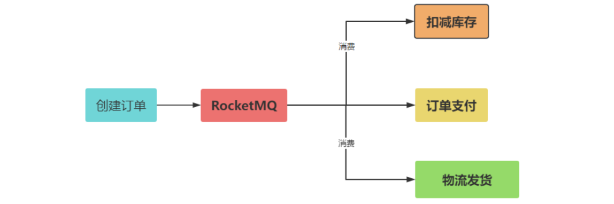

**流量削峰：**

应用系统如果遇到系统请求流量的瞬间猛增，有可能会将系统压垮。有了消息队列可以将大量请求缓存起来，分散到很长一段时间处理，这样可以大大提高系统的稳定性和用户体验。 举例：业务系统正常时段的QPS如果是1000，流量最高峰是10000，为了应对流量高峰配置高性能的服务器显然不划算，这时可以使用消息队列对峰值流量削峰。

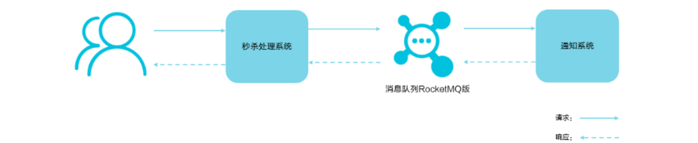


### 3, 常见消息队列

| 特性              | ActiveMQ                                                     | RabbitMQ                                                     | RocketMQ                                                     | Kafka                                                        |
| ----------------- | ------------------------------------------------------------ | ------------------------------------------------------------ | ------------------------------------------------------------ | ------------------------------------------------------------ |
| producer-consumer | 支持                                                         | 支持                                                         | 支持                                                         | 支持                                                         |
| 发布-订阅         | 支持                                                         | 支持                                                         | 支持                                                         | 支持                                                         |
| API完备性         | 高                                                           | 高                                                           | 高                                                           | 高                                                           |
| 多语言支持        | 支持,Java优先                                                | 语言无关                                                     | 只支持Java                                                   | 支持,Java优先                                                |
| 单机吞吐量        | 万级                                                         | 万级                                                         | 万级                                                         | 十万级                                                       |
| 消息延迟          |                                                              | 微秒级                                                       | 毫秒级                                                       | 毫秒级                                                       |
| 可用性            | 高（主从）                                                   | 高（主从）                                                   | 非常高（分布式）                                             | 非常高（分布式）                                             |
| 消息丢失          | 低                                                           | 低                                                           | 理论上不会丢失                                               | 理论上不会丢失                                               |
| 消息重复          |                                                              | 可控制                                                       |                                                              | 理论上会有重复                                               |
| 文档完备性        | 高                                                           | 高                                                           | 高                                                           | 高                                                           |
| 提供快速入门      | 有                                                           | 有                                                           | 有                                                           | 有                                                           |
| 部署难度          |                                                              | 低                                                           | 低                                                           | 中                                                           |
| 社区活跃度        | 高                                                           | 高                                                           | 中                                                           | 高                                                           |
| 商业支持          | 无                                                           | 无                                                           | 阿里云                                                       | 无                                                           |
| 成熟度            | 成熟                                                         | 成熟                                                         | 成熟                                                         | 成熟（日志领域）                                             |
| 特点              | 功能齐全，大量项目使用                                       | 借助于erlang语言并发能力，性能高                             | 各环节分布式设计，主从HA，支持上万队列，多种消费模式，性能好 |                                                              |
| 支行协议          | openwire,stomp,rest,xmpp,amqp                                | amqp                                                         | 自定义的一套（社区提供JMS--不成熟）                          |                                                              |
| 持久化            | 内存,文件,数据库                                             | 内存,文件                                                    | 磁盘文件                                                     |                                                              |
| 事务              | 支持                                                         | 支持                                                         | 支持                                                         |                                                              |
| 负载均衡          | 支持                                                         | 支持                                                         | 支持                                                         |                                                              |
| 管理界面          | 一般                                                         | 好                                                           | 有web console实现                                            |                                                              |
| 部署方式          | 独立，嵌入                                                   | 独立                                                         | 独立                                                         |                                                              |
| 评价              | **优点**：成熟的产品，已经在很多公司应用但规模不大，各种协议支持较好，有多重语言的客户端；**缺点**：其重点已放到activemq6.0产品appollo上去了，目前社区不活跃，且对5.x的维护较少；不适用于上千队列场景 | **优点**：由于erlang语言的特点，产品性能较好，在互联网公司有较大规模应用，支持amqp协议，有多语言且支持amqp的客户端可用；**缺点**：erlang语言难度大，集群不支持动态扩展 | **优点**：模型简单，接口易用，在阿里大规模应用；性能好，可大量堆积消息在broker中，支持多种消费，包括集群消费，广播消费，开发活跃度高，版本更新快；**缺点**：没有在mq核心中实现JMS等接口，有些系统要迁移需要修改大量代码；支持的客户端语言不多，目前是java及c++，其中c++不成熟； | **优点**：性能卓越，单机写入TPS约在百万条/秒，最大的优点，就是吞吐量高。在日志领域比较成熟，被多家公司和多个开源项目使用；**缺点**：Kafka单机超过64个队列/分区，Load会发生明显的飙高现象，队列越多，load越高，发送消息响应时间变长；消费失败不支持重试；支持消息顺序，但是一台代理宕机后，就会产生消息乱序；社区更新较慢； |


### 4, 什么是RocketMQ

RocketMQ是一个纯Java、分布式、队列模型的开源消息中间件，前身是MetaQ，是阿里参考Kafka特点研发的一个队列模型的消息中间件，后开源给apache基金会成为了apache的顶级开源项目，具有高性能、高可靠、高实时、分布式特点。


**历史：**

- **2010年**：阿里巴巴B2B部门基于ActiveMQ的5.1版本也开发了自己的一款消息引擎，称为Napoli，这款消息引擎在B2B里面广泛地被使用，不仅仅是在交易领域，在很多的后台异步解耦等方面也得到了广泛的应用。
- **2011年**：业界出现了现在被很多大数据领域所推崇的Kafka消息引擎，阿里巴巴在研究了Kafka的整体机制和架构设计之后，基于Kafka的设计使用Java进行了完全重写并推出了**MetaQ 1.0**版本，主要是用于解决顺序消息和海量堆积的问题。
- **2012年**：阿里巴巴开源其自研的第三代分布式消息中间件——**RocketMQ**。经过几年的技术打磨，阿里称基于RocketMQ技术，目前双十一当天消息容量可达到万亿级。
- **2016年11月**：阿里将RocketMQ捐献给**Apache**软件基金会，正式成为孵化项目。阿里称会将其打造成顶级项目。**这是阿里迈出的一大步**，因为加入到开源软件基金会需要经过评审方的考核与观察。
- **2017年2月20日**：RocketMQ正式发布4.0版本，专家称新版本适用于电商领域，金融领域，大数据领域，兼有物联网领域的编程模型。


在备战2016年双十一时，**RocketMq**团队重点做了**两件事情**，优化慢请求与统一存储引擎。

- **优化慢请求**：这里主要是解决在海量高并发场景下降低慢请求对整个集群带来的抖动，**毛刺问题**。这是一个极具挑战的技术活，团队同学经过长达1个多月的跟进调优，从双十一的复盘情况来看，99.996%的延迟落在了10ms以内，**而99.6%的延迟在1ms以内**。优化主要集中在**RocketMQ**存储层算法优化、JVM与操作系统调优。
- **统一存储引擎**：主要解决的消息引擎的高可用，成本问题。在多代消息引擎共存的前提下，我们对Notify的存储模块进行了全面移植与替换。


应用场景：

> RocketMQ在阿里集团也被广泛应用在订单，交易，充值，流计算，消息推送，日志流式处理，binglog分发等场景。


**所拥有的功能：**

- 是一个队列模型的消息中间件，具有高性能、高可靠、高实时、分布式特点；
- Producer、Consumer、队列都可以分布式；
- Producer向一些队列轮流发送消息，队列集合称为Topic，Consumer如果做广播消费，则一个consumer实例消费这个Topic对应的所有队列，如果做集群消费，则多个Consumer实例平均消费这个topic对应的队列集合；
- 能够保证严格的消息顺序；
- 提供丰富的消息拉取模式；
- 高效的订阅者水平扩展能力；
- 实时的消息订阅机制；
- 亿级消息堆积能力；
- 较少的依赖。


### 5, RocketMQ概念术语


**生产者和消费者：**

生产者负责生产消息，一般由业务系统负责生产消息，消费者即后台系统，它负责消费消息。

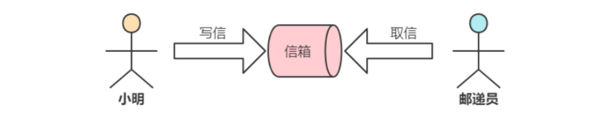


**消息模型（Message Model）：**

消息模型主要有队列模型和发布订阅模型，RabbitMQ采用的是队列模型，如下图所示

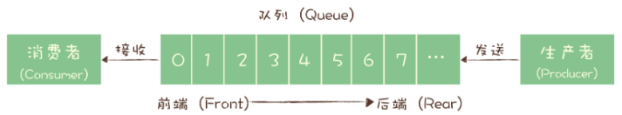


RocketMQ采用发布订阅模型，模型如图所示：


**主题（Topic）：**


表示一类消息的集合，每个主题包含若干条消息，每条消息只能属于一个主题，是RocketMQ进行消息订阅的基本单位。


**队列：**

存储消息的物理实体。一个Topic中可以包含多个Queue，每个Queue中存放的就是该Topic的消息。一个Topic的Queue也被称为一个Topic中消息的分区（Partition）。

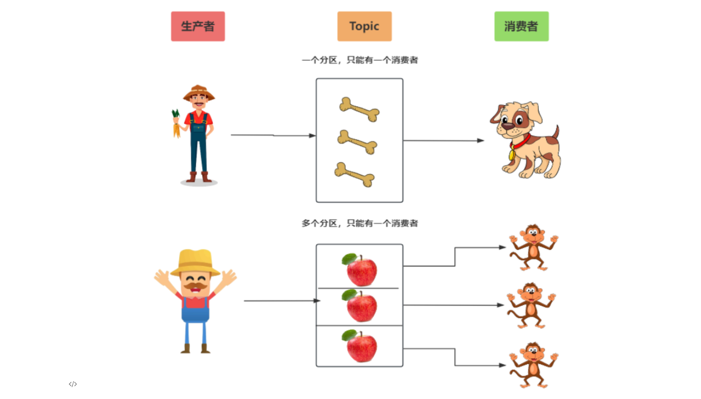


### 6, 技术架构

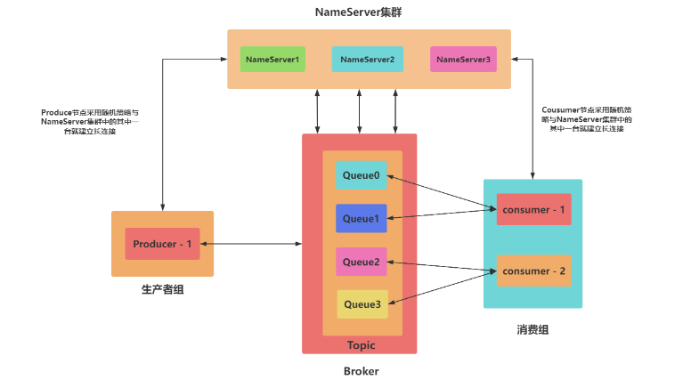


RocketMQ架构上主要分为四部分，如上图所示：


**NameServer：**

NameServer是一个Broker与Topic路由的注册中心，支持Broker的动态注册与发现。包括两个功能

- Broker管理：接受Broker集群的注册信息并且保存下来作为路由信息的基本数据；提供心跳检测机制，检查Broker是否还存活。
- 路由信息管理：每个NameServer中都保存着Broker集群的整个路由信息和用于客户端查询的队列信息。Producer和Conumser通过NameServer可以获取整个Broker集群的路由信息，从而进行消息的投递和消费。

> 1、路由发现
>
> 2、路由剔除
>
> 3、路由注册
>
> 4、客户端选择NameServer的策略


**Broker:**

Broker充当着消息的中转角色，负责存储消息、转发消息。Broker在RocketMQ系统中负责接收并存储从生产者发送来的消息，同时为消费者的拉取请求作准备。Broker同时也存储着消息相关的元数据，包括 消费者组消费进度偏移offset、主题、队列等。


**Producer:**

消息生产者，负责生产消息。Producer通过MQ的负载均衡模块选择相应的Broker集群队列(先选择Broker，再选择队列)进行消息投递，投递的过程支持快速失败并且低延迟。

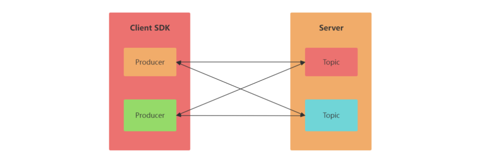


**Consumer:**

消息消费者，负责消费消息。一个消息消费者会从Broker服务器中获取到消息，并对消息进行相关业务处理。

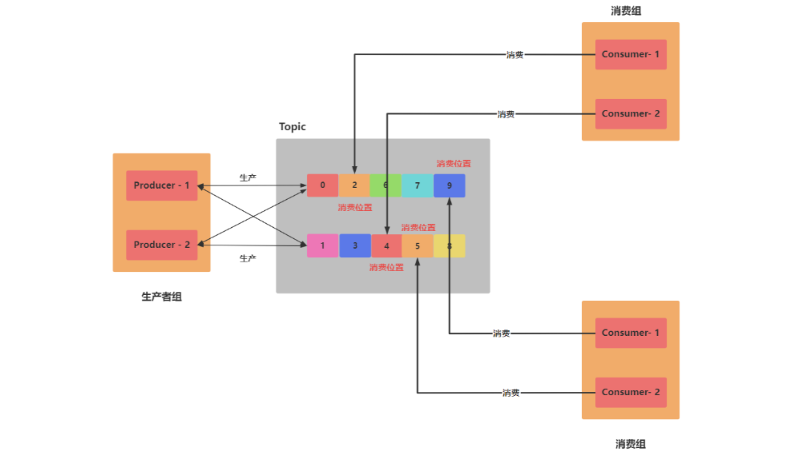

RocketMQ中的消息消费者都是以消费者组（ConsumerGroup）的形式出现的。消费者组是同一类消费者的集合，这类Consumer消费的是相同Topic类型（可以是一个，可以是多个，但是要相同）、并且是相同的tag（可以是一个，可以是多个，但是要相同）（保证订阅关系的一致性）。消费者组使得在消息消费方面，容易实现。

### 7, 环境搭建与测试

准备安装包：

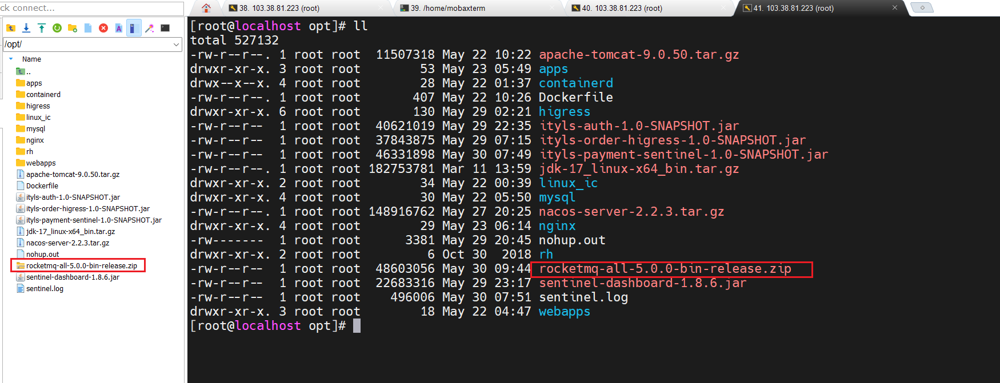


解压：

```
unzip rocketmq-all-5.0.0-bin-release.zip
```

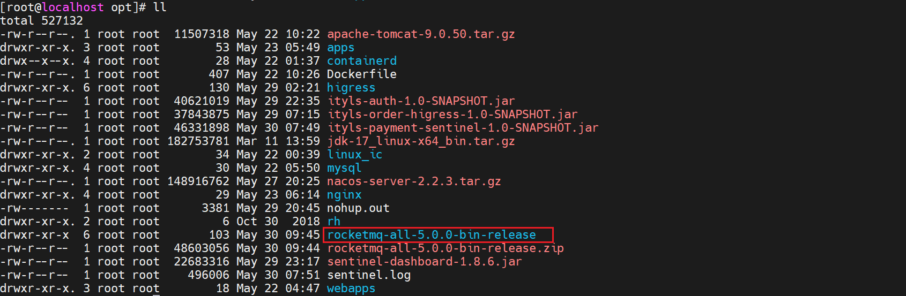


重命名，移动：

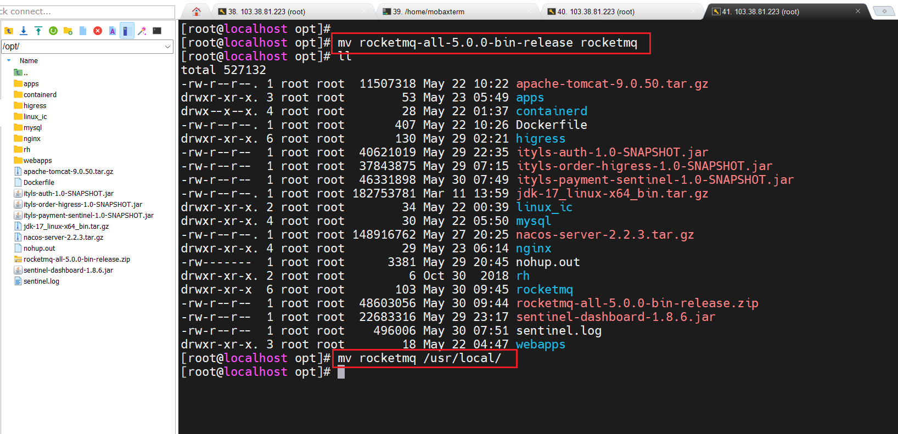


配置环境变量：

```
vim /etc/profile
# 文件末尾追加改信息

export ROCKETMQ_HOME=/usr/local/rocketmq
export JAVA_HOME=/usr/local/jdk-17.0.11
export PATH=$PATH:${JAVA_HOME}/bin:$ROCKETMQ_HOME/bin

# 生效环境变量
source /etc/profile
```


启动NameServer:

```
nohup sh mqnamesrv &
```

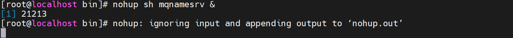


启动broker

```
nohup sh ./mqbroker -n localhost:9876 &
```

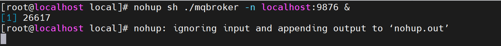


结果：

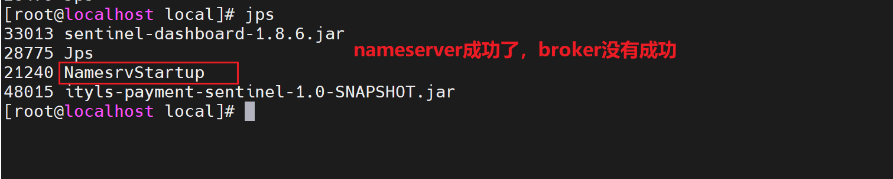


看日志：

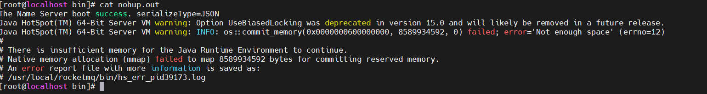


解决步骤一：

```
添加启动参数

修改runbroker文件，添加红色参数 $JAVA ${JAVA_OPT} --add-exports=java.base/sun.nio.ch=ALL-UNNAMED $@
```

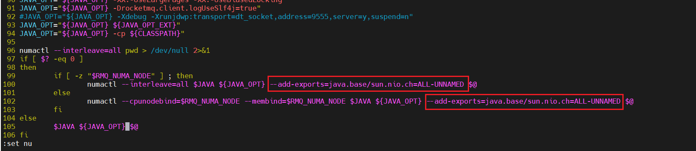


步骤二：堆空间初始值太大也报错，修改文件runbroker.sh

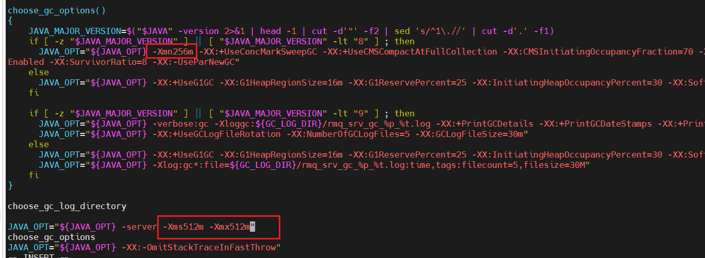

通过上述修改，将初始堆内存512M，最大堆内存设置为512M，新生代（Java中用于存储创建对象的部分）设置为256M,修改完成后便可以正常启动以及查看日志。


再次测试：

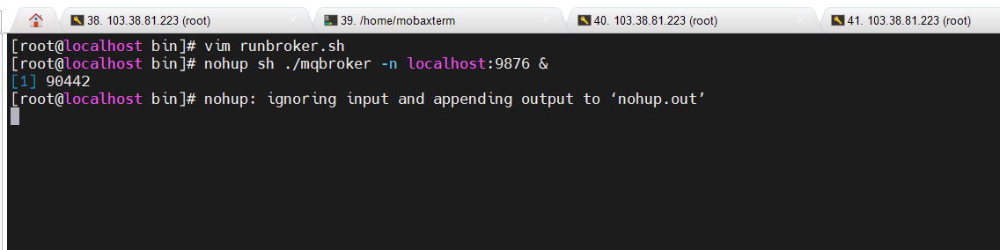

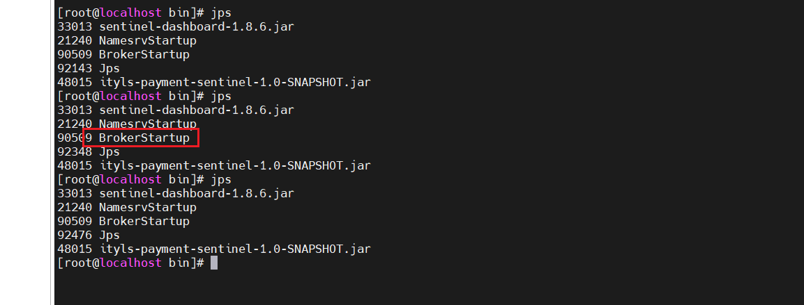


### 8, RocketMQ管理命令


RockerMQ管理命令：

- updateTopic
- topicStatus
- topicList
- deleteTopic
- cleanUnusedTopic


**updateTopic:**

- **作用**：修改或创建一个Topic

- **命令**：mqadmin updateTopic -b | -c [-h] [-n ] [-o ] [-p ] [-r ] [-s ] -t [-u ] [-w ]

参数：

- -n: name server地址列表
- -c: cluster 名称，表示topic 建在该集群
- -t: 设置topic名称
- -h: 打印help信息
- -o: 设置topic是否为有序的 取值：true、false(默认)
- -p: 设置topic的权限


示例：

```
mqadmin updateTopic -n localhost:9876 -c DefaultCluster -t testtopic
```

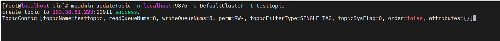


**deleteTopic**

- **作用**：从broker和nameserver删除topic

- **命令**：mqadmin deleteTopic -c [-h] [-n ] -t

参数：

- -n: name server地址列表
- -c: cluster 名称，表示topic 建在该集群
- -t: 设置topic名称
- -h: 打印help信息


示例：

```
mqadmin deleteTopic -n localhost:9876 -c DefaultCluster -t testtopic
```

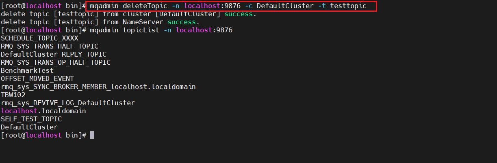


**topicList:**

- **作用**：从nameserver列出所有topic

- **命令**：mqadmin topicList [-c] [-h] [-n ]

参数：

- -n: name server地址列表
- -c: cluster 名称，表示topic 建在该集群
- -h: 打印help信息

示例：

```
mqadmin topicList -n localhost:9876
```

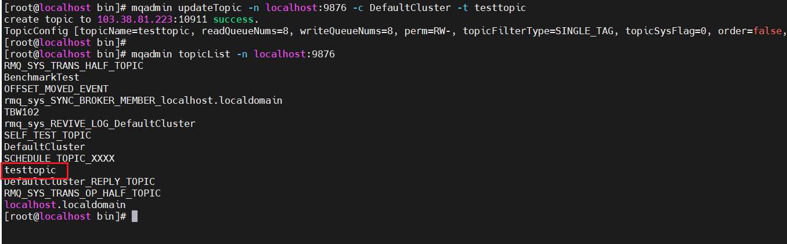


**topicStatus:**

- **作用**：检查topic的状态信息

- **命令**：mqadmin topicStatus [-h] [-n ] -t

参数：

- -n: name server地址列表
- -c: cluster 名称，表示topic 建在该集群
- -t: 设置topic名称
- -h: 打印help信息

示例：

```
mqadmin topicStatus -n localhost:9876 -t testtopic
```

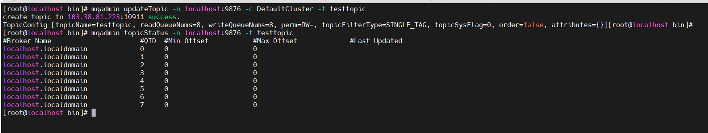


**cleanUnusedTopic:**

- **作用**：清理未使用的topic

- **命令**：mqadmin cleanUnusedTopic [-b ] [-c ] [-h] [-n ]

参数：

- -n: name server地址列表
- -b: broker地址
- -c: 集群名称
- -h: 打印help信息

示例：

```
mqadmin cleanUnusedTopic -n localhost:9876 -t testtopic
```


**关闭namesrv和broker服务**

```
mqshutdown namesrv
mqshutdown broker
```

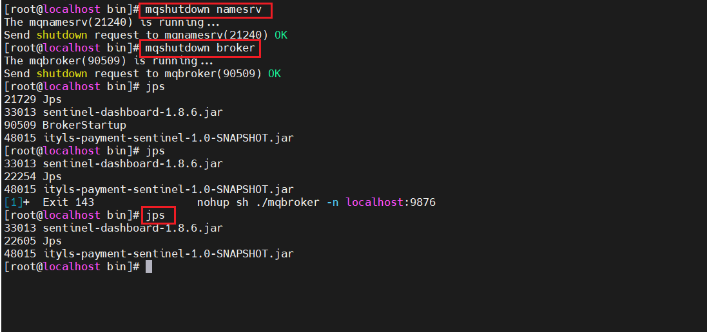


### 9, 发消息_普通消息之发送消息

目标：把消息发送给MQ


准备Topic:

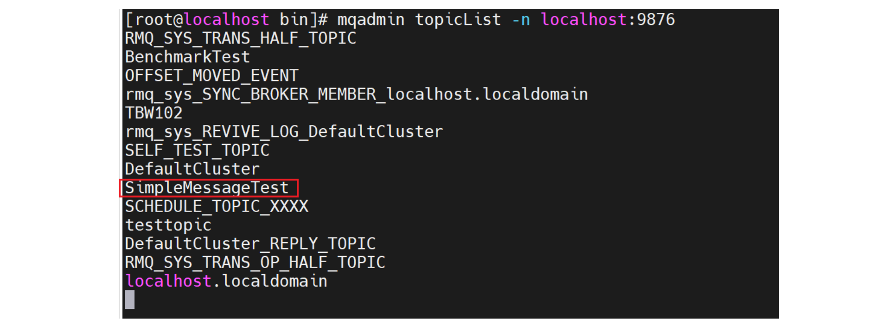


创建子模块：

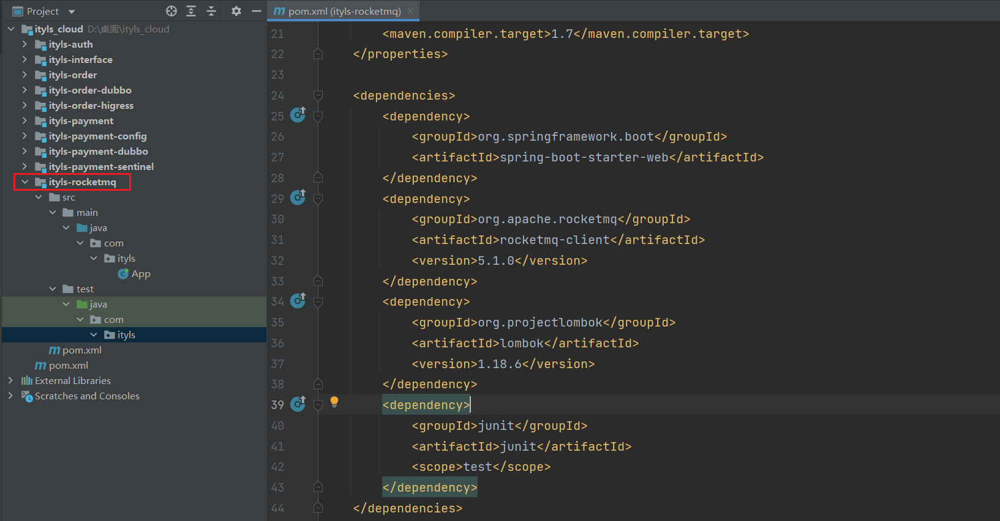


依赖：

```xml
    <dependencies>
        <dependency>
            <groupId>org.springframework.boot</groupId>
            <artifactId>spring-boot-starter-web</artifactId>
        </dependency>
        <dependency>
            <groupId>org.apache.rocketmq</groupId>
            <artifactId>rocketmq-client</artifactId>
            <version>5.1.0</version>
        </dependency>
        <dependency>
            <groupId>org.projectlombok</groupId>
            <artifactId>lombok</artifactId>
            <version>1.18.6</version>
        </dependency>
        <dependency>
            <groupId>junit</groupId>
            <artifactId>junit</artifactId>
            <scope>test</scope>
        </dependency>
    </dependencies>
```


启动rocketmq:

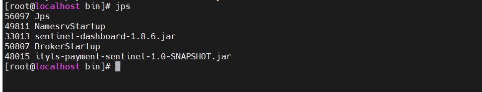


发消息：

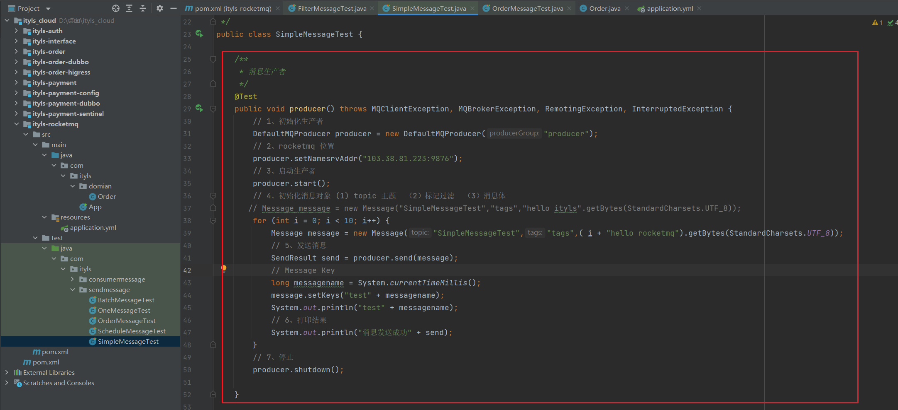

```java
package com.ityls.sendmessage;

import org.apache.rocketmq.client.consumer.DefaultMQPushConsumer;
import org.apache.rocketmq.client.consumer.listener.ConsumeConcurrentlyContext;
import org.apache.rocketmq.client.consumer.listener.ConsumeConcurrentlyStatus;
import org.apache.rocketmq.client.consumer.listener.MessageListenerConcurrently;
import org.apache.rocketmq.client.exception.MQBrokerException;
import org.apache.rocketmq.client.exception.MQClientException;
import org.apache.rocketmq.client.producer.DefaultMQProducer;
import org.apache.rocketmq.client.producer.SendResult;
import org.apache.rocketmq.common.message.Message;
import org.apache.rocketmq.common.message.MessageExt;
import org.apache.rocketmq.remoting.exception.RemotingException;
import org.junit.Test;

import java.nio.charset.StandardCharsets;
import java.util.List;

/**
 * 1、普通消息
 * 普通消息也叫并发消息。发送效率最高，使用最多一种
 */
public class SimpleMessageTest {

    /**
     * 消息生产者
     */
    @Test
    public void producer() throws MQClientException, MQBrokerException, RemotingException, InterruptedException {
        // 1、初始化生产者
        DefaultMQProducer producer = new DefaultMQProducer("producer");
        // 2、rocketmq 位置
        producer.setNamesrvAddr("103.38.81.223:9876");
        // 3、启动生产者
        producer.start();
        // 4、初始化消息对象 (1) topic 主题  （2）标记过滤  （3）消息体
       // Message message = new Message("SimpleMessageTest","tags","hello ityls".getBytes(StandardCharsets.UTF_8));
        for (int i = 0; i < 10; i++) {
            Message message = new Message("SimpleMessageTest","tags",( i + "hello rocketmq").getBytes(StandardCharsets.UTF_8));
            // 5、发送消息
            SendResult send = producer.send(message);
            // Message Key
            long messagename = System.currentTimeMillis();
            message.setKeys("test" + messagename);
            System.out.println("test" + messagename);
            // 6、打印结果
            System.out.println("消息发送成功" + send);
        }
        // 7、停止
        producer.shutdown();
    }
}
```


测试：

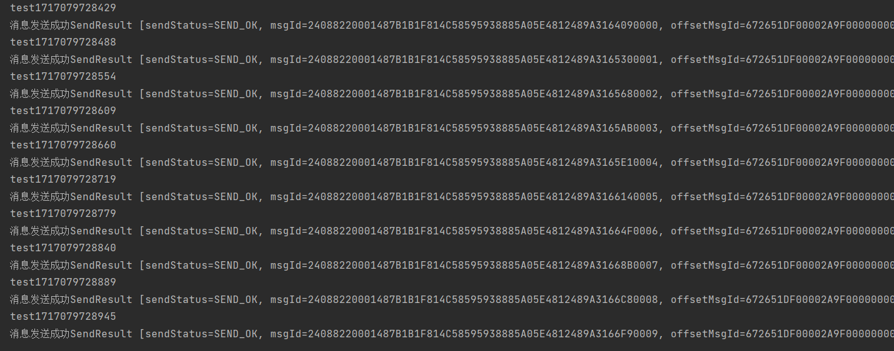


### 10, 发消息_普通消息之消费消息

目标：读MQ中的消息


直接上代码：

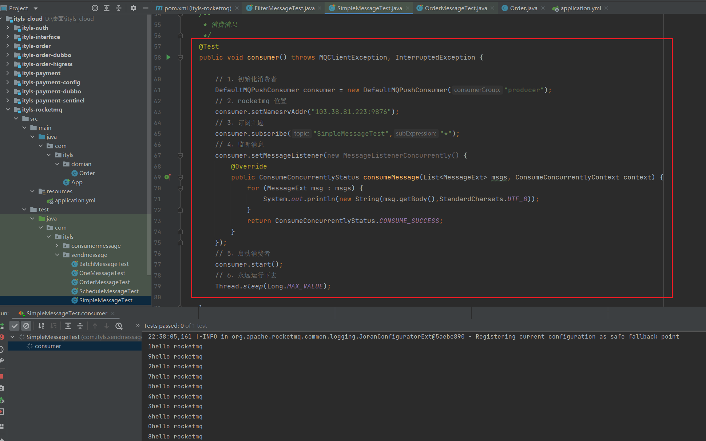


```java
   /**
     * 消费消息
     */
    @Test
    public void consumer() throws MQClientException, InterruptedException {

        // 1、初始化消费者
        DefaultMQPushConsumer consumer = new DefaultMQPushConsumer("producer");
        // 2、rocketmq 位置
        consumer.setNamesrvAddr("103.38.81.223:9876");
        // 3、订阅主题
        consumer.subscribe("SimpleMessageTest","*");
        // 4、监听消息
        consumer.setMessageListener(new MessageListenerConcurrently() {
            @Override
            public ConsumeConcurrentlyStatus consumeMessage(List<MessageExt> msgs, ConsumeConcurrentlyContext context) {
                for (MessageExt msg : msgs) {
                    System.out.println(new String(msg.getBody(),StandardCharsets.UTF_8));
                }
                return ConsumeConcurrentlyStatus.CONSUME_SUCCESS;
            }
        });
        // 5、启动消费者
        consumer.start();
        // 6、永远运行下去
        Thread.sleep(Long.MAX_VALUE);

    }
```


完整代码：

```java
package com.ityls.sendmessage;

import org.apache.rocketmq.client.consumer.DefaultMQPushConsumer;
import org.apache.rocketmq.client.consumer.listener.ConsumeConcurrentlyContext;
import org.apache.rocketmq.client.consumer.listener.ConsumeConcurrentlyStatus;
import org.apache.rocketmq.client.consumer.listener.MessageListenerConcurrently;
import org.apache.rocketmq.client.exception.MQBrokerException;
import org.apache.rocketmq.client.exception.MQClientException;
import org.apache.rocketmq.client.producer.DefaultMQProducer;
import org.apache.rocketmq.client.producer.SendResult;
import org.apache.rocketmq.common.message.Message;
import org.apache.rocketmq.common.message.MessageExt;
import org.apache.rocketmq.remoting.exception.RemotingException;
import org.junit.Test;

import java.nio.charset.StandardCharsets;
import java.util.List;

/**
 * 1、普通消息
 * 普通消息也叫并发消息。发送效率最高，使用最多一种
 */
public class SimpleMessageTest {

    /**
     * 消息生产者
     */
    @Test
    public void producer() throws MQClientException, MQBrokerException, RemotingException, InterruptedException {
        // 1、初始化生产者
        DefaultMQProducer producer = new DefaultMQProducer("producer");
        // 2、rocketmq 位置
        producer.setNamesrvAddr("103.38.81.223:9876");
        // 3、启动生产者
        producer.start();
        // 4、初始化消息对象 (1) topic 主题  （2）标记过滤  （3）消息体
       // Message message = new Message("SimpleMessageTest","tags","hello ityls".getBytes(StandardCharsets.UTF_8));
        for (int i = 0; i < 10; i++) {
            Message message = new Message("SimpleMessageTest","tags",( i + "hello rocketmq").getBytes(StandardCharsets.UTF_8));
            // 5、发送消息
            SendResult send = producer.send(message);
            // Message Key
            long messagename = System.currentTimeMillis();
            message.setKeys("test" + messagename);
            System.out.println("test" + messagename);
            // 6、打印结果
            System.out.println("消息发送成功" + send);
        }
        // 7、停止
        producer.shutdown();

    }

    /**
     * 消费消息
     */
    @Test
    public void consumer() throws MQClientException, InterruptedException {

        // 1、初始化消费者
        DefaultMQPushConsumer consumer = new DefaultMQPushConsumer("producer");
        // 2、rocketmq 位置
        consumer.setNamesrvAddr("103.38.81.223:9876");
        // 3、订阅主题
        consumer.subscribe("SimpleMessageTest","*");
        // 4、监听消息
        consumer.setMessageListener(new MessageListenerConcurrently() {
            @Override
            public ConsumeConcurrentlyStatus consumeMessage(List<MessageExt> msgs, ConsumeConcurrentlyContext context) {
                for (MessageExt msg : msgs) {
                    System.out.println(new String(msg.getBody(),StandardCharsets.UTF_8));
                }
                return ConsumeConcurrentlyStatus.CONSUME_SUCCESS;
            }
        });
        // 5、启动消费者
        consumer.start();
        // 6、永远运行下去
        Thread.sleep(Long.MAX_VALUE);

    }


}
```


### 11, 发消息_顺序消息之全局消息

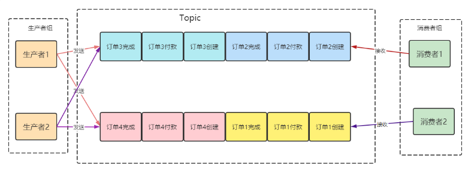

**什么是顺序消息：**

消息有序指的是，消费者端消费消息时，需按照消息的发送顺序来消费，即先发送的消息，需要先消费(FIFO)。

例子：

> 通常创建订单后，会经历一系列的操作：【订单创建 -> 订单支付 -> 订单发货 -> 订单配送 -> 订单完成】。在创建完订单后，会发送五条消息到MQ Broker中，消费的时候要按照【订单创建 -> 订单支付 -> 订单发货 -> 订单配送 -> 订单完成】这个顺序去消费，这样的订单才是有效的。


**顺序消息的原理:**

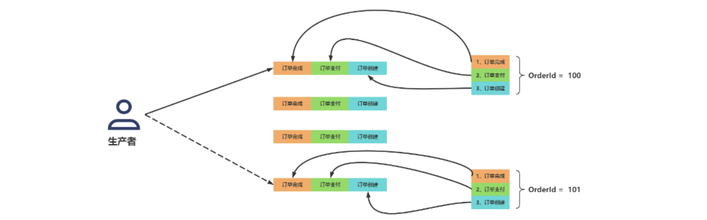

在默认的情况下，消息发送会采取Round Robin轮询方式把消息发送到不同的queue；而消费消息的时候从多个queue上拉取消息，这种情况发送和消费是不能保证顺序的。但是如果控制发送的顺序消息只依次发送到同一个queue中，消费的时候只从这个queue上依次拉取，则就保证了顺序。当发送和消费参与的queue只有一个，则是全局有序；如果多个queue参与，则为分区有序，即相对每个queue，消息都是有序的。


**全局顺序消息:**

全局顺序消息的话，我们需要将所有消息都发送到同一个队列，然后消费者端也订阅同一个队列，这样就能实现顺序消费消息的功能。下面通过一个示例说明如何实现全局顺序消息。


生产者发送消息(全局消息 -  发送和消费参与的队列只有一个)：

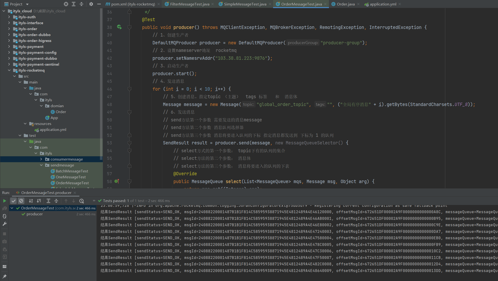

```java
    @Test
    public void producer() throws MQClientException, MQBrokerException, RemotingException, InterruptedException {
        // 1、创建生产者
        DefaultMQProducer producer = new DefaultMQProducer("producer-group");
        // 2、设置nameserver地址  rocketmq
        producer.setNamesrvAddr("103.38.81.223:9876");
        // 3、启动生产者
        producer.start();
        // 4、发送消息
        for (int i = 0; i < 10; i++) {
            // 5、创建消息。指定topic （主题）  tags 标签   和  消息体
            Message message = new Message("global_order_topic", "", ("全局有序消息" + i).getBytes(StandardCharsets.UTF_8));
            // 6、发送消息
            // send方法第一个参数 需要发送的消息message
            // send方法第二个参数 消息队列选择器
            // send方法第三个参数 消息将要进入队列的下标 指定消息都发送到 下标为 1 的队列
            SendResult result = producer.send(message, new MessageQueueSelector() {
                // select方式的第一个参数： topic下有的队列的集合
                // select方法的第二个参数： 消息体
                // select方法的第三个参数： 消息将要进入的队列的下表
                @Override
                public MessageQueue select(List<MessageQueue> mqs, Message msg, Object arg) {
                    return mqs.get((Integer) arg);
                }
            }, 1);
            System.out.println("结果" + result);
        }

        // 如果不在发送消息了 关闭生产者实列
        producer.shutdown();

    }
```


消费者，直接复制普通消息的消费者：

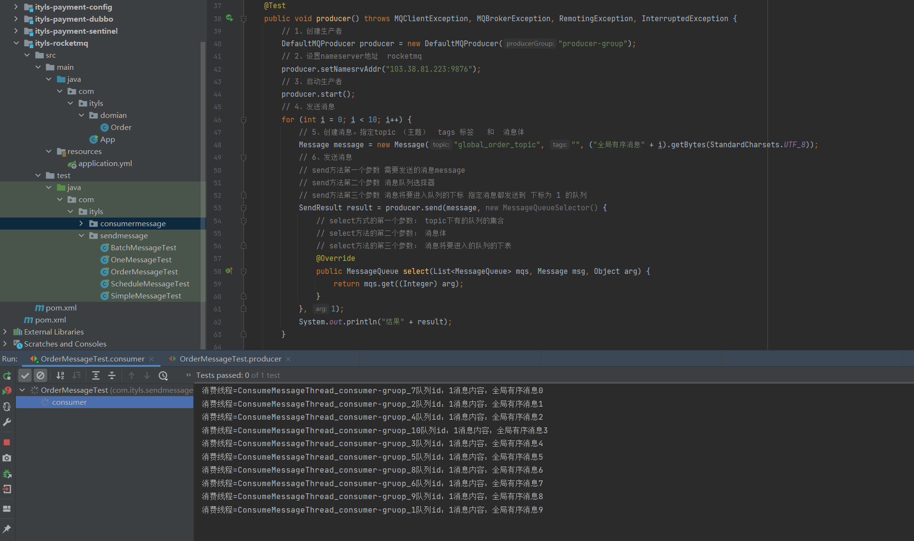

```java
    /**
     * 消费消息
     */
    @Test
    public void consumer() throws MQClientException, InterruptedException {

        // 1、初始化消费者
        DefaultMQPushConsumer consumer = new DefaultMQPushConsumer("consumer-gruop");
        // 2、rocketmq 位置
        consumer.setNamesrvAddr("103.38.81.223:9876");
        // 3、订阅主题
        consumer.subscribe("global_order_topic","*");
        // 4、监听消息
        consumer.setMessageListener(new MessageListenerConcurrently() {
            @Override
            public ConsumeConcurrentlyStatus consumeMessage(List<MessageExt> msgs, ConsumeConcurrentlyContext context) {
                for (MessageExt msg : msgs) {
                    System.out.println("消费线程=" + Thread.currentThread().getName() + "队列id：" + msg.getQueueId() + "消息内容：" + new String(msg.getBody(),StandardCharsets.UTF_8));
                }
                return ConsumeConcurrentlyStatus.CONSUME_SUCCESS;
            }
        });
        // 5、启动消费者
        consumer.start();
        // 6、永远运行下去
        Thread.sleep(Long.MAX_VALUE);
    }
```


### 12, 发消息_顺序消息之局部消息

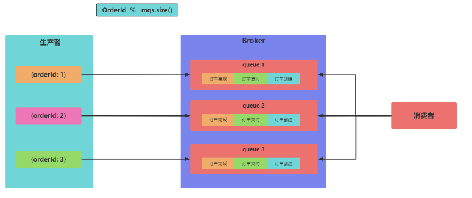


订单实体类：

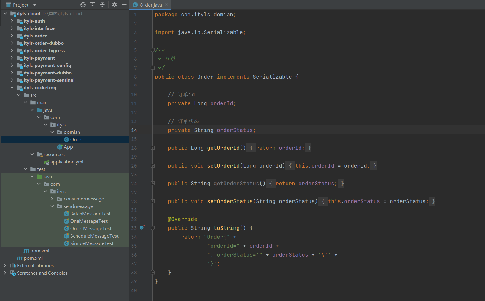

```java
package com.ityls.domian;

import java.io.Serializable;

/**
 * 订单
 */
public class Order implements Serializable {

    // 订单id
    private Long orderId;

    // 订单状态
    private String orderStatus;

    public Long getOrderId() {
        return orderId;
    }

    public void setOrderId(Long orderId) {
        this.orderId = orderId;
    }

    public String getOrderStatus() {
        return orderStatus;
    }

    public void setOrderStatus(String orderStatus) {
        this.orderStatus = orderStatus;
    }

    @Override
    public String toString() {
        return "Order{" +
                "orderId=" + orderId +
                ", orderStatus='" + orderStatus + '\'' +
                '}';
    }
}
```


模拟一起订单：

```java
    /**
     * 订单状态变更流程    订单创建  -> 订单已支付   -> 订单完成
     * @return
     */
    public static  List<Order> getOrderList(){
        List<Order> orderList = new ArrayList<>();

        Order order = new Order();
        order.setOrderId(1L);
        order.setOrderStatus("订单创建");
        orderList.add(order);

        order = new Order();
        order.setOrderId(2L);
        order.setOrderStatus("订单创建");
        orderList.add(order);

        order = new Order();
        order.setOrderId(1L);
        order.setOrderStatus("订单已支付");
        orderList.add(order);


        order = new Order();
        order.setOrderId(2L);
        order.setOrderStatus("订单已支付");
        orderList.add(order);


        order = new Order();
        order.setOrderId(2L);
        order.setOrderStatus("订单完成");
        orderList.add(order);


        order = new Order();
        order.setOrderId(3L);
        order.setOrderStatus("订单创建");
        orderList.add(order);

        order = new Order();
        order.setOrderId(4L);
        order.setOrderStatus("订单创建");
        orderList.add(order);


        order = new Order();
        order.setOrderId(3L);
        order.setOrderStatus("订单已支付");
        orderList.add(order);

        order = new Order();
        order.setOrderId(1L);
        order.setOrderStatus("订单完成");
        orderList.add(order);


        order = new Order();
        order.setOrderId(4L);
        order.setOrderStatus("订单已支付");
        orderList.add(order);

        order = new Order();
        order.setOrderId(3L);
        order.setOrderStatus("订单完成");
        orderList.add(order);

        order = new Order();
        order.setOrderId(4L);
        order.setOrderStatus("订单完成");
        orderList.add(order);

        return orderList;

    }
```


生产者：

```java
    /**
     * 顺序消息 - 局部消息
     */
    @Test
    public  void orderMqProduce() throws MQClientException, MQBrokerException, RemotingException, InterruptedException {
        // 1、创建生产者  jubu_order_topic
        DefaultMQProducer producer = new DefaultMQProducer("producer-group");
        // 2、设置nameserver地址  rocketmq
        producer.setNamesrvAddr("103.38.81.223:9876");
        // 3、启动生产者
        producer.start();
        // 4、发送消息
        List<Order> orderList = getOrderList();
        for (int i = 0; i < orderList.size(); i++) {
                // 消息
                String body = "["+orderList.get(i) + "]订单状态变更信息";
                //5、创建消息
            Message message = new Message("jubu_order_topic", "", body.getBytes(StandardCharsets.UTF_8));
            // 6、发送消息
            producer.send(message, new MessageQueueSelector() {
                @Override
                public MessageQueue select(List<MessageQueue> mqs, Message msg, Object arg) {
                    //  根据  arg（就是订单id）
                   long index =  (Long)arg % mqs.size();
                    return mqs.get((int) index);
                }
                // 第三个参数 send ： 队列下标
            }, orderList.get(i).getOrderId() );
        }
        // 如果不在发送消息了 关闭生产者实列
        producer.shutdown();
    }

```


消费者：

```java
    /**
     * 消费消息
     */
    @Test
    public void consumer() throws MQClientException, InterruptedException {

        // 1、初始化消费者
        DefaultMQPushConsumer consumer = new DefaultMQPushConsumer("consumer-gruop");
        // 2、rocketmq 位置
        consumer.setNamesrvAddr("103.38.81.223:9876");
        // 3、订阅主题
        consumer.subscribe("jubu_order_topic","*");
        // 4、监听消息
        consumer.setMessageListener(new MessageListenerConcurrently() {
            @Override
            public ConsumeConcurrentlyStatus consumeMessage(List<MessageExt> msgs, ConsumeConcurrentlyContext context) {
                for (MessageExt msg : msgs) {
                    System.out.println("消费线程=" + Thread.currentThread().getName() + "队列id：" + msg.getQueueId() + "消息内容：" + new String(msg.getBody(),StandardCharsets.UTF_8));
                }
                return ConsumeConcurrentlyStatus.CONSUME_SUCCESS;
            }
        });
        // 5、启动消费者
        consumer.start();
        // 6、永远运行下去
        Thread.sleep(Long.MAX_VALUE);

    }
```


测试：

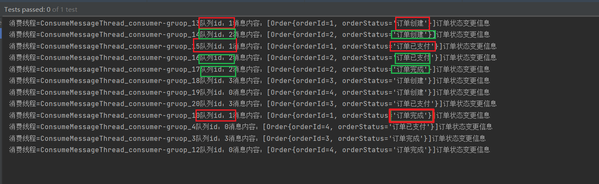


完整代码：

```java
package com.ityls.sendmessage;

import com.ityls.domian.Order;
import org.apache.rocketmq.client.consumer.DefaultMQPushConsumer;
import org.apache.rocketmq.client.consumer.listener.ConsumeConcurrentlyContext;
import org.apache.rocketmq.client.consumer.listener.ConsumeConcurrentlyStatus;
import org.apache.rocketmq.client.consumer.listener.MessageListenerConcurrently;
import org.apache.rocketmq.client.exception.MQBrokerException;
import org.apache.rocketmq.client.exception.MQClientException;
import org.apache.rocketmq.client.producer.DefaultMQProducer;
import org.apache.rocketmq.client.producer.MessageQueueSelector;
import org.apache.rocketmq.client.producer.SendResult;
import org.apache.rocketmq.common.message.Message;
import org.apache.rocketmq.common.message.MessageExt;
import org.apache.rocketmq.common.message.MessageQueue;
import org.apache.rocketmq.remoting.exception.RemotingException;
import org.junit.Test;

import java.nio.charset.StandardCharsets;
import java.util.ArrayList;
import java.util.List;

/**
 * 2、顺序消息
 *    全局消息 -  发送和消费参与的队列只有一个
 */
public class OrderMessageTest {


    /**
     * 全局消息
     * @throws MQClientException
     * @throws MQBrokerException
     * @throws RemotingException
     * @throws InterruptedException
     */
    @Test
    public void producer() throws MQClientException, MQBrokerException, RemotingException, InterruptedException {
        // 1、创建生产者
        DefaultMQProducer producer = new DefaultMQProducer("producer-group");
        // 2、设置nameserver地址  rocketmq
        producer.setNamesrvAddr("103.38.81.223:9876");
        // 3、启动生产者
        producer.start();
        // 4、发送消息
        for (int i = 0; i < 10; i++) {
            // 5、创建消息。指定topic （主题）  tags 标签   和  消息体
            Message message = new Message("global_order_topic", "", ("全局有序消息" + i).getBytes(StandardCharsets.UTF_8));
            // 6、发送消息
            // send方法第一个参数 需要发送的消息message
            // send方法第二个参数 消息队列选择器
            // send方法第三个参数 消息将要进入队列的下标 指定消息都发送到 下标为 1 的队列
            SendResult result = producer.send(message, new MessageQueueSelector() {
                // select方式的第一个参数： topic下有的队列的集合
                // select方法的第二个参数： 消息体
                // select方法的第三个参数： 消息将要进入的队列的下表
                @Override
                public MessageQueue select(List<MessageQueue> mqs, Message msg, Object arg) {
                    return mqs.get((Integer) arg);
                }
            }, 1);
            System.out.println("结果" + result);
        }

        // 如果不在发送消息了 关闭生产者实列
        producer.shutdown();

    }


    /**
     * 顺序消息 - 局部消息
     */
    @Test
    public  void orderMqProduce() throws MQClientException, MQBrokerException, RemotingException, InterruptedException {
        // 1、创建生产者  jubu_order_topic
        DefaultMQProducer producer = new DefaultMQProducer("producer-group");
        // 2、设置nameserver地址  rocketmq
        producer.setNamesrvAddr("103.38.81.223:9876");
        // 3、启动生产者
        producer.start();
        // 4、发送消息
        List<Order> orderList = getOrderList();
        for (int i = 0; i < orderList.size(); i++) {
                // 消息
                String body = "["+orderList.get(i) + "]订单状态变更信息";
                //5、创建消息
            Message message = new Message("jubu_order_topic", "", body.getBytes(StandardCharsets.UTF_8));
            // 6、发送消息
            producer.send(message, new MessageQueueSelector() {
                @Override
                public MessageQueue select(List<MessageQueue> mqs, Message msg, Object arg) {
                    //  根据  arg（就是订单id）
                   long index =  (Long)arg % mqs.size();
                    return mqs.get((int) index);
                }
                // 第三个参数 send ： 队列下标
            }, orderList.get(i).getOrderId() );
        }
        // 如果不在发送消息了 关闭生产者实列
        producer.shutdown();
    }


    /**
     * 订单状态变更流程    订单创建  -》 订单已支付   -》 订单完成
     * @return
     */
    public static  List<Order> getOrderList(){
        List<Order> orderList = new ArrayList<>();

        Order order = new Order();
        order.setOrderId(1L);
        order.setOrderStatus("订单创建");
        orderList.add(order);

        order = new Order();
        order.setOrderId(2L);
        order.setOrderStatus("订单创建");
        orderList.add(order);

        order = new Order();
        order.setOrderId(1L);
        order.setOrderStatus("订单已支付");
        orderList.add(order);


        order = new Order();
        order.setOrderId(2L);
        order.setOrderStatus("订单已支付");
        orderList.add(order);


        order = new Order();
        order.setOrderId(2L);
        order.setOrderStatus("订单完成");
        orderList.add(order);


        order = new Order();
        order.setOrderId(3L);
        order.setOrderStatus("订单创建");
        orderList.add(order);

        order = new Order();
        order.setOrderId(4L);
        order.setOrderStatus("订单创建");
        orderList.add(order);


        order = new Order();
        order.setOrderId(3L);
        order.setOrderStatus("订单已支付");
        orderList.add(order);

        order = new Order();
        order.setOrderId(1L);
        order.setOrderStatus("订单完成");
        orderList.add(order);


        order = new Order();
        order.setOrderId(4L);
        order.setOrderStatus("订单已支付");
        orderList.add(order);

        order = new Order();
        order.setOrderId(3L);
        order.setOrderStatus("订单完成");
        orderList.add(order);

        order = new Order();
        order.setOrderId(4L);
        order.setOrderStatus("订单完成");
        orderList.add(order);

        return orderList;

    }


    /**
     * 消费消息
     */
    @Test
    public void consumer() throws MQClientException, InterruptedException {

        // 1、初始化消费者
        DefaultMQPushConsumer consumer = new DefaultMQPushConsumer("consumer-gruop");
        // 2、rocketmq 位置
        consumer.setNamesrvAddr("103.38.81.223:9876");
        // 3、订阅主题
        consumer.subscribe("jubu_order_topic","*");
        // 4、监听消息
        consumer.setMessageListener(new MessageListenerConcurrently() {
            @Override
            public ConsumeConcurrentlyStatus consumeMessage(List<MessageExt> msgs, ConsumeConcurrentlyContext context) {
                for (MessageExt msg : msgs) {
                    System.out.println("消费线程=" + Thread.currentThread().getName() + "队列id：" + msg.getQueueId() + "消息内容：" + new String(msg.getBody(),StandardCharsets.UTF_8));
                }
                return ConsumeConcurrentlyStatus.CONSUME_SUCCESS;
            }
        });
        // 5、启动消费者
        consumer.start();
        // 6、永远运行下去
        Thread.sleep(Long.MAX_VALUE);

    }

}
```


### 14, 发消息_延迟消息

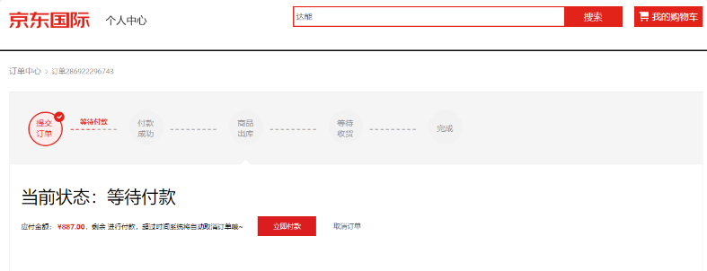


**什么是延迟消息:**

延迟消息顾名思义不是用户能立即消费到的，而是等待一段特定的时间才能收到。


场景：

> 订单下单之后30分钟后，如果用户没有付钱，则系统自动取消订单。


**在RocketMQ中使用延迟消息:**

不像其他延迟消息的实现，客户端可以自定义延迟时间，而RocketMQ则不支持任意时间的延迟，它提供了18个级别（延迟时间选择）。

| 投递等级（delay level） | 延迟时间 | 投递等级（delay level） | 延迟时间 |
| ----------------------- | -------- | ----------------------- | -------- |
| 1                       | 1s       | 10                      | 6min     |
| 2                       | 5s       | 11                      | 7min     |
| 3                       | 10s      | 12                      | 8min     |
| 4                       | 30s      | 13                      | 9min     |
| 5                       | 1min     | 14                      | 10min    |
| 6                       | 2min     | 15                      | 20min    |
| 7                       | 3min     | 16                      | 30min    |
| 8                       | 4min     | 17                      | 1h       |
| 9                       | 5min     | 18                      | 2h       |

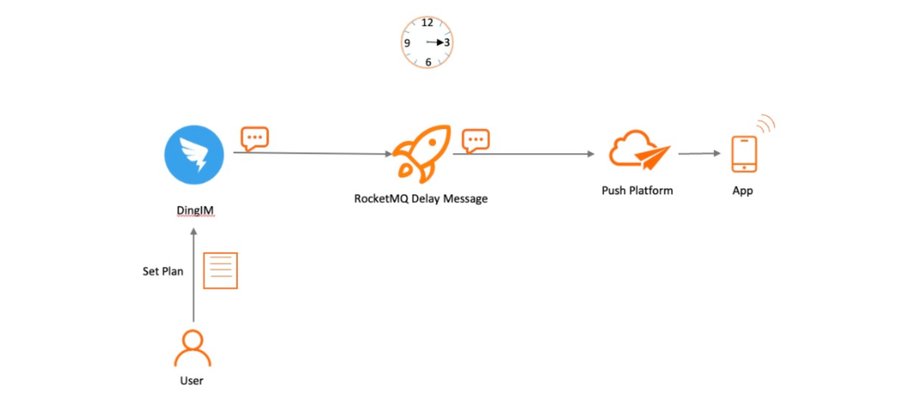


### 15, 发消息_延迟消息代码实现

**发送延时消息:**

生产者发送消息后，消费者在指定时间才能消费消息，这类消息被称为延迟消息或定时消息。生产者发送延迟消息前需要设置延迟级别，目前开源版本支持18个延迟级别：Broker在接收用户发送的消息后，首先将消息保存到名为SCHEDULE_TOPIC的Topic中。此时，消费者无法消费该延迟消息。然后，由Broker端的定时投递任务定时投递给消费者。 1s  5s  10s  30s  1m 2m 3m 4m 5m 6m 7m 8m 9m


代码实现：

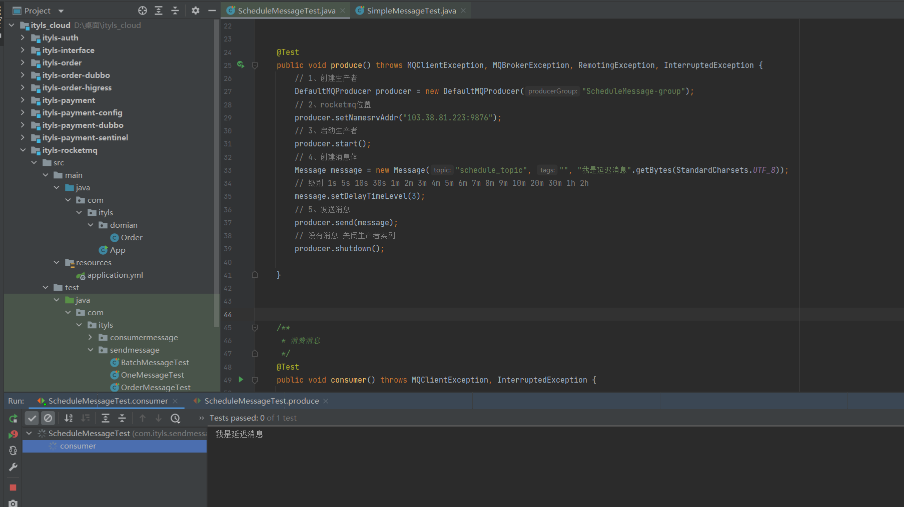

```java
package com.ityls.sendmessage;

import org.apache.rocketmq.client.consumer.DefaultMQPushConsumer;
import org.apache.rocketmq.client.consumer.listener.ConsumeConcurrentlyContext;
import org.apache.rocketmq.client.consumer.listener.ConsumeConcurrentlyStatus;
import org.apache.rocketmq.client.consumer.listener.MessageListenerConcurrently;
import org.apache.rocketmq.client.exception.MQBrokerException;
import org.apache.rocketmq.client.exception.MQClientException;
import org.apache.rocketmq.client.producer.DefaultMQProducer;
import org.apache.rocketmq.common.message.Message;
import org.apache.rocketmq.common.message.MessageExt;
import org.apache.rocketmq.remoting.exception.RemotingException;
import org.junit.Test;

import java.nio.charset.StandardCharsets;
import java.util.List;

/**
 * 延迟消息
 */
public class ScheduleMessageTest {


    @Test
    public void produce() throws MQClientException, MQBrokerException, RemotingException, InterruptedException {
        // 1、创建生产者
        DefaultMQProducer producer = new DefaultMQProducer("ScheduleMessage-group");
        // 2、rocketmq位置
        producer.setNamesrvAddr("103.38.81.223:9876");
        // 3、启动生产者
        producer.start();
        // 4、创建消息体
        Message message = new Message("schedule_topic", "", "我是延迟消息".getBytes(StandardCharsets.UTF_8));
        // 级别 1s 5s 10s 30s 1m 2m 3m 4m 5m 6m 7m 8m 9m 10m 20m 30m 1h 2h
        message.setDelayTimeLevel(3);
        // 5、发送消息
        producer.send(message);
        // 没有消息 关闭生产者实列
        producer.shutdown();

    }


    /**
     * 消费消息
     */
    @Test
    public void consumer() throws MQClientException, InterruptedException {

        // 1、初始化消费者
        DefaultMQPushConsumer consumer = new DefaultMQPushConsumer("consumer-scheduleMessage-group");
        // 2、rocketmq 位置
        consumer.setNamesrvAddr("103.38.81.223:9876");
        // 3、订阅主题
        consumer.subscribe("schedule_topic","*");
        // 4、监听消息
        consumer.setMessageListener(new MessageListenerConcurrently() {
            @Override
            public ConsumeConcurrentlyStatus consumeMessage(List<MessageExt> msgs, ConsumeConcurrentlyContext context) {
                for (MessageExt msg : msgs) {
                    System.out.println(new String(msg.getBody(),StandardCharsets.UTF_8));
                }
                return ConsumeConcurrentlyStatus.CONSUME_SUCCESS;
            }
        });
        // 5、启动消费者
        consumer.start();
        // 6、永远运行下去
        Thread.sleep(Long.MAX_VALUE);

    }
}
```


### 16, 发消息_单向消息


**什么是单向消息:**

单向消息的生产者只管发送过程，不管发送结果。


场景：

> 主要用于日志传输等消息允许丢失的场景。


代码实现：

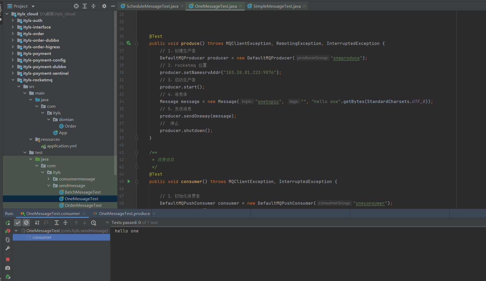

```java
package com.ityls.sendmessage;

import org.apache.rocketmq.client.consumer.DefaultMQPushConsumer;
import org.apache.rocketmq.client.consumer.listener.ConsumeConcurrentlyContext;
import org.apache.rocketmq.client.consumer.listener.ConsumeConcurrentlyStatus;
import org.apache.rocketmq.client.consumer.listener.MessageListenerConcurrently;
import org.apache.rocketmq.client.exception.MQClientException;
import org.apache.rocketmq.client.producer.DefaultMQProducer;
import org.apache.rocketmq.common.message.Message;
import org.apache.rocketmq.common.message.MessageExt;
import org.apache.rocketmq.remoting.exception.RemotingException;
import org.junit.Test;

import java.nio.charset.StandardCharsets;
import java.util.List;

/**
 * 单向消息
 *  日志传输
 */
public class OneMessageTest {
    @Test
    public void produce() throws MQClientException, RemotingException, InterruptedException {
        // 1、创建生产者
        DefaultMQProducer producer = new DefaultMQProducer("oneproduce");
        // 2、rocketmq 位置
        producer.setNamesrvAddr("103.38.81.223:9876");
        // 3、启动生产者
        producer.start();
        // 4、消息体
        Message message = new Message("onetopic", "", "hello one".getBytes(StandardCharsets.UTF_8));
        // 5、发送消息
        producer.sendOneway(message);
        //  停止
        producer.shutdown();
    }

    /**
     * 消费消息
     */
    @Test
    public void consumer() throws MQClientException, InterruptedException {

        // 1、初始化消费者
        DefaultMQPushConsumer consumer = new DefaultMQPushConsumer("oneconsumer");
        // 2、rocketmq 位置
        consumer.setNamesrvAddr("103.38.81.223:9876");
        // 3、订阅主题
        consumer.subscribe("onetopic","*");
        // 4、监听消息
        consumer.setMessageListener(new MessageListenerConcurrently() {
            @Override
            public ConsumeConcurrentlyStatus consumeMessage(List<MessageExt> msgs, ConsumeConcurrentlyContext context) {
                for (MessageExt msg : msgs) {
                    System.out.println(new String(msg.getBody(),StandardCharsets.UTF_8));
                }
                return ConsumeConcurrentlyStatus.CONSUME_SUCCESS;
            }
        });
        // 5、启动消费者
        consumer.start();
        // 6、永远运行下去
        Thread.sleep(Long.MAX_VALUE);

    }
}
```


### 17, 发消息_批量消息

**什么是批量消息:**

Rocket MQ的批量消息可以提高消息的吞吐能力和处理效率，降低下游系统的API调用频率，是一种优化消息传输和处理的有效手段。


**批量消息的特点:**

- 批量消息具有相同的topic
- 批量消息不支持延迟消息
- 批量消息的大小不超过4M（4.4版本之后要求不超过1M）


**批量消息的使用场景:**

- 消息的吞吐能力和处理效率：通过将多条消息打包成一批进行发送，可以减少网络传输开销和消息处理的时间，从而提高整体的消息处理效率。
- 下游系统的API调用频率：通过将多条消息合并成一条批量消息进行发送，可以减少下游系统接收和处理消息的次数，从而降低API调用频率，减轻下游系统的负载压力。


代码实现：

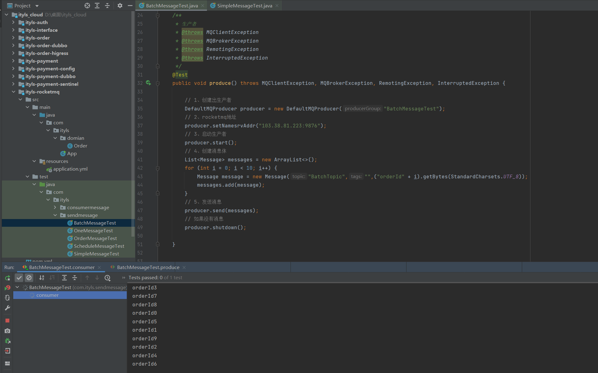

```java
package com.ityls.sendmessage;

import org.apache.rocketmq.client.consumer.DefaultMQPushConsumer;
import org.apache.rocketmq.client.consumer.listener.ConsumeConcurrentlyContext;
import org.apache.rocketmq.client.consumer.listener.ConsumeConcurrentlyStatus;
import org.apache.rocketmq.client.consumer.listener.MessageListenerConcurrently;
import org.apache.rocketmq.client.exception.MQBrokerException;
import org.apache.rocketmq.client.exception.MQClientException;
import org.apache.rocketmq.client.producer.DefaultMQProducer;
import org.apache.rocketmq.common.message.Message;
import org.apache.rocketmq.common.message.MessageExt;
import org.apache.rocketmq.remoting.exception.RemotingException;
import org.junit.Test;

import java.nio.charset.StandardCharsets;
import java.util.ArrayList;
import java.util.List;

/**
 * 批量消息
 */
public class BatchMessageTest {

    /**
     * 生产者
     * @throws MQClientException
     * @throws MQBrokerException
     * @throws RemotingException
     * @throws InterruptedException
     */
    @Test
    public void produce() throws MQClientException, MQBrokerException, RemotingException, InterruptedException {

        // 1、创建出生产者
        DefaultMQProducer producer = new DefaultMQProducer("BatchMessageTest");
        // 2、rocketmq地址
        producer.setNamesrvAddr("103.38.81.223:9876");
        // 3、启动生产者
        producer.start();
        // 4、创建消息体
        List<Message> messages = new ArrayList<>();
        for (int i = 0; i < 10; i++) {
            Message message = new Message("BatchTopic","",("orderId" + i).getBytes(StandardCharsets.UTF_8));
            messages.add(message);
        }
        // 5、发送消息
        producer.send(messages);
        // 如果没有消息
        producer.shutdown();

    }


    /**
     * 消费消息
     */
    @Test
    public void consumer() throws MQClientException, InterruptedException {

        // 1、初始化消费者
        DefaultMQPushConsumer consumer = new DefaultMQPushConsumer("BatchMessageconsumer");
        // 2、rocketmq 位置
        consumer.setNamesrvAddr("103.38.81.223:9876");
        // 3、订阅主题
        consumer.subscribe("BatchTopic","*");
        // 4、监听消息
        consumer.setMessageListener(new MessageListenerConcurrently() {
            @Override
            public ConsumeConcurrentlyStatus consumeMessage(List<MessageExt> msgs, ConsumeConcurrentlyContext context) {
                for (MessageExt msg : msgs) {
                    System.out.println(new String(msg.getBody(),StandardCharsets.UTF_8));
                }
                return ConsumeConcurrentlyStatus.CONSUME_SUCCESS;
            }
        });
        // 5、启动消费者
        consumer.start();
        // 6、永远运行下去
        Thread.sleep(Long.MAX_VALUE);
    }
}
```


### 18, 发消息_生产者最佳实践总结

相对消费者而言，生产者的使用更加简单，一般主要关注消息类型、消息发送方法即可正常使用RocketMQ发送消息。


**常用消息类型:**

| 消息类型            | 优点                                              | 缺点                                                         | 备注                                     |
| ------------------- | ------------------------------------------------- | ------------------------------------------------------------ | ---------------------------------------- |
| 普通消息 (并发消息) | 性能最好。单机 TPS 的级别为100000                 | 消息的生产和消费都无序                                       | 大部分场景适用                           |
| 分区有序消息        | 单分区中消息有序，单机发送 TPS万级别              | 单点问题。如果 Broker宕机则会导致发送失败                    | 大部分有序消息场景适用                   |
| 全局有序消息        | 类似传统的 Queue,全部消息有序,单机发送 TPS 千级别 | 单点问题。如果 Broker宕机则会导致发送失败                    | 极少场景使用                             |
| 延迟消息            | RocketMO 自身支持，不需要额使用组件，支持延迟特性 | 不能根据任意时间延迟，使用范围受限。Broker 随着延迟级别增大支持越多，CPU压力越大，延迟时间不准确 | 非精确、延迟级别不多的场景，非常方便使用 |
| 事务消息            | RocketMQ 自身支持，不需要额外使用组建支持事务特性 | RocketMO 事务是生产者事务，只有生产者参与，如果消费者处理失败则事务失效 | 简单事务处理可以使用                     |


**常用的发送方法:**

| 发送方法                                                   | 优点               | 缺点                       | 备注                         |
| ---------------------------------------------------------- | ------------------ | -------------------------- | ---------------------------- |
| send(Message msg) 同步                                     | 最可靠             | 性能最低                   | 适用于高可靠场景             |
| send(Message msg,MessageQueue mq)                          | 可以发送顺序消息   | 单点故障后不可用           | 适用于顺序消息               |
| send(Message msg,MessageQueueSelectorselector, Object arg) | 队列选择方法最灵活 | 比较低级的接口，使用有门槛 | 特殊场景                     |
| sendOneway(Message msg)                                    | 使用最方便         | 消息有丢失风险             | 适用于对消息丢失不敏感的场景 |
| send(Collection msgs)                                      | 效率最高           | 发送失败后降级比较困难     | 适用于特殊场景               |


### 19, 消费消息_过滤消息

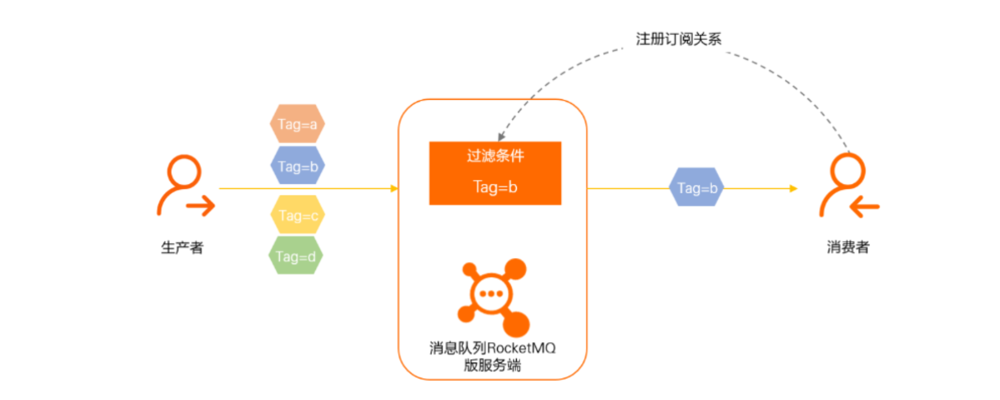


你去市场买菜，阿姨给你一个二维码付款，支持某信、某付宝、某银联App等。假如你被要求设计这个二维码的功能，在一个支付请求进入Topic后，如果你只需要处理某付宝的消息，你的代码得这么写：

```java
boolean receiveMessage(Message msg)
{
  String from = msg.getProperty("from");
  if ( "某付宝".equals(from) ){
    callApiXbao(msg);
   }else{
    log.error("请求异常" + JSON.toJsonString(msg));
   }
}
```


由于阿姨的生意非常好，每天有上亿的支付订单，你的应用程序要处理某信、某付宝、某银联App全部的支付消息，这会导致消费效率低下，我们有什么办法，可以只消费某付宝的支付消息呢？

解决：

> RocketMQ 设计了消息过滤，来解决大量无意义流量的传输：即对于客户端不需要的消息，Broker就不会传输给客户端，以免浪费宽带。


**消息过滤分类:**

RocketMQ 版支持Tag标签过滤和SQL属性过滤，这两种过滤方式对比如下：

| **对比项** | **Tag标签过滤**                  | **SQL属性过滤**                                              |
| ---------- | -------------------------------- | ------------------------------------------------------------ |
| 过滤目标   | 消息的Tag标签。                  | 消息的属性，包括用户自定义属性以及系统属性（Tag是一种系统属性）。 |
| 过滤能力   | 精准匹配。                       | SQL语法匹配。                                                |
| 适用场景   | 简单过滤场景、计算逻辑简单轻量。 | 复杂过滤场景、计算逻辑较复杂。                               |


**场景：**

在实际业务场景中，同一个主题下的消息往往会被多个不同的下游业务方处理，各下游的处理逻辑不同，只关注自身逻辑需要的消息子集。使用消息队列 RocketMQ 版的消息过滤功能，可以帮助消费者更高效地过滤自己需要的消息集合，避免大量无效消息投递给消费者，降低下游系统处理压力。


### 20, 消费消息_过滤消息之Tag过滤


**什么是Tag过滤：**

Tag 过滤是最简单的一种过滤方法，通常 Tag 可以用作消息的业务标识。可以设置 Tag 表达式，判断消息是否包含这个 Tag。


以下图电商交易场景为例，从客户下单到收到商品这一过程会生产一系列消息：

- 订单消息
- 支付消息
- 物流消息


这些消息会发送到名称为Trade_Topic的Topic中，被各个不同的下游系统所订阅：

- 支付系统：只需订阅支付消息。
- 物流系统：只需订阅物流消息。
- 交易成功率分析系统：需订阅订单和支付消息。
- 实时计算系统：需要订阅所有和交易相关的消息。


过滤效果如下图所示：

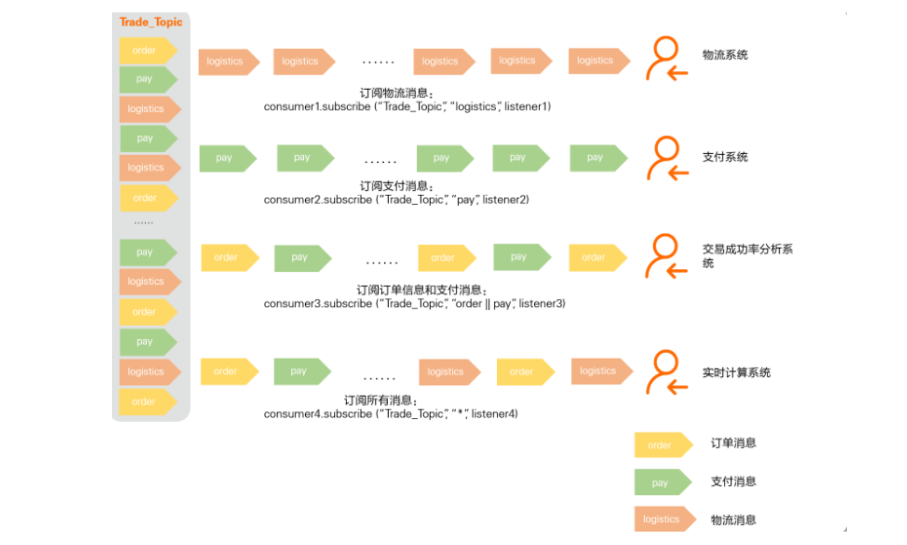


先写消费者：

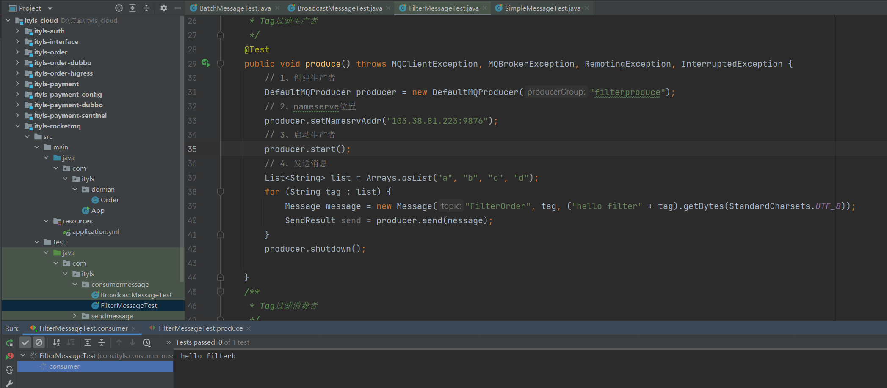

```java
package com.ityls.consumermessage;

import org.apache.rocketmq.client.consumer.DefaultMQPushConsumer;
import org.apache.rocketmq.client.consumer.listener.ConsumeConcurrentlyContext;
import org.apache.rocketmq.client.consumer.listener.ConsumeConcurrentlyStatus;
import org.apache.rocketmq.client.consumer.listener.MessageListenerConcurrently;
import org.apache.rocketmq.client.exception.MQBrokerException;
import org.apache.rocketmq.client.exception.MQClientException;
import org.apache.rocketmq.client.producer.DefaultMQProducer;
import org.apache.rocketmq.client.producer.SendResult;
import org.apache.rocketmq.common.message.Message;
import org.apache.rocketmq.common.message.MessageExt;
import org.apache.rocketmq.remoting.exception.RemotingException;
import org.junit.Test;

import java.nio.charset.StandardCharsets;
import java.util.Arrays;
import java.util.List;

/**
 * 过滤消息
 */
public class FilterMessageTest {

    /**
     * Tag过滤生产者
     */
    @Test
    public void produce() throws MQClientException, MQBrokerException, RemotingException, InterruptedException {
        // 1、创建生产者
        DefaultMQProducer producer = new DefaultMQProducer("filterproduce");
        // 2、nameserve位置
        producer.setNamesrvAddr("103.38.81.223:9876");
        // 3、启动生产者
        producer.start();
        // 4、发送消息
        List<String> list = Arrays.asList("a", "b", "c", "d");
        for (String tag : list) {
            Message message = new Message("FilterOrder", tag, ("hello filter" + tag).getBytes(StandardCharsets.UTF_8));
            SendResult send = producer.send(message);
        }
        producer.shutdown();

    }
    /**
     * Tag过滤消费者
     */
    @Test
    public void consumer() throws MQClientException, InterruptedException {
        // 1、创建消费者
        DefaultMQPushConsumer consumer = new DefaultMQPushConsumer("filterConsumer");
        // 2、指定nameserve
        consumer.setNamesrvAddr("103.38.81.223:9876");
        // 3、注册订阅关系  a
        consumer.subscribe("FilterOrder","b");
        // 4、监听消息
        consumer.setMessageListener(new MessageListenerConcurrently() {
            @Override
            public ConsumeConcurrentlyStatus consumeMessage(List<MessageExt> msgs, ConsumeConcurrentlyContext context) {
                for (MessageExt msg : msgs) {
                    System.out.println(new String(msg.getBody(), StandardCharsets.UTF_8));
                }
                return ConsumeConcurrentlyStatus.CONSUME_SUCCESS;
            }
        });
        consumer.start();

        Thread.sleep(Integer.MAX_VALUE);
    }
}
```


### 21, 消费消息_集群消费

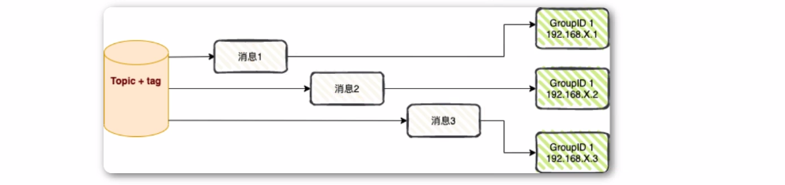

**什么是集群消费:**

同一 Topic 下的一条消息只会被同一消费组中的一个消费者消费。也就是说，消息被负载均衡到了同一个消费组的多个消费者实例上。


代码：

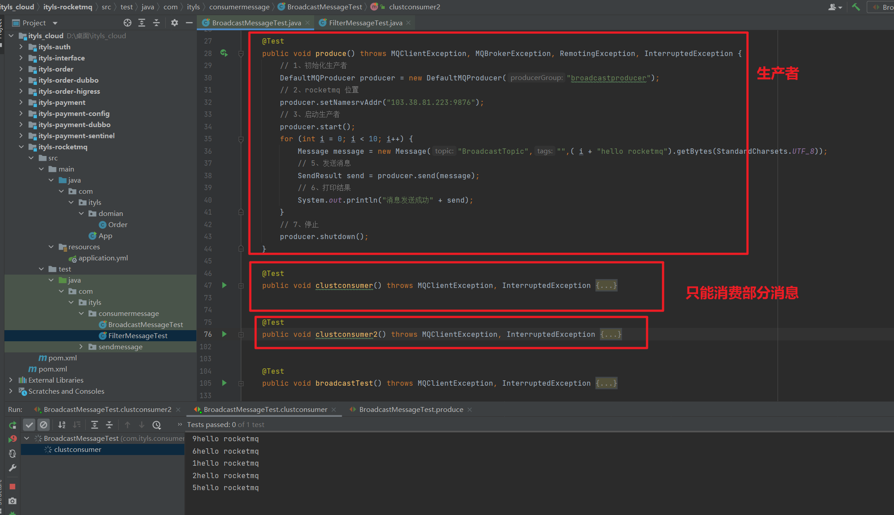

```java
package com.ityls.consumermessage;

import org.apache.rocketmq.client.consumer.DefaultMQPushConsumer;
import org.apache.rocketmq.client.consumer.listener.ConsumeConcurrentlyContext;
import org.apache.rocketmq.client.consumer.listener.ConsumeConcurrentlyStatus;
import org.apache.rocketmq.client.consumer.listener.MessageListenerConcurrently;
import org.apache.rocketmq.client.exception.MQBrokerException;
import org.apache.rocketmq.client.exception.MQClientException;
import org.apache.rocketmq.client.producer.DefaultMQProducer;
import org.apache.rocketmq.client.producer.SendResult;
import org.apache.rocketmq.common.message.Message;
import org.apache.rocketmq.common.message.MessageExt;
import org.apache.rocketmq.remoting.exception.RemotingException;
import org.apache.rocketmq.remoting.protocol.heartbeat.MessageModel;
import org.junit.Test;

import java.nio.charset.StandardCharsets;
import java.util.List;

/**
 * 消费模式
 *  集群消费  BroadcastTopic
 */
public class BroadcastMessageTest {

    @Test
    public void produce() throws MQClientException, MQBrokerException, RemotingException, InterruptedException {
        // 1、初始化生产者
        DefaultMQProducer producer = new DefaultMQProducer("broadcastproducer");
        // 2、rocketmq 位置
        producer.setNamesrvAddr("103.38.81.223:9876");
        // 3、启动生产者
        producer.start();
        for (int i = 0; i < 10; i++) {
            Message message = new Message("BroadcastTopic","",( i + "hello rocketmq").getBytes(StandardCharsets.UTF_8));
            // 5、发送消息
            SendResult send = producer.send(message);
            // 6、打印结果
            System.out.println("消息发送成功" + send);
        }
        // 7、停止
        producer.shutdown();
    }

    @Test
    public void clustconsumer() throws MQClientException, InterruptedException {
        //1、创建消费者
        DefaultMQPushConsumer consumer = new DefaultMQPushConsumer("clustconsumer");
        // 2、nameserer 位置
        consumer.setNamesrvAddr("103.38.81.223:9876");
        // 3、监听
        consumer.subscribe("BroadcastTopic","*");
        // 4、设置消费模式
        /**
         * 我们使用clustering模式。 同一个组每个consumer只消费所订阅的消息的一部分。
         */
        consumer.setMessageModel(MessageModel.CLUSTERING);
        consumer.setMessageListener(new MessageListenerConcurrently() {
            @Override
            public ConsumeConcurrentlyStatus consumeMessage(List<MessageExt> msgs, ConsumeConcurrentlyContext context) {
                for (MessageExt msg : msgs) {
                    System.out.println(new String(msg.getBody(),StandardCharsets.UTF_8));
                }
                return ConsumeConcurrentlyStatus.CONSUME_SUCCESS;
            }
        });
        // 5、启动
        consumer.start();
        // 无限等待
        Thread.sleep(Integer.MAX_VALUE);
    }


    @Test
    public void clustconsumer2() throws MQClientException, InterruptedException {
        //1、创建消费者
        DefaultMQPushConsumer consumer = new DefaultMQPushConsumer("clustconsumer");
        // 2、nameserer 位置
        consumer.setNamesrvAddr("103.38.81.223:9876");
        // 3、监听
        consumer.subscribe("BroadcastTopic","*");
        // 4、设置消费模式
        /**
         * 我们使用clustering模式。 同一个组每个consumer只消费所订阅的消息的一部分。
         */
        consumer.setMessageModel(MessageModel.CLUSTERING);
        consumer.setMessageListener(new MessageListenerConcurrently() {
            @Override
            public ConsumeConcurrentlyStatus consumeMessage(List<MessageExt> msgs, ConsumeConcurrentlyContext context) {
                for (MessageExt msg : msgs) {
                    System.out.println(new String(msg.getBody(),StandardCharsets.UTF_8));
                }
                return ConsumeConcurrentlyStatus.CONSUME_SUCCESS;
            }
        });
        // 5、启动
        consumer.start();
        // 无限等待
        Thread.sleep(Integer.MAX_VALUE);
    }
}
```


### 22, 消费消息_广播消息

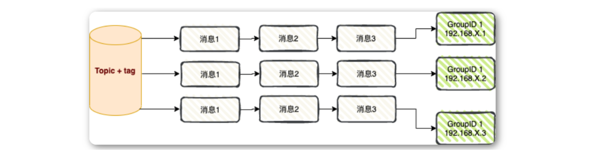


**什么是广播消费:**

当使用广播消费模式时，每条消息推送给集群内所有的消费者，保证消息至少被每个消费者消费一次。

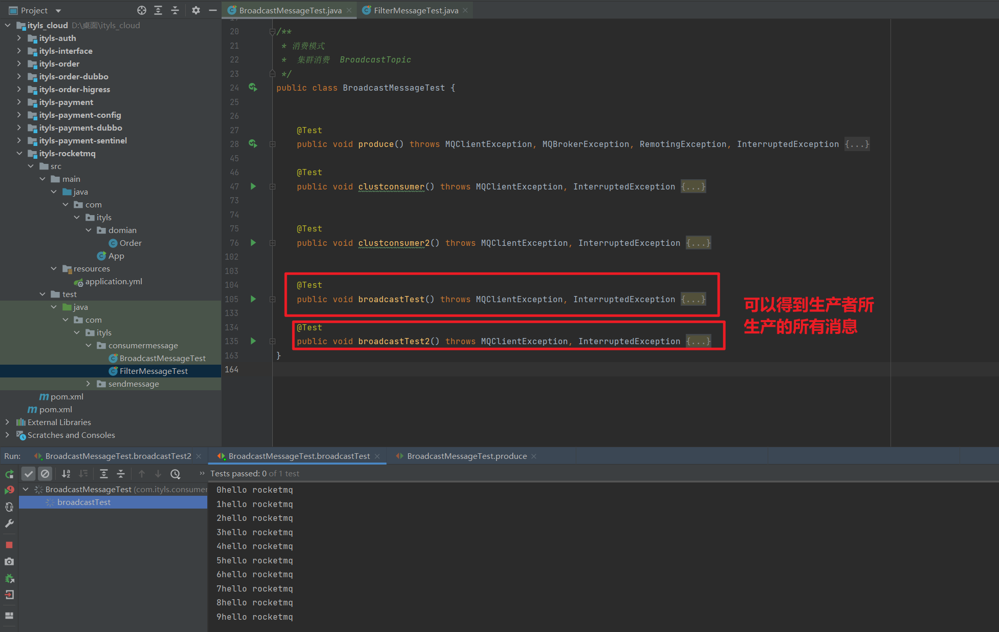


```java
package com.ityls.consumermessage;

import org.apache.rocketmq.client.consumer.DefaultMQPushConsumer;
import org.apache.rocketmq.client.consumer.listener.ConsumeConcurrentlyContext;
import org.apache.rocketmq.client.consumer.listener.ConsumeConcurrentlyStatus;
import org.apache.rocketmq.client.consumer.listener.MessageListenerConcurrently;
import org.apache.rocketmq.client.exception.MQBrokerException;
import org.apache.rocketmq.client.exception.MQClientException;
import org.apache.rocketmq.client.producer.DefaultMQProducer;
import org.apache.rocketmq.client.producer.SendResult;
import org.apache.rocketmq.common.message.Message;
import org.apache.rocketmq.common.message.MessageExt;
import org.apache.rocketmq.remoting.exception.RemotingException;
import org.apache.rocketmq.remoting.protocol.heartbeat.MessageModel;
import org.junit.Test;

import java.nio.charset.StandardCharsets;
import java.util.List;

/**
 * 消费模式
 *  集群消费  BroadcastTopic
 */
public class BroadcastMessageTest {
    @Test
    public void produce() throws MQClientException, MQBrokerException, RemotingException, InterruptedException {
        // 1、初始化生产者
        DefaultMQProducer producer = new DefaultMQProducer("broadcastproducer");
        // 2、rocketmq 位置
        producer.setNamesrvAddr("103.38.81.223:9876");
        // 3、启动生产者
        producer.start();
        for (int i = 0; i < 10; i++) {
            Message message = new Message("BroadcastTopic","",( i + "hello rocketmq").getBytes(StandardCharsets.UTF_8));
            // 5、发送消息
            SendResult send = producer.send(message);
            // 6、打印结果
            System.out.println("消息发送成功" + send);
        }
        // 7、停止
        producer.shutdown();
    }

    @Test
    public void broadcastTest() throws MQClientException, InterruptedException {

        //1、创建消费者
        DefaultMQPushConsumer consumer = new DefaultMQPushConsumer("clustconsumer");
        // 2、nameserer 位置
        consumer.setNamesrvAddr("103.38.81.223:9876");
        // 3、监听
        consumer.subscribe("BroadcastTopic","*");
        // 4、设置消费模式
        /**
         * BROADCASTING 广播模式 在同一个组里，每个consumer都能消费到所订阅Topic的全部消息
         */
        consumer.setMessageModel(MessageModel.BROADCASTING);
        consumer.setMessageListener(new MessageListenerConcurrently() {
            @Override
            public ConsumeConcurrentlyStatus consumeMessage(List<MessageExt> msgs, ConsumeConcurrentlyContext context) {
                for (MessageExt msg : msgs) {
                    System.out.println(new String(msg.getBody(),StandardCharsets.UTF_8));
                }
                return ConsumeConcurrentlyStatus.CONSUME_SUCCESS;
            }
        });
        // 5、启动
        consumer.start();
        // 无限等待
        Thread.sleep(Integer.MAX_VALUE);

    }

    @Test
    public void broadcastTest2() throws MQClientException, InterruptedException {

        //1、创建消费者
        DefaultMQPushConsumer consumer = new DefaultMQPushConsumer("clustconsumer");
        // 2、nameserer 位置
        consumer.setNamesrvAddr("103.38.81.223:9876");
        // 3、监听
        consumer.subscribe("BroadcastTopic","*");
        // 4、设置消费模式
        /**
         * BROADCASTING 广播模式 在同一个组里，每个consumer都能消费到所订阅Topic的全部消息
         */
        consumer.setMessageModel(MessageModel.BROADCASTING);
        consumer.setMessageListener(new MessageListenerConcurrently() {
            @Override
            public ConsumeConcurrentlyStatus consumeMessage(List<MessageExt> msgs, ConsumeConcurrentlyContext context) {
                for (MessageExt msg : msgs) {
                    System.out.println(new String(msg.getBody(),StandardCharsets.UTF_8));
                }
                return ConsumeConcurrentlyStatus.CONSUME_SUCCESS;
            }
        });
        // 5、启动
        consumer.start();
        // 无限等待
        Thread.sleep(Integer.MAX_VALUE);

    }
}
```


### 23, 可视化配置


下载地址：https://www.redisant.cn/rocketmq?spm=a2c6h.12873639.article-detail.7.b9ee4f500GjzZr

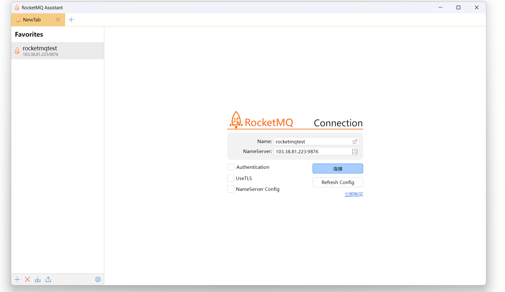


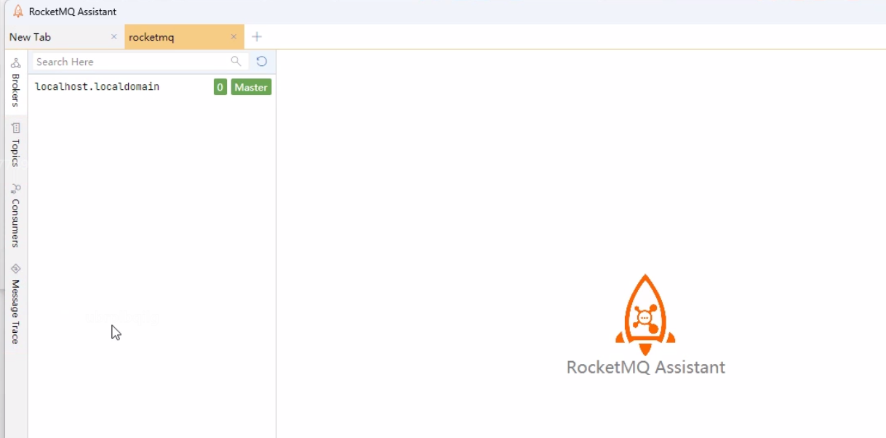

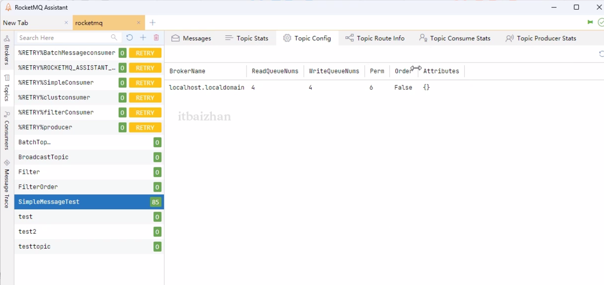

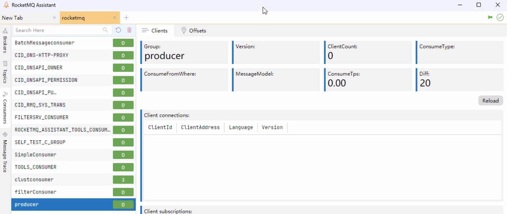


### 24, 消息存储

**关系型数据库：**

ActiveMQ（默认采用的KahaDB做消息存储）可选用JDBC的方式来做消息持久化，通过简单的xml配置信息即可实现JDBC消息存储。由于，普通关系型数据库（如Mysql）在单表数据量达到千万级别的情况下，其IO读写性能往往会出现瓶颈。在可靠性方面，该种方案非常依赖DB，如果一旦DB出现故障，则MQ的消息就无法落盘存储会导致线上故障。


**文件：**

目前业界较为常用的几款产品（RocketMQ/Kafka/RabbitMQ）均采用的是消息刷盘至所部署虚拟机/物理机的文件系统来做持久化（刷盘一般可以分为异步刷盘和同步刷盘两种模式）。消息刷盘为消息存储提供了一种高效率、高可靠性和高性能的数据持久化方式。除非部署MQ机器本身或是本地磁盘损坏，否则一般是不会出现无法持久化的故障问题。

查看：

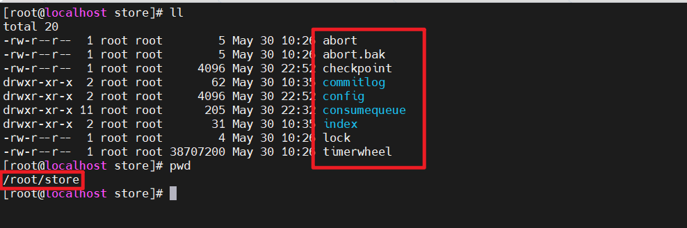

使用tree命令查看：

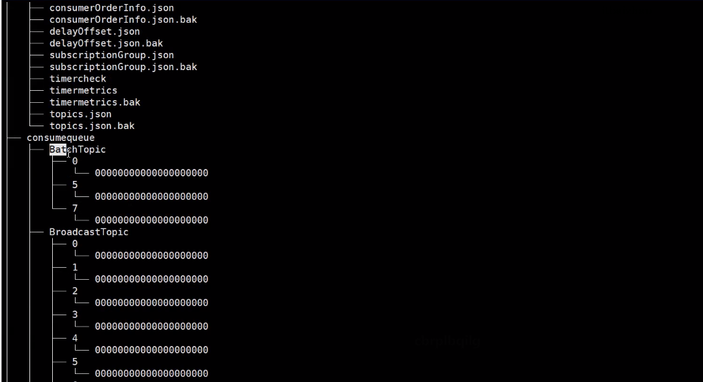


**性能对比：**

文件系统 > 关系型数据库DB


### 25, 消息查询

在实际开发中，经常需要查看MQ中消息的内容来排查问题。RocketMQ提供了三种消息查询的方式，分别是按Message ID、Message Key以及Unique Key查询。

```js
//返回结果
SendResult [
sendStatus=SEND_OK, 
msgId=C0A801030D4B18B4AAC247DE4A0D0000,
offsetMsgId=C0A8010300002A9F000000000007BEE9,
messageQueue=MessageQueue [topic=TopicA, brokerName=broker-a, queueId=0], 
queueOffset=0]
```


MessageID:

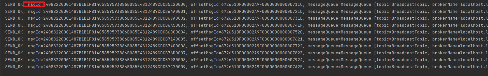


MessageKey:

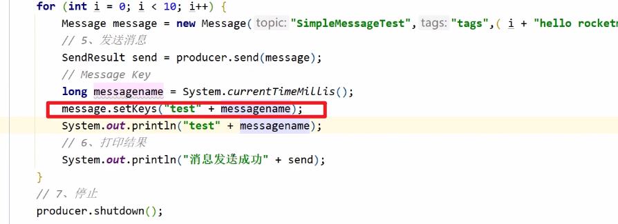

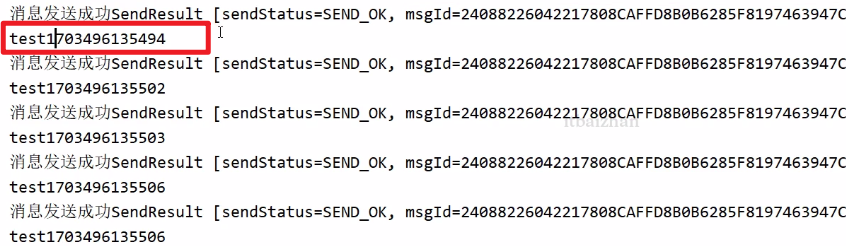


查看消息：

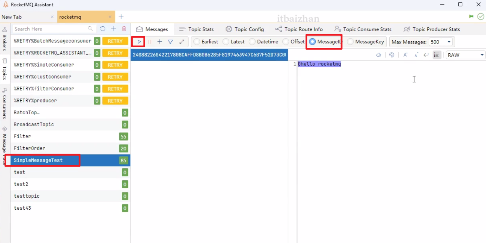


对比：

- 按MessageId查询消息

  Message Id 是消息发送后，在Broker端生成的，其包含了Broker的地址、偏移信息，并且会把Message Id作为结果的一部分返回。Message Id中属于精确匹配，代表唯一一条消息，查询效率更高。

- 按照Message Key查询消息

  消息的key是开发人员在发送消息之前自行指定的，通常把具有业务含义，区分度高的字段作为消息的key，如用户id，订单id等。

- 按照Unique Key查询消息

  除了开发人员指定的消息key，生产者在发送发送消息之前，会自动生成一个UNIQ_KEY，设置到消息的属性中，从逻辑上唯一代表一条消息。


消息在消息队列RocketMQ中存储的时间默认为3天（不建议修改），即只能查询从消息发送时间算起3天内的消息，三种查询方式的特点和对比如下表所述：

| 查询方式      | 查询条件          | 查询类别 | 说明                                                         |
| ------------- | ----------------- | -------- | ------------------------------------------------------------ |
| 按Message ID  | Message ID        | 精确查询 | 根据Message ID可以精确定位任意一条消息，获取消息的属性。     |
| 按Message Key | Topic+Message Key | 模糊查询 | 根据Topic和Message Key可以匹配到包含指定Key的最近64条消息。**注意** 建议消息生产方为每条消息设置尽可能唯一的Key，以确保相同的Key的消息不会超过64条，否则消息会漏查。 |
| 按Unique Key  | Unique Key        | 精确查询 | 与Message Id类似，匹配唯一一条消息，如果生产端重复发送消息，则有可能匹配多条，但它们的unique key是唯一的。 |


**推荐查询过程：**

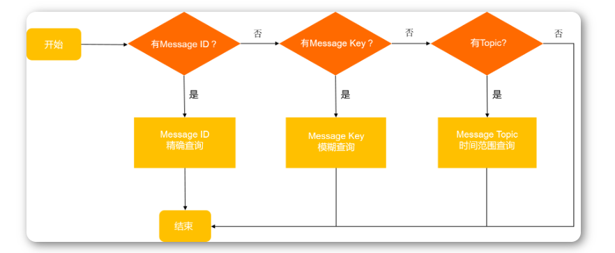


### 26, SpringBoot接入RocketMQ生产者

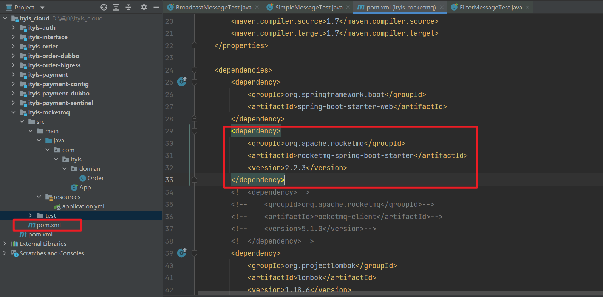

依赖：

```xml
<dependency>
      <groupId>org.apache.rocketmq</groupId>
      <artifactId>rocketmq-spring-boot-starter</artifactId>
      <version>2.2.3</version>
</dependency>
```


配置：

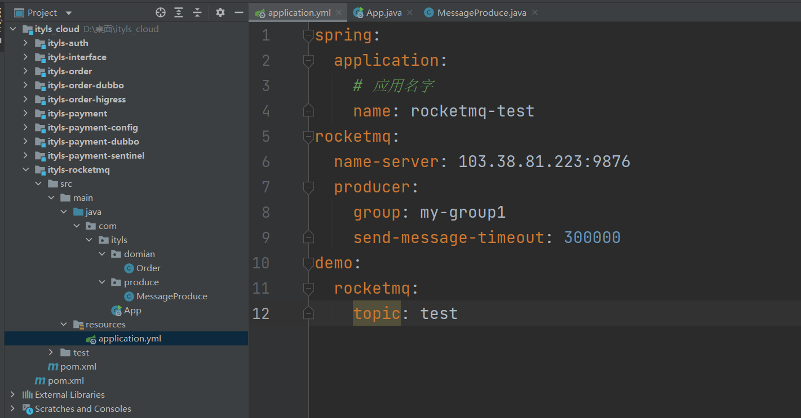

```yml
spring:
  application:
    # 应用名字
    name: rocketmq-test
rocketmq:
  name-server: 103.38.81.223:9876
  producer:
    group: my-group1
    send-message-timeout: 300000
demo:
  rocketmq:
    topic: test
```


主启动类：

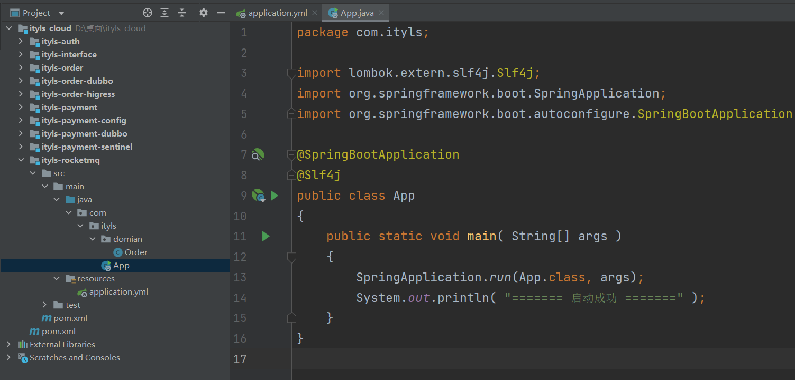

```java
package com.ityls;

import lombok.extern.slf4j.Slf4j;
import org.springframework.boot.SpringApplication;
import org.springframework.boot.autoconfigure.SpringBootApplication;

@SpringBootApplication
@Slf4j
public class App 
{
    public static void main( String[] args )
    {
        SpringApplication.run(App.class, args);
        System.out.println( "======= 启动成功 =======" );
    }
}
```


编写生成者：

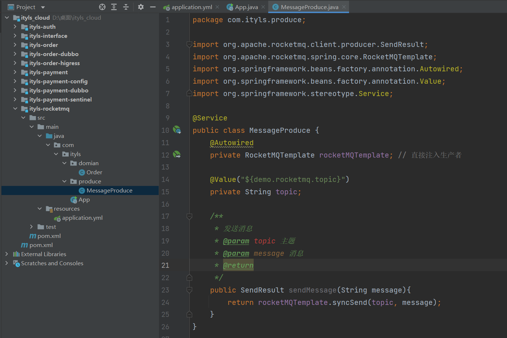

```java
package com.ityls.produce;

import org.apache.rocketmq.client.producer.SendResult;
import org.apache.rocketmq.spring.core.RocketMQTemplate;
import org.springframework.beans.factory.annotation.Autowired;
import org.springframework.beans.factory.annotation.Value;
import org.springframework.stereotype.Service;

@Service
public class MessageProduce {
    @Autowired
    private RocketMQTemplate rocketMQTemplate; // 直接注入生产者

    @Value("${demo.rocketmq.topic}")
    private String topic;

    /**
     * 发送消息
     * @param topic 主题
     * @param message 消息
     * @return
     */
    public SendResult sendMessage(String message){
        return rocketMQTemplate.syncSend(topic, message);
    }
}
```


编写controller：

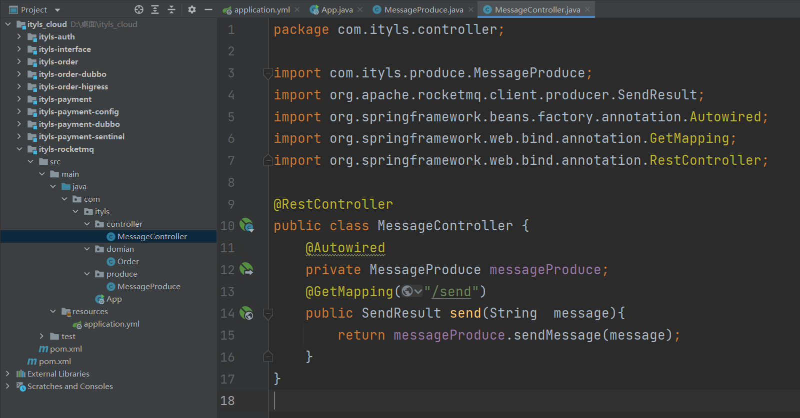

```java
package com.ityls.controller;

import com.ityls.produce.MessageProduce;
import org.apache.rocketmq.client.producer.SendResult;
import org.springframework.beans.factory.annotation.Autowired;
import org.springframework.web.bind.annotation.GetMapping;
import org.springframework.web.bind.annotation.RestController;

@RestController
public class MessageController {
    @Autowired
    private MessageProduce messageProduce;
    @GetMapping("/send")
    public SendResult send(String  message){
        return messageProduce.sendMessage(message);
    }
}
```


运行项目，报错：

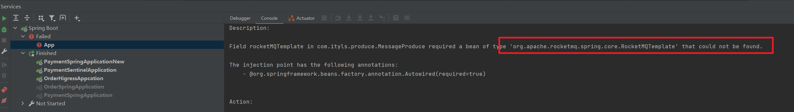


解决：我们要在resources文件夹中，新建META-INF/spring文件夹，在里面新建一个叫org.springframework.boot.autoconfigure.AutoConfiguration.imports的文件里面填入 org.apache.rocketmq.spring.autoconfigure.RocketMQAutoConfiguration

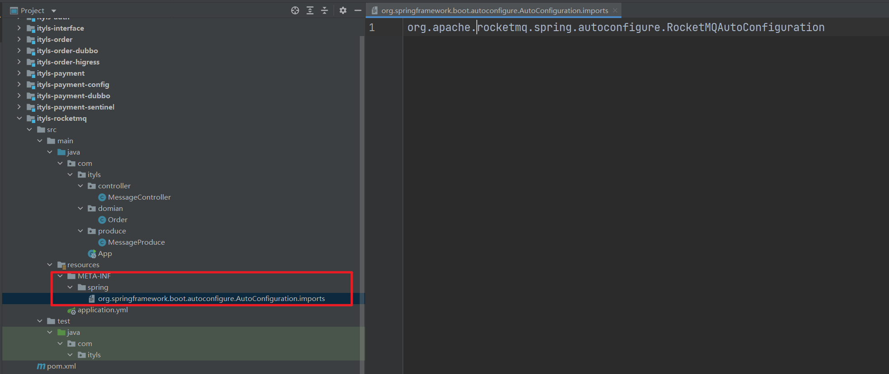


再次测试：

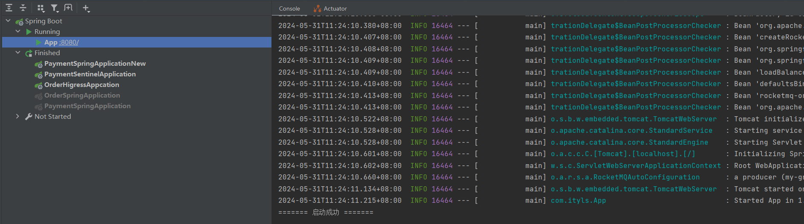


测试：

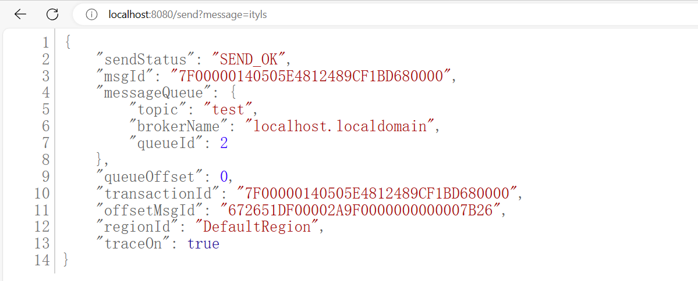

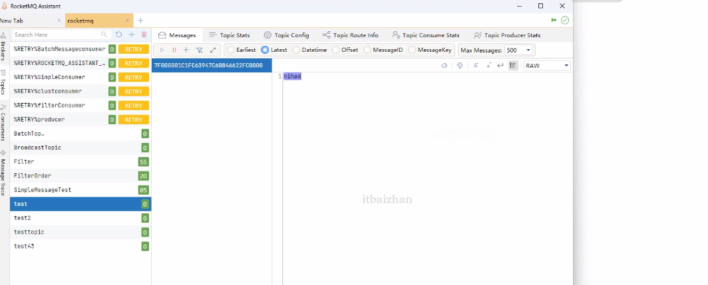


### 27, SpringBoot接入RocketMQ消费者

配置：

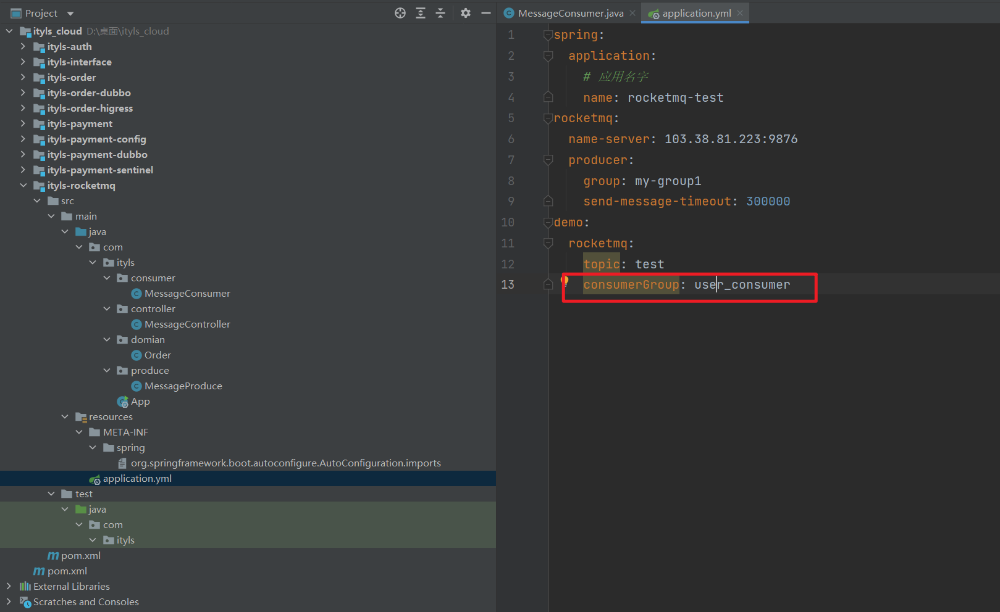

直接上代码：

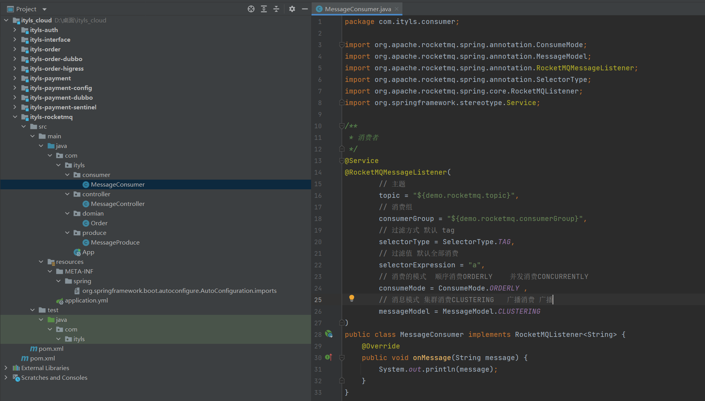

```java
package com.ityls.consumer;

import org.apache.rocketmq.spring.annotation.ConsumeMode;
import org.apache.rocketmq.spring.annotation.MessageModel;
import org.apache.rocketmq.spring.annotation.RocketMQMessageListener;
import org.apache.rocketmq.spring.annotation.SelectorType;
import org.apache.rocketmq.spring.core.RocketMQListener;
import org.springframework.stereotype.Service;

/**
 * 消费者
 */
@Service
@RocketMQMessageListener(
        // 主题
        topic = "${demo.rocketmq.topic}",
        // 消费组
        consumerGroup = "${demo.rocketmq.consumerGroup}",
        // 过滤方式 默认 tag
        selectorType = SelectorType.TAG,
        // 过滤值 默认全部消费
        selectorExpression = "a",
        // 消费的模式  顺序消费ORDERLY    并发消费CONCURRENTLY
        consumeMode = ConsumeMode.ORDERLY ,
        // 消息模式 集群消费CLUSTERING   广播消费 广播
        messageModel = MessageModel.CLUSTERING
)
public class MessageConsumer implements RocketMQListener<String> {
    @Override
    public void onMessage(String message) {
        System.out.println(message);
    }
}
```


测试：

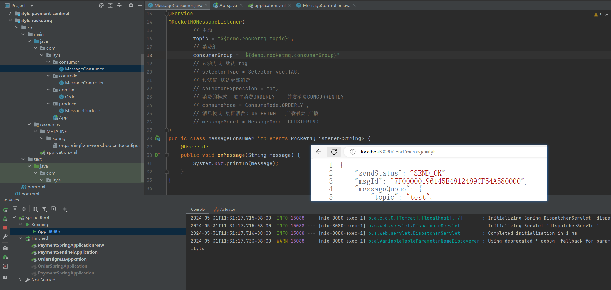


