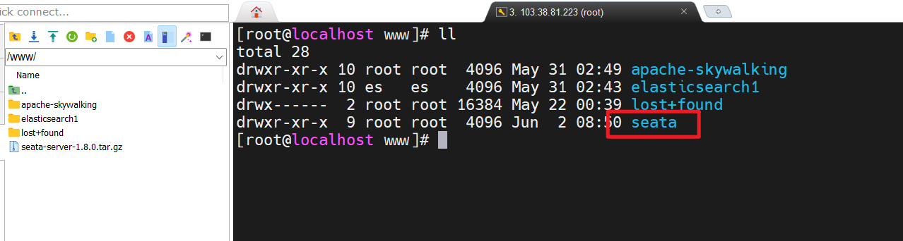
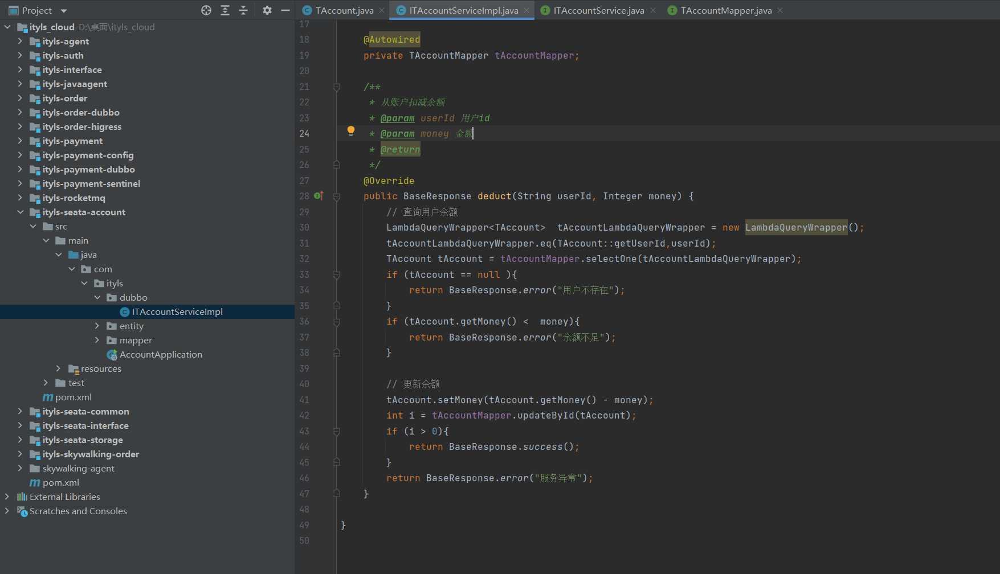
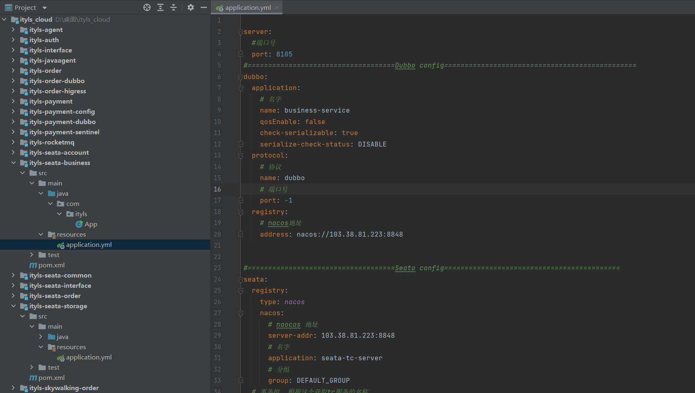

### 1, 认识本地事物


**事务的特性：**


**什么是事物:**

事务就是针对数据库的一组操作，它可以由一条或多条SQL语句组成，同一个事务的操作具备**同步**的特点，**事务中的语句要么都执行，要么都不执行。**


**举个栗子：**

> 你去小卖铺买东西，一手交钱，一手交货就是一个事务的例子，交钱和交货必须全部成功，事务才算成功，任一个活动失败，事务将撤销所有已成功的活动


**什么是本地事务:**

本地事务就是这一组sql语句在一个数据库连接中执行，即我们常说的事务就是一个本地事务，遵循ACID的。


**本地事务实现：**

- 编程式事务：begin，commit手动提交事务
- 声明式事务：加上@Transactional注解


### 2, 认识分布式事物

随着互联网的快速发展，软件系统由原来的单体应用转变为分布式应用，下图描述了单体应用向微服务的演变。


注意：

- 分布式系统会把一个应用系统拆分为可独立部署的多个服务，因此需要服务与服务之间远程协作才能完成事务操作，这种分布式系统环境下由不同的服务之间通过网络远程协作完成事务称之为分布式事务，例如用户注册送积分事务、创建订单减库存事务，银行转账事务等都是分布式事务。


**假如没有分布式事务：**

在一系列微服务系统当中，假如不存在分布式事务，会发生什么呢？让我们以互联网中常用的交易业务为例子：


解释：

- 上图中包含了库存和订单两个独立的微服务，每个微服务维护了自己的数据库。在交易系统的业务逻辑中，一个商品在下单之前需要先调用库存服务，进行扣除库存，再调用订单服务，创建订单记录。


正常情况下，两个数据库各自更新成功，两边数据维持着一致性。


但是，在非正常情况下，有可能库存的扣减完成了，随后的订单记录却因为某些原因插入失败。这个时候，两边数据就失去了应有的一致性。


**问题：**这种时候需要要保证数据的一致性，单数据源的一致性靠单机事物来保证，多数据源的一致性就要靠分布式事物保证。


**什么是分布式事务：**

指一次大的操作由不同的小操作组成的，这些小的操作分布在不同的服务器上，分布式事务需要保证这些小操作要么全部成功，要么全部失败。从本质上来说，分布式事务就是为了保证不同数据库的数据一致性。


### 3, 分布式事务产生的场景


**跨JVM进程：**

当我们将单体项目拆分为分布式、微服务项目之后，各个服务之间通过远程REST或者RPC调用来协同完成业务操作。


**典型的场景：**

各个微服务是部署在不同的JVM进程中的，此时，就会产生因跨JVM进程而导致的分布式事务问题。


**跨数据库实例：**

随着用户增多，数据库压力越来越大，此时我们会进行数据库的拆分，怎么拆分呐？比如：拆分成用户数据库、商品数据库、订单数据库。


**说明：**

数据库由原先的单库，被拆分成2个数据库。单体系统需要访问多个数据库时就会产生分布式事务。


**多个服务数据库：**

随着模块越来越多，项目越来越庞大，我们会将模块拆分成不同的项目，那么两个服务需要跨网络远程调用，两个服务持有了不同的数据库连接进行数据库操作，此时就会产生分布式事务。


**简单理解：**跨网络远程调用产生分布式事务。


**总结：**

（1）跨网络远程调用完成事务协作，就会产生分布式事务。

（2）跨数据库实例完成事务协作，就会产生分布式事务。


### 4, 认识Seata


**Seata是什么：**

Seata 是一款开源的分布式事务解决方案，致力于提供高性能和简单易用的分布式事务服务。Seata 将为用户提供了 AT、TCC、SAGA 和 XA 事务模式，为用户打造一站式的分布式解决方案。github地址：[https://github.com/seata/seata](https://link.zhihu.com/?target=https%3A//github.com/seata/seata)。


Seata 是阿里开源的，阿里是国内最早一批进行应用分布式（微服务化）改造的企业，所以很早就遇到微服务架构下的分布式事务问题。


举例：

****

- 仓储服务：对给定的商品进行增删操作记录数量。
- 订单服务：根据采购者的需求创建订单。
- 账户服务：从用户账户中扣除余额、积分等。


**数据源支持：**

- AT模式：AT模式支持的数据库有：MySQL、Oracle、PostgreSQL、TiDB、MariaDB、DaMeng、PolarDB-X 2.0、SQLServer。

- TCC模式：TCC模式不依赖数据源(1.4.2版本及之前)，1.4.2版本之后增加了TCC防悬挂措施，需要数据源支持。

- Saga模式：Saga模式不依赖数据源。

- XA模式：XA模式只支持实现了XA协议的数据库。Seata支持MySQL、Oracle、PostgreSQL和MariaDB。


### 5, 分布式解决方案XA模式原理


**XA模式概述：**

XA模式是一种分布式事务处理的标准接口，它定义了两阶段提交（Two-Phase Commit）协议。


**XA模式的主要特点包括：**

- 原子性（Atomicity）
- 持久性（Durability）
- 一致性（Consistency）
- 隔离性（Isolation）


**什么是两阶段提交：**

两阶段提交又称**2PC**,2PC是一个非常经典的强一致、中心化的原子提交协议。这里所说的中心化是指协议中有两类节点：一个是中心化`协调者节点`（coordinator）和`N个参与者节点`（partcipant）。

两个阶段：第一阶段：**投票阶段** 和第二阶段：**提交/执行阶段**。


**2PC例子：**

A组织B、C和D三个人去爬山：如果所有人都同意去爬山，那么活动将举行；如果有一人不同意去爬山，那么活动将取消。首先A将成为该活动的协调者，B、C和D将成为该活动的参与者。


**具体流程：**

- **阶段1：**

　　①A发邮件给B、C和D，提出下周三去爬山，问是否同意。那么此时A需要等待B、C和D的邮件。

　　②B、C和D分别查看自己的日程安排表。B、C发现自己在当日没有活动安排，则发邮件告诉A它们同意下周三去爬山。由于某种原因， D白天没有查看邮件。那么此时A、B和C均需要等待。到晚上的时候，D发现了A的邮件，然后查看日程安排，发现周三当天已经有别的安排，那么D回复A说活动取消吧。

- **阶段2：**

　　①此时A收到了所有活动参与者的邮件，并且A发现D下周三不能去爬山。那么A将发邮件通知B、C和D，下周三爬山活动取消。

　　②此时B、C回复A“太可惜了”，D回复A“不好意思”。至此该事务终止。


**2PC阶段处理流程：**

举例订单服务A，需要调用支付服务B去支付，支付成功则处理购物订单为待发货状态，否则就需要将购物订单处理为失败状态。


**第一阶段分三步:**

1. **事物询问**：协调者 向所有的 参与者 发送事务预处理请求，称之为Prepare，并开始等待各参与者的响应。
2. **执行本地事物**：各个 参与者节点执行本地事务操作,但在执行完成后并不会真正提交数据库本地事务，而是先向协调者报告说：“我这边可以处理了/我这边不能处理”。.
3. **各个参与者向协调者反馈事物询问的响应**：如果参与者成功执行了事务操作,那么就反馈给协调者Yes响应,表示事务可以执行,如果没有参与者成功执行事务,那么就反馈给协调者No响应,表示事务不可以执行。第一阶段执行完后，会有两种可能。1、所有都返回Yes. 2、有一个或者多个返回No。


**第二阶段：提交/执行阶段（成功流程）：**

`成功条件`：所有参与者都返回Yes。


### 6, 下载启动Seata服务


**下载seata服务器：**

下载地址 ：<https://github.com/seata/seata/releases>


软件下载，上传到服务器：


解压：

```
tar -zxvf seata-server-1.8.0.tar.gz
```




启动nacos，如下：


修改seata配置：


修改日志：


配置seata:


在nacos中配置：


```properties
#这里的地址需要配置成seata所在服务器的地址
service.default.grouplist=103.38.81.223:8091
service.enableDegrade=false
service.disableGlobalTransaction=false
#此处对于数据存储使用的是数据库存储所以需要配置数据库的连接信息
store.mode=db
store.db.datasource=druid
store.db.dbType=mysql
#数据库驱动如果是mysql8使用这个，否则使用com.mysql.jdbc.Driver 
store.db.driverClassName=com.mysql.cj.jdbc.Driver 
store.db.url=jdbc:mysql://123.249.16.147:3306/ityls666?useUnicode=true&rewriteBatchedStatements=true
store.db.user=ityls666
store.db.password=ityls666
store.db.minConn=5
store.db.maxConn=30
#此处有四张表的配置，所以需要在数据库中执行对应的SQL创建表
store.db.globalTable=global_table
store.db.branchTable=branch_table
store.db.distributedLockTable=distributed_lock
store.db.queryLimit=100
store.db.lockTable=lock_table
store.db.maxWait=5000
 
#Transaction rule configuration, only for the server
server.recovery.committingRetryPeriod=1000
server.recovery.asynCommittingRetryPeriod=1000
server.recovery.rollbackingRetryPeriod=1000
server.recovery.timeoutRetryPeriod=1000
server.maxCommitRetryTimeout=-1
server.maxRollbackRetryTimeout=-1
server.rollbackRetryTimeoutUnlockEnable=false
server.distributedLockExpireTime=10000
server.xaerNotaRetryTimeout=60000
server.session.branchAsyncQueueSize=5000
server.session.enableBranchAsyncRemove=false
 
#Transaction rule configuration, only for the client
client.rm.asyncCommitBufferLimit=10000
client.rm.lock.retryInterval=10
client.rm.lock.retryTimes=30
client.rm.lock.retryPolicyBranchRollbackOnConflict=true
client.rm.reportRetryCount=5
client.rm.tableMetaCheckEnable=true
client.rm.tableMetaCheckerInterval=60000
client.rm.sqlParserType=druid
client.rm.reportSuccessEnable=false
client.rm.sagaBranchRegisterEnable=false
client.rm.sagaJsonParser=fastjson
client.rm.tccActionInterceptorOrder=-2147482648
client.tm.commitRetryCount=5
client.tm.rollbackRetryCount=5
client.tm.defaultGlobalTransactionTimeout=60000
client.tm.degradeCheck=false
client.tm.degradeCheckAllowTimes=10
client.tm.degradeCheckPeriod=2000
client.tm.interceptorOrder=-2147482648
client.undo.dataValidation=true
client.undo.logSerialization=jackson
client.undo.onlyCareUpdateColumns=true
server.undo.logSaveDays=7
server.undo.logDeletePeriod=86400000
client.undo.logTable=undo_log
client.undo.compress.enable=true
client.undo.compress.type=zip
client.undo.compress.threshold=64k
 
#For TCC transaction mode
tcc.fence.logTableName=tcc_fence_log
tcc.fence.cleanPeriod=1h
 
#Log rule configuration, for client and server
log.exceptionRate=100
 
#Metrics configuration, only for the server
metrics.enabled=false
metrics.registryType=compact
metrics.exporterList=prometheus
metrics.exporterPrometheusPort=9898
 
transport.type=TCP
transport.server=NIO
transport.heartbeat=true
transport.enableTmClientBatchSendRequest=false
transport.enableRmClientBatchSendRequest=true
transport.enableTcServerBatchSendResponse=false
transport.rpcRmRequestTimeout=30000
transport.rpcTmRequestTimeout=30000
transport.rpcTcRequestTimeout=30000
transport.threadFactory.bossThreadPrefix=NettyBoss
transport.threadFactory.workerThreadPrefix=NettyServerNIOWorker
transport.threadFactory.serverExecutorThreadPrefix=NettyServerBizHandler
transport.threadFactory.shareBossWorker=false
transport.threadFactory.clientSelectorThreadPrefix=NettyClientSelector
transport.threadFactory.clientSelectorThreadSize=1
transport.threadFactory.clientWorkerThreadPrefix=NettyClientWorkerThread
transport.threadFactory.bossThreadSize=1
transport.threadFactory.workerThreadSize=default
transport.shutdown.wait=3
transport.serialization=seata
transport.compressor=none
```


创建表：


对应的sql语句：

```sql

-- -------------------------------- The script used when storeMode is 'db' --------------------------------
-- the table to store GlobalSession data
CREATE TABLE IF NOT EXISTS `global_table`
(
    `xid`                       VARCHAR(128) NOT NULL,
    `transaction_id`            BIGINT,
    `status`                    TINYINT      NOT NULL,
    `application_id`            VARCHAR(32),
    `transaction_service_group` VARCHAR(32),
    `transaction_name`          VARCHAR(128),
    `timeout`                   INT,
    `begin_time`                BIGINT,
    `application_data`          VARCHAR(2000),
    `gmt_create`                DATETIME,
    `gmt_modified`              DATETIME,
    PRIMARY KEY (`xid`),
    KEY `idx_status_gmt_modified` (`status` , `gmt_modified`),
    KEY `idx_transaction_id` (`transaction_id`)
) ENGINE = INNODB
  DEFAULT CHARSET = utf8mb4;

-- the table to store BranchSession data
CREATE TABLE IF NOT EXISTS `branch_table`
(
    `branch_id`         BIGINT       NOT NULL,
    `xid`               VARCHAR(128) NOT NULL,
    `transaction_id`    BIGINT,
    `resource_group_id` VARCHAR(32),
    `resource_id`       VARCHAR(256),
    `branch_type`       VARCHAR(8),
    `status`            TINYINT,
    `client_id`         VARCHAR(64),
    `application_data`  VARCHAR(2000),
    `gmt_create`        DATETIME(6),
    `gmt_modified`      DATETIME(6),
    PRIMARY KEY (`branch_id`),
    KEY `idx_xid` (`xid`)
) ENGINE = INNODB
  DEFAULT CHARSET = utf8mb4;

-- the table to store lock data
CREATE TABLE IF NOT EXISTS `lock_table`
(
    `row_key`        VARCHAR(128) NOT NULL,
    `xid`            VARCHAR(128),
    `transaction_id` BIGINT,
    `branch_id`      BIGINT       NOT NULL,
    `resource_id`    VARCHAR(256),
    `table_name`     VARCHAR(32),
    `pk`             VARCHAR(36),
    `status`         TINYINT      NOT NULL DEFAULT '0' COMMENT '0:locked ,1:rollbacking',
    `gmt_create`     DATETIME,
    `gmt_modified`   DATETIME,
    PRIMARY KEY (`row_key`),
    KEY `idx_status` (`status`),
    KEY `idx_branch_id` (`branch_id`),
    KEY `idx_xid` (`xid`)
) ENGINE = INNODB
  DEFAULT CHARSET = utf8mb4;

CREATE TABLE IF NOT EXISTS `distributed_lock`
(
    `lock_key`       CHAR(20) NOT NULL,
    `lock_value`     VARCHAR(20) NOT NULL,
    `expire`         BIGINT,
    PRIMARY KEY (`lock_key`)
) ENGINE = INNODB
  DEFAULT CHARSET = utf8mb4;

INSERT INTO `distributed_lock` (lock_key, lock_value, expire) VALUES ('AsyncCommitting', ' ', 0);
INSERT INTO `distributed_lock` (lock_key, lock_value, expire) VALUES ('RetryCommitting', ' ', 0);
INSERT INTO `distributed_lock` (lock_key, lock_value, expire) VALUES ('RetryRollbacking', ' ', 0);
INSERT INTO `distributed_lock` (lock_key, lock_value, expire) VALUES ('TxTimeoutCheck', ' ', 0);
```


启动seata，注意，java使用1.8的版本(启动失败注意jdk的版本使用jdk1.8):

```
./seata-server.sh
```


访问: 用户名和密码是seata。


### 7, 库存微服务搭建

用户购买商品的业务逻辑。整个业务逻辑由4个微服务提供支持：

- 库存服务：对给定的商品扣除仓储数量。
- 订单服务：根据采购需求创建订单。
- 帐户服务：从用户帐户中扣除余额。
- 业务服务：调用库存服务和订单服务。


**库存微服务，对给定的商品扣除仓储数量：**


依赖：

```xml
      <dependencies>
        <dependency>
            <groupId>junit</groupId>
            <artifactId>junit</artifactId>
            <version>4.11</version>
            <scope>test</scope>
        </dependency>
        <dependency>
            <groupId>org.springframework.boot</groupId>
            <artifactId>spring-boot-starter-web</artifactId>
        </dependency>
        <dependency>
            <groupId>org.springframework.boot</groupId>
            <artifactId>spring-boot-starter-test</artifactId>
            <scope>test</scope>
        </dependency>
        <dependency>
            <groupId>com.baomidou</groupId>
            <artifactId>mybatis-plus-boot-starter</artifactId>
            <version>3.5.4</version>
        </dependency>
        <dependency>
            <groupId>mysql</groupId>
            <artifactId>mysql-connector-java</artifactId>
        </dependency>
        <dependency>
            <groupId>com.ityls</groupId>
            <artifactId>ityls-interface</artifactId>
            <version>1.0-SNAPSHOT</version>
        </dependency>
        <!--   dubbo和springboot整合依赖包  -->
        <dependency>
            <groupId>org.apache.dubbo</groupId>
            <artifactId>dubbo-spring-boot-starter</artifactId>
        </dependency>
        <!--   dubbo 注册中心nacos依赖包   -->
        <dependency>
            <groupId>org.apache.dubbo</groupId>
            <artifactId>dubbo-registry-nacos</artifactId>
        </dependency>
    </dependencies>
```


配置：


```yml
server:
  #端口号
  port: 8102
#==================================== 数据库相关配置 =============================================
spring:
  datasource:
    driver-class-name: com.mysql.cj.jdbc.Driver
    url: jdbc:mysql://123.249.16.147:3306/ityls666?useSSL=false&useUnicode=true&characterEncoding=utf-8&allowMultiQueries=true
    username: ityls666
    password: ityls666
  application:
    name: storage-service

#====================================Dubbo config===============================================
dubbo:
  application:
    # 名字
    name: storage-service
    qosEnable: false
  protocol:
    # 协议
    name: dubbo
    # 端口号
    port: -1
  registry:
    # nacos地址
    address: nacos://103.38.81.223:8848

#====================================Seata config===========================================
seata:
  registry:
    type: nacos
    nacos:
      # naocos 地址
      server-addr: 103.38.81.223:8848
      # 名字
      application: seata-tc-server
      # 分组
      group: DEFAULT_GROUP
  # 事务组  根据这个获取tc服务的名称
  tx-service-group: seata-demo
  service:
    vgroup-mapping:
      seata-demo: BJ
  # 开启数据源代理的XA模式
  data-source-proxy-mode: XA

logging:
  pattern:
    console: logging.pattern.console=%d{MM/dd HH:mm:ss.SSS} %clr(%-5level) ---  [%-15thread] %cyan(%-50logger{50}):%msg%n

```


主启动类：


```java
package com.ityls;

import lombok.extern.slf4j.Slf4j;
import org.apache.dubbo.config.spring.context.annotation.EnableDubbo;
import org.mybatis.spring.annotation.MapperScan;
import org.springframework.boot.SpringApplication;
import org.springframework.boot.autoconfigure.SpringBootApplication;

/**
 * 主启动类
 */
@Slf4j
@EnableDubbo
@MapperScan("com.ityls.mapper")
@SpringBootApplication
public class StorageApplication {
    public static void main(String[] args) {
        SpringApplication.run(StorageApplication.class,args);
        log.info("***********************  库存微服务启动成功 *************");
    }
}
```


库存实体类：


```java
package com.ityls.entity;

import com.baomidou.mybatisplus.annotation.IdType;
import com.baomidou.mybatisplus.annotation.TableField;
import com.baomidou.mybatisplus.annotation.TableId;
import com.baomidou.mybatisplus.annotation.TableName;
import lombok.Data;

/**
 * 库存实体类
 */
@Data
@TableName("storage_tbl")
public class TStorkage {

    // id
    @TableId(type = IdType.AUTO)
    private Integer id;

    // 商品编号

    @TableField("commodity_code")
    private String commodityCode;

    // 商品库存
    private Integer count;

}
```


Mapper：


```java
package com.ityls.mapper;

import com.baomidou.mybatisplus.core.mapper.BaseMapper;
import com.ityls.entity.TStorkage;

public interface TStorkageMapper extends BaseMapper<TStorkage> {
}
```


创建数据库：

```sql
CREATE TABLE `storage_tbl` (
 `id` int(11) NOT NULL AUTO_INCREMENT,
 `commodity_code` varchar(255) DEFAULT NULL,
 `count` int(11) DEFAULT '0',
 PRIMARY KEY (`id`),
 UNIQUE KEY `commodity_code` (`commodity_code`)
) ENGINE=InnoDB AUTO_INCREMENT=2 DEFAULT CHARSET=utf8;
```


创建公共模块：


创建统一结果返回集合：

```java
package com.ityls.common;

import lombok.AllArgsConstructor;
import lombok.Data;
import lombok.NoArgsConstructor;
import lombok.ToString;
import org.springframework.beans.factory.annotation.Autowired;

import java.io.Serializable;

/**
 * 统一结果返回集
 */
@Data
@ToString
@AllArgsConstructor
@NoArgsConstructor
public class BaseResponse implements Serializable {

    // 状态码
    private Integer code;
    // 响应信息
    private String message;
    // 数据
    private Object data;


    /**
     * 成功方法
     * @return
     */
    public static BaseResponse success(){
        return new BaseResponse(200,"操作成功",null);
    }

    /**
     * 成功方法
     * @return
     */
    public static BaseResponse success(Object data){
        return new BaseResponse(200,"操作成功",data);
    }
    /**
     * 失败方法
     * @return
     */
    public static BaseResponse error(){
        return new BaseResponse(500,"操作失败",null);
    }
    /**
     * 失败方法
     * @return
     */
    public static BaseResponse error(String message){
        return new BaseResponse(500,message,null);
    }
}
```


公共接口子模块：


依赖：

```xml
    <dependencies>
        <dependency>
            <groupId>com.ityls</groupId>
            <artifactId>ityls-seata-common</artifactId>
            <version>1.0-SNAPSHOT</version>
        </dependency>
        <dependency>
            <groupId>io.seata</groupId>
            <artifactId>seata-spring-boot-starter</artifactId>
        </dependency>
        <dependency>
            <groupId>com.alibaba.cloud</groupId>
            <artifactId>spring-cloud-starter-alibaba-seata</artifactId>
            <exclusions>
                <!--  版本较低因此排除  -->
                <exclusion>
                    <groupId>io.seata</groupId>
                    <artifactId>seata-spring-boot-starter</artifactId>
                </exclusion>
            </exclusions>
        </dependency>
    </dependencies>
```


接口：


```java
package com.ityls.service;

import com.ityls.common.BaseResponse;

/**
 * 库存接口
 */
public interface ITStockService {

    /**
     * 对商品进行扣减库存
     * @param commodityCode 商品编号
     * @param count 购买数量
     */
    BaseResponse deduct(String commodityCode, Integer count);
}
```


在storage模块中，编写service，如下：


```xml
        <dependency>
            <groupId>com.ityls</groupId>
            <artifactId>ityls-seata-interface</artifactId>
            <version>1.0-SNAPSHOT</version>
        </dependency>
        <dependency>
            <groupId>com.ityls</groupId>
            <artifactId>ityls-seata-common</artifactId>
            <version>1.0-SNAPSHOT</version>
        </dependency>
```


实现类：


```java
package com.ityls.dubbo;

import com.baomidou.mybatisplus.core.conditions.query.LambdaQueryWrapper;
import com.baomidou.mybatisplus.core.conditions.update.LambdaUpdateWrapper;
import com.ityls.common.BaseResponse;
import com.ityls.entity.TStorkage;
import com.ityls.mapper.TStorkageMapper;
import com.ityls.service.ITStockService;
import org.apache.dubbo.config.annotation.DubboService;
import org.springframework.beans.factory.annotation.Autowired;

/**
 * 库存业务层
 */
@DubboService
public class ITStockServiceImpl implements ITStockService {

    @Autowired
    private TStorkageMapper tStorkageMapper;

    @Override
    public BaseResponse deduct(String commodityCode, Integer count) {
        //查询库存
        LambdaQueryWrapper<TStorkage> tStorkageLambdaQueryWrapper = new LambdaQueryWrapper<>();
        tStorkageLambdaQueryWrapper.eq(TStorkage::getCommodityCode,commodityCode);
        TStorkage tStorkage = tStorkageMapper.selectOne(tStorkageLambdaQueryWrapper);
        if (tStorkage == null ){
            return BaseResponse.error("商品不存在");
        }
        if (count >  tStorkage.getCount()){
            return BaseResponse.error("库存不足");
        }
        tStorkage.setCount(tStorkage.getCount() - count);
        int update = tStorkageMapper.updateById(tStorkage);
        if (update > 0){
            return BaseResponse.success();
        }

        return BaseResponse.error("服务异常");
    }

}
```


### 9, 新建账户微服务


创建账户微服务：


```xml
    <dependencies>
        <dependency>
            <groupId>junit</groupId>
            <artifactId>junit</artifactId>
            <version>4.11</version>
            <scope>test</scope>
        </dependency>
        <dependency>
            <groupId>org.springframework.boot</groupId>
            <artifactId>spring-boot-starter-web</artifactId>
        </dependency>
        <dependency>
            <groupId>org.springframework.boot</groupId>
            <artifactId>spring-boot-starter-test</artifactId>
            <scope>test</scope>
        </dependency>
        <dependency>
            <groupId>com.baomidou</groupId>
            <artifactId>mybatis-plus-boot-starter</artifactId>
            <version>3.5.4</version>
        </dependency>
        <dependency>
            <groupId>mysql</groupId>
            <artifactId>mysql-connector-java</artifactId>
        </dependency>
        <dependency>
            <groupId>com.ityls</groupId>
            <artifactId>ityls-seata-interface</artifactId>
            <version>1.0-SNAPSHOT</version>
        </dependency>
        <dependency>
            <groupId>com.ityls</groupId>
            <artifactId>ityls-seata-common</artifactId>
            <version>1.0-SNAPSHOT</version>
        </dependency>
        <!--   dubbo和springboot整合依赖包  -->
        <dependency>
            <groupId>org.apache.dubbo</groupId>
            <artifactId>dubbo-spring-boot-starter</artifactId>
        </dependency>
        <!--   dubbo 注册中心nacos依赖包   -->
        <dependency>
            <groupId>org.apache.dubbo</groupId>
            <artifactId>dubbo-registry-nacos</artifactId>
        </dependency>
    </dependencies>
```


配置：


```yml
server:
  #端口号
  port: 8103
#==================================== 数据库相关配置 =============================================
spring:
  datasource:
    driver-class-name: com.mysql.cj.jdbc.Driver
    url: jdbc:mysql://123.249.16.147:3306/ityls666?useSSL=false&useUnicode=true&characterEncoding=utf-8&allowMultiQueries=true
    username: ityls666
    password: ityls666
  application:
    name: account-service

#====================================Dubbo config===============================================
dubbo:
  application:
    # 名字
    name: account-service
    qosEnable: false
  protocol:
    # 协议
    name: dubbo
    # 端口号
    port: -1
  registry:
    # nacos地址
    address: nacos://103.38.81.223:8848


#====================================Seata config===========================================
seata:
  registry:
    type: nacos
    nacos:
      # naocos 地址
      server-addr: 103.38.81.223:8848
      # 名字
      application: seata-tc-server
      # 分组
      group: DEFAULT_GROUP
  # 事务组  根据这个获取tc服务的名称
  tx-service-group: seata-demo
  service:
    vgroup-mapping:
      seata-demo: BJ

logging:
  pattern:
    console: logging.pattern.console=%d{MM/dd HH:mm:ss.SSS} %clr(%-5level) ---  [%-15thread] %cyan(%-50logger{50}):%msg%n

```


启动类：


```java
package com.ityls;

import lombok.extern.slf4j.Slf4j;
import org.apache.dubbo.config.spring.context.annotation.EnableDubbo;
import org.mybatis.spring.annotation.MapperScan;
import org.springframework.boot.SpringApplication;
import org.springframework.boot.autoconfigure.SpringBootApplication;

/**
 * 主启动类
 */
@EnableDubbo
@MapperScan("com.ityls.mapper")
@SpringBootApplication
@Slf4j
public class AccountApplication {
    public static void main(String[] args) {
        SpringApplication.run(AccountApplication.class,args);
        log.info("****************** 账户微服务启动成功 ***************");
    }
}
```


创建数据库：

```sql
CREATE TABLE `account_tbl` (
 `id` int(11) NOT NULL AUTO_INCREMENT,
 `user_id` varchar(255) DEFAULT NULL,
 `money` int(11) DEFAULT '0',
 PRIMARY KEY (`id`)
) ENGINE=InnoDB AUTO_INCREMENT=2 DEFAULT CHARSET=utf8;
```


实体类：


```java
package com.ityls.entity;


import com.baomidou.mybatisplus.annotation.IdType;
import com.baomidou.mybatisplus.annotation.TableField;
import com.baomidou.mybatisplus.annotation.TableId;
import com.baomidou.mybatisplus.annotation.TableName;
import lombok.AllArgsConstructor;
import lombok.Data;
import lombok.NoArgsConstructor;
import lombok.ToString;

/**
 * 账户实体类
 */
@Data
@AllArgsConstructor
@NoArgsConstructor
@ToString
@TableName("account_tbl")
public class TAccount {

    @TableId(type = IdType.AUTO)
    private Integer id;

    // 用户id
    @TableField("user_id")
    private String userId;

    private Integer money;
}
```


mapper:


```java
package com.ityls.mapper;

import com.baomidou.mybatisplus.core.mapper.BaseMapper;
import com.ityls.entity.TAccount;

public interface TAccountMapper extends BaseMapper<TAccount> {
}
```


接口：


```java
package com.ityls.service;

import com.ityls.common.BaseResponse;

/**
 * 账户接口
 */
public interface ITAccountService {


    /**
     * 对用户进行扣减余额
     * @param userId 用户id
     * @param money 金额
     */
    BaseResponse deduct(String userId, Integer money);

}
```


实现类：



```java
package com.ityls.dubbo;

import com.baomidou.mybatisplus.core.conditions.query.LambdaQueryWrapper;
import com.ityls.common.BaseResponse;
import com.ityls.entity.TAccount;
import com.ityls.mapper.TAccountMapper;
import com.ityls.service.ITAccountService;
import org.apache.dubbo.config.annotation.DubboService;
import org.springframework.beans.factory.annotation.Autowired;

/**
 * 账户业务层
 */

@DubboService
public class ITAccountServiceImpl implements ITAccountService {

    @Autowired
    private TAccountMapper tAccountMapper;

    /**
     * 从账户扣减余额
     * @param userId 用户id
     * @param money 金额
     * @return
     */
    @Override
    public BaseResponse deduct(String userId, Integer money) {
        // 查询用户余额
        LambdaQueryWrapper<TAccount>  tAccountLambdaQueryWrapper = new LambdaQueryWrapper();
        tAccountLambdaQueryWrapper.eq(TAccount::getUserId,userId);
        TAccount tAccount = tAccountMapper.selectOne(tAccountLambdaQueryWrapper);
        if (tAccount == null ){
            return BaseResponse.error("用户不存在");
        }
        if (tAccount.getMoney() <  money){
            return BaseResponse.error("余额不足");
        }

        // 更新余额
        tAccount.setMoney(tAccount.getMoney() - money);
        int i = tAccountMapper.updateById(tAccount);
        if (i > 0){
            return BaseResponse.success();
        }
        return BaseResponse.error("服务异常");
    }
}
```


### 10, 新建订单微服务


依赖：

```xml
    <dependencies>
        <dependency>
            <groupId>junit</groupId>
            <artifactId>junit</artifactId>
            <version>4.11</version>
            <scope>test</scope>
        </dependency>
        <dependency>
            <groupId>org.springframework.boot</groupId>
            <artifactId>spring-boot-starter-web</artifactId>
        </dependency>
        <dependency>
            <groupId>org.springframework.boot</groupId>
            <artifactId>spring-boot-starter-test</artifactId>
            <scope>test</scope>
        </dependency>
        <dependency>
            <groupId>com.baomidou</groupId>
            <artifactId>mybatis-plus-boot-starter</artifactId>
            <version>3.5.4</version>
        </dependency>
        <dependency>
            <groupId>mysql</groupId>
            <artifactId>mysql-connector-java</artifactId>
        </dependency>
        <dependency>
            <groupId>com.ityls</groupId>
            <artifactId>ityls-seata-interface</artifactId>
            <version>1.0-SNAPSHOT</version>
        </dependency>
        <dependency>
            <groupId>com.ityls</groupId>
            <artifactId>ityls-seata-common</artifactId>
            <version>1.0-SNAPSHOT</version>
        </dependency>
        <!--   dubbo和springboot整合依赖包  -->
        <dependency>
            <groupId>org.apache.dubbo</groupId>
            <artifactId>dubbo-spring-boot-starter</artifactId>
        </dependency>
        <!--   dubbo 注册中心nacos依赖包   -->
        <dependency>
            <groupId>org.apache.dubbo</groupId>
            <artifactId>dubbo-registry-nacos</artifactId>
        </dependency>
    </dependencies>
```


配置：


```yml
server:
  #端口号
  port: 8104
#==================================== 数据库相关配置 =============================================
spring:
  datasource:
    driver-class-name: com.mysql.cj.jdbc.Driver
    url: jdbc:mysql://123.249.16.147:3306/ityls666?useSSL=false&useUnicode=true&characterEncoding=utf-8&allowMultiQueries=true
    username: ityls666
    password: ityls666
  application:
    name: order-service

#====================================Dubbo config===============================================
dubbo:
  application:
    # 名字
    name: order-service
    qosEnable: false
  protocol:
    # 协议
    name: dubbo
    # 端口号
    port: -1
  registry:
    # nacos地址
    address: nacos://103.38.81.223:8848:8848

#====================================Seata config===========================================
seata:
  registry:
    type: nacos
    nacos:
      # naocos 地址
      server-addr: 103.38.81.223:8848:8848
      # 名字
      application: seata-tc-server
      # 分组
      group: DEFAULT_GROUP
  # 事务组  根据这个获取tc服务的名称
  tx-service-group: seata-demo
  service:
    vgroup-mapping:
      seata-demo: BJ

logging:
  pattern:
    console: logging.pattern.console=%d{MM/dd HH:mm:ss.SSS} %clr(%-5level) ---  [%-15thread] %cyan(%-50logger{50}):%msg%n

```


启动类：


```java
package com.ityls;

import lombok.extern.slf4j.Slf4j;
import org.apache.dubbo.config.spring.context.annotation.EnableDubbo;
import org.mybatis.spring.annotation.MapperScan;
import org.springframework.boot.SpringApplication;
import org.springframework.boot.autoconfigure.SpringBootApplication;

/**
 * 主启动类
 *
 */
@Slf4j
@MapperScan("com.ityls.mapper")
@EnableDubbo
@SpringBootApplication
public class OrderApplication
{
    public static void main( String[] args )
    {
        SpringApplication.run(OrderApplication.class,args);
        log.info("**************** 订单服务启动成功 ***********");
    }
}
```


创建数据库：


```sql
CREATE TABLE `order_tbl` (
 `id` int(11) NOT NULL AUTO_INCREMENT,
 `user_id` varchar(255) DEFAULT NULL,
 `commodity_code` varchar(255) DEFAULT NULL,
 `count` int(11) DEFAULT '0',
 `money` int(11) DEFAULT '0',
 PRIMARY KEY (`id`)
) ENGINE=InnoDB DEFAULT CHARSET=utf8;
```


实体类：


```java
package com.ityls.entity;


import com.baomidou.mybatisplus.annotation.IdType;
import com.baomidou.mybatisplus.annotation.TableField;
import com.baomidou.mybatisplus.annotation.TableId;
import com.baomidou.mybatisplus.annotation.TableName;
import lombok.Data;

@Data
@TableName("order_tbl")
public class TOrder {

    // id   之前： @TableId(value = "id", type = IdType.AUTO)     private Integer id;
    @TableId
    private String id;

    // 用户id
    @TableField("user_id")
    private String userId;

    // 商品编号
    @TableField("commodity_code")
    private String commodityCode;

    // 数量
    private Integer count;

    // 金额
    private Integer money;


}

```


Mapper:


```java
package com.ityls.mapper;

import com.baomidou.mybatisplus.core.mapper.BaseMapper;
import com.ityls.entity.TOrder;

public interface TOrderMapper extends BaseMapper<TOrder> {
}
```


接口：


```java
package com.ityls.service;

import com.ityls.common.BaseResponse;

/**
 * 订单接口
 */
public interface ITOrderService {


    /**
     * 创建订单
     * @param userId 用户id
     * @param commodityCode  商品编码
     * @param count 数量
     * @param money 金额
     * @return
     */
    BaseResponse save(String userId, String commodityCode,Integer count,Integer money);

}
```


实现类：


```java
package com.ityls.dubbo;

import com.ityls.common.BaseResponse;
import com.ityls.entity.TOrder;
import com.ityls.mapper.TOrderMapper;
import com.ityls.service.ITAccountService;
import com.ityls.service.ITOrderService;
import org.apache.dubbo.config.annotation.DubboReference;
import org.apache.dubbo.config.annotation.DubboService;
import org.springframework.beans.factory.annotation.Autowired;

/**
 * 订单业务层
 */
@DubboService
public class TOrderServiceImpl implements ITOrderService {


    @Autowired
    private TOrderMapper tOrderMapper;


    @DubboReference
    private ITAccountService itAccountService;


    @Override
    public BaseResponse save(String userId, String commodityCode, Integer count, Integer money) {
        // 1、账户扣减
        itAccountService.deduct(userId,money);
        // System.out.println(10/0);
        // 2、创建订单
        TOrder tOrder = new TOrder();
        tOrder.setUserId(userId);
        tOrder.setCommodityCode(commodityCode);
        tOrder.setCount(count);
        tOrder.setMoney(money);
        // 3、保存订单
        int insert = tOrderMapper.insert(tOrder);
        if (insert > 0){
            return BaseResponse.success();
        }
        return BaseResponse.error("服务异常");
    }


}
```


### 11, 创建业务微服务


依赖：

```xml
    <dependencies>
        <dependency>
            <groupId>junit</groupId>
            <artifactId>junit</artifactId>
            <version>4.11</version>
            <scope>test</scope>
        </dependency>
        <dependency>
            <groupId>org.springframework.boot</groupId>
            <artifactId>spring-boot-starter-web</artifactId>
        </dependency>
        <dependency>
            <groupId>org.springframework.boot</groupId>
            <artifactId>spring-boot-starter-test</artifactId>
            <scope>test</scope>
        </dependency>
        <dependency>
            <groupId>com.ityls</groupId>
            <artifactId>ityls-seata-interface</artifactId>
            <version>1.0-SNAPSHOT</version>
        </dependency>
        <dependency>
            <groupId>com.ityls</groupId>
            <artifactId>ityls-seata-common</artifactId>
            <version>1.0-SNAPSHOT</version>
        </dependency>
        <!--   dubbo和springboot整合依赖包  -->
        <dependency>
            <groupId>org.apache.dubbo</groupId>
            <artifactId>dubbo-spring-boot-starter</artifactId>
        </dependency>
        <!--   dubbo 注册中心nacos依赖包   -->
        <dependency>
            <groupId>org.apache.dubbo</groupId>
            <artifactId>dubbo-registry-nacos</artifactId>
        </dependency>
    </dependencies>
```


配置：



```yml

server:
  #端口号
  port: 8105
#====================================Dubbo config===============================================
dubbo:
  application:
    # 名字
    name: business-service
    qosEnable: false
    check-serializable: true
    serialize-check-status: DISABLE
  protocol:
    # 协议
    name: dubbo
    # 端口号
    port: -1
  registry:
    # nacos地址
    address: nacos://103.38.81.223:8848


#====================================Seata config===========================================
seata:
  registry:
    type: nacos
    nacos:
      # naocos 地址
      server-addr: 103.38.81.223:8848
      # 名字
      application: seata-tc-server
      # 分组
      group: DEFAULT_GROUP
  # 事务组  根据这个获取tc服务的名称
  tx-service-group: seata-demo
  service:
    vgroup-mapping:
      seata-demo: BJ

spring:
  application:
    name: seata-demo

logging:
  pattern:
    console: logging.pattern.console=%d{MM/dd HH:mm:ss.SSS} %clr(%-5level) ---  [%-15thread] %cyan(%-50logger{50}):%msg%n
```


启动类：


编写service，接口：


```java
package com.ityls.service;

import com.ityls.common.BaseResponse;

public interface IBusinessService {

    BaseResponse save(String userId, String commodityCode, Integer count, Integer money);

}
```


实现类：


```java
package com.ityls.service.impl;

import com.ityls.common.BaseResponse;
import com.ityls.service.*;
import io.seata.spring.annotation.GlobalTransactional;
import org.apache.dubbo.config.annotation.DubboReference;
import org.springframework.stereotype.Service;

@Service
public class IBusinessServiceImpl implements IBusinessService  {

    @DubboReference
    private ITStockService itStockService; // 库存


    @DubboReference
    private ITOrderService itOrderService; // 订单

    /**
     * 创建订单
     * @param userId
     * @param commodityCode
     * @param count
     * @param money
     * @return
     */
    // @GlobalTransactional // 全局事务
    @Override
    public BaseResponse save(String userId, String commodityCode, Integer count, Integer money) {
        // 1、扣减库存
        BaseResponse stockRes = itStockService.deduct(commodityCode, count);
        // 2、创建订单
        BaseResponse orderRes = itOrderService.save(userId, commodityCode, count, money);
        if ( orderRes.getCode() == 200 && stockRes.getCode() == 200 ){
            return BaseResponse.success();
        }
        return BaseResponse.error();
    }

}
```


controller：


```java
package com.ityls.controller;

import com.ityls.common.BaseResponse;
import com.ityls.service.IBusinessService;
import org.springframework.beans.factory.annotation.Autowired;
import org.springframework.web.bind.annotation.PostMapping;
import org.springframework.web.bind.annotation.RequestMapping;
import org.springframework.web.bind.annotation.RestController;

/**
 * 业务控制器
 */
@RestController
@RequestMapping("/business")
public class BusinessController {

    @Autowired
    private IBusinessService iBusinessService;

    @PostMapping("/save")
    public BaseResponse save(String userId, String commodityCode, Integer count, Integer money){
        BaseResponse save = iBusinessService.save(userId, commodityCode, count, money);
        return save;
    }

}
```


先注释掉所有seata的配置：


启动库存微服务：


启动账号微服务：


启动订单微服务：


启动业务微服务：


造假数据：


测试：


### 12, 演示分布式事物问题

数据库：


在订单微服务制造异常：


重启：


测试：


### 13, 项目引入Seata01


引入：


```xml
        <dependency>
            <groupId>io.seata</groupId>
            <artifactId>seata-spring-boot-starter</artifactId>
        </dependency>
        <dependency>
            <groupId>com.alibaba.cloud</groupId>
            <artifactId>spring-cloud-starter-alibaba-seata</artifactId>
            <exclusions>
                <!--  版本较低因此排除  -->
                <exclusion>
                    <groupId>io.seata</groupId>
                    <artifactId>seata-spring-boot-starter</artifactId>
                </exclusion>
            </exclusions>
        </dependency>
```


配置：


其它几个微服务配置也是一样的。


给发起全局事务的入口方法添加@GlobalTransactional


重启所有服务：


初始化数据库：


测试：


### 14, 用AT模式实现分布式事务原理

**什么是AT模式：**

AT模式，是seata的默认/独有模式，也是实际项目中比较常用的一种模式，他采用的也是两阶段提交，不过弥补了XA模式中资源锁定周期过长的缺点，相对于XA来说，性能更好一些，但缺点就是数据不是强一致，因为它的数据会真实的提交到数据库的，而如果后面做分支事务有问题的话，回滚靠的是日志来实现最终一致。


**基本原理流程图：**

一阶段：


二阶段：AT 模式的二阶段提交，TC 侧会将该事务的锁删除，然后通知 RM 异步删除 undo log 记录即可。


二阶段回滚：


### 15, 用AT模式实现分布式事务实现

创建undo_log表：


```sql
SET NAMES utf8mb4;
SET FOREIGN_KEY_CHECKS = 0;


-- ----------------------------
-- Table structure for undo_log
-- ----------------------------
DROP TABLE IF EXISTS `undo_log`;
CREATE TABLE `undo_log` (
 `branch_id` bigint(20) NOT NULL COMMENT '分支事务ID',
 `xid` varchar(100) CHARACTER SET utf8 COLLATE utf8_general_ci NOT NULL COMMENT '全局事务ID',
 `context` varchar(128) CHARACTER SET utf8 COLLATE utf8_general_ci NOT NULL COMMENT '上下文',
 `rollback_info` longblob NOT NULL COMMENT '回滚信息',
 `log_status` int(11) NOT NULL COMMENT '状态，0正常，1全局已完成',
 `log_created` datetime(6) NOT NULL COMMENT '创建时间',
 `log_modified` datetime(6) NOT NULL COMMENT '修改时间',
 UNIQUE INDEX `ux_undo_log`(`xid`, `branch_id`) USING BTREE
) ENGINE = InnoDB CHARACTER SET = utf8 COLLATE = utf8_general_ci COMMENT = 'AT transaction mode undo table' ROW_FORMAT = Compact;


SET FOREIGN_KEY_CHECKS = 1;
```


表：


- 镜像日志表：undo_log

- 分支事务表：branch_table

- 全局事务表：global_table

- 全局锁表：lock_table


所有微服务全部改为AT模式。

