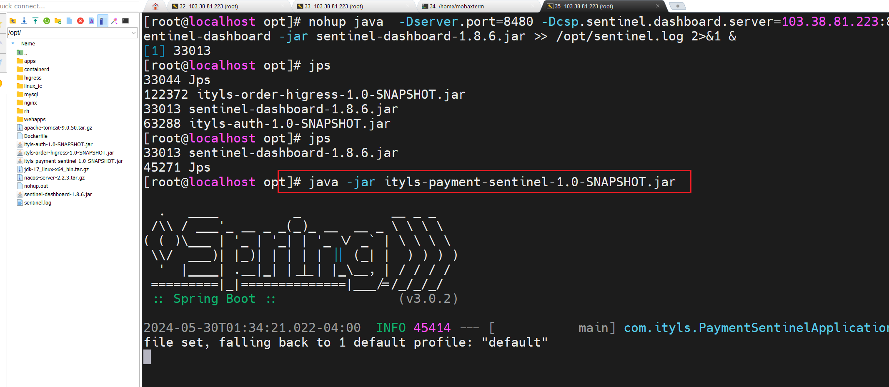
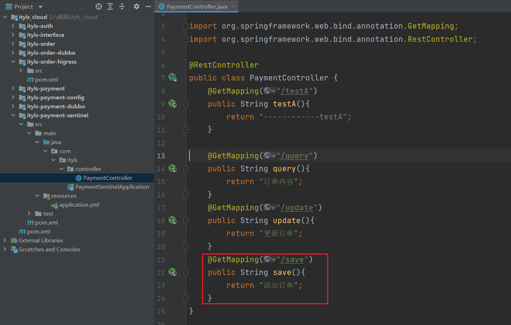
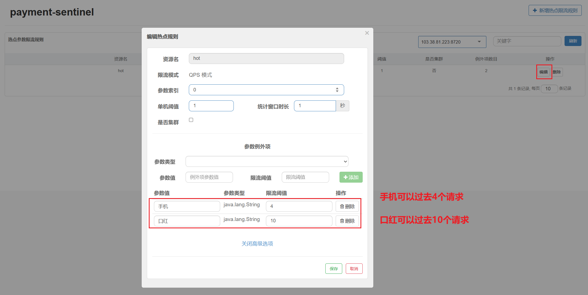
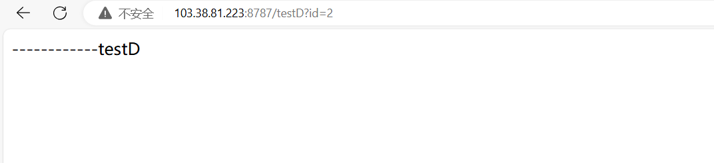

### 1, 认识分布式流量防护


在分布式系统中，服务之间的相互调用会生成分布式流量。如何通过组件进行流量防护，并有效控制流量，是分布式系统的技术挑战之一。


**什么是服务雪崩：**

假设我有一个微服务系统，这个系统内包含了 ABCD 四个微服务，这四个服务都是以集群模式构建的。


**雪崩问题：**

微服务之间相互调用，因为调用链中的一个服务故障，引起整个链路都无法访问的情况。


**解决方案：**

- 超时机制
- 舱壁模式

- 熔断器
- 流量控制


**服务保护技术：**

- Hystrix
- Sentinel
- Resilience4J


**Sentinel 服务容错的思路：**

Sentinel 是 Spring Cloud Alibaba 的⼀款服务容错组件，我们也经常把它叫做“防流量哨兵”。它是阿里巴巴双十一促核心场景的保护神，内置了丰富的服务容错应用场景。它以流 量作为切入点，通过各种内外防控手段达到维持服务稳定性的目的。


**内部异常治理：**

在 Sentinel 中，我们可以采用降级和熔断的方式处理内部的异常。 所谓降级，是指当服务调用发生了响应超时、服务异常等情况时，我们在服务内部可以执行一段“降级逻辑”。


而所谓熔断，是指当异常调用量达到一定的判定条件，比如在异常降级和慢调用请求的比例达到⼀个阈值、窗口时间内降级请求达到⼀定数量的情况下，微服务在一段时间内停止对⽬标服务发起调用，所有来访请求直接执行降级逻辑。所以，熔断是“多次服务调用异常”累积的结果。


**外部流量控制：**

限流是流量整形流控方案的一种。在 Sentinel 中我们可以根据集群的处理能力，为每个服务设置⼀个限流规则，从 QPS 维度或者并发线程数的维度控制外部的访问流量。⼀旦访问量超过阈值，后续的请求就会被 “fast fail”，这是最为常用的⼀种限流手段。


### 2, 认识Sentinel


官网：https://sentinelguard.io/zh-cn/


Sentinel是阿里开源的项目，提供了流量控制、熔断降级、系统负载保护等多个维度来保障服务之间的稳定性。


**Sentinel 的历史：**

- 2012 年，Sentinel 诞生，主要功能为入口流量控制。
- 2013-2017 年，Sentinel 在阿里巴巴集团内部迅速发展，成为基础技术模块，覆盖了所有的核心场景。
- 2018 年，Sentinel 开源，并持续演进。
- 2019 年，Sentinel 朝着多语言扩展的方向不断探索，推出 [C++ 原生版本](https://github.com/alibaba/sentinel-cpp)，同时针对 Service Mesh 场景也推出了 [Envoy 集群流量控制支持](https://github.com/alibaba/Sentinel/tree/master/sentinel-cluster/sentinel-cluster-server-envoy-rls)，以解决 Service Mesh 架构下多语言限流的问题。
- 2020 年，推出 [Sentinel Go 版本](https://github.com/alibaba/sentinel-golang)，继续朝着云原生方向演进。
- 2021 年，Sentinel 正在朝着 2.0 云原生高可用决策中心组件进行演进；同时推出了 [Sentinel Rust 原生版本](https://github.com/sentinel-group/sentinel-rust)。同时我们也在 Rust 社区进行了 Envoy WASM extension 及 eBPF extension 等场景探索。
- 2022 年，Sentinel 品牌升级为流量治理，领域涵盖流量路由/调度、流量染色、流控降级、过载保护/实例摘除等；同时社区将流量治理相关标准抽出到 [OpenSergo 标准](https://opensergo.io/zh-cn/)中，Sentinel 作为流量治理标准实现。


**Sentinel 基本概念之资源：**

资源是 Sentinel 的关键概念。它可以是 Java 应用程序中的任何内容，例如，由应用程序提供的服务，或由应用程序调用的其它应用提供的服务，甚至可以是一段代码。只要通过 Sentinel API 定义的代码，就是资源，能够被 Sentinel 保护起来。大部分情况下，可以使用方法签名，URL，甚至服务名称作为资源名来标示资源。


**Sentinel 基本概念之规则：**

围绕资源的实时状态设定的规则，可以包括流量控制规则、熔断降级规则以及系统保护规则。所有规则可以动态实时调整。


**Sentinel 的主要特性：**


**特性：**

- 丰富的应用场景：Sentinel 承接了阿里巴巴近 10 年的双十一大促流量的核心场景，例如秒杀(即突发流量控制在系统容量可以承受的范围)、消息削峰填谷、集群流量控制、实时熔断下游不可用应用等。
- 完备的实时监控：Sentinel 同时提供实时的监控功能。您可以在控制台中看到接入应用的单台机器秒级数据，甚至 500 台以下规模的集群的汇总运行情况。
- 广泛的开源生态：Sentinel 提供开箱即用的与其它开源框架/库的整合模块，例如与 Spring Cloud、Dubbo、gRPC 的整合。您只需要引入相应的依赖并进行简单的配置即可快速地接入 Sentinel。
- 完善的 SPI 扩展点：Sentinel 提供简单易用、完善的 SPI 扩展接口。您可以通过实现扩展接口来快速地定制逻辑。例如定制规则管理、适配动态数据源等。


**Sentinel 分为两个部分：**

- 控制台（Dashboard）：Dashboard 主要负责管理推送规则、监控、管理机器信息等。
- 核心库（Java 客户端）：不依赖任何框架/库，能够运行于 Java 8 及以上的版本的运行时环境，同时对 Dubbo / Spring Cloud 等框架也有较好的支持。

Sentinel 可以简单的分为 Sentinel 核心库和 Dashboard。核心库不依赖 Dashboard，但是结合 Dashboard 可以取得最好的效果。


**Sentinel 的主要工作机制如下：**

- 对主流框架提供适配或者显示的 API，来定义需要保护的资源，并提供设施对资源进行实时统计和调用链路分析。
- 根据预设的规则，结合对资源的实时统计信息，对流量进行控制。同时，Sentinel 提供开放的接口，方便您定义及改变规则。
- Sentinel 提供实时的监控系统，方便您快速了解目前系统的状态。


**Sentinel 与 Hystrix、resilience4j 的对比：**

| Sentinel       | Hystrix                                                    | resilience4j            |                                  |
| -------------- | ---------------------------------------------------------- | ----------------------- | -------------------------------- |
| 隔离策略       | 信号量隔离（并发线程数限流）                               | 线程池隔离/信号量隔离   | 线程池隔离/信号量隔离            |
| 熔断降级策略   | 基于响应时间、异常比率、异常数                             | 基于异常比率            | 基于异常比率、响应时间           |
| 实时统计实现   | 滑动窗口（LeapArray）                                      | 滑动窗口（基于 RxJava） | Ring Bit Buffer                  |
| 动态规则配置   | 支持多种数据源                                             | 支持多种数据源          | 有限支持                         |
| 扩展性         | 多个扩展点                                                 | 插件的形式              | 接口的形式                       |
| 基于注解的支持 | 支持                                                       | 支持                    | 支持                             |
| 限流           | 基于 QPS，支持基于调用关系的限流                           | 有限的支持              | Rate Limiter                     |
| 流量整形       | 支持预热模式、匀速器模式、预热排队模式                     | 不支持                  | 简单的 Rate Limiter 模式         |
| 系统自适应保护 | 支持                                                       | 不支持                  | 不支持                           |
| 控制台         | 提供开箱即用的控制台，可配置规则、查看秒级监控、机器发现等 | 简单的监控查看          | 不提供控制台，可对接其它监控系统 |


### 3, 安装Sentinel控制台

Sentinel 提供一个轻量级的开源控制台，它提供机器发现以及健康情况管理、监控（单机和集群），规则管理和推送的功能。


**Sentinel 控制台包含如下功能：**

- 查看机器列表以及健康情况：收集 Sentinel 客户端发送的心跳包，用于判断机器是否在线。

- 监控 (单机和集群聚合**)**：通过 Sentinel 客户端暴露的监控 API，定期拉取并且聚合应用监控信息，最终可以实现秒级的实时监控。

- 规则管理和推送：统一管理推送规则。

- 鉴权：生产环境中鉴权非常重要。这里每个开发者需要根据自己的实际情况进行定制。

  

注意：Sentinel 控制台目前仅支持单机部署。Sentinel 控制台项目提供 Sentinel 功能全集示例，不作为开箱即用的生产环境控制台，若希望在生产环境使用请根据[文档](https://github.com/alibaba/Sentinel/wiki/%E5%9C%A8%E7%94%9F%E4%BA%A7%E7%8E%AF%E5%A2%83%E4%B8%AD%E4%BD%BF%E7%94%A8-Sentinel)自行进行定制和改造。


**获取 Sentinel 控制台：**

您可以从<https://github.com/alibaba/Sentinel/releases>下载最新版本的控制台 jar 包。


把jar包扔到服务器上：


关掉网关：


**启动 Sentinel 控制台：**启动 Sentinel 控制台需要 JDK 版本为 1.8 及以上版本。

```
#前台运行
java -Dserver.port=8081 -Dcsp.sentinel.dashboard.server=103.38.81.223:8081 -Dproject.name=sentinel-dashboard -jar sentinel-dashboard-1.8.6.jar

#后台运行
nohup java  -Dserver.port=8480 -Dcsp.sentinel.dashboard.server=103.38.81.223:8480 -Dproject.name=sentinel-dashboard -jar sentinel-dashboard-1.8.6.jar >> /opt/sentinel.log 2>&1 &
```


**访问 Sentinel 控制台:**

在浏览器输入http://103.38.81.223:8480/即可，登录用户名密码都是sentinel。


### 4, 将应用接入Sentinel


创建新模块：


依赖：

```xml
    <dependencies>
        <!-- nacos依赖包  -->
        <!--<dependency>-->
        <!--    <groupId>com.alibaba.cloud</groupId>-->
        <!--    <artifactId>spring-cloud-starter-alibaba-nacos-discovery</artifactId>-->
        <!--</dependency>-->
        <!-- sentinel依赖-->
        <dependency>
            <groupId>com.alibaba.cloud</groupId>
            <artifactId>spring-cloud-starter-alibaba-sentinel</artifactId>
        </dependency>
        <dependency>
            <groupId>org.springframework.boot</groupId>
            <artifactId>spring-boot-starter-web</artifactId>
        </dependency>
        <!--借用监控开放端口-->
        <dependency>
            <groupId>org.springframework.boot</groupId>
            <artifactId>spring-boot-starter-actuator</artifactId>
        </dependency>
        <dependency>
            <groupId>org.projectlombok</groupId>
            <artifactId>lombok</artifactId>
        </dependency>
    </dependencies>
```


编写YML配置文件:


```yml
server:
  port: 8787
spring:
  application:
    #应用名字
    name: payment-sentinel
  cloud:
    sentinel:
      transport:
        # Sentinel 控制台地址
        dashboard: 103.38.81.223:8480
```


启动类：


```java
package com.ityls;

import lombok.extern.slf4j.Slf4j;
import org.springframework.boot.SpringApplication;
import org.springframework.boot.autoconfigure.SpringBootApplication;

@SpringBootApplication
@Slf4j
public class PaymentSentinelApplication
{
    public static void main( String[] args )
    {
        SpringApplication.run(PaymentSentinelApplication.class,args);
        log.info("************ PaymentSentinelApplication 启动成功 **********");
    }
}
```


编写controller:


```java
package com.ityls.controller;

import org.springframework.web.bind.annotation.GetMapping;
import org.springframework.web.bind.annotation.RestController;

@RestController
public class PaymentController {
    @GetMapping("/testA")
    public String testA(){
        return "------------testA";
    }
}
```


测试：


打包，扔到服务器上：




再测试：


### 5, 流量控制概述

监控应用流量的 QPS 或并发线程数，当达到指定的阈值时对流量进行控制，以避免被瞬时的流量高峰冲垮，从而保障应用的高可用性。


流量控制有以下几个角度:

- 资源的调用关系：例如资源的调用链路，资源和资源之间的关系；
- 运行指标：例如 QPS、线程池、系统负载等；
- 控制的效果：例如直接限流、冷启动、排队等。

注意：Sentinel 的设计理念是让您自由选择控制的角度，并进行灵活组合，从而达到想要的效果。


**流控规则：**


**参数：**

- **资源名**：其实就是我们请求的资源路径

- **针对来源**：这个是此流控规则对应那些微服务进行流控管理，一般填写调用方的微服务名称，多个用","分割

- **阈值类型**：一般有2中类型，QPS（每秒的最大请求数2）和线程数（并发线程数）

- **单机阈值**：单机状态下的最大限制值

- **是否集群**：根据实际情况选择


**流控模式：**


**参数：**

- **直接**：直接作用于当前资源，如果访问压力大于某个阈值，后续请求将被直接拦下来；
- **关联**：统计与当前资源相关的另一个资源，触发阈值时，对当前资源限流
- **链路**：当指定链路上的访问量⼤于某个阈值时，对当前资源进⾏限流，这⾥的“指定链 路”是细化到 API 级别的限流维度。


**流控效果：**


**参数：**

- **快速失败**：默认的流量控制方式，当QPS超过任意规则的阈值后，新的请求就会被立即拒绝，拒绝方式为抛出`FlowException`。

- **Warm Up**：即预热/冷启动方式。当系统长期处于低水位的情况下，当流量突然增加时，直接把系统拉升到高水位可能瞬间把系统压垮。通过"冷启动"，让通过的流量缓慢增加，在一定时间内逐渐增加到阈值上限，给冷系统一个预热的时间，避免冷系统被压。

- **排队等待**：匀速排队方式会严格控制请求通过的间隔时间，也即是让请求以均匀的速度通过，对应的是漏桶算法 。这种方式主要用于处理间隔性突发的流量。


### 6, 流控模式之直接模式

当 QPS 超过某个阈值的时候，则采取措施进行流量控制。若使用除了直接拒绝之外的流量控制效果，则调用关系限流策略（strategy）会被忽略。


表示1秒钟内查询1次就ok，若超过1次，就直接快速失败，报默认错误。


测试：


### 7, 流控模式之关联模式

当关联的资源达到阈值时，就限流自己。比如有两个接口，是存在竞争关系的，当请求1个接口时，会影响另一个接口的性能。定义如下两个接口：


```java
    //  /query和/update就存在竞争关系   当大量请求/update时，就会影响/query
    @GetMapping("/query")
    public String query(){
        return "订单内容";
    }
    @GetMapping("/update")
    public String update(){
        return "更新订单";
    }
```


打包，传到服务器上，如下：


查看：


配置：


测试：


### 8, 流控模式之链路模式

链路流控模式指的是，当从某个接口过来的资源达到限流条件时，开启限流。它的功能有点类似于针对来源配置项，区别在于：**针对来源是针对上级微服务，而链路流控是针对上级接口，也就是说它的粒度更细。**

**配置示例**：

例如有两条请求链路：

- /test1 --> /common
- /test2 --> /common


如果只希望统计从/test2进入到/common的请求，则可以这样配置：


需求：有查询订单和创建订单业务，两者都需要查询商品。针对从查询订单进入到查询商品的请求统计，并设置限流。


添加订单：




如果想让service中的方法，出现在簇点链路中，只需要添加一个注解（表示它是一个资源）：


```java
@Service
public class GoodsService {

    @SentinelResource("/goods")
    public String queryGoods(){
        return "商品信息";
    }
}
```


在controller中注入：


```java
@RestController
public class PaymentController {

    @Autowired
    private GoodsService goodsService;

    @GetMapping("/testA")
    public String testA(){
        return "------------testA";
    }

    @GetMapping("/query")
    public String query(){
        System.out.println(goodsService.queryGoods());;
        return "订单内容";
    }
    @GetMapping("/update")
    public String update(){
        return "更新订单";
    }
    @GetMapping("/save")
    public String save(){
        System.out.println(goodsService.queryGoods());;
        return "添加订单";
    }
}
```


还需要做一个配置：


重新打包，上线，部署：


查看：


测试：


### 9, 流控效果之预热

warm up也叫预热模式**，**是应对服务冷启动的一种方案。


QPS为10.刚刚启动时，大部分请求失败，成功的只有3个，说明QPS被限定在3，随着时间推移，成功比例越来越高。


有如下接口：


配置：


测试：


### 10, 热点参数限流

**什么是热点：**

热点即经常访问的数据。


**例子：**

- 手机热点： 华为手机、苹果手机等

- 化妆品热点： 迪奥口红、香奈儿香水等


**热点参数限流**，给/findById这个资源添加热点参数限流，规则如下：

- 默认的热点参数规则是每1秒请求量不超过2
- 给102这个参数设置例外：每1秒请求量不超过4
- 给103这个参数设置例外：每1秒请求量不超过10


热点参数限流对默认的SpringMVC资源无效，需要利用@SentinelResource注解标记资源。


再写一个接口：


```java
@RestController
@RequestMapping("/goods")
public class GoodsController {

    @SentinelResource("hot")
    @GetMapping("/getGoods")
    public String goods(String goodsName){
        return goodsName;
    }
}
```


打包，上线，部署，如下：


测试：


配置：





测试：


### 11, 线程隔离

限流是一种预防措施，虽然限流可以尽量避免因高并发而引起的服务故障，但服务还会因为其它原因而故障。而要将这些故障控制在一定范围，避免雪崩，就要靠**线程隔离**（舱壁模式）和**熔断降级**手段了。


**线程隔离（舱壁模式）：**

- 线程池隔离
- 信号量隔离（Sentinel默认采用）


- **线程池隔离**：给每个服务调用业务分配一个线程池，利用线程池本身实现隔离效果
- **信号量隔离**：不创建线程池，而是计数器模式，记录业务使用的线程数量，达到信号量上限时，禁止新的请求。


在添加限流规则时，可以选择两种阈值类型：


- QPS：每秒的请求数
- 线程数：该资源能使用用的Tomcat线程数的最大值。也就是通过限制线程数量，实现线程隔离（舱壁模式）。


配置：


测试：


### 12, 熔断降级


熔断降级是解决雪崩问题的重要手段。其思路是由断路器统计服务调用的异常比例、慢请求比例，如果超出阈值则会熔断该服务。即拦截访问该服务的一切请求；而当服务恢复时，断路器会放行访问该服务的请求。


**断路器控制熔断和放行是通过状态机来完成的：**


**状态机包括三个状态：**

- closed：关闭状态，断路器放行所有请求，并开始统计异常比例、慢请求比例。超过阈值则切换到open状态
- open：打开状态，服务调用被熔断，访问被熔断服务的请求会被拒绝，快速失败，直接走降级逻辑。Open状态5秒后会进入half-open状态
- half-open：半开状态，放行一次请求，根据执行结果来判断接下来的操作。 请求成功：则切换到closed状态 请求失败：则切换到open状态


**熔断降级策略：**

- 慢调用：业务的响应时长（RT）大于指定时长的请求认定为慢调用请求。在指定时间内，如果请求数量超过设定的最小数量，慢调用比例大于设定的阈值，则触发熔断。

- 异常比例、异常数：统计指定时间内的调用，如果调用次数超过指定请求数，并且出现异常的比例达到设定的比例阈值（或超过指定异常数），则触发熔断。


### 13, 熔断降级之慢调用

平均响应时间当1s内持续进入5个请求，对应时刻的平均响应时间(秒级)均超过阈值，那么在接下的时间窗口之内，对这个方法的调用都会自动地熔断(抛出DegradeException )。


新接口：


```java
    @GetMapping("/testC")
    public String testC(Integer id) throws InterruptedException{
        if (id == 1){
            Thread.sleep(2000);
        }
        return "------------testC";
    }
```


打包，上传，部署，测试：


配置：


超过50ms的请求都会被认为是慢请求，当异常比例达到百分之40，断路器打开(保险丝跳闸)微服务不可用，保险丝跳闸断电了。过5秒钟由断路器又打开状态变为半开状态放一部分请求进来。


测试：


### 14, 熔断降级之异常比例

当资源每秒异常总数占通过量的比值超过阈值之后，资源进入降级状态。异常比率的阈值范围是 [0.0,1.0]。


新建一个接口：


```java
    @GetMapping("/testD")
    public String testD(Integer id) throws InterruptedException{
        if (id == 1){
            throw new RuntimeException("故意抛出异常，触发异常比例熔断");
        }
        return "------------testD";
    }
```


打包，部署：


测试：




配置：


在5次请求中，**只要异常比例超过0.4，也就是有2次以上的异常，就会触发熔断**。


测试：


### 15, 熔断降级之异常数

异常数：当资源近1分钟的异常数目超过阈值之后会进行熔断。


```java
    @GetMapping("/testF")
    public String testF(){
        int age = 10/0;
        return "------------testF";
    }
```


打包，部署：


测试：


配置：


测试：


### 16, 授权规则

授权规则可以对调用方的来源做控制，有白名单和黑名单两种方式。

- 白名单：来源（origin）在白名单内的调用者允许访问
- 黑名单：来源（origin）在黑名单内的调用者不允许访问


点击左侧菜单的授权，可以看到授权规则：


- 资源名：就是受保护的资源，例如/payment/{query}
- 流控应用：是来源者的名单，
  - 如果是勾选白名单，则名单中的来源被许可访问。
  - 如果是勾选黑名单，则名单中的来源被禁止访问。


我们允许请求从gateway到payment服务，不允许浏览器访问payment，那么白名单中就要填写**网关的来源名称（origin）**。


打开网关：


测试：


添加依赖：


配置：


```yml
server:
  port: 8787
spring:
  application:
    #应用名字
    name: payment-sentinel
  cloud:
    nacos:
      discovery:
        server-addr: 103.38.81.223:8848
    sentinel:
      transport:
        # Sentinel 控制台地址
        dashboard: 103.38.81.223:8480
      # 关闭context整合
      web-context-unify: false
```


添加接口：


根据origin来判断请求是从哪里过来的：


从请求头中获取origin:


```java
package com.ityls.config;

import com.alibaba.csp.sentinel.adapter.spring.webmvc.callback.RequestOriginParser;
import com.alibaba.nacos.common.utils.StringUtils;
import jakarta.servlet.http.HttpServletRequest;
import org.springframework.stereotype.Component;

// 从请求头中获取origin值
@Component
public class GetParseOrigin implements RequestOriginParser {


    /**
     * 从请求头中获取origin值
     * @param httpServletRequest
     * @return
     */
    @Override
    public String parseOrigin(HttpServletRequest httpServletRequest) {
        String origin = httpServletRequest.getHeader("origin");
        if (StringUtils.isEmpty(origin)){
            origin = "blank";

        }
        return origin;
    }
}
```

这个方法的作用就是从request对象中，获取请求者的origin值并返回。默认情况下，sentinel不管请求者从哪里来，返回值永远是default，也就是说一切请求的来源都被认为是一样的值default。因此，我们需要自定义这个接口的实现，让不同的请求，返回不同的origin。


项目打包，部署：


测试：


添加授权规则：


再次测试：


打开网关：


### 17, 系统自适应限流

**引入系统自适应限流的主要的目的：**

- 保证系统不被拖垮
- 在系统稳定的前提下保证系统的吞吐量。


**系统规则：**

Sentinel的系统保护规则是从应用级别的入口流量进行控制，从单台机器的 load、CPU 使用率、平均 RT、入口 QPS 和并发线程数等几个维度监控应用指标，让系统尽可能跑在最大吞吐量的同时保证系统整体的稳定性。


系统保护规则是应用整体维度的，而不是资源维度的，并且**仅对入口流量生效**。入口流量指的是进入应用的流量（`EntryType.IN`），比如 Web 服务或 Dubbo 服务端接收的请求，都属于入口流量。


**系统规则支持以下的模式：**

- **Load 自适应**（仅对 Linux/Unix-like 机器生效）：系统的 load1 作为启发指标，进行自适应系统保护。当系统 load1 超过设定的启发值，且系统当前的并发线程数超过估算的系统容量时才会触发系统保护（BBR 阶段）。系统容量由系统的 `maxQps * minRt` 估算得出。设定参考值一般是 `CPU cores * 2.5`。
- **CPU usage**：当系统 CPU 使用率超过阈值即触发系统保护（取值范围 0.0-1.0），比较灵敏。
- **平均 RT**：当单台机器上所有入口流量的平均 RT 达到阈值即触发系统保护，单位是毫秒。
- **并发线程数**：当单台机器上所有入口流量的并发线程数达到阈值即触发系统保护。
- **入口 QPS**：当单台机器上所有入口流量的 QPS 达到阈值即触发系统保护。


**查看cpu核数**

> cat /proc/cpuinfo | grep "processor" | wc -l


### 18, SentinelResource注解配置详解之只配置fallback

服务降级功能，但是只是限制后，返回不可控的结果肯定是不行的，我们还要保证调用者在调用那些被限制的服务时候，不管是不是被限制，都要让他们拿到一个合理的结果，而不是扔回去一个异常就完事了。

Sentinel提供了这样的功能，让我们可以另外定义一个方法来代替被限制或异常服务返回数据，这就是**fallback和blockHandler**。

- fallback：针对Java本身出现的异常进行处理的对应属性。
- blockHandler：针对违反Sentinel控制台配置规则时触发BlockException异常时对应处理的属性

@SentinelResource注解用于定义资源，并提供可选的 BlockException 异常处理（仅处理Sentinel控制台配置相关异常） 和 fallback 配置项（运行时异常以及自定义异常）。


**注解属性:**

- `value`：资源名称，必需项（不能为空）
- `entryType`：entry 类型，可选项（默认为 `EntryType.OUT`）
- `blockHandler` / `blockHandlerClass`: `blockHandler` 对应处理 `BlockException` 的函数名称，可选项。blockHandler 函数访问范围需要是 `public`，返回类型需要与原方法相匹配，参数类型需要和原方法相匹配并且最后加一个额外的参数，类型为 `BlockException`。blockHandler 函数默认需要和原方法在同一个类中。若希望使用其他类的函数，则可以指定 `blockHandlerClass` 为对应的类的 `Class` 对象，注意对应的函数必需为 static 函数，否则无法解析。
- `fallback / fallbackClass` ：fallback 函数名称,可选项，通常用于通用的 fallback 逻辑（即可以用于很多服务或方法）。默认 fallback 函数可以针对所有类型的异常（除了 `exceptionsToIgnore` 里面排除掉的异常类型）进行处理。若同时配置了 fallback 和 defaultFallback，则只有 fallback 会生效。
- `defaultFallback`（since 1.6.0）：默认的 fallback 函数名称
- `exceptionsToIgnore`（since 1.6.0）：用于指定哪些异常被排除掉，不会计入异常统计中，也不会进入 fallback 逻辑中，而是会原样抛出。


测试：


上面的提示并不优雅。添加测试接口：


```java
    @SentinelResource(value = "testFallback",fallback = "testFallback")
    @GetMapping("findById")
    public String findById(Long id){
        if (id == 1){
            throw new RuntimeException("出异常了");
        }
        return "支付信息";
    }
    // 降级
    public String testFallback(Long id,Throwable e){
        return "系统异常了";
    }
```


打包，部署，测试：


浏览器测试：


之前显示的信息如下：


fallback 函数位置是有要求的，必须和原方法在同一个类中，但在实际需求中，我们需要放在其他类中。@SentinelResource提供了**通过fallbackClass指定对应的类的Class对象**，添加一个static，否则无法解析。


```java
package com.ityls.fallback;

import org.springframework.stereotype.Service;

@Service
public class PaymentFallback {
    /**
     * 降级方法
     * @param id
     * @param e
     * @return
     */
    public static String findById(Long id,Throwable e){
        return "服务繁忙稍等一会~~~~";
    }
}
```


修改注解：


```java
    @SentinelResource(value = "testFallback",fallbackClass = PaymentFallback.class,fallback = "findById")
    @GetMapping("findById")
    public String findById(Long id){
        if (id == 1){
            throw new RuntimeException("出异常了");
        }
        return "支付信息";
    }
```


### 19, SentinelResource配置详解之只配置blockHandler

超出流量限制的部分是否会进入到blockHandler的方法，要注意是超出流量限制的请求调用，会进入blockHandler方法。


新建接口：


```java
    @SentinelResource(value = "block",blockHandler = "testblockHandler")
    @GetMapping("/block")
    public String block(Long id){
        if (id == 1){
            System.out.println(10/0);
        }
        return "支付信息";
    }
    public String testblockHandler(Long id, BlockException e){
        return "限流降级处理，服务繁忙！";
    }
```


打包，部署，测试：


配置熔断：


测试：


外置类：


```java
package com.ityls.blockhandler;

import com.alibaba.csp.sentinel.slots.block.BlockException;
import org.springframework.stereotype.Service;

@Service
public class PaymentBlockHandler {
    //处理sentinel熔断异常
    public static String  blockHandler(Long id, BlockException e) {
        return "服务繁忙稍等一会~~~~";
    }
}
```


使用：

```java
    @SentinelResource(value = "block",blockHandlerClass = PaymentBlockHandler.class,blockHandler = "blockHandler")
    @GetMapping("/block")
    public String  block(Long id){
        if (id == 1){
            System.out.println(10/0);
        }

        return "block";
    }
```


**总结:**

- 流控的blockHandler自定义资源必须为public static 函数 @SentinelResource注解的value与@RequestMapping的value不一样
- 流控规则配置的资源名与@SentinelResource注解的value保持一致，才会执行@SentinelResource注解里定义的兜底方法
- 注意blockHandler 是对应处理 BlockException 的函数，而不是BlockedException


### 20, SentinelResource配置详解之fallback和blockHandler配置


配置如下：

```java
    @SentinelResource(value = "findByPaymenId",fallback = "fallbackHandler",blockHandler = "blockHandler")
    @GetMapping("findByPaymenId")
    public String findByPaymenId(Long id){
        if(id == 1){
            System.out.println(10/0);
        }

        return "支付记录查询成功";
    }

    // 处理java异常
    public String fallbackHandler(Long id,Throwable throwable){
        return "处理java异常";
    }

    // 处理sentienl 限流或者熔断
    public String blockHandler(Long id,BlockException e){
        return "处理sentienl";
    }
```


**总结:**

- fallback是针对方法出现异常了，则会进入fallback方法。
- blockhandler是针对流控设置，超出规则，则会进入blockhandler方法。
- blockHandler 和 fallback 都进行了配置，则被限流降级而抛出BlockException时只会进入 blockHandler 处理逻辑。
- 若未配置 blockHandler、fallback 和 defaultFallback，则被限流降级时会将 BlockException 直接抛出。


