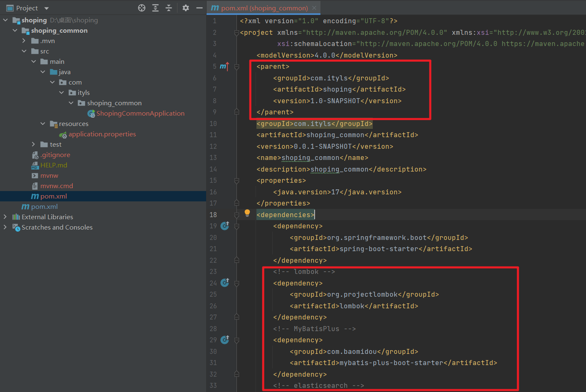
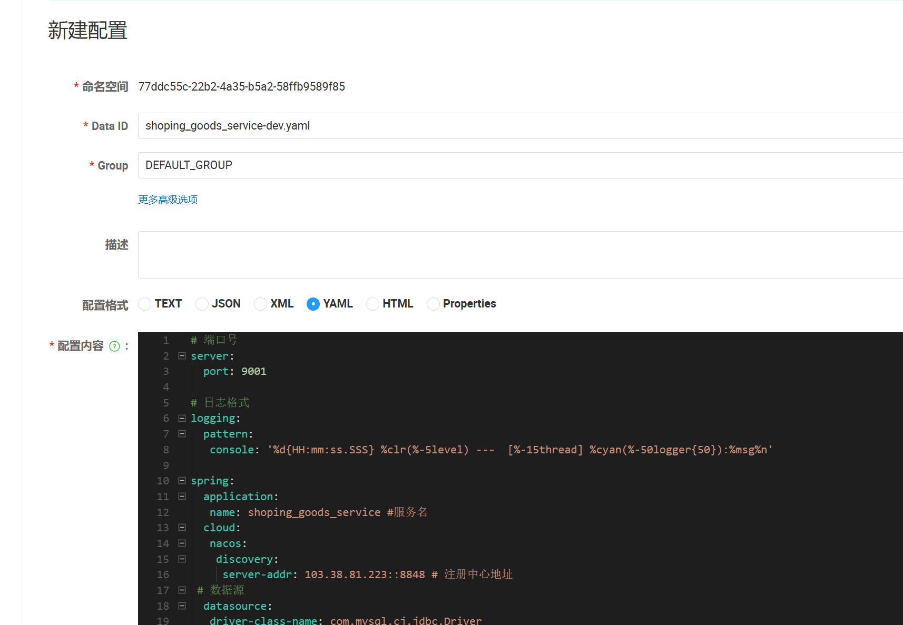
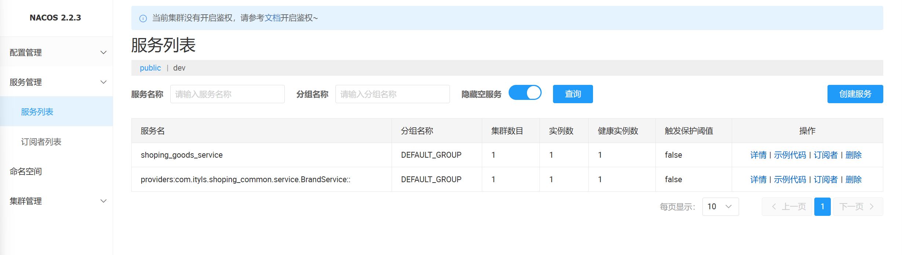
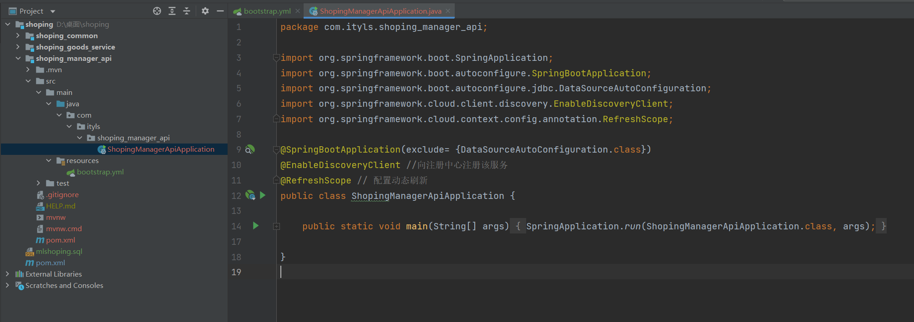
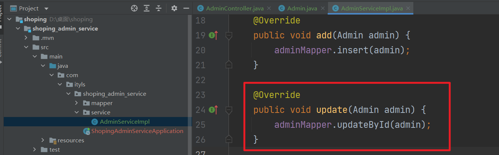
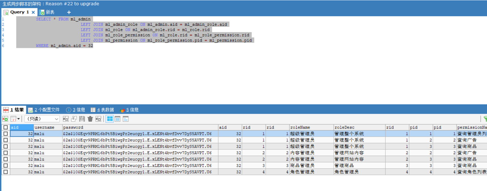
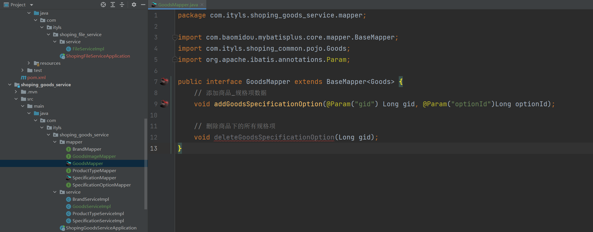

### 1，项目介绍

项目采用前后端分离+微服务架构进行开发。前端开发使用了vue.js，后端使用Spring Cloud Alibaba全家桶开发。项目包含电商系统的大部分功能，分为商家端和用户端。商家端有权限管理、商品管理、广告管理等功能。用户端有用户注册和登录、搜索商品、添加购物车、商品下单、支付、秒杀商品等功能。学习本项目后，可以对电商项目和分布式解决方案有更深的理解。


**商家端的主要功能有：**

1. 管理员管理
2. 角色管理
3. 权限管理
4. 认证和授权
5. 品牌管理
6. 商品类型管理
7. 商品规格管理
8. 商品管理
9. 秒杀商品管理
10. 广告管理


**用户端的主要功能有：**

1. 用户注册
2. 用户登录
3. 商品搜索
4. 购物车管理
5. 商品下单
6. 支付
7. 秒杀商品


**项目技术选型：**

1. 开发操作系统：Windows11
2. 开发工具：IDEA2023
3. 服务器操作系统：Centos7
4. JAVA版本：JDK17
5. 数据库：Mysql5.7 + Navicat
6. 后端框架：SpringBoot3 + SpringMVC + Mybatis-Plus
7. 权限控制：SpringSecurity
8. 服务治理/配置中心：Nacos
9. 云原生网关：Higress
10. 分布式调用：Dubbo
11. 分布式鉴权：JWT
12. 分布式事务：Seata
13. 分布式文件存储：FastDFS
14. 分布式锁：Redisson
15. 流量防护：Sentinel
16. 消息队列：RocketMQ
17. Nosql：Redis
18. 搜索引擎：Elasticsearch8 + kibana8
19. 容器化技术：Docker
20. 反向代理工具：Nginx
21. 内网穿透：Natapp
22. 测试工具：Postman + JMeter
23. 短信平台：阿里短信平台
24. 支付平台：支付宝
25. 其他技术：lombok


**项目架构：**


**数据库表结构：**

| 表名称                        | 含义              |
| ----------------------------- | ----------------- |
| ml_admin                      | 管理员            |
| ml_role                       | 角色              |
| ml_admin_role                 | 管理员角色中间表  |
| ml_permission                 | 权限              |
| ml_role_permission            | 角色权限中间表    |
| ml_brand                      | 品牌              |
| ml_product_type               | 商品类型          |
| ml_specification              | 商品规格          |
| ml_specification_option       | 规格项            |
| ml_goods                      | 商品              |
| ml_goods_image                | 商品图片          |
| ml_goods_specification_option | 商品_规格项中间表 |
| ml_seckill_goods              | 秒杀商品          |
| ml_category                   | 广告              |
| ml_shopping_user              | 商城用户          |
| ml_province                   | 省/市/自治区      |
| ml_city                       | 城市              |
| ml_area                       | 区/县             |
| ml_address                    | 用户地址          |
| ml_order                      | 订单              |
| ml_cart_goods                 | 订单产品          |
| ml_payment                    | 支付记录          |


### 2，创建项目

创建名为`shopping`的普通maven工程，删除`src`文件夹，修改`pom`文件，将`shopping`工程设置为父工程，并指定依赖版本。


pom.xml

```xml
<?xml version="1.0" encoding="UTF-8"?>

<project xmlns="http://maven.apache.org/POM/4.0.0" xmlns:xsi="http://www.w3.org/2001/XMLSchema-instance"
  xsi:schemaLocation="http://maven.apache.org/POM/4.0.0 http://maven.apache.org/xsd/maven-4.0.0.xsd">
  <modelVersion>4.0.0</modelVersion>

  <groupId>com.ityls</groupId>
  <artifactId>shoping</artifactId>
  <version>1.0-SNAPSHOT</version>
  <packaging>pom</packaging>

  <name>shoping</name>
  <!-- FIXME change it to the project's website -->
  <url>http://www.example.com</url>

  <properties>
    <java.version>17</java.version>
    <dubbo.version>3.2.4</dubbo.version>
    <project.build.sourceEncoding>UTF-8</project.build.sourceEncoding>
    <project.reporting.outputEncoding>UTF-8</project.reporting.outputEncoding>
    <spring-boot.version>3.0.2</spring-boot.version>
    <spring-cloud.version>2022.0.0</spring-cloud.version>
    <spring-cloud-alibaba.version>2022.0.0.0</spring-cloud-alibaba.version>
    <lombok.version>1.18.28</lombok.version>
    <mybatis-plus.version>3.5.4</mybatis-plus.version>
  </properties>

  <!-- 依赖版本声明 -->
  <dependencyManagement>
    <dependencies>
      <!-- Spring Cloud版本-->
      <dependency>
        <groupId>org.springframework.cloud</groupId>
        <artifactId>spring-cloud-dependencies</artifactId>
        <version>${spring-cloud.version}</version>
        <type>pom</type>
        <scope>import</scope>
      </dependency>

      <!-- Spring Cloud Alibaba版本 -->
      <dependency>
        <groupId>com.alibaba.cloud</groupId>
        <artifactId>spring-cloud-alibaba-dependencies</artifactId>
        <version>${spring-cloud-alibaba.version}</version>
        <type>pom</type>
        <scope>import</scope>
      </dependency>

      <!-- SpringBoot版本 -->
      <dependency>
        <groupId>org.springframework.boot</groupId>
        <artifactId>spring-boot-dependencies</artifactId>
        <version>${spring-boot.version}</version>
        <type>pom</type>
        <scope>import</scope>
      </dependency>

      <!-- Dubbo版本 -->
      <dependency>
        <groupId>org.apache.dubbo</groupId>
        <artifactId>dubbo-bom</artifactId>
        <version>${dubbo.version}</version>
        <type>pom</type>
        <scope>import</scope>
      </dependency>

      <!-- lombok版本 -->
      <dependency>
        <groupId>org.projectlombok</groupId>
        <artifactId>lombok</artifactId>
        <version>${lombok.version}</version>
      </dependency>

      <!-- mybatis-plus版本 -->
      <dependency>
        <groupId>com.baomidou</groupId>
        <artifactId>mybatis-plus-boot-starter</artifactId>
        <version>${mybatis-plus.version}</version>
      </dependency>
    </dependencies>
  </dependencyManagement>

  <!-- 通用依赖 -->
  <dependencies>
    <!-- bootstrap启动器 -->
    <dependency>
      <groupId>org.springframework.cloud</groupId>
      <artifactId>spring-cloud-starter-bootstrap</artifactId>
    </dependency>
  </dependencies>

  <!-- 插件 -->
  <build>
    <plugins>
      <plugin>
        <groupId>org.apache.maven.plugins</groupId>
        <artifactId>maven-compiler-plugin</artifactId>
        <configuration>
          <source>${java.version}</source>
          <target>${java.version}</target>
          <encoding>${project.build.sourceEncoding}</encoding>
        </configuration>
      </plugin>
    </plugins>
  </build>

  <!-- 依赖仓库路径 -->
  <repositories>
    <repository>
      <id>public</id>
      <name>aliyun nexus</name>
      <url>https://maven.aliyun.com/repository/public</url>
      <releases>
        <enabled>true</enabled>
      </releases>
    </repository>
  </repositories>

  <!-- 插件仓库路径 -->
  <pluginRepositories>
    <pluginRepository>
      <id>public</id>
      <name>aliyun nexus</name>
      <url>https://maven.aliyun.com/repository/public</url>
      <releases>
        <enabled>true</enabled>
      </releases>
      <snapshots>
        <enabled>false</enabled>
      </snapshots>
    </pluginRepository>
  </pluginRepositories>
</project>
```


使用Nacos时，我们需要使用Dubbo进行服务调用，此时我们需要构建一个通用模块，在通用模块中存放服务接口。除了服务接口，我们还会存放一些实体类、工具类等通用功能，每个模块都会引用通用模块。


创建名为`shopping_common`的SpringBoot工程，添加相关依赖。





依赖：

```xml
    <dependencies>
        <dependency>
            <groupId>org.springframework.boot</groupId>
            <artifactId>spring-boot-starter</artifactId>
        </dependency>
        <!-- lombok -->
        <dependency>
            <groupId>org.projectlombok</groupId>
            <artifactId>lombok</artifactId>
        </dependency>
        <!-- MyBatisPlus -->
        <dependency>
            <groupId>com.baomidou</groupId>
            <artifactId>mybatis-plus-boot-starter</artifactId>
        </dependency>
        <!-- elasticsearch -->
        <dependency>
            <groupId>org.springframework.boot</groupId>
            <artifactId>spring-boot-starter-data-elasticsearch</artifactId>
        </dependency>
        <dependency>
            <groupId>org.springframework.boot</groupId>
            <artifactId>spring-boot-starter-test</artifactId>
            <scope>test</scope>
        </dependency>
    </dependencies>
```


设置该工程的父工程为`shoping`

```xml
    <parent>
        <groupId>com.ityls</groupId>
        <artifactId>shoping</artifactId>
        <version>1.0-SNAPSHOT</version>
    </parent>
```


给`shopping`工程设置通用子模块

```xml
  <!-- 子模块  -->
  <modules>
    <!-- 通用模块，包含实体类、服务接口、工具类等 -->
    <module>shoping_common</module>
  </modules>
```


创建pojo文件夹，编写实体类。


由于通用模块只会被其他模块引用，而不会启动，所以可以删除启动类。


创建名为mlshoping的数据库，将数据库脚本导入mysql中。


在通用模块添加`service`包存放服务接口，添加`util`包存放工具类。


### 3，创建商品服务模块


接下来我们编写整个项目的第一个功能：根据id查询品牌。品牌和商品有关，所以品牌管理的代码写在商品服务模块中。首先创建商品服务模块。


创建名为`shoping_goods_service`的SpringBoot工程，添加相关依赖。


pom.xml

```xml
<?xml version="1.0" encoding="UTF-8"?>
<project xmlns="http://maven.apache.org/POM/4.0.0" xmlns:xsi="http://www.w3.org/2001/XMLSchema-instance"
         xsi:schemaLocation="http://maven.apache.org/POM/4.0.0 https://maven.apache.org/xsd/maven-4.0.0.xsd">
    <modelVersion>4.0.0</modelVersion>
    <parent>
        <groupId>com.ityls</groupId>
        <artifactId>shoping</artifactId>
        <version>1.0-SNAPSHOT</version>
    </parent>
    <groupId>com.ityls</groupId>
    <artifactId>shoping_goods_service</artifactId>
    <version>0.0.1-SNAPSHOT</version>
    <name>shoping_goods_service</name>
    <description>shoping_goods_service</description>
    <properties>
        <java.version>17</java.version>
    </properties>
    <dependencies>
        <!-- MyBatisPlus -->
        <dependency>
            <groupId>com.baomidou</groupId>
            <artifactId>mybatis-plus-boot-starter</artifactId>
        </dependency>
        <!-- mysql驱动 -->
        <dependency>
            <groupId>mysql</groupId>
            <artifactId>mysql-connector-java</artifactId>
            <scope>runtime</scope>
        </dependency>
        <dependency>
            <groupId>com.ityls</groupId>
            <artifactId>shoping_common</artifactId>
            <version>0.0.1-SNAPSHOT</version>
        </dependency>
        <dependency>
            <groupId>org.springframework.boot</groupId>
            <artifactId>spring-boot-starter-test</artifactId>
            <scope>test</scope>
        </dependency>
        <!-- dubbo -->
        <dependency>
            <groupId>org.apache.dubbo</groupId>
            <artifactId>dubbo-spring-boot-starter</artifactId>
        </dependency>
        <dependency>
            <groupId>org.apache.dubbo</groupId>
            <artifactId>dubbo-registry-nacos</artifactId>
        </dependency>
        <!-- nacos -->
        <dependency>
            <groupId>com.alibaba.cloud</groupId>
            <artifactId>spring-cloud-starter-alibaba-nacos-config</artifactId>
        </dependency>
        <dependency>
            <groupId>com.alibaba.cloud</groupId>
            <artifactId>spring-cloud-starter-alibaba-nacos-discovery</artifactId>
        </dependency>
    </dependencies>

    <build>
        <plugins>
            <plugin>
                <groupId>org.springframework.boot</groupId>
                <artifactId>spring-boot-maven-plugin</artifactId>
            </plugin>
        </plugins>
    </build>
</project>
```


在Nacos中新建命名空间`dev`


新增配置：




```yml
# 端口号
server:
  port: 9001

# 日志格式
logging:
  pattern:
   console: '%d{HH:mm:ss.SSS} %clr(%-5level) ---  [%-15thread] %cyan(%-50logger{50}):%msg%n'

spring:
  application:
   name: shoping_goods_service #服务名
  cloud:
   nacos:
    discovery:
     server-addr: 103.38.81.223::8848 # 注册中心地址
 # 数据源
  datasource:
   driver-class-name: com.mysql.cj.jdbc.Driver
   url: jdbc:mysql:///mlshoping?serverTimezone=UTC
   username: root
   password: root


dubbo:
  application:
   name: shoping_goods_service #服务名
   serialize-check-status: DISABLE
   check-serializable: false
  protocol:
   name: dubbo # 通讯协议
   port: -1 # 端口号，-1表示自动扫描可用端口。
  registry:
   address: nacos://103.38.81.223:8848 # 注册中心


# 配置Mybatis-plus
mybatis-plus:
  global-config:
   db-config:
   # 表名前缀
    table-prefix: ml_
   # 主键生成策略为自增
    id-type: auto
  configuration:
  # 关闭列名自动驼峰命名映射规则
   map-underscore-to-camel-case: false
   log-impl: org.apache.ibatis.logging.stdout.StdOutImpl # 开启sql日志

```


编写配置文件`bootstrap.yml`，连接配置中心


```yml
spring:
  profiles:
    # 环境
    active: dev
  cloud:
    nacos:
      # 注册中心
      config:
        server-addr: 103.38.81.223:8848 #注册中心地址
        namespace: 77ddc55c-22b2-4a35-b5a2-58ffb9589f85 #命名空间
        file-extension: yaml #文件名后缀
        prefix: shoping_goods_service #文件名
```


启动类添加注解：


```java
@EnableDiscoveryClient //向注册中心注册该服务
@EnableDubbo // 开启Dubbo
@RefreshScope // 配置动态刷新
@SpringBootApplication
public class ShopingGoodsServiceApplication {
    public static void main(String[] args) {
        SpringApplication.run(ShopingGoodsServiceApplication.class, args);
    }
}
```


启动测试：


接下来我们在商品服务模块编写**根据id查询品牌**的代码，在**通用模块**添加品牌服务接口：


```java
package com.ityls.shoping_common.service;

import com.ityls.shoping_common.pojo.Brand;

public interface BrandService {
    Brand findById(Long id);
}
```


创建品牌Mapper接口:


扫描mapper:


BrandService接口实现类：


```java
@DubboService
@Transactional
public class BrandServiceImpl implements BrandService {

    @Autowired
    private BrandMapper brandMapper;

    @Override
    public Brand findById(Long id) {
        return brandMapper.selectById(id);
    }
}
```


重启，测试：




### 4，管理员端的API模块

API指预先定义的HTTP接口。在前后端分离项目中，前后端开发人员对一个控制器的访问路径、参数、返回值进行约定。后端人员编写控制器时，根据约定查询并返回前端人员需要的数据。


该项目分为管理员端和用户端，用户端是用户访问的，可以查询商品、购买商品；管理员端是商家访问的，可以维护商品。由于管理员端的访问量有限，我们将管理员端的所有控制器都放入管理员端的API模块。


前端项目访问该模块的控制器，控制器返回json数据给前端。管理员端API模块并不能查询数据，它只是服务的消费者，需要连接服务的生产者才能查询到数据。


创建名为`shoping_manager_api`的SpringBoot工程，添加相关依赖。


pom.xml

```xml
<?xml version="1.0" encoding="UTF-8"?>
<project xmlns="http://maven.apache.org/POM/4.0.0" xmlns:xsi="http://www.w3.org/2001/XMLSchema-instance"
         xsi:schemaLocation="http://maven.apache.org/POM/4.0.0 https://maven.apache.org/xsd/maven-4.0.0.xsd">
    <modelVersion>4.0.0</modelVersion>
    <parent>
        <groupId>com.ityls</groupId>
        <artifactId>shoping</artifactId>
        <version>1.0-SNAPSHOT</version>
    </parent>
    <groupId>com.ityls</groupId>
    <artifactId>shoping_manager_api</artifactId>
    <version>0.0.1-SNAPSHOT</version>
    <name>shoping_manager_api</name>
    <description>shoping_manager_api</description>
    <properties>
        <java.version>17</java.version>
    </properties>
    <dependencies>
        <dependency>
            <groupId>org.springframework.boot</groupId>
            <artifactId>spring-boot-starter-web</artifactId>
        </dependency>
        <dependency>
            <groupId>com.ityls</groupId>
            <artifactId>shoping_common</artifactId>
            <version>0.0.1-SNAPSHOT</version>
        </dependency>
        <!-- dubbo -->
        <dependency>
            <groupId>org.apache.dubbo</groupId>
            <artifactId>dubbo-spring-boot-starter</artifactId>
        </dependency>
        <dependency>
            <groupId>org.apache.dubbo</groupId>
            <artifactId>dubbo-registry-nacos</artifactId>
        </dependency>
        <!-- nacos -->
        <dependency>
            <groupId>com.alibaba.cloud</groupId>
            <artifactId>spring-cloud-starter-alibaba-nacos-config</artifactId>
        </dependency>
        <dependency>
            <groupId>com.alibaba.cloud</groupId>
            <artifactId>spring-cloud-starter-alibaba-nacos-discovery</artifactId>
        </dependency>
        <dependency>
            <groupId>org.springframework.boot</groupId>
            <artifactId>spring-boot-starter-test</artifactId>
            <scope>test</scope>
        </dependency>
    </dependencies>

    <build>
        <plugins>
            <plugin>
                <groupId>org.springframework.boot</groupId>
                <artifactId>spring-boot-maven-plugin</artifactId>
            </plugin>
        </plugins>
    </build>

</project>
```


给`shoping`工程设置Mapper子模块

```xml
  <!-- 子模块  -->
  <modules>
    <!-- 通用模块，包含实体类、服务接口、工具类等 -->
    <module>shoping_common</module>
    <!-- 商品服务 -->
    <module>shoping_goods_service</module>
    <!-- 管理员管理网站操作的api -->
    <module>shoping_manager_api</module>
  </modules>
```


在Nacos配置中心编写配置文件`shoping_manager_api-dev.yaml`


```yaml
# 端口号
server:
  port: 8001


# 日志格式
logging:
  pattern:
   console: '%d{HH:mm:ss.SSS} %clr(%-5level) ---  [%-15thread] %cyan(%-50logger{50}):%msg%n'


# Nacos
spring:
  application:
   name: shoping_manager_api
  cloud:
   nacos:
    discovery:
     server-addr: 103.38.81.223:8848


dubbo:
  application:
  #项目名字
   name: shoping_manager_api
  protocol:
   name: dubbo
   port: -1
  registry:
  # 注册地址
   address: nacos://103.38.81.223:8848
```


编写配置文件`bootstrap.yml`，连接配置中心


```yml
spring:
  profiles:
    # 环境
    active: dev
  cloud:
    nacos:
      # 注册中心
      config:
        server-addr: 103.38.81.223:8848 #注册中心地址
        namespace: 77ddc55c-22b2-4a35-b5a2-58ffb9589f85 #命名空间
        file-extension: yaml #文件名后缀
        prefix: shoping_manager_api
```


编写启动类，忽略数据源自动配置，向Nacos注册服务



```java
package com.ityls.shoping_manager_api;

import org.springframework.boot.SpringApplication;
import org.springframework.boot.autoconfigure.SpringBootApplication;
import org.springframework.boot.autoconfigure.jdbc.DataSourceAutoConfiguration;
import org.springframework.cloud.client.discovery.EnableDiscoveryClient;
import org.springframework.cloud.context.config.annotation.RefreshScope;

// 由于使用了mp,默认会配置数据源，由于是服务的消费者，不需要配置（忽略数据源自动配置）
@SpringBootApplication(exclude= {DataSourceAutoConfiguration.class})
@EnableDiscoveryClient //向注册中心注册该服务
@RefreshScope // 配置动态刷新
public class ShopingManagerApiApplication {
    public static void main(String[] args) {
        SpringApplication.run(ShopingManagerApiApplication.class, args);
    }
}
```


编写控制器，返回JSON数据


```java
@RestController
@RequestMapping("/brand")
public class BrandController {
    // 远程注入
    @DubboReference
    private BrandService brandService;


    @GetMapping("/findById")
    public Brand findById(Long id){
        Brand brand = brandService.findById(id);
        return brand;
    }
}
```


启动测试：http://localhost:8001/brand/findById?id=1


**配置IDEA忽略文件显示：**在IDEA项目栏中会显示很多和开发无关的文件，我们可以通过配置隐藏这些文件：

File->Settings->Editor->File Types->Ignore Files and Folders

```
*.md;*.gitignore;.mvn;.idea;target;mvnw*
```


**IDEA开启Dashboard:**普通的IDEA面板只能管理一个服务，而分布式项目中，服务非常多，开启Dashboard可以更方便的管理服务。在项目路径中的`.idea/workspace.xml`中添加


```xml
<component name="RunDashboard">
  <option name="ruleStates">
    <list>
      <RuleState>
        <option name="name" value="ConfigurationTypeDashboardGroupingRule" />
      </RuleState>
      <RuleState>
        <option name="name" value="StatusDashboardGroupingRule" />
      </RuleState>
    </list>
  </option>
  <option name="configurationTypes">
    <set>
      <option value="SpringBootApplicationConfigurationType" />
    </set>
  </option>
</component>
```


测试：


### 5，统一数据返回格式

在前后端分离的项目中，为了方便前后端交互，后端往往需要给前端返回固定的数据格式，但不同的实体类的返回格式不同，所以在真实开发中，我们将所有API接口设置返回统一的格式。


在**通用模块**创建统一返回结果实体类：


```java
/**
 * 统一结果集返回结果
 */
@Data
@AllArgsConstructor
public class BaseResult<T> {
    // 状态码(成功:200 失败:其他)
    private Integer code;
    // 提示消息
    private String message;
    // 返回数据
    private T data;


    // 构建成功结果
    public static <T> BaseResult<T> ok() {
        return new BaseResult(CodeEnum.SUCCESS.getCode(), CodeEnum.SUCCESS.getMessage(), null);
    }


    // 构建带有数据的成功结果
    public static <T> BaseResult<T> ok(T data) {
        return new BaseResult(CodeEnum.SUCCESS.getCode(), CodeEnum.SUCCESS.getMessage(), data);
    }
}
```

```java
/**
 * 返回状态码枚举类
 */
@Getter
@AllArgsConstructor
public enum CodeEnum {
    // 正常
    SUCCESS(200, "OK");


    private final Integer code;
    private final String message;
}
```


修改API模块的控制器方法，所有方法都返回`BaseResult`对象


```java
    @GetMapping("/findById")
    public BaseResult findById(Long id){
        Brand brand = brandService.findById(id);
        return BaseResult.ok(brand);
    }
```


测试：


### 6，统一异常处理

在前后端分离项目中，系统抛出异常时，不论是自定义异常还是程序异常，都要返回给前端一段JSON数据，以便其对用户进行提示，且JSON数据的格式和正常结果相同。


接下来我们在**通用模块**为整个项目做统一异常处理，创建自定义异常类


```java
/**
 * 自定义业务异常
 */
@Data
@AllArgsConstructor
@NoArgsConstructor
public class BusException extends RuntimeException {
    // 状态码
    private Integer code;
    // 错误消息
    private String msg;

    public BusException(CodeEnum codeEnum){
        this.code = codeEnum.getCode();
        this.msg = codeEnum.getMessage();
    }
}
```

```java
/**
 * 返回状态码枚举类
 */
@Getter
@AllArgsConstructor
public enum CodeEnum {
    // 正常
    SUCCESS(200, "OK"),
    // 系统异常
    SYSTEM_ERROR(500, "系统异常"),
    // 业务异常
    PARAMETER_ERROR(601, "参数异常");


    private final Integer code;
    private final String message;
}
```


创建统一异常处理器：


```java
// 统一异常处理器
@RestControllerAdvice
public class GlobalExceptionHandler {
    // 处理业务异常
    @ExceptionHandler(BusException.class)
    public BaseResult defaultExceptionHandler(BusException e){
        BaseResult baseResult = new BaseResult(e.getCode(),e.getMsg(),null);
        return baseResult;
    }

    // 处理系统异常
    @ExceptionHandler(Exception.class)
    public BaseResult defaultExceptionHandler(HttpServletRequest req, HttpServletResponse resp, Exception e) {
        e.printStackTrace();
        BaseResult baseResult = new BaseResult(CodeEnum.SYSTEM_ERROR.getCode(),CodeEnum.SYSTEM_ERROR.getMessage(),null);
        return baseResult;
    }
}
```


由于模块的包结构，其他模块启动时，无法加载通用模块的全局异常处理类，为了让所有项目都可以加载全局异常处理类，可以在通用模块的`resources`目录下建立`META-INF/spring/org.springframework.boot.autoconfigure.AutoConfiguration.imports`文件，添加如下内容：


```
com.ityls.shoping_common.exception.GlobalExceptionHandler
```


修改品牌服务代码:


```java
@DubboService
@Transactional
public class BrandServiceImpl implements BrandService {

    @Autowired
    private BrandMapper brandMapper;

    @Override
    public Brand findById(Long id) {
        if (id == 0){
            int i = 1/0; // 模拟系统异常
        }else if (id == -1){
            throw new BusException(CodeEnum.PARAMETER_ERROR); // 模拟业务异常
        }
        return brandMapper.selectById(id);
    }
}
```


异常信息从服务端传入消费端时，Dubbo会默认封装异常，这样就不能使用我们自定义的异常格式，所以在通用模块禁用Dubbo异常封装。由于新版Dubbo默认关闭对象序列化，使得异常信息不能从服务端传入消费端，所以在通用模块开启Dubbo序列化：


```properties
# 禁用Dubbo异常封装，使用自定义异常处理
dubbo.provider.filter=-exception
# 开启Dubbo序列化
dubbo.application.serialize-check-status=DISABLE
```


测试：


### 7，管理员服务模块

管理员也称为后台用户，就是商家端的用户。每个管理员能在后台进行的操作不同，所以不同的管理员有不同的权限。在项目中，权限表的设计为`用户—角色`多对多，`角色—权限`多对多，既一个用户有多个角色，一个角色有多个权限。所以网站后台首先要拥有用户管理、角色管理、权限管理的功能。


创建名为`shoping_admin_service`的SpringBoot工程，添加相关依赖：


pom.xml

```xml
<?xml version="1.0" encoding="UTF-8"?>
<project xmlns="http://maven.apache.org/POM/4.0.0" xmlns:xsi="http://www.w3.org/2001/XMLSchema-instance"
         xsi:schemaLocation="http://maven.apache.org/POM/4.0.0 https://maven.apache.org/xsd/maven-4.0.0.xsd">
    <modelVersion>4.0.0</modelVersion>
    <parent>
        <groupId>com.ityls</groupId>
        <artifactId>shoping</artifactId>
        <version>1.0-SNAPSHOT</version>
    </parent>
    <groupId>com.ityls</groupId>
    <artifactId>shoping_admin_service</artifactId>
    <version>0.0.1-SNAPSHOT</version>
    <name>shoping_admin_service</name>
    <description>shoping_admin_service</description>
    <properties>
        <java.version>17</java.version>
    </properties>
    <dependencies>
        <!-- MyBatisPlus -->
        <dependency>
            <groupId>com.baomidou</groupId>
            <artifactId>mybatis-plus-boot-starter</artifactId>
        </dependency>
        <!-- mysql驱动 -->
        <dependency>
            <groupId>mysql</groupId>
            <artifactId>mysql-connector-java</artifactId>
            <scope>runtime</scope>
        </dependency>
        <dependency>
            <groupId>com.ityls</groupId>
            <artifactId>shoping_common</artifactId>
            <version>0.0.1-SNAPSHOT</version>
        </dependency>
        <dependency>
            <groupId>org.springframework.boot</groupId>
            <artifactId>spring-boot-starter-test</artifactId>
            <scope>test</scope>
        </dependency>
        <!-- dubbo -->
        <dependency>
            <groupId>org.apache.dubbo</groupId>
            <artifactId>dubbo-spring-boot-starter</artifactId>
        </dependency>
        <dependency>
            <groupId>org.apache.dubbo</groupId>
            <artifactId>dubbo-registry-nacos</artifactId>
        </dependency>
        <!-- nacos -->
        <dependency>
            <groupId>com.alibaba.cloud</groupId>
            <artifactId>spring-cloud-starter-alibaba-nacos-config</artifactId>
        </dependency>
        <dependency>
            <groupId>com.alibaba.cloud</groupId>
            <artifactId>spring-cloud-starter-alibaba-nacos-discovery</artifactId>
        </dependency>
    </dependencies>


    <build>
        <plugins>
            <plugin>
                <groupId>org.springframework.boot</groupId>
                <artifactId>spring-boot-maven-plugin</artifactId>
            </plugin>
        </plugins>
    </build>
</project>
```


在Nacos配置中心创建配置文件`shoping_admin_service-dev.yaml`


```yaml
# 端口号
server:
  port: 9002


# 日志格式
logging:
  pattern:
   console: '%d{HH:mm:ss.SSS} %clr(%-5level) ---  [%-15thread] %cyan(%-50logger{50}):%msg%n'


spring:
  application:
   name: shoping_admin_service #服务名
  cloud:
   nacos:
    discovery:
     server-addr: 103.38.81.223 # 注册中心地址
 # 数据源
  datasource:
   driver-class-name: com.mysql.cj.jdbc.Driver
   url: jdbc:mysql:///mlshoping?serverTimezone=UTC
   username: root
   password: root


dubbo:
  application:
   name: shoping_admin_service #服务名
   serialize-check-status: DISABLE
   check-serializable: false
  protocol:
   name: dubbo # 通讯协议
   port: -1 # 端口号，-1表示自动扫描可用端口。
  registry:
   address: nacos://103.38.81.223:8848 # 注册中心


# 配置Mybatis-plus
mybatis-plus:
  global-config:
   db-config:
   # 表名前缀
    table-prefix: ml_
   # 主键生成策略为自增
    id-type: auto
  configuration:
  # 关闭列名自动驼峰命名映射规则
   map-underscore-to-camel-case: false
   log-impl: org.apache.ibatis.logging.stdout.StdOutImpl # 开启sql日志
```


编写配置文件`bootstrap.yml`，连接配置中心


```yml
spring:
  profiles:
    # 环境
    active: dev
  cloud:
    nacos:
      # 注册中心
      config:
        server-addr: 103.38.81.223:8848 #注册中心地址
        namespace: 77ddc55c-22b2-4a35-b5a2-58ffb9589f85 #命名空间
        file-extension: yaml #文件名后缀
        prefix: shoping_admin_service
```


创建管理员Mapper接口


```java
public interface AdminMapper extends BaseMapper<Admin> {
}
```


配置启动类：


```java
@EnableDiscoveryClient
@EnableDubbo
@RefreshScope
@SpringBootApplication
@MapperScan("com.ityls.shoping_admin_service.mapper")
public class ShopingAdminServiceApplication {

    public static void main(String[] args) {
        SpringApplication.run(ShopingAdminServiceApplication.class, args);
    }

}
```


启动：


### 8，新增管理员

在**通用模块**添加管理员服务接口：


```java
public interface AdminService {
    // 新增管理员
    void add(Admin admin);
    // 修改管理员
    void update(Admin admin);
    // 删除管理员
    void delete(Long id);
    // 根据id查询管理员
    Admin findById(Long id);
    // 分页查询管理员
    Page<Admin> search(int page, int size);
    // 修改管理员角色
    void updateRoleToAdmin(Long aid, Long[] rids);
}
```


在**管理员服务模块**创建管理员服务接口实现类:


```java
    @Autowired
    private AdminMapper adminMapper;

    @Override
    public void add(Admin admin) {
        adminMapper.insert(admin);
    }
```


在**后台管理Api模块**创建管理员控制器：


```java
@RestController
@RequestMapping("/admin")
public class AdminController {
    // 远程注入
    @DubboReference
    private AdminService adminService;


    @PostMapping("/add")
    public BaseResult add(@RequestBody Admin admin){
        adminService.add(admin);
        return BaseResult.ok();
    }
}
```


测试：


数据库：


### 9，修改管理员

实现类：




在**管理员控制器**添加修改方法：


```java
    @PutMapping("/update")
    public BaseResult update(@RequestBody Admin admin){
        adminService.update(admin);
        return BaseResult.ok();
    }
```


测试：


### 10，删除管理员

删除管理员时，需要从`ml_admin_role`表中删除该管理员拥有角色的数据，所以需要在Mapper中新增删除管理员角色方法：


```java
    // 删除管理员所有角色
    void deleteAdminAllRole(Long id);
```

在`resources`中创建`AdminMapper`的同级包，编写映射文件`AdminMapper.xml`


```xml
<?xml version="1.0" encoding="UTF-8"?>
<!DOCTYPE mapper
        PUBLIC "-//mybatis.org//DTD Mapper 3.0//EN"
        "http://mybatis.org/dtd/mybatis-3-mapper.dtd">
<mapper namespace="com.ityls.shoping_admin_service.mapper.AdminMapper">
    <delete id="deleteAdminAllRole" parameterType="long">
        DELETE
        FROM ml_admin_role
        WHERE aid = #{aid}
    </delete>
</mapper>
```


编写管理员服务接口实现类:


```java
    @Override
    public void delete(Long id) {
        // 删除用户的所有角色
        adminMapper.deleteAdminAllRole(id);
        // 删除用户
        adminMapper.deleteById(id);
    }
```


编写管理员控制器:


```java
    @DeleteMapping("/delete")
    public BaseResult delete(Long aid){
        adminService.delete(aid);
        return BaseResult.ok();
    }
```


测试：


### 11，根据ID查询管理员

查询某个管理员时，需要查询管理员对应的角色、权限，方便前端展示，需要自定义多表查询管理员对应的角色、权限方法。SQL语句：



```sql
SELECT * FROM ml_admin
         LEFT JOIN ml_admin_role on ml_admin.aid = ml_admin_role.aid
         LEFT JOIN ml_role on ml_admin_role.rid = ml_role.rid
         LEFT JOIN ml_role_permission on ml_role.rid = ml_role_permission.rid
         LEFT JOIN ml_permission on ml_role_permission.pid = ml_permission.pid
        WHERE ml_admin.aid = 32
```


编写管理员Mapper接口：


```java
    // 根据id查询管理员，包括角色和权限
    Admin findById(Long id);
```


编写映射文件`AdminMapper.xml`:


```xml
    <resultMap id="adminMapper" type="com.ityls.shoping_common.pojo.Admin">
        <id property="aid" column="aid"></id>
        <result property="username" column="username"></result>
        <collection property="roles" column="aid" ofType="com.ityls.shoping_common.pojo.Role">
            <id property="rid" column="rid"></id>
            <result property="roleName" column="roleName"></result>
            <result property="roleDesc" column="roleDesc"></result>
            <collection property="permissions" column="rid" ofType="com.ityls.shoping_common.pojo.Permission">
                <id property="pid" column="pid"></id>
                <result property="permissionName" column="permissionName"></result>
                <result property="url" column="url"></result>
            </collection>
        </collection>
    </resultMap>

    <select id="findById" parameterType="long" resultMap="adminMapper">
        SELECT * FROM ml_admin
                          LEFT JOIN ml_admin_role on ml_admin.aid = ml_admin_role.aid
                          LEFT JOIN ml_role on ml_admin_role.rid = ml_role.rid
                          LEFT JOIN ml_role_permission on ml_role.rid = ml_role_permission.rid
                          LEFT JOIN ml_permission on ml_role_permission.pid = ml_permission.pid
        WHERE ml_admin.aid = #{aid}
    </select>
```


编写管理员服务接口实现类:


编写管理员控制器：


```java
    @GetMapping("/findById")
    public BaseResult<Admin> findById(Long aid){
        Admin admin = adminService.findById(aid);
        return BaseResult.ok(admin);
    }
```


测试：


### 12，分页查询管理

在**管理员服务模块**启动类配置`MyBatis-Plus`分页插件：


```java
    // 分页插件
    @Bean
    public MybatisPlusInterceptor mybatisPlusInterceptor() {
        MybatisPlusInterceptor interceptor = new MybatisPlusInterceptor();
        interceptor.addInnerInterceptor(new PaginationInnerInterceptor(DbType.MYSQL));
        return interceptor;
    }
```


编写管理员服务接口实现类：


```java
    @Override
    public Page<Admin> search(int page, int size) {
        return adminMapper.selectPage(new Page(page,size),null);
    }
```


编写管理员控制器:


```java
    @GetMapping("/search")
    public BaseResult<Page<Admin>> search(int page, int size){
        Page<Admin> adminPage = adminService.search(page, size);
        return BaseResult.ok(adminPage);
    }
```


测试：


### 13，修改管理员角色

修改管理员的角色，即修改`ml_admin_role`表中的记录。修改管理员角色时，先将管理员的所有角色删除，再将其新角色添加到`ml_admin_role`表中。


编写管理员Mapper接口：


```java
    // 给管理员添加角色
    void addRoleToAdmin(@Param("aid") Long aid, @Param("rid") Long rid);
```


编写映射文件：


```xml
    <insert id="addRoleToAdmin">
        INSERT INTO ml_admin_role VALUES(#{aid},#{rid});
    </insert>
```


编写管理员服务接口实现类:


```java
    @Override
    public void updateRoleToAdmin(Long aid, Long[] rids) {
        // 删除用户所有角色
        adminMapper.deleteAdminAllRole(aid);
        // 重新添加管理员角色
        for(Long rid:rids){
            adminMapper.addRoleToAdmin(aid,rid);
        }
    }
```


编写管理员控制器:


```java
    @PutMapping("/updateRoleToAdmin")
    public BaseResult updateRoleToAdmin(Long aid, Long[] rids){
        adminService.updateRoleToAdmin(aid, rids);
        return BaseResult.ok();
    }
```


测试：


### 14，生成接口文档


使用idea插件生成接口文档：


### 15，前端测试

node 版本：


依赖管理工具：

```
npm install -g yarn

yarn install

yarn serve
```


访问： http://localhost:8080/#/user/admin


### 16，角色服务CRUD

接下来我们编写角色相关的CRUD方法，首先在**通用模块**编写角色服务接口：


```java
public interface RoleService {
    // 新增角色
    void add(Role role);
    // 修改角色
    void update(Role role);
    // 删除角色
    void delete(Long id);
    // 根据id查询角色
    Role findById(Long id);
    // 查询所有角色
    List<Role> findAll();
    // 分页查询角色
    Page<Role> search(int page, int size);
    // 修改角色的权限
    void updatePermissionToRole(Long rid, Long[] pids);
}
```

编写角色Mapper：


```java
public interface RoleMapper extends BaseMapper<Role> {
    // 根据id查询角色，包括权限
    Role findById(Long id);
    // 删除角色的所有权限
    void deleteRoleAllPermission(Long rid);
    // 删除用户_角色表的相关数据
    void deleteRoleAllAdmin(Long rid);
    // 给角色添加权限
    void addPermissionToRole(@Param("rid") Long rid, @Param("pid")Long pid);
}
```


在`resources`中创建`RoleMapper`的同级包，编写映射文件`RoleMapper.xml`


```xml
<?xml version="1.0" encoding="UTF-8"?>
<!DOCTYPE mapper
        PUBLIC "-//mybatis.org//DTD Mapper 3.0//EN"
        "http://mybatis.org/dtd/mybatis-3-mapper.dtd">
<mapper namespace="com.ityls.shoping_admin_service.mapper.RoleMapper">
    <insert id="addPermissionToRole">
        INSERT INTO ml_role_permission
        VALUES (#{rid}, #{pid});
    </insert>
    
    <delete id="deleteRoleAllPermission" parameterType="long">
        DELETE
        FROM ml_role_permission
        WHERE rid = #{rid}
    </delete>

    <delete id="deleteRoleAllAdmin" parameterType="long">
        DELETE
        FROM ml_admin_role
        where rid = #{rid}
    </delete>

    <resultMap id="roleMapper" type="com.ityls.shoping_common.pojo.Role">
        <id property="rid" column="rid"></id>
        <result property="roleName" column="roleName"></result>
        <result property="roleDesc" column="roleDesc"></result>
        <collection property="permissions" column="rid" ofType="com.ityls.shoping_common.pojo.Permission">
            <id property="pid" column="pid"></id>
            <result property="permissionName" column="permissionName"></result>
            <result property="url" column="url"></result>
        </collection>
    </resultMap>

    <select id="findById" parameterType="long" resultMap="roleMapper">
        SELECT *
        FROM ml_role
                 LEFT JOIN ml_role_permission
                           ON ml_role.rid = ml_role_permission.rid
                 LEFT JOIN ml_permission
                           ON ml_role_permission.pid = ml_permission.pid
        WHERE ml_role.rid = #{rid}
    </select>
</mapper>
```


编写角色服务实现类:


```java
package com.ityls.shoping_admin_service.service;

import com.baomidou.mybatisplus.extension.plugins.pagination.Page;
import com.ityls.shoping_admin_service.mapper.AdminMapper;
import com.ityls.shoping_admin_service.mapper.RoleMapper;
import com.ityls.shoping_common.pojo.Admin;
import com.ityls.shoping_common.pojo.Role;
import com.ityls.shoping_common.service.AdminService;
import com.ityls.shoping_common.service.RoleService;
import org.apache.dubbo.config.annotation.DubboService;
import org.springframework.beans.factory.annotation.Autowired;
import org.springframework.transaction.annotation.Transactional;

import java.util.List;

@DubboService
@Transactional
public class RoleServiceImpl implements RoleService {

    @Autowired
    private RoleMapper roleMapper;


    @Override
    public void add(Role role) {
        roleMapper.insert(role);
    }

    @Override
    public void update(Role role) {
        roleMapper.updateById(role);
    }

    @Override
    public void delete(Long id) {
        // 删除角色
        roleMapper.deleteById(id);
        // 删除角色的所有权限
        roleMapper.deleteRoleAllPermission(id);
        // 删除用户角色中间表数据
        roleMapper.deleteRoleAllAdmin(id);
    }

    @Override
    public Role findById(Long id) {
        return roleMapper.findById(id);
    }

    @Override
    public List<Role> findAll() {
        return roleMapper.selectList(null);
    }

    @Override
    public Page<Role> search(int page, int size) {
        return roleMapper.selectPage(new Page(page,size), null);
    }

    @Override
    public void updatePermissionToRole(Long rid, Long[] pids) {
        // 删除角色的所有权限
        roleMapper.deleteRoleAllPermission(rid);
        // 给角色添加权限
        for (Long pid : pids) {
            roleMapper.addPermissionToRole(rid, pid);
        }
    }
}
```


编写角色控制器:


```java
package com.ityls.shoping_manager_api.controller;

import com.baomidou.mybatisplus.extension.plugins.pagination.Page;
import com.ityls.shoping_common.pojo.Role;
import com.ityls.shoping_common.result.BaseResult;
import com.ityls.shoping_common.service.RoleService;
import org.apache.dubbo.config.annotation.DubboReference;
import org.springframework.web.bind.annotation.*;

import java.util.List;

@RestController
@RequestMapping("/role")
public class RoleController {
    // 远程注入
    @DubboReference
    private RoleService roleService;


    @PostMapping("/add")
    public BaseResult add(@RequestBody Role role){
        roleService.add(role);
        return BaseResult.ok();
    }

    @PutMapping("/update")
    public BaseResult update(@RequestBody Role role){
        roleService.update(role);
        return BaseResult.ok();
    }

    @DeleteMapping("/delete")
    public BaseResult delete(Long rid){
        roleService.delete(rid);
        return BaseResult.ok();
    }

    @GetMapping("/findById")
    public BaseResult<Role> findById(Long rid){
        Role role = roleService.findById(rid);
        return BaseResult.ok(role);
    }

    @GetMapping("/search")
    public BaseResult<Page<Role>> search(int page, int size){
        Page<Role> rolePage = roleService.search(page, size);
        return BaseResult.ok(rolePage);
    }

    @GetMapping("/findAll")
    public BaseResult<List<Role>> findAll(){
        List<Role> all = roleService.findAll();
        return BaseResult.ok(all);
    }

    @PutMapping("/updatePermissionToRole")
    public BaseResult updatePermissionToRole(Long rid, Long[] pids){
        roleService.updatePermissionToRole(rid, pids);
        return BaseResult.ok();
    }
}
```


测试角色控制器:


### 17，编写权限服务和控制器

接下来我们编写权限相关的CRUD方法，首先在**通用模块**编写权限服务接口：


```java
public interface PermissionService {
    // 新增权限
    void add(Permission permission);
    // 修改权限
    void update(Permission permission);
    // 删除权限
    void delete(Long id);
    // 根据id查询权限
    Permission findById(Long id);
    // 分页查询权限
    Page<Permission> search(int page, int size);
    // 查询所有权限
    List<Permission> findAll();
}
```


在**管理员服务模块**编写权限Mapper：


```java
public interface PermissionMapper extends BaseMapper<Permission> {
    // 删除角色_权限表中的相关数据
    void deletePermissionAllRole(Long pid);
}
```


编写权限Mapper映射文件:


```xml
<mapper namespace="com.ityls.shoping_admin_service.mapper.PermissionMapper">
    <delete id="deletePermissionAllRole" parameterType="long">
        DELETE
        FROM ml_role_permission
        WHERE pid = #{pid}
    </delete>
</mapper>
```


在**管理员服务模块**编写权限服务实现类:


```java
@DubboService
@Transactional
public class PermissionServiceImpl implements PermissionService {

    @Autowired
    private PermissionMapper permissionMapper;


    @Override
    public void add(Permission permission) {
        permissionMapper.insert(permission);
    }

    @Override
    public void update(Permission permission) {
        permissionMapper.updateById(permission);
    }

    @Override
    public void delete(Long id) {
        // 删除权限
        permissionMapper.deleteById(id);
        // 删除角色—权限表中的相关数据
        permissionMapper.deletePermissionAllRole(id);
    }

    @Override
    public Permission findById(Long id) {
        return permissionMapper.selectById(id);
    }

    @Override
    public Page<Permission> search(int page, int size) {
        return permissionMapper.selectPage(new Page(page,size),null);
    }

    @Override
    public List<Permission> findAll() {
        return permissionMapper.selectList(null);
    }
}
```


在**后台管理Api模块**编写权限控制器：


```java
package com.ityls.shoping_manager_api.controller;

import com.baomidou.mybatisplus.extension.plugins.pagination.Page;
import com.ityls.shoping_common.pojo.Role;
import com.ityls.shoping_common.result.BaseResult;
import com.ityls.shoping_common.service.RoleService;
import org.apache.dubbo.config.annotation.DubboReference;
import org.springframework.web.bind.annotation.*;

import java.util.List;

@RestController
@RequestMapping("/role")
public class RoleController {
    // 远程注入
    @DubboReference
    private RoleService roleService;


    @PostMapping("/add")
    public BaseResult add(@RequestBody Role role){
        roleService.add(role);
        return BaseResult.ok();
    }

    @PutMapping("/update")
    public BaseResult update(@RequestBody Role role){
        roleService.update(role);
        return BaseResult.ok();
    }

    @DeleteMapping("/delete")
    public BaseResult delete(Long rid){
        roleService.delete(rid);
        return BaseResult.ok();
    }

    @GetMapping("/findById")
    public BaseResult<Role> findById(Long rid){
        Role role = roleService.findById(rid);
        return BaseResult.ok(role);
    }

    @GetMapping("/search")
    public BaseResult<Page<Role>> search(int page, int size){
        Page<Role> rolePage = roleService.search(page, size);
        return BaseResult.ok(rolePage);
    }

    @GetMapping("/findAll")
    public BaseResult<List<Role>> findAll(){
        List<Role> all = roleService.findAll();
        return BaseResult.ok(all);
    }

    @PutMapping("/updatePermissionToRole")
    public BaseResult updatePermissionToRole(Long rid, Long[] pids){
        roleService.updatePermissionToRole(rid, pids);
        return BaseResult.ok();
    }
}
```


测试：


### 18，编写Security处理器

接下来我们使用Spring Security编写管理员认证和授权功能。Spring Security在访问接口时进行认证和授权，所以Spring Security的相关代码编写在管理员API模块。


之前使用Spring Security时，登录后会配置跳转页面。但此项目是前后端分离项目，所有认证和授权的结果，只是返回json字符串让前端去处理。所以我们要创建`认证成功处理器`、`认证失败处理器`、`未登录处理器`、`权限不足处理器`、`登出成功处理器`处理不同的结果，Spring Security通过实现接口编写结果处理器。


在管理员API模块引入Spring Security的依赖：


编写认证成功、认证失败处理器：


```java
public class MyLoginSuccessHandler implements AuthenticationSuccessHandler {
    @Override
    public void onAuthenticationSuccess(HttpServletRequest request, HttpServletResponse response, Authentication authentication) throws IOException, ServletException {
        BaseResult result = new BaseResult(200,"登录成功",null);
        response.setContentType("text/json;charset=utf-8");
        response.getWriter().write(JSON.toJSONString(result));
    }
}
```


```java
// 登录失败处理器
public class MyLoginFailureHandler implements AuthenticationFailureHandler {
    @Override
    public void onAuthenticationFailure(HttpServletRequest request, HttpServletResponse response, AuthenticationException exception) throws IOException {
        BaseResult result = new BaseResult(402, "用户名或密码错误", null);
        response.setContentType("text/json;charset=utf-8");
        response.getWriter().write(JSON.toJSONString(result));
    }
}
```

编写未登录处理器:


```java
// 未登录处理器
public class MyAuthenticationEntryPoint implements AuthenticationEntryPoint {
    @Override
    public void commence(HttpServletRequest request, HttpServletResponse response, AuthenticationException authException) throws IOException {
        BaseResult result = new BaseResult(401, "用户未登录", null);
        response.setContentType("text/json;charset=utf-8");
        response.getWriter().write(JSON.toJSONString(result));
    }
}
```


编写权限不足处理器:


```java
// 权限不足处理器
public class MyAccessDeniedHandler implements AccessDeniedHandler {
    @Override
    public void handle(HttpServletRequest request, HttpServletResponse response, AccessDeniedException accessDeniedException) throws IOException, ServletException {
        BaseResult result = new BaseResult(403, "权限不足", null);
        response.setContentType("text/json;charset=utf-8");
        response.getWriter().write(JSON.toJSONString(result));
    }
}
```


编写登出成功处理器:


```java
// 登出成功处理器
public class MyLogoutSuccessHandler implements LogoutSuccessHandler {
    @Override
    public void onLogoutSuccess(HttpServletRequest request, HttpServletResponse response, Authentication authentication) throws IOException{
        BaseResult result = new BaseResult(200, "注销成功", null);
        response.setContentType("text/json;charset=utf-8");
        response.getWriter().write(JSON.toJSONString(result));
    }
}
```


在**后台管理API模块**编写Spring Security配置类:


```java
package com.ityls.shoping_manager_api.security;


import org.springframework.context.annotation.Bean;
import org.springframework.context.annotation.Configuration;
import org.springframework.security.config.annotation.web.builders.HttpSecurity;
import org.springframework.security.crypto.bcrypt.BCryptPasswordEncoder;
import org.springframework.security.crypto.password.PasswordEncoder;
import org.springframework.security.web.SecurityFilterChain;

// security配置类
@Configuration
public class SecurityConfig {
    // Spring Security配置
    @Bean
    protected SecurityFilterChain filterChain(HttpSecurity http) throws Exception {
        // 自定义表单登录
        http.formLogin(
                form -> {
                    form.usernameParameter("username") // 用户名项
                            .passwordParameter("password") // 密码项
                            .loginProcessingUrl("/admin/login") // 登录提交路径
                            .successHandler(new MyLoginSuccessHandler()) // 登录成功处理器
                            .failureHandler(new MyLoginFailureHandler()); // 登录失败处理器
                }
        );


        // 权限拦截配置
        http.authorizeHttpRequests(
                resp -> {
                    resp.requestMatchers("/login", "/admin/login").permitAll(); // 登录请求不需要认证
                    resp.anyRequest().authenticated();// 其余请求都需要认证
                }
        );


        // 退出登录配置
        http.logout(
                logout -> {
                    logout.logoutUrl("/admin/logout") // 注销的路径
                            .logoutSuccessHandler(new MyLogoutSuccessHandler()) // 登出成功处理器
                            .clearAuthentication(true) // 清除认证数据
                            .invalidateHttpSession(true); // 清除session
                }
        );


        // 异常处理
        http.exceptionHandling(
                exception -> {
                    exception.authenticationEntryPoint(new MyAuthenticationEntryPoint())// 未登录处理器
                            .accessDeniedHandler(new MyAccessDeniedHandler()); // 权限不足处理器
                }
        );


        // 跨域访问
        http.cors();

        // 关闭csrf防护
        http.csrf(csrf ->{
            csrf.disable();
        });


        return http.build();
    }


    // 加密工具
    @Bean
    public PasswordEncoder passwordEncoder(){
        return new BCryptPasswordEncoder();
    }
}
```


### 19，编写认证授权相关的服务方法

在管理员服务接口添加`根据用户名查询管理员`和`根据用户名查询权限`方法:


```java
    // 根据用户名查询管理员
    Admin findByAdminName(String username);
    // 根据用户名查询所有权限
    List<Permission> findAllPermission(String username);
```


在**管理员服务模块**编写管理员Mapper:


```java
// 根据管理员名查询权限
List<Permission> findAllPermission(String username);
```


编写AdminMapper.xml


```xml
    <select id="findAllPermission" resultType="com.ityls.shoping_common.pojo.Permission" parameterType="string">
        SELECT
            DISTINCT ml_permission.*
        FROM
            ml_admin
                LEFT JOIN ml_admin_role
                          ON ml_admin.aid = ml_admin_role.aid
                LEFT JOIN ml_role
                          ON ml_admin_role.rid = ml_role.rid
                LEFT JOIN ml_role_permission
                          ON ml_role.rid = ml_role_permission.rid
                LEFT JOIN ml_permission
                          ON ml_role_permission.pid = ml_permission.pid
        WHERE ml_admin.username = #{username}
    </select>
```


在**管理员服务模块**编写管理员服务接口实现类:


```java
    @Override
    public Admin findByAdminName(String username) {
        QueryWrapper<Admin> wrapper = new QueryWrapper();
        wrapper.eq("username", username);
        Admin admin = adminMapper.selectOne(wrapper);
        return admin;
    }

    @Override
    public List<Permission> findAllPermission(String username) {
        return adminMapper.findAllPermission(username);
    }
```


### 20，编写认证授权逻辑

在**后台管理API模块**编写认证和授权逻辑:


```java
package com.ityls.shoping_manager_api.security;

import com.ityls.shoping_common.pojo.Admin;
import com.ityls.shoping_common.pojo.Permission;
import com.ityls.shoping_common.service.AdminService;
import org.apache.dubbo.config.annotation.DubboReference;
import org.springframework.security.core.GrantedAuthority;
import org.springframework.security.core.authority.SimpleGrantedAuthority;
import org.springframework.security.core.userdetails.User;
import org.springframework.security.core.userdetails.UserDetails;
import org.springframework.security.core.userdetails.UserDetailsService;
import org.springframework.security.core.userdetails.UsernameNotFoundException;
import org.springframework.stereotype.Service;

import java.util.ArrayList;
import java.util.List;

@Service
public class MyUserDetailService implements UserDetailsService {
    @DubboReference
    private AdminService adminService;


    @Override
    public UserDetails loadUserByUsername(String username) throws UsernameNotFoundException {
        // 1.认证
        Admin admin = adminService.findByAdminName(username);
        if(admin == null){
            throw new UsernameNotFoundException("用户不存在");
        }

        // 2.授权
        List<Permission> permissions = adminService.findAllPermission(username);
        List<GrantedAuthority> grantedAuthorities = new ArrayList<>();
        if (permissions.get(0) != null){
            for (Permission permission : permissions) {
                grantedAuthorities.add(new SimpleGrantedAuthority(permission.getUrl()));
            }
        }


        // 3.封装为UserDetails对象
        UserDetails userDetails = User.withUsername(admin.getUsername())
                .password(admin.getPassword())
                .authorities(grantedAuthorities)
                .build();


        // 4.返回封装好的UserDetails对象
        return userDetails;
    }
}
```


### 21，修改新增修改管理员方法


```java
    @PostMapping("/add")
    public BaseResult add(@RequestBody Admin admin){
        String password = admin.getPassword();
        password = encoder.encode(password);
        admin.setPassword(password);
        adminService.add(admin);
        return BaseResult.ok();
    }

    @PutMapping("/update")
    public BaseResult update(@RequestBody Admin admin){
        String password = admin.getPassword();
        if (StringUtils.hasText(password)){ // 密码不为空加密
            password = encoder.encode(password);
            admin.setPassword(password);
        }
        adminService.update(admin);
        return BaseResult.ok();
    }
```


```java
    @Override
    public void update(Admin admin) {
        // 如果前端传来空密码，则密码还是原来的密码
        if(!StringUtils.hasText(admin.getPassword())){
            // 查询原来的密码
            String password = adminMapper.selectById(admin.getAid()).getPassword();
            admin.setPassword(password);
        }
        adminMapper.updateById(admin);
    }
```


### 22，获取登录管理员名和接口鉴权配置


编写获取登录管理员名方法:


```java
    @GetMapping("/getUsername")
    public BaseResult<String> getUsername() {
        // 1.获取会话对象
        SecurityContext context = SecurityContextHolder.getContext();
        // 2.获取认证对象
        Authentication authentication = context.getAuthentication();
        // 3.获取登录用户信息
        UserDetails userDetails = (UserDetails) authentication.getPrincipal();
        String username = userDetails.getUsername();
        return BaseResult.ok(username);
    }
```


我们要对接口进行鉴权配置，即用户拥有权限才能访问接口。开启鉴权配置注解:


在需要鉴权的接口上方添加鉴权注解:


使用不同权限的用户登录，查看他们是否能访问这些接口，删除5张表中的数据：


```sql
delete from ml_admin;
delete from ml_admin_role;
delete from ml_role;
delete from ml_role_permission;
delete from ml_permission;
```


添加管理员：


```
$2a$10$zSikoW8ePtp7Rb3.g.6i0.mAJtpmlRtJ/2WSH1oyQza2DEmRMJv6.
```


测试：


测试授权：


测试时，当用户权限不足时，系统会抛出500异常，这是由于全局异常处理器先处理了异常，使得异常没有交给`AccessDeniedHandler`。此时我们需要在**管理员API模块**添加异常处理器，当捕获到`AccessDeniedException`异常时，直接抛出，此时异常就会交给`AccessDeniedHandler`处理。


```java
package com.ityls.shoping_manager_api.security;

import org.springframework.security.access.AccessDeniedException;
import org.springframework.web.bind.annotation.ExceptionHandler;
import org.springframework.web.bind.annotation.RestControllerAdvice;

// 统一异常处理器
@RestControllerAdvice
public class AccessDeniedExceptionHandler {
    // 处理权限不足异常，捕获到异常后再次抛出，交给AccessDeniedHandler处理
    @ExceptionHandler(AccessDeniedException.class)
    public void defaultExceptionHandler(AccessDeniedException e) throws AccessDeniedException{
        throw e;
    }
}
```


再次测试：


### 23，商品品牌的CRUD


在管理商品时，除了商品名，价格，商品介绍等基本字段外，还需要给商品关联品牌，商品类型，商品规格等对象。比如Iphone15pro的品牌是苹果。商品类型属性手机通讯=>手机=>手机。规格有机身颜色：原色钛金属，机身内存：256G。品牌，商品类型，商品规格都需要我们在后台进行管理。


接下来我们编写品牌相关的CRUD方法，首先在**通用模块**编写品牌服务接口：


```java
public interface BrandService {
    Brand findById(Long id);
    List<Brand> findAll();
    void add(Brand brand);
    void update(Brand brand);
    void delete(Long id);
    Page<Brand> search(Brand brand, int page, int size);
}
```


在**商品服务模块**编写品牌服务实现类：


```java
@DubboService
@Transactional
public class BrandServiceImpl implements BrandService {

    @Autowired
    private BrandMapper brandMapper;

    @Override
    public Brand findById(Long id) {
        // if (id == 0){
        //     int i = 1/0; // 模拟系统异常
        // }else if (id == -1){
        //     throw new BusException(CodeEnum.PARAMETER_ERROR); // 模拟业务异常
        // }
        return brandMapper.selectById(id);
    }

    @Override
    public List<Brand> findAll() {
        return brandMapper.selectList(null);
    }

    @Override
    public void add(Brand brand) {
        brandMapper.insert(brand);
    }

    @Override
    public void update(Brand brand) {
        brandMapper.updateById(brand);
    }

    @Override
    public void delete(Long id) {
        brandMapper.deleteById(id);
    }

    @Override
    public Page<Brand> search(Brand brand, int page, int size) {
        QueryWrapper<Brand> queryWrapper = new QueryWrapper();
        if(brand != null && StringUtils.hasText(brand.getName())){
            queryWrapper.like("name",brand.getName());
        }
        Page<Brand> page1 = brandMapper.selectPage(new Page(page, size), queryWrapper);
        return page1;
    }
}
```


在**后台管理API模块**编写品牌控制器：


```java
@RestController
@RequestMapping("/brand")
public class BrandController {
    // 远程注入
    @DubboReference
    private BrandService brandService;


    @GetMapping("/findById")
    public BaseResult findById(Long id){
        Brand brand = brandService.findById(id);
        return BaseResult.ok(brand);
    }

    @GetMapping("/all")
    public BaseResult<List<Brand>> findAll() {
        List<Brand> brands = brandService.findAll();
        return BaseResult.ok(brands);
    }

    @PostMapping("/add")
    public BaseResult add(@RequestBody Brand brand) {
        brandService.add(brand);
        return BaseResult.ok();
    }

    @PutMapping("/update")
    public BaseResult update(@RequestBody Brand brand) {
        brandService.update(brand);
        return BaseResult.ok();
    }

    @DeleteMapping("/delete")
    public BaseResult delete(Long id) {
        brandService.delete(id);
        return BaseResult.ok();
    }

    @GetMapping("/search")
    public BaseResult<Page<Brand>> search(Brand brand, int page, int size) {
        Page<Brand> page1 = brandService.search(brand, page, size);
        return BaseResult.ok(page1);
    }
}
```


测试：


### 24，商品类型的CRUD

商品类型的实体类：


数据库：


接下来我们编写商品类型相关的CRUD方法，首先在**通用模块**编写商品类型服务接口：


```java
// 商品类型
public interface ProductTypeService {
    // 新增商品类型
    void add(ProductType productType);
    // 修改商品类型
    void update(ProductType productType);
    // 根据id查询商品类型
    ProductType findById(Long id);
    // 删除商品类型
    void delete(Long id);
    // 分页查询
    Page<ProductType> search(ProductType productType, int page, int size);
    // 根据条件查询商品类型
    List<ProductType> findProductType(ProductType productType);
}
```


在**商品服务模块**编写商品类型Mapper:


```java
public interface ProductTypeMapper extends BaseMapper<ProductType> {
}
```


在**商品服务模块**编写商品类型服务实现类:


```java
@DubboService
@Transactional
public class ProductTypeServiceImpl implements ProductTypeService {

    @Autowired
    private ProductTypeMapper productTypeMapper;

    @Override
    public void add(ProductType productType) {
        ProductType productTypeParent = productTypeMapper.selectById(productType.getParentId());
        if(productTypeParent == null){
            productType.setLevel(1);
        }else if(productTypeParent.getLevel() <3){
            productType.setLevel(productTypeParent.getLevel()+1);
        }else if(productTypeParent.getLevel() == 3){
            throw new BusException(CodeEnum.INSERT_PRODUCT_TYPE_ERROR);
        }
        productTypeMapper.insert(productType);
    }

    @Override
    public void update(ProductType productType) {
        ProductType productTypeParent = productTypeMapper.selectById(productType.getParentId());
        if(productTypeParent == null){
            productType.setLevel(1);
        }else if(productTypeParent.getLevel() <3){
            productType.setLevel(productTypeParent.getLevel()+1);
        }else if(productTypeParent.getLevel() == 3){
            throw new BusException(CodeEnum.INSERT_PRODUCT_TYPE_ERROR);
        }
        productTypeMapper.updateById(productType);
    }

    @Override
    public ProductType findById(Long id) {
        return productTypeMapper.selectById(id);
    }

    @Override
    public void delete(Long id) {
        QueryWrapper<ProductType> queryWrapper = new QueryWrapper();
        queryWrapper.eq("parentId",id);
        List<ProductType> productTypes = productTypeMapper.selectList(queryWrapper);
        if (!CollectionUtils.isEmpty(productTypes)){
            // 删除商品类型异常
            // DELETE_PRODUCT_TYPE_ERROR(603, "此商品类型下面有子类型");
            throw new BusException(CodeEnum.DELETE_PRODUCT_TYPE_ERROR);
        }
        productTypeMapper.deleteById(id);
    }

    @Override
    public Page<ProductType> search(ProductType productType, int page, int size) {
        QueryWrapper<ProductType> queryWrapper = new QueryWrapper();
        if(productType != null){
            // 类型名不为空时
            if(StringUtils.hasText(productType.getName())){
                queryWrapper.like("name",productType.getName());
            }
            // 上级类型id不为空时
            if (productType.getParentId() != null){
                queryWrapper.eq("parentId",productType.getParentId());
            }
        }

        return productTypeMapper.selectPage(new Page(page,size),queryWrapper);
    }

    @Override
    public List<ProductType> findProductType(ProductType productType) {
        QueryWrapper<ProductType> queryWrapper = new QueryWrapper();
        if(productType != null){
            // 类型名不为空时
            if(StringUtils.hasText(productType.getName())){
                queryWrapper.like("name",productType.getName());
            }
            // 上级类型id不为空时
            if (productType.getParentId() != null){
                queryWrapper.eq("parentId",productType.getParentId());
            }
        }
        return productTypeMapper.selectList(queryWrapper);
    }
}
```

在**后台管理API模块**编写商品类型控制器：


测试：


### 25，商品规格CRUD


商品格式的实体类：


数据库：


编写接口：


```java
public interface SpecificationService {
    // 新增商品规格
    void add(Specification specification);
    // 修改商品规格
    void update(Specification specification);
    // 删除商品规格
    void delete(Long[] ids);
    // 根据id查询商品规格
    Specification findById(Long id);
    // 分页查询商品规格
    Page<Specification> search(int apge, int size);
    // 查询某种商品类型下的所有规格
    List<Specification> findByProductTypeId(Long id);
    // 新增商品规格
    void addOption(SpecificationOptions specificationOptions);
    // 删除商品规格项
    void deleteOption(Long[] ids);
}
```


在**商品服务模块**编写商品规格和商品规格项Mapper:


```java
public interface SpecificationMapper extends BaseMapper<Specification> {
    Specification findById(Long id);
    // 根据商品类型查询商品规格
    List<Specification> findByProductTypeId(Long productTypeId);
}
```


```java
public interface SpecificationOptionMapper extends BaseMapper<SpecificationOption> {
}
```


在`resources`中创建`SpecificationMapper`的同级包，编写映射文件`SpecificationMapper.xml`


```xml
<?xml version="1.0" encoding="UTF-8"?>
<!DOCTYPE mapper
        PUBLIC "-//mybatis.org//DTD Mapper 3.0//EN"
        "http://mybatis.org/dtd/mybatis-3-mapper.dtd">
<mapper namespace="com.ityls.shoping_goods_service.mapper.SpecificationMapper">
    <resultMap id="specificationMapper" type="com.ityls.shoping_common.pojo.Specification">
        <id property="id" column="bid"></id>
        <result property="specName" column="specName"></result>
        <result property="productTypeId" column="productTypeId"></result>
        <collection property="specificationOptions" column="specId" ofType="com.ityls.shoping_common.pojo.SpecificationOption">
            <id property="id" column="oid"></id>
            <result property="optionName" column="optionName"></result>
            <result property="specId" column="specId"></result>
        </collection>
    </resultMap>
    <select id="findById" parameterType="long" resultMap="specificationMapper">
        SELECT
            ml_specification.id AS bid,
            ml_specification.specName,
            ml_specification.productTypeId,
            ml_specification_option.id AS oid,
            ml_specification_option.optionName,
            ml_specification_option.specId
        FROM ml_specification
                 LEFT JOIN ml_specification_option
                           on ml_specification.id = ml_specification_option.specId
        where ml_specification.id = #{id}
    </select>


    <select id="findByProductTypeId" parameterType="long" resultMap="specificationMapper">
        SELECT
            ml_specification.id AS bid,
            ml_specification.specName,
            ml_specification.productTypeId,
            ml_specification_option.id AS oid,
            ml_specification_option.optionName,
            ml_specification_option.specId
        FROM ml_specification
                 LEFT JOIN ml_specification_option
                           on ml_specification.id = ml_specification_option.specId
        where ml_specification.productTypeId = #{productTypeId}
    </select>
</mapper>
```


在**商品服务模块**编写商品规格服务实现类:


```java
@DubboService
@Transactional
public class SpecificationServiceImpl implements SpecificationService {

    @Autowired
    private SpecificationMapper specificationMapper;

    @Autowired
    private SpecificationOptionMapper specificationOptionMapper;

    @Override
    public void add(Specification specification) {
        specificationMapper.insert(specification);
    }

    @Override
    public void update(Specification specification) {
        specificationMapper.updateById(specification);
    }

    @Override
    public void delete(Long[] ids) {
        for (Long id : ids) {
            // 删除商品规格项
            QueryWrapper<SpecificationOption> queryWrapper = new QueryWrapper();
            queryWrapper.eq("specId",id);
            specificationOptionMapper.delete(queryWrapper);
            // 删除商品规格
            specificationMapper.deleteById(id);
        }
    }

    @Override
    public Specification findById(Long id) {
        return specificationMapper.findById(id);
    }

    @Override
    public Page<Specification> search(int page, int size) {
        return specificationMapper.selectPage(new Page(page,size),null);
    }

    @Override
    public List<Specification> findByProductTypeId(Long id) {
        return specificationMapper.findByProductTypeId(id);
    }

    @Override
    public void addOption(SpecificationOptions specificationOptions) {
        String[] optionNames = specificationOptions.getOptionName();
        Long specId = specificationOptions.getSpecId();
        for (String optionName : optionNames) {
            SpecificationOption specificationOption = new SpecificationOption();
            specificationOption.setSpecId(specId);
            specificationOption.setOptionName(optionName);
            specificationOptionMapper.insert(specificationOption);
        }
    }

    @Override
    public void deleteOption(Long[] ids) {
        specificationOptionMapper.deleteBatchIds(Arrays.asList(ids));
    }
}
```


编写控制器：


```java
package com.ityls.shoping_manager_api.controller;

import com.baomidou.mybatisplus.extension.plugins.pagination.Page;
import com.ityls.shoping_common.pojo.Specification;
import com.ityls.shoping_common.pojo.SpecificationOptions;
import com.ityls.shoping_common.result.BaseResult;
import com.ityls.shoping_common.service.SpecificationService;
import org.apache.dubbo.config.annotation.DubboReference;
import org.springframework.web.bind.annotation.*;

import java.util.List;

/**
 * 商品规格
 */
@RestController
@RequestMapping("/specification")
public class SpecificationController {
    @DubboReference
    private SpecificationService specificationService;

    /**
     * 新增商品规格
     * @param specification 商品规格对象
     * @return 执行结果
     */
    @PostMapping("/add")
    public BaseResult add(@RequestBody Specification specification){
        specificationService.add(specification);
        return BaseResult.ok();
    }

    /**
     * 修改商品规格
     * @param specification 商品规格对象
     * @return 执行结果
     */
    @PutMapping("/update")
    public BaseResult update(@RequestBody Specification specification){
        specificationService.update(specification);
        return BaseResult.ok();
    }

    /**
     * 删除商品规格
     * @param ids 规格id数组
     * @return 执行结果
     */
    @DeleteMapping("/delete")
    public BaseResult delete(Long[] ids){
        specificationService.delete(ids);
        return BaseResult.ok();
    }

    /**
     * 根据id查询商品规格
     * @param id 商品规格id
     * @return 查询结果
     */
    @GetMapping("/findById")
    public BaseResult<Specification> findById(Long id){
        Specification specification = specificationService.findById(id);
        return BaseResult.ok(specification);
    }

    /**
     * 分页查询商品规格
     * @param page 页码
     * @param size 每页条数
     * @return 查询结果
     */
    @GetMapping("/search")
    public BaseResult<Page<Specification>> search(int page,int size){
        Page<Specification> page1 = specificationService.search(page, size);
        return BaseResult.ok(page1);
    }

    /**
     * 查询商品类型下的所有规格
     * @param id 商品类型id
     * @return 查询结果
     */
    @GetMapping("/findByProductTypeId")
    public BaseResult<List<Specification>> findByProductTypeId(Long id){
        List<Specification> specifications = specificationService.findByProductTypeId(id);
        return BaseResult.ok(specifications);
    }

    /**
     * 新增商品规格项
     * @param specificationOptions 商品规格项集合
     * @return 执行结果
     */
    @PostMapping("/addOption")
    public BaseResult addOption(@RequestBody SpecificationOptions specificationOptions){
        specificationService.addOption(specificationOptions);
        return BaseResult.ok();
    }

    /**
     * 删除商品规格项
     * @param ids 商品规格项id集合
     * @return 执行结果
     */
    @DeleteMapping("/deleteOption")
    public BaseResult deleteOption(Long[] ids){
        specificationService.deleteOption(ids);
        return BaseResult.ok();
    }
}
```


测试：


### 26，文件服务模块


创建名为`shopping_file_service`的SpringBoot工程，添加相关依赖。


pom.xml

```xml
<?xml version="1.0" encoding="UTF-8"?>
<project xmlns="http://maven.apache.org/POM/4.0.0" xmlns:xsi="http://www.w3.org/2001/XMLSchema-instance"
         xsi:schemaLocation="http://maven.apache.org/POM/4.0.0 https://maven.apache.org/xsd/maven-4.0.0.xsd">
    <modelVersion>4.0.0</modelVersion>
    <parent>
        <groupId>com.ityls</groupId>
        <artifactId>shoping</artifactId>
        <version>1.0-SNAPSHOT</version>
    </parent>
    <groupId>com.ityls</groupId>
    <artifactId>shoping_file_service</artifactId>
    <version>0.0.1-SNAPSHOT</version>
    <name>shoping_file_service</name>
    <description>shoping_file_service</description>
    <properties>
        <java.version>17</java.version>
    </properties>
    <dependencies>
        <dependency>
            <groupId>com.ityls</groupId>
            <artifactId>shoping_common</artifactId>
            <version>0.0.1-SNAPSHOT</version>
        </dependency>
        <dependency>
            <groupId>org.springframework.boot</groupId>
            <artifactId>spring-boot-starter-test</artifactId>
            <scope>test</scope>
        </dependency>
        <!-- dubbo -->
        <dependency>
            <groupId>org.apache.dubbo</groupId>
            <artifactId>dubbo-spring-boot-starter</artifactId>
        </dependency>
        <dependency>
            <groupId>org.apache.dubbo</groupId>
            <artifactId>dubbo-registry-nacos</artifactId>
        </dependency>
        <!-- nacos -->
        <dependency>
            <groupId>com.alibaba.cloud</groupId>
            <artifactId>spring-cloud-starter-alibaba-nacos-config</artifactId>
        </dependency>
        <dependency>
            <groupId>com.alibaba.cloud</groupId>
            <artifactId>spring-cloud-starter-alibaba-nacos-discovery</artifactId>
        </dependency>
        <!-- FastDFS -->
        <dependency>
            <groupId>com.github.tobato</groupId>
            <artifactId>fastdfs-client</artifactId>
            <version>1.26.5</version>
        </dependency>
    </dependencies>
    <build>
        <plugins>
            <plugin>
                <groupId>org.springframework.boot</groupId>
                <artifactId>spring-boot-maven-plugin</artifactId>
            </plugin>
        </plugins>
    </build>
</project>
```


给`shopping`工程设置子模块

```xml
<!-- 子模块  -->
<modules>
  <!-- 文件服务 -->
  <module>shopping_file_service</module>
</modules>
```


在Nacos配置中心创建配置文件`shoping_file_service-dev.yaml`

```yml
# 端口号
server:
  port: 9003


# 日志格式
logging:
  pattern:
   console: '%d{HH:mm:ss.SSS} %clr(%-5level) ---  [%-15thread] %cyan(%-50logger{50}):%msg%n'


spring:
  application:
   name: shoping_file_service #服务名
  cloud:
   nacos:
    discovery:
     server-addr: 103.38.81.223:8848 # 注册中心地址


dubbo:
  application:
   name: shoping_file_service #服务名
   serialize-check-status: DISABLE
   check-serializable: false
  protocol:
   name: dubbo # 通讯协议
   port: -1 # 端口号，-1表示自动扫描可用端口。
  registry:
   address: nacos://103.38.81.223:8848 # 注册中心


fdfs:
  so-timeout: 3000
  connect-timeout: 6000
  tracker-list: # TrackerList路径
   - 103.38.81.223:22122
  fileUrl: http://103.38.81.223:80 # 自定义配置，文件访问路径
```


编写配置文件`bootstrap.yml`，连接配置中心


```yml
spring:
  profiles:
    # 环境
    active: dev
  cloud:
    nacos:
      # 注册中心
      config:
        server-addr: 103.38.81.223:8848 #注册中心地址
        namespace: 77ddc55c-22b2-4a35-b5a2-58ffb9589f85 #命名空间
        file-extension: yaml #文件名后缀
        prefix: shoping_file_service
```


启动类忽略数据源自动配置:


```java
@EnableDiscoveryClient
@EnableDubbo
@RefreshScope
@Import(FdfsClientConfig.class) // 手动导入FastDFS配置类
@SpringBootApplication(exclude= {DataSourceAutoConfiguration.class})
public class ShopingFileServiceApplication {
    public static void main(String[] args) {
        SpringApplication.run(ShopingFileServiceApplication.class, args);
    }
}
```


在**通用模块**添加文件服务接口:


```java
// 文件服务
public interface FileService {
    /**
     * 上传文件
     * @param fileBytes 图片文件转成的字节数组
     * @param fileName 文件名
     * @return 上传后的文件访问路径
     */
    String uploadImage(byte[] fileBytes,String fileName);


    /**
     * 删除文件
     * @param filePath 文件路径
     */
    void delete(String filePath);
}
```


在**文件服务模块**创建文件服务接口实现类


```java
@DubboService
@Transactional
public class FileServiceImpl  implements FileService {

    @Autowired
    private FastFileStorageClient fastFileStorageClient;

    @Value("${fdfs.fileUrl}")
    private String fileUrl; // Nginx访问FastDFS中文件的路径

    @Override
    public String uploadImage(byte[] fileBytes, String fileName) {
        if (fileBytes.length != 0) {
            try {
                // 1.将文件的字节数组转为输入流
                ByteArrayInputStream inputStream = new ByteArrayInputStream(fileBytes);
                // 2.获取文件的后缀名
                String fileSuffix = fileName.substring(fileName.lastIndexOf(".") + 1);
                // 3.上传文件
                StorePath storePath = fastFileStorageClient.uploadFile(inputStream, inputStream.available(), fileSuffix, null);
                // 4.返回图片路径
                String imageUrl = fileUrl + "/"+storePath.getFullPath();
                return imageUrl;
            }catch (Exception e){
                throw new BusException(CodeEnum.UPLOAD_FILE_ERROR);
            }
        } else {
            throw new BusException(CodeEnum.UPLOAD_FILE_ERROR);
        }
    }

    @Override
    public void delete(String filePath) {
        fastFileStorageClient.deleteFile(filePath);
    }
}
```


在**后台管理Api模块**编写文件控制器：


```java
package com.ityls.shoping_manager_api.controller;

import com.ityls.shoping_common.result.BaseResult;
import com.ityls.shoping_common.service.FileService;
import org.apache.dubbo.config.annotation.DubboReference;
import org.springframework.web.bind.annotation.DeleteMapping;
import org.springframework.web.bind.annotation.PostMapping;
import org.springframework.web.bind.annotation.RequestMapping;
import org.springframework.web.bind.annotation.RestController;
import org.springframework.web.multipart.MultipartFile;

import java.io.IOException;

@RestController
@RequestMapping("/file")
public class FileController {
    @DubboReference
    private FileService fileService;

    /**
     * 上传文件
     * @param file 文件
     * @return 文件路径
     * @throws IOException
     */
    @PostMapping("/uploadImage")
    public BaseResult<String> upload(MultipartFile file) throws IOException {
        // MultipartFile对象不能再服务间传递，必须转为byte数组
        byte[] bytes = file.getBytes();
        String url = fileService.uploadImage(bytes, file.getOriginalFilename());
        return BaseResult.ok(url);
    }

    /**
     * 删除文件
     * @param filePath 文件路径
     * @return 操作结果
     */
    @DeleteMapping("/delete")
    public BaseResult delete(String filePath){
        fileService.delete(filePath);
        return BaseResult.ok();
    }
}
```


测试：


### 27，新增商品，修改商品，商品上下架

在**通用模块**添加商品服务接口：


```java
public interface GoodsService {
    // 新增商品
    void add(Goods goods);
    // 修改商品
    void update(Goods goods);
    // 根据id查询商品详情
    Goods findById(Long id);
    // 上架/下架商品
    void putAway(Long id,Boolean isMarketable);
    // 分页查询
    Page<Goods> search(Goods goods, int page, int size);
}
```


新增商品时，需要新增商品数据，商品图片数据，商品_规格项数据。需要创建`GoodsMapper`和`GoodsImageMapper`


```java
public interface GoodsMapper extends BaseMapper<Goods> {
    // 添加商品_规格项数据
    void addGoodsSpecificationOption(@Param("gid") Long gid, @Param("optionId")Long optionId);
}
```


```java
public interface GoodsImageMapper extends BaseMapper<GoodsImage> {

}
```

编写映射文件`GoodsMapper.xml`


```xml
<?xml version="1.0" encoding="UTF-8"?>
<!DOCTYPE mapper
        PUBLIC "-//mybatis.org//DTD Mapper 3.0//EN"
        "http://mybatis.org/dtd/mybatis-3-mapper.dtd">
<mapper namespace="com.ityls.shoping_goods_service.mapper.GoodsMapper">
    <insert id="addGoodsSpecificationOption">
        INSERT INTO ml_goods_specification_option VALUES(#{gid},#{optionId})
    </insert>
</mapper>
```


编写商品服务接口实现类:


```java
@DubboService
@Transactional
public class GoodsServiceImpl implements GoodsService {

    @Autowired
    private GoodsMapper goodsMapper;
    @Autowired
    private GoodsImageMapper goodsImageMapper;

    @Override
    public void add(Goods goods) {
        // 插入商品数据
        goodsMapper.insert(goods);

        // 插入图片数据
        Long goodsId = goods.getId(); // 获取商品主键
        List<GoodsImage> images = goods.getImages(); // 商品图片
        for (GoodsImage image : images) {
            image.setGoodsId(goodsId); // 给图片设置商品id
            goodsImageMapper.insert(image); //插入图片
        }

        // 插入商品_规格项数据
        // 1.获取规格
        List<Specification> specifications = goods.getSpecifications();
        // 2.获取规格项
        List<SpecificationOption> options = new ArrayList(); //规格项集合
        // 遍历规格，获取规格中的所有规格项
        for (Specification specification : specifications) {
            options.addAll(specification.getSpecificationOptions());
        }
        // 3.遍历规格项，插入商品_规格项数据
        for (SpecificationOption option : options) {
            goodsMapper.addGoodsSpecificationOption(goodsId, option.getId());
        }
    }

    @Override
    public void update(Goods goods) {

    }

    @Override
    public Goods findById(Long id) {
        return null;
    }

    @Override
    public void putAway(Long id, Boolean isMarketable) {

    }

    @Override
    public Page<Goods> search(Goods goods, int page, int size) {
        return null;
    }
}
```


编写商品控制器:


```java
/**
 * 商品
 */
@RestController
@RequestMapping("/goods")
public class GoodsController {
    @DubboReference
    private GoodsService goodsService;

    /**
     * 新增商品
     *
     * @param goods 商品实体
     * @return 执行结果
     */
    @PostMapping("/add")
    public BaseResult add(@RequestBody Goods goods) {
        goodsService.add(goods);
        return BaseResult.ok();
    }
}
```


测试接口：

```json
{
    "goodsName":"iphone15",
    "caption":"最新苹果手机",
    "price":10000, 
    "brandId":1,
    "productType1Id":161,
    "productType2Id":162,
    "productType3Id":163,
    "headerPic":"xxxxxxx",
    "introduction":"最新苹果手",
    "isMarketable":1,
    "images":[{"imageTitle":"正面图","imageUrl":"aaa"},{"imageTitle":"侧面图","imageUrl":"bbb"}],
    "specifications":[
        {
            "specificationOptions":[{"id":17},{"id":12}]
        }
    ]
}
```


修改商品时，修改商品图片和规格项，我们先删除旧的图片和规格项数据，再插入新的图片和规格项数据。首先我们在`GoodsMapper`中添加`删除商品下的所有规格项`方法。



```java
    // 删除商品下的所有规格项
    void deleteGoodsSpecificationOption(Long gid);
```


编写映射文件`GoodsMapper.xml`


```xml
    <delete id="deleteGoodsSpecificationOption" parameterType="long">
        DELETE FROM ml_goods_specification_option WHERE gid = #{gid}
    </delete>
```


编写商品服务接口实现类:


```java
    @Override
    public void update(Goods goods) {
        // 删除旧图片数据
        Long goodsId = goods.getId(); // 商品id
        QueryWrapper<GoodsImage> queryWrapper = new QueryWrapper();
        queryWrapper.eq("goodsId",goodsId);
        goodsImageMapper.delete(queryWrapper);
        // 删除旧规格项数据
        goodsMapper.deleteGoodsSpecificationOption(goodsId);

        // 插入商品数据
        goodsMapper.updateById(goods);
        // 插入图片数据
        List<GoodsImage> images = goods.getImages(); // 商品图片
        for (GoodsImage image : images) {
            image.setGoodsId(goodsId); // 给图片设置商品id
            goodsImageMapper.insert(image); // 插入图片
        }
        // 插入商品_规格项数据
        List<Specification> specifications = goods.getSpecifications(); // 获取规格
        List<SpecificationOption> options = new ArrayList(); // 规格项集合
        // 遍历规格，获取规格中的所有规格项
        for (Specification specification : specifications) {
            options.addAll(specification.getSpecificationOptions());
        }
        // 遍历规格项，插入商品_规格项数据
        for (SpecificationOption option : options) {
            goodsMapper.addGoodsSpecificationOption(goodsId,option.getId());
        }
    }
```


编写商品控制器:


```java
    /**
     * 修改商品
     *
     * @param goods 商品实体
     * @return 执行结果
     */
    @PutMapping("/update")
    public BaseResult update(@RequestBody Goods goods) {
        goodsService.update(goods);
        return BaseResult.ok();
    }
```


测试：

```json
{
    "id":149187842867995,
    "goodsName":"iphone15",
    "caption":"最新苹果手机1111",
    "price":10000, 
    "brandId":1,
    "productType1Id":161,
    "productType2Id":162,
    "productType3Id":163,
    "headerPic":"xxxxxxx",
    "introduction":"最新苹果手",
    "isMarketable":1,
    "images":[{"imageTitle":"正面图","imageUrl":"xxx"},{"imageTitle":"侧面图","imageUrl":"mmm"}],
    "specifications":[
        {
            "specificationOptions":[{"id":17},{"id":12}]
        }
    ]
}
```


商品的上架与下架，在`GoodsMapper`中添加修改商品上架状态方法


编写映射文件`GoodsMapper.xml`


```xml
    <update id="putAway">
        UPDATE ml_goods SET isMarketable = #{isMarketable} WHERE id = #{id}
    </update>
```


编写商品服务接口实现类

```java
    @Override
    public void putAway(Long id, Boolean isMarketable) {
        goodsMapper.putAway(id,isMarketable);
    }
```


编写商品控制器


```java
/**
 * 上架/下架商品
 *
 * @param id 商品id
 * @param isMarketable 是否上架
 * @return 执行结果
*/
@PutMapping("/putAway")
public BaseResult putAway(Long id,Boolean isMarketable) {
  goodsService.putAway(id,isMarketable);
  return BaseResult.ok();
}
```


测试：


### 28，商品详情

根据id查询商品时，需要关联查询图片数据、规格数据等，所以需要进行多表的关联查询。在`GoodsMapper`中添加根据id查询商品详情方法


```java
// 根据id查询商品详情
Goods findById(Long id);
```


映射文件：


```xml
    <resultMap id="goodsMapper" type="com.ityls.shoping_common.pojo.Goods">
        <id property="id" column="bid"></id>
        <result property="goodsName" column="goodsName"></result>
        <result property="caption" column="caption"></result>
        <result property="price" column="price"></result>
        <result property="headerPic" column="headerPic"></result>
        <result property="isMarketable" column="isMarketable"></result>
        <result property="brandId" column="brandId"></result>
        <result property="productType1Id" column="productType1Id"></result>
        <result property="productType2Id" column="productType2Id"></result>
        <result property="productType3Id" column="productType3Id"></result>
        <result property="introduction" column="introduction"></result>
        <collection property="images" column="bid" ofType="com.ityls.shoping_common.pojo.GoodsImage">
            <id property="id" column="imageId"></id>
            <result property="imageTitle" column="imageTitle"></result>
            <result property="imageUrl" column="imageUrl"></result>
        </collection>
        <collection property="specifications" column="bid" ofType="com.ityls.shoping_common.pojo.Specification">
            <id property="id" column="specificationId"></id>
            <result property="specName" column="specName"></result>
            <result property="productTypeId" column="productTypeId"></result>
            <collection property="specificationOptions" column="specificationId" ofType="com.ityls.shoping_common.pojo.SpecificationOption">
                <id property="id" column="optionId"></id>
                <result property="optionName" column="optionName"></result>
            </collection>
        </collection>
    </resultMap>


    <select id="findById" resultMap="goodsMapper">
        SELECT
            ml_goods.`id` bid,
            ml_goods.`goodsName` goodsName,
            ml_goods.`caption` caption,
            ml_goods.`price` price,
            ml_goods.`headerPic` headerPic,
            ml_goods.`introduction` introduction,
            ml_goods.`isMarketable` isMarketable,
            ml_goods.`brandId` brandId,
            ml_goods.`productType1Id` productType1Id,
            ml_goods.`productType2Id` productType2Id,
            ml_goods.`productType3Id` productType3Id,
            ml_goods_image.`id` imageId,
            ml_goods_image.`imageTitle` imageTitle,
            ml_goods_image.`imageUrl` imageUrl,
            ml_specification.`id` specificationId,
            ml_specification.`specName` specName,
            ml_specification.`productTypeId` productTypeId,
            ml_specification_option.`id` optionId,
            ml_specification_option.`optionName` optionName
        FROM
            ml_goods,
            ml_goods_specification_option,
            ml_specification_option,
            ml_specification,
            ml_goods_image
        WHERE ml_goods.`id` = ml_goods_specification_option.`gid`
          AND ml_goods_specification_option.`optionId` = ml_specification_option.`id`
          AND ml_specification.`id` = ml_specification_option.`specId`
          AND ml_goods.`id` = ml_goods_image.`goodsId`
          AND ml_goods.id = #{gid}
    </select>
```


编写商品服务接口实现类


```java
    @Override
    public Goods findById(Long id) {
        return goodsMapper.findById(id);
    }
```


编写商品控制器:


```java
    /**
     * 根据id查询商品详情
     *
     * @param id 商品id
     * @return 商品详情
     */
    @GetMapping("/findById")
    public BaseResult<Goods> findById(Long id) {
        Goods goods = goodsService.findById(id);
        return BaseResult.ok(goods);
    }
```


测试：


### 29，分页查询商品

编写商品服务接口实现类


```java
@Override
public Page<Goods> search(Goods goods, int page, int size) {
  QueryWrapper<Goods> queryWrapper = new QueryWrapper();
  // 判断商品名不为空
  if (goods != null && StringUtils.hasText(goods.getGoodsName())){
    queryWrapper.like("goodsName",goods.getGoodsName());
   }
  Page<Goods> page1 = goodsMapper.selectPage(new Page(page, size), queryWrapper);
  return page1;
}
```


编写商品控制器:


```java
    /**
     * 分页查询
     * @param goods 商品条件对象
     * @param page 页码
     * @param size 每页条数
     * @return 查询结果
     */
    @GetMapping("/search")
    public BaseResult<Page<Goods>> search(Goods goods, int page, int size) {
        Page<Goods> page1 = goodsService.search(goods, page, size);
        return BaseResult.ok(page1);
    }
```


分页插件：


```java
    // 分页插件
    @Bean
    public MybatisPlusInterceptor mybatisPlusInterceptor() {
        MybatisPlusInterceptor interceptor = new MybatisPlusInterceptor();
        interceptor.addInnerInterceptor(new PaginationInnerInterceptor(DbType.MYSQL));
        return interceptor;
    }
```


测试：


测试（测试手机，手机通讯）：


### 30，秒杀商品管理

在管理员新增商品后，可以将商品设置为秒杀商品。“秒杀”是网络卖家发布一些超低价格的商品，所有买家在同一时间网上抢购的一种销售方式。用户秒杀商品时，需要通过一些技术方案降低服务器的压力，这个我们编写用户端时再做介绍。管理员管理秒杀商品，需要先在数据库拿到相应的普通商品，再将该商品构造为秒杀商品添加到数据库中。接下来我们在**通用模块**编写秒杀商品服务接口：


```java
package com.ityls.shoping_common.service;

import com.baomidou.mybatisplus.extension.plugins.pagination.Page;
import com.ityls.shoping_common.pojo.SeckillGoods;

public interface SeckillGoodsService {
    /**
     * 添加秒杀商品
     *
     * @param seckillGoods 秒杀商品实体
     */
    void add(SeckillGoods seckillGoods);


    /**
     * 修改秒杀商品
     *
     * @param seckillGoods 秒杀商品实体
     */
    void update(SeckillGoods seckillGoods);


    /**
     * 分页查询秒杀商品
     *
     * @param page 页数
     * @param size 每页条数
     * @return 查询结果
     */
    Page<SeckillGoods> findPage(int page, int size);
}
```


在**商品服务模块**编写秒杀商品Mapper：


```java
public interface SeckillGoodsMapper extends BaseMapper<SeckillGoods> {
}
```


在**商品服务模块**编写秒杀商品服务实现类：


```java
@DubboService
public class SeckillGoodsServiceImpl implements SeckillGoodsService {
    @Autowired
    private SeckillGoodsMapper seckillGoodsMapper;


    @Override
    public void add(SeckillGoods seckillGoods) {
        seckillGoodsMapper.insert(seckillGoods);
    }


    @Override
    public void update(SeckillGoods seckillGoods) {
        seckillGoodsMapper.updateById(seckillGoods);
    }


    @Override
    public Page<SeckillGoods> findPage(int page, int size) {
        return seckillGoodsMapper.selectPage(new Page(page, size), null);
    }
}
```


在**后台管理API模块**秒杀商品控制器：


```java
/**
 * 秒杀商品
 */
@RestController
@RequestMapping("/seckillGoods")
public class SeckillGoodsController {
    @DubboReference
    private SeckillGoodsService seckillGoodsService;


    /**
     * 添加秒杀商品
     * @param seckillGoods 秒杀商品实体
     * @return 操作结果
     */
    @PostMapping("/add")
    public BaseResult add(@RequestBody SeckillGoods seckillGoods) {
        seckillGoodsService.add(seckillGoods);
        return BaseResult.ok();
    }


    /**
     * 修改秒杀商品
     * @param seckillGoods 秒杀商品实体
     * @return 操作结果
     */
    @PutMapping("/update")
    public BaseResult update(@RequestBody SeckillGoods seckillGoods) {
        seckillGoodsService.update(seckillGoods);
        return BaseResult.ok();
    }


    /**
     * 分页查询秒杀商品
     * @param page 页数
     * @param size 每页条数
     * @return 查询结果
     */
    @GetMapping("/findPage")
    public BaseResult<Page<SeckillGoods>> findPage(int page, int size) {
        Page<SeckillGoods> seckillGoodsPage = seckillGoodsService.findPage(page, size);
        return BaseResult.ok(seckillGoodsPage);
    }
}
```


测试OK


### 31，广告模块CRUD


创建名为`shoping_category_service`的SpringBoot工程，添加相关依赖。


pom.xml

```xml
<?xml version="1.0" encoding="UTF-8"?>
<project xmlns="http://maven.apache.org/POM/4.0.0" xmlns:xsi="http://www.w3.org/2001/XMLSchema-instance"
         xsi:schemaLocation="http://maven.apache.org/POM/4.0.0 https://maven.apache.org/xsd/maven-4.0.0.xsd">
    <modelVersion>4.0.0</modelVersion>
    <parent>
        <groupId>com.ityls</groupId>
        <artifactId>shoping</artifactId>
        <version>1.0-SNAPSHOT</version>
    </parent>

    <groupId>com.ityls</groupId>
    <artifactId>shoping_category_service</artifactId>
    <version>0.0.1-SNAPSHOT</version>
    <name>shoping_category_service</name>
    <description>shoping_category_service</description>
    <properties>
        <java.version>17</java.version>
    </properties>
    <dependencies>
        <!-- MyBatisPlus -->
        <dependency>
            <groupId>com.baomidou</groupId>
            <artifactId>mybatis-plus-boot-starter</artifactId>
        </dependency>
        <!-- mysql驱动 -->
        <dependency>
            <groupId>mysql</groupId>
            <artifactId>mysql-connector-java</artifactId>
            <scope>runtime</scope>
        </dependency>
        <dependency>
            <groupId>com.ityls</groupId>
            <artifactId>shoping_common</artifactId>
            <version>0.0.1-SNAPSHOT</version>
        </dependency>
        <dependency>
            <groupId>org.springframework.boot</groupId>
            <artifactId>spring-boot-starter-test</artifactId>
            <scope>test</scope>
        </dependency>
        <!-- dubbo -->
        <dependency>
            <groupId>org.apache.dubbo</groupId>
            <artifactId>dubbo-spring-boot-starter</artifactId>
        </dependency>
        <dependency>
            <groupId>org.apache.dubbo</groupId>
            <artifactId>dubbo-registry-nacos</artifactId>
        </dependency>
        <!-- nacos -->
        <dependency>
            <groupId>com.alibaba.cloud</groupId>
            <artifactId>spring-cloud-starter-alibaba-nacos-config</artifactId>
        </dependency>
        <dependency>
            <groupId>com.alibaba.cloud</groupId>
            <artifactId>spring-cloud-starter-alibaba-nacos-discovery</artifactId>
        </dependency>
    </dependencies>

    <build>
        <plugins>
            <plugin>
                <groupId>org.springframework.boot</groupId>
                <artifactId>spring-boot-maven-plugin</artifactId>
            </plugin>
        </plugins>
    </build>
</project>
```


在Nacos配置中心创建配置文件`shoping_category_service-dev.yaml`

```yml
# 端口号
server:
  port: 9004


# 日志格式
logging:
  pattern:
   console: '%d{HH:mm:ss.SSS} %clr(%-5level) ---  [%-15thread] %cyan(%-50logger{50}):%msg%n'


# 配置Mybatis-plus
mybatis-plus:
  global-config:
   db-config:
   # 表名前缀
    table-prefix: ml_
   # 主键生成策略为自增
    id-type: auto
  configuration:
  # 关闭列名自动驼峰命名映射规则
   map-underscore-to-camel-case: false
   log-impl: org.apache.ibatis.logging.stdout.StdOutImpl # 开启sql日志


spring:
  application:
   name: shoping_category_service #服务名
  cloud:
   nacos:
    discovery:
     server-addr: 103.38.81.223:8848 # 注册中心地址
 # 数据源
  datasource:
   driver-class-name: com.mysql.cj.jdbc.Driver
   url: jdbc:mysql:///mlshoping?serverTimezone=UTC
   username: root
   password: root


dubbo:
  application:
   name: shoping_category_service #服务名
   serialize-check-status: DISABLE
   check-serializable: false
  protocol:
   name: dubbo # 通讯协议
   port: -1 # 端口号，-1表示自动扫描可用端口。
  registry:
   address: nacos://103.38.81.223:8848 # 注册中心
```

编写配置文件`bootstrap.yml`，连接配置中心


```yml
spring:
  profiles:
    # 环境
    active: dev
  cloud:
    nacos:
      # 注册中心
      config:
        server-addr: 103.38.81.223:8848 #注册中心地址
        namespace: 77ddc55c-22b2-4a35-b5a2-58ffb9589f85 #命名空间
        file-extension: yaml #文件名后缀
        prefix: shoping_category_service #文件名
```


启动类扫描Mapper包


接下来我们编写广告相关的CRUD方法，首先在**通用模块**编写广告服务接口：


```java
// 广告服务
public interface CategoryService {
    // 增加广告
    void add(Category category);
    // 修改广告
    void update(Category category);
    // 修改广告状态
    void updateStatus(Long id, Integer status);
    // 删除广告
    void delete(Long[] ids);
    // 根据Id查询广告
    Category findById(Long id);
    // 分页查询广告
    Page<Category> search(int page, int size);
    // 查询全部启用广告
    List<Category> findAll();
}
```


创建广告Mapper接口


```java
public interface CategoryMapper extends BaseMapper<Category> {
}
```


创建广告服务实现类


```java
package com.ityls.shoping_category_service.service;

import com.baomidou.mybatisplus.core.conditions.query.QueryWrapper;
import com.baomidou.mybatisplus.extension.plugins.pagination.Page;
import com.ityls.shoping_category_service.mapper.CategoryMapper;
import com.ityls.shoping_common.pojo.Category;
import com.ityls.shoping_common.service.CategoryService;
import org.apache.dubbo.config.annotation.DubboService;
import org.springframework.beans.factory.annotation.Autowired;

import java.util.Arrays;
import java.util.List;

@DubboService
public class CategoryServiceImpl implements CategoryService {
    @Autowired
    private CategoryMapper categoryMapper;


    @Override
    public void add(Category category) {
        categoryMapper.insert(category);
    }

    @Override
    public void update(Category category) {
        categoryMapper.updateById(category);
    }

    @Override
    public void updateStatus(Long id, Integer status) {
        Category category = categoryMapper.selectById(id);
        category.setStatus(status);
        categoryMapper.updateById(category);
    }

    @Override
    public Category findById(Long id) {
        return categoryMapper.selectById(id);
    }

    @Override
    public void delete(Long[] ids) {
        categoryMapper.deleteBatchIds(Arrays.asList(ids));
    }

    @Override
    public Page<Category> search(int page, int size) {
        return categoryMapper.selectPage(new Page(page,size),null);
    }

    @Override
    public List<Category> findAll() {
        // 从数据库查询所有启用的广告
        QueryWrapper<Category> queryWrapper = new QueryWrapper();
        queryWrapper.eq("status",1);
        List<Category> categories = categoryMapper.selectList(queryWrapper);
        return categories;
    }
}
```


在**管理员Api模块**编写广告管理控制器


```java
package com.ityls.shoping_manager_api.controller;

import com.baomidou.mybatisplus.extension.plugins.pagination.Page;
import com.ityls.shoping_common.pojo.Category;
import com.ityls.shoping_common.result.BaseResult;
import com.ityls.shoping_common.service.CategoryService;
import org.apache.dubbo.config.annotation.DubboReference;
import org.springframework.web.bind.annotation.*;

/**
 * 广告
 */
@RestController
@RequestMapping("/category")
public class CategoryController {
    @DubboReference
    private CategoryService categoryService;


    /**
     * 分页查询广告
     *
     * @param page 页码
     * @param size 每页条数
     * @return 查询结果
     */
    @GetMapping("/search")
    public BaseResult<Page<Category>> search(int page, int size) {
        Page<Category> page1 = categoryService.search(page, size);
        return BaseResult.ok(page1);
    }


    /**
     * 增加广告
     *
     * @param category 广告对象
     * @return 操作结果
     */
    @PostMapping("/add")
    public BaseResult add(@RequestBody Category category) {
        categoryService.add(category);
        return BaseResult.ok();
    }


    /**
     * 修改广告
     *
     * @param category 广告对象
     * @return 操作结果
     */
    @PutMapping("/update")
    public BaseResult update(@RequestBody Category category) {
        categoryService.update(category);
        return BaseResult.ok();
    }


    /**
     * 修改广告状态
     *
     * @param id   广告id
     * @param status 广告状态 0:未启用 1:启用
     * @return 操作结果
     */
    @PutMapping("/updateStatus")
    public BaseResult updateStatus(Long id, Integer status) {
        categoryService.updateStatus(id,status);
        return BaseResult.ok();
    }


    /**
     * 根据Id查询广告
     *
     * @param id 广告id
     * @return 查询结果
     */
    @GetMapping("/findById")
    public BaseResult<Category> findById(Long id) {
        Category category = categoryService.findById(id);
        return BaseResult.ok(category);
    }


    /**
     * 删除广告
     *
     * @param ids 广告id集合
     * @return 操作结果
     */
    @DeleteMapping("/delete")
    public BaseResult delete(Long[] ids) {
        categoryService.delete(ids);
        return BaseResult.ok();
    }
}
```


测试OK。


### 32， 广告用户API模块


前台用户在访问首页的时候是可以查看广告的，但前台项目无法使用后台项目的接口，因为后台项目接口需要管理员登录才能使用，且前台项目访问量大，我们需要专门编写一个api模块方便前台用户访问。


创建名为`shoping_category_customer_api`的SpringBoot工程，添加相关依赖。


pom.xml

```xml
<?xml version="1.0" encoding="UTF-8"?>
<project xmlns="http://maven.apache.org/POM/4.0.0" xmlns:xsi="http://www.w3.org/2001/XMLSchema-instance"
         xsi:schemaLocation="http://maven.apache.org/POM/4.0.0 https://maven.apache.org/xsd/maven-4.0.0.xsd">
    <modelVersion>4.0.0</modelVersion>
    <parent>
        <groupId>com.ityls</groupId>
        <artifactId>shoping</artifactId>
        <version>1.0-SNAPSHOT</version>
    </parent>
    <groupId>com.ityls</groupId>
    <artifactId>shoping_category_customer_api</artifactId>
    <version>0.0.1-SNAPSHOT</version>
    <name>shoping_category_customer_api</name>
    <description>shoping_category_customer_api</description>
    <properties>
        <java.version>17</java.version>
    </properties>
    <dependencies>
        <dependency>
            <groupId>org.springframework.boot</groupId>
            <artifactId>spring-boot-starter-web</artifactId>
        </dependency>
        <dependency>
            <groupId>com.ityls</groupId>
            <artifactId>shoping_common</artifactId>
            <version>0.0.1-SNAPSHOT</version>
        </dependency>
        <!-- dubbo -->
        <dependency>
            <groupId>org.apache.dubbo</groupId>
            <artifactId>dubbo-spring-boot-starter</artifactId>
        </dependency>
        <dependency>
            <groupId>org.apache.dubbo</groupId>
            <artifactId>dubbo-registry-nacos</artifactId>
        </dependency>
        <!-- nacos -->
        <dependency>
            <groupId>com.alibaba.cloud</groupId>
            <artifactId>spring-cloud-starter-alibaba-nacos-config</artifactId>
        </dependency>
        <dependency>
            <groupId>com.alibaba.cloud</groupId>
            <artifactId>spring-cloud-starter-alibaba-nacos-discovery</artifactId>
        </dependency>
        <dependency>
            <groupId>org.springframework.boot</groupId>
            <artifactId>spring-boot-starter-test</artifactId>
            <scope>test</scope>
        </dependency>
    </dependencies>
    <build>
        <plugins>
            <plugin>
                <groupId>org.springframework.boot</groupId>
                <artifactId>spring-boot-maven-plugin</artifactId>
            </plugin>
        </plugins>
    </build>
</project>
```


在Nacos配置中心编写配置文件`shoping_category_customer_api-dev.yaml`

```yml
# 端口号
server:
  port: 8002


# 日志格式
logging:
  pattern:
   console: '%d{HH:mm:ss.SSS} %clr(%-5level) ---  [%-15thread] %cyan(%-50logger{50}):%msg%n'


# Nacos
spring:
  application:
   name: shoping_category_customer_api
  cloud:
   nacos:
    discovery:
     server-addr: 103.38.81.223:8848


dubbo:
  application:
  #项目名字
   name: shoping_category_customer_api
  protocol:
   name: dubbo
   port: -1
  registry:
  # 注册地址
   address: nacos://103.38.81.223:8848
```


编写配置文件`bootstrap.yml`，连接配置中心


```yml
spring:
  profiles:
    # 环境
    active: dev
  cloud:
    nacos:
      # 注册中心
      config:
        server-addr: 103.38.81.223:8848 #注册中心地址
        namespace: 77ddc55c-22b2-4a35-b5a2-58ffb9589f85 #命名空间
        file-extension: yaml #文件名后缀
        prefix: shoping_category_customer_api #文件名
```


编写启动类，忽略数据源自动配置，向Nacos注册服务


```java
@SpringBootApplication(exclude= {DataSourceAutoConfiguration.class})
@EnableDiscoveryClient //向注册中心注册该服务
@RefreshScope // 配置动态刷新
public class ShopingCategoryCustomerApiApplication {
    public static void main(String[] args) {
        SpringApplication.run(ShopingCategoryCustomerApiApplication.class, args);
    }
}
```


编写前台用户广告控制器


测试：


