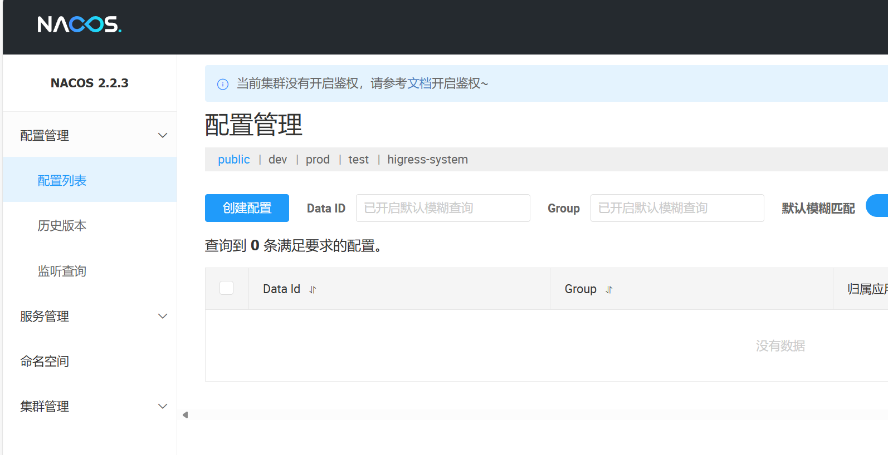
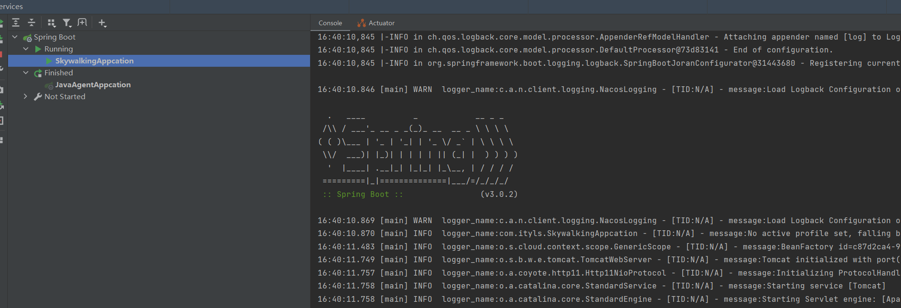

### 1, 为什么需要链路追踪

在这个微服务系统中，用户通过浏览器的 H5页面访问系统，这个用户请求会先抵达微服务网关组件，然后网关再把请求分发给各个微服务。所以你会发现，用户请求从发起到结束要经历 很多个微服务的处理，这里面还涉及到消息组件的集成。


**存在的问题**：

- 服务之间的依赖与被依赖的关系如何能够清晰的看到？
- 出现异常时如何能够快速定位到异常服务？
- 出现性能瓶颈时如何能够迅速定位哪个服务影响的？


**链路：**可以将链路理解为物理电路图

- 链路和电路图都有起点和终点。
- 链路和电路图都通过可视化得技术手段，来模拟真实组件得运行轨迹。
- 链路和电路图都非常复杂，并且随着系统复杂程度得增加，其可视化复杂度也会成几何倍数增加。


**解决：**

为了能够在分布式架构中快速定位问题，分布式链路追踪应运而生。将一次分布式请求还原成调用链路，进行日志记录，性能监控并将一次分布式请求的调用情况集中展示。比如各个服务节点上的耗时、请求具体到达哪台机器上、每个服务节点的请求状态等等。


**常见链路追踪技术有那些：**

市面上有很多链路追踪的项目，其中也不乏一些优秀的，如下：

- **Sleuth**：SpringCloud 提供的分布式系统中链路追踪解决方案。很可惜的是阿里系并没有链路追踪相关的开源项目，我们可以采用Spring Cloud Sleuth+Zipkin来做链路追踪的解决方案。
- **zipkin**：由Twitter公司开源，开放源代码分布式的跟踪系统，用于收集服务的定时数据，以解决微服务架构中的延迟问题，包括：数据的收集、存储、查找和展现。该产品结合`spring-cloud-sleuth`使用较为简单， 集成很方便， 但是功能较简单。
- **pinpoint**：韩国人开源的基于字节码注入的调用链分析，以及应用监控分析工具。特点是支持多种插件，UI功能强大，接入端无代码侵入
- **Skywalking**：SkyWalking是本土开源的基于字节码注入的调用链分析，以及应用监控分析工具。特点是支持多种插件，UI功能较强，接入端无代码侵入。目前已加入Apache孵化器。


### 2, 认识SkyWalking


**什么是SkyWalking：**

SkyWalking是开源的可观测平台，主要用于收集，分析，聚合和可视化服务和云原生基础设施的数据。Skywalking提供了一种简单得方式来维护分布式系统得视图关系。


**SkyWalking:**

SkyWalking是开源的一款分布式追踪，分析，告警的工具，现已属于Apache旗下开源项目, SkyWalking为服务提供了自动探针代理，将数据通过gRPC或者HTTP传输给后端平台，后端平台将数据存储在Storage中，并且分析数据将结果展示在UI中。


**优点：**

- 多种监控手段多语言自动探针，Java，.NET Core 和 Node.JS
- 轻量高效，不需要大数据
- 模块化，UI、存储、集群管理多种机制可选，
- 支持告警
- 社区活跃

**缺点：**

- 较为新兴，成熟度不够高


### 3, SkyWalking核心概念


概念：

- 上部分 **Agent** ：负责从应用中，收集链路信息，发送给 SkyWalking OAP 服务器。目前支持 SkyWalking、Zikpin、Jaeger 等提供的 Tracing 数据信息。而我们目前采用的是，SkyWalking Agent 收集 SkyWalking Tracing 数据，传递给服务器。
- 下部分 **SkyWalking OAP** ：负责接收 Agent 发送的 Tracing 数据信息，然后进行分析(Analysis Core) ，存储到外部存储器( Storage )，最终提供查询( Query )功能。
- 左部分 **Storage** ：Tracing 数据存储。目前支持 ES、MySQL、Sharding Sphere、TiDB、H2 多种存储器。而我们目前采用的是 ES ，主要考虑是 SkyWalking 开发团队自己的生产环境采用 ES 为主。
- 右部分 **SkyWalking UI** ：负责提供控台，查看链路等等。


### 4, 什么是探针Java Agent


**探针产生的背景：**

在开发过程中，开发人员经常会使用IDEA的Debug功能（包含本地和远程）调试应用，在JVM进程期间获取应用运行的JVM信息，变量信息等。这些个技术通过Java Agent来实现的，那么Java Agent到底是啥，为啥这么吊？


**哪里有Java Agent：**

- idea得Debug功能
- 热部署 JRebel
- 各种线上诊断工具
- 代码覆盖率工具
- 性能分析


**什么是探针：**

Java Agent 又叫做 **Java 探针**，是在 JDK1.5 引入的一种可以动态修改 Java 字节码的技术。Java 类编译之后形成字节码被 JVM 执行，在 JVM 在执行这些字节码之前获取这些字节码信息，并且通过字节码转换器对这些字节码进行修改，来完成一些额外的功能。


**Java探针工具技术原理：**


**流程：**

1. 在JVM加载class二进制文件的时候，利用ASM动态的修改加载的class文件，在监控的方法前后添加计时器功能，用于计算监控方法耗时；
2. 将监控的相关方法 和 耗时及内部调用情况，按照顺序放入处理器；
3. 处理器利用栈先进后出的特点对方法调用先后顺序做处理，当一个请求处理结束后，将耗时方法轨迹和入参map输出到文件中；
4. 然后区分出耗时的业务，转化为xml格式进行解析和分析。


### 5, Java探针日志监控实现之环境搭建

创建模块：


依赖：

```xml
  <dependency>
      <groupId>org.projectlombok</groupId>
      <artifactId>lombok</artifactId>
    </dependency>
    <dependency>
      <groupId>org.springframework.boot</groupId>
      <artifactId>spring-boot-starter-web</artifactId>
    </dependency>
```


启动类：


```java
package com.ityls;

import lombok.extern.slf4j.Slf4j;
import org.springframework.boot.SpringApplication;
import org.springframework.boot.autoconfigure.SpringBootApplication;

/**
 * 主启动类
 *
 */
@Slf4j
@SpringBootApplication
public class JavaAgentAppcation
{
    public static void main( String[] args )
    {
        SpringApplication.run(JavaAgentAppcation.class,args);
        log.info("********************** success ****************");
    }
}
```


配置：


```yml
server:
  port: 7878
spring:
  application:
    name: javaagent

logging:
  pattern:
    console: logging.pattern.console=%d{MM/dd HH:mm:ss.SSS} %clr(%-5level) ---  [%-15thread] %cyan(%-50logger{50}):%msg%n
```


创建controller:


```java
package com.ityls.controller;

import org.springframework.web.bind.annotation.GetMapping;
import org.springframework.web.bind.annotation.RestController;

@RestController
public class HelloController {
    @GetMapping("/hello")
    public String hello(){
        return "hello java agent";
    }
}
```


运行项目：


### 6, Java探针日志监控实现之探针实现

**如何使用Java Agent：**

JDK1.5引入了java.lang.instrument包，开发者可以很方便的实现字节码增强。其核心功能由java.lang.instrument.Instrumentation接口提供。


**Instrumentation 有两种使用方式：**

- 在应用运行之前，通过premain()方法来实现，在应用启动时侵入并代理应用。
- 在应用运行之后，通过调用Attach AP和agentmain()方法来实现


注意：

> javassist是一个库，实现ClassFileTransformer接口中的transform()方法。ClassFileTransformer 这个接口的目的就是在class被装载到JVM之前将class字节码转换掉，从而达到动态注入代码的目的。


创建模块：


依赖：

```java
    <dependencies>
        <dependency>
            <groupId>junit</groupId>
            <artifactId>junit</artifactId>
            <version>4.11</version>
            <scope>test</scope>
        </dependency>
        <dependency>
            <groupId>org.javassist</groupId>
            <artifactId>javassist</artifactId>
            <version>3.22.0-GA</version>
        </dependency>
    </dependencies>
```


当前这个模块和父模块并没有关系：


```xml
<?xml version="1.0" encoding="UTF-8"?>

<project xmlns="http://maven.apache.org/POM/4.0.0" xmlns:xsi="http://www.w3.org/2001/XMLSchema-instance"
         xsi:schemaLocation="http://maven.apache.org/POM/4.0.0 http://maven.apache.org/xsd/maven-4.0.0.xsd">
    <modelVersion>4.0.0</modelVersion>

    <groupId>com.ityls</groupId>
    <artifactId>ityls-javaagent</artifactId>
    <version>1.0-SNAPSHOT</version>
    <packaging>jar</packaging>

    <properties>
        <project.build.sourceEncoding>UTF-8</project.build.sourceEncoding>
        <maven.compiler.encoding>UTF-8</maven.compiler.encoding>
        <java.version>1.8</java.version>
        <maven.compiler.source>1.8</maven.compiler.source>
        <maven.compiler.target>1.8</maven.compiler.target>
    </properties>

    <dependencies>
        <dependency>
            <groupId>junit</groupId>
            <artifactId>junit</artifactId>
            <version>4.11</version>
            <scope>test</scope>
        </dependency>
        <dependency>
            <groupId>org.javassist</groupId>
            <artifactId>javassist</artifactId>
            <version>3.22.0-GA</version>
        </dependency>
    </dependencies>

    <build>
        <finalName>javaagent</finalName>
        <plugins>
            <!--
            META-INF 下 MANIFEST.MF 文件 内容
            Manifest-Version: 1.0
            Premain-Class: com.jenson.TestAgent
            下面Maven插件可以自动实现
            -->
            <plugin>
                <groupId>org.apache.maven.plugins</groupId>
                <artifactId>maven-shade-plugin</artifactId>
                <version>3.0.0</version>
                <executions>
                    <execution>
                        <phase>package</phase>
                        <goals>
                            <goal>shade</goal>
                        </goals>
                        <configuration>
                            <transformers>
                                <transformer
                                        implementation="org.apache.maven.plugins.shade.resource.ManifestResourceTransformer">
                                    <manifestEntries>
                                        <Premain-Class>com.ityls.PreMainTraceAgent</Premain-Class>
                                    </manifestEntries>
                                </transformer>
                            </transformers>
                        </configuration>
                    </execution>
                </executions>
            </plugin>
        </plugins>
    </build>

</project>
```


删除父模块中对应子模块的书写：


Maven插件引入失败：在IDEA中使用maven-shade-plugin插件时会提示"Plugin 'maven-shade-plugin:' not found"。解决方法：

- File -> Setting -> Build, Execution, Deployment -> Build Tools -> Maven -> 勾选Use plugin registry选项
- File -> Invalidate Caches -> Invalidate and Restart


编写premain方法：


```java
package com.ityls;
import java.lang.instrument.Instrumentation;

public class PreMainTraceAgent {
    public static void main(String[] args) {

    }
    public static void premain(String agentars, Instrumentation instrumentation) {
        System.out.println("============= premain执行了 =============");
        instrumentation.addTransformer(new TestTransformer());
    }
}
```


编写增强类：


```java
package com.ityls;

import javassist.ClassPool;
import javassist.CtClass;
import javassist.CtMethod;
import javassist.NotFoundException;

import java.lang.instrument.ClassFileTransformer;
import java.lang.instrument.IllegalClassFormatException;
import java.security.ProtectionDomain;

public class TestTransformer implements ClassFileTransformer {
    private final String CLASSNAME = "com.ityls.controller.HelloController";
    private final String METHODNAME = "hello";

    // 这个接口的目的就是在class被装载到JVM之前将class字节码转换掉，从而达到动态注入代码的目的。
    @Override
    public byte[] transform(ClassLoader loader, String className, Class<?> classBeingRedefined, ProtectionDomain protectionDomain, byte[] classfileBuffer) throws IllegalClassFormatException {

        //className:com/ityls/controller/HelloController
//        System.out.println("className:" + className);

        String finalClassName = className.replace("/", ".");
        // 判断classname是不是我们的目标
        if (finalClassName.equals(CLASSNAME)){
            System.out.println("class name 匹配上了");

            CtClass ctClass;
            try {
                // 获取hellocontroller class
                ctClass = ClassPool.getDefault().get(CLASSNAME);
                System.out.println("class is ok ！！！");
                CtMethod declaredMethod = ctClass.getDeclaredMethod(METHODNAME);
                System.out.println("method is ok !!!!");
                declaredMethod.insertBefore("System.out.println(\" 字节码添加成功打印日志 \");");
                return ctClass.toBytecode();
            } catch (Exception e) {
                throw new RuntimeException(e);
            }
        }
        return null;
    }
}
```


将项目打包：


启动项目：


编辑配置：


再次启动项目：


### 7, 搭建 Elasticsearch


关闭防火墙，方便访问ES

```
#关闭防火墙：
systemctl stop firewalld.service


#禁止防火墙自启动：
systemctl disable firewalld.service
```


配置最大可创建文件数大小

```
#打开系统文件：
vim /etc/sysctl.conf


#添加以下配置：
vm.max_map_count=655360


#配置生效：
sysctl -p
```

由于ES不能以root用户运行，我们需要创建一个非root用户，此处创建一个名为es的用户：

```
#创建用户：
useradd es
```

解压ES:

```
#解压：
tar -zxvf elasticsearch-8.10.4-linux-x86_64.tar.gz


#重命名：
mv elasticsearch-8.10.4 elasticsearch1


#移动文件夹：
mv elasticsearch1 /usr/local/


#es用户取得该文件夹权限：
chown -R es:es /usr/local/elasticsearch1
```


由于我的硬盘空间不足，所以就把es安装到了/www目录下面。


启动ES服务

```
#切换为es用户：
su es


#进入ES安装文件夹：
cd /usr/local/elasticsearch1/bin/


#启动ES服务：
./elasticsearch 
```


启动后关闭，再作一个配置，关闭es的认证：


再次启动，后台启动，通过JPS查看：


测试：

```
curl http://localhost:9200
```


### 8, SkyWalking服务环境搭建


前置条件：

- 安装jdk17
- 安装Elasticsearch


下载，解压：

```
tar -zxvf apache-skywalking-apm-9.1.0.tar.gz -C /usr/local/
```


**SkyWalking包目录介绍:**


- webapp: Ul前端(web 监控页面)的jar包和配置文件
- oap-libs：后台应用的jar包，以及它的依赖jar包
- config：启动后台应用程序的配置文件，是使用的各种配置
- bin：各种启动脚本，一般使用脚本startup.*来启动web页面和对应的后台应用
- agent：代理服务jar包


修改/usr/local/apache-skywalking-apm-bin/config/application.yml


**启动 SkyWalking OAP 服务：**

```
bin/oapService.sh
SkyWalking OAP started successfully!
```


是否**真正**启动成功，打开 `logs/skywalking-oap-server.log` 日志文件，查看是否有错误日志。 首次启动时，因为 SkyWalking OAP 会创建 Elasticsearch 的索引，所以会“疯狂”的打印日志。

注意：

> 因为首次启动会创建 Elasticsearch 索引，所以可能会比较慢。


最终，我们看到如下日志，基本可以代表 SkyWalking OAP 服务启动成功：


**启动 SkyWalking UI 服务：**

```
bin/webappService.sh

SkyWalking Web Application started successfully!
```


测试：


### 9, 搭建微服务

nacos环境：




数据库：


sql

```sql
DROP TABLE IF EXISTS `user`;

CREATE TABLE `user`
(
   id BIGINT NOT NULL COMMENT '主键ID',
   name VARCHAR(30) NULL DEFAULT NULL COMMENT '姓名',
   age INT NULL DEFAULT NULL COMMENT '年龄',
  PRIMARY KEY (id)
);
```

```sql
DELETE FROM `user`;

INSERT INTO `user` (id, name, age) VALUES
(1, 'Jone', 18),
(2, 'Jack', 20),
(3, 'Tom', 28),
(4, 'Sandy', 21),
(5, 'Billie', 24);
```


依赖：

```xml
    <dependencies>
        <dependency>
            <groupId>junit</groupId>
            <artifactId>junit</artifactId>
            <version>4.11</version>
            <scope>test</scope>
        </dependency>
        <dependency>
            <groupId>mysql</groupId>
            <artifactId>mysql-connector-java</artifactId>
            <version>5.1.49</version>
            <!--       <scope>runtime</scope>-->
        </dependency>
        <dependency>
            <groupId>com.baomidou</groupId>
            <artifactId>mybatis-plus-boot-starter</artifactId>
            <version>3.5.4</version>
        </dependency>
        <dependency>
            <groupId>org.springframework.boot</groupId>
            <artifactId>spring-boot-starter-web</artifactId>
        </dependency>
        <dependency>
            <groupId>org.projectlombok</groupId>
            <artifactId>lombok</artifactId>
        </dependency>
        <dependency>
            <groupId>com.alibaba.cloud</groupId>
            <artifactId>spring-cloud-starter-alibaba-nacos-discovery</artifactId>
        </dependency>
    </dependencies>
```


配置：


```yml
spring:
  application:
    # 应用名字
    name: skywalking-order
  cloud:
    nacos:
      discovery:
        # Nacos注册中心的地址
        server-addr: 103.38.81.223:8848
  # 数据库配置
  datasource:
    driver-class-name: com.mysql.jdbc.Driver
    url: jdbc:mysql://123.249.16.147:3306/ityls666?useSSL=false&useUnicode=true&characterEncoding=utf8&useSSL=false&useTimezone=true&serverTimezone=GMT%2B8
    username: ityls666
    password: ityls666
server:
  port: 8003

logging:
  pattern:
     console: logging.pattern.console=%d{MM/dd HH:mm:ss.SSS} %clr(%-5level) ---  [%-15thread] %cyan(%-50logger{50}):%msg%n
```


项目的目录结构：


```java
package com.ityls;

import lombok.extern.slf4j.Slf4j;
import org.mybatis.spring.annotation.MapperScan;
import org.springframework.boot.SpringApplication;
import org.springframework.boot.autoconfigure.SpringBootApplication;

@Slf4j
@MapperScan("com.ityls.mapper")
@SpringBootApplication
public class SkywalkingAppcation
{
    public static void main( String[] args )
    {
        SpringApplication.run(SkywalkingAppcation.class,args);
        log.info("********************* success *****************");
    }
}
```


mapper层：

```java
package com.ityls.mapper;

import com.baomidou.mybatisplus.core.mapper.BaseMapper;
import com.ityls.domain.User;

public interface UserMapper extends BaseMapper<User> {
}
```


业务层：

```java
package com.ityls.service;

import com.ityls.domain.User;

import java.util.List;

public interface IUserService {
    List<User> findByAll();
}
```

```java
package com.ityls.service.impl;

import com.ityls.domain.User;
import com.ityls.mapper.UserMapper;
import com.ityls.service.IUserService;
import org.springframework.beans.factory.annotation.Autowired;
import org.springframework.stereotype.Service;

import java.util.List;

@Service
public class UserServiceImpl implements IUserService {

    @Autowired
    private UserMapper userMapper;

    /**
     * 查询所有学生
     * @return
     */
    @Override
    public List<User> findByAll() {
//        System.out.println(10/0);
        // 查询数据库
        List<User> users = userMapper.selectList(null);
        return users;
    }
}
```


控制层：

```java
package com.ityls.controller;

import com.ityls.domain.User;
import com.ityls.service.IUserService;
import org.springframework.beans.factory.annotation.Autowired;
import org.springframework.web.bind.annotation.GetMapping;
import org.springframework.web.bind.annotation.RestController;

import java.util.List;
import java.util.concurrent.TimeUnit;

@RestController
public class UserController {

    @Autowired
    private IUserService iUserService;

    /**
     * 查询所有学生
     * @return
     */
    @GetMapping("/findByAll")
    public List<User> findByAll(){
        // try {
        //     Thread.sleep(6000);
        // } catch (InterruptedException e) {
        //     throw new RuntimeException(e);
        // }
        return iUserService.findByAll();
    }

}
```


实体类：

```java
package com.ityls.domain;

import com.baomidou.mybatisplus.annotation.TableName;
import lombok.Data;

@Data
@TableName("user")
public class User {
    private Long id; // id
    private String name;//名字
    private Integer age;//年龄
}
```


启动项目：


测试：


### 10, 微服务接入SkyWalking探针


**下载官方提供探针：**

- 网址：https://skywalking.apache.org/downloads/


下载后，解压，放到项目中：


添加探针：

```
-javaagent:D:\桌面\ityls_cloud\skywalking-agent\skywalking-agent.jar
-DSW_AGENT_NAME=skywalking-order
-DSW_AGENT_COLLECTOR_BACKEND_SERVICES=103.38.81.223:11800
```

**参数：**

- -javaagent：用于指定探针路径。
- -DSW_AGENT_NAME：服务名字
- -DSW_AGENT_COLLECTOR_BACKEND_SERVICES：连接地址


测试：


让它出异常：


### 11, SkyWalking日志


**POM中引入相关依赖：**

Skywalking8.4.0版本开始才支持收集日志功能，同时pom需引用以下依赖。


```xml
<dependency>
  <groupId>org.apache.skywalking</groupId>
  <artifactId>apm-toolkit-logback-1.x</artifactId>
  <version>9.1.0</version>
</dependency>
```


添加日志：


```xml
<?xml version="1.0" encoding="utf-8" ?>
<configuration>

    <appender name="console" class="ch.qos.logback.core.ConsoleAppender">
        <!-- 日志输出编码 -->
        <encoder class="ch.qos.logback.core.encoder.LayoutWrappingEncoder">
            <layout class="org.apache.skywalking.apm.toolkit.log.logback.v1.x.TraceIdPatternLogbackLayout">
                <pattern>%d{HH:mm:ss.SSS} [%thread] %-5level logger_name:%logger{36} - [%tid] - message:%msg%n</pattern>
            </layout>
        </encoder>
    </appender>


    <appender name="log" class="org.apache.skywalking.apm.toolkit.log.logback.v1.x.log.GRPCLogClientAppender">
        <!-- 日志输出编码 -->
        <encoder class="ch.qos.logback.core.encoder.LayoutWrappingEncoder">
            <layout class="org.apache.skywalking.apm.toolkit.log.logback.v1.x.TraceIdPatternLogbackLayout">
                <pattern>%d{HH:mm:ss.SSS} [%thread] %-5level logger_name:%logger{36} - [%tid] - message:%msg%n</pattern>
            </layout>
        </encoder>
    </appender>

    <root level="info">
        <appender-ref ref="console"/>
        <appender-ref ref="log"/>
    </root>

</configuration>
```


还需要配置：


```
# 指定要向其报告日志数据的GRPC服务器主机
plugin.toolkit.log.grpc.reporter.server_host=${SW_GRPC_LOG_SERVER_HOST:192.168.47.100}
# 指定要向其报告日志数据的GRPC服务器端口
plugin.toolkit.log.grpc.reporter.server_port=${SW_GRPC_LOG_SERVER_PORT:11800}
# 指定GRPC客户端要报告的日志数据的最大大小
plugin.toolkit.log.grpc.reporter.max_message_size=${SW_GRPC_LOG_MAX_MESSAGE_SIZE:10485760}
# 客户端向上游发送数据时将超时多长时间，单位是秒
plugin.toolkit.log.grpc.reporter.upstream_timeout=${SW_GRPC_LOG_GRPC_UPSTREAM_TIMEOUT:30}
```


重启项目：




gRPC报告程序可以将收集到的日志转发到SkyWalking OAP服务器或SkyWalking Satellite卫星。


测试：


### 12, SkyWalking告警

**什么是SkyWalking告警功能：** 

SkyWalking是一个开源的分布式系统追踪和性能监控工具。除了提供实时的系统性能监控和分析功能外，SkyWalking还提供了告警功能，用于监控系统的指标数据，并在数据超过预设阈值时触发告警


**Skywalking默认支持7中通知：** 

> web、grpc、微信、钉钉、飞书、华为weLink、slack


**为什么要使用SkyWalking的告警功能:** 

- 及时发现异常情况 

- 提高故障处理效率 

- 避免数据丢失和损坏 

- 提升系统性能和稳定性


**如何使用SkyWalking的告警功能：** 

告警规则

- 告警规则定义了要监控的指标数据、阈值和触发条件。可以根据实际需求，定义多个告警规则。例如，可以设置当系统的平均响应时间超过100ms时，触发告警。 

告警通知 

- 告警通知定义了当告警触发时，要发送通知的方式和接收人员。可以通过邮件、短信、钉钉等方式发送告警通知。 

告警持续时间 

- 告警持续时间定义了告警状态的持续时间。当告警触发后，会持续发送通知，直到告警状态解除或达到设定的持续时间。 


配置文件：

```
#告警配置文件： alarm-settings.yml
service_response_time_rule:
 #指定的规则
 metrics-name: service_resp_time
 op: ">"
 # 阈值
 threshold: 1  # 单位毫秒
 # 多久检查一次当前的指标数据是否符合告警规则
 period: 5
 # 达到多少次告警后，发送告警消息
 count: 1
 # 告警消息内容
 message: 服务{name}最近5分钟以内响应时间超过了1ms
```


### 13, Skywalking自定义告警规则


让接口访问速度慢一点：


**自定义告警规则：** 修改Skywalking配置文件。vim alarm-settings.yml

```
service_response_time_rule:
 metrics-name: skywalking-order
 op: ">" 
 threshold: 1
 period: 1 # 多久检查一次当前的指标数据是否符合告警规则
 count: 1 # 达到多少次告警后，发送告警消息
 message: 服务{name}最近1分钟以内响应时间超过了1ms
```


配置：


```yml
service_response_time_rule:
 metrics-name: skywalking-order
 op: ">" 
 threshold: 1
 period: 1 
 count: 1 
 message: 服务{name}最近1分钟以内响应时间超过了1ms
```


重启：


测试：


### 14, SkyWalking网络钩子Webhooks


### 15, SkyWalking短信通知


### 16, SkyWalking邮件告警

