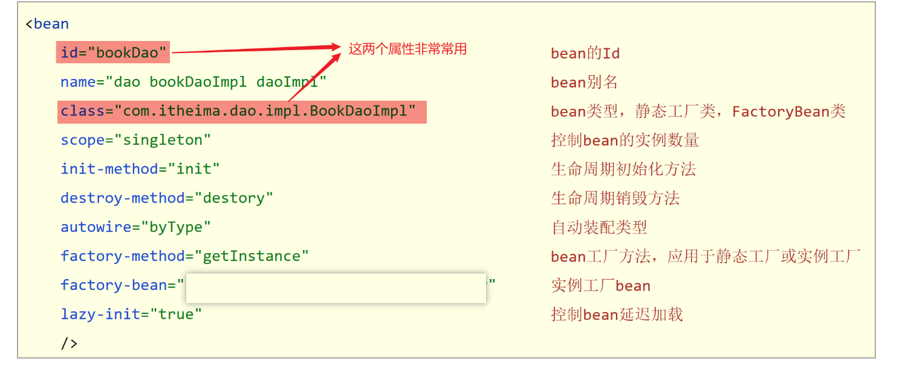
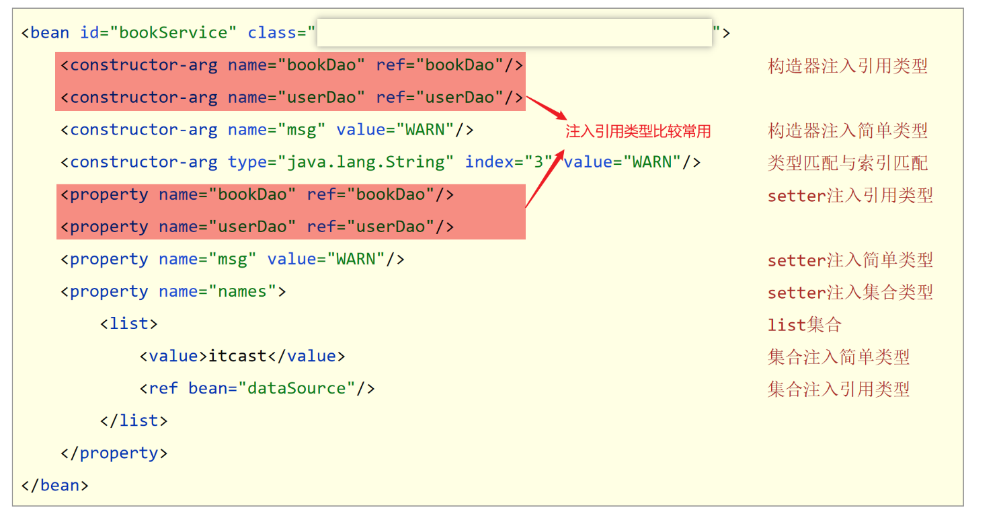

## 一，初识Spring框架


### 1，为什么要学框架

Spring技术是JavaEE开发必备技能，企业开发技术选型命中率>90%。有的优势

- 简化开发，降低企业级开发的复杂性
  - IOC  反转控制
  - AOP 面向切面编程
- 框架整合，高效整合其他技术，提高企业级应用开发与运行效率
  - MyBatis
  - MyBatis-plus
  - Struts
  - Struts2
  - Hibernate
  - ....


### 2，认识Spring


- 官网：https://spring.io
- Spring发展到今天已经形成了一种开发的生态圈，Spring提供了若干个项目，每个项目用于完成特定的功能。


**Spring发展史**


**系统架构图**

Spring Framework是Spring生态圈中最基础的项目，是其他项目的根基


目前我们的代码存在什么问题以及怎么解决这些问题？

- 代码耦合度偏高


解决方案：使用对象时，在程序中不要主动使用new产生对象，转换为由外部提供对象


**核心概念：**

- IOC（Inversion of Control）控制反转。使用对象时，由主动new产生对象转换为由外部提供对象，此过程中对象创建控制权由程序转移到外部，此思想称为控制反转。通俗的讲就是“将new对象的权利交给Spring，我们从Spring中获取对象使用即可”
- Spring技术对IOC思想进行了实现。Spring提供了一个容器，称为IOC容器，用来充当IOC思想中的“外部”。IOC容器负责对象的创建、初始化等一系列工作，被创建或被管理的对象在IoC容器中统称为Bean
- DI（Dependency Injection）依赖注入。在容器中建立bean与bean之间的依赖关系的整个过程，称为依赖注入。


这样做的目录是充分解耦，使用IOC容器管理bean，在IOC容器内将有依赖关系的bean进行关系绑定（DI）。最终使用对象时不仅可以直接从IoC容器中获取，并且获取到的bean已经绑定了所有的依赖关系。


**Spring Framework课程学习路线**

1. 核心容器，IOC/DI，容器的基本操作
2. AOP，AOP基础操作，AOP实用开发
3. 事务
4. 整合MyBatis


## 二，IOC和DI入门案例【重点】


### 1，IOC入门案例

入门案例思路分析

1. 管理什么？(Service与Dao)
2. 如何将被管理的对象告知IOC容器？(配置文件)
3. 被管理的对象交给IOC容器，如何获取到IoC容器？(接口)
4. IOC容器得到后，如何从容器中获取bean？(接口方法)
5. 使用Spring导入哪些坐标？(pom.xml)


实现步骤：

1. 导入Spring坐标

   ```xml
   <dependencies>
       <!--导入spring的坐标spring-context，对应版本是5.2.10.RELEASE-->
       <dependency>
           <groupId>org.springframework</groupId>
           <artifactId>spring-context</artifactId>
           <version>5.2.10.RELEASE</version>
       </dependency>
   </dependencies>
   ```

2. 定义Spring管理的类（接口）

   ```java
   // BookDao接口和BookDaoImpl实现类
   public interface BookDao {
       public void save();
   }
   
   public class BookDaoImpl implements BookDao {
       public void save() {
           System.out.println("book dao save ...");
       }
   }
   
   // BookService接口和BookServiceImpl实现类
   public interface BookService {
       public void save();
   }
   
   public class BookServiceImpl implements BookService {
       private BookDao bookDao = new BookDaoImpl();
       public void save() {
           System.out.println("book service save ...");
           bookDao.save();
       }
   }
   ```

3. 创建Spring配置文件，配置对应类作为Spring管理的bean对象

   ```xml
   // 定义applicationContext.xml配置文件并配置BookServiceImpl
   
   <?xml version="1.0" encoding="UTF-8"?>
   <beans xmlns="http://www.springframework.org/schema/beans"
          xmlns:xsi="http://www.w3.org/2001/XMLSchema-instance"
          xsi:schemaLocation="http://www.springframework.org/schema/beans http://www.springframework.org/schema/beans/spring-beans.xsd">
    
       <!--
   		bean标签：表示配置bean
       	id属性：表示给bean起名字，bean定义时id属性在同一个上下文中(IOC容器中)不能重复
       	class属性：表示给bean定义类型
   	-->
       <bean id="bookService" class="com.malu.service.impl.BookServiceImpl"></bean>
   
   </beans>
   ```

   

4. 初始化IOC容器（Spring核心容器/Spring容器），通过容器获取Bean对象

   ```java
   public class App {
       public static void main(String[] args) {
           //1.创建IoC容器对象，加载spring核心配置文件
           ApplicationContext ctx = new ClassPathXmlApplicationContext("applicationContext.xml");
           //2 从IOC容器中获取Bean对象(BookService对象)
           BookService bookService= (BookService)ctx.getBean("bookService");
           //3 调用Bean对象(BookService对象)的方法
           bookService.save();
       }
   }
   ```


运行结果：


### 2，DI入门案例


DI入门案例思路分析

1. 基于IOC管理bean
2. Service中使用new形式创建的Dao对象是否保留？(否)
3. Service中需要的Dao对象如何进入到Service中？(提供方法)
4. Service与Dao间的关系如何描述？(配置)


实现步骤：

1. 删除使用new的形式创建对象的代码

   ```java
   public class BookServiceImpl implements BookService {
       private BookDao bookDao;  //【第一步】删除使用new的形式创建对象的代码
       public void save() {
           System.out.println("book service save ...");
           bookDao.save();
       }
   }
   ```

2. 提供依赖对象对应的setter方法

   ```java
   public class BookServiceImpl implements BookService {
       private BookDao bookDao;
       public void save() {
           System.out.println("book service save ...");
           bookDao.save();
       }
       //【第二步】提供依赖对象对应的setter方法
       public void setBookDao(BookDao bookDao) {
           this.bookDao = bookDao;
       }
   }
   ```

3. 在applicationContext.xml中配置service与dao之间的关系

   ```xml
   <?xml version="1.0" encoding="UTF-8"?>
   <beans xmlns="http://www.springframework.org/schema/beans"
          xmlns:xsi="http://www.w3.org/2001/XMLSchema-instance"
          xsi:schemaLocation="http://www.springframework.org/schema/beans http://www.springframework.org/schema/beans/spring-beans.xsd">
       <!--
   		bean标签：表示配置bean
       	id属性：表示给bean起名字
       	class属性：表示给bean定义类型
   	-->
       <bean id="bookDao" class="com.malu.dao.impl.BookDaoImpl"/>
   
       <bean id="bookService" class="com.malu.service.impl.BookServiceImpl">
           <!--配置server与dao的关系
   			property标签：表示配置当前bean的属性
           	name属性：表示配置哪一个具体的属性。name属性对应setXxx方法去掉set后首字母小写部分。
           	ref属性：表示参照哪一个bean
   		-->
           <property name="bookDao" ref="bookDao"/>
       </bean>
   </beans>
   ```

   


## 三，Bean的基础配置


### 1，Bean的基础配置


基础配置：


参考：

```xml
<bean id="bookDao" class="com.malu.dao.impl.BookDaoImpl" />
<bean id="bookService" class="com.malu.service.impl.BookServiceImpl"></bean>
```


### 2，Bean的别名配置


别名配置：


参考：

```xml
<bean id="bookDao" name="dao bookDaoImpl" class="com.malu.dao.impl.BookDaoImpl" />
<bean id="bookService" name="service,bookServiceImpl" class="com.malu.service.impl.BookServiceImpl"></bean>
```


代码演示：

```java
public class AppForName {
    public static void main(String[] args) {

        ApplicationContext ctx = new ClassPathXmlApplicationContext("applicationContext.xml");

        // 必须是配置的三个别名之一
        BookService bookService = (BookService) ctx.getBean("service4");

        bookService.save();
    }
}
```


```xml
<?xml version="1.0" encoding="UTF-8"?>
<beans xmlns="http://www.springframework.org/schema/beans"
       xmlns:xsi="http://www.w3.org/2001/XMLSchema-instance"
       xsi:schemaLocation="http://www.springframework.org/schema/beans http://www.springframework.org/schema/beans/spring-beans.xsd">

    <!--name:为bean指定别名，别名可以有多个，使用逗号，分号，空格进行分隔-->
    <bean id="bookService" name="service service4 bookEbi" class="com.malu.service.impl.BookServiceImpl">
        <property name="bookDao" ref="bookDao"/>
    </bean>

    <!--scope：为bean设置作用范围，可选值为单例singloton，非单例prototype-->
    <bean id="bookDao" name="dao" class="com.malu.dao.impl.BookDaoImpl"/>
</beans>

```


### 3，Bean作用范围配置

作用范围配置：


参考：

```xml

<!--scope：为bean设置作用范围，可选值为单例singloton，非单例prototype-->
<!--scope的取值不仅仅只有singleton和prototype，还有request、session、application、 websocket ，表示创建出的对象放置在web容器(tomcat)对应的位置。比如：request表示保存到request域中。 -->
<bean id="bookDao" name="dao" class="com.itheima.dao.impl.BookDaoImpl" scope="prototype"/>

```


代码演示：

```java
public class AppForScope {
    public static void main(String[] args) {

        ApplicationContext ctx = new ClassPathXmlApplicationContext("applicationContext.xml");
        // 获取两次BookDao对象
        BookDao bookDao1 = (BookDao) ctx.getBean("bookDao");
        BookDao bookDao2 = (BookDao) ctx.getBean("bookDao");
        // 打印两次的地址值不一样，说明UserDao是非单例的
        System.out.println(bookDao1);
        System.out.println(bookDao2);
    }
}

```

```xml
<?xml version="1.0" encoding="UTF-8"?>
<beans xmlns="http://www.springframework.org/schema/beans"
       xmlns:xsi="http://www.w3.org/2001/XMLSchema-instance"
       xsi:schemaLocation="http://www.springframework.org/schema/beans http://www.springframework.org/schema/beans/spring-beans.xsd">

    <bean id="bookService" name="service service4 bookEbi" class="com.malu.service.impl.BookServiceImpl">
        <property name="bookDao" ref="bookDao"/>
    </bean>

    <!--scope：为bean设置作用范围，可选值为单例singloton，非单例prototype-->
    <bean id="bookDao" name="dao" class="com.malu.dao.impl.BookDaoImpl" scope="prototype"/>
</beans>

```


注意细节：

- 在我们的实际开发当中，绝大部分的Bean是单例的，也就是说绝大部分Bean不需要配置scope属性。


## 四，Bean的实例化


### 1，构造方法实例化

bean本质上就是对象，创建bean使用构造方法完成。BookDaoImpl实现类如下：

```java
public class BookDaoImpl implements BookDao {
    public BookDaoImpl() {
        System.out.println("book dao constructor is running ....");
    }
    public void save() {
        System.out.println("book dao save ...");
    }
}
```


applicationContext.xml配置：

```xml
<!--方式一：构造方法实例化bean-->
<bean id="bookDao" class="com.itheima.dao.impl.BookDaoImpl"/>
```


AppForInstanceBook测试类：

```java
public class AppForInstanceBook {
    public static void main(String[] args) {
        ApplicationContext ctx = new ClassPathXmlApplicationContext("applicationContext.xml");

        BookDao bookDao = (BookDao) ctx.getBean("bookDao");

        bookDao.save();
    }
}
```


运行结果：


注意细节：

- 无参构造方法如果不存在，将抛出异常`BeanCreationException`


### 2，静态工厂方式实例化


OrderDao接口和OrderDaoImpl实现类：

```java
public interface OrderDao {
    public void save();
}
public class OrderDaoImpl implements OrderDao {
    public void save() {
        System.out.println("order dao save ...");
    }
}
```


OrderDaoFatory工厂类：

```java
//静态工厂创建对象
public class OrderDaoFactory {
    public static OrderDao getOrderDao(){
        System.out.println("factory setup....");
        return new OrderDaoImpl();
    }
}
```


applicationContext.xml配置：

```java
<!--方式二：使用静态工厂实例化bean-->
<bean id="orderDao" class="com.malu.factory.OrderDaoFactory" factory-method="getOrderDao"/>
```


AppForInstanceOrder测试类:

```java
public class AppForInstanceOrder {
    public static void main(String[] args) {
        ApplicationContext ctx = new ClassPathXmlApplicationContext("applicationContext.xml");

        OrderDao orderDao = (OrderDao) ctx.getBean("orderDao");

        orderDao.save();
    }
}
```


运行结果：


### 3，实例工厂方式实例化


UserDao接口和UserDaoImpl实现类：

```java
public interface UserDao {
    public void save();
}
public class UserDaoImpl implements UserDao {
    public void save() {
        System.out.println("user dao save ...");
    }
}
```


UserDaoFactory工厂类：

```java
//实例工厂创建对象
public class UserDaoFactory {
    public UserDao getUserDao(){
        return new UserDaoImpl();
    }
}
```


applicationContext.xml配置：

```xml
<!--方式三：使用实例工厂实例化bean-->
<bean id="userFactory" class="com.malu.factory.UserDaoFactory"/>

<bean id="userDao" factory-method="getUserDao" factory-bean="userFactory"/>
```


AppForInstanceUser测试类：

```java
public class AppForInstanceUser {
    public static void main(String[] args) {
        //        //创建实例工厂对象
        //        UserDaoFactory userDaoFactory = new UserDaoFactory();
        //        //通过实例工厂对象创建对象
        //        UserDao userDao = userDaoFactory.getUserDao();
        //        userDao.save();
        ApplicationContext ctx = new ClassPathXmlApplicationContext("applicationContext.xml");
        UserDao userDao = (UserDao) ctx.getBean("userDao");
        userDao.save();
    }
}
```


运行结果：


## 五，Bean的生命周期


生命周期相关的概念：

- 生命周期：从创建到消亡的完整过程
- bean生命周期：bean从创建到销毁的整体过程
- bean生命周期控制：在bean创建后到销毁前做一些事情


### 1，Bean的生命周期控制方式一


提供生命周期控制方法：

```java
public class BookDaoImpl implements BookDao {
    public void save() {
        System.out.println("book dao save ...");
    }
    //表示bean初始化对应的操作
    public void init(){
        System.out.println("init...");
    }
    //表示bean销毁前对应的操作
    public void destory(){
        System.out.println("destory...");
    }
}
```

applicationContext.xml配置:

```xml
<!--init-method：设置bean初始化生命周期回调函数,此处填写init方法名-->
<!--destroy-method：设置bean销毁生命周期回调函数，仅适用于单例对象，此处填写destory方法名-->
<bean id="bookDao" class="com.malu.dao.impl.BookDaoImpl" init-method="init" destroy-method="destory"/>
```


测试类：

```java
public class AppForLifeCycle {
    public static void main( String[] args ) {
        //此处需要使用实现类类型，接口类型没有close方法
        ClassPathXmlApplicationContext ctx = new ClassPathXmlApplicationContext("applicationContext.xml");
        BookDao bookDao = (BookDao) ctx.getBean("bookDao");
        bookDao.save();
        //关闭容器，执行销毁的方法
        ctx.close();
    }
}
```


### 2，Bean的生命周期控制方式二


实现InitializingBean, DisposableBean接口

```java
public class BookServiceImpl implements BookService, InitializingBean, DisposableBean {
    private BookDao bookDao;
    public void setBookDao(BookDao bookDao) {
        System.out.println("set .....");
        this.bookDao = bookDao;
    }
    public void save() {
        System.out.println("book service save ...");
        bookDao.save();
    }
    public void destroy() throws Exception {
        System.out.println("service destroy");
    }
    public void afterPropertiesSet() throws Exception {
        System.out.println("service init");
    }
}
```


### 3，Bean的销毁时机


- 容器关闭前触发bean的销毁
- 关闭容器方式：
  - 手工关闭容器
    `ConfigurableApplicationContext`接口`close()`操作
  - 注册关闭钩子，在虚拟机退出前先关闭容器再退出虚拟机
    `ConfigurableApplicationContext`接口`registerShutdownHook()`操作


代码演示：

```java
public class AppForLifeCycle {
    public static void main( String[] args ) {
        //此处需要使用实现类类型，接口类型没有close方法
        ClassPathXmlApplicationContext ctx = new ClassPathXmlApplicationContext("applicationContext.xml");

        BookDao bookDao = (BookDao) ctx.getBean("bookDao");
        bookDao.save();
        //注册关闭钩子函数，在虚拟机退出之前回调此函数，关闭容器
        ctx.registerShutdownHook();
        //关闭容器
        //ctx.close();
    }
}
```


## 六，依赖注入DI

### 1，依赖注入的方式

依赖注入的方式有两种：

- setter注入
  - 简单类型
  - 引用类型（很常用）
- 构造器注入
  - 简单类型
  - 引用类型


#### 1.1 setter注入

代码演示setter引用类型依赖注入，在bean中定义引用类型属性并提供可访问的set方法：

```java
public class BookServiceImpl implements BookService{
    private BookDao bookDao;
    
    //setter注入需要提供要注入对象的set方法
    public void setBookDao(BookDao bookDao) {
        this.bookDao = bookDao;
    }

    public void save() {
        System.out.println("book service save ...");
        bookDao.save();
    }
}

```


配置中使用property标签ref属性注入引用类型对象：

```java
<bean id="bookDao" class="com.itheima.dao.impl.BookDaoImpl"></bean>

<!--注入引用类型-->
<bean id="bookService" class="com.itheima.service.impl.BookServiceImpl">
   <!--property标签：设置注入属性-->
   <!--name属性：设置注入的属性名，实际是set方法对应的名称-->
   <!--ref属性：设置注入引用类型bean的id或name-->
   <property name="bookDao" ref="bookDao"/>
</bean>
```


代码演示setter简单类型依赖注入，在bean中定义简单类型属性并提供可访问的set方法：

```java
public class BookDaoImpl implements BookDao {
    private int connectionNum;
    
    //setter注入需要提供要注入对象的set方法
    public void setConnectionNum(int connectionNum) {
        this.connectionNum = connectionNum;
    }
}
```


配置中使用property标签value属性注入简单类型数据：

```xml
<!--注入简单类型-->
<bean id="bookDao" class="com.itheima.dao.impl.BookDaoImpl">
	<!--property标签：设置注入属性-->
	<!--name属性：设置注入的属性名，实际是set方法对应的名称-->
	<!--value属性：设置注入简单类型数据值-->
	<property name="connectionNum" value="100"/>
</bean>
```


#### 1.2 构造方式注入

代码演示构造方式注入引用类型，在bean中定义引用类型属性并提供可访问的构造方法：

```java
public class BookServiceImpl implements BookService{
    private BookDao bookDao;

    public BookServiceImpl(BookDao bookDao) {
        this.bookDao = bookDao;
    }

    public void save() {
        System.out.println("book service save ...");
        bookDao.save();
    }
}
```


配置中使用constructor-arg标签ref属性注入引用类型对象：

```xml
<bean id="bookDao" class="com.malu.dao.impl.BookDaoImpl"></bean>
<bean id="bookService" class="com.malu.service.impl.BookServiceImpl">
    <constructor-arg name="bookDao" ref="bookDao"/>
</bean>
```


代码演示构造方式注入简单类型，在bean中定义简单类型属性并提供可访问的构造方法：

```java
public class BookDaoImpl implements BookDao {
    private int connectionNum;

    public BookDaoImpl(int connectionNum) {
        this.connectionNum = connectionNum;
    }

    public void save() {
        System.out.println("book dao save ..."+connectionNum);
    }
}
```


配置中使用constructor-arg标签value属性注入简单类型数据：

```xml
<bean id="bookDao" class="com.malu.dao.impl.BookDaoImpl">
    <constructor-arg name="connectionNum" value="10"/>
    <constructor-arg name="databaseName" value="mysql"/>
</bean>
```


配置中使用constructor-arg标签type属性设置按形参类型注入：

```xml
<!-- 解决形参名称的问题，与形参名不耦合 --> 
<bean id="bookDao" class="com.malu.dao.impl.BookDaoImpl">
    根据构造方法参数类型注入
    <constructor-arg type="int" value="10"/>
    <constructor-arg type="java.lang.String" value="mysql"/>
</bean>
```


配置中使用constructor-arg标签index属性设置按形参位置注入：

```xml
 <!--解决参数类型重复问题，使用位置解决参数匹配-->
<bean id="bookDao" class="com.malu.dao.impl.BookDaoImpl">
    <!--根据构造方法参数位置注入-->
    <constructor-arg index="0" value="mysql"/>
    <constructor-arg index="1" value="100"/>
</bean>
```


总结依赖注入方式选择：

- 强制依赖使用构造器进行，使用setter注入有概率不进行注入导致null对象出现
- 可选依赖使用setter注入进行，灵活性强
- Spring框架倡导使用构造器，第三方框架内部大多数采用构造器注入的形式进行数据初始化，相对严谨
- 如果有必要可以两者同时使用，使用构造器注入完成强制依赖的注入，使用setter注入完成可选依赖的注入
- 实际开发过程中还要根据实际情况分析，如果受控对象没有提供setter方法就必须使用构造器注入
- 自己开发的模块推荐使用setter注入


### 2，依赖自动装配

什么是自动装配？

- IOC容器根据bean所依赖的资源在容器中自动查找并注入到bean中的过程称为自动装配


自动装配方式：

- 按类型（常用）
- 按名称
- 按构造方法
- 不启用自动装配


配置中使用bean标签autowire属性设置自动装配的类型：

```xml
<bean id="bookDao" class="com.malu.dao.impl.BookDaoImpl"/>
<bean id="bookService" class="com.malu.service.impl.BookServiceImpl" autowire="byType"/>
```


##### 依赖自动装配特征

1. 自动装配用于引用类型依赖注入，不能对简单类型进行操作
2. 使用按类型装配时（byType）必须保障容器中相同类型的bean唯一，推荐使用
3. 使用按名称装配时（byName）必须保障容器中具有指定名称的bean，因变量名与配置耦合，不推荐使用
4. 自动装配优先级低于setter注入与构造器注入，同时出现时自动装配配置失效


### 3，集合注入

注入数组类型数据：

```xml
<property name="array">
    <array>
        <value>100</value>
        <value>200</value>
        <value>300</value>
    </array>
</property>
```

注入List类型数据：

```xml
<property name="list">
    <list>
        <value>aaa</value>
        <value>bbb</value>
        <value>ccc</value>
        <value>ddd</value>
    </list>
</property>
```

注入Set类型数据：

```xml
<property name="set">
    <set>
        <value>aaa</value>
        <value>bbb</value>
        <value>ccc</value>
        <value>ddd</value>
    </set>
</property>
```

注入Map类型数据：

```xml
<property name="map">
    <map>
        <entry key="country" value="china"/>
        <entry key="province" value="henan"/>
        <entry key="city" value="kaifeng"/>
    </map>
</property>
```

注入Properties类型数据：

```xml
<property name="properties">
    <props>
        <prop key="country">china</prop>
        <prop key="province">henan</prop>
        <prop key="city">kaifeng</prop>
    </props>
</property>
```


注意细节：

- property标签表示setter方式注入，构造方式注入constructor-arg标签内部也可以写\<array>、\<list>、\<set>、\<map>、\<props>标签


## 七，管理第三方资源


### 1，管理DataSource连接池对象


数据库准备：

```mysql
create database if not exists spring_db character set utf8;
use spring_db;
create table if not exists tbl_account(
    id int primary key auto_increment,
    name varchar(20),
    money double
);
insert into tbl_account values(null,'Tom',1000);
insert into tbl_account values(null,'Jerry',1000);
```


管理Druid连接池步骤：

1. 【第一步】添加Druid连接池依赖、

   ```xml
   <!-- 除了添加以上两个依赖之外，别忘了添加spring-context依赖。 -->
   <dependency>
       <groupId>com.alibaba</groupId>
       <artifactId>druid</artifactId>
       <version>1.1.16</version>
   </dependency>
   <dependency>
       <groupId>mysql</groupId>
       <artifactId>mysql-connector-java</artifactId>
       <version>5.1.47</version>
   </dependency>
   ```

2. 【第二步】配置DruidDataSource连接池Bean对象

   ```java
   <bean id="dataSource" class="com.alibaba.druid.pool.DruidDataSource">
       <property name="driverClassName" value="com.mysql.jdbc.Driver"/>
       <property name="url" value="jdbc:mysql://localhost:3306/spring_db"/>
       <property name="username" value="root"/>
       <property name="password" value="root"/>
   </bean>
   ```

3. 【第三步】在测试类中从IOC容器中获取连接池对象并打印

   ```java
   public class App {
       public static void main(String[] args) {
           ApplicationContext ctx = new ClassPathXmlApplicationContext("applicationContext.xml");
           DataSource dataSource = (DataSource) ctx.getBean("dataSource");
           System.out.println(dataSource);
       }
   }
   ```

   

管理c3p0连接池步骤：

1. 【第一步】添加c3p0连接池依赖

   ```xml
   <dependency>
       <groupId>c3p0</groupId>
       <artifactId>c3p0</artifactId>
       <version>0.9.1.2</version>
   </dependency>
   ```

2. 【第二步】配置c3p0连接池Bean对象

   ```xml
   <!-- 同一个Spring容器中不能有两个id="dataSource"的连接池 -->
   <bean id="dataSource" class="com.mchange.v2.c3p0.ComboPooledDataSource">
       <property name="driverClass" value="com.mysql.jdbc.Driver"/>
       <property name="jdbcUrl" value="jdbc:mysql://localhost:3306/spring_db"/>
       <property name="user" value="root"/>
       <property name="password" value="root"/>
       <property name="maxPoolSize" value="1000"/>
   </bean>
   ```

3. 【第三步】在测试类中从IOC容器中获取连接池对象并打印

   ```java
   public class App {
       public static void main(String[] args) {
           ApplicationContext ctx = new ClassPathXmlApplicationContext("applicationContext.xml");
           DataSource dataSource = (DataSource) ctx.getBean("dataSource");
           System.out.println(dataSource);
       }
   }
   ```


### 2，加载properties属性文件

目的：将数据库的连接参数抽取到一个单独的文件中，与Spring配置文件解耦。


基本用法步骤：

1. 【第一步】编写jdbc.properties属性文件

   ```properties
   jdbc.driver=com.mysql.jdbc.Driver
   jdbc.url=jdbc:mysql://127.0.0.1:3306/spring_db
   jdbc.username=root
   jdbc.password=root
   ```

2. 【第二步】在applicationContext.xml中开启开启context命名空间，加载jdbc.properties属性文件

   

   ```xml
   <context:property-placeholder location="jdbc.properties"/>
   ```

3. 【第三步】在配置连接池Bean的地方使用EL表达式获取jdbc.properties属性文件中的值

   ```xml
   <bean class="com.alibaba.druid.pool.DruidDataSource">
       <property name="driverClassName" value="${jdbc.driver}"/>
       <property name="url" value="${jdbc.url}"/>
       <property name="username" value="${jdbc.username}"/>
       <property name="password" value="${jdbc.password}"/>
   </bean>
   ```

4. 配置完成之后，运行之前的获取Druid连接池代码，可以获取到连接池对象就表示配置成功。


### 3，配置不加载系统属性


**问题**

- 如果属性文件中配置的不是jdbc.username，而是username=root，那么使用${username}获取到的不是root，而是计算机的名称。

**原因**

- 系统属性的优先级比我们属性文件中的高，替换了我们的username=root。

**解决**

- 解决1：换一个名称，例如不叫username，叫jdbc.username。

- 解决2：使用system-properties-mode="NEVER"属性表示不使用系统属性。

```properties
<context:property-placeholder location="jdbc.properties" system-properties-mode="NEVER"/>
```


### 4，加载properties文件写法

- 不加载系统属性

```xml
<context:property-placeholder location="jdbc.properties" system-properties-mode="NEVER"/>
```

- 加载多个properties文件

```xml
<context:property-placeholder location="jdbc.properties,msg.properties"/>
```

- 加载所有properties文件

```xml
<context:property-placeholder location="*.properties"/>
```

- 加载properties文件**标准格式**

```xml
<context:property-placeholder location="classpath:*.properties"/>
```

- 加载properties文件标准格式

```xml
<context:property-placeholder location="classpath*:*.properties"/>
```


## 八，Spring容器


### 1，Spring核心容器

#### 1.1 创建容器

- 方式一：类路径加载配置文件

```java
ApplicationContext ctx = new ClassPathXmlApplicationContext("applicationContext.xml");
```

- 方式二：文件路径加载配置文件

```java
ApplicationContext ctx = new FileSystemXmlApplicationContext("D:\\applicationContext.xml");
```

- 加载多个配置文件

```java
ApplicationContext ctx = new ClassPathXmlApplicationContext("bean1.xml", "bean2.xml");
```


#### 1.2 获取bean对象

- 方式一：使用bean名称获取

> 弊端：需要自己强制类型转换

```java
BookDao bookDao = (BookDao) ctx.getBean("bookDao");
```

- 方式二：使用bean名称获取并指定类型

> 弊端：推荐使用

```java
BookDao bookDao = ctx.getBean("bookDao", BookDao.class);
```

- 方式三：使用bean类型获取

> 弊端：如果IOC容器中同类型的Bean对象有多个，此处获取会报错

```java
BookDao bookDao = ctx.getBean(BookDao.class);
```

#### 1.3 容器类层次结构


#### 1.4 BeanFactory

- 类路径加载配置文件

```java
Resource resources = new ClassPathResource("applicationContext.xml");
BeanFactory bf = new XmlBeanFactory(resources);
BookDao bookDao = bf.getBean("bookDao", BookDao.class);
bookDao.save();
```

- BeanFactory创建完毕后，所有的Bean均为延迟加载，也就是说我们调用getBean()方法获取Bean对象时才创建Bean对象并返回给我们


### 2，Spring核心容器总结


#### 2.1 容器相关

- BeanFactory是IoC容器的顶层接口，初始化BeanFactory对象时，加载的bean延迟加载
- ApplicationContext接口是Spring容器的核心接口，初始化时bean立即加载
- ApplicationContext接口提供基础的bean操作相关方法，通过其他接口扩展其功能
- ApplicationContext接口常用初始化类
  - **ClassPathXmlApplicationContext(常用)**
  - FileSystemXmlApplicationContext


#### 2.2 bean相关




#### 2.3 依赖注入相关




## 九，注解开发

xml配置Bean对象有些繁琐，真实开发中，会使用注解简化Bean对象的定义。


### 1，注解开发定义Bean对象


基本使用步骤：

1. 【第一步】在applicationContext.xml中开启Spring注解包扫描

   ```xml
   <?xml version="1.0" encoding="UTF-8"?>
   <beans xmlns="http://www.springframework.org/schema/beans"
          xmlns:context="http://www.springframework.org/schema/context"
          xmlns:xsi="http://www.w3.org/2001/XMLSchema-instance"
          xsi:schemaLocation="
           http://www.springframework.org/schema/beans http://www.springframework.org/schema/beans/spring-beans.xsd
           http://www.springframework.org/schema/context http://www.springframework.org/schema/context/spring-context.xsd">
   	 <!--扫描com.malu包及其子包下的类中注解-->
       <context:component-scan base-package="com.malu"/>
   </beans>
   ```

   

2. 【第二步】在类上使用@Component注解定义Bean。

   ```java
   // @Component注解没有使用参数指定Bean的名称，那么类名首字母小写就是Bean在IOC容器中的默认名称。例如：BookServiceImpl对象在IOC容器中的名称是bookServiceImpl。
   
   //@Component定义bean
   @Component("bookDao")
   public class BookDaoImpl implements BookDao {
       public void save() {
           System.out.println("book dao save ...");
       }
   }
   @Component
   public class BookServiceImpl implements BookService {
       private BookDao bookDao;
   
       public void setBookDao(BookDao bookDao) {
           this.bookDao = bookDao;
       }
   
       public void save() {
           System.out.println("book service save ...");
           bookDao.save();
       }
   }
   ```

3. 【第三步】在测试类中获取Bean对象

   ```java
   // 在测试类中不要调用bookService的save方法，因为还没有给BookServiceImpl中的bookDao赋值，调用bookService的save方法会出现空指针异常。
   
   public class AppForAnnotation {
       public static void main(String[] args) {
           ApplicationContext ctx = new ClassPathXmlApplicationContext("applicationContext.xml");
           BookDao bookDao = (BookDao) ctx.getBean("bookDao");
           System.out.println(bookDao);
           //按类型获取bean
           BookService bookService = ctx.getBean(BookService.class);
           System.out.println(bookService);
       }
   }
   ```


运行结果：


@Component三个衍生注解

- @Controller：用于表现层bean定义
- @Service：用于业务层bean定义
- @Repository：用于数据层bean定义


代码演示：

```java
@Repository("bookDao")
public class BookDaoImpl implements BookDao {
}

@Service
public class BookServiceImpl implements BookService {
}
```


### 2，纯注解开发模式

Spring3.0开启了纯注解开发模式，使用Java类替代配置文件，开启了Spring快速开发赛道。Java类代替Spring核心配置文件。如下：

```java
@Configuration
@ComponentScan("com.malu")
public class SpringConfig{
    
}
```

- @Configuration注解用于设定当前类为配置类

- @ComponentScan注解用于设定扫描路径，此注解只能添加一次，多个数据请用数组格式

  ```java
  @ComponentScan({com.malu.servicec,com.malu.dao"})
  ```

- 读取Spring核心配置文件初始化容器对象切换为读取Java配置类初始化容器对象

  ```java
  //加载配置文件初始化容器
  ApplicationContext ctx = new ClassPathXmlApplicationContext("applicationContext.xml");
  //加载配置类初始化容器
  ApplicationContext ctx = new AnnotationConfigApplicationContext(SpringConfig.class);
  ```


代码演示步骤：

1. 【第一步】定义配置类代替配置文件

   ```java
   //声明当前类为Spring配置类
   @Configuration
   //Spring注解扫描，相当于<context:component-scan base-package="com.malu"/>
   @ComponentScan("com.malu")
   //设置bean扫描路径，多个路径书写为字符串数组格式
   //@ComponentScan({"com.malu.service","com.malu.dao"})
   public class SpringConfig {
   }
   ```

2. 【第二步】在测试类中加载配置类，获取Bean对象并使用

   ```java
   public class AppForAnnotation {
       public static void main(String[] args) {
           //AnnotationConfigApplicationContext加载Spring配置类初始化Spring容器
           ApplicationContext ctx = new AnnotationConfigApplicationContext(SpringConfig.class);
           BookDao bookDao = (BookDao) ctx.getBean("bookDao");
           System.out.println(bookDao);
           //按类型获取bean
           BookService bookService = ctx.getBean(BookService.class);
           System.out.println(bookService);
       }
   }
   ```


### 3，注解开发Bean的作用范围和生命周期

使用@Scope定义bean作用范围：

```java
@Repository
@Scope("singleton")
public class BookDaoImpl implements BookDao {
}
```


使用@PostConstruct、@PreDestroy定义bean生命周期：

```java
@Repository
@Scope("singleton")
public class BookDaoImpl implements BookDao {
    public BookDaoImpl() {
        System.out.println("book dao constructor ...");
    }
    @PostConstruct
    public void init(){
        System.out.println("book init ...");
    }
    @PreDestroy
    public void destroy(){
        System.out.println("book destory ...");
    }
}
```


注意细节：

- @PostConstruct和@PreDestroy注解是jdk中提供的注解，从jdk9开始，jdk中的javax.annotation包被移除了，也就是说这两个注解就用不了了，可以额外导入一下依赖解决这个问题。

  ```xml
  <dependency>
    <groupId>javax.annotation</groupId>
    <artifactId>javax.annotation-api</artifactId>
    <version>1.3.2</version>
  </dependency>
  ```

  


### 4，注解开发依赖注入

使用@Autowired注解开启自动装配模式（按类型），不管是使用配置文件还是配置类，都必须进行对应的Spring注解包扫描才可以使用。@Autowired默认按照类型自动装配。

```java
@Service
public class BookServiceImpl implements BookService {
    //@Autowired：注入引用类型，自动装配模式，默认按类型装配
    @Autowired
    private BookDao bookDao;

    public void save() {
        System.out.println("book service save ...");
        bookDao.save();
    }
}
```


如果IOC容器中同类的Bean有多个，那么默认按照变量名和Bean的名称匹配，建议使用@Qualifier注解指定要装配的bean名称。自动装配基于反射设计创建对象并暴力反射对应属性为私有属性初始化数据，因此无需提供setter方法。

```java
@Service
public class BookServiceImpl implements BookService {
    //@Autowired：注入引用类型，自动装配模式，默认按类型装配
    @Autowired
    //使用@Qualifier注解指定要装配的bean名称
    //@Qualifier：自动装配bean时按bean名称装配。目的：解决IOC容器中同类型Bean有多个装配哪一个的问题
    //@Qualifier注解无法单独使用，必须配合@Autowired注解使用
    @Qualifier("bookDao")
    private BookDao bookDao;

    public void save() {
        System.out.println("book service save ...");
        bookDao.save();
    }
}
```


使用@Value实现简单类型注入：

```java
@Repository("bookDao")
public class BookDaoImpl implements BookDao {
    //@Value：注入简单类型（无需提供set方法）
    @Value("${name}")
    private String name;

    public void save() {
        System.out.println("book dao save ..." + name);
    }
}
```


以上@Value注解中使用${name}从属性文件中读取name值，那么就需要在配置类或者配置文件中加载属性文件。

```java
@Configuration
@ComponentScan("com.itheima")
//@PropertySource加载properties配置文件
@PropertySource({"classpath:jdbc.properties"}) //{}可以省略不写
public class SpringConfig {
}
```


注意细节：

- @PropertySource()中加载多文件请使用数组格式配置，不允许使用通配符*


### 5，注解开发管理第三方Bean


注解开发管理第三方Bean步骤：

1. 【第一步】单独定义配置类

   ```java
   public class JdbcConfig {
       //@Bean：表示当前方法的返回值是一个bean对象，添加到IOC容器中
       @Bean
       public DataSource dataSource(){
           DruidDataSource ds = new DruidDataSource();
           ds.setDriverClassName("com.mysql.jdbc.Driver");
           ds.setUrl("jdbc:mysql://localhost:3306/spring_db");
           ds.setUsername("root");
           ds.setPassword("root");
           return ds;
       }
   }
   ```

2. 【第二步】将独立的配置类加入核心配置

   - 方式1：@Import注解导入式

     ```java
     @Configuration
     @ComponentScan("com.itheima")
     //@Import:导入配置信息
     @Import({JdbcConfig.class})
     public class SpringConfig {
     }
     ```

   - 方式2：@ComponentScan扫描式

     ```java
     @Configuration
     @ComponentScan({"com.malu.config","com.malu.service","com.malu.dao"})  //只要com.malu.config包扫到了就行，三个包可以合并写成com.malu
     public class SpringConfig {
     }
     ```


### 6，注解开发为第三方Bean注入资源


简单类型依赖注入：

```java
// 如果@Value()中使用了EL表达式读取properties属性文件中的内容，那么就需要加载properties属性文件。
public class JdbcConfig {
    //1.定义一个方法获得要管理的对象
    @Value("com.mysql.jdbc.Driver")
    private String driver;
    @Value("jdbc:mysql://localhost:3306/spring_db")
    private String url;
    @Value("root")
    private String userName;
    @Value("root")
    private String password;
    //2.@Bean：表示当前方法的返回值是一个bean对象，添加到IOC容器中
    @Bean
    public DataSource dataSource(){
        DruidDataSource ds = new DruidDataSource();
        ds.setDriverClassName(driver);
        ds.setUrl(url);
        ds.setUsername(userName);
        ds.setPassword(password);
        return ds;
    }
}
```


引用类型依赖注入:

```java
//Spring会自动从IOC容器中找到BookDao对象赋值给参数bookDao变量，如果没有就会报错。
@Bean 
public DataSource dataSource(BookDao bookDao){
    System.out.println(bookDao);
    DruidDataSource ds = new DruidDataSource();
    ds.setDriverClassName(driver);
    ds.setUrl(url);
    ds.setUsername(userName);
    ds.setPassword(password);
    return ds;
}
```


注意细节：

- 引用类型注入只需要为bean定义方法设置形参即可，容器会根据类型自动装配对象


注解开发小结：


## 十，Spring 整合其它技术


### 1，Spring整合Mybatis

MyBatis程序核心对象分析：


准备service和dao层基础代码：

```java
public interface AccountService {

    void save(Account account);

    void delete(Integer id);

    void update(Account account);

    List<Account> findAll();

    Account findById(Integer id);

}
@Service
public class AccountServiceImpl implements AccountService {

    @Autowired
    private AccountDao accountDao;

    public void save(Account account) {
        accountDao.save(account);
    }

    public void update(Account account){
        accountDao.update(account);
    }

    public void delete(Integer id) {
        accountDao.delete(id);
    }

    public Account findById(Integer id) {
        return accountDao.findById(id);
    }

    public List<Account> findAll() {
        return accountDao.findAll();
    }
}
public interface AccountDao {

    @Insert("insert into tbl_account(name,money)values(#{name},#{money})")
    void save(Account account);

    @Delete("delete from tbl_account where id = #{id} ")
    void delete(Integer id);

    @Update("update tbl_account set name = #{name} , money = #{money} where id = #{id} ")
    void update(Account account);

    @Select("select * from tbl_account")
    List<Account> findAll();

    @Select("select * from tbl_account where id = #{id} ")
    Account findById(Integer id);
}
```


整合Mybatis步骤：

1. 【第一步】导入Spring整合Mybatis依赖

   ```xml
   <dependency>
       <groupId>org.springframework</groupId>
       <artifactId>spring-jdbc</artifactId>
       <version>5.2.10.RELEASE</version>
   </dependency>
   
   <dependency>
       <groupId>org.mybatis</groupId>
       <artifactId>mybatis-spring</artifactId>
       <version>1.3.0</version>
   </dependency>
   ```

2. 【第二步】创建JdbcConfig配置DataSource数据源

   ```properties
   jdbc.driver=com.mysql.jdbc.Driver
   jdbc.url=jdbc:mysql://localhost:3306/spring_db?useSSL=false
   jdbc.username=root
   jdbc.password=root
   ```

   ```java
   public class JdbcConfig {
       @Value("${jdbc.driver}")
       private String driver;
       @Value("${jdbc.url}")
       private String url;
       @Value("${jdbc.username}")
       private String userName;
       @Value("${jdbc.password}")
       private String password;
   
       @Bean
       public DataSource dataSource(){
           DruidDataSource ds = new DruidDataSource();
           ds.setDriverClassName(driver);
           ds.setUrl(url);
           ds.setUsername(userName);
           ds.setPassword(password);
           return ds;
       }
   }
   ```

3. 【第三步】创建MybatisConfig整合mybatis

   ```java
   public class MybatisConfig {
       //定义bean，SqlSessionFactoryBean，用于产生SqlSessionFactory对象
       @Bean
       public SqlSessionFactoryBean sqlSessionFactory(DataSource dataSource){
           SqlSessionFactoryBean ssfb = new SqlSessionFactoryBean();
           ssfb.setTypeAliasesPackage("com.malu.domain");
           ssfb.setDataSource(dataSource);
           return ssfb;
       }
       //定义bean，返回MapperScannerConfigurer对象
       @Bean
       public MapperScannerConfigurer mapperScannerConfigurer(){
           MapperScannerConfigurer msc = new MapperScannerConfigurer();
           msc.setBasePackage("com.malu.dao");
           return msc;
       }
   }
   ```

   

4. 【第四步】创建SpringConfig主配置类进行包扫描和加载其他配置类

   ```java
   @Configuration
   @ComponentScan("com.malu")
   //@PropertySource：加载类路径jdbc.properties文件
   @PropertySource("classpath:jdbc.properties")
   @Import({JdbcConfig.class,MybatisConfig.class})
   public class SpringConfig {
   }
   ```

5. 【第五步】定义测试类进行测试

   ```properties
   public class App {
       public static void main(String[] args) {
           ApplicationContext ctx = new AnnotationConfigApplicationContext(SpringConfig.class);
   
           AccountService accountService = ctx.getBean(AccountService.class);
   
           Account ac = accountService.findById(1);
           System.out.println(ac);
       }
   }
   ```


### 2，Spring整合Junit单元测试


Spring整合Junit单元测试步骤：

1. 【第一步】导入整合的依赖坐标spring-test

   ```xml
   <!--junit-->
   <dependency>
     <groupId>junit</groupId>
     <artifactId>junit</artifactId>
     <version>4.12</version>
   </dependency>
   <!--spring整合junit-->
   <dependency>
     <groupId>org.springframework</groupId>
     <artifactId>spring-test</artifactId>
     <version>5.1.9.RELEASE</version>
   </dependency>
   ```

2. 【第二步】使用Spring整合Junit专用的类加载器

3. 【第三步】加载配置文件或者配置类

   ```java
   //【第二步】使用Spring整合Junit专用的类加载器
   @RunWith(SpringJUnit4ClassRunner.class)
   //【第三步】加载配置文件或者配置类
   @ContextConfiguration(classes = {SpringConfiguration.class}) //加载配置类
   //@ContextConfiguration(locations={"classpath:applicationContext.xml"})//加载配置文件
   public class AccountServiceTest {
       //支持自动装配注入bean
       @Autowired
       private AccountService accountService;
   
       @Test
       public void testFindById(){
           System.out.println(accountService.findById(1));
       }
   
       @Test
       public void testFindAll(){
           System.out.println(accountService.findAll());
       }
   }
   ```

   

注意细节：

- junit的依赖至少要是4.12版本,可以是4.13等版本,否则出现如下异常


