## 一，初识Spring框架


### 1，为什么要学框架

Spring技术是JavaEE开发必备技能，企业开发技术选型命中率>90%。有的优势

- 简化开发，降低企业级开发的复杂性
  - IOC  反转控制
  - AOP 面向切面编程
    - 事务处理 
- 框架整合，高效整合其他技术，提高企业级应用开发与运行效率
  - MyBatis
  - MyBatis-plus
  - Struts
  - Struts2
  - Hibernate
  - ....


### 2，认识Spring


- 官网：https://spring.io
- Spring旗下的众多项目，项目列表：https://spring.io/projects
- Spring发展到今天已经形成了一种开发的生态圈，Spring提供了若干个项目，每个项目用于完成特定的功能。


**Spring发展史**


**系统架构图**

Spring Framework是Spring生态圈中最基础的项目，是其他项目的根基，可以视为 Spring 基础设施，基本上任何其他 Spring 项目都是以 Spring Framework 为基础的。


Spring Framework五大功能模块

| 功能模块                | 功能介绍                                                    |
| ----------------------- | ----------------------------------------------------------- |
| Core Container          | 核心容器，在 Spring 环境下使用任何功能都必须基于 IOC 容器。 |
| AOP&Aspects             | 面向切面编程                                                |
| Testing                 | 提供了对 junit 或 TestNG 测试框架的整合。                   |
| Data Access/Integration | 提供了对数据访问/集成的功能。                               |
| Spring MVC              | 提供了面向Web应用程序的集成功能。                           |


目前我们的代码存在什么问题以及怎么解决这些问题？

- 代码耦合度偏高

  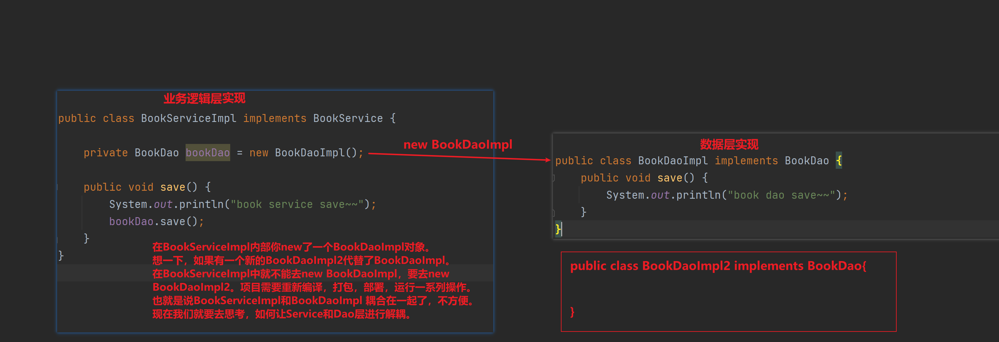


解决方案：使用对象时，在程序中不要主动使用new产生对象，转换为由外部提供对象。


**核心概念：**

- IOC（Inversion of Control）控制反转。使用对象时，由主动new产生对象转换为由外部提供对象，此过程中对象创建控制权由程序转移到外部，此思想称为控制反转。通俗的讲就是“将new对象的权利交给Spring，我们从Spring中获取对象使用即可”

  - 日常生活中的容器，只能用来存储，没有更多功能。

    

  - 程序中的普通容器

    - 数组
    - List集合
    - Set集合
    - ...

  - 生活中的复杂容器（政府管理我们的一生，生老病死都和政府有关。）

    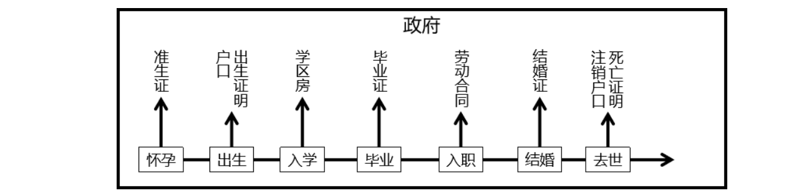

  - 程序中的复杂容器

    - Servlet 容器能够管理 Servlet、Filter、Listener 这样的组件的一生，所以它是一个复杂容器。我们即将要学习的 IOC 容器也是一个复杂容器。它们不仅要负责**创建**组件的对象、**存储**组件的对象，还要负责**调用**组件的方法让它们工作，最终在特定情况下**销毁**组件。

    - Servlet生命周期 

      | 名称       | 时机                                                         | 次数 |
      | ---------- | ------------------------------------------------------------ | ---- |
      | 创建对象   | 默认情况：接收到第一次请求 修改启动顺序后：Web应用启动过程中 | 一次 |
      | 初始化操作 | 创建对象之后                                                 | 一次 |
      | 处理请求   | 接收到请求                                                   | 多次 |
      | 销毁操作   | Web应用卸载之前                                              | 一次 |

    - Filter生命周期

      | 生命周期阶段 | 执行时机         | 执行次数 |
      | ------------ | ---------------- | -------- |
      | 创建对象     | Web应用启动时    | 一次     |
      | 初始化       | 创建对象后       | 一次     |
      | 拦截请求     | 接收到匹配的请求 | 多次     |
      | 销毁         | Web应用卸载前    | 一次     |

- Spring技术对IOC思想进行了实现。Spring提供了一个容器，称为IOC容器，用来充当IOC思想中的“外部”。IOC容器负责对象的创建、初始化等一系列工作，被创建或被管理的对象在IoC容器中统称为Bean

- DI（Dependency Injection）依赖注入。在容器中建立bean与bean之间的依赖关系的整个过程，称为依赖注入。


这样做的目录是充分解耦，使用IOC容器管理bean，在IOC容器内将有依赖关系的bean进行关系绑定（DI）。最终使用对象时不仅可以直接从IoC容器中获取，并且获取到的bean已经绑定了所有的依赖关系。


**Spring Framework课程学习路线**

1. 核心容器，IOC/DI，容器的基本操作
2. AOP，AOP基础操作，AOP实用开发
3. 事务
4. 整合MyBatis


## 二，IOC和DI入门案例【重点】


### 1，IOC入门案例

入门案例思路分析

1. 管理什么？(Service与Dao)
2. 如何将被管理的对象告知IOC容器？(配置文件)
3. 被管理的对象交给IOC容器，如何获取到IoC容器？(接口)
4. IOC容器得到后，如何从容器中获取bean？(接口方法)
5. 使用Spring导入哪些坐标？(pom.xml)


创建一个项目：

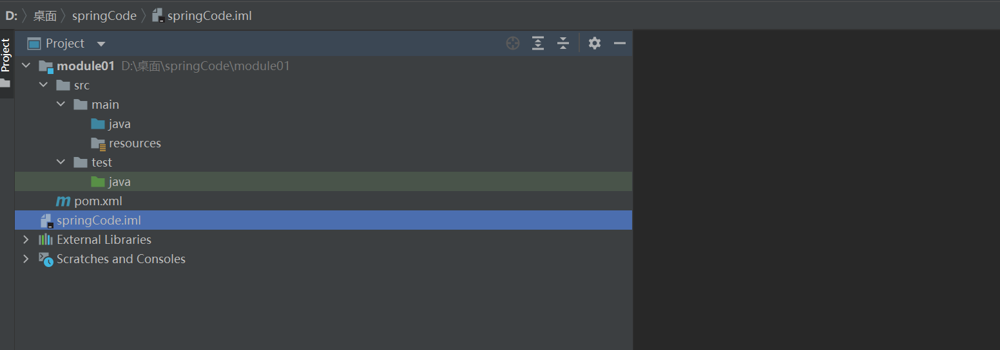


项目的目录结构：

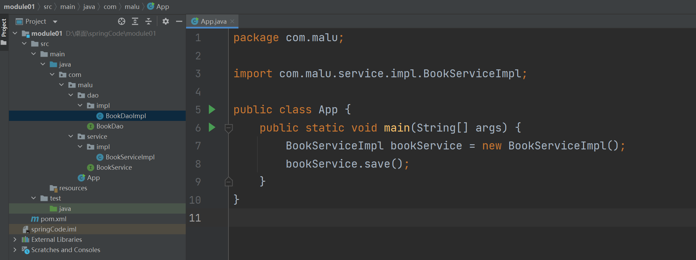


dao层代码：

```java
public interface BookDao {
    public void save();
}

public class BookDaoImpl implements BookDao {
    public void save() {
        System.out.println("book dao save ...");
    }
}
```


service层代码：

```java
public interface BookService {
    public void save();
}

public class BookServiceImpl implements BookService {
    private BookDao bookDao = new BookDaoImpl();

    public void save() {
        System.out.println("book service save ...");
        bookDao.save();
    }
}
```


入门代码：

```java
public class App {
    public static void main(String[] args) {
        BookService bookService = new BookServiceImpl();
        bookService.save();
    }
}
```


运行程序，效果如下：

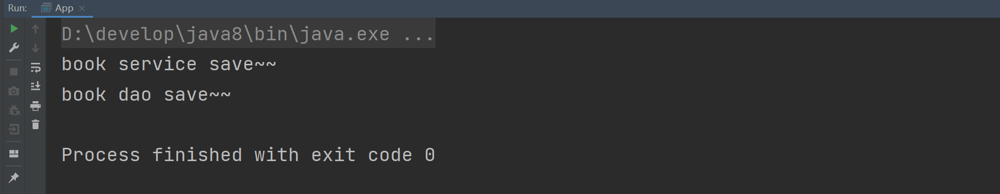


上面代码中，我们并没有使用到Spring框架，接下来，我们开始使用Spring框架，步骤：

实现步骤：

1. 导入Spring坐标

   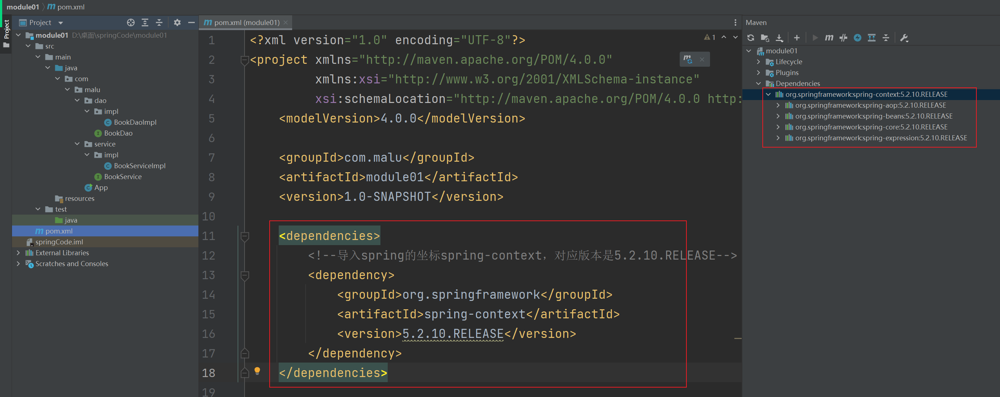

   ```xml
   <dependencies>
       <!--导入spring的坐标spring-context，对应版本是5.2.10.RELEASE-->
       <dependency>
           <groupId>org.springframework</groupId>
           <artifactId>spring-context</artifactId>
           <version>5.2.10.RELEASE</version>
       </dependency>
   </dependencies>
   ```

2. 定义Spring管理的类（接口）

   ```java
   // BookDao接口和BookDaoImpl实现类
   public interface BookDao {
       public void save();
   }
   
   public class BookDaoImpl implements BookDao {
       public void save() {
           System.out.println("book dao save ...");
       }
   }
   
   // BookService接口和BookServiceImpl实现类
   public interface BookService {
       public void save();
   }
   
   public class BookServiceImpl implements BookService {
       public void save() {
           System.out.println("book service save ...");
       }
   }
   ```

3. 创建Spring配置文件applicationContext.xml，配置对应类作为Spring管理的bean对象

   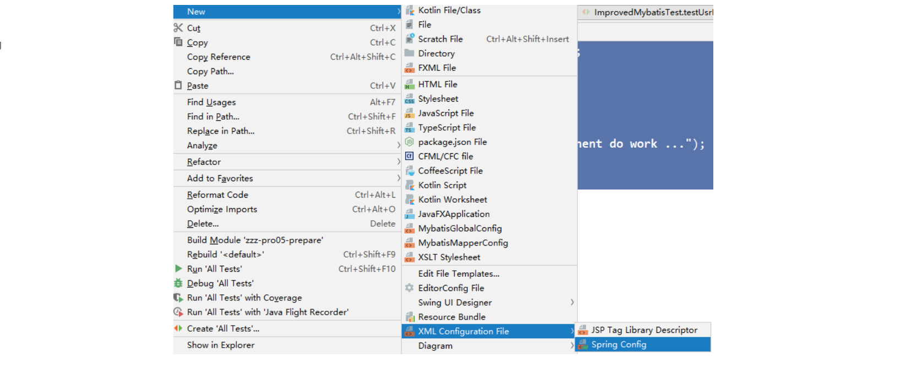

   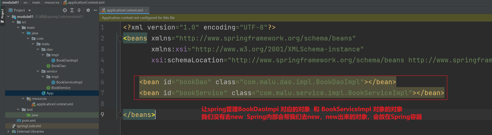

   ```xml
   <?xml version="1.0" encoding="UTF-8"?>
   <beans xmlns="http://www.springframework.org/schema/beans"
          xmlns:xsi="http://www.w3.org/2001/XMLSchema-instance"
          xsi:schemaLocation="http://www.springframework.org/schema/beans http://www.springframework.org/schema/beans/spring-beans.xsd">
    
       <!--
   		bean标签：表示配置bean，通过配置bean标签告诉IOC容器需要创建对象的组件是什么
       	id属性：表示给bean起名字，bean定义时id属性在同一个上下文中(IOC容器中)不能重复
       	class属性：表示给bean定义类型，组件类的全类名
   	-->
       <bean id="bookDao" class="com.malu.dao.impl.BookDaoImpl"></bean>
       <bean id="bookService" class="com.malu.service.impl.BookServiceImpl"></bean>
   
   </beans>
   ```

   

4. 初始化IOC容器（Spring核心容器/Spring容器），通过容器获取Bean对象

   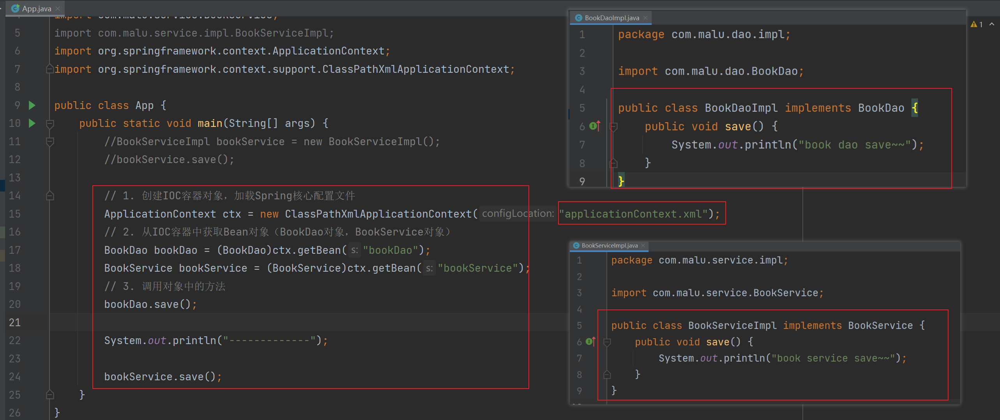

   ```java
   public class App {
       public static void main(String[] args) {
           //1.创建IoC容器对象，加载spring核心配置文件
           ApplicationContext ctx = new ClassPathXmlApplicationContext("applicationContext.xml");
           //2 从IOC容器中获取Bean对象(BookDao对象)，也就是组件对象
           BookDao bookDao= (BookDao)ctx.getBean("bookDao");
           BookService bookService= (BookService)ctx.getBean("bookService");
           //3 调用Bean对象(BookDao对象)的方法
           bookDao.save();
   
           System.out.println("--------");
   
           bookService.save();
   
       }
   }
   ```


运行结果：

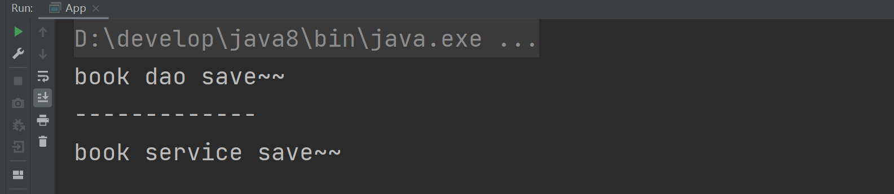


Spring 底层默认通过反射技术调用组件类的无参构造器来创建组件对象，这一点需要注意。如果在需要无参构造器时，没有无参构造器，则会抛出下面的异常：

>  org.springframework.beans.factory.BeanCreationException: Error creating bean with name 'BookDao' defined in class path resource [applicationContext.xml]: Instantiation of bean failed; 
>
> nested exception is org.springframework.beans.BeanInstantiationException: Failed to instantiate [com.malu.ioc.component.HappyComponent]: No default constructor found; 
>
> nested exception is java.lang.NoSuchMethodException: com.malu.ioc.component.HappyComponent.()


所以对一个JavaBean来说，**无参构造器**和**属性的getXxx()、setXxx()方法**是**必须存在**的，特别是在框架中。


用IOC容器创建对象和自己建区别

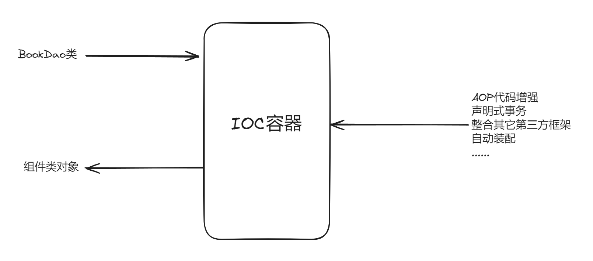

在Spring环境下能够享受到的所有福利，都必须通过 IOC 容器附加到组件类上，所以随着我们在 Spring 中学习的功能越来越多，IOC 容器创建的组件类的对象就会比自己 new 的对象强大的越来越多。


### 2，DI入门案例


DI入门案例思路分析

1. 基于IOC管理bean
2. Service中使用new形式创建的Dao对象是否保留？(否)
3. Service中需要的Dao对象如何进入到Service中？(提供方法)
4. Service与Dao间的关系如何描述？(配置)


下面的代码是基于上面案例的基础上实现的。


实现步骤：

1. 删除使用new的形式创建对象的代码，并提供依赖对象对应的setter方法

   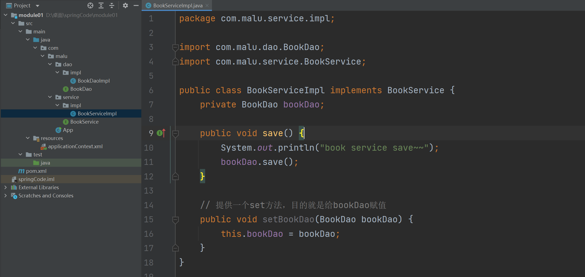

   

   ```java
   public class BookServiceImpl implements BookService {
       private BookDao bookDao;
   
       public void save() {
           System.out.println("book service save~~");
           bookDao.save();
       }
   
       // 提供一个set方法，目的就是给bookDao赋值
       public void setBookDao(BookDao bookDao) {
           this.bookDao = bookDao;
       }
   }
   ```

2. 在applicationContext.xml中配置service与dao之间的关系

   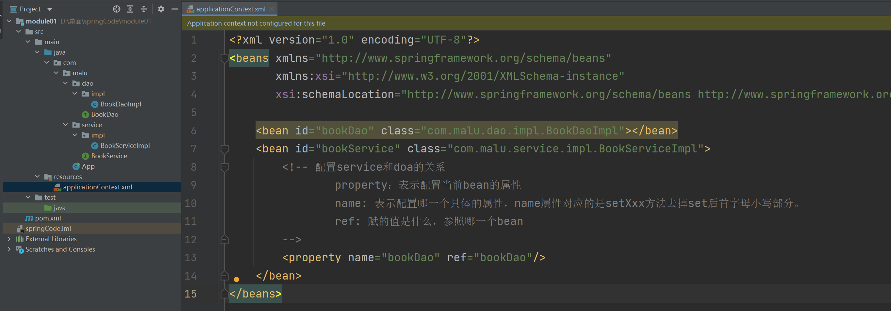

   ```xml
   <?xml version="1.0" encoding="UTF-8"?>
   <beans xmlns="http://www.springframework.org/schema/beans"
          xmlns:xsi="http://www.w3.org/2001/XMLSchema-instance"
          xsi:schemaLocation="http://www.springframework.org/schema/beans http://www.springframework.org/schema/beans/spring-beans.xsd">
       <!--
   		bean标签：表示配置bean
       	id属性：表示给bean起名字
       	class属性：表示给bean定义类型
   	-->
       <bean id="bookDao" class="com.malu.dao.impl.BookDaoImpl"/>
   
       <bean id="bookService" class="com.malu.service.impl.BookServiceImpl">
           <!--配置server与dao的关系
   			property标签：表示配置当前bean的属性
           	name属性：表示配置哪一个具体的属性。name属性对应setXxx方法去掉set后首字母小写部分。
           	ref属性：表示参照哪一个bean
   		-->
           <property name="bookDao" ref="bookDao"/>
       </bean>
   </beans>
   ```


App入口

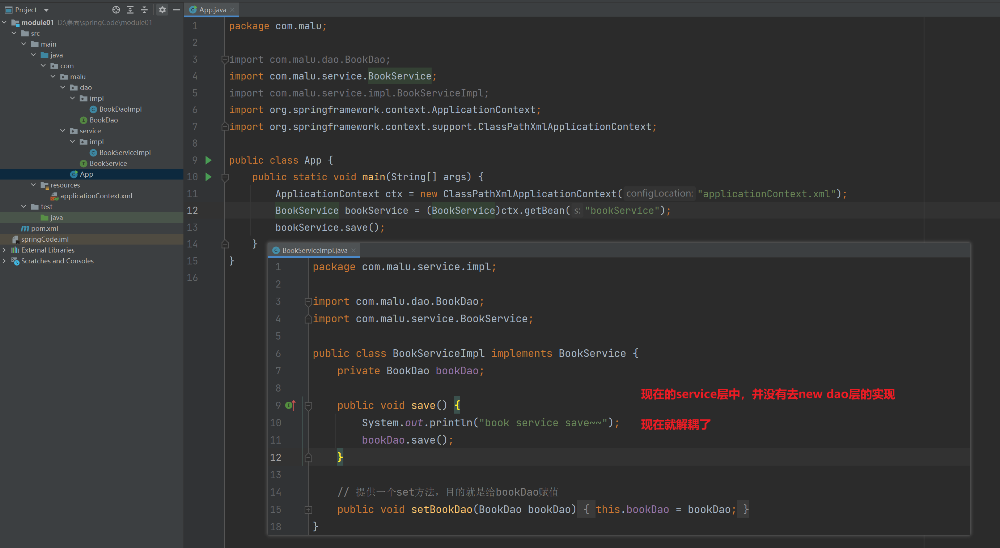

```java
public class App {
    public static void main(String[] args) {
        ApplicationContext ctx = new ClassPathXmlApplicationContext("applicationContext.xml");
        BookService bookService= (BookService)ctx.getBean("bookService");
        bookService.save();
    }
}
```


测试之：

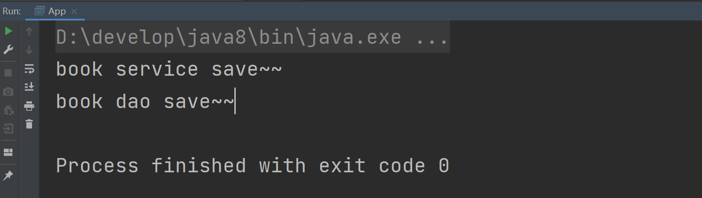


## 三，Bean的基础配置


### 1，Bean的基础配置


基础配置：


参考：

```xml
<bean id="bookDao" class="com.malu.dao.impl.BookDaoImpl" />
<bean id="bookService" class="com.malu.service.impl.BookServiceImpl"></bean>
```


### 2，Bean的别名配置


下面的代码还是基于上面的案例实现的。


别名配置：


配置bean的别名：

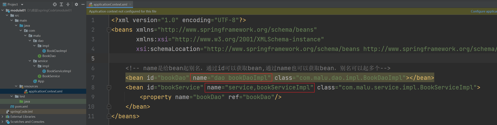

```xml
<!--name:为bean指定别名，别名可以有多个，使用逗号，分号，空格进行分隔-->
<bean id="bookDao" name="dao bookDaoImpl" class="com.malu.dao.impl.BookDaoImpl" />
<bean id="bookService" name="service,bookServiceImpl" class="com.malu.service.impl.BookServiceImpl"></bean>
```


代码演示：

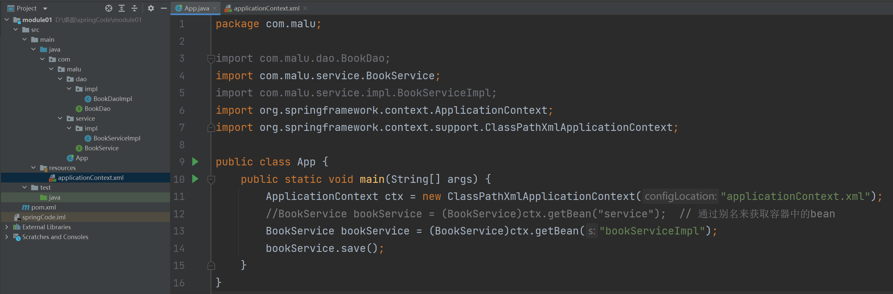


```java
public class App {
    public static void main(String[] args) {
        ApplicationContext ctx = new ClassPathXmlApplicationContext("applicationContext.xml");
        //BookService bookService= (BookService)ctx.getBean("service");
        BookService bookService= (BookService)ctx.getBean("bookServiceImpl");
        bookService.save();
    }
}

```


运行效果如下：

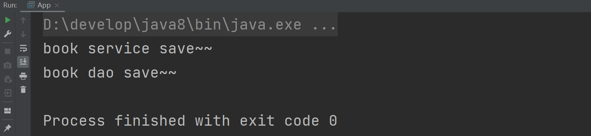


如果名字不存在，会报如下的错误：

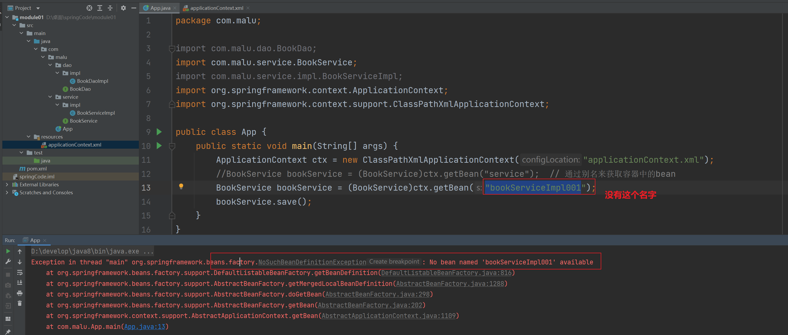


### 3，Bean作用范围配置

作用范围配置：


获取BookDao，如下：

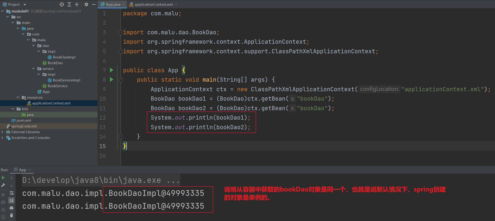

也就是说Spring默认给我们创建出来的对象是单例的。


设置非单例，如下：

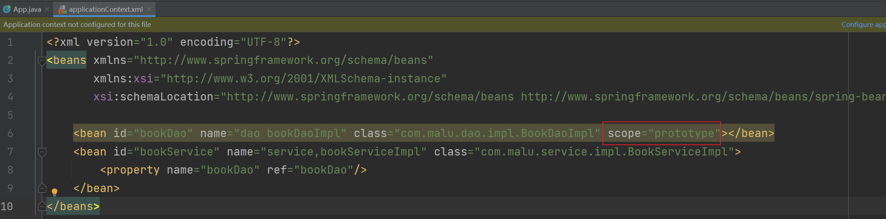


```xml

<!--scope：为bean设置作用范围，可选值为单例singloton，非单例prototype-->
<!--scope的取值不仅仅只有singleton和prototype，还有request、session、application、 websocket ，表示创建出的对象放置在web容器(tomcat)对应的位置。比如：request表示保存到request域中。 -->
<bean id="bookDao" name="dao" class="com.malu.dao.impl.BookDaoImpl" scope="prototype"/>

```


代码演示：

```java
public class AppForScope {
    public static void main(String[] args) {

        ApplicationContext ctx = new ClassPathXmlApplicationContext("applicationContext.xml");
        // 获取两次BookDao对象
        BookDao bookDao1 = (BookDao) ctx.getBean("bookDao");
        BookDao bookDao2 = (BookDao) ctx.getBean("bookDao");
        // 打印两次的地址值不一样，说明UserDao是非单例的
        System.out.println(bookDao1);
        System.out.println(bookDao2);
    }
}

```


测试如下：

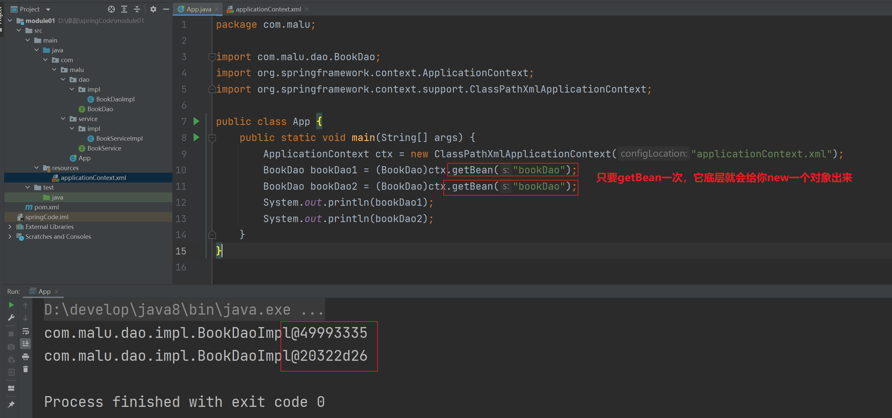


注意细节：

- 在我们的实际开发当中，绝大部分的Bean是单例的，也就是说绝大部分Bean不需要配置scope属性。
- 适合交给容器进行管理的Bean有：表现层对象，业务层对象，数据层对象，工具对象
- 不适合交给容器进行管理的Bean有：封装实体的域对象


## 四，Bean的实例化

bean本质就是对象。创建出这个对象有多种方式。


### 1，构造方法实例化

bean本质上就是对象，创建bean使用构造方法完成。BookDaoImpl实现类如下：

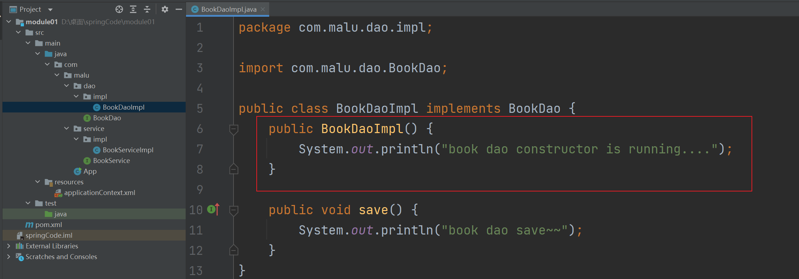

```java
public class BookDaoImpl implements BookDao {
    public BookDaoImpl() {
        System.out.println("book dao constructor is running ....");
    }
    public void save() {
        System.out.println("book dao save ...");
    }
}
```


applicationContext.xml配置：

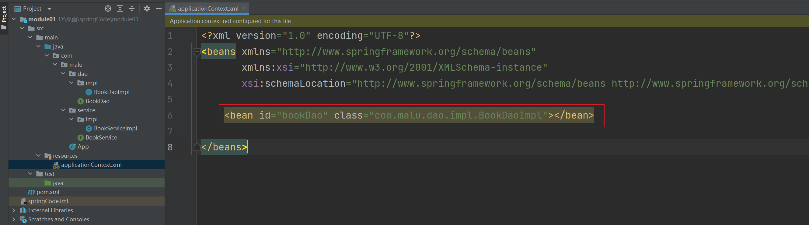

```xml
<!--方式一：构造方法实例化bean-->
<bean id="bookDao" class="com.malu.dao.impl.BookDaoImpl"/>
```


AppForInstanceBook测试类：

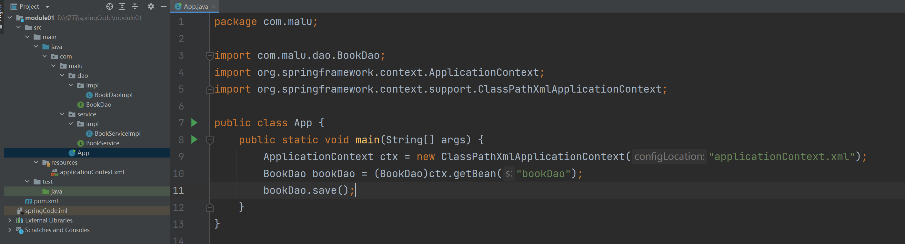

```java
public class AppForInstanceBook {
    public static void main(String[] args) {
        ApplicationContext ctx = new ClassPathXmlApplicationContext("applicationContext.xml");

        BookDao bookDao = (BookDao) ctx.getBean("bookDao");

        bookDao.save();
    }
}
```


运行结果：

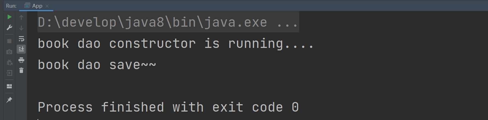


注意细节：

- 如果上面的无参构造方法设置成私有的，也是可以的，底层使用到了反射。

  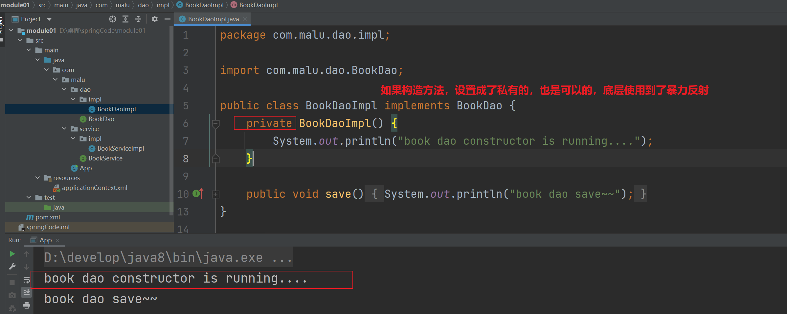

- 无参构造方法如果不存在，将抛出异常`BeanCreationException`

  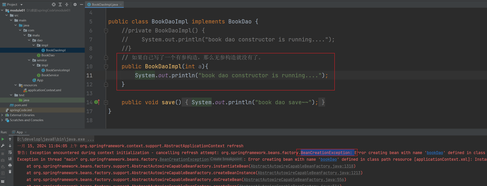


### 2，静态工厂方式实例化（了解）


BookDao接口和BookDaoImpl实现类：

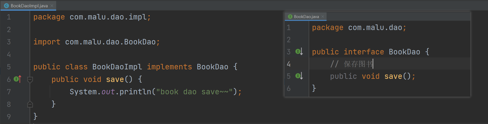

```java
public interface BookDao {
    // 保存图书
    public void save();
}

public class BookDaoImpl implements BookDao {
    public void save() {
        System.out.println("book dao save~~");
    }
}
```


BookDaoFatory工厂类：

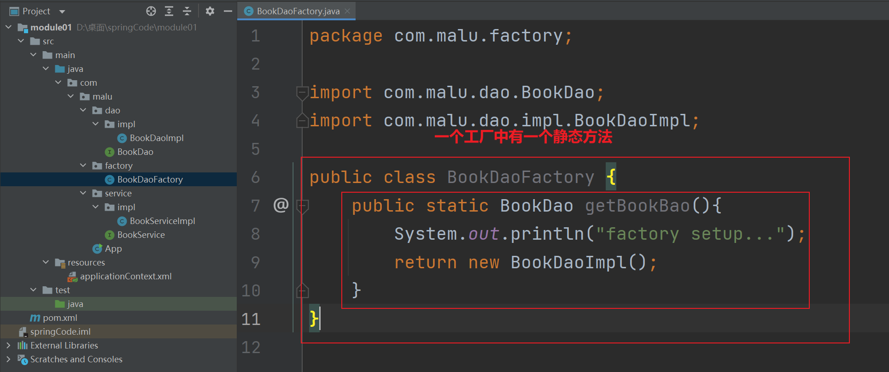

```java
//静态工厂创建对象
public class BookDaoFactory {
    public static BookDao getBookBao(){
        System.out.println("factory setup...");
        return new BookDaoImpl();
    }
}
```


applicationContext.xml配置：

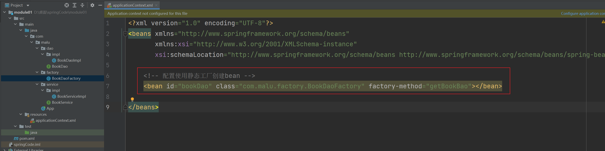

```java
<!--方式二：使用静态工厂实例化bean-->
<bean id="bookDao" class="com.malu.factory.BookDaoFactory" factory-method="getBookBao"></bean>
```


测试类:

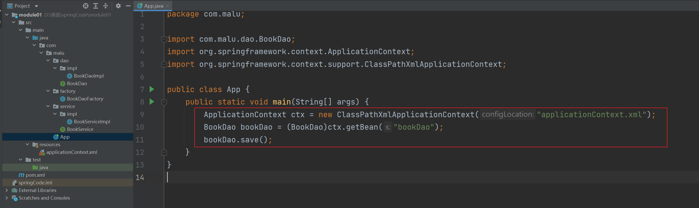

```java
public class App {
    public static void main(String[] args) {
        ApplicationContext ctx = new ClassPathXmlApplicationContext("applicationContext.xml");
        BookDao bookDao = (BookDao)ctx.getBean("bookDao");
        bookDao.save();
    }
}
```


运行结果：

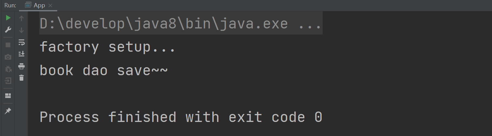


### 3，实例工厂方式实例化（了解）


BookDaoFactory工厂类：

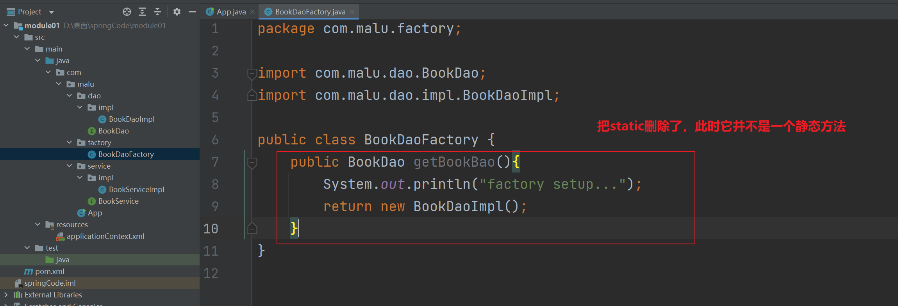


```java
public class BookDaoFactory {
    public BookDao getBookBao(){
        System.out.println("factory setup...");
        return new BookDaoImpl();
    }
}
```


applicationContext.xml配置：

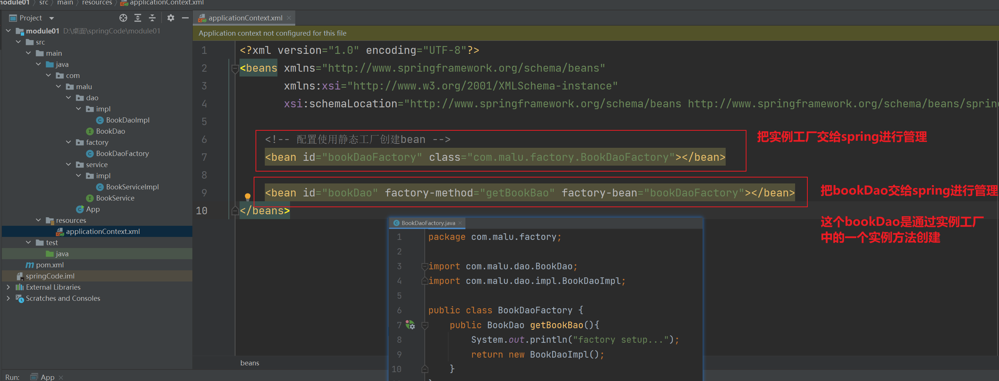

```xml
 <!--使用实例工厂实例化bean-->
 <bean id="bookDaoFactory" class="com.malu.factory.BookDaoFactory"></bean>

<bean id="bookDao" factory-method="getBookBao" factory-bean="bookDaoFactory"></bean>
```


测试类：

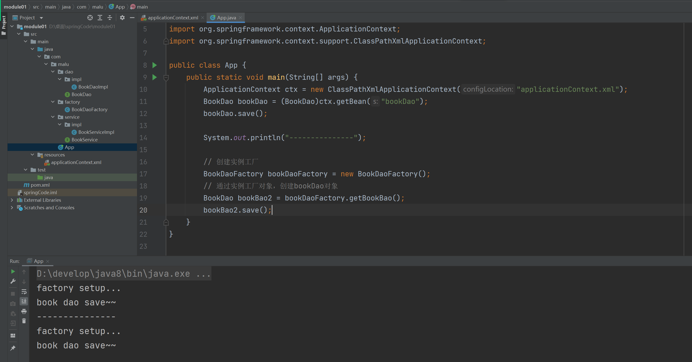

```java
public class App {
    public static void main(String[] args) {
        ApplicationContext ctx = new ClassPathXmlApplicationContext("applicationContext.xml");
        BookDao bookDao = (BookDao)ctx.getBean("bookDao");
        bookDao.save();

        System.out.println("---------------");

        // 创建实例工厂
        BookDaoFactory bookDaoFactory = new BookDaoFactory();
        // 通过实例工厂对象，创建bookDao对象
        BookDao bookBao2 = bookDaoFactory.getBookBao();
        bookBao2.save();
    }
}
```


看配置文件：

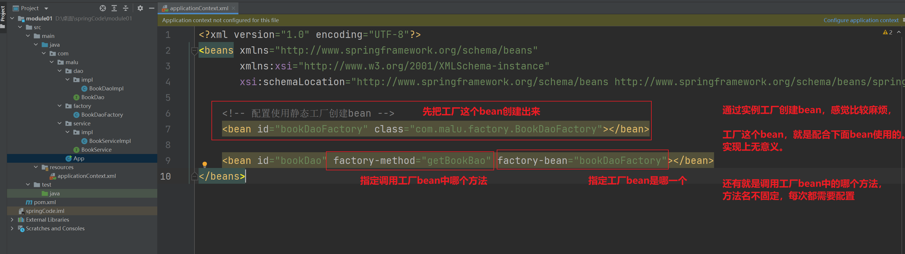


所以下面我们要学习第四种方式创建Bean，通过FactoryBean的方式。


### 4，通过FactoryBean创建对象（实用）

改造之，创建BookrDaoFactoryBean，如下：

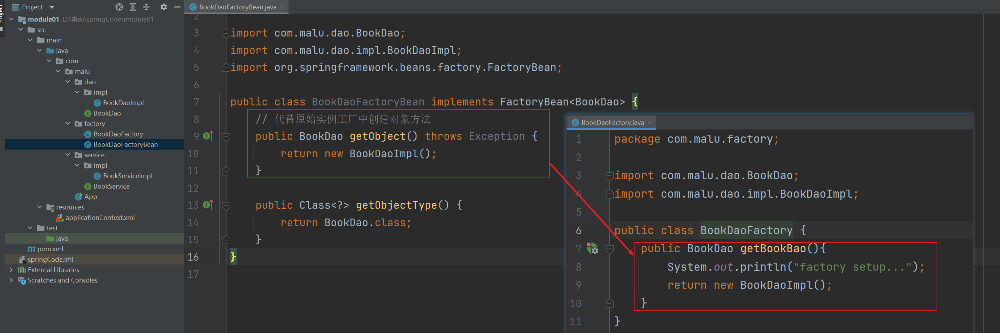


配置如下：

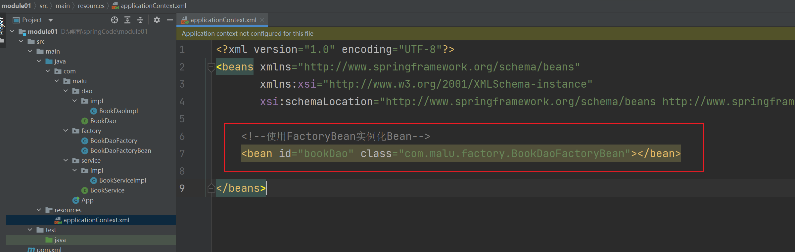

```xml
<!--使用FactoryBean实例化Bean-->
<bean id="bookDao" class="com.malu.factory.BookDaoFactoryBean"></bean>
```


入口文件：

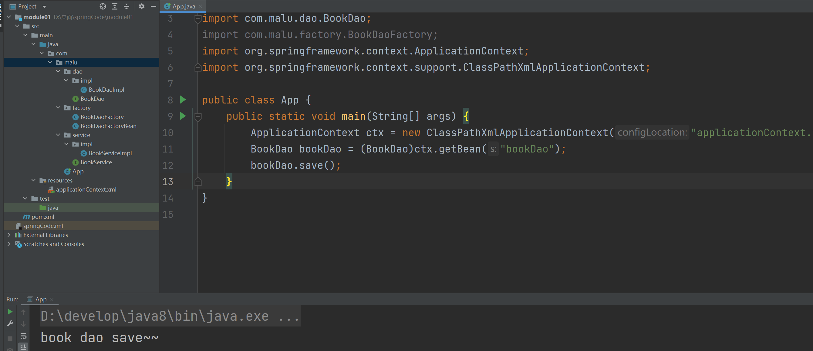


上面的方式，非常重要，一定要掌握。测试上面创建的对应是单例还是多例，如下：

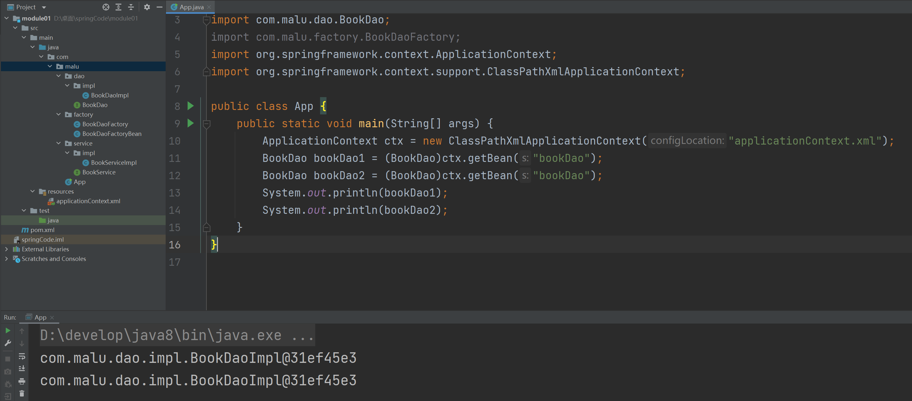


如果要非单例，再实现一个方法，如下：

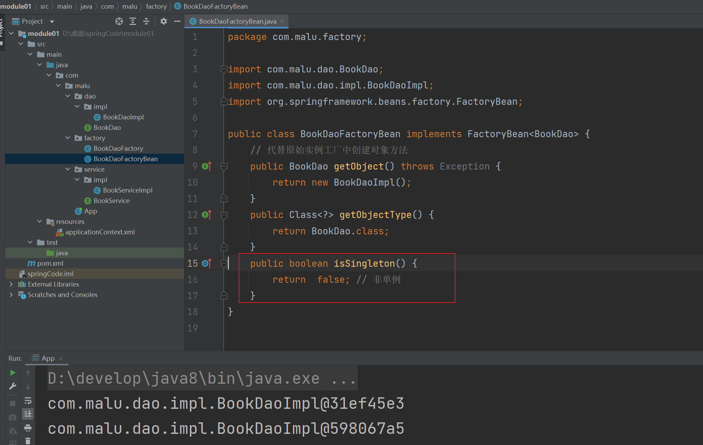


## 五，Bean的生命周期


生命周期相关的概念：

- 生命周期：从创建到消亡的完整过程
- bean生命周期：bean从创建到销毁的整体过程
- bean生命周期控制：在bean创建后到销毁前做一些事情


### 1，Bean的生命周期控制方式一


提供生命周期控制方法：

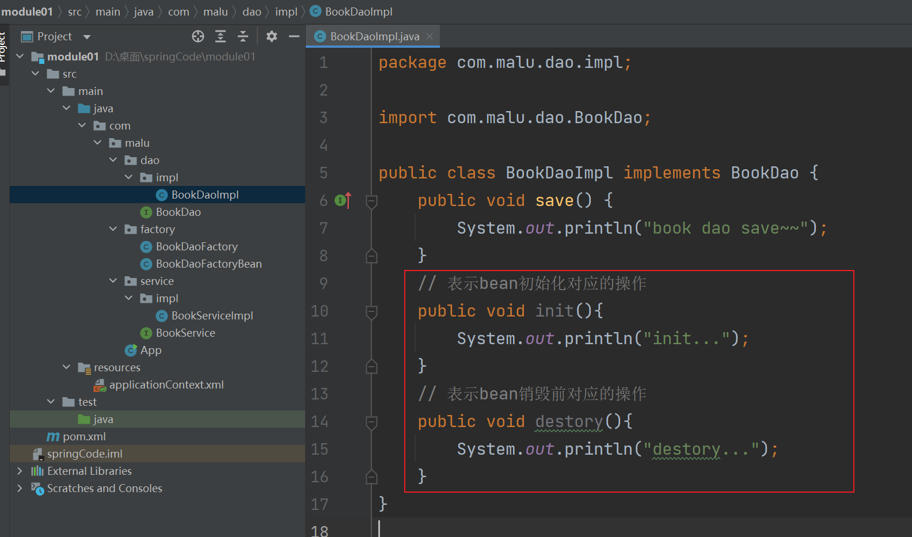

```java
public class BookDaoImpl implements BookDao {
    public void save() {
        System.out.println("book dao save ...");
    }
    //表示bean初始化对应的操作
    public void init(){
        System.out.println("init...");
    }
    //表示bean销毁前对应的操作
    public void destory(){
        System.out.println("destory...");
    }
}
```

applicationContext.xml配置:

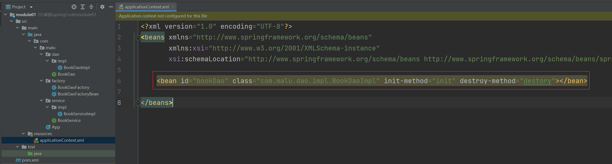

```xml
<!--init-method：设置bean初始化生命周期回调函数,此处填写init方法名-->
<!--destroy-method：设置bean销毁生命周期回调函数，仅适用于单例对象，此处填写destory方法名-->
<bean id="bookDao" class="com.malu.dao.impl.BookDaoImpl" init-method="init" destroy-method="destory"/>
```


测试类：

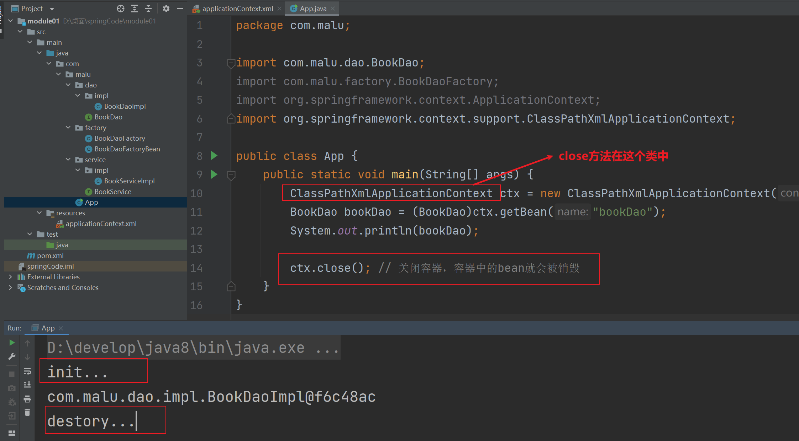

```java
public class App {
    public static void main( String[] args ) {
        //此处需要使用实现类类型，接口类型没有close方法
        ClassPathXmlApplicationContext ctx = new ClassPathXmlApplicationContext("applicationContext.xml");
        BookDao bookDao = (BookDao) ctx.getBean("bookDao");
        bookDao.save();
        //关闭容器，执行销毁的方法
        ctx.close();
    }
}
```


### 2，Bean的生命周期控制方式二


实现InitializingBean, DisposableBean接口

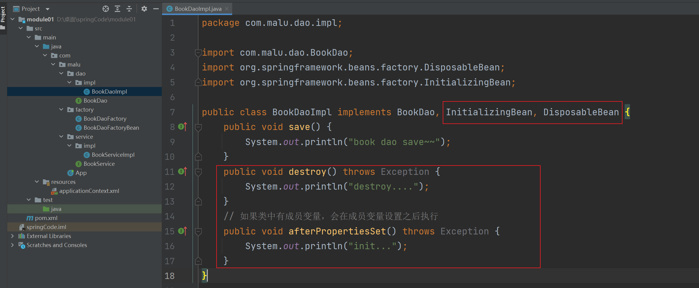


```java
public class BookDaoImpl implements BookDao, InitializingBean, DisposableBean {
    public void save() {
        System.out.println("book dao save ...");
    }


    public void destroy() throws Exception {
        System.out.println("destroy...");
    }
    // 如果这个类中有成员变量，会在成员变量设置之后执行。
    public void afterPropertiesSet() throws Exception {
        System.out.println("init...");
    }
}
```


配置：

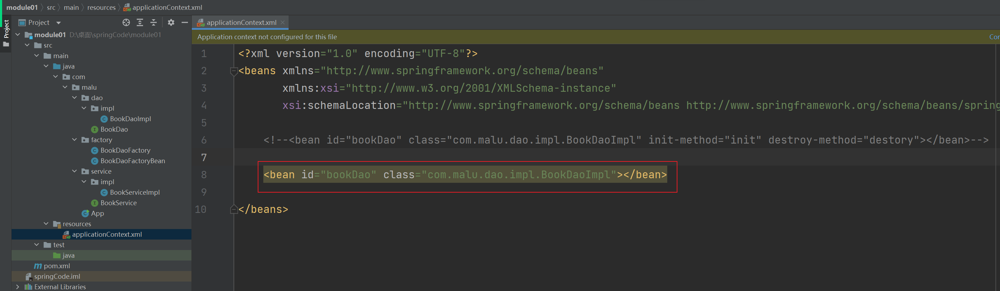


测试：

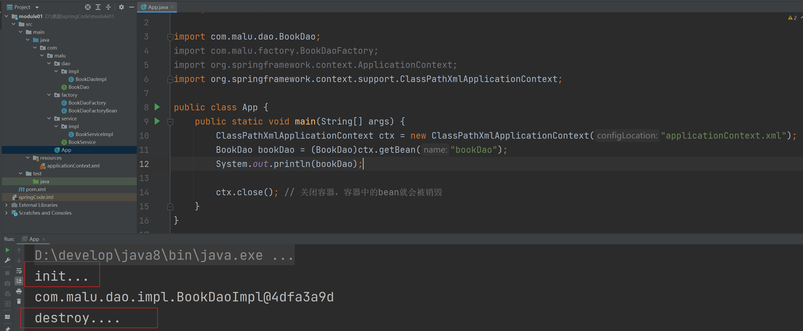


### 3，Bean的销毁时机


- 容器关闭前触发bean的销毁
- 关闭容器方式：
  - 手工关闭容器
    `ConfigurableApplicationContext`接口`close()`操作
  - 注册关闭钩子，在虚拟机退出前先关闭容器再退出虚拟机
    `ConfigurableApplicationContext`接口`registerShutdownHook()`操作


代码演示：

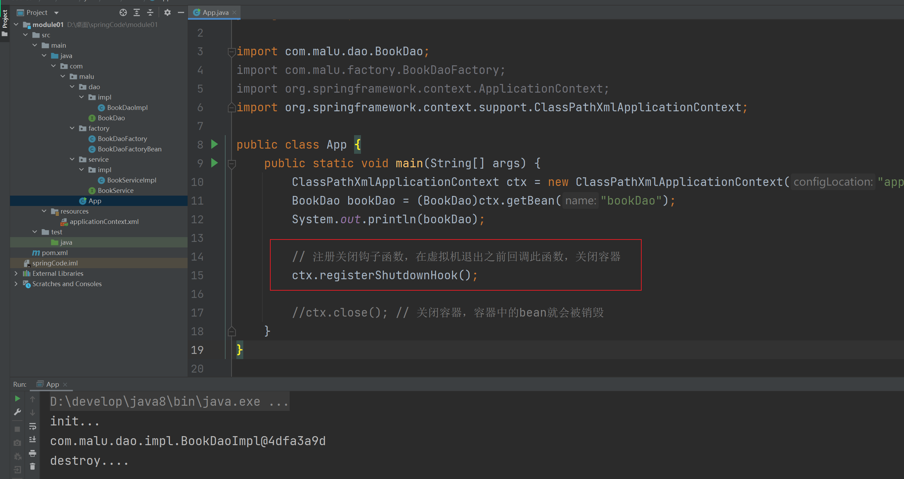

```java
public class AppForLifeCycle {
    public static void main( String[] args ) {
        //此处需要使用实现类类型，接口类型没有close方法
        ClassPathXmlApplicationContext ctx = new ClassPathXmlApplicationContext("applicationContext.xml");

        BookDao bookDao = (BookDao) ctx.getBean("bookDao");
        bookDao.save();
        
        //注册关闭钩子函数，在虚拟机退出之前回调此函数，关闭容器
        ctx.registerShutdownHook();
        
        //关闭容器，close关闭相对暴力一些,close需要放下面，不能放上面。
        //ctx.close();
    }
}
```


Bean生命周期总结：

1. 创建对象（内存分配）
2. 执行构造方法
3. 执行属性注入（set操作）
4. 执行bean初始化方法
5. 使用bean，执行业务操作
6. 当关闭或销毁容器时，执行bean的销毁方法


## 六，依赖注入DI

### 1，依赖注入的方式

所谓的依赖注入就是向一个类中传递数据，也就是给bean的属性赋值，方式有两种：

- 普通方法（set方法）
- 构造方法


依赖注入描述了在容器中建立bean与bean之间的依赖关系的过程。bean运行也可能需要的是数字或字符串。所以依赖注入的数据类型分两种：

- 引用类型
- 简单类型（基本类型和String）


所以依赖注入的方式分四种情况：

- setter注入
  - 简单类型
  - 引用类型（很常用）
- 构造器注入
  - 简单类型
  - 引用类型


#### 1.1 setter注入

使用setter方法，注入引用类型，其实前面我们已经演示过了。回顾如下：

1. 在bean中定义引用类型属性并提供可访问的set方法：

   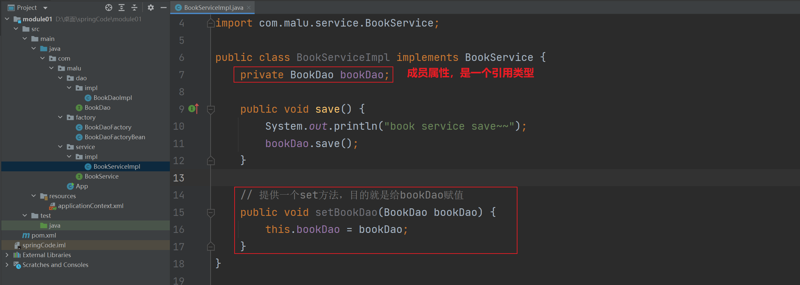

    ```java
    public class BookServiceImpl implements BookService{
        private BookDao bookDao;

        //setter注入需要提供要注入对象的set方法
        public void setBookDao(BookDao bookDao) {
            this.bookDao = bookDao;
        }

        public void save() {
            System.out.println("book service save ...");
            bookDao.save();
        }
    }

    ```


2. 配置中使用property标签ref属性注入引用类型对象：

    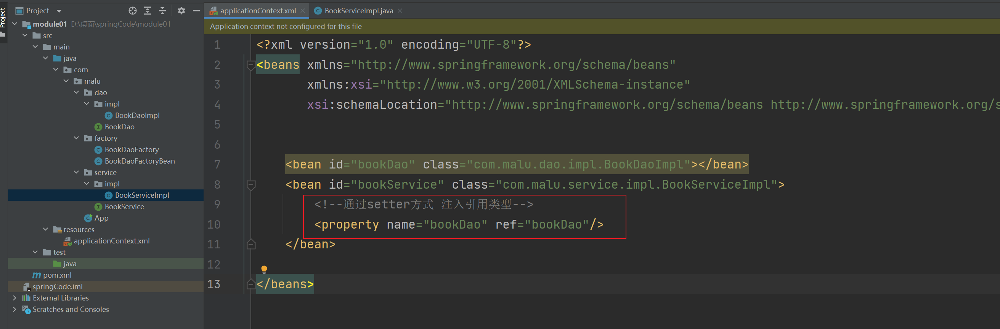

    ```xml
    <bean id="bookDao" class="com.malu.dao.impl.BookDaoImpl"></bean>
    
    <!--注入引用类型-->
    <bean id="bookService" class="com.malu.service.impl.BookServiceImpl">
       <!-- 通过property标签配置的属性值会通过setXxx()方法注入 -->
       <!--property标签：设置注入属性-->
       <!--name属性：设置注入的属性名，实际是set方法对应的名称-->
       <!--ref属性：设置注入引用类型bean的id或name-->
       <property name="bookDao" ref="bookDao"/>
    </bean>
    ```


测试类：

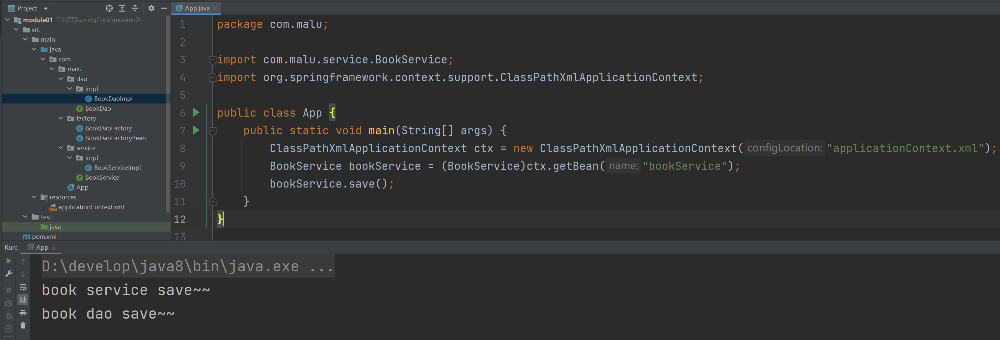


当然，也可以注入多个引用类型，大家自行测试。


接下来，使用代码演示setter简单类型依赖注入，在bean中定义简单类型属性并提供可访问的set方法：

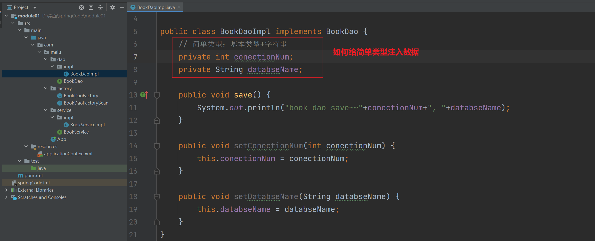

```java
public class BookDaoImpl implements BookDao {
    private int connectionNum;
    private String databaseName;

    public void save() {
        System.out.println("book dao save ..."+databaseName+","+connectionNum);
    }

    public void setConnectionNum(int connectionNum) {
        this.connectionNum = connectionNum;
    }

    public void setDatabaseName(String databaseName) {
        this.databaseName = databaseName;
    }
}
```


配置中使用property标签value属性注入简单类型数据：

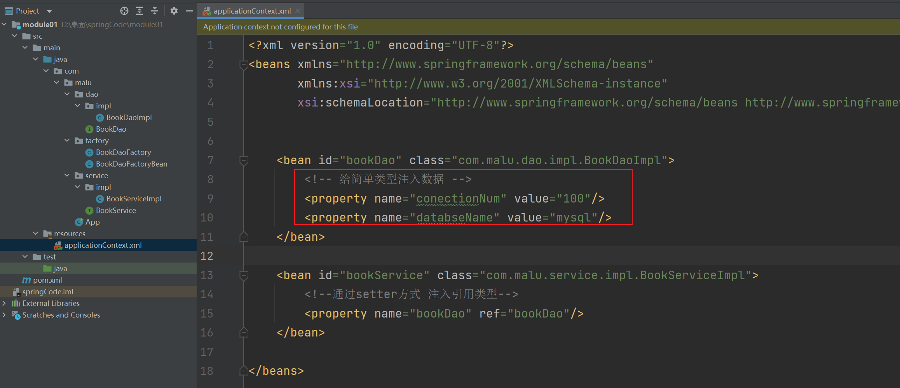

```xml
<!--注入简单类型-->
<bean id="bookDao" class="com.itheima.dao.impl.BookDaoImpl">
	<!--property标签：设置注入属性-->
	<!--name属性：设置注入的属性名，实际是set方法对应的名称-->
	<!--value属性：设置注入简单类型数据值-->
	<property name="connectionNum" value="100"/>
</bean>
```


测试类：

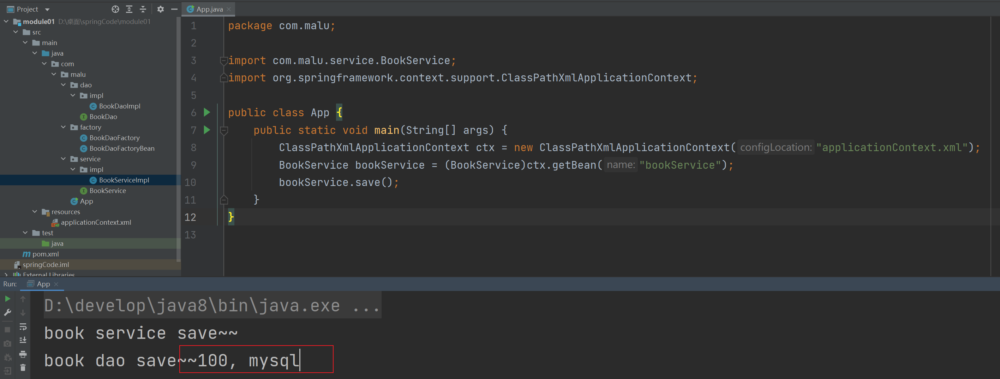

```java
public class App {
    public static void main(String[] args) {
        ClassPathXmlApplicationContext ctx = new ClassPathXmlApplicationContext("applicationContext.xml");
        BookService bookService = (BookService)ctx.getBean("bookService");
        bookService.save();
    }
}
```


#### 1.2 构造方式注入

代码演示构造方式注入引用类型，在bean中定义引用类型属性并提供可访问的构造方法：

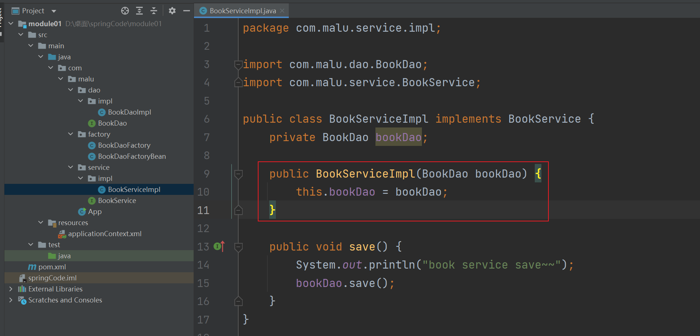

```java
public class BookServiceImpl implements BookService{
    private BookDao bookDao;

    public BookServiceImpl(BookDao bookDao) {
        this.bookDao = bookDao;
    }

    public void save() {
        System.out.println("book service save ...");
        bookDao.save();
    }
}
```


配置中使用constructor-arg标签ref属性注入引用类型对象：

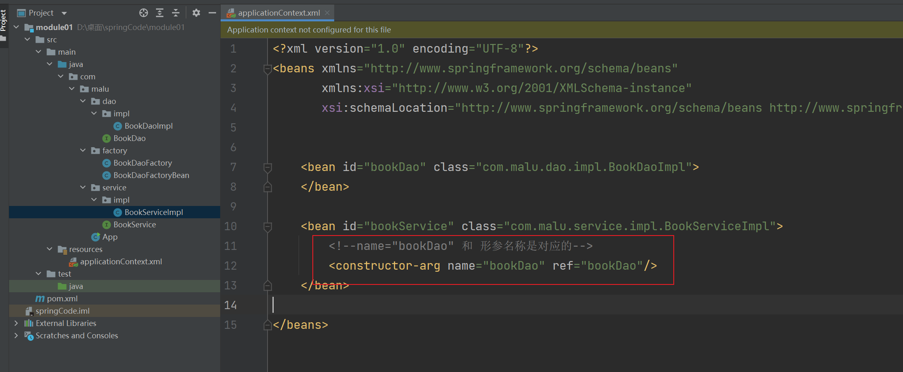

```xml
<bean id="bookService" class="com.malu.service.impl.BookServiceImpl">
    <!-- name="bookDao" 和 形参名称是对应的-->
    <constructor-arg name="bookDao" ref="bookDao"/>
</bean>
<bean id="bookDao" class="com.malu.dao.impl.BookDaoImpl"></bean>
```


代码演示构造方式注入简单类型，在bean中定义简单类型属性并提供可访问的构造方法：


```java
package com.malu.dao.impl;

import com.malu.dao.BookDao;

public class BookDaoImpl implements BookDao {
    private int connectionNum;
    private String databaseName;

    public BookDaoImpl(int connectionNum, String databaseName) {
        this.connectionNum = connectionNum;
        this.databaseName = databaseName;
    }

    public void save() {
        System.out.println("book dao save ..."+databaseName+","+connectionNum);
    }
}

```


配置中使用constructor-arg标签value属性注入简单类型数据：

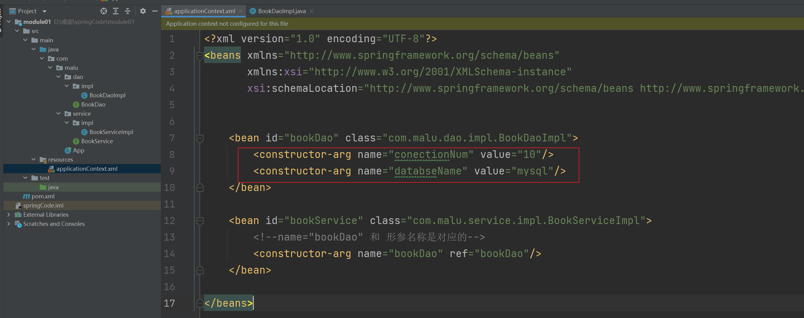

```xml
<bean id="bookDao" class="com.malu.dao.impl.BookDaoImpl">
    <constructor-arg name="connectionNum" value="10"/>
    <constructor-arg name="databaseName" value="mysql"/>
</bean>
```


测试类：

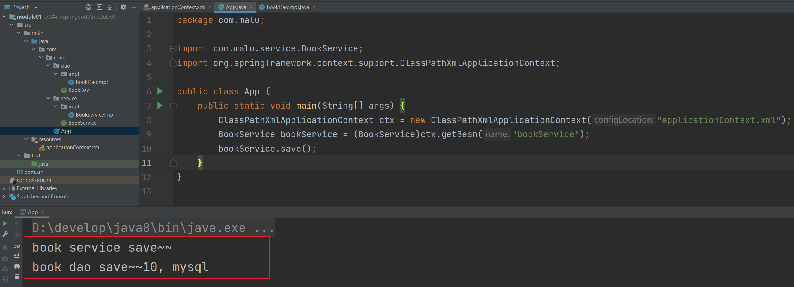


配置中使用constructor-arg标签type属性设置按形参类型注入：

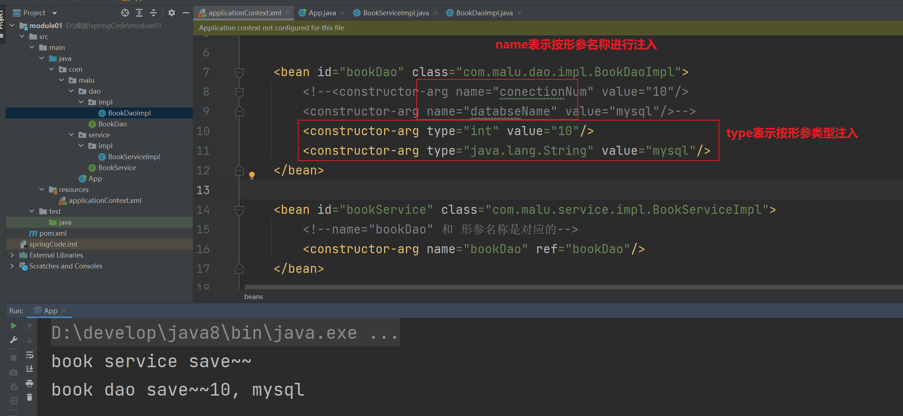

```xml
<!-- 解决形参名称的问题，与形参名不耦合 --> 
<bean id="bookDao" class="com.malu.dao.impl.BookDaoImpl">
    <!-- 根据构造方法参数类型注入 --> 
    <constructor-arg type="int" value="10"/>
    <constructor-arg type="java.lang.String" value="mysql"/>
</bean>
```


配置中使用constructor-arg标签index属性设置按形参位置注入：

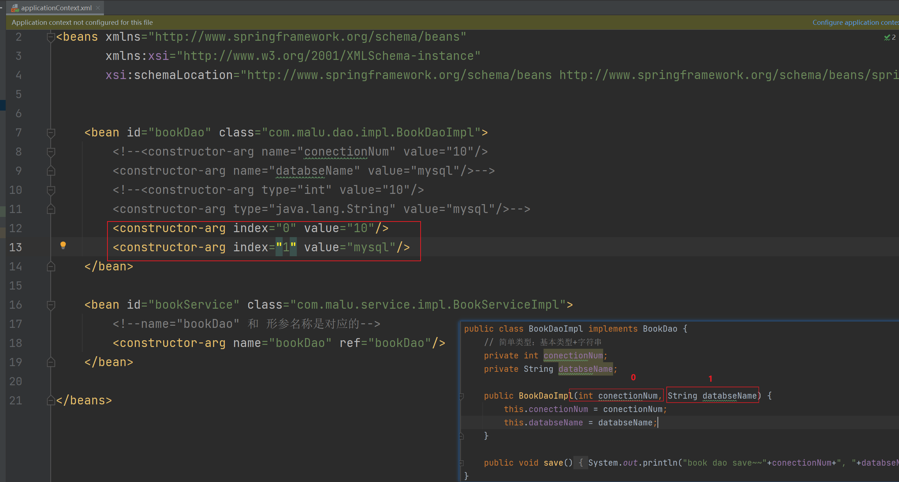

```xml
 <!--解决参数类型重复问题，使用位置解决参数匹配-->
<bean id="bookDao" class="com.malu.dao.impl.BookDaoImpl">
    <!--根据构造方法参数位置注入-->
    <constructor-arg index="0" value="mysql"/>
    <constructor-arg index="1" value="100"/>
</bean>
```


总结依赖注入方式选择：

- 强制依赖使用构造器进行，那么在编译期间必须给依赖，不会忘记。使用setter注入有概率不进行注入导致null对象出现，因为setter方法，可以执行，也可以不执行。
- 可选依赖使用setter注入进行，灵活性强。因为构造器注入是必写的，setter注入可注入，可不注入。
- Spring框架倡导使用构造器，第三方框架内部大多数采用构造器注入的形式进行数据初始化，相对严谨
- 如果有必要可以两者同时使用，使用构造器注入完成强制依赖的注入，使用setter注入完成可选依赖的注入
- 实际开发过程中还要根据实际情况分析，如果受控对象没有提供setter方法就必须使用构造器注入
- 自己开发的模块推荐使用setter注入


也就是说：

- 如果是别人的类，人家提供了构造器，也提供了setter，那就使用setter注入。
- 如果是别人的类，人家没有setter，只有构造器，那只能使用构造器注入。
- 如果是自己的类，推荐使用setter注入。


### 2，依赖自动装配

自己手动通过setter的方式进行依赖注入：

```java
public interface BookService {
    public void save();
}

public class BookServiceImpl implements BookService {
    private BookDao bookDao;

    public void save() {
        System.out.println("book service save~~");
        bookDao.save();
    }

    public void setBookDao(BookDao bookDao) {
        this.bookDao = bookDao;
    }
}
```


```java
public interface BookDao {
    // 保存图书
    public void save();
}

public class BookDaoImpl implements BookDao {
    private int conectionNum;
    private String databseName;

    public void save() {
        System.out.println("book dao save~~"+conectionNum+", "+databseName);
    }

    public void setConectionNum(int conectionNum) {
        this.conectionNum = conectionNum;
    }

    public void setDatabseName(String databseName) {
        this.databseName = databseName;
    }
}
```

```xml
<?xml version="1.0" encoding="UTF-8"?>
<beans xmlns="http://www.springframework.org/schema/beans"
       xmlns:xsi="http://www.w3.org/2001/XMLSchema-instance"
       xsi:schemaLocation="http://www.springframework.org/schema/beans http://www.springframework.org/schema/beans/spring-beans.xsd">


    <bean id="bookDao" class="com.malu.dao.impl.BookDaoImpl">
       <property name="databseName" value="mysql"/>
       <property name="conectionNum" value="100"/>
    </bean>

    <bean id="bookService" class="com.malu.service.impl.BookServiceImpl">
        <property name="bookDao" ref="bookDao"/>
    </bean>

</beans>
```


测试之，如下：

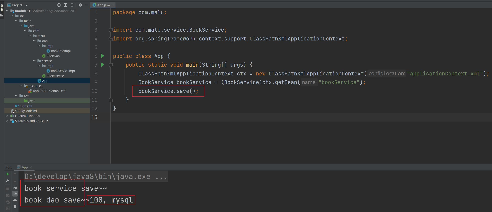


什么是自动装配？

- IOC容器根据bean所依赖的资源在容器中自动查找并注入到bean中的过程称为自动装配


自动装配方式：

- 按类型（常用）
- 按名称
- 按构造方法（不常用）
- 不启用自动装配


自动装配，setter方法，还需要提供：

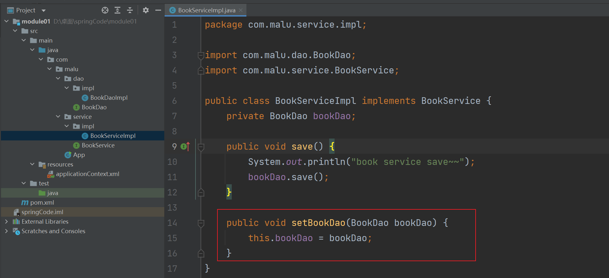


配置中使用bean标签autowire属性设置自动装配的类型：

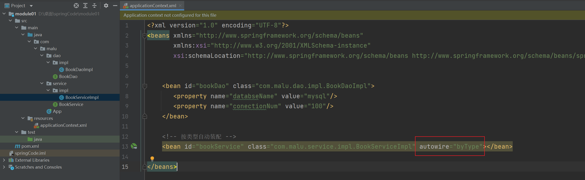

```xml
<bean id="bookDao" class="com.malu.dao.impl.BookDaoImpl">
    <property name="databseName" value="mysql"/>
    <property name="conectionNum" value="100"/>
</bean>

<!-- 按类型自动装配 -->
<bean id="bookService" class="com.malu.service.impl.BookServiceImpl" autowire="byType"></bean>
```


测试类：

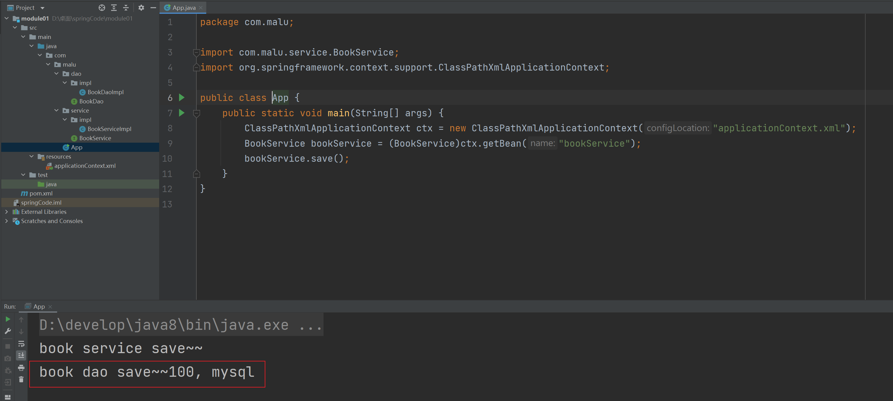


如果把setter方法注释掉，它会就报错。

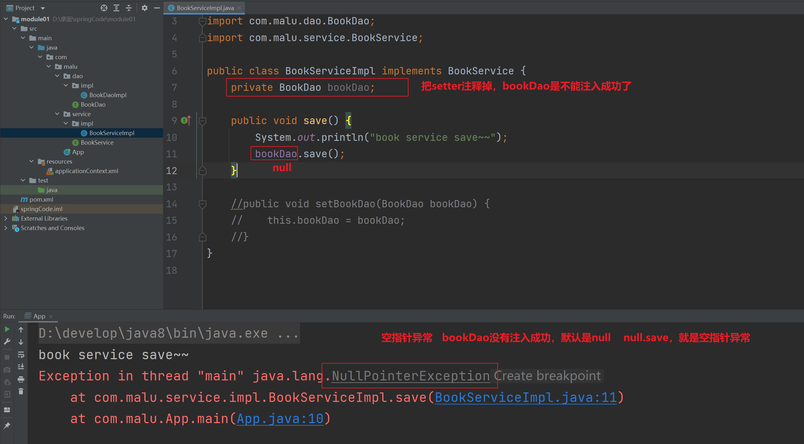


如果容器中同类型的有两个bean，如下：

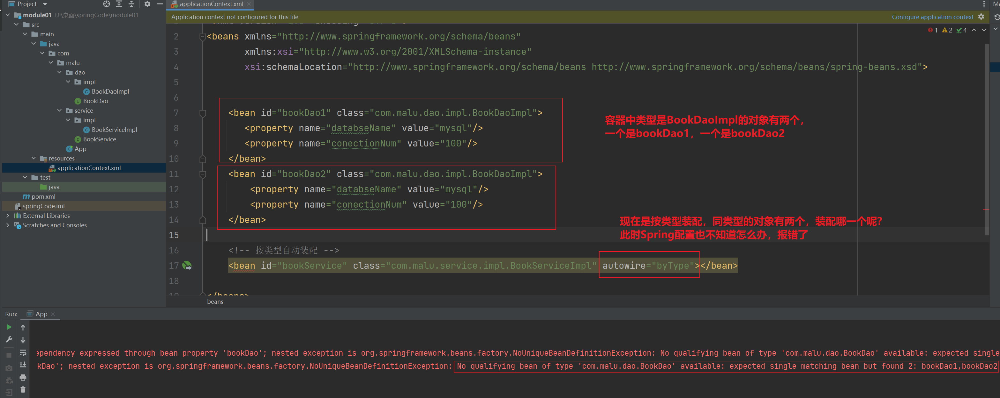


那就可以使用按名称进行装配，如下：

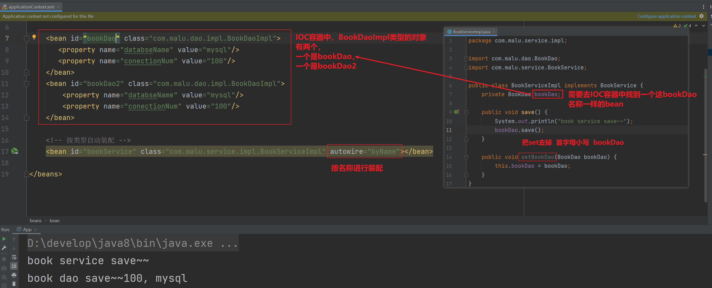


证明确实是找的上面的bookDao，如下：


##### 依赖自动装配特征

1. 自动装配用于引用类型依赖注入，不能对简单类型进行操作
2. 使用按类型装配时（byType）必须保障容器中相同类型的bean唯一，推荐使用
3. 使用按名称装配时（byName）必须保障容器中具有指定名称的bean，因变量名与配置耦合，不推荐使用
4. 自动装配优先级低于setter注入与构造器注入，同时出现时自动装配配置失效


### 3，集合注入


准备工作：

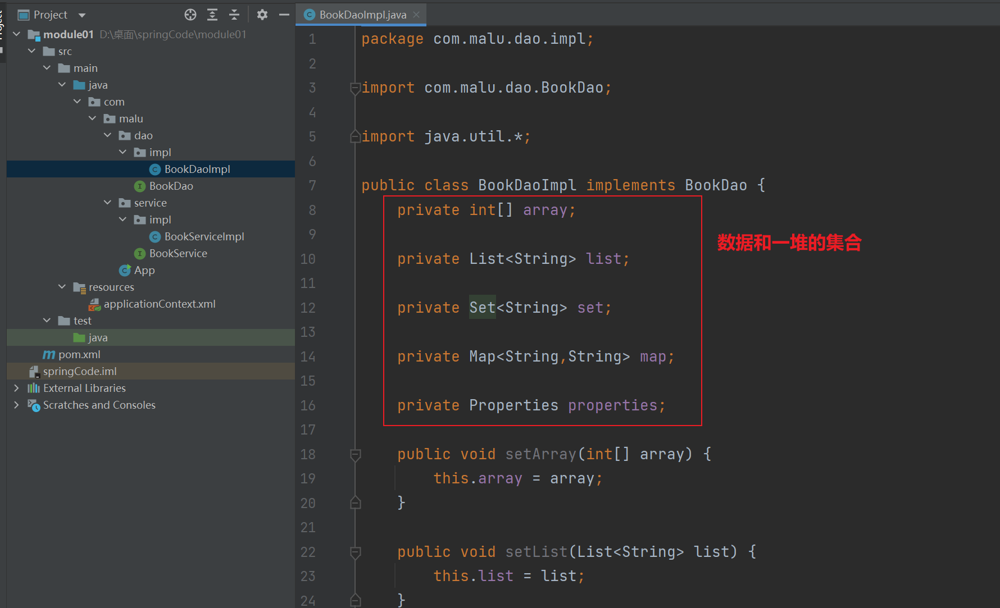

```java
public class BookDaoImpl implements BookDao {
    private int[] array;

    private List<String> list;

    private Set<String> set;

    private Map<String,String> map;

    private Properties properties;

    public void setArray(int[] array) {
        this.array = array;
    }

    public void setList(List<String> list) {
        this.list = list;
    }

    public void setSet(Set<String> set) {
        this.set = set;
    }

    public void setMap(Map<String, String> map) {
        this.map = map;
    }

    public void setProperties(Properties properties) {
        this.properties = properties;
    }

    public void save() {
        System.out.println("book dao save ...");

        System.out.println("遍历数组:" + Arrays.toString(array));

        System.out.println("遍历List:" + list);

        System.out.println("遍历Set:" + set);

        System.out.println("遍历Map:" + map);

        System.out.println("遍历Properties:" + properties);
    }
}
```


配置：

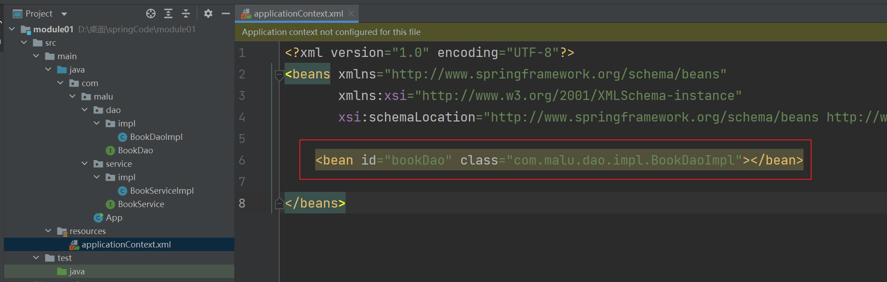


测试类：

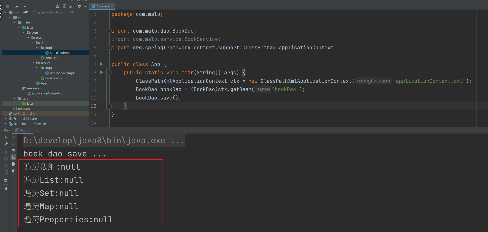


实现注入：

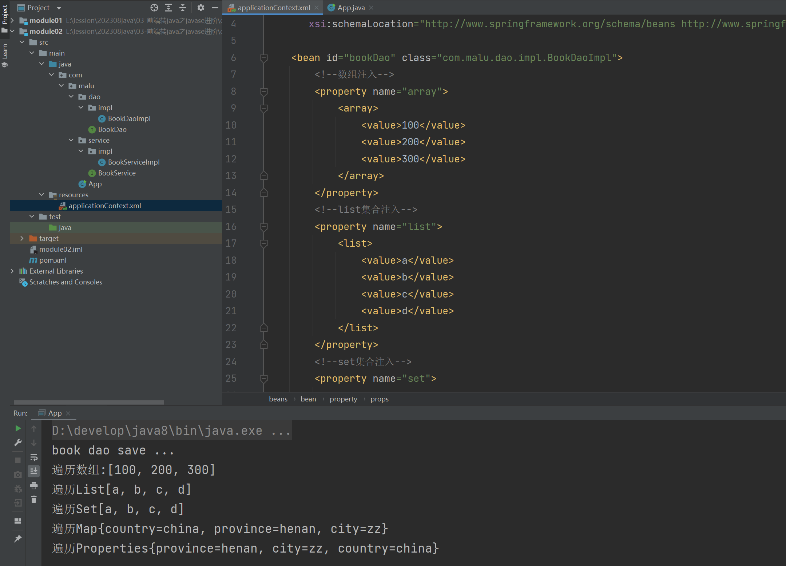


注入数组类型数据：

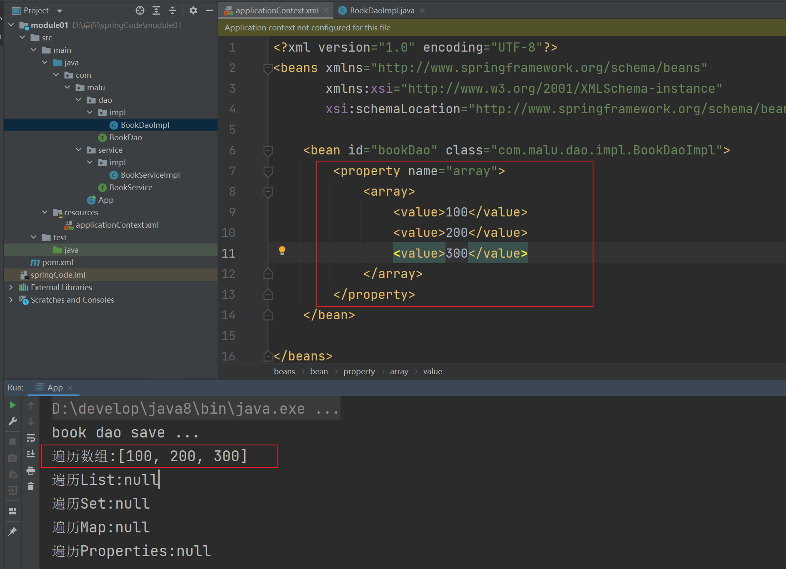

```xml
<property name="array">
    <array>
        <value>100</value>
        <value>200</value>
        <value>300</value>
    </array>
</property>
```

注入List类型数据：

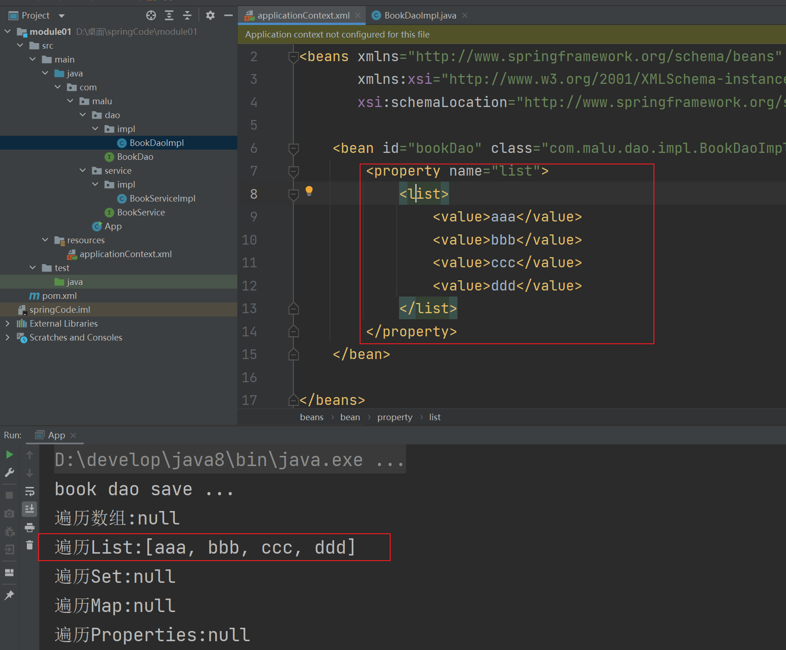

```xml
<property name="list">
    <list>
        <value>aaa</value>
        <value>bbb</value>
        <value>ccc</value>
        <value>ddd</value>
    </list>
</property>
```

注入Set类型数据：

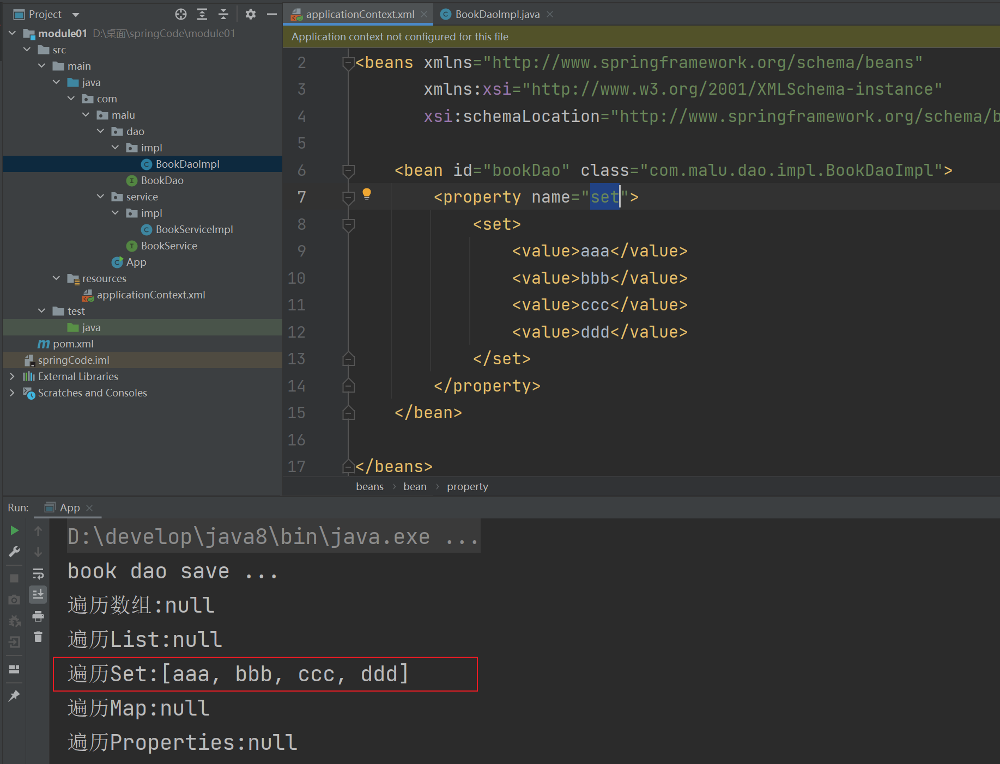

```xml
<property name="set">
    <set>
        <value>aaa</value>
        <value>bbb</value>
        <value>ccc</value>
        <value>ddd</value>
    </set>
</property>
```

注入Map类型数据：

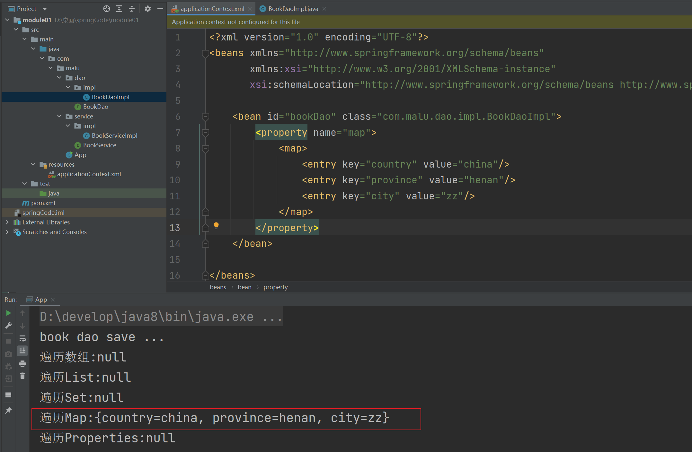

```xml
<property name="map">
    <map>
        <entry key="country" value="china"/>
        <entry key="province" value="henan"/>
        <entry key="city" value="zz"/>
    </map>
</property>
```

注入Properties类型数据：


```xml
<property name="properties">
    <props>
        <prop key="country">china</prop>
        <prop key="province">henan</prop>
        <prop key="city">zz</prop>
    </props>
</property>
```


注意细节：

- property标签表示setter方式注入，构造方式注入constructor-arg标签内部也可以写\<array>、\<list>、\<set>、\<map>、\<props>标签


## 七，管理第三方资源


### 1，管理DataSource连接池对象


数据库准备：

```mysql
create database if not exists spring_db character set utf8;
use spring_db;
create table if not exists tbl_account(
    id int primary key auto_increment,
    name varchar(20),
    money double
);
insert into tbl_account values(null,'wc',1000);
insert into tbl_account values(null,'xq',1000);
```


测试：

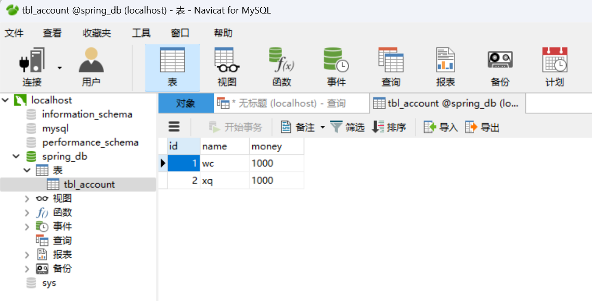


管理Druid连接池步骤：

1. 【第一步】添加Druid连接池依赖

   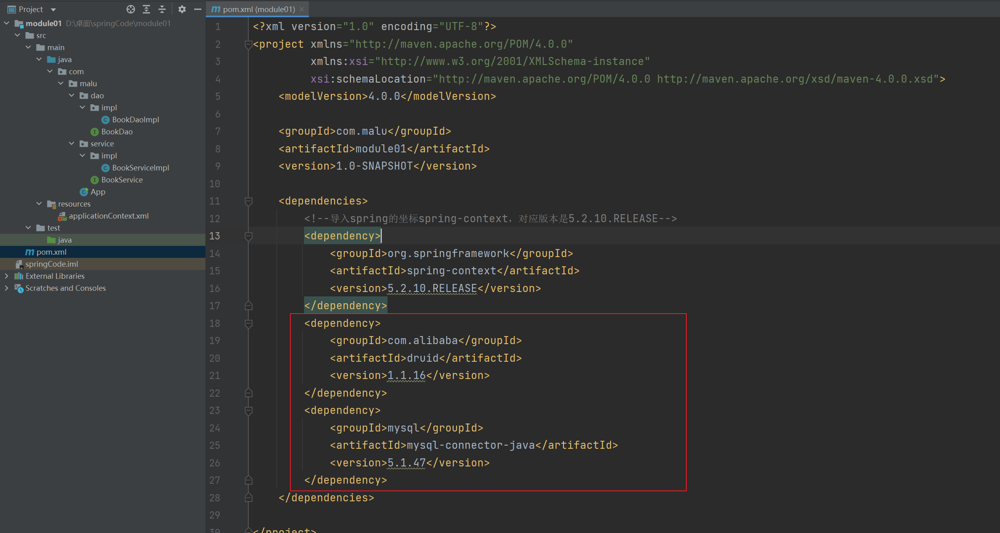

   ```xml
   <!-- 除了添加以下两个依赖之外，别忘了添加spring-context依赖。 -->
   <dependency>
       <groupId>com.alibaba</groupId>
       <artifactId>druid</artifactId>
       <version>1.1.16</version>
   </dependency>
   <dependency>
       <groupId>mysql</groupId>
       <artifactId>mysql-connector-java</artifactId>
       <version>5.1.47</version>
   </dependency>
   ```

2. 【第二步】配置DruidDataSource连接池Bean对象

   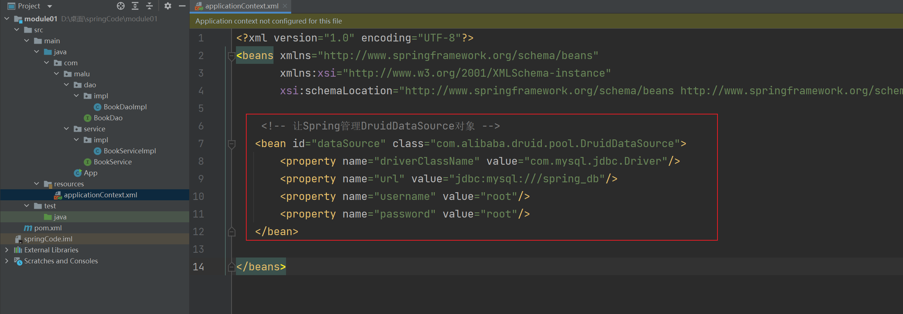

   ```xml
   <bean id="dataSource" class="com.alibaba.druid.pool.DruidDataSource">
       <property name="driverClassName" value="com.mysql.jdbc.Driver"/>
       <property name="url" value="jdbc:mysql://localhost:3306/spring_db"/>
       <property name="username" value="root"/>
       <property name="password" value="root"/>
   </bean>
   ```

3. 【第三步】在测试类中从IOC容器中获取连接池对象并打印

   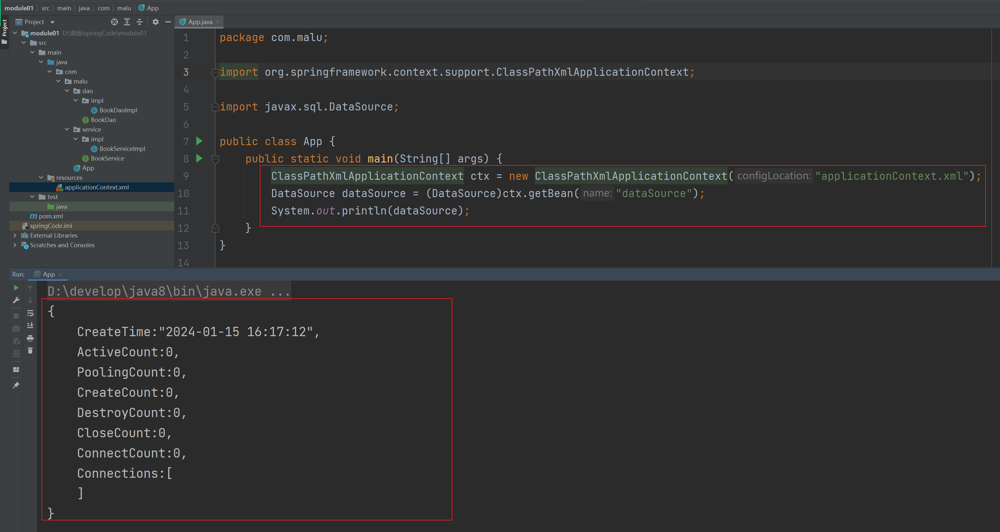

   ```java
   public class App {
       public static void main(String[] args) {
           ApplicationContext ctx = new ClassPathXmlApplicationContext("applicationContext.xml");
           DataSource dataSource = (DataSource) ctx.getBean("dataSource");
           System.out.println(dataSource);
       }
   }
   ```

   

管理c3p0连接池步骤：

1. 【第一步】添加c3p0连接池依赖

   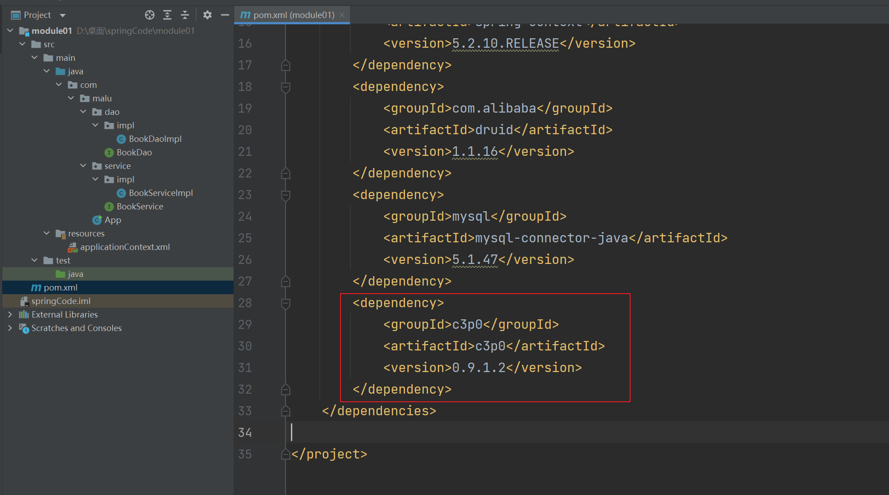

   ```xml
   <dependency>
       <groupId>c3p0</groupId>
       <artifactId>c3p0</artifactId>
       <version>0.9.1.2</version>
   </dependency>
   ```

2. 【第二步】配置c3p0连接池Bean对象

   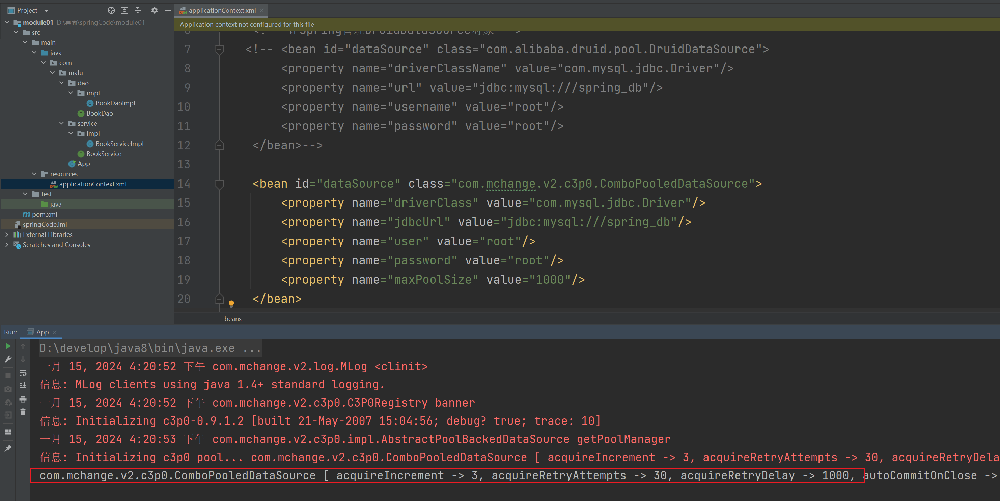

   ```xml
   <!-- 同一个Spring容器中不能有两个id="dataSource"的连接池 -->
   <bean id="dataSource" class="com.mchange.v2.c3p0.ComboPooledDataSource">
       <property name="driverClass" value="com.mysql.jdbc.Driver"/>
       <property name="jdbcUrl" value="jdbc:mysql://localhost:3306/spring_db"/>
       <property name="user" value="root"/>
       <property name="password" value="root"/>
       <property name="maxPoolSize" value="1000"/>
   </bean>
   ```

3. 【第三步】在测试类中从IOC容器中获取连接池对象并打印

   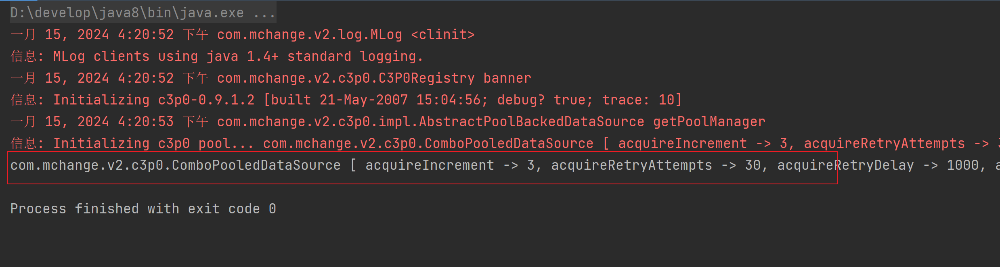

   ```java
   public class App {
       public static void main(String[] args) {
           ApplicationContext ctx = new ClassPathXmlApplicationContext("applicationContext.xml");
           DataSource dataSource = (DataSource) ctx.getBean("dataSource");
           System.out.println(dataSource);
       }
   }
   ```


### 2，加载properties属性文件

目的：将数据库的连接参数抽取到一个单独的文件中，与Spring配置文件解耦。


基本用法步骤：

1. 【第一步】编写jdbc.properties属性文件

   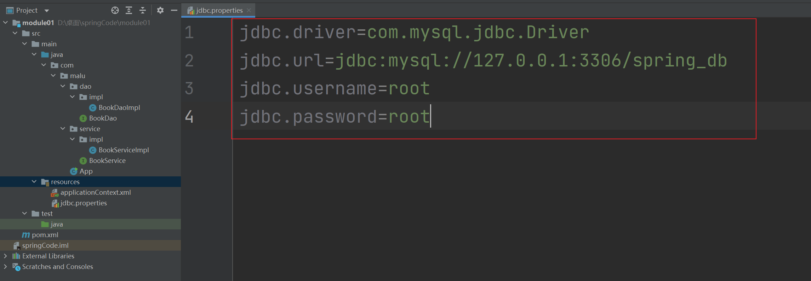

   ```properties
   jdbc.driver=com.mysql.jdbc.Driver
   jdbc.url=jdbc:mysql://127.0.0.1:3306/spring_db
   jdbc.username=root
   jdbc.password=root
   ```

2. 【第二步】在applicationContext.xml中开启开启context命名空间，加载jdbc.properties属性文件

   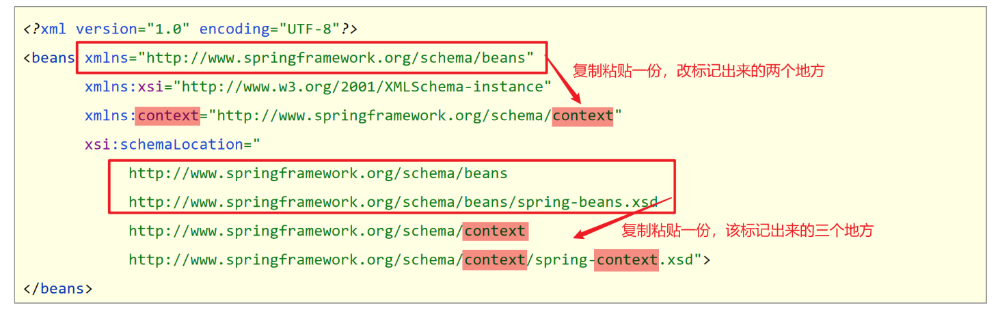

   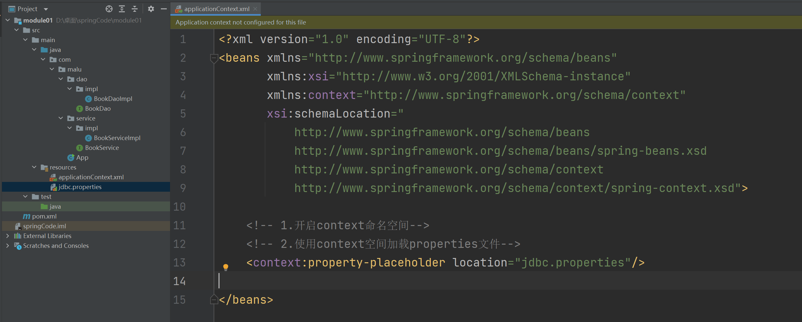

   

   ```xml
   <?xml version="1.0" encoding="UTF-8"?>
   <beans xmlns="http://www.springframework.org/schema/beans"
          xmlns:xsi="http://www.w3.org/2001/XMLSchema-instance"
          xmlns:context="http://www.springframework.org/schema/context"
          xsi:schemaLocation="
              http://www.springframework.org/schema/beans
              http://www.springframework.org/schema/beans/spring-beans.xsd
              http://www.springframework.org/schema/context
              http://www.springframework.org/schema/context/spring-context.xsd">
   
       <!-- 1.开启context命名空间-->
       <!-- 2.使用context空间加载properties文件-->
       <context:property-placeholder location="jdbc.properties"/>
   
   </beans>
   ```

3. 【第三步】在配置连接池Bean的地方使用EL表达式获取jdbc.properties属性文件中的值

   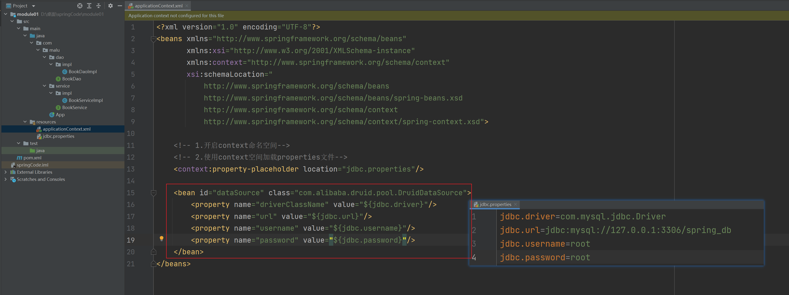

   ```xml
   <?xml version="1.0" encoding="UTF-8"?>
   <beans xmlns="http://www.springframework.org/schema/beans"
          xmlns:xsi="http://www.w3.org/2001/XMLSchema-instance"
          xmlns:context="http://www.springframework.org/schema/context"
          xsi:schemaLocation="
               http://www.springframework.org/schema/beans
               http://www.springframework.org/schema/beans/spring-beans.xsd
               http://www.springframework.org/schema/context
               http://www.springframework.org/schema/context/spring-context.xsd
               ">
   
   
       <!-- 1.开启context命名空间-->
       <!-- 2.使用context空间加载properties文件-->
       <context:property-placeholder location="jdbc.properties"/>
   
       <bean id="dataSource" class="com.alibaba.druid.pool.DruidDataSource">
           <property name="driverClassName" value="${jdbc.driver}"/>
           <property name="url" value="${jdbc.url}"/>
           <property name="username" value="${jdbc.username}"/>
           <property name="password" value="${jdbc.password}"/>
       </bean>
   
   </beans>
   ```

4. 配置完成之后，运行之前的获取Druid连接池代码，可以获取到连接池对象就表示配置成功。

   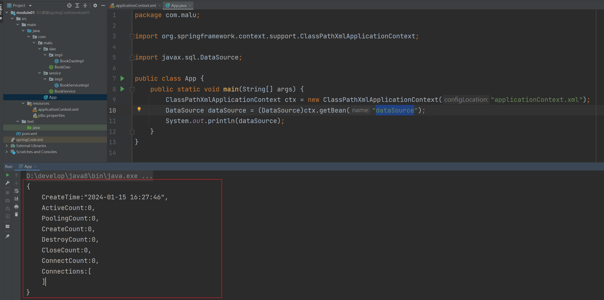


也可以给BookDaoImpl中的name注入数据：

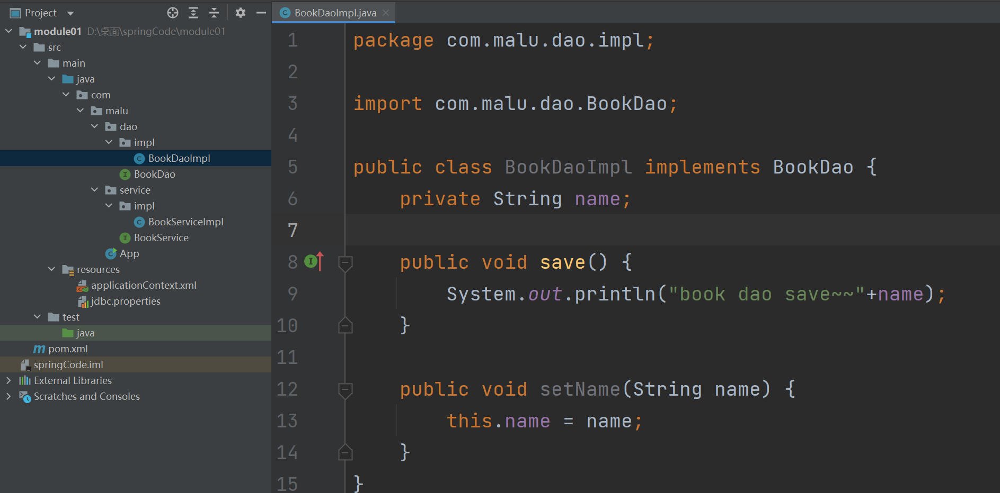


配置：

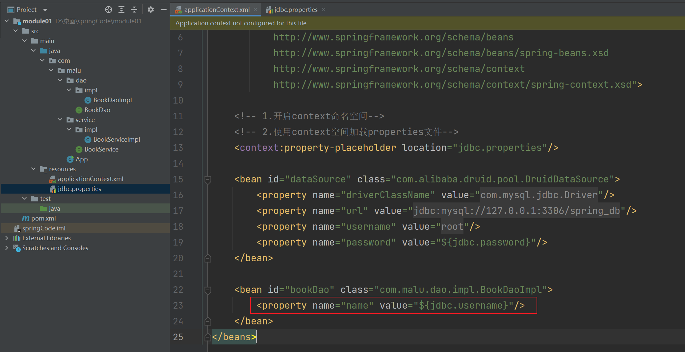


测试类：

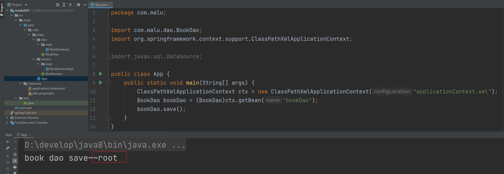


### 3，配置不加载系统属性


**问题**

- 如果属性文件中配置的不是jdbc.username，而是username=root，那么使用${username}获取到的不是root，而是计算机的名称。


修改属性文件：

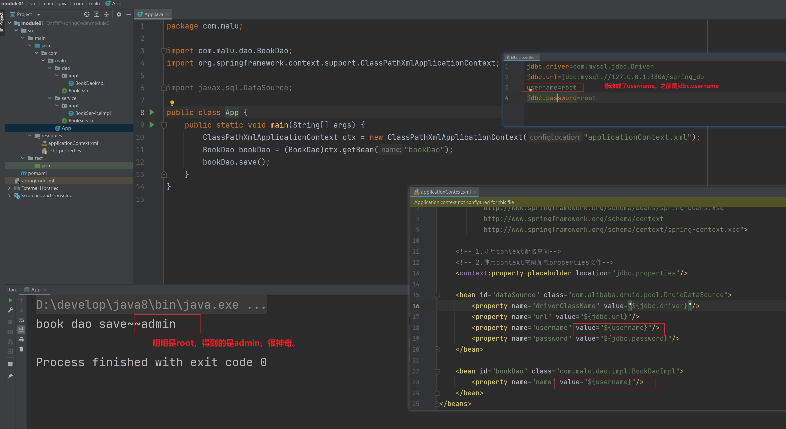


**原因**

- 系统属性的优先级比我们属性文件中的高，替换了我们的username=root。

**解决**

- 解决1：换一个名称，例如不叫username，叫jdbc.username。

- 解决2：使用system-properties-mode="NEVER"属性表示不使用系统属性。

```properties
<context:property-placeholder location="jdbc.properties" system-properties-mode="NEVER"/>
```


测试如下：

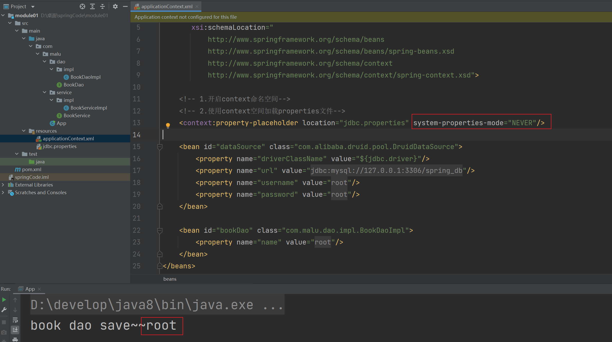


### 4，加载properties文件写法

- 不加载系统属性

```xml
<context:property-placeholder location="jdbc.properties" system-properties-mode="NEVER"/>
```

- 加载多个properties文件

```xml
<context:property-placeholder location="jdbc.properties,msg.properties"/>
```

- 加载所有properties文件

```xml
<context:property-placeholder location="*.properties"/>
```

- 加载properties文件**标准格式**

```xml
<context:property-placeholder location="classpath:*.properties"/>
```

- 加载properties文件，不只可以从当前工程中读，还可以从依赖的jar包中读

```xml
<context:property-placeholder location="classpath*:*.properties"/>
```


## 八，Spring容器


### 1，Spring核心容器

#### 1.1 容器类层次结构

Spring 的 IOC 容器就是 IOC 思想的一个落地的产品实现。IOC 容器中管理的组件也叫做 bean。在创建 bean 之前，首先需要创建 IOC 容器。Spring 提供了 IOC 容器的两种实现方式：

- BeanFactory，是 IOC 容器的基本实现，是 Spring 内部使用的接口。面向 Spring 本身，不提供给开发人员使用。
- ApplicationContext，是BeanFactory 的子接口，提供了更多高级特性。面向 Spring 的使用者，几乎所有场合都使用 ApplicationContext 而不是底层的 BeanFactory。以后在 Spring 环境下看到一个类或接口的名称中包含 ApplicationContext，那基本就可以断定，这个类或接口与 IOC 容器有关。


ApplicationContext的主要实现类

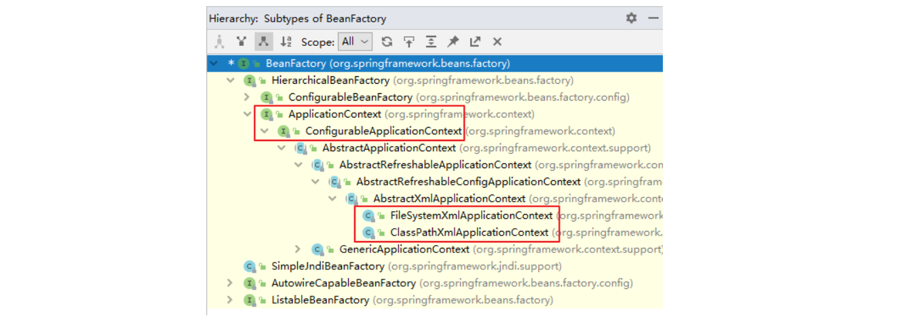

| 类型名                          | 简介                                                         |
| ------------------------------- | ------------------------------------------------------------ |
| ClassPathXmlApplicationContext  | 通过读取类路径下的 XML 格式的配置文件创建 IOC 容器对象       |
| FileSystemXmlApplicationContext | 通过文件系统路径读取 XML 格式的配置文件创建 IOC 容器对象     |
| ConfigurableApplicationContext  | ApplicationContext 的子接口，包含一些扩展方法 refresh() 和 close() ，让 ApplicationContext 具有启动、关闭和刷新上下文的能力。 |
| WebApplicationContext           | 专门为 Web 应用准备，基于 Web 环境创建 IOC 容器对象，并将对象引入存入 ServletContext 域中。 |


#### 1.2 创建容器

- 方式一：类路径加载配置文件（推荐）

```java
ApplicationContext ctx = new ClassPathXmlApplicationContext("applicationContext.xml");
```

- 方式二：文件路径加载配置文件（不推荐）

```java
ApplicationContext ctx = new FileSystemXmlApplicationContext("D:\\applicationContext.xml");
```

- 加载多个配置文件（相当于多个配置文件合并到一起了）

```java
ApplicationContext ctx = new ClassPathXmlApplicationContext("bean1.xml", "bean2.xml");
```


#### 1.3 获取bean对象

- 方式一：使用bean名称获取(根据id获取)

> 弊端：需要自己强制类型转换

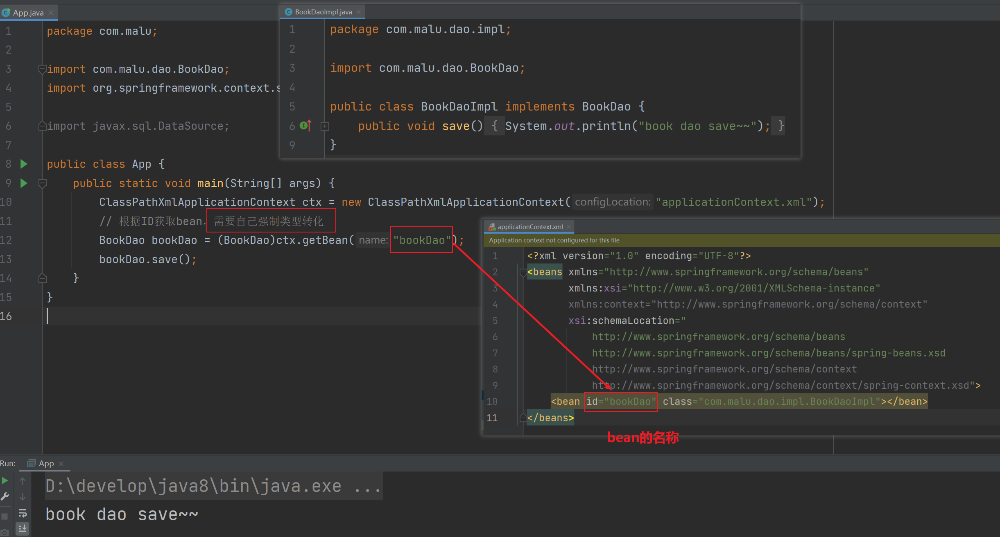

```java
BookDao bookDao = (BookDao) ctx.getBean("bookDao");
```

- 方式二：使用bean名称获取并指定类型(根据id获取)

> 弊端：推荐使用


```java
BookDao bookDao = ctx.getBean("bookDao", BookDao.class);
```

- 方式三：使用bean类型获取(指定类型的 bean 唯一)

> 弊端：如果IOC容器中同类型的Bean对象有多个，此处获取会报错

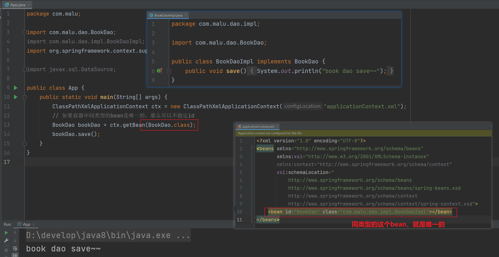

```java
BookDao bookDao = ctx.getBean(BookDao.class);
```


指令类型的 bean 不唯一，相同类型的 bean 在IOC容器中一共配置了两个：

```xml
<bean id="bookDao" class="com.malu.dao.impl.BookDaoImpl"></bean>
<bean id="bookDao2" class="com.malu.dao.impl.BookDaoImpl"></bean>
```

根据类型获取时会抛出异常：

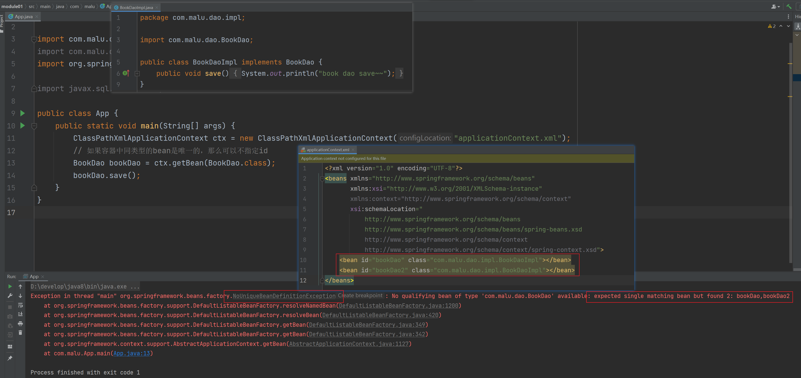


思考：

1. 如果组件类实现了接口，根据接口类型可以获取 bean 吗？

   > 可以，前提是bean唯一

2. 如果一个接口有多个实现类，这些实现类都配置了 bean，根据接口类型可以获取 bean 吗？

   > 不行，因为bean不唯一


根据类型来获取bean时，在满足bean唯一性的前提下，其实只是看：『对象 **instanceof** 指定的类型』的返回结果，只要返回的是true就可以认定为和类型匹配，能够获取到。


#### 1.4 BeanFactory创建容器（了解）

- 类路径加载配置文件

  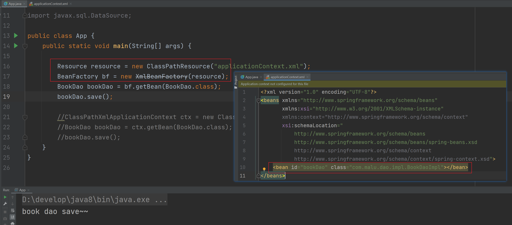

```java
Resource resources = new ClassPathResource("applicationContext.xml");
BeanFactory bf = new XmlBeanFactory(resources);
BookDao bookDao = bf.getBean("bookDao", BookDao.class);
bookDao.save();
```

- BeanFactory创建完毕后，所有的Bean均为延迟加载，也就是说我们调用getBean()方法获取Bean对象时才创建Bean对象并返回给我们

  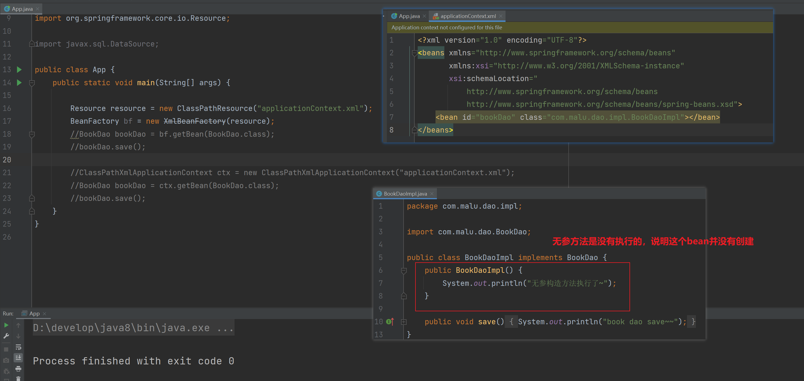

  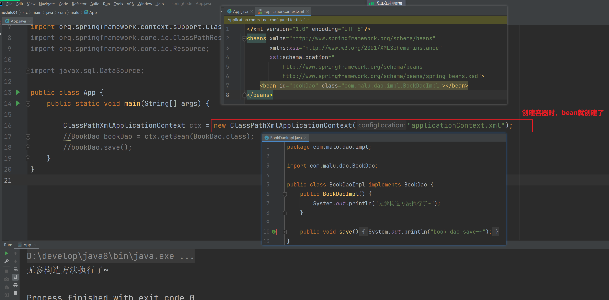


当前使用ApplicationContext，也可以配置懒加载：

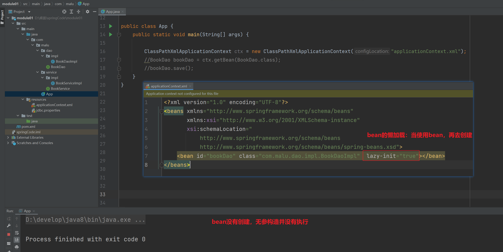

```xml
<bean id="bookDao" class="com.malu.dao.impl.BookDaoImpl" lazy-init="true">
</bean>
```


### 2，Spring核心容器总结


#### 2.1 容器相关

- BeanFactory是IoC容器的顶层接口，初始化BeanFactory对象时，加载的bean延迟加载
- ApplicationContext接口是Spring容器的核心接口，初始化时bean立即加载
- ApplicationContext接口提供基础的bean操作相关方法，通过其他接口扩展其功能
- ApplicationContext接口常用初始化类
  - **ClassPathXmlApplicationContext(常用)**
  - FileSystemXmlApplicationContext


#### 2.2 bean相关

- id="bookDao"               bean的ID
- name="dao, daoImpl"            bean的别名
- class="com.malu.dao.impl.BookDaoImpl"           bean类型，静态工厂类，FactoryBean类
- scope="singleton"         控制bean的实例数量
- init-method="init"             生命周期初始化方法
- destroy-method="destory"           生命周期销毁方法
- autowire="byType"           自动装配类型
- factory-method="getInstance"              bean工厂方法，应用于静态工厂或实例工厂
- factory-bean="com.malu.factory.BookDaoFactory"         实例工厂bean
- lazy-init="true"         控制bean延迟加载    


#### 2.3 依赖注入相关

```xml
<!-- 构造器注入引用类型 --> 
<constructor-arg name="bookDao" ref="bookDao"/>
<constructor-arg name="userDao" ref="userDao"/>

<!-- 构造器注入简单类型 --> 
<constructor-arg name="msg" value="success"/>

<!-- 类型匹配与索引匹配 --> 
<constructor-arg type="java.lang.String" index="3" value="success"/>

<!-- setter注入引用类型 --> 
<property name="bookDao" ref="bookDao"/>
<property name="userDao" ref="userDao"/>

<!-- setter注入简单类型 --> 
<property name="msg" value="success"/>

<!-- setter注入集合类型 --> 
<property name="msg" value="success">
    <list>
        <!-- 集合中注入简单类型 -->
    	<value>malu</value>
        <!-- 集合中注入引用类型 -->
        <ref bean="dataSource" />
    </list>
</property>
```


## 九，注解开发

xml配置Bean对象有些繁琐，真实开发中，会使用注解简化Bean对象的定义。


### 1，注解开发定义Bean对象


基本使用步骤：

1. 【第一步】在applicationContext.xml中开启Spring注解包扫描

   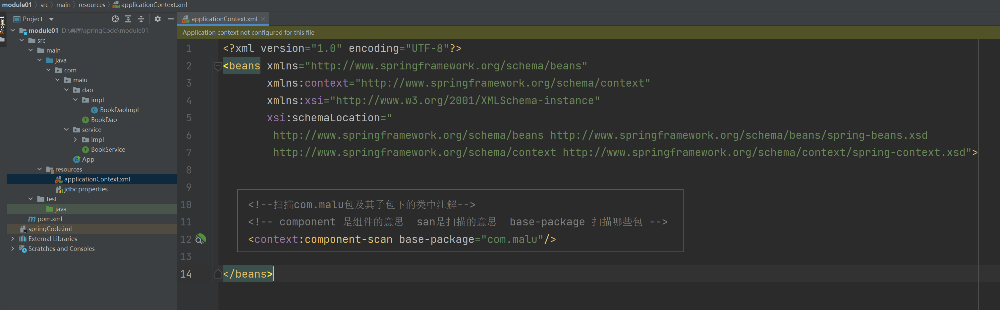

   ```xml
   <?xml version="1.0" encoding="UTF-8"?>
   <beans xmlns="http://www.springframework.org/schema/beans"
          xmlns:context="http://www.springframework.org/schema/context"
          xmlns:xsi="http://www.w3.org/2001/XMLSchema-instance"
          xsi:schemaLocation="
           http://www.springframework.org/schema/beans http://www.springframework.org/schema/beans/spring-beans.xsd
           http://www.springframework.org/schema/context http://www.springframework.org/schema/context/spring-context.xsd">
   	 <!--扫描com.malu包及其子包下的类中注解-->
       <context:component-scan base-package="com.malu"/>
   </beans>
   ```

   

2. 【第二步】在类上使用@Component注解定义Bean。

   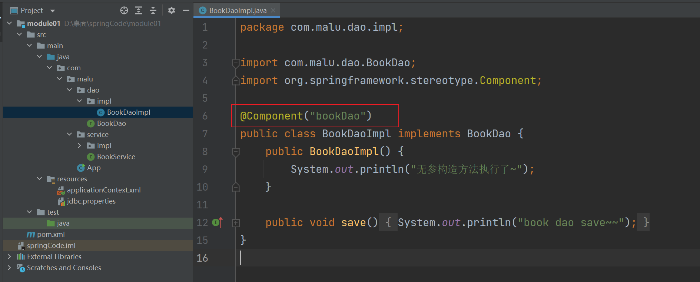

   @Component注解没有使用参数指定Bean的名称，那么类名首字母小写就是Bean在IOC容器中的默认名称。例如：BookServiceImpl对象在IOC容器中的名称是bookServiceImpl。

   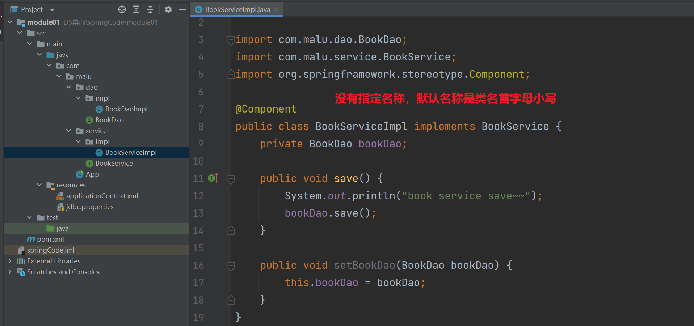

   

   

   ```java
   //@Component定义bean
   @Component("bookDao")
   public class BookDaoImpl implements BookDao {
       public void save() {
           System.out.println("book dao save ...");
       }
   }
   @Component
   public class BookServiceImpl implements BookService {
       private BookDao bookDao;
   
       public void setBookDao(BookDao bookDao) {
           this.bookDao = bookDao;
       }
   
       public void save() {
           System.out.println("book service save ...");
           bookDao.save();
       }
   }
   ```

3. 【第三步】在测试类中获取Bean对象

   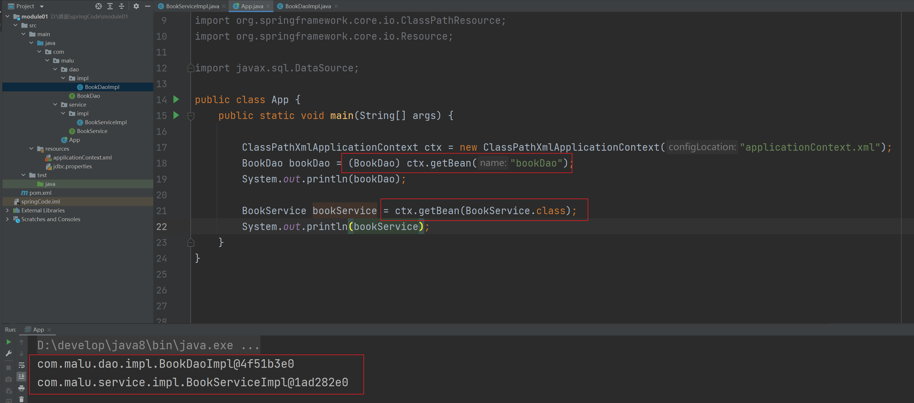

   ```java
   // 在测试类中不要调用bookService的save方法，因为还没有给BookServiceImpl中的bookDao赋值，调用bookService的save方法会出现空指针异常。
   
   public class AppForAnnotation {
       public static void main(String[] args) {
           ApplicationContext ctx = new ClassPathXmlApplicationContext("applicationContext.xml");
           BookDao bookDao = (BookDao) ctx.getBean("bookDao");
           System.out.println(bookDao);
           //按类型获取bean
           BookService bookService = ctx.getBean(BookService.class);
           System.out.println(bookService);
       }
   }
   ```


运行结果：

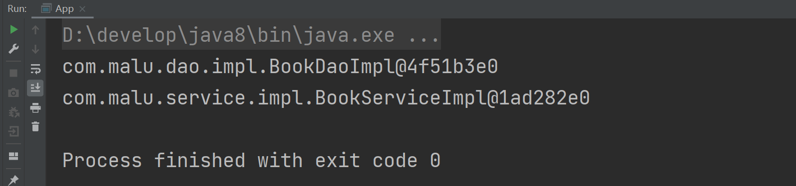


@Component三个衍生注解

- @Controller：用于表现层bean定义
- @Service：用于业务层bean定义
- @Repository：用于数据层bean定义，Repository是仓库的意思


代码演示：

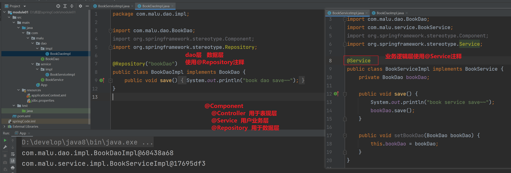

```java
@Repository("bookDao")
public class BookDaoImpl implements BookDao {
}

@Service
public class BookServiceImpl implements BookService {
}
```


### 2，纯注解开发模式

Spring3.0开启了纯注解开发模式，使用Java类替代配置文件，开启了Spring快速开发赛道。Java类代替Spring核心配置文件。如下：

```java
@Configuration
@ComponentScan("com.malu")
public class SpringConfig{
    
}
```

- @Configuration注解用于设定当前类为配置类

- @ComponentScan注解用于设定扫描路径，此注解只能添加一次，多个数据请用数组格式

  ```java
  @ComponentScan({"com.malu.service","com.malu.dao"})
  ```

- 读取Spring核心配置文件初始化容器对象切换为读取Java配置类初始化容器对象

  ```java
  //加载配置文件初始化容器
  ApplicationContext ctx = new ClassPathXmlApplicationContext("applicationContext.xml");
  //加载配置类初始化容器
  ApplicationContext ctx = new AnnotationConfigApplicationContext(SpringConfig.class);
  ```


代码演示步骤：

1. 【第一步】定义配置类代替配置文件，下面的图片有问题，config包应该放在malu包下面。

   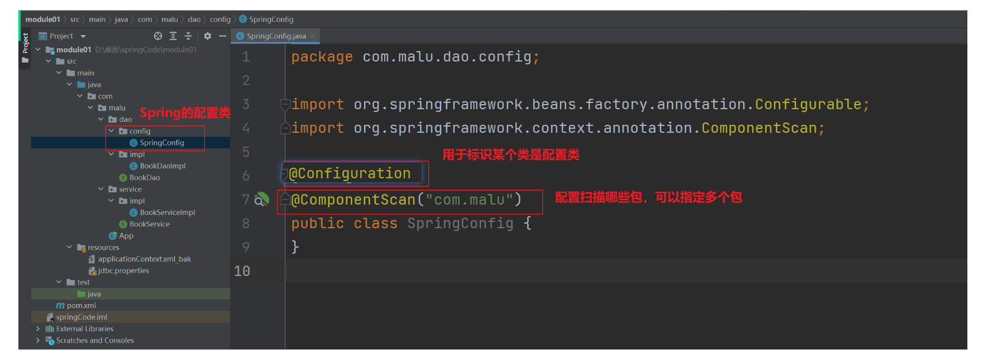

   ```java
   //声明当前类为Spring配置类
   @Configuration
   //Spring注解扫描，相当于<context:component-scan base-package="com.malu"/>
   @ComponentScan("com.malu")
   //设置bean扫描路径，多个路径书写为字符串数组格式
   //@ComponentScan({"com.malu.service","com.malu.dao"})
   public class SpringConfig {
   }
   ```

2. 【第二步】在测试类中加载配置类，获取Bean对象并使用

   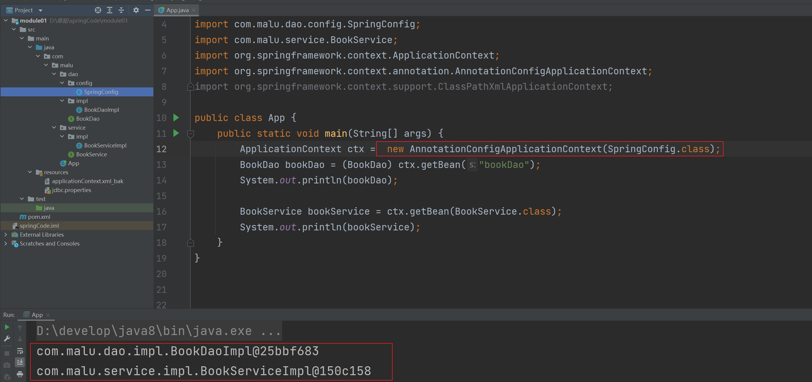

   ```java
   public class App {
       public static void main(String[] args) {
           ApplicationContext ctx =  new AnnotationConfigApplicationContext(SpringConfig.class);
           BookDao bookDao = (BookDao) ctx.getBean("bookDao");
           System.out.println(bookDao);
   
           BookService bookService = ctx.getBean(BookService.class);
           System.out.println(bookService);
       }
   }
   ```


### 3，注解开发Bean的作用范围和生命周期

默认情况下，获取的bean是单例的：

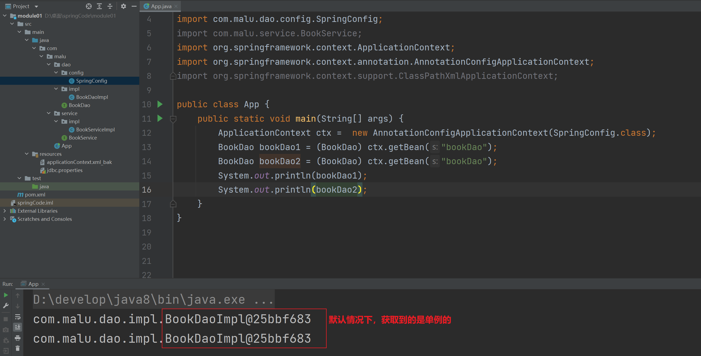


使用@Scope定义bean作用范围：

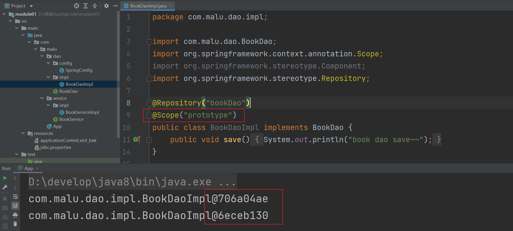

```java
@Repository
@Scope("singleton")
public class BookDaoImpl implements BookDao {
}
```


使用@PostConstruct、@PreDestroy定义bean生命周期：

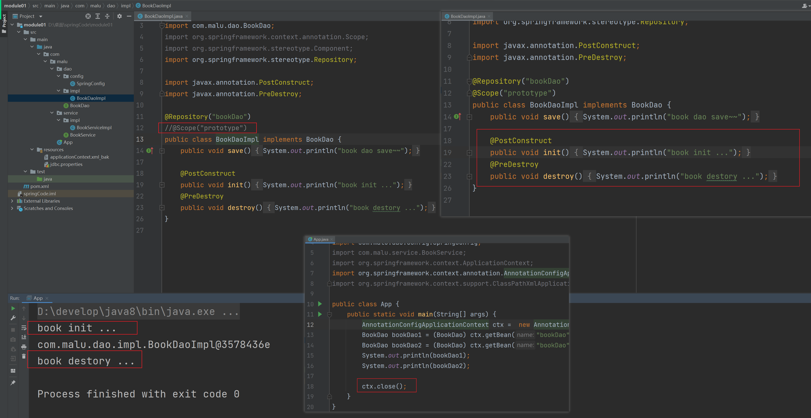

```java
@Repository
@Scope("singleton")
public class BookDaoImpl implements BookDao {
    public BookDaoImpl() {
        System.out.println("book dao constructor ...");
    }
    @PostConstruct
    public void init(){
        System.out.println("book init ...");
    }
    @PreDestroy
    public void destroy(){
        System.out.println("book destory ...");
    }
}
```


注意细节：

- @PostConstruct和@PreDestroy注解是jdk中提供的注解，从jdk9开始，jdk中的javax.annotation包被移除了，也就是说这两个注解就用不了了，可以额外导入一下依赖解决这个问题。

  ```xml
  <dependency>
    <groupId>javax.annotation</groupId>
    <artifactId>javax.annotation-api</artifactId>
    <version>1.3.2</version>
  </dependency>
  ```

  


### 4，注解开发依赖注入

没有装配结果如下：

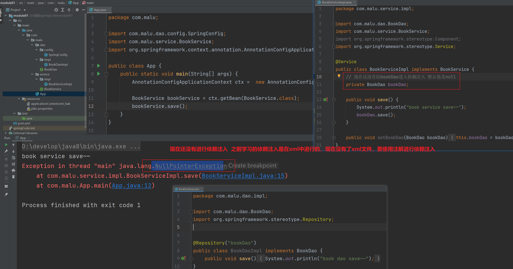


使用@Autowired注解开启自动装配模式（按类型），不管是使用配置文件还是配置类，都必须进行对应的Spring注解包扫描才可以使用。@Autowired默认按照类型自动装配。

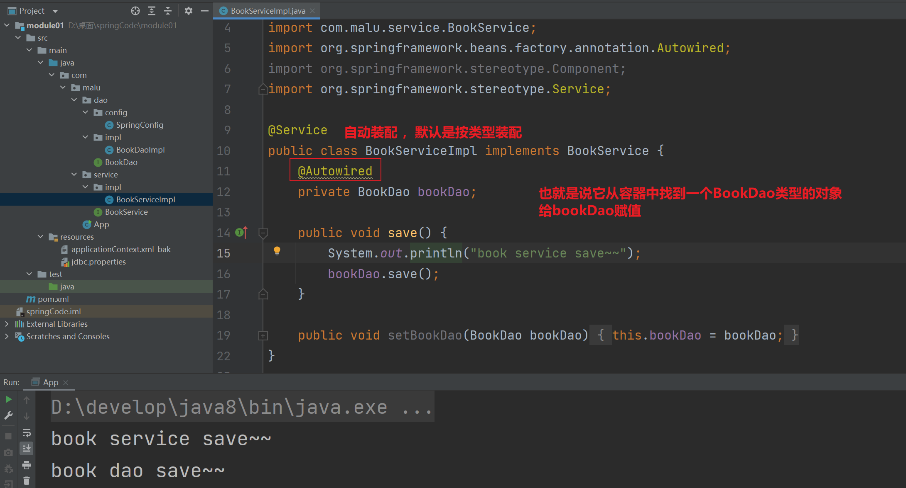


```java
@Service
public class BookServiceImpl implements BookService {
    //@Autowired：注入引用类型，自动装配模式，默认按类型装配
    @Autowired
    private BookDao bookDao;

    public void save() {
        System.out.println("book service save ...");
        bookDao.save();
    }
}
```


我们把set方法，去掉，也可以注入成功，原因是底层使用了暴力反射，也就是说，之前我们注入需要提供一个入门，要么是setter，要么是构造器，现在入口也没有了，现在变的更简单粗暴了。


如果IOC容器中同类的Bean有多个，如果id一样，装配不成功的，如下：


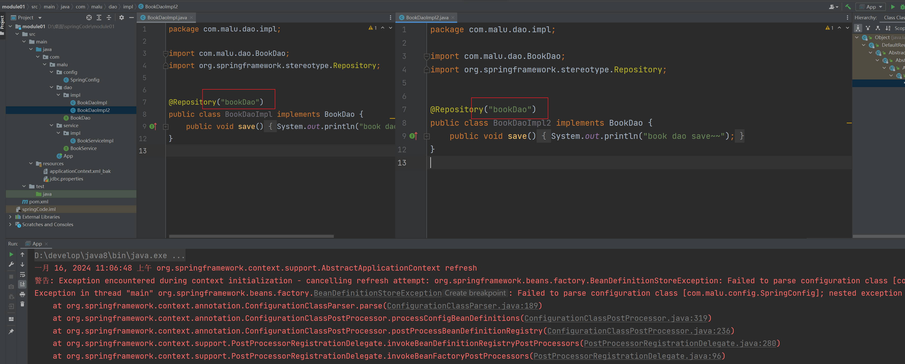


把id修改成不一样，那么默认按照变量名和Bean的名称匹配，如下：

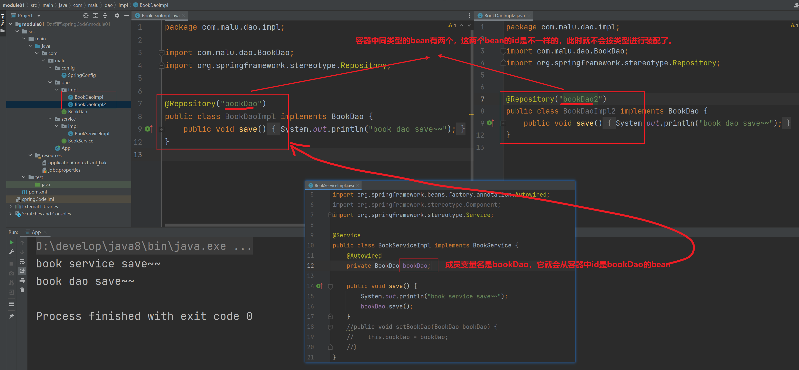


如果成员变量名和bean的id不一样，如下：

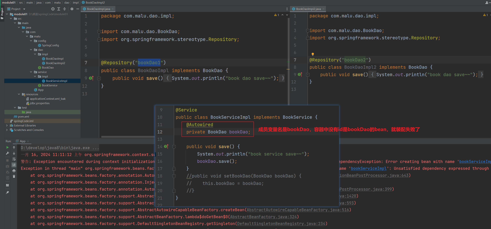


此时使用@Qualifier注解指定要装配的bean名称。自动装配基于反射设计创建对象并暴力反射对应属性为私有属性初始化数据，因此无需提供setter方法。

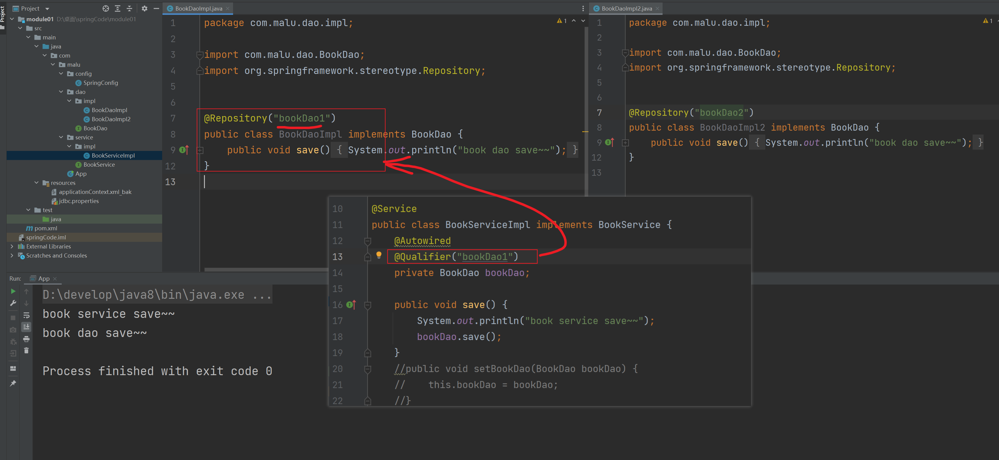


使用@Qualifier注解指定要装配的bean名称。

```java
@Service
public class BookServiceImpl implements BookService {
    //@Autowired：注入引用类型，自动装配模式，默认按类型装配
    @Autowired
    //使用@Qualifier注解指定要装配的bean名称
    //@Qualifier：自动装配bean时按bean名称装配。目的：解决IOC容器中同类型Bean有多个装配哪一个的问题
    //@Qualifier注解无法单独使用，必须配合@Autowired注解使用
    @Qualifier("bookDao1")
    private BookDao bookDao;

    public void save() {
        System.out.println("book service save ...");
        bookDao.save();
    }
}
```


当然如果名称不一样的话，也可以按名称注入：

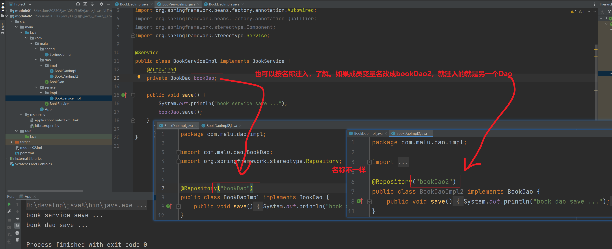


小结：

- 自动装配基于反射设计创建对象并暴力反射对应属性为私有属性初始化数据，因此不需要提供setter方法
- 自动装配建议使用无参构造方法创建对象，如果不提供对应构造方法，请提供唯一的构造方法。


使用@Value实现简单类型注入：

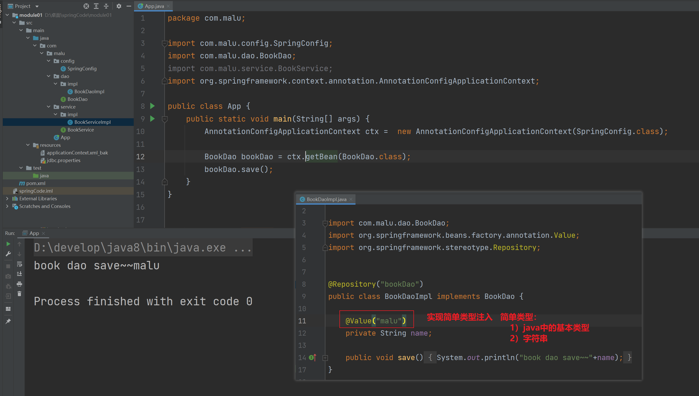


```java
@Repository("bookDao")
public class BookDaoImpl implements BookDao {
    //@Value：注入简单类型（无需提供set方法）
    @Value("malu")
    private String name;

    public void save() {
        System.out.println("book dao save ..." + name);
    }
}
```


定义属性文件，加载属性文件：

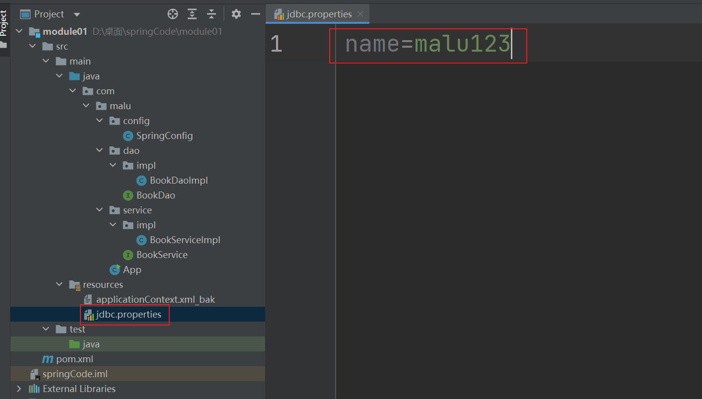

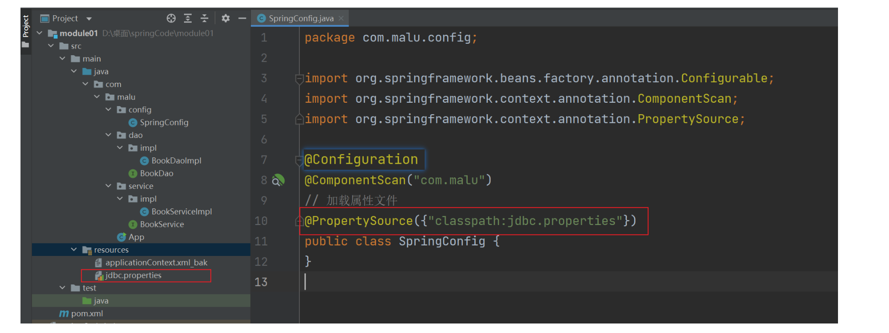


```java
@Configuration
@ComponentScan("com.malu")
//@PropertySource加载properties配置文件
@PropertySource({"classpath:jdbc.properties"}) //{}可以省略不写
public class SpringConfig {
}
```


@Value注解中使用${name}从属性文件中读取name值，那么就需要在配置类或者配置文件中加载属性文件。

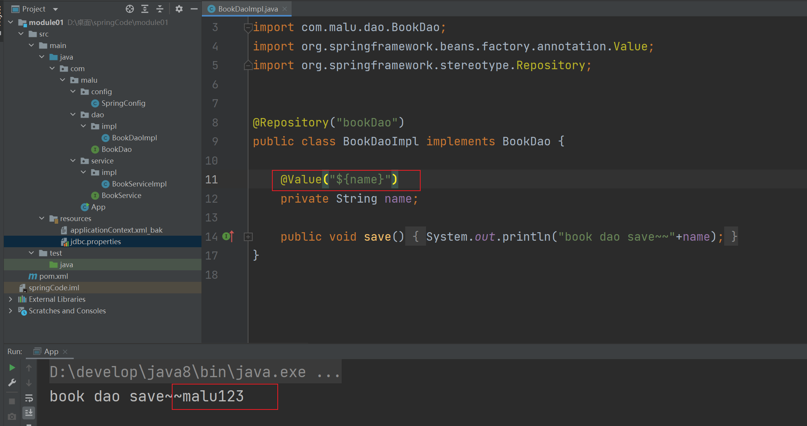


注意细节：

- @PropertySource()中加载多文件请使用数组格式配置，不允许使用通配符*


### 5，注解开发管理第三方Bean


在SpringConfig中配置类中管理第三方Bean，如下：

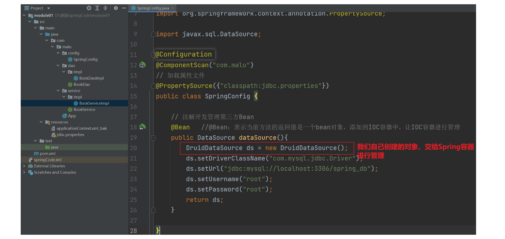

```java
@Configuration
public class SpringConfig {
    //@Bean：表示当前方法的返回值是一个bean对象，添加到IOC容器中
    @Bean
    public DataSource dataSource(){
        DruidDataSource ds = new DruidDataSource();
        ds.setDriverClassName("com.mysql.jdbc.Driver");
        ds.setUrl("jdbc:mysql://localhost:3306/spring_db");
        ds.setUsername("root");
        ds.setPassword("root");
        return ds;
    }
}
```


测试类：

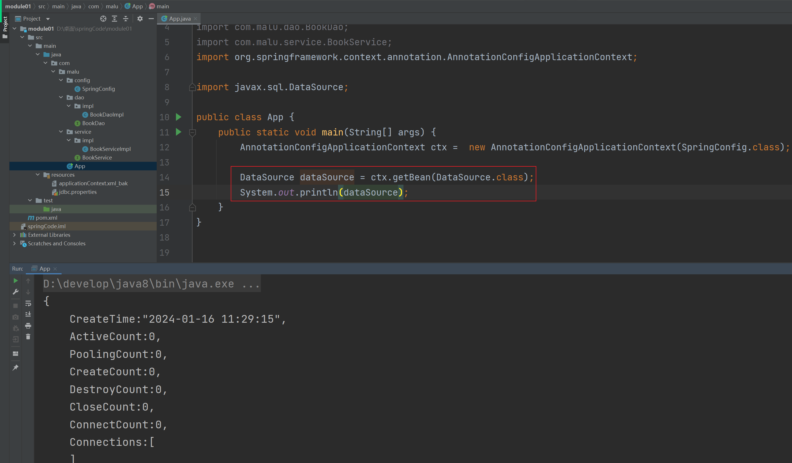


当然，也可以把某个配置单独抽离出去，步骤如下：

1. 【第一步】单独定义配置类

   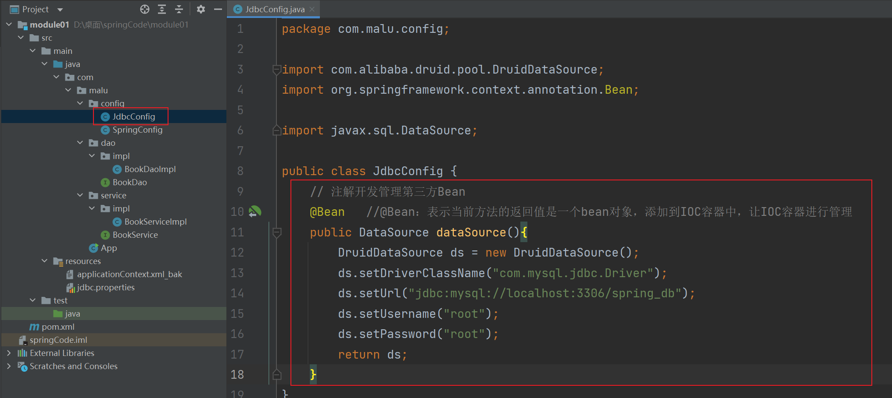

   ```java
   public class JdbcConfig {
       //@Bean：表示当前方法的返回值是一个bean对象，添加到IOC容器中
       @Bean
       public DataSource dataSource(){
           DruidDataSource ds = new DruidDataSource();
           ds.setDriverClassName("com.mysql.jdbc.Driver");
           ds.setUrl("jdbc:mysql://localhost:3306/spring_db");
           ds.setUsername("root");
           ds.setPassword("root");
           return ds;
       }
   }
   ```

2. 【第二步】将独立的配置类加入核心配置

   - 方式1：@Import注解导入式(推荐)

     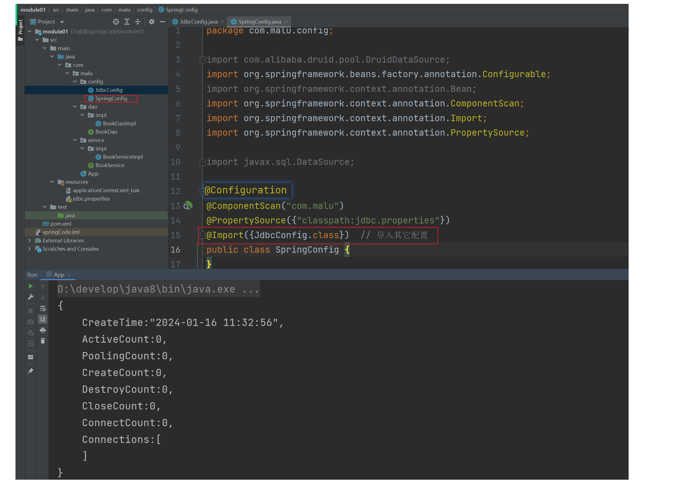

     ```java
     @Configuration
     @ComponentScan("com.malu")
     //@Import:导入配置信息
     @Import({JdbcConfig.class})
     public class SpringConfig {
     }
     ```

   - 方式2：@ComponentScan扫描式，需要在JdbcConfig类上添加@Configuration(不推荐)

     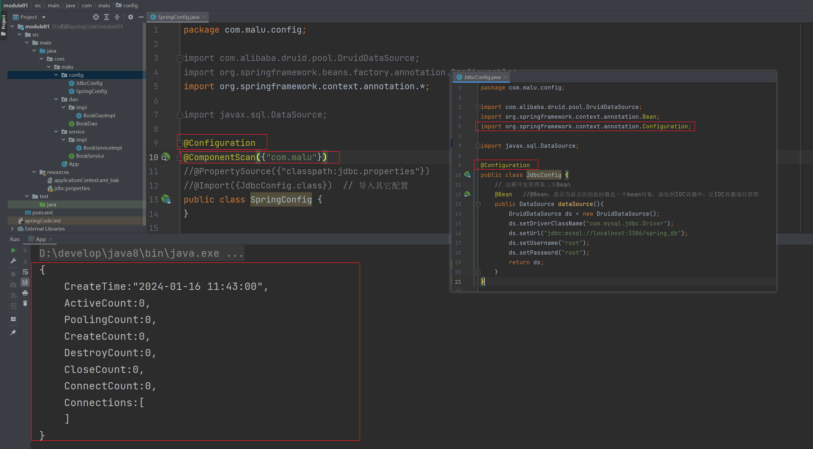

     ```java
     @Configuration
     @ComponentScan({"com.malu.config","com.malu.service","com.malu.dao"})  //只要com.malu.config包扫到了就行，三个包可以合并写成com.malu
     public class SpringConfig {
     }
     ```


### 6，注解开发为第三方Bean注入资源


简单类型依赖注入：

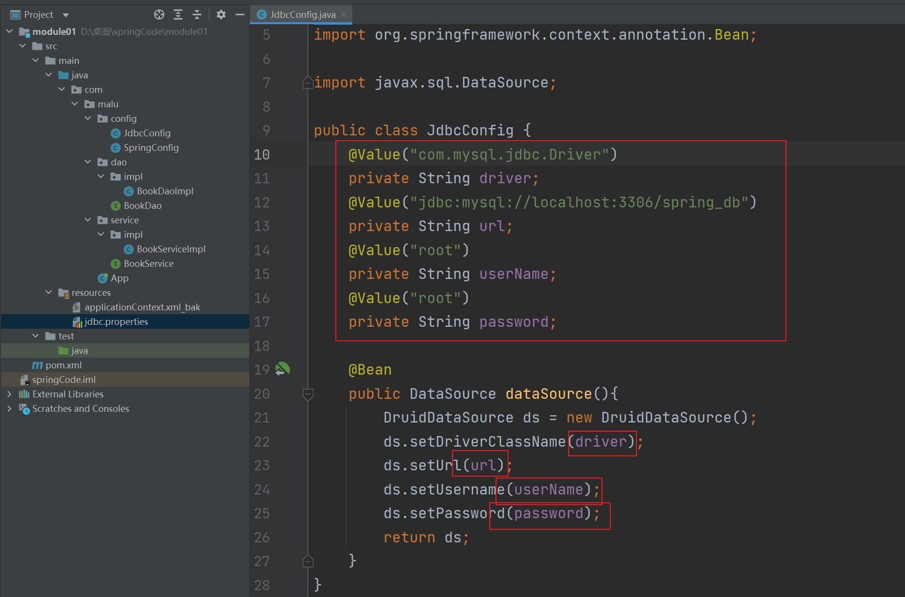

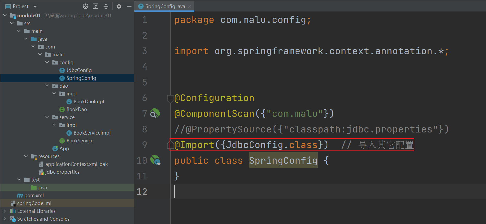

```java
// 如果@Value()中使用了EL表达式读取properties属性文件中的内容，那么就需要加载properties属性文件。
public class JdbcConfig {
    //1.定义一个方法获得要管理的对象
    @Value("com.mysql.jdbc.Driver")
    private String driver;
    @Value("jdbc:mysql://localhost:3306/spring_db")
    private String url;
    @Value("root")
    private String userName;
    @Value("root")
    private String password;
    //2.@Bean：表示当前方法的返回值是一个bean对象，添加到IOC容器中
    @Bean
    public DataSource dataSource(){
        DruidDataSource ds = new DruidDataSource();
        ds.setDriverClassName(driver);
        ds.setUrl(url);
        ds.setUsername(userName);
        ds.setPassword(password);
        return ds;
    }
}
```


测试之，如下：

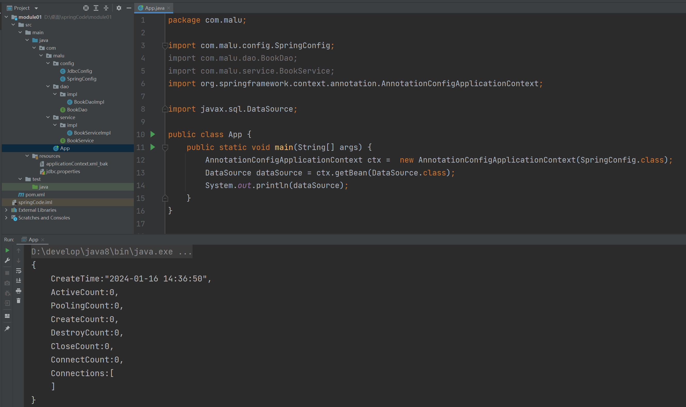


上面注入简单类型数据，接下来学习如何注入引用类型依赖:

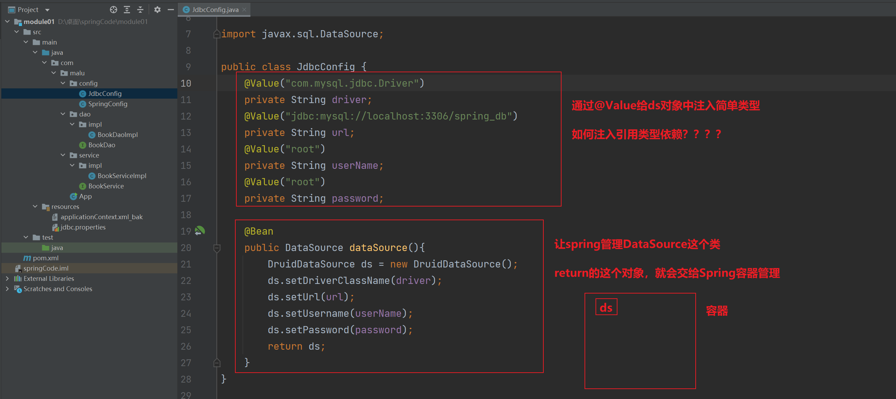

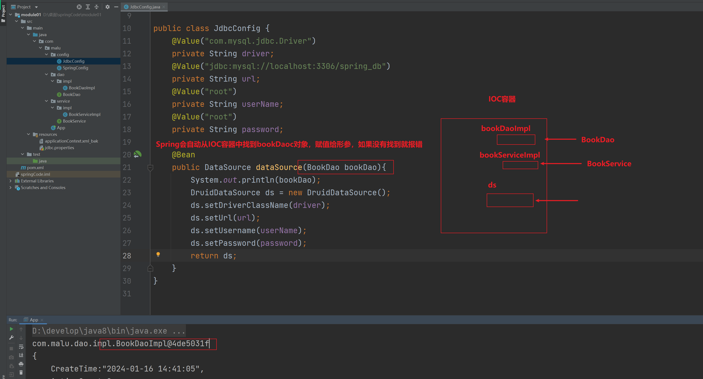

```java
//Spring会自动从IOC容器中找到BookDao对象赋值给参数bookDao变量，如果没有就会报错。
@Bean 
public DataSource dataSource(BookDao bookDao){
    System.out.println(bookDao);
    DruidDataSource ds = new DruidDataSource();
    ds.setDriverClassName(driver);
    ds.setUrl(url);
    ds.setUsername(userName);
    ds.setPassword(password);
    return ds;
}
```


注意细节：

- 引用类型注入只需要为bean定义方法设置形参即可，容器会根据类型自动装配对象


注解开发小结：

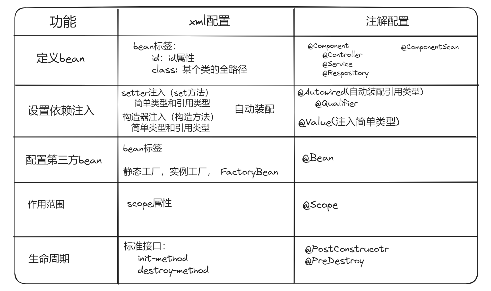


## 十，Spring 整合其它技术


### 1，Spring整合Mybatis

数据库：

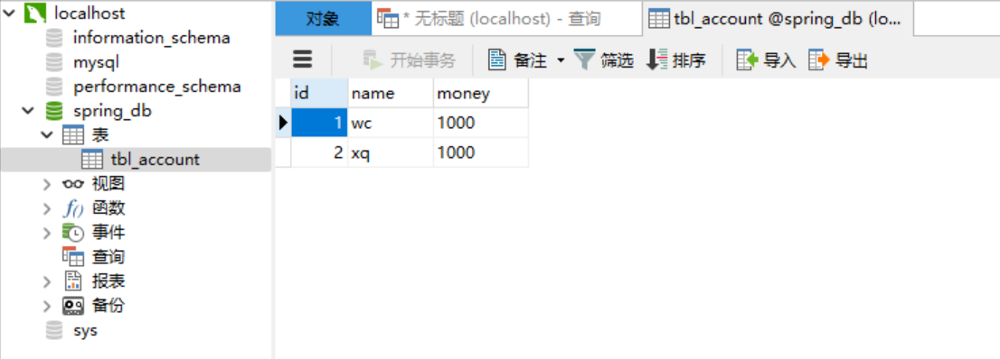


项目目录，config包不需要管，mybatis案例中还用不到：

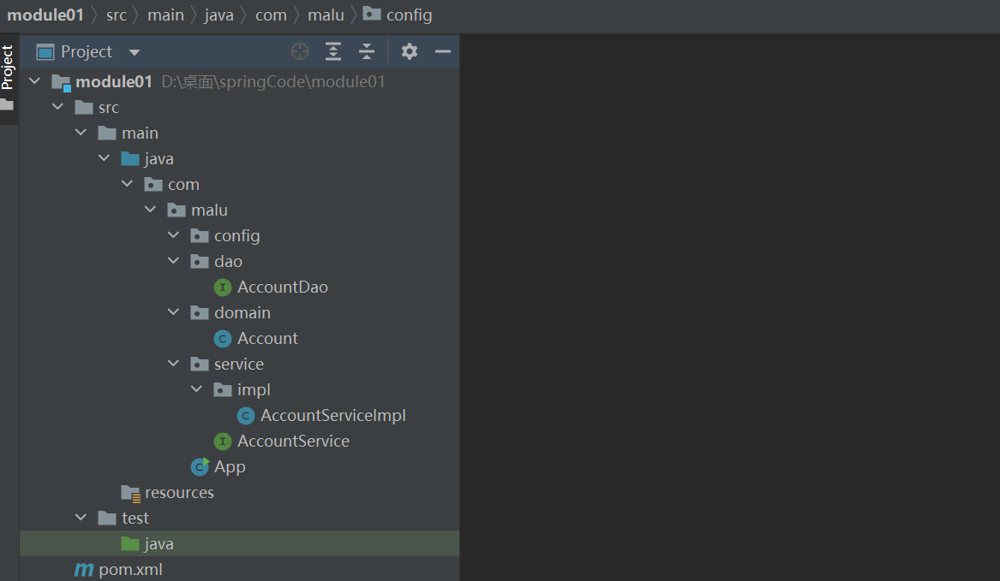


pom文件：

```xml
<?xml version="1.0" encoding="UTF-8"?>
<project xmlns="http://maven.apache.org/POM/4.0.0"
         xmlns:xsi="http://www.w3.org/2001/XMLSchema-instance"
         xsi:schemaLocation="http://maven.apache.org/POM/4.0.0 http://maven.apache.org/xsd/maven-4.0.0.xsd">
    <modelVersion>4.0.0</modelVersion>

    <groupId>com.malu</groupId>
    <artifactId>module01</artifactId>
    <version>1.0-SNAPSHOT</version>

    <dependencies>
        <!--导入spring的坐标spring-context，对应版本是5.2.10.RELEASE-->
        <dependency>
            <groupId>org.springframework</groupId>
            <artifactId>spring-context</artifactId>
            <version>5.2.10.RELEASE</version>
        </dependency>
        <dependency>
            <groupId>com.alibaba</groupId>
            <artifactId>druid</artifactId>
            <version>1.1.16</version>
        </dependency>
        <dependency>
            <groupId>org.mybatis</groupId>
            <artifactId>mybatis</artifactId>
            <version>3.5.6</version>
        </dependency>

        <dependency>
            <groupId>mysql</groupId>
            <artifactId>mysql-connector-java</artifactId>
            <version>5.1.47</version>
        </dependency>
    </dependencies>

</project>
```


实体类：

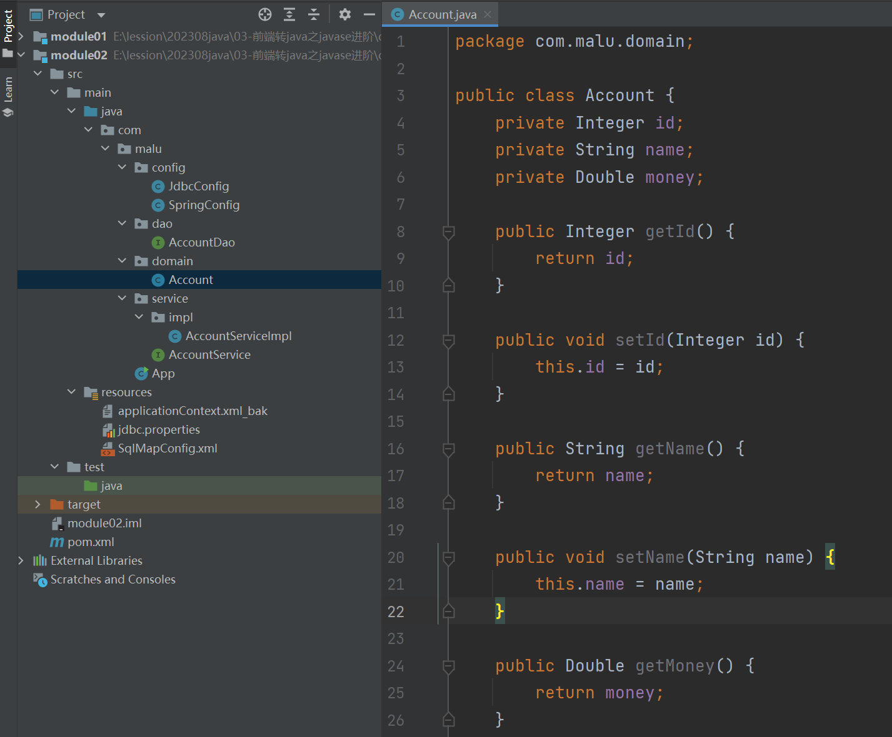

```java
package com.malu.domain;

public class Account {
    private Integer id;
    private String name;
    private Double money;

    public Integer getId() {
        return id;
    }

    public void setId(Integer id) {
        this.id = id;
    }

    public String getName() {
        return name;
    }

    public void setName(String name) {
        this.name = name;
    }

    public Double getMoney() {
        return money;
    }

    public void setMoney(Double money) {
        this.money = money;
    }

    @Override
    public String toString() {
        return "Account{" +
                "id=" + id +
                ", name='" + name + '\'' +
                ", money=" + money +
                '}';
    }
}

```


dao层接口：

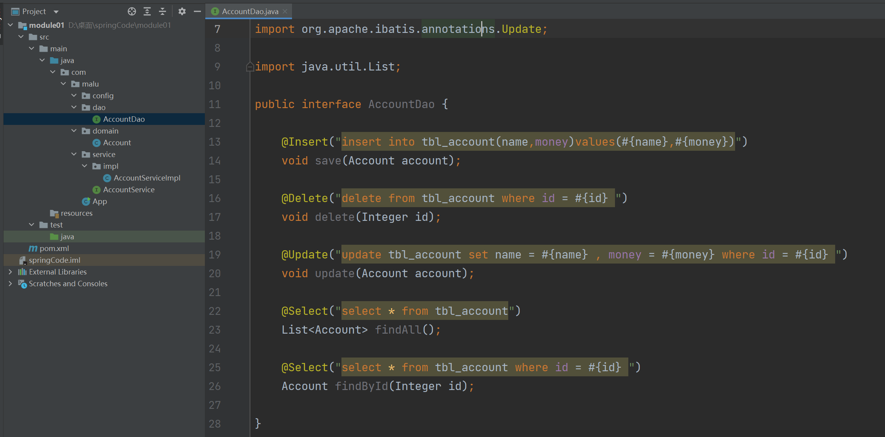

```java
public interface AccountDao {

    @Insert("insert into tbl_account(name,money)values(#{name},#{money})")
    void save(Account account);

    @Delete("delete from tbl_account where id = #{id} ")
    void delete(Integer id);

    @Update("update tbl_account set name = #{name} , money = #{money} where id = #{id} ")
    void update(Account account);

    @Select("select * from tbl_account")
    List<Account> findAll();

    @Select("select * from tbl_account where id = #{id} ")
    Account findById(Integer id);

}
```


MyBatis的核心配置：

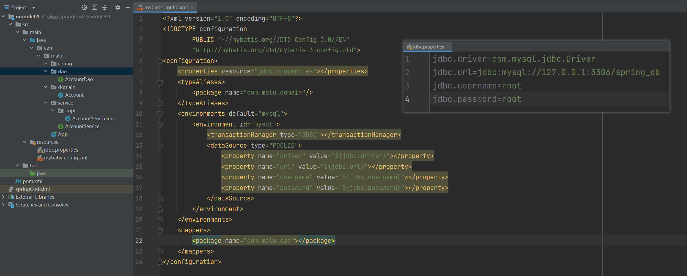

```xml
<?xml version="1.0" encoding="UTF-8"?>
<!DOCTYPE configuration
        PUBLIC "-//mybatis.org//DTD Config 3.0//EN"
        "http://mybatis.org/dtd/mybatis-3-config.dtd">
<configuration>
    <properties resource="jdbc.properties"></properties>
    <typeAliases>
        <package name="com.malu.domain"/>
    </typeAliases>
    <environments default="mysql">
        <environment id="mysql">
            <transactionManager type="JDBC"></transactionManager>
            <dataSource type="POOLED">
                <property name="driver" value="${jdbc.driver}"></property>
                <property name="url" value="${jdbc.url}"></property>
                <property name="username" value="${jdbc.username}"></property>
                <property name="password" value="${jdbc.password}"></property>
            </dataSource>
        </environment>
    </environments>
    <mappers>
        <package name="com.malu.dao"></package>
    </mappers>
</configuration>
```

```properties
jdbc.driver=com.mysql.jdbc.Driver
jdbc.url=jdbc:mysql://127.0.0.1:3306/spring_db
jdbc.username=root
jdbc.password=root
```


入口文件：

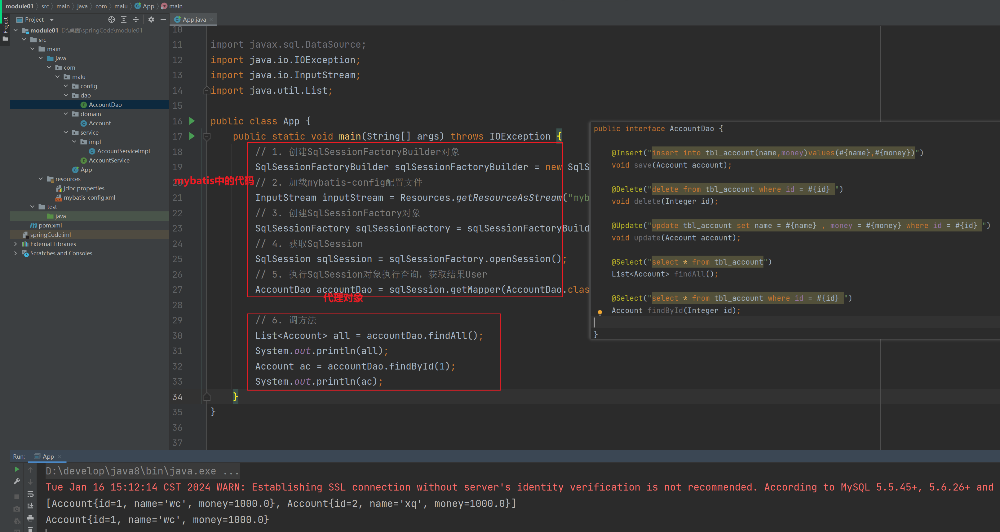

```java
public class App {
    public static void main(String[] args) throws IOException {
        // 1. 创建SqlSessionFactoryBuilder对象
        SqlSessionFactoryBuilder sqlSessionFactoryBuilder = new SqlSessionFactoryBuilder();
        // 2. 加载mybatis-config配置文件
        InputStream inputStream = Resources.getResourceAsStream("mybatis-config.xml");
        // 3. 创建SqlSessionFactory对象
        SqlSessionFactory sqlSessionFactory = sqlSessionFactoryBuilder.build(inputStream);
        // 4. 获取SqlSession
        SqlSession sqlSession = sqlSessionFactory.openSession();
        // 5. 执行SqlSession对象执行查询，获取结果User
        AccountDao accountDao = sqlSession.getMapper(AccountDao.class);

        // 6. 调方法
        List<Account> all = accountDao.findAll();
        System.out.println(all);
        Account ac = accountDao.findById(1);
        System.out.println(ac);
    }
}
```


上面的案例，我们回顾了mybatis的使用。MyBatis程序核心对象分析：

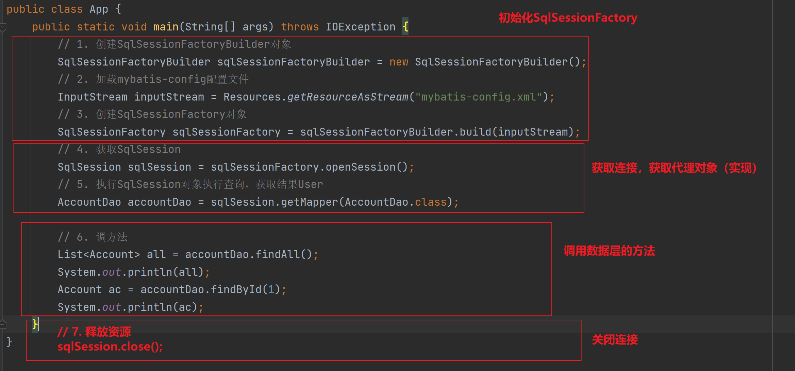


上面最核心的对象是sqlSessionFactory，这个对象，需要交给Spring管理。然后再看一下MyBatis的核心配置：

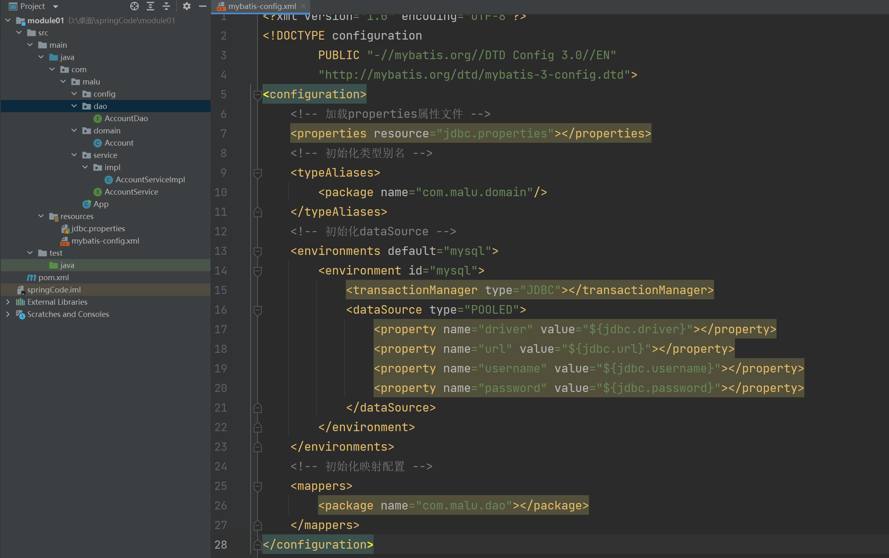

```xml
<?xml version="1.0" encoding="UTF-8"?>
<!DOCTYPE configuration
        PUBLIC "-//mybatis.org//DTD Config 3.0//EN"
        "http://mybatis.org/dtd/mybatis-3-config.dtd">
<configuration>
    <!-- 初始化属性数据 -->
    <properties resource="jdbc.properties"></properties>
    <!-- 初始化类型别名 -->
    <typeAliases>
        <package name="com.malu.domain"/>
    </typeAliases>
    <!-- 初始化dataSource -->
    <environments default="mysql">
        <environment id="mysql">
            <transactionManager type="JDBC"></transactionManager>
            <dataSource type="POOLED">
                <property name="driver" value="${jdbc.driver}"></property>
                <property name="url" value="${jdbc.url}"></property>
                <property name="username" value="${jdbc.username}"></property>
                <property name="password" value="${jdbc.password}"></property>
            </dataSource>
        </environment>
    </environments>
    <!-- 初始化映射配置 -->
    <mappers>
        <package name="com.malu.dao"></package>
    </mappers>
</configuration>
```


准备service和dao层基础代码：

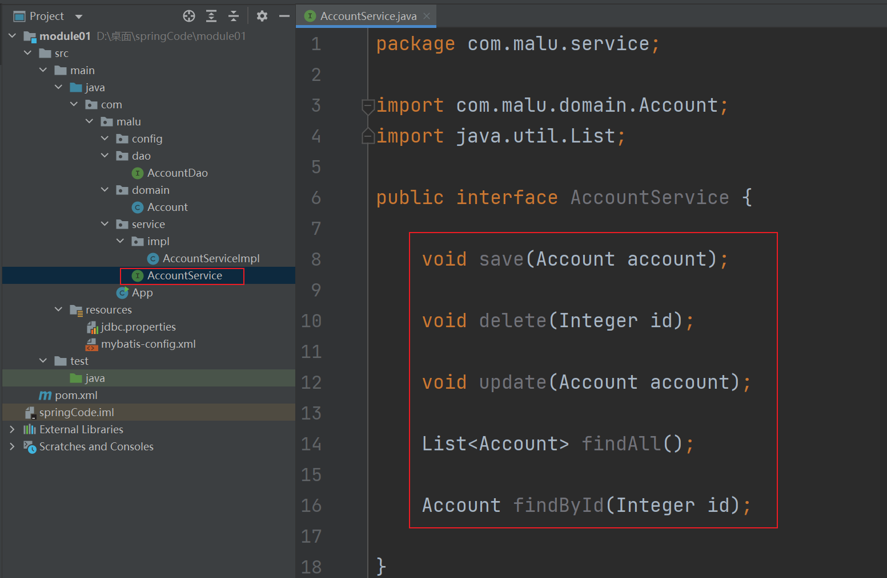

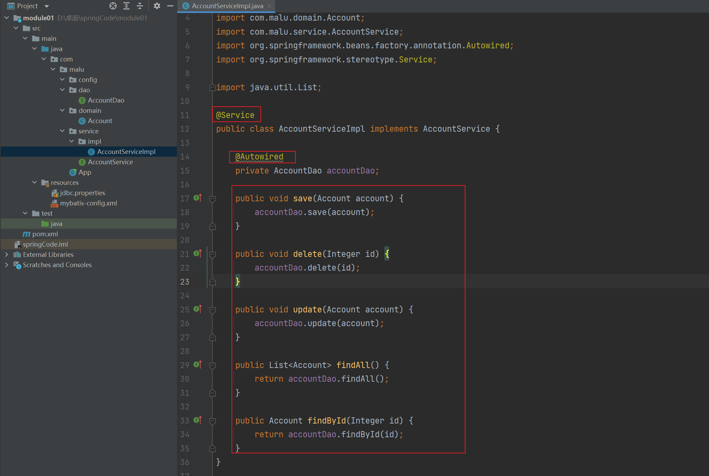

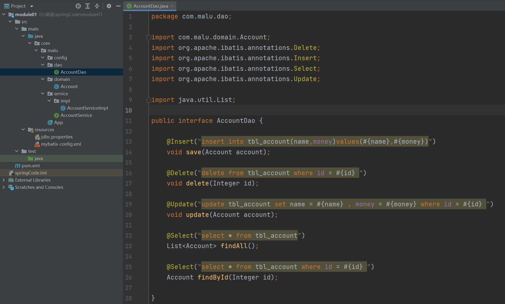

```java
public interface AccountService {

    void save(Account account);

    void delete(Integer id);

    void update(Account account);

    List<Account> findAll();

    Account findById(Integer id);

}


@Service
public class AccountServiceImpl implements AccountService {

    @Autowired
    private AccountDao accountDao;

    public void save(Account account) {
        accountDao.save(account);
    }

    public void update(Account account){
        accountDao.update(account);
    }

    public void delete(Integer id) {
        accountDao.delete(id);
    }

    public Account findById(Integer id) {
        return accountDao.findById(id);
    }

    public List<Account> findAll() {
        return accountDao.findAll();
    }
}


public interface AccountDao {

    @Insert("insert into tbl_account(name,money)values(#{name},#{money})")
    void save(Account account);

    @Delete("delete from tbl_account where id = #{id} ")
    void delete(Integer id);

    @Update("update tbl_account set name = #{name} , money = #{money} where id = #{id} ")
    void update(Account account);

    @Select("select * from tbl_account")
    List<Account> findAll();

    @Select("select * from tbl_account where id = #{id} ")
    Account findById(Integer id);
}
```


整合Mybatis步骤：

1. 【第一步】导入Spring整合Mybatis依赖

   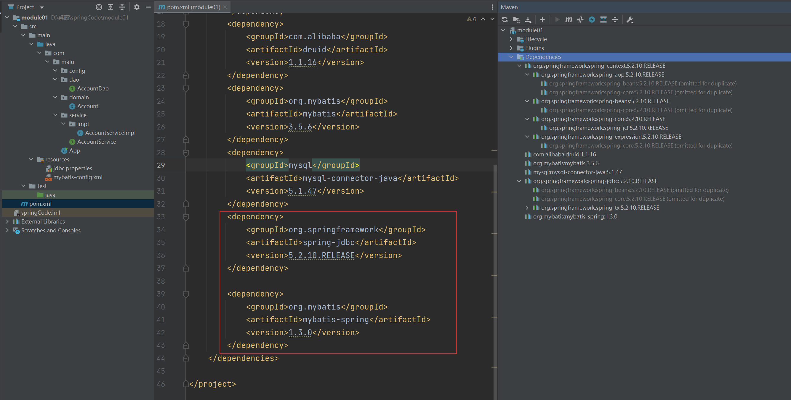

   ```xml
   <dependency>
       <groupId>org.springframework</groupId>
       <artifactId>spring-jdbc</artifactId>
       <version>5.2.10.RELEASE</version>
   </dependency>
   
   <dependency>
       <groupId>org.mybatis</groupId>
       <artifactId>mybatis-spring</artifactId>
       <version>1.3.0</version>
   </dependency><?xml version="1.0" encoding="UTF-8"?>
   <project xmlns="http://maven.apache.org/POM/4.0.0"
            xmlns:xsi="http://www.w3.org/2001/XMLSchema-instance"
            xsi:schemaLocation="http://maven.apache.org/POM/4.0.0 http://maven.apache.org/xsd/maven-4.0.0.xsd">
       <modelVersion>4.0.0</modelVersion>
   
       <groupId>com.malu</groupId>
       <artifactId>module01</artifactId>
       <version>1.0-SNAPSHOT</version>
   
       <dependencies>
           <!--导入spring的坐标spring-context，对应版本是5.2.10.RELEASE-->
           <dependency>
               <groupId>org.springframework</groupId>
               <artifactId>spring-context</artifactId>
               <version>5.2.10.RELEASE</version>
           </dependency>
           <dependency>
               <groupId>com.alibaba</groupId>
               <artifactId>druid</artifactId>
               <version>1.1.16</version>
           </dependency>
           <dependency>
               <groupId>org.mybatis</groupId>
               <artifactId>mybatis</artifactId>
               <version>3.5.6</version>
           </dependency>
           <dependency>
               <groupId>mysql</groupId>
               <artifactId>mysql-connector-java</artifactId>
               <version>5.1.47</version>
           </dependency>
           <dependency>
               <groupId>org.springframework</groupId>
               <artifactId>spring-jdbc</artifactId>
               <version>5.2.10.RELEASE</version>
           </dependency>
           <dependency>
               <groupId>org.mybatis</groupId>
               <artifactId>mybatis-spring</artifactId>
               <version>1.3.0</version>
           </dependency>
       </dependencies>
   </project>
   ```

2. 【第二步】创建JdbcConfig配置DataSource数据源

   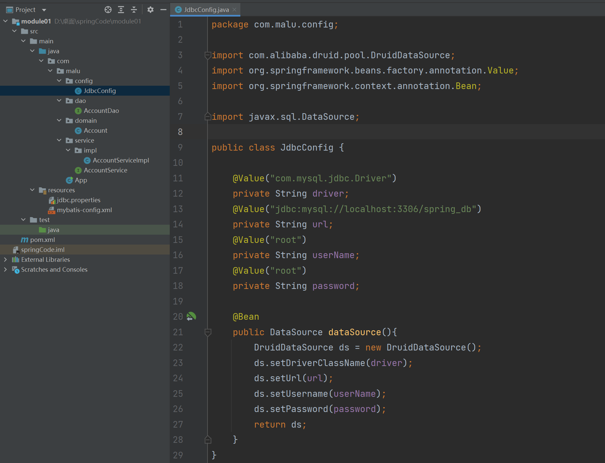

   ```java
   package com.malu.config;
   
   import com.alibaba.druid.pool.DruidDataSource;
   import org.springframework.beans.factory.annotation.Value;
   import org.springframework.context.annotation.Bean;
   
   import javax.sql.DataSource;
   
   public class JdbcConfig {
   
       @Value("com.mysql.jdbc.Driver")
       private String driver;
       @Value("jdbc:mysql://localhost:3306/spring_db")
       private String url;
       @Value("root")
       private String userName;
       @Value("root")
       private String password;
   
       @Bean
       public DataSource dataSource(){
           DruidDataSource ds = new DruidDataSource();
           ds.setDriverClassName(driver);
           ds.setUrl(url);
           ds.setUsername(userName);
           ds.setPassword(password);
           return ds;
       }
   }
   ```

   创建spring的配置类：

   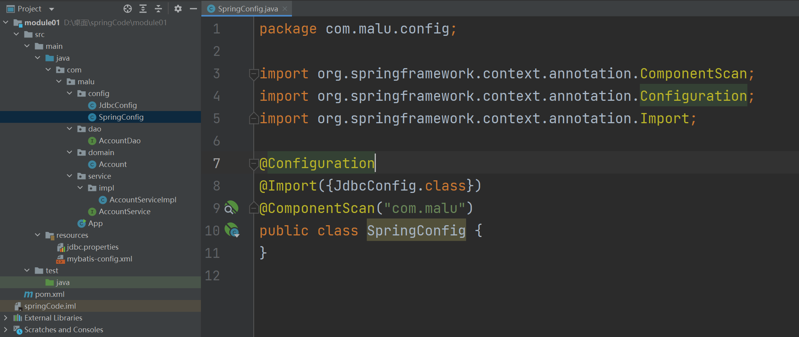

   ```java
   @Configuration
   @Import({JdbcConfig.class})
   @ComponentScan("com.malu")
   public class SpringConfig {
   }
   ```

3. 【第三步】创建MybatisConfig整合mybatis

   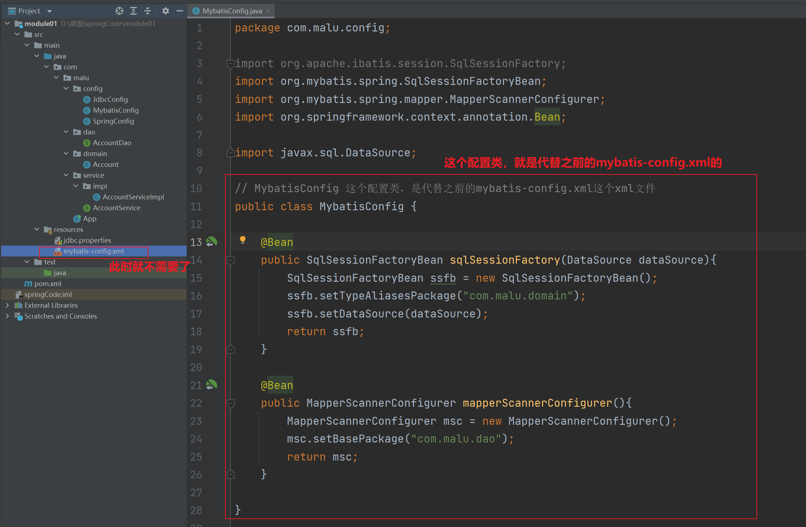

   ```java
   public class MybatisConfig {
       //定义bean，SqlSessionFactoryBean，用于产生SqlSessionFactory对象
       @Bean
       public SqlSessionFactoryBean sqlSessionFactory(DataSource dataSource){
           SqlSessionFactoryBean ssfb = new SqlSessionFactoryBean();
           ssfb.setTypeAliasesPackage("com.malu.domain");
           ssfb.setDataSource(dataSource);
           return ssfb;
       }
       //定义bean，返回MapperScannerConfigurer对象
       @Bean
       public MapperScannerConfigurer mapperScannerConfigurer(){
           MapperScannerConfigurer msc = new MapperScannerConfigurer();
           msc.setBasePackage("com.malu.dao");
           return msc;
       }
   }
   ```

   

4. 【第四步】创建SpringConfig主配置类进行包扫描和加载其他配置类

   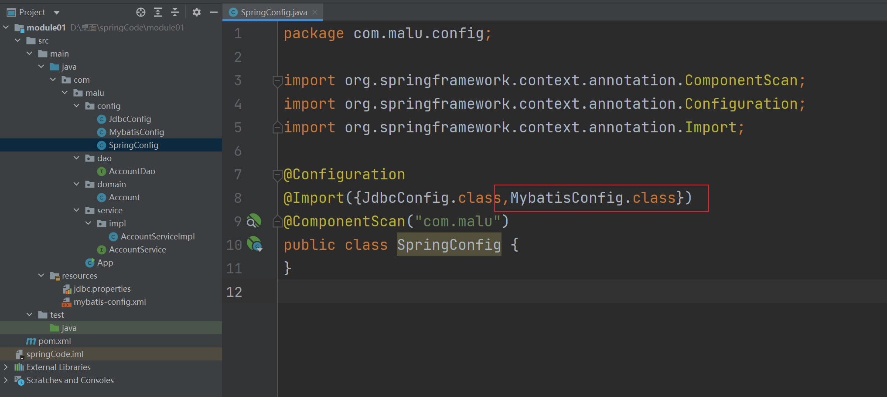

   ```java
   @Configuration
   @ComponentScan("com.malu")
   //@PropertySource：加载类路径jdbc.properties文件
   @PropertySource("classpath:jdbc.properties")
   @Import({JdbcConfig.class,MybatisConfig.class})
   public class SpringConfig {
   }
   ```

5. 【第五步】定义测试类进行测试

   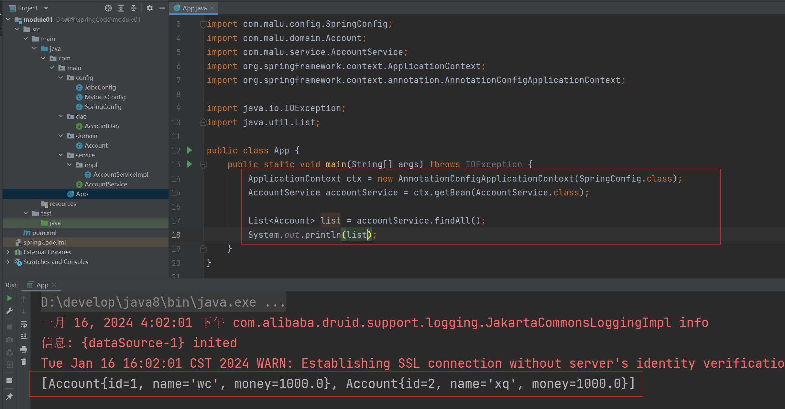

   ```java
   public class App {
       public static void main(String[] args) throws IOException {
           ApplicationContext ctx = new AnnotationConfigApplicationContext(SpringConfig.class);
           AccountService accountService = ctx.getBean(AccountService.class);
   
           List<Account> list = accountService.findAll();
           System.out.println(list);
       }
   }
   ```


### 2，Spring整合Junit单元测试


Spring整合Junit单元测试步骤：

1. 【第一步】导入整合的依赖坐标spring-test

   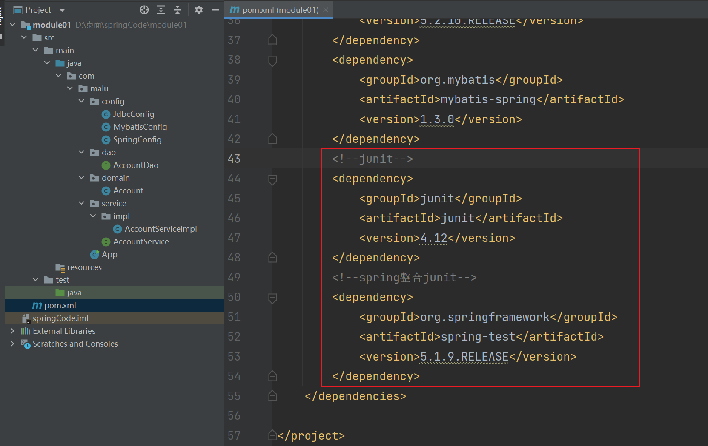

   ```xml
   <?xml version="1.0" encoding="UTF-8"?>
   <project xmlns="http://maven.apache.org/POM/4.0.0"
            xmlns:xsi="http://www.w3.org/2001/XMLSchema-instance"
            xsi:schemaLocation="http://maven.apache.org/POM/4.0.0 http://maven.apache.org/xsd/maven-4.0.0.xsd">
       <modelVersion>4.0.0</modelVersion>
   
       <groupId>com.malu</groupId>
       <artifactId>module01</artifactId>
       <version>1.0-SNAPSHOT</version>
   
       <dependencies>
           <!--导入spring的坐标spring-context，对应版本是5.2.10.RELEASE-->
           <dependency>
               <groupId>org.springframework</groupId>
               <artifactId>spring-context</artifactId>
               <version>5.2.10.RELEASE</version>
           </dependency>
           <dependency>
               <groupId>com.alibaba</groupId>
               <artifactId>druid</artifactId>
               <version>1.1.16</version>
           </dependency>
           <dependency>
               <groupId>org.mybatis</groupId>
               <artifactId>mybatis</artifactId>
               <version>3.5.6</version>
           </dependency>
           <dependency>
               <groupId>mysql</groupId>
               <artifactId>mysql-connector-java</artifactId>
               <version>5.1.47</version>
           </dependency>
           <dependency>
               <groupId>org.springframework</groupId>
               <artifactId>spring-jdbc</artifactId>
               <version>5.2.10.RELEASE</version>
           </dependency>
           <dependency>
               <groupId>org.mybatis</groupId>
               <artifactId>mybatis-spring</artifactId>
               <version>1.3.0</version>
           </dependency>
           <!--junit-->
           <dependency>
               <groupId>junit</groupId>
               <artifactId>junit</artifactId>
               <version>4.12</version>
           </dependency>
           <!--spring整合junit-->
           <dependency>
               <groupId>org.springframework</groupId>
               <artifactId>spring-test</artifactId>
               <version>5.1.9.RELEASE</version>
           </dependency>
       </dependencies>
   </project>
   ```

2. 【第二步】使用Spring整合Junit专用的类加载器

3. 【第三步】加载配置文件或者配置类

   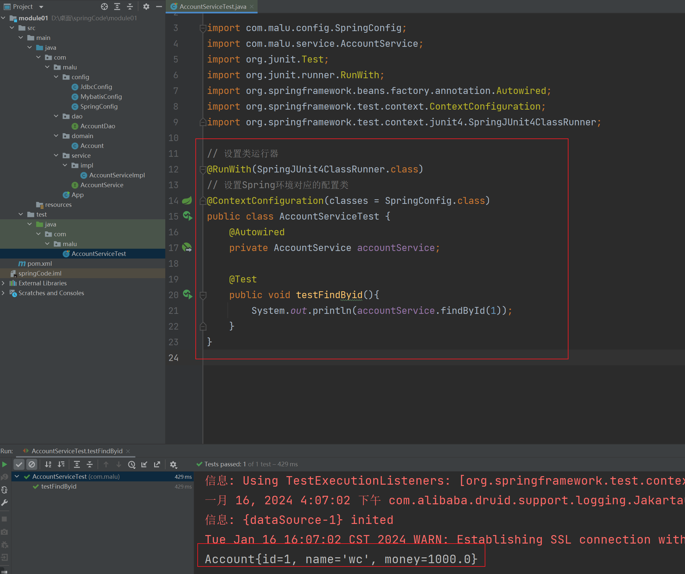

   ```java
   //【第二步】使用Spring整合Junit专用的类加载器
   @RunWith(SpringJUnit4ClassRunner.class)
   //【第三步】加载配置文件或者配置类
   @ContextConfiguration(classes = {SpringConfiguration.class}) //加载配置类
   //@ContextConfiguration(locations={"classpath:applicationContext.xml"})//加载配置文件
   public class AccountServiceTest {
       //支持自动装配注入bean
       @Autowired
       private AccountService accountService;
   
       @Test
       public void testFindById(){
           System.out.println(accountService.findById(1));
       }
   
       @Test
       public void testFindAll(){
           System.out.println(accountService.findAll());
       }
   }
   ```

   

注意细节：

- junit的依赖至少要是4.12版本,可以是4.13等版本,否则出现如下异常


## 十一，AOP快速入门

### 1，什么是AOP


环境准备：

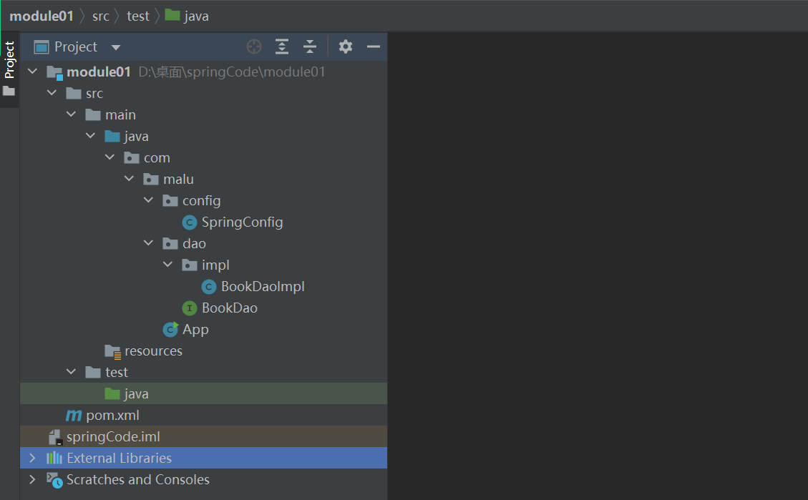


配置文件：

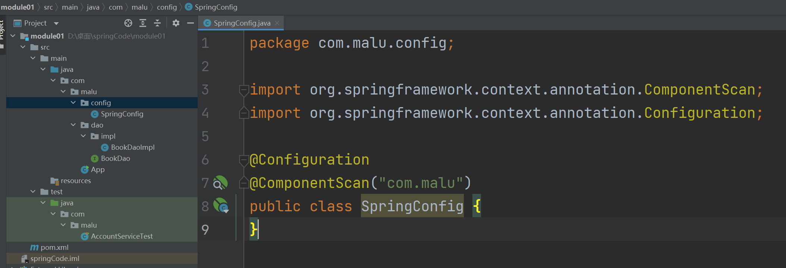

```java
@Configuration
@ComponentScan("com.malu")
public class SpringConfig {
}

```

Dao层代码：

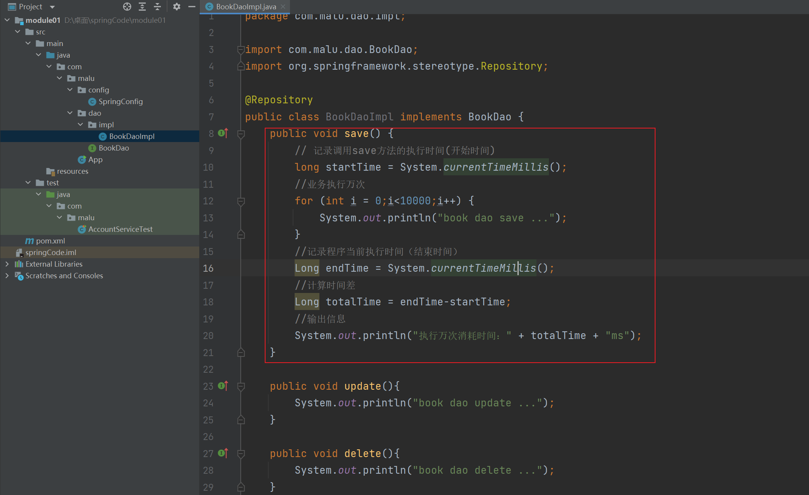

```java
public interface BookDao {
    public void save();

    public void update();

    public void delete();

    public void select();
}

@Repository
public class BookDaoImpl implements BookDao {

    public void save() {
        //记录程序当前执行执行（开始时间）
        Long startTime = System.currentTimeMillis();
        //业务执行万次
        for (int i = 0;i<10000;i++) {
            System.out.println("book dao save ...");
        }
        //记录程序当前执行时间（结束时间）
        Long endTime = System.currentTimeMillis();
        //计算时间差
        Long totalTime = endTime-startTime;
        //输出信息
        System.out.println("执行万次消耗时间：" + totalTime + "ms");
    }

    public void update(){
        System.out.println("book dao update ...");
    }

    public void delete(){
        System.out.println("book dao delete ...");
    }

    public void select(){
        System.out.println("book dao select ...");
    }
}
```


入口：

```java
public class App {
    public static void main(String[] args) {
        ApplicationContext ctx = new AnnotationConfigApplicationContext(SpringConfig.class);
        BookDao bookDao = ctx.getBean(BookDao.class);
        bookDao.save();
    }
}
```


测试如下：

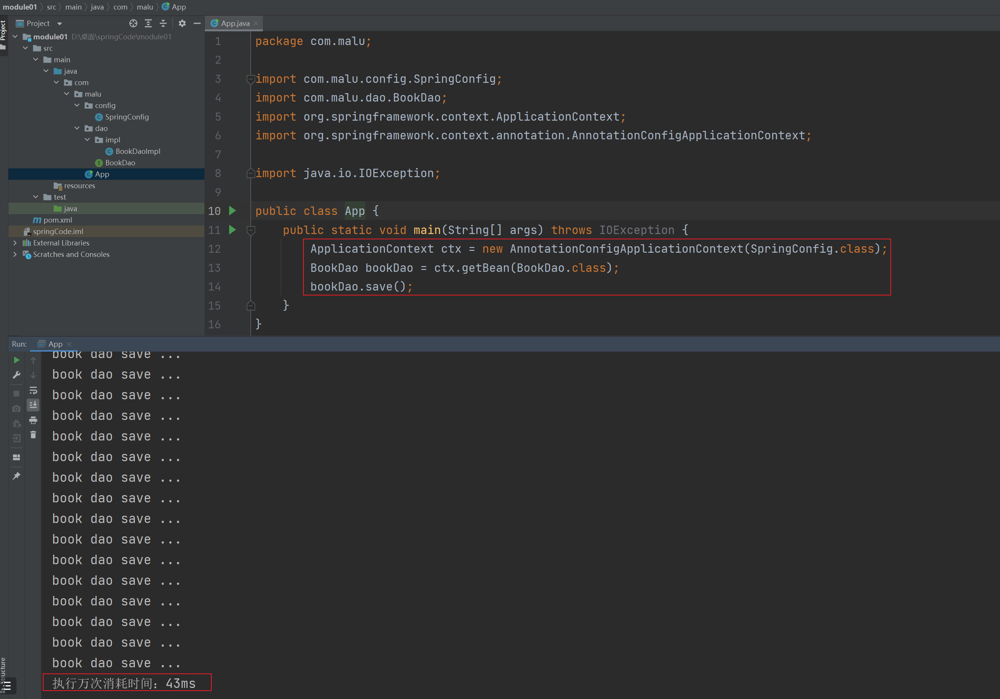


我们之前学习的OOP(Object Oriented Programming)叫面向对象编程。是一种编程范式，指导开发者如何组织程序结构。那么接下来我们学习的AOP(Aspect Oriented Programming)，叫面向切面编程，也是一种编程范式。


作用：在不惊动原始设计的基础上为其进行功能增强。简单的说就是在不改变方法源代码的基础上对方法进行功能增强。无入侵式/无侵入式。


AOP核心概念：

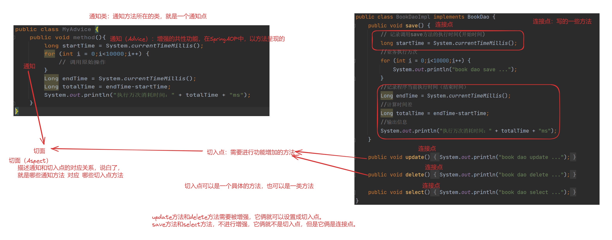


连接点（JoinPoint）：

- 正在执行的方法，例如：update()、delete()、select()等都是连接点。就是我们制作出来的功能。

切入点（Pointcut）：

- 进行功能增强了的方法，例如:update()、delete()方法，select()方法没有被增强所以不是切入点，但是是连接点。
- 在SpringAOP中，一个切入点可以只描述一个具体方法，也可以匹配多个方法
  - 一个具体方法：com.malu.dao包下的BookDao接口中的无形参无返回值的save方法
  - 匹配多个方法：所有的save方法，所有的get开头的方法，所有以Dao结尾的接口中的任意方法，所有带有一个参数的方法

通知（Advice）：

- 在切入点前后执行的操作，也就是增强的共性功能。在SpringAOP中，功能最终以方法的形式呈现。通知可以有很多个。

通知类：

- 通知方法所在的类叫做通知类

切面（Aspect）：

- 描述通知与切入点的对应关系，也就是哪些通知方法对应哪些切入点方法。


### 2，AOP快速入门

AOP快速入门步骤如下：

1. 【第一步】导入aop相关坐标

   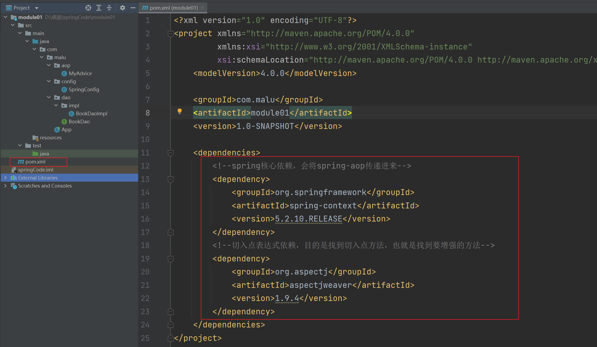

   ```xml
   <dependencies>
       <!--spring核心依赖，会将spring-aop传递进来-->
       <dependency>
           <groupId>org.springframework</groupId>
           <artifactId>spring-context</artifactId>
           <version>5.2.10.RELEASE</version>
       </dependency>
       <!--切入点表达式依赖，目的是找到切入点方法，也就是找到要增强的方法-->
       <dependency>
           <groupId>org.aspectj</groupId>
           <artifactId>aspectjweaver</artifactId>
           <version>1.9.4</version>
       </dependency>
   </dependencies>
   ```

2. 【第二步】定义dao接口与实现类

   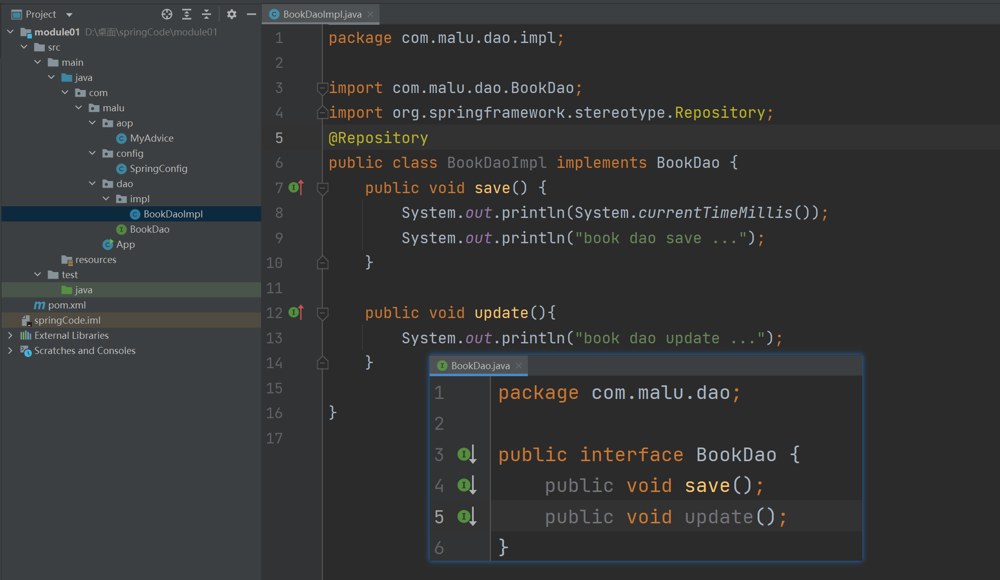

   ```java
   public interface BookDao {
       public void save();
       public void update();
   }
   
   @Repository
   public class BookDaoImpl implements BookDao {
   
       public void save() {
           System.out.println(System.currentTimeMillis());
           System.out.println("book dao save ...");
       }
       public void update(){
           System.out.println("book dao update ...");
       }
   }
   ```

3. 入口

   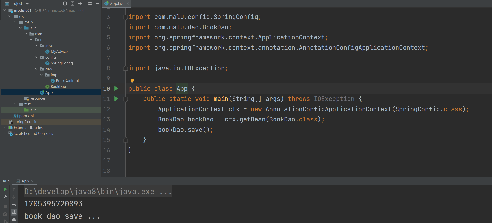

   ```java
   public class App {
       public static void main(String[] args) throws IOException {
           ApplicationContext ctx = new AnnotationConfigApplicationContext(SpringConfig.class);
           BookDao bookDao = ctx.getBean(BookDao.class);
           bookDao.save();
       }
   }
   ```

   

4. 【第三步】定义通知类，制作通知方法

   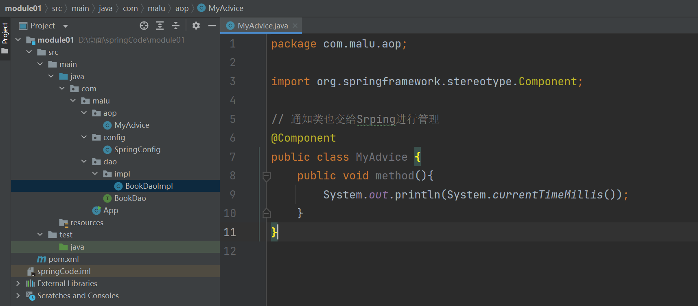

   ```java
   //通知类必须配置成Spring管理的bean
   @Component
   public class MyAdvice {
       public void method(){
           System.out.println(System.currentTimeMillis());
       }
   }
   ```

5. 【第四步】定义切入点表达式、配置切面(绑定切入点与通知关系)

   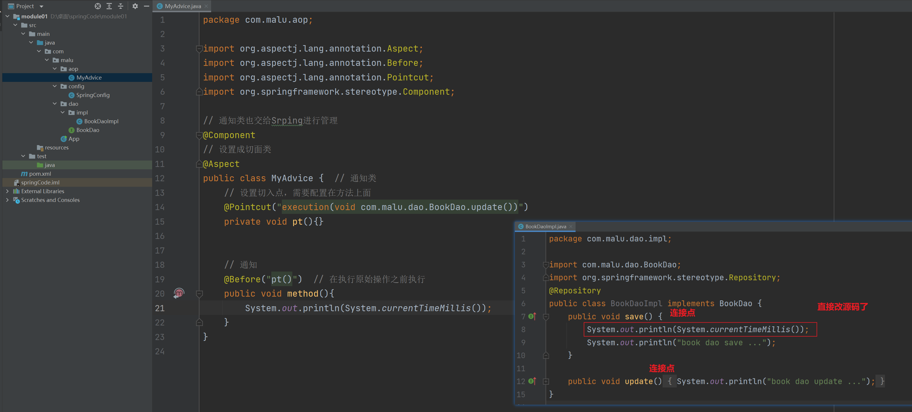

   ```java
   //通知类必须配置成Spring管理的bean
   @Component
   //设置当前类为切面类类
   @Aspect
   public class MyAdvice {
       //设置切入点，@Pointcut注解要求配置在方法上方
       @Pointcut("execution(void com.malu.dao.BookDao.update())")
       private void pt(){}
   
       //设置在切入点pt()的前面运行当前操作(前置通知)
       @Before("pt()")
       public void method(){
           System.out.println(System.currentTimeMillis());
       }
   }
   ```

6. 【第五步】在配置类中进行Spring注解包扫描和开启AOP功能

   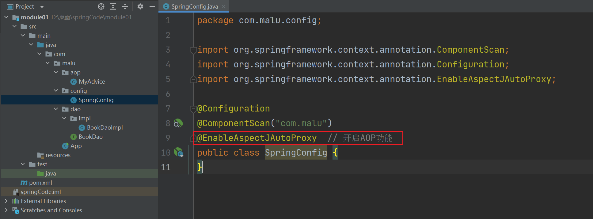

   ```java
   @Configuration
   @ComponentScan("com.malu")
   //开启注解开发AOP功能
   @EnableAspectJAutoProxy
   public class SpringConfig {
   }
   ```

7. 测试类和运行结果

   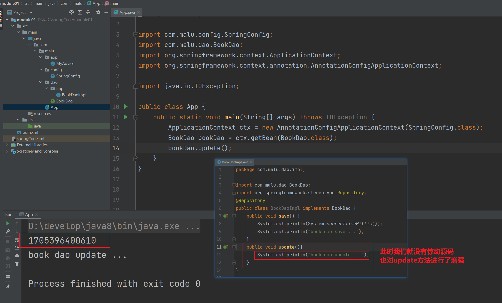

   ```java
   public class App {
       public static void main(String[] args) {
           ApplicationContext ctx = new AnnotationConfigApplicationContext(SpringConfig.class);
           BookDao bookDao = ctx.getBean(BookDao.class);
           bookDao.update();
       }
   }
   ```


### 3，AOP工作流程

AOP工作流程如下：

1. Spring容器启动
2. 读取所有切面配置中的切入点，可能有多个切入点，但是只读取配置的切入点。
3. 初始化bean，判定bean对应的类中的方法是否匹配到任意切入点
   - 匹配失败，创建原始对象
   - 匹配成功，创建原始对象（目标对象）的代理对象
4. 获取bean执行方法
   - 获取的bean是原始对象时，调用方法并执行，完成操作
   - 获取的bean是代理对象时，根据代理对象的运行模式运行原始方法与增强的内容，完成操作

AOP核心概念：

- 目标对象（Target）：被代理的对象，也叫原始对象，该对象中的方法没有任何功能增强。
- 代理对象（Proxy）：代理后生成的对象，由Spring帮我们创建代理对象。


在测试类中验证代理对象：

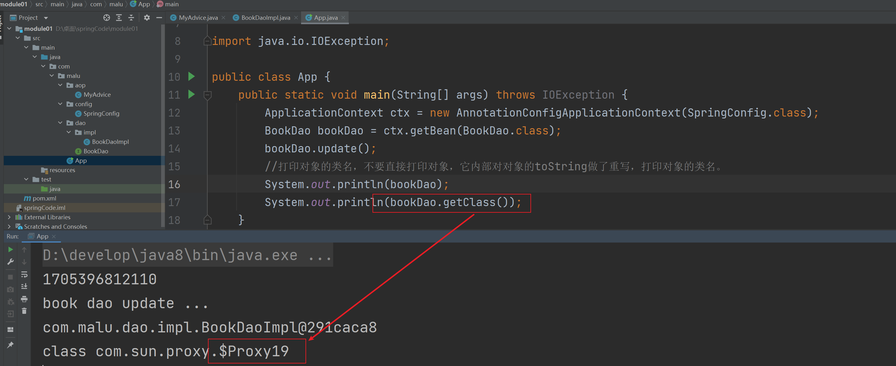

```java
public class App {
    public static void main(String[] args) throws IOException {
        ApplicationContext ctx = new AnnotationConfigApplicationContext(SpringConfig.class);
        BookDao bookDao = ctx.getBean(BookDao.class);
        bookDao.update();
        //打印对象的类名，不要直接打印对象，它内部对对象的toString做了重写，打印对象的类名。
        System.out.println(bookDao);
        System.out.println(bookDao.getClass());
    }
}
```


## 十三，AOP切入点表达式


### 1，语法格式

所谓的切入点就是要进行增强的方法，切入点表达式是要进行增强的方法的描述。可以根据接口描述，也可以根据实现类描述。这两种方式都可以。

- 描述方式一：执行com.malu.dao包下的BookDao接口中的无参数update方法

  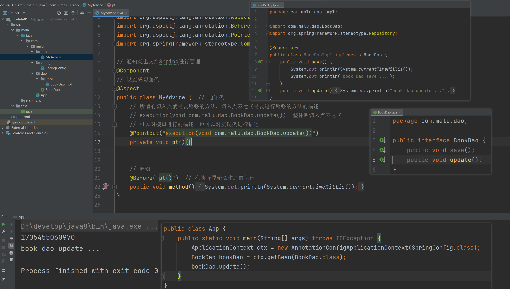

  ```java
  execution(void com.malu.dao.BookDao.update())
  ```

- 描述方式二：执行com.malu.dao.impl包下的BookDaoImpl类中的无参数update方法

  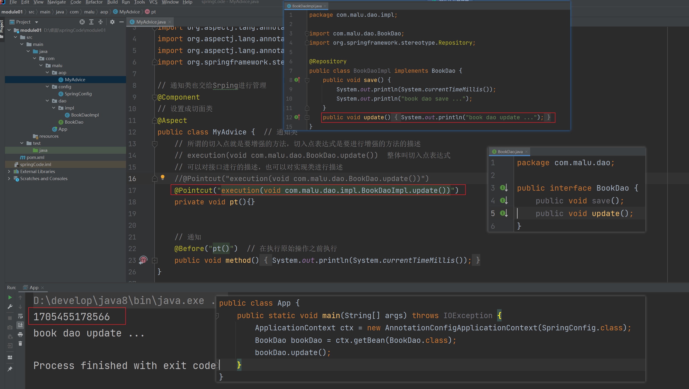

  ```java
  execution(void com.malu.dao.impl.BookDaoImpl.update())
  ```


切入点表达式标准格式：动作关键字(访问修饰符  返回值  包名.类/接口名.方法名(参数) 异常名）

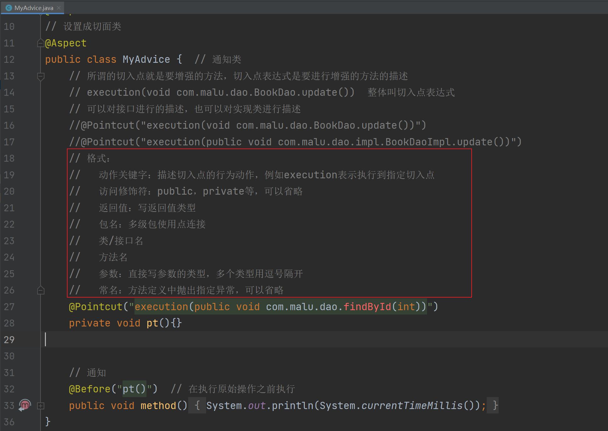

```java
execution(public User com.malu.service.UserService.findById(int))
```

- 动作关键字：描述切入点的行为动作，例如execution表示执行到指定切入点
- 访问修饰符：public，private等，可以省略
- 返回值：写返回值类型
- 包名：多级包使用点连接
- 类/接口名
- 方法名
- 参数：直接写参数的类型，多个类型用逗号隔开
- 异常名：方法定义中抛出指定异常，可以省略


演示：

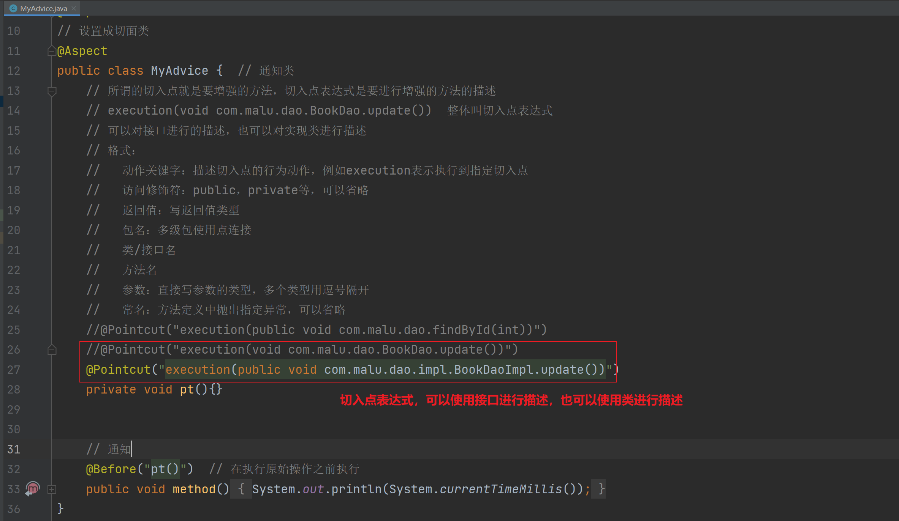


### 2，通配符

切入点可以描述一个具体的方法，也可以描述满足要求的一类方法，此时就需要使用通配符。可以使用通配符描述切入点，快速描述。


单个*，可以独立出现，也可以作为前缀或者后缀的匹配符出现。如匹配com.malu包下的任意包中的UserService类或接口中所有find开头的带有一个参数的方法

```java
execution（public * com.malu.*.UserService.find*(*))
```


两个点，可以独立出现，常用于简化包名与参数的书写。如匹配com包下的任意包中的UserService类或接口中所有名称为findById的方法

```java
execution（public User com..UserService.findById(..))
```


单个+，专用于匹配子类类型

```java
execution(* *..*Service+.*(..))
```


演示：

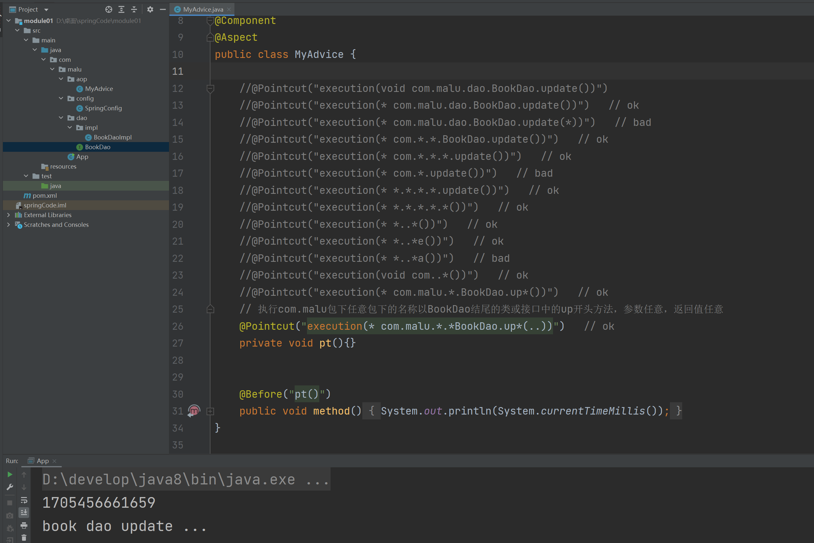

```java
@Component
@Aspect
public class MyAdvice {

    //@Pointcut("execution(void com.malu.dao.BookDao.update())")
    //@Pointcut("execution(* com.malu.dao.BookDao.update())")   // ok
    //@Pointcut("execution(* com.malu.dao.BookDao.update(*))")   // bad
    //@Pointcut("execution(* com.*.*.BookDao.update())")   // ok
    //@Pointcut("execution(* com.*.*.*.update())")   // ok
    //@Pointcut("execution(* com.*.update())")   // bad
    //@Pointcut("execution(* *.*.*.*.update())")   // ok
    //@Pointcut("execution(* *.*.*.*.*())")   // ok
    //@Pointcut("execution(* *..*())")   // ok
    //@Pointcut("execution(* *..*e())")   // ok
    //@Pointcut("execution(* *..*a())")   // bad
    //@Pointcut("execution(void com..*())")   // ok
    //@Pointcut("execution(* com.malu.*.BookDao.up*())")   // ok
    // 执行com.malu包下任意包下的名称以BookDao结尾的类或接口中的up开头方法，参数任意，返回值任意
    @Pointcut("execution(* com.malu.*.*BookDao.up*(..))")   // ok
    private void pt(){}


    @Before("pt()")
    public void method(){
        System.out.println(System.currentTimeMillis());
    }
}
```


书写技巧（所有代码按照标准规范开发，否则以下技巧全部失效）：

- 描述切入点**通常描述接口**，而不描述实现类
- 访问控制修饰符针对接口开发均采用public描述（**可省略访问控制修饰符描述**）
- 返回值类型对于增删改类使用精准类型加速匹配，对于查询类使用\*通配快速描述
- **包名**书写**尽量不使用..匹配**，效率过低，常用\*做单个包描述匹配，或精准匹配
- **接口名/类名**书写名称与模块相关的**采用\*匹配**，例如UserService书写成\*Service，绑定业务层接口名
- **方法名**书写以**动词**进行**精准匹配**，名词采用星匹配，例如getById书写成getBy*,selectAll书写成selectAll
- 参数规则较为复杂，根据业务方法灵活调整
- 通常**不使用异常**作为**匹配**规则


## 十四，AOP通知类型

准备工作：


配置：

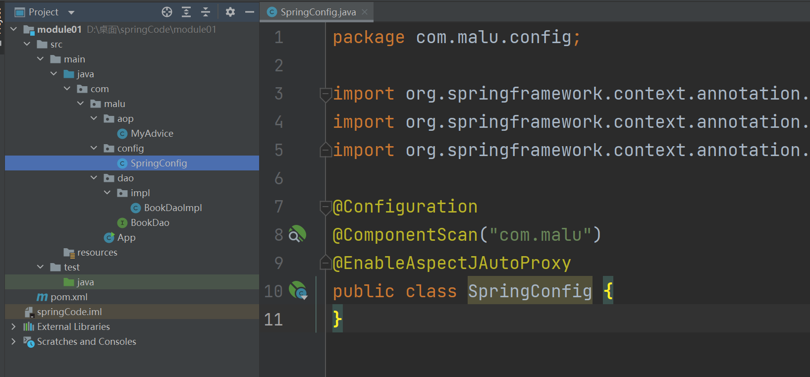

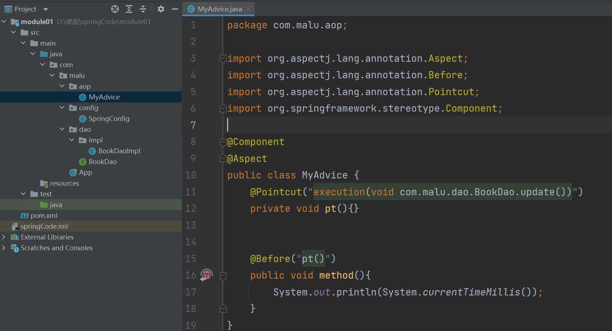

```java
@Configuration
@ComponentScan("com.malu")
@EnableAspectJAutoProxy
public class SpringConfig {
}

@Component
@Aspect
public class MyAdvice {
    @Pointcut("execution(void com.malu.dao.BookDao.update())")
    private void pt(){}


    @Before("pt()")
    public void method(){
        System.out.println(System.currentTimeMillis());
    }
}
```


dao层：

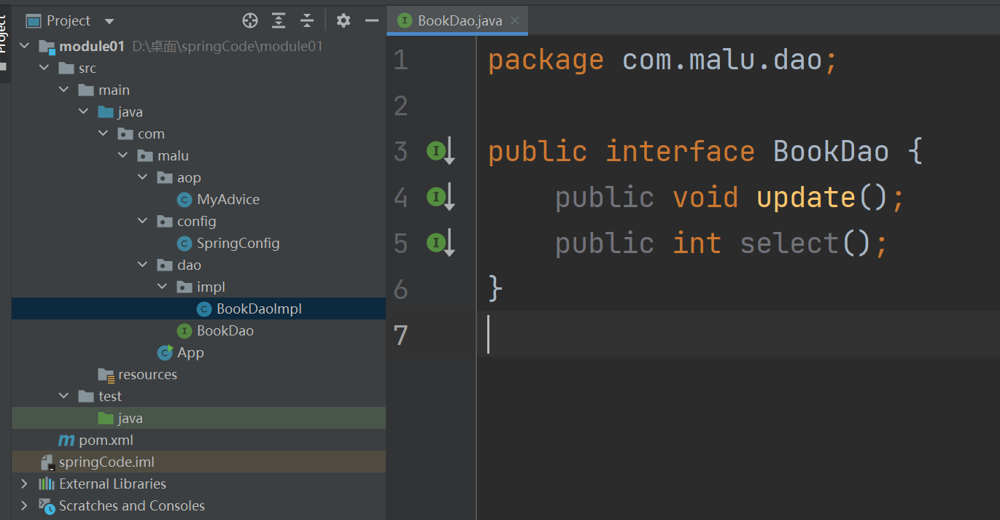


```java
public interface BookDao {
    public void update();
    public int select();
}

@Repository
public class BookDaoImpl implements BookDao {

    public void update(){
        System.out.println("book dao update ...");
    }

    public int select() {
        System.out.println("book dao select ...");
        return 100;
    }
}
```


入口：

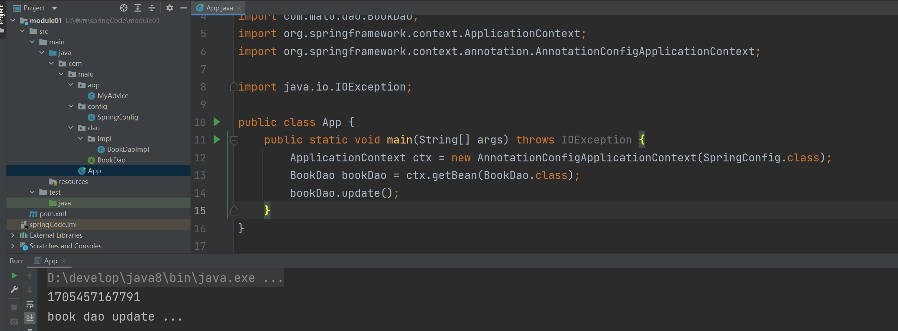


### 1，AOP通知的分类

AOP通知描述了抽取的共性功能，根据共性功能抽取的位置不同，最终运行代码时要将其加入到合理的位置。AOP通知共分为5种类型

- 前置通知：在切入点方法执行之前执行
- 后置通知：在切入点方法执行之后执行，无论切入点方法内部是否出现异常，后置通知都会执行。
- 环绕通知(重点)：手动调用切入点方法并对其进行增强的通知方式。
- 返回后通知(了解)：在切入点方法执行之后执行，如果切入点方法内部出现异常将不会执行。
- 抛出异常后通知(了解)：在切入点方法执行之后执行，只有当切入点方法内部出现异常之后才执行。


### 2，AOP通知详解


##### 2.1 前置通知

- 名称：@Before
- 类型：**方法注解**
- 位置：通知方法定义上方
- 作用：设置当前通知方法与切入点之间的绑定关系，当前通知方法在原始切入点方法前运行
- 范例：

```java
@Before("pt()")
public void before() {
    System.out.println("before advice ...");
}
```

演示：

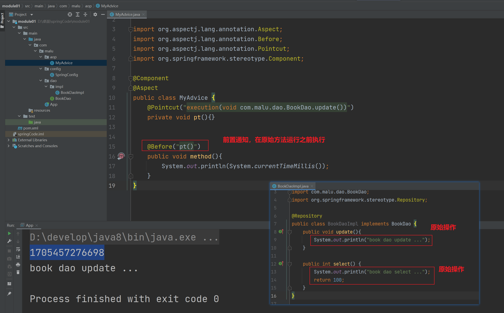


##### 2.2 后置通知

- 名称：@After
- 类型：**方法注解**
- 位置：通知方法定义上方
- 作用：设置当前通知方法与切入点之间的绑定关系，当前通知方法在原始切入点方法后运行
- 范例：

```java
@After("pt()")
public void after() {
    System.out.println("after advice ...");
}
```

演示：

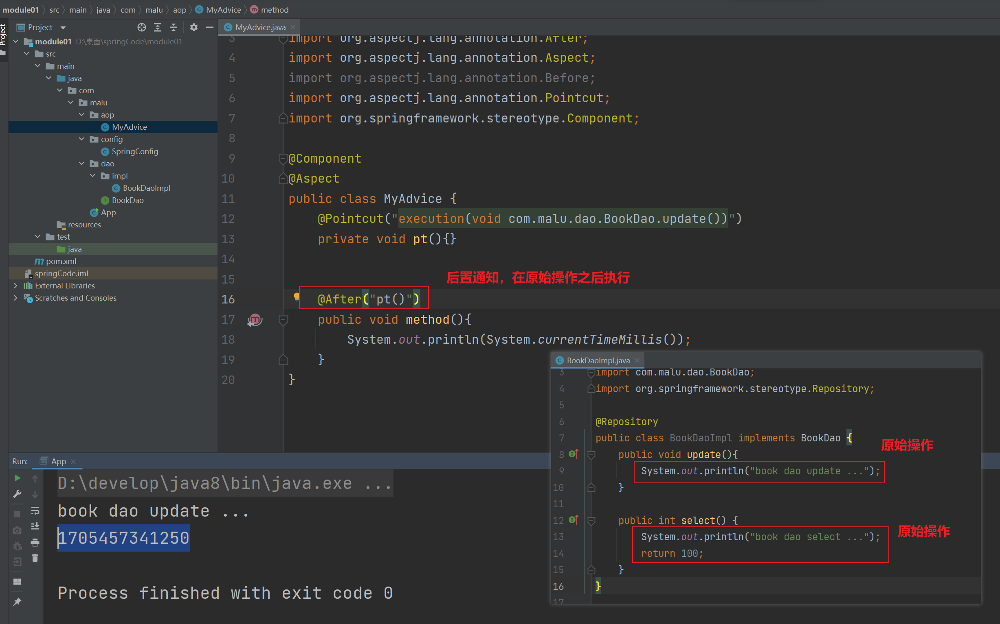


无论切入点方法内部是否出现异常，后置通知都会执行。

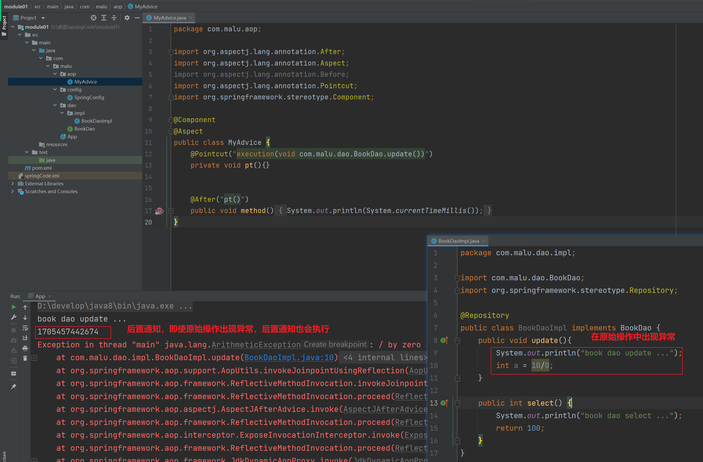


##### 2.3 返回后通知

- 名称：@AfterReturning（了解）
- 类型：**方法注解**
- 位置：通知方法定义上方
- 作用：设置当前通知方法与切入点之间的绑定关系，当前通知方法在原始切入点方法正常执行完毕后运行
- 范例：

```java
@AfterReturning("pt()")
public void afterReturning() {
    System.out.println("afterReturning advice ...");
}
```


演示：

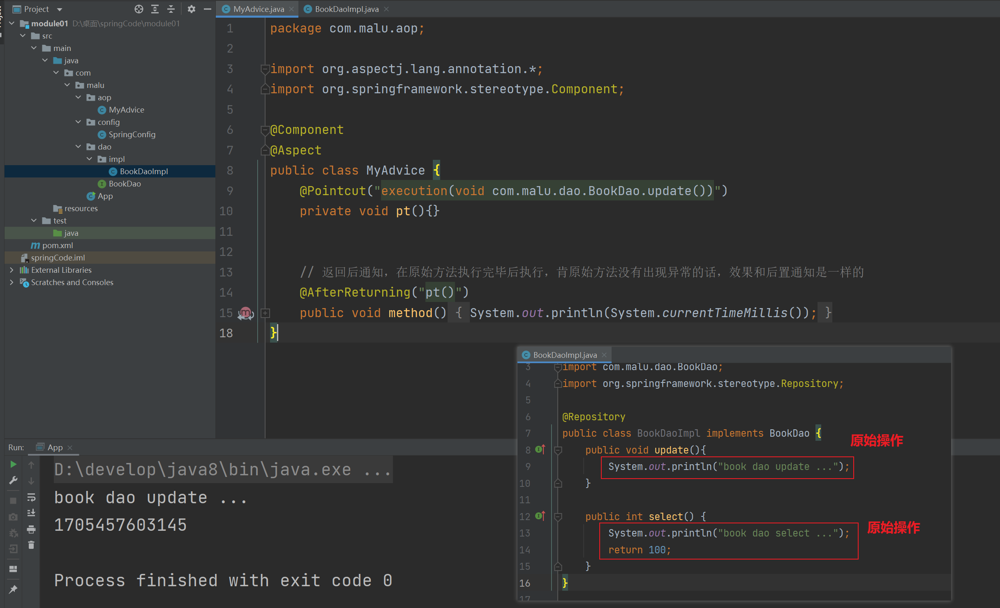


演示出异常情况，后置通知会执行，返回后通知不会执行：

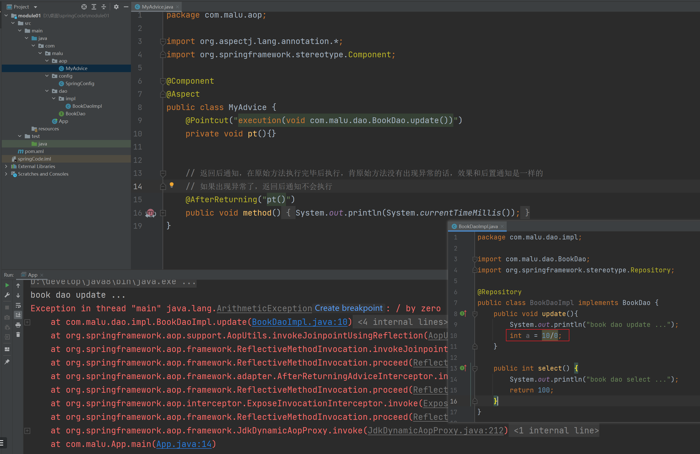


测试原始操作有返回值的情况下，如下：

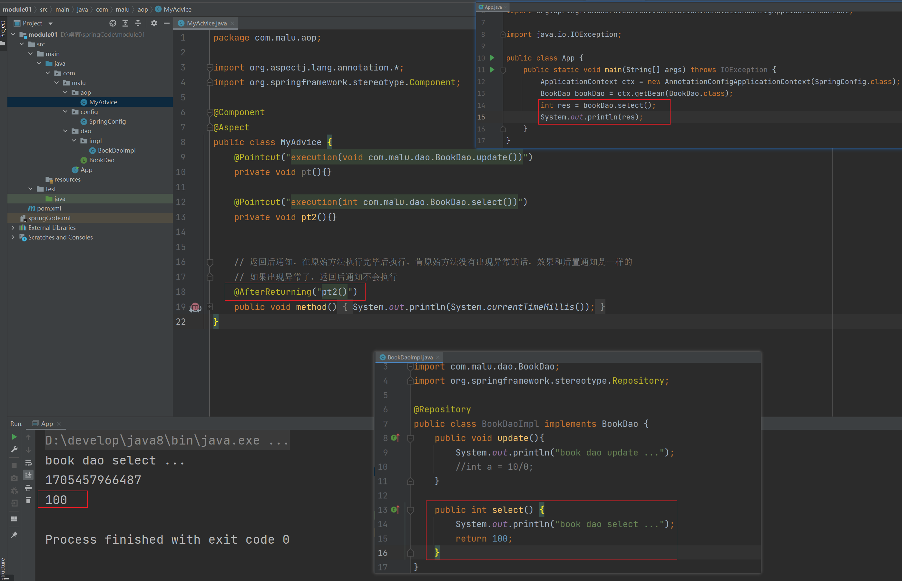


##### 2.4 抛出异常后通知

- 名称：@AfterThrowing（了解）
- 类型：**方法注解**
- 位置：通知方法定义上方
- 作用：设置当前通知方法与切入点之间的绑定关系，当前通知方法在原始切入点方法运行抛出异常后执行
- 范例：

```java
@AfterThrowing("pt()")
public void afterThrowing() {
    System.out.println("afterThrowing advice ...");
}
```

演示：

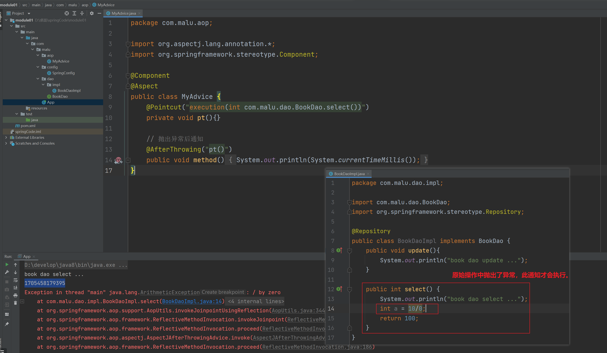


如果没有异常，它就不会执行：

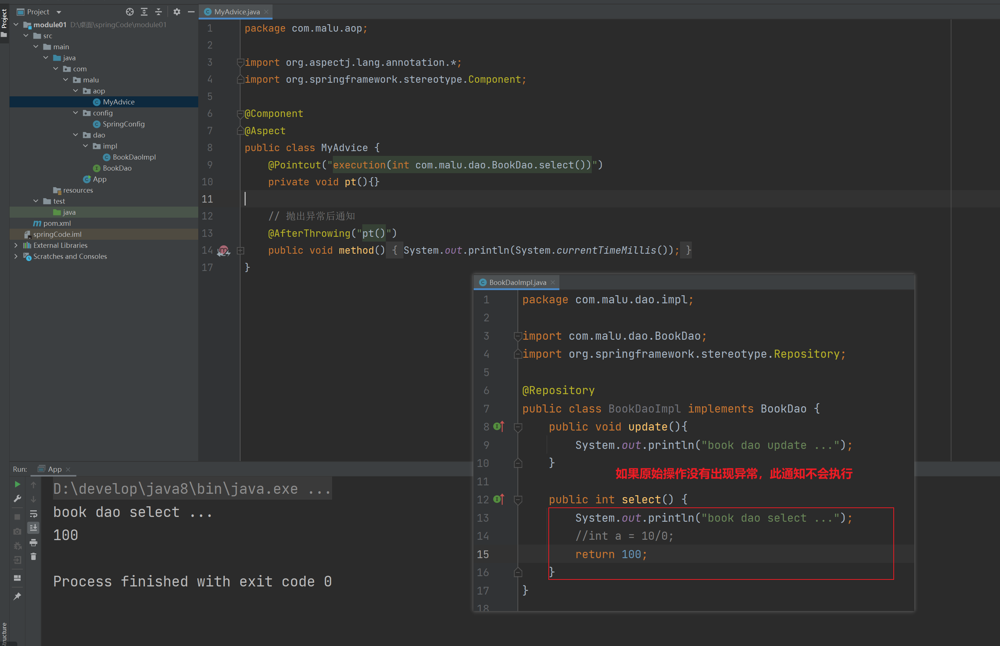


##### 2.5 环绕通知

- 名称：@Around（重点，常用）
- 类型：**方法注解**
- 位置：通知方法定义上方
- 作用：设置当前通知方法与切入点之间的绑定关系，当前通知方法在原始切入点方法前后运行
- 范例：：

```java
@Around("pt()")
public Object around(ProceedingJoinPoint pjp) throws Throwable {
    System.out.println("around before advice ...");
    Object ret = pjp.proceed();
    System.out.println("around after advice ...");
    return ret;
}
```


演示：

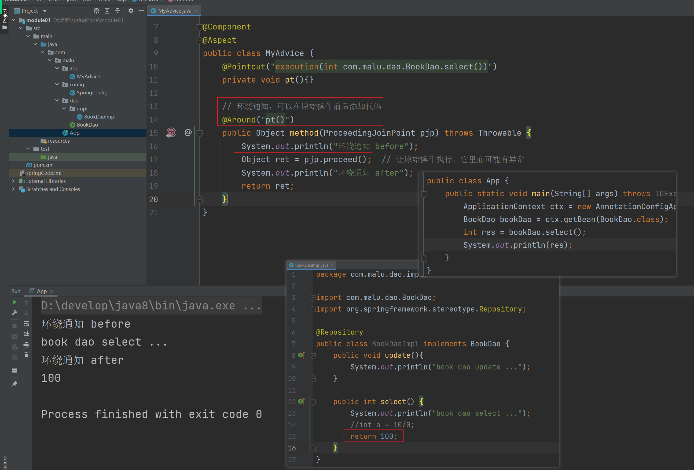


**环绕通知注意事项**

1. 环绕通知方法形参必须是ProceedingJoinPoint，表示正在执行的连接点，使用该对象的proceed()方法表示对原始对象方法进行调用，返回值为原始对象方法的返回值。
2. 环绕通知方法的返回值建议写成Object类型，用于将原始对象方法的返回值进行返回，哪里使用代理对象就返回到哪里。
3. 由于无法预知原始方法运行后是否会抛出异常，因此环绕通知方法必须抛出Throwable对象


总结：

- 最常用的是环绕通知，因为它可以做到前置通知和后置通知的效果。
- 返回后通知和抛出异常后通知了解就OK。


## 十五，AOP案例

### 1，测试业务层接口万次执行效率


需求：任意业务层接口执行均可显示其执行效率（执行时长）


分析：

​	①：业务功能：业务层接口执行前后分别记录时间，求差值得到执行效率
​	②：通知类型选择前后均可以增强的类型——环绕通知


环境准备：

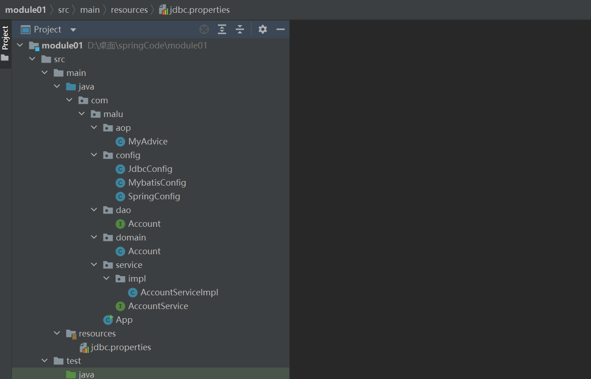


数据库：

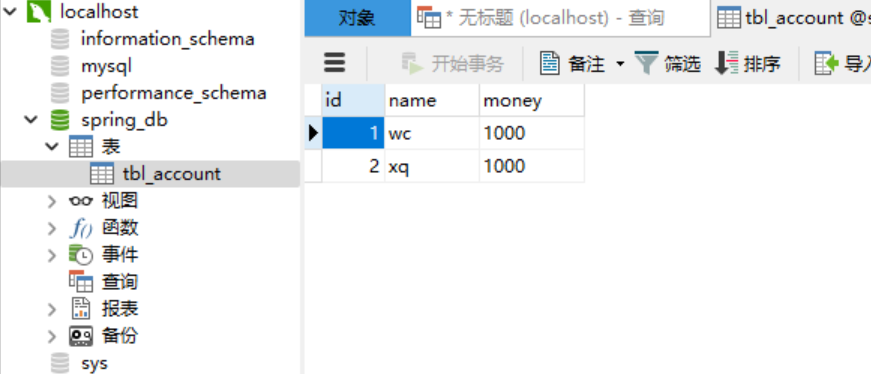


pom:

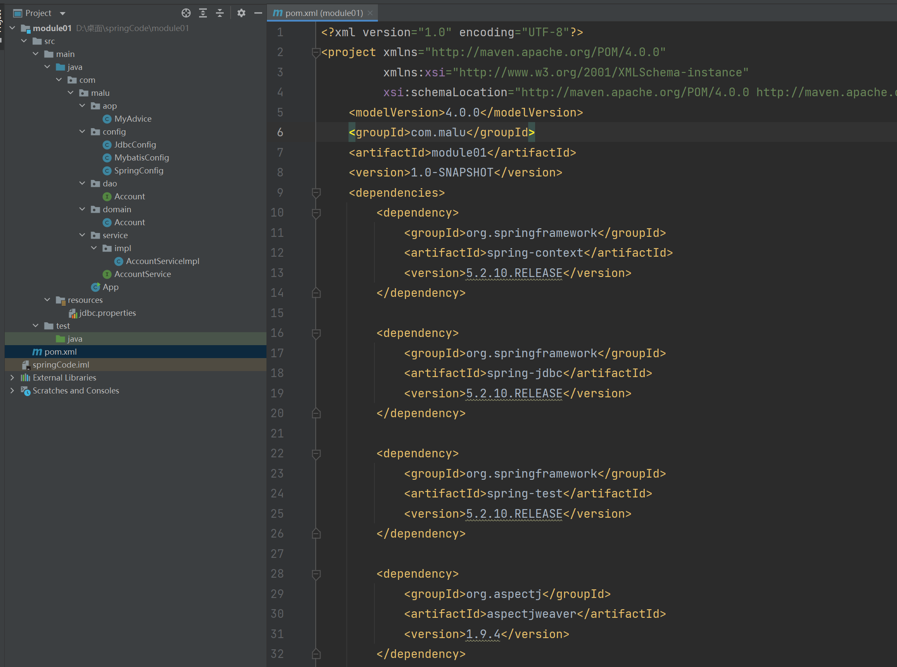

```xml
<?xml version="1.0" encoding="UTF-8"?>
<project xmlns="http://maven.apache.org/POM/4.0.0"
         xmlns:xsi="http://www.w3.org/2001/XMLSchema-instance"
         xsi:schemaLocation="http://maven.apache.org/POM/4.0.0 http://maven.apache.org/xsd/maven-4.0.0.xsd">
    <modelVersion>4.0.0</modelVersion>
    <groupId>com.malu</groupId>
    <artifactId>module01</artifactId>
    <version>1.0-SNAPSHOT</version>
    <dependencies>
        <dependency>
            <groupId>org.springframework</groupId>
            <artifactId>spring-context</artifactId>
            <version>5.2.10.RELEASE</version>
        </dependency>

        <dependency>
            <groupId>org.springframework</groupId>
            <artifactId>spring-jdbc</artifactId>
            <version>5.2.10.RELEASE</version>
        </dependency>

        <dependency>
            <groupId>org.springframework</groupId>
            <artifactId>spring-test</artifactId>
            <version>5.2.10.RELEASE</version>
        </dependency>

        <dependency>
            <groupId>org.aspectj</groupId>
            <artifactId>aspectjweaver</artifactId>
            <version>1.9.4</version>
        </dependency>

        <dependency>
            <groupId>mysql</groupId>
            <artifactId>mysql-connector-java</artifactId>
            <version>5.1.47</version>
        </dependency>

        <dependency>
            <groupId>com.alibaba</groupId>
            <artifactId>druid</artifactId>
            <version>1.1.16</version>
        </dependency>

        <dependency>
            <groupId>org.mybatis</groupId>
            <artifactId>mybatis</artifactId>
            <version>3.5.6</version>
        </dependency>

        <dependency>
            <groupId>org.mybatis</groupId>
            <artifactId>mybatis-spring</artifactId>
            <version>1.3.0</version>
        </dependency>

        <dependency>
            <groupId>junit</groupId>
            <artifactId>junit</artifactId>
            <version>4.12</version>
            <scope>test</scope>
        </dependency>
    </dependencies>
</project>
```


配置：

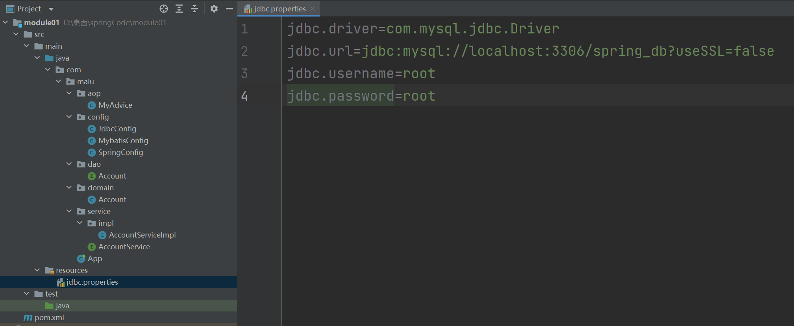

```properties
jdbc.driver=com.mysql.jdbc.Driver
jdbc.url=jdbc:mysql://localhost:3306/spring_db?useSSL=false
jdbc.username=root
jdbc.password=root
```


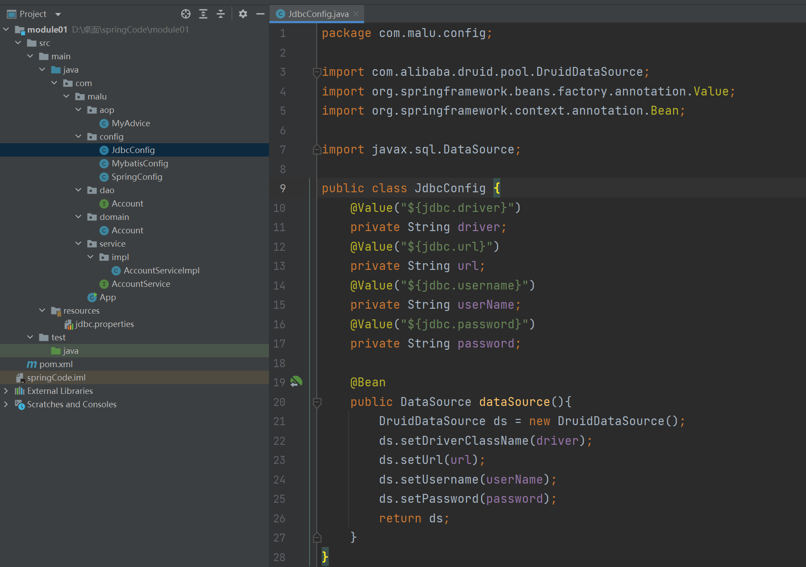

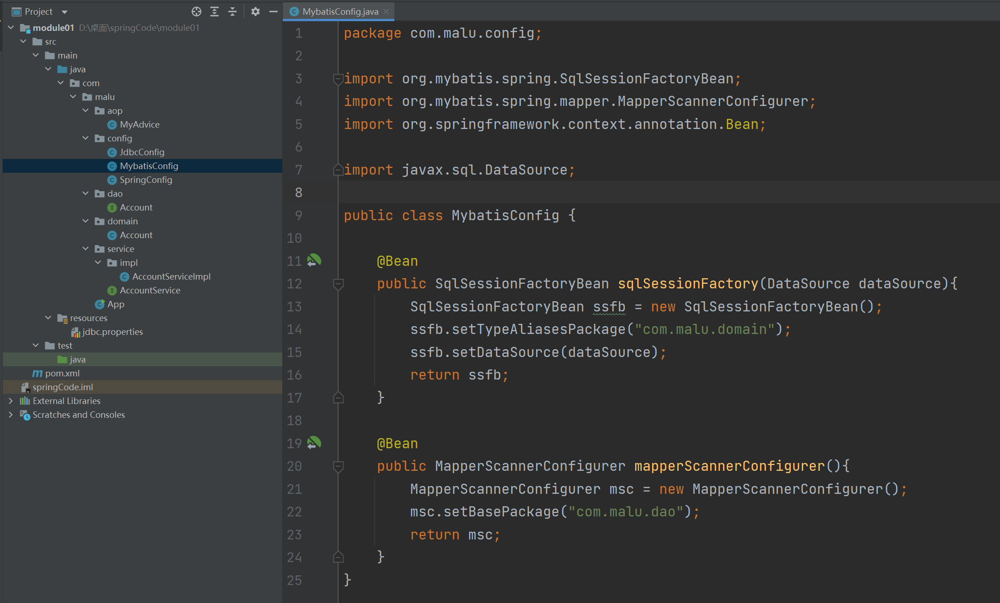

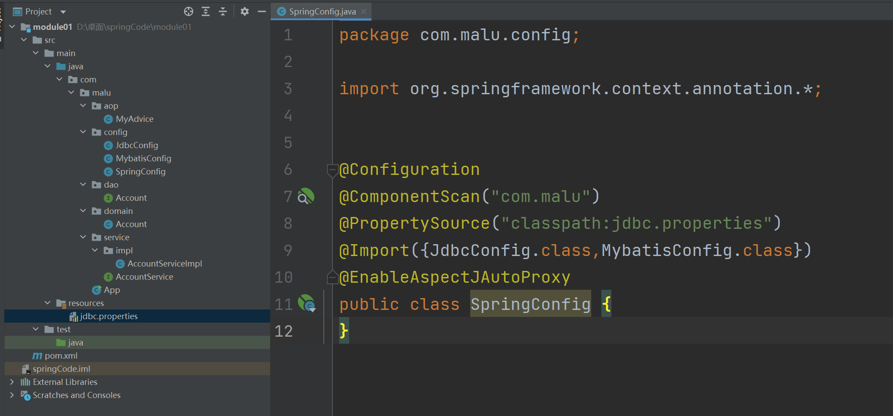

```java
public class JdbcConfig {
    @Value("${jdbc.driver}")
    private String driver;
    @Value("${jdbc.url}")
    private String url;
    @Value("${jdbc.username}")
    private String userName;
    @Value("${jdbc.password}")
    private String password;

    @Bean
    public DataSource dataSource(){
        DruidDataSource ds = new DruidDataSource();
        ds.setDriverClassName(driver);
        ds.setUrl(url);
        ds.setUsername(userName);
        ds.setPassword(password);
        return ds;
    }
}


public class MybatisConfig {

    @Bean
    public SqlSessionFactoryBean sqlSessionFactory(DataSource dataSource){
        SqlSessionFactoryBean ssfb = new SqlSessionFactoryBean();
        ssfb.setTypeAliasesPackage("com.malu.domain");
        ssfb.setDataSource(dataSource);
        return ssfb;
    }

    @Bean
    public MapperScannerConfigurer mapperScannerConfigurer(){
        MapperScannerConfigurer msc = new MapperScannerConfigurer();
        msc.setBasePackage("com.malu.dao");
        return msc;
    }
}

@Configuration
@ComponentScan("com.malu")
@PropertySource("classpath:jdbc.properties")
@Import({JdbcConfig.class,MybatisConfig.class})
@EnableAspectJAutoProxy
public class SpringConfig {
}
```


dao层：

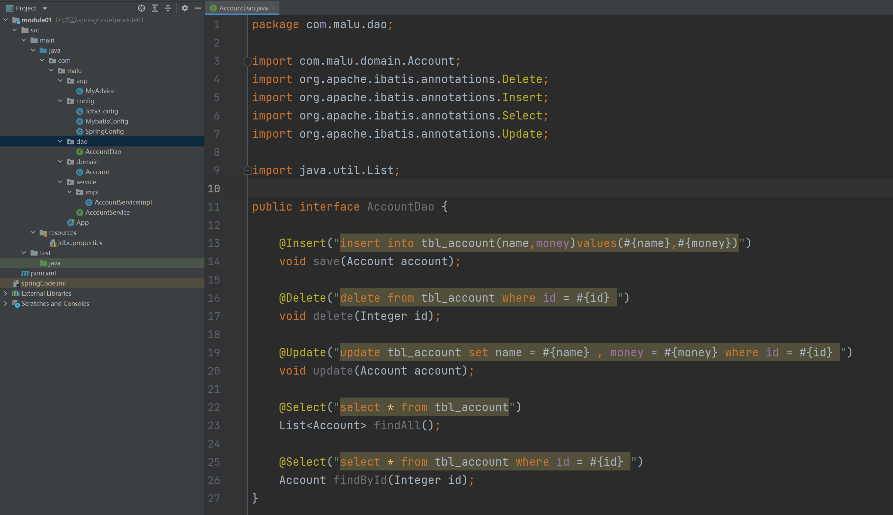

```java
public interface AccountDao {

    @Insert("insert into tbl_account(name,money)values(#{name},#{money})")
    void save(Account account);

    @Delete("delete from tbl_account where id = #{id} ")
    void delete(Integer id);

    @Update("update tbl_account set name = #{name} , money = #{money} where id = #{id} ")
    void update(Account account);

    @Select("select * from tbl_account")
    List<Account> findAll();

    @Select("select * from tbl_account where id = #{id} ")
    Account findById(Integer id);
}
```


service层：

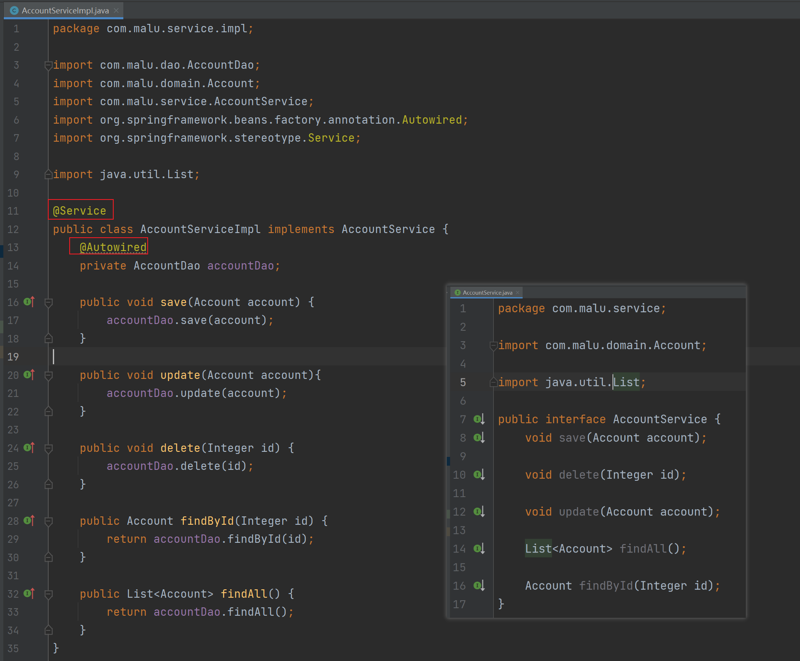

```java
public interface AccountService {

    void save(Account account);

    void delete(Integer id);

    void update(Account account);

    List<Account> findAll();

    Account findById(Integer id);

}

@Service
public class AccountServiceImpl implements AccountService {

    @Autowired
    private AccountDao accountDao;

    public void save(Account account) {
        accountDao.save(account);
    }

    public void update(Account account){
        accountDao.update(account);
    }

    public void delete(Integer id) {
        accountDao.delete(id);
    }

    public Account findById(Integer id) {
        return accountDao.findById(id);
    }

    public List<Account> findAll() {
        return accountDao.findAll();
    }
}
```


实体类：

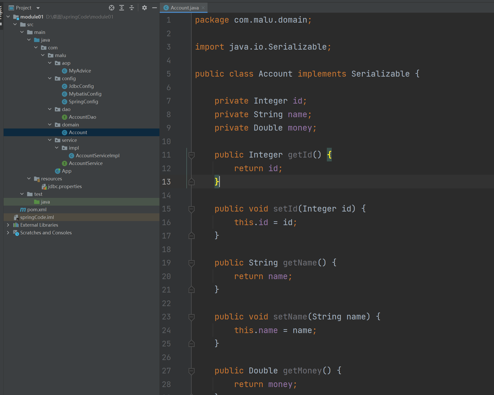

```java
public class Account implements Serializable {

    private Integer id;
    private String name;
    private Double money;

    public Integer getId() {
        return id;
    }

    public void setId(Integer id) {
        this.id = id;
    }

    public String getName() {
        return name;
    }

    public void setName(String name) {
        this.name = name;
    }

    public Double getMoney() {
        return money;
    }

    public void setMoney(Double money) {
        this.money = money;
    }

    @Override
    public String toString() {
        return "Account{" +
                "id=" + id +
                ", name='" + name + '\'' +
                ", money=" + money +
                '}';
    }
}
```


测试类：

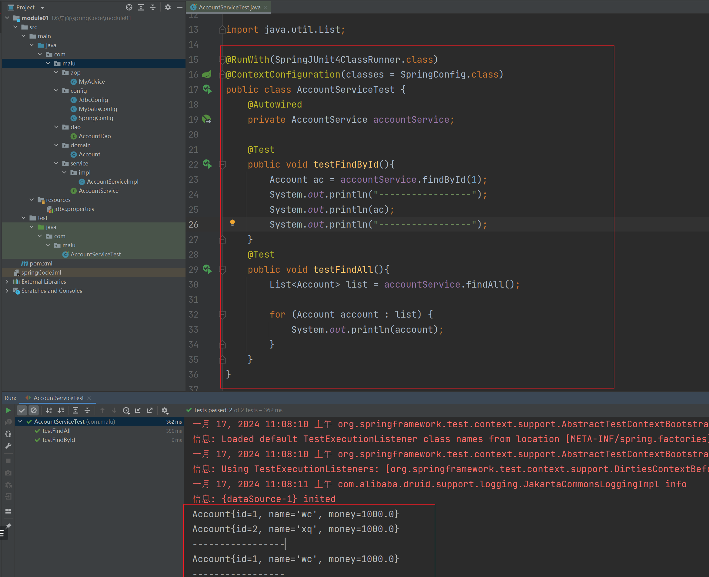

```java
@RunWith(SpringJUnit4ClassRunner.class)
@ContextConfiguration(classes = SpringConfig.class)
public class AccountServiceTest {
    @Autowired
    private AccountService accountService;

    @Test
    public void testFindById(){
        Account ac = accountService.findById(1);
        System.out.println("-----------------");
        System.out.println(ac);
        System.out.println("-----------------");
    }
    @Test
    public void testFindAll(){
        List<Account> list = accountService.findAll();

        for (Account account : list) {
            System.out.println(account);
        }
    }
}
```


实现流程：

1. 【第一步】编写通知类

   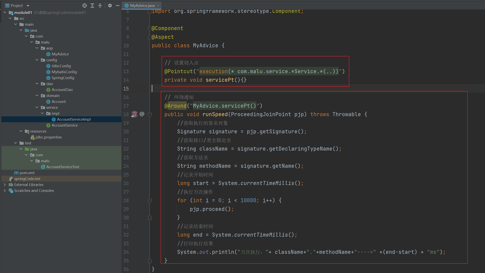

   ```java
   @Component
   @Aspect
   public class MyAdvice {
   
       // 设置切入点
       @Pointcut("execution(* com.malu.service.*Service.*(..))")
       private void servicePt(){}
   
       // 环绕通知
       @Around("MyAdvice.servicePt()")
       public void runSpeed(ProceedingJoinPoint pjp) throws Throwable {
           //获取执行的签名对象
           Signature signature = pjp.getSignature();
           //获取接口/类全限定名
           String className = signature.getDeclaringTypeName();
           //获取方法名
           String methodName = signature.getName();
           //记录开始时间
           long start = System.currentTimeMillis();
           //执行万次操作
           for (int i = 0; i < 10000; i++) {
               pjp.proceed();
           }
           //记录结束时间
           long end = System.currentTimeMillis();
           //打印执行结果
           System.out.println("万次执行："+ className+"."+methodName+"---->" +(end-start) + "ms");
       }
   }
   ```

2. 【第二步】在SpringConfig配置类上开启AOP注解功能

   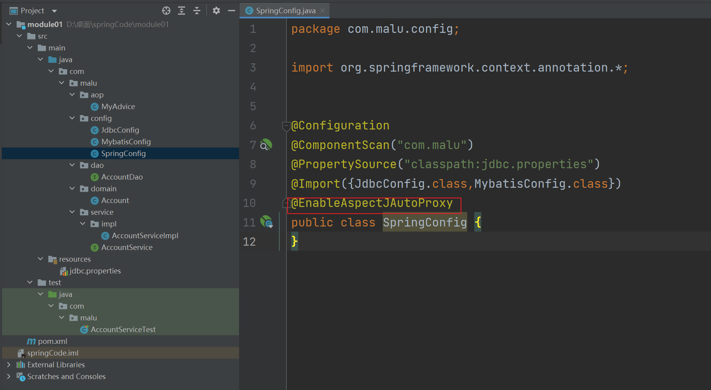

   ```java
   @Configuration
   @ComponentScan("com.malu")
   @PropertySource("classpath:jdbc.properties")
   @Import({JdbcConfig.class,MybatisConfig.class})
   @EnableAspectJAutoProxy //开启AOP注解功能
   public class SpringConfig {
   }
   ```

3. 【第三步】运行测试类，查看结果

   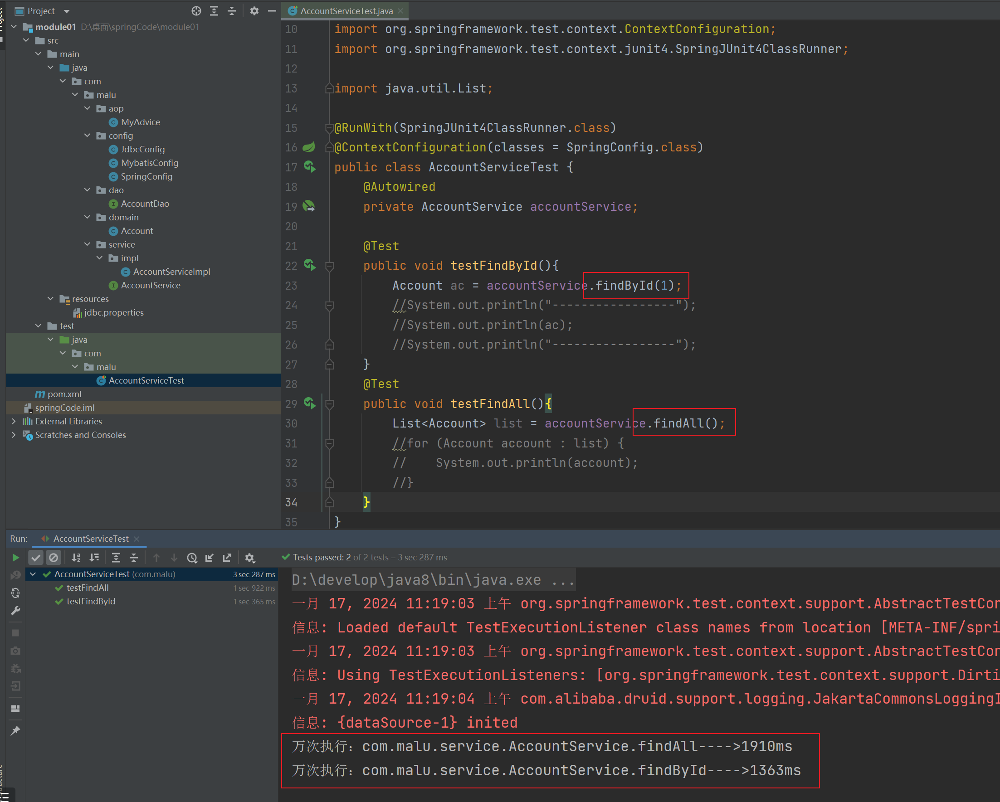

   ```java
   @RunWith(SpringJUnit4ClassRunner.class)
   @ContextConfiguration(classes = SpringConfig.class)
   public class AccountServiceTestCase {
       @Autowired
       private AccountService accountService;
       @Test
       public void testFindById(){
           Account account = accountService.findById(2);
       }
       @Test
       public void testFindAll(){
           List<Account> list = accountService.findAll();
       }
   }
   ```


### 2，AOP切入点数据获取


准备工作：

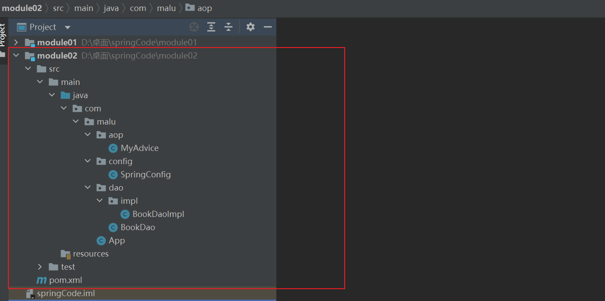


pom:

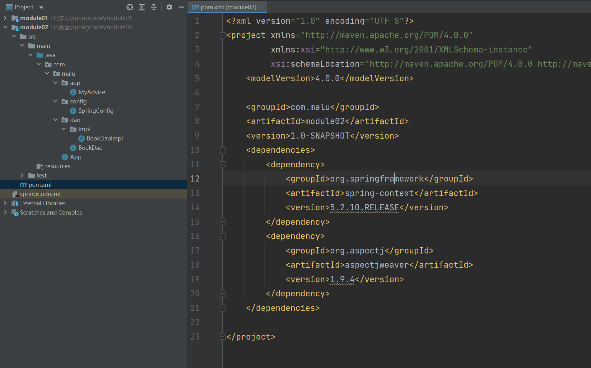

```xml
<?xml version="1.0" encoding="UTF-8"?>
<project xmlns="http://maven.apache.org/POM/4.0.0"
         xmlns:xsi="http://www.w3.org/2001/XMLSchema-instance"
         xsi:schemaLocation="http://maven.apache.org/POM/4.0.0 http://maven.apache.org/xsd/maven-4.0.0.xsd">
    <modelVersion>4.0.0</modelVersion>

    <groupId>com.malu</groupId>
    <artifactId>module02</artifactId>
    <version>1.0-SNAPSHOT</version>
    <dependencies>
        <dependency>
            <groupId>org.springframework</groupId>
            <artifactId>spring-context</artifactId>
            <version>5.2.10.RELEASE</version>
        </dependency>
        <dependency>
            <groupId>org.aspectj</groupId>
            <artifactId>aspectjweaver</artifactId>
            <version>1.9.4</version>
        </dependency>
    </dependencies>

</project>
```


配置：

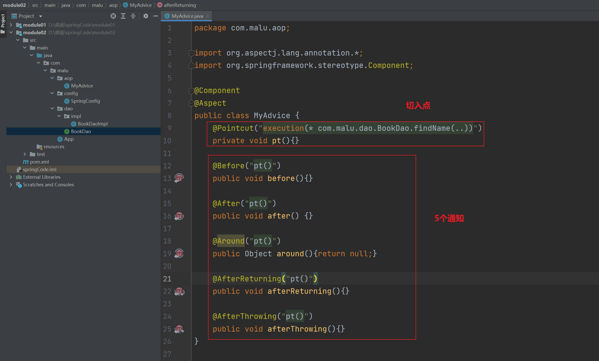

```java
@Component
@Aspect
public class MyAdvice {
    @Pointcut("execution(* com.malu.dao.BookDao.findName(..))")
    private void pt(){}

    @Before("pt()")
    public void before(){}

    @After("pt()")
    public void after() {}

    @Around("pt()")
    public Object around(){return null;}

    @AfterReturning("pt()")
    public void afterReturning(){}

    @AfterThrowing("pt()")
    public void afterThrowing(){}
}
```


Spring的核心配置：

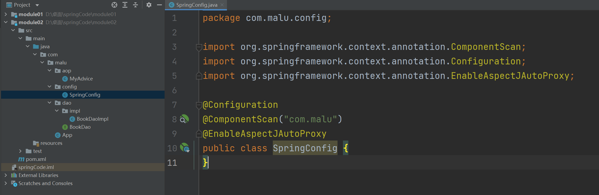

```java
@Configuration
@ComponentScan("com.malu")
@EnableAspectJAutoProxy
public class SpringConfig {
}
```


dao层：

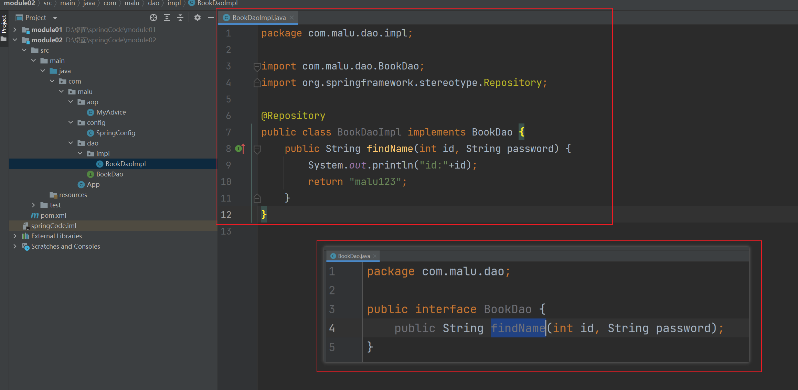

```java
public interface BookDao {
    public String findName(int id, String password);
}

@Repository
public class BookDaoImpl implements BookDao {

    public String findName(int id,String password) {
        System.out.println("id:"+id);
        //if(true)throw new NullPointerException();
        return "malu";
    }
}
```


入口：

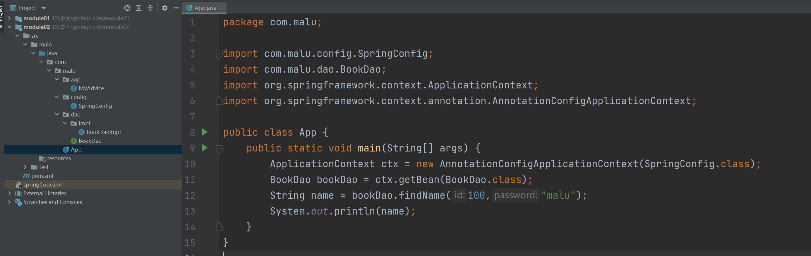

```java
public class App {
    public static void main(String[] args) {
        ApplicationContext ctx = new AnnotationConfigApplicationContext(SpringConfig.class);
        BookDao bookDao = ctx.getBean(BookDao.class);
        String name = bookDao.findName(100,"malu");
        System.out.println(name);
    }
}

```


#### 2.1 获取参数

在前置通知和环绕通知中都可以获取到连接点方法的参数们。JoinPoint对象描述了连接点方法的运行状态，可以获取到原始方法的调用参数

- JoinPoint:  适用于前置，后置，返回后，抛出异常后通知
- ProceedingJoinPoint：适用于环绕通知


完善通知类，如下：

```java
@Component
@Aspect
public class MyAdvice {
    @Pointcut("execution(* com.malu.dao.BookDao.findName(..))")
    private void pt(){}

    //@Before("pt()")
    public void before(JoinPoint jp){
        // JoinPoint: 适用于前置，后置，返回后，抛出异常后通知
        // ProceedingJoinPoint：适用于环绕通知
        Object[] args = jp.getArgs(); //获取连接点方法的参数们
        System.out.println(Arrays.toString(args));
        System.out.println("before advice...");
    }

    //@After("pt()")
    public void after(JoinPoint jp) {
        Object[] args = jp.getArgs(); //获取连接点方法的参数们
        System.out.println(Arrays.toString(args));
        System.out.println("after advice...");
    }

    //@Around("pt()")
    public Object around(ProceedingJoinPoint pjp) throws Throwable {
        Object[] args = pjp.getArgs();
        System.out.println(Arrays.toString(args));
        Object ret = pjp.proceed(args);
        System.out.println("around advice...");
        return  ret;
    }

    //@AfterReturning("pt()")
    public void afterReturning(JoinPoint jp){
        Object[] args = jp.getArgs(); //获取连接点方法的参数们
        System.out.println(Arrays.toString(args));
        System.out.println("afterReturning advice...");
    }

    //@AfterThrowing("pt()")
    public void afterThrowing(JoinPoint jp){
        Object[] args = jp.getArgs(); //获取连接点方法的参数们
        System.out.println(Arrays.toString(args));
        System.out.println("afterThrowing advice...");
    }
}
```


一个个测试：

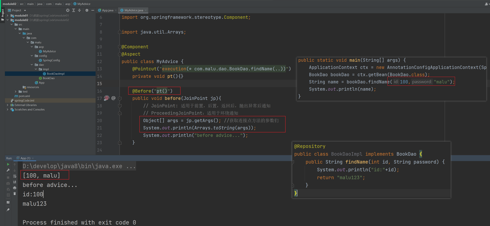

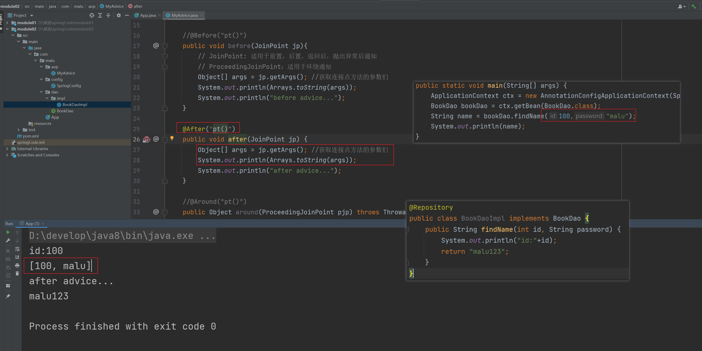

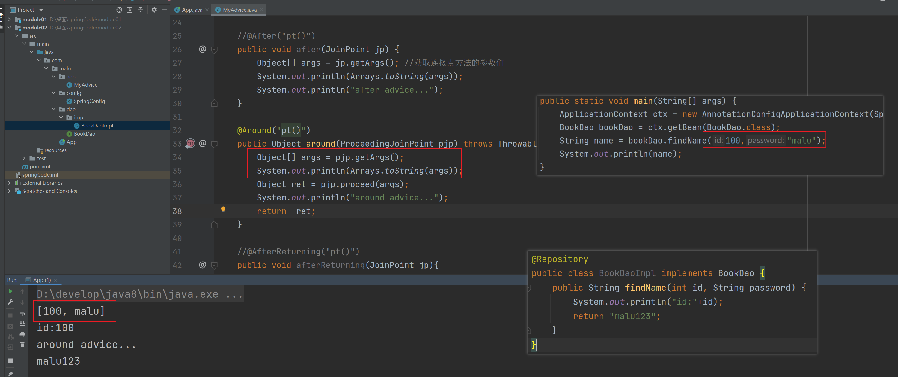

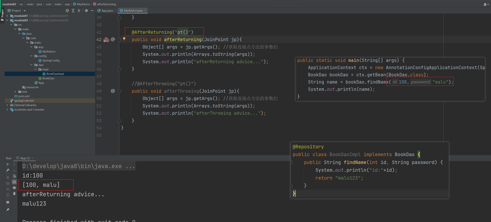

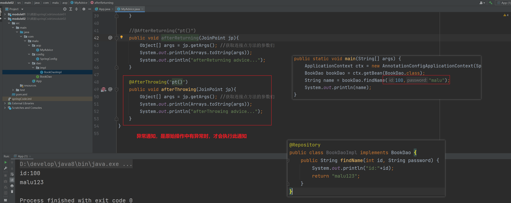


ProccedJointPoint是JoinPoint的子类

```java
@Around("pt()")
public Object around(ProceedingJoinPoint pjp) throws Throwable {
    Object[] args = pjp.getArgs(); //获取连接点方法的参数们
    System.out.println(Arrays.toString(args));
    Object ret = pjp.proceed();
    return ret;
}
```


#### 2.2 获取返回值

在返回后通知和环绕通知中都可以获取到连接点方法的返回值，抛出异常后通知可以获取切入点方法中出现的异常信息，使用形参可以接收对应的异常对象

```java
@AfterReturning(value = "pt()",returning = "ret")
public void afterReturning(String ret) { //变量名要和returning="ret"的属性值一致
    System.out.println("afterReturning advice ..."+ret);
}
```


演示：

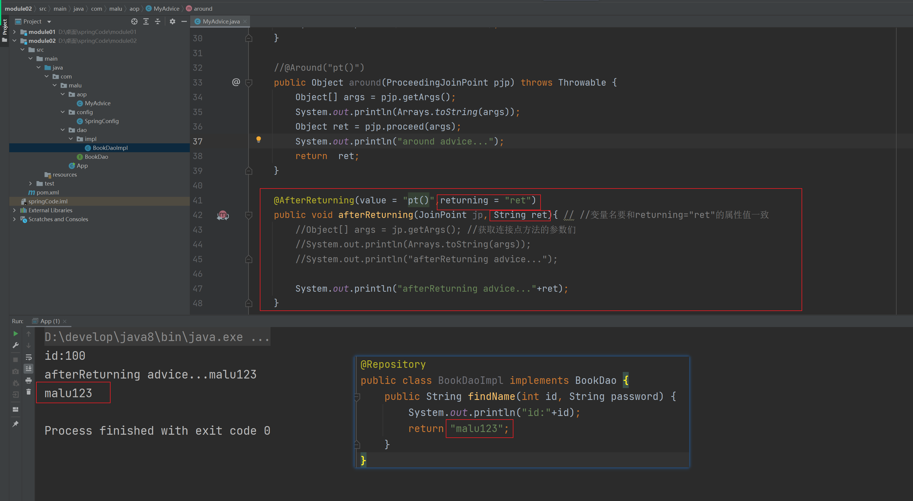


环绕通知中可以手工书写对原始方法的调用，得到的结果即为原始方法的返回值

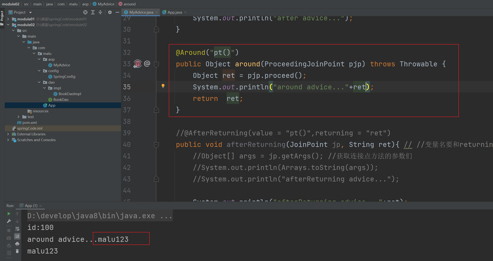

```java
@Around("pt()")
public Object around(ProceedingJoinPoint pjp) throws Throwable {
    // 手动调用连接点方法，返回值就是连接点方法的返回值
    Object ret = pjp.proceed();
    return ret;
}
```


#### 2.4 获取异常

在抛出异常后通知和环绕通知中都可以获取到连接点方法中出现的异常，抛出异常后通知可以获取切入点方法中出现的异常信息，使用形参可以接收对应的异常对象

```java
@AfterThrowing(value = "pt()",throwing = "t")
public void afterThrowing(Throwable t) {//变量名要和throwing = "t"的属性值一致
    System.out.println("afterThrowing advice ..."+ t);
}
```


演示：

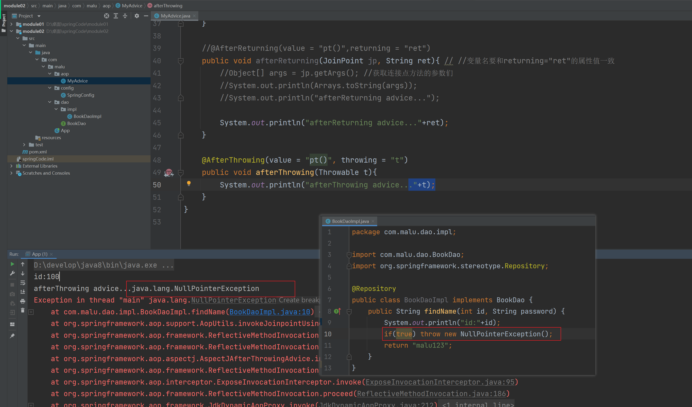


抛出异常后通知可以获取切入点方法运行的异常信息，使用形参可以接收运行时抛出的异常对象

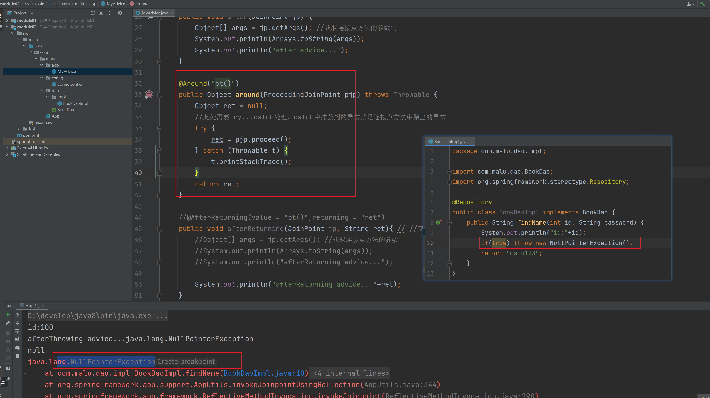

```java
@Around("pt()")
public Object around(ProceedingJoinPoint pjp)  {
    Object ret = null;
    //此处需要try...catch处理，catch中捕获到的异常就是连接点方法中抛出的异常
    try {
        ret = pjp.proceed();
    } catch (Throwable t) {
        t.printStackTrace();
    }
    return ret;
}
```


### 3，AOP开发总结


**作用：**

- 在不惊动原始设计的基础上为方法进行功能增强

  

**核心概念：**

- 代理（Proxy）：SpringAOP的核心本质是采用代理模式实现的
- 连接点（JoinPoint）：	在SpringAOP中，理解为任意方法的执行
- 切入点（Pointcut）：匹配连接点的式子，也是具有共性功能的方法描述
- 通知（Advice）：若干个方法的共性功能，在切入点处执行，最终体现为一个方法
- 切面（Aspect）：描述通知与切入点的对应关系
- 目标对象（Target）：被代理的原始对象成为目标对象


**切入点表达式语法:**

- 切入点表达式标准格式：动作关键字(访问修饰符  返回值  包名.类/接口名.方法名（参数）异常名)

  - execution(* com.malu.service.* Service.*(..))

- 切入点表达式描述通配符：

  - 作用：用于快速描述，范围描述
  - *：匹配任意符号（常用）
  - .. ：匹配多个连续的任意符号（常用）
  - +：匹配子类类型

- 切入点表达式书写技巧

  1.按标准规范开发
  2.查询操作的返回值建议使用\*匹配
  3.减少使用..的形式描述包
  4.对接口进行描述，使用\*表示模块名，例如UserService的匹配描述为*Service
  5.方法名书写保留动词，例如get，使用\*表示名词，例如getById匹配描述为getBy\*
  6.参数根据实际情况灵活调整


**五种通知类型：**

- 前置通知
- 后置通知
- 环绕通知（重点）
  - 环绕通知依赖形参ProceedingJoinPoint才能实现对原始方法的调用
  - 环绕通知可以隔离原始方法的调用执行
  - 环绕通知返回值设置为Object类型
  - 环绕通知中可以对原始方法调用过程中出现的异常进行处理
- 返回后通知
- 抛出异常后通知


## 十六，Spring事务管理


### 1，Spring声明式事务

事务作用是在数据层保障一系列的数据库操作同成功同失败。Spring事务作用是在数据层或业务层保障一系列的数据库操作同成功同失败。


我们通过一个转账案例来介绍一下Spring中的事务。需求是实现任意两个账户间转账操作，也就是A账户减钱，B账户加钱。分析：

1. 数据层提供基础操作，指定账户减钱（outMoney），指定账户加钱（inMoney）
2. 业务层提供转账操作（transfer），调用减钱与加钱的操作
3. 提供2个账号和操作金额执行转账操作
4. 基于Spring整合MyBatis环境搭建上述操作


结果分析：

1. 程序正常执行时，账户金额A减B加，没有问题
2. 程序出现异常后，转账失败，但是异常之前操作成功，异常之后操作失败，整体业务失败


准备工作：

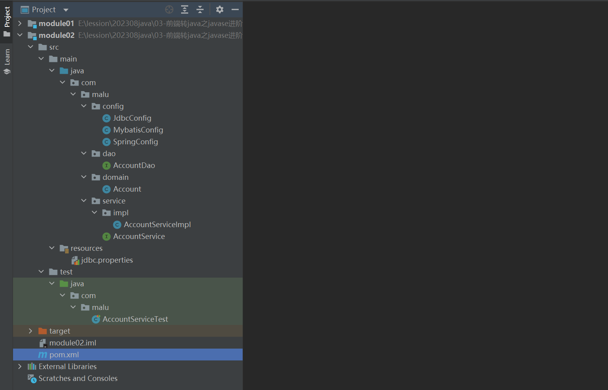


pom：

```xml
<dependencies>
    <dependency>
        <groupId>org.springframework</groupId>
        <artifactId>spring-context</artifactId>
        <version>5.2.10.RELEASE</version>
    </dependency>
    <dependency>
        <groupId>com.alibaba</groupId>
        <artifactId>druid</artifactId>
        <version>1.1.16</version>
    </dependency>

    <dependency>
        <groupId>org.mybatis</groupId>
        <artifactId>mybatis</artifactId>
        <version>3.5.6</version>
    </dependency>

    <dependency>
        <groupId>mysql</groupId>
        <artifactId>mysql-connector-java</artifactId>
        <version>5.1.47</version>
    </dependency>

    <dependency>
        <groupId>org.springframework</groupId>
        <artifactId>spring-jdbc</artifactId>
        <version>5.2.10.RELEASE</version>
    </dependency>

    <dependency>
        <groupId>org.mybatis</groupId>
        <artifactId>mybatis-spring</artifactId>
        <version>1.3.0</version>
    </dependency>

    <dependency>
        <groupId>junit</groupId>
        <artifactId>junit</artifactId>
        <version>4.12</version>
        <scope>test</scope>
    </dependency>

    <dependency>
        <groupId>org.springframework</groupId>
        <artifactId>spring-test</artifactId>
        <version>5.2.10.RELEASE</version>
    </dependency>
</dependencies>
```

配置：

```properties
jdbc.driver=com.mysql.jdbc.Driver
jdbc.url=jdbc:mysql://localhost:3306/spring_db?useSSL=false
jdbc.username=root
jdbc.password=root
```

```java
public class JdbcConfig {
    @Value("${jdbc.driver}")
    private String driver;
    @Value("${jdbc.url}")
    private String url;
    @Value("${jdbc.username}")
    private String userName;
    @Value("${jdbc.password}")
    private String password;

    @Bean
    public DataSource dataSource(){
        DruidDataSource ds = new DruidDataSource();
        ds.setDriverClassName(driver);
        ds.setUrl(url);
        ds.setUsername(userName);
        ds.setPassword(password);
        return ds;
    }

    //配置事务管理器，mybatis使用的是jdbc事务
    @Bean
    public PlatformTransactionManager transactionManager(DataSource dataSource){
        DataSourceTransactionManager transactionManager = new DataSourceTransactionManager();
        transactionManager.setDataSource(dataSource);
        return transactionManager;
    }

}


public class MybatisConfig {

    @Bean
    public SqlSessionFactoryBean sqlSessionFactory(DataSource dataSource){
        SqlSessionFactoryBean ssfb = new SqlSessionFactoryBean();
        ssfb.setTypeAliasesPackage("com.malu.domain");
        ssfb.setDataSource(dataSource);
        return ssfb;
    }

    @Bean
    public MapperScannerConfigurer mapperScannerConfigurer(){
        MapperScannerConfigurer msc = new MapperScannerConfigurer();
        msc.setBasePackage("com.malu.dao");
        return msc;
    }
}


@Configuration
@ComponentScan("com.malu")
@PropertySource("classpath:jdbc.properties")
@Import({JdbcConfig.class,MybatisConfig.class})
//开启注解式事务驱动
@EnableTransactionManagement
public class SpringConfig {
}
```


dao层和service层：

```java
public interface AccountDao {

    @Update("update tbl_account set money = money + #{money} where name = #{name}")
    void inMoney(@Param("name") String name, @Param("money") Double money);

    @Update("update tbl_account set money = money - #{money} where name = #{name}")
    void outMoney(@Param("name") String name, @Param("money") Double money);
}

public interface AccountService {
    /**
     * 转账操作
     * @param out 传出方
     * @param in 转入方
     * @param money 金额
     */
    //配置当前接口方法具有事务
    //@Transactional
    public void transfer(String out, String in, Double money) ;
}


@Service
public class AccountServiceImpl implements AccountService {

    @Autowired
    private AccountDao accountDao;

    public void transfer(String out,String in ,Double money) {
        accountDao.outMoney(out,money);
        //int i = 1/0;
        accountDao.inMoney(in,money);
    }

}
```


实体类：

```java
public class Account implements Serializable {

    private Integer id;
    private String name;
    private Double money;

    public Integer getId() {
        return id;
    }

    public void setId(Integer id) {
        this.id = id;
    }

    public String getName() {
        return name;
    }

    public void setName(String name) {
        this.name = name;
    }

    public Double getMoney() {
        return money;
    }

    public void setMoney(Double money) {
        this.money = money;
    }

    @Override
    public String toString() {
        return "Account{" +
                "id=" + id +
                ", name='" + name + '\'' +
                ", money=" + money +
                '}';
    }
}
```


测试：

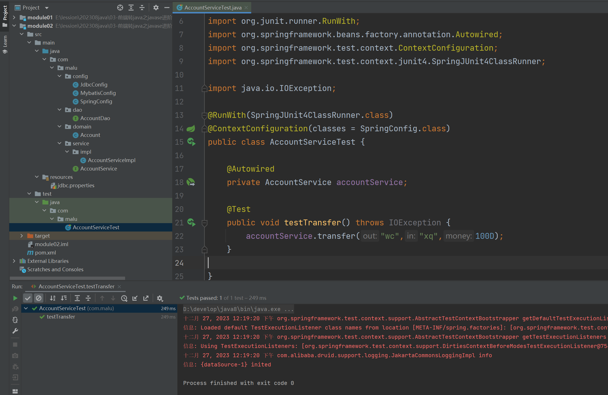


```java
@RunWith(SpringJUnit4ClassRunner.class)
@ContextConfiguration(classes = SpringConfig.class)
public class AccountServiceTest {

    @Autowired
    private AccountService accountService;

    @Test
    public void testTransfer() throws IOException {
        accountService.transfer("wc","xq",100D);
    }

}
```


看结果：

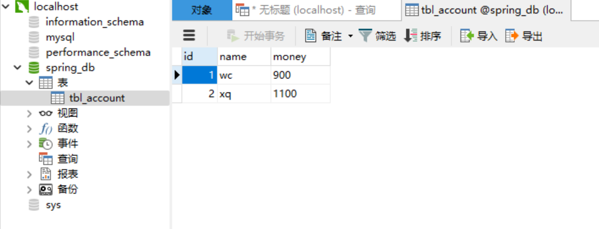


如果出现异常了，如下：

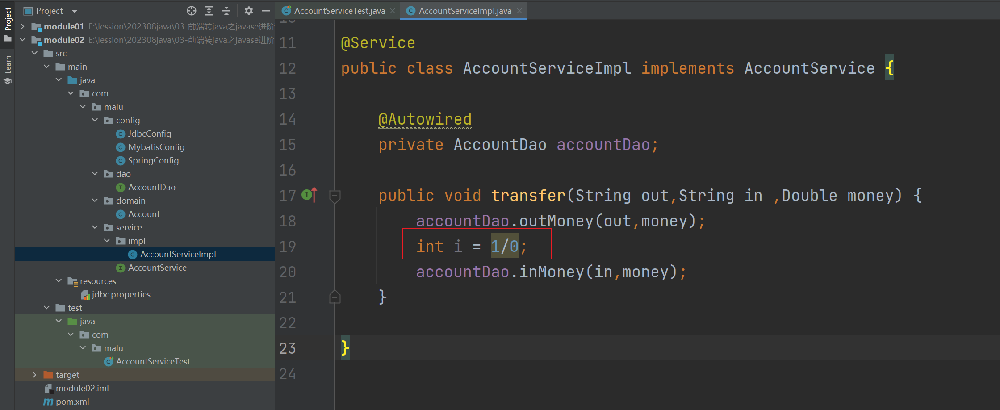


运行看结果：

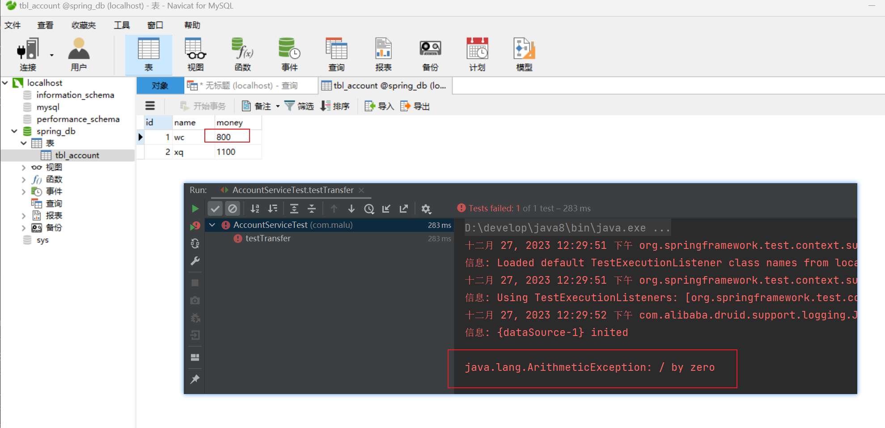


在业务层接口上添加Spring事务管理：

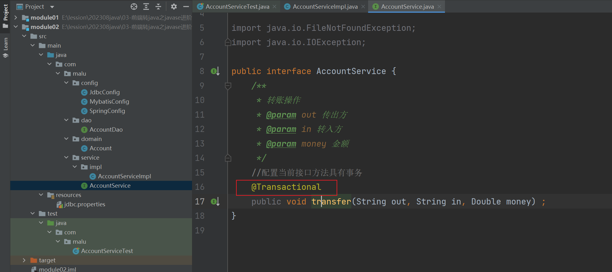


注意事项

1. Spring注解式事务通常添加在业务层接口中而不会添加到业务层实现类中，降低耦合
2. 注解式事务可以添加到业务方法上表示当前方法开启事务，也可以添加到接口上表示当前接口所有方法开启事务


设置事务管理器(将事务管理器添加到IOC容器中)，在JdbcConfig中配置事务管理器

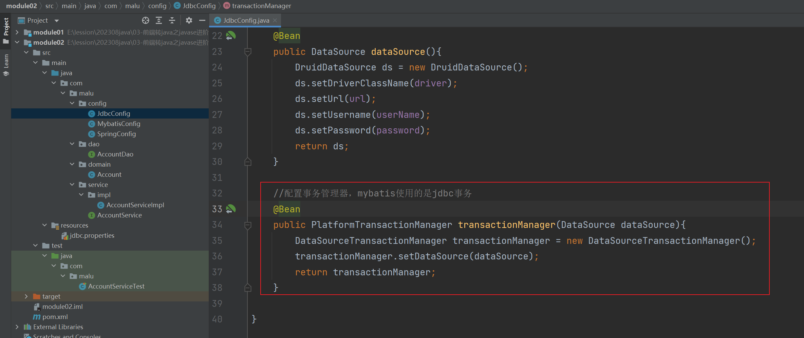


注意事项

1. 事务管理器要根据实现技术进行选择
2. MyBatis框架使用的是JDBC事务


开启注解式事务驱动：

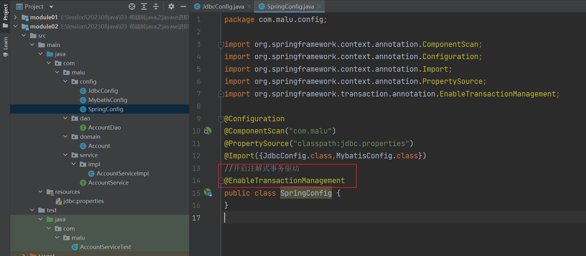


再去运行看结果：

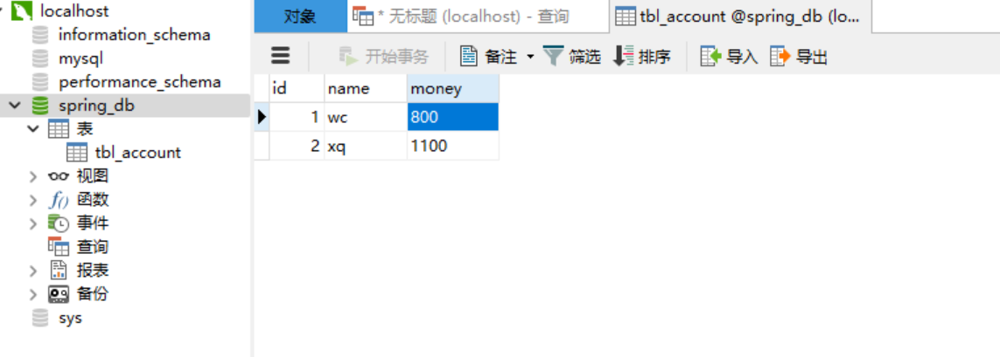


把异常代码注释掉，再去测试：

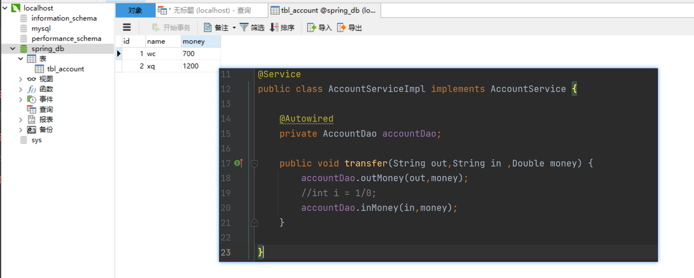


注意细节：

- 创建表时，使用innodb存储引擎，默认的存储引擎不支持事务。

  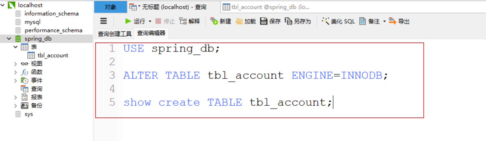


