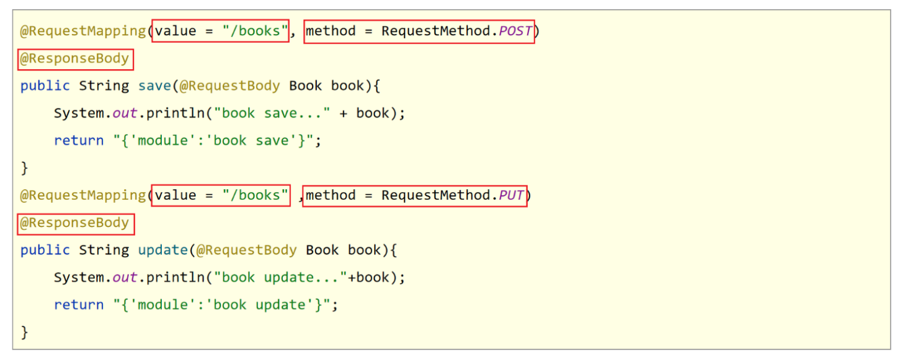
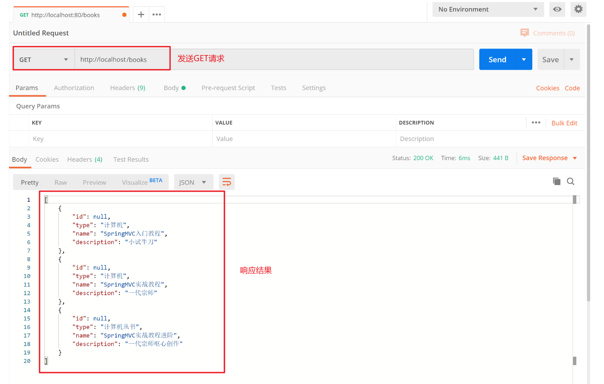
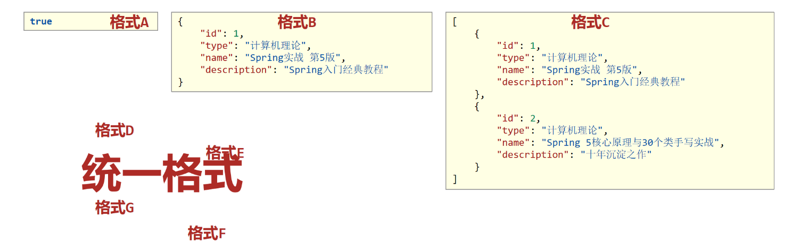
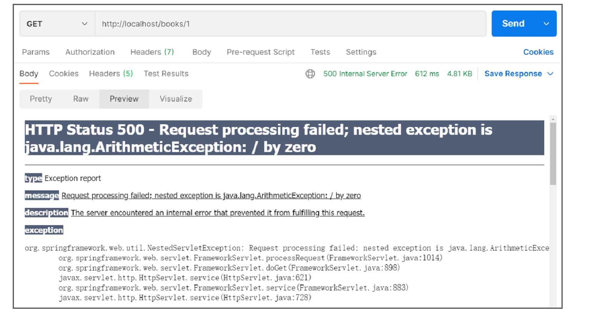
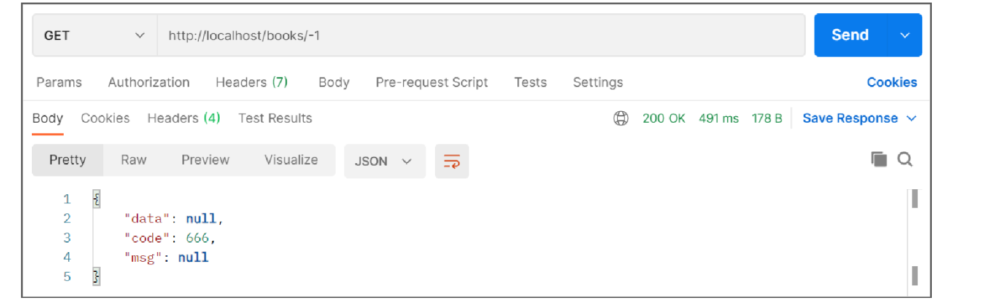
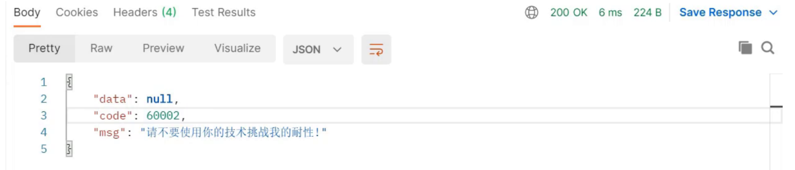
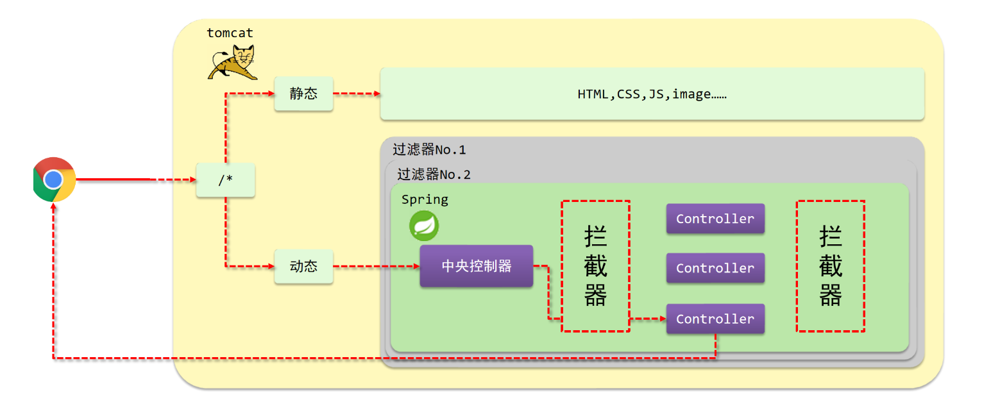
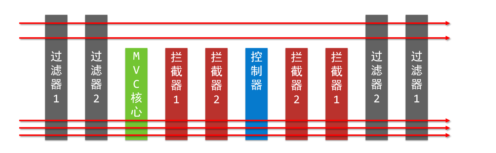
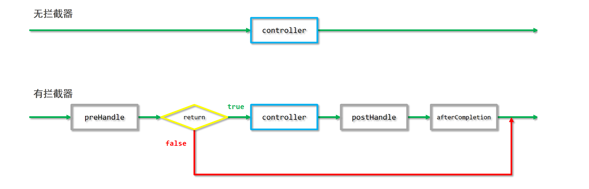
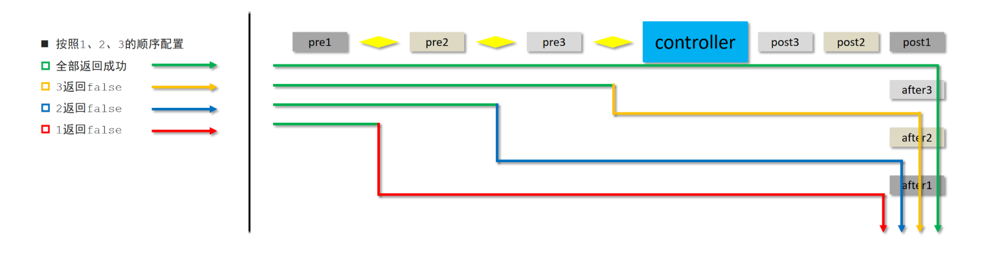

## 一，SpringMVC快速入门


### 1，SpringMVC介绍

SpringMVC隶属于Spring，是Spring技术中的一部分。SpringMVC与Servlet技术功能等同，均属于web层或者说表现层开发技术。SpringMVC与Servlet相比，开发起来更简单快捷，用更少的代码完成表现层代码的开发。SpringMVC是用来替换Servlet的，所以Servlet能实现的，SpringMVC就能实现。SpringMVC的知识点有：

- 请求与响应：SpringMVC主要的作用就是用来接收前端发过来的请求和数据然后经过处理并将处理的结果响应给前端，所以如何处理请求和响应是SpringMVC中非常重要的一块内容。
- REST风格：是一种软件架构风格，可以降低开发的复杂性，提高系统的可伸缩性，在以后开发中非常重要和常用。
- SSM整合：是把咱们所学习的SpringMVC+Spring+Mybatis整合在一起来完成业务开发，是对我们所学习这三个框架的一个综合应用。
- 拦截器：是SpringMVC中的一个小知识点。


**三层架构工作流程：**

1. web程序通过浏览器访问前端页面，发送异步请求到后端服务器

2. 后台服务器采用三层架构进行功能开发

   a. 表现层负责接收请求和数据然后将数据转交给业务层  <br/>

   b. 业务层负责调用数据层完成数据库表的增删改查，并将结果返给表现层 <br/>

   c. 表现层将数据转换成json格式返回给前端 <br/>

3. 前端页面将数据进行解析最终展示给用户


**表现层与数据层的技术选型:**

- 数据层采用Mybatis框架
- 表现层采用SpringMVC框架，主要负责内容
  - controller如何接收请求和数据
  - 如何将请求和数据转发给业务层
  - 如何将响应数据转换成json发回到前端


总结：

- SpringMVC是一种基于Java实现MVC模型的轻量级Web框架
- 相比于Servlet，使用更加简单、开发更加便捷，灵活性强。


### 2，Spring入门案例


回顾以前Servlet开发流程：

1. 浏览器发送请求到Tomcat服务器
2. Tomcat服务器接收到请求后，会根据请求路径来匹配对应的Servlet,并将请求交给对应的Servlet来处理
3. 对于Servlet来说，我们主要完成的是Servlet类的开发以及对应路径的配置。


---------------


SpringMVC的开发流程：

1. 浏览器发送请求到Tomcat服务器
2. Tomcat服务器接收到请求后，会将请求交给SpringMVC中的DispatcherServlet[前端控制器]来处理请求
3. DispatcherServlet不真正处理请求，只是按照对应的规则将请求分发到对应的Bean对象
4. Bean对象是有我们自己编写来处理不同的请求，每个Bean中可以处理一个或多个不同的请求url
5. DispatcherServlet和Bean对象都需要交给Spring容器来进行管理


综上所述，需要我们编写的内容包含:

- Bean对象的编写
- 请求url和Bean对象对应关系的配置
- 构建Spring容器，将DispatcherServlet和Bean对象交给容器管理
- 配置Tomcat服务器，使其能够识别Spring容器，并将请求交给容器中的DispatcherServlet来分发请求


具体的实现步骤如下:

1. 创建web工程(Maven结构)并在工程的pom.xml添加SpringMVC和Servlet坐标

2. 创建SpringMVC控制器类(等同于Servlet功能)

3. 初始化SpringMVC环境(同Spring环境)，设定SpringMVC加载对应的bean

4. 初始化Servlet容器，加载SpringMVC环境，并设置SpringMVC技术处理的请求


#### 2.1 第一步

创建Maven项目，并导入对应的jar包，打开IDEA,创建一个新的web项目


因为使用骨架创建的项目结构不完整，需要手动补全


将pom.xml中多余的内容删除掉，再添加SpringMVC需要的依赖

```xml
<?xml version="1.0" encoding="UTF-8"?>
<project xmlns="http://maven.apache.org/POM/4.0.0" xmlns:xsi="http://www.w3.org/2001/XMLSchema-instance"
  xsi:schemaLocation="http://maven.apache.org/POM/4.0.0 http://maven.apache.org/xsd/maven-4.0.0.xsd">
  <modelVersion>4.0.0</modelVersion>
  <groupId>com.malu</groupId>
  <artifactId>springmvc_01_quickstart</artifactId>
  <version>1.0-SNAPSHOT</version>
  <packaging>war</packaging>
  <properties>
        <project.build.sourceEncoding>UTF-8</project.build.sourceEncoding>
        <maven.compiler.source>1.8</maven.compiler.source>
        <maven.compiler.target>1.8</maven.compiler.target>
   </properties>
   <!--1. 导入SpringMVC与servlet的坐标--> 
  <dependencies>
    <dependency>
      <groupId>javax.servlet</groupId>
      <artifactId>javax.servlet-api</artifactId>
      <version>3.1.0</version>
      <scope>provided</scope>
    </dependency>
    <dependency>
      <groupId>org.springframework</groupId>
      <artifactId>spring-webmvc</artifactId>
      <version>5.2.10.RELEASE</version>
    </dependency>
  </dependencies>

  <build>
    <plugins>
      <plugin>
        <groupId>org.apache.tomcat.maven</groupId>
        <artifactId>tomcat7-maven-plugin</artifactId>
        <version>2.1</version>
        <configuration>
          <port>80</port>
          <path>/</path>
        </configuration>
      </plugin>
    </plugins>
  </build>
</project>

```


servlet的坐标为什么需要添加`<scope>provided</scope>`?

- scope是maven中jar包依赖作用范围的描述，
- 如果不设置默认是`compile`在在编译、运行、测试时均有效
- 如果运行有效的话就会和tomcat中的servlet-api包发生冲突，导致启动报错
- provided代表的是该包只在编译和测试的时候用，运行的时候无效直接使用tomcat中的，就避免冲突


#### 2.2 第二步


创建控制器类

```java
//2.制作控制器类，等同于Servlet
//2.1必须是一个spring管理的bean
//2.2定义具体处理请求的方法
//2.3设置当前方法的访问路径
//2.4设置响应结果为json数据
@Controller
public class UserController {
    
    @RequestMapping("/save")
    @ResponseBody
    public String save(){
        System.out.println("user save ...");
        return "{'module':'springmvc'}";
    }
}

```


#### 2.3 第三步

创建配置类

```java
//3.定义配置类加载Controller对应的bean
@Configuration
@ComponentScan("com.malu.controller")
public class SpringMvcConfig {
}
```


#### 2.4 第四步

创建Tomcat的Servlet容器配置类

```java
//4.定义servlet容器的配置类
public class ServletContainersInitConfig extends AbstractDispatcherServletInitializer {
    //加载springMVC配置
    protected WebApplicationContext createServletApplicationContext() {
        //初始化WebApplicationContext对象
        AnnotationConfigWebApplicationContext ctx = new AnnotationConfigWebApplicationContext();
        //加载指定配置类
        ctx.register(SpringMvcConfig.class);
        return ctx;
    }

    //设置Tomcat接收的请求哪些归SpringMVC处理
    protected String[] getServletMappings() {
        return new String[]{"/"};
    }

    //设置spring相关配置
    protected WebApplicationContext createRootApplicationContext() {
        return null;
    }
}
```

Tomcat的Servlet容器配置总结：

- AbstractDispatcherServletInitializer类是SpringMVC提供的快速初始化Web3.0容器的抽象类
- AbstractDispatcherServletInitializer提供三个接口方法供用户实现
  - createRootApplicationContext()方法，如果创建Servlet容器时需要加载非SpringMVC对应的bean，使用当前方法进行，使用方式同createServletApplicationContext()。createRootApplicationContext用来加载Spring环境
  - createServletApplicationContext()方法，创建Servlet容器时，加载SpringMVC对应的bean并放入WebApplicationContext对象范围中，而WebApplicationContext的作用范围为ServletContext范围，即整个web容器范围。createServletApplicationContext用来加载SpringMVC环境
  - getServletMappings()方法，设定SpringMVC对应的请求映射路径，设置为/表示拦截所有请求，任意请求都将转入到SpringMVC进行处理


#### 2.5 第五步

配置Tomcat环境


#### 2.6 第六步

启动运行项目


#### 2.7 第七步

浏览器输入`http://localhost/save`进行访问，可以看得如下内容


用到的几个注解：

| 名称 | @Controller                   |
| ---- | ----------------------------- |
| 类型 | 类注解                        |
| 位置 | SpringMVC控制器类定义上方     |
| 作用 | 设定SpringMVC的核心控制器bean |


| 名称     | @RequestMapping                 |
| -------- | ------------------------------- |
| 类型     | 类注解或方法注解                |
| 位置     | SpringMVC控制器类或方法定义上方 |
| 作用     | 设置当前控制器方法请求访问路径  |
| 相关属性 | value(默认)，请求访问路径       |


| 名称 | @ResponseBody                                    |
| ---- | ------------------------------------------------ |
| 类型 | 类注解或方法注解                                 |
| 位置 | SpringMVC控制器类或方法定义上方                  |
| 作用 | 设置当前控制器方法响应内容为当前返回值，无需解析 |

### 3，入门案例流程分析


为了更好的使用SpringMVC,我们将SpringMVC的使用过程总共分两个阶段来分析，分别是`启动服务器初始化过程`和`单次请求过程`


**启动服务器初始化过程:**

1. 服务器启动，执行ServletContainersInitConfig类，初始化web容器
2. 执行createServletApplicationContext方法，创建了WebApplicationContext对象
   - 该方法加载SpringMVC的配置类SpringMvcConfig来初始化SpringMVC的容器
3. 加载SpringMvcConfig配置类
4. 执行@ComponentScan加载对应的bean
   - 扫描指定包下所有类上的注解，如Controller类上的@Controller注解
5. 加载UserController，每个@RequestMapping的名称对应一个具体的方法
   - 此时就建立了 `/save` 和 save方法的对应关系
6. 执行getServletMappings方法，定义所有的请求都通过SpringMVC
   - `/`代表所拦截请求的路径规则，只有被拦截后才能交给SpringMVC来处理请求


**单次请求过程:**

1. 发送请求localhost/save
2. web容器发现所有请求都经过SpringMVC，将请求交给SpringMVC处理
   - 因为符合上面第六步设置的请求路径，所以该请求会交给SpringMVC来处理
3. 解析请求路径/save
4. 由/save匹配执行对应的方法save(）
   - 上面的第五步已经将请求路径和方法建立了对应关系，通过/save就能找到对应的save方法
5. 执行save()
6. 检测到有@ResponseBody直接将save()方法的返回值作为响应求体返回给请求方


### 4，bean加载控制

入门案例的内容已经做完了，在入门案例中我们创建过一个`SpringMvcConfig`的配置类，再回想前面咱们学习Spring的时候也创建过一个配置类`SpringConfig`。这两个配置类都需要加载资源，那么它们分别都需要加载哪些内容?


现在我们项目的目录结构如下：


目录的解释说明：

- config目录存入的是配置类,写过的配置类有:
  - ServletContainersInitConfig
  - SpringConfig
  - SpringMvcConfig
  - JdbcConfig
  - MybatisConfig
- controller目录存放的是SpringMVC的controller类
- service目录存放的是service接口和实现类
- dao目录存放的是dao/Mapper接口


controller、service和dao这些类都需要被容器管理成bean对象，那么到底是该让SpringMVC加载还是让Spring加载呢?

- SpringMVC加载其相关bean(表现层bean),也就是controller包下的类
- Spring控制的bean
  - 业务bean(Service)
  - 功能bean(DataSource,SqlSessionFactoryBean,MapperScannerConfigurer等)


分析清楚谁该管哪些bean以后，接下来要解决的问题是如何让Spring和SpringMVC分开加载各自的内容。

- 在SpringMVC的配置类`SpringMvcConfig`中使用注解`@ComponentScan`，我们只需要将其扫描范围设置到controller即可。

  ```java
  @Configuration
  @ComponentScan("com.malu.controller")
  public class SpringMvcConfig{}
  ```

- 在Spring的配置类`SpringConfig`中使用注解`@ComponentScan`,当时扫描的范围中其实是已经包含了controller

  ```java
  @ComponentScan("com.malu")
  public class SpringConfig{}
  ```


从包结构来看的话，Spring已经多把SpringMVC的controller类也给扫描到，所以针对这个问题该如何解决，也就是说因为功能不同，如何避免Spring错误加载到SpringMVC的bean。针对上面的问题，解决方案也比较简单，就是:

- 加载Spring控制的bean的时候排除掉SpringMVC控制的备案


具体该如何排除，有两种方式来解决:

- 方式一:Spring加载的bean设定扫描范围为com.malu,排除掉controller包中的bean
- 方式二:Spring加载的bean设定扫描范围为精准范围，例如service包、dao包等
- 方式三:不区分Spring与SpringMVC的环境，加载到同一个环境中[了解即可]


开始演示，创建一个Web的Maven项目。pom.xml添加Spring依赖

```xml
<?xml version="1.0" encoding="UTF-8"?>

<project xmlns="http://maven.apache.org/POM/4.0.0" xmlns:xsi="http://www.w3.org/2001/XMLSchema-instance"
  xsi:schemaLocation="http://maven.apache.org/POM/4.0.0 http://maven.apache.org/xsd/maven-4.0.0.xsd">
  <modelVersion>4.0.0</modelVersion>

  <groupId>com.malu</groupId>
  <artifactId>springmvc_02_bean_load</artifactId>
  <version>1.0-SNAPSHOT</version>
  <packaging>war</packaging>

  <dependencies>
    <dependency>
      <groupId>javax.servlet</groupId>
      <artifactId>javax.servlet-api</artifactId>
      <version>3.1.0</version>
      <scope>provided</scope>
    </dependency>
    <dependency>
      <groupId>org.springframework</groupId>
      <artifactId>spring-webmvc</artifactId>
      <version>5.2.10.RELEASE</version>
    </dependency>
    <dependency>
      <groupId>com.alibaba</groupId>
      <artifactId>druid</artifactId>
      <version>1.1.16</version>
    </dependency>

    <dependency>
      <groupId>org.mybatis</groupId>
      <artifactId>mybatis</artifactId>
      <version>3.5.6</version>
    </dependency>

    <dependency>
      <groupId>mysql</groupId>
      <artifactId>mysql-connector-java</artifactId>
      <version>5.1.47</version>
    </dependency>

    <dependency>
      <groupId>org.springframework</groupId>
      <artifactId>spring-jdbc</artifactId>
      <version>5.2.10.RELEASE</version>
    </dependency>

    <dependency>
      <groupId>org.mybatis</groupId>
      <artifactId>mybatis-spring</artifactId>
      <version>1.3.0</version>
    </dependency>
  </dependencies>

  <build>
    <plugins>
      <plugin>
        <groupId>org.apache.tomcat.maven</groupId>
        <artifactId>tomcat7-maven-plugin</artifactId>
        <version>2.1</version>
        <configuration>
          <port>80</port>
          <path>/</path>
        </configuration>
      </plugin>
    </plugins>
  </build>
</project>
```


创建对应的配置类：

```java
public class ServletContainersInitConfig extends AbstractDispatcherServletInitializer {
    protected WebApplicationContext createServletApplicationContext() {
        AnnotationConfigWebApplicationContext ctx = new AnnotationConfigWebApplicationContext();
        ctx.register(SpringMvcConfig.class);
        return ctx;
    }
    protected String[] getServletMappings() {
        return new String[]{"/"};
    }
    protected WebApplicationContext createRootApplicationContext() {
      return null;
    }
}

@Configuration
@ComponentScan("com.malu.controller")
public class SpringMvcConfig {
}

@Configuration
@ComponentScan("com.malu")
public class SpringConfig {
}

```


编写Controller，Service，Dao，Domain类

```java
@Controller
public class UserController {

    @RequestMapping("/save")
    @ResponseBody
    public String save(){
        System.out.println("user save ...");
        return "{'info':'springmvc'}";
    }
}

public interface UserService {
    public void save(User user);
}

@Service
public class UserServiceImpl implements UserService {
    public void save(User user) {
        System.out.println("user service ...");
    }
}

public interface UserDao {
    @Insert("insert into tbl_user(name,age)values(#{name},#{age})")
    public void save(User user);
}
public class User {
    private Integer id;
    private String name;
    private Integer age;
    //setter..getter..toString略
}
```


最终创建好的项目结构如下:


设置bean加载控制方式一：修改Spring配置类，设定扫描范围为精准范围。

```java
@Configuration
@ComponentScan({"com.malu.service","com.malu.dao"})
public class SpringConfig {
}
```


注意细节：

- 精确指定让Spring扫描对应的包结构，真正在做开发的时候，因为Dao最终是交给`MapperScannerConfigurer`对象来进行扫描处理的，我们只需要将其扫描到service包即可。


设置bean加载控制方式二：修改Spring配置类，设定扫描范围为com.malu,排除掉controller包中的bean

```java
@Configuration
@ComponentScan(value="com.malu",
    excludeFilters=@ComponentScan.Filter(
    	type = FilterType.ANNOTATION,
        classes = Controller.class
    )
)
public class SpringConfig {
}
```


注意细节：

- excludeFilters属性：设置扫描加载bean时，排除的过滤规则
- type属性：设置排除规则，当前使用按照bean定义时的注解类型进行排除
  - ANNOTATION：按照注解排除，我们只需要知道这一种就行
  - ASSIGNABLE_TYPE:按照指定的类型过滤
  - ASPECTJ:按照Aspectj表达式排除，基本上不会用
  - REGEX:按照正则表达式排除
  - CUSTOM:按照自定义规则排除
- classes属性：设置排除的具体注解类，当前设置排除@Controller定义的bean


测试controller类已经被排除掉了

```java
public class App{
	public static void main (String[] args){
        AnnotationConfigApplicationContext ctx = new AnnotationConfigApplicationContext(SpringConfig.class);
        System.out.println(ctx.getBean(UserController.class));
    }
}
```


如果被排除了，该方法执行就会报bean未被定义的错误


注意细节：

- 测试的时候，需要把SpringMvcConfig配置类上的@ComponentScan注解注释掉，否则不会报错


出现问题的原因是，

- Spring配置类扫描的包是`com.malu`
- SpringMVC的配置类，`SpringMvcConfig`上有一个@Configuration注解，也会被Spring扫描到
- SpringMvcConfig上又有一个@ComponentScan，把controller类又给扫描进来了
- 所以如果不把@ComponentScan注释掉，Spring配置类将Controller排除，但是因为扫描到SpringMVC的配置类，又将其加载回来，演示的效果就出不来
- 解决方案，也简单，把SpringMVC的配置类移出Spring配置类的扫描范围即可。


最后一个问题，有了Spring的配置类，要想在tomcat服务器启动将其加载，我们需要修改ServletContainersInitConfig

```java
public class ServletContainersInitConfig extends AbstractDispatcherServletInitializer {
    protected WebApplicationContext createServletApplicationContext() {
        AnnotationConfigWebApplicationContext ctx = new AnnotationConfigWebApplicationContext();
        ctx.register(SpringMvcConfig.class);
        return ctx;
    }
    protected String[] getServletMappings() {
        return new String[]{"/"};
    }
    protected WebApplicationContext createRootApplicationContext() {
      AnnotationConfigWebApplicationContext ctx = new AnnotationConfigWebApplicationContext();
        ctx.register(SpringConfig.class);
        return ctx;
    }
}
```


对于上述的配置方式，Spring还提供了一种更简单的配置方式，可以不用再去创建`AnnotationConfigWebApplicationContext`对象，不用手动`register`对应的配置类，如何实现?

```java
public class ServletContainersInitConfig extends AbstractAnnotationConfigDispatcherServletInitializer {

    protected Class<?>[] getRootConfigClasses() {
        return new Class[]{SpringConfig.class};
    }

    protected Class<?>[] getServletConfigClasses() {
        return new Class[]{SpringMvcConfig.class};
    }

    protected String[] getServletMappings() {
        return new String[]{"/"};
    }
}
```


遇到的注解：

| 名称     | @ComponentScan                                               |
| -------- | ------------------------------------------------------------ |
| 类型     | 类注解                                                       |
| 位置     | 类定义上方                                                   |
| 作用     | 设置spring配置类扫描路径，用于加载使用注解格式定义的bean     |
| 相关属性 | excludeFilters:排除扫描路径中加载的bean,需要指定类别(type)和具体项(classes)<br/>includeFilters:加载指定的bean，需要指定类别(type)和具体项(classes) |


## 二，请求与响应


### 1，设置请求映射路径

创建一个Web的Maven项目，pom.xml添加Spring依赖。

```xml
<?xml version="1.0" encoding="UTF-8"?>

<project xmlns="http://maven.apache.org/POM/4.0.0" xmlns:xsi="http://www.w3.org/2001/XMLSchema-instance"
  xsi:schemaLocation="http://maven.apache.org/POM/4.0.0 http://maven.apache.org/xsd/maven-4.0.0.xsd">
  <modelVersion>4.0.0</modelVersion>

  <groupId>com.malu</groupId>
  <artifactId>springmvc_03_request_mapping</artifactId>
  <version>1.0-SNAPSHOT</version>
  <packaging>war</packaging>

  <dependencies>
    <dependency>
      <groupId>javax.servlet</groupId>
      <artifactId>javax.servlet-api</artifactId>
      <version>3.1.0</version>
      <scope>provided</scope>
    </dependency>
    <dependency>
      <groupId>org.springframework</groupId>
      <artifactId>spring-webmvc</artifactId>
      <version>5.2.10.RELEASE</version>
    </dependency>
  </dependencies>

  <build>
    <plugins>
      <plugin>
        <groupId>org.apache.tomcat.maven</groupId>
        <artifactId>tomcat7-maven-plugin</artifactId>
        <version>2.1</version>
        <configuration>
          <port>80</port>
          <path>/</path>
        </configuration>
      </plugin>
    </plugins>
  </build>
</project>

```


创建对应的配置类：

```java
public class ServletContainersInitConfig extends AbstractAnnotationConfigDispatcherServletInitializer {

    protected Class<?>[] getServletConfigClasses() {
        return new Class[]{SpringMvcConfig.class};
    }
    protected String[] getServletMappings() {
        return new String[]{"/"};
    }
    protected Class<?>[] getRootConfigClasses() {
        return new Class[0];
    }
}

@Configuration
@ComponentScan("com.malu.controller")
public class SpringMvcConfig {
}

```


编写BookController和UserController

```java
@Controller
public class UserController {

    @RequestMapping("/save")
    @ResponseBody
    public String save(){
        System.out.println("user save ...");
        return "{'module':'user save'}";
    }
    
    @RequestMapping("/delete")
    @ResponseBody
    public String save(){
        System.out.println("user delete ...");
        return "{'module':'user delete'}";
    }
}

@Controller
public class BookController {

    @RequestMapping("/save")
    @ResponseBody
    public String save(){
        System.out.println("book save ...");
        return "{'module':'book save'}";
    }
}
```


把环境准备好后，启动Tomcat服务器，后台会报错:


从错误信息可以看出:

- UserController有一个save方法，访问路径为`http://localhost/save`
- BookController也有一个save方法，访问路径为`http://localhost/save`
- 当访问`http://localhost/saved`的时候，到底是访问UserController还是BookController?


团队多人开发，每人设置不同的请求路径，冲突问题该如何解决?

- 解决思路:为不同模块设置模块名作为请求路径前置

- 对于Book模块的save,将其访问路径设置`http://localhost/book/save`

- 对于User模块的save,将其访问路径设置`http://localhost/user/save`

这样在同一个模块中出现命名冲突的情况就比较少了。


设置映射路径，修改Controller

```java
@Controller
public class UserController {

    @RequestMapping("/user/save")
    @ResponseBody
    public String save(){
        System.out.println("user save ...");
        return "{'module':'user save'}";
    }
    
    @RequestMapping("/user/delete")
    @ResponseBody
    public String save(){
        System.out.println("user delete ...");
        return "{'module':'user delete'}";
    }
}

@Controller
public class BookController {

    @RequestMapping("/book/save")
    @ResponseBody
    public String save(){
        System.out.println("book save ...");
        return "{'module':'book save'}";
    }
}
```

问题是解决了，但是每个方法前面都需要进行修改，写起来比较麻烦而且还有很多重复代码，如果/user后期发生变化，所有的方法都需要改，耦合度太高。


优化路径配置：

```java
@Controller
@RequestMapping("/user")
public class UserController {

    @RequestMapping("/save")
    @ResponseBody
    public String save(){
        System.out.println("user save ...");
        return "{'module':'user save'}";
    }
    
    @RequestMapping("/delete")
    @ResponseBody
    public String save(){
        System.out.println("user delete ...");
        return "{'module':'user delete'}";
    }
}

@Controller
@RequestMapping("/book")
public class BookController {

    @RequestMapping("/save")
    @ResponseBody
    public String save(){
        System.out.println("book save ...");
        return "{'module':'book save'}";
    }
}
```


注意：

- 当类上和方法上都添加了`@RequestMapping`注解，前端发送请求的时候，要和两个注解的value值相加匹配才能访问到。
- @RequestMapping注解value属性前面加不加`/`都可以


### 2，请求参数


请求路径设置好后，只要确保页面发送请求地址和后台Controller类中配置的路径一致，就可以接收到前端的请求，接收到请求后，如何接收页面传递的参数?

关于请求参数的传递与接收是和请求方式有关系的，目前比较常见的两种请求方式为：

- GET
- POST

针对于不同的请求前端如何发送，后端如何接收?


创建一个Web的Maven项目，pom.xml添加Spring依赖。

```xml
<?xml version="1.0" encoding="UTF-8"?>

<project xmlns="http://maven.apache.org/POM/4.0.0" xmlns:xsi="http://www.w3.org/2001/XMLSchema-instance"
  xsi:schemaLocation="http://maven.apache.org/POM/4.0.0 http://maven.apache.org/xsd/maven-4.0.0.xsd">
  <modelVersion>4.0.0</modelVersion>

  <groupId>com.malu</groupId>
  <artifactId>springmvc_03_request_mapping</artifactId>
  <version>1.0-SNAPSHOT</version>
  <packaging>war</packaging>

  <dependencies>
    <dependency>
      <groupId>javax.servlet</groupId>
      <artifactId>javax.servlet-api</artifactId>
      <version>3.1.0</version>
      <scope>provided</scope>
    </dependency>
    <dependency>
      <groupId>org.springframework</groupId>
      <artifactId>spring-webmvc</artifactId>
      <version>5.2.10.RELEASE</version>
    </dependency>
  </dependencies>

  <build>
    <plugins>
      <plugin>
        <groupId>org.apache.tomcat.maven</groupId>
        <artifactId>tomcat7-maven-plugin</artifactId>
        <version>2.1</version>
        <configuration>
          <port>80</port>
          <path>/</path>
        </configuration>
      </plugin>
    </plugins>
  </build>
</project>

```


创建对应的配置类:

```java
public class ServletContainersInitConfig extends AbstractAnnotationConfigDispatcherServletInitializer {

    protected Class<?>[] getServletConfigClasses() {
        return new Class[]{SpringMvcConfig.class};
    }
    protected String[] getServletMappings() {
        return new String[]{"/"};
    }
    protected Class<?>[] getRootConfigClasses() {
        return new Class[0];
    }
}

@Configuration
@ComponentScan("com.malu.controller")
public class SpringMvcConfig {
}

```


编写UserController：

```java
@Controller
public class UserController {

    @RequestMapping("/commonParam")
    @ResponseBody
    public String commonParam(){
        return "{'module':'commonParam'}";
    }
}
```


编写模型类，User和Address

```java
public class Address {
    private String province;
    private String city;
    //setter...getter...略
}
public class User {
    private String name;
    private int age;
    //setter...getter...略
}
```


GET发送单个参数:

```url
http://localhost/commonParam?name=malu
```


接收参数：

```java
@Controller
public class UserController {

    @RequestMapping("/commonParam")
    @ResponseBody
    public String commonParam(String name){
        System.out.println("普通参数传递 name ==> "+name);
        return "{'module':'commonParam'}";
    }
}
```


GET发送多个参数：

```url
http://localhost/commonParam?name=malu&age=15
```


接收参数：

```java
@Controller
public class UserController {

    @RequestMapping("/commonParam")
    @ResponseBody
    public String commonParam(String name,int age){
        System.out.println("普通参数传递 name ==> "+name);
        System.out.println("普通参数传递 age ==> "+age);
        return "{'module':'commonParam'}";
    }
}
```


如果我们传递的参数中有中文，你会发现接收到的参数会出现中文乱码问题。

发送请求:`http://localhost/commonParam?name=张三&age=18`  控制台出现乱码：


出现乱码的原因相信大家都清楚，Tomcat8.5以后的版本已经处理了中文乱码的问题，但是IDEA中的Tomcat插件目前只到Tomcat7，所以需要修改pom.xml来解决GET请求中文乱码问题

```xml
<build>
    <plugins>
      <plugin>
        <groupId>org.apache.tomcat.maven</groupId>
        <artifactId>tomcat7-maven-plugin</artifactId>
        <version>2.1</version>
        <configuration>
          <port>80</port><!--tomcat端口号-->
          <path>/</path> <!--虚拟目录-->
          <uriEncoding>UTF-8</uriEncoding><!--访问路径编解码字符集-->
        </configuration>
      </plugin>
    </plugins>
  </build>
```


POST发送表单数据：


接收参数和GET一致，不用做任何修改

```java
@Controller
public class UserController {

    @RequestMapping("/commonParam")
    @ResponseBody
    public String commonParam(String name,int age){
        System.out.println("普通参数传递 name ==> "+name);
        System.out.println("普通参数传递 age ==> "+age);
        return "{'module':'commonParam'}";
    }
}
```


POST请求中文乱码，如下：


解决方案:配置过滤器

```java
public class ServletContainersInitConfig extends AbstractAnnotationConfigDispatcherServletInitializer {
    protected Class<?>[] getRootConfigClasses() {
        return new Class[0];
    }

    protected Class<?>[] getServletConfigClasses() {
        return new Class[]{SpringMvcConfig.class};
    }

    protected String[] getServletMappings() {
        return new String[]{"/"};
    }

    //乱码处理
    @Override
    protected Filter[] getServletFilters() {
        CharacterEncodingFilter filter = new CharacterEncodingFilter();
        filter.setEncoding("UTF-8");
        return new Filter[]{filter};
    }
}
```


注意细节：

- CharacterEncodingFilter是在spring-web包中，所以用之前需要导入对应的jar包。


### 3，五种类型参数传递


前面我们已经能够使用GET或POST来发送请求和数据，所携带的数据都是比较简单的数据，接下来在这个基础上，我们来研究一些比较复杂的参数传递，常见的参数种类有:

- 普通参数
- POJO类型参数
- 嵌套POJO类型参数
- 数组类型参数
- 集合类型参数

这些参数如何发送，后台改如何接收?我们一个个来学习。


#### 3.1 普通参数


普通参数:url地址传参，地址参数名与形参变量名相同，定义形参即可接收参数。

```url
http://localhost/commonParam?name=malu&age=18
```


接收参数：

```java
@Controller
public class UserController {

    @RequestMapping("/commonParam")
    @ResponseBody
    public String commonParam(String name,int age){
        System.out.println("普通参数传递 name ==> "+name);
        System.out.println("普通参数传递 age ==> "+age);
        return "{'module':'commonParam'}";
    }
}
```


如果形参与地址参数名不一致该如何解决? 发送请求与参数:

```url
http://localhost/commonParam?name=张三&age=18
```


后台接收参数:

```java
@RequestMapping("/commonParamDifferentName")
@ResponseBody
public String commonParamDifferentName(String userName , int age){
    System.out.println("普通参数传递 userName ==> "+userName);
    System.out.println("普通参数传递 age ==> "+age);
    return "{'module':'common param different name'}";
}
```


因为前端给的是`name`,后台接收使用的是`userName`,两个名称对不上，导致接收数据失败:


解决方案:使用@RequestParam注解：

```java
@RequestMapping("/commonParamDifferentName")
    @ResponseBody
    public String commonParamDifferentName(@RequestPaam("name") String userName , int age){
        System.out.println("普通参数传递 userName ==> "+userName);
        System.out.println("普通参数传递 age ==> "+age);
        return "{'module':'common param different name'}";
    }
```


注意细节：

- 写上@RequestParam注解框架就不需要自己去解析注入，能提升框架处理性能


#### 3.2 POJO数据类型


简单数据类型一般处理的是参数个数比较少的请求，如果参数比较多，那么后台接收参数的时候就比较复杂，这个时候我们可以考虑使用POJO数据类型。

- POJO参数：请求参数名与形参对象属性名相同，定义POJO类型形参即可接收参数


此时需要使用前面准备好的POJO类，先来看下User

```java
public class User {
    private String name;
    private int age;
    //setter...getter...略
}
```


发送请求和参数:

```url
http://localhost/pojoParam?name=malu&age=18
```


后台接收参数:

```java
//POJO参数：请求参数与形参对象中的属性对应即可完成参数传递
@RequestMapping("/pojoParam")
@ResponseBody
public String pojoParam(User user){
    System.out.println("pojo参数传递 user ==> "+user);
    return "{'module':'pojo param'}";
}
```


注意细节：

- POJO参数接收，前端GET和POST发送请求数据的方式不变。
- 请求参数key的名称要和POJO中属性的名称一致，否则无法封装。


#### 3.3 嵌套POJO类型参数


如果POJO对象中嵌套了其他的POJO类，如

```java
public class Address {
    private String province;
    private String city;
    //setter...getter...略
}
public class User {
    private String name;
    private int age;
    private Address address;
    //setter...getter...略
}
```


嵌套POJO参数：请求参数名与形参对象属性名相同，按照对象层次结构关系即可接收嵌套POJO属性参数

发送请求和参数:

```url
http://localhost/pojoContainPojoParam?name=malu&age=18&address.city=x&address.province=y
```


后台接收参数:

```java
//POJO参数：请求参数与形参对象中的属性对应即可完成参数传递
@RequestMapping("/pojoContainPojoParam")
@ResponseBody
public String pojoParam(User user){
    System.out.println("pojo参数传递 user ==> "+user);
    return "{'module':'pojo param'}";
}
```


注意细节：

- 请求参数key的名称要和POJO中属性的名称一致，否则无法封装


#### 3.4 数组类型参数

举个简单的例子，如果前端需要获取用户的爱好，爱好绝大多数情况下都是多个，如何发送请求数据和接收数据呢?

- 数组参数：请求参数名与形参对象属性名相同且请求参数为多个，定义数组类型即可接收参数


发送请求和参数:

```url
http://localhost/arrayParam?likes=game&likes=music&likes=travel
```


后台接收参数:

```java
//数组参数：同名请求参数可以直接映射到对应名称的形参数组对象中
@RequestMapping("/arrayParam")
@ResponseBody
public String arrayParam(String[] likes){
    System.out.println("数组参数传递 likes ==> "+ Arrays.toString(likes));
    return "{'module':'array param'}";
}
```


注意细节：

- 参数名必须一致才能封装到一个数组中


#### 3.5 集合类型参数

数组能接收多个值，那么集合是否也可以实现这个功能呢?


发送请求和参数：

```url
http://localhost/listParam?likes=game&likes=music&likes=travel
```


后台接收参数:

```java
//集合参数：同名请求参数可以使用@RequestParam注解映射到对应名称的集合对象中作为数据
@RequestMapping("/listParam")
@ResponseBody
public String listParam(List<String> likes){
    System.out.println("集合参数传递 likes ==> "+ likes);
    return "{'module':'list param'}";
}
```


运行会报错，如下：


错误的原因是:SpringMVC将List看做是一个POJO对象来处理，将其创建一个对象并准备把前端的数据封装到对象中，但是List是一个接口无法创建对象，所以报错。

解决方案是:使用`@RequestParam`注解

```java
//集合参数：同名请求参数可以使用@RequestParam注解映射到对应名称的集合对象中作为数据
@RequestMapping("/listParam")
@ResponseBody
public String listParam(@RequestParam List<String> likes){
    System.out.println("集合参数传递 likes ==> "+ likes);
    return "{'module':'list param'}";
}
```


注意细节：

- 集合保存普通参数：请求参数名与形参集合对象名相同且请求参数为多个，@RequestParam绑定参数关系
- 对于简单数据类型使用数组会比集合更简单些。


新注解：

| 名称     | @RequestParam                                          |
| -------- | ------------------------------------------------------ |
| 类型     | 形参注解                                               |
| 位置     | SpringMVC控制器方法形参定义前面                        |
| 作用     | 绑定请求参数与处理器方法形参间的关系                   |
| 相关参数 | required：是否为必传参数 <br/>defaultValue：参数默认值 |


### 4，JSON数据参数传输

前面我们说过，现在比较流行的开发方式为异步调用。前后台以异步方式进行交换，传输的数据使用的是JSON,所以前端如果发送的是JSON数据，后端该如何接收?


对于JSON数据类型，我们常见的有三种:

- json普通数组（["value1","value2","value3",...]）
- json对象（{key1:value1,key2:value2,...}）
- json对象数组（[{key1:value1,...},{key2:value2,...}]）

对于上述数据，前端如何发送，后端如何接收?


#### 4.1 JSON普通数组


步骤：

1. SpringMVC默认使用的是jackson来处理json的转换，所以需要在pom.xml添加jackson依赖

   ```xml
   <dependency>
       <groupId>com.fasterxml.jackson.core</groupId>
       <artifactId>jackson-databind</artifactId>
       <version>2.9.0</version>
   </dependency>
   ```

2. PostMan发送JSON数据

   

3. 在SpringMVC的配置类中开启SpringMVC的注解支持，这里面就包含了将JSON转换成对象的功能。

   ```java
   @Configuration
   @ComponentScan("com.malu.controller")
   //开启json数据类型自动转换
   @EnableWebMvc
   public class SpringMvcConfig {
   }
   ```

4. 参数前添加@RequestBody

   ```java
   //使用@RequestBody注解将外部传递的json数组数据映射到形参的集合对象中作为数据
   @RequestMapping("/listParamForJson")
   @ResponseBody
   public String listParamForJson(@RequestBody List<String> likes){
       System.out.println("list common(json)参数传递 list ==> "+likes);
       return "{'module':'list common for json param'}";
   }
   ```

   

5. 启动运行程序

   


#### 4.2 JSON对象

请求和数据的发送:

```json
{
	"name":"malu",
	"age":15
}
```


后端接收数据：

```java
@RequestMapping("/pojoParamForJson")
@ResponseBody
public String pojoParamForJson(@RequestBody User user){
    System.out.println("pojo(json)参数传递 user ==> "+user);
    return "{'module':'pojo for json param'}";
}
```


启动程序访问测试


address为null的原因是前端没有传递数据给后端。如果想要address也有数据，我们需求修改前端传递的数据内容:

```java
{
	"name":"malu",
	"age":15,
    "address":{
        "province":"beijing",
        "city":"beijing"
    }
}
```


再次发送请求，就能看到address中的数据。


#### 4.3 JSON对象数组


如何集合中保存多个POJO该如何实现? 请求和数据的发送:

```json
[
    {"name":"abc","age":15},
    {"name":"def","age":12}
]
```

后端接收数据:

```java
@RequestMapping("/listPojoParamForJson")
@ResponseBody
public String listPojoParamForJson(@RequestBody List<User> list){
    System.out.println("list pojo(json)参数传递 list ==> "+list);
    return "{'module':'list pojo for json param'}";
}
```


启动程序访问测试


总结，SpringMVC接收JSON数据的实现步骤：

- 导入jackson包
- 使用PostMan发送JSON数据
- 开启SpringMVC注解驱动，在配置类上添加@EnableWebMvc注解
- Controller方法的参数前添加@RequestBody注解


新注解：

| 名称 | @EnableWebMvc             |
| ---- | ------------------------- |
| 类型 | ==配置类注解==            |
| 位置 | SpringMVC配置类定义上方   |
| 作用 | 开启SpringMVC多项辅助功能 |

| 名称 | @RequestBody                                                 |
| ---- | ------------------------------------------------------------ |
| 类型 | ==形参注解==                                                 |
| 位置 | SpringMVC控制器方法形参定义前面                              |
| 作用 | 将请求中请求体所包含的数据传递给请求参数，此注解一个处理器方法只能使用一次 |


@RequestBody与@RequestParam区别

- 区别
  - @RequestParam用于接收url地址传参，表单传参【application/x-www-form-urlencoded】
  - @RequestBody用于接收json数据【application/json】
- 应用
  - 后期开发中，发送json格式数据为主，@RequestBody应用较广
  - 如果发送非json格式数据，选用@RequestParam接收请求参数


### 5，日期类型参数传递


前面我们处理过简单数据类型、POJO数据类型、数组和集合数据类型以及JSON数据类型，接下来我们还得处理一种开发中比较常见的一种数据类型，`日期类型`

日期类型比较特殊，因为对于日期的格式有N多中输入方式，比如:

- 2088-08-18
- 2088/08/18
- 08/18/2088
- ......

针对这么多日期格式，SpringMVC该如何接收，它能很好的处理日期类型数据么?


处理流程：

1. 在UserController类中添加方法，把参数设置为日期类型

   ```json
   @RequestMapping("/dataParam")
   @ResponseBody
   public String dataParam(Date date)
       System.out.println("参数传递 date ==> "+date);
       return "{'module':'data param'}";
   }
   ```

2. 使用PostMan发送GET请求，并设置date参数

   ```url
   http://localhost/dataParam?date=2088/08/08
   ```

3. 通过打印，我们发现SpringMVC可以接收日期数据类型，并将其打印在控制台。

4. 为了能更好的看到程序运行的结果，我们在方法中多添加一个日期参数，更换一个日期格式

   ```java
   @RequestMapping("/dataParam")
   @ResponseBody
   public String dataParam(Date date,Date date1)
       System.out.println("参数传递 date ==> "+date);
       return "{'module':'data param'}";
   }
   ```

5. 使用PostMan发送请求，携带两个不同的日期格式，

   ```url
   http://localhost/dataParam?date=2088/08/08&date1=2088-08-08
   ```

   

6. 发送请求和数据后，页面会报400，控制台会报错一个错误。从错误信息可以看出，错误的原因是在将`2088-08-08`转换成日期类型的时候失败了，原因是SpringMVC默认支持的字符串转日期的格式为`yyyy/MM/dd`,而我们现在传递的不符合其默认格式，SpringMVC就无法进行格式转换，所以报错。

7. 解决方案也比较简单，需要使用`@DateTimeFormat`

   ```java
   @RequestMapping("/dataParam")
   @ResponseBody
   public String dataParam(Date date,
                           @DateTimeFormat(pattern="yyyy-MM-dd") Date date1)
       System.out.println("参数传递 date ==> "+date);
   	System.out.println("参数传递 date1(yyyy-MM-dd) ==> "+date1);
       return "{'module':'data param'}";
   }
   ```

8. 重新启动服务器，重新发送请求测试，SpringMVC就可以正确的进行日期转换了

9. 接下来我们再来发送一个携带时间的日期，看下SpringMVC该如何处理?先修改UserController类，添加第三个参数

   ```java
   @RequestMapping("/dataParam")
   @ResponseBody
   public String dataParam(Date date,
                           @DateTimeFormat(pattern="yyyy-MM-dd") Date date1,
                           @DateTimeFormat(pattern="yyyy/MM/dd HH:mm:ss") Date date2)
       System.out.println("参数传递 date ==> "+date);
   	System.out.println("参数传递 date1(yyyy-MM-dd) ==> "+date1);
   	System.out.println("参数传递 date2(yyyy/MM/dd HH:mm:ss) ==> "+date2);
       return "{'module':'data param'}";
   }
   ```

10. 使用PostMan发送请求，携带两个不同的日期格式

    ```url
    http://localhost/dataParam?date=2088/08/08&date1=2088-08-08&date2=2088/08/08 8:08:08
    ```

    

11. 重新启动服务器，重新发送请求测试，SpringMVC就可以将日期时间的数据进行转换


新注解：

| 名称     | @DateTimeFormat                 |
| -------- | ------------------------------- |
| 类型     | ==形参注解==                    |
| 位置     | SpringMVC控制器方法形参前面     |
| 作用     | 设定日期时间型数据格式          |
| 相关属性 | pattern：指定日期时间格式字符串 |


经过前面我们对SpringMVC的学习，我们发现：

- 前端传递字符串，后端使用日期Date接收
- 前端传递JSON数据，后端使用对象接收
- 前端传递字符串，后端使用Integer接收
- ...


也就是说在在数据的传递过程中存在很多类型的转换，那么谁来做这个类型转换呢？肯定是SpringMVC。SpringMVC是通过Converter接口来实现类型转换的。在框架中，有一个Converter接口。

```java
/**
*	S: the source type
*	T: the target type
*/
public interface Converter<S, T> {
    @Nullable
    //该方法就是将从页面上接收的数据(S)转换成我们想要的数据类型(T)返回
    T convert(S source);
}
```


Converter所属的包为`org.springframework.core.convert.converter`，Converter接口的实现类


框架中有提供很多对应Converter接口的实现类，用来实现不同数据类型之间的转换。前面咱们其实一直在使用这个类型转换,如:

- 请求参数年龄数据（String→Integer）
- json数据转对象（json → POJO）
- 日期格式转换（String → Date）


注意细节：

- SpringMVC的配置类把@EnableWebMvc当做标配配置上去，不要省略


### 6，响应

SpringMVC接收到请求和数据后，进行一些了的处理，当然这个处理可以是转发给Service，Service层再调用Dao层完成的，不管怎样，处理完以后，都需要将结果告知给用户。

对于响应，主要就包含两部分内容：

- 响应页面
- 响应数据
  - 文本数据
  - json数据

因为异步调用是目前常用的主流方式，所以我们需要更关注的就是如何返回JSON数据，对于其他只需要认识了解即可。


#### 6.1 环境准备

创建一个Web的Maven项目，pom.xml添加Spring依赖

```java
<?xml version="1.0" encoding="UTF-8"?>

<project xmlns="http://maven.apache.org/POM/4.0.0" xmlns:xsi="http://www.w3.org/2001/XMLSchema-instance"
  xsi:schemaLocation="http://maven.apache.org/POM/4.0.0 http://maven.apache.org/xsd/maven-4.0.0.xsd">
  <modelVersion>4.0.0</modelVersion>

  <groupId>com.malu</groupId>
  <artifactId>springmvc_05_response</artifactId>
  <version>1.0-SNAPSHOT</version>
  <packaging>war</packaging>

  <dependencies>
    <dependency>
      <groupId>javax.servlet</groupId>
      <artifactId>javax.servlet-api</artifactId>
      <version>3.1.0</version>
      <scope>provided</scope>
    </dependency>
    <dependency>
      <groupId>org.springframework</groupId>
      <artifactId>spring-webmvc</artifactId>
      <version>5.2.10.RELEASE</version>
    </dependency>
    <dependency>
      <groupId>com.fasterxml.jackson.core</groupId>
      <artifactId>jackson-databind</artifactId>
      <version>2.9.0</version>
    </dependency>
  </dependencies>

  <build>
    <plugins>
      <plugin>
        <groupId>org.apache.tomcat.maven</groupId>
        <artifactId>tomcat7-maven-plugin</artifactId>
        <version>2.1</version>
        <configuration>
          <port>80</port>
          <path>/</path>
        </configuration>
      </plugin>
    </plugins>
  </build>
</project>

```


创建对应的配置类：

```java
public class ServletContainersInitConfig extends AbstractAnnotationConfigDispatcherServletInitializer {
    protected Class<?>[] getRootConfigClasses() {
        return new Class[0];
    }

    protected Class<?>[] getServletConfigClasses() {
        return new Class[]{SpringMvcConfig.class};
    }

    protected String[] getServletMappings() {
        return new String[]{"/"};
    }

    //乱码处理
    @Override
    protected Filter[] getServletFilters() {
        CharacterEncodingFilter filter = new CharacterEncodingFilter();
        filter.setEncoding("UTF-8");
        return new Filter[]{filter};
    }
}

@Configuration
@ComponentScan("com.malu.controller")
//开启json数据类型自动转换
@EnableWebMvc
public class SpringMvcConfig {
}


```


编写模型类User

```java
public class User {
    private String name;
    private int age;
    //getter...setter...toString省略
}
```


webapp下创建page.jsp

```jsp
<html>
<body>
<h2>Hello Spring MVC!</h2>
</body>
</html>
```


编写UserController

```java
@Controller
public class UserController {
    
}
```


#### 6.2 响应页面


响应页面步骤：

1. 步骤1:设置返回页面

   ```java
   @Controller
   public class UserController {
       
       @RequestMapping("/toJumpPage")
       //注意
       //1.此处不能添加@ResponseBody,如果加了该注入，会直接将page.jsp当字符串返回前端
       //2.方法需要返回String
       public String toJumpPage(){
           System.out.println("跳转页面");
           return "page.jsp";
       }
       
   }
   ```

2. 步骤2:启动程序测试

   此处涉及到页面跳转，所以不适合采用PostMan进行测试，直接打开浏览器，输入`http://localhost/toJumpPage`

   


#### 6.3 响应文本数据

返回文本数据步骤：

1. 步骤1:设置返回文本内容

   ```java
   @Controller
   public class UserController {
       
      	@RequestMapping("/toText")
   	//注意此处该注解就不能省略，如果省略了,会把response text当前页面名称去查找，如果没有回报404错误
       @ResponseBody
       public String toText(){
           System.out.println("返回纯文本数据");
           return "response text";
       }
       
   }
   ```

2. 步骤2:启动程序测试，此处不涉及到页面跳转，因为我们现在发送的是post请求，可以使用浏览器也可以使用PostMan进行测试，输入地址`http://localhost/toText`访问

   


#### 6.4 响应JSON数据


响应POJO对象：

```java
@Controller
public class UserController {
    
    @RequestMapping("/toJsonPOJO")
    @ResponseBody
    public User toJsonPOJO(){
        System.out.println("返回json对象数据");
        User user = new User();
        user.setName("malu");
        user.setAge(15);
        return user;
    }
    
}
```


返回值为实体类对象，设置返回值为实体类类型，即可实现返回对应对象的json数据，需要依赖@ResponseBody注解和@EnableWebMvc注解。重新启动服务器，访问`http://localhost/toJsonPOJO`


响应POJO集合对象：

```java
@Controller
public class UserController {
    
    @RequestMapping("/toJsonList")
    @ResponseBody
    public List<User> toJsonList(){
        System.out.println("返回json集合数据");
        User user1 = new User();
        user1.setName("wc");
        user1.setAge(15);

        User user2 = new User();
        user2.setName("xq");
        user2.setAge(12);

        List<User> userList = new ArrayList<User>();
        userList.add(user1);
        userList.add(user2);

        return userList;
    }
}
```


重新启动服务器，访问`http://localhost/toJsonList`


新注解：

| 名称     | @ResponseBody                                                |
| -------- | ------------------------------------------------------------ |
| 类型     | 方法\类注解                                                  |
| 位置     | SpringMVC控制器方法定义上方和控制类上                        |
| 作用     | 设置当前控制器返回值作为响应体,<br/>写在类上，该类的所有方法都有该注解功能 |
| 相关属性 | pattern：指定日期时间格式字符串                              |


@ResponseBody注解说明

- 写在类上就是该类下的所有方法都有@ReponseBody功能
- 当方法上有@ReponseBody注解后
  - 方法的返回值为字符串，会将其作为文本内容直接响应给前端
  - 方法的返回值为对象，会将对象转换成JSON响应给前端


此处又使用到了类型转换，内部还是通过Converter接口的实现类完成的，所以Converter除了前面所说的功能外，它还可以实现:

- 对象转Json数据(POJO -> json)
- 集合转Json数据(Collection -> json)


## 三，Rest风格


### 1，RESTful介绍

REST（Representational State Transfer），表现形式状态转换,它是一种软件架构风格。当我们想表示一个网络资源的时候，可以使用两种方式:

- 传统风格资源描述形式
  - `http://localhost/user/getById?id=1` 查询id为1的用户信息
  - `http://localhost/user/saveUser` 保存用户信息
- REST风格描述形式
  - `http://localhost/user/1` 
  - `http://localhost/user`


传统方式一般是一个请求url对应一种操作，这样做不仅麻烦，也不安全，因为会程序的人读取了你的请求url地址，就大概知道该url实现的是一个什么样的操作。查看REST风格的描述，你会发现请求地址变的简单了，并且光看请求URL并不是很能猜出来该URL的具体功能。所以REST的优点有:

- 隐藏资源的访问行为，无法通过地址得知对资源是何种操作
- 书写简化

但是我们的问题也随之而来了，一个相同的url地址即可以是新增也可以是修改或者查询，那么到底我们该如何区分该请求到底是什么操作呢?

- 按照REST风格访问资源时使用==行为动作==区分对资源进行了何种操作
  - `http://localhost/users`	查询全部用户信息 GET（查询）
  - `http://localhost/users/1`  查询指定用户信息 GET（查询）
  - `http://localhost/users`    添加用户信息    POST（新增/保存）
  - `http://localhost/users`    修改用户信息    PUT（修改/更新）
  - `http://localhost/users/1`  删除用户信息    DELETE（删除）

请求的方式比较多，但是比较常用的就4种，分别是`GET`,`POST`,`PUT`,`DELETE`。

按照不同的请求方式代表不同的操作类型。

- 发送GET请求是用来做查询
- 发送POST请求是用来做新增
- 发送PUT请求是用来做修改
- 发送DELETE请求是用来做删除

但是注意:

- 上述行为是约定方式，约定不是规范，可以打破，所以称REST风格，而不是REST规范
  - REST提供了对应的架构方式，按照这种架构设计项目可以降低开发的复杂性，提高系统的可伸缩性
  - REST中规定GET/POST/PUT/DELETE针对的是查询/新增/修改/删除，但是我们如果非要用GET请求做删除，这点在程序上运行是可以实现的
  - 但是如果绝大多数人都遵循这种风格，你写的代码让别人读起来就有点莫名其妙了。
- 描述模块的名称通常使用复数，也就是加s的格式描述，表示此类资源，而非单个资源，例如:users、books、accounts......

清楚了什么是REST风格后，我们后期会经常提到一个概念叫`RESTful`，那什么又是RESTful呢?

- 根据REST风格对资源进行访问称为RESTful。

后期我们在进行开发的过程中，大多是都是遵从REST风格来访问我们的后台服务，所以可以说咱们以后都是基于RESTful来进行开发的。


### 2，RESTful入门案例

#### 2.1 环境准备

创建一个Web的Maven项目，pom.xml添加Spring依赖

```xml
<?xml version="1.0" encoding="UTF-8"?>

<project xmlns="http://maven.apache.org/POM/4.0.0" xmlns:xsi="http://www.w3.org/2001/XMLSchema-instance"
  xsi:schemaLocation="http://maven.apache.org/POM/4.0.0 http://maven.apache.org/xsd/maven-4.0.0.xsd">
  <modelVersion>4.0.0</modelVersion>

  <groupId>com.malu</groupId>
  <artifactId>springmvc_06_rest</artifactId>
  <version>1.0-SNAPSHOT</version>
  <packaging>war</packaging>

  <dependencies>
    <dependency>
      <groupId>javax.servlet</groupId>
      <artifactId>javax.servlet-api</artifactId>
      <version>3.1.0</version>
      <scope>provided</scope>
    </dependency>
    <dependency>
      <groupId>org.springframework</groupId>
      <artifactId>spring-webmvc</artifactId>
      <version>5.2.10.RELEASE</version>
    </dependency>
    <dependency>
      <groupId>com.fasterxml.jackson.core</groupId>
      <artifactId>jackson-databind</artifactId>
      <version>2.9.0</version>
    </dependency>
  </dependencies>

  <build>
    <plugins>
      <plugin>
        <groupId>org.apache.tomcat.maven</groupId>
        <artifactId>tomcat7-maven-plugin</artifactId>
        <version>2.1</version>
        <configuration>
          <port>80</port>
          <path>/</path>
        </configuration>
      </plugin>
    </plugins>
  </build>
</project>

```


创建对应的配置类

```java
public class ServletContainersInitConfig extends AbstractAnnotationConfigDispatcherServletInitializer {
    protected Class<?>[] getRootConfigClasses() {
        return new Class[0];
    }

    protected Class<?>[] getServletConfigClasses() {
        return new Class[]{SpringMvcConfig.class};
    }

    protected String[] getServletMappings() {
        return new String[]{"/"};
    }

    //乱码处理
    @Override
    protected Filter[] getServletFilters() {
        CharacterEncodingFilter filter = new CharacterEncodingFilter();
        filter.setEncoding("UTF-8");
        return new Filter[]{filter};
    }
}

@Configuration
@ComponentScan("com.itheima.controller")
//开启json数据类型自动转换
@EnableWebMvc
public class SpringMvcConfig {
}


```


编写模型类User和Book

```java
public class User {
    private String name;
    private int age;
    //getter...setter...toString省略
}

public class Book {
    private String name;
    private double price;
     //getter...setter...toString省略
}
```


编写UserController和BookController

```java
@Controller
public class UserController {
	@RequestMapping("/save")
    @ResponseBody
    public String save(@RequestBody User user) {
        System.out.println("user save..."+user);
        return "{'module':'user save'}";
    }

    @RequestMapping("/delete")
    @ResponseBody
    public String delete(Integer id) {
        System.out.println("user delete..." + id);
        return "{'module':'user delete'}";
    }

    @RequestMapping("/update")
    @ResponseBody
    public String update(@RequestBody User user) {
        System.out.println("user update..." + user);
        return "{'module':'user update'}";
    }

    @RequestMapping("/getById")
    @ResponseBody
    public String getById(Integer id) {
        System.out.println("user getById..." + id);
        return "{'module':'user getById'}";
    }

    @RequestMapping("/findAll")
    @ResponseBody
    public String getAll() {
        System.out.println("user getAll...");
        return "{'module':'user getAll'}";
    }
}


@Controller
public class BookController {
    
	@RequestMapping(value = "/books",method = RequestMethod.POST)
    @ResponseBody
    public String save(@RequestBody Book book){
        System.out.println("book save..." + book);
        return "{'module':'book save'}";
    }

    @RequestMapping(value = "/books/{id}",method = RequestMethod.DELETE)
    @ResponseBody
    public String delete(@PathVariable Integer id){
        System.out.println("book delete..." + id);
        return "{'module':'book delete'}";
    }

    @RequestMapping(value = "/books",method = RequestMethod.PUT)
    @ResponseBody
    public String update(@RequestBody Book book){
        System.out.println("book update..." + book);
        return "{'module':'book update'}";
    }

    @RequestMapping(value = "/books/{id}",method = RequestMethod.GET)
    @ResponseBody
    public String getById(@PathVariable Integer id){
        System.out.println("book getById..." + id);
        return "{'module':'book getById'}";
    }

    @RequestMapping(value = "/books",method = RequestMethod.GET)
    @ResponseBody
    public String getAll(){
        System.out.println("book getAll...");
        return "{'module':'book getAll'}";
    }
    
}
```


#### 2.2 新增

需求:将之前的增删改查替换成RESTful的开发方式。

1. 之前不同的请求有不同的路径,现在要将其修改为统一的请求路径

   - 修改前: 新增: /save ,修改: /update,删除 /delete...

   - 修改后: 增删改查: /users

2. 根据GET查询、POST新增、PUT修改、DELETE删除对方法的请求方式进行限定

3. 发送请求的过程中如何设置请求参数?


代码演示：

```java
@Controller
public class UserController {
	//设置当前请求方法为POST，表示REST风格中的添加操作
    @RequestMapping(value = "/users",method = RequestMethod.POST)
    @ResponseBody
    public String save() {
        System.out.println("user save...");
        return "{'module':'user save'}";
    }
}
```


注意细节：

- 将请求路径更改为`/users`
  - 访问该方法使用 POST: `http://localhost/users`
- 使用method属性限定该方法的访问方式为`POST`
  - 如果发送的不是POST请求，比如发送GET请求，则会报错


#### 2.3 删除


代码演示：

```java
@Controller
public class UserController {
    //设置当前请求方法为DELETE，表示REST风格中的删除操作
	@RequestMapping(value = "/users",method = RequestMethod.DELETE)
    @ResponseBody
    public String delete(Integer id) {
        System.out.println("user delete..." + id);
        return "{'module':'user delete'}";
    }
}
```


将请求路径更改为`/users`

- 访问该方法使用 DELETE: `http://localhost/users`

访问成功，但是删除方法没有携带所要删除数据的id,所以针对RESTful的开发，如何携带数据参数?


前端发送请求的时候使用:`http://localhost/users/1`,路径中的`1`就是我们想要传递的参数。后端获取参数，需要做如下修改:

- 修改@RequestMapping的value属性，将其中修改为`/users/{id}`，目的是和路径匹配
- 在方法的形参前添加@PathVariable注解

```java
@Controller
public class UserController {
    //设置当前请求方法为DELETE，表示REST风格中的删除操作
	@RequestMapping(value = "/users/{id}",method = RequestMethod.DELETE)
    @ResponseBody
    public String delete(@PathVariable Integer id) {
        System.out.println("user delete..." + id);
        return "{'module':'user delete'}";
    }
}
```


如果方法形参的名称和路径`{}`中的值不一致，该怎么办?


如果有多个参数需要传递该如何编写?前端发送请求的时候使用:`http://localhost/users/1/tom`,路径中的`1`和`tom`就是我们想要传递的两个参数。后端获取参数，需要做如下修改:

```java
@Controller
public class UserController {
    //设置当前请求方法为DELETE，表示REST风格中的删除操作
	@RequestMapping(value = "/users/{id}/{name}",method = RequestMethod.DELETE)
    @ResponseBody
    public String delete(@PathVariable Integer id,@PathVariable String name) {
        System.out.println("user delete..." + id+","+name);
        return "{'module':'user delete'}";
    }
}
```


#### 2.4 修改

```java
@Controller
public class UserController {
    //设置当前请求方法为PUT，表示REST风格中的修改操作
    @RequestMapping(value = "/users",method = RequestMethod.PUT)
    @ResponseBody
    public String update(@RequestBody User user) {
        System.out.println("user update..." + user);
        return "{'module':'user update'}";
    }
}
```


将请求路径更改为`/users`

- 访问该方法使用 PUT: `http://localhost/users`


访问并携带参数:


#### 2.5 根据ID查询

```java
@Controller
public class UserController {
    //设置当前请求方法为GET，表示REST风格中的查询操作
    @RequestMapping(value = "/users/{id}" ,method = RequestMethod.GET)
    @ResponseBody
    public String getById(@PathVariable Integer id){
        System.out.println("user getById..."+id);
        return "{'module':'user getById'}";
    }
}
```


将请求路径更改为`/users`

- 访问该方法使用 GET: `http://localhost/users/666`


#### 2.6 查询所有

```java
@Controller
public class UserController {
    //设置当前请求方法为GET，表示REST风格中的查询操作
    @RequestMapping(value = "/users" ,method = RequestMethod.GET)
    @ResponseBody
    public String getAll() {
        System.out.println("user getAll...");
        return "{'module':'user getAll'}";
    }
}
```

将请求路径更改为`/users`

- 访问该方法使用 GET: `http://localhost/users`


新注解：

| 名称 | @PathVariable                                                |
| ---- | ------------------------------------------------------------ |
| 类型 | 形参注解                                                     |
| 位置 | SpringMVC控制器方法形参定义前面                              |
| 作用 | 绑定路径参数与处理器方法形参间的关系，要求路径参数名与形参名一一对应 |


`@RequestBody`、`@RequestParam`、`@PathVariable`,这三个注解之间的区别和应用分别是什么?

- 区别
  - @RequestParam用于接收url地址传参或表单传参
  - @RequestBody用于接收json数据
  - @PathVariable用于接收路径参数，使用{参数名称}描述路径参数
- 应用
  - 后期开发中，发送请求参数超过1个时，以json格式为主，@RequestBody应用较广
  - 如果发送非json格式数据，选用@RequestParam接收请求参数
  - 采用RESTful进行开发，当参数数量较少时，例如1个，可以采用@PathVariable接收请求路径变量，通常用于传递id值


### 3，RESTful快速开发

做完了RESTful的开发，你会发现好麻烦，麻烦在哪?




问题1：每个方法的@RequestMapping注解中都定义了访问路径/books，重复性太高。

问题2：每个方法的@RequestMapping注解中都要使用method属性定义请求方式，重复性太高。

问题3：每个方法响应json都需要加上@ResponseBody注解，重复性太高。


对于上面所提的这三个问题，具体该如何解决?

```java
@RestController //@Controller + ReponseBody
@RequestMapping("/books")
public class BookController {
    
	//@RequestMapping(method = RequestMethod.POST)
    @PostMapping
    public String save(@RequestBody Book book){
        System.out.println("book save..." + book);
        return "{'module':'book save'}";
    }

    //@RequestMapping(value = "/{id}",method = RequestMethod.DELETE)
    @DeleteMapping("/{id}")
    public String delete(@PathVariable Integer id){
        System.out.println("book delete..." + id);
        return "{'module':'book delete'}";
    }

    //@RequestMapping(method = RequestMethod.PUT)
    @PutMapping
    public String update(@RequestBody Book book){
        System.out.println("book update..." + book);
        return "{'module':'book update'}";
    }

    //@RequestMapping(value = "/{id}",method = RequestMethod.GET)
    @GetMapping("/{id}")
    public String getById(@PathVariable Integer id){
        System.out.println("book getById..." + id);
        return "{'module':'book getById'}";
    }

    //@RequestMapping(method = RequestMethod.GET)
    @GetMapping
    public String getAll(){
        System.out.println("book getAll...");
        return "{'module':'book getAll'}";
    }
    
}
```


对于刚才的问题，我们都有对应的解决方案：

问题1：每个方法的@RequestMapping注解中都定义了访问路径/books，重复性太高。

```
将@RequestMapping提到类上面，用来定义所有方法共同的访问路径。
```

问题2：每个方法的@RequestMapping注解中都要使用method属性定义请求方式，重复性太高。

```
使用@GetMapping  @PostMapping  @PutMapping  @DeleteMapping代替
```

问题3：每个方法响应json都需要加上@ResponseBody注解，重复性太高。

```
1.将ResponseBody提到类上面，让所有的方法都有@ResponseBody的功能
2.使用@RestController注解替换@Controller与@ResponseBody注解，简化书写
```

#### 

新注解：

| 名称 | @RestController                                              |
| ---- | ------------------------------------------------------------ |
| 类型 | 类注解                                                       |
| 位置 | 基于SpringMVC的RESTful开发控制器类定义上方                   |
| 作用 | 设置当前控制器类为RESTful风格，<br/>等同于@Controller与@ResponseBody两个注解组合功能 |


| 名称     | @GetMapping @PostMapping @PutMapping @DeleteMapping          |
| -------- | ------------------------------------------------------------ |
| 类型     | 方法注解                                                     |
| 位置     | 基于SpringMVC的RESTful开发控制器方法定义上方                 |
| 作用     | 设置当前控制器方法请求访问路径与请求动作，每种对应一个请求动作，<br/>例如@GetMapping对应GET请求 |
| 相关属性 | value（默认）：请求访问路径                                  |

### 4，RESTful案例


#### 4.1 环境准备

创建一个Web的Maven项目，pom.xml添加Spring依赖

```xml
<?xml version="1.0" encoding="UTF-8"?>

<project xmlns="http://maven.apache.org/POM/4.0.0" xmlns:xsi="http://www.w3.org/2001/XMLSchema-instance"
  xsi:schemaLocation="http://maven.apache.org/POM/4.0.0 http://maven.apache.org/xsd/maven-4.0.0.xsd">
  <modelVersion>4.0.0</modelVersion>

  <groupId>com.malu</groupId>
  <artifactId>springmvc_07_rest_case</artifactId>
  <version>1.0-SNAPSHOT</version>
  <packaging>war</packaging>

  <dependencies>
    <dependency>
      <groupId>javax.servlet</groupId>
      <artifactId>javax.servlet-api</artifactId>
      <version>3.1.0</version>
      <scope>provided</scope>
    </dependency>
    <dependency>
      <groupId>org.springframework</groupId>
      <artifactId>spring-webmvc</artifactId>
      <version>5.2.10.RELEASE</version>
    </dependency>
    <dependency>
      <groupId>com.fasterxml.jackson.core</groupId>
      <artifactId>jackson-databind</artifactId>
      <version>2.9.0</version>
    </dependency>
  </dependencies>

  <build>
    <plugins>
      <plugin>
        <groupId>org.apache.tomcat.maven</groupId>
        <artifactId>tomcat7-maven-plugin</artifactId>
        <version>2.1</version>
        <configuration>
          <port>80</port>
          <path>/</path>
        </configuration>
      </plugin>
    </plugins>
  </build>
</project>
```


创建对应的配置类

```java
public class ServletContainersInitConfig extends AbstractAnnotationConfigDispatcherServletInitializer {
    protected Class<?>[] getRootConfigClasses() {
        return new Class[0];
    }

    protected Class<?>[] getServletConfigClasses() {
        return new Class[]{SpringMvcConfig.class};
    }

    protected String[] getServletMappings() {
        return new String[]{"/"};
    }

    //乱码处理
    @Override
    protected Filter[] getServletFilters() {
        CharacterEncodingFilter filter = new CharacterEncodingFilter();
        filter.setEncoding("UTF-8");
        return new Filter[]{filter};
    }
}

@Configuration
@ComponentScan("com.itheima.controller")
//开启json数据类型自动转换
@EnableWebMvc
public class SpringMvcConfig {
}
```


编写模型类Book

```java
public class Book {
    private Integer id;
    private String type;
    private String name;
    private String description;
    //setter...getter...toString略
}
```


编写BookController

```java
@Controller
public class BookController {
}
```


#### 4.2 后台接口开发

编写Controller类并使用RESTful进行配置

```java
@RestController
@RequestMapping("/books")
public class BookController {

    @PostMapping
    public String save(@RequestBody Book book){
        System.out.println("book save ==> "+ book);
        return "{'module':'book save success'}";
    }

 	@GetMapping
    public List<Book> getAll(){
        System.out.println("book getAll is running ...");
        List<Book> bookList = new ArrayList<Book>();

        Book book1 = new Book();
        book1.setType("计算机");
        book1.setName("SpringMVC入门教程");
        book1.setDescription("小试牛刀");
        bookList.add(book1);

        Book book2 = new Book();
        book2.setType("计算机");
        book2.setName("SpringMVC实战教程");
        book2.setDescription("一代宗师");
        bookList.add(book2);

        Book book3 = new Book();
        book3.setType("计算机丛书");
        book3.setName("SpringMVC实战教程进阶");
        book3.setDescription("一代宗师呕心创作");
        bookList.add(book3);

        return bookList;
    }

}
```


使用PostMan进行新增图书测试

```json
{
    "type":"计算机丛书",
    "name":"SpringMVC终极开发",
    "description":"这是一本好书"
}
```


测试查询





## 四，SSM整合


### 1，SSM整合流程

1. 创建工程
2. SSM整合
   - Spring
     - SpringConfig
   - MyBatis
     - MybatisConfig
     - JdbcConfig
     - jdbc.properties
   - SpringMVC
     - ServletConfig
     - SpringMvcConfig
3. 功能模块
   - 表与实体类
   - dao（接口+自动代理）
   - service（接口+实现类）
     - 业务层接口测试（整合JUnit）
   - controller
     - 表现层接口测试（PostMan）

### 2，SSM整合配置


SSM整合配置步骤：

1. 创建工程，添加依赖和插件

   ```xml
   <dependencies>
       <dependency>
           <groupId>org.springframework</groupId>
           <artifactId>spring-webmvc</artifactId>
           <version>5.2.10.RELEASE</version>
       </dependency>
   
       <dependency>
           <groupId>org.springframework</groupId>
           <artifactId>spring-jdbc</artifactId>
           <version>5.2.10.RELEASE</version>
       </dependency>
   
       <dependency>
           <groupId>org.springframework</groupId>
           <artifactId>spring-test</artifactId>
           <version>5.2.10.RELEASE</version>
       </dependency>
   
       <dependency>
           <groupId>org.mybatis</groupId>
           <artifactId>mybatis</artifactId>
           <version>3.5.6</version>
       </dependency>
   
       <dependency>
           <groupId>org.mybatis</groupId>
           <artifactId>mybatis-spring</artifactId>
           <version>1.3.0</version>
       </dependency>
   
       <dependency>
           <groupId>mysql</groupId>
           <artifactId>mysql-connector-java</artifactId>
           <version>5.1.47</version>
       </dependency>
   
       <dependency>
           <groupId>com.alibaba</groupId>
           <artifactId>druid</artifactId>
           <version>1.1.16</version>
       </dependency>
   
       <dependency>
           <groupId>junit</groupId>
           <artifactId>junit</artifactId>
           <version>4.12</version>
           <scope>test</scope>
       </dependency>
   
       <dependency>
           <groupId>javax.servlet</groupId>
           <artifactId>javax.servlet-api</artifactId>
           <version>3.1.0</version>
           <scope>provided</scope>
       </dependency>
   
       <dependency>
           <groupId>com.fasterxml.jackson.core</groupId>
           <artifactId>jackson-databind</artifactId>
           <version>2.9.0</version>
       </dependency>
   </dependencies>
   
   <build>
       <plugins>
           <plugin>
               <groupId>org.apache.tomcat.maven</groupId>
               <artifactId>tomcat7-maven-plugin</artifactId>
               <version>2.1</version>
               <configuration>
                   <port>80</port>
                   <path>/</path>
               </configuration>
           </plugin>
       </plugins>
   </build>
   ```

2. Spring整合Mybatis

   a) 创建数据库和表

   ```mysql
   -- 创建ssm_db数据库
   CREATE DATABASE IF NOT EXISTS ssm_db CHARACTER SET utf8;
   
   -- 使用ssm_db数据库
   USE ssm_db;
   
   -- 创建tbl_book表
   CREATE TABLE tbl_book(
       id INT PRIMARY KEY AUTO_INCREMENT, -- 图书编号
       TYPE VARCHAR(100), -- 图书类型
       NAME VARCHAR(100), -- 图书名称
       description VARCHAR(100) -- 图书描述
   );
   -- 添加初始化数据
   INSERT INTO tbl_book VALUES(NULL,'计算机理论','Spring实战 第5版','Spring入门经典教材，深入理解Spring原理技术内幕');
   INSERT INTO tbl_book VALUES(NULL,'计算机理论','Spring 5核心原理与30个类手写实战','十年沉淀之作,手写Spring精华思想');
   INSERT INTO tbl_book VALUES(NULL,'计算机理论','Spring 5设计模式','深入Spring源码剖析,Spring源码蕴含的10大设计模式');
   INSERT INTO tbl_book VALUES(NULL,'市场营销','直播就该这么做:主播高效沟通实战指南','李子柒、李佳琦、薇娅成长为网红的秘密都在书中');
   INSERT INTO tbl_book VALUES(NULL,'市场营销','直播销讲实战一本通','和秋叶一起学系列网络营销书籍');
   INSERT INTO tbl_book VALUES(NULL,'市场营销','直播带货:淘宝、天猫直播从新手到高手','一本教你如何玩转直播的书,10堂课轻松实现带货月入3W+');
   ```

   b) jdbc.properties属性文件

   ```properties
   jdbc.driver=com.mysql.jdbc.Driver
   jdbc.url=jdbc:mysql://localhost:3306/ssm_db
   jdbc.username=root
   jdbc.password=root
   ```

   c) JdbcConfig配置类

   ```java
   public class JdbcConfig {
       @Value("${jdbc.driver}")
       private String driver;
       @Value("${jdbc.url}")
       private String url;
       @Value("${jdbc.username}")
       private String username;
       @Value("${jdbc.password}")
       private String password;
   	//配置连接池
       @Bean
       public DataSource dataSource(){
           DruidDataSource dataSource = new DruidDataSource();
           dataSource.setDriverClassName(driver);
           dataSource.setUrl(url);
           dataSource.setUsername(username);
           dataSource.setPassword(password);
           return dataSource;
       }
   	//Spring事务管理需要的平台事务管理器对象
       @Bean
       public PlatformTransactionManager transactionManager(DataSource dataSource){
           DataSourceTransactionManager ds = new DataSourceTransactionManager();
           ds.setDataSource(dataSource);
           return ds;
       }
   }
   ```

   d) MybatisConfig配置类

   ```java
   public class MyBatisConfig {
       @Bean
       public SqlSessionFactoryBean sqlSessionFactory(DataSource dataSource){
           SqlSessionFactoryBean factoryBean = new SqlSessionFactoryBean();
           factoryBean.setDataSource(dataSource);
           factoryBean.setTypeAliasesPackage("com.malu.domain");
           return factoryBean;
       }
   
       @Bean
       public MapperScannerConfigurer mapperScannerConfigurer(){
           MapperScannerConfigurer msc = new MapperScannerConfigurer();
           msc.setBasePackage("com.malu.dao");
           return msc;
       }
   }
   ```

   e) SpringConfig配置类

   ```java
   @Configuration
   @ComponentScan({"com.malu.service"})
   @PropertySource("classpath:jdbc.properties")
   @Import({JdbcConfig.class,MyBatisConfig.class})
   @EnableTransactionManagement //开启Spring事务管理
   public class SpringConfig {
   }
   ```

3. Spring整合SpringMVC

   a) SpringMvcConfig配置类

   ```java
   @Configuration
   @ComponentScan("com.malu.controller")
   @EnableWebMvc
   public class SpringMvcConfig {
   }
   ```

   b) ServletConfig配置类，加载SpringMvcConfig和SpringConfig配置类

   ```java
   public class ServletConfig extends AbstractAnnotationConfigDispatcherServletInitializer {
       protected Class<?>[] getRootConfigClasses() {
           return new Class[]{SpringConfig.class};
       }
   
       protected Class<?>[] getServletConfigClasses() {
           return new Class[]{SpringMvcConfig.class};
       }
   
       protected String[] getServletMappings() {
           return new String[]{"/"};
       }
   }
   ```


### 3，功能模块开发


数据层开发(BookDao)

1. Book实体类

   ```java
   public class Book {
       private Integer id;
       private String type;
       private String name;
       private String description;
       //同学们自己添加getter、setter、toString()方法
   }
   ```

2. BookDao接口

   ```java
   public interface BookDao {
   
       //@Insert("insert into tbl_book values(null,#{type},#{name},#{description})")
       @Insert("insert into tbl_book (type,name,description) values(#{type},#{name},#{description})")
       public int save(Book book);  //返回值表示影响的行数
   
       @Update("update tbl_book set type = #{type}, name = #{name}, description = #{description} where id = #{id}")
       public int update(Book book);
   
       @Delete("delete from tbl_book where id = #{id}")
       public int delete(Integer id);
   
       @Select("select * from tbl_book where id = #{id}")
       public Book getById(Integer id);
   
       @Select("select * from tbl_book")
       public List<Book> getAll();
   }
   ```


业务层开发(BookService/BookServiceImpl)

1. BookService接口

   ```java
   @Transactional //表示所有方法进行事务管理
   public interface BookService {
   
       /**
        * 保存
        * @param book
        * @return
        */
       public boolean save(Book book);
   
       /**
        * 修改
        * @param book
        * @return
        */
       public boolean update(Book book);
   
       /**
        * 按id删除
        * @param id
        * @return
        */
       public boolean delete(Integer id);
   
       /**
        * 按id查询
        * @param id
        * @return
        */
       public Book getById(Integer id);
   
       /**
        * 查询全部
        * @return
        */
       public List<Book> getAll();
   }
   ```

2. BookServiceImpl实现类

   ```java
   @Service
   public class BookServiceImpl implements BookService {
       @Autowired
       private BookDao bookDao;
   
       public boolean save(Book book) {
           bookDao.save(book);
           return true;
       }
   
       public boolean update(Book book) {
           bookDao.update(book);
           return true;
       }
   
       public boolean delete(Integer id) {
           bookDao.delete(id);
           return true;
       }
   
       public Book getById(Integer id) {
           return bookDao.getById(id);
       }
   
       public List<Book> getAll() {
           return bookDao.getAll();
       }
   }
   ```


表现层开发(BookController)

```java
@RestController
@RequestMapping("/books")
public class BookController {

    @Autowired
    private BookService bookService;

    @PostMapping
    public boolean save(@RequestBody Book book) {
        return bookService.save(book);
    }

    @PutMapping
    public boolean update(@RequestBody Book book) {
        return bookService.update(book);
    }

    @DeleteMapping("/{id}")
    public boolean delete(@PathVariable Integer id) {
        return bookService.delete(id);
    }

    @GetMapping("/{id}")
    public Book getById(@PathVariable Integer id) {
        return bookService.getById(id);
    }

    @GetMapping
    public List<Book> getAll() {
        return bookService.getAll();
    }
}
```


### 4，接口测试

Spring整合Junit测试业务层方法

```java
@RunWith(SpringJUnit4ClassRunner.class)
@ContextConfiguration(classes = SpringConfig.class)
public class BookServiceTest {

    @Autowired
    private BookService bookService;

    @Test
    public void testGetById(){
        Book book = bookService.getById(1);
        System.out.println(book);
    }

    @Test
    public void testGetAll(){
        List<Book> all = bookService.getAll();
        System.out.println(all);
    }
}
```


postman测试表现层接口：


## 五，表现层数据封装


### 1，表现层响应数据问题


我们表现层增删改方法返回true或者false表示是否成功，getById()方法返回一个json对象，getAll()方法返回一个json对象数组，这里就出现了三种格式的响应结果，极其不利于前端解析。




所以我们要统一响应结果的格式。


### 2，定义Result类封装响应数据

定义Result类封装响应结果，Result类中的字段并不是固定的，可以根据需要自行增减

```java
public class Result {
    //描述统一格式中的数据
    private Object data;
    //描述统一格式中的编码，用于区分操作，可以简化配置0或1表示成功失败
    private Integer code;
    //描述统一格式中的消息，可选属性
    private String msg;

    public Result() {
    }
    public Result(Integer code,Object data) {
        this.data = data;
        this.code = code;
    }
    public Result(Integer code, Object data, String msg) {
        this.data = data;
        this.code = code;
        this.msg = msg;
    }
     //同学们自己添加getter、setter、toString()方法
}
```


Code类封装响应码，Code类的常量设计也不是固定的，可以根据需要自行增减，例如将查询再进行细分为GET_OK，GET_ALL_OK，GET_PAGE_OK

```java
//状态码
public class Code {
    public static final Integer SAVE_OK = 20011;
    public static final Integer DELETE_OK = 20021;
    public static final Integer UPDATE_OK = 20031;
    public static final Integer GET_OK = 20041;

    public static final Integer SAVE_ERR = 20010;
    public static final Integer DELETE_ERR = 20020;
    public static final Integer UPDATE_ERR = 20030;
    public static final Integer GET_ERR = 20040;
}
```


### 3，表现层数据封装返回Result对象


```java
@RestController
@RequestMapping("/books")
public class BookController {

    @Autowired
    private BookService bookService;

    @PostMapping
    public Result save(@RequestBody Book book) {
        boolean flag = bookService.save(book);
        return new Result(flag ? Code.SAVE_OK:Code.SAVE_ERR,flag);
    }

    @PutMapping
    public Result update(@RequestBody Book book) {
        boolean flag = bookService.update(book);
        return new Result(flag ? Code.UPDATE_OK:Code.UPDATE_ERR,flag);
    }

    @DeleteMapping("/{id}")
    public Result delete(@PathVariable Integer id) {
        boolean flag = bookService.delete(id);
        return new Result(flag ? Code.DELETE_OK:Code.DELETE_ERR,flag);
    }

    @GetMapping("/{id}")
    public Result getById(@PathVariable Integer id) {
        Book book = bookService.getById(id);
        Integer code = book != null ? Code.GET_OK : Code.GET_ERR;
        String msg = book != null ? "" : "数据查询失败，请重试！";
        return new Result(code,book,msg);
    }

    @GetMapping
    public Result getAll() {
        List<Book> bookList = bookService.getAll();
        Integer code = bookList != null ? Code.GET_OK : Code.GET_ERR;
        String msg = bookList != null ? "" : "数据查询失败，请重试！";
        return new Result(code,bookList,msg);
    }
}
```


## 六，异常处理器


### 1，异常介绍

程序开发过程中不可避免的会遇到异常现象，我们不能让用户看到这样的页面数据




出现异常现象的常见位置与常见诱因如下：

- 框架内部抛出的异常：因使用不合规导致
- 数据层抛出的异常：因外部服务器故障导致（例如：服务器访问超时）
- 业务层抛出的异常：因业务逻辑书写错误导致（例如：遍历业务书写操作，导致索引异常等）
- 表现层抛出的异常：因数据收集、校验等规则导致（例如：不匹配的数据类型间导致异常）
- 工具类抛出的异常：因工具类书写不严谨不够健壮导致（例如：必要释放的连接长期未释放等）


### 2，异常处理器


编写异常处理器

```java
@RestControllerAdvice  //用于标识当前类为REST风格对应的异常处理器
public class ProjectExceptionAdvice {

    //统一处理所有的Exception异常
    @ExceptionHandler(Exception.class)
    public Result doOtherException(Exception ex){
        return new Result(666,null);
    }
}
```


使用异常处理器之后的效果




新注解：

| 名称 | @RestControllerAdvice                                       |
| ---- | ----------------------------------------------------------- |
| 类型 | 类注解                                                      |
| 位置 | Rest风格开发的控制器增强类定义上方                          |
| 作用 | 为Rest风格开发的控制器类做增强                              |
| 说明 | 此注解自带@ResponseBody注解与@Component注解，具备对应的功能 |


| 名称 | @ExceptionHandler                                            |
| ---- | ------------------------------------------------------------ |
| 类型 | 方法注解                                                     |
| 位置 | 专用于异常处理的控制器方法上方                               |
| 作用 | 设置指定异常的处理方案，功能等同于控制器方法，出现异常后终止原始控制器执行，<br/>并转入当前方法执行 |
| 说明 | 此类方法可以根据处理的异常不同，制作多个方法分别处理对应的异常 |


## 七，项目异常处理方案


### 1，项目异常分类

- 业务异常（BusinessException）
  - 规范的用户行为产生的异常
  - 不规范的用户行为操作产生的异常
- 系统异常（SystemException）
  - 项目运行过程中可预计且无法避免的异常
- 其他异常（Exception）
  - 编程人员未预期到的异常


### 2，项目异常处理方案

- 业务异常（BusinessException）
  - 发送对应消息传递给用户，提醒规范操作
- 系统异常（SystemException）
  - 发送固定消息传递给用户，安抚用户
  - 发送特定消息给运维人员，提醒维护
  - 记录日志
- 其他异常（Exception）
  - 发送固定消息传递给用户，安抚用户
  - 发送特定消息给编程人员，提醒维护（纳入预期范围内）
  - 记录日志


### 3，项目异常处理代码实现


根据异常分类自定义异常类：自定义项目系统级异常

```java
//自定义异常处理器，用于封装异常信息，对异常进行分类
public class SystemException extends RuntimeException{
    private Integer code;

    public Integer getCode() {
        return code;
    }

    public void setCode(Integer code) {
        this.code = code;
    }

    public SystemException(Integer code, String message) {
        super(message);
        this.code = code;
    }

    public SystemException(Integer code, String message, Throwable cause) {
        super(message, cause);
        this.code = code;
    }
}
```


根据异常分类自定义异常类：自定义项目业务级异常

```java
//自定义异常处理器，用于封装异常信息，对异常进行分类
public class BusinessException extends RuntimeException{
    private Integer code;

    public Integer getCode() {
        return code;
    }

    public void setCode(Integer code) {
        this.code = code;
    }

    public BusinessException(Integer code, String message) {
        super(message);
        this.code = code;
    }

    public BusinessException(Integer code,String message,Throwable cause) {
        super(message, cause);
        this.code = code;
    }
}
```


自定义异常编码

```java
public class Code {
	//之前其他状态码省略没写，以下是新补充的状态码，可以根据需要自己补充
    public static final Integer SYSTEM_ERR = 50001;
    public static final Integer SYSTEM_TIMEOUT_ERR = 50002;
    public static final Integer SYSTEM_UNKNOW_ERR = 59999;
    public static final Integer BUSINESS_ERR = 60002;
}
```


触发自定义异常：

```java
@Service
public class BookServiceImpl implements BookService {
    @Autowired
    private BookDao bookDao;

	//在getById演示触发异常，其他方法省略没有写进来
    public Book getById(Integer id) {
        //模拟业务异常，包装成自定义异常
        if(id <0){
            throw new BusinessException(Code.BUSINESS_ERR,"请不要使用你的技术挑战我的耐性!");
        }
    }
}
```


在异常通知类中拦截并处理异常

```java
@RestControllerAdvice //用于标识当前类为REST风格对应的异常处理器
public class ProjectExceptionAdvice {
    //@ExceptionHandler用于设置当前处理器类对应的异常类型
    @ExceptionHandler(SystemException.class)
    public Result doSystemException(SystemException ex){
        //记录日志
        //发送消息给运维
        //发送邮件给开发人员,ex对象发送给开发人员
        return new Result(ex.getCode(),null,ex.getMessage());
    }

    @ExceptionHandler(BusinessException.class)
    public Result doBusinessException(BusinessException ex){
        return new Result(ex.getCode(),null,ex.getMessage());
    }

    //除了自定义的异常处理器，保留对Exception类型的异常处理，用于处理非预期的异常
    @ExceptionHandler(Exception.class)
    public Result doOtherException(Exception ex){
        //记录日志
        //发送消息给运维
        //发送邮件给开发人员,ex对象发送给开发人员
        return new Result(Code.SYSTEM_UNKNOW_ERR,null,"系统繁忙，请稍后再试！");
    }
}
```


测试：在postman中发送请求访问getById方法，传递参数-1，得到以下结果：




## 八，SSM整合案例开发


### 1，准备工作

为了确保静态资源能够被访问到，需要设置静态资源过滤

```java
@Configuration
public class SpringMvcSupport extends WebMvcConfigurationSupport {
    @Override
    protected void addResourceHandlers(ResourceHandlerRegistry registry) {
        registry.addResourceHandler("/pages/**")
            .addResourceLocations("/pages/");
        registry.addResourceHandler("/css/**")
            .addResourceLocations("/css/");
        registry.addResourceHandler("/js/**")
            .addResourceLocations("/js/");
        registry.addResourceHandler("/plugins/**")
            .addResourceLocations("/plugins/");
    }
}
```


### 2，列表查询

代码不变，直接使用postman测试。


### 3，添加

后台代码改进：

```java
@Service
public class BookServiceImpl implements BookService {
    @Autowired
    private BookDao bookDao;
	//增删改的方法判断了影响的行数是否大于0，而不是固定返回true
    public boolean save(Book book) {
        return bookDao.save(book) > 0;
    }
	//增删改的方法判断了影响的行数是否大于0，而不是固定返回true
    public boolean update(Book book) {
        return bookDao.update(book) > 0;
    }
	//增删改的方法判断了影响的行数是否大于0，而不是固定返回true
    public boolean delete(Integer id) {
        return bookDao.delete(id) > 0;
    }

    public Book getById(Integer id) {
        if(id < 0){
            throw new BusinessException(Code.BUSINESS_ERR,"请不要使用你的技术挑战我的耐性!");
            return bookDao.getById(id);
        }
    }
    public List<Book> getAll() {
        return bookDao.getAll();
    }
}
```


### 4，修改

代码不变，直接使用postman测试。


### 5，删除

代码不变，直接使用postman测试。


## 九，拦截器

### 1，什么是拦截器

拦截器（Interceptor）是一种动态拦截方法调用的机制，在SpringMVC中动态拦截控制器方法的执行。它的作用：

- 在指定的方法调用前后执行预先设定的代码
- 阻止原始方法的执行


拦截器本质就是为了增强，核心原理是AOP思想。




拦截器和过滤器的区别

- 归属不同：Filter属于Servlet技术，Interceptor属于SpringMVC技术
- 拦截内容不同：Filter对所有访问进行增强，Interceptor仅针对SpringMVC的访问进行增强



### 2，拦截器入门案例


拦截器实现流程：

1. 【第一步】定义拦截器，定义一个类，实现HandlerInterceptor接口即可

   ```java
   @Component //注意当前类必须受Spring容器控制
   //定义拦截器类，实现HandlerInterceptor接口
   public class ProjectInterceptor implements HandlerInterceptor {
       @Override
       //原始方法调用前执行的内容
       //返回值类型可以拦截控制的执行，true放行，false终止
       public boolean preHandle(HttpServletRequest request, HttpServletResponse response, Object handler) throws Exception {
           System.out.println("preHandle..."+contentType);
           return true;
       }
   
       @Override
       //原始方法调用后执行的内容
       public void postHandle(HttpServletRequest request, HttpServletResponse response, Object handler, ModelAndView modelAndView) throws Exception {
           System.out.println("postHandle...");
       }
   
       @Override
       //原始方法调用完成后执行的内容
       public void afterCompletion(HttpServletRequest request, HttpServletResponse response, Object handler, Exception ex) throws Exception {
           System.out.println("afterCompletion...");
       }
   }
   ```

   

2. 【第二步】配置加载拦截器

   ```java
   @Configuration
   public class SpringMvcSupport extends WebMvcConfigurationSupport {
       @Autowired
       private ProjectInterceptor projectInterceptor;
   
       @Override
       protected void addInterceptors(InterceptorRegistry registry) {
           //配置拦截器
           registry.addInterceptor(projectInterceptor)
               .addPathPatterns("/books","/books/*");
       }
   }
   ```

   使用标准接口WebMvcConfigurer简化开发（注意：侵入式较强）

   ```java
   @Configuration
   @ComponentScan({"com.malu.controller"})
   @EnableWebMvc
   //实现WebMvcConfigurer接口可以简化开发，但具有一定的侵入性
   public class SpringMvcConfig implements WebMvcConfigurer {
       @Autowired
       private ProjectInterceptor projectInterceptor;
   
       @Override
       public void addInterceptors(InterceptorRegistry registry) {
           //配置多拦截器
           registry.addInterceptor(projectInterceptor)
               .addPathPatterns("/books","/books/*");
       }
   }
   ```


 拦截器流程分析




### 3，拦截器参数


前置处理

```java
//原始方法调用前执行的内容
//返回值类型可以拦截控制的执行，true放行，false终止
public boolean preHandle(HttpServletRequest request, HttpServletResponse response, Object handler) throws Exception {
    System.out.println("preHandle..."+contentType);
    return true;
}
```


参数

1. request:请求对象
2. response:响应对象
3. handler:被调用的处理器对象，本质上是一个方法对象，对反射技术中的Method对象进行了再包装

返回值

- 返回值为false，被拦截的处理器将不执行。


后置处理

```java
//原始方法调用后执行的内容
public void postHandle(HttpServletRequest request, HttpServletResponse response, Object handler, ModelAndView modelAndView) throws Exception {
    System.out.println("postHandle...");
}
```

参数

- modelAndView：如果处理器执行完成具有返回结果，可以读取到对应数据与页面信息，并进行跳转
- 如果处理器方法出现异常了，该方法不会执行


完成后处理：

```java
//原始方法调用完成后执行的内容
public void afterCompletion(HttpServletRequest request, HttpServletResponse response, Object handler, Exception ex) throws Exception {
    System.out.println("afterCompletion...");
}
```


参数

- ex:如果处理器执行过程中出现异常对象，可以针对异常情况进行单独处理
- 无论处理器方法内部是否出现异常，该方法都会执行。


### 4，拦截器链配置


定义第二个拦截器

```java
@Component
public class ProjectInterceptor2 implements HandlerInterceptor {
    @Override
    public boolean preHandle(HttpServletRequest request, HttpServletResponse response, Object handler) throws Exception {
        System.out.println("preHandle...222");
        return false;
    }

    @Override
    public void postHandle(HttpServletRequest request, HttpServletResponse response, Object handler, ModelAndView modelAndView) throws Exception {
        System.out.println("postHandle...222");
    }

    @Override
    public void afterCompletion(HttpServletRequest request, HttpServletResponse response, Object handler, Exception ex) throws Exception {
        System.out.println("afterCompletion...222");
    }
}
```


配置第二个拦截器

```java
@Configuration
@ComponentScan({"com.itheima.controller"})
@EnableWebMvc
//实现WebMvcConfigurer接口可以简化开发，但具有一定的侵入性
public class SpringMvcConfig implements WebMvcConfigurer {
    @Autowired
    private ProjectInterceptor projectInterceptor;
    @Autowired
    private ProjectInterceptor2 projectInterceptor2;

    @Override
    public void addInterceptors(InterceptorRegistry registry) {
        //配置多拦截器
        registry.addInterceptor(projectInterceptor)
            .addPathPatterns("/books","/books/*");
        registry.addInterceptor(projectInterceptor2)
            .addPathPatterns("/books","/books/*");
    }
}
```


多个连接器工作流程分析

- 当配置多个拦截器时，形成拦截器链
- 拦截器链的运行顺序参照拦截器添加顺序为准
- 当拦截器中出现对原始处理器的拦截，后面的拦截器均终止运行
- 当拦截器运行中断，仅运行配置在前面的拦截器的afterCompletion操作





