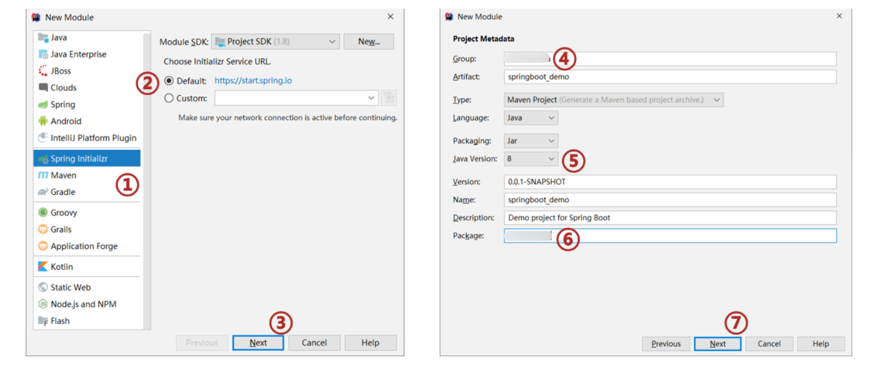
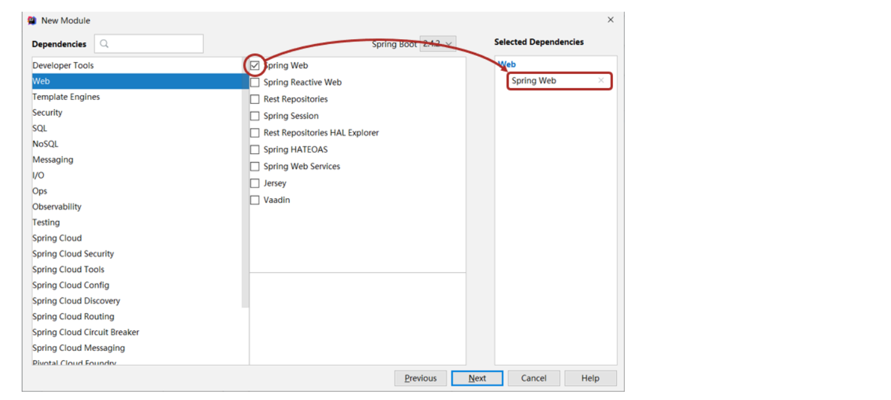
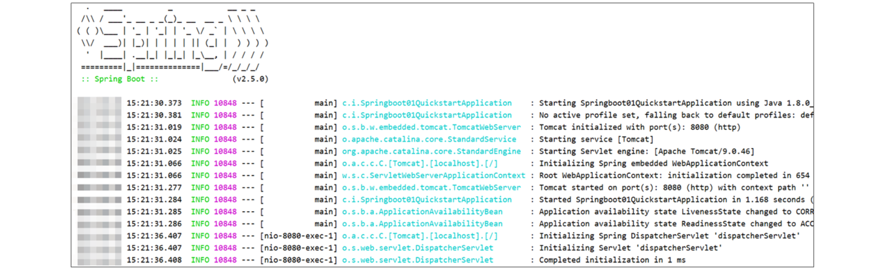
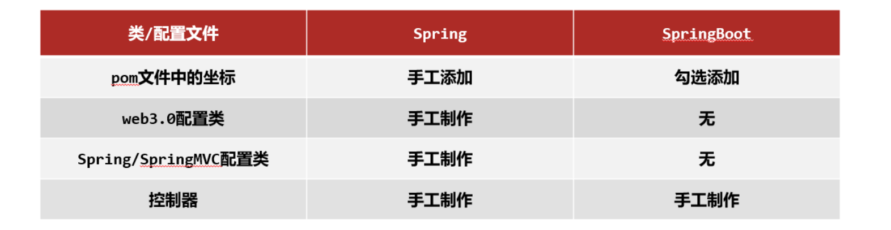
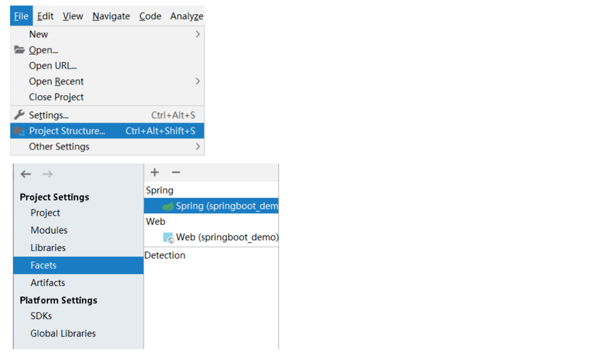
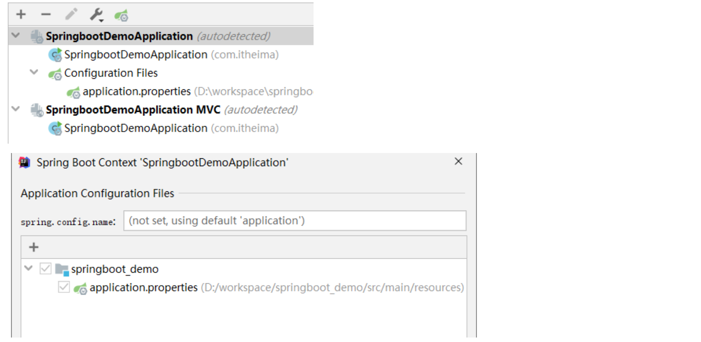
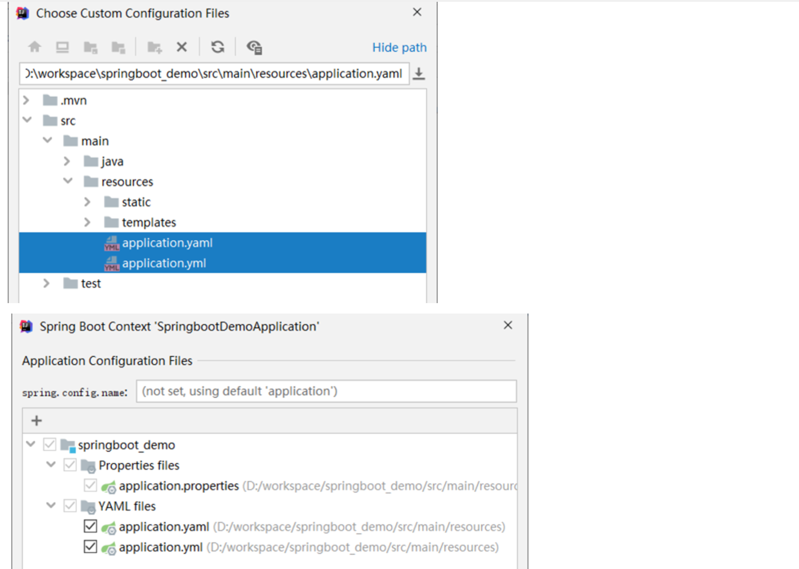

## 一，SpringBoot介绍


### 1，入门案例


入门案例开发步骤：

1. 创建新模块，选择Spring初始化，并配置模块相关基础信息

   

2. 选择当前模块需要使用的技术集

   

3. 开发控制器类

   ```java
   @RestController
   @RequestMapping("/books")
   public class BookController {
       @GetMapping("/{id}")
       public String getById(@PathVariable Integer id) {
           System.out.println("id ==> " + id);
           return "hello , spring boot! ";
       }
   }
   ```

4. 运行自动生成的Application类

   


最简SpringBoot程序所包含的基础文件

```xml
<?xml version="1.0" encoding="UTF-8"?>
<project xmlns="http://maven.apache.org/POM/4.0.0" xmlns:xsi="http://www.w3.org/2001/XMLSchema-instance"
         xsi:schemaLocation="http://maven.apache.org/POM/4.0.0 https://maven.apache.org/xsd/maven-4.0.0.xsd">
    <modelVersion>4.0.0</modelVersion>
    <parent>
        <groupId>org.springframework.boot</groupId>
        <artifactId>spring-boot-starter-parent</artifactId>
        <version>2.5.0</version>
    </parent>
    <groupId>com.malu</groupId>
    <artifactId>springboot-01-quickstart</artifactId>
    <version>0.0.1-SNAPSHOT</version>
    <dependencies>
        <dependency>
            <groupId>org.springframework.boot</groupId>
            <artifactId>spring-boot-starter-web</artifactId>
        </dependency>
    </dependencies>
</project>

```


```java
@SpringBootApplication
public class Application {
    public static void main(String[] args) {
        SpringApplication.run(Application.class, args);
    }
}
```


Spring程序与SpringBoot程序对比




### 2，SpringBoot项目快速启动

快速启动步骤：

1. 对SpringBoot项目打包（执行Maven构建指令package）

2. 执行启动指令

   ```shell
   java -jar springboot_01_quickstart.jar	# 项目的名称根据实际情况修改
   ```


jar支持命令行启动需要依赖maven插件支持，请确认打包时是否具有SpringBoot对应的maven插件。

```xml
<build>
    <plugins>
        <plugin>
            <groupId>org.springframework.boot</groupId>
            <artifactId>spring-boot-maven-plugin</artifactId>
        </plugin>
    </plugins>
</build>
```


### 3，SpringBoot介绍

SpringBoot是由Pivotal团队提供的全新框架，其设计目的是用来简化Spring应用的初始搭建以及开发过程。


Spring程序缺点

- 配置繁琐
- 依赖设置繁琐

SpringBoot程序优点

- 自动配置
- 起步依赖（简化依赖配置）
- 辅助功能（内置服务器，……）


#### 3.1 起步依赖

starter是SpringBoot中常见项目名称，定义了当前项目使用的所有项目坐标，以达到减少依赖配置的目的

```xml
<?xml version="1.0" encoding="UTF-8"?>
<project xmlns="http://maven.apache.org/POM/4.0.0" xmlns:xsi="http://www.w3.org/2001/XMLSchema-instance"
         xsi:schemaLocation="http://maven.apache.org/POM/4.0.0 https://maven.apache.org/xsd/maven-4.0.0.xsd">
    <modelVersion>4.0.0</modelVersion>
    <parent>
        <groupId>org.springframework.boot</groupId>
        <artifactId>spring-boot-starter-parent</artifactId>
        <version>2.5.0</version>
    </parent>
    <groupId>com.malu</groupId>
    <artifactId>springboot-01-quickstart</artifactId>
    <version>0.0.1-SNAPSHOT</version>
    <dependencies>
        <dependency>
            <groupId>org.springframework.boot</groupId>
            <artifactId>spring-boot-starter-web</artifactId>
        </dependency>
    </dependencies>
</project>
```

parent是所有SpringBoot项目要继承的项目，定义了若干个坐标版本号（依赖管理，而非依赖），以达到减少依赖冲突的目的。spring-boot-starter-parent（2.5.0）与 spring-boot-starter-parent（2.4.6）共计57处坐标版本不同。


实际开发

- 使用任意坐标时，仅书写GAV中的G和A，V由SpringBoot提供
- 如发生坐标错误，再指定version（要小心版本冲突）


#### 3.2 其它说明

SpringBoot在创建项目时，采用jar的打包方式。SpringBoot的引导类是项目的入口，运行main方法就可以启动项目。

```java
@SpringBootApplication
public class Springboot01QuickstartApplication {
    public static void main(String[] args) {
        SpringApplication.run(Springboot01QuickstartApplication.class, args);
    }
}
```


使用maven依赖管理变更起步依赖项，如Jetty比Tomcat更轻量级，可扩展性更强（相较于Tomcat），谷歌应用引擎（GAE）已经全面切换为Jetty

```xml
<dependencies>
    <dependency>
        <groupId>org.springframework.boot</groupId>
        <artifactId>spring-boot-starter-web</artifactId>
        <!--web起步依赖环境中，排除Tomcat起步依赖-->
        <exclusions>
            <exclusion>
                <groupId>org.springframework.boot</groupId>
                <artifactId>spring-boot-starter-tomcat</artifactId>
            </exclusion>
        </exclusions>
    </dependency>
    <!--添加Jetty起步依赖，版本由SpringBoot的starter控制-->
    <dependency>
        <groupId>org.springframework.boot</groupId>
        <artifactId>spring-boot-starter-jetty</artifactId>
    </dependency>
</dependencies>
```


## 二，SpringBoot基础配置


### 1，SpringBoot配置文件格式

SpringBoot提供了多种属性配置方式

- application.properties

  ```properties
  server.port=80
  ```

- application.yml

  ```yml
  server:
    port: 81
  ```

- application.yaml

  ```yaml
  server:
    port: 82
  ```

  

### 2，自动提示功能消失解决方案

步骤：








### 3，SpringBoot配置文件加载顺序

application.**properties** > application.**yml** > application.**yaml**


注意事项：

1. SpringBoot核心配置文件名为application
2. SpringBoot内置属性过多，且所有属性集中在一起修改，在使用时，通过提示键+关键字修改属性


### 4，yaml

YAML（YAML Ain't Markup Language），一种数据序列化格式。


优点：

- 容易阅读
- 容易与脚本语言交互
- 以数据为核心，重数据轻格式


YAML文件扩展名

- .yml（主流）
- .yaml 


yaml语法规则

- 大小写敏感
- 属性层级关系使用多行描述，每行结尾使用冒号结束
- 使用缩进表示层级关系，同层级左侧对齐，只允许使用空格（不允许使用Tab键）
- 属性值前面添加空格（属性名与属性值之间使用冒号+空格作为分隔）
- #表示注释
- 核心规则：**数据前面要加空格与冒号隔开**


数组数据在数据书写位置的下方使用减号作为数据开始符号，每行书写一个数据，减号与数据间空格分隔


使用@Value读取单个数据，属性名引用方式：${一级属性名.二级属性名……}


封装全部数据到Environment对象


## 三，Spring整合第三方技术

