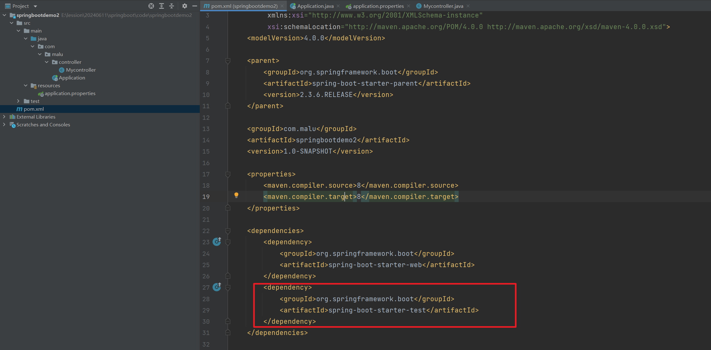
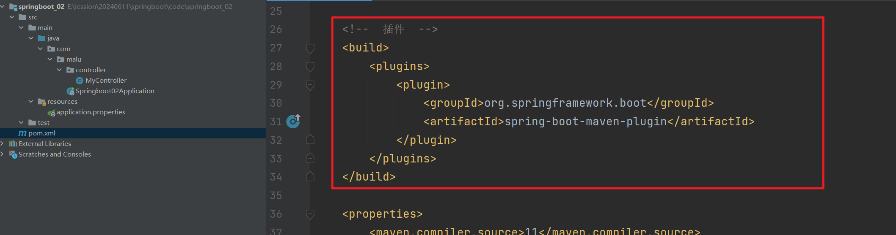
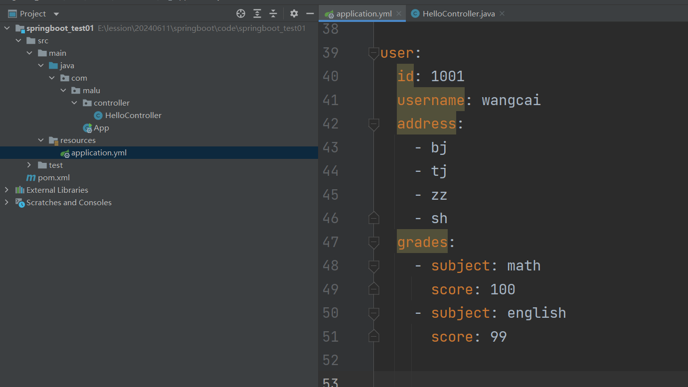
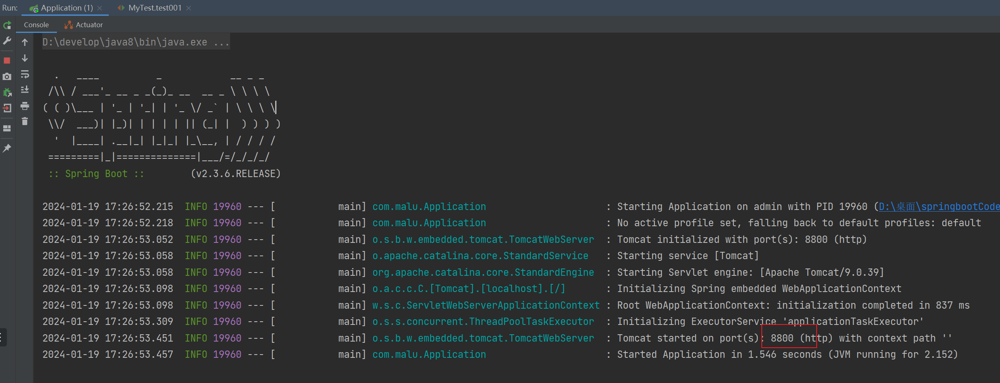

## 一，SpringBoot介绍


### 1，SpringBoot介绍


之前学习Spring，有很多的配置：


除此之外，Spring项目的依赖管理也是一件耗时耗力的事情。在环境搭建时，需要分析要导入哪些库的坐标，而且还需要分析导入与之有依赖关系的其他库的坐标，一旦选错了依赖的版本，随之而来的不兼容问题就会严重阻碍项目的开发进度。比如Spring5.0以上只能使用Junit4.12以上的版本。


Spring的缺点：

- 配置过于繁琐。
- 引入的依赖过多，版本控制复杂。


SpringBoot对Spring的缺点进行改善和优化，基于约定大于配置的思想，简化了Spring的开发，所谓简化是指简化了Spring中大量的配置文件和繁琐的依赖引入。所以SpringBoot是一个服务于框架的框架，它不是对Spring功能的增强，而是提供了一种快速使用Spring框架的方式。


SpringBoot的优点：

- 配置简单
- 依赖引入简单


SpringBoot是由Pivotal团队提供的全新框架，其设计目的是用来简化Spring应用的初始搭建以及开发过程。特点：

1. 自动配置 : 不需要再关注各个框架的整合配置, springboot全部已经配置好了
2. 起步依赖 : 我们在需要使用某个框架的时候, 直接添加这个框架的启动器依赖即可 , 不需要在关注jar包的冲突和整合
3. 开箱即用：不需要写配置，迅速上手，让开发人员关注业务而非配置。约定大于配置。


### 2，创建项目方式一（了解）

接下来我们搭建一个SpringBoot项目，并引入SpringMVC的功能，首先我们可以通过官网搭建项目：

- 访问start.spring.io
- 生成SpringBoot项目


演示：


SpringBoot版本说明：

- SNAPSHOT：快照版，表示开发版本，随时可能修改；
- M1（Mn）：M1是milestone的缩写，也就是里程碑版本；
- RC1（RCn）：RC1是release candidates的缩写，也就是发布预览版；
- Release：正式版，也可能没有任何后缀也表示正式版


SpringBoot打包类型说明：

- 使用SpringMVC开发的是一个web项目，但由于在SpringBoot中直接嵌入了Tomcat等Web容器，所以在使用SpringBoot做Web开发时不需要部署War文件，只需要打成Jar包即可。


得到一个压缩包，如下：


使用idea打开，书写一个controller，如下：


运行项目：


测试：


### 3，创建项目方式二（了解）


步骤：

1. 创建Maven工程（模块）
2. 添加依赖(springboot父工程依赖 , web启动器依赖)
3. 编写启动引导类(springboot项目运行的入口)
4. 编写处理器Controller
5. 启动项目


创建一个Maven父工程，如下：


创建一个模块：


SpringBoot可以帮我们方便的管理项目依赖 , 在Spring Boot提供了一个名为spring-boot-starter-parent的工程，里面已经对各种常用依赖的版本进行了管理，我们的项目需要以这个项目为父工程，这样我们就不用操心依赖的版本问题了，需要什么依赖，直接引入坐标(不需要添加版本)即可！


```xml
<?xml version="1.0" encoding="UTF-8"?>
<project xmlns="http://maven.apache.org/POM/4.0.0"
         xmlns:xsi="http://www.w3.org/2001/XMLSchema-instance"
         xsi:schemaLocation="http://maven.apache.org/POM/4.0.0 http://maven.apache.org/xsd/maven-4.0.0.xsd">
    <modelVersion>4.0.0</modelVersion>

    <parent>
        <groupId>org.springframework.boot</groupId>
        <artifactId>spring-boot-starter-parent</artifactId>
        <version>2.3.6.RELEASE</version>
    </parent>

    <groupId>com.malu</groupId>
    <artifactId>springboot_01</artifactId>
    <version>1.0-SNAPSHOT</version>

    <properties>
        <maven.compiler.source>8</maven.compiler.source>
        <maven.compiler.target>8</maven.compiler.target>
    </properties>

</project>
```


添加web启动器：


```xml
<dependencies>
    <dependency>
        <groupId>org.springframework.boot</groupId>
        <artifactId>spring-boot-starter-web</artifactId>
    </dependency>
</dependencies>
```


配置JDK版本：


```xml
<properties>
    <java.version>1.8</java.version>
</properties>
```


项目的入口，Spring Boot项目通过main函数即可启动，我们需要创建一个启动类：


```java
@SpringBootApplication
public class Application {
    public static void main(String[] args) {
        SpringApplication.run(Application.class,args);
    }
}
```


写Controller如下：


 启动项目


测试之：


### 4，创建项目方式三（掌握）

1. 创建新模块，选择Spring初始化，并配置模块相关基础信息

   

   

2. 选择当前模块需要使用的技术集

   

   目录结构如下：

   

   

3. 开发控制器类

   

   ```java
   @RestController
   public class HelloController {
   
       @RequestMapping("/hello")
       public String sayHello(){
           return "hello springboot 6666~~~";
       }
   }
   ```

4. 运行自动生成的Application类

   

5. 访问

   

Spring程序与SpringBoot程序对比


第三种创建项目的方法，可以选择下载源：


脚手架工具也会访问SpringBoot官网进行项目搭建，但SpringBoot官网有时访问速度较慢，我们也可以选择国内的镜像网站https://start.aliyun.com/搭建项目，阿里的脚手架镜像SpringBoot版本有些滞后。


### 5，项目结构


pom文件：

SpringBoot项目必须继承spring-boot-starter-parent，即所有的SpringBoot项目都是spring-boot-starter-parent的子项目。spring-boot-starter-parent中定义了常用配置、依赖、插件等信息，供SpringBoot项目继承使用。


SpringBoot项目中可以定义起步依赖，起步依赖不是以jar包为单位，而是以功能为单位





spring-boot-maven-plugin插件是将项目打包成jar包的插件。该插件打包后的SpringBoot项目无需依赖web容器，可以直接使用JDK运行


启动类的作用是启动SpringBoot项目，运行启动类的main方法即可启动SpringBoot项目。


由于SpringBoot极大简化了Spring配置，所以只有一个application.properties配置文件，且Spring的自动配置功能使得大部分的配置都有默认配置，该文件的功能是覆盖默认配置信息，该文件不写任何信息都可以启动项目。


### 6，项目的打包

查看电脑上的java版本：


现在统一换成11，之前的安装路径：


再创建一个java11，如下：


下载好了jdk，双击安装，安装到java11目录下，


安装完后：


下载完毕后，还需要配置环境变量：


把java8变成java11，如下：


测试你当前的java版本，如下：


创建一个项目：


pom文件修改：


```xml
<?xml version="1.0" encoding="UTF-8"?>
<project xmlns="http://maven.apache.org/POM/4.0.0"
         xmlns:xsi="http://www.w3.org/2001/XMLSchema-instance"
         xsi:schemaLocation="http://maven.apache.org/POM/4.0.0 http://maven.apache.org/xsd/maven-4.0.0.xsd">
    <modelVersion>4.0.0</modelVersion>

    <groupId>com.malu</groupId>
    <artifactId>springboot_02</artifactId>
    <version>1.0-SNAPSHOT</version>

    <!--  父工程  -->
    <parent>
        <groupId>org.springframework.boot</groupId>
        <artifactId>spring-boot-starter-parent</artifactId>
        <version>2.7.9</version>
    </parent>
    
    <!--  起步依赖  -->
    <dependencies>
        <dependency>
            <groupId>org.springframework.boot</groupId>
            <artifactId>spring-boot-starter-web</artifactId>
        </dependency>
    </dependencies>
    
    <!--  插件  -->
    <build>
        <plugins>
            <plugin>
                <groupId>org.springframework.boot</groupId>
                <artifactId>spring-boot-maven-plugin</artifactId>
            </plugin>
        </plugins>
    </build>
    
    <properties>
        <maven.compiler.source>11</maven.compiler.source>
        <maven.compiler.target>11</maven.compiler.target>
    </properties>

</proje
```


写一个控制器：


修改端口：


启动项目：


访问之：


SpringBoot项目是依赖于Maven构建的，但打包时如果只依赖Maven打包工具则会打包不完整，我们还需要在SpringBoot项目中引入SpringBoot打包插件 ：




此时再使用Maven插件打包：


打包后jar包解压目录如下：


如果不添加SpringBoot打包插件，打包后jar包解压目录如下：


可以看到该目录少了BOOT-INF，打包是不完整的，也无法运行jar包。进入jar包所在目录，使用cmd打开命令行窗口。通过一个命令去运行项目：

```
java -jar jar包名
```


再次使用java11快速创建一个springboot项目：


```xml
<?xml version="1.0" encoding="UTF-8"?>
<project xmlns="http://maven.apache.org/POM/4.0.0"
         xmlns:xsi="http://www.w3.org/2001/XMLSchema-instance"
         xsi:schemaLocation="http://maven.apache.org/POM/4.0.0 http://maven.apache.org/xsd/maven-4.0.0.xsd">
    <modelVersion>4.0.0</modelVersion>

    <groupId>com.malu</groupId>
    <artifactId>springboot_666</artifactId>
    <version>1.0-SNAPSHOT</version>

    <!--  父工程  -->
    <parent>
        <groupId>org.springframework.boot</groupId>
        <artifactId>spring-boot-starter-parent</artifactId>
        <version>2.7.9</version>
    </parent>

    <!--  起步依赖  -->
    <dependencies>
        <dependency>
            <groupId>org.springframework.boot</groupId>
            <artifactId>spring-boot-starter-web</artifactId>
        </dependency>
    </dependencies>

    <!--  插件  -->
    <build>
        <plugins>
            <plugin>
                <groupId>org.springframework.boot</groupId>
                <artifactId>spring-boot-maven-plugin</artifactId>
            </plugin>
        </plugins>
    </build>

    <properties>
        <maven.compiler.source>11</maven.compiler.source>
        <maven.compiler.target>11</maven.compiler.target>
    </properties>

</project>
```


运行项目：


## 二，SpringBoot基础配置


创建一个maven的项目：


pom文件：


```xml
<?xml version="1.0" encoding="UTF-8"?>
<project xmlns="http://maven.apache.org/POM/4.0.0"
         xmlns:xsi="http://www.w3.org/2001/XMLSchema-instance"
         xsi:schemaLocation="http://maven.apache.org/POM/4.0.0 http://maven.apache.org/xsd/maven-4.0.0.xsd">
    <modelVersion>4.0.0</modelVersion>

    <groupId>com.malu</groupId>
    <artifactId>springboot_test01</artifactId>
    <version>1.0-SNAPSHOT</version>

    <!--  父工程  -->
    <parent>
        <groupId>org.springframework.boot</groupId>
        <artifactId>spring-boot-starter-parent</artifactId>
        <version>2.7.9</version>
    </parent>
    <!--  起步依赖  -->
    <dependencies>
        <dependency>
            <groupId>org.springframework.boot</groupId>
            <artifactId>spring-boot-starter-web</artifactId>
        </dependency>
    </dependencies>
    <!--  插件  -->
    <build>
        <plugins>
            <plugin>
                <groupId>org.springframework.boot</groupId>
                <artifactId>spring-boot-maven-plugin</artifactId>
            </plugin>
        </plugins>
    </build>
    <properties>
        <maven.compiler.source>11</maven.compiler.source>
        <maven.compiler.target>11</maven.compiler.target>
    </properties>

</project>
```


启动类：


```java
package com.malu;

import org.springframework.boot.SpringApplication;
import org.springframework.boot.autoconfigure.SpringBootApplication;

@SpringBootApplication
public class App {
    public static void main(String[] args) {
        SpringApplication.run(App.class,args);
    }
}
```


配置文件：


测试：


### 1，properties 属性配置文件


SpringBoot项目中，大部分配置都有默认值，但如果想替换默认配置的话，就可以使用application.properties或者application.yml进行配置。SpringBoot默认会从resources目录下加载application.properties
或application.yml文件。


springboot支持二种类型的配置文件：

- properties 属性配置文件
- yaml 配置文件（推荐）


配置文件必须放置在项目的类加载目录下, 并且名字必须是application，springboot项目在运行的时候会自动加载这些配置文件。在 resource 文件夹下面新建 application.properties 配置文件


```properties
# 配置端口的
server.port=9999
# 驱动类名称
spring.jdbc.datasource.driverClassName=com.mysql.jdbc.Driver
#数据库连接的url
spring.jdbc.datasource.url=jdbc:mysql://localhost:3388/student
#连接数据库的用户名
spring.jdbc.datasource.username=root
#连接数据库的密码
spring.jdbc.datasource.password=root
```


新建 properties 包，创建类 DataSourceProperties


```java
@Component
public class DataSourceProperties {
    @Value("${spring.jdbc.datasource.driverClassName}")
    private String driverClassName;
    @Value("${spring.jdbc.datasource.url}")
    private String url;
    @Value("${spring.jdbc.datasource.username}")
    private String username;
    @Value("${spring.jdbc.datasource.password}")
    private String password;

    public String getDriverClassName() {
        return driverClassName;
    }

    public void setDriverClassName(String driverClassName) {
        this.driverClassName = driverClassName;
    }

    public String getUrl() {
        return url;
    }

    public void setUrl(String url) {
        this.url = url;
    }

    public String getUsername() {
        return username;
    }

    public void setUsername(String username) {
        this.username = username;
    }

    public String getPassword() {
        return password;
    }

    public void setPassword(String password) {
        this.password = password;
    }

    @Override
    public String toString() {
        return "DataSourceProperties{" +
                "driverClassName='" + driverClassName + '\'' +
                ", url='" + url + '\'' +
                ", username='" + username + '\'' +
                ", password='" + password + '\'' +
                '}';
    }
}
```


在controler中：


测试之：


SpringBoot提供了多种属性配置方式

- application.properties

  ```properties
  server.port=80
  ```

- application.yml

  ```yml
  server:
    port: 81
  ```

- application.yaml

  ```yaml
  server:
    port: 82
  ```


### 2，yaml 配置文件

除了properties文件外，SpringBoot还支持YAML文件进行配置。YAML文件的扩展名为 .yml 或 .yaml ，它的基本要求如下：

- 大小写敏感
- 使用缩进代表层级关系
- 相同的部分只出现一次


YAML（YAML Ain't Markup Language），一种数据序列化格式。


优点：

- 容易阅读
- 容易与脚本语言交互
- 以数据为核心，重数据轻格式


YAML文件扩展名

- .yml（主流）
- .yaml


yaml语法规则

- 大小写敏感
- 属性层级关系使用多行描述，每行结尾使用冒号结束
- 使用缩进表示层级关系，同层级左侧对齐，只允许使用空格（不允许使用Tab键）
- 属性值前面添加空格（属性名与属性值之间使用冒号+空格作为分隔）
- \#表示注释
- 核心规则：**数据前面要加空格与冒号隔开**


书写yml文件：


自定义配置简单数据: 除了覆盖默认配置，我们还可以在YAML文件中配置其他信息以便我们在项目中使用。配置简单数据的方式如下：

```yml
数据名: 值
name: malu   注意：值之前有一个空格
```

演示：


自定义配置对象数据，语法：

```yml
对象:
  属性名1: 属性值
  属性名2: 属性值
  
# 或者
对象: {属性名1: 属性值,属性名2: 属性值}

# 学生1
student1:
	sex: man
	age: 10
	address: bj
	
student2: {sex:female, age: 10, address: bj}
```

属性名前面的空格个数不限，在yml语法中，相同缩进代表同一个级别，只要每个属性前的空格数一样即可。


演示：


自定义配置集合数据，语法：

```yml
集合:
 - 值1
 - 值2

# 或者
集合: [值1,值2]

# 城市1
city1:
 - beijing
 - tianjin
 - shanghai
 - chongqing
 
# 城市2
city2: [beijing,tianjin,shanghai,chongqing]
```


演示：


如果集合中是对象：

```yml
# 集合中的元素是对象  注意：值与之前的 - 之间存在一个空格
students:
  - name: wc
    age: 20
    score: 20
  - name: xq
    age: 10
    score: 60
  - name: ml
    age: 30
    score: 90
```


演示：


现在的配置文件，如下：

```yml
server:
  port: 9999

# 管理员用户名
name: malu

# 学生1
student1:
  sex: female
  age: 10
  address: beijing

# 学生2
student2: {sex: female,age: 10,address: beijing}

# 城市1
city1:
  - beijing
  - tianjin
  - shanghai
  - chongqing

# 城市2
city2: [beijing,tianjin,shanghai,chongqing]


# 集合中的元素是对象
students:
  - name: wc
    age: 20
    score: 20
  - name: xq
    age: 10
    score: 60
  - name: ml
    age: 30
    score: 90
```


如何读取配置文件中的数据呢，使用@Value来读取，我们可以通过@Value注解将配置文件中的值映射到一个Spring管理的Bean的字段上，用法如下：


```java
@RestController
public class HelloController {

    @Value("${name}")
    private String name;

    @Value("${student1.age}")
    private int age;

    @Value("${city1[0]}")
    private String city1;

    @Value("${students[0].score}")
    private double score1;

    @GetMapping("/t1")
    public String t1(){
        System.out.println(name);
        System.out.println(age);
        System.out.println(city1);
        System.out.println(score1);
        return "hello";
    }
}
```


测试：


@Value只能映射简单数据类型，不能将yaml文件中的对象、集合映射到属性中。


通过 @ConfigurationProperties(prefifix="对象") 可以将配置文件中的配置自动与实体进行映射，这样可以将yml文件中配置的对象属性直接映射到Bean当中。再写一个配置，如下：



```yml
user:
  id: 1001
  username: wangcai
  address:
    - bj
    - tj
    - zz
    - sh
  grades:
    - subject: math
      score: 100
    - subject: english
      score: 99
```


写实体类：


```java
package com.malu.domain;

public class Grade {
    private String subject;
    private String score;

    public Grade() {
    }

    public Grade(String subject, String score) {
        this.subject = subject;
        this.score = score;
    }

    public String getSubject() {
        return subject;
    }

    public void setSubject(String subject) {
        this.subject = subject;
    }

    public String getScore() {
        return score;
    }

    public void setScore(String score) {
        this.score = score;
    }

    @Override
    public String toString() {
        return "Grade{" +
                "subject='" + subject + '\'' +
                ", score='" + score + '\'' +
                '}';
    }
}
```


开始读取配置文件：


```java
@RestController
@ConfigurationProperties(prefix = "user")
public class HelloController {
    private int id;
    private String username;
    private List<String> address;
    private List<Grade> grades;

    @GetMapping("/t1")
    public String t1(){
        System.out.println(id);
        System.out.println(username);
        System.out.println(address);
        System.out.println(grades);
        return "hello";
    }

    public int getId() {
        return id;
    }

    public void setId(int id) {
        this.id = id;
    }

    public String getUsername() {
        return username;
    }

    public void setUsername(String username) {
        this.username = username;
    }

    public List<String> getAddress() {
        return address;
    }

    public void setAddress(List<String> address) {
        this.address = address;
    }

    public List<Grade> getGrades() {
        return grades;
    }

    public void setGrades(List<Grade> grades) {
        this.grades = grades;
    }
}
```


YAML文件中可以使用 ${} 占位符，它有两个作用：

- 使用配置文件中的值


使用配置文件中的值:


使用yyyy:


SpringBoot框架提供了一些生成随机数的方法可以在yml文件中使用：

- ${random.value} ：生成类似uuid的随机数，没有"-"连接
- ${random.uuid} ：生成一个uuid，有短杠连接
- ${random.int} ：随机取整型范围内的一个值
- ${random.int(10)}：随机生成一个10以内的数
- ${random.int(100,200)}：随机生成一个100-200 范围以内的数
- ${random.long}：随机取长整型范围内的一个值
- ${random.long(100,200)}：随机生成长整型100-200范围内的一个值


使用：


### 4，配置文件存放的位置的优先级

配置文件有如下存放位置：

- 项目根目录下
- 项目根目录下的/config子目录中
- 项目的resources目录中
- 项目的resources下的/config子目录中


这些目录下都可以存放两类配置文件，分别是 application.yml 和application.properties ，这些配置文件的优先级从高到低依次为：

项目根目录下的/config子目录中

- config/application.properties
- config/application.yml

项目根目录下

- application.properties
- application.yml

项目的resources下的/config子目录中

- resources/config/application.properties
- resources/config/application.yml

项目的resources目录中

- resources/application.properties
- resources/application.yml


优先级高的文件会覆盖优先级低的文件中的配置


### 5，bootstrap配置文件


SpringBoot中有两种容器对象，分别是bootstrap和application，bootstrap是应用程序的父容器，bootstrap加载优先于applicaton。bootstrap配置文件主要对bootstrap容器进行配置，application配置文件是对applicaton容器进行配置。


bootstrap配置文件也同样支持properties和yml两种格式，主要用于从外部引入Spring应用程序的配置。bootstrap配置文件特征

- boostrap由父ApplicationContext加载，比applicaton优先加载。
- boostrap里面的属性不能被覆盖。


bootstrap与application的应用场景

- application配置文件主要用于SpringBoot项目的自动化配置。
- bootstrap配置文件有以下几个应用场景。
  - 使用Spring Cloud Config配置中心时，需要在bootstrap配置文件中添加连接到配置中心的配置属性来加载外部配置中心的配置信息。
  - 一些固定的不能被覆盖的属性。
  - 一些加密/解密的场景。


### 6，静态资源相关目录

SpringBoot项目中没有WebApp目录，只有src目录。在src/main/resources 下面有 static 和 templates 两个文件夹。SpringBoot默认在static 目录中存放静态资源，而 templates 中放动态页面。


SpringBoot通过 /resources/static 目录访问静态资源，在 resources/static 中编写html页面：


在SpringBoot中不推荐使用JSP作为动态页面，而是默认使用Thymeleaf编写动态页面。templates目录是存放Thymeleaf页面的目录，我们讲解Thymeleaf技术。后面写完前后端分离的项目之后，有时间的话，再讲Thymeleaf。


### 7，SpringBoot热部署

热部署，就是在应用正在运行的时候升级软件，却不需要重新启动应用。即修改完代码后不需要重启项目即可生效。在SpringBoot中，可以使用DevTools工具实现热部署。添加DevTools依赖


```xml
        <!--    热部署工具    -->
        <dependency>
            <groupId>org.springframework.boot</groupId>
            <artifactId>spring-boot-devtools</artifactId>
        </dependency>
```

在idea中设置自动编译点击 File-->Settings


在Idea设置自动运行, 快捷键 Ctrl+Shift+Alt+/ 后点击 Registry ，勾选
complier.automake.allow.when.app.running，自己去网上搜索一些文章，测试一下。


## 三，整合MyBatis

### 1，Springboot整合mybatis

Spring整合MyBatis时需要进行大量配置，而SpringBoot整合MyBatis则可以简化很多配置：


添加mybatis起步依赖和mysql驱动依赖：


```xml
        <!--mybatis的启动器-->
        <dependency>
            <groupId>org.mybatis.spring.boot</groupId>
            <artifactId>mybatis-spring-boot-starter</artifactId>
            <version>2.2.0</version>
        </dependency>
        <dependency>
            <groupId>mysql</groupId>
            <artifactId>mysql-connector-java</artifactId>
            <version>8.0.32</version>
        </dependency>
        <dependency>
            <groupId>org.springframework.boot</groupId>
            <artifactId>spring-boot-starter-test</artifactId>
            <scope>test</scope>
        </dependency>
```


写实体类：


```java
package com.malu.domain;


public class Student {
    private Integer id;
    private String name;
    private String sex;
    private String address;

    public Student() {
    }

    public Student(Integer id, String name, String sex, String address) {
        this.id = id;
        this.name = name;
        this.sex = sex;
        this.address = address;
    }

    public Integer getId() {
        return id;
    }

    public void setId(Integer id) {
        this.id = id;
    }

    public String getName() {
        return name;
    }

    public void setName(String name) {
        this.name = name;
    }

    public String getSex() {
        return sex;
    }

    public void setSex(String sex) {
        this.sex = sex;
    }

    public String getAddress() {
        return address;
    }

    public void setAddress(String address) {
        this.address = address;
    }

    @Override
    public String toString() {
        return "Student{" +
                "id=" + id +
                ", name='" + name + '\'' +
                ", sex='" + sex + '\'' +
                ", address='" + address + '\'' +
                '}';
    }
}

```


编写mapper接口：


```java
@Mapper
public interface StudentMapper {
    List<Student> findAll();
}
```

编写Mapper映射文件


```xml
<?xml version="1.0" encoding="UTF-8"?>
<!DOCTYPE mapper
        PUBLIC "-//mybatis.org//DTD Mapper 3.0//EN"
        "http://mybatis.org/dtd/mybatis-3-mapper.dtd">

<mapper namespace="com.malu.mapper.StudentMapper">
    <select id="findAll" resultType="com.malu.domain.Student">
        select * from student;
    </select>
</mapper>
```


编写配置文件:


```yml
server:
  port: 9999

# 配置数据源
spring:
  datasource:
    driver-class-name: com.mysql.cj.jdbc.Driver
    url: jdbc:mysql://127.0.0.1:3388/student?serverTimezone=UTC
    username: root
    password: root

# mybatis的配置
mybatis:
  # 映射文件的位置
  mapper-locations: com/malu/mapper/*Mapper.xml
  # 别名
  type-aliases-package: com.malu.domain

#日志格式
logging:
  pattern:
  console: '%d{HH:mm:ss.SSS} %clr(%-5level) ---  [%-15thread] %cyan(%-50logger{50}):%msg%n'
```


编写测试类：


```java
// Springboot测试类注解，可以在运行测试代码时加载Spring容器
@SpringBootTest
public class StudentMapperTest {
    @Autowired
    private StudentMapper studentMapper;

    @Test
    public void testFindAll(){
        List<Student> all = studentMapper.findAll();
        all.forEach(System.out::println);
    }
}
```


## 四，参数校验

### 1，参数校验简单数据类型

SpringBoot自带了validation工具可以从后端对前端传来的参数进行校验，引入依赖：


```xml
        <dependency>
            <groupId>org.springframework.boot</groupId>
            <artifactId>spring-boot-starter-validation</artifactId>
        </dependency>
        <dependency>
            <groupId>org.springframework.boot</groupId>
            <artifactId>spring-boot-starter-thymeleaf</artifactId>
        </dependency>
```


编写Controller:


要求必须要传递一个username，如下：


在校验参数的注解中添加 message 属性，可以替换异常信息。


当抛出 ConstraintViolationException 异常后，我们可以使用SpringMVC的异常处理器，也可以使用SpringBoot自带的异常处理机制。当程序出现了异常，SpringBoot会使用自带的 BasicErrorController 对象处理异常。该处理器会默认跳转到/resources/templates/error.html页面。


### 2，校验相关的注解


演示：


测试：


### 3，参数校验对象类型

SpringBoot也可以校验对象参数中的每个属性，添加实体类：


```java
package com.malu.domain;


import javax.validation.constraints.NotBlank;
import javax.validation.constraints.NotNull;

public class Student {
    @NotNull(message = "id不能为空")
    private Integer id;
    @NotBlank(message = "姓名不能为空")
    private String name;

    public Integer getId() {
        return id;
    }

    public void setId(Integer id) {
        this.id = id;
    }

    public String getName() {
        return name;
    }

    public void setName(String name) {
        this.name = name;
    }

    @Override
    public String toString() {
        return "Student{" +
                "id=" + id +
                ", name='" + name + '\'' +
                '}';
    }

}

```


控制器：


## 五，日志

### 1，配置日志

SpringBoot默认使用Logback组件作为日志管理。Logback是log4j创始人设计的一个开源日志组件。在SpringBoot项目中我们不需要额外的添加Logback的依赖，因为在 spring-boot-parent 中已经包含了
Logback的依赖。


在 /resources 下添加Logback配置文件logback.xml


```xml
<?xml version="1.0" encoding="UTF-8" ?>
<configuration>
    <!--定义日志文件的存储地址-->
    <property name="LOG_HOME" value="${catalina.base}/logs/"/>

    <!-- 控制台输出 -->
    <appender name="Stdout" class="ch.qos.logback.core.ConsoleAppender">
        <!-- 日志输出编码 -->
        <layout class="ch.qos.logback.classic.PatternLayout">
            <!--格式化输出：%d表示时间，%thread表示线程名，%-5level：级别从左显示5个字符宽度%msg：日志消息，%n是换行符-->
            <pattern>%d{HH:mm:ss.SSS} [%thread] %-5level %logger{50} - %msg%n
            </pattern>
        </layout>
    </appender>

    <!-- 按照每天生成日志文件 -->
    <appender name="RollingFile" class="ch.qos.logback.core.rolling.RollingFileAppender">
        <rollingPolicy class="ch.qos.logback.core.rolling.TimeBasedRollingPolicy">
            <!--日志文件输出的文件名-->
            <FileNamePattern>${LOG_HOME}/server.%d{yy99-MM-dd}.log</FileNamePattern>
            <MaxHistory>30</MaxHistory>
        </rollingPolicy>
        <layout class="ch.qos.logback.classic.PatternLayout">
            <!--格式化输出：%d表示时间，%thread表示线程名，%-5level：级别从左显示5个字符宽度%msg：日志消息，%n是换行符-->
            <pattern>%d{HH:mm:ss.SSS} [%thread] %-5level %logger{50} - %msg%n
            </pattern>
        </layout>
        <!--日志文件最大的大小-->
        <triggeringPolicy class="ch.qos.logback.core.rolling.SizeBasedTriggeringPolicy">
            <MaxFileSize>10MB</MaxFileSize>
        </triggeringPolicy>
    </appender>

    <!-- 日志输出级别 -->
    <root level="info">
        <appender-ref ref="Stdout"/>
        <appender-ref ref="RollingFile"/>
    </root>
</configuration>
```


在代码中打印日志:


如果日志过多，可以屏蔽一些包的日志，在配置文件中配置


## 六，多环境配置


### 1，多环境profile配置

环境有三个：

- 开发环境  application-dev.yml
- 测试环境  application-test.yml
- 生产环境  application-pro.yml


我们刚刚说过在Spring Boot项目中配置文件的名称只能是**application** , 如果我们把所有的配置全都写在一个配置文件中如果配置项比较多, 配置文件就会显得比较复杂和臃肿 ! 不利于后期的项目维护和开发


开发环境有开发环境的配置，测试人员有人家自己的测试环境，项目上线，还有一个正式的生产环境。有不同的环境，可以把配置文件配置多份，spring boot项目中允许使用多个YAML配置文件。这些文件名称必须为application-***.yml，并且在application.yml中激活。


创建开发环境的配置：


创建生产环境的配置：


在 **application.yml** 文件中添加如下配置：


测试：


运行jar包时选择环境：

```
java -jar jar包名 --spring.profiles.active=环境名
```


注意点：

- 如果properties和ym文件都存在，不存在spring.profiles.active设置，如果有重叠属性，默认以properties优先。
- 如果设置了spring.profiles.active，并且有重叠属性，以active设置优先


## 五，SpringBoot案例(周六)


### 1，SpringBoot整合JUnit

不管是SpringBoot整合什么样的框架，先找一找有没有对应的启动器，整合junit有没有启动器？答：有的。

```xml
<dependency>
    <groupId>org.springframework.boot</groupId>
    <artifactId>spring-boot-starter-test</artifactId>
    <scope>test</scope>
</dependency>
```


直接写测试：


### 2，SpringBoot整合mybatis


Spring整合Mybatis：

- SpringConfig
  - 导入JdbcConfig  要写大量的代码
  - 导入MyBatisConfig   要写大量的代码


SpringBoot整合MyBatis

- SpringBoot整合Spring（不存在）
- SpringBoot整合SpringMVC（不存在）
- SpringBoot整合MyBatis（主要）


#### 2.1 创建SpringBoot项目

创建一个新的springboot项目：


```xml
<?xml version="1.0" encoding="UTF-8"?>
<project xmlns="http://maven.apache.org/POM/4.0.0"
         xmlns:xsi="http://www.w3.org/2001/XMLSchema-instance"
         xsi:schemaLocation="http://maven.apache.org/POM/4.0.0 http://maven.apache.org/xsd/maven-4.0.0.xsd">
    <parent>
        <groupId>org.springframework.boot</groupId>
        <artifactId>spring-boot-starter-parent</artifactId>
        <version>2.3.6.RELEASE</version>
    </parent>

    <properties>
        <java.version>1.8</java.version>
    </properties>

    <modelVersion>4.0.0</modelVersion>

    <artifactId>springboot_03_mybatis</artifactId>

    <dependencies>
        <dependency>
            <groupId>org.springframework.boot</groupId>
            <artifactId>spring-boot-starter-web</artifactId>
        </dependency>
        <dependency>
            <groupId>org.springframework.boot</groupId>
            <artifactId>spring-boot-configuration-processor</artifactId>
            <optional>true</optional>
        </dependency>
    </dependencies>

</project>
```


创建启动类：


创建配置文件：


运行：


#### 2.2 整合Mybatis

整合mybatis，也有对应的启动器

```xml
<dependency>
    <groupId>org.mybatis.spring.boot</groupId>
    <artifactId>mybatis-spring-boot-starter</artifactId>
    <version>2.2.0</version>
</dependency>
```


既然要整合mybatis，还需要用到数据库驱动和数据库连接池：

```xml
<dependency>
    <groupId>mysql</groupId>
    <artifactId>mysql-connector-java</artifactId>
    <scope>runtime</scope>
</dependency>
<dependency>
    <groupId>com.alibaba</groupId>
    <artifactId>druid</artifactId>
    <version>1.1.16</version>
</dependency>
```


要想测试，还需要用到junit启动器：

```xml
<dependency>
    <groupId>org.springframework.boot</groupId>
    <artifactId>spring-boot-starter-test</artifactId>
    <scope>test</scope>
</dependency>
```


把上面的依赖整合到pom中：


实体类：


```java
package com.malu.pojo;

public class Book {
    private Integer id;
    private String name;
    private String type;
    private String description;

    @Override
    public String toString() {
        return "Book{" +
                "id=" + id +
                ", name='" + name + '\'' +
                ", type='" + type + '\'' +
                ", description='" + description + '\'' +
                '}';
    }

    public Integer getId() {
        return id;
    }

    public void setId(Integer id) {
        this.id = id;
    }

    public String getName() {
        return name;
    }

    public void setName(String name) {
        this.name = name;
    }

    public String getType() {
        return type;
    }

    public void setType(String type) {
        this.type = type;
    }

    public String getDescription() {
        return description;
    }

    public void setDescription(String description) {
        this.description = description;
    }
}
```


dao层：


```java
@Mapper
public interface BookDao {
    @Select("select * from tbl_book where id = #{id}")
    public Book getById(Integer id);
}
```


连接数据库：


```yaml
server:
  port: 8800

spring:
  datasource:
    driver-class-name: com.mysql.jdbc.Driver
    url: jdbc:mysql://localhost:3306/ssm_db?serverTimezone=UTC
    username: root
    password: root
    type: com.alibaba.druid.pool.DruidDataSource
```


测试之：


```java
@SpringBootTest
class MybatisTest {
    @Autowired
    private BookDao bookDao;

    @Test
    void testGetById() {
        Book book = bookDao.getById(7);
        System.out.println(book);
    }
}
```


### 3，SpringBoot案例开发


项目的目录结构和上面一样：


#### 3.1 Dao层


```java
@Mapper
public interface BookDao {
    @Insert("insert into tbl_book (type,name,description) values(#{type},#{name},#{description})")
    public int save(Book book);  //返回值表示影响的行数

    @Update("update tbl_book set type = #{type}, name = #{name}, description = #{description} where id = #{id}")
    public int update(Book book);

    @Delete("delete from tbl_book where id = #{id}")
    public int delete(Integer id);

    @Select("select * from tbl_book where id = #{id}")
    public Book getById(Integer id);

    @Select("select * from tbl_book")
    public List<Book> getAll();
}
```


#### 3.2 Service层


```java
@Transactional
public interface BookService {
    public boolean save(Book book);
    public boolean update(Book book);
    public boolean delete(Integer id);
    public Book getById(Integer id);
    public List<Book> getAll();
}
```


实现类：


```java
@Service
public class BookServiceImpl implements BookService {
    @Autowired
    private BookDao bookDao;

    @Override
    public boolean save(Book book) {
        return bookDao.save(book) > 0;
    }

    @Override
    public boolean update(Book book) {
        return bookDao.update(book) > 0;
    }

    @Override
    public boolean delete(Integer id) {
        return bookDao.delete(id) > 0;
    }

    @Override
    public Book getById(Integer id) {
        return bookDao.getById(id);
    }

    @Override
    public List<Book> getAll() {
        return bookDao.getAll();
    }
}
```


#### 3.3 Controller层


Code:


```java
public class Code {
    public static final Integer SAVE_OK = 20011;
    public static final Integer DELETE_OK = 20021;
    public static final Integer UPDATE_OK = 20031;
    public static final Integer GET_OK = 20041;

    public static final Integer SAVE_ERR = 20010;
    public static final Integer DELETE_ERR = 20020;
    public static final Integer UPDATE_ERR = 20030;
    public static final Integer GET_ERR = 20040;

    public static final Integer SYSTEM_ERR = 50001;
    public static final Integer SYSTEM_TIMEOUT_ERR = 50002;
    public static final Integer SYSTEM_UNKNOW_ERR = 59999;

    public static final Integer BUSINESS_ERR = 60002;

}
```


Result:


```java
public class Result {
    private Object data;
    private Integer code;
    private String msg;

    public Result() {
    }

    public Result(Integer code,Object data) {
        this.data = data;
        this.code = code;
    }

    public Result(Integer code, Object data, String msg) {
        this.data = data;
        this.code = code;
        this.msg = msg;
    }

    public Object getData() {
        return data;
    }

    public void setData(Object data) {
        this.data = data;
    }

    public Integer getCode() {
        return code;
    }

    public void setCode(Integer code) {
        this.code = code;
    }

    public String getMsg() {
        return msg;
    }

    public void setMsg(String msg) {
        this.msg = msg;
    }
}
```


Controller:


```java
@RestController
@RequestMapping("/books")
public class BookController {
    @Autowired
    private BookService bookService;

    @PostMapping
    public Result save(@RequestBody Book book) {
        boolean flag = bookService.save(book);
        return new Result(flag ? Code.SAVE_OK:Code.SAVE_ERR,flag);
    }

    @PutMapping
    public Result update(@RequestBody Book book) {
        boolean flag = bookService.update(book);
        return new Result(flag ? Code.UPDATE_OK:Code.UPDATE_ERR,flag);
    }

    @DeleteMapping("/{id}")
    public Result delete(@PathVariable Integer id) {
        boolean flag = bookService.delete(id);
        return new Result(flag ? Code.DELETE_OK:Code.DELETE_ERR,flag);
    }

    @GetMapping("/{id}")
    public Result getById(@PathVariable Integer id) {
        Book book = bookService.getById(id);
        Integer code = book != null ? Code.GET_OK : Code.GET_ERR;
        String msg = book != null ? "" : "数据查询失败，请重试！";
        return new Result(code,book,msg);
    }

    @GetMapping
    public Result getAll() {
        List<Book> bookList = bookService.getAll();
        Integer code = bookList != null ? Code.GET_OK : Code.GET_ERR;
        String msg = bookList != null ? "" : "数据查询失败，请重试！";
        return new Result(code,bookList,msg);
    }
}
```


启动项目：




测试之OK。


### 4，打包SpringBoot项目


插件：


```xml
<plugins>
    <plugin>
        <groupId>org.springframework.boot</groupId>
        <artifactId>spring-boot-maven-plugin</artifactId>
    </plugin>
</plugins>
```


打包：


得到一个jar包，如下：


运行jar包：


