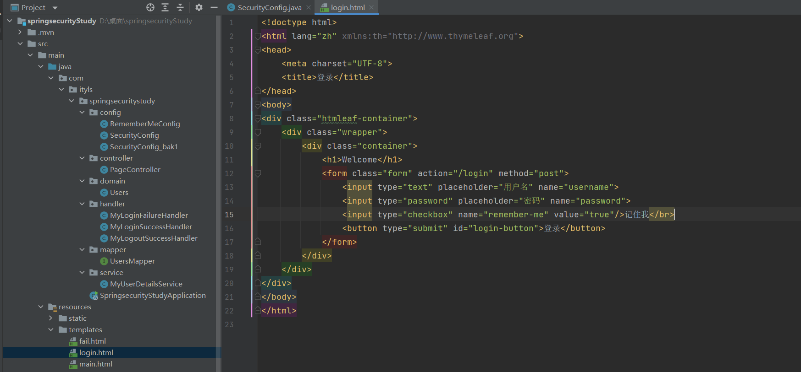

### 1, 介绍

Spring Security是Spring项目组提供的安全服务框架，核心功能包括**认证**和**授权**。它为系统提供了声明式安全访问控制功能，减少了为系统安全而编写大量重复代码的工作。


**认证：**

认证即系统判断用户的身份是否合法，合法可继续访问，不合法则拒绝访问。常见的用户身份认证方式有：用户名密码登录、二维码登录、手机短信登录、脸部识别认证、指纹认证等方式。

认证是为了保护系统的隐私数据与资源，用户的身份合法才能访问该系统的资源。


**授权：**

授权即**认证通过后**，根据用户的权限来控制用户访问资源的过程，拥有资源的访问权限则正常访问，没有权限则拒绝访问。 比如在一些视频网站中，普通用户登录后只有观看免费视频的权限，而VIP用户登录后，网站会给该用户提供观看VIP视频的权限。


认证是为了保证用户身份的合法性，授权则是为了更细粒度的对隐私数据进行划分，控制不同的用户能够访问不同的资源。


举个例子：认证是公司大门识别你作为员工能进入公司，而授权则是由于你作为公司会计可以进入财务室，查看账目，处理财务数据。


### 2, 认证_项目搭建

接下来我们先来搭建一个Spring Security项目，准备一个名为`mysecurity`的Mysql数据库，创建SpringBoot项目，添加依赖：


```xml
<?xml version="1.0" encoding="UTF-8"?>
<project xmlns="http://maven.apache.org/POM/4.0.0" xmlns:xsi="http://www.w3.org/2001/XMLSchema-instance"
         xsi:schemaLocation="http://maven.apache.org/POM/4.0.0 https://maven.apache.org/xsd/maven-4.0.0.xsd">
    <modelVersion>4.0.0</modelVersion>
    <parent>
        <groupId>org.springframework.boot</groupId>
        <artifactId>spring-boot-starter-parent</artifactId>
        <version>3.1.7</version>
        <relativePath/> <!-- lookup parent from repository -->
    </parent>
    <groupId>com.ityls</groupId>
    <artifactId>springsecurityStudy</artifactId>
    <version>0.0.1-SNAPSHOT</version>
    <name>springsecurityStudy</name>
    <description>springsecurityStudy</description>
    <properties>
        <java.version>17</java.version>
    </properties>
    <dependencies>
        <dependency>
            <groupId>org.springframework.boot</groupId>
            <artifactId>spring-boot-starter-security</artifactId>
        </dependency>
        <dependency>
            <groupId>org.springframework.boot</groupId>
            <artifactId>spring-boot-starter-thymeleaf</artifactId>
        </dependency>
        <dependency>
            <groupId>org.springframework.boot</groupId>
            <artifactId>spring-boot-starter-web</artifactId>
        </dependency>
        <dependency>
            <groupId>org.thymeleaf.extras</groupId>
            <artifactId>thymeleaf-extras-springsecurity6</artifactId>
        </dependency>

        <dependency>
            <groupId>com.mysql</groupId>
            <artifactId>mysql-connector-j</artifactId>
            <scope>runtime</scope>
        </dependency>
        <dependency>
            <groupId>org.projectlombok</groupId>
            <artifactId>lombok</artifactId>
            <optional>true</optional>
        </dependency>
        <dependency>
            <groupId>org.springframework.boot</groupId>
            <artifactId>spring-boot-starter-test</artifactId>
            <scope>test</scope>
        </dependency>
        <dependency>
            <groupId>org.springframework.security</groupId>
            <artifactId>spring-security-test</artifactId>
            <scope>test</scope>
        </dependency>
        <!-- MyBatisPlus -->
        <dependency>
            <groupId>com.baomidou</groupId>
            <artifactId>mybatis-plus-boot-starter</artifactId>
            <version>3.5.5</version>
        </dependency>
    </dependencies>

    <build>
        <plugins>
            <plugin>
                <groupId>org.springframework.boot</groupId>
                <artifactId>spring-boot-maven-plugin</artifactId>
                <configuration>
                    <excludes>
                        <exclude>
                            <groupId>org.projectlombok</groupId>
                            <artifactId>lombok</artifactId>
                        </exclude>
                    </excludes>
                </configuration>
            </plugin>
        </plugins>
    </build>

</project>
```


配置文件：


```yaml
server:
  port: 8888

#日志格式
logging:
  pattern:
    console: '%d{HH:mm:ss.SSS} %clr(%-5level) ---  [%-15thread] %cyan(%-50logger{50}):%msg%n'

# 数据源
spring:
  datasource:
    driver-class-name: com.mysql.cj.jdbc.Driver
    url: jdbc:mysql:///mysecurity?serverTimezone=UTC
    username: root
    password: root
```


在`template`文件夹编写项目主页面`main.html`


```html
<!DOCTYPE html>
<html>
<head>
  <meta charset="UTF-8">
  <title>主页面</title>
</head>
<body>
<h1>主页面</h1>
</body>
</html>
```


编写访问页面控制器:


```java
@Controller
public class PageController {
    @RequestMapping("/{page}")
    public String showPage(@PathVariable String page){
        return page;
    }
}
```


启动项目，访问项目主页面<http://localhost/main>，项目会自动跳转到一个登录页面。这代表Spring Security已经开启了认证功能，不登录无法访问所有资源，该页面就是Spring Security自带的登录页面。


我们使用`user`作为用户名，控制台中的字符串作为密码登录，登录成功后跳转到项目首页。


在后续的课程中，我们会讲解在真实开发中，如何对登录页面、登录逻辑等进行自定义配置。


### 3, 认证_内存认证

在实际开发中，用户数量不会只有一个，且密码是自己设置的。所以我们需要自定义配置用户信息。首先我们在内存中创建两个用户，Spring Security会将登录页传来的用户名密码和内存中用户名密码做匹配认证。


```java
// Security配置类
@Configuration
public class SecurityConfig {
    // 定义认证逻辑
    @Bean
    public UserDetailsService userDetailsService(){
        // 1.使用内存数据进行认证
        InMemoryUserDetailsManager manager = new InMemoryUserDetailsManager();

        // 2.创建两个用户
        UserDetails user1 = User.withUsername("malu").password("123").authorities("admin").build();
        UserDetails user2 = User.withUsername("ityls").password("123").authorities("admin").build();

        // 3.将这两个用户添加到内存中
        manager.createUser(user1);
        manager.createUser(user2);

        return manager;
    }

    //密码编码器，不解析密码
    @Bean
    public PasswordEncoder passwordEncoder(){
        return NoOpPasswordEncoder.getInstance();
    }
}
```


此时进行认证测试，我们可以将登录页传来的用户名密码和内存中用户名密码做匹配认证。


### 4, 认证_UserDetailsService

在实际项目中，认证逻辑是需要自定义控制的。将`UserDetailsService`接口的实现类放入Spring容器即可自定义认证逻辑。`InMemoryUserDetailsManager`就是`UserDetailsService`接口的一个实现类，它将登录页传来的用户名密码和内存中用户名密码做匹配认证。当然我们也可以自定义`UserDetailsService`接口的实现类。

```java
public interface UserDetailsService {
  UserDetails loadUserByUsername(String username) throws UsernameNotFoundException;
}
```

`UserDetailsService`的实现类必须重写`loadUserByUsername`方法，该方法定义了具体的认证逻辑，参数`username`是前端传来的用户名，我们需要根据传来的用户名查询到该用户（一般是从数据库查询），并将查询到的用户封装成一个UserDetails对象，该对象是Spring Security提供的用户对象，包含用户名、密码、权限。Spring Security会根据UserDetails对象中的密码和客户端提供密码进行比较。相同则认证通过，不相同则认证失败。


### 5, 认证_数据库认证

接下来我们连接数据库进行认证，准备数据库数据：

```sql
CREATE TABLE `users` (
 `id` int(11) NOT NULL AUTO_INCREMENT,
 `username` varchar(255),
 `password` varchar(255) ,
 `phone` varchar(255) ,
 PRIMARY KEY (`id`)
);


INSERT INTO `users` VALUES (1, 'malu', 'malu', '13812345678');
INSERT INTO `users` VALUES (2, 'ityls', 'ityls', '13812345678');
```


编写用户实体类:


```java
@Data
public class Users {
    private Integer id;
    private String username;
    private String password;
    private String phone;
}
```

编写dao接口:


```java
public interface UsersMapper extends BaseMapper<Users> {
}
```


在 SpringBoot启动类中添加 `@MapperScan` 注解，扫描Mapper文件夹


创建`UserDetailsService`的实现类，编写自定义认证逻辑:


```java
@Service
public class MyUserDetailsService implements UserDetailsService {
    @Autowired
    private UsersMapper usersMapper;

    // 自定义认证逻辑
    @Override
    public UserDetails loadUserByUsername(String username) throws UsernameNotFoundException {
        // 1.构造查询条件
        QueryWrapper<Users> wrapper = new QueryWrapper<Users>().eq("username", username);
        // 2.查询用户
        Users users = usersMapper.selectOne(wrapper);
        // 3.封装为UserDetails对象
        UserDetails userDetails = User
                .withUsername(users.getUsername())
                .password(users.getPassword())
                .authorities("admin")
                .build();
        // 4.返回封装好的UserDetails对象
        return userDetails;
    }
}
```

关闭之前的认证逻辑：


测试：


### 6, 认证_PasswordEncoder

在实际开发中，为了数据安全性，在数据库中存放密码时不会存放原密码，而是会存放加密后的密码。而用户传入的参数是明文密码。此时必须使用密码解析器才能将加密密码与明文密码做比对。Spring Security中的密码解析器是`PasswordEncoder`。Spring Security要求容器中必须有`PasswordEncoder`实例，之前使用的`NoOpPasswordEncoder`是`PasswordEncoder`的实现类，意思是不解析密码，使用明文密码。Spring Security官方推荐的密码解析器是`BCryptPasswordEncoder`。接下来我们学习`BCryptPasswordEncoder`的使用。


代码测试：


```java
@SpringBootTest
class SpringsecurityStudyApplicationTests {

    @Test
    void contextLoads() {
        //创建解析器
        PasswordEncoder encoder = new BCryptPasswordEncoder();

        //密码加密
        String password = encoder.encode("malu");
        System.out.println("加密后:"+password);
        // 加密后:$2a$10$nek6f3tz7qE14/jPQCh9beafXW7sXovo5al54jzN2gskH4fDn1YGy
        // 加密后:$2a$10$Zntph280dFcRcwVgBLAbsu0m.CpKv8u90QJppaYtD94IhcS1IPIya

        //密码校验
        /**
         * 参数1:明文密码
         * 参数2:加密密码
         * 返回值：是否校验成功
         */
        boolean result = encoder.matches("malu","$2a$10$Zntph280dFcRcwVgBLAbsu0m.CpKv8u90QJppaYtD94IhcS1IPIya");
        System.out.println(result);
    }
}
```


把数据库中的明文变成密文：


在开发中，我们将`BCryptPasswordEncoder`的实例放入Spring容器即可，并且在用户注册完成后，将密码加密再保存到数据库。


```java
//密码编码器
@Bean
public PasswordEncoder passwordEncoder() {
  return new BCryptPasswordEncoder();
}
```


测试：


### 7, 认证_自定义登录页面

虽然Spring Security给我们提供了登录页面，但在实际项目中，更多的是使用自己的登录页面。Spring Security也支持用户自定义登录页面。用法如下：

编写登录页面：


```html
<!doctype html>
<html lang="zh" xmlns:th="http://www.thymeleaf.org">
<head>
    <meta charset="UTF-8">
    <title>登录</title>
</head>
<body>
<div class="htmleaf-container">
    <div class="wrapper">
        <div class="container">
            <h1>Welcome</h1>
            <form class="form" action="/login" method="post">
                <input type="text" placeholder="用户名" name="username">
                <input type="password" placeholder="密码" name="password">
                <button type="submit" id="login-button">登录</button>
            </form>
        </div>
    </div>
</div>
</body>
</html>
```


在Spring Security配置类自定义登录页面:


```java
@Configuration
@EnableWebSecurity
public class SecurityConfig {

    // Security详细配置
    @Bean
    public SecurityFilterChain filterChain(HttpSecurity http) throws Exception {
        // 自定义表单登录
        http.formLogin(form -> {
            form.loginPage("/login.html") // 自定义登录页面
                    .usernameParameter("username") // 表单中的用户名项
                    .passwordParameter("password") // 表单中的密码项
                    .loginProcessingUrl("/login") //登录路径，表单向该路径提交，提交后自动执行UserDetailsService的方法
                    .successForwardUrl("/main.html") //登录成功后跳转的路径
                    .failureForwardUrl("/fail.html"); //登录失败后跳转的路径
        });

        // 需要认证的资源
        http.authorizeHttpRequests(resp -> {
            resp.requestMatchers("/login.html","/fail.html").permitAll(); // 不需要认证的资源
            resp.requestMatchers("/css/*.css","/js/*.js","/img/**").permitAll(); // 静态资源不需要认证
            resp.anyRequest().authenticated();//其余所有请求都需要认证
        });

        // 关闭csrf防护
        http.csrf(csrf ->{
            csrf.disable();
        });

        return http.build();
    }

    @Bean
    public PasswordEncoder passwordEncoder() {
        return new BCryptPasswordEncoder();
    }
}
```


测试：


### 8, 认证_CSRF防护

CSRF：跨站请求伪造，通过伪造用户请求访问受信任的站点从而进行非法请求访问，是一种攻击手段。 Spring Security为了防止CSRF攻击，默认开启了CSRF防护，这限制了除了GET请求以外的大多数方法。我们要想正常使用Spring Security需要突破CSRF防护。


解决方法一：关闭CSRF防护：

```java
// 关闭csrf防护
http.csrf(csrf ->{
 csrf.disable();
});
```


解决方法二：突破CSRF防护：

CSRF为了保证不是其他第三方网站访问，要求访问时携带参数名为_csrf值为令牌，令牌在服务端产生，如果携带的令牌和服务端的令牌匹配成功，则正常访问。

```html
<form class="form" action="/login" method="post">
    <!-- 在表单中添加令牌隐藏域 -->
    <input type="hidden" th:value="${_csrf.token}" name="_csrf" th:if="${_csrf}"/>
    <input type="text" placeholder="用户名" name="username">
    <input type="password" placeholder="密码" name="password">
    <button type="submit">登录</button>
</form>
```


### 9, 认证_认证成功后的处理方式

登录成功后，如果除了跳转页面还需要执行一些自定义代码时，如：统计访问量，推送消息等操作时，可以自定义登录成功处理器。


自定义登录成功处理器:


```java
public class MyLoginSuccessHandler implements AuthenticationSuccessHandler {
    @Override
    public void onAuthenticationSuccess(HttpServletRequest request, HttpServletResponse response, Authentication authentication) throws IOException, ServletException {
        // 拿到登录用户的信息
        UserDetails userDetails = (UserDetails)authentication.getPrincipal();
        System.out.println("用户名:"+userDetails.getUsername());
        System.out.println("一些操作...");

        // 重定向到主页
        response.sendRedirect("/main");
    }
}
```


配置登录成功处理器:


测试：


### 10, 认证_认证失败后的处理方式

登录失败后，如果除了跳转页面还需要执行一些自定义代码时，如：统计失败次数等等，可以自定义登录失败处理器。


自定义登录失败处理器：


```java
public class MyLoginFailureHandler implements AuthenticationFailureHandler {
    @Override
    public void onAuthenticationFailure(HttpServletRequest request, HttpServletResponse response, AuthenticationException exception) throws IOException, ServletException {
        System.out.println("记录失败日志...");
        response.sendRedirect("/fail.html");
    }
}
```


配置：


测试：


### 11, 认证_退出登录

在系统中一般都有退出登录的操作。退出登录后，Spring Security可以进行以下操作：

- 清除认证状态
- 销毁HttpSession对象
- 跳转到登录页面

在Spring Security中，配置退出登录的路径和退出后跳转的路径：


```java
http.logout(logout -> {
  logout.logoutUrl("/logout") // 退出登录路径
     .logoutSuccessUrl("/login.html") // 退出登录后跳转的路径
     .clearAuthentication(true) //清除认证状态，默认为true
     .invalidateHttpSession(true); // 销毁HttpSession对象，默认为true
});
```

在网页中添加退出登录超链接:


测试：


### 12, 认证_退出成功处理器

我们也可以自定义退出成功处理器，在退出后清理一些数据，自定义退出成功处理器：


```java
public class MyLogoutSuccessHandler implements LogoutSuccessHandler {
    @Override
    public void onLogoutSuccess(HttpServletRequest request, HttpServletResponse response, Authentication authentication) throws IOException, ServletException {
        System.out.println("清除一些数据...");
        response.sendRedirect("/login.html");
    }
}
```


配置：


测试：


### 13, 认证_RememberMe

Spring Security中Remember Me为“记住我”功能，即下次访问系统时无需重新登录。当使用“记住我”功能登录后，Spring Security会生成一个令牌，令牌一方面保存到数据库中，另一方面生成一个叫`remember-me`的Cookie保存到客户端。之后客户端访问项目时自动携带令牌，不登录即可完成认证。


编写“记住我”配置类：


```java
@Configuration
public class RememberMeConfig {
    @Autowired
    private DataSource dataSource;


    // 令牌Repository
    @Bean
    public PersistentTokenRepository getPersistentTokenRepository() {
        // 为Spring Security自带的令牌控制器设置数据源
        JdbcTokenRepositoryImpl jdbcTokenRepositoryImpl = new JdbcTokenRepositoryImpl();
        jdbcTokenRepositoryImpl.setDataSource(dataSource);
        //自动建表，第一次启动时需要，第二次启动时注释掉
        jdbcTokenRepositoryImpl.setCreateTableOnStartup(true);
        return jdbcTokenRepositoryImpl;
    }
}
```


修改Security配置类:


```java
        // 记住我配置
        http.rememberMe(remember -> {
            remember.userDetailsService(myUserDetailsService) //认证逻辑对象
                    .tokenRepository(repository) //持久层对象
                    .tokenValiditySeconds(30); //保存时间，单位：秒
        });
```


在登录页面添加“记住我”复选框:



```html
<form class="form" action="/login" method="post">
  <input type="text" placeholder="用户名" name="username">
  <input type="password" placeholder="密码" name="password">
  <input type="checkbox" name="remember-me" value="true"/>记住我</br>
  <button type="submit">登录</button>
</form>
```


测试：


### 14, 认证_会话管理

用户认证通过后，有时我们需要获取用户信息，比如在网站顶部显示：欢迎您，XXX。Spring Security将用户信息保存在会话中，并提供会话管理，我们可以从`SecurityContext`对象中获取用户信息，`SecurityContext`对象与当前线程进行绑定。

获取用户信息的写法如下：


```java
@RestController
public class MyController {
  // 获取当前登录用户名
  @RequestMapping("/users/username")
  public String getUsername(){
    // 1.获取会话对象
    SecurityContext context = SecurityContextHolder.getContext();
    // 2.获取认证对象
    Authentication authentication = context.getAuthentication();
    // 3.获取登录用户信息
    UserDetails userDetails = (UserDetails) authentication.getPrincipal();
    return userDetails.getUsername();
   }
}
```


测试：


### 15, 认证_会话失效处理

会话过期是指当用户登录网站后，较长一段时间没有与服务器进行交互，将会导致服务器上的用户会话数据(即session)被销毁。此时，当用户再次操作网页时，服务器会进行session校验，浏览器提醒用户session超时。此时相当于用户被动的退出登录。当会话失效后，我们可以跳转到某个页面，也可以自定义会话失效策略。


配置会话失效时间：


```yml
server:
  servlet:
   session:
   # 会话过期时间默认是30m过期
    timeout: 30s
```


配置会话失效后跳转的页面:


```java
// 会话配置
http.sessionManagement(session ->{
  // 会话过期跳转的页面
  session.invalidSessionUrl("/login");
});
```


测试：


自定义会话失效策略：


```java
public class MyInvalidSessionStrategy implements InvalidSessionStrategy {
    @Override
    public void onInvalidSessionDetected(HttpServletRequest request, HttpServletResponse response) throws IOException, ServletException {
        System.out.println("会话过期");
        // 会话失效，需要创建新session，否则会由于一直没有session不断的重定向
        request.getSession();
        response.sendRedirect("/login");
    }
}
```


配置自定义过期策略：


```java
// 会话配置
http.sessionManagement(session ->{
  // 会话失效跳转的页面
  //       session.invalidSessionUrl("/login");
  // 会话失效处理器
  session.invalidSessionStrategy(new MyInvalidSessionStrategy());
});
```


测试：


### 16, 认证_会话并发控制

有时候出于安全的目的，我们会规定在同一个系统中，只允许一个用户在一个终端上登录，这就是对会话的并发控制。会话的并发控制有两种策略：

- 踢掉原有登录用户。我们可以在SecurityConfig配置类中，通过maximumSessions()方法来置单个用户允许同时在线的最大并发会话数，如果没有额外配置，重新登录的会话会踢掉旧的会话。

  

  ```java
  // 会话配置
  http.sessionManagement(session ->{
    // 会话失效跳转的页面
    //       session.invalidSessionUrl("/login");
    // 会话失效处理器
    session.invalidSessionStrategy(new MyInvalidSessionStrategy());
     //最大并发会话数,设置单个用户允许同时在线的最大会话数,重新登录的会话会踢掉旧的会话.
    session.maximumSessions(1);
  });
  ```

- 阻止新用户登录。如果我们已经有一个用户登录了，这时候这个相同的账号信息还想再次登录，我们可以阻止新用户登录，配置方式如下：

  

  ```java
  // 会话配置
  http.sessionManagement(session ->{
    // 会话失效跳转的页面
    //       session.invalidSessionUrl("/login");
    // 会话失效处理器
    session.invalidSessionStrategy(new MyInvalidSessionStrategy());
    //当会话达到最大值时，是否保留已经登录的用户，默认为false
    session.maximumSessions(1).maxSessionsPreventsLogin(true);
  });
  ```

  


### 18, 认证_主动踢人下线

在后台管理中，我们常常需要查看在线的用户，然后管理用户，有时候还需要踢出恶意操作的用户。在Spring Security中提供了Session注册器SessionRegistry，利用Session注册器可以强制用户下线。在容器中注入SessionRegistry


```java
// 注入SessionRegistry
@Bean
public SessionRegistry sessionRegistry(){
  return new SessionRegistryImpl();
}
```


编写踢出用户的方法:


```java
@RestController
public class KickOutUser {
    @Autowired
    private SessionRegistry sessionRegistry;

    // 踢出指定用户
    @GetMapping("/kickOut")
    public void kickOutUser(String username) {
        // 1.获取全部登录用户
        List<Object> allPrincipals = sessionRegistry.getAllPrincipals();
        // 2.遍历全部登录用户，找到要强制登出的用户
        for (Object principal : allPrincipals) {
            UserDetails userDetail = (UserDetails) principal;
            if (username.equals(userDetail.getUsername())) {
                // 3.找到认证用户所有的会话，不包含过期会话
                List<SessionInformation> sessions = sessionRegistry.getAllSessions(userDetail, false);
                if (null != sessions && !sessions.isEmpty()) {
                    // 4.遍历该用户的会话,使其立即失效
                    for (SessionInformation session : sessions) {
                        session.expireNow();
                    }
                }
            }
        }
    }
}
```


测试：


### 19, 授权_RBAC

授权即认证通过后，系统给用户赋予一定的权限，用户只能根据权限访问系统中的某些资源。RBAC是业界普遍采用的授权方式，它有两种解释：


**Role-Based Access Control：**

基于角色的访问控制，即按角色进行授权。比如在企业管理系统中，主体角色为总经理可以查询企业运营报表。逻辑为：

```java
if(主体.hasRole("总经理角色")){ 
    查询运营报表
}
```

如果查询企业运营报表的角色变化为总经理和股东，此时就需要修改判断逻辑代码：

```java
if(主体.hasRole("总经理角色") || 主体.hasRole("股东角色")){ 
    查询运营报表
}
```

此时我们可以发现，当需要修改角色的权限时就需要修改授权的相关代码，系统可扩展性差。


**Resource-Based Access Control:**

基于资源的访问控制，即按资源（或权限）进行授权。比如在企业管理系统中，用户必须 具有查询报表权限才可以查询企业运营报表。逻辑为：

```java
if(主体.hasPermission("查询报表权限")){ 
    查询运营报表
}
```

这样在系统设计时就已经定义好查询报表的权限标识，即使查询报表所需要的角色变化为总经理和股东也不需要修改授权代码，系统可扩展性强。该授权方式更加常用。


### 20, 授权_权限表设计

用户和权限的关系为多对多，即用户拥有多个权限，权限也属于多个用户，所以建表方式如下：


这种方式需要指定用户有哪些权限，如：张三有查询工资的权限，即在用户权限中间表中添加一条数据，分别记录张三和查询工资权限ID。但在系统中权限数量可能非常庞大，如果一条一条添加维护数据较为繁琐。所以我们通常的做法是再加一张角色表：


用户角色，角色权限都是多对多关系，即一个用户拥有多个角色，一个角色属于多个用户；一个角色拥有多个权限，一个权限属于多个角色。这种方式需要指定用户有哪些角色，而角色又有哪些权限。

如：张三拥有总经理的角色，而总经理拥有查询工资、查询报表的权限，这样张三就拥有了查询工资、查询报表的权限。这样管理用户时只需管理少量角色，而管理角色时也只需要管理少量权限即可。接下来我们创建五张表：


```sql
CREATE TABLE `users` (
 `uid` int(11) NOT NULL AUTO_INCREMENT,
 `username` varchar(255) CHARACTER SET utf8 COLLATE utf8_general_ci NULL DEFAULT NULL,
 `password` varchar(255) CHARACTER SET utf8 COLLATE utf8_general_ci NULL DEFAULT NULL,
 `phone` varchar(255) CHARACTER SET utf8 COLLATE utf8_general_ci NULL DEFAULT NULL,
 PRIMARY KEY (`uid`) USING BTREE
) ENGINE = InnoDB AUTO_INCREMENT = 3 CHARACTER SET = utf8 COLLATE = utf8_general_ci ROW_FORMAT = Dynamic;
INSERT INTO `users` VALUES (1, 'malu', '$2a$10$Zntph280dFcRcwVgBLAbsu0m.CpKv8u90QJppaYtD94IhcS1IPIya', '13812345678');


CREATE TABLE `role` (
 `rid` int(11) NOT NULL AUTO_INCREMENT,
 `roleName` varchar(255) CHARACTER SET utf8 COLLATE utf8_general_ci NULL DEFAULT NULL,
 `roleDesc` varchar(255) CHARACTER SET utf8 COLLATE utf8_general_ci NULL DEFAULT NULL,
 PRIMARY KEY (`rid`) USING BTREE
) ENGINE = InnoDB AUTO_INCREMENT = 4 CHARACTER SET = utf8 COLLATE = utf8_general_ci ROW_FORMAT = Dynamic;
INSERT INTO `role` VALUES (1, '总经理', '管理整个公司');
INSERT INTO `role` VALUES (2, '股东', '参与公司决策');
INSERT INTO `role` VALUES (3, '财务', '管理公司资产');


CREATE TABLE `permission` (
 `pid` int(11) NOT NULL AUTO_INCREMENT,
 `permissionName` varchar(255) CHARACTER SET utf8 COLLATE utf8_general_ci NULL DEFAULT NULL,
 `url` varchar(255) CHARACTER SET utf8 COLLATE utf8_general_ci NULL DEFAULT NULL,
 PRIMARY KEY (`pid`) USING BTREE
) ENGINE = InnoDB AUTO_INCREMENT = 4 CHARACTER SET = utf8 COLLATE = utf8_general_ci ROW_FORMAT = Dynamic;
INSERT INTO `permission` VALUES (1, '查询报表', '/reportform/find');
INSERT INTO `permission` VALUES (2, '查询工资', '/salary/find');
INSERT INTO `permission` VALUES (3, '查询税务', '/tax/find');


CREATE TABLE `users_role` (
 `uid` int(255) NOT NULL,
 `rid` int(11) NOT NULL,
 PRIMARY KEY (`uid`, `rid`) USING BTREE,
 INDEX `rid`(`rid`) USING BTREE,
 CONSTRAINT `users_role_ibfk_1` FOREIGN KEY (`uid`) REFERENCES `users` (`uid`) ON DELETE RESTRICT ON UPDATE RESTRICT,
 CONSTRAINT `users_role_ibfk_2` FOREIGN KEY (`rid`) REFERENCES `role` (`rid`) ON DELETE RESTRICT ON UPDATE RESTRICT
) ENGINE = InnoDB CHARACTER SET = utf8 COLLATE = utf8_general_ci ROW_FORMAT = Dynamic;
INSERT INTO `users_role` VALUES (1, 2);
INSERT INTO `users_role` VALUES (1, 3);


CREATE TABLE `role_permission` (
 `rid` int(11) NOT NULL,
 `pid` int(11) NOT NULL,
 PRIMARY KEY (`rid`, `pid`) USING BTREE,
 INDEX `pid`(`pid`) USING BTREE,
 CONSTRAINT `role_permission_ibfk_1` FOREIGN KEY (`rid`) REFERENCES `role` (`rid`) ON DELETE RESTRICT ON UPDATE RESTRICT,
 CONSTRAINT `role_permission_ibfk_2` FOREIGN KEY (`pid`) REFERENCES `permission` (`pid`) ON DELETE RESTRICT ON UPDATE RESTRICT
) ENGINE = InnoDB CHARACTER SET = utf8 COLLATE = utf8_general_ci ROW_FORMAT = Dynamic;
INSERT INTO `role_permission` VALUES (1, 1);
INSERT INTO `role_permission` VALUES (2, 1);
INSERT INTO `role_permission` VALUES (1, 2);
INSERT INTO `role_permission` VALUES (3, 2);
INSERT INTO `role_permission` VALUES (1, 3);
INSERT INTO `role_permission` VALUES (2, 3);
```


创建5张表：


### 21, 授权_编写查询权限方法

在认证通过后进行授权，需要根据用户查询用户的权限，编写用户、角色、权限实体类：


```java
// 不要命名为User，避免和Spring Security提供的User混淆
@Data
public class Users {
  private Integer uid;
  private String username;
  private String password;
  private String phone;
}


// 角色
@Data
public class Role {
  private String rid;
  private String roleName;
  private String roleDesc;
}


// 权限
@Data
public class Permission {
  private String pid;
  private String permissionName;
  private String url;
}
```


编写UserMapper接口:


在resources目录中编写UsersMapper的映射文件:


```xml
<?xml version="1.0" encoding="UTF-8"?>
<!DOCTYPE mapper
        PUBLIC "-//mybatis.org//DTD Mapper 3.0//EN"
        "http://mybatis.org/dtd/mybatis-3-mapper.dtd">
<mapper namespace="com.ityls.springsecuritystudy.mapper.UsersMapper">
    <select id="findPermissionByUserName" parameterType="string" resultType="com.ityls.springsecuritystudy.domain.Permission">
        SELECT DISTINCT permission.pid,permission.permissionName,permission.url FROM
            users
                LEFT JOIN users_role on users.uid = users_role.uid
                LEFT JOIN role on users_role.rid = role.rid
                LEFT JOIN role_permission on role.rid = role_permission.rid
                LEFT JOIN permission on role_permission.pid = permission.pid
        where username = #{username}
    </select>
</mapper>
```


测试：


```java
    @Autowired
    private UsersMapper usersMapper;

    @Test
    void contextLoads() {
        List<Permission> baizhan = usersMapper.findPermissionByUserName("malu");
        baizhan.forEach(System.out::println);
    }
```

修改认证逻辑，认证成功后给用户授权:


```java
@Service
public class MyUserDetailsService implements UserDetailsService {
    @Autowired
    private UsersMapper usersMapper;

    // 自定义认证逻辑
    @Override
    public UserDetails loadUserByUsername(String username) throws UsernameNotFoundException {
        // 1.构造查询条件
        QueryWrapper<Users> wrapper = new QueryWrapper<Users>().eq("username", username);
        // 2.查询用户
        Users users = usersMapper.selectOne(wrapper);
        if (users == null){
            return null;
        }
        // 3.查询用户权限
        List<Permission> permissions = usersMapper.findPermissionByUserName(username);
        // 4.将自定义权限集合转为Security的权限类型集合
        List<GrantedAuthority> grantedAuthorities = new ArrayList<>();
        for (Permission permission : permissions) {
            grantedAuthorities.add(new SimpleGrantedAuthority(permission.getUrl()));
        }

        // 3.封装为UserDetails对象
        UserDetails userDetails = User
                .withUsername(users.getUsername())
                .password(users.getPassword())
                .authorities(grantedAuthorities)
                .build();
        // 4.返回封装好的UserDetails对象
        return userDetails;
    }
}
```


测试：


### 23, 授权_配置类设置访问控制

在给用户授权后，我们就可以给系统中的资源设置访问控制，即拥有什么权限才能访问什么资源。编写控制器类，添加控制器方法资源：


```java
@RestController
public class MyController {
  @GetMapping("/reportform/find")
  public String findReportForm() {
    return "查询报表";
   }


  @GetMapping("/salary/find")
  public String findSalary() {
    return "查询工资";
   }


  @GetMapping("/staff/find")
  public String findStaff() {
    return "查询员工";
   }
}
```


修改Security配置类:


```java
// 权限拦截配置
http.authorizeHttpRequests(resp -> {
    resp.requestMatchers("/login.html","/fail.html").permitAll(); // 不需要认证的资源
    resp.requestMatchers("/css/*.css","/js/*.js","/img/**").permitAll(); // 静态资源不需要认证
    resp.requestMatchers("/reportform/find").hasAnyAuthority("/reportform/find");
    resp.requestMatchers("/salary/find").hasAnyAuthority("/salary/find");
    resp.requestMatchers("/staff/find").hasAnyAuthority("/staff/find");
    resp.anyRequest().authenticated();//其余所有请求都需要认证
});
```


测试：


测试访问资源，由于没有权限被拦截访问时会抛出403异常


### 24, 授权_自定义访问控制逻辑

如果资源数量很多，一条条配置资源需要的权限效率较低。我们可以自定义访问控制逻辑，即访问资源时判断用户是否具有名为该资源URL的权限。


在配置文件中自定义访问控制逻辑：


```java
// 权限拦截配置
http.authorizeHttpRequests(resp -> {
    resp.requestMatchers("/login.html","/fail.html").permitAll(); // 不需要认证的资源
    resp.requestMatchers("/css/*.css","/js/*.js","/img/**").permitAll(); // 静态资源不需要认证
    // resp.requestMatchers("/reportform/find").hasAnyAuthority("/reportform/find");
    // resp.requestMatchers("/salary/find").hasAnyAuthority("/salary/find");
    // resp.requestMatchers("/staff/find").hasAnyAuthority("/staff/find");
    // resp.anyRequest().authenticated();//其余所有请求都需要认证
    /**
             * access的参数是一个函数式接口
             * 方法的第一个参数代表认证对象，可以获取认证用户的权限集合
             * 方法的第二个参数代表网络环境，可以获取当前请求的路径
             */
    resp.anyRequest().access((authentication, requestContext) -> {
        // 获取认证的用户权限
        Collection<? extends GrantedAuthority> authorities = authentication.get().getAuthorities();
        // 获取请求的URL路径
        String uri = requestContext.getRequest().getRequestURI();
        // 将URL路径封装为权限对象
        SimpleGrantedAuthority authority = new SimpleGrantedAuthority(uri);
        // 判断用户的权限集合是否包含请求的URL权限对象
        boolean result = authorities.contains(authority);
        return new AuthorizationDecision(result);
    });
});
```


测试：


### 25, 授权_注解设置访问控制

除了配置类，在SpringSecurity中提供了设置访问控制的注解。注解默认是不可用的，需要开启后使用。


@PreAuthorize，该注解可以在方法执行前判断用户是否具有权限，在启动类开启注解使用：


配置类中的访问控制去掉：


在控制器方法上添加注解：


测试：


### 26, 授权_在前端进行访问控制

SpringSecurity可以在一些视图技术中进行控制显示效果。例如Thymeleaf中，只有用户拥有某些权限才会展示一些菜单。


在pom中引入Spring Security和Thymeleaf的整合依赖：


```xml
<!--Spring Security整合Thymeleaf-->
<dependency>
  <groupId>org.thymeleaf.extras</groupId>
  <artifactId>thymeleaf-extras-springsecurity6</artifactId>
</dependency>
```


在Thymeleaf中使用Security标签，控制前端的显示内容：


```html
<!DOCTYPE html>
<html xmlns:th="http://www.thymeleaf.org"
      xmlns:sec="http://www.thymeleaf.org/thymeleaf-extras-springsecurity5">
<head>
    <meta charset="UTF-8">
    <title>主页面</title>
</head>
<body>
<h1>主页面</h1>
<ul>
    <li sec:authorize="hasAnyAuthority('/reportform/find')"><a href="/reportform/find">查询报表</a></li>
    <li sec:authorize="hasAnyAuthority('/salary/find')"><a href="/salary/find">查询工资</a></li>
    <li sec:authorize="hasAnyAuthority('/staff/find')"><a href="/staff/find">查询员工</a></li>
</ul>
<a href="/logout">退出登录</a>
</body>
</html>
```


测试：


### 27, 授权_403处理方案

使用Spring Security时经常会看见403（无权限），这样的页面很不友好，我们可以自定义403异常处理方案。


编写权限不足页面`noPermission.html`


```html
<!DOCTYPE html>
<html lang="en">
<head>
  <meta charset="UTF-8">
  <title>权限不足</title>
</head>
<body>
<h1>您的权限不足，请联系管理员！</h1>
</body>
</html>
```


编写权限不足处理类:


在Spring Security配置文件中配置异常处理:


```java
        //异常处理
        http.exceptionHandling(exception ->{
            exception.accessDeniedHandler(new MyAccessDeniedHandler());
        });
```


测试：


