## 1，Spring介绍

Spring是一个开源框架，为简化企业级开发而生。它以IOC（控制反转）和AOP（面向切面）为思想内核，提供了控制层SpringMVC、数据层SpringData、服务层事务管理等众多技术，并可以整合众多第三方框架。Spring官网地址：https://spring.io/


Spring将很多复杂的代码变得优雅简洁，有效的降低代码的耦合度，极大的方便项目的后期维护、升级和扩展。


## 2，Spring体系结构


Spring框架根据不同的功能被划分成了多个模块，这些模块可以满足一切企业级应用开发的需求，在开发过程中可以根据需求有选择性地使用所需要的模块。

- Core Container：Spring核心模块，任何功能的使用都离不开该模块，是其他模块建立的基础。
- Data Access/Integration：该模块提供了数据持久化的相应功能。
- Web：该模块提供了web开发的相应功能。
- AOP：提供了面向切面编程实现
- Aspects：提供与AspectJ框架的集成，该框架是一个面向切面编程框架。
- Instrumentation：提供了类工具的支持和类加载器的实现，可以在特定的应用服务器中使用。
- Messaging：为Spring框架集成一些基础的报文传送应用
- Test：提供与测试框架的集成


## 3，IOC控制反转


IOC(Inversion of Control) ：程序将创建对象的权利交给框架。之前在开发过程中，对象实例的创建是由调用者管理的，创建一个基于maven的项目，不需要创建web项目，如下：


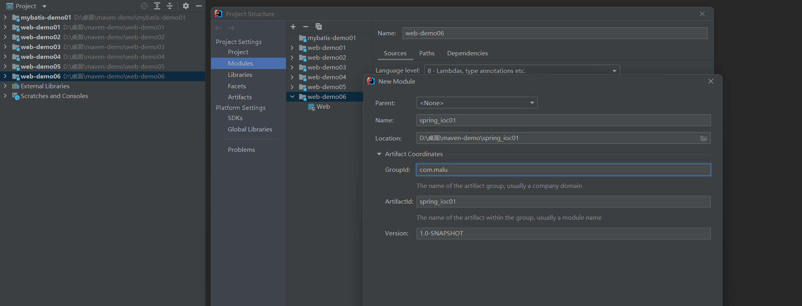


引入依赖：

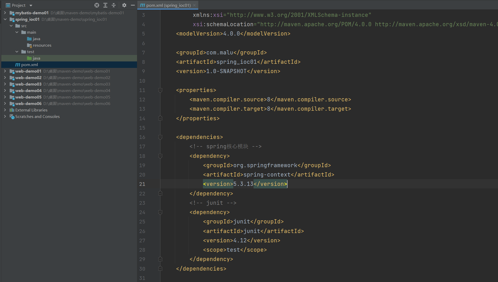

```xml
<?xml version="1.0" encoding="UTF-8"?>
<project xmlns="http://maven.apache.org/POM/4.0.0"
         xmlns:xsi="http://www.w3.org/2001/XMLSchema-instance"
         xsi:schemaLocation="http://maven.apache.org/POM/4.0.0 http://maven.apache.org/xsd/maven-4.0.0.xsd">
    <modelVersion>4.0.0</modelVersion>

    <groupId>com.malu</groupId>
    <artifactId>spring_ioc01</artifactId>
    <version>1.0-SNAPSHOT</version>

    <properties>
        <maven.compiler.source>8</maven.compiler.source>
        <maven.compiler.target>8</maven.compiler.target>
    </properties>

    <dependencies>
        <!-- spring核心模块 -->
        <dependency>
            <groupId>org.springframework</groupId>
            <artifactId>spring-context</artifactId>
            <version>5.3.13</version>
        </dependency>
        <!-- junit -->
        <dependency>
            <groupId>junit</groupId>
            <artifactId>junit</artifactId>
            <version>4.12</version>
            <scope>test</scope>
        </dependency>
    </dependencies>

</project>
```


创建实体类：

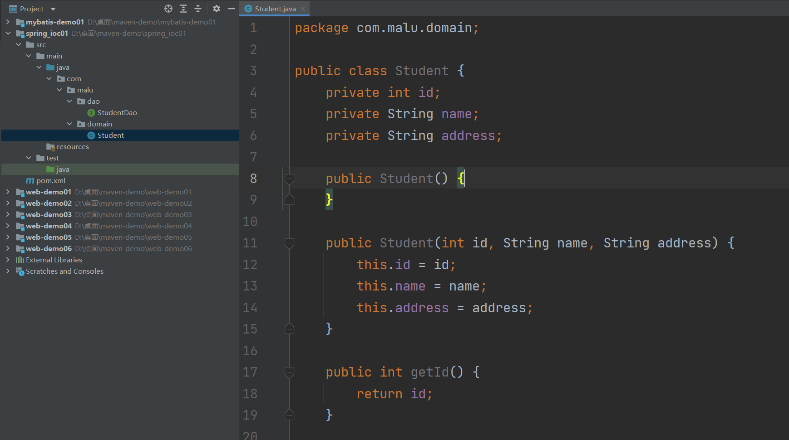

```java
package com.malu.domain;

public class Student {
    private int id;
    private String name;
    private String address;

    public Student() {
    }

    public Student(int id, String name, String address) {
        this.id = id;
        this.name = name;
        this.address = address;
    }

    public int getId() {
        return id;
    }

    public void setId(int id) {
        this.id = id;
    }

    public String getName() {
        return name;
    }

    public void setName(String name) {
        this.name = name;
    }

    public String getAddress() {
        return address;
    }

    public void setAddress(String address) {
        this.address = address;
    }

    @Override
    public String toString() {
        return "Student{" +
                "id=" + id +
                ", name='" + name + '\'' +
                ", address='" + address + '\'' +
                '}';
    }
}

```


写一个dao层的接口：


```java
package com.malu.dao;

import com.malu.domain.Student;

public interface StudentDao {
    // 根据id查询学生
    Student findById(int id);
}
```


自己写接口的实现类：

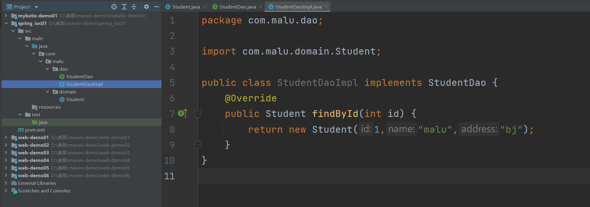

```java
package com.malu.dao;

import com.malu.domain.Student;

public class StudentDaoImpl implements StudentDao {
    @Override
    public Student findById(int id) {
        return new Student(1,"malu","bj");
    }
}

```


然后写service层：


```java
package com.malu.service;

import com.malu.dao.StudentDao;
import com.malu.dao.StudentDaoImpl;
import com.malu.domain.Student;

public class StudentService {
    private StudentDao studentDao = new StudentDaoImpl();

    public Student findStudentById(int id){
        return studentDao.findById(id);
    }
}
```


Dao层还可以有新的实现类，如下：


```java
package com.malu.dao;

import com.malu.domain.Student;

public class StudentDaoImpl2 implements StudentDao {
    @Override
    public Student findById(int id) {
        System.out.println("新的实现类~");
        return new Student(1,"wc","sh");
    }
}

```


如果service层，要使用StudentDaoImpl2，就需要修改源码：


这种写法有两个缺点：

- 浪费资源：StudentService调用方法时即会创建一个对象，如果不断调用方法则会创建大量StudentDao对象。
- 代码耦合度高：假设随着开发，我们创建了StudentDao另一个更加完善的实现类StudentDaoImpl2，如果在StudentService中想使用StudentDaoImpl2，则必须修改源码。


而IOC思想是将创建对象的权利交给框架，框架会帮助我们创建对象，分配对象的使用，控制权由程序代码转移到了框架中，控制权发生了反转，这就是Spring的IOC思想。而IOC思想可以完美的解决以上两个问题。


## 4，Spring实现IOC


接下来我们使用Spring实现IOC，Spring内部也有一个容器用来管理对象。创建Maven工程：

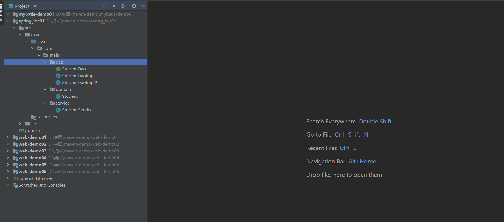


引入依赖：

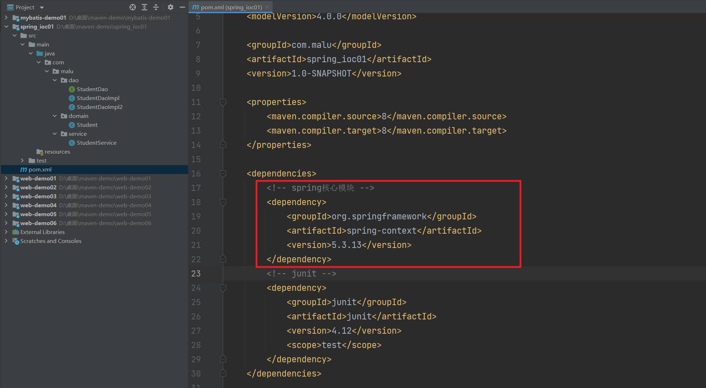

```xml
    <dependencies>
        <!-- spring核心模块 -->
        <dependency>
            <groupId>org.springframework</groupId>
            <artifactId>spring-context</artifactId>
            <version>5.3.13</version>
        </dependency>
        <!-- junit -->
        <dependency>
            <groupId>junit</groupId>
            <artifactId>junit</artifactId>
            <version>4.12</version>
            <scope>test</scope>
        </dependency>
    </dependencies>
```


创建POJO类:

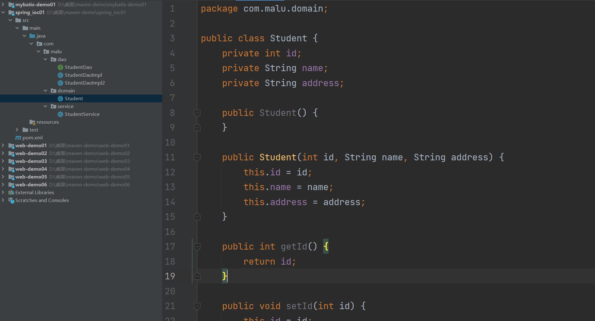

```java
package com.malu.domain;

public class Student {
    private int id;
    private String name;
    private String address;

    public Student() {
    }

    public Student(int id, String name, String address) {
        this.id = id;
        this.name = name;
        this.address = address;
    }

    public int getId() {
        return id;
    }

    public void setId(int id) {
        this.id = id;
    }

    public String getName() {
        return name;
    }

    public void setName(String name) {
        this.name = name;
    }

    public String getAddress() {
        return address;
    }

    public void setAddress(String address) {
        this.address = address;
    }

    @Override
    public String toString() {
        return "Student{" +
                "id=" + id +
                ", name='" + name + '\'' +
                ", address='" + address + '\'' +
                '}';
    }
}
```


Dao接口和实现类:


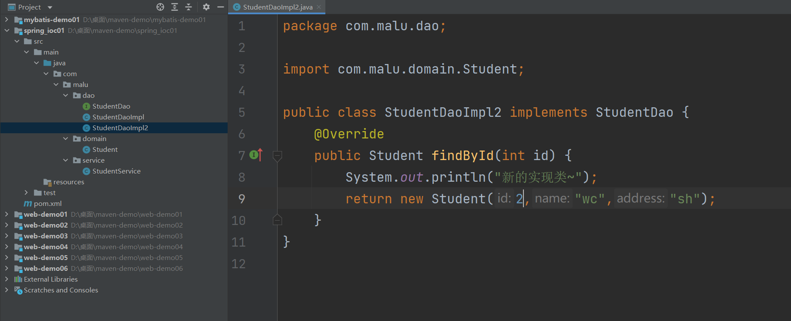


编写xml配置文件，配置文件中配置需要Spring帮我们创建的对象。


```xml
<?xml version="1.0" encoding="UTF-8"?>
<beans xmlns="http://www.springframework.org/schema/beans"
       xmlns:xsi="http://www.w3.org/2001/XMLSchema-instance"
       xsi:schemaLocation="http://www.springframework.org/schema/beans
        http://www.springframework.org/schema/beans/spring-beans.xsd">

    <bean id="studentDao" class="com.malu.dao.StudentDaoImpl"></bean>

</beans>
```


测试从Spring容器中获取对象。

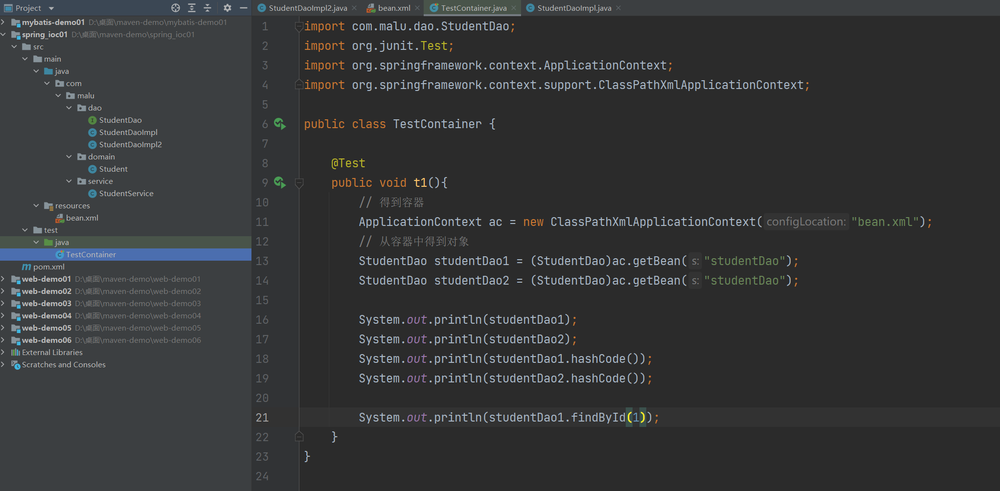

```java
import com.malu.dao.StudentDao;
import org.junit.Test;
import org.springframework.context.ApplicationContext;
import org.springframework.context.support.ClassPathXmlApplicationContext;

public class TestContainer {

    @Test
    public void t1(){
        // 得到容器
        ApplicationContext ac = new ClassPathXmlApplicationContext("bean.xml");
        // 从容器中得到对象
        StudentDao studentDao1 = (StudentDao)ac.getBean("studentDao");
        StudentDao studentDao2 = (StudentDao)ac.getBean("studentDao");

        System.out.println(studentDao1);
        System.out.println(studentDao2);
        System.out.println(studentDao1.hashCode());
        System.out.println(studentDao2.hashCode());

        System.out.println(studentDao1.findById(1));
    }
}

```


测试结果：


## 5，Spring容器类型


容器接口：

- BeanFactory：BeanFactory是Spring容器中的顶层接口，它可以对Bean对象进行管理。
- ApplicationContext：ApplicationContext是BeanFactory的子接口。它除了继承 BeanFactory的所有功能外，还添加了对国际化、资源访问、事件传播等方面的良好支持。ApplicationContext有以下三个常用实现类：
  - ClassPathXmlApplicationContext：该类可以从项目中读取配置文件
  - FileSystemXmlApplicationContext：该类从磁盘中读取配置文件
  - AnnotationConfigApplicationContext：使用该类不读取配置文件，而是会读取注解


演示：


## 6，对象的创建方式

复习一下：


Spring会帮助我们创建bean，那么它底层是调用什么方法进行创建的呢？Spring默认使用类的空参构造方法创建bean：


```java
package com.malu.dao;

import com.malu.domain.Student;

public class StudentDaoImpl implements StudentDao {
    // 这里默认有一个无构造器，也就是说Spring是通过这个无参构造器创建的对象

    // 自己手写了一个有参构造器，那么就不会生成无参构造器
    // 问：Spring能不能把这个对象创建出来呢？ 答：不能
    public StudentDaoImpl(int a){}

    @Override
    public Student findById(int id) {
        // 模拟从数据为中查找到的数据
        return new Student(1,"malu","bj");
    }
}
```


此时，Spring就不能帮我们创建对象了，如下：

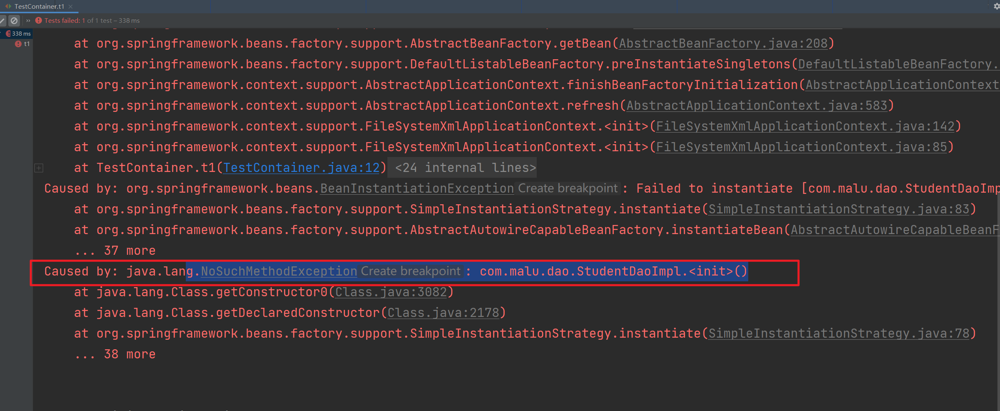


Spring可以调用工厂类的方法创建bean，创建工厂类，工厂类提供创建对象的方法：

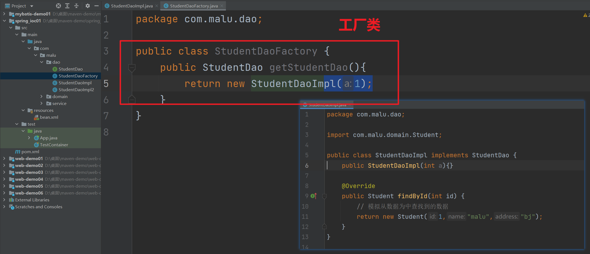

```java
package com.malu.dao;

public class StudentDaoFactory {
    public StudentDao getStudentDao(){
        return new StudentDaoImpl(1);
    }
}

```


在配置文件中配置创建bean的方式为工厂方式。

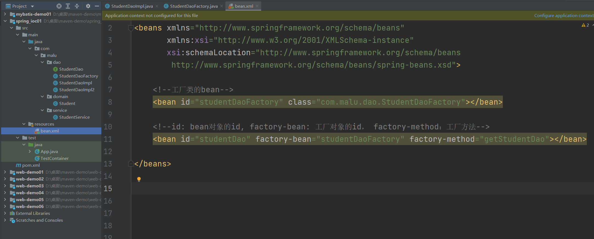

```xml
<?xml version="1.0" encoding="UTF-8"?>
<beans xmlns="http://www.springframework.org/schema/beans"
       xmlns:xsi="http://www.w3.org/2001/XMLSchema-instance"
       xsi:schemaLocation="http://www.springframework.org/schema/beans
        http://www.springframework.org/schema/beans/spring-beans.xsd">

    <!--工厂类的bean-->
    <bean id="studentDaoFactory" class="com.malu.dao.StudentDaoFactory"></bean>

    <!--id: bean对象的id, factory-bean: 工厂对象的id， factory-method：工厂方法-->
    <bean id="studentDao" factory-bean="studentDaoFactory" factory-method="getStudentDao"></bean>

</beans>


```


测试：

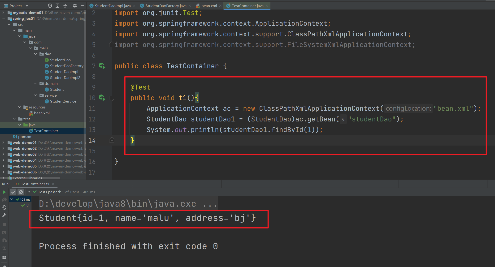


Spring可以调用工厂类的静态方法创建bean，创建工厂类，工厂提供创建对象的静态方法。

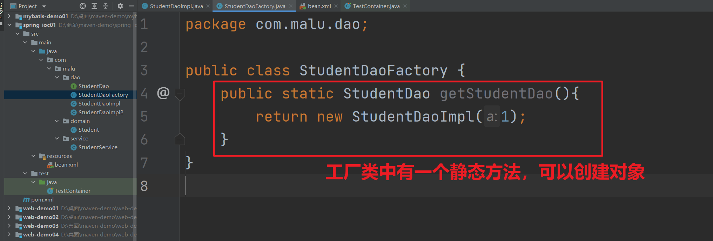

```java
public class StudentDaoFactory {
    public static StudentDao getStudentDao(){
        return new StudentDaoImpl(1);
    }
}
```


在配置文件中配置创建bean的方式为工厂静态方法。

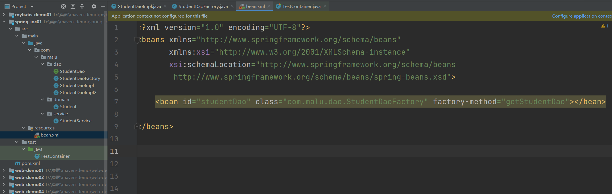

```xml
<?xml version="1.0" encoding="UTF-8"?>
<beans xmlns="http://www.springframework.org/schema/beans"
       xmlns:xsi="http://www.w3.org/2001/XMLSchema-instance"
       xsi:schemaLocation="http://www.springframework.org/schema/beans
        http://www.springframework.org/schema/beans/spring-beans.xsd">

    <bean id="studentDao" class="com.malu.dao.StudentDaoFactory" factory-method="getStudentDao"></bean>

</beans>
```


测试:


## 7，对象的创建策略


Spring通过配置  中的 scope 属性设置对象的创建策略，共有五种创建策略：

- singleton：单例，默认策略。整个项目只会创建一个对象，通过  bean中的 lazy-init 属性可以设置单例对象的创建时机：
  - lazy-init="false"(默认)：立即创建，在容器启动时会创建配置文件中的所有Bean对象。
  - lazy-init="true"：延迟创建，第一次使用Bean对象时才会创建。
- prototype：多例，每次从容器中获取时都会创建对象。
- request：每次请求创建一个对象，只在web环境有效。
- session：每次会话创建一个对象，只在web环境有效。
- gloabal-session：一次集群环境的会话创建一个对象，只在web环境有效。


配置单例策略：

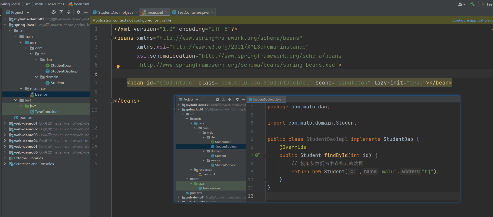

```xml
<?xml version="1.0" encoding="UTF-8"?>
<beans xmlns="http://www.springframework.org/schema/beans"
       xmlns:xsi="http://www.w3.org/2001/XMLSchema-instance"
       xsi:schemaLocation="http://www.springframework.org/schema/beans
        http://www.springframework.org/schema/beans/spring-beans.xsd">

    <bean id="studentDao" class="com.malu.dao.StudentDaoImpl" scope="singleton" lazy-init="true"></bean>

</beans>

```


测试单例策略：


```java
    @Test
    public void t1(){
        ApplicationContext ac = new ClassPathXmlApplicationContext("bean.xml");
        StudentDao studentDao1 = (StudentDao)ac.getBean("studentDao");
        StudentDao studentDao2 = (StudentDao)ac.getBean("studentDao");
        StudentDao studentDao3 = (StudentDao)ac.getBean("studentDao");
        System.out.println(studentDao1.hashCode());
        System.out.println(studentDao2.hashCode());
        System.out.println(studentDao3.hashCode());
    }
```


配置多例：

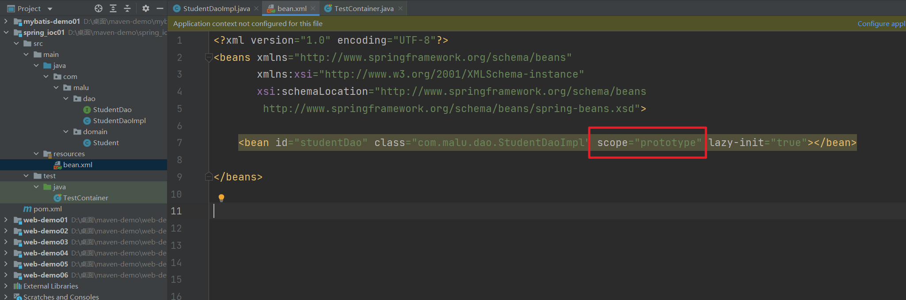

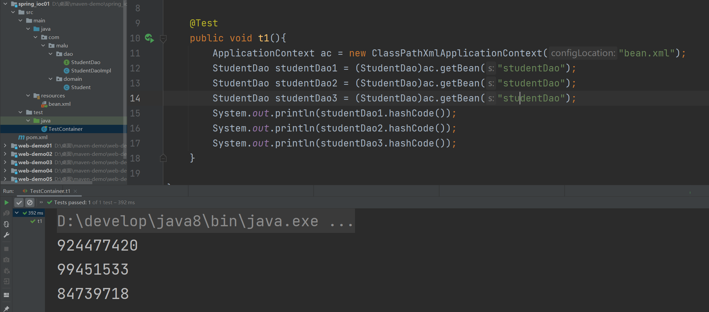

```java
<bean id="studentDao" class="com.malu.dao.StudentDaoImpl" scope="prototype" lazy-init="true"></bean>
```


## 8，对象的销毁时机

对象的创建策略不同，销毁时机也不同：

- singleton：对象随着容器的销毁而销毁。
- prototype：使用JAVA垃圾回收机制销毁对象。
- request：当处理请求结束，bean实例将被销毁。
- session：当HTTP Session最终被废弃的时候，bean也会被销毁掉。
- gloabal-session：集群环境下的session销毁，bean实例也将被销毁。


## 9，生命周期方法

Bean对象的生命周期包含创建——使用——销毁，Spring可以配置Bean对象在创建和销毁时自动执行的方法，定义生命周期方法:


```java
package com.malu.dao;

import com.malu.domain.Student;

public class StudentDaoImpl implements StudentDao {
    public void init(){
        System.out.println("创建StudentDaoImpl...");
    }
    @Override
    public Student findById(int id) {
        return new Student(1,"malu","bj");
    }
    public void destory(){
        System.out.println("销毁StudentDaoImpl...");
    }
}
```


配置生命周期方法：


```xml
<?xml version="1.0" encoding="UTF-8"?>
<beans xmlns="http://www.springframework.org/schema/beans"
       xmlns:xsi="http://www.w3.org/2001/XMLSchema-instance"
       xsi:schemaLocation="http://www.springframework.org/schema/beans
        http://www.springframework.org/schema/beans/spring-beans.xsd">

    <!-- init-method:创建对象时执行的方法 -->
    <!-- destroy-method:销毁对象时执行的方法 -->
    <bean id="studentDao" class="com.malu.dao.StudentDaoImpl" init-method="init" destroy-method="destory"></bean>

</beans>

```


测试：

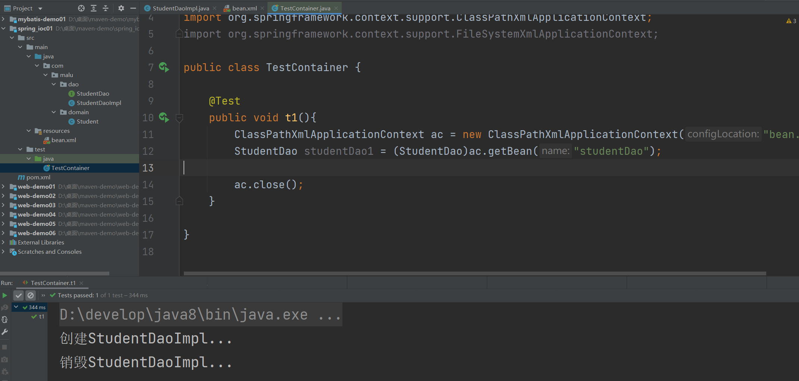

```java
    @Test
    public void t1(){
        ClassPathXmlApplicationContext ac = new ClassPathXmlApplicationContext("bean.xml");
        StudentDao studentDao1 = (StudentDao)ac.getBean("studentDao");

        ac.close();
    }
```


## 10，获取Bean对象的方式

Spring有多种获取容器中对象的方式：

- 通过id/name获取
- 通过类型获取
- 通过类型+id/name获取


通过id获取：


通过name获取：

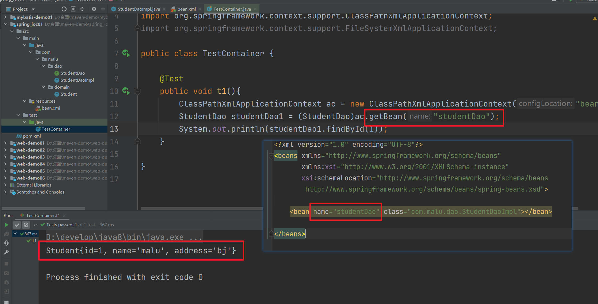


通过类型获取：

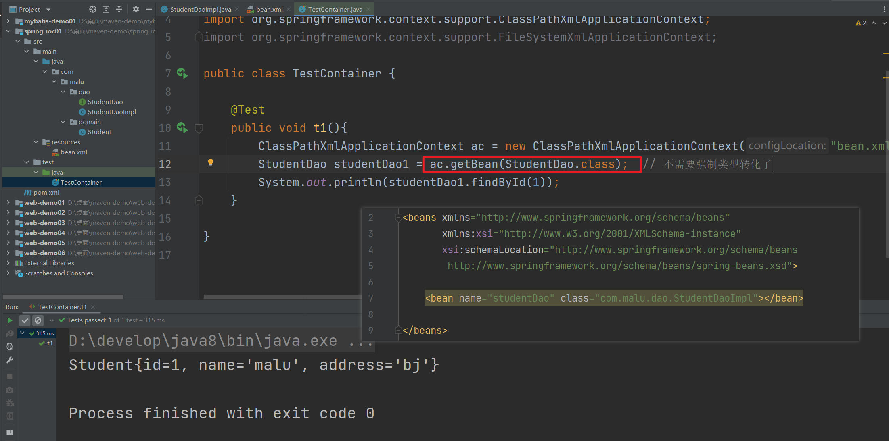

可以看到使用类型获取不需要强转。


虽然使用类型获取不需要强转，但如果在容器中有一个接口的多个实现类对象，则获取时会报错，如下：


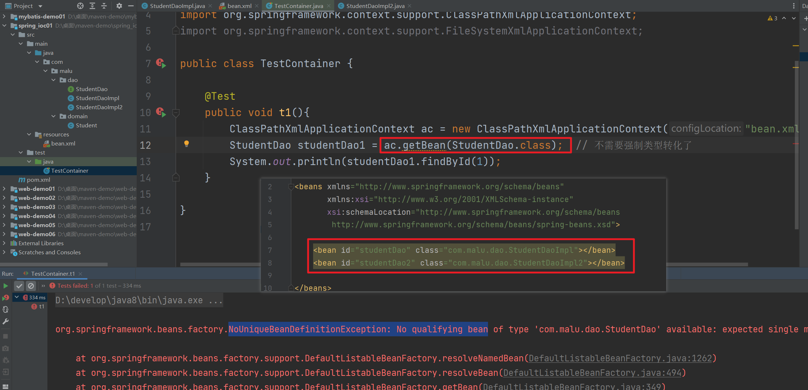


此时需要使用类型+id/name获取：


## 11，什么是依赖注入


复习：


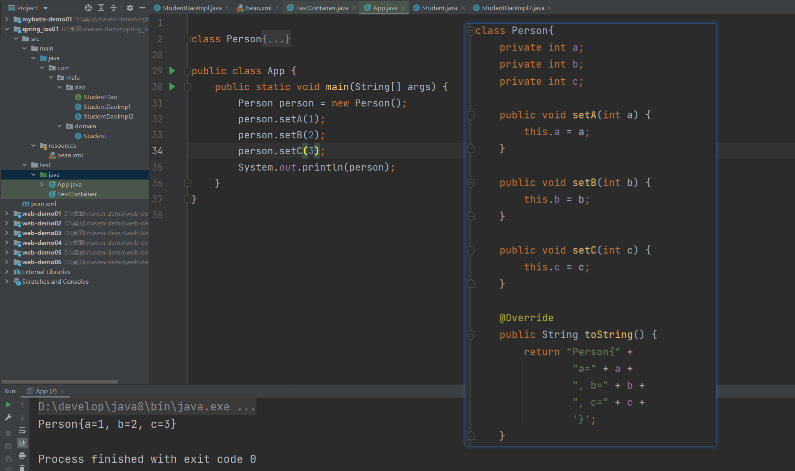


Dao层代码：

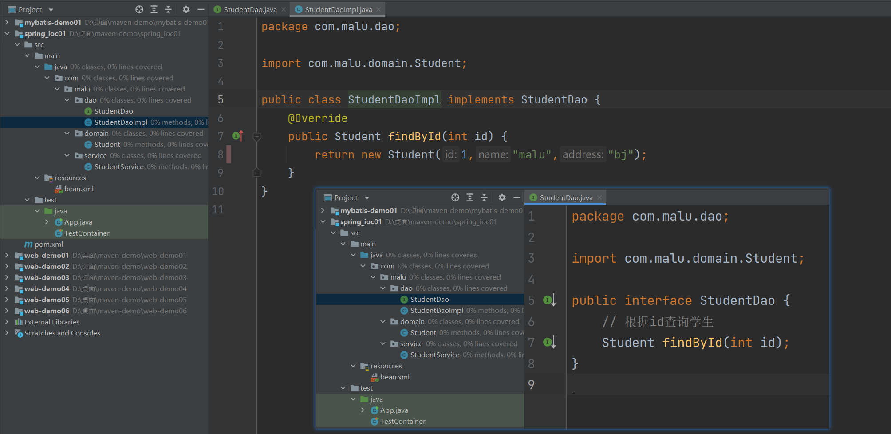

依赖注入（Dependency Injection，简称DI），它是Spring控制反转思想的具体实现。控制反转将对象的创建交给了Spring，但是对象中可能会依赖其他对象。比如service类中要有dao类的属性，我们称service依赖于dao。之前需要手动注入属性值，代码如下：

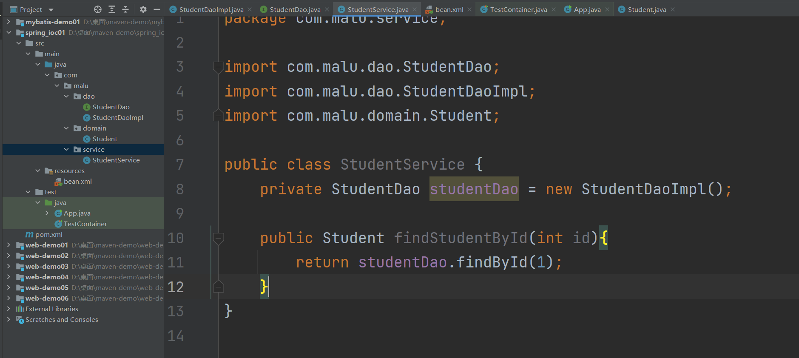

```java
package com.malu.service;

import com.malu.dao.StudentDao;
import com.malu.dao.StudentDaoImpl;
import com.malu.domain.Student;

public class StudentService {
    private StudentDao studentDao = new StudentDaoImpl();

    public Student findStudentById(int id){
        return studentDao.findById(1);
    }
}
```


此时，当StudentService的想要使用StudentDao的另一个实现类如StudentDaoImpl2时，则需要修改Java源码，造成代码的可维护性降低。


而使用Spring框架后，Spring管理Service对象与Dao对象，此时它能够为Service对象注入依赖的Dao属性值。这就是Spring的依赖注入。简单来说，控制反转是创建对象，依赖注入是为对象的属性赋值。


## 12，依赖注入方式


在之前开发中，可以通过setter方法设置对象属性值：

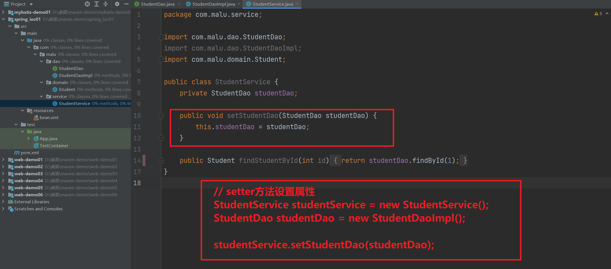


还可以通过构造方法设置对象属性值：

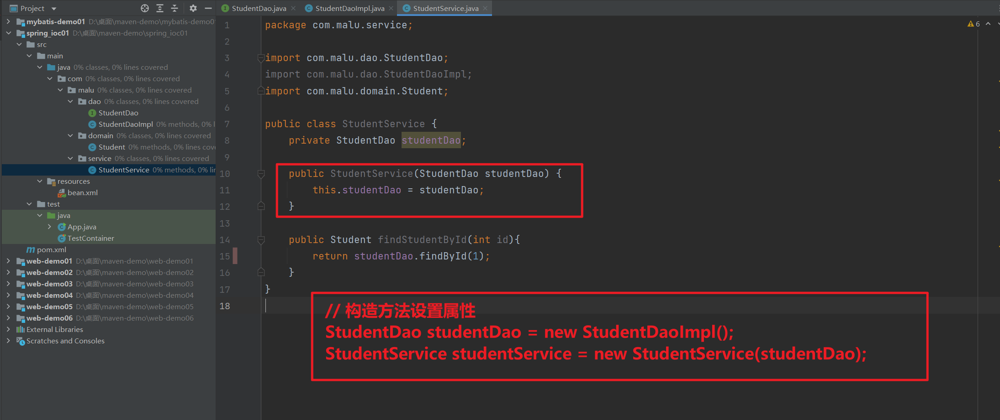


Spring可以通过调用setter方法或构造方法给属性赋值，先看一下Setter注入，被注入类编写属性的setter方法，如下：

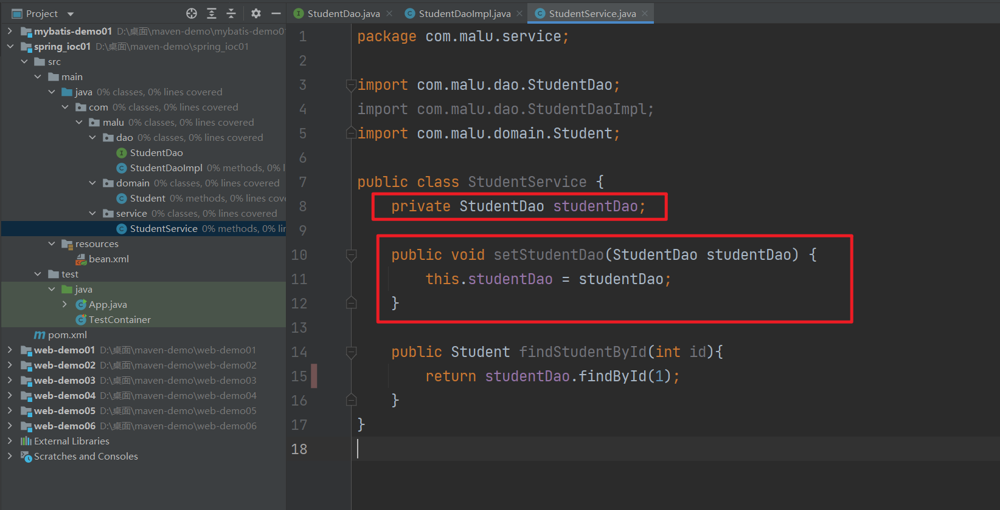

```java
public class StudentService {
    private StudentDao studentDao;

    public void setStudentDao(StudentDao studentDao) {
        this.studentDao = studentDao;
    }

    public Student findStudentById(int id){
        return studentDao.findById(1);
    }
}
```


在配置文件中，给需要注入属性值的bean中设置property，如下：

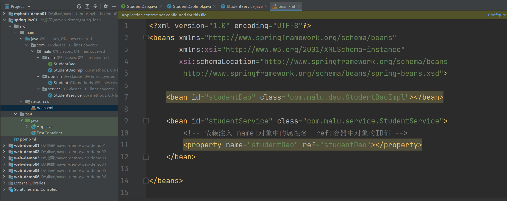

```xml
<?xml version="1.0" encoding="UTF-8"?>
<beans xmlns="http://www.springframework.org/schema/beans"
       xmlns:xsi="http://www.w3.org/2001/XMLSchema-instance"
       xsi:schemaLocation="http://www.springframework.org/schema/beans
        http://www.springframework.org/schema/beans/spring-beans.xsd">

    <bean id="studentDao" class="com.malu.dao.StudentDaoImpl"></bean>

    <bean id="studentService" class="com.malu.service.StudentService">
        <!-- 依赖注入 name:对象中的属性名  ref:容器中对象的ID值 -->
        <property name="studentDao" ref="studentDao"></property>
    </bean>

</beans>

```


测试是否注入成功：

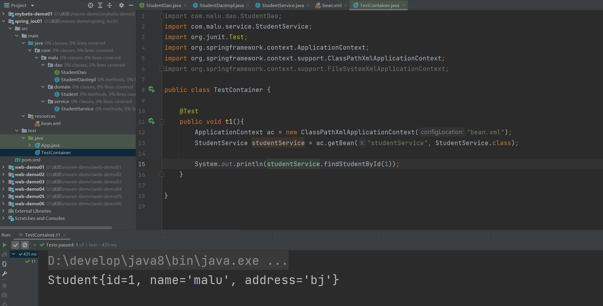

```java
public class TestContainer {

    @Test
    public void t1(){
        ApplicationContext ac = new ClassPathXmlApplicationContext("bean.xml");
        StudentService studentService = ac.getBean("studentService", StudentService.class);

        System.out.println(studentService.findStudentById(1));
    }
}
```


构造器方法注入，被注入类编写有参的构造方法，如下：

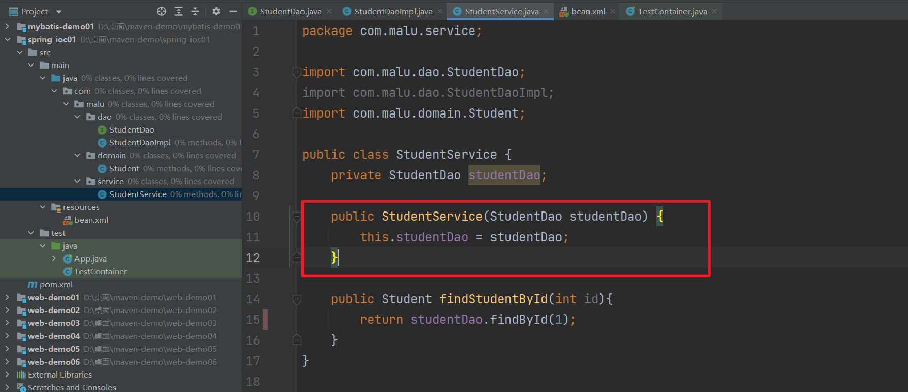

```java
public class StudentService {
    private StudentDao studentDao;

    public StudentService(StudentDao studentDao) {
        this.studentDao = studentDao;
    }

    public Student findStudentById(int id){
        return studentDao.findById(1);
    }
}
```


给需要注入属性值的  bean 中设置 constructor-arg，如下：

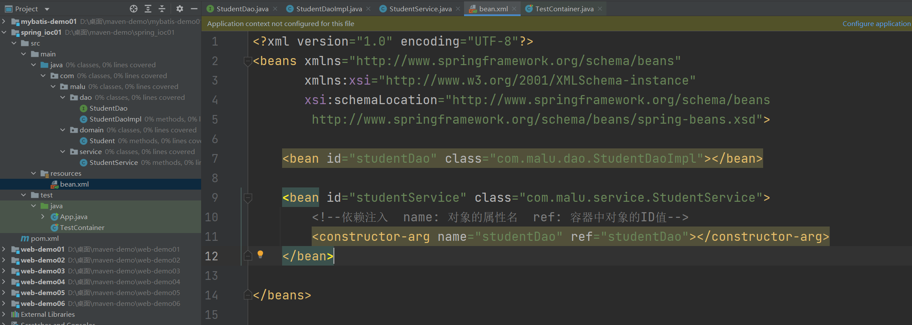

```xml
<?xml version="1.0" encoding="UTF-8"?>
<beans xmlns="http://www.springframework.org/schema/beans"
       xmlns:xsi="http://www.w3.org/2001/XMLSchema-instance"
       xsi:schemaLocation="http://www.springframework.org/schema/beans
        http://www.springframework.org/schema/beans/spring-beans.xsd">

    <bean id="studentDao" class="com.malu.dao.StudentDaoImpl"></bean>

    <bean id="studentService" class="com.malu.service.StudentService">
        <!--依赖注入  name: 对象的属性名  ref: 容器中对象的ID值-->
        <constructor-arg name="studentDao" ref="studentDao"></constructor-arg>
    </bean>

</beans>

```


测试：

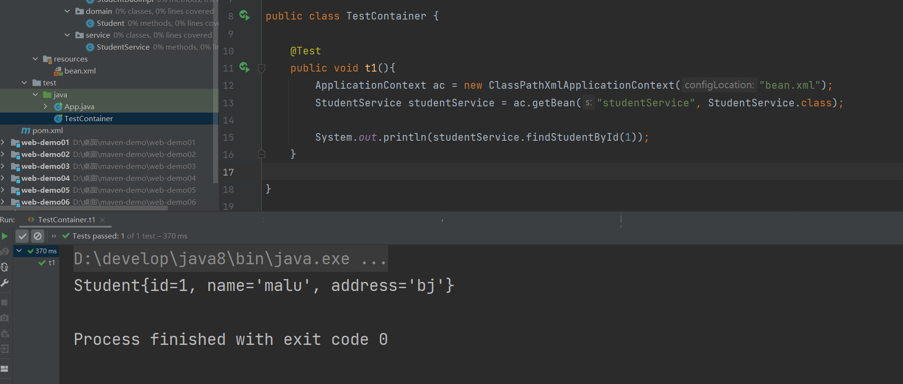


上面的两种注入方法，都是手动的注入，还有一种注入方式，叫自动注入，自动注入不需要在  bean 标签中添加其他标签注入属性值，而是自动从容器中找到相应的bean对象设置为属性值。


自动注入有两种配置方式：

- 全局配置：在beans标签中设置 default-autowire 属性可以定义所有bean对象的自动注入策略。
- 局部配置：在bean 中设置 autowire 属性可以定义当前bean对象的自动注入策略。


autowire的取值：

- no：不会进行自动注入。
- default：全局配置default相当于no，局部配置default表示使用全局配置
- byName：在Spring容器中查找id与属性名相同的bean，并进行注入。需要提供set方法。
- byType：在Spring容器中查找类型与属性类型相同的bean，并进行注入。需要提供set方法。
- constructor：在Spring容器中查找id与属性名相同的bean，并进行注入。需要提供构造方法。


代码演示，提供setter和构造器：

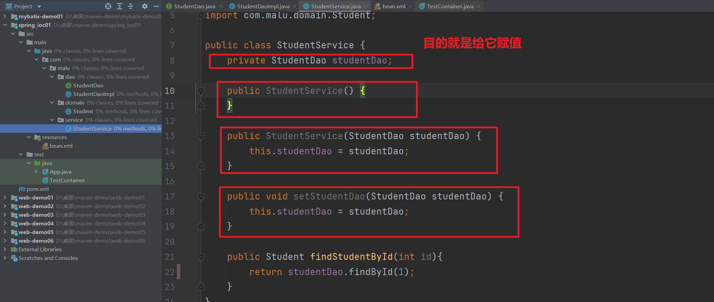


开始配置自动依赖注入，根据beanId等于属性名自动注入：

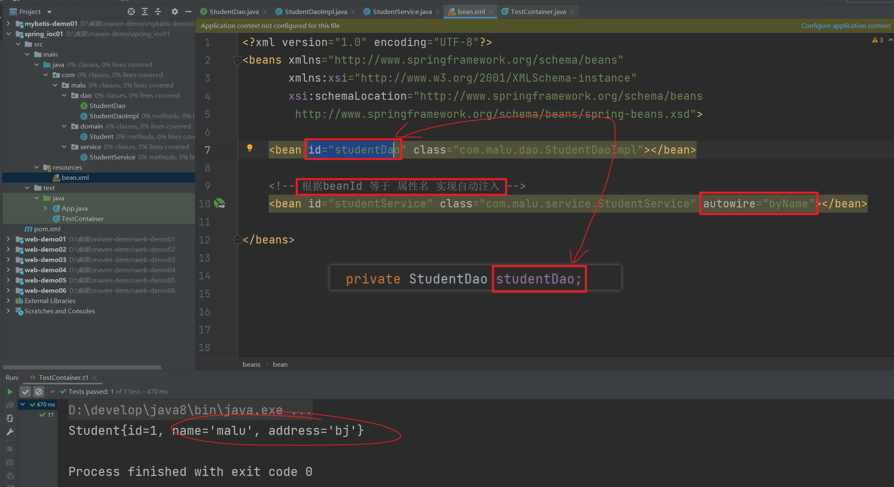

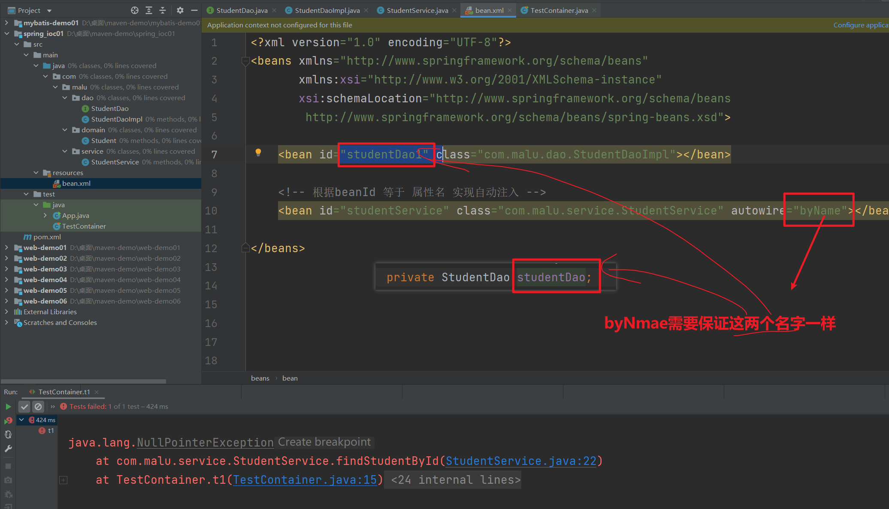


继续配置自动依赖注入，根据bean类型等于属性类型自动注入：

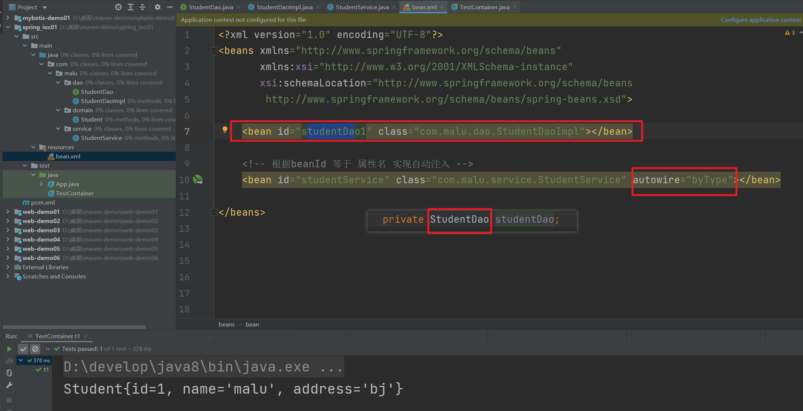


利用构造方法自动注入：

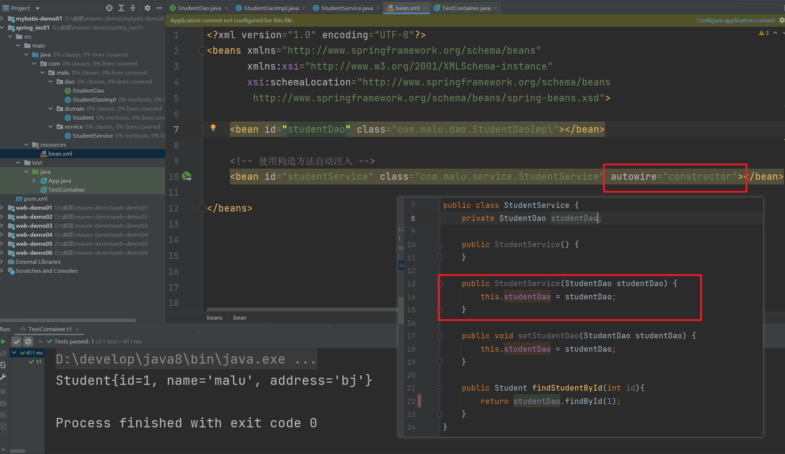


配置全局自动注入：

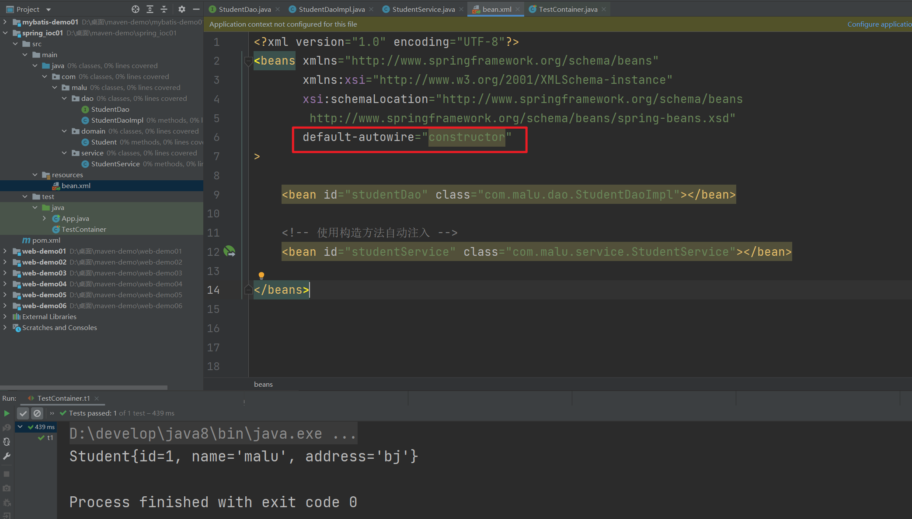


## 13，依赖注入类型

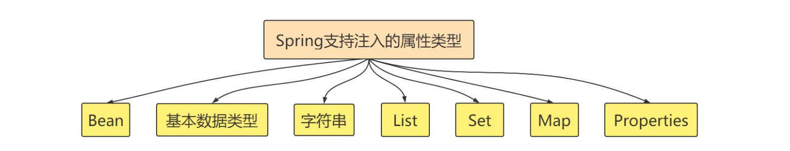

DI支持注入bean类型、基本数据类型和字符串、List集合、Set集合、Map集合、Properties对象类型等，他们的写法如下：

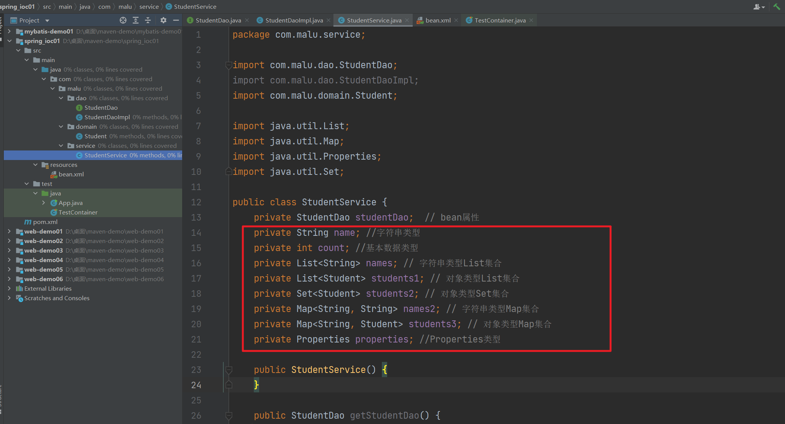

```java
package com.malu.service;

import com.malu.dao.StudentDao;
import com.malu.dao.StudentDaoImpl;
import com.malu.domain.Student;

import java.util.List;
import java.util.Map;
import java.util.Properties;
import java.util.Set;

public class StudentService {
    private StudentDao studentDao;  // bean属性
    private String name; //字符串类型
    private int count; //基本数据类型
    private List<String> names; // 字符串类型List集合
    private List<Student> students1; // 对象类型List集合
    private Set<Student> students2; // 对象类型Set集合
    private Map<String, String> names2; // 字符串类型Map集合
    private Map<String, Student> students3; // 对象类型Map集合
    private Properties properties; //Properties类型

    public StudentService() {
    }

    public StudentDao getStudentDao() {
        return studentDao;
    }

    public void setStudentDao(StudentDao studentDao) {
        this.studentDao = studentDao;
    }

    public String getName() {
        return name;
    }

    public void setName(String name) {
        this.name = name;
    }

    public int getCount() {
        return count;
    }

    public void setCount(int count) {
        this.count = count;
    }

    public List<String> getNames() {
        return names;
    }

    public void setNames(List<String> names) {
        this.names = names;
    }

    public List<Student> getStudents1() {
        return students1;
    }

    public void setStudents1(List<Student> students1) {
        this.students1 = students1;
    }

    public Set<Student> getStudents2() {
        return students2;
    }

    public void setStudents2(Set<Student> students2) {
        this.students2 = students2;
    }

    public Map<String, String> getNames2() {
        return names2;
    }

    public void setNames2(Map<String, String> names2) {
        this.names2 = names2;
    }

    public Map<String, Student> getStudents3() {
        return students3;
    }

    public void setStudents3(Map<String, Student> students3) {
        this.students3 = students3;
    }

    public Properties getProperties() {
        return properties;
    }

    public void setProperties(Properties properties) {
        this.properties = properties;
    }

    @Override
    public String toString() {
        return "StudentService{" +
                "studentDao=" + studentDao +
                ", name='" + name + '\'' +
                ", count=" + count +
                ", names=" + names +
                ", students1=" + students1 +
                ", students2=" + students2 +
                ", names2=" + names2 +
                ", students3=" + students3 +
                ", properties=" + properties +
                '}';
    }

    public Student findStudentById(int id){
        return studentDao.findById(1);
    }
}

```


测试方法：

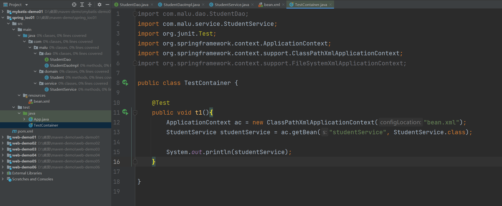

```java
    @Test
    public void t1(){
        ApplicationContext ac = new ClassPathXmlApplicationContext("bean.xml");
        StudentService studentService = ac.getBean("studentService", StudentService.class);

        System.out.println(studentService);
    }
```


注入bean类型，写法一：

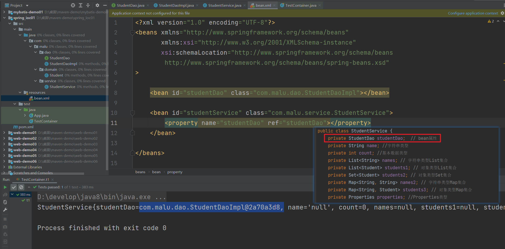


注入bean类型，写法二：

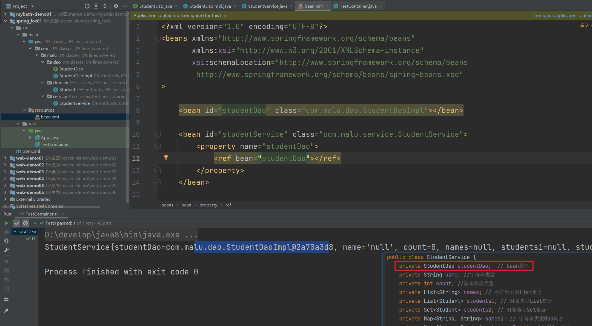


注入基本数据类型写法一：

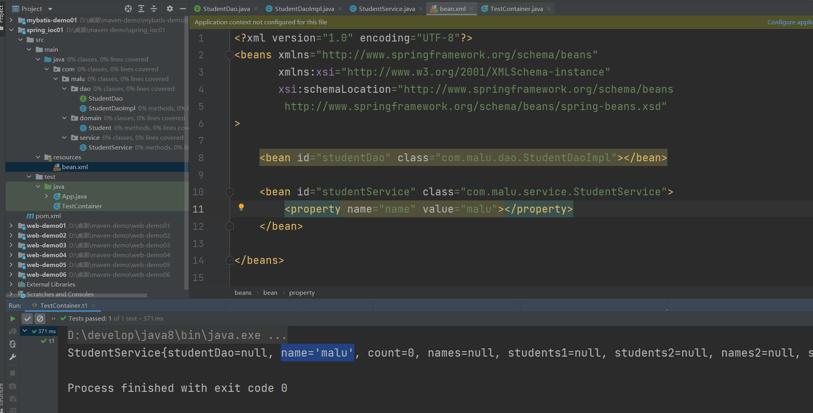


注入基本数据类型写法二：


简单类型的List集合：

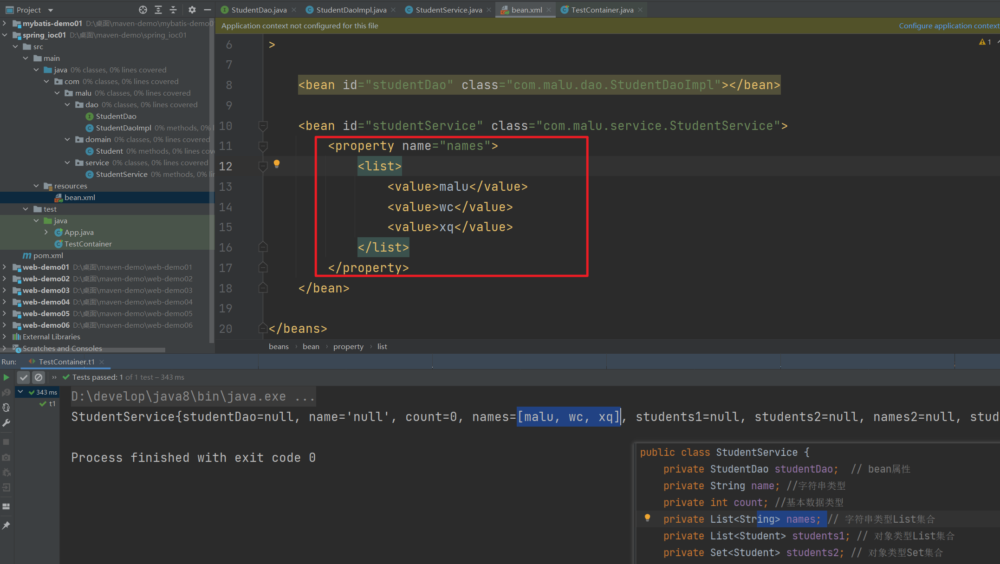


对象类型List集合：

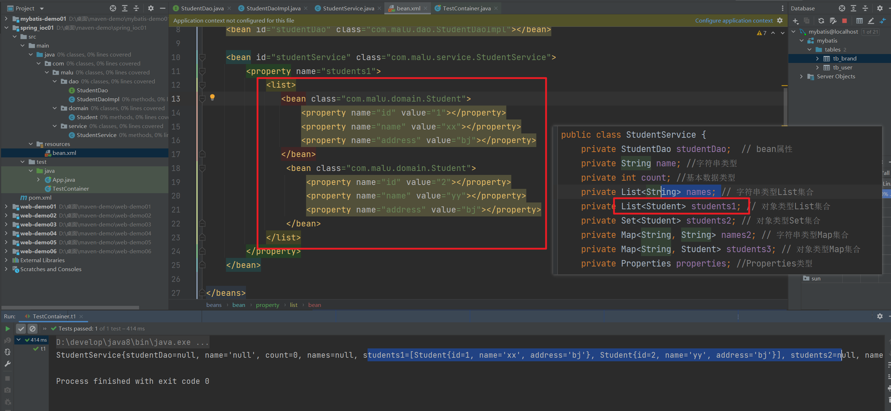


注入Set集合：

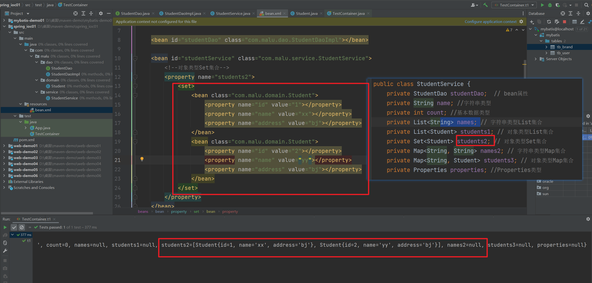


简单数据类型Map集合：

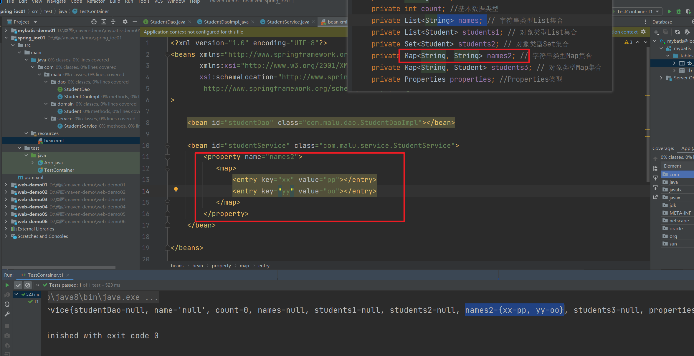


对象类型Map集合：

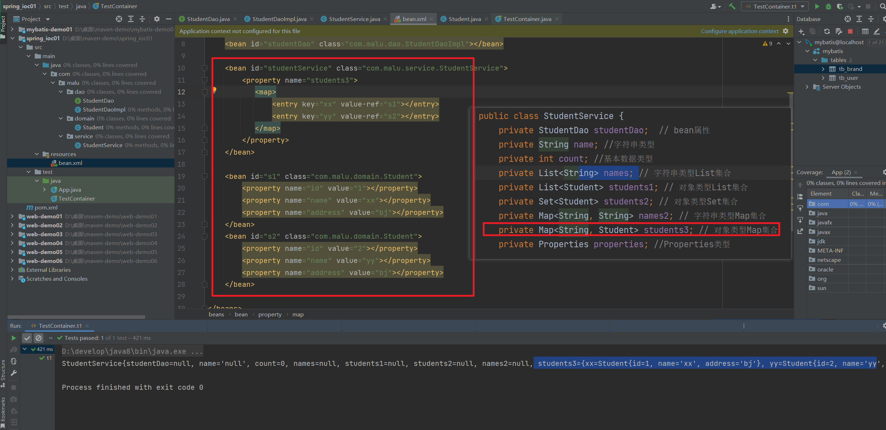


注入Properties对象：


## 14，注解实现IOC

注解配置和xml配置对于Spring的IOC要实现的功能都是一样的，只是配置的形式不一样。还用如下的项目：


上面的bean.xml中一个空的配置文件，想让该文件支持注解，需要添加新的约束：

```xml
<?xml version="1.0" encoding="UTF-8"?>
<beans xmlns="http://www.springframework.org/schema/beans"
       xmlns:context="http://www.springframework.org/schema/context"
       xmlns:xsi="http://www.w3.org/2001/XMLSchema-instance"
       xsi:schemaLocation="http://www.springframework.org/schema/beans
        http://www.springframework.org/schema/beans/spring-beans.xsd
        http://www.springframework.org/schema/context
        http://www.springframework.org/schema/context/spring-context.xsd">


</beans>

```


## 15，@Component

- 作用：用于创建对象，放入Spring容器，相当于 bean 标签

  ```xml
  <bean id="studentDao" class="com.malu.dao.StudentDaoImpl"></bean>
  ```

- 位置：类上方


要在配置文件中配置扫描的包，扫描到该注解才能生效：


```xml
<?xml version="1.0" encoding="UTF-8"?>
<beans xmlns="http://www.springframework.org/schema/beans"
       xmlns:context="http://www.springframework.org/schema/context"
       xmlns:xsi="http://www.w3.org/2001/XMLSchema-instance"
       xsi:schemaLocation="http://www.springframework.org/schema/beans
        http://www.springframework.org/schema/beans/spring-beans.xsd
        http://www.springframework.org/schema/context
        http://www.springframework.org/schema/context/spring-context.xsd">

    <context:component-scan base-package="com.malu"></context:component-scan>

</beans>
```


演示：


注意：@Component 注解配置bean的默认id是首字母小写的类名。也可以手动设置bean的id值。


## 16，@Repository, @Service,@Controller

- 作用：这三个注解和@Component的作用一样，使用它们是为了区分该类属于什么层。
- 位置：
  - @Repository用于Dao层
  - @Service用于Service层
  - @Controller用于Controller层


演示：


## 17，@Scope

- 作用：指定bean的创建策略
- 位置：类上方
- 取值：singleton prototype request session globalsession


演示：


## 18，@Autowired


- 作用：从容器中查找符合属性类型的对象自动注入属性中。用于代替bean中的依赖注入配置。
- 位置：属性上方、setter方法上方、构造方法上方。


演示：


容器中没有对象类型的对象时会报错：


容器中有多个对象匹配类型时，会找beanId等于属性名的对象，找不到会报错。


## 19，@Qualifier


- 作用：在按照类型注入对象的基础上，再按照bean的id注入。
- 位置：属性上方
- 注意：@Qualifier必须和@Autowired一起使用。


演示：


## 20，@Value


- 作用：注入String类型和基本数据类型的属性值。
- 位置：属性上方


直接设置固定的属性值：


获取配置文件中的属性值，编写配置文件，db.properties，如下：


```properties
jdbc.username=root
jdbc.password=123456
```


spring核心配置文件扫描配置文件:


```xml
<?xml version="1.0" encoding="UTF-8"?>
<beans xmlns="http://www.springframework.org/schema/beans"
       xmlns:context="http://www.springframework.org/schema/context"
       xmlns:xsi="http://www.w3.org/2001/XMLSchema-instance"
       xsi:schemaLocation="http://www.springframework.org/schema/beans
        http://www.springframework.org/schema/beans/spring-beans.xsd
        http://www.springframework.org/schema/context
        http://www.springframework.org/schema/context/spring-context.xsd">

    <context:component-scan base-package="com.malu"></context:component-scan>

    <context:property-placeholder location="db.properties"></context:property-placeholder>
</beans>
```


注入配置文件中的属性值：


```java
@Service
public class StudentService {

    @Value("${jdbc.username}")
    private String username;

    @Value("${jdbc.password}")
    private String password;

    @Override
    public String toString() {
        return "StudentService{" +
                "username='" + username + '\'' +
                ", password='" + password + '\'' +
                '}';
    }
}
```


## 21，@Configuration

此时基于注解的IOC配置已经完成，但是我们依然离不开Spring的xml配置文件。接下来我们脱离bean.xml，使用纯注解实现IOC。在真实开发中，我们一般还是会保留xml配置文件，很多情况下使用配置文件更加方便。


删除配置文件：


纯注解实现IOC需要一个Java类代替xml文件。这个Java类上方需要添加@Configuration，表示该类是一个配置类，作用是代替配置文件。


## 22，@ComponentScan


- 作用：指定spring在初始化容器时扫描的包。
- 位置：配置类上方


演示：


## 23，@PropertySource


- 作用：代替配置文件中的  context:property-placeholder 扫描配置文件
- 位置：配置类上方
- 注意：配置文件位置前要加关键字 classpath


演示：


## 24，@Bean


- 作用：将方法的返回值对象放入Spring容器中。如果想将第三方类的对象放入容器，可以使用@Bean
- 位置：配置类的方法上方。
- 属性：name：给bean对象设置id
- 注意：@Bean修饰的方法如果有参数，spring会根据参数类型从容器中查找可用对象。


举例：如果想将jdbc连接对象放入Spring容器，我们无法修改Connection源码添加@Component，此时就需要使用将@Bean该对象放入Spring容器，添加驱动：


```xml
    <dependencies>
        <!-- spring核心模块 -->
        <dependency>
            <groupId>org.springframework</groupId>
            <artifactId>spring-context</artifactId>
            <version>5.3.13</version>
        </dependency>
        <!-- junit -->
        <dependency>
            <groupId>junit</groupId>
            <artifactId>junit</artifactId>
            <version>4.12</version>
            <scope>test</scope>
        </dependency>
        <!-- mysql驱动 -->
        <dependency>
            <groupId>mysql</groupId>
            <artifactId>mysql-connector-java</artifactId>
            <version>8.0.27</version>
        </dependency>
    </dependencies>
```


将Connection对象放入Spring容器:


```java
@Configuration
@ComponentScan("com.malu")
@PropertySource("classpath:db.properties")
public class SpringConfig {

    @Bean(name = "connection")
    public Connection getConnection(){
       try{
           Class.forName("com.mysql.cj.jdbc.Driver");
           return DriverManager.getConnection("jdbc:mysql:///mybatis","root","root");
       }catch (Exception exception){
           return  null;
       }
    }

}

```


测试：


## 25，@Import


- 作用：如果配置过多，会有多个配置类，该注解可以为主配置类导入其他配置类
- 位置：主配置类上方


演示，创建一个新的配置类：


需要在主配置类中，导入上面你创建的新的配置类：


## 26，Spring整合MyBatis   

我们知道使用MyBatis时需要写大量创建SqlSessionFactoryBuilder、SqlSessionFactory、SqlSession等对
象的代码，而Spring的作用是帮助我们创建和管理对象，所以我们可以使用Spring整合MyBatis，简化MyBatis开发。


创建maven项目，引入依赖。


```xml
<?xml version="1.0" encoding="UTF-8"?>
<project xmlns="http://maven.apache.org/POM/4.0.0"
         xmlns:xsi="http://www.w3.org/2001/XMLSchema-instance"
         xsi:schemaLocation="http://maven.apache.org/POM/4.0.0 http://maven.apache.org/xsd/maven-4.0.0.xsd">
    <modelVersion>4.0.0</modelVersion>

    <groupId>com.malu</groupId>
    <artifactId>spring_mybatis</artifactId>
    <version>1.0-SNAPSHOT</version>

    <properties>
        <maven.compiler.source>8</maven.compiler.source>
        <maven.compiler.target>8</maven.compiler.target>
    </properties>

    <dependencies>
        <!-- mybatis -->
        <dependency>
            <groupId>org.mybatis</groupId>
            <artifactId>mybatis</artifactId>
            <version>3.5.7</version>
        </dependency>
        <!-- 驱动 -->
        <dependency>
            <groupId>mysql</groupId>
            <artifactId>mysql-connector-java</artifactId>
            <version>8.0.26</version>
        </dependency>
        <!-- spring -->
        <dependency>
            <groupId>org.springframework</groupId>
            <artifactId>spring-context</artifactId>
            <version>5.3.13</version>
        </dependency>
        <dependency>
            <groupId>org.springframework</groupId>
            <artifactId>spring-tx</artifactId>
            <version>5.3.13</version>
        </dependency>
        <dependency>
            <groupId>org.springframework</groupId>
            <artifactId>spring-jdbc</artifactId>
            <version>5.3.13</version>
        </dependency>
        <!-- mybatis和Spring的整合包 -->
        <dependency>
            <groupId>org.mybatis</groupId>
            <artifactId>mybatis-spring</artifactId>
            <version>2.0.6</version>
        </dependency>
        <!--  junit  -->
        <dependency>
            <groupId>junit</groupId>
            <artifactId>junit</artifactId>
            <version>4.12</version>
            <scope>test</scope>
        </dependency>
        <!--  spring整合junit  -->
        <dependency>
            <groupId>org.springframework</groupId>
            <artifactId>spring-test</artifactId>
            <version>5.3.13</version>
        </dependency>
        <!-- druid -->
        <dependency>
            <groupId>com.alibaba</groupId>
            <artifactId>druid</artifactId>
            <version>1.2.8</version>
        </dependency>
    </dependencies>

</project>
```


编写数据库配置文件db.properties


```properties
jdbc.driverClassName=com.mysql.jdbc.Driver
jdbc.url=jdbc:mysql://127.0.0.1:3388/student
jdbc.username=root
jdbc.password=root
```


创建MyBatis配置文件SqlMapConfig.xml，数据源、扫描接口都交由Spring管理，不需要在MyBatis配置文件中设置。


```xml
<?xml version="1.0" encoding="UTF-8"?>
<!DOCTYPE configuration
        PUBLIC "-//mybatis.org//DTD Config 3.0//EN"
        "http://mybatis.org/dtd/mybatis-3-config.dtd">
<configuration>

</configuration>
```


创建Spring配置文件applicationContext.xml


```xml
<?xml version="1.0" encoding="UTF-8"?>
<beans xmlns="http://www.springframework.org/schema/beans"
       xmlns:context="http://www.springframework.org/schema/context"
       xmlns:xsi="http://www.w3.org/2001/XMLSchema-instance"
       xsi:schemaLocation="http://www.springframework.org/schema/beans
         http://www.springframework.org/schema/beans/spring-beans.xsd
         http://www.springframework.org/schema/context
         http://www.springframework.org/schema/context/spring-context.xsd">

    <!--  包扫描  -->
    <context:component-scan base-package="com.malu"></context:component-scan>

    <!--  读取配置文件  -->
    <context:property-placeholder location="classpath:db.properties"></context:property-placeholder>


    <!-- 创建数据库连接池对象 -->
    <bean id="dataSource" class="com.alibaba.druid.pool.DruidDataSource" >
        <property name="driverClassName" value="com.mysql.jdbc.Driver" />
        <property name="url" value="${jdbc.url}" />
        <property name="username" value="${jdbc.username}" />
        <property name="password" value="${jdbc.password}" />
    </bean>


    <!-- 创建Spring封装过的SqlSessionFactory -->
    <bean id="sqlSessionFactory" class="org.mybatis.spring.SqlSessionFactoryBean">
        <property name="dataSource" ref="dataSource"></property>
        <property name="configLocation" value="classpath:SqlMapConfig.xml"></property>
    </bean>

    <!-- 创建Spring封装过的SqlSession -->
    <bean id="sqlSession" class="org.mybatis.spring.SqlSessionTemplate">
        <constructor-arg name="sqlSessionFactory" ref="sqlSessionFactory"></constructor-arg>
    </bean>

</beans>
```


准备数据库：


执行sql：

```sql
CREATE DATABASE `student`;
USE `student`;
DROP TABLE IF EXISTS `student`;
CREATE TABLE `student` (
  `id` int(11) NOT NULL AUTO_INCREMENT,
  `name` varchar(255) DEFAULT NULL,
  `sex` varchar(10) DEFAULT NULL,
  `address` varchar(255) DEFAULT NULL,
  PRIMARY KEY (`id`)
) ENGINE=InnoDB AUTO_INCREMENT=3 DEFAULT
CHARSET=utf8;

insert into `student`(`id`,`name`,`sex`,`address`) values (1,"malu","男","北京"),(2,"wc","女","北京")
```


准备实体类：


```java
package com.malu.domain;

public class Student {
    private int id;
    private String name;
    private String sex;
    private String address;

    public Student() {
    }

    public Student(int id, String name, String sex, String address) {
        this.id = id;
        this.name = name;
        this.sex = sex;
        this.address = address;
    }

    public int getId() {
        return id;
    }

    public void setId(int id) {
        this.id = id;
    }

    public String getName() {
        return name;
    }

    public void setName(String name) {
        this.name = name;
    }

    public String getSex() {
        return sex;
    }

    public void setSex(String sex) {
        this.sex = sex;
    }

    public String getAddress() {
        return address;
    }

    public void setAddress(String address) {
        this.address = address;
    }

    @Override
    public String toString() {
        return "Student{" +
                "id=" + id +
                ", name='" + name + '\'' +
                ", sex='" + sex + '\'' +
                ", address='" + address + '\'' +
                '}';
    }
}
```


编写持久层接口：


```java
package com.malu.dao;

import com.malu.domain.Student;
import org.apache.ibatis.annotations.Insert;
import org.apache.ibatis.annotations.Select;
import org.springframework.stereotype.Repository;

import java.util.List;

@Repository
public interface StudentDao {
    // 查询所有学生
    @Select("select * from student")
    List<Student> findAll();

    // 添加学生
    @Insert("insert into student values(null,#{name},#{sex},#{address})")
    void add(Student student);
}
```


编写service类


```java
@Service
public class StudentService {

    @Autowired
    private SqlSessionTemplate sqlSession;

    public List<Student> findAllStudent(){
        StudentDao studentDao = sqlSession.getMapper(StudentDao.class);
        return studentDao.findAll();
    }

}
```


后续代码先放一下。


## 27，Spring整合Junit

之前进行单元测试时都需要手动创建Spring容器，能否在测试时让Spring自动创建容器呢？第一不：引入Junit和Spring整合Junit依赖


在MyBatis配置文件注册接口：


```xml
<?xml version="1.0" encoding="UTF-8"?>
<!DOCTYPE configuration
        PUBLIC "-//mybatis.org//DTD Config 3.0//EN"
        "http://mybatis.org/dtd/mybatis-3-config.dtd">
<configuration>

    <mappers>
        <mapper class="com.malu.dao.StudentDao"></mapper>
    </mappers>

</configuration>
```


注意连接数据库的url:


编写测试类：


```java
package com.malu.service;

import com.malu.domain.Student;
import org.junit.Test;
import org.junit.runner.RunWith;
import org.springframework.beans.factory.annotation.Autowired;
import org.springframework.test.context.ContextConfiguration;
import org.springframework.test.context.junit4.SpringJUnit4ClassRunner;

import java.util.List;

// Junit使用Spring的方式运行代码，即自动创建Spring容器
@RunWith(SpringJUnit4ClassRunner.class)
// Spring容器创建时读取的配置文件或配置类
// 配置类写法 @ContextConfiguration(classes = 配置类.class)
@ContextConfiguration(locations = "classpath:applicationContext.xml")
public class StudentServiceTest {

    @Autowired
    private StudentService studentService;

    @Test
    public void testFindAllStudent(){
        List<Student> allStudent = studentService.findAllStudent();
        allStudent.forEach(student-> System.out.println(student));
    }
}
```


## 28，自动创建代理对象

Spring提供了MapperScannerConfigurer对象，该对象可以自动扫描包创建代理对象，并将代理对象放入容器中，此时不需要使用SqlSession手动创建代理对象。


创建MapperScannerConfigurer对象:


```xml
    <!-- 该对象可以自动扫描持久层接口，并为接口创建代理对象  -->
    <bean id="mapperScanner" class="org.mybatis.spring.mapper.MapperScannerConfigurer">
        <!--配置扫描的接口包-->
        <property name="basePackage" value="com.malu.dao"></property>
    </bean>
```


在mybatis的核心配置文件中不需要扫描了，如下：


在service中直接使用代理对象：


```java
@Service
public class StudentService {

    @Autowired
    private StudentDao studentDao;

    public List<Student> findAllStudent(){
        return studentDao.findAll();
    }

    public void addStudent(Student student){
        studentDao.add(student);
    }

}
```


测试：


```java
@RunWith(SpringJUnit4ClassRunner.class)
@ContextConfiguration(locations = "classpath:applicationContext.xml")
public class StudentServiceTest {

    @Autowired
    private StudentService studentService;

    @Test
    public void testFindAllStudent(){
        List<Student> allStudent = studentService.findAllStudent();
        allStudent.forEach(student-> System.out.println(student));
    }

    @Test
    public void testAddStudent(){
        Student s1 = new Student(3, "a", "男", "d");
        studentService.addStudent(s1);
    }
}
```


## 29，AOP简介 


AOP的全称是Aspect Oriented Programming，即面向切面编程。是实现功能统一维护的一种技术，它将业务逻辑的各个部分进行隔离，使开发人员在编写业务逻辑时可以专心于核心业务，从而提高了开发效率。


- 作用：在不修改源码的基础上，对已有方法进行增强。
- 实现原理：动态代理技术。
- 优势：减少重复代码、提高开发效率、维护方便
- 应用场景：事务处理、日志管理、权限控制、异常处理等方面。


## 30，AOP相关术语


为了更好地理解AOP，就需要对AOP的相关术语有一些了解


## 31，AOP入门

AspectJ是一个基于Java语言的AOP框架，在Spring框架中建议使用AspectJ实现AOP。


接下来我们写一个AOP入门案例：dao层的每个方法结束后都可以打印一条日志。创建一个项目：


引入依赖:


```xml
    <dependencies>
        <!-- spring -->
        <dependency>
            <groupId>org.springframework</groupId>
            <artifactId>spring-context</artifactId>
            <version>5.3.13</version>
        </dependency>
        <!-- aspectj -->
        <dependency>
            <groupId>org.aspectj</groupId>
            <artifactId>aspectjweaver</artifactId>
            <version>1.8.7</version>
        </dependency>
        <!-- junit -->
        <dependency>
            <groupId>junit</groupId>
            <artifactId>junit</artifactId>
            <version>4.12</version>
            <scope>test</scope>
        </dependency>
        <!--  spring原生aop  -->
        <dependency>
            <groupId>org.springframework</groupId>
            <artifactId>spring-aop</artifactId>
            <version>5.3.13</version>
        </dependency>
    </dependencies>
```


编写连接点:


```java
@Repository
public class UserDao {
    public void add(){
        System.out.println("用户新增");
    }
    public int delete(String a){
        System.out.println("用户删除");
        return 1;
    }
    public void update(){
        System.out.println("用户修改");
    }
}
```


创建spring的配置文件：


测试：


```java
public class UserDaoTest {

    @Test
    public void testAdd(){
        ApplicationContext ac = new ClassPathXmlApplicationContext("bean.xml");
        UserDao userDao = (UserDao) ac.getBean("userDao");
        userDao.add();
    }

    @Test
    public void testDelete(){
        ApplicationContext ac = new ClassPathXmlApplicationContext("bean.xml");
        UserDao userDao = (UserDao) ac.getBean("userDao");
        userDao.delete("1");
    }

    @Test
    public void testUpdate(){
        ApplicationContext ac = new ClassPathXmlApplicationContext("bean.xml");
        UserDao userDao = (UserDao) ac.getBean("userDao");
        userDao.update();
    }

}
```

要打印日志，需要在每个连接点中写代码如下：


编写通知类:


```java
public class MyAspectAdvice {
    // 后置通知
    public void myAfterReturning(JoinPoint joinPoint) {
        System.out.println("打印日志...");
    }
}
```


配置切面:


```xml
<?xml version="1.0" encoding="UTF-8"?>
<beans xmlns="http://www.springframework.org/schema/beans"
       xmlns:context="http://www.springframework.org/schema/context"
       xmlns:aop="http://www.springframework.org/schema/aop"
       xmlns:xsi="http://www.w3.org/2001/XMLSchema-instance"
       xsi:schemaLocation="http://www.springframework.org/schema/beans
         http://www.springframework.org/schema/beans/spring-beans.xsd
         http://www.springframework.org/schema/context
         http://www.springframework.org/schema/context/spring-context.xsd
         http://www.springframework.org/schema/aop
         http://www.springframework.org/schema/aop/spring-aop.xsd">

    <context:component-scan base-package="com.malu"></context:component-scan>

    <!--通知对象-->
    <bean id="myAspectJAdvice" class="com.malu.advice.MyAspectAdvice"></bean>

    <!--配置AOP-->
    <aop:config>
        <!--配置切面-->
        <aop:aspect ref="myAspectJAdvice">
            <!--配置切点, expression叫切点表达式-->
            <aop:pointcut id="myPointcut" expression="execution(* com.malu.dao.UserDao.*(..))"/>
            <!--配置通知 after-returning 后置通知-->
            <aop:after-returning method="myAfterReturning" pointcut-ref="myPointcut"/>
        </aop:aspect>
    </aop:config>

</beans>
```


测试:


在通知中，可以得到方法名和目标对象：


```java
public class MyAspectAdvice {
    // 后置通知
    public void myAfterReturning(JoinPoint joinPoint) {
        System.out.println("切点方法名：" + joinPoint.getSignature().getName());
        System.out.println("目标对象：" + joinPoint.getTarget());
        System.out.println("打印日志" + joinPoint.getSignature().getName() + "方法被执行了！");
        System.out.println("打印日志...");
    }
}
```


## 32，通知类型

AOP有以下几种常用的通知类型：


配置上面的几种通知：


```java
public class MyAspectAdvice {
    // 后置通知
    public void myAfterReturning(JoinPoint joinPoint) {
        System.out.println("后置通知...");
    }

    // 前置通知
    public void myBefore() {
        System.out.println("前置通知...");
    }

    // 异常通知
    public void myAfterThrowing(Exception ex) {
        System.out.println("异常通知...");
        System.err.println(ex.getMessage());
    }

    // 最终通知
    public void myAfter() {
        System.out.println("最终通知");
    }

    // 环绕通知
    public Object myAround(ProceedingJoinPoint proceedingJoinPoint) throws Throwable {
        System.out.println("环绕前");
        Object obj = proceedingJoinPoint.proceed(); // 执行方法
        System.out.println("环绕后");
        return obj;
    }
}

```


配置切面：


```xml
<?xml version="1.0" encoding="UTF-8"?>
<beans xmlns="http://www.springframework.org/schema/beans"
       xmlns:context="http://www.springframework.org/schema/context"
       xmlns:aop="http://www.springframework.org/schema/aop"
       xmlns:xsi="http://www.w3.org/2001/XMLSchema-instance"
       xsi:schemaLocation="http://www.springframework.org/schema/beans
         http://www.springframework.org/schema/beans/spring-beans.xsd
         http://www.springframework.org/schema/context
         http://www.springframework.org/schema/context/spring-context.xsd
         http://www.springframework.org/schema/aop
         http://www.springframework.org/schema/aop/spring-aop.xsd">

    <context:component-scan base-package="com.malu"></context:component-scan>

    <!--通知对象-->
    <bean id="myAspectJAdvice" class="com.malu.advice.MyAspectAdvice"></bean>

    <!--配置AOP-->
    <aop:config>
        <!--配置切面-->
        <aop:aspect ref="myAspectJAdvice">
            <!--配置切点, expression叫切点表达式-->
            <aop:pointcut id="myPointcut" expression="execution(* com.malu.dao.UserDao.*(..))"/>
            <!--配置通知 after-returning 后置通知-->
            <!--<aop:after-returning method="myAfterReturning" pointcut-ref="myPointcut"/>-->
            <!-- 前置通知 -->
            <aop:before method="myBefore" pointcut-ref="myPointcut"></aop:before>
            <!--异常通知-->
            <!--<aop:after-throwing method="myAfterThrowing" pointcut-ref="myPointcut" throwing="ex"></aop:after-throwing>-->
            <!--最终通知-->
            <!--<aop:after method="myAfter" pointcut-ref="myPointcut"></aop:after>-->
            <!--环绕通知-->
            <!--<aop:around method="myAround" pointcut-ref="myPointcut"></aop:around>-->
        </aop:aspect>
    </aop:config>

</beans>
```


## 33，切点表达式


使用AspectJ需要使用切点表达式配置切点位置，写法如下：

- 标准写法：访问修饰符    返回值    包名.类名.方法名(参数列表)

- 访问修饰符可以省略。

- 返回值使用 * 代表任意类型。

- 包名使用 * 表示任意包，多级包结构要写多个 * ，使用 *.. 表示任意包结构

- 类名和方法名都可以用 * 实现通配

- 参数列表

  - 基本数据类型  直接写类型
  - 引用类型写  包名.类名
  - *表示匹配一个任意类型参数
  - .. 表示匹配任意类型任意个数的参数

- 全匹配

  


## 34，多切面配置


我们可以为切点配置多个通知，形成多切面，比如希望dao层的每个方法结束后都可以打印日志并发送邮件：


编写发送邮件的通知：


配置切面：


```xml
<?xml version="1.0" encoding="UTF-8"?>
<beans xmlns="http://www.springframework.org/schema/beans"
       xmlns:context="http://www.springframework.org/schema/context"
       xmlns:aop="http://www.springframework.org/schema/aop"
       xmlns:xsi="http://www.w3.org/2001/XMLSchema-instance"
       xsi:schemaLocation="http://www.springframework.org/schema/beans
         http://www.springframework.org/schema/beans/spring-beans.xsd
         http://www.springframework.org/schema/context
         http://www.springframework.org/schema/context/spring-context.xsd
         http://www.springframework.org/schema/aop
         http://www.springframework.org/schema/aop/spring-aop.xsd">

    <context:component-scan base-package="com.malu"></context:component-scan>

    <bean id="myAspectJAdvice" class="com.malu.advice.MyAspectAdvice"></bean>
    <bean id="myAspectJAdvice2" class="com.malu.advice.MyAspectAdvice2"></bean>

    <aop:config>
        <aop:aspect ref="myAspectJAdvice2">
            <aop:pointcut id="myPointcut2" expression="execution(* *..*.*(..))"/>
            <aop:after-returning method="myAfterReturning" pointcut-ref="myPointcut2"/>
        </aop:aspect>
        <aop:aspect ref="myAspectJAdvice">
            <aop:pointcut id="myPointcut" expression="execution(* *..*.*(..))"/>
            <aop:after-returning method="myAfterReturning" pointcut-ref="myPointcut"/>
        </aop:aspect>
    </aop:config>

</beans>
```


## 35，注解配置AOP


Spring可以使用注解代替配置文件配置切面，在xml中开启AOP注解支持


```xml
<?xml version="1.0" encoding="UTF-8"?>
<beans xmlns="http://www.springframework.org/schema/beans"
       xmlns:context="http://www.springframework.org/schema/context"
       xmlns:aop="http://www.springframework.org/schema/aop"
       xmlns:xsi="http://www.w3.org/2001/XMLSchema-instance"
       xsi:schemaLocation="http://www.springframework.org/schema/beans
         http://www.springframework.org/schema/beans/spring-beans.xsd
         http://www.springframework.org/schema/context
         http://www.springframework.org/schema/context/spring-context.xsd
         http://www.springframework.org/schema/aop
         http://www.springframework.org/schema/aop/spring-aop.xsd">

    <context:component-scan base-package="com.malu"></context:component-scan>

    <!-- 开启Aop注解支持 -->
    <aop:aspectj-autoproxy></aop:aspectj-autoproxy>
</beans>
```


在通知类上方加入注解 @Aspect，在通知方法上方加入注解@Before/@AfterReturning/@AfterThrowing/@After/@Around


```java
package com.malu.advice;

import org.aspectj.lang.JoinPoint;
import org.aspectj.lang.ProceedingJoinPoint;
import org.aspectj.lang.annotation.*;
import org.springframework.stereotype.Component;

@Aspect
@Component
public class MyAspectAdvice {
    // 后置通知
    @AfterReturning("execution(* com.malu.dao.UserDao.*(..))")
    public void myAfterReturning(JoinPoint joinPoint) {
        System.out.println("后置通知...");
    }

    // 前置通知
    @Before("execution(* com.malu.dao.UserDao.*(..))")
    public void myBefore() {
        System.out.println("前置通知...");
    }

    // 异常通知
    @AfterThrowing(value = "execution(* com.malu.dao.UserDao.*(..))",throwing = "ex")
    public void myAfterThrowing(Exception ex) {
        System.out.println("异常通知...");
        System.err.println(ex.getMessage());
    }

    // 最终通知
    @After("execution(* com.malu.dao.UserDao.*(..))")
    public void myAfter() {
        System.out.println("最终通知");
    }

    // 环绕通知
    @Around("execution(* com.malu.dao.UserDao.*(..))")
    public Object myAround(ProceedingJoinPoint proceedingJoinPoint) throws Throwable {
        System.out.println("环绕前");
        Object obj = proceedingJoinPoint.proceed(); // 执行方法
        System.out.println("环绕后");
        return obj;
    }
}
```


在通知类中添加方法配置切点:


```java
package com.malu.advice;

import org.aspectj.lang.JoinPoint;
import org.aspectj.lang.ProceedingJoinPoint;
import org.aspectj.lang.annotation.*;
import org.springframework.stereotype.Component;

@Aspect
@Component
public class MyAspectAdvice {

    @Pointcut("execution(* com.malu.dao.UserDao.*(..))")
    public void pointCut(){}

    // 后置通知
    @AfterReturning("pointCut()")
    public void myAfterReturning(JoinPoint joinPoint) {
        System.out.println("后置通知...");
    }

    // 前置通知
    @Before("pointCut()")
    public void myBefore() {
        System.out.println("前置通知...");
    }

    // 异常通知
    @AfterThrowing(value = "pointCut()",throwing = "ex")
    public void myAfterThrowing(Exception ex) {
        System.out.println("异常通知...");
        System.err.println(ex.getMessage());
    }

    // 最终通知
    @After("pointCut()")
    public void myAfter() {
        System.out.println("最终通知");
    }

    // 环绕通知
    @Around("pointCut()")
    public Object myAround(ProceedingJoinPoint proceedingJoinPoint) throws Throwable {
        System.out.println("环绕前");
        Object obj = proceedingJoinPoint.proceed(); // 执行方法
        System.out.println("环绕后");
        return obj;
    }
}
```


纯注解开发：


```java
@Configuration
@ComponentScan("com.malu")
@EnableAspectJAutoProxy
public class SpringConfig {
}
```


## 36，原生Spring实现AOP(了解)

除了AspectJ，Spring支持原生方式实现AOP。引入依赖：


编写通知类：


```java
package com.malu.advice;

import org.aopalliance.intercept.MethodInterceptor;
import org.aopalliance.intercept.MethodInvocation;
import org.springframework.aop.AfterReturningAdvice;
import org.springframework.aop.MethodBeforeAdvice;
import org.springframework.aop.ThrowsAdvice;

import java.lang.reflect.Method;

// Spring原生Aop的通知类
public class SpringAop implements MethodBeforeAdvice, AfterReturningAdvice, ThrowsAdvice, MethodInterceptor {
    /**
     * 前置通知
     * @param method 目标方法
     * @param args 目标方法的参数列表
     * @param target 目标对象
     * @throws Throwable
     */
    @Override
    public void before(Method method, Object[] args, Object target) throws Throwable {
        System.out.println("前置通知");
    }

    /**
     * 后置通知
     * @param returnValue 目标方法的返回值
     * @param method 目标方法
     * @param args 目标方法的参数列表
     * @param target 目标对象
     * @throws Throwable
     */
    @Override
    public void afterReturning(Object returnValue, Method method, Object[] args, Object target) throws Throwable {
        System.out.println("后置通知");
    }

    /**
     * 环绕通知
     * @param invocation 目标方法
     * @return
     * @throws Throwable
     */
    @Override
    public Object invoke(MethodInvocation invocation) throws Throwable {
        System.out.println("环绕前");
        Object proceed = invocation.proceed();
        System.out.println("环绕后");
        return proceed;
    }

    /**
     * 异常通知
     * @param ex 异常对象
     */
    public void afterThrowing(Exception ex){
        System.out.println("发生异常了！");
    }

}
```


配置：


```xml
<?xml version="1.0" encoding="UTF-8"?>
<beans xmlns="http://www.springframework.org/schema/beans"
       xmlns:context="http://www.springframework.org/schema/context"
       xmlns:aop="http://www.springframework.org/schema/aop"
       xmlns:xsi="http://www.w3.org/2001/XMLSchema-instance"
       xsi:schemaLocation="http://www.springframework.org/schema/beans
         http://www.springframework.org/schema/beans/spring-beans.xsd
         http://www.springframework.org/schema/context
         http://www.springframework.org/schema/context/spring-context.xsd
         http://www.springframework.org/schema/aop
         http://www.springframework.org/schema/aop/spring-aop.xsd">

    <context:component-scan base-package="com.malu"></context:component-scan>
    <bean id="springAop" class="com.malu.advice.SpringAop"></bean>

    <!-- 配置代理对象 -->
    <bean id="userDaoProxy" class="org.springframework.aop.framework.ProxyFactoryBean">
        <!-- 配置目标对象 -->
        <property name="target" ref="userDao"></property>
        <!-- 配置通知 -->
        <property name="interceptorNames">
            <list>
                <value>springAop</value>
            </list>
        </property>
        <!-- 代理对象的生成方式  true：使用CGLib   false：使用原生JDK生成-->
        <property name="proxyTargetClass" value="true"></property>
    </bean>

</beans>
```


测试：


Spring原生方式实现AOP时，只支持四种通知类型：


## 37，SchemaBased实现AOP(了解)


SchemaBased(基础模式)配置方式是指使用Spring原生方式定义通知，而使用AspectJ框架配置切面。


编写通知类：


配置切面：


```xml
<?xml version="1.0" encoding="UTF-8"?>
<beans xmlns="http://www.springframework.org/schema/beans"
       xmlns:context="http://www.springframework.org/schema/context"
       xmlns:aop="http://www.springframework.org/schema/aop"
       xmlns:xsi="http://www.w3.org/2001/XMLSchema-instance"
       xsi:schemaLocation="http://www.springframework.org/schema/beans
         http://www.springframework.org/schema/beans/spring-beans.xsd
         http://www.springframework.org/schema/context
         http://www.springframework.org/schema/context/spring-context.xsd
         http://www.springframework.org/schema/aop
         http://www.springframework.org/schema/aop/spring-aop.xsd">


    <context:component-scan base-package="com.malu"></context:component-scan>

    <!-- 通知对象 -->
    <bean id="springAop" class="com.malu.advice.SpringAop"></bean>

    <!-- 配置切面 -->
    <aop:config>
        <!--配置切点-->
        <aop:pointcut id="myPointcut" expression="execution(* com.malu.dao.UserDao.*(..))"/>
        <!--配置通知-->
        <aop:advisor advice-ref="springAop" pointcut-ref="myPointcut"></aop:advisor>
    </aop:config>

</beans>
```


测试：


## 38，Spring事务

事务：不可分割的原子操作。即一系列的操作要么同时成功，要么同时失败。


开发过程中，事务管理一般在service层，service层中可能会操作多次数据库，这些操作是不可分割的。否则当程序报错时，可能会造成数据异常。


如：张三给李四转账时，需要两次操作数据库：张三存款减少、李四存款增加。如果这两次数据库操作间出现异常，则会造成数据错误。


准备数据库：

```sql
CREATE DATABASE `spring` ;
USE `spring`;
DROP TABLE IF EXISTS `account`;
CREATE TABLE `account` (
  `id` int(11) NOT NULL AUTO_INCREMENT,
  `username` varchar(255) DEFAULT NULL,
  `balance` double DEFAULT NULL,
  PRIMARY KEY (`id`)
) ENGINE=InnoDB AUTO_INCREMENT=3 DEFAULT
CHARSET=utf8;

insert  into `account`(`id`,`username`,`balance`) values (1, '张三' ,1000),(2, '李四',1000);
```


创建一个基于mavena项目，依赖如下：


```xml
<?xml version="1.0" encoding="UTF-8"?>
<project xmlns="http://maven.apache.org/POM/4.0.0"
         xmlns:xsi="http://www.w3.org/2001/XMLSchema-instance"
         xsi:schemaLocation="http://maven.apache.org/POM/4.0.0 http://maven.apache.org/xsd/maven-4.0.0.xsd">
    <modelVersion>4.0.0</modelVersion>

    <groupId>com.malu</groupId>
    <artifactId>spring_transfer</artifactId>
    <version>1.0-SNAPSHOT</version>

    <properties>
        <maven.compiler.source>8</maven.compiler.source>
        <maven.compiler.target>8</maven.compiler.target>
    </properties>
    <dependencies>
        <!--  mybatis  -->
        <dependency>
            <groupId>org.mybatis</groupId>
            <artifactId>mybatis</artifactId>
            <version>3.5.7</version>
        </dependency>
        <!--  mysql驱动包  -->
        <dependency>
            <groupId>mysql</groupId>
            <artifactId>mysql-connector-java</artifactId>
            <version>8.0.26</version>
        </dependency>
        <!--  druid连接池  -->
        <dependency>
            <groupId>com.alibaba</groupId>
            <artifactId>druid</artifactId>
            <version>1.2.8</version>
        </dependency>
        <!-- spring -->
        <dependency>
            <groupId>org.springframework</groupId>
            <artifactId>spring-context</artifactId>
            <version>5.3.13</version>
        </dependency>
        <dependency>
            <groupId>org.springframework</groupId>
            <artifactId>spring-tx</artifactId>
            <version>5.3.13</version>
        </dependency>

        <!-- MyBatis与Spring的整合包，该包可以让Spring创建MyBatis的对象 -->
        <dependency>
            <groupId>org.mybatis</groupId>
            <artifactId>mybatis-spring</artifactId>
            <version>2.0.6</version>
        </dependency>
        <dependency>
            <groupId>org.springframework</groupId>
            <artifactId>spring-jdbc</artifactId>
            <version>5.3.13</version>
        </dependency>
        <!--  AspectJ    -->
        <dependency>
            <groupId>org.aspectj</groupId>
            <artifactId>aspectjweaver</artifactId>
            <version>1.8.7</version>
        </dependency>
        <!-- junit,如果Spring5整合junit，则junit版本至少在4.12以上 -->
        <dependency>
            <groupId>junit</groupId>
            <artifactId>junit</artifactId>
            <version>4.12</version>
            <scope>test</scope>
        </dependency>
        <!-- spring整合测试模块 -->
        <dependency>
            <groupId>org.springframework</groupId>
            <artifactId>spring-test</artifactId>
            <version>5.3.13</version>
            <scope>test</scope>
        </dependency>
    </dependencies>

</project>
```


创建配置文件:


```xml
<?xml version="1.0" encoding="UTF-8"?>
<beans xmlns="http://www.springframework.org/schema/beans"
       xmlns:context="http://www.springframework.org/schema/context"
       xmlns:aop="http://www.springframework.org/schema/aop"
       xmlns:tx="http://www.springframework.org/schema/tx"
       xmlns:xsi="http://www.w3.org/2001/XMLSchema-instance"
       xsi:schemaLocation="http://www.springframework.org/schema/beans
         http://www.springframework.org/schema/beans/spring-beans.xsd
         http://www.springframework.org/schema/context
         http://www.springframework.org/schema/context/spring-context.xsd
            http://www.springframework.org/schema/aop
            http://www.springframework.org/schema/aop/spring-aop.xsd
            http://www.springframework.org/schema/tx
            http://www.springframework.org/schema/tx/spring-tx.xsd">

    <context:component-scan base-package="com.malu"></context:component-scan>

    <bean id="dataSource" class="com.alibaba.druid.pool.DruidDataSource">
        <property name="driverClassName" value="com.mysql.jdbc.Driver"></property>
        <property name="url" value="jdbc:mysql://127.0.0.1:3388/spring"></property>
        <property name="username" value="root"></property>
        <property name="password" value="root"></property>
    </bean>

    <bean id="sqlSessionFactory" class="org.mybatis.spring.SqlSessionFactoryBean">
        <property name="dataSource" ref="dataSource"></property>
    </bean>

    <bean id="mapperScanner" class="org.mybatis.spring.mapper.MapperScannerConfigurer">
        <property name="basePackage" value="com.malu.dao"></property>
    </bean>

</beans>
```


编写实体类：


```java
package com.malu.domain;

public class Account {
    private int id;//账号
    private String username;//用户名
    private double balance;//余额

    public Account() {
    }

    public Account(int id, String username, double balance) {
        this.id = id;
        this.username = username;
        this.balance = balance;
    }

    @Override
    public String toString() {
        return "Account{" +
                "id=" + id +
                ", username='" + username + '\'' +
                ", balance=" + balance +
                '}';
    }

    public int getId() {
        return id;
    }

    public void setId(int id) {
        this.id = id;
    }

    public String getUsername() {
        return username;
    }

    public void setUsername(String username) {
        this.username = username;
    }

    public double getBalance() {
        return balance;
    }

    public void setBalance(double balance) {
        this.balance = balance;
    }
}

```


持久层：


```java
package com.malu.dao;

import com.malu.domain.Account;
import org.apache.ibatis.annotations.Select;
import org.apache.ibatis.annotations.Update;
import org.springframework.stereotype.Repository;

@Repository
public interface AccountDao {
    // 根据id查询用户
    @Select("select * from account where id = #{id}")
    Account findById(int id);

    // 修改用户
    @Update("update account set balance=#{balance} where id=#{id}")
    void update(Account account);
}

```


写Service层：


```java
package com.malu.service;

import com.malu.dao.AccountDao;
import com.malu.domain.Account;
import org.springframework.beans.factory.annotation.Autowired;
import org.springframework.stereotype.Service;

@Service
public class AccountService {

    @Autowired
    private AccountDao accountDao;

    /**
     * 转账
     * @param id1 转出人id
     * @param id2 转入人 id
     * @param price 金额
     */
    public void transfer(int id1,int id2,double price){
        // 转出人减少余额
        Account account1 = accountDao.findById(id1);
        account1.setBalance(account1.getBalance()-price);
        accountDao.update(account1);

        // 转入人增加余额
        Account account2 = accountDao.findById(id2);
        account2.setBalance(account2.getBalance()+price);
        accountDao.update(account2);
    }

}

```


测试转账：


```java
package com.malu.service;

import org.junit.Test;
import org.junit.runner.RunWith;
import org.springframework.beans.factory.annotation.Autowired;
import org.springframework.test.context.ContextConfiguration;
import org.springframework.test.context.junit4.SpringJUnit4ClassRunner;

@RunWith(SpringJUnit4ClassRunner.class)
@ContextConfiguration(locations = "classpath:applicationContext.xml")
public class AccountServiceTest {
    @Autowired
    private AccountService accountService;

    @Test
    public void testTransfer(){
        accountService.transfer(1,2,500);
    }
}

```


如果出现异常：


数据库：


此时没有事务管理，会造成张三的余额减少，而李四的余额并没有增加。所以事务处理位于业务层，即一个service方法是不能分割的。


## 39，Spring事务管理方案

在Spring框架中提供了两种事务管理方案：

- 编程式事务：通过编写代码实现事务管理。
- 声明式事务（重点）：基于AOP技术实现事务管理。


在Spring框架中，编程式事务管理很少使用，我们对声明式事务管理进行详细学习。


Spring的声明式事务管理在底层采用了AOP技术，其最大的优点在于无需通过编程的方式管理事务，只需要在配置文件中进行相关的规则声明，就可以将事务规则应用到业务逻辑中。


使用AOP技术为service方法添加如下通知：


## 40，Spring事务管理器

Spring依赖事务管理器进行事务管理，事务管理器即一个通知类，我们为该通知类设置切点为service层方法即可完成事务自动管理。由于不同技术操作数据库，进行事务操作的方法不同。如：JDBC提交事务是 connection.commit() ，MyBatis提交事务是 sqlSession.commit() ，所以Spring提供了多个事务管理器。


我们使用MyBatis操作数据库，接下来使用 DataSourceTransactionManager 进行事务管理。


引入依赖：


在配置文件中引入约束：


```xml
<?xml version="1.0" encoding="UTF-8"?>
<beans xmlns="http://www.springframework.org/schema/beans"
       xmlns:context="http://www.springframework.org/schema/context"
       xmlns:aop="http://www.springframework.org/schema/aop"
       xmlns:tx="http://www.springframework.org/schema/tx"
       xmlns:xsi="http://www.w3.org/2001/XMLSchema-instance"
       xsi:schemaLocation="http://www.springframework.org/schema/beans
         http://www.springframework.org/schema/beans/spring-beans.xsd
         http://www.springframework.org/schema/context
         http://www.springframework.org/schema/context/spring-context.xsd
            http://www.springframework.org/schema/aop
            http://www.springframework.org/schema/aop/spring-aop.xsd
            http://www.springframework.org/schema/tx
            http://www.springframework.org/schema/tx/spring-tx.xsd">
```


进行事务配置：


```xml
<?xml version="1.0" encoding="UTF-8"?>
<beans xmlns="http://www.springframework.org/schema/beans"
       xmlns:context="http://www.springframework.org/schema/context"
       xmlns:aop="http://www.springframework.org/schema/aop"
       xmlns:tx="http://www.springframework.org/schema/tx"
       xmlns:xsi="http://www.w3.org/2001/XMLSchema-instance"
       xsi:schemaLocation="http://www.springframework.org/schema/beans
         http://www.springframework.org/schema/beans/spring-beans.xsd
         http://www.springframework.org/schema/context
         http://www.springframework.org/schema/context/spring-context.xsd
            http://www.springframework.org/schema/aop
            http://www.springframework.org/schema/aop/spring-aop.xsd
            http://www.springframework.org/schema/tx
            http://www.springframework.org/schema/tx/spring-tx.xsd">

    <context:component-scan base-package="com.malu"></context:component-scan>

    <bean id="dataSource" class="com.alibaba.druid.pool.DruidDataSource">
        <property name="driverClassName" value="com.mysql.jdbc.Driver"></property>
        <property name="url" value="jdbc:mysql://127.0.0.1:3388/spring"></property>
        <property name="username" value="root"></property>
        <property name="password" value="root"></property>
    </bean>

    <bean id="sqlSessionFactory" class="org.mybatis.spring.SqlSessionFactoryBean">
        <property name="dataSource" ref="dataSource"></property>
    </bean>

    <bean id="mapperScanner" class="org.mybatis.spring.mapper.MapperScannerConfigurer">
        <property name="basePackage" value="com.malu.dao"></property>
    </bean>

    <!--事务管理器-->
    <bean id="transactionManager" class="org.springframework.jdbc.datasource.DataSourceTransactionManager">
        <property name="dataSource" ref="dataSource"/>
    </bean>

    <!--进行事务相关配置-->
    <tx:advice id="txAdvice">
        <tx:attributes>
            <!--暂时所有方法都使用默认配置-->
            <tx:method name="*"/>
        </tx:attributes>
    </tx:advice>

    <!--配置切面-->
    <aop:config>
        <!--配置切点-->
        <aop:pointcut id="pointcut" expression="execution(* com.malu.service.*.*(..))"/>
        <!--配置通知-->
        <aop:advisor advice-ref="txAdvice" pointcut-ref="pointcut"></aop:advisor>
    </aop:config>

</beans>
```


测试：


没有异常，转账成功：


有异常：


## 41，事务控制API

Spring进行事务控制的功能是由三个接口提供的，这三个接口是Spring实现的，在开发中我们很少使用到，只需要了解他们的作用即可：

PlatformTransactionManager接口，PlatformTransactionManager是Spring提供的事务管理器接口，所
有事务管理器都实现了该接口。该接口中提供了三个事务操作方法：

- TransactionStatus getTransaction（TransactionDefinition definition）：获取事务状态信息。
- void commit（TransactionStatus status）：事务提交
- void rollback（TransactionStatus status）：事务回滚


TransactionDefinition是事务的定义信息对象，它有如下方法：

- String getName()：获取事务对象名称。
- int getIsolationLevel()：获取事务的隔离级别。
- int getPropagationBehavior()：获取事务的传播行为。
- int getTimeout()：获取事务的超时时间。
- boolean isReadOnly()：获取事务是否只读。


TransactionStatus是事务的状态接口，它描述了某一时间点上事务的状态信息。它有如下方法：

- void flush() 刷新事务
- boolean hasSavepoint() 获取是否存在保存点
- boolean isCompleted() 获取事务是否完成
- boolean isNewTransaction() 获取是否是新事务
- boolean isRollbackOnly() 获取是否回滚
- void setRollbackOnly() 设置事务回滚


在 tx:advice 中可以进行事务的相关配置：


tx:method中的属性：

- name：指定配置的方法。 * 表示所有方法， find* 表示所有以find开头的方法。
- read-only：是否是只读事务，只读事务不存在数据的修改，数据库将会为只读事务提供一些优化手段，会对性能有一定提升，建议在查询中开启只读事务。
- timeout：指定超时时间，在限定的时间内不能完成所有操作就会抛异常。默认永不超时
- rollback-for：指定某个异常事务回滚，其他异常不回滚。默认所有异常回滚。
- no-rollback-for：指定某个异常不回滚，其他异常回滚。默认所有异常回滚。
- propagation：事务的传播行为
- isolation：事务的隔离级别 


## 42，事务传播行为（先不讲）


## 43，事务的隔离级别（先不讲）


## 44，注解配置声明式事务


Spring支持使用注解配置声明式事务。用法如下，注册事务注解驱动：


在需要事务支持的方法或类上加@Transactional


测试：


没有异常的情况下：


有异常的情况下：


纯注解开发：


```java
package com.malu;

import com.alibaba.druid.pool.DruidDataSource;
import org.mybatis.spring.SqlSessionFactoryBean;
import org.mybatis.spring.mapper.MapperScannerConfigurer;
import org.springframework.context.annotation.Bean;
import org.springframework.context.annotation.ComponentScan;
import org.springframework.context.annotation.Configuration;
import org.springframework.jdbc.datasource.DataSourceTransactionManager;
import org.springframework.transaction.annotation.EnableTransactionManagement;

import javax.sql.DataSource;

@Configuration
@ComponentScan("com.malu")
@EnableTransactionManagement
public class SpringConfig {

    @Bean
    public DataSource getDataSource(){
        DruidDataSource druidDataSource = new DruidDataSource();
        druidDataSource.setDriverClassName("com.mysql.jdbc.Driver");
        druidDataSource.setUrl("jdbc:mysql://127.0.0.1:3388/spring");
        druidDataSource.setUsername("root");
        druidDataSource.setPassword("root");
        return druidDataSource;
    }

    @Bean
    public SqlSessionFactoryBean getSqlSession(DataSource dataSource){
        SqlSessionFactoryBean sqlSessionFactoryBean = new SqlSessionFactoryBean();
        sqlSessionFactoryBean.setDataSource(dataSource);
        return sqlSessionFactoryBean;
    }


    @Bean
    public MapperScannerConfigurer getMapperScanner(){
        MapperScannerConfigurer mapperScannerConfigurer = new MapperScannerConfigurer();
        mapperScannerConfigurer.setBasePackage("com.malu.dao");
        return mapperScannerConfigurer;
    }

    @Bean
    public DataSourceTransactionManager getTransactionManager(DataSource dataSource){
        DataSourceTransactionManager dataSourceTransactionManager = new DataSourceTransactionManager();
        dataSourceTransactionManager.setDataSource(dataSource);
        return dataSourceTransactionManager;
    }


}

```


测试：

