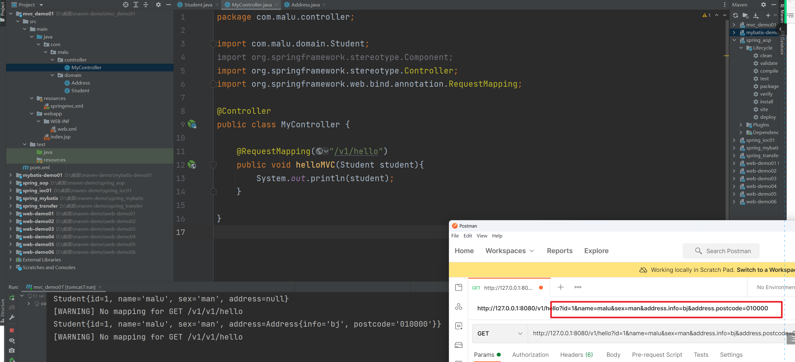
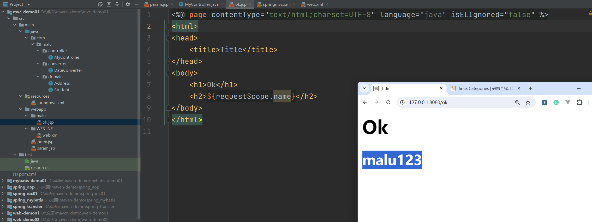
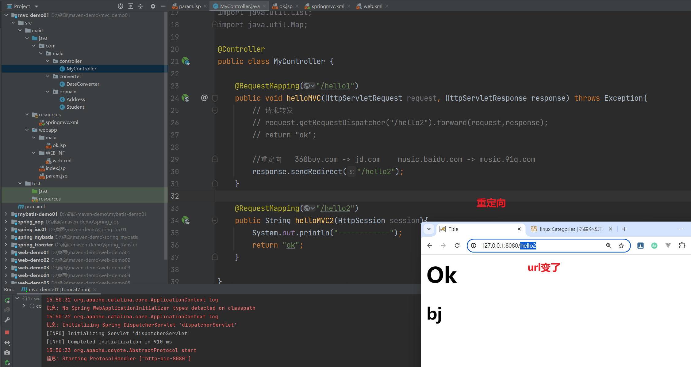
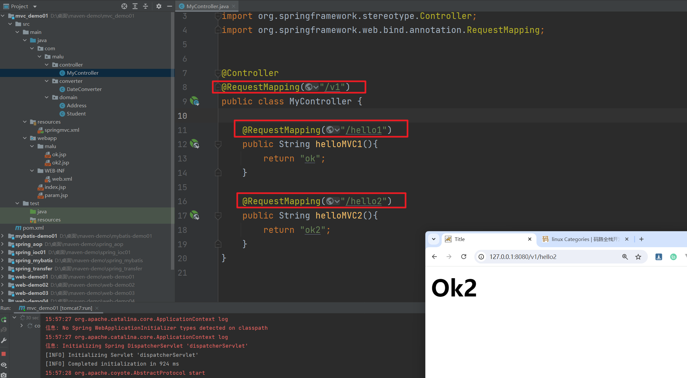
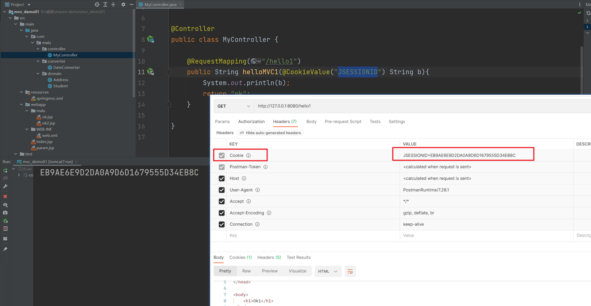

## 1, SpringMVC简介

SpringMVC是一个基于MVC模式的轻量级Web框架，是Spring框架的一个模块，和Spring可以直接整合使用。SpringMVC代替了Servlet技术，它通过一套注解，让一个简单的Java类成为处理请求的控制器，而无须实现任何接口。


## 2, 入门案例

使用maven创建web项目，补齐包结构：


引入相关依赖和tomcat插件：


```xml
<dependencies>
    <!-- spring核心 -->
    <dependency>
      <groupId>org.springframework</groupId>
      <artifactId>spring-context</artifactId>
      <version>5.2.12.RELEASE</version>
    </dependency>
    <!-- spring web -->
    <dependency>
      <groupId>org.springframework</groupId>
      <artifactId>spring-web</artifactId>
      <version>5.2.12.RELEASE</version>
    </dependency>
    <!-- springMVC -->
    <dependency>
      <groupId>org.springframework</groupId>
      <artifactId>spring-webmvc</artifactId>
      <version>5.2.12.RELEASE</version>
    </dependency>
    <!-- servlet -->
    <dependency>
      <groupId>javax.servlet</groupId>
      <artifactId>servlet-api</artifactId>
      <version>2.5</version>
      <scope>provided</scope>
    </dependency>
    <!-- jsp -->
    <dependency>
      <groupId>javax.servlet.jsp</groupId>
      <artifactId>jsp-api</artifactId>
      <version>2.0</version>
      <scope>provided</scope>
    </dependency>
  </dependencies>

  <build>
    <plugins>
      <!-- tomcat插件 -->
      <plugin>
        <groupId>org.apache.tomcat.maven</groupId>
        <artifactId>tomcat7-maven-plugin</artifactId>
        <version>2.1</version>
        <configuration>
          <port>8080</port>
          <path>/</path>
          <uriEncoding>UTF-8</uriEncoding>
          <server>tomcat7</server>
          <systemProperties>
            <java.util.logging.SimpleFormatter.format>%1$tH:%1$tM:%1$tS %2$s%n%4$s: %5$s%6$s%n
            </java.util.logging.SimpleFormatter.format>
          </systemProperties>
        </configuration>
      </plugin>
    </plugins>
  </build>
```


在web.xml中配置前端控制器DispatcherServlet


```xml
<!DOCTYPE web-app PUBLIC
 "-//Sun Microsystems, Inc.//DTD Web Application 2.3//EN"
 "http://java.sun.com/dtd/web-app_2_3.dtd" >

<web-app>
  <display-name>Archetype Created Web Application</display-name>
  
  <!--前端控制器，接收所有的请求，在容器启动时就会加载-->
  <servlet>
    <servlet-name>dispatcherServlet</servlet-name>
    <servlet-class>org.springframework.web.servlet.DispatcherServlet</servlet-class>
    <init-param>
      <param-name>contextConfigLocation</param-name>
      <param-value>classpath:springmvc.xml</param-value>
    </init-param>
    <load-on-startup>1</load-on-startup>
  </servlet>
  <servlet-mapping>
    <servlet-name>dispatcherServlet</servlet-name>
    <url-pattern>/</url-pattern>
  </servlet-mapping>
</web-app>

```


编写SpringMVC核心配置文件springmvc.xml，该文件和Spring配置文件写法一样。


```xml
<?xml version="1.0" encoding="UTF-8"?>
<beans xmlns="http://www.springframework.org/schema/beans"
       xmlns:mvc="http://www.springframework.org/schema/mvc"
       xmlns:context="http://www.springframework.org/schema/context"
       xmlns:xsi="http://www.w3.org/2001/XMLSchema-instance"
       xsi:schemaLocation="
        http://www.springframework.org/schema/beans
        http://www.springframework.org/schema/beans/spring-beans.xsd
        http://www.springframework.org/schema/mvc
        http://www.springframework.org/schema/mvc/spring-mvc.xsd
        http://www.springframework.org/schema/context
        http://www.springframework.org/schema/context/spring-context.xsd">

    <!-- 扫描包 -->
    <context:component-scan base-package="com.malu"></context:component-scan>

    <!-- 开启SpringMVC注解支持 -->
    <mvc:annotation-driven></mvc:annotation-driven>

</beans>
```


编写控制器：


```java
@Controller
public class MyController {

    @RequestMapping("/v1/hello")
    public void helloMVC(){
        System.out.println("hello SpringMVC!");

        // 还没有给前端返回任何内容
    }

}
```


## 3, 执行流程


SpringMVC的组件：

- DispatcherServlet：前端控制器，接受所有请求，调用其他组件。
- HandlerMapping：处理器映射器，根据配置找到方法的执行链。
- HandlerAdapter：处理器适配器，根据方法类型找到对应的处理器。
- ViewResolver：视图解析器，找到指定视图。


组件的工作流程：

- 客户端将请求发送给前端控制器。
- 前端控制器将请求发送给处理器映射器，处理器映射器根据路径找到方法的执行链，返回给前端控制器。
- 前端控制器将方法的执行链发送给处理器适配器，处理器适配器根据方法类型找到对应的处理器。
- 处理器执行方法，将结果返回给前端控制器。
- 前端控制器将结果发送给视图解析器，视图解析器找到视图文件位置。
- 视图渲染数据并将结果显示到客户端。


## 4, 参数获取（封装为简单数据类型）

在Servlet中我们通过 request.getParameter(name) 获取请求参数。该方式存在两个问题：

- 请求参数较多时会出现代码冗余。
- 与容器紧耦合。


而SpringMVC支持参数注入的方式用于获取请求数据，即将请求参数直接封装到方法的参数当中。用法如下：


```
http://127.0.0.1:8080/v1/hello?username=malu&age=100
```

```java
@Controller
public class MyController {

    @RequestMapping("/v1/hello")
    public void helloMVC(String username, int age){
        System.out.println(username);
        System.out.println(age);
    }

}

```


## 5, 参数获取（封装为对象类型）

SpringMVC支持将参数直接封装为对象，编写实体类：


```java
package com.malu.domain;

public class Student {
    private int id;
    private String name;
    private String sex;

    public Student() {
    }

    public Student(int id, String name, String sex) {
        this.id = id;
        this.name = name;
        this.sex = sex;
    }

    public int getId() {
        return id;
    }

    public void setId(int id) {
        this.id = id;
    }

    public String getName() {
        return name;
    }

    public void setName(String name) {
        this.name = name;
    }

    public String getSex() {
        return sex;
    }

    public void setSex(String sex) {
        this.sex = sex;
    }

    @Override
    public String toString() {
        return "Student{" +
                "id=" + id +
                ", name='" + name + '\'' +
                ", sex='" + sex + '\'' +
                '}';
    }
}

```


编写控制器：


访问该方法时，请求参数名和方法参数的属性名相同，即可完成自动封装。


封装关联对象，编写实体类：


```java
package com.malu.domain;

public class Address {
    private String info; //地址信息
    private String postcode; //邮编

    public String getInfo() {
        return info;
    }

    public void setInfo(String info) {
        this.info = info;
    }

    public String getPostcode() {
        return postcode;
    }

    public void setPostcode(String postcode) {
        this.postcode = postcode;
    }

    @Override
    public String toString() {
        return "Address{" +
                "info='" + info + '\'' +
                ", postcode='" + postcode + '\'' +
                '}';
    }
}
```


```java
package com.malu.domain;

public class Student {
    private int id;
    private String name;
    private String sex;
    private Address address; // 地址对象

    public Student() {
    }

    public Student(int id, String name, String sex, Address address) {
        this.id = id;
        this.name = name;
        this.sex = sex;
        this.address = address;
    }

    public int getId() {
        return id;
    }

    public void setId(int id) {
        this.id = id;
    }

    public String getName() {
        return name;
    }

    public void setName(String name) {
        this.name = name;
    }

    public String getSex() {
        return sex;
    }

    public void setSex(String sex) {
        this.sex = sex;
    }

    public Address getAddress() {
        return address;
    }

    public void setAddress(Address address) {
        this.address = address;
    }

    @Override
    public String toString() {
        return "Student{" +
                "id=" + id +
                ", name='" + name + '\'' +
                ", sex='" + sex + '\'' +
                ", address=" + address +
                '}';
    }
}

```


编写控制器方法:


访问该方法时，请求参数名和方法参数的属性名相同，即可完成自动封装。

```
http://127.0.0.1:8080/v1/hello?id=1&name=malu&sex=man&address.info=bj&address.postcode=010000
```




我们也可以使用表单发送带有参数的请求：


表单代码：

```jsp
<%@ page contentType="text/html;charset=UTF-8" language="java" %>
<html>
<head>
    <title>表单提交</title>
</head>
<body>
<form action="/v1/hello" method="get">
    id:<input name="id">
    姓名:<input name="name">
    性别:<input name="sex">
    住址:<input name="address.info">
    邮编:<input name="address.postcode">
    <input type="submit">
</form>
</body>
</html>

```


## 6, 参数获取（封装为集合类型）

SpringMVC支持将参数封装为List或Map集合，封装成List集合，封装为简单数据类型集合，所谓的简单类型就是字符串+基本数据类型，编写控制器：


也可以绑定数组类型：


封装为对象类型集合，SpringMVC不支持将参数封装为对象类型的List集合，但可以封装到有List属性的对象中。编写实体类： List<Address>


```java
package com.malu.domain;

import java.util.List;

public class Student {
    private int id;
    private String name;
    private String sex;
    private List<Address> address; // 地址集合

    public Student() {
    }

    public Student(int id, String name, String sex, List<Address> address) {
        this.id = id;
        this.name = name;
        this.sex = sex;
        this.address = address;
    }

    public int getId() {
        return id;
    }

    public void setId(int id) {
        this.id = id;
    }

    public String getName() {
        return name;
    }

    public void setName(String name) {
        this.name = name;
    }

    public String getSex() {
        return sex;
    }

    public void setSex(String sex) {
        this.sex = sex;
    }

    public List<Address> getAddress() {
        return address;
    }

    public void setAddress(List<Address> address) {
        this.address = address;
    }

    @Override
    public String toString() {
        return "Student{" +
                "id=" + id +
                ", name='" + name + '\'' +
                ", sex='" + sex + '\'' +
                ", address=" + address +
                '}';
    }
}

```


编写控制器：


```
http://127.0.0.1:8080/v1/hello?id=1&name=malu&sex=man&address[0].info=bj&address[0].postcode=100&address[1].info=sh&address[1].postcode=200
```


封装为Map集合，同样，SpringMVC要封装Map集合，需要封装到有Map属性的对象中。编写实体类：


```java
package com.malu.domain;

import java.util.List;
import java.util.Map;

public class Student {
    private int id;
    private String name;
    private String sex;
    private Map<String, Address> address;

    public Student() {
    }

    public Student(int id, String name, String sex, Map<String, Address> address) {
        this.id = id;
        this.name = name;
        this.sex = sex;
        this.address = address;
    }

    public int getId() {
        return id;
    }

    public void setId(int id) {
        this.id = id;
    }

    public String getName() {
        return name;
    }

    public void setName(String name) {
        this.name = name;
    }

    public String getSex() {
        return sex;
    }

    public void setSex(String sex) {
        this.sex = sex;
    }

    public Map<String, Address> getAddress() {
        return address;
    }

    public void setAddress(Map<String, Address> address) {
        this.address = address;
    }

    @Override
    public String toString() {
        return "Student{" +
                "id=" + id +
                ", name='" + name + '\'' +
                ", sex='" + sex + '\'' +
                ", address=" + address +
                '}';
    }
}

```


编写控制器：


```
http://127.0.0.1:8080/v1/hello?id=1&name=malu&sex=man&address['one'].info=bj&address['one'].postcode=100&address['two'].info=sh&address['two'].postcode=200
```


## 7, 参数获取（Servlet原生对象获取参数）（了解）

SpringMVC也支持使用Servlet原生对象，在方法参数中定义HttpServletRequest 、 HttpServletResponse 、 HttpSession 等类型的参数即可直接在方法中使用。


```java
@Controller
public class MyController {

    @RequestMapping("/v1/hello")
    public void helloMVC(HttpServletRequest request, HttpServletResponse response, HttpSession session){
        System.out.println(request.getParameter("name"));
        System.out.println(response.getCharacterEncoding());
    }

}
```


一般情况下，在SpringMVC中都有对Servlet原生对象的方法的替代，推荐使用SpringMVC的方式代替Servlet原生对象。


## 8, 参数获取（自定义参数类型转化器）


前端传来的参数全部为字符串类型，SpringMVC使用自带的转换器将字符串参数转为需要的类型。如：


由于日期数据有很多种格式，SpringMVC没办法把所有格式的字符串转换成日期类型。比如参数格式为 birthday=2025-01-01 时，SpringMVC就无法解析参数。此时需要自定义参数类型转换器。


定义类型转换器类，实现Converter接口


```java
package com.malu.converter;

import org.springframework.core.convert.converter.Converter;

import java.text.ParseException;
import java.text.SimpleDateFormat;
import java.util.Date;

public class DateConverter implements Converter<String, Date> {

    @Override
    public Date convert(String source) {
        SimpleDateFormat sdf = new SimpleDateFormat("yyyy-MM-dd");
        Date date = null;
        try{
            date = sdf.parse(source);
        }catch (ParseException e){
            e.printStackTrace();
        }
        return date;
    }
}

```


注册类型转换器对象:


```xml
<?xml version="1.0" encoding="UTF-8"?>
<beans xmlns="http://www.springframework.org/schema/beans"
       xmlns:mvc="http://www.springframework.org/schema/mvc"
       xmlns:context="http://www.springframework.org/schema/context"
       xmlns:xsi="http://www.w3.org/2001/XMLSchema-instance"
       xsi:schemaLocation="
        http://www.springframework.org/schema/beans
        http://www.springframework.org/schema/beans/spring-beans.xsd
        http://www.springframework.org/schema/mvc
        http://www.springframework.org/schema/mvc/spring-mvc.xsd
        http://www.springframework.org/schema/context
        http://www.springframework.org/schema/context/spring-context.xsd">

    <!-- 扫描包 -->
    <context:component-scan base-package="com.malu"></context:component-scan>

    <!-- 开启SpringMVC注解支持 使用转化器工厂 -->
    <mvc:annotation-driven conversion-service="converterFactory"></mvc:annotation-driven>

    <!--配置转化器工厂-->
    <bean id="converterFactory" class="org.springframework.context.support.ConversionServiceFactoryBean">
        <!--转换器集合-->
        <property name="converters">
            <set>
                <!--自定义转化器-->
                <bean class="com.malu.converter.DateConverter"></bean>
            </set>
        </property>
    </bean>
</beans>
```


测试：


## 9, 参数获取（编码过滤器）


在传递参数时，tomcat8以上能处理get请求的中文乱码，但不能处理post请求的中文乱码，编写jsp表单:


编写控制器方法:


测试：


SpringMVC提供了处理中文乱码的过滤器，在web.xml中配置该过滤器即可解决中文乱码问题：


```xml
<!DOCTYPE web-app PUBLIC
 "-//Sun Microsystems, Inc.//DTD Web Application 2.3//EN"
 "http://java.sun.com/dtd/web-app_2_3.dtd" >

<web-app>
  <display-name>Archetype Created Web Application</display-name>

  <filter>
    <filter-name>encodingFilter</filter-name>
    <filter-class>org.springframework.web.filter.CharacterEncodingFilter</filter-class>
    <init-param>
      <param-name>encoding</param-name>
      <param-value>UTF-8</param-value>
    </init-param>
    <init-param>
      <param-name>forceEncoding</param-name>
      <param-value>true</param-value>
    </init-param>
  </filter>
  <filter-mapping>
    <filter-name>encodingFilter</filter-name>
    <url-pattern>/*</url-pattern>
  </filter-mapping>

  <!--前端控制器，接收所有的请求，在容器启动时就会加载-->
  <!--默认情况下，你访问jsp页面，不会走DispatcherServlet-->
  <servlet>
    <servlet-name>dispatcherServlet</servlet-name>
    <servlet-class>org.springframework.web.servlet.DispatcherServlet</servlet-class>
    <init-param>
      <param-name>contextConfigLocation</param-name>
      <param-value>classpath:springmvc.xml</param-value>
    </init-param>
    <load-on-startup>1</load-on-startup>
  </servlet>
  <servlet-mapping>
    <servlet-name>dispatcherServlet</servlet-name>
    <url-pattern>/</url-pattern>
  </servlet-mapping>
</web-app>

```


## 10, 处理响应（配置视图解析器）(了解)


SpringMVC默认情况下会在控制器执行完成后跳转到视图页面，视图解析器能找到相应的视图，之前的404异常就是由于没有配置视图解析器导致找不到视图。


在SpringMVC中提供了13个视图解析器，用于支持不同的视图技术。InternalResourceViewResolver是SpringMVC的默认视图解析器，用来解析JSP视图。配置：


```xml
<?xml version="1.0" encoding="UTF-8"?>
<beans xmlns="http://www.springframework.org/schema/beans"
       xmlns:mvc="http://www.springframework.org/schema/mvc"
       xmlns:context="http://www.springframework.org/schema/context"
       xmlns:xsi="http://www.w3.org/2001/XMLSchema-instance"
       xsi:schemaLocation="
        http://www.springframework.org/schema/beans
        http://www.springframework.org/schema/beans/spring-beans.xsd
        http://www.springframework.org/schema/mvc
        http://www.springframework.org/schema/mvc/spring-mvc.xsd
        http://www.springframework.org/schema/context
        http://www.springframework.org/schema/context/spring-context.xsd">

    <!-- 扫描包 -->
    <context:component-scan base-package="com.malu"></context:component-scan>

    <!-- 开启SpringMVC注解支持 使用转化器工厂 -->
    <mvc:annotation-driven conversion-service="converterFactory"></mvc:annotation-driven>

    <!--配置转化器工厂-->
    <bean id="converterFactory" class="org.springframework.context.support.ConversionServiceFactoryBean">
        <!--转换器集合-->
        <property name="converters">
            <set>
                <!--自定义转化器-->
                <bean class="com.malu.converter.DateConverter"></bean>
            </set>
        </property>
    </bean>

    <!-- 视图解析器 -->
    <bean id="viewResolver" class="org.springframework.web.servlet.view.InternalResourceViewResolver">
        <!-- 视图前缀 -->
        <property name="prefix" value="/" />
        <!-- 视图后缀 -->
        <property name="suffix" value=".jsp" />
    </bean>

</beans>
```


测试：


## 11, 处理响应（控制器方法的返回值）(了解)


我们可以通过控制器方法的返回值设置跳转的视图，返回值为void，此时会跳转到名字是 前缀+方法路径名+后缀 的jsp页面，编写控制器方法：


编写helloMVC.jsp：


返回值为String，此时会跳转到名字是 前缀+返回值+后缀 的jsp页面，编写控制器方法：


返回值为ModelAndView，这是SpringMVC提供的对象，该对象可以向request域设置数据并
指定跳转的页面。该对象中包含Model对象和View对象。

- Model:  向request域中设置数据
- View：指定跳转的页面


编写控制器方法：


```java
package com.malu.controller;

import com.malu.domain.Student;
import org.springframework.stereotype.Component;
import org.springframework.stereotype.Controller;
import org.springframework.web.bind.annotation.RequestMapping;
import org.springframework.web.bind.annotation.RequestParam;
import org.springframework.web.servlet.ModelAndView;

import javax.servlet.http.HttpServletRequest;
import javax.servlet.http.HttpServletResponse;
import javax.servlet.http.HttpSession;
import java.util.Arrays;
import java.util.Date;
import java.util.List;
import java.util.Map;

@Controller
public class MyController {

    @RequestMapping("/ok")
    public ModelAndView helloMVC(String username){

        // 1.创建ModelAndView对象
        ModelAndView modelAndView = new ModelAndView();
        // 2.获取Model对象，本质是一个Map
        Map<String, Object> model = modelAndView.getModel();
        // 3.使用Model对象向request域设置数据
        model.put("name","malu123");
        // 4.使用View对象设置跳转的路径
        modelAndView.setViewName("ok");

        return modelAndView;
    }

}

```


编写jsp页面：



```jsp
<%@ page contentType="text/html;charset=UTF-8" language="java" isELIgnored="false" %>
<html>
<head>
    <title>Title</title>
</head>
<body>
    <h1>Ok</h1>
    <h2>${requestScope.name}</h2>
</body>
</html>

```


修改web.xml命名空间，让jsp页面默认支持el表达式：


```xml
<!DOCTYPE web-app PUBLIC
 "-//Sun Microsystems, Inc.//DTD Web Application 2.3//EN"
 "http://java.sun.com/dtd/web-app_2_3.dtd" >

<web-app xmlns:xsi="http://www.w3.org/2001/XMLSchema-instance"
         xmlns="http://xmlns.jcp.org/xml/ns/javaee"
         xsi:schemaLocation="http://xmlns.jcp.org/xml/ns/javaee http://xmlns.jcp.org/xml/ns/javaee/web-app_3_1.xsd"
         id="WebApp_ID" version="3.1">

  <display-name>Archetype Created Web Application</display-name>

  <filter>
    <filter-name>encodingFilter</filter-name>
    <filter-class>org.springframework.web.filter.CharacterEncodingFilter</filter-class>
    <init-param>
      <param-name>encoding</param-name>
      <param-value>UTF-8</param-value>
    </init-param>
    <init-param>
      <param-name>forceEncoding</param-name>
      <param-value>true</param-value>
    </init-param>
  </filter>
  <filter-mapping>
    <filter-name>encodingFilter</filter-name>
    <url-pattern>/*</url-pattern>
  </filter-mapping>

  <!--前端控制器，接收所有的请求，在容器启动时就会加载-->
  <!--默认情况下，你访问jsp页面，不会走DispatcherServlet-->
  <servlet>
    <servlet-name>dispatcherServlet</servlet-name>
    <servlet-class>org.springframework.web.servlet.DispatcherServlet</servlet-class>
    <init-param>
      <param-name>contextConfigLocation</param-name>
      <param-value>classpath:springmvc.xml</param-value>
    </init-param>
    <load-on-startup>1</load-on-startup>
  </servlet>
  <servlet-mapping>
    <servlet-name>dispatcherServlet</servlet-name>
    <url-pattern>/</url-pattern>
  </servlet-mapping>
</web-app>

```


## 12, 处理响应（request域设置数据）（了解）

当控制器返回值为ModelAndView时我们可以向request域设置数据，我们还有以下方法可以向request域设置数据，使用原生的HttpServletRequest：


在ok.jsp中使用之：


使用Model、ModelMap。SpringMVC提供了Model接口和ModelMap类，控制器方法添加这
两个类型的参数，使用该参数设置数据，该数据就会存到request域中。


使用Map集合。Model接口底层就是一个Map集合，我们可以给控制器方法设置Map类型的参数，向Map中添加键值对，数据也会存到request域中。


## 13, 处理响应（session域设置数据）（了解）

Session作用域表示在当前会话中有效。在SpringMVC中对于Session作用域传值，只能使用HttpSession对象来实现。编写控制器方法：


编写jsp页面：


## 15, 处理响应（请求转发与重定向）

之前的案例，我们发现request域中的值可以传到jsp页面中，也就是通过视图解析器跳转到视图的底层是请求转发。如果我们跳转时不想使用视图解析器，可以使用原生HttpServletRequest进行请求转发或HttpServletResponse进行重定向：





```java
@Controller
public class MyController {

    @RequestMapping("/hello1")
    public void helloMVC(HttpServletRequest request, HttpServletResponse response) throws Exception{
        // 请求转发
        // request.getRequestDispatcher("/hello2").forward(request,response);
        // return "ok";

        //重定向   360buy.com -> jd.com    music.baidu.com -> music.91q.com
        response.sendRedirect("http://www.baidu.com");
    }

    @RequestMapping("/hello2")
    public String helloMVC2(HttpSession session){
        System.out.println("------------");
        return "ok";
    }

}
```


SpringMVC还提供了一种更简单的请求转发和重定向的写法：


```java
@Controller
public class MyController {

    @RequestMapping("/hello1")
    public String helloMVC(HttpServletRequest request, HttpServletResponse response) throws Exception{
        // 请求转发
        // return "forward:/hello2";

        // 重定向
        return "redirect:/hello2";
    }

    @RequestMapping("/hello2")
    public String helloMVC2(HttpSession session){
        System.out.println("------------");
        return "ok";
    }
}
```


## 16, @Controller

- 作用：标记控制器，将控制器交给Spring容器管理。
- 位置：类上方


演示：


## 17, @RequestMapping

- 作用：给控制器方法设置请求路径
- 位置：方法或类上方。用于类上，表示类中的所有控制器方法都是以该地址作为父路径。
- 属于：
  - value/path:请求路径
  - method:指定请求方式
  - params:规定必须发送的请求参数
  - headers:规定请求必须包含的请求头


演示：




## 18, @RequestParam

- 作用：在控制器方法中获取请求参数
- 位置：方法参数前
- 属于：
  - name：指定请求参数名称
  - defaultValue： 为参数设置默认值
  - required：设置是否是必须要传入的参数


演示：


## 19, @RequestHeader,@CookieValue

@RequestHeader

- 作用：在控制器方法中获取请求头数据
- 位置：方法参数前


演示：


@CookieValue

- 作用：在控制器方法中获取Cookie数据
- 位置：方法参数前


演示：




## 20, @SessionAttributes

- 作用：将Model模型中的数据存到session域中
- 位置：类上方


演示：


## 21, @ModelAttribute


- 作用1：设置指定方法在控制器其他方法前执行

- 位置：方法上方


演示：


- 作用2：从Model模型中获取数据给参数赋值
- 位置：方法参数前


演示：


## 22, RESTful风格支持和@PathVariable

RESTful风格是一种URL路径的设计风格。在RESTful风格的URL路径中，网络上的任意数据都可以看成一个资源，它可以是一段文本、一张图片，也可以是一个Java对象。而每个资源都会占据一个网络路径，无论对该资源进行增删改查，访问的路径是一致的。


传统URL：

- 查找id为1的学生：
  - http://localhost:8080/student/findById?id=1
- 删除id为1的学生：
  - http://localhost:8080/student/deleteById?id=1


RESTful风格URL：

- 查找id为30的学生：
  - http://localhost:8080/student/30
- 删除id为30的学生：
  - http://localhost:8080/student/30


那么如何区分对该资源是哪一种操作？通过请求方式不同，判断进行的是什么操作。之前我们学过两种请求方式，GET请求和POST请求，而访问RESTful风格的URL一共有四种请求方式：

- GET请求：查询操作
- POST请求：新增操作
- DELETE请求：删除操作
- PUT请求：修改操作


RESTful风格URL：

- 查找id为30的学生：
  - http://localhost:8080/student/30 GET方式请求
- 删除id为30的学生：
  - http://localhost:8080/student/30 DELETE方式请求


RESTful风格的优点:

- 结构清晰、符合标准、易于理解、扩展方便。


@PathVariable

- 作用：在RESTful风格的URL中获取占位符的值
- 位置：方法参数前
- 属性：
  - value：获取哪个占位符的值作为参数值，如果占位符和参数名相同，可以省略该属性。


访问方式：

- 新增学生：POST http://localhost:8080/student/1?name=malu&sex=man
- 修改学生：PUT http://localhost:8080/student/1?name=malu&sex=man
- 删除学生：DELETE http://localhost:8080/student/1
- 查询学生：GET http://localhost:8080/student/1


@PostMapping、@GetMapping、@PutMapping、@DeleteMapping

- 作用：简化设置请求方式的@RequestMapping写法
- 位置：方法上方。


由于浏览器form表单只支持GET与POST请求，而DELETE、PUT请求并不支持，SpringMVC有一个过滤器，可以将浏览器的POST请求改为指定的请求方式，发送给的控制器方法。


在web.xml中配置过滤器:


编写控制器方法:


在jsp中编写表单:


## 23, @ResponseBody

- 作用：方法返回的对象转换为JSON格式，并将JSON数据直接写入到输出流中，使用此注解后不会再经过视图解析器。使用该注解可以处理Ajax请求。
- 位置：方法上方或方法返回值前


编写结果实体类，该实体类会封装一个请求的结果:


编写控制器:


SpringMVC会将Result对象转为JSON格式写入输出流，而SpringMVC默认使用的JSON转换器是jackson，需要在pom中添加jackson依赖。


## 24, @RestController

如果一个控制器类下的所有控制器方法都返回JSON格式数据且不进行跳转，可以使用@RestController代替@Controller，此时每个方法上的@ResponseBody都可以省略。


## 25, 静态资源映射

当在DispatcherServlet的  中配置拦截 “/” 时，除了jsp文件不会拦截以外，其他所有的请求都会经过前端控制器进行匹配。此时静态资源例如css、js、jpg等就会被前端控制器拦截，导致不能访问，出现404问题。想要正常映射静态资源共有三种方案：

- 配置静态资源筛查器
- 配置静态资源映射器
- 配置默认Servlet处理静态资源


配置静态资源筛查器:在SpringMVC的配置文件中配置后，会在Spring容器中创建一个资源检查器，它对进入
DispatcherServlet的URL进行筛查，如果不是静态资源，才由DispatcherServlet处理。修改SpringMVC核心配置文件：


配置静态资源映射器:SpringMVC模块提供了静态资源映射器组件，通过  标签配置静态资源映射器，配置后的路径不会由DispatcherServlet处理。修改SpringMVC核心配置文件：


配置默认Servlet处理静态资源:在web.xml可以配置默认Servlet处理静态资源，该Servlet由tomcat提供，它会直接访问静态资源不进行其他操作。这样就避免了使用DispatcherServlet对静态资源的拦截。修改web.xml:


## 26, @RequestBody

- 作用：将请求中JSON格式的参数转为JAVA对象
- 位置：写在方法参数前


编写控制器：


## 27,原生方式上传

上传是Web工程中很常见的功能，SpringMVC框架简化了文件上传的代码，我们首先使用JAVAEE原生方式上传文件。创建新的SpringMVC项目，在web.xml中将项目从2.3改为3.1，即可默认开启el表达式


编写上传表单：


接收请求体数据：


接下来需要分析请求体中的文件项，并将数据写入磁盘，此时需要借助文件上传工具，引入文件上传依赖：


编写控制器接收上传请求，控制器进行三步操作：

- 创建文件夹，存放上传文件。
- 分析请求体，找到上传文件数据。
- 将文件数据写入文件夹。


## 28,SpringMVC方式上传

SpringMVC使用框架提供的文件解析器对象，可以直接将请求体中的文件数据转为MultipartFile对象，从而省略原生上传中分析请求体的步骤。


在SpringMVC核心配置文件配置文件解析器：


创建JSP表单：


编写控制器接收上传请求：


SpringMVC支持一次性上传多个文件，创建JSP表单：


编写控制器接收上传请求：


## 30, 异步上传


之前的上传方案，在上传成功后都会跳转页面。而在实际开发中，很多情况下上传后不进行跳转，而是进行页面的局部刷新，比如：上传头像成功后将头像显示在网页中。这时候就需要使用异步文件上传。


编写控制器接收异步上传请求：


## 31, 跨服务器上传


由于文件占据磁盘空间较大，在实际开发中往往会将文件上传到其他服务器中，此时需要使用跨服务器上传文件。解压tomcat作为图片服务器，在tomcat的webapps下创建upload目录作为文件上传目录。修改tomcat的 conf/web.xml 文件，支持跨服上传。


修改tomcat的 conf/server.xml 文件，修改tomcat端口，修改完开启tomcat服务器：


编写JSP上传表单：


添加跨服上传依赖：


创建控制器方法，该方法在接受到上传请求后将文件保存到其他服务器上。


## 32, 文件下载

将文件上传到服务器后，有时我们需要让用户下载上传的文件，接下来我们编写文件下载功能。编写控制器方法，查询所有可下载的文件，并跳转到下载页面


添加JSTL依赖：


编写下载页面：


编写下载控制器：


## 33, 单个控制器异常处理
## 34, 全局异常处理
## 35, 自定义异常处理器
## 36, 拦截器
## 37, 全局拦截器
## 38, 拦截器链与执行顺序
## 39, 拦截器过滤敏感词
## 40, 同源策略
## 41, 跨域请求
## 42, 控制器接收跨域请求