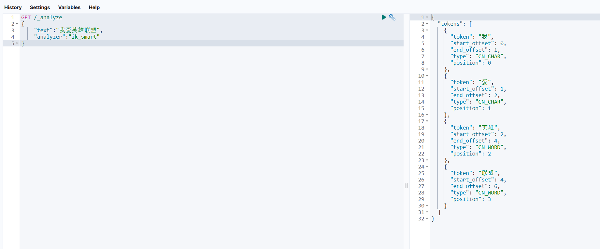
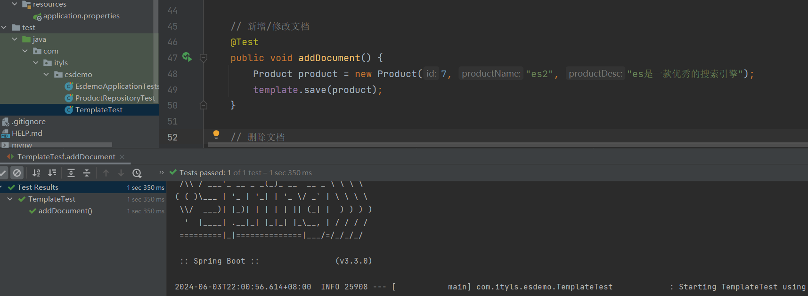

## 一，ES初识

### 1，Elasticsearch介绍


Elasticsearch是一个全文检索服务器，全文检索是一种非结构化数据的**搜索方式**。

- 结构化数据：指具有固定格式固定长度的数据，如数据库中的字段。

  

- 非结构化数据：指格式和长度不固定的数据，如电商网站的商品详情。

  


### 2，什么是倒排索引


**索引：**

将数据中的一部分信息提取出来，重新组织成一定的数据结构，我们可以根据该结构进行快速搜索，这样的结构称之为索引。索引即目录，例如字典会将字的拼音提取出来做成目录，通过目录即可快速找到字的位置。索引分为**正排索引**和**倒排索引**。


**正排索引（正向索引）：**

将文档id建立为索引，通过id快速可以快速查找数据。如数据库中的主键就会创建正排索引。


**倒排索引（反向索引）：**

非结构化数据中我们往往会根据关键词查询数据。此时我们将数据中的关键词建立为索引，指向文档数据，这样的索引称为倒排索引。


创建倒排索引流程：


### 3，ES的出现和应用场景

多年前，一个刚结婚的名叫Shay的失业开发者，跟着妻子去了伦敦，他的妻子在那里学习厨师。Shay使用全文检索工具——lucene，给他的妻子做一个食谱搜索引擎。


但Lucene的操作非常复杂，且Lucene是一个单机软件，不支持联网访问。因此 Shay基于Lucene开发了开源项目 Elasticsearch。Elasticsearch本质是一个java语言开发的web项目，我们可以通过RESTful风格的接口访问该项目内部的Lucene，从而让全文搜索变得简单。


从此以后，Elasticsearch成为了Github上最活跃的项目之一， Elastic公司围绕Elasticsearch提供商业服务，并开发新的特性。Elasticsearch将永远开源并对所有人可用。


**Elasticsearch应用场景：**


- 2013年初，GitHub抛弃了Solr，采取Elasticsearch来做PB级的搜索。GitHub使用Elasticsearch搜索20TB 的数据，包括13亿文件和1300亿行代码。
- 维基百科：以Elasticsearch为基础的核心搜索架构。
- 百度：百度目前广泛使用Elasticsearch作为文本数据分析，采集百度所有服务器上的各类指标数据及用户自定义数据。目前覆盖百度内部20多个业务线（包括casio、云分析、网盟、预测、文库、直达号、钱包、风控等），单集群最大100台机器，200个ES节点，每天导入30TB+数据
- 新浪使用ES分析处理32亿条实时日志。
- 阿里使用ES构建自己的日志采集和分析体系。
- 我们可以使用Elasticsearch实现全站搜索，线上商城系统的搜索，分析日志等功能。


### 4，ES对比Solr


Solr也是基于Lucene的一款全文搜索引擎，下面是他们的对比。

- Solr利用Zookeeper进行分布式管理，而Elasticsearch自身带有分布式协调管理功能;
- Solr支持更多格式的数据，而Elasticsearch仅支持json文件格式；
- Solr官方提供的功能更多，而Elasticsearch本身更注重于核心功能，高级功能多由第三方插件提供；
- Solr在传统的搜索应用中表现好于Elasticsearch，但在处理实时搜索应用时效率明显低于Elasticsearch。

目前Elasticsearch的市场占有率越来越高，Spring从2020年起也已经停止Spring Data Solr的维护，更多的公司使用Elasticsearch作为搜索引擎。


### 5，ES数据结构

相关概念：

- **文档（Document）**：文档是可被查询的最小数据单元，一个 Document 就是一条数据。类似于关系型数据库中的记录的概念。
- **类型（Type）**：具有一组共同字段的文档定义成一个类型，类似于关系型数据库中的数据表的概念。
- **索引（Index）**：索引是多种类型文档的集合，类似于关系型数据库中的库的概念。
- **域（Filed）**：文档由多个域组成，类似于关系型数据库中的字段的概念。


Elasticsearch跟关系型数据库中概念的对比：

| JAVA项目 | 项目     | 实体类 | 对象     | 属性   |
| -------- | -------- | ------ | -------- | ------ |
| ES       | Index    | Type   | Document | Filed  |
| Mysql    | Database | Table  | Row      | Column |


注意：ES7.X之后删除了type的概念，一个索引不会代表一个库，而是代表一张表。我们课程中使用ES8，所以目前的ES中概念对比为：

| JAVA项目 | 项目     | 实体类 | 对象     | 属性   |
| -------- | -------- | ------ | -------- | ------ |
| ES       |          | Index  | Document | Filed  |
| Mysql    | Database | Table  | Row      | Column |


### 6，安装ES

1. 准备一台搭载有CentOS7系统的虚拟机，使用XShell连接虚拟机

2. 关闭防火墙，方便访问ES

   ```
   #关闭防火墙：
   systemctl stop firewalld.service
   
   
   #禁止防火墙自启动：
   systemctl disable firewalld.service
   ```

3. 配置最大可创建文件数大小

   ```
   #打开系统文件：
   vim /etc/sysctl.conf
   
   
   #添加以下配置：
   vm.max_map_count=655360
   
   
   #配置生效：
   sysctl -p
   ```

4. 由于ES不能以root用户运行，我们需要创建一个非root用户，此处创建一个名为es的用户

   ```
   #创建用户：
   useradd es
   ```


**安装服务:**

1. 使用rz命令将linux版的ES上传至虚拟机

2. 解压ES

   ```
   #解压：
   tar -zxvf elasticsearch-8.10.4-linux-x86_64.tar.gz
   
   
   #重命名：
   mv elasticsearch-8.10.4 elasticsearch1
   
   
   #移动文件夹：
   mv elasticsearch1 /usr/local/
   
   
   #es用户取得该文件夹权限：
   chown -R es:es /usr/local/elasticsearch1
   ```

3. 启动ES服务：

   ```
   #切换为es用户：
   su es
   
   #进入ES安装文件夹：
   cd /usr/local/elasticsearch1/bin/
   
   #启动ES服务：
   ./elasticsearch 
   ```

   

4. 当启动成功，可以看到类似以下的日志输出。首次启动Elasticsearch，默认会启用安全配置功能，启用身份认证和授权，内置超级用户`elastic`，并生成默认密码，此时要注意保存，否则之后启动不会再显示。

   

   ```
   # 重置默认密码：
   cd /usr/local/elasticsearch1/bin/
   ./elasticsearch-reset-password -u elastic
   
   
   # 自定义密码：
   cd /www/elasticsearch/bin/ ./elasticsearch-reset-password --username elastic -i
   ```

   ```
   ✅ Elasticsearch security features have been automatically configured!
   ✅ Authentication is enabled and cluster connections are encrypted.
   
   ℹ️  Password for the elastic user (reset with `bin/elasticsearch-reset-password -u elastic`):
     UTsf8dGeBIP86cNRMFNQ
   
   ℹ️  HTTP CA certificate SHA-256 fingerprint:
     f1dabc83f4fd921047bee58113988d411e3c408a2e157a9a2d2f458c720eb6e4
   
   ℹ️  Configure Kibana to use this cluster:
   • Run Kibana and click the configuration link in the terminal when Kibana starts.
   • Copy the following enrollment token and paste it into Kibana in your browser (valid for the next 30 minutes):
     eyJ2ZXIiOiI4LjEwLjQiLCJhZHIiOlsiMTAzLjM4LjgxLjIyMzo5MjAwIl0sImZnciI6ImYxZGFiYzgzZjRmZDkyMTA0N2JlZTU4MTEzOTg4ZDQxMWUzYzQwOGEyZTE1N2E5YTJkMmY0NThjNzIwZWI2ZTQiLCJrZXkiOiJ0VWR0M1k4QkZZTjYzdktOc2dxZjpiVTV6bmF2YlN0MmY0S0ZrLUpzYldnIn0=
   
   ℹ️  Configure other nodes to join this cluster:
   • On this node:
     ⁃ Create an enrollment token with `bin/elasticsearch-create-enrollment-token -s node`.
     ⁃ Uncomment the transport.host setting at the end of config/elasticsearch.yml.
     ⁃ Restart Elasticsearch.
   • On other nodes:
     ⁃ Start Elasticsearch with `bin/elasticsearch --enrollment-token <token>`, using the enrollment token that you generated.
   
   ```

   

5. 连接ES，查询ES服务是否启动成功

   ```
   # 参数 --cacert指定了证书
   curl --cacert /www/elasticsearch/config/certs/http_ca.crt -u elastic https://localhost:9200
   ```


重置密码：


输入新密码再次测试：


### 7，安装kibana

Kibana是一款开源的数据分析和可视化平台，设计用于和Elasticsearch协作。我们可以使用Kibana对Elasticsearch索引中的数据进行搜索、查看、交互操作。


1. 使用rz工具将Kibana压缩文件上传到Linux虚拟机

2. 解压

   ```
   tar -zxvf kibana-8.10.4-linux-x86_64.tar.gz -C /usr/local/
   ```

   

3. 修改配置

   ```
   # 进入Kibana解压路径
   cd /usr/local/kibana-8.10.4/config
   
   # 修改配置文件
   vim kibana.yml
   
   # 加入以下内容
   # 主机IP，服务名
   server.host: "虚拟机IP"
   server.name: "kibana"
   ```

   

4. 启动：kibana不能以root用户运行，我们给es用户设置kibana目录的权限，并使用es用户运行kibana

   ```
   # 给es用户设置kibana目录权限
   chown -R es:es /usr/local/kibana-8.10.4/
   
   
   # 切换为es用户
   su es
   
   
   # 启动kibana
   cd /usr/local/kibana-8.10.4/bin/
   ./kibana
   ```

5. 访问kibana：http://虚拟机IP:5601。首次访问Kibana管理台会提示输入ES生成的token秘钥，可以在ES首次启动日志中找。如果token已失效或不正确，你也可以重新生成token。紧接着输入登录账号 elastic，密码也同样是从ES首次启动日志中找。

   ```
   # 进入es安装目录
   cd /usr/local/elasticsearch1/bin
   
   
   # 重新生成kibana的token
   .elasticsearch-create-enrollment-token --scope kibana
   ```

6. 点击`Management` => `Index Management`可以查看es索引信息。


## 二，常用操作

### 1, 索引操作

Elasticsearch是使用RESTful风格的http请求访问操作的，请求参数和返回值都是Json格式的，我们可以使用kibana发送http请求操作ES。


注：在kibana中所有的请求都会省略`ip地址:端口号`，之后的路径我们省略写`ip地址:端口号`


**创建没有结构的索引：**


**查看：**


**为索引添加结构：**


```js
PUT /student/_mapping   // 改成POST
{
  "properties":{
    "id":{
      "type":"integer"
    },
    "name":{
      "type":"text"
    },
    "age":{
      "type":"integer"
    }
  }
}
```


**查看：**


**创建有结构的索引：**


```js
PUT /student1
{
  "mappings":{
     "properties":{
        "id":{
          "type":"integer"
        },
        "name":{
          "type":"text"
        },
        "age":{
          "type":"integer"
        }
      }
    }
}
```


**查看：**


**删除索引：**


**查看：**


### 2, 文档操作（1）


**新增/修改文档：**


```js
POST /student/_doc/1
{
  "id":1,
  "name":"ityls",
  "age":18
}
```

注：id值不写时自动生成文档id，id和已有id重复时修改文档


**根据id查询文档:**


```js
GET /student/_doc/1
```


**修改文档：**


```js
POST /student/_doc/1
{
  "id":1,
  "name":"ityls666",
  "age":18
}

GET /student/_doc/1
```


**新增时，不写ID：**


```js
POST /student/_doc/
{
  "id":1,
  "name":"malu",
  "age":18
}

GET /student/_doc/VIUw3Y8B2yxzSE4p8_PP
```


**删除文档：**


```js
DELETE /student/_doc/VIUw3Y8B2yxzSE4p8_PP
GET /student/_doc/VIUw3Y8B2yxzSE4p8_PP
```


### 3, 文档操作（2）


**根据id批量查询文档:**


```js
POST /student/_doc/2
{
  "id":2,
  "name":"malu",
  "age":18
}

GET /student/_mget
{
  "docs":[
     {"_id":1},
     {"_id":2}
   ] 
}
```


**查询所有文档:**


```js
GET /student/_search
{
   "query": {
     "match_all": {}
   }
}
```


**修改文档部分字段:**


```js
POST /student/_update/1/
{ 
  "doc":{ 
    "name":"ityls888"
    } 
}

GET /student/_search
{
   "query": {
     "match_all": {}
   }
}
```


注意：

- Elasticsearch执行删除操作时，ES先标记文档为deleted状态，而不是直接物理删除。当ES存储空间不足或工作空闲时，才会执行物理删除操作。

- Elasticsearch执行修改操作时，ES不会真的修改Document中的数据，而是标记ES中原有的文档为deleted状态，再创建一个新的文档来存储数据。


### 4, 域的属性_index


**index：**

该域是否创建索引。只有值设置为true，才能根据该域的关键词查询文档。

```js
// 根据关键词查询文档
GET /索引名/_search
{
    "query":{
    "term":{ 
            搜索字段: 关键字
        } 
   }
}
```


测试：


```js
PUT /student1
{
  "mappings":{
     "properties":{
        "name":{
          "type":"text",
          "index": true
        }
      }
    }
}

PUT /student2
{
  "mappings":{
     "properties":{
        "name":{
          "type":"text",
          "index": false
        }
      }
    }
}
```


存入数据：


```js
POST /student1/_doc/1
{
  "name":"i love ityls"
}

POST /student2/_doc/1
{
  "name":"i love ityls"
}
```


查询文档：


```js
// 根据关键词查询文档
GET /student1/_search
{
    "query":{
    "term":{ 
            "name":"love"
        } 
   }
}

GET /student2/_search
{
    "query":{
    "term":{ 
            "name":"love"
        } 
   }
}
```


### 5, 域的属性_type


**type:**域的类型

| 核心类型       | 具体类型                   |
| -------------- | -------------------------- |
| 字符串类型     | text                       |
| 整数类型       | long, integer, short, byte |
| 浮点类型       | double, float              |
| 日期类型       | date                       |
| 布尔类型       | boolean                    |
| 数组类型       | array                      |
| 对象类型       | object                     |
| 不分词的字符串 | keyword                    |


测试：


```js

DELETE /student2

PUT /student2
{
  "mappings":{
     "properties":{
        "name":{
          "type":"keyword",
          "index": true
        }
      }
    }
}

POST /student2/_doc/1
{
  "name":"i love ityls"
}

GET /student2/_search
{
    "query":{
    "term":{ 
            "name":"i love ityls"
        } 
   }
}
```


### 6, 域的属性_store

是否单独存储。如果设置为true，则该域能够单独查询。


测试：


```js
DELETE /student1
DELETE /student2

PUT /student1
{
  "mappings":{
     "properties":{
         "age":{
          "type":"integer"
        },
        "name":{
          "type":"text",
          "index": true,
          "store": true
        }
      }
    }
}

PUT /student2
{
  "mappings":{
     "properties":{
         "age":{
          "type":"integer"
        },
        "name":{
          "type":"text",
          "index": true,
          "store": false
        }
      }
    }
}

POST /student1/_doc/1
{
  "name":"i love ityls",
  "age":10
}
POST /student2/_doc/1
{
  "name":"i love ityls",
  "age":10
}

GET /student1/_search
{
  "stored_fields": ["name"]
}

GET /student2/_search
{
  "stored_fields": ["name"]
}
```

## 三，分词器

### 1, 默认分词器

ES文档的数据拆分成一个个有完整含义的关键词，并将关键词与文档对应，这样就可以通过关键词查询文档。要想正确的分词，需要选择合适的分词器。


**standard analyzer**：Elasticsearch默认分词器，根据空格和标点符号对英文进行分词，会进行单词的大小写转换。

> 默认分词器是英文分词器，对中文的分词是一字一词。


查看分词效果：

```js
GET /_analyze
{
    "text":测试语句, 
    "analyzer":分词器
}
```


测试：


```js
GET /_analyze
{
    "text":"I love ityls~", 
    "analyzer":"standard"
}
```


### 2, IK分词器安装


如果linux服务器使用ES不方便的话，可以在window上使用，参考地址：https://blog.csdn.net/qq_44903856/article/details/139260565


启动ES:


```yml
xpack.security.enabled: false

xpack.security.enrollment.enabled: true

xpack.security.http.ssl: 
  enabled: false
```


测试：


配置：


启动kibana，如下：


访问：


IKAnalyzer是一个开源的，基于java语言开发的轻量级的中文分词工具包。提供了两种分词算法：

- ik_smart：最少切分
- ik_max_word：最细粒度划分


插件下载地址：https://get.infini.cloud/elasticsearch/analysis-ik/8.13.4


**安装IK分词器:**

1. 关闭es服务

   

   ```
   ps -ef | grep elasticsearch
   ```

   

2. 使用rz命令将ik分词器上传至虚拟机，注：ik分词器的版本要和es版本保持一致。

   

3. 解压ik分词器到elasticsearch的plugins目录下

   ```
   unzip elasticsearch-analysis-ik-8.10.4.zip -d /usr/local/elasticsearch1/plugins/analysis-ik
   ```

   

4. 启动ES服务(比较慢，切到es用户)

   ```
   su es
   
   #进入ES安装文件夹：
   cd /usr/local/elasticsearch1/bin/
   
   #启动ES服务：
   ./elasticsearch
   ```

   


测试：


```js
GET /_analyze
{
    "text":"我爱于老师", 
    "analyzer":"ik_smart"
}
```


或：


```js
GET /_analyze
{
    "text":"我爱于老师", 
    "analyzer":"ik_max_word"
}
```


### 3, IK分词器词典

IK分词器根据词典进行分词，词典文件在IK分词器的config目录中。

- main.dic：IK中内置的词典。记录了IK统计的所有中文单词。
- IKAnalyzer.cfg.xml：用于配置自定义词库。


对于英雄联盟的分词：




此时就需要对词典进行扩充了：


重启ES和kibana再次测试：


### 4, 拼音分词器


**安装拼音分词器：**

1. 关闭es服务

2. 使用rz命令将拼音分词器上传至虚拟机。拼音分词器的版本要和es版本保持一致。

3. 解压pinyin分词器到elasticsearch的plugins目录下

   ```
   unzip elasticsearch-analysis-pinyin-8.10.4 -d /usr/local/elasticsearch1/plugins/analysis-pinyin
   ```

4. 启动ES服务

   ```
   su es
   
   #进入ES安装文件夹：
   cd /usr/local/elasticsearch1/bin/
   
   #启动ES服务：
   ./elasticsearch
   ```


window下载地址：https://get.infini.cloud/elasticsearch/analysis-pinyin/8.13.4


测试分词效果：

```js
GET /_analyze
{
    "text":测试语句, 
    "analyzer":"pinyin"
}
```


```js
GET /_analyze
{
    "text":"我爱英雄联盟", 
    "analyzer":"pinyin"
}
```


### 5, 自定义分词器

真实开发中我们往往需要对一段内容既进行文字分词，又进行拼音分词，此时我们需要自定义ik+pinyin分词器。


在创建索引时自定义分词器，如下：

```js
PUT /索引名
{
  "settings" : {
    "analysis" : {
      "analyzer" : {
        "ik_pinyin" : { //自定义分词器名
          "tokenizer":"ik_max_word", // 基本分词器
          "filter":"pinyin_filter" // 配置分词器过滤
         }
       },
      "filter" : { // 分词器过滤时配置另一个分词器，相当于同时使用两个分词器
        "pinyin_filter" : { 
          "type" : "pinyin", // 另一个分词器
          // 拼音分词器的配置
          "keep_separate_first_letter" : false, // 是否分词每个字的首字母
          "keep_full_pinyin" : true, // 是否分词全拼
          "keep_original" : true, // 是否保留原始输入
          "remove_duplicated_term" : true // 是否删除重复项
         }
       }
     }
   },
  "mappings":{
    "properties":{
      "域名1":{
        "type":域的类型,
        "store":是否单独存储,
        "index":是否创建索引,
             "analyzer":分词器
       },
      "域名2":{ 
        ...
       }
     }
   }
}
```


测试：


```js
PUT /student3
{
  "settings" : {
    "analysis" : {
      "analyzer" : {
        "ik_pinyin" : { //自定义分词器名
          "tokenizer":"ik_max_word", // 基本分词器
          "filter":"pinyin_filter" // 配置分词器过滤
         }
       },
      "filter" : { // 分词器过滤时配置另一个分词器，相当于同时使用两个分词器
        "pinyin_filter" : { 
          "type" : "pinyin", // 另一个分词器
          // 拼音分词器的配置
          "keep_separate_first_letter" : false, // 是否分词每个字的首字母
          "keep_full_pinyin" : true, // 是否分词全拼
          "keep_original" : true, // 是否保留原始输入
          "remove_duplicated_term" : true // 是否删除重复项
         }
       }
     }
   },
   "mappings":{
       "properties":{
         "name":{
           "type":"text",
           "store":true,
           "index":true,
           "analyzer": "ik_pinyin"
         },
         "age":{
           "type": "integer"
         }
       }
   }
}
```


使用：


```js
GET /student3/_analyze
{
 "text": "你好IT于老师",
 "analyzer": "ik_pinyin"
}
```


## 四，Elasticsearch搜索文档

### 1, 准备工作

Elasticsearch提供了全面的文档搜索方式，在学习前我们添加一些文档数据：

```js
PUT /students
{
  "mappings":{
    "properties":{
      "id": {
            "type": "integer",
        	"index": true
       },
        "name": {
            "type": "text",
            "store": true,
       		"index": true,
            "analyzer": "ik_smart"
         },
      "info": {
            "type": "text",
            "store": true,
        	"index": true,
            "analyzer": "ik_smart"
         }
     }
   }
}


POST /students/_doc/
{
 "id":1,
 "name":"IT于老师",
 "info":"I love ityls"
}


POST /students/_doc/
{
 "id":2,
 "name":"美羊羊",
 "info":"美羊羊是羊村最漂亮的人"
}


POST /students/_doc/
{
 "id":3,
 "name":"懒羊羊",
 "info":"懒羊羊的成绩不是很好"
}


POST /students/_doc/
{
 "id":4,
 "name":"小灰灰",
 "info":"小灰灰的年纪比较小"
}


POST /students/_doc/
{
 "id":5,
 "name":"沸羊羊",
 "info":"沸羊羊喜欢美羊羊"
}


POST /students/_doc/
{
 "id":6,
 "name":"灰太狼",
 "info":"灰太狼是小灰灰的父亲，每次都会说我一定会回来的"
}
```


文档搜索：

```js
GET /索引/_search
{
    "query":{
    	搜索方式:搜索参数
     }
}
```


### 2, 搜索方式（1）

match_all：查询所有文档


```js
GET /students/_search
{
  "query": {
    "match_all": {}
  }
}
```


match：全文检索。将查询条件分词后再进行搜索。


```js
GET /students/_search
{
  "query": {
    "match": {
      "info":"喜欢"
    }
  }
}
```


```js
GET /students/_search
{
  "query": {
    "match": {
      "info":"我喜欢成绩好的"
    }
  }
}
```

注：在搜索时关键词有可能会输入错误，ES搜索提供了自动纠错功能，即ES的模糊查询。使用match方式可以实现模糊查询。模糊查询对中文的支持效果一般，我们使用英文数据测试模糊查询。


```js
GET /students/_search
{
  "query": {
    "match": {
      "info":{
        "query":"lova",
        "fuzziness":"1" # 纠错一个字符    "fuzziness": 最多错误字符数,不能超过2
      }
    }
  }
}
```


### 3, 搜索方式（2）

range：范围搜索。对数字类型的字段进行范围搜索


```js
GET /students/_search
{
  "query": {
    "range": {
      "id":{
        "gte":"1",
        "lte":"3"
      }
    }
  }
}
```


match_phrase：短语检索。搜索条件不做任何分词解析，在搜索字段对应的倒排索引中精确匹配。


```js
GET /students/_search
{
  "query": {
    "match_phrase": {
      "info":"喜欢"
    }
  }
}
```


term/terms：单词/词组搜索。搜索条件不做任何分词解析，在搜索字段对应的倒排索引中精确匹配


```js
GET /students/_search
{
  "query": {
    "term": {
      "info":"成绩"
    }
  }
}

GET /students/_search
{
  "query": {
    "terms": {
      "info": ["成绩","喜欢"]
    }
  }
}
```


### 4, 复合搜索


格式：

```js
GET /索引/_search
{ 
    "query": { 
    "bool": { 
      // 必须满足的条件 
      "must": [ 
                搜索方式:搜索参数,
                搜索方式:搜索参数
       ],
      // 多个条件有任意一个满足即可
      "should": [
                搜索方式:搜索参数,
               搜索方式:搜索参数
           ],
       // 必须不满足的条件
       "must_not":[
               搜索方式:搜索参数,
               搜索方式:搜索参数
           ]
       } 
   } 
}
```


测试1:


```js
GET /students/_search
{
  "query": {
    "bool": {
      "must": [
        {
          "term": {
            "info": "成绩"
          }
        },
        {
          "range": {
            "id": {
              "gte":1,
              "lte": 3
            }
          }
        }
      ]
    }
  }
}
```


测试2：


```js
GET /students/_search
{
  "query": {
    "bool": {
      "should": [
        {
          "term": {
            "info": "成绩"
          }
        },
        {
          "range": {
            "id": {
              "gte":1,
              "lte": 3
            }
          }
        }
      ]
    }
  }
}
```


测试3：


```js
GET /students/_search
{
  "query": {
    "bool": {
      "must_not": [
        {
          "term": {
            "info": "成绩"
          }
        },
        {
          "range": {
            "id": {
              "gte":1,
              "lte": 3
            }
          }
        }
      ]
    }
  }
}
```


测试4：


```js
GET /students/_search
{
  "query": {
    "bool": {
      "must": [
        {
          "match": {
            "info": "美羊羊喜欢成绩好的同学"
          }
        }
      ], 
      "must_not": [
        {
          "term": {
            "info": "成绩"
          }
        },
        {
          "range": {
            "id": {
              "gte":1,
              "lte": 3
            }
          }
        }
      ]
    }
  }
}
```


### 5, 结果排序和分页查询

ES中默认使用相关度分数实现排序，可以通过搜索语法定制化排序。格式：

```js
GET /索引/_search
{ 
  "query": 搜索条件,
  "sort": [
       {
           "字段1":{
               "order":"asc"
           } 
       },
       { 
           "字段2":{ 
               "order":"desc" 
           } 
       }
   ] 
}
```

由于ES对text类型字段数据会做分词处理，使用哪一个单词做排序都是不合理的，所以 ES中默认不允许对text类型的字段做排序。如果需要使用字符串做结果排序，可以使用 keyword类型的字段作为排序依据，因为keyword字段不做分词处理。


测试：看每一个结果的分数


```js
GET /students/_search
{
  "query": {
   "match": {
     "info": "我喜欢成绩好的同学"
   }
  }
}
```


我们也可以指定排序规则(按id进行排序)：


```js
GET /students/_search
{
  "query": {
   "match": {
     "info": "我喜欢成绩好的同学"
   }
  },
  "sort": [
    {
      "id": {
        "order": "asc"
      }
    }
  ]
}
```


不能使用text字段来排序：


```js
GET /students/_search
{
  "query": {
   "match": {
     "info": "我喜欢成绩好的同学"
   }
  },
  "sort": [
    {
      "name": {
        "order": "asc"
      }
    }
  ]
}
```

注意：由于ES对text类型字段数据会做分词处理，使用哪一个单词做排序都是不合理的，所以 ES中默认不允许对text类型的字段做排序。如果需要使用字符串做结果排序，可以使用 keyword类型的字段作为排序依据，因为keyword字段不做分词处理。


分页查询：


```js
GET /students/_search
{
  "query": {
   "match_all": {}
  },
  "from": 0,
  "size": 3
}
```


### 6, 高亮查询

在进行关键字搜索时，搜索出的内容中的关键字会显示不同的颜色，称之为高亮。为什么在网页中关键字会显示不同的颜色，我们通过开发者工具查看网页源码：


我们可以在关键字左右加入标签字符串，数据传入前端即可完成高亮显示，ES可以对查询出的内容中关键字部分进行标签和样式的设置。格式：

```js
GET /索引/_search
{ 
    "query":搜索条件,
    "highlight":{
        "fields": { 
         "高亮显示的字段名": {
        // 返回高亮数据的最大长度
             "fragment_size":100,
                // 返回结果最多可以包含几段不连续的文字
             "number_of_fragments":5
         } 
     },
    "pre_tags":["前缀"], 
    "post_tags":["后缀"]
   } 
}
```


测试：


```js
GET /students/_search
{
  "query": {
   "match": {
     "info": "我喜欢成绩好的同学"
   }
  },
  "highlight": {
    "fields": {
      "info":{
        "fragment_size": 100,
        "number_of_fragments": 5
      }
    },
    "pre_tags": ["<em>"],
    "post_tags": ["</em>"]
  }
}
```


### 7, SQL查询

在ES7之后，支持SQL语句查询文档：

```js
GET /_sql?format=txt
{
    "query": SQL语句
}
```

开源版本的ES并不支持通过Java操作SQL进行查询，如果需要操作 SQL查询，则需要氪金（购买白金版）


测试：


```js
GET /_sql?format=txt
{
  "query":"select * from students"
}
```


## 五，SpringDataES

### 1, 项目搭建

Java原生代码可以操作Elasticsearch，但操作比较繁琐，类似于数据库中的JDBC，我们还需要将ES文档手动封装为Java对象。所以开发中我们一般使用框架操作Elasticsearch。


Spring Data ElasticSearch是JAVA操作Elasticsearch的框架。它通过对原生API的封装，使得JAVA程序员可以简单的对Elasticsearch进行操作。


创建SpringBoot项目，加入Spring Data Elasticsearch起步依赖：


依赖：

```xml
    <dependencies>
        <dependency>
            <groupId>org.springframework.boot</groupId>
            <artifactId>spring-boot-starter-data-elasticsearch</artifactId>
        </dependency>
        <dependency>
            <groupId>org.projectlombok</groupId>
            <artifactId>lombok</artifactId>
            <optional>true</optional>
        </dependency>
        <dependency>
            <groupId>org.springframework.boot</groupId>
            <artifactId>spring-boot-starter-test</artifactId>
            <scope>test</scope>
        </dependency>
    </dependencies>
```


配置：


```yml
# 连接elasticsearch
spring:
elasticsearch:
uris: http://127.0.0.1:9200
username: elastic
password: elastic

# 日志格式
logging:
pattern:
console: '%d{HH:mm:ss.SSS} %clr(%-5level) ---  [%-15thread] %cyan(%-50logger{50}):%msg%n'
```


创建配置类，跳过SSL证书检查。

从ES8开始，访问ES的协议从http变成了https，访问https请求需要SSL证书，在开发环境下我们不需要配置该证书，在项目中添加一个配置类，跳过SSL证书检查即可。


```java
package com.ityls.esdemo.config;

import org.apache.http.impl.nio.client.HttpAsyncClientBuilder;
import org.apache.http.ssl.SSLContextBuilder;
import org.apache.http.ssl.SSLContexts;
import org.elasticsearch.client.RestClientBuilder;
import org.springframework.boot.autoconfigure.elasticsearch.RestClientBuilderCustomizer;
import org.springframework.stereotype.Component;

import java.security.KeyManagementException;
import java.security.KeyStoreException;
import java.security.NoSuchAlgorithmException;

@Component
public class RestClientBuilderCustomizerImpl implements RestClientBuilderCustomizer {
    @Override
    public void customize(RestClientBuilder builder) {
    }

    /**
     * 跳过SSL的证书检查
     */
    @Override
    public void customize(HttpAsyncClientBuilder builder) {
        SSLContextBuilder sscb = SSLContexts.custom();
        try {
            sscb.loadTrustMaterial((chain, authType) -> {
                return true;
            });
        } catch (NoSuchAlgorithmException e) {
            throw new RuntimeException(e);
        } catch (KeyStoreException e) {
            throw new RuntimeException(e);
        }

        try {
            builder.setSSLContext(sscb.build());
        } catch (KeyManagementException | NoSuchAlgorithmException e) {
            e.printStackTrace();
        }
    }
}
```


### 2, 编写实体类


创建实体类：


```java
package com.ityls.esdemo.domain;

import lombok.AllArgsConstructor;
import lombok.Data;
import org.springframework.data.annotation.Id;
import org.springframework.data.elasticsearch.annotations.Document;
import org.springframework.data.elasticsearch.annotations.Field;
import org.springframework.data.elasticsearch.annotations.FieldType;

@Document(indexName = "product",createIndex = false)
@Data
@AllArgsConstructor
public class Product {
    @Id
    @Field(type = FieldType.Integer,store = true,index = true)
    private Integer id;
    @Field(type = FieldType.Text,store = true,index = true,analyzer = "ik_max_word",searchAnalyzer = "ik_max_word")
    private String productName;
    @Field(type = FieldType.Text,store = true,index = true,analyzer = "ik_max_word",searchAnalyzer = "ik_max_word")
    private String productDesc;
}
```


注解：

- @Document：标记在类上，标记实体类为文档对象，一般有如下属性：

  - indexName：对应索引的名称

  - createIndex：是否自动创建索引

- @Id：标记在成员变量上，标记一个字段为主键，该字段的值会同步到ES该文档的id值。

- @Field：标记在成员变量上，标记为文档中的域，一般有如下属性：

  - type：域的类型

  - index：是否创建索引，默认是 true

  - store：是否单独存储，默认是 false

  - analyzer：分词器
  - searchAnalyzer：搜索时的分词器


### 3, Repository接口

创建Repository接口:


```java
package com.ityls.esdemo.repository;

import com.ityls.esdemo.domain.Product;
import org.springframework.data.elasticsearch.repository.ElasticsearchRepository;
import org.springframework.stereotype.Repository;

@Repository
public interface ProductRepository extends ElasticsearchRepository<Product,Integer> {
}
```


测试：


```java
    @Autowired
    private ProductRepository repository;

    @Test
    public void addProduct(){
        Product product = new Product(1, "iphone30", "iphone30是苹果最新手机");
        repository.save(product);
    }
```


测试修改：


```java
    @Test
    public void updateProduct(){
        Product product = new Product(1, "iphone31", "iphone31是苹果最新手机");
        repository.save(product);
    }
```


测试查询所有：


```java
    @Test
    public void findAllProduct(){
        Iterable<Product> all = repository.findAll();
        for (Product product : all) {
            System.out.println(product);
        }
    }
```


根据id查询：


```java
    @Test
    public void findProductById(){
        Optional<Product> product = repository.findById(1);
        System.out.println(product.get());
    }
```


测试删除：


```java
    @Test
    public void deleteProduct(){
        repository.deleteById(1);
    }
```


### 4, DSL查询文档

接下来我们讲解SpringDataES支持的查询方式，首先准备一些文档数据：

```java
// 添加一些数据
repository.save(new Product(2, "三体1", "三体1是优秀的科幻小说"));
repository.save(new Product(3, "三体2", "三体2是优秀的科幻小说"));
repository.save(new Product(4, "三体3", "三体3是优秀的科幻小说"));
repository.save(new Product(5, "elasticsearch", "elasticsearch是基于lucene开发的优秀的搜索引擎"));

```


```java
    @Test
    public void addAllProduct(){
        // 添加一些数据
        repository.save(new Product(2, "三体1", "三体1是优秀的科幻小说"));
        repository.save(new Product(3, "三体2", "三体2是优秀的科幻小说"));
        repository.save(new Product(4, "三体3", "三体3是优秀的科幻小说"));
        repository.save(new Product(5, "elasticsearch", "elasticsearch是基于lucene开发的优秀的搜索引擎"));
    }
```


使用Repository继承的方法查询文档，该方式我们之前已经讲解过了，使用DSL语句查询文档，ES通过json类型的请求体查询文档，方法如下：

```js
GET /索引/_search
{
  "query":{   // query后面跟的这个对象就是DSL语句
    搜索方式:搜索参数
   }
}
```


query后的json对象称为DSL语句，我们可以在接口方法上使用@Query注解自定义DSL语句查询。


```java
package com.ityls.esdemo.repository;

import com.ityls.esdemo.domain.Product;
import org.springframework.data.domain.Page;
import org.springframework.data.domain.Pageable;
import org.springframework.data.elasticsearch.annotations.Query;
import org.springframework.data.elasticsearch.repository.ElasticsearchRepository;
import org.springframework.stereotype.Repository;

import java.util.List;

@Repository
public interface ProductRepository extends ElasticsearchRepository<Product,Integer> {
    @Query("{\n" +
            "    \"match\": {\n" +
            "      \"productDesc\": \"?0\"\n" +
            "    }\n" +
            "  }")
    List<Product> findByProductDescMatch(String keyword);

    @Query("{\n" +
            "    \"match\": {\n" +
            "      \"productDesc\": \"?0\"\n" +
            "    }\n" +
            "  }")
    Page<Product> findByProductDescMatch(String keyword, Pageable pageable);

    @Query("{\n" +
            "    \"match\": {\n" +
            "      \"productDesc\": {\n" +
            "        \"query\": \"?0\",\n" +
            "        \"fuzziness\": 1\n" +
            "      }\n" +
            "    }\n" +
            "  }")
    List<Product> findByProductDescFuzzy(String keyword);

    List<Product> findByProductName(String productName);

    List<Product> findByProductNameOrProductDesc(String productName,String productDesc);

    List<Product> findByIdBetween(Integer startId,Integer endId);

}
```


测试：


```java
    @Test
    public void testFindByProductDescMatch(){
        List<Product> products = repository.findByProductDescMatch("我爱看三体");
        products.forEach(System.out::println);
    }
```


模糊查询：


```java
    @Test
    public void testFindByProductDescFuzzy(){
        List<Product> products = repository.findByProductDescFuzzy("elasticsearcha");
        products.forEach(System.out::println);
    }
```


### 5, 按照规则命名查询方法


**按照规则命名方法查询文档:**

- 只需在Repository接口中按照一定的规则命名方法，该方法就能完成相应的查询。
- 规则：查询方法以findBy开头，涉及查询条件时，条件的属性用条件关键字连接。

| 关键字  | 命名规则             | 解释                        | 示例                 |
| ------- | -------------------- | --------------------------- | -------------------- |
| and     | findByField1AndField2 | 根据Field1和Field2 获得数据 | findByTitleAndContent |
| or      | findByField1OrField2  | 根据Field1或Field2 获得数据 | findByTitleOrContent  |
| is      | findByField           | 根据Field获得数据           | findByTitle           |
| not     | findByFieldNot        | 根据Field获得补集数据       | findByTitleNot        |
| between | findByFieldBetween    | 获得指定范围的数据          | findByPriceBetween    |


代码如下：


测试：


```java
    @Test
    public void testFindByProductName(){
        List<Product> products = repository.findByProductName("iphone30");
        products.forEach(System.out::println);
    }
```


再测试：


```java
    @Test
    public void testFindByProductNameOrProductDesc(){
        List<Product> products = repository.findByProductNameOrProductDesc("iphone30","elasticsearch");
        products.forEach(System.out::println);
    }
```


再测试：


```java
    @Test
    public void testFindByIdBetween(){
        List<Product> products = repository.findByIdBetween(1,3);
        products.forEach(System.out::println);
    }
```


### 6, 分页查询

在使用继承或自定义的方法时，在方法中添加Pageable类型的参数，返回值为Page类型即可进行分页查询。


测试：


```java
    @Test
    public void testFindPage(){
        // 参数1：页数，参数2：每页条数
        Pageable pageable = PageRequest.of(1,3);
        Page<Product> page = repository.findAll(pageable);
        System.out.println("总条数:"+page.getTotalElements());
        System.out.println("总页数:"+page.getTotalPages());
        System.out.println("数据:"+page.getContent());
    }
```


带条件的分页：


```java
    @Test
    public void testFindPage2(){
        Sort sort = Sort.by(Sort.Direction.DESC, "id");
        Pageable pageable = PageRequest.of(0,2,sort);
        Page<Product> page = repository.findByProductDescMatch("我喜欢三体",pageable);
        System.out.println("总条数:"+page.getTotalElements());
        System.out.println("总页数:"+page.getTotalPages());
        System.out.println("数据:"+page.getContent());
    }
```


### 7, 结果排序

使用继承或自定义的方法时，在方法中添加Sort类型的参数即可进行结果排序。


```java
    @Test
    public void testFindSort(){
        Sort sort = Sort.by(Sort.Direction.DESC, "id");
        Iterable<Product> all = repository.findAll(sort);
        for (Product product : all) {
            System.out.println(product);
        }
    }
```


分页加排序：


```java
    // 测试分页加排序
    @Test
    public void testFindSort2(){
        Sort sort = Sort.by(Sort.Direction.DESC,"id");
        Pageable pageable = PageRequest.of(0, 2,sort);
        Page<Product> page = repository.findByProductDescMatch("我喜欢三体", pageable);
        System.out.println("总条数"+page.getTotalElements());
        System.out.println("总页数"+page.getTotalPages());
        System.out.println("数据"+page.getContent());
    }
```


### 8, template操作索引

SpringDataElasticsearch提供了一个工具类ElasticsearchTemplate，我们使用该类对象也可以对ES进行操作。操作索引：


```java
    @Autowired
    private ElasticsearchTemplate template;

    // 新增索引
    @Test
    public void addIndex() {
        // 获取索引操作对象
        IndexOperations indexOperations = template.indexOps(Product.class);
        // 创建索引
        indexOperations.create();
    }
```


删除索引：


```java
    // 删除索引
    @Test
    public void delIndex() {
        // 获取索引操作对象
        IndexOperations indexOperations = template.indexOps(Product.class);
        // 删除索引
        indexOperations.delete();
    }
```


### 9, template操作文档



```java
    // 新增/修改文档
    @Test
    public void addDocument() {
        Product product = new Product(7, "es2", "es是一款优秀的搜索引擎");
        template.save(product);
    }
```


测试：


修改：


删除：


```java
    // 删除文档
    @Test
    public void delDocument() {
        template.delete("7", Product.class);
    }
```


测试：


根据ID查询文档：


```java
    // 根据id查询文档
    @Test
    public void findDocumentById() {
        Product product = template.get("1", Product.class);
        System.out.println(product);
    }
```


### 10, template查询文档


查询文档1：


```java
    // 查询文档
    @Test
    public void searchDocument(){
        // 1.构造查询条件
        NativeQuery query = new NativeQueryBuilder()
//                .withQuery(Queries.matchAllQueryAsQuery())
//                .withQuery(Queries.termQueryAsQuery("productDesc","手机"))
                .withQuery(Queries.matchQueryAsQuery("productDesc","我喜欢看科幻小说",null,null))
                .build();
        // 2.查询
        SearchHits<Product> result = template.search(query, Product.class);
        // 3.处理查询结果
        for (SearchHit<Product> productSearchHit : result) {
            Product product = productSearchHit.getContent();
            System.out.println(product);
        }
    }
```


### 11, template复杂条件查询


```java
    // 查询文档2
    @Test
    public void searchDocument2(){
        String productName = "三体";
        String productDesc = "优秀";

        // 1.构造查询条件
        NativeQueryBuilder nativeQueryBuilder = new NativeQueryBuilder();
        // 如果没有传入参数，查询所有
        if (productName == null && productDesc == null){
            nativeQueryBuilder.withQuery(Queries.matchAllQueryAsQuery());
        }else {
            BoolQuery.Builder boolQuery = QueryBuilders.bool();
            if (productName != null){
                boolQuery.must(Queries.matchQueryAsQuery("productName",productName,null,null));
            }
            if (productDesc != null){
                boolQuery.must(Queries.matchQueryAsQuery("productDesc",productDesc,null,null));
            }
            nativeQueryBuilder.withQuery(boolQuery.build()._toQuery());
        }
        NativeQuery query = nativeQueryBuilder.build();

        // 2.查询
        SearchHits<Product> result = template.search(query, Product.class);
        // 3.处理查询结果
        for (SearchHit<Product> productSearchHit : result) {
            Product product = productSearchHit.getContent();
            System.out.println(product);
        }
    }
```


### 12, template分页查询


```java
    // 分页查询文档
    @Test
    public void searchDocumentPage(){
        // 1.构造查询条件
        // 分页条件
        Pageable pageable = PageRequest.of(0,3,Sort.by(Sort.Direction.DESC,"id"));
        NativeQuery query = new NativeQueryBuilder()
                .withQuery(Queries.matchAllQueryAsQuery())
                .withPageable(pageable)
                .build();
        // 2.查询
        SearchHits<Product> result = template.search(query, Product.class);
        // 3.处理查询结果
        List<Product> content = new ArrayList();
        for (SearchHit<Product> productSearchHit : result) {
            content.add(productSearchHit.getContent());
        }

        /**
         * 封装Page对象
         * 参数1：具体数据，参数2：分页条件对象，参数3：总条数
         */
        Page<Product> page = new PageImpl(content, pageable, result.getTotalHits());

        System.out.println(page.getTotalElements());
        System.out.println(page.getTotalPages());
        System.out.println(page.getContent());
    }
```


### 13, template结果排序


```java
    // 结果排序
    @Test
    public void searchDocumentSort(){
        // 1.构造查询条件
        NativeQuery query = new NativeQueryBuilder()
                .withQuery(Queries.matchAllQueryAsQuery())
                .withSort(Sort.by(Sort.Direction.DESC,"id"))
                .build();
        // 2.查询
        SearchHits<Product> result = template.search(query, Product.class);
        // 3.处理查询结果
        for (SearchHit<Product> productSearchHit : result) {
            Product product = productSearchHit.getContent();
            System.out.println(product);
        }
    }
```


## 六，集群

### 1, 集群_概念

在单台ES服务器上，随着一个索引内数据的增多，会产生存储、效率、安全等问题。

1. 假设项目中有一个500G大小的索引，但我们只有几台200G硬盘的服务器，此时是不可能将索引放入其中某一台服务器中的。

   

2. 此时我们需要将索引拆分成多份，分别放入不同的服务器中，此时这几台服务器维护了同一个索引，我们称这几台服务器为一个**集群**，其中的每一台服务器为一个**节点**，每一台服务器中的数据称为一个**分片**。

   

3. 此时如果某个节点故障，则会造成集群崩溃，所以每个节点的分片往往还会创建**副本**，存放在**其他节点**中，此时一个节点的崩溃就不会影响整个集群的正常运行。

   

   


**相关概念：**

- **节点（node）**：一个节点是集群中的一台服务器，是集群的一部分。它存储数据，参与集群的索引和搜索功能。集群中有一个为主节点，主节点通过ES内部选举产生。

- **集群（cluster）**：一组节点组织在一起称为一个集群，它们共同持有整个的数据，并一起提供索引和搜索功能。

- **分片（shards）**：ES可以把完整的索引分成多个分片，分别存储在不同的节点上。

- **副本（replicas）**：ES可以为每个分片创建副本，提高查询效率，保证在分片数据丢失后的恢复。


注：

- 分片的数量只能在索引创建时指定，索引创建后不能再更改分片数量，但可以改变副本的数量。

- 为保证节点发生故障后集群的正常运行，ES不会将某个分片和它的副本存在同一台节点上。

### 2, 集群_搭建集群(1)


**安装第一个ES节点：**

- 修改系统进程最大打开文件数

  ```
  #修改系统文件
  vim /etc/security/limits.conf
  
  #添加如下内容
  es soft nofile 65535
  es hard nofile 131072
  ```

- 安装

  ```
  #解压：
  tar -zxvf elasticsearch-8.10.4-linux-x86_64.tar.gz
  
  
  #重命名：
  mv elasticsearch-8.10.4 myes1
  
  
  #移动文件夹：
  mv myes1 /usr/local/
  
  
  #安装ik分词器
  unzip elasticsearch-analysis-ik-8.10.4.zip -d /usr/local/myes1/plugins/analysis-ik
  
  
  #安装拼音分词器
  unzip elasticsearch-analysis-pinyin-8.10.4.zip -d /usr/local/myes1/plugins/analysis-pinyin
  
  
  #es用户取得该文件夹权限：
  chown -R es:es /usr/local/myes1
  ```

- 修改配置文件

  ```
  #打开节点一配置文件：
  vim /usr/local/myes1/config/elasticsearch.yml
  ```

- 配置如下信息：

  ```
  #集群名称，保证唯一
  cluster.name: my_elasticsearch
  #节点名称，必须不一样
  node.name: node1
  #可以访问该节点的ip地址
  network.host: 0.0.0.0
  #该节点服务端口号
  http.port: 9200
  #集群间通信端口号
  transport.port: 9300
  #候选主节点的设备地址
  discovery.seed_hosts: ["127.0.0.1:9300","127.0.0.1:9301","127.0.0.1:9302"]
  #候选主节点的节点名
  cluster.initial_master_nodes: ["node1","node2","node3"]
  #关闭安全认证
  xpack.security.enabled: false
  ```

- 启动

  ```
  #切换为es用户：
  su es
  
  
  #后台启动第一个节点：
  ES_JAVA_OPTS="-Xms512m -Xmx512m" /usr/local/myes1/bin/elasticsearch -d
  ```

  

**安装第二个ES节点：**

- 安装

  ```
  #解压：
  tar -zxvf elasticsearch-8.10.4-linux-x86_64.tar.gz
  
  
  #重命名：
  mv elasticsearch-8.10.4 myes2
  
  
  #移动文件夹：
  mv myes2 /usr/local/
  
  
  #安装ik分词器
  unzip elasticsearch-analysis-ik-8.10.4.zip -d /usr/local/myes2/plugins/analysis-ik
  
  
  #安装拼音分词器
  unzip elasticsearch-analysis-pinyin-8.10.4.zip -d /usr/local/myes2/plugins/analysis-pinyin
  
  
  #es用户取得该文件夹权限：
  chown -R es:es /usr/local/myes2
  ```

- 修改配置文件

  ```
  #打开节点二配置文件：
  vim /usr/local/myes2/config/elasticsearch.yml
  ```

- 配置如下信息：

  ```
  #集群名称，保证唯一
  cluster.name: my_elasticsearch
  #节点名称，必须不一样
  node.name: node2
  #可以访问该节点的ip地址
  network.host: 0.0.0.0
  #该节点服务端口号
  http.port: 9201
  #集群间通信端口号
  transport.port: 9301
  #候选主节点的设备地址
  discovery.seed_hosts: ["127.0.0.1:9300","127.0.0.1:9301","127.0.0.1:9302"]
  #候选主节点的节点名
  cluster.initial_master_nodes: ["node1","node2","node3"]
  #关闭安全认证
  xpack.security.enabled: false
  ```

- 启动

  ```
  #切换为es用户：
  su es
  
  
  #后台启动第二个节点：
  ES_JAVA_OPTS="-Xms512m -Xmx512m" /usr/local/myes2/bin/elasticsearch -d
  ```

  

**安装第三个ES节点：**

- 安装

  ```
  #解压：
  tar -zxvf elasticsearch-8.10.4-linux-x86_64.tar.gz
  
  
  #重命名：
  mv elasticsearch-8.10.4 myes3
  
  
  #移动文件夹：
  mv myes3 /usr/local/
  
  
  #安装ik分词器
  unzip elasticsearch-analysis-ik-8.10.4.zip -d /usr/local/myes3/plugins/analysis-ik
  
  
  #安装拼音分词器
  unzip elasticsearch-analysis-pinyin-8.10.4.zip -d /usr/local/myes3/plugins/analysis-pinyin
  
  
  #es用户取得该文件夹权限：
  chown -R es:es /usr/local/myes3
  ```

- 修改配置文件

  ```
  #打开节点一配置文件：
  vim /usr/local/myes3/config/elasticsearch.yml
  ```

- 配置如下信息：

  ```
  #集群名称，保证唯一
  cluster.name: my_elasticsearch
  #节点名称，必须不一样
  node.name: node3
  #可以访问该节点的ip地址
  network.host: 0.0.0.0
  #该节点服务端口号
  http.port: 9202
  #集群间通信端口号
  transport.port: 9302
  #候选主节点的设备地址
  discovery.seed_hosts: ["127.0.0.1:9300","127.0.0.1:9301","127.0.0.1:9302"]
  #候选主节点的节点名
  cluster.initial_master_nodes: ["node1","node2","node3"]
  #关闭安全认证
  xpack.security.enabled: false
  ```

- 启动

  ```
  #切换为es用户：
  su es
  
  #后台启动第三个节点：
  ES_JAVA_OPTS="-Xms512m -Xmx512m" /usr/local/myes3/bin/elasticsearch -d
  ```


测试：访问`http://虚拟机IP:9200/_cat/nodes`查看集群是否搭建成功。


### 3, 集群_配置kibana


**kibana连接es集群：**

1. 在kibana中访问集群

   ```
   # 打开kibana配置文件
   vim /usr/local/kibana-8.10.4/config/kibana.yml
   
   # 该集群的所有节点
   elasticsearch.hosts: ["http://127.0.0.1:9200","http://127.0.0.1:9201","http://127.0.0.1:9202"]
   ```

2. 启动kibana

   ```
   #切换为es用户：
   su es
   
   
   #启动kibana：
   cd /usr/local/kibana-8.10.4/bin
   ./kibana
   ```

3. 访问kibana：`http://虚拟机IP:5601`


### 4, 集群_测试集群状态


在集群中创建一个索引：

```
PUT /product1
{
 "settings": {
  "number_of_shards": 5, // 分片数
  "number_of_replicas": 1 // 每个分片的副本数
  },
 "mappings": {
  "properties": {
   "id": {
    "type": "integer",
    "store": true,
    "index": true
    },
   "productName": {
    "type": "text",
    "store": true,
    "index": true
    },
   "productDesc": {
    "type": "text",
    "store": true,
    "index": true
    }
   }
  }
}
```


查看集群状态：

```
# 查看集群健康状态
GET /_cat/health?v
# 查看索引状态
GET /_cat/indices?v
# 查看分片状态
GET /_cat/shards?v 
```


### 5, 集群_故障应对、水平扩容

1. 关闭一个节点，可以发现ES集群可以自动进行故障应对。

   

   1分钟后，重新分配节点

   

2. 重新打开该节点，可以发现ES集群可以自动进行水平扩容。

   

3. 分片数不能改变，但是可以改变每个分片的副本数：

   ```
   PUT /索引/_settings
   {
     "number_of_replicas": 副本数
   }
   ```

   


### 6, 优化_内存设置

ES默认占用内存是4GB，我们可以修改config/jvm.option设置ES的堆内存大小，Xms表示堆内存的初始大小，Xmx表示可分配的最大内存。

- Xmx和Xms的大小设置为相同的，可以减轻伸缩堆大小带来的压力。
- Xmx和Xms不要超过物理内存的50%，因为ES内部的Lucene也要占据一部分物理内存。
- Xmx和Xms不要超过32GB，由于Java语言的特性，堆内存超过32G会浪费大量系统资源，所以在内存足够的情况下，最终我们都会采用设置为31G：

```
-Xms 31g
-Xmx 31g
```

例如：在一台128GB内存的机器中，我们可以创建两个节点，每个节点分配31GB内存。


### 7, 优化_磁盘选择

ES的优化即通过调整参数使得读写性能更快

磁盘通常是服务器的瓶颈。Elasticsearch重度使用磁盘，磁盘的效率越高，Elasticsearch的执行效率就越高。这里有一些优化磁盘的技巧：

- 使用SSD（固态硬盘），它比机械磁盘优秀多了。
- 使用RAID0模式（将连续的数据分散到多个硬盘存储，这样可以并行进行IO操作）,代价是一块硬盘发生故障就会引发系统故障。
- 不要使用远程挂载的存储。

### 8, 优化_分片策略

分片和副本数并不是越多越好。每个分片的底层都是一个Lucene索引，会消耗一定的系统资源。且搜索请求需要命中索引中的所有分片，分片数过多会降低搜索性能。索引的分片数需要架构师和技术人员对业务的增长有预先的判断，一般来说我们遵循以下原则：

- 每个分片占用的硬盘容量不超过ES的最大JVM的堆空间设置(一般设置不超过32G）。比如：如果索引的总容量在500G左右，那分片数量在16个左右即可。

- 分片数一般不超过节点数的3倍。比如：如果集群内有10个节点，则分片数不超过30个。

- 推迟分片分配：节点中断后集群会重新分配分片。但默认集群会等待一分钟来查看节点是否重新加入。我们可以设置等待的时长，减少重新分配的次数：

  ```
  PUT /索引/_settings
  {
    "settings":{
      "index.unassianed.node_left.delayed_timeout":"5m"
     }
  }
  ```

- 减少副本数量：进行写入操作时，需要把写入的数据都同步到副本，副本越多写入的效率就越慢。我们进行大批量进行写入操作时可以先设置副本数为0，写入完成后再修改回正常的状态。

## 七，ES案例

### 1, 案例_需求说明

接下来我们使用ES模仿百度搜索，即自动补全+搜索引擎效果：


### 2, 案例_自动补全

es为我们提供了关键词的自动补全功能：

```js
GET /索引/_search
{
  "suggest": {
    "prefix_suggestion": {// 自定义推荐名
      "prefix": "elastic",// 被补全的关键字
      "completion": {
        "field": "productName",// 查询的域
        "skip_duplicates": true, // 忽略重复结果
        "size": 10 //最多查询到的结果数
       }
     }
   }
}
```

注：自动补全对性能要求极高，ES不是通过倒排索引来实现的，所以需要将对应的查询字段类型设置为completion。


创建索引：


```js
PUT /product2
{
  "mappings":{
    "properties":{
      "id":{
        "type":"integer",
        "store":true,
        "index":true
       },
      "productName":{ 
        "type":"completion"
       },
      "productDesc":{ 
        "type":"text",
        "store":true,
        "index":true
       }
     }
   }
}


POST /product2/_doc
{
  "id":1,
  "productName":"elasticsearch1",
  "productDesc":"elasticsearch1 is a good search engine"
}


POST /product2/_doc
{
  "id":2,
  "productName":"elasticsearch2",
  "productDesc":"elasticsearch2 is a good search engine"
}


POST /product2/_doc
{
  "id":3,
  "productName":"elasticsearch3",
  "productDesc":"elasticsearch3 is a good search engine"
}
```


查询：


```js
GET /product2/_search
{
  "suggest": {
    "prefix_suggestion": {// 自定义推荐名
      "prefix": "elastic",// 被补全的关键字
      "completion": {
        "field": "productName",// 查询的域
        "skip_duplicates": true, // 忽略重复结果
        "size": 10 //最多查询到的结果数
       }
     }
   }
}
```


### 3, 案例_创建索引


新闻数据：


创建索引：


```js
PUT /news
{
  "settings": {
    "analysis": {
      "analyzer": {
        "ik_pinyin": {
          "tokenizer": "ik_smart",
          "filter": "pinyin_filter"
         },
        "tag_pinyin": {
          "tokenizer": "keyword",
          "filter": "pinyin_filter"
         }
       },
      "filter": {
        "pinyin_filter": {
          "type": "pinyin",
          "keep_joined_full_pinyin": true,
          "keep_original": true,
          "remove_duplicated_term": true
         }
       }
     }
   },
  "mappings": {
    "properties": {
      "id": {
        "type": "integer",
        "index": true
       },
      "title": {
        "type": "text",
        "index": true,
        "analyzer": "ik_pinyin",
        "search_analyzer": "ik_smart"
       },
      "content": {
        "type": "text",
        "index": true,
        "analyzer": "ik_pinyin",
        "search_analyzer": "ik_smart"
       },
      "url": {
        "type": "keyword",
        "index": true
       },
      "tags": {
        "type": "completion",
        "analyzer": "tag_pinyin",
        "search_analyzer": "tag_pinyin"
       }
     }
   }
}
```


### 4, 案例_导入数据

使用logstash工具可以将mysql数据同步到es中：

1. 解压logstash-8.10.4-windows-x86_64

   > logstash要和elastisearch版本一致

2. 在logstash解压路径下的/config中创建mysql.conf文件，文件写入以下脚本内容：

   ```
   input {
      jdbc {
        jdbc_driver_library => "D:/develop/mysql-connector-java-5.1.37-bin.jar"
        jdbc_driver_class => "com.mysql.jdbc.Driver"
        jdbc_connection_string => "jdbc:mysql://123.249.16.147:3306/ityls666"
        jdbc_user => "ityls666"
        jdbc_password => "ityls666"
        schedule => "* * * * *"
        jdbc_default_timezone => "Asia/Shanghai"
        statement => "SELECT * FROM news;"
      }
   }
   filter {
       mutate {
           split => {"tags" => ","}
       }
   }
   output {
      elasticsearch {
           hosts => "localhost:9200"
        index => "news"
          document_id => "%{id}"
      }
   }
   ```

3. 在解压路径下打开cmd黑窗口，运行命令：

   ```
   bin\logstash -f config\mysql.conf
   ```

4. 查看

   

   

5. 测试自动补齐

   

   ```
   GET /news/_search
   {
     "suggest": {
       "my_suggest": {
         "prefix": "li",
         "completion": {
           "field": "tags",
           "skip_duplicates": true,
           "size": 10
          }
        }
      }
   }
   ```

   

### 5, 案例_项目搭建

创建项目：


依赖：

```xml
    <dependencies>
        <dependency>
            <groupId>org.springframework.boot</groupId>
            <artifactId>spring-boot-starter-data-elasticsearch</artifactId>
        </dependency>
        <dependency>
            <groupId>org.springframework.boot</groupId>
            <artifactId>spring-boot-starter-web</artifactId>
        </dependency>

        <dependency>
            <groupId>org.projectlombok</groupId>
            <artifactId>lombok</artifactId>
            <optional>true</optional>
        </dependency>
        <dependency>
            <groupId>org.springframework.boot</groupId>
            <artifactId>spring-boot-starter-test</artifactId>
            <scope>test</scope>
        </dependency>
    </dependencies>
```


配置：


```yml
# 连接elasticsearch
spring:
elasticsearch:
uris: 127.0.0.1:9200

# 日志格式
logging:
pattern:
console: '%d{HH:mm:ss.SSS} %clr(%-5level) ---  [%-15thread] %cyan(%-50logger{50}):%msg%n'
```


启动项目，如下不报错，说明配置没有问题：


### 6, 案例_创建实体类、Repository接口

创建实体类：


```java
package com.ityls.domain;

import lombok.Data;
import org.springframework.data.annotation.Id;
import org.springframework.data.annotation.Transient;
import org.springframework.data.elasticsearch.annotations.CompletionField;
import org.springframework.data.elasticsearch.annotations.Document;
import org.springframework.data.elasticsearch.annotations.Field;
import org.springframework.data.elasticsearch.core.suggest.Completion;

@Document(indexName = "news")
@Data
public class News {
    @Id
    @Field
    private Integer id;
    @Field
    private String title;
    @Field
    private String content;
    @Field
    private String url;
    @CompletionField
    //@Transient
    private Completion tags;
}
```


创建Repository接口：


```java
package com.ityls.repository;

import com.ityls.domain.News;
import org.springframework.data.elasticsearch.repository.ElasticsearchRepository;
import org.springframework.stereotype.Repository;


@Repository
public interface NewsRepository extends ElasticsearchRepository<News,Integer> {
}
```


### 7, 案例_自动补全功能


```java
package com.ityls.service;

import co.elastic.clients.elasticsearch.ElasticsearchClient;
import co.elastic.clients.elasticsearch.core.SearchResponse;
import co.elastic.clients.elasticsearch.core.search.CompletionSuggestOption;
import co.elastic.clients.elasticsearch.core.search.FieldSuggester;
import co.elastic.clients.elasticsearch.core.search.Suggester;
import co.elastic.clients.elasticsearch.core.search.Suggestion;
import com.ityls.domain.News;
import com.ityls.repository.NewsRepository;
import org.springframework.beans.factory.annotation.Autowired;
import org.springframework.data.elasticsearch.core.SearchHit;
import org.springframework.stereotype.Service;

import java.io.IOException;
import java.util.ArrayList;
import java.util.List;
import java.util.Map;

@Service
public class NewsService {
    @Autowired
    private ElasticsearchClient client;

    @Autowired
    private NewsRepository repository;

    // 自动补齐
    public List<String> autoSuggest(String keyword) throws IOException {
        // 1.创建自动补齐查询条件
        Suggester suggester = Suggester.of(
                s -> s.suggesters("prefix_suggestion", FieldSuggester.of(
                        fs -> fs.completion(
                                cs -> cs.skipDuplicates(true)
                                        .size(10)
                                        .field("tags")
                        )
                )).text(keyword)
        );

        // 2.自动补齐查询
        SearchResponse<Map> response = client.search(s -> s.index("news").suggest(suggester), Map.class);

        // 3.处理查询结果
        Map<String, List<Suggestion<Map>>> resultMap = response.suggest();
        List<Suggestion<Map>> suggestionList = resultMap.get("prefix_suggestion");
        Suggestion<Map> suggestion = suggestionList.get(0);
        List<CompletionSuggestOption<Map>> resultList = suggestion.completion().options();

        List<String> result = new ArrayList<>();
        for (CompletionSuggestOption<Map> completionSuggestOption : resultList) {
            String text = completionSuggestOption.text();
            result.add(text);
        }
        return result;
    }
}
```


测试：


```java
    @Autowired
    private NewsService newsService;

    @Test
    public void testSuggest() throws IOException {
        List<String> li = newsService.autoSuggest("li");
        li.forEach(System.out::println);
    }
```


### 8, 案例_高亮搜索关键字

接口：


```java
@Repository
public interface NewsRepository extends ElasticsearchRepository<News,Integer> {
    // 高亮搜索关键字
    @Highlight(fields = {@HighlightField(name = "title"), @HighlightField(name = "content")})
    List<SearchHit<News>> findByTitleMatchesOrContentMatches(String title, String content);
}
```


实现类：


```java
    // 查询关键字
    public List<News> highLightSearch(String keyword){
        List<SearchHit<News>> result = repository.findByTitleMatchesOrContentMatches(keyword, keyword);
        // 处理结果，封装为News类型的集合
        List<News> newsList = new ArrayList();
        for (SearchHit<News> newsSearchHit : result) {
            News news = newsSearchHit.getContent();
            // 高亮字段
            Map<String, List<String>> highlightFields = newsSearchHit.getHighlightFields();
            if (highlightFields.get("title") != null){
                news.setTitle(highlightFields.get("title").get(0));
            }
            if (highlightFields.get("content") != null){
                news.setContent(highlightFields.get("content").get(0));
            }
            newsList.add(news);
        }
        return newsList;
    }
```


测试：


```java
    @Test
    public void testSearch(){
        List<News> newsList = newsService.highLightSearch("演员");
        newsList.forEach(System.out::println);
    }
```


### 9, 案例_编写Controller

写controller:


```java
package com.ityls.controller;

import com.ityls.domain.News;
import com.ityls.service.NewsService;
import org.springframework.beans.factory.annotation.Autowired;
import org.springframework.web.bind.annotation.GetMapping;
import org.springframework.web.bind.annotation.RestController;

import java.io.IOException;
import java.util.List;

@RestController
public class NewsController {
    @Autowired
    private NewsService newsService;

    @GetMapping("/autoSuggest")
    public List<String> autoSuggest(String term) throws IOException {
        return newsService.autoSuggest(term);
    }

    @GetMapping("/highLightSearch")
    public List<News> highLightSearch(String term){
        return newsService.highLightSearch(term);
    }
}
```


### 10, 案例_前端页面


