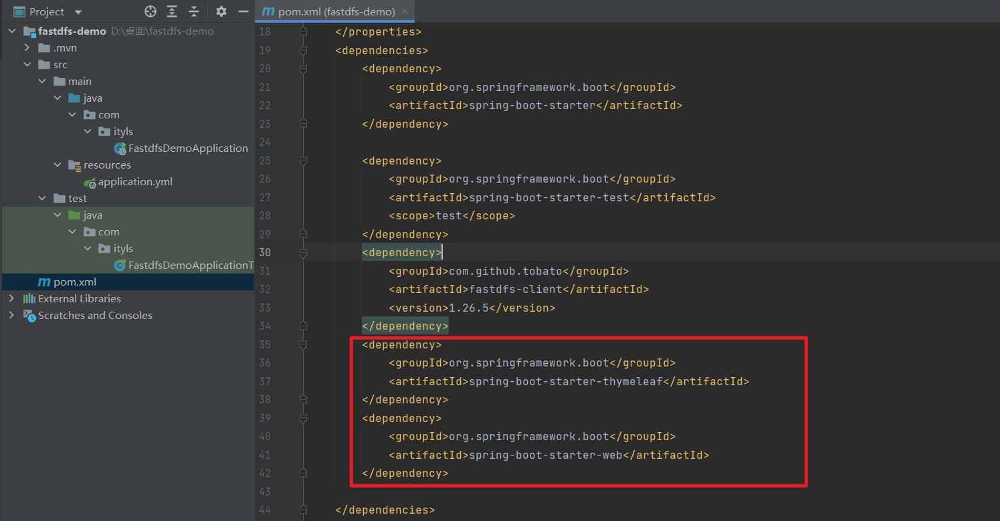

### 1, 什么是分布式文件系统


**单机时代：**

初创时期由于时间紧迫，在各种资源有限的情况下，通常就直接在项目目录下建立静态文件夹，用于用户存放项目中的文件资源。如果按不同类型再细分，可以在项目目录下再建立不同的子目录来区分。例如：`resources\static\file`、`resources\static\img`等。


**注意：**

- **优点**：便利，使用方便。

- **缺点**：文件越多存放越混乱。


**独立文件服务器：**

随着公司业务不断发展，将代码和文件放在同一服务器的弊端就会越来越明显。为了解决上面的问题引入独立图片服务器


**流程：**

项目上传文件时，首先通过ftp或者ssh将文件上传到图片服务器的某个目录下，再通过Ngnix或者Apache来访问此目录下的文件，返回一个独立域名的图片URL地址，前端使用文件时就通过这个URL地址读取。


**分布式文件系统：**

业务继续发展，单台服务器存储和响应也很快到达了瓶颈，新的业务需要文件访问具有高响应性、高可用性来支持系统。


**优点**：

- **扩展能力**: 毫无疑问，扩展能力是一个分布式文件系统最重要的特点；
- **高可用性**: 在分布式文件系统中，高可用性包含两层，一是整个文件系统的可用性，二是数据的完整和一致性；
- **弹性存储**: 可以根据业务需要灵活地增加或缩减数据存储以及增删存储池中的资源，而不需要中断系统运行。

**缺点**：系统复杂度稍高，需要更多服务器


### 2, FastDFS概述

FastDFS是一个开源的轻量级分布式文件系统。它解决了大数据量存储和负载均衡等问题。特别适合以中小文件（建议范围：4KB < file_size <500MB）为载体的在线服务，如相册网站、视频网站等等。


**FastDFS特性**：

- 文件不分块存储，上传的文件和OS文件系统中的文件一一对应
- 支持相同内容的文件只保存一份，节约磁盘空间
- 下载文件支持HTTP协议，可以使用内置Web Server，也可以和其他Web Server配合使用
- 支持在线扩容
- 支持主从文件


**分布式文件服务提供商：**

1、阿里的OSS

2、七牛云存储

3、百度云储存


### 3, FastDFS核心概念


FastDFS服务端有三个角色：跟踪服务器（tracker）、存储服务器（storage）和客户端（client）。

**tracker**

跟踪服务器，主要做调度工作，起负载均衡的作用。在内存中记录集群中所有存储组和存储服务器的状态信息，是客户端和数据服务器交互的枢纽。


**storage**

存储服务器（又称：存储节点或数据服务器），文件和文件属性（meta data）都保存到存储服务器上。Storage server直接利用OS的文件系统调用管理文件。


**client**

客户端，作为业务请求的发起方，通过专有接口，使用TCP/IP协议与跟踪器服务器或存储节点进行数据交互。FastDFS向使用者提供基本文件访问接口，比如upload、download、append、delete等，以客户端库的方式提供给用户使用。


**group**

组， 也可称为卷。 同组内服务器上的文件是完全相同的 ，同一组内的storage server之间是对等的， 文件上传、 删除等操作可以在任意一台storage server上进行 。


**流程：**

Tracker相当于FastDFS的大脑，不论是上传还是下载都是通过tracker来分配资源；客户端一般可以使用Ngnix等静态服务器来调用或者做一部分的缓存；存储服务器内部分为卷（或者叫做组），卷于卷之间是平行的关系，可以根据资源的使用情况随时增加，卷内服务器文件相互同步备份，以达到容灾的目的。


### 4, FastDFS概述_上传机制

首先客户端请求Tracker服务获取到存储服务器的ip地址和端口，然后客户端根据返回的IP地址和端口号请求上传文件，存储服务器接收到请求后生产文件，并且将文件内容写入磁盘并返回给客户端file_id、路径信息、文件名等信息，客户端保存相关信息上传完毕。


**内部机制如下：**

**1、选择Tracker server**

当集群中不止一个Tracker server时，由于Tracker之间是完全对等的关系，客户端在upload文件时可以任意选择一个trakcer。

**2、选择Storage server**

当选定Group后，Tracker会在Group内选择一个Storage Server给客户端

**3、选择Storage path**

当分配好Storage Server后，客户端将向Storage发送写文件请求，Storage将会为文件分配一个数据存储目录。

> **注意：**
>
> 剩余存储空间最多的优先。

**4、生成Fileid**

选定存储目录之后，Storage会为文件生一个Fileid，由Storage Server Ip、文件创建时间、文件大小、文件crc32和一个随机数拼接而成，然后将这个二进制串进行base64编码，转换为可打印的字符串。

**5、生成文件名**

当文件存储到某个子目录后，即认为该文件存储成功，接下来会为该文件生成一个文件名，文件名由group、存储目录、两级子目录、fileid、文件后缀名（由客户端指定，主要用于区分文件类型）拼接而成。


### 5, FastDFS概述_下载机制

客户端带上文件名信息请求Tracker服务获取到存储服务器的ip地址和端口，然后客户端根据返回的IP地址和端口号请求下载文件，存储服务器接收到请求后返回文件给客户端。


**内部机制如下：**

1. client询问tracker下载文件的storage，参数为文件标识（组名和文件名）
2. tracker返回一台可用的storage
3. client直接和storage通讯完成文件下载


### 6, FastDFS环境搭建_Linux版

**下载安装gcc：**

安装方式为yum安装（需网络）：

```
yum install gcc-c++ perl-devel pcre-devel openssl-devel zlib-devel wget
```


**下载安装FastDFS:**

```
wget https://github.com/happyfish100/fastdfs/archive/V6.06.tar.gz
```


**下载安装FastDFS依赖:**

```
wgethttps://github.com/happyfish100/libfastcommon/archive/V1.0.43.tar.gz
```


**解压缩依赖tar包:**

```
tar -zxvf V1.0.43.tar.gz -C /usr/local
tar -zxvf  V6.06.tar.gz-C /usr/local
```


**编译并安装libfastcommon:**

```
 cd /usr/local/libfastcommon-1.0.43/
 ./make.sh && ./make.sh install
```


**编译并安装FastDFS:**

```
cd /usr/local/fastdfs-6.06
./make.sh && ./make.sh install
```


**进入etc目录下复制配置文件:**

```
cd /etc/fdfs/
cp client.conf.sample client.conf
cp storage.conf.sample storage.conf
cp tracker.conf.sample tracker.conf
```


**创建tracker服务，创建tracker目录：**

```
mkdir -p  /data/fastdfs/tracker
```


**修改配置文件:**

```
vim /etc/fdfs/tracker.conf
disabled=false          #启用配置文件
port=22122            #设置 tracker 的端口号
base_path=/data/fastdfs/tracker #设置 tracker 的数据文件和日志目录（需预先创建）
http.server_port=8888      #设置 http 端口号
http.server_port=8888      #指的是在tracker服务器上启动http服务进程，如:apache或者nginx 启动时所监听的端口
```


**启动tracker服务:**

```
/etc/init.d/fdfs_trackerd start
```


**检查tracker服务:**

```
netstat -lntup |grep fdfs
tcp     0    0 0.0.0.0:22122      0.0.0.0:*        LISTEN    10757/fdfs_trackerd
```


**创建storage服务, 创建storage目录: **

```
mkdir -p /data/fastdfs/base
mkdir -p /data/fastdfs/storage
```


**修改配置文件:**

```
vim /etc/fdfs/storage.conf
disabled=false             #启用配置文件
group_name=group1           #组名，根据实际情况修改
port=23000               #设置 storage 的端口号
base_path=/data/fastdfs/base      #设置 storage 的日志目录（需预先创建）
store_path_count=1           #存储路径个数，需要和 store_path 个数匹配
store_path0=/data/fastdfs/storage     #存储路径
tracker_server=172.31.16.121:22122    #tracker 服务器的 IP 地址和端口号
http.server_port=8888         #设置storage上启动的http服务的端口号，如安装的nginx的端口号
```


**启动storage服务:**

```
/etc/init.d/fdfs_storaged start
```


**查看storage服务:**

```
netstat -lntup |grep fdfs
tcp     0    0 0.0.0.0:23000      0.0.0.0:*        LISTEN    10892/fdfs_storaged
tcp     0    0 0.0.0.0:22122      0.0.0.0:*        LISTEN    10757/fdfs_trackerd
```


**修改Client配置文件:**

```
vim /etc/fdfs/client.conf
connect_timeout=30
network_timeout=60
base_path=/data/fastdfs/client　　　　　　# 日志路径
tracker_server=192.168.66.100:22122　　　　# 追踪服务器的IP，有多个服务器可以另一行
```


**创建日志目录:**

```
mkdir -p /data/fastdfs/client
```


**查看启动的服务:**

```
ps -ef | grep fdfs
```


### 7, FastDFS指令


**上传指令:**

```
fdfs_upload_file <config_file> <local_filename> [storage_ip:port] [store_path_index]
```

**参数含义：**

1. <config_file> ：配置文件路径
2. <local_filename> ：本地文件路径
3. [storage_ip:port] ：（可选参数）
4. [store_path_index] ：（可选参数）


**指令使用：**

```
[root@tracker fdfs]# fdfs_upload_file /etc/fdfs/client.conf 上传的文件路径
```


上传文件后会返回文件在FastDFS中的唯一文件标识，即卷名+文件名。查看：


**下载指令：**

```
fdfs_download_file <config_file> <file_id> [local_filename] [<download_offset> <download_bytes>]
```

**参数含义：**

1. <config_file> ：配置文件路径
2. <file_id> ：文件在FastDFS中的唯一文件标识，即卷名+文件名
3. [local_filename] ：文件下载地址
4. <download_offset> ：（可选参数）文件下载开始时间
5. <download_bytes> ：（可选参数）文件下载的字节数


**指令使用:**

```
[root@tracker fdfs]# fdfs_download_file /etc/fdfs/client.conf group1/M00/00/00/ZyZR32ZiheSAZH-ZAAXK6R7Ygwk812.png /root/java/xxx.rpm
```


**查看文件信息指令:**

```
fdfs_file_info <config_file> <file_id>
```

**参数含义：**

1. <config_file> ：配置文件路径
2. <file_id> ：文件在FastDFS中的唯一文件标识，即卷名+文件名


**指令使用:**

```
[root@tracker fdfs]# fdfs_file_info /etc/fdfs/client.conf group1/M00/00/00/ZyZR32ZiheSAZH-ZAAXK6R7Ygwk812.png
```


**删除指令:**

```
fdfs_delete_file <config_file> <file_id>
```

**参数含义：**

1. <config_file> ：配置文件路径
2. <file_id> ：文件在FastDFS中的唯一文件标识，即卷名+文件名


**指令使用：**

```
[root@tracker fdfs]# fdfs_delete_file /etc/fdfs/client.conf group1/M00/00/00/ZyZR32ZiheSAZH-ZAAXK6R7Ygwk812.png
```

删除指令使用后，文件在该卷中的所有备份都会被删除，因为卷内的存储节点会相互同步，故慎用。


### 8, SpringBoot整合FastDFS

由GitHub大牛tobato在原作者YuQing与yuqih发布的JAVA客户端基础上进行了大量重构工作，并于GitHub上发布了FastDFS-Client1.26.5。


**主要特性:**

1. 对关键部分代码加入了单元测试，便于理解与服务端的接口交易，提高接口质量
2. 将以前对byte硬解析风格重构为使用对象+注解的形式，尽量增强了代码的可读性
3. 支持对服务端的连接池管理
4. 支持上传图片时候检查图片格式，并且自动生成缩略图
5. 在SpringBoot当中自动导入依赖


创建项目：


```xml
<?xml version="1.0" encoding="UTF-8"?>
<project xmlns="http://maven.apache.org/POM/4.0.0" xmlns:xsi="http://www.w3.org/2001/XMLSchema-instance"
         xsi:schemaLocation="http://maven.apache.org/POM/4.0.0 https://maven.apache.org/xsd/maven-4.0.0.xsd">
    <modelVersion>4.0.0</modelVersion>
    <parent>
        <groupId>org.springframework.boot</groupId>
        <artifactId>spring-boot-starter-parent</artifactId>
        <version>2.6.3</version>
        <relativePath/> <!-- lookup parent from repository -->
    </parent>
    <groupId>com.ityls</groupId>
    <artifactId>fastdfs-demo</artifactId>
    <version>0.0.1-SNAPSHOT</version>
    <name>fastdfs-demo</name>
    <description>fastdfs-demo</description>
    <properties>
        <java.version>1.8</java.version>
    </properties>
    <dependencies>
        <dependency>
            <groupId>org.springframework.boot</groupId>
            <artifactId>spring-boot-starter</artifactId>
        </dependency>

        <dependency>
            <groupId>org.springframework.boot</groupId>
            <artifactId>spring-boot-starter-test</artifactId>
            <scope>test</scope>
        </dependency>
        <dependency>
            <groupId>com.github.tobato</groupId>
            <artifactId>fastdfs-client</artifactId>
            <version>1.26.5</version>
        </dependency>
    </dependencies>

    <build>
        <plugins>
            <plugin>
                <groupId>org.springframework.boot</groupId>
                <artifactId>spring-boot-maven-plugin</artifactId>
            </plugin>
        </plugins>
    </build>

</project>
```


**配置springboot的application.yml配置文件:**


```yml
fdfs:
  so-timeout: 1501  #连接时间
  connect-timeout: 601 #超时时间
  thumb-image:       #缩略图生成参数
    width: 150
    height: 150
  tracker-list:       #TrackerList参数,支持多个
    - 103.38.81.223:22122
#    - 103.38.81.224:22122
```


测试上传：


```java
@SpringBootTest
class FastdfsDemoApplicationTests {

    @Autowired
    private FastFileStorageClient fastFileStorageClient;

    /**
     * 测试springboot环境下的javaAPI对分布式文件系统的上传文件的操作
     * @throws FileNotFoundException
     */
    @Test
    public void testUpload() throws FileNotFoundException {
        //获取本地文件
        File file = new File("E:\\1.jpg");
        //创建传输文件的输入流
        FileInputStream fileInputStream = new FileInputStream(file);
        //文件上传：参数一：传输文件内容的输入流；参数二：文件的size；参数三：文件扩展名；参数四：描述文件的元数据；返回值：上传文件在存储节点的唯一标识（卷名+文件名）
        StorePath storePath = fastFileStorageClient.uploadFile(fileInputStream, file.length(), "jpg", null);
        //将卷名与文件名一起打印
        System.out.println(storePath.getFullPath());
        //将卷名与文件名分别打印
        System.out.println(storePath.getGroup()+" | "+storePath.getPath());
    }

}
```


结果：

```
group1/M00/00/00/ZyZR32ZiifqAA-p8AAGZ4Az5MQw196.jpg
group1 | M00/00/00/ZyZR32ZiifqAA-p8AAGZ4Az5MQw196.jpg
```


测试下载：


```java
/**
     * 测试springboot环境下的javaAPI对分布式文件系统的下载文件的操作
     * @throws IOException
     */
@Test
public void testDownload() throws IOException {
    //下载文件：参数一：文件处于存储节点的卷名；参数二：文件在存储节点的文件名；参数三：下载的回调函数；返回值：文件内容的字节数组
    byte[] bytes = fastFileStorageClient.downloadFile("group1", "M00/00/00/ZyZR32ZiifqAA-p8AAGZ4Az5MQw196.jpg", new DownloadByteArray());
    //创建文件输出流，指定输出位置及文件名
    FileOutputStream fileOutputStream = new FileOutputStream("E:\\2.jpg");
    //使用文件输出流将文件内容字节数组写出
    fileOutputStream.write(bytes);
    //刷新输出流
    fileOutputStream.flush();
    //关闭输出流
    fileOutputStream.close();
}
```


结果：


### 9, 文件上传_SpringBoot基于FastDFS实现


**引入Thymeleaf视图解析器：**



```xml
<dependency>
 <groupId>org.springframework.boot</groupId>
 <artifactId>spring-boot-starter-thymeleaf</artifactId>
</dependency>
 <dependency>
  <groupId>org.springframework.boot</groupId>
  <artifactId>spring-boot-starter-web</artifactId>
</dependency>
```


controller:


```java
package com.ityls.controller;

import com.github.tobato.fastdfs.domain.fdfs.StorePath;
import com.github.tobato.fastdfs.service.FastFileStorageClient;
import org.springframework.beans.factory.annotation.Autowired;
import org.springframework.web.bind.annotation.PostMapping;
import org.springframework.web.bind.annotation.RestController;
import org.springframework.web.multipart.MultipartFile;

import java.io.IOException;

/*
图片控制层
 */
@RestController
public class UploadController {

    @Autowired
    private FastFileStorageClient fastFileStorageClient;

    /**
     * 图片上传
     * @param file
     */
    @PostMapping("upload")
    public void upload(MultipartFile file) throws IOException {
        // 1. 判断文件是否为空
        if (file != null){
            // 2. 获取上传图片名字  dog.jpg
            String filename = file.getOriginalFilename();
            // 3. 图片后缀名  jpg
            String fileSuffix = filename.substring(filename.lastIndexOf(".") + 1);
            // 4. 上传图片
            StorePath storePath = fastFileStorageClient.uploadFile(file.getInputStream(),
                    file.getSize(), fileSuffix, null);
            // 5. 创建成功会返回文件路径
            System.out.println(storePath.getFullPath());
            // TODO 保存到数据库  jdbc  mybaits plus
        }
    }
}
```


**下载wangEditor富文本编辑器:**


```html
<!DOCTYPE html>
<html lang="en">
<head>
    <meta charset="UTF-8">
    <title>文件上传</title>
</head>
<body>
<div id="div1">
    <p>欢迎使用 <b>wangEditor</b> 富文本编辑器</p>
</div>

</body>

<script type="text/javascript" src="https://unpkg.com/wangeditor/dist/wangEditor.min.js"></script>

<script type="text/javascript">
    const E = window.wangEditor
    const editor = new E('#div1')
    // 配置服务端接口
    editor.config.uploadImgServer = '/upload'
    // 参数名字
    editor.config.uploadFileName = 'file'
    //限制图片大小和类型
    editor.config.uploadImgMaxSize = 2 * 1024 * 1024 // 2M
    editor.config.uploadImgAccept = ['jpg', 'jpeg', 'png', 'gif', 'bmp', 'webp']


    editor.create()
</script>

</html>
```


测试：


### 10, FastDFS整合Nginx

Nginx服务器是一个高性能的web服务器与反向代理服务器。


**FastDFS集成Nginx的2个原因:**

- 为分布式文件系统提供Http服务支持。通过Nginx的web服务代理访问分布式文件系统的存储节点，从而实现通过http请求访问存储节点资源。

  

- 解决复制延迟问题。由于FastDFS的同卷的存储节点之间需要同步，当文件尚未同步完成时，访问请求到达改节点，获取的数据将是未同步完的不完整数据，即为复制延迟问题。通过Nginx检测请求的存储节点的数据，若该存储节点的数据尚未同步完成，则将请求转发至数据的原存储节点，从而解决复制延迟问题。

  


### 11, FastDFS集成Nginx_环境搭建


**下载Fastdfs的Nginx模块包:**

```
cd /usr/local
wget https://github.com/happyfish100/fastdfs-nginx-module/archive/V1.22.tar.gz

tar -zxvf V1.22.tar.gz
```


**安装Nginx依赖文件:**

```
yum install -y gcc gcc-c++ zlib zlib-devel openssl openssl-devel pcre pcre-devel gd-devel epel-release
```


**下载Nginx软件包:**

```
wget https://nginx.org/download/nginx-1.19.2.tar.gz
cd nginx-1.19.2/
```


**配置Nginx服务器:**

```
#建立Makefile文件，检查Linux系统环境以及相关的关键属性。
./configure --add-module=/usr/local/fastdfs-nginx-module-1.22/src/

#编译项目，主要将gcc源代码编译成可执行的目标文件
make

#根据上一步骤编译完成的数据安装到预定的目录中。
make install
```

**注意：**

- –add-module：为nginx添加一个fastdfs-nginx-module模块，值为该模块在当前系统的路径
- –prefix：指定nginx安装位置


**将Fastdfs软件包里面的http.conf和mime.types拷贝到/etc/fdfs目录下**

```
cp /usr/local/src/fastdfs-6.06/conf/mime.types /etc/fdfs/
cp /usr/local/src/fastdfs-6.06/conf/http.conf /etc/fdfs/
```


**配置Nginx的fastdfs模块，并编辑文件:**

```
#拷贝文件
[root@localhost opt]cp /usr/local/fastdfs-nginx-module-1.22/src/mod_fastdfs.conf /etc/fdfs/
[root@localhost fdfs] vim mod_fastdfs.conf
#保存日志目录
base_path=/data/fastdfs/storage   
#tracker 服务器的 IP 地址以及端口号
tracker_server=192.168.66.100:22122 
#文件url中是否有group 名
url_have_group_name = true      
#存储路径
store_path0=/data/fastdfs/storage  
group_count = 1            #设置组的个数
#然后在末尾添加分组信息，目前只有一个分组，就只写一个
[group1]
group_name=group1
storage_server_port=23000
store_path_count=1
store_path0=/data/fastdfs/storage
```


**配置Nginx:**

```
server {
  listen    80;
  server_name  localhost;
   
  location ~ /group[1-3]/M00 {
    alias /data/fastdfs/storage/data;
     ngx_fastdfs_module;
   }
  # 根目录下返回403
  location = / {
     return 403;
   }
  # log file
  access_log  logs/img_access.log access;
}
```


**启动Ningx服务:**

```
# 进入sbin目录
[root@tracker nginx]# cd sbin/
# 启动服务 -c：指定配置文件
[root@tracker sbin]# ./nginx -c /usr/local/nginx/conf/nginx.conf
```


**查看服务启动情况:**

```
[root@tracker sbin]# ps -ef | grep nginx
```


**启动追踪服务与存储节点服务:**

```
[root@tracker sbin]# fdfs_trackerd /etc/fdfs/tracker.conf start
[root@tracker sbin]# fdfs_storaged /etc/fdfs/storage.conf start
```


**将图片上传至linux系统后，使用指令上传至分布式文件系统:**

```
[root@tracker fdfs]# fdfs_upload_file /etc/fdfs/client.conf /root/xxxxx.png
group1/M00/00/00/wKhyj1wrIUWAL5ASAAAfA8PiO7Y493.png
```


**通过浏览器远程访问:**


```
http://103.38.81.223/group1/M00/00/00/ZyZR32ZimVCAJUFWAAXK6R7Ygwk524.png
```


