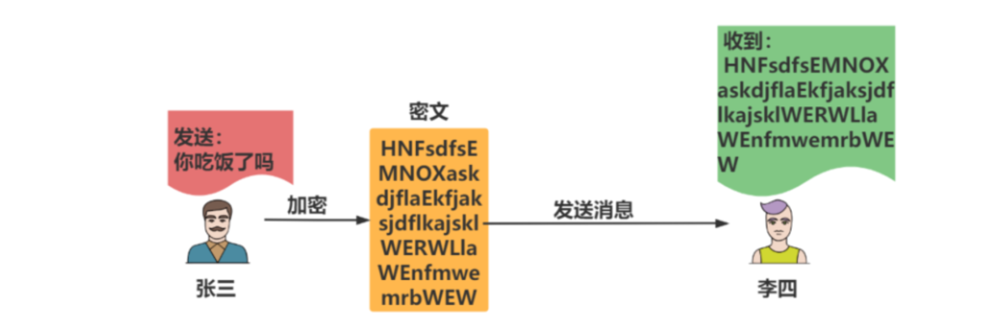
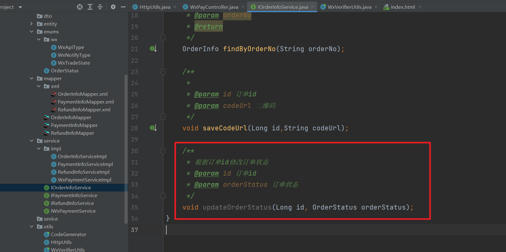
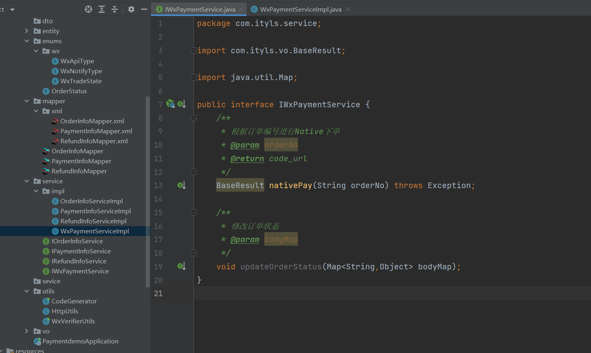
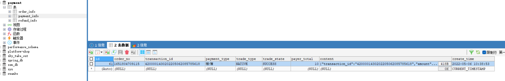
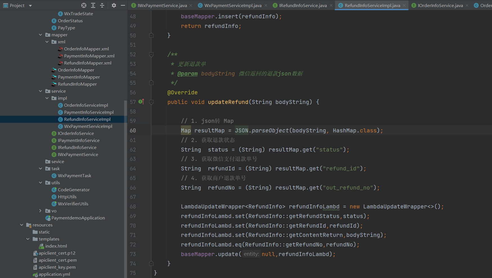

## 一，支付介绍与准备工作
### 1, 产品介绍


**微信支付介绍：**

微信支付（[https://pay.weixin.qq.com](https://pay.weixin.qq.com/)）是腾讯集团旗下中国领先的第三方支付平台，一直致力于为用户和企业提供安全、便捷、专业的在线支付服务。


**付款码支付：**

付款码支付是指用户展示微信钱包内的“付款码”给商户系统扫描后直接完成支付，适用于线下场所面对面收银的场景，例如商超、便利店、餐饮、医院、学校、电影院和旅游景区等具有明确经营地址的实体场所。


**JSAPI支付：**

JSAPI支付是指商户通过调用微信支付提供的JSAPI接口，在支付场景中调起微信支付模块完成收款。


**小程序支付：**

小程序支付是指商户通过调用微信支付小程序支付接口，在微信小程序平台内实现支付功能；用户打开商家助手小程序下单，输入支付密码并完成支付后，返回商家小程序。


**Native支付：**金额不能自定义

Native支付是指商户系统按微信支付协议生成支付二维码，用户再用微信“扫一扫”完成支付的模式。该模式适用于PC网站、实体店单品或订单、媒体广告支付等场景。


**APP支付：**

APP支付是指商户通过在移动端应用APP中集成开放SDK调起微信支付模块来完成支付。适用于在移动端APP中集成微信支付功能的场景。


**刷脸支付：**

刷脸支付是指用户在刷脸设备前通过摄像头刷脸、识别身份后进行的一种支付方式，安全便捷。适用于线下实体场所的收银场景，如商超、餐饮、便利店、医院、学校等。


### 2, 前期准备工作之获取商户号


**获取商户号：**

微信商户平台：<https://pay.weixin.qq.com/>

场景：Native支付


以我有PC网站为例：


准备材料：


获取商户号：


### 3, 前期准备工作之获取微信公众APPID


登录公众号：


APPID：微信公众号 =》 开发管理 =》 开发设置 =》 获取AppID


### 4, 前期准备工作之设置证书和密钥


步骤一：


步骤二：


步骤三：


**注意：**

- aplclient_cert.p12：包含了私钥信息得证书文件。
- apiclient_cert.pem：从apiclient_cert.p12中导出证书部分的文件，为pem格式，请妥善保管。
- apiclient_key.pem：部分开发语言和环境不能使用p12文件，需要使用pem文件为了方便，直接提供。


**获取API秘钥：**

- APIv2版本的接口需要此秘钥

- 步骤：登录商户平台 => 选择 账户中心 => 安全中心 => API安全 => 设置API密钥

- 生成随机密码<https://suijimimashengcheng.bmcx.com/>


步骤一：


步骤二：


步骤三：


商户号：

```
1609462435
```


APIV3密钥：

```
g38hhY10sXTuxy3lvBmCxIrJn3u1tc8r
```


证书ID：

```
16753799746EDFD6916E0C7AADEB7114695F4BC5
```


AppID:

```
wxa791a4ea3b1bb0a5
```


**注意：**

以上所有API秘钥和证书需妥善保管防止泄露。


## 二，支付安全
### 1, 信息安全的基础


**密码学基本概念:**

密码学是网络安全、信息安全、区块链等产品的基础，常见的非对称加密、对称加密、散列函数等，都属于密码学范畴。


**中国古代加密:**

公元683年，唐中宗即位。随后，武则天废唐中宗，立第四子李旦为皇帝，但朝政大事均由她自己专断。裴炎、徐敬业和骆宾王等人对此非常不满。徐敬业聚兵十万，在江苏扬州起兵。裴炎做内应，欲以拆字手段为其传递秘密信息。后因有人告密，裴炎被捕，未发出的密信落到武则天手中。这封密信上只有“青鹅”二字，群臣对此大惑不解。　　


**破解：**

武则天破解了“青鹅”的秘密：“青”字拆开来就是“十二月”，而“鹅”字拆开来就是“我自与”。密信的意思是让徐敬业、骆宾王等率兵于十二月进发，裴炎在内部接应。“青鹅”破译后，裴炎被杀。接着，武则天派兵击败了徐敬业和骆宾王。


**明文：**加密前的消息叫“明文”（plain text）。


**密文：**加密后的文本叫“密文”（cipher text）。




**密钥：**

只有掌握特殊“钥匙”的人，才能对加密的文本进行解密，这里的“钥匙”就叫做“密钥”（key）。


**加密算法：**

- MD5信息摘要算法
- DES是对称性加密算法
- RSA是一种非对称加密算法


### 2, 消息摘要

摘要算法就是我们常说的散列函数、哈希函数（Hash Function），它能够把任意长度的数据“压缩”成固定长度、而且独一无二的“摘要”字符串，就好像是给这段数据生成了一个数字“指纹”。


百度搜索 `MySQL` ，进入官网下载 ，会经常发现有 `sha1`，`sha512` , 这些都是数字摘要。


**作用**：保证信息的完整性


**特点：**

- 不可逆：只有算法，没有秘钥，只能加密，不能解密
- 难题友好性：想要破解，只能暴力枚举
- 发散性：只要对原文进行一点点改动，摘要就会发生剧烈变化抗
- 碰撞性：原文不同，计算后的摘要也要不同


**常见算法：**

- MD5
- SHA1
- SHA256
- SHA512


代码演示(jdk1.8)：


```java
package com.ityls;

import sun.misc.BASE64Encoder;

import java.security.MessageDigest;
import java.security.NoSuchAlgorithmException;

/**
 * Hello world!
 *
 */
public class App 
{
    public static void main(String[] args) throws NoSuchAlgorithmException {
        // 原文  原文一样，摘要出来的摘要都是一样的
        String input = "ityls";  // WBU8Kco4+y+KOKD0yjb0Kg==
        // 算法
        String algorithm = "MD5";
        // 获取数字摘要对象
        MessageDigest messageDigest = MessageDigest.getInstance(algorithm);
        // 获取消息数字摘要的字节数组
        // degest打印乱码，加密后编码表找不到对应字符, 出现乱码
        byte[] digest = messageDigest.digest(input.getBytes());
        
        System.out.println(new BASE64Encoder().encode(digest));
    }
}
```


### 3, 对称加密


**对称加密：**

对称加密指的就是加密和解密使用同一个秘钥，所以叫做对称加密。对称加密只有一个秘钥，作为私钥。


**对称加密算法：**

- DES（DES加密算法规定，密钥key必须是8个字节，key="12345678"）
- AES
- 3DES


**特点**

- 加密速度快, 可以加密大文件
- 密文可逆, 一旦密钥文件泄漏, 就会导致数据暴露
- 加密后编码表找不到对应字符, 出现乱码
- 一般结合Base64使用


代码演示：

```java
package com.itbaizhan;

import sun.misc.BASE64Decoder;
import sun.misc.BASE64Encoder;

import javax.crypto.BadPaddingException;
import javax.crypto.Cipher;
import javax.crypto.IllegalBlockSizeException;
import javax.crypto.NoSuchPaddingException;
import javax.crypto.spec.SecretKeySpec;
import java.io.IOException;
import java.security.InvalidKeyException;
import java.security.NoSuchAlgorithmException;

/**
 * 对称加密 des
 */
public class DESdemo {

    public static void main(String[] args) throws IllegalBlockSizeException, InvalidKeyException, BadPaddingException, NoSuchAlgorithmException, NoSuchPaddingException, IOException {
        //原文
        String input = "ityls";
        // 私钥 秘钥
        String key = "12345678";
        // 算法
        String algorithhm = "DES";

        // 加密
       // String s = encrypetDES(input, key, algorithhm);
        // 密文：    JXHPxM7Xw6o=
       // System.out.println(s);

       String mi = "JXHPxM7Xw6o=";

        //解密
        String s = decryptDES(mi, key, algorithhm);
        System.out.println(s);

    }

    // 加密
    private static String  encrypetDES(String input ,String key,String algorithhm) throws NoSuchPaddingException, NoSuchAlgorithmException, InvalidKeyException, BadPaddingException, IllegalBlockSizeException {

        // 获取对称加密对象
        Cipher cipher = Cipher.getInstance(algorithhm);

        // 创建加密规则
        SecretKeySpec sks = new SecretKeySpec(key.getBytes(), algorithhm);

        // 初始化加密模式和算法
        // ENCRYPT_MODE 加密模式
        // DECRYPT_MODE 解密模式
        cipher.init(Cipher.ENCRYPT_MODE,sks);

        // 加密
        byte[] bytes = cipher.doFinal(input.getBytes());
        BASE64Encoder encoder = new BASE64Encoder();

        return encoder.encode(bytes);
    }


    // 解密
    private static String  decryptDES(String input ,String key,String algorithhm) throws NoSuchPaddingException, NoSuchAlgorithmException, InvalidKeyException, BadPaddingException, IllegalBlockSizeException, IOException {

        // 获取对称加密对象
        Cipher cipher = Cipher.getInstance(algorithhm);

        // 创建加密规则
        SecretKeySpec sks = new SecretKeySpec(key.getBytes(), algorithhm);

        // 初始化加密模式和算法
        // ENCRYPT_MODE 加密模式
        // DECRYPT_MODE 解密模式
        cipher.init(Cipher.DECRYPT_MODE,sks);

        // 加密
        // 解码
        BASE64Decoder encoder = new BASE64Decoder();
        byte[] bytes = cipher.doFinal(encoder.decodeBuffer(input));

        // 明文
        return new String(bytes);
    }
}
```


### 4, 非对称加密之公钥加密和私钥解密


**非对称加密:**

非对称加密指的是：加密和解密使用不同的秘钥，一把作为公开的公钥，另一把作为私钥。公钥加密的信息，只有私钥才能解密。私钥加密的信息，只有公钥才能解密。


**非对称加密算法:**

- RSA
- ECC


**特点:**

- 加密和解密使用不同的密钥
- 如果使用私钥加密, 只能使用公钥解密
- 如果使用公钥加密, 只能使用私钥解密
- 处理数据的速度较慢, 因为安全级别高


依赖：


```xml
<dependency>
   <groupId>commons-io</groupId>
   <artifactId>commons-io</artifactId>
   <version>2.6</version>
 </dependency>
```


代码演示：


```java
package com.ityls;

import com.sun.org.apache.xerces.internal.impl.dv.util.Base64;
import org.apache.commons.io.FileUtils;

import javax.crypto.BadPaddingException;
import javax.crypto.Cipher;
import javax.crypto.IllegalBlockSizeException;
import javax.crypto.NoSuchPaddingException;
import java.io.File;
import java.io.IOException;
import java.nio.charset.Charset;
import java.security.*;
import java.security.spec.InvalidKeySpecException;
import java.security.spec.PKCS8EncodedKeySpec;
import java.security.spec.X509EncodedKeySpec;

/**
 * 非对称加密  公钥  私钥
 */
public class RSAdemo {
    public static void main(String[] args) throws IOException, NoSuchAlgorithmException, InvalidKeySpecException, IllegalBlockSizeException, InvalidKeyException, BadPaddingException, NoSuchPaddingException {

        // 1. 原文
        String input = "ityls";
        // 2. 加密算法
        String  algorithm = "RSA";
        // 3. 生成密钥文件
       // generateKey(algorithm,"a.pub","a.pri");
        // 公钥加密  -》  私钥解密
        // 4. 获取公钥
       // PublicKey publicKey = getPublicKey("a.pub", algorithm);
       //  5. 加密
       // String s = encryptRSA(input, publicKey, algorithm);
       //  JANBpE4KAXcOmGjnVfMulnD4Q06PubPM269amF+vlBkPLvps6Kf1fYx6+S0Q8GBCdRubYw9X0PcVqJL7sZFJxvC699phwghayi+FK3UWFwu5vwD1GFa15eLyh/mugNfUXVyInONJHTt/8yaqUwhnPCk+6IAZJxNXH9NwnYU1zGs=
       // System.out.println(s);


        // 密文
        String s = "JANBpE4KAXcOmGjnVfMulnD4Q06PubPM269amF+vlBkPLvps6Kf1fYx6+S0Q8GBCdRubYw9X0PcVqJL7sZFJxvC699phwghayi+FK3UWFwu5vwD1GFa15eLyh/mugNfUXVyInONJHTt/8yaqUwhnPCk+6IAZJxNXH9NwnYU1zGs=";
        // 读取私钥
        PrivateKey privatKey = getPrivatKey("a.pri", algorithm);
        // 解密
        String s1 = decryptRSA(s, privatKey, algorithm);
        System.out.println(s1);
    }


    /**
     * 生成秘钥
     * @param algorithm 算法
     * @param pubPath 公钥保存路径
     * @param priPath 私钥保存路径
     */
    public static  void generateKey(String algorithm,String pubPath,String priPath) throws NoSuchAlgorithmException, IOException {
        // 1. 获取密钥生成器
        KeyPairGenerator keyPairGenerator = KeyPairGenerator.getInstance(algorithm);
        // 2. 获取密钥对
        KeyPair keyPair = keyPairGenerator.generateKeyPair();
        // 3. 获取公钥
        PublicKey publicKey = keyPair.getPublic();
        // 4. 获取私钥
        PrivateKey privateKey = keyPair.getPrivate();
        // 5. 获取byte数组
        byte[] publicKeyEncoded = publicKey.getEncoded();
        byte[] privateKeyEncoded = privateKey.getEncoded();
        // 6. 编码BASE64编码
        String publicKeyString = Base64.encode(publicKeyEncoded);
        String privateKeyString = Base64.encode(privateKeyEncoded);
        // 7. 保存文件
        FileUtils.writeStringToFile(new File(pubPath),publicKeyString, Charset.forName("UTF-8"));
        FileUtils.writeStringToFile(new File(priPath),privateKeyString, Charset.forName("UTF-8"));
    }


    /**
     * 读取公钥文件
     * @param publicPath
     * @param algorithm
     * @return
     */
    public static PublicKey getPublicKey(String publicPath,String algorithm) throws IOException, NoSuchAlgorithmException, InvalidKeySpecException {

        // 1. 读取文件
        String s = FileUtils.readFileToString(new File(publicPath), Charset.forName("UTF-8"));
        // 2. 获取密钥工厂
        KeyFactory keyFactory = KeyFactory.getInstance(algorithm);
        // 3. 构建秘钥规范
        X509EncodedKeySpec x509EncodedKeySpec = new X509EncodedKeySpec(Base64.decode(s));
        return keyFactory.generatePublic(x509EncodedKeySpec);

    }


    /**
     * 读取私钥文件
     * @param PrivatPath 私钥路径
     * @param algorithm 算法
     * @return
     */
    public static PrivateKey getPrivatKey(String PrivatPath,String algorithm) throws IOException, NoSuchAlgorithmException, InvalidKeySpecException {

        // 1. 读取文件
        String s = FileUtils.readFileToString(new File(PrivatPath), Charset.forName("UTF-8"));
        // 2. 获取密钥工厂
        KeyFactory keyFactory = KeyFactory.getInstance(algorithm);
        // 3. 构建秘钥规范
        PKCS8EncodedKeySpec pes = new PKCS8EncodedKeySpec(Base64.decode(s));
        return keyFactory.generatePrivate(pes);

    }


    /**
     * 加密
     * @param input 原文
     * @param key 密钥
     * @param algorithm 算法
     * @return
     */
    public static String encryptRSA(String input,Key key,String algorithm) throws NoSuchPaddingException, NoSuchAlgorithmException, InvalidKeyException, BadPaddingException, IllegalBlockSizeException {
        // 1. 创建加密对象
        Cipher cipher = Cipher.getInstance(algorithm);
        // 2. 初始化加密
        cipher.init(Cipher.ENCRYPT_MODE,key);
        // 3. 公钥加密
        byte[] bytes = cipher.doFinal(input.getBytes());
        return Base64.encode(bytes);
    }

    /**
     * 解密
     * @param input 原文
     * @param key 密钥
     * @param algorithm 算法
     * @return
     */
    public static String decryptRSA(String input,Key key,String algorithm) throws NoSuchPaddingException, NoSuchAlgorithmException, InvalidKeyException, BadPaddingException, IllegalBlockSizeException {
        // 1. 创建加密对象
        Cipher cipher = Cipher.getInstance(algorithm);
        // 2. 初始化加密
        cipher.init(Cipher.DECRYPT_MODE,key);
        // 3. 由于密文base64编码
        byte[] decode = Base64.decode(input);
        // 4. 对密文解密
        byte[] bytes = cipher.doFinal(decode);
        return new String(bytes);
    }
}
```


### 6, 数字签名


**数字签名是什么：**

数字签名（又称公钥数字签名）是只有信息的发送者才能产生的别人无法伪造的一段数字串，这段数字串同时也是对信息的发送者发送信息真实性的一个有效证明。数字签名是非对称密钥加密技术与数字摘要技术的应用。


**生活中的数据签名：**

相信我们都写过信，在写信的时候落款处总是要留下自己的名字，用来表示写信的人是谁。我们签的这个字就是生活中的签名。


**注意:**

在网络中传输数据时候，给数据添加一个数字签名，表示是谁发的数据，而且还能证明数据没有被篡改。OK，数字签名的主要作用就是保证了数据的有效性（验证是谁发的）和完整性（证明信息没有被篡改）。


**基本原理：**


张三有两把钥匙，一把是公钥，另一把是私钥。张三把公钥送给他的朋友们----铁蛋、幺妹、李四----每人一把。


幺妹要给张三写一封保密的信。她写完后用张三的公钥加密，就可以达到保密的效果。


张三收信后，用私钥解密，就看到了信件内容。这里要强调的是，只要张三的私钥不泄露，这封信就是安全的，即使落在别人手里，也无法解密。


张三给幺妹回信，决定采用"数字签名"。他写完后先用Hash函数，生成信件的摘要（digest）。


张三使用私钥，对这个摘要加密，生成"数字签名"（signature）。幺妹收信后，取下数字签名，用张三的公钥解密，得到信件的摘要。由此证明，这封信确实是张三发出的。幺妹再对信件本身使用Hash函数，将得到的结果，与上一步得到的摘要进行对比。如果两者一致，就证明这封信未被修改过。


### 7, 数字证书

**数字证书解决公钥不信任问题**


**为什么需要数字证书：**

复杂的情况出现了。李四想欺骗幺妹，他偷偷使用了幺妹的电脑，用自己的公钥换走了张三的公钥。此时，幺妹实际拥有的是李四的公钥，但是还以为这是张三的公钥。因此，李四就可以冒充张三，用自己的私钥做成"数字签名"，写信给幺妹，让幺妹用假的张三公钥进行解密。


后来，幺妹感觉不对劲，发现自己无法确定公钥是否真的属于张三。她想到了一个办法，要求张三去找"证书中心"（certificate authority，简称CA），为公钥做认证。证书中心用自己的私钥，对张三的公钥和一些相关信息一起加密，生成"数字证书"（Digital Certificate）。


**理解数据证书：**

比如说我们的毕业证书，任何公司都会承认。为什么会承认？因为那是国家发得，大家都信任国家。也就是说只要是国家的认证机构，我们都信任它是合法的。


**原理：**

为了解决公钥的信任问题，张三和幺妹找一家认证公司（CA *Ca*tificate Authority），把公钥进行认证，证书中心用自己的私钥，对A的公钥和一些相关信息一起加密，生成“**数字证书**”（Digital Certificate）


幺妹如果获取到证书，证书可以用CA的公钥（认证中心信用背书）进行解密，会得到发公钥人的信息，以及他的公钥，此时这个A的公钥是可信的。


所以张三给幺妹发送信息的时候，就会带上签名，和证书一并发送给到互联网上，幺妹接收到消息的时候，先用CA发布的公钥解密数字证书，得到张三的公钥，用张三的公钥解密签名，得到摘要，幺妹在用hash算法得到消息的摘要，对两个摘要对比，如果相等，说明消息在网络上没有被不法分子修改。


## 三，支付工程准备
### 1, 创建支付工程


创建项目(JDK1.8)：


依赖：

```xml
    <dependencies>
        <dependency>
            <groupId>org.springframework.boot</groupId>
            <artifactId>spring-boot-starter-web</artifactId>
        </dependency>
        <dependency>
            <groupId>org.projectlombok</groupId>
            <artifactId>lombok</artifactId>
            <optional>true</optional>
        </dependency>
        <dependency>
            <groupId>org.springframework.boot</groupId>
            <artifactId>spring-boot-starter-test</artifactId>
            <scope>test</scope>
        </dependency>
    </dependencies>
```


springboot版本：


字符编码：


Java编译版本选择：


配置application.yml文件：


```yml
server:
  # 端口号
  port: 9090
spring:
  application:
    #应用名
    name: payment

logging:
  pattern:
    console: logging.pattern.console=%d{MM/dd HH:mm:ss.SSS} %clr(%-5level) --- [%-15thread] %cyan(%-50logger{50}):%msg%n
```


不同功能的类放在不同功能的包里面。

- config：所有的配置 用于存放Spring Boot相关的配置类，包括启动类。
- controller：所有请求入口，前端访问后端的入口。
- sevice：逻辑层，负责所有的业务逻辑。
- mapper：或者叫Dao,持久层，负责java和数据库交互。包括interface和XML两类文件。
- entity(Po)：表映射实体，用一个java类来映射数据库表，类名就相当于表名，类的属性就相当于表字段。
- dto：数据传输对象（Data Transfer Object），用于前后端数据交互。


Domain和Dto区别：

- 从用法上来说：Domain用于java数据和数据库表记录映射，删除增加修改数据库的数据，用在service层和Mapper层。
- Dto用在前后端数据传输：用在controller层和Service层Service层介于Controller和Mapper之间，也是Domain和Dto的转换层。


### 2, 创建数据库表

数据库：


分析：


```sql
/*
 Navicat Premium Data Transfer

 Source Server         : 本地数据库
 Source Server Type    : MySQL
 Source Server Version : 50734
 Source Host           : localhost:3306
 Source Schema         : payment

 Target Server Type    : MySQL
 Target Server Version : 50734
 File Encoding         : 65001

 Date: 06/05/2022 11:27:03
*/

SET NAMES utf8mb4;
SET FOREIGN_KEY_CHECKS = 0;

-- ----------------------------
-- Table structure for order_info
-- ----------------------------
DROP TABLE IF EXISTS `order_info`;
CREATE TABLE `order_info`  (
  `id` bigint(11) UNSIGNED NOT NULL AUTO_INCREMENT COMMENT '订单id',
  `title` varchar(256) CHARACTER SET utf8mb4 COLLATE utf8mb4_general_ci NULL DEFAULT NULL COMMENT '订单标题',
  `order_no` varchar(50) CHARACTER SET utf8mb4 COLLATE utf8mb4_general_ci NULL DEFAULT NULL COMMENT '商户订单编号',
  `user_id` bigint(20) NULL DEFAULT NULL COMMENT '用户id',
  `total_fee` int(11) NULL DEFAULT NULL COMMENT '订单金额(分)',
  `code_url` varchar(50) CHARACTER SET utf8mb4 COLLATE utf8mb4_general_ci NULL DEFAULT NULL COMMENT '订单二维码连接',
  `order_status` varchar(10) CHARACTER SET utf8mb4 COLLATE utf8mb4_general_ci NULL DEFAULT NULL COMMENT '订单状态',
  `create_time` datetime(0) NULL DEFAULT CURRENT_TIMESTAMP(0) COMMENT '创建时间',
  PRIMARY KEY (`id`) USING BTREE
) ENGINE = InnoDB AUTO_INCREMENT = 1516240544441835604 CHARACTER SET = utf8mb4 COLLATE = utf8mb4_general_ci ROW_FORMAT = DYNAMIC;

-- ----------------------------
-- Records of order_info
-- ----------------------------
INSERT INTO `order_info` VALUES (1516240544441835602, '红米', '1651804709115', 123456, 10, 'weixin://wxpay/bizpayurl?pr=IkR9W0bzz', '已退款', '2022-05-06 10:38:29');
INSERT INTO `order_info` VALUES (1516240544441835603, '电话卡', '1651805855691', 123456, 10, NULL, '未支付', '2022-05-06 10:57:36');

-- ----------------------------
-- Table structure for payment_info
-- ----------------------------
DROP TABLE IF EXISTS `payment_info`;
CREATE TABLE `payment_info`  (
  `id` bigint(20) UNSIGNED NOT NULL AUTO_INCREMENT COMMENT '支付记录id',
  `order_no` varchar(50) CHARACTER SET utf8mb4 COLLATE utf8mb4_general_ci NULL DEFAULT NULL COMMENT '商户订单编号',
  `transaction_id` varchar(50) CHARACTER SET utf8mb4 COLLATE utf8mb4_general_ci NULL DEFAULT NULL COMMENT '支付系统交易编号',
  `payment_type` varchar(20) CHARACTER SET utf8mb4 COLLATE utf8mb4_general_ci NULL DEFAULT NULL COMMENT '支付类型',
  `trade_type` varchar(20) CHARACTER SET utf8mb4 COLLATE utf8mb4_general_ci NULL DEFAULT NULL COMMENT '交易类型',
  `trade_state` varchar(50) CHARACTER SET utf8mb4 COLLATE utf8mb4_general_ci NULL DEFAULT NULL COMMENT '交易状态',
  `payer_total` int(11) NULL DEFAULT NULL COMMENT '支付金额(分)',
  `content` text CHARACTER SET utf8mb4 COLLATE utf8mb4_general_ci NULL COMMENT '通知参数',
  `create_time` datetime(0) NULL DEFAULT CURRENT_TIMESTAMP(0) COMMENT '创建时间',
  PRIMARY KEY (`id`) USING BTREE
) ENGINE = InnoDB AUTO_INCREMENT = 62 CHARACTER SET = utf8mb4 COLLATE = utf8mb4_general_ci ROW_FORMAT = DYNAMIC;

-- ----------------------------
-- Records of payment_info
-- ----------------------------
INSERT INTO `payment_info` VALUES (61, '1651804709115', '4200001430202205062085785618', '微信', 'NATIVE', 'SUCCESS', 10, '{\"transaction_id\":\"4200001430202205062085785618\",\"amount\":{\"payer_total\":10,\"total\":10,\"currency\":\"CNY\",\"payer_currency\":\"CNY\"},\"mchid\":\"1532379511\",\"out_trade_no\":\"1651804709115\",\"trade_state\":\"SUCCESS\",\"bank_type\":\"CCB_DEBIT\",\"appid\":\"wx0ec7c1c17dac84f2\",\"trade_state_desc\":\"支付成功\",\"trade_type\":\"NATIVE\",\"attach\":\"\",\"success_time\":\"2022-05-06T10:38:53+08:00\",\"payer\":{\"openid\":\"oeWpG46efXwDqNXvI-V3FrDu16Hs\"}}', '2022-05-06 10:38:53');

-- ----------------------------
-- Table structure for refund_info
-- ----------------------------
DROP TABLE IF EXISTS `refund_info`;
CREATE TABLE `refund_info`  (
  `id` bigint(20) UNSIGNED NOT NULL AUTO_INCREMENT COMMENT '退款单id',
  `order_no` varchar(50) CHARACTER SET utf8mb4 COLLATE utf8mb4_general_ci NULL DEFAULT NULL COMMENT '商户订单编号',
  `refund_no` varchar(50) CHARACTER SET utf8mb4 COLLATE utf8mb4_general_ci NULL DEFAULT NULL COMMENT '商户退款单编号',
  `refund_id` varchar(50) CHARACTER SET utf8mb4 COLLATE utf8mb4_general_ci NULL DEFAULT NULL COMMENT '支付系统退款单号',
  `total_fee` int(11) NULL DEFAULT NULL COMMENT '原订单金额(分)',
  `refund` int(11) NULL DEFAULT NULL COMMENT '退款金额(分)',
  `reason` varchar(50) CHARACTER SET utf8mb4 COLLATE utf8mb4_general_ci NULL DEFAULT NULL COMMENT '退款原因',
  `refund_status` varchar(10) CHARACTER SET utf8mb4 COLLATE utf8mb4_general_ci NULL DEFAULT NULL COMMENT '退款状态',
  `content_return` text CHARACTER SET utf8mb4 COLLATE utf8mb4_general_ci NULL COMMENT '申请退款返回参数',
  `content_notify` text CHARACTER SET utf8mb4 COLLATE utf8mb4_general_ci NULL COMMENT '退款结果通知参数',
  `create_time` datetime(0) NULL DEFAULT CURRENT_TIMESTAMP(0) COMMENT '创建时间',
  PRIMARY KEY (`id`) USING BTREE
) ENGINE = InnoDB AUTO_INCREMENT = 42 CHARACTER SET = utf8mb4 COLLATE = utf8mb4_general_ci ROW_FORMAT = DYNAMIC;

-- ----------------------------
-- Records of refund_info
-- ----------------------------
INSERT INTO `refund_info` VALUES (41, '1651804709115', '1651804742316', '50300201612022050620133572818', 10, 10, '不喜欢', 'SUCCESS', '{\"amount\":{\"currency\":\"CNY\",\"discount_refund\":0,\"from\":[],\"payer_refund\":10,\"payer_total\":10,\"refund\":10,\"settlement_refund\":10,\"settlement_total\":10,\"total\":10},\"channel\":\"ORIGINAL\",\"create_time\":\"2022-05-06T10:39:03+08:00\",\"funds_account\":\"AVAILABLE\",\"out_refund_no\":\"1651804742316\",\"out_trade_no\":\"1651804709115\",\"promotion_detail\":[],\"refund_id\":\"50300201612022050620133572818\",\"status\":\"PROCESSING\",\"transaction_id\":\"4200001430202205062085785618\",\"user_received_account\":\"建设银行借记卡0812\"}', NULL, '2022-05-06 10:39:02');

SET FOREIGN_KEY_CHECKS = 1;
```


### 3, 集成MyBatis-Plus


依赖：

```xml
<dependencies>
  <dependency>
    <groupId>com.baomidou</groupId>
    <artifactId>mybatis-plus-boot-starter</artifactId>
    <version>3.5.1</version>
  </dependency>
  <dependency>
      <groupId>mysql</groupId>
      <artifactId>mysql-connector-java</artifactId>
    <version>5.1.49</version>
    </dependency>
</dependencies>
```


配置：


```yml
server:
  # 端口号
  port: 9090
spring:
  application:
    #应用名
    name: payment
  datasource:
    driver-class-name: com.mysql.jdbc.Driver
    url: jdbc:mysql:///payment?useUnicode=true&characterEncoding=UTF-8&serverTimezone=Asia/Shanghai&useSSL=false
    username: root
    password: root

logging:
  pattern:
    console: logging.pattern.console=%d{MM/dd HH:mm:ss.SSS} %clr(%-5level) --- [%-15thread] %cyan(%-50logger{50}):%msg%n
```


生成mapper的位置：


### 4, MyBatis-Plus代码生成器


依赖：

```xml
   <dependency>
      <groupId>com.baomidou</groupId>
      <artifactId>mybatis-plus-generator</artifactId>
      <version>3.5.2</version>
    </dependency>
    <!-- 模板引擎 -->
    <dependency>
      <groupId>org.apache.velocity</groupId>
      <artifactId>velocity-engine-core</artifactId>
      <version>2.0</version>
    </dependency>
```


快速生成:


```java
package com.ityls.utils;

import com.baomidou.mybatisplus.generator.FastAutoGenerator;
import com.baomidou.mybatisplus.generator.config.rules.NamingStrategy;

import java.util.Arrays;
import java.util.List;


public class CodeGenerator {
    public static void main(String[] args) {
        FastAutoGenerator.create("jdbc:mysql://localhost:3306/payment", "root", "root")
                .globalConfig(builder -> {
                    builder.author("ityls") // 设置作者
                            .commentDate("MM-dd") // 注释日期格式 C:\Users\wangc\IdeaProjects\payment-demo2\src\main\java
                            .outputDir(System.getProperty("user.dir")+ "/src/main/java/") // 指定输出目录
                            .fileOverride(); //覆盖文件
                })
                // 包配置
                .packageConfig(builder -> {
                    builder.parent("com.ityls") // 包名前缀
                            .entity("entity") //实体类包名
                            .mapper("mapper") //mapper接口包名
                            .service("service"); //service包名
                })
                .strategyConfig(builder -> {
                    // 设置需要生成的表名
                    List<String> strings = Arrays.asList("order_info", "payment_info", "refund_info");
                    builder.addInclude(strings)
                            // 开始实体类配置
                            .entityBuilder()
                            // 开启lombok模型
                            .enableLombok()
                            //表名下划线转驼峰
                            .naming(NamingStrategy.underline_to_camel)
                            //列名下划线转驼峰
                            .columnNaming(NamingStrategy.underline_to_camel);
                })
                .execute();
    }
}
```


测试：


### 5, 统一结果返回封装类

**统一接口返回类的意义：**

基于java的前后端分离项目中，前端获取后端controller层接口返回的JSON格式的数据，并展示出来。通常为了提高代码质量，会将后端返回的数据进行统一的格式处理。


枚举类：


```java
package com.ityls.vo;

import lombok.AllArgsConstructor;
import lombok.Getter;

@Getter
@AllArgsConstructor
public enum CodeEnum {

    // 成功
    SUCCESS(200,"SUCCESS"),

    // 系统异常
    SYSTEM_ERROR(500,"系统异常"),
    PARAMETER_ERROR(500,"参数缺失"),

    // 支付异常
    ORDER_ERROR(600,"订单不存在"),
    PAYMENT_ERROR(601,"支付异常");


    // 状态码
    private final Integer code;

    //响应信息
    private final String message;

}
```


创建统一返回类:


```java
package com.ityls.vo;

import lombok.AllArgsConstructor;
import lombok.Data;
import lombok.NoArgsConstructor;

import java.io.Serializable;

/**
 * 统一结果封装类
 * @param <T>
 */
@Data
@AllArgsConstructor
@NoArgsConstructor
public class BaseResult<T>  {

    // 状态码
    private  Integer code;

    //响应信息
    private  String message;

    // 数据
    private T data;

    // 构建请求成功结果
    public static <T> BaseResult<T> ok(){
        return new BaseResult<>(CodeEnum.SUCCESS.getCode(),CodeEnum.SUCCESS.getMessage(),null);
    }

    // 构建请求成功结果
    public static <T> BaseResult<T> ok(T data){
        return new BaseResult<>(CodeEnum.SUCCESS.getCode(),CodeEnum.SUCCESS.getMessage(),data);
    }

    // 构建请求失败结果
    public static <T> BaseResult<T> error(CodeEnum codeEnum){
        return new BaseResult<>(codeEnum.getCode(),codeEnum.getMessage(),null);
    }
}
```


测试：


## 四，实现支付
### 1, 引入微信支付配置参数


**定义微信配置文件：**

创建wxpay.properties 文件到resources目录中。这个文件定义了之前我们准备的微信支付相关的参数，例如商户号、APPID、API秘钥等等。


```properties
# 微信支付相关参数
# 商户号
wxpay.mch-id=1609462435
# 商户API证书序列号
wxpay.mch-serial-no=16753799746EDFD6916E0C7AADEB7114695F4BC5
# 商户私钥文件
wxpay.private-key-path=apiclient_key.pem
# APIv3密钥
wxpay.api-v3-key=g38hhY10sXTuxy3lvBmCxIrJn3u1tc8r
# APPID
wxpay.appid=wxa791a4ea3b1bb0a5
# 微信服务器地址
wxpay.domain=https://api.mch.weixin.qq.com
# 接收结果通知地址
wxpay.notify-domain=https://7d92-115-171-63-135.ngrok.io
```


让IDEA可以识别配置文件，将配置文件的图标展示成SpringBoot的图标，同时配置文件的内容可以高亮显示：


引入依赖(可以帮助我们生成自定义配置的元数据信息，让配置文件和Java代码之间的对应参数可以自动定位，方便开发。)：

```xml
   <dependency>
      <groupId>org.springframework.boot</groupId>
      <artifactId>spring-boot-autoconfigure-processor</artifactId>
      <optional>true</optional>
    </dependency>
```


读取微信支付参数：


```java
package com.ityls.config;

import lombok.Data;
import lombok.extern.slf4j.Slf4j;
import org.springframework.boot.context.properties.ConfigurationProperties;
import org.springframework.context.annotation.Configuration;
import org.springframework.context.annotation.PropertySource;

@Configuration
@PropertySource("classpath:wxpay.properties") //读取配置文件
@ConfigurationProperties(prefix="wxpay") //读取wxpay节点
@Data //使用set方法将wxpay节点中的值填充到当前类的属性中
@Slf4j
public class WxPayConfig {


    // 商户号
    private String mchId;


    // 商户API证书序列号
    private String mchSerialNo;


    // 商户私钥文件
    private String privateKeyPath;


    // APIv3密钥
    private String apiV3Key;


    // APPID
    private String appid;


    // 微信服务器地址
    private String domain;


    // 接收结果通知地址
    private String notifyDomain;
}
```


测试：


### 2, 配置商户证书

**商户API私钥:**

商户申请商户API证书时，会生成商户私钥，并保存在本地证书文件夹的文件`apiclient_key.pem` 中。私钥也可以通过工具从商户的p12证书中导出。请妥善保管好你的商户私钥文件。将下载的私钥文件复制到项目根目录


**注意：**

不要把私钥文件暴露在公共场合，如上传到Github，写在客户端代码等。


**引入微信SDK:**

<https://pay.weixin.qq.com/wiki/doc/apiv3/wechatpay/wechatpay6_0.shtml>我们可以使用官方提供的 SDK，帮助我们完成开发。实现了请求签名的生成和应答签名的验证。


微信sdk:


```xml
<dependency>
  <groupId>com.github.wechatpay-apiv3</groupId>
  <artifactId>wechatpay-apache-httpclient</artifactId>
  <version>0.4.4</version>
</dependency>
```


**获取商户私钥:**


```java
    /**
     * 获取商户私钥文件
     * @return
     */
    public PrivateKey getPrivateKey(String filename){
        // 加载商户私钥（privateKey：私钥字符串）
        try {
            PrivateKey privateKey = PemUtil
                    .loadPrivateKey(new FileInputStream(filename));
            return privateKey;
        } catch (FileNotFoundException e) {
            throw  new RuntimeException("私钥文件不存在",e);
        }
    }
```


测试：


```java
    @Autowired
    WxPayConfig wxPayConfig;

    @Test
    void testGetPrivateKey(){
        // 获取私钥名字
       String privateKeyPath = wxPayConfig.getPrivateKeyPath();
        // 获取商户私钥
       PrivateKey privateKey = wxPayConfig.getPrivateKey(privateKeyPath);
       System.out.println(privateKey.toString());
    }
```


### 3, 加载平台证书和获取HttpClient对象


**平台证书:**

微信支付平台证书是指由微信支付负责申请的，包含微信支付平台标识、公钥信息的证书。商户可以使用平台证书中的公钥进行验签。不同的商户，对应的微信支付平台证书是不一样的平台证书会周期性更换。商户应定时通过API下载新的证书。


**获取签名验证器：**

- 平台证书：平台证书封装了微信的公钥，商户可以使用平台证书中的公钥进行验签。
- 签名验证器：帮助我们进行验签工作，我们单独将它定义出来，方便后面的开发。


加载证书：


```java
    /**
     * 获取商户私钥文件
     * @return
     */
    @Bean
    public PrivateKey getPrivateKey(){
        // 加载商户私钥（privateKey：私钥字符串）
        try {
            PrivateKey privateKey = PemUtil
                    .loadPrivateKey(new FileInputStream(privateKeyPath));
            return privateKey;
        } catch (FileNotFoundException e) {
            throw  new RuntimeException("私钥文件不存在",e);
        }
    }

    /**
     * 加载证书
     * @return
     */
    @Bean
    public AutoUpdateCertificatesVerifier getVerifier(PrivateKey privateKey) throws UnsupportedEncodingException {

        // 1、私钥签名对象  第一个参数 商户API证书序列号   第二个参数  私钥
        PrivateKeySigner privateKeySigner = new PrivateKeySigner(mchSerialNo, privateKey);

        // 2、身份认证
        WechatPay2Credentials wechatPay2Credentials = new WechatPay2Credentials(mchId, privateKeySigner);

        // 3、加载平台证书（mchId：商户号,mchSerialNo：商户证书序列号,apiV3Key：V3密钥）
        AutoUpdateCertificatesVerifier verifier = new AutoUpdateCertificatesVerifier(wechatPay2Credentials,apiV3Key.getBytes("utf-8") );

        return verifier;
    }
```


初始化HttpClient：


```java
    /**
     * 获取HTTP请求对象
     * @return
     */
    @Bean(name = "wxPayHttpClient")
    public CloseableHttpClient getWxHttpClient(PrivateKey privateKey, AutoUpdateCertificatesVerifier autoUpdateCertificatesVerifier){
        // 初始化httpClient
        CloseableHttpClient httpClient = WechatPayHttpClientBuilder.create()
                .withMerchant(mchId, mchSerialNo, privateKey)
                .withValidator(new WechatPay2Validator(autoUpdateCertificatesVerifier)).build();
        return httpClient;
    }
```


完整代码：

```java
package com.ityls.config;

import com.wechat.pay.contrib.apache.httpclient.WechatPayHttpClientBuilder;
import com.wechat.pay.contrib.apache.httpclient.auth.AutoUpdateCertificatesVerifier;
import com.wechat.pay.contrib.apache.httpclient.auth.PrivateKeySigner;
import com.wechat.pay.contrib.apache.httpclient.auth.WechatPay2Credentials;
import com.wechat.pay.contrib.apache.httpclient.auth.WechatPay2Validator;
import com.wechat.pay.contrib.apache.httpclient.util.PemUtil;
import lombok.Data;
import lombok.extern.slf4j.Slf4j;
import org.apache.http.impl.client.CloseableHttpClient;
import org.springframework.boot.context.properties.ConfigurationProperties;
import org.springframework.context.annotation.Bean;
import org.springframework.context.annotation.Configuration;
import org.springframework.context.annotation.PropertySource;

import java.io.FileInputStream;
import java.io.FileNotFoundException;
import java.io.UnsupportedEncodingException;
import java.security.PrivateKey;

@Configuration
@PropertySource("classpath:wxpay.properties") //读取配置文件
@ConfigurationProperties(prefix="wxpay") //读取wxpay节点
@Data //使用set方法将wxpay节点中的值填充到当前类的属性中
@Slf4j
public class WxPayConfig {


    // 商户号
    private String mchId;


    // 商户API证书序列号
    private String mchSerialNo;


    // 商户私钥文件
    private String privateKeyPath;


    // APIv3密钥
    private String apiV3Key;


    // APPID
    private String appid;


    // 微信服务器地址
    private String domain;


    // 接收结果通知地址
    private String notifyDomain;

    /**
     * 获取商户私钥文件
     * @return
     */
    @Bean
    public PrivateKey getPrivateKey(){
        // 加载商户私钥（privateKey：私钥字符串）
        try {
            PrivateKey privateKey = PemUtil
                    .loadPrivateKey(new FileInputStream(privateKeyPath));
            return privateKey;
        } catch (FileNotFoundException e) {
            throw  new RuntimeException("私钥文件不存在",e);
        }
    }

    /**
     * 加载证书
     * @return
     */
    @Bean
    public AutoUpdateCertificatesVerifier getVerifier(PrivateKey privateKey) throws UnsupportedEncodingException {

        // 1、私钥签名对象  第一个参数 商户API证书序列号   第二个参数  私钥
        PrivateKeySigner privateKeySigner = new PrivateKeySigner(mchSerialNo, privateKey);

        // 2、身份认证
        WechatPay2Credentials wechatPay2Credentials = new WechatPay2Credentials(mchId, privateKeySigner);

        // 3、加载平台证书（mchId：商户号,mchSerialNo：商户证书序列号,apiV3Key：V3密钥）
        AutoUpdateCertificatesVerifier verifier = new AutoUpdateCertificatesVerifier(wechatPay2Credentials,apiV3Key.getBytes("utf-8") );

        return verifier;
    }

    /**
     * 获取HTTP请求对象
     * @return
     */
    @Bean(name = "wxPayHttpClient")
    public CloseableHttpClient getWxHttpClient(PrivateKey privateKey, AutoUpdateCertificatesVerifier autoUpdateCertificatesVerifier){
        // 初始化httpClient
        CloseableHttpClient httpClient = WechatPayHttpClientBuilder.create()
                .withMerchant(mchId, mchSerialNo, privateKey)
                .withValidator(new WechatPay2Validator(autoUpdateCertificatesVerifier)).build();
        return httpClient;
    }

}
```


### 4, Native支付API列表

微信支付官方文档：https://pay.weixin.qq.com/wiki/doc/apiv3/open/pay/chapter2_7_3.shtml


为了开发方便，我们预先在项目中定义一些枚举。枚举中定义的内容包括接口地址，支付状态等信息。支付接口api枚举：


```java
package com.ityls.enums.wx;

import lombok.AllArgsConstructor;
import lombok.Getter;

@Getter
@AllArgsConstructor
public enum WxApiType {
    /**
     * Native下单
     * https://api.mch.weixin.qq.com/v3/pay/transactions/native
     */
    NATIVE_PAY("/v3/pay/transactions/native"),
    /**
     * 查询订单
     * https://api.mch.weixin.qq.com/v3/pay/transactions/id/{transaction_id}
     * https://api.mch.weixin.qq.com/v3/pay/transactions/out-trade-no/{out_trade_no}
     */
    ORDER_QUERY_BY_NO("/v3/pay/transactions/out-trade-no/%s"),

    /**
     * 关闭订单
     */
    CLOSE_ORDER_BY_NO("/v3/pay/transactions/out-trade-no/%s/close"),

    /**
     * 申请退款
     */
    DOMESTIC_REFUNDS("/v3/refund/domestic/refunds"),

    /**
     * 查询单笔退款
     */
    DOMESTIC_REFUNDS_QUERY("/v3/refund/domestic/refunds/%s");


    /**
     * 类型
     */
    private final String type;
}
```


支付状态枚举:


```java
package com.ityls.enums.wx;

import lombok.AllArgsConstructor;
import lombok.Getter;

@Getter
@AllArgsConstructor
public enum WxTradeState {
    /**
     * 支付成功
     */
    SUCCESS("SUCCESS"),

    /**
     * 未支付
     */
    NOTPAY("NOTPAY"),

    /**
     * 已关闭
     */
    CLOSED("CLOSED"),

    /**
     * 转入退款
     */
    REFUND("REFUND");

    /**
     * 类型
     */
    private final String type;
}
```


### 5, Native支付流程

商户后台系统先调用微信支付的Native下单接口，微信后台系统返回链接参数code_url，商户后台系统将code_url值生成二维码图片，用户使用微信客户端扫码后发起支付。https://pay.weixin.qq.com/wiki/doc/apiv3/apis/chapter3_4_4.shtml


流程图：code_url有效期为2小时，过期后扫码不能再发起支付。


**业务流程说明：**

1. 商户后台系统根据用户选购的商品生成订单。
2. 用户确认支付后调用微信支付【[Native下单API](https://pay.weixin.qq.com/wiki/doc/apiv3/apis/chapter3_4_1.shtml)】生成预支付交易；
3. 微信支付系统收到请求后生成预支付交易单，并返回交易会话的二维码链接code_url。
4. 商户后台系统根据返回的code_url生成二维码。
5. 用户打开微信“扫一扫”扫描二维码，微信客户端将扫码内容发送到微信支付系统。
6. 微信支付系统收到客户端请求，验证链接有效性后发起用户支付，要求用户授权。
7. 用户在微信客户端输入密码，确认支付后，微信客户端提交授权。
8. 微信支付系统根据用户授权完成支付交易。
9. 微信支付系统完成支付交易后给微信客户端返回交易结果，并将交易结果通过短信、微信消息提示用户。微信客户端展示支付交易结果页面。
10. 微信支付系统通过发送异步消息通知商户后台系统支付结果。商户后台系统需回复接收情况，通知微信后台系统不再发送该单的支付通知。
11. 未收到支付通知的情况，商户后台系统调用【[查询订单API](https://pay.weixin.qq.com/wiki/doc/apiv3/apis/chapter3_4_2.shtml)】。
12. 商户确认订单已支付后给用户发货。


**生成二维码规则：**

对应链接格式：weixin：//weixin://pay.weixin.qq.com/bizpayurl/up?pr=NwY5Mz9&groupid=00。请商户调用第三方库将code_url生成二维码图片。该模式链接较短，生成的二维码打印到结账小票上的识别率较高。


**参考文献：**

商品二维码标准： [国家商品二维码标准](http://c.gb688.cn/bzgk/gb/showGb?type=online&hcno=F5AD425C27157698599E7B19DF7128E6)

名片二维码： [名片二维码通用技术规范](http://c.gb688.cn/bzgk/gb/showGb?type=online&hcno=CA759A0DC00BF44159CAF4D7670CA5B2)

### 6, 创建订单


**接口说明：**

- 请求URL：/api/order/createOrder

- 请求方式：POST


**请求参数：**

| 参数名     | 变量     | 必填 |
| ---------- | -------- | ---- |
| 订单标题   | title    | 是   |
| 金额（分） | totalFee | 是   |


**什么是DTO：**

数据传输对象（DTO）(Data Transfer Object)，是一种设计模式之间传输数据的软件应用系统。


创建订单DTO：


```java
package com.ityls.controller.dto;

import lombok.Data;

@Data
public class OrderInfoDTO {
    /**
     * 订单标题
     */
    private String title;
    /**
     * 订单金额(分)
     */
    private Integer totalFee;
}
```


创建订单，接口：


订单状态枚举：


```java
package com.ityls.enums;

import lombok.AllArgsConstructor;
import lombok.Data;
import lombok.Getter;

/**
 * 订单状态
 */
@Getter
@AllArgsConstructor
public enum OrderStatus {
    /**
     * 未支付
     */
    NOTPAY("未支付"),


    /**
     * 支付成功
     */
    SUCCESS("支付成功"),

    /**
     * 已关闭
     */
    CLOSED("超时已关闭"),

    /**
     * 已取消
     */
    CANCEL("用户已取消"),

    /**
     * 退款中
     */
    REFUND_PROCESSING("退款中"),

    /**
     * 已退款
     */
    REFUND_SUCCESS("已退款"),

    /**
     * 退款异常
     */
    REFUND_ABNORMAL("退款异常");

    /**
     * 类型
     */
    private final String type;
}
```


实现类：


```java
@Slf4j
@Service
public class OrderInfoServiceImpl extends ServiceImpl<OrderInfoMapper, OrderInfo> implements IOrderInfoService {

    /**
     * 实现订单
     * @param orderInfoDTO
     * @return
     */
    @Override
    public OrderInfo createOrder(OrderInfoDTO orderInfoDTO) {
        log.info("************ 创建订单 *********");
        OrderInfo orderInfo = new OrderInfo();
        orderInfo.setTitle(orderInfoDTO.getTitle());
        // 订单编号
        orderInfo.setOrderNo(String.valueOf(System.currentTimeMillis()));
        // 用户id
        orderInfo.setUserId(123456L);
        // 金额 分   1 = 100
        orderInfo.setTotalFee(orderInfoDTO.getTotalFee());
        // 订单状态
        orderInfo.setOrderStatus(OrderStatus.NOTPAY.getType());
        // 创建时间
        orderInfo.setCreateTime(LocalDateTime.now());

        int insert = baseMapper.insert(orderInfo);
        if (insert > 0 ){
            log.info("*********** 订单创建成功");
        }
        return orderInfo;
    }
}
```


controller层：


```java
@RestController
@RequestMapping("/api/order")
public class OrderInfoController {

    @Autowired
    private IOrderInfoService iOrderInfoService;// 订单接口

    /**
     * 创建订单
     * @return
     */
    @PostMapping("/createOrder")
    public BaseResult createOrder(OrderInfoDTO orderInfoDTO){
        if (orderInfoDTO.getTotalFee() == null || orderInfoDTO.getTitle() == null){
            return BaseResult.error(CodeEnum.PARAMETER_ERROR);
        }
        OrderInfo order = iOrderInfoService.createOrder(orderInfoDTO);
        return BaseResult.ok(order);
    }

}
```


测试：


### 7, Native下单之查询订单


**接口说明:**

- 请求URL：/api/wx-pay/native/{orderNo}

- 请求方式：POST


**请求参数:**

| 参数名   | 变量    | 必填 |
| -------- | ------- | ---- |
| 订单编号 | orderNo | 是   |


**Native支付开发指引:**

商户端发起支付请求，微信端创建支付订单并生成支付二维码链接，微信端将支付二维码返回给商户端，商户端显示支付二维码，用户使用微信客户端扫码后发起支付。[Native支付开发指引](https://pay.weixin.qq.com/wiki/doc/apiv3/open/pay/chapter2_7_2.shtml)


根据订单的编号查订单的信息：


```java
    /**
     * 根据订单编号查询订单信息
     * @param orderNo
     * @return
     */
    OrderInfo findByOrderNo(String orderNo);
```


实现类：


```java
    @Override
    public OrderInfo findByOrderNo(String orderNo) {
        LambdaQueryWrapper<OrderInfo > lambdaQueryWrapper = new LambdaQueryWrapper<>();
        lambdaQueryWrapper.eq(OrderInfo::getOrderNo,orderNo);
        List<OrderInfo> orderInfos = baseMapper.selectList(lambdaQueryWrapper);
        if (orderInfos != null && !orderInfos.isEmpty()){
            return orderInfos.get(0);
        }
        return null;
    }
```


测试：


下单接口：


```java
package com.ityls.service;

import com.ityls.vo.BaseResult;

public interface IWxPaymentService {
    /**
     * 根据订单编号进行Native下单
     * @param orderNo
     * @return code_url
     */
    BaseResult nativePay(String orderNo) throws Exception;
}
```


实现类：


```java
@Slf4j
@Service
public class WxPaymentServiceImpl implements IWxPaymentService {

    @Autowired
    private IOrderInfoService iOrderInfoService;

    @Autowired
    WxPayConfig wxPayConfig;

    @Override
    public BaseResult nativePay(String orderNo) throws Exception {

        log.info("***********  开始 Native下单 *********");
        // 1. 根据订单编号查询订单信息
        OrderInfo orderInfo = iOrderInfoService.findByOrderNo(orderNo);
        if (orderInfo == null) {
            return BaseResult.error(CodeEnum.ORDER_ERROR);
        }

        // 2. 调用统一下载API  https://api.mch.weixin.qq.com/v3/pay/transactions/native
        HttpPost httpPost = new HttpPost(wxPayConfig.getDomain().concat(WxApiType.NATIVE_PAY.getType()));


        return null;
    }
}
```


### 8, Native下单之组装参数

定义通知回调的枚举类：


```java
package com.ityls.enums.wx;

import lombok.AllArgsConstructor;
import lombok.Getter;

@Getter
@AllArgsConstructor
public enum WxNotifyType {
    /**
     * 支付通知
     * http://kalista.natapp1.cc/api/wx-pay/native/notify
     */
    NATIVE_NOTIFY("/api/wx-pay/native/notify"),
    /**
     * 退款结果通知
     */
    REFUND_NOTIFY("/api/wx-pay/refunds/notify");
    /**
     * 类型
     */
    private final String type;
}
```


依赖：

```xml
        <dependency>
            <groupId>com.alibaba</groupId>
            <artifactId>fastjson</artifactId>
            <version>1.2.79</version>
        </dependency>
```


组装请求参数：


```java
    @Autowired
    private IOrderInfoService iOrderInfoService;

    @Autowired
    WxPayConfig wxPayConfig;

    @Override
    public BaseResult nativePay(String orderNo) throws Exception {

        log.info("***********  开始 Native下单 *********");
        // 1. 根据订单编号查询订单信息
        OrderInfo orderInfo = iOrderInfoService.findByOrderNo(orderNo);
        if (orderInfo == null) {
            return BaseResult.error(CodeEnum.ORDER_ERROR);
        }

        // 2. 调用统一下载API  https://api.mch.weixin.qq.com/v3/pay/transactions/native
        HttpPost httpPost = new HttpPost(wxPayConfig.getDomain().concat(WxApiType.NATIVE_PAY.getType()));

        // 3. 组装请求参数
        HashMap<String, Object> paramsMap = new HashMap<>();
        paramsMap.put("appid", wxPayConfig.getAppid());// 应用id
        paramsMap.put("mchid", wxPayConfig.getMchId());// 商户id
        paramsMap.put("description", "test");// 商品描述
        paramsMap.put("out_trade_no", orderInfo.getOrderNo());// 订单编号
        paramsMap.put("notify_url", wxPayConfig.getNotifyDomain().concat(WxNotifyType.NATIVE_NOTIFY.getType()));// 通知地址
        HashMap<String, Object> amountMap = new HashMap<>();
        amountMap.put("total", orderInfo.getTotalFee());
        paramsMap.put("amount", amountMap);// 订单金额

        // 4. 将参数转换为json字符串
        String jsonString = JSON.toJSONString(paramsMap);
        log.info("Native下单参数=======>{}" + jsonString);

        return null;
    }
```


### 9, Native下单之返回二维码链接

创建payInfoVO，如下：


```java
package com.ityls.vo;

import lombok.Data;

/**
 * 支付返回结果vo
 */
@Data
public class PayInfoVO {

    // 二维码连接
    private String codeUrl;
    // 订单
    private String orderNo;

}
```


发请求，获取code_url，如下：


```java
@Slf4j
@Service
public class WxPaymentServiceImpl implements IWxPaymentService {

    @Autowired
    private IOrderInfoService iOrderInfoService;

    @Autowired
    WxPayConfig wxPayConfig;

    @Autowired
    CloseableHttpClient wxPayClient;

    @Override
    public BaseResult nativePay(String orderNo) throws Exception {

        log.info("***********  开始 Native下单 *********");
        // 1. 根据订单编号查询订单信息
        OrderInfo orderInfo = iOrderInfoService.findByOrderNo(orderNo);
        if (orderInfo == null) {
            return BaseResult.error(CodeEnum.ORDER_ERROR);
        }

        // 2. 调用统一下载API  https://api.mch.weixin.qq.com/v3/pay/transactions/native
        HttpPost httpPost = new HttpPost(wxPayConfig.getDomain().concat(WxApiType.NATIVE_PAY.getType()));

        // 3. 组装请求参数
        HashMap<String, Object> paramsMap = new HashMap<>();
        paramsMap.put("appid", wxPayConfig.getAppid());// 应用id
        paramsMap.put("mchid", wxPayConfig.getMchId());// 商户id
        paramsMap.put("description", "test");// 商品描述
        paramsMap.put("out_trade_no", orderInfo.getOrderNo());// 订单编号
        paramsMap.put("notify_url", wxPayConfig.getNotifyDomain().concat(WxNotifyType.NATIVE_NOTIFY.getType()));// 通知地址
        HashMap<String, Object> amountMap = new HashMap<>();
        amountMap.put("total", orderInfo.getTotalFee());
        paramsMap.put("amount", amountMap);// 订单金额

        // 4. 将参数转换为json字符串
        String jsonString = JSON.toJSONString(paramsMap);
        log.info("Native下单参数=======>{}" + jsonString);

        // 5. 准备消息 boby
        StringEntity entity = new StringEntity(jsonString, "UTF-8");
        entity.setContentType("application/json");
        httpPost.setEntity(entity);
        // 6. 准备请求头
        httpPost.setHeader("Accept", "application/json");

        // 7.完成签名并执行请求
        CloseableHttpResponse response = wxPayClient.execute(httpPost);

        try {
            // 8. 拿出body 响应体
            String bodyString = EntityUtils.toString(response.getEntity());
            // 9. 获取响应状态码
            int statusCode = response.getStatusLine().getStatusCode();
            // 10 判断响应码
            if (statusCode == 200) {
                HashMap<String, String> responseMap = JSON.parseObject(bodyString, HashMap.class);
                // 11 取出code_url
                String codeUrl = responseMap.get("code_url");
                // 更新code_url
                PayInfoVO payInfoVO = new PayInfoVO();
                payInfoVO.setCodeUrl(codeUrl);
                payInfoVO.setOrderNo(orderInfo.getOrderNo());
                return BaseResult.ok(payInfoVO);
            } else {
                log.error("Native 下单失败响应码 " + statusCode + "返回结果" + bodyString);
                return BaseResult.error(CodeEnum.PAYMENT_ERROR);
            }
        } finally {
            response.close();
        }
    }
}
```


**controller，接口说明：**

- 请求URL：/api/wx-pay/native/{orderNo}
- 请求方式：POST


**请求参数：**

| 参数名   | 变量    | 必填 |
| -------- | ------- | ---- |
| 订单编号 | orderNo | 是   |


代码：


```java
@Slf4j
@RestController
@RequestMapping("/api/wx-pay")
public class WxPayController {

    @Autowired
    private IWxPaymentService iWxPaymentService;

    /**
     * Native下单
     * weixin://wxpay/bizpayurl?pr=e5ta1spzz
     * @param orderNo
     * @return
     */
    @PostMapping("/native/{orderNo}")
    public BaseResult nativePay(@PathVariable String orderNo) throws Exception {
        BaseResult baseResult = iWxPaymentService.nativePay(orderNo);
        return baseResult;
    }
}
```


测试：


### 10, 二维码生成

**二维码概念：**

二维码又称QR Code，QR全称Quick Response，是一个近几年来移动设备上超流行的一种编码方式。是用某种特定的几何图形按一定规律在平面（二维方向上）分布的黑白相间的图形记录数据符号信息的；在代码编制上巧妙地利用构成计算机内部逻辑基础的“0”、“1”比特流的概念。


**什么是 QRCode.js：**

QRCode.js 是一个用于生成二维码的 JavaScript 库。主要是通过获取 DOM 的标签,再通过 HTML5 Canvas 绘制而成,不依赖任何库。


代码：


```html
<!DOCTYPE html>
<html lang="en">
<head>
    <meta charset="UTF-8">
    <title>Title</title>
</head>
<body>
<div id="qrcode" style="width: 100px;height: 100px;margin-top: 15px">

</div>
</body>
<script type="text/javascript" src="//cdn.staticfile.org/jquery/2.1.1/jquery.min.js"></script>
<script src="https://cdn.bootcdn.net/ajax/libs/qrcodejs/1.0.0/qrcode.min.js"></script>

<script>
    new QRCode(document.getElementById("qrcode"),{
        // text:"https://qr.alipay.com/bax03608rjdrnaio2koi0045",
        text:"https://www.baidu.com",
        width: 100,
        height: 100
    })
</script>
</html>
```


### 11, 重复支付解决


保存url:


```java
    /**
     *
     * @param id 订单id
     * @param codeUrl 二维码
     */
    void saveCodeUrl(Long id,String codeUrl);
```


实现类：


```java
    @Override
    public void saveCodeUrl(Long id, String codeUrl) {
        UpdateWrapper<OrderInfo> updateWrapper = new UpdateWrapper<>();
        // 设置要更新的字段 key = db属性
        updateWrapper.set("code_url",codeUrl);
        //条件
        updateWrapper.eq("id",id);
        baseMapper.update(null,updateWrapper);
    }
```


微信服务器返回code_url后，把code_url保存到orderinfo中：


```java
 iOrderInfoService.saveCodeUrl(orderInfo.getId(), codeUrl);
```


测试：


添加事务和判断：


```
        @Transactional(rollbackFor = Exception.class)
            
        if (orderInfo != null && !StringUtils.isEmpty(orderInfo.getCodeUrl())) {
            // 直接返回二维码
            PayInfoVO payInfoVO = new PayInfoVO();
            payInfoVO.setCodeUrl(orderInfo.getCodeUrl());
            payInfoVO.setOrderNo(orderInfo.getOrderNo());
            return BaseResult.ok(payInfoVO);
        }
```


这样不可以解决重复下单的操作。


### 12, 内网穿透

为什么需要内网穿透：


**什么是内网穿透：**

内网穿透也叫做内网映射，也叫“NAT穿透”。一句话来说就是，让外网能访问你的内网；把自己的内网（主机）当成服务器，让外网能访问。


**内网穿透有哪些作用：**

- 访问内部网络
- 映射成功后，你的电脑其实就变成了一台服务器，别人可以正常访问你的网站
- 搭建一个临时的的服务器和网站


**内网穿透的工具平台：**

- Sunny-Ngrok
- 花生壳
- NATAPP


### 13, 下载安装内网穿透


**下载注册ngrok：**官网<https://natapp.cn/login>


购买隧道（端口9090）：


客户端下载：


使用：

```
./natapp -authtoken=f3bc977c20a65d25
```


访问：


代码中配置：


### 14, 接收通知

支付通知API：https://pay.weixin.qq.com/wiki/doc/apiv3/apis/chapter3_4_5.shtml


修改wxpay.properties配置文件，重新设置回调地址：

```properties
wxpay.notify-domain=http://ityls.natapp1.cc/
```


代码中的支付通知：


**通知接口规则:**

用户支付完成后，微信会把相关支付结果和用户信息发送给商户，商户需要接收处理该消息，并返回应答。对后台通知交互时，如果微信收到商户的应答不符合规范或超时，微信认为通知失败，微信会通过一定的策略定期重新发起通知，尽可能提高通知的成功率，但微信不保证通知最终能成功。


注意：

- 通知频率15s/15s/30s/3m/10m/20m/30m/30m/30m/60m/3h/3h/3h/6h/6h - 总计 24h4m。


**通知报文：**

支付结果通知是以POST 方法访问商户设置的通知url，通知的数据以JSON 格式通过请求主体（BODY）传输。通知的数据包括了加密的支付结果详情。


注意：

- 由于涉及到回调加密和解密，商户必须先设置好apiv3秘钥后才能解密回调通知，apiv3秘钥设置文档指引详见[APIv3秘钥设置指引](https://kf.qq.com/faq/180830E36vyQ180830AZFZvu.html)）。


通知枚举：


```java
package com.ityls.enums.wx;

import lombok.AllArgsConstructor;
import lombok.Getter;

@Getter
@AllArgsConstructor
public enum WxNotifyType {
    /**
     * 支付通知
     * 	http://ityls.natapp1.cc/api/wx-pay/native/notify
     */
    NATIVE_NOTIFY("/api/wx-pay/native/notify"),
    /**
     * 退款结果通知
     */
    REFUND_NOTIFY("/api/wx-pay/refunds/notify");
    /**
     * 类型
     */
    private final String type;
}
```


编写HttpUtils工具：


```java
package com.ityls.utils;

import javax.servlet.http.HttpServletRequest;
import java.io.BufferedReader;
import java.io.IOException;

public class HttpUtils {

    /**
     * 将通知参数转化为字符串(将httprequest转化成string)
     * @param request
     * @return
     */
    public static String readData(HttpServletRequest request) {
        BufferedReader br = null;
        try {
            StringBuilder result = new StringBuilder();
            br = request.getReader();
            for (String line; (line = br.readLine()) != null; ) {
                if (result.length() > 0) {
                    result.append("\n");
                }
                result.append(line);
            }
            return result.toString();
        } catch (IOException e) {
            throw new RuntimeException(e);
        } finally {
            if (br != null) {
                try {
                    br.close();
                } catch (IOException e) {
                    e.printStackTrace();
                }
            }
        }
    }
}
```


controller:


```java
    /**
     * 微信支付通知
     * @param request
     * @param response
     * @return
     */
    @PostMapping("/native/notify")
    public String notify(HttpServletRequest request, HttpServletResponse response) throws UnsupportedEncodingException, GeneralSecurityException {

        HashMap<String, String> responseMap = new HashMap<>();

        // 1. 获取报文body
        String body = HttpUtils.readData(request);
        // 2. 把json转换为map
        HashMap<String, Object> bodyMap = JSON.parseObject(body, HashMap.class);
        log.info("支付通知id======> {}", bodyMap.get("id"));
        log.info("支付通知完整数据=======> {}", body);


        // 成功应答： 成功就是200 否则就是失败的应答
        response.setStatus(200);
        responseMap.put("code", "SUCCESS");
        responseMap.put("message", "成功");
        return JSON.toJSONString(responseMap);
    }
```


测试：


支付后，看通知：


### 15, 修改订单状态之验签


必须保存上一小节中的通知地址是微信发过来的，不能是其它人发过来的，所以需要验签。工具类：


```java
package com.ityls.utils;
import com.ityls.config.WxPayConfig;
import com.wechat.pay.contrib.apache.httpclient.auth.Verifier;
import com.wechat.pay.contrib.apache.httpclient.util.AesUtil;
import lombok.extern.slf4j.Slf4j;
import org.springframework.beans.factory.annotation.Autowired;

import javax.servlet.http.HttpServletRequest;
import java.io.UnsupportedEncodingException;
import java.nio.charset.StandardCharsets;
import java.security.GeneralSecurityException;
import java.util.Map;
import java.util.stream.Collectors;
import java.util.stream.Stream;

/**
 * 微信通知验签
 */
@Slf4j
public class WxVerifierUtils {


    /**
     * 验签
     * @param request
     * @param verifier
     * @param body
     * Content-Type: application/json; charset=utf-8
     * Content-Length: 2204
     * Connection: keep-alive
     * Keep-Alive: timeout=8
     * Content-Language: zh-CN
     * Request-ID: e2762b10-b6b9-5108-a42c-16fe2422fc8a
     * Wechatpay-Nonce: c5ac7061fccab6bf3e254dcf98995b8c
     * Wechatpay-Signature: CtcbzwtQjN8rnOXItEBJ5aQFSnIXESeV28Pr2YEmf9wsDQ8Nx25ytW6FXBCAFdrr0mgqngX3AD9gNzjnNHzSGTPBSsaEkIfhPF4b8YRRTpny88tNLyprXA0GU5ID3DkZHpjFkX1hAp/D0fva2GKjGRLtvYbtUk/OLYqFuzbjt3yOBzJSKQqJsvbXILffgAmX4pKql+Ln+6UPvSCeKwznvtPaEx+9nMBmKu7Wpbqm/+2ksc0XwjD+xlvlECkCxfD/OJ4gN3IurE0fpjxIkvHDiinQmk51BI7zQD8k1znU7r/spPqB+vZjc5ep6DC5wZUpFu5vJ8MoNKjCu8wnzyCFdA==
     * Wechatpay-Timestamp: 1554209980
     * Wechatpay-Serial: 5157F09EFDC096DE15EBE81A47057A7232F1B8E1
     * Cache-Control: no-cache, must-revalidate
     * @return
     */
    public static boolean verifier(HttpServletRequest request, Verifier verifier, String body) throws UnsupportedEncodingException {

        // 1. 随机串
        String nonce = request.getHeader("Wechatpay-Nonce");
        // 2. 获取微信传递过来签名
        String signature = request.getHeader("Wechatpay-Signature");
        // 3. 证书序列号
        String serial = request.getHeader("Wechatpay-Serial");
        // 4. 时间戳
        String timestamp = request.getHeader("Wechatpay-Timestamp");

        // 5. 构造签名串
        /**
         * 应答时间戳\n
         * 应答随机串\n
         * 应答报文主体\n
         */
        String signstr = Stream.of(timestamp,nonce,body).collect(Collectors.joining("\n","","\n"));

        return verifier.verify(serial,signstr.getBytes("utf-8"),signature);
    }


    /**
     * 解密
     * @param bodyMap
     * @param apiv3
     * @return
     * @throws GeneralSecurityException
     */
    public static String decrypt(Map<String ,Object> bodyMap,String apiv3) throws GeneralSecurityException {

        // 1. 获取通知数据
        Map<String,String> resourceMap = (Map<String, String>) bodyMap.get("resource");
        // 2. 获取密文
        String ciphertext = resourceMap.get("ciphertext");
        // 3. 获取随机串
        String nonce = resourceMap.get("nonce");
        // 4. 获取附加信息
        String associated_data = resourceMap.get("associated_data");
        log.info("密文=>{}",ciphertext);
        // 5. 构建aes对象
        AesUtil aesUtil = new AesUtil(apiv3.getBytes(StandardCharsets.UTF_8));
        // 6.解密 aes  apiv3
        String plainTest = aesUtil.decryptToString(associated_data.getBytes(StandardCharsets.UTF_8),nonce.getBytes(StandardCharsets.UTF_8),ciphertext);
        log.info("明文=>{}",plainTest);

        return plainTest;

    }


    public static void main(String[] args) {
        String collect = Stream.of("a", "b", "c").collect(Collectors.joining("?", "=", "%"));
        System.out.println(collect);
    }
}
```


使用：


```java
        //TODO： 签名验证 确保是微信给我们发的消息
        boolean verifier = WxVerifierUtils.verifier(request, this.verifier, body);
        if (!verifier) {
            response.setStatus(200);
            responseMap.put("code", "FAIL");
            responseMap.put("message", "失败");
            return JSON.toJSONString(responseMap);
        }
```


### 16, 密文解密和修改订单状态


更新订单状态接口：



```java
    /**
     * 根据订单id修改订单状态
     * @param id 订单id
     * @param orderStatus 订单状态
     */
    void updateOrderStatus(Long id, OrderStatus orderStatus);
```


实现类：


```java
    @Override
    public void updateOrderStatus(Long id, OrderStatus orderStatus) {
        LambdaUpdateWrapper<OrderInfo> lo = new LambdaUpdateWrapper<>();
        lo.eq(OrderInfo::getId,id);
        lo.set(OrderInfo::getOrderStatus,orderStatus.getType());
        baseMapper.update(null,lo);
    }
```


在微信中更新订单状态：



```java
    /**
     * 修改订单状态
     * @param bodyMap
     */
    void updateOrderStatus(Map<String,Object> bodyMap);
```


实现类：


```java
    @Override
    public void updateOrderStatus(Map<String, Object> bodyMap) throws GeneralSecurityException {
        log.info("******************* 修改订单状态 *********");
        // 1. 获取明文
        String plainText = WxVerifierUtils.decrypt(bodyMap, wxPayConfig.getApiV3Key());
        // 2. 字符串转为map
        HashMap plainTextMap = JSON.parseObject(plainText, HashMap.class);
        // 3. 获取订单编号
        String orderNo = (String) plainTextMap.get("out_trade_no");
        // 4. 根据订单编号获取订单信息
        OrderInfo orderInfo = iOrderInfoService.findByOrderNo(orderNo);
        // 5. 判定订单状态
        if (!OrderStatus.NOTPAY.getType().equals(orderInfo.getOrderStatus())) {
            return;
        }
        // 7. 更新订单状态
        iOrderInfoService.updateOrderStatus(orderInfo.getId(), OrderStatus.SUCCESS);
    }
```


使用：


```java
//TODO： 处理订单  未支付  已支付
iWxPaymentService.updateOrderStatus(bodyMap);
```


测试：


### 17, 添加交易记录


添加交易记录目的是为了解决后续的退款。有一个交易记录表：




交易类型枚举：


```java
package com.ityls.enums;

import lombok.AllArgsConstructor;
import lombok.Getter;

@Getter
@AllArgsConstructor
public enum  PayType {
    /**
     * 微信
     */
    WXPAY("微信"),


    /**
     * 支付宝
     */
    ALIPAY("支付宝");

    /**
     * 类型
     */
    private final String type;
}
```


接口：


```java
public interface IPaymentInfoService extends IService<PaymentInfo> {
    /**
     * 添加交易记录
     * @param plainTextMap
     */
    void  createPaymentInfo(Map<String,Object> plainTextMap);
}
```


实现类：


```java
@Slf4j
@Service
public class PaymentInfoServiceImpl extends ServiceImpl<PaymentInfoMapper, PaymentInfo> implements IPaymentInfoService {

    @Override
    public void createPaymentInfo(Map<String, Object> plainTextMap) {
        log.info("***********  记录交易日志 ************");
        // 1. 获取订单号
        String  orderNo = (String) plainTextMap.get("out_trade_no");
        // 2. 微信支付页面编号
        String  transactionId = (String) plainTextMap.get("transaction_id");
        // 3. 交易类型
        String  tradeType = (String) plainTextMap.get("trade_type");
        // 4. 交易状态
        String  tradeState = (String) plainTextMap.get("trade_state");
        // 5. 获取用户支付金额
        Map<String,Object>  amount = (Map<String, Object>) plainTextMap.get("amount");
        Integer payer_total = (Integer) amount.get("payer_total");

        PaymentInfo paymentInfo = new PaymentInfo();
        paymentInfo.setOrderNo(orderNo);
        paymentInfo.setTransactionId(transactionId);
        // 微信  支付宝
        paymentInfo.setPaymentType(PayType.WXPAY.getType());
        paymentInfo.setTradeType(tradeType);
        paymentInfo.setTradeState(tradeState);
        paymentInfo.setPayerTotal(payer_total);
        paymentInfo.setContent(JSON.toJSONString(plainTextMap));
        paymentInfo.setCreateTime(LocalDateTime.now());
        baseMapper.insert(paymentInfo);
    }
}
```


使用：


测试：


### 18, ReentrantLock数据锁


**什么是ReentrantLock：**

ReentrantLock基于**AQS**，在并发编程中可以实现**公平锁**和**非公平锁**来对资源进行同步，同时，和synchronized一样，ReentrantLock支持**可重入**，ReentrantLock在**调度**上更灵活，支持更多丰富的功能。ReentrantLock是java.util.concurrent包下提供的一套互斥锁，相比Synchronized，ReentrantLock类提供了一些高级功能。


**公平锁和非公平锁：**


第一只兔子还没喝完水又来一只兔子。


第一只兔子喝水喝的有点慢，之后来了两只兔子，都被小狗安排进了队列。


**非公平和公平锁的区别：**


**ReentrantLock和synchronized区别：**


- synchronized是独占锁，加锁和解锁的过程自动进行，易于操作，但不够灵活。ReentrantLock也是独占锁，加锁和解锁的过程需要手动进行，不易操作，但非常灵活。
- synchronized可重入，因为加锁和解锁自动进行，不必担心最后是否释放锁；ReentrantLock也可重入，但加锁和解锁需要手动进行，且次数需一样，否则其他线程无法获得锁。


代码实现：


```java
	// 独占锁
    private final ReentrantLock lock = new ReentrantLock();    

    @Override
    public void updateOrderStatus(Map<String, Object> bodyMap) throws GeneralSecurityException {
        log.info("******************* 修改订单状态 *********");
        // 1. 获取明文
        String plainText = WxVerifierUtils.decrypt(bodyMap, wxPayConfig.getApiV3Key());
        // 2. 字符串转为map
        HashMap plainTextMap = JSON.parseObject(plainText, HashMap.class);
        // 3. 获取订单编号
        String orderNo = (String) plainTextMap.get("out_trade_no");

        // 尝试获得锁， 如果成功返回true  获取失败立即返回false 不必一直等待锁的释放
        if(lock.tryLock()){
           try{
               // 4. 根据订单编号获取订单信息
               OrderInfo orderInfo = iOrderInfoService.findByOrderNo(orderNo);
               // 5. 判定订单状态
               if (!OrderStatus.NOTPAY.getType().equals(orderInfo.getOrderStatus())) {
                   return;
               }
               // 7. 更新订单状态
               iOrderInfoService.updateOrderStatus(orderInfo.getId(), OrderStatus.SUCCESS);
               // 8. 添加一条交易记录日志
               iPaymentInfoService.createPaymentInfo(plainTextMap);
           }finally {
                // 手动释放锁
               lock.unlock();
           }
        }
    }
```


### 19, 查询订单

商户后台未收到异步支付结果通知时，商户应该主动调用《微信支付查单接口》，同步订单状态。


**接口说明:**

- 请求URL：/api/wx-pay/queryOrderStatus/{orderNo}

- 请求方式：GET


**请求参数:**

| 参数名   | 变量    | 必填 |
| -------- | ------- | ---- |
| 订单编号 | orderNo | 是   |


接口：


```java
    /**
     * 根据订单编号查询订单信息
     * @param orderNo
     * @return
     */
    String queryOrder(String orderNo) throws IOException;
```


实现类：


```java
    @Override
    public String queryOrder(String orderNo) throws IOException {
        log.info("*************  查询订单信息 *********");


        // 1. 组装请求url地址 https://api.mch.weixin.qq.com/v3/pay/transactions/out-trade-no/1217752501201407033233368018?mchid=1230000109
        String url = String.format(WxApiType.ORDER_QUERY_BY_NO.getType(), orderNo);
        url = wxPayConfig.getDomain().concat(url).concat("?mchid=").concat(wxPayConfig.getMchId());

        // 2. 获取httpget
        HttpGet httpGet = new HttpGet(url);
        httpGet.setHeader("Accept","application/json");

        // 3. 完成签名后发起请求
        CloseableHttpResponse response = wxPayClient.execute(httpGet);

        try {
            // 4. 获取响应体body
            String bodyString = EntityUtils.toString(response.getEntity());
            // 5. 获取状态码
            int statusCode = response.getStatusLine().getStatusCode();
            // 6. 判断状态码
            if (statusCode == 200){
                log.info("查询成功 =>{}",bodyString);
            }else if (statusCode == 204){// 处理成功  没有body
                log.info("成功");
            }else {
                log.info("查询订单接口失败"+statusCode + "返回结果 " + bodyString);
                throw  new IOException("request failed");
            }
            return bodyString;
        }finally {
            response.close();
        }
    }
```


控制层：


```java
    /**
     * 查询订单
     *
     * @param orderNo
     * @return
     */
    @GetMapping("/queryOrder/{orderNo}")
    public BaseResult queryOrder(@PathVariable String orderNo) throws IOException {
        return BaseResult.ok(iWxPaymentService.queryOrder(orderNo));
    }
```


测试：


### 20, 集成SpringTask

**什么是Spring Task：**

Spring 3.0后提供Spring Task实现任务调度。


**Cron表达式：**

| 名称              | 藐视                                                  |
| ----------------- | ----------------------------------------------------- |
| Seconds (秒)      | 可以用数字0－59 表示                                  |
| Minutes(分)       | 可以用数字0－59 表示                                  |
| Hours(时)         | 可以用数字0-23表示                                    |
| Day-of-Month(天)  | 可以用数字1-31 中的任一一个值，但要注意一些特别的月份 |
| Month(月)         | 可以用0-11                                            |
| Day-of-Week(每周) | 以用数字1-7表示（1 ＝ 星期日）                        |

**参数：**

- \* ： 表示所有值；
- ?： 表示未说明的值，即不关心它为何值；
- -：表示一个指定的范围；
- , ：表示附加一个可能值；
- / ：符号前表示开始时间，符号后表示每次递增的值；


代码：


```java
package com.ityls.task;

import com.ityls.entity.OrderInfo;
import com.ityls.service.IOrderInfoService;
import com.ityls.service.IWxPaymentService;
import lombok.extern.slf4j.Slf4j;
import org.springframework.beans.factory.annotation.Autowired;
import org.springframework.scheduling.annotation.Scheduled;
import org.springframework.stereotype.Component;

import java.io.IOException;
import java.time.Duration;
import java.time.Instant;
import java.util.List;

/**
 * 微信任务调度
 */
@Component
@Slf4j
public class WxPaymentTask {

    // 秒 分 时 天 月 周
   @Scheduled(cron = "0/3 * * * * *")
    public void test(){
        log.info("**********  test 执行了 ******");
    }

}
```


查看：


常用表达式：

```
0 0 2 1 * ? *  表示在每月的1日的凌晨2点调整任务
0 0 10,14,16 * * ?  每天上午10点，下午2点，4点 
0 0/30 9-17 * * ?  朝九晚五工作时间内每半小时 
0 0 12 * * ?  每天中午12点触发 
0 15 10 ? * *  每天上午10:15触发 
```


### 21, 定时查找超时订单

创建超时订单接口：


```java
    /**
     * 查询超时订单
     * @param minutes 分钟
     * @return
     */
    List<OrderInfo> getTimeOutOrder(int minutes);
```


实现类：


```java
    /**
     * 超时订单
     * @param minutes 分钟
     * @return
     */
    @Override
    public List<OrderInfo> getTimeOutOrder(int minutes) {
        // 1. 获取5分钟之前的时间
        Instant instant = Instant.now().minus(Duration.ofMinutes(5));
        // 2. 查询条件构造器
        LambdaQueryWrapper<OrderInfo> lambdaQueryWrapper = new LambdaQueryWrapper<>();
        // 3. 订单类型
        lambdaQueryWrapper.eq(OrderInfo::getOrderStatus,OrderStatus.NOTPAY.getType());
        // 4. 小于订单创建时间
        lambdaQueryWrapper.le(OrderInfo::getCreateTime,instant);
        // 5. 查询
        List<OrderInfo> orderInfos = baseMapper.selectList(lambdaQueryWrapper);
        return orderInfos;

    }
```


定时任务：


```java
@Component
@Slf4j
public class WxPaymentTask {

    @Autowired
    IOrderInfoService iOrderInfoService; // 订单接口

    @Autowired
    IWxPaymentService iWxPaymentService;


    // 秒 分 时 天 月 周
   // @Scheduled(cron = "0/3 * * * * *")
   //  public void test(){
   //      log.info("**********  test 执行了 ******");
   //  }
    // 从0秒开始每隔30秒执行一次，查询创建超过5分钟，并且没有支付的订单
    @Scheduled(cron = "0/3 * * * * *")
    public void  timeoutOrder() throws IOException {
        log.info("**********  开始查询超过订单 ********");
        List<OrderInfo> timeOutOrder = iOrderInfoService.getTimeOutOrder(5);
        for (OrderInfo orderInfo : timeOutOrder) {
            System.out.println(orderInfo);
            // iWxPaymentService.checkOrderStatus(orderInfo.getOrderNo());
        }
    }
}
```


测试：


### 22, 核实订单状态


接口：


```java
    /**
     * 检查订单状态
     * @param orderNo 订单编号
     */
    void checkOrderStatus(String orderNo) throws IOException;
```


实现类：


```java
    @Override
    public void checkOrderStatus(String orderNo) throws IOException {
        log.info("************ 根据订单编号核实订单状态 ********");
        // 1. 根据订单编号查询订单信息
        String result = this.queryOrder(orderNo);
        // 2. JSON转Map
        Map<String,Object> resultMap = JSON.parseObject(result, HashMap.class);
        // 3. 获取微信订单状态
        String tradeState = (String) resultMap.get("trade_state");
        // 4. 判断订单状态
        if (tradeState.equals(WxTradeState.SUCCESS.getType())){
            log.warn("核实订单已支付==========>{}",orderNo);
            // 5. 如果确认订单支付，则更新本地订单状态
            iOrderInfoService.updateOrderStatus(orderNo,OrderStatus.SUCCESS);
            // 6. 记录支付日志
            iPaymentInfoService.createPaymentInfo(resultMap);
        }
        // 8. 关单处理
        if(tradeState.equals(WxTradeState.NOTPAY.getType())){
            // 调用微信关单api关闭订单
            // this.cancelOrder(orderNo);
        }
    }
```


再实现根据订单的编号修改状态：


```java
    /**
     * 根据订单编号修改订单状态
     * @param orderNo 订单编号
     * @param orderStatus 订单状态
     */
    void updateOrderStatus(String  orderNo,OrderStatus orderStatus);
```


实现类：


```java
    @Override
    public void updateOrderStatus(String orderNo, OrderStatus orderStatus) {
        LambdaUpdateWrapper<OrderInfo> lo = new LambdaUpdateWrapper<>();
        lo.eq(OrderInfo::getOrderNo,orderNo);
        lo.set(OrderInfo::getOrderStatus,orderStatus.getType());
        baseMapper.update(null,lo);
    }
```


查看之前的报错：


如果订单状态是没有支付，那么在数据库中也修改一下状态：


使用：


测试：


### 23, 关闭订单

**接口说明：**

- 请求URL：/api/wx-pay/cancel/{orderNo}

- 请求方式：POST


**请求参数：**

| 参数名   | 变量    | 必填 |
| -------- | ------- | ---- |
| 订单编号 | orderNo | 是   |


接口：


```java
    /**
     * 根据订单编号关闭订单
     * @param orderNo
     */
    void cancelOrder(String orderNo) throws IOException;
```


实现类：


```java
    @Override
    public void cancelOrder(String orderNo) throws IOException {
        iOrderInfoService.updateOrderStatus(orderNo,OrderStatus.CANCEL);
    }
```


控制层：


```java
    /**
     * 根据订单编号取消订单
     * @param orderNo
     * @return
     */
    @PostMapping("/cancel/{orderNo}")
    public BaseResult cancel(@PathVariable String orderNo) throws IOException {
        iWxPaymentService.cancelOrder(orderNo);
        return BaseResult.ok("订单已取消");
    }
```


测试：


### 24, 调用微信支付的关单接口


**以下情况需要调用关单接口：**

- 1、商户订单支付失败需要生成新单号重新发起支付，要对原订单号调用关单，避免重复支付；
- 2、系统下单后，用户支付超时，系统退出不再受理，避免用户继续，请调用关单接口。


**注意：**

关单没有时间限制，建议在订单生成后间隔几分钟（最短5分钟）再调用关单接口，避免出现订单状态同步不及时导致关单失败。


代码：


```java
    /**
     * 根据订单编号修改微信后台的订单状态
     * @param orderNo
     */
    private void  closeOrder(String orderNo) throws IOException {
        log.info("************  关单接口调用 **********");
        // 1. 组装请求url地址
        String url = String.format(wxPayConfig.getDomain().concat(WxApiType.CLOSE_ORDER_BY_NO.getType()), orderNo);
        // 2. 获取HTTPpost
        HttpPost httpPost = new HttpPost(url);
        // 3. 组装参数
        HashMap<String, Object> paramsMap = new HashMap<>();
        paramsMap.put("mchid", wxPayConfig.getMchId());
        // 4. 将参数转换为json字符串
        String jsonString = JSON.toJSONString(paramsMap);
        // 5. 准备消息 boby
        StringEntity entity = new StringEntity(jsonString, "UTF-8");
        entity.setContentType("application/json");
        httpPost.setEntity(entity);
        // 6. 准备请求头
        httpPost.setHeader("Accept", "application/json");
        // 7.完成签名并执行请求
        CloseableHttpResponse response = wxPayClient.execute(httpPost);
        // 8. 获取状态码
        try {
            int statusCode = response.getStatusLine().getStatusCode();
            if (statusCode == 200){// 处理成功
                log.info("关单成功");
            }else if(statusCode == 204){
                log.info("关单成功");
            }else {
                log.error("关单失败，响应码 = "+ statusCode);
                throw new IOException("requset failed");
            }
        }finally {
            response.close();
        }
    }
```


调用：


测试：


超时时，也需要取消订单：


### 25, 退款单

**接口说明：**

- 请求URL：/api/wx-pay/refunds/{orderNo}/{reason}

- 请求方式：POST


**请求参数：**

| 参数名   | 变量    | 必填 |
| -------- | ------- | ---- |
| 订单编号 | orderNo | 是   |
| 退款理由 | reason  | 是   |


接口：


```java
public interface IRefundInfoService extends IService<RefundInfo> {

    /**
     * 根据订单编号创建退款单
     * @param orderNo 订单编号
     * @param reason 退款理由
     * @return
     */
    RefundInfo  createRefundsByOrderNo(String orderNo,String reason);

}
```


实现类：


```java
@Service
public class RefundInfoServiceImpl extends ServiceImpl<RefundInfoMapper, RefundInfo> implements IRefundInfoService {

    @Autowired
    IOrderInfoService iOrderInfoService;

    @Override
    public RefundInfo createRefundsByOrderNo(String orderNo, String reason) {

        // 1. 根据订单编号查询订单信息
        OrderInfo orderInfo = iOrderInfoService.findByOrderNo(orderNo);
        // 2. 根据订单号生成退款单
        RefundInfo refundInfo = new RefundInfo();
        // 3. 订单编号
        refundInfo.setOrderNo(orderInfo.getOrderNo());
        // 4. 退款编号
        refundInfo.setRefundNo(String.valueOf(System.currentTimeMillis()));
        // 5. 原订单金额（分）
        refundInfo.setTotalFee(orderInfo.getTotalFee());
        // 6. 退款金额
        refundInfo.setRefund(orderInfo.getTotalFee());
        // 7. 退款原因
        refundInfo.setReason(reason);
        baseMapper.insert(refundInfo);
        return refundInfo;
    }
}
```


接口：


```java
    /**
     * 退款
     * @param orderNo 退款编号
     * @param reason 退款理由
     */
    void refund(String orderNo,String reason) throws IOException;
```


实现类：


```java
    /**
     * 退款
     * @param orderNo 退款编号
     * @param reason 退款理由
     */
    @Transactional(rollbackFor = Exception.class)
    @Override
    public void refund(String orderNo, String reason) throws IOException {
        log.info("*************  创建退款单 ******");
        // 1. 根据订单编号创建退款单
        RefundInfo refundInfo = iRefundInfoService.createRefundsByOrderNo(orderNo, reason);

        log.info("************ 正在调用微信支付申请退款API ********");
        // 2. 调用申请退款
        HttpPost httpPost = new HttpPost(wxPayConfig.getDomain().concat(WxApiType.DOMESTIC_REFUNDS.getType()));

        // 3. 组装请求参数
        HashMap<String, Object> paramsMap = new HashMap<>();
        paramsMap.put("out_trade_no", refundInfo.getOrderNo());// 订单编号
        paramsMap.put("out_refund_no", refundInfo.getRefundNo());// 商户退款单号
        paramsMap.put("reason", reason);// 退款原因
        paramsMap.put("notify_url", wxPayConfig.getNotifyDomain().concat(WxNotifyType.REFUND_NOTIFY.getType()));// 退款结果回调url

        Map<String, Object> amountMap = new HashMap<>();
        amountMap.put("refund", refundInfo.getRefund());// 退款金额
        amountMap.put("total", refundInfo.getTotalFee());// 原始订单金额
        amountMap.put("currency", "CNY");// 退款金额
        paramsMap.put("amount", amountMap);// 金额

        // 4. 将参数转换为json字符串
        String jsonString = JSON.toJSONString(paramsMap);
        log.info("申请退款参数=======>{}" + jsonString);

        // 5. 准备消息 boby
        StringEntity entity = new StringEntity(jsonString, "UTF-8");
        entity.setContentType("application/json");
        httpPost.setEntity(entity);
        // 6. 准备请求头
        httpPost.setHeader("Accept", "application/json");

        // 7.完成签名并执行请求
        CloseableHttpResponse response = wxPayClient.execute(httpPost);

        try {
            // 8. 获取响应体body
            String bodyString = EntityUtils.toString(response.getEntity());
            // 9. 获取状态码
            int statusCode = response.getStatusLine().getStatusCode();
            // 10. 判断状态码
            if (statusCode == 200){
                log.info("退款成功 =>{}",bodyString);
            }else if (statusCode == 204){// 处理成功  没有body
                log.info("退款成功 =>{}",bodyString);
            }else {
                log.info("申请退款接口失败"+statusCode + "返回结果 " + bodyString);
                throw  new IOException("request failed");
            }
            // 11.更新订单状态  支付成功  -》   退款中
            iOrderInfoService.updateOrderStatus(refundInfo.getOrderNo(),OrderStatus.REFUND_PROCESSING);

            // 12. 更新退款单
            // iRefundInfoService.updateRefund(bodyString);
        }finally {
            response.close();
        }

    }

```


更新退款单接口：


```java
    /**
     * 更新退款单
     * @param bodyString
     */
   void  updateRefund(String bodyString);
```


实现类：



```java
    /**
     * 更新退款单
     * @param bodyString 微信返回的退款json数据
     */
    @Override
    public void updateRefund(String bodyString) {

        // 1. json转 Map
        Map resultMap = JSON.parseObject(bodyString, HashMap.class);
        // 2. 获取退款状态
        String  status = (String) resultMap.get("status");
        // 3. 获取微信支付退款单号
        String  refundId = (String) resultMap.get("refund_id");
        // 4. 获取商户退款单号
        String  refundNo = (String) resultMap.get("out_refund_no");

        LambdaUpdateWrapper<RefundInfo> refundInfoLambd = new LambdaUpdateWrapper<>();
        refundInfoLambd.set(RefundInfo::getRefundStatus,status);
        refundInfoLambd.set(RefundInfo::getRefundId,refundId);
        refundInfoLambd.set(RefundInfo::getContentReturn,bodyString);
        refundInfoLambd.eq(RefundInfo::getRefundNo,refundNo);
        baseMapper.update(null,refundInfoLambd);
    }
```


使用：


控制层：


```java
    /**
     * 申请退款
     *
     * @param orderNo 订单编号
     * @param reason  退款理由
     * @return
     */
    @PostMapping("/refund/{orderNo}/{reason}")
    public BaseResult refund(@PathVariable String orderNo, @PathVariable String reason) throws IOException {
        iWxPaymentService.refund(orderNo, reason);
        return BaseResult.ok();
    }
```


**调用微信支付退款API:**

交易发生之后一年内，由于买家或者卖家的原因需要退款时，卖家可以通过退款接口将支付金额退还给买家，微信支付将在收到退款请求并且验证成功之后，将支付款按原路退还至买家账号上。

**注意:**

1. 交易时间超过一年的订单无法提交退款

2. 微信支付退款支持单笔交易分多次退款（不超50次），多次退款需要提交原支付订单的商户订单号和设置不同的退款单号。申请退款总金额不能超过订单金额。 一笔退款失败后重新提交，请不要更换退款单号，请使用原商户退款单号

3. 错误或无效请求频率限制：6qps，即每秒钟异常或错误的退款申请请求不超过6次

4. 每个支付订单的部分退款次数不能超过50次

5. 如果同一个用户有多笔退款，建议分不同批次进行退款，避免并发退款导致退款失败

6. 申请退款接口的返回仅代表业务的受理情况，具体退款是否成功，需要通过退款查询接口获取结果

7. 一个月之前的订单申请退款频率限制为：5000/min

8. 同一笔订单多次退款的请求需相隔1分钟


测试：


### 26, 退款结果通知

退款状态改变后，微信会把相关退款结果发送给商户。


**注意：**

- 对后台通知交互时，如果微信收到应答不是成功或超时，微信认为通知失败，微信会通过一定的策略定期重新发起通知，尽可能提高通知的成功率，但微信不保证通知最终能成功。

- **特别提醒：**商户系统对于开启结果通知的内容一定要做签名验证，并校验通知的信息是否与商户侧的信息一致，防止数据泄露导致出现“假通知”，造成资金损失。


退款的回调：


接口：


```java
    /**
     * 处理退款
     * @param resultMap
     */
    void processRefunds(Map<String, Object> resultMap) throws GeneralSecurityException;
```


实现类：


```java
    /**
     * 处理退款单
     * @param resultMap
     */
    @Transactional(rollbackFor = Exception.class)
    @Override
    public void processRefunds(Map<String, Object> resultMap) throws GeneralSecurityException {
        log.info("************ 处理退款单 ********");
        // 1. 获取明文
        String plainText = WxVerifierUtils.decrypt(resultMap, wxPayConfig.getApiV3Key());
        // 2. 字符串转为map
        HashMap plainTextMap = JSON.parseObject(plainText, HashMap.class);
        // 3. 获取订单编号
        String orderNo = (String) plainTextMap.get("out_trade_no");
        if (lock.tryLock()){
            try {
                // 4. 根据订单编号查询订单信息
                OrderInfo byOrderNo = iOrderInfoService.findByOrderNo(orderNo);
                // 5. 判断是否已经更新过
                if(!OrderStatus.REFUND_PROCESSING.getType().equals(byOrderNo.getOrderStatus())){
                    return ;
                }
                // 6. 更新订单状态
                iOrderInfoService.updateOrderStatus(byOrderNo.getId(),OrderStatus.REFUND_SUCCESS);
                // 7. 更新退款单状态
                iRefundInfoService.updateRefundStatus(plainText);
            }finally {
                lock.unlock();//主动释放锁
            }
        }
    }
```


接口：


```java
    /**
     * 更新退款单
     * @param bodyString
     */
    void  updateRefundStatus(String bodyString);
```


实现类：


```java
    /**
     * 更新退款单状态
     * @param bodyString
     */
    @Override
    public void updateRefundStatus(String bodyString) {
        // 1. json转 Map
        Map resultMap = JSON.parseObject(bodyString, HashMap.class);
        // 2. 获取退款状态
        String  status = (String) resultMap.get("refund_status");
        // 3. 获取商户退款单号
        String  refundNo = (String) resultMap.get("out_refund_no");
        LambdaUpdateWrapper<RefundInfo> refundInfoLambd = new LambdaUpdateWrapper<>();
        refundInfoLambd.set(RefundInfo::getRefundStatus,status);
        refundInfoLambd.eq(RefundInfo::getRefundNo,refundNo);
        baseMapper.update(null,refundInfoLambd);
    }
```


 控制层：


```java
    /**
     * 退款通知
     *
     * @param request
     * @param response
     * @return
     * @throws UnsupportedEncodingException
     * @throws GeneralSecurityException
     */
    @PostMapping("/refunds/notify")
    public String refunds(HttpServletRequest request, HttpServletResponse response) throws UnsupportedEncodingException, GeneralSecurityException {
        HashMap<String, String> responseMap = new HashMap<>();

        // 1. 获取报文body
        String body = HttpUtils.readData(request);
        // 2. 把json转换为map
        HashMap<String, Object> bodyMap = JSON.parseObject(body, HashMap.class);
        log.info("支付通知id======> {}", bodyMap.get("id"));
        log.info("支付通知完整数据=======> {}", body);


        //TODO： 签名验证 确保是微信给我们发的消息
        boolean verifier = WxVerifierUtils.verifier(request, this.verifier, body);
        if (!verifier) {
            response.setStatus(200);
            responseMap.put("code", "FAIL");
            responseMap.put("message", "失败");
            return JSON.toJSONString(responseMap);
        }
        // 处理退款单
        iWxPaymentService.processRefunds(bodyMap);

        // 成功应答： 成功就是200 否则就是失败的应答
        response.setStatus(200);
        responseMap.put("code", "SUCCESS");
        responseMap.put("message", "成功");
        return JSON.toJSONString(responseMap);
    }
```


测试：


