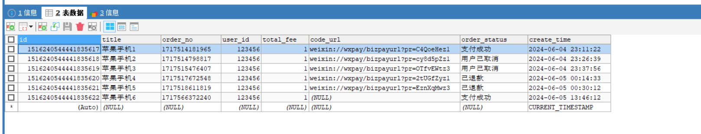

### 1, 支付宝支付_产品介绍


**简介：**

为解决网页、移动、平台商户及线下支付等场景支持用户使用支付宝付款需求，支付宝提供了如下支付能力供商家快速集成。

| 能力名称                                                     | 应用场景                                                     | 支持账户类型             |
| ------------------------------------------------------------ | ------------------------------------------------------------ | ------------------------ |
| [当面付](https://opendocs.alipay.com/open/194/105072)        | 超市、餐馆线下交易场景，商家可生成订单二维码供用户扫码支付；也可扫描用户二维码完成收款。 | 企业支付宝账户个体工商户 |
| [App 支付](https://opendocs.alipay.com/open/204/105051)      | 支付宝为商家提供了客户端&服务端 SDK，帮助商家快速在自有 App 中集成支付宝支付功能。 | 企业支付宝账户个体工商户 |
| [手机网站支付](https://opendocs.alipay.com/open/203/105288)  | 为商家移动端网页应用提供集成支付宝支付功能接口。             | 企业支付宝账户个体工商户 |
| [电脑网站支付](https://opendocs.alipay.com/open/270/105898)  | 为商家 PC 端网页应用提供集成支付宝支付功能接口。             | 企业支付宝账户个体工商户 |
| [刷脸付](https://opendocs.alipay.com/open/20180402104715814204/intro) | 商场、无人售货等线下自助支付场景，用户可通过刷脸操作使用支付宝付款。 | 企业支付宝账户个体工商户 |
| [互联网平台直付通](https://opendocs.alipay.com/open/00faww)  | 集支付、结算、分账等功能为一体的直付通能力，可帮助电商、互娱平台解决可能存在的合规问题。 | 企业支付宝账户           |
| [支付宝预授权](https://opendocs.alipay.com/open/20180417160701241302/intro) | 租车、充电宝、酒店预订等需要用户在服务前做一笔预授权，商家在服务完结时从预授权资金中扣除消费金额场景，可通过支付宝预授权能力实现。 | 企业支付宝账户           |
| [新当面资金授权](https://opendocs.alipay.com/open/318/106376) | 酒店、景区等线下需要提前缴纳一定的押金，消费结束进行结算时，再根据实际消费情况从押金中扣除消费金额的消费场景，可通过新当面资金授权能力实现。 | 企业支付宝账户           |
| [周期扣款](https://opendocs.alipay.com/open/20190319114403226822/intro) | 会员收费、话费定时充值等周期定额扣款场景，可通过周期扣款能力进行代扣订单创建及扣款，无需用户重复确认及输入支付密码。 | 企业支付宝账户           |


如：https://open.alipay.com/api#openapi


### 2, 支付宝支付_开发者入驻


**创建应用:**
登录 支付宝开放平台，创建应用并提交审核，审核通过后会生成应用唯一标识 APPID，并且可以申请开通开放产品使用权限。通过 APPID 应用才能调用开放产品的接口能力。


第一步：


第二步：


第三步：


第四步：


第五步：


第六步：提交审核。


第七步：签约，电脑支付，提交商家或企业相关资料。


### 3, 支付宝支付_沙箱环境介绍


**简介：**

沙箱环境 (Beta) 是支付宝开放平台为开发者提供的与线上环境完全隔离的联调测试环境，在沙箱环境中完成的调用不会对线上数据造成任何影响，尤其适合涉及资金链路的能力的调试。


**注意：**

- 由于沙箱为模拟环境，在沙箱完成接口开发及主要功能调试后，请务必在正式环境进行完整的功能验收测试。所有返回码及业务逻辑以正式环境为准。
- 为保证沙箱稳定，沙箱环境测试数据会进行定期数据清理。Beta 测试阶段每周日中午 12 点至每周一中午 12 点为维护时间，在此时间内沙箱环境部分功能可能不可用，敬请谅解。
- 请勿在沙箱进行压力测试，以免触发相应的限流措施，导致无法正常使用沙箱环境。


网站：https://open.alipay.com/develop/sandbox/app


**支付宝客户端沙箱版：**


**沙箱应用：**

```
应用信息

基本信息
APPID
9021000137682687

应用名称 sandbox 默认应用:2088721036937545

绑定的商家账号（PID）
2088721036937545
```


**沙箱账号：**

```
沙箱账号

商家信息
商户账号vtibjf3419@sandbox.com
登录密码111111
商户PID2088721036937545
账户余额1000000.00

买家信息
买家账号tiqsej7356@sandbox.com
登录密码111111
支付密码111111
用户UID2088722036937553
用户名称tiqsej7356
证件类型IDENTITY_CARD
证件账号25559619850917858X
账户余额1000000.00
```


### 4, 沙箱环境_配置密钥

在沙箱进行调试前需要确保已经配置密钥/证书用于加签，支付宝提供了 **系统默认密钥** 及 **自定义密钥** 两种方式进行配置。


**设置沙箱应用的公钥和私钥:**

开发者如需使用系统默认密钥/证书，可在 **开发信息** 中选择 **系统默认密钥**。


步骤一：


步骤二：


步骤三：


步骤四：


步骤五：


```
应用公钥：
MIIBIjANBgkqhkiG9w0BAQEFAAOCAQ8AMIIBCgKCAQEAhdHCDdBmcBdGlrvkAStfH+HwFPLjdagZsBkFMkW40Hvrf2zgSVcmMq65JFTU6XisfEe5GmqL7O5ecYjn/B6ni1/ompw4wTXosG/05OjpL4jCeRAyZUlg/r+TmKwSBR/XWpZ/TOosEs0JvKru90G4/SvfVJFPBQ+R/ix7UijKgYlub0pblhfxTQUUvhd6LdOeJ6Oqcx5QOkWasIid8rvUlMflwbqGZDcUhNmloZqRvsA9X/AEAu8snkb58oDF850bypnpFt0Q+VyXqHG7YVLTwpKeT36/FMLZ6cqlYJOI9n0ovtd/OcNlxDgpk79AgaZwBTmAwiMHfk9R4nno3WTV2QIDAQAB

应用私钥：
MIIEvQIBADANBgkqhkiG9w0BAQEFAASCBKcwggSjAgEAAoIBAQCF0cIN0GZwF0aWu+QBK18f4fAU8uN1qBmwGQUyRbjQe+t/bOBJVyYyrrkkVNTpeKx8R7kaaovs7l5xiOf8HqeLX+ianDjBNeiwb/Tk6OkviMJ5EDJlSWD+v5OYrBIFH9daln9M6iwSzQm8qu73Qbj9K99UkU8FD5H+LHtSKMqBiW5vSluWF/FNBRS+F3ot054no6pzHlA6RZqwiJ3yu9SUx+XBuoZkNxSE2aWhmpG+wD1f8AQC7yyeRvnygMXznRvKmekW3RD5XJeocbthUtPCkp5Pfr8UwtnpyqVgk4j2fSi+1385w2XEOCmTv0CBpnAFOYDCIwd+T1HieejdZNXZAgMBAAECggEAczDymC2SYF7I1qv6Qr9w7OLyZTYHcpo3Moz3GiVGR8DEITY5gyhPq0UX/hxAApFr+LdMsV6SAGvYRGcTOsWwd5shgSWE/VxIZsiYyAtt3wscTFYS63lU0zVZ+gv0nxCfskzmW/Ef6zcwcIW7mn+qm9QONJ+4o6SZiXAE395ZI1NF7YzHs9nqE4Ug7l3guFqwsf25TYS7DZy4McOGHTmO3R7LUTofi/4Ff4epNRzbu0N9P7RJQy0vGLb4A6oH9zQc7tF9etRTAXgMtHN0vNycV5/IdHgVPFOmqRuS07H/0UOVGxxFz3+gKIi/hEmSupksV8bO4vsXiGE78o9WihY/GQKBgQDWdf1qKfLTTXLo6J074kCPcvhCGFJUg32bPqiexkPgg5v0xm8x1C2JfX8Rl4Kb+P3ZsvGusnlGrtoeTCJjfQ0fGtEw+GCIXcvtEACJaKCT1R+KGj5736I2GCmyCzksfK7h7ZvnLfxq4mgBQbzrXvOp3O0i2IVVD1hmxiupVGPplwKBgQCfvSuhG7CqmkMJoTA5v0i0PEcWXiChWqnNvBRmmQHQVS2JZApH5HGd/XJoavV6Nuth2u2TNFCIM4U2y30EWdismRDFNHNgfmZfX5BK3WY8GLQ7xKL0JY781JrAh9Zyfze3lu7Ts7e7+i1rd5rkOSSksylLi09TUmZNwYYosa/KDwKBgFjK1TclUxJFWLQxyxfGHzDFSyAibcPsBQ9HrAzAzc2g7+syVUtuK8RnHzsrXboyJvgBbKsF3cx0DH7KytoiJlKgicgare0H2Ky4GWDK3uEWNk65evFSsBhxfKHon61ZmhaUiB35Hi8quiD7FLrmvz+u5sesmdeT2OgEWINtG0jVAoGAOXnaofyRo8Efz+40qQKfyWJK/cxel1BE+ubqvEPfuDN90Aqz/ExBaWSRburVauUp6qrYgvf25hsLmry7Pf6KDQiCVULbJOQ2N6juBVIGgCcvarYFIC4HdgeVqyL1UXte8+sWAgyPVs7c2udNT0MUYUKp4Cm/IC7s6ptwh2Hv65cCgYEAiQXloKq333I8MoWOSZvMqC4IRCAm17sBQ/4ocmjFolnGNRaZbjn8YZLGddyW2sMrdvGFmUo1Zqo6vXQuZI1Y+EmbIcSMFDBiTVkeSR8PBYAseNw1cbyT+6AQi3/uzLJ/6Ecpu/bEYpu9ISg1ku7Ge2NdOqztEJ/F7XWLf52wbwo=

支付宝公钥：
MIIBIjANBgkqhkiG9w0BAQEFAAOCAQ8AMIIBCgKCAQEArm2c71715MpHRJh2WoW8VYRUVOMr57vdw8v0gbp3k1Bdie+4TEj8ADqCDVyFCl3jf4QLA3lXntvq/Acw9Bc/vCEHeMKWRYAV42nBQJwiCQH4yq2Ur+0T7TbBmgSsxK7A7CrHaVlZ17en4IIgTWOLRZImoNFfh3YZP6pYwgkg0AHaxByJXl+b3AHmZeo4kgp5PsEewbsN4m2jEvsBJRgVqUt63ia/Pu8pM0C3SlRNy9ss05VqYdUNwIx/By6Tk2inBkFoJRCXFRwFjlVcVqR6tMTIy4Zn67N5KCopBOvofgJJXnu9FCt89dRmw3bDzUQVjK6o9uNUAhnglJLpEgSUdwIDAQAB

APPID：
9021000137682687
```


### 5, 支付宝引入支付参数


打开项目，配置：


```properties
#APPid
alipay.app-id=9021000137682687
#应用私钥
alipay.private-key=MIIEvQIBADANBgkqhkiG9w0BAQEFAASCBKcwggSjAgEAAoIBAQCF0cIN0GZwF0aWu+QBK18f4fAU8uN1qBmwGQUyRbjQe+t/bOBJVyYyrrkkVNTpeKx8R7kaaovs7l5xiOf8HqeLX+ianDjBNeiwb/Tk6OkviMJ5EDJlSWD+v5OYrBIFH9daln9M6iwSzQm8qu73Qbj9K99UkU8FD5H+LHtSKMqBiW5vSluWF/FNBRS+F3ot054no6pzHlA6RZqwiJ3yu9SUx+XBuoZkNxSE2aWhmpG+wD1f8AQC7yyeRvnygMXznRvKmekW3RD5XJeocbthUtPCkp5Pfr8UwtnpyqVgk4j2fSi+1385w2XEOCmTv0CBpnAFOYDCIwd+T1HieejdZNXZAgMBAAECggEAczDymC2SYF7I1qv6Qr9w7OLyZTYHcpo3Moz3GiVGR8DEITY5gyhPq0UX/hxAApFr+LdMsV6SAGvYRGcTOsWwd5shgSWE/VxIZsiYyAtt3wscTFYS63lU0zVZ+gv0nxCfskzmW/Ef6zcwcIW7mn+qm9QONJ+4o6SZiXAE395ZI1NF7YzHs9nqE4Ug7l3guFqwsf25TYS7DZy4McOGHTmO3R7LUTofi/4Ff4epNRzbu0N9P7RJQy0vGLb4A6oH9zQc7tF9etRTAXgMtHN0vNycV5/IdHgVPFOmqRuS07H/0UOVGxxFz3+gKIi/hEmSupksV8bO4vsXiGE78o9WihY/GQKBgQDWdf1qKfLTTXLo6J074kCPcvhCGFJUg32bPqiexkPgg5v0xm8x1C2JfX8Rl4Kb+P3ZsvGusnlGrtoeTCJjfQ0fGtEw+GCIXcvtEACJaKCT1R+KGj5736I2GCmyCzksfK7h7ZvnLfxq4mgBQbzrXvOp3O0i2IVVD1hmxiupVGPplwKBgQCfvSuhG7CqmkMJoTA5v0i0PEcWXiChWqnNvBRmmQHQVS2JZApH5HGd/XJoavV6Nuth2u2TNFCIM4U2y30EWdismRDFNHNgfmZfX5BK3WY8GLQ7xKL0JY781JrAh9Zyfze3lu7Ts7e7+i1rd5rkOSSksylLi09TUmZNwYYosa/KDwKBgFjK1TclUxJFWLQxyxfGHzDFSyAibcPsBQ9HrAzAzc2g7+syVUtuK8RnHzsrXboyJvgBbKsF3cx0DH7KytoiJlKgicgare0H2Ky4GWDK3uEWNk65evFSsBhxfKHon61ZmhaUiB35Hi8quiD7FLrmvz+u5sesmdeT2OgEWINtG0jVAoGAOXnaofyRo8Efz+40qQKfyWJK/cxel1BE+ubqvEPfuDN90Aqz/ExBaWSRburVauUp6qrYgvf25hsLmry7Pf6KDQiCVULbJOQ2N6juBVIGgCcvarYFIC4HdgeVqyL1UXte8+sWAgyPVs7c2udNT0MUYUKp4Cm/IC7s6ptwh2Hv65cCgYEAiQXloKq333I8MoWOSZvMqC4IRCAm17sBQ/4ocmjFolnGNRaZbjn8YZLGddyW2sMrdvGFmUo1Zqo6vXQuZI1Y+EmbIcSMFDBiTVkeSR8PBYAseNw1cbyT+6AQi3/uzLJ/6Ecpu/bEYpu9ISg1ku7Ge2NdOqztEJ/F7XWLf52wbwo=
#支付宝公钥
alipay.public-key=MIIBIjANBgkqhkiG9w0BAQEFAAOCAQ8AMIIBCgKCAQEArm2c71715MpHRJh2WoW8VYRUVOMr57vdw8v0gbp3k1Bdie+4TEj8ADqCDVyFCl3jf4QLA3lXntvq/Acw9Bc/vCEHeMKWRYAV42nBQJwiCQH4yq2Ur+0T7TbBmgSsxK7A7CrHaVlZ17en4IIgTWOLRZImoNFfh3YZP6pYwgkg0AHaxByJXl+b3AHmZeo4kgp5PsEewbsN4m2jEvsBJRgVqUt63ia/Pu8pM0C3SlRNy9ss05VqYdUNwIx/By6Tk2inBkFoJRCXFRwFjlVcVqR6tMTIy4Zn67N5KCopBOvofgJJXnu9FCt89dRmw3bDzUQVjK6o9uNUAhnglJLpEgSUdwIDAQAB
#网关
alipay.gateway=https://openapi-sandbox.dl.alipaydev.com/gateway.do
#回调地址
alipay.notify_url=http://ityls.natapp1.cc
```


依赖：


```xml
        <!--   支付宝 SDK     -->
        <dependency>
            <groupId>com.alipay.sdk</groupId>
            <artifactId>alipay-sdk-java</artifactId>
            <version>4.22.86.ALL</version>
        </dependency>
```


配置类：


```java
package com.ityls.config;

import com.alipay.api.AlipayClient;
import com.alipay.api.DefaultAlipayClient;
import lombok.Data;
import org.springframework.boot.context.properties.ConfigurationProperties;
import org.springframework.context.annotation.Bean;
import org.springframework.context.annotation.Configuration;
import org.springframework.context.annotation.PropertySource;

/**
 * 读取支付宝配置
 */
@Data
@Configuration
@PropertySource("classpath:zfbpay.properties")
@ConfigurationProperties(prefix = "alipay")
public class ZfbPayConfig {

    // 应用id
    private  String appId;
    // 应用私钥
    private  String privateKey;
    // 支付宝公钥
    private  String publicKey;
    // 网关
    private  String gateway;
    // 回调地址
    private  String notify_url;

    /**
     * 设置支付宝客户端
     */
    @Bean
    public AlipayClient setAlipayClient(){
        //  网关  appid  应用私钥  格式  编码格式  支付宝公钥  加密算法
        return  new DefaultAlipayClient(gateway,appId,privateKey,"json","UTF-8",publicKey,"RSA2");
    }
}
```


测试：


```java
package com.ityls.controller;


import com.ityls.config.WxPayConfig;
import com.ityls.config.ZfbPayConfig;
import com.ityls.vo.BaseResult;
import org.springframework.beans.factory.annotation.Autowired;
import org.springframework.web.bind.annotation.GetMapping;
import org.springframework.web.bind.annotation.RestController;

@RestController
public class TestController {
    @Autowired
    private WxPayConfig wxPayConfig;

    @GetMapping("/test")
    public BaseResult test(){
        return BaseResult.ok("hello ityls");
    }

    @Autowired
    private ZfbPayConfig zfbPayConfig;

    /**
     * 测试微信配置文件
     * @return
     */
    @GetMapping("/getWxConfig")
    public BaseResult getWxConfig(){
        // 获取商户ID
        return BaseResult.ok(wxPayConfig.getMchId());
    }

    /**
     * 测试支付宝配置文件
     * @return
     */
    @GetMapping("/getZfbConfig")
    public BaseResult getZfbConfig(){
        // 获取商户ID
        return BaseResult.ok(zfbPayConfig.getAppId());
    }
}

```


测试：


### 6, 当面付_支付流程

流程：


### 7, 当面付_统一收单下单


枚举：


```java
package com.ityls.enums.zfb;

import lombok.AllArgsConstructor;
import lombok.Getter;

@Getter
@AllArgsConstructor
public enum ZfbNotifyType {
    /**
     * 支付通知
     */
    PC_NOTIFY("/api/zfb-pay/pcPay/notify"),
    /**
     * 退款结果通知
     */
    REFUND_NOTIFY("/api/zfb-pay/refunds/notify");
    /**
     * 类型
     */
    private final String type;
}
```


接口：


```java
package com.ityls.service;

import com.alipay.api.AlipayApiException;
import com.ityls.vo.BaseResult;

import javax.servlet.http.HttpServletRequest;

/**
 * 支付宝接口
 */
public interface IZfbPayService {


    /**
     * 统一下单
     * @param orderNo
     * @return
     */
    BaseResult pcPay(String orderNo);


    /**
     * 修改订单状态
     * @param request
     */
    void updateOrderStatus(HttpServletRequest request);


    /**
     * 支付宝退款
     * @param orderNo
     * @param reason
     */
    void refund(String orderNo,String reason);


    /**
     * 根据订单编号查询交易状态
     * @param orderNo
     * @return
     */
    String queryPayStauts(String orderNo) throws Exception;

}
```


实现类：


```java
package com.ityls.service.impl;

import com.alibaba.fastjson.JSON;
import com.alibaba.fastjson.JSONObject;
import com.alipay.api.AlipayApiException;
import com.alipay.api.AlipayClient;
import com.alipay.api.request.AlipayTradeCreateRequest;
import com.alipay.api.request.AlipayTradePrecreateRequest;
import com.alipay.api.request.AlipayTradeQueryRequest;
import com.alipay.api.request.AlipayTradeRefundRequest;
import com.alipay.api.response.AlipayTradeCreateResponse;
import com.alipay.api.response.AlipayTradePrecreateResponse;
import com.alipay.api.response.AlipayTradeQueryResponse;
import com.alipay.api.response.AlipayTradeRefundResponse;
import com.ityls.config.ZfbPayConfig;
import com.ityls.entity.OrderInfo;
import com.ityls.entity.PaymentInfo;
import com.ityls.entity.RefundInfo;
import com.ityls.enums.OrderStatus;
import com.ityls.enums.PayType;
import com.ityls.enums.zfb.ZfbNotifyType;
import com.ityls.service.IOrderInfoService;
import com.ityls.service.IPaymentInfoService;
import com.ityls.service.IRefundInfoService;
import com.ityls.service.IZfbPayService;
import com.ityls.vo.BaseResult;
import com.ityls.vo.CodeEnum;
import com.ityls.vo.PayInfoVO;
import lombok.extern.slf4j.Slf4j;
import org.springframework.beans.factory.annotation.Autowired;
import org.springframework.stereotype.Service;
import org.springframework.transaction.annotation.Transactional;

import javax.servlet.http.HttpServletRequest;
import java.time.LocalDateTime;

/**
 * 支付宝业务层
 */
@Slf4j
@Service
public class ZfbPayServiceImpl implements IZfbPayService {

    @Autowired
    private IPaymentInfoService iPaymentInfoService; // 交易记录

    @Autowired
    private IRefundInfoService iRefundInfoService; // 退款接口

    @Autowired
    private IOrderInfoService iOrderInfoService; // 订单接口

    @Autowired
    private AlipayClient alipayClient;

    @Autowired
    private ZfbPayConfig zfbPayConfig;

    /**
     * 支付宝支付当面付
     * @param orderNo
     * @return
     */
    @Override
    public BaseResult pcPay(String orderNo) {
        // 1. 根据订单编号查询订单信息
        OrderInfo orderInfo = iOrderInfoService.findByOrderNo(orderNo);
        if (orderInfo == null) {
            return BaseResult.error(CodeEnum.ORDER_ERROR);
        }
        // 2. 封装请求参数
        AlipayTradePrecreateRequest request = new AlipayTradePrecreateRequest();
        request.setNotifyUrl(zfbPayConfig.getNotify_url().concat(ZfbNotifyType.PC_NOTIFY.getType()));// 支付成功回调
        JSONObject bizContent = new JSONObject();
        bizContent.put("out_trade_no", orderInfo.getOrderNo()); //  订单编号
        bizContent.put("total_amount", orderInfo.getTotalFee());// 订单金额
        bizContent.put("subject", orderInfo.getTitle()); // 订单标题
        request.setBizContent(bizContent.toString());
        // 3. 发送请求
        AlipayTradePrecreateResponse response = null;
        // 4. 支付宝二维码
        String qrCode = "";
        try {
            response = alipayClient.execute(request);
            if(!response.isSuccess()){
                throw  new Exception("生成支付宝订单失败" + response.getMsg());
            }
            qrCode = response.getQrCode();

        } catch (Exception e) {
            e.printStackTrace();
        }
        PayInfoVO payInfoVO = new PayInfoVO();
        payInfoVO.setCodeUrl(qrCode);
        payInfoVO.setOrderNo(orderInfo.getOrderNo());
        return BaseResult.ok(payInfoVO);
    }

    /**
     * 修改订单状态
     * @param request
     */
    @Transactional(rollbackFor = Exception.class)
    @Override
    public void updateOrderStatus(HttpServletRequest request) {

        // 1. 获取订单状态
        String tradeStatus = request.getParameter("trade_status");
        if (tradeStatus.equals("TRADE_SUCCESS")){
            // 2. 获取订单编号
            String orderNo = request.getParameter("out_trade_no");
            OrderInfo orderInfo = iOrderInfoService.findByOrderNo(orderNo);
            if (!OrderStatus.NOTPAY.getType().equals(orderInfo.getOrderStatus())) {
                return;
            }
            // 3. 修改订单状态
            iOrderInfoService.updateOrderStatus(orderNo, OrderStatus.SUCCESS);
            // 4. 添加交易记录
            PaymentInfo paymentInfo = new PaymentInfo();
            paymentInfo.setOrderNo(orderNo);// 订单编号
            String tradeNo = request.getParameter("trade_no");// 获取交易记录号
            paymentInfo.setTransactionId(tradeNo);// 交易号
            paymentInfo.setPaymentType(PayType.ALIPAY.getType());// 支付类型
            paymentInfo.setTradeType("当面付");
            paymentInfo.setTradeState(tradeStatus);// 交易状态
            paymentInfo.setPayerTotal(orderInfo.getTotalFee());
            paymentInfo.setContent(JSON.toJSONString(request.getParameterMap()));
            paymentInfo.setCreateTime(LocalDateTime.now());
            iPaymentInfoService.save(paymentInfo);
        }
    }

    /**
     * 退款
     * @param orderNo 订单编号
     * @param reason 退款理由
     */
    @Override
    public void refund(String orderNo, String reason) {
        log.info("************  支付宝退款**********");
        // 1. 根据订单编号创建退款单
        RefundInfo refundInfo = iRefundInfoService.createRefundsByOrderNo(orderNo, reason);
        // 2. 封装参数
        AlipayTradeRefundRequest request = new AlipayTradeRefundRequest();
        JSONObject bizContent = new JSONObject();
        bizContent.put("out_trade_no", orderNo);//订单编号
        bizContent.put("refund_amount", refundInfo.getRefund()); // 退款金额
        // 3. 转json存入request
        request.setBizContent(bizContent.toString());
        //4. 发送请求
        AlipayTradeRefundResponse response = null;
        try {
            response = alipayClient.execute(request);
            if(response.isSuccess()){
                // 5. 修改订单状态
                iOrderInfoService.updateOrderStatus(orderNo,OrderStatus.REFUND_SUCCESS);
                // 6. 退款单状态
                // iRefundInfoService.updateRefundAliPayStatus(orderNo);

            } else {
               log.error("******* 调用失败 =>{}",response.getSubMsg());
            }
        } catch (AlipayApiException e) {
            e.printStackTrace();
        }
    }


    /**
     * 根据订单编号查询交易状态
     * @param orderNo 订单编号
     * @return
     */
    @Override
    public String queryPayStauts(String orderNo) throws Exception {
        log.info(" **************  统一交易状态查询 **********");
        // 1. 组装参数
        AlipayTradeQueryRequest request = new AlipayTradeQueryRequest();
        JSONObject bizContent = new JSONObject();
        bizContent.put("out_trade_no", orderNo);//订单编号
        request.setBizContent(bizContent.toString());
        AlipayTradeQueryResponse response = alipayClient.execute(request);
        if(response.isSuccess()){
            log.info("**** 查询交易状态调用成功={}",response.getBody());
            return response.getBody();
        } else {
            String body = response.getBody();
            log.error("调用失败=>{}",body);
            throw  new Exception("查询交易记录失败");
        }
    }


}
```


更新退款单状态，接口：


```java
    /**
     * 修改订单状态
     * @param orderNo 订单编号
     */
    void  updateRefundAliPayStatus(String orderNo);
```


实现类：


```java
    /**
     * 修改订单状态
     * @param orderNo 订单编号
     */
    @Override
    public void updateRefundAliPayStatus(String orderNo) {
        LambdaUpdateWrapper<RefundInfo> refundInfoLambd = new LambdaUpdateWrapper<>();
        refundInfoLambd.set(RefundInfo::getRefundStatus, OrderStatus.REFUND_SUCCESS.getType());
        refundInfoLambd.eq(RefundInfo::getOrderNo,orderNo);
        baseMapper.update(null,refundInfoLambd);
    }
```


使用：


验证：


```java
package com.ityls.utils;

import com.alipay.api.AlipayApiException;
import com.alipay.api.internal.util.AlipaySignature;

import javax.servlet.http.HttpServletRequest;
import java.util.HashMap;
import java.util.Map;

public class ZfbVerifierUtils {


    /**
     * 验证支付宝异步通知签名合法性
     * @param request 支付宝发送的请求
     * @param alipayPublicKey 支付宝公钥
     * @return
     */
    public static boolean isVaild(HttpServletRequest request,String alipayPublicKey){

        // 1. 获取支付宝post发送过来的信息
        Map<String,String> resutlMap = new HashMap<>();
        Map<String, String[]> requestParameterMap = request.getParameterMap();
        for (Object v: requestParameterMap.entrySet()){
            Map.Entry<String,String[]> item =  (Map.Entry<String,String[]>)v;
            resutlMap.put(item.getKey(),item.getValue()[0]);
        }
        try {
            return AlipaySignature.rsaCheckV1(resutlMap,alipayPublicKey,"UTF-8","RSA2");
        } catch (AlipayApiException e) {
            e.printStackTrace();
        }
        return  false;
    }

}
```


控制层：


```java
package com.ityls.controller;

import com.ityls.config.ZfbPayConfig;
import com.ityls.service.IZfbPayService;
import com.ityls.utils.ZfbVerifierUtils;
import com.ityls.vo.BaseResult;
// import com.sun.scenario.effect.impl.sw.sse.SSEBlend_SRC_OUTPeer;
import lombok.extern.slf4j.Slf4j;
import org.springframework.beans.factory.annotation.Autowired;
import org.springframework.web.bind.annotation.*;

import javax.servlet.http.HttpServletRequest;
import java.io.IOException;

/**
 * 支付宝接口
 */

@Slf4j
@RestController
@RequestMapping("/api/zfb-pay")
public class ZfbPayController {

    @Autowired
    private IZfbPayService iZfbPayService;

    @Autowired
    private ZfbPayConfig zfbPayConfig;


    /**
     * 支付宝支付
     * @param orderNo
     * @return
     * @throws Exception
     */
    @PostMapping("/pcPay/{orderNo}")
    public BaseResult nativePay(@PathVariable String orderNo) throws Exception {
        BaseResult baseResult = iZfbPayService.pcPay(orderNo);
        return baseResult;
    }


    /**
     * 支付成功后回调
     * @return
     * @throws Exception
     */
    @PostMapping("/pcPay/notify")
    public String  pcPaynotify(HttpServletRequest request) throws Exception {

        // 1. 验签
        boolean vaild = ZfbVerifierUtils.isVaild(request, zfbPayConfig.getPublicKey());
        if (vaild){
            iZfbPayService.updateOrderStatus(request);
        }else {
            log.info("支付宝验签失败");
            return "fail";
        }
        return "success";
    }


    /**
     * 申请退款
     *
     * @param orderNo 订单编号
     * @param reason  退款理由
     * @return
     */
    @PostMapping("/refund/{orderNo}/{reason}")
    public BaseResult refund(@PathVariable String orderNo, @PathVariable String reason) throws IOException {
        iZfbPayService.refund(orderNo,reason);
        return BaseResult.ok();
    }


    /**
     * 查询订单
     *
     * @param orderNo
     * @return
     */
    @GetMapping("/queryOrder/{orderNo}")
    public BaseResult queryOrder(@PathVariable String orderNo) throws Exception {
        return BaseResult.ok(iZfbPayService.queryPayStauts(orderNo));
    }

}

```


测试：


使用沙箱版的支付宝扫描：





### 8, 当面付_支付完成接收回调请求


参考上面代码。上面已实现。


### 9, 当面付_异步通知验签

参考上面代码。上面已实现。


### 10, 当面付_修改订单状态


参考上面的代码。


### 11, 支付宝退款接口_统一收单交易退款节接口


当交易发生之后一段时间内，由于买家或者卖家的原因需要退款时，卖家可以通过退款接口将支付款退还给买家，支付宝将在收到退款请求并且验证成功之后，按照退款规则将支付款按原路退到买家帐号上。


注意：

- 同一笔交易的退款至少间隔3s后发起
- 当前接口与PC退款、批量退款等其他退款产品无幂等关系，当商户侧同一笔退款请求已使用了当前接口申请退款的情况下，【不要使用其他退款产品再次进行退款】，可能造成【重复退款】。


测试：


### 12, 当面付_交易状态查询

该接口提供所有支付宝支付订单的查询，商户可以通过该接口主动查询订单状态，完成下一步的业务逻辑。


### 13, 前端


